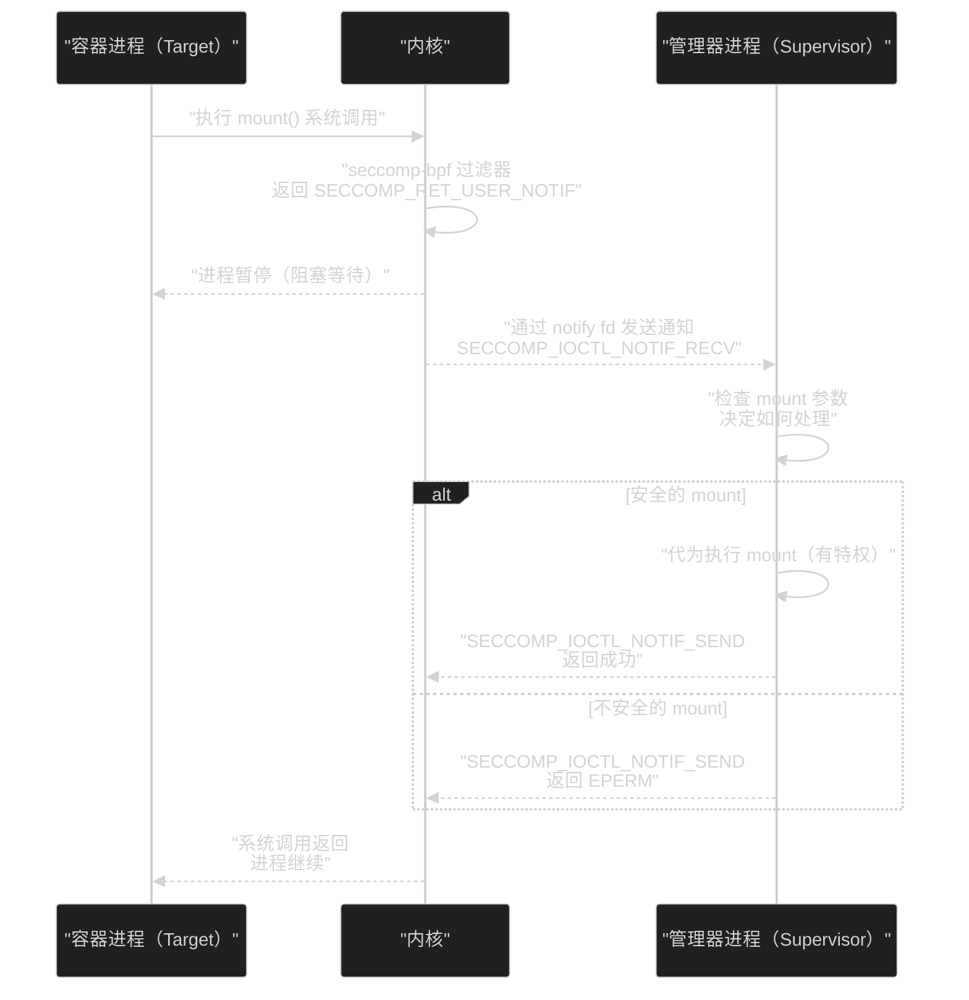

# 04 seccomp 与 capabilities——系统调用过滤与权限分权

> [!abstract] 摘要
> 本文完成容器隔离三重机制的最后一层——seccomp（系统调用过滤）和 capabilities（权限分权）。前两篇覆盖了 namespace（视图隔离）和 cgroups（资源限制），本文解决"进程能做什么操作"的问题。文章从 seccomp 的两种模式出发——strict mode（只允许 5 个系统调用）和 filter mode（seccomp-bpf，用 BPF 程序过滤系统调用）；深入 Docker 默认 seccomp profile 的设计（44 个被阻止的系统调用及其阻止原因，包括 bpf/ptrace/mount/keyctl 等）；剖析 seccomp notifier（SECCOMP_RET_USER_NOTIF）如何让用户空间参与系统调用决策——容器管理器可以拦截 mount/mknod 等系统调用并在用户空间"模拟"执行，为无特权容器提供特权操作的虚拟化；然后转向 capabilities——Linux 把 root 权限分解为约 40 个离散能力，Docker 默认保留 14 个、drop 其余；深入分析为什么 CAP_SYS_ADMIN 被称为"新 root"——它如此宽泛以至于拥有它的容器几乎可以逃逸；讨论 capabilities 的五种能力集合（Permitted/Effective/Inheritable/Ambient/Bounding）如何控制权限的继承和传播。核心认知：seccomp 和 capabilities 是容器隔离的"最后一道软件防线"——它们缩小了容器进程在共享内核上能触达的代码路径，但仍然不是"硬隔离"——真正的硬隔离需要 gVisor 或硬件虚拟化。

---

## 第 1 章 seccomp——从"只允许 5 个调用"到"BPF 过滤"

### 1.1 seccomp 的两种模式

seccomp（Secure Computing Mode）是 Linux 内核提供的系统调用过滤机制，有两种模式：

**Strict Mode（SECCOMP_SET_MODE_STRICT）**：最严格的模式——只允许 5 个系统调用：`read`、`write`、`exit`、`sigreturn`、以及 `u{,ret}probe`。任何其他系统调用都会导致进程被 SIGKILL。这个模式极其安全但也极其限制——大部分应用都无法在这种模式下运行（连 `open` 都不能调用，怎么读文件？）。它适用于"只需要做计算不需要 I/O"的极少数场景。

**Filter Mode（seccomp-bpf，SECCOMP_SET_MODE_FILTER）**：实用模式——用 BPF（Berkeley Packet Filter）程序过滤系统调用。BPF 程序可以检查系统调用号、参数、架构等信息，决定允许、拒绝、记录或交给用户空间处理。这是 Docker、Kubernetes 和所有现代容器运行时使用的模式。

### 1.2 seccomp-bpf 的工作机制

seccomp-bpf 的核心是：**在每个系统调用进入内核处理前，先执行一个 BPF 程序做过滤决策**。

```
容器进程 → syscall(nr, args) → seccomp-bpf 过滤器 → 决策 → 内核处理
                                    ↓
                            ┌───────┴───────┐
                            │               │
                        SCMP_ACT_ALLOW   SCMP_ACT_ERRNO  ...
                        允许进入内核       返回 EPERM
```

BPF 程序接收 `struct seccomp_data` 作为输入，包含：
- `nr`：系统调用号
- `arch`：架构（x86_64/arm64 等）
- `args[6]`：系统调用参数（最多 6 个）

BPF 程序根据这些信息返回决策：
- `SCMP_ACT_ALLOW`：允许系统调用进入内核
- `SCMP_ACT_ERRNO`：返回错误码（默认 EPERM）
- `SCMP_ACT_KILL_PROCESS`：杀死进程
- `SCMP_ACT_LOG`：允许但记录日志
- `SCMP_ACT_USER_NOTIF`：交给用户空间处理（seccomp notifier，本章第 3 节详述）

**关键特性——子进程继承**：seccomp 过滤器一旦安装，对当前进程和所有后代进程生效——`fork`/`clone`/`execve` 创建的子进程继承相同的 seccomp 过滤器。这意味着容器进程无法通过"fork 一个子进程然后 execve 一个没有 seccomp 的程序"来逃逸过滤——子进程的 seccomp 过滤器不会因 execve 而移除。

**PR_SET_NO_NEW_PRIVS**：安装 seccomp 过滤器前，进程必须调用 `prctl(PR_SET_NO_NEW_PRIVS, 1)`——这个标志确保进程及其子进程不能通过 `execve` 获取新特权（如 setuid 程序）。这是一个安全前提——如果没有这个限制，一个有 seccomp 过滤器的进程可以 execve 一个 setuid-root 程序，利用 setuid 程序的特权绕过 seccomp 限制。

> [!info] 核心概念：seccomp-bpf 是"系统调用防火墙"
> seccomp-bpf 的本质是"系统调用防火墙"——就像网络防火墙过滤数据包一样，seccomp-bpf 过滤系统调用。网络防火墙可以根据源/目的地址、端口、协议决定允许或拒绝数据包；seccomp-bpf 可以根据系统调用号、参数、架构决定允许或拒绝系统调用。这种类比不仅概念上清晰，技术上也很接近——seccomp-bpf 使用的 BPF 程序与网络防火墙使用的 cBPF 程序来自同一族技术。理解这一点有助于把握 seccomp 的定位——它是"在系统调用入口处的过滤层"，在内核处理系统调用之前做决策，减少内核攻击面的暴露。

---

## 第 2 章 Docker 默认 seccomp profile

### 2.1 白名单策略

Docker 的默认 seccomp profile 采用**白名单策略**——默认拒绝（`defaultAction: SCMP_ACT_ERRNO`），然后显式允许特定系统调用。这种策略比黑名单（默认允许，拒绝特定调用）更安全——因为新添加到 Linux 内核的系统调用默认被拒绝，不会被意外允许。

Docker 默认 profile 阻止约 44 个系统调用（在 300+ 个中），阻止的原则是"危险且非必要"——这些系统调用要么可以直接用于容器逃逸，要么在容器场景中几乎不需要。

### 2.2 被阻止的重要系统调用

| 系统调用 | 阻止原因 | 与 Agent 沙箱的关系 |
| :--- | :--- | :--- |
| `bpf` | 防止加载持久化 BPF 程序到内核（已被 CAP_SYS_ADMIN 限制） | 防止 Agent 代码加载恶意 BPF 程序 |
| `ptrace` | 防止调试/检查任意进程——可读取进程内存中的秘密 | 防止 Agent 读取其他进程的内存（API Key 等） |
| `mount` | 防止挂载文件系统——可用于挂载宿主机文件系统逃逸 | 防止 Agent 挂载宿主机文件系统 |
| `umount` | 防止卸载文件系统 | 同上 |
| `reboot` | 防止重启系统 | 防止 Agent 重启宿主机 |
| `keyctl` / `add_key` / `request_key` | 防止操作内核密钥管理 | 防止 Agent 窃取内核密钥环中的密钥 |
| `kexec_load` / `kexec_file_load` | 防止加载新内核 | 防止 Agent 替换宿主机内核 |
| `iopl` / `ioperm` | 防止直接 I/O 端口访问 | 防止 Agent 直接操作硬件 |
| `init_module` / `finit_module` / `delete_module` | 防止加载/卸载内核模块 | 防止 Agent 加载恶意内核模块 |
| `acct` | 防止配置进程记账 | — |

### 2.3 自定义 seccomp profile 的设计原则

对于 Agent 沙箱，Docker 默认 profile 可能不够严格——它为"广泛兼容性"设计，保留了太多非必需的系统调用。设计 Agent 沙箱的自定义 seccomp profile 时，应遵循以下原则：

**原则一：基于运行时分析做白名单**。不要凭直觉决定哪些系统调用需要——用 `strace` 或 `syscount`（BCC 工具）追踪 Agent 在正常工作负载下实际调用了哪些系统调用，以此为基础构建白名单。这避免了"遗漏必需调用导致 Agent 崩溃"和"保留不必要的调用扩大攻击面"两个极端。

**原则二：按 Agent 类型差异化**。不同类型的 Agent 需要不同的系统调用集——一个只做 Python 代码执行的 Agent 不需要 `socket`（如果网络通过代理），但一个需要访问 Web API 的 Agent 必须有 `socket`/`connect`。为每种 Agent 类型定制 profile，而非用一个"通用"profile 覆盖所有。

**原则三：考虑系统调用的参数级过滤**。seccomp-bpf 不仅能过滤系统调用号，还能过滤参数。如 `clone` 系统调用可以按 flags 过滤——允许 `CLONE_NEWPID | CLONE_NEWNS`（创建新 PID 和 mount namespace）但禁止 `CLONE_NEWUSER`（如果不需要 user namespace）。这种参数级过滤比"全允许或全禁止"更精细。

**原则四：定期审查和更新**。Linux 内核不断添加新的系统调用（如 `io_uring` 系列、`clone3`、`openat2` 等）——新的系统调用可能引入新的攻击面。定期审查 seccomp profile，确保新系统调用默认被拒绝（白名单策略天然做到了这一点），并评估是否需要为 Agent 的新功能添加白名单条目。Docker 的默认 profile 也在持续更新——跟踪上游变更，及时同步安全补丁。特别值得注意的是 `io_uring`——Docker 在 2024 年开始在默认 profile 中阻止 `io_uring` 相关系统调用（`io_uring_setup`/`io_uring_enter`/`io_uring_register`），因为 io_uring 子系统频繁出现安全漏洞。如果你的自定义 profile 早于这个变更，可能仍然允许 io_uring——这是一个需要检查的安全隐患。

### 2.4 seccomp 的历史防御案例

seccomp 不只是理论防御——它多次在实际 CVE 中阻止了容器逃逸：

**CVE-2022-0185**：`fsconfig` 整数溢出漏洞，允许容器逃逸。这个漏洞利用 `unshare` 系统调用来创建新的 namespace——但 Docker 的默认 seccomp profile **阻止了 `unshare`**，因此利用被阻断。如果容器禁用了 seccomp（`--security-opt seccomp=unconfined`），这个漏洞就可以被利用。

**CVE-2026-31431**：`ptrace` 相关漏洞——Docker 的默认 seccomp profile 阻止了 `ptrace`，阻断了利用路径。

这些案例证明了一个关键点：**seccomp 是"纵深防御"的重要一层**——即使内核有漏洞，seccomp 可能阻断了利用路径中的某个系统调用，让漏洞无法被利用。

> [!warning] 生产避坑：禁用 seccomp 是极度危险的
> 有些开发者为了"解决兼容性问题"而禁用 seccomp（`--security-opt seccomp=unconfined`）——这是极度危险的。禁用 seccomp 意味着容器进程可以调用所有系统调用——包括 `mount`、`ptrace`、`bpf`、`reboot` 等。对于运行 AI 生成代码的 Agent 沙箱，这等于移除了"系统调用防火墙"——任何内核漏洞都可以被直接利用。如果遇到兼容性问题，正确的做法是**自定义 seccomp profile**——在默认 profile 基础上添加应用需要的额外系统调用，而非完全禁用 seccomp。

---

## 第 3 章 seccomp notifier——用户空间系统调用拦截

### 3.1 SECCOMP_RET_USER_NOTIF 机制

seccomp notifier（`SECCOMP_RET_USER_NOTIF`，Linux 5.0+）是 seccomp 最前沿的特性——它允许 seccomp 过滤器**把系统调用交给用户空间处理**，而非简单地允许或拒绝。

工作机制：



1. 容器进程执行被 `SECCOMP_RET_USER_NOTIF` 标记的系统调用（如 `mount`）
2. 内核暂停容器进程，通过 notify 文件描述符向 supervisor（容器管理器）发送通知
3. Supervisor 用 `SECCOMP_IOCTL_NOTIF_RECV` 读取系统调用信息（调用号、参数、调用者 PID）
4. Supervisor 在用户空间决策：允许、拒绝、或**代为执行**
5. Supervisor 用 `SECCOMP_IOCTL_NOTIF_SEND` 返回决策结果
6. 内核恢复容器进程，返回 supervisor 的决策结果

### 3.2 为什么需要 seccomp notifier

传统 seccomp 只能"允许"或"拒绝"——但这对于某些场景太粗暴。考虑 `mount` 系统调用——在无特权容器（user namespace 内）中，`mount` 通常被拒绝（需要 CAP_SYS_ADMIN）。但有些容器需要做"安全的 mount"——如挂载 procfs、tmpfs。传统 seccomp 要么允许所有 mount（危险），要么拒绝所有 mount（功能受限）。

seccomp notifier 提供了第三条路——把 `mount` 交给 supervisor 处理：supervisor 检查 mount 参数，如果安全（如挂载 tmpfs 到容器内路径），就代为执行（supervisor 有特权）；如果不安全（如尝试挂载宿主机文件系统），就拒绝。

### 3.3 实际应用场景

**LXC 的 syscall 拦截**：LXC 容器管理器使用 seccomp notifier 拦截 `mknod` 系统调用——在 user namespace 中，`mknod` 创建设备文件需要初始 user namespace 的 CAP_MKNOD（容器内没有）。通过 seccomp notifier，LXC 管理器可以拦截 `mknod`，在宿主机上有特权地代为执行，让无特权容器也能创建设备文件。

**Anbox（Android in a Box）**：使用 seccomp notifier "虚拟化"系统调用——拦截 Android 应用对特定系统调用的请求，在用户空间模拟期望的行为，让 Android 应用在容器中运行时"以为"自己在真实的 Android 系统上。

**Agent 沙箱的潜在应用**：Agent 沙箱可以用 seccomp notifier 拦截 Agent 代码的危险系统调用——如拦截 `open("/etc/passwd", ...)` 检查是否在尝试读取敏感文件；拦截 `connect()` 检查是否在连接非授权外网地址（Egress 过滤在系统调用层面的实现）。

### 3.4 嵌套容器的限制

seccomp notifier 有一个当前的限制——**不能嵌套**。一个进程只能有一个带 listener fd 的 seccomp 过滤器——如果外层容器设置了 notifier，内层容器就不能再设置自己的 notifier。这在"容器中运行容器"（如 Docker-in-Docker）场景中是一个限制。Linux Plumbers Conference 2025 上有讨论解决这个限制的方案——`SECCOMP_USER_NOTIF_FLAG_CONTINUE` 机制允许一个 notifier 把系统调用"继续"传递给上层过滤器——但实现仍在进行中。

> [!note] 设计哲学：seccomp notifier 是"系统调用级 RPC"
> seccomp notifier 的设计哲学是"系统调用级 RPC"——容器进程的某个系统调用不直接由内核处理，而是"RPC 调用"给外部的 supervisor 进程处理。这种设计让"无特权容器做特权操作"变得安全——不是给容器特权，而是让有特权的 supervisor 代为执行，且 supervisor 可以审查每次调用的安全性。这与 [[LLM/Coding-Agent运行范式/12 Agent 权限与审批模型——人在环路的工程实践|Coding Agent 专栏第 12 篇]]讨论的"人在环路审批"哲学一致——不是"给 Agent 全部权限"或"拒绝所有操作"，而是"让 Agent 请求操作，由一个有权限的审查者决定是否执行"。

---

## 第 4 章 capabilities——root 权限的分解

### 4.1 为什么需要 capabilities

传统 Unix 的权限模型是二元的——你要么是 root（uid 0，可以做任何事），要么不是 root（受 DAC 权限限制）。这个模型的问题是：很多程序只需要"root 权限的一小部分"——如 `ping` 只需要创建 raw socket（`CAP_NET_RAW`），但传统上必须以 root 运行（或 setuid-root）——这意味着 `ping` 程序拥有全部 root 权限，即使它只需要其中一个。

Linux capabilities 把 root 的全能权限分解为约 40 个离散能力单元——程序可以只拥有它需要的能力，而非全部 root 权限。

### 4.2 Docker 默认的 14 个 capabilities

Docker 默认给容器 14 个 capabilities——这是为"2014 年时代的工作负载兼容性"选择的，并非最小权限原则的产物。

| Capability | 说明 | 实际需要 |
| :--- | :--- | :--- |
| `CAP_CHOWN` | 改变文件所有者 | 常用 |
| `CAP_DAC_OVERRIDE` | 绕过文件读写执行权限检查 | 常用但危险 |
| `CAP_FSETID` | 设置 setuid 位 | 较少需要 |
| `CAP_FOWNER` | 绕过文件所有者检查 | 常用 |
| `CAP_MKNOD` | 创建设备文件 | 很少需要 |
| `CAP_NET_RAW` | 使用 raw socket | ping/tcpdump 需要，Web 服务不需要 |
| `CAP_NET_BIND_SERVICE` | 绑定 1024 以下端口 | 需要绑定 80/443 的服务需要 |
| `CAP_SETGID` | 改变 GID | 常用 |
| `CAP_SETUID` | 改变 UID | 常用 |
| `CAP_SETPCAP` | 转移能力给其他进程 | 很少需要 |
| `CAP_SYS_CHROOT` | 使用 chroot | 很少需要 |
| `CAP_KILL` | 发送信号给不属于自己的进程 | 较少需要 |
| `CAP_AUDIT_WRITE` | 写审计日志 | 很少需要 |
| `CAP_SETFCAP` | 设置文件 capabilities | 很少需要 |

**问题**：大部分 Web 服务和 Agent 沙箱只需要其中 3-5 个（`CHOWN`、`DAC_OVERRIDE`、`FOWNER`、`SETGID`、`SETUID`），但 Docker 默认给了 14 个——多出的能力是"攻击者可以使用的武器"。

> [!warning] 生产避坑：Docker 默认 capabilities 不是最小权限
> Docker 的 14 个默认 capabilities 是为"兼容性"而非"安全性"选择的——大部分容器不需要 `CAP_NET_RAW`（不能 raw socket 的话 ping 会失败，但 Web 服务不需要 ping）、`CAP_MKNOD`（创建设备文件）、`CAP_SYS_CHROOT`（chroot）等。对于 Agent 沙箱，推荐做法是 `--cap-drop=ALL` 然后只 `--cap-add` 应用实际需要的能力。Kubernetes 的 Pod Security Standards 的 Restricted 级别要求 `drop: ["ALL"]`——这是最小权限原则的实践。

### 4.3 CAP_SYS_ADMIN——"新 root"

`CAP_SYS_ADMIN` 是所有 capabilities 中最宽泛的——它授予的操作包括但不限于：mount/umount 文件系统、配置 cgroup、配置 namespace、执行 `pivot_root`、访问 ACPI、配置 BSD 进程记账、执行很多 `ioctl` 操作……

因为 `CAP_SYS_ADMIN` 涵盖如此多的操作，它被称为"新 root"——拥有 `CAP_SYS_ADMIN` 的进程虽然不是 uid 0，但能做的事接近 root。

**CAP_SYS_ADMIN 的容器逃逸路径**：

**路径一：cgroup release_agent 逃逸**（CVE-2022-0492 的经典利用）：拥有 `CAP_SYS_ADMIN` 的容器可以 mount cgroup 文件系统，设置 `release_agent` 为一个攻击者脚本，然后触发 cgroup 释放——宿主机会以 root 执行 `release_agent` 脚本。

**路径二：直接挂载宿主机文件系统**：拥有 `CAP_SYS_ADMIN` 的容器可以 `mount /dev/sda1 /host`——直接挂载宿主机磁盘，然后读写宿主机文件。

**路径三：namespace 操作**：`CAP_SYS_ADMIN` 允许 `setns`——可以加入其他进程的 namespace，包括宿主机进程的 namespace。

Kubernetes 的 Pod Security Standards 明确禁止在非特权 Pod 中添加 `CAP_SYS_ADMIN`——且当容器有 `CAP_SYS_ADMIN` 时，`allowPrivilegeEscalation: false` 设置无效（因为 `CAP_SYS_ADMIN` 本身就允许权限升级）。

### 4.4 五种能力集合

Linux capabilities 有五种能力集合，控制权限的继承和传播：

| 集合 | 作用 |
| :--- | :--- |
| **Permitted** | 进程能使用的最大能力范围——其他集合的能力不能超过 Permitted 的限制 |
| **Effective** | 当前激活的能力——内核检查时实际使用的能力集 |
| **Inheritable** | execve 时可以继承的能力——跨程序执行时保持的能力 |
| **Ambient** | 非 root 进程在 execve 后自动拥有的能力——不需要文件 capabilities |
| **Bounding** | 能力的硬上限——execve 后 Permitted 不能超过 Bounding |

**关键交互**：
- `execve` 一个程序时，新程序的能力由 Inheritable + 文件 capabilities + Ambient 集合决定，但受 Bounding 限制
- `PR_SET_NO_NEW_PRIVS`（seccomp 安装前必须设置的标志）让 execve 后 Inheritable 集合被清空——防止通过 execve setuid 程序获取新特权

> [!info] 核心概念：capabilities 是"root 权限的精细化"
> capabilities 的核心价值是"把 root 权限从二元（root/非 root）变为多元（40 个离散能力）"——让程序只拥有它需要的那部分 root 权限。但 CAP_SYS_ADMIN 的存在表明这个分解还不够彻底——"新 root"仍然是一个过于宽泛的能力。Linux 5.8 把 `CAP_BPF` 和 `CAP_PERFMON` 从 `CAP_SYS_ADMIN` 中分离出来——这是一个"继续细化"的趋势。理想情况下，`CAP_SYS_ADMIN` 应该被进一步分解为更细粒度的能力，让"需要做 mount"的进程不需要同时获得"cgroup 配置"和"namespace 操作"的能力。但在当前阶段，最佳实践仍然是**drop ALL，只 add 必需的**。

---

### 4.5 capabilities 与 namespace 的交互

capabilities 和 namespace 不是完全独立的——某些 namespace 操作需要特定的 capabilities，而 capabilities 的效果又受 namespace 的影响。理解这种交互对 Agent 沙箱的安全配置至关重要。

**创建 namespace 需要 CAP_SYS_ADMIN**：除了 user namespace（不需要特权），所有其他 namespace 的创建（通过 `clone` 或 `unshare` 的 `CLONE_NEW*` 标志）都需要 `CAP_SYS_ADMIN`。这意味着一个 `drop ALL` 的容器不能创建新的 namespace——即使它在已有的 namespace 中运行。

**但 user namespace 改变了这个规则**：在 user namespace 内，进程拥有该 namespace 的"全部 capabilities"——包括 `CAP_SYS_ADMIN`。但这个 `CAP_SYS_ADMIN` 只在 user namespace 内有效——不能用来操作宿主机资源。这意味着 user namespace 内的进程可以创建子 namespace（PID/network/mount），但不能影响 user namespace 外的资源。

**对 Agent 沙箱的启示**：如果 Agent 沙箱使用 user namespace（rootless 模式），Agent 在 user namespace 内拥有全部 capabilities——但这不危险，因为这些 capabilities 只在 namespace 内有效。真正危险的是初始 user namespace 的 capabilities——如果 Agent 通过某种方式获得了初始 user namespace 的 `CAP_SYS_ADMIN`，就能影响宿主机。这就是为什么 runc 官方推荐"user namespace 且不映射宿主机 root"——确保容器内的 root 在宿主机上映射为非特权用户，即使逃逸也没有特权。

### 4.6 capabilities 的实际逃逸案例

除了 CVE-2022-0492 的 cgroup release_agent 逃逸（需要 CAP_SYS_ADMIN），还有其他利用 capabilities 的逃逸案例：

**CAP_NET_RAW + host network**：如果容器有 `CAP_NET_RAW` 且使用 `--network=host`（共享宿主机网络 namespace），容器可以创建 raw socket 嗅探宿主机的网络流量——捕获其他容器的 API Key、密码等。这不是"内核漏洞"逃逸，而是"capabilities + namespace 配置不当"导致的信息泄露。

**CAP_SYS_PTRACE + host PID**：如果容器有 `CAP_SYS_PTRACE` 且使用 `--pid=host`（共享宿主机 PID namespace），容器可以 `ptrace` 宿主机上的任意进程——读取进程内存中的秘密、注入代码。同样不是"内核漏洞"，而是"危险组合"。

**教训**：capabilities 的安全不只取决于"drop 了哪些"——还取决于"保留的 capabilities 与 namespace 配置的组合"。`CAP_NET_RAW` 在独立 network namespace 中是安全的（只能嗅探容器自己的网络），但在 host network 中是危险的。`CAP_SYS_PTRACE` 在独立 PID namespace 中是安全的（只能 ptrace 容器自己的进程），但在 host PID 中是危险的。

> [!warning] 生产避坑：capabilities + namespace 的危险组合
> 以下是 capabilities 与 namespace 共享的"危险组合"——在生产环境中应严格避免：
> - `CAP_NET_RAW` + `hostNetwork: true` → 可嗅探宿主机网络流量
> - `CAP_SYS_PTRACE` + `hostPID: true` → 可 ptrace 宿主机任意进程
> - `CAP_SYS_ADMIN` + 任何 namespace共享 → 可通过 mount/setns 操纵宿主机资源
> - `CAP_SYS_MODULE` + 任何配置 → 可加载恶意内核模块
> Kubernetes 的 Pod Security Standards 的 Restricted 级别禁止 `hostNetwork`、`hostPID`、`hostIPC` 和大部分 capabilities——这些组合在 Baseline 级别就被限制。

---

## 第 5 章 Landlock——seccomp 的进化方向

### 5.1 Landlock 与 seccomp 的关系

Landlock（Linux 5.13+，2021 年）是 Linux 内核的一个较新安全机制——它可以被视为"seccomp 的进化方向"。

**seccomp 的局限**：seccomp 过滤系统调用号和参数值，但它不理解系统调用的"语义"——它不知道 `open("/etc/passwd", ...)` 中的 `/etc/passwd` 是一个敏感文件路径（因为路径解析发生在内核内部，seccomp 只能看到 raw 参数）。seccomp 可以阻止 `open` 系统调用，但不能"允许 open 但只禁止 open 特定路径"。

**Landlock 的优势**：Landlock 是真正的"访问控制系统"——它可以识别文件和其他内核语义。Landlock 允许进程创建一个安全规则——"我只能读 `/tmp/agent_workspace` 下的文件，不能读其他路径"——然后内核强制执行这个规则。这种"基于路径的文件访问控制"是 seccomp 无法做到的。

### 5.2 Landlock 与 seccomp 的互补

Landlock 和 seccomp 不是替代关系，而是互补关系：

- **seccomp**：过滤"能调用什么系统调用"——适合阻止整类操作（如禁止所有 `mount`）
- **Landlock**：过滤"能访问什么资源"——适合做细粒度的文件/网络访问控制

对于 Agent 沙箱，两者可以组合使用——seccomp 阻止危险系统调用（`mount`/`ptrace`/`bpf`），Landlock 限制文件访问范围（只允许读写工作目录）。这种组合比单独使用任一机制更安全。

---

## 第 6 章 Agent 沙箱的 seccomp + capabilities 实践

### 6.1 推荐的 seccomp + capabilities 配置

对于 Agent 沙箱，推荐的配置：

```yaml
# Kubernetes Security Context 示例
securityContext:
  capabilities:
    drop: ["ALL"]          # 移除所有 capabilities
    add:                   # 只添加必需的
      - "CHOWN"
      - "DAC_OVERRIDE"
      - "FOWNER"
      - "SETGID"
      - "SETUID"
  seccompProfile:
    type: Localhost
    localhostProfile: "agent-sandbox-seccomp.json"  # 自定义 seccomp profile
  runAsNonRoot: true      # 非 root 运行
  readOnlyRootFilesystem: true  # 只读根文件系统
```

### 6.2 Agent 沙箱自定义 seccomp profile 的设计

在 Docker 默认 profile 基础上，Agent 沙箱应该进一步收紧：

**额外阻止的系统调用**：
- `socket`/`connect`/`bind`/`listen`/`accept`：如果 Agent 不需要网络（或通过 Egress 代理访问网络），阻止这些调用可以防止绕过 Egress 过滤
- `clone`/`clone3` 的某些参数组合：如阻止 `CLONE_NEWUSER`（如果不需要 user namespace）
- `inotify_*`：防止监控文件系统变化

**用 seccomp notifier 做细粒度控制**：
- 拦截 `open`/`openat`：检查路径是否在允许范围内（类似 Landlock 的效果，但通过 notifier 实现）
- 拦截 `connect`：检查目标地址是否在 Egress 白名单中（系统调用级 Egress 过滤）

### 6.3 seccomp + capabilities + namespace + cgroups 的完整组合

| 机制 | 解决什么 | Agent 沙箱配置 |
| :--- | :--- | :--- |
| **namespace** | 视图隔离 | 全部 6 种（Mount/PID/Network/IPC/UTS/Cgroup）+ User（rootless） |
| **cgroups** | 资源限制 | cpu.max + memory.max + memory.high + pids.max + io.max |
| **seccomp** | 系统调用过滤 | Docker 默认 profile + 额外收紧 + notifier 拦截 |
| **capabilities** | 权限分权 | drop ALL + add 最小必需集 |
| **Landlock** | 文件访问控制 | 限制只读写工作目录 |

这五层机制叠加，构成了"传统容器 + Landlock"的最大软件隔离强度。但如[[01 Agent 沙箱全景——为什么代码执行 Agent 需要隔离|第 1 篇]]所述，对于运行 AI 生成代码的 Agent 沙箱，这可能仍然不够——因为所有这些机制都在共享内核上工作，一个内核漏洞可能突破所有层。真正强隔离需要 gVisor 或硬件虚拟化——本专栏第 5-7 篇的主题。

---

## 第 7 章 总结与下一篇导读

### 7.1 本文核心要点

1. **seccomp-bpf 是"系统调用防火墙"**：用 BPF 程序在每个系统调用进入内核前做过滤决策——白名单策略比黑名单更安全（新系统调用默认被拒绝）
2. **Docker 默认 profile 阻止 44 个系统调用**：包括 bpf/ptrace/mount/keyctl/reboot 等——多次在实际 CVE 中阻断容器逃逸（如 CVE-2022-0185 的 `unshare` 被阻断）
3. **seccomp notifier 是"系统调用级 RPC"**：SECCOMP_RET_USER_NOTIF 让用户空间 supervisor 拦截并处理系统调用——让无特权容器安全地做特权操作（如 LXC 拦截 mknod）
4. **CAP_SYS_ADMIN 是"新 root"**：过于宽泛——拥有它的容器可通过 cgroup release_agent 或直接挂载宿主机磁盘逃逸——应永远 drop
5. **Docker 默认 14 个 capabilities 不是最小权限**：大部分 Agent 沙箱只需要 3-5 个——推荐 `drop ALL + add 必需`
6. **五种能力集合控制继承和传播**：Permitted/Effective/Inheritable/Ambient/Bounding——PR_SET_NO_NEW_PRIVS 让 Inheritable 在 execve 后清空
7. **Landlock 是 seccomp 的进化方向**：理解内核语义，可做"基于路径的文件访问控制"——与 seccomp 互补而非替代

### 7.2 下一篇导读

本文完成了"传统容器三重隔离"（namespace + cgroups + seccomp/capabilities）的完整图景。但这三重隔离都共享宿主内核——对 AI 生成的不可信代码不够安全。接下来第 5-7 篇将深入"更强隔离"的三条技术路线：gVisor（用户空间内核）、Kata Containers（硬件虚拟化轻量 VM）、Firecracker（MicroVM 极简哲学）——它们如何把信任边界从"共享内核"移到"独立内核"。

> [!info] 专栏导航
> 本文是 [[00 专栏导览|Agent 沙箱与隔离技术专栏]] 的第 4 篇，也是"Linux 底层隔离"主题的收官篇。前 4 篇完成了 namespace + cgroups + seccomp + capabilities 的完整讨论；接下来第 5 篇将开启"轻量虚拟化"主题，深入 gVisor 的用户空间内核设计。

---

## 参考文献

1. Docker. "Seccomp security profiles." https://docs.docker.com/engine/security/seccomp/
2. Linux Kernel. "Seccomp BPF (SECure COMPuting with filters)." https://docs.kernel.org/userspace-api/seccomp_filter.html
3. Datadog Security Labs. "Container security fundamentals part 6: seccomp." https://securitylabs.datadoghq.com/articles/container-security-fundamentals-part-6/
4. Christian Brauner. "The seccomp notifier - new frontiers in unprivileged container development." https://people.kernel.org/brauner/the-seccomp-notifier-new-frontiers-in-unprivileged-container-development
5. LPC2025. "seccomp listeners for nested containers." https://lpc.events/event/19/contributions/2241/attachments/1892/4049/LPC2025_%20seccomp%20listeners%20for%20nested%20containers.pdf
6. "K8s Security Guide: Dropping Linux Capabilities in Containers." https://k8s-security.guru/kubernetes-security/best-practices/system-hardening/linux-capabilities/
7. HackTricks. "Capabilities." https://hacktricks.wiki/en/linux-hardening/privilege-escalation/container-security/protections/capabilities.html
8. SecureLayer7. "What is CAP_SYS_ADMIN?" https://securelayer7.net/learn/containers/what-is-cap-sys-admin
9. "Container Default Linux Capabilities: Why Drop Them." https://safeguard.sh/resources/blog/containers-not-dropping-default-linux-capabilities
10. "Seccomp in Docker: Advanced System Call Filtering." https://dev.to/rezaowliaei/seccomp-in-docker-advanced-system-call-filtering-for-a-hardened-container-runtime-4a5h

---

## 思考题

1. **Docker 默认 seccomp profile 阻止了 `ptrace`——但很多调试工具（如 strace、gdb）依赖 ptrace。如果 Agent 沙箱需要支持调试功能，如何在不完全禁用 seccomp 的情况下允许 ptrace？** 提示：考虑自定义 seccomp profile——在默认 profile 基础上添加 `ptrace` 到白名单。但这会降低安全性（ptrace 可读取其他进程的内存）。替代方案：用 seccomp notifier 拦截 ptrace，只允许 ptrace 指定的目标进程。

2. **CAP_SYS_ADMIN 被称为"新 root"，但 Linux 5.8 已经从它中分离出了 CAP_BPF 和 CAP_PERFMON。这是否意味着 CAP_SYS_ADMIN 最终会被完全分解？如果会，为什么分解进展如此缓慢？** 提示：考虑"兼容性"——CAP_SYS_ADMIN 被大量现有代码和配置依赖。每次从它分离出一个子能力，依赖 CAP_SYS_ADMIN 做该子能力操作的代码不会自动更新——它仍然要求 CAP_SYS_ADMIN。完全分解需要迁移整个生态，这比"新加一个更细粒度的能力"复杂得多。

3. **seccomp notifier 让 supervisor 可以"代为执行"容器进程的系统调用。但 supervisor 执行系统调用时使用的是 supervisor 的特权——这是否意味着 supervisor 成了新的安全边界？如果 supervisor 有 bug，会发生什么？** 提示：考虑"信任转移"——容器进程的特权操作被转移给了 supervisor。如果 supervisor 有 bug（如不正确地验证了 mount 参数），它可能在"不安全"的情况下代为执行了危险操作。supervisor 的代码质量直接决定了 seccomp notifier 的安全性——这回到了"安全代码也需要审计"的根本问题。
