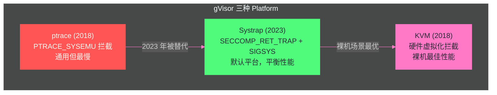

# 05 gVisor——用户空间内核的系统调用拦截

> [!abstract] 摘要
> 前 4 篇完成了"传统容器三重隔离"（namespace + cgroups + seccomp/capabilities）的讨论，指出它们的共同致命问题——共享宿主内核。从本文开始的 3 篇将深入"更强隔离"的三条技术路线。本文聚焦 gVisor——Google 开源的用户空间内核容器沙箱，它是 GKE Agent Sandbox 的默认隔离后端。文章从 gVisor 的核心设计理念出发——"不把容器进程的系统调用传给宿主内核，而是在用户空间用 Go 重新实现一个 Linux 系统调用接口"；深入三组件架构（Sentry 用户空间内核 + Gofer I/O 处理 + Platform 系统调用拦截机制）；剖析三种平台的演进——ptrace（2018，通用但慢）→ Systrap（2023，基于 SECCOMP_RET_TRAP，默认平台）→ KVM（裸机最佳性能）；分析系统调用兼容性（351 个 amd64 系统调用中 287 个有实现，64 个不支持）和不支持场景（CRIU、某些数据库、ptrace 依赖应用）；量化性能开销的结构性成本与实现成本（CPU 密集型几乎无感，I/O 密集型 10-30% 开销，系统调用密集型 2-11 倍延迟）；讨论 gVisor 在 GKE Sandbox 和 Agent 沙箱中的生产应用。核心认知：gVisor 的信任边界从"共享内核"移到了"Sentry 进程"——即使容器进程发现内核漏洞，它也无法直接利用，因为它的系统调用根本不到达宿主内核。

---

## 第 1 章 gVisor 的核心设计理念

### 1.1 从"过滤系统调用"到"重新实现系统调用"

[[04 seccomp 与 capabilities——系统调用过滤与权限分权|第 4 篇]]讨论的 seccomp 是"过滤"系统调用——决定哪些调用能到达宿主内核。但 seccomp 有一个根本限制：**被允许通过的系统调用仍然由宿主内核处理**——如果允许了 `open`，而 `open` 的内核实现中有漏洞，容器进程仍然可以利用这个漏洞。

gVisor 走了一条更激进的路——**不让任何容器进程的系统调用到达宿主内核**。gVisor 在用户空间实现了一个完整的 Linux 系统调用接口——容器进程的每个系统调用都被拦截，由 gVisor 的用户空间实现处理，宿主内核根本不看到容器进程的原始系统调用。

```
传统容器：
容器进程 → syscall → 宿主内核 → 处理 → 返回

gVisor：
容器进程 → syscall → gVisor Sentry（用户空间内核）→ 处理 → 返回
                                    ↓ （仅当需要文件I/O时）
                                Gofer → 宿主文件系统
```

这种设计的核心安全价值是：**宿主内核的攻击面被大幅缩小**。gVisor 的 Sentry 自身只使用约 55 个系统调用与宿主内核交互（且用 seccomp-bpf 白名单严格限制）——即使 Sentry 本身被攻破，攻击者也只能使用这 55 个系统调用，而非容器的全部系统调用。

### 1.2 为什么用 Go 实现

gVisor 的 Sentry 用 Go 语言编写——这个选择不是偶然的：

**内存安全**：Sentry 是一个用户空间内核——它处理来自不可信容器进程的系统调用请求，这些请求可能包含恶意构造的参数。如果 Sentry 用 C/C++ 编写，一个内存安全 bug（如缓冲区溢出）可能让容器进程逃逸出 Sentry 到达宿主。Go 的内存安全（无指针运算、自动边界检查、垃圾回收）大幅减少了这类 bug 的可能性。

**代价——性能**：Go 的垃圾回收和运行时检查有性能开销——gVisor 文档承认"Sentry 使用的语言在安全域提供了优势，但可能不提供其他语言的原始性能"。这是"安全 vs 性能"的典型取舍——gVisor 选择了安全。

> [!info] 核心概念：gVisor 是"用安全语言写的用户空间内核"
> gVisor 的设计哲学可以概括为"用安全语言写的用户空间内核"——Go 的内存安全消除了 Sentry 中大部分内存安全漏洞的可能性，用户空间实现消除了容器进程直接接触宿主内核的可能性。这两层安全保证叠加，让 gVisor 的信任边界远强于传统容器。代价是性能——Go 的 GC 开销、系统调用在 Sentry 中的用户空间处理延迟、Gofer 的 I/O 间接层——这些构成了 gVisor 的"结构性成本"。

---

## 第 2 章 三组件架构——Sentry、Gofer 与 Platform

### 2.1 Sentry——用户空间内核

Sentry 是 gVisor 的核心组件——一个用 Go 实现的用户空间内核，实现了大部分 Linux 系统调用接口。

**职责**：
- 接收并处理容器进程的系统调用——当容器进程调用 `read()` 时，实际上是 Sentry 的 Go 代码在处理这个调用
- 实现进程管理、内存管理、信号处理、网络栈等内核功能
- 通过 Gofer 代理文件系统操作
- 自身用 seccomp-bpf 严格限制与宿主内核的交互（约 55 个系统调用的白名单）

**不是完整的 Linux 内核**：Sentry 不实现 Linux 的所有功能——它实现的是"大部分应用需要的子集"。351 个 amd64 系统调用中，287 个有完整或部分实现，64 个不支持。不支持的系统调用包括 `userfaultfd`、`modify_ldt`、内核模块相关、eBPF 相关等。

### 2.2 Gofer——文件系统代理

Sentry 不直接访问宿主文件系统——所有文件 I/O 通过 Gofer 进程代理。

**工作方式**：Gofer 是一个独立的进程，运行在宿主机上（不在沙箱内）。当容器进程需要打开文件时，Sentry 通过 9P 协议向 Gofer 发送请求，Gofer 在宿主文件系统上执行实际的 open/read/write 操作，把结果返回给 Sentry。

**为什么需要 Gofer**：如果 Sentry 直接访问文件系统，Sentry 需要宿主机的文件系统权限——这扩大了 Sentry 的特权面。通过 Gofer 代理，Sentry 不需要任何文件系统权限——Gofer 可以被限制为只能访问特定目录，提供额外的隔离层。

**代价**：文件 I/O 需要经过 Sentry → 9P 协议 → Gofer → 宿主文件系统的多层间接——这比传统容器的直接文件访问慢。2019 USENIX 研究测量了 gVisor 的文件 open 操作延迟远高于原生——这是"结构性成本"的一部分。

### 2.3 Platform——系统调用拦截机制

Sentry 需要一种机制来**拦截容器进程的系统调用**——让系统调用不到达宿主内核，而是交给 Sentry 处理。这就是 Platform 的职责。gVisor 有三种 Platform 实现，代表了性能与兼容性的不同取舍：



---

## 第 3 章 三种 Platform 的演进

### 3.1 ptrace Platform（2018，已废弃为非默认）

**机制**：使用 `PTRACE_SYSEMU` 在每次系统调用时暂停容器进程，把控制权交给 Sentry。Sentry 处理系统调用后，恢复容器进程。

**优势**：通用性——ptrace 在所有 Linux 系统上工作，不需要硬件虚拟化支持。

**致命缺陷——性能**：每次系统调用都需要两次上下文切换（容器→Sentry→容器），上下文切换开销巨大。2019 USENIX 研究测量了系统调用密集型工作负载的延迟高达原生的 2-11 倍。ptrace 是 gVisor 性能差口碑的主要来源。

### 3.2 Systrap Platform（2023，当前默认）

**机制**：利用 Linux 的 `SECCOMP_RET_TRAP` 特性——当容器线程尝试系统调用时，seccomp 过滤器返回 `SECCOMP_RET_TRAP`，内核向该线程发送 `SIGSYS` 信号。gVisor 的 stub 信号处理器捕获 `SIGSYS`，通过共享内存与 Sentry 通信，Sentry 处理系统调用后恢复容器线程。

**相比 ptrace 的改进**：
- 不需要 ptrace 的逐次系统调用跟踪——seccomp 的 SIGSYS 机制更轻量
- 信号帧存储在共享内存中——Sentry 可以直接读写容器线程状态，不需要额外的上下文切换
- 2023 年的基准测试显示 Systrap 相比 ptrace 有显著性能提升（getpid 等简单系统调用的开销大幅降低）

**限制**：
- 需要 `ptrace` 相关能力来初始化 stub 线程——在某些限制了 ptrace 的系统上（如 `kernel.yama.ptrace_scope=3`）无法工作
- 嵌套虚拟化场景中性能优于 KVM，但裸机场景不如 KVM

### 3.3 KVM Platform

**机制**：利用内核的 KVM 功能，让 Sentry 同时充当 Guest OS 和 VMM。容器进程在 KVM 的 guest 模式中运行——系统调用被 KVM 的虚拟化层拦截，交给 Sentry 处理。

**优势**：裸机场景最佳性能——KVM 的硬件虚拟化扩展让系统调用拦截的上下文切换比 ptrace/Systrap 更快。利用处理器的虚拟化扩展做地址空间切换，性能更优。

**限制**：
- 需要硬件虚拟化支持（Intel VT-x / AMD-V）——不是所有环境都有（如某些云 VM 不支持嵌套虚拟化）
- 嵌套虚拟化场景性能差——在 VM 内运行 gVisor with KVM 需要嵌套虚拟化支持，且开销叠加
- 不支持 ARM CPU（截至 2025 年）

> [!note] 设计哲学：Platform 演进的"通用性 vs 性能"取舍
> gVisor 三种 Platform 的演进清晰地展示了"通用性 vs 性能"的取舍：ptrace 最通用（任何 Linux 都能跑）但最慢；KVM 最快但需要硬件虚拟化支持；Systrap 是折中——不需要硬件虚拟化但比 ptrace 快。这种"三级选择"让 gVisor 可以在不同环境中部署——裸机用 KVM、云 VM 用 Systrap、任何环境至少能用（ptrace 作为后备）。默认选择 Systrap 而非 KVM，是因为 gVisor 的典型部署场景（GKE 节点）往往在云 VM 中——嵌套虚拟化开销让 KVM 不如 Systrap。

---

## 第 4 章 兼容性——支持什么、不支持什么

### 4.1 系统调用覆盖率

gVisor 的兼容性以系统调用覆盖率为度量：

| 架构 | 总系统调用数 | 有实现（完整+部分） | 不支持 |
| :--- | :--- | :--- | :--- |
| amd64 | 351 | 287（82%） | 64 |
| arm64 | 294 | 250（85%） | 44 |

**关键认知**：一个系统调用"不支持"不等于"使用它的应用不工作"——大部分语言运行时和库在调用不支持的系统调用时有 fallback 代码，会自动使用替代系统调用。gVisor 文档明确指出："note that a syscall not being implemented in gVisor does not imply that applications using it will not work."

### 4.2 不支持的场景

尽管兼容性在持续改善（2023 年添加了 io_uring 支持、2023 年末支持了容器内 seccomp、2024 年初收紧了扩展属性），以下场景仍然有问题：

**CRIU（Checkpoint/Restore In Userspace）**：CRIU 用于容器检查点和恢复——它依赖大量低级系统调用（如 `userfaultfd`、`process_vm_readv` 等），其中很多 gVisor 不支持。这意味着 gVisor 沙箱不能做 CRIU 检查点/恢复——这对需要"暂停/恢复"的 Agent 沙箱是一个限制（GKE Agent Sandbox 用 Pod Snapshots 而非 CRIU 来规避这个问题）。

**某些数据库引擎**：使用不寻常 I/O 机制的数据库（如依赖 `userfaultfd` 做内存管理的数据库）在 gVisor 中可能行为异常。

**依赖 ptrace 的应用**：在 gVisor 中使用 ptrace 行为奇怪——因为 gVisor 自身（特别是 Systrap/ptrace 平台）可能在使用 ptrace。容器内 ptrace 的语义与原生 Linux 不完全一致。

**eBPF 程序**：gVisor 不支持容器内加载 eBPF 程序——`bpf` 系统调用不支持。如果 Agent 代码需要 eBPF（如网络监控、性能分析），在 gVisor 沙箱中无法工作。

### 4.3 兼容性的改善趋势

gVisor 的兼容性在持续改善——以下是近年来的关键添加：

| 时间 | 添加的兼容性 |
| :--- | :--- |
| 2023 年增量 | io_uring 支持逐步添加 |
| 2023 年末 | 容器内 seccomp 可用 |
| 2024 年初 | 文件系统扩展属性收紧 |
| 持续 | 网络栈的持续优化 |

截至 2024 年初，gVisor 团队表示"不能干净运行的工作负载列表很短且在缩短"——大部分 Web 服务、Python 应用、Node.js 应用、Go 应用都能在 gVisor 中正常运行。

> [!warning] 生产避坑：测试你的 Agent 工作负载在 gVisor 中的兼容性
> 在把 Agent 沙箱迁移到 gVisor 之前，必须用实际的 Agent 工作负载做兼容性测试——不要假设"如果普通的 Web 服务能跑，Agent 也一定能跑"。Agent 可能使用一些非典型的系统调用（如通过 `subprocess` 模块执行命令、通过 `os.fork` 创建子进程、通过 `mmap` 做内存映射文件），这些在 gVisor 中的行为可能与原生 Linux 有细微差异。建议的测试方法：在 gVisor 沙箱中运行 Agent 的完整工作流（包括代码执行、文件读写、网络访问、Git 操作），观察是否有异常行为或性能退化。

---

## 第 5 章 性能开销——结构性成本与实现成本

### 5.1 两类性能成本

gVisor 的性能开销分为两类，理解它们的区别对优化至关重要：

**结构性成本（Structural Costs）**：由 gVisor 的设计决策决定，不容易通过优化消除——
- Sentry 的存在意味着额外的内存和系统调用处理层次
- Go 语言的选择意味着 GC 开销和运行时检查
- Gofer 的文件 I/O 间接层意味着额外的协议开销

**实现成本（Implementation Costs）**：由 gVisor 实现的不成熟度决定，可以通过优化消除——
- 网络栈不如 Linux 的网络栈优化（缺少高级恢复机制）
- 某些系统调用的实现不够优化
- 这些成本在持续改善中

### 5.2 性能开销的量化

| 工作负载类型 | 性能开销 | 原因 |
| :--- | :--- | :--- |
| CPU 密集型 | 几乎无感（<5%） | 不涉及系统调用，Sentry 不参与 |
| 系统调用密集型 | 2-11x 延迟（ptrace），Systrap 显著改善 | 每次系统调用经过 Sentry |
| I/O 密集型 | 10-30% 吞吐下降 | 经过 Sentry → Gofer → 宿主FS 的多层间接 |
| 网络密集型 | 视场景而定 | Sentry 的网络栈不如 Linux 优化 |
| 内存密集型 | 中等（GC 开销） | Sentry 的 Go 运行时 GC |

**Agent 沙箱的实际影响**：Agent 的典型工作负载是"执行 Python/JS 代码 + 文件读写 + 网络请求"——其中代码执行（CPU 密集型）几乎不受影响，文件读写（I/O 密集型）有 10-30% 开销，网络请求取决于网络栈优化程度。总体而言，gVisor 对 Agent 沙箱的性能影响是"可感知但不致命"的——10-30% 的 I/O 开销意味着 Agent 的操作比原生容器慢 10-30%，但对于"不是实时交互"的 Agent 任务，这个延迟通常可接受。

### 5.4 网络栈性能深度分析

gVisor 的网络栈是性能讨论中最常被提及的痛点之一。与 gVisor 的系统调用拦截不同——系统调用拦截是"结构性成本"（设计决策导致的固有开销），网络栈的性能问题更多是"实现成本"（不成熟优化导致的可改善开销）。

**Sentry 内嵌网络栈**：gVisor 没有使用宿主机的 Linux 网络栈——Sentry 内部实现了一个完整的 Go 网络栈，包括 TCP/IP 协议实现、路由、ARP、socket 层。当容器进程调用 `socket()`/`connect()`/`send()`/`recv()` 时，这些调用由 Sentry 的网络栈处理，而非宿主机内核。

**网络栈的性能特征**：
- **TCP 吞吐量**：Sentry 的 TCP 实现不如 Linux 内核的 TCP 栈优化——缺少高级拥塞控制算法、TFO（TCP Fast Open）、零拷贝接收等优化。在需要高吞吐量网络传输的场景中（如大文件下载、视频流），gVisor 的网络吞吐明显低于原生。
- **连接建立延迟**：每次 TCP 连接建立都需要经过 Sentry 的网络栈——相比原生的内核网络栈，有额外的用户空间处理开销。
- **短连接场景**：频繁建立和关闭短连接的场景（如 HTTP/1.0 微服务调用）受影响更大——每次连接的建立和关闭都经过 Sentry 的用户空间 TCP 栈。

**对 Agent 沙箱的影响**：Agent 的网络使用模式通常是"少量 HTTP 请求到外部 API"——如调用 LLM API、查询数据库、访问 Web 页面。这种"低频、短连接"的网络使用模式受 gVisor 网络栈性能的影响较小——10-30% 的网络延迟增加对"等待 LLM 生成响应需要数秒"的场景几乎无感。但如果 Agent 需要做大量网络传输（如下载大模型文件、流式处理大量数据），gVisor 的网络栈性能可能成为瓶颈。

**netstack 优化方向**：gVisor 团队持续优化网络栈——包括添加对更多 TCP 选项的支持、改进拥塞控制、优化数据包处理路径。但这些优化的进度受限于"用 Go 重新实现一个完整网络栈"的工程量——Linux 内核网络栈经过数十年优化，gVisor 的 Go 网络栈需要追赶这个差距。对于 Agent 沙箱部署者来说，一个实用的缓解策略是：对网络密集型 Agent 任务，考虑使用 gVisor 的"host network"模式（如果安全策略允许）——让网络流量绕过 Sentry 的网络栈直接走宿主机网络栈，牺牲一些网络隔离换取网络性能。但这需要评估安全影响——host network 模式下容器与宿主机共享网络 namespace，减弱了网络隔离强度。

### 5.5 GKE Agent Sandbox 的性能数据

GKE Agent Sandbox 在生产中的性能数据提供了一个参考：

- **亚秒级沙箱配置**（预热线池）：300 个沙箱/秒/集群，90% 的分配在 200ms 内
- **相比 MicroVM 的密度优势**：同样硬件上部署 40%+ 更多 Agent（gVisor 的内存开销低于 MicroVM）
- **成本降低 30%+**：更高的密度意味着更低的单 Agent 成本

这些数据表明，gVisor 的性能开销虽然存在，但通过预热池和密度优势，在生产环境中的总体成本反而低于 MicroVM 方案——这是 GKE Agent Sandbox 选择 gVisor 作为默认后端的核心原因。

---

## 第 6 章 gVisor 在 Agent 沙箱中的实践

### 6.1 gVisor 相比传统容器的安全优势

对于 Agent 沙箱，gVisor 相比传统容器（namespace + cgroups + seccomp）的安全优势：

| 威胁场景 | 传统容器 | gVisor |
| :--- | :--- | :--- |
| 容器进程利用内核漏洞逃逸 | 可能（系统调用直达宿主内核） | 被阻止（系统调用不直达宿主内核） |
| 容器进程通过 `mount` 逃逸 | 被 seccomp 阻止（如果配置正确） | 被 Sentry 阻止（mount 由 Sentry 处理） |
| 容器进程通过 ptrace 读取其他进程内存 | 被 seccomp 阻止（如果配置正确） | 被 Sentry 阻止（ptrace 由 Sentry 处理） |
| 容器进程通过网络嗅探宿主机流量 | 被 network namespace 阻止 | 被 Sentry 的独立网络栈阻止 |
| Sentry 自身被攻破 | N/A | 攻击者只能使用 Sentry 的 ~55 个白名单系统调用 |

### 6.2 gVisor 相比 MicroVM 的取舍

| 维度 | gVisor | MicroVM（Firecracker/Kata） |
| :--- | :--- | :--- |
| 隔离强度 | 中（需逃逸 Sentry） | 强（需 VM 逃逸） |
| 启动时间 | 亚秒级 | ~125ms（Firecracker） |
| 内存开销 | 中等 | <5MB（Firecracker）到较高（Kata） |
| 兼容性 | 部分（~82% 系统调用） | 完整（真实 Linux 内核） |
| 密度 | 高（不需要 Guest OS） | 中到低（需要 Guest OS） |
| I/O 性能 | 10-30% 开销 | 接近原生（virtio） |
| 适合场景 | CPU 密集型 Agent、高密度 | 不可信代码、强隔离需求 |

GKE Agent Sandbox 选择 gVisor 作为默认后端，是因为 Agent 沙箱场景下"密度和成本"比"极致隔离强度"更重要——Agent 代码的威胁级别通常不是"国家级攻击者"，而是"buggy 代码 + 偶尔的 Prompt Injection"——gVisor 的隔离强度对这个威胁级别足够，且密度优势带来了显著的成本降低。对于非 GKE 环境，gVisor 也可以通过 `runsc` 运行时与 Docker/Podman 集成——安装 `runsc` 后，在 Docker 中通过 `--runtime=runsc` 指定使用 gVisor 运行时启动容器。这让自建 Agent 沙箱平台也能利用 gVisor 的用户空间内核隔离，而不需要依赖 GKE。配置示例：`docker run --runtime=runsc --platform=systrap -it agent-sandbox-image`。

### 6.3 gVisor 的安全模型边界

尽管 gVisor 的隔离远强于传统容器，它并非无懈可击——理解其安全模型的边界对于正确部署至关重要。

**Sentry 自身的攻击面**：Sentry 是一个用 Go 编写的大规模用户空间程序——它实现了 287 个系统调用的逻辑，处理来自不可信容器进程的请求。虽然 Go 的内存安全消除了大部分内存安全 bug，但逻辑 bug 仍然可能存在——如不正确的权限检查、竞态条件、类型混淆等。如果攻击者在 Sentry 中找到了一个逻辑 bug，可能利用它逃逸 Sentry 的沙箱，到达宿主机用户空间。

**Sentry 的 seccomp 白名单**：即使 Sentry 被攻破，Sentry 自身被 seccomp-bpf 限制为约 55 个系统调用的白名单——攻击者在 Sentry 上下文中能做的事情受这个白名单约束。这是一个重要的纵深防御——"攻破 Sentry"不等于"获得宿主机 root"——攻击者还需要从 55 个系统调用中找到逃逸路径。

**Gofer 的攻击面**：Gofer 是一个独立的进程，负责文件系统操作——它暴露了 9P 协议接口给 Sentry。如果 Sentry 被攻破，攻击者可能通过 9P 协议向 Gofer 发送恶意请求——但 Gofer 也有自己的权限限制（只能访问指定目录）。

**与 MicroVM 的安全边界对比**：MicroVM 的信任边界是 hypervisor——逃逸需要 hypervisor 漏洞（如 KVM/QEMU 漏洞），这些漏洞比用户空间程序漏洞少得多且更难利用。gVisor 的信任边界是 Sentry——逃逸需要 Sentry 的逻辑 bug，比 hypervisor 漏洞更容易发现和利用。这就是"gVisor 隔离强度不如 MicroVM"的根本原因——用户空间程序的攻击面大于 hypervisor 的攻击面。但需要注意，Sentry 用 Go 编写带来的内存安全优势，使得"在 Sentry 中找到可利用的 bug"比"在用 C 编写的同等规模程序中找到"要难得多——Go 消除了整类内存安全漏洞（缓冲区溢出、use-after-free、空指针解引用等），这些恰恰是 C 程序中最常见的可利用漏洞类型。因此 gVisor 与 MicroVM 的安全差距，比"用户空间程序 vs hypervisor"的简单对比要小——Go 的内存安全是一个重要的弥合因素。

> [!info] 核心概念：gVisor 是"够用的强隔离"
> gVisor 在隔离强度上不如 MicroVM——逃逸 Sentry 比逃逸 VM 容易。但 gVisor 的隔离强度远超传统容器——逃逸 Sentry 需要找到 Sentry（一个用内存安全语言 Go 编写的用户空间程序）中的漏洞，而非宿主内核（一个用 C 编写的数百万行代码）中的漏洞。对于 Agent 沙箱场景，gVisor 提供了"够用的强隔离"——远强于传统容器，虽然不如 MicroVM，但密度和成本优势显著。这是"适度安全"的工程实践——不是追求"理论上的最强隔离"，而是"针对实际威胁级别的足够隔离"。

---

## 第 7 章 总结与下一篇导读

### 7.1 本文核心要点

1. **gVisor 的核心设计是"用户空间内核"**：Sentry 用 Go 重新实现 Linux 系统调用接口——容器进程的系统调用不直达宿主内核，宿主内核攻击面大幅缩小
2. **三组件架构**：Sentry（用户空间内核）+ Gofer（文件系统代理，通过 9P 协议）+ Platform（系统调用拦截机制）
3. **三种 Platform 演进**：ptrace（通用但最慢）→ Systrap（SECCOMP_RET_TRAP + SIGSYS，2023 年起默认）→ KVM（裸机最佳性能）
4. **兼容性 82%**：351 个 amd64 系统调用中 287 个有实现——大部分应用能正常运行，但 CRIU、某些数据库、eBPF、ptrace 依赖应用有问题
5. **两类性能成本**：结构性成本（Sentry/Go/Gofer 的设计代价）+ 实现成本（不成熟优化，持续改善中）——CPU 密集型几乎无感，I/O 密集型 10-30% 开销
6. **GKE Agent Sandbox 生产数据**：gVisor 的密度优势让同样硬件部署 40%+ 更多 Agent，成本降低 30%+——这是选择 gVisor 而非 MicroVM 的核心原因
7. **"够用的强隔离"定位**：远强于传统容器，不如 MicroVM，但密度和成本优势显著——适合 Agent 沙箱的"buggy 代码 + 偶尔 Prompt Injection"威胁级别

### 7.2 下一篇导读

本文深入了 gVisor——"用户空间内核"路线的代表。下一篇 [[06 Kata Containers——硬件虚拟化的轻量容器]] 将转向第二条路线——"硬件虚拟化"的 Kata Containers。Kata 不在用户空间重新实现系统调用，而是给每个 Pod 运行一个真正的轻量 VM——容器进程在 Guest 内核上运行，与宿主内核完全隔离。我们将深入 Kata 的 QEMU/Cloud Hypervisor/Dragonball 架构、CRI 集成、virtio 设备、热插拔、Kata 4.0 单二进制架构，以及 Kata 与 gVisor 的根本路线对比。

> [!info] 专栏导航
> 本文是 [[00 专栏导览|Agent 沙箱与隔离技术专栏]] 的第 5 篇，也是"轻量虚拟化"主题的第一篇。前 4 篇完成了"传统容器三重隔离"；本篇和接下来两篇将深入三种"更强隔离"的技术路线——gVisor（用户空间内核）、Kata（硬件虚拟化）、Firecracker（MicroVM 极简）。

---

## 参考文献

1. gVisor. "Platform Guide." https://gvisor.dev/docs/architecture_guide/platforms/
2. gVisor. "Releasing Systrap - A high-performance gVisor platform." 2023-04-28. https://gvisor.dev/blog/2023/04/28/systrap-release/
3. gVisor. "Performance." https://github.com/google/gvisor/blob/master/g3doc/architecture_guide/performance.md
4. gVisor Systrap README. https://github.com/google/gvisor/blob/master/pkg/sentry/platform/systrap/README.md
5. Young et al. "The True Cost of Containing: A gVisor Case Study." USENIX HotCloud 2019. https://www.usenix.org/system-files/hotcloud19-paper-young.pdf
6. gVisor. "Linux/amd64 Compatibility." https://gvisor.dev/docs/user_guide/compatibility/linux/amd64/
7. gVisor. "Linux/arm64 Compatibility." https://gvisor.dev/docs/user_guide/compatibility/linux/arm64/
8. "gVisor Security Deep Dive: User-Space Kernel for Containers." https://safeguard.sh/resources/blog/gvisor-runtime-security-deep-dive
9. Google. "Reduce your agent's costs by 75% with GKE Agent Sandbox." https://cloud.google.com/blog/products/containers-kubernetes/reduce-your-agents-costs-with-gke-agent-sandbox

---

## 思考题

1. **gVisor 的 Sentry 用 Go 编写以获得内存安全——但 Go 的 GC 会在 Sentry 处理系统调用时引入暂停。这对 Agent 沙箱有什么影响？GC 暂停期间的容器进程系统调用会发生什么？** 提示：考虑 GC 暂停对延迟敏感型操作的影响——如果 Agent 在执行一个需要快速响应的操作，Sentry 的 GC 暂停可能导致意外的延迟尖峰。gVisor 的 GC 调优（如 GOGC 参数）是 gVisor 部署的重要调优维度。

2. **gVisor 不支持 CRIU（检查点/恢复），但 GKE Agent Sandbox 用 Pod Snapshots 做状态持久化。Pod Snapshots 和 CRIU 有什么本质区别？为什么 Pod Snapshots 能在 gVisor 上工作而 CRIU 不能？** 提示：考虑检查点的层次——CRIU 在容器进程层面做检查点（需要访问进程的内存映射、寄存器等低级状态），而 Pod Snapshots 可能在更高的层面（如整个 Pod 的 cgroup 状态+文件系统快照）做检查点，不需要访问 gVisor 内部的进程状态。

3. **gVisor 的 Systrap 平台需要 ptrace 能力来初始化 stub 线程——但在 `kernel.yama.ptrace_scope=3` 的系统上无法工作。这是一个安全问题还是兼容性问题？在安全敏感的 Agent 沙箱场景中，应该允许 gVisor 使用 ptrace 吗？** 提示：考虑"gVisor 用 ptrace 做什么"——它用 ptrace 初始化 stub 线程，不是用 ptrace 跟踪其他进程。`ptrace_scope=3` 限制的是"跨进程 ptrace"，但 gVisor 的 ptrace 是在自己的进程组内——这个限制可能过度严格。但放开 ptrace 限制本身也有安全风险——需要权衡。
