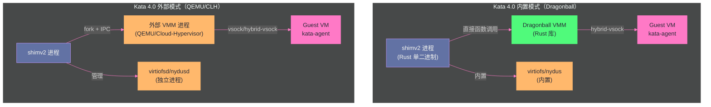

# 06 Kata Containers——硬件虚拟化的轻量容器

> [!abstract] 摘要
> [[05 gVisor——用户空间内核的系统调用拦截|上一篇]]深入了 gVisor——"用户空间内核"路线，通过在用户空间用 Go 重新实现系统调用来隔离容器进程。本文转向第二条路线——Kata Containers 的"硬件虚拟化"方案。Kata 的核心思想截然不同：不为每个 Pod 重新实现系统调用接口，而是给每个 Pod 运行一个**真正的轻量虚拟机**——容器进程在 Guest 内核上运行，与宿主内核完全隔离，逃逸需要 hypervisor 漏洞而非内核漏洞。文章从 Kata 的 CRI 集成模型出发——Pod Sandbox → VM、Container → VM 内进程、Network → virtio-net、Storage → virtio-fs/virtio-block、Compute → vCPU/Memory——理解 Kubernetes 抽象如何映射到虚拟化原语；深入 Kata 4.0 的架构革命——从 Go 运行时重写为 Rust，Dragonball 内置 VMM 消除进程间通信开销，单二进制架构简化部署；剖析三种 VMM 选择（Dragonball 内置/QEMU 外部/Cloud Hypervisor 外部）的适用场景；讨论 virtio 设备模型（virtio-fs 文件系统共享、virtio-block 块设备、virtio-net 网络）和热插拔机制；分析 Kata 与 gVisor 的根本路线对比——"真实内核+硬件隔离" vs "用户空间内核+软件隔离"。核心认知：Kata 的隔离强度远超 gVisor——逃逸需要 hypervisor 漏洞，但这带来了更高的资源开销（每个 Pod 需要自己的 Guest 内核）和更长的启动时间。

---

## 第 1 章 Kata 的核心设计——用 VM 隔离 Pod

### 1.1 从"容器共享内核"到"每个 Pod 一个 VM"

传统容器的隔离问题根源在于"共享宿主内核"——[[02 Linux namespaces——资源隔离的基石|第 2 篇]]到[[04 seccomp 与 capabilities——系统调用过滤与权限分权|第 4 篇]]讨论的 namespace/cgroups/seccomp/capabilities 都在这个共享前提下工作。gVisor 通过"用户空间重新实现内核"来避免共享，但 Sentry 仍然是一个用户空间程序——它的隔离是"软件隔离"。

Kata Containers 走了一条更彻底的路——**给每个 Pod 运行一个真正的虚拟机**。容器进程在 VM 的 Guest 内核上运行——Guest 内核处理系统调用，与宿主内核完全隔离。要逃逸到宿主机，攻击者需要先逃逸 VM（hypervisor 漏洞），这比逃逸用户空间程序（gVisor 的 Sentry）困难得多。

```
传统容器：
容器进程 → 宿主内核（共享）

gVisor：
容器进程 → Sentry（用户空间内核，Go）→ 宿主内核（仅 ~55 个系统调用）

Kata Containers：
容器进程 → Guest 内核（VM 内的真实 Linux 内核）→ hypervisor → 宿主内核
                    ↑                                      ↑
              完全隔离的系统调用处理                    仅 hypervisor 层交互
```

### 1.2 CRI 映射——Kubernetes 抽象到虚拟化原语

Kata 作为 Kubernetes 的 CRI（Container Runtime Interface）兼容运行时，需要把 Kubernetes 的抽象映射到虚拟化原语：

| CRI 构造 | Kata VM 等价 | 虚拟化技术 |
| :--- | :--- | :--- |
| **Pod Sandbox** | 虚拟机 | Hypervisor/VMM |
| **Container** | VM 内的进程/namespace | Guest 内核的 namespace/cgroup |
| **Network** | 网络接口 | virtio-net / vhost-net / SR-IOV |
| **Storage** | 块设备/文件设备 | virtio-fs / virtio-block / virtio-scsi |
| **Compute** | vCPU / 内存 | KVM + ACPI 热插拔 |

**关键映射的工程含义**：

**Pod Sandbox → VM**：每个 Pod 启动时，Kata 创建一个 VM。Pod 内的多个容器在同一个 VM 内运行——它们共享 Guest 内核，但不共享宿主内核。这与传统容器运行时（如 containerd with runc）的"Pod 内容器共享 namespace"模型一致——只是共享的层面从"宿主内核的 namespace"变成了"Guest 内核的 namespace"。

**Container → VM 内进程**：Pod 内的每个容器在 VM 内作为一个进程运行，由 Guest 内核的 namespace/cgroup 隔离。从容器的视角看，它就像在一个正常的 Linux 系统上运行——有完整的系统调用支持，没有 gVisor 的兼容性问题。

**Network → virtio-net**：Pod 的网络通过 virtio-net 设备连接——Guest VM 看到一个虚拟网卡，网络流量通过 virtio 协议与宿主机网络栈交互。

**Storage → virtio-fs / virtio-block**：容器镜像和卷通过 virtio 设备映射到 VM。`virtio-fs` 用于文件系统共享（让 Guest 访问宿主机上的文件系统），`virtio-block` 用于块设备直通（让 Guest 直接访问块设备）。

> [!info] 核心概念：Kata 的"容器外观，VM 内核"
> Kata 的设计哲学可以概括为"容器外观，VM 内核"——从 Kubernetes 和用户的视角看，它是一个标准的容器运行时（支持 CRI 接口、OCI 镜像、kubectl 命令），一切看起来与普通容器无异。但从隔离实现看，每个 Pod 底层是一个完整的 VM——有独立的 Guest 内核、独立的网络栈、独立的文件系统视图。这种"外观兼容，内核独立"的设计让 Kata 可以无缝集成到现有的 Kubernetes 生态中——不需要修改应用、不需要特殊的镜像、不需要改变运维工作流——但提供了远强于传统容器的隔离。

### 1.3 Kata 的历史背景与项目演进

Kata Containers 的历史可以追溯到 2017 年——由 Intel 的 Clear Containers 项目和 Hyper.sh 的 runV 项目合并而成。Intel Clear Containers 的核心洞察是"用轻量 VM 做容器隔离"——结合 Intel 的 VT-x 虚拟化技术和优化过的 QEMU（基于 KVM），实现"容器般轻量但 VM 般安全"的运行时。Hyper.sh runV 则从另一个角度做了类似的事——基于 hypervisor 的容器运行时。两个项目在 2017 年合并为 Kata Containers，由 OpenStack Foundation（后来的 Open Infrastructure Foundation）托管。

**版本演进时间线**：

| 版本 | 年份 | 关键变化 |
| :--- | :--- | :--- |
| 1.0 | 2018 | 首个正式发布，Go 运行时，QEMU VMM |
| 2.0 | 2020 | 改进的 CRI 集成，支持 Firecracker 作为 VMM |
| 3.0 | 2022 | 实验性 Rust 运行时（runtime-rs），支持 Cloud Hypervisor |
| 4.0 | 2024 | Rust 成为默认运行时，Dragonball 内置 VMM，单二进制架构 |

从 1.0 到 4.0 的演进主线是"从 Go 多进程到 Rust 单二进制"——每一步都在减少进程间通信开销、降低内存占用、提升启动速度。4.0 的 Rust 重写不是"换一门语言"那么简单——它是一个完整的架构简化，把"shim 进程 + VMM 进程 + virtiofsd 进程"三进程模型合并为"shim 单进程内含 VMM 库"的单进程模型。

**与 Kubernetes 生态的集成深度**：Kata 是 Kubernetes 生态中最成熟的"强隔离容器运行时"——它通过 containerd 的 shimv2 接口与 K8s 集成，对用户完全透明。从 `kubectl` 的视角看，Kata Pod 和普通 runc Pod 没有区别——只是底层从"namespace 隔离"变成了"VM 隔离"。这种透明性是 Kata 被主流 K8s 平台（GKE、EKS、AKS）支持的关键——用户不需要学习新的 API 或改变工作流，只需要把 Pod 的 RuntimeClass 改为 `kata`。这种"零摩擦采用"的设计是 Kata 在企业环境中被广泛接受的重要原因——安全团队可以要求"敏感工作负载用 Kata"，而开发团队不需要因此改变任何代码或 CI/CD 流程。

---

## 第 2 章 Kata 4.0 的架构革命——从 Go 到 Rust

### 2.1 为什么重写

Kata Containers 4.0（2024 年发布）是一个重大的架构演进——整个运行时从 Go 重写为 Rust。这个决策的动机与 gVisor 选择 Go 的动机类似但方向不同：

**Go 运行时的问题**：
- Go 的 GC 在高密度场景下引入不可预测的暂停——影响 Agent 沙箱的延迟敏感性
- Go 的运行时本身有内存开销——每个 Kata shim 进程都带着一个 Go runtime
- 跨进程通信开销——Go 运行时与外部 VMM（QEMU/Cloud Hypervisor）通过 IPC/RPC 通信，有进程间通信开销

**Rust 的优势**：
- **内存安全**——与 Go 一样，Rust 消除了大部分内存安全 bug（通过所有权系统而非 GC）
- **零成本抽象**——Rust 不需要运行时/GC，内存开销更低
- **无 GC 暂停**——Rust 的内存管理是编译时确定的，没有运行时 GC 暂停
- **异步 I/O**——Tokio 异步运行时提供高并发能力，线程开销低

### 2.2 单二进制架构

Kata 4.0 最重要的架构变化是**将整个运行时整合为单一高性能二进制**——消除了跨进程通信开销，简化了部署。

**架构对比**：

```
Kata 3.x（Go，多进程）：
containerd → shimv2（Go进程）→ QEMU（独立进程）+ virtiofsd（独立进程）+ kata-agent（VM内）
         ↕ IPC/RPC          ↕ IPC/RPC          ↕ IPC/RPC

Kata 4.0（Rust，单进程内置 VMM）：
containerd → shimv2（Rust单进程，内含 Dragonball VMM 库）
         ↕ 直接函数调用（无 IPC）
```

**单进程内置 VMM 的优势**：
- **消除 IPC 开销**——shimv2 与 VMM 之间通过直接函数调用通信，而非 IPC/RPC
- **减少进程数**——不需要独立的 VMM 进程和 virtiofsd 进程
- **简化部署**——一个二进制文件，减少依赖和配置

### 2.3 Dragonball——内置 VMM

Kata 4.0 引入了 Dragonball——一个用 Rust 编写的内置 VMM（Virtual Machine Monitor），作为 VMM 库直接链接到 shimv2 进程中。

**Dragonball 的定位**：轻量级 VMM，满足标准沙箱需求——支持 virtio-net、virtio-blk、VFIO 设备直通等核心特性。它不是 QEMU 的替代品——QEMU 仍然作为外部 VMM 选项保留，用于需要更完整设备模拟的场景。

**为什么叫 Dragonball**：Dragonball 的名字来自"龙珠"——它是 Kata 团队从零开始构建的 Rust VMM，借鉴了 rust-vmm 社区的 crates（rust-vmm 是一个共享 VMM 组件的开源项目，Firecracker 和 Cloud Hypervisor 也使用它的 crates）。Dragonball 的设计目标不是"替代 QEMU 的全部功能"，而是"提供 Kata 沙箱需要的最小 VMM 功能集"——这与 Firecracker 的"极简哲学"异曲同工，但 Dragonball 是"库模式"（链接到 shim 进程），Firecracker 是"进程模式"（独立进程）。

**Dragonball 的技术栈**：
- 基于 Rust 的 Tokio 异步运行时——高并发，低线程开销
- 使用 rust-vmm crates 的共享组件——vm-memory（VM 内存管理）、kvm-ioctls（KVM 接口）、virtio-device（virtio 设备框架）
- 支持的 virtio 设备：virtio-net、virtio-blk、virtio-balloon、virtio-vsock
- 支持 VFIO 设备直通——把宿主机物理设备直接分配给 Guest VM
- 支持 PCI 总线和 MSIX 中断——提供比 MMIO + 传统中断更好的 I/O 性能

**Dragonball vs QEMU**：

| 维度 | Dragonball（内置） | QEMU（外部） |
| :--- | :--- | :--- |
| 集成方式 | VMM 库，直接链接到 shim | 独立进程，通过 IPC 通信 |
| 通信开销 | 无（函数调用） | 有（IPC/RPC） |
| 设备模拟 | 核心 virtio 设备 | 完整设备模拟 |
| 启动速度 | 更快（无进程启动开销） | 较慢（需要启动 QEMU 进程） |
| 适用场景 | 标准沙箱、高密度 | 需要特殊设备支持的复杂场景 |



> [!note] 设计哲学：Kata 4.0 的"内置 vs 外部"双模式
> Kata 4.0 保留了两种 VMM 模式——内置（Dragonball）和外部（QEMU/Cloud Hypervisor/Firecracker）。这种"双模式"设计反映了一个务实的工程取舍：内置模式追求性能和简洁（适合标准沙箱场景），外部模式保留灵活性（适合需要特定 VMM 特性的场景）。特别是，外部模式支持 Firecracker 作为 VMM——这意味着 Kata 用户可以利用 Firecracker 的 MicroVM 极简设计，同时享受 Kata 的 CRI 集成和 Kubernetes 原生体验。这种"Kata 管理 + Firecracker 隔离"的组合在 GKE Agent Sandbox 中也有应用——GKE Agent Sandbox 支持 Kata Containers 作为 gVisor 之外的隔离后端选项。

---

## 第 3 章 virtio 设备模型

### 3.1 virtio——半虚拟化 I/O 框架

Kata 的 VM 与宿主机之间的 I/O 通过 **virtio** 设备完成。virtio 是半虚拟化（paravirtualized）I/O 框架——Guest 知道自己在虚拟机中，通过特定的 virtio 驱动与宿主机的 virtio 设备后端通信，而非通过完整的硬件模拟。

**相比全模拟的优势**：全模拟（如 QEMU 模拟一个真实的 Intel 网卡）需要逐条翻译每条硬件指令——开销大。virtio 的 Guest 驱动直接知道"我在和 virtio 设备通信"，使用简化的 virtio 协议——开销小得多。

### 3.2 virtio-fs——文件系统共享

virtio-fs 是 Kata 的默认文件系统共享机制——让 Guest VM 访问宿主机上的文件系统（如容器镜像层）。

**工作方式**：宿主机上运行 virtiofsd 守护进程，它将宿主机文件系统通过 virtio-fs 协议暴露给 Guest。Guest 内核的 virtio-fs 驱动挂载这个共享文件系统——Guest 内的进程可以像访问本地文件系统一样访问共享文件。

**性能特征**：virtio-fs 比 9P（gVisor 使用的协议）更高效——virtio-fs 利用内存映射（DAX）让 Guest 直接访问宿主机的文件缓存，减少数据拷贝。但 virtio-fs 仍然有性能开销——每个文件操作需要跨 VM 边界。

**virtio-fs 的局限**：对于高 I/O 性能要求的场景（如数据库），virtio-fs 的延迟和吞吐开销可能不可接受。Kata 社区正在讨论"块设备直通"方案——把块设备直接映射到 VM，让 Guest 使用自己的文件系统驱动，避免 virtio-fs 的间接层。

### 3.3 virtio-block——块设备直通

virtio-block 把宿主机上的块设备（如磁盘分区、loop 设备）直接映射到 Guest VM——Guest 看到一个虚拟块设备（如 `/dev/vdb`），可以直接在其上创建文件系统。

**相比 virtio-fs 的优势**：
- **更好的 I/O 性能**——块设备 I/O 不经过文件系统协议层
- **更好的隔离**——Guest 使用自己的文件系统，宿主机不看到 Guest 的文件系统元数据
- **资源独立**——Guest 的文件系统缓存和 inode 在 Guest 内核中，不影响宿主机

**适用场景**：数据库等高 I/O 性能要求的工作负载。Kata 社区的"块设备直通"提案明确指出："virtio-fs 的文件系统资源泄漏到宿主机——inode、磁盘空间、dentry/inode slab cache 随 Guest 活动增长——对多租户有状态工作负载是阻塞问题。"

### 3.4 virtio-net——网络设备

virtio-net 给 Guest VM 提供虚拟网卡——Guest 看到一个以太网卡，网络流量通过 virtio 协议与宿主机网络栈交互。

**多队列网络**：Kata 4.0 支持多队列网络（multi-queue networking）——多个 virtio-net 队列允许 Guest 的多个 vCPU 并行处理网络中断，提高高并发网络场景的吞吐。

**SR-IOV 支持**：对于需要更高网络性能的场景，Kata 支持 SR-IOV（Single Root I/O Virtualization）——将物理网卡的虚拟功能（VF）直接分配给 Guest VM，绕过宿主机网络栈，接近裸机网络性能。

### 3.5 PCI 总线与 MSIX 中断

Kata 4.0 的 Dragonball VMM 将 virtio-blk 设备默认使用 PCI 总线而非 MMIO 总线——因为 PCI 总线支持 MSIX 中断（消息信号中断），而 MMIO 只支持传统中断。测试显示，从传统中断切换到 MSIX 中断，virtio-blk 的 I/O 性能提升约 34%——这是一个通过优化中断机制获得的显著性能改进。

**为什么 MSIX 比传统中断快**：传统中断（如 Legacy INTx）使用物理中断线——每次中断需要中断控制器的仲裁和路由，开销大且不支持中断合并。MSIX 中断使用内存写入来发送中断信号——每个设备有自己的 MSIX 表，直接写入表项就能触发中断，支持多中断向量和中断合并（多个中断事件合并为一次通知）。对于高 IOPS 的块设备，MSIX 的"中断合并"能力可以显著减少中断处理次数——这就是 34% 性能提升的来源。

**多队列 I/O 与 IOThreads**：Kata 4.0 还引入了独立的 IOThreads 框架——允许为 virtio-blk 等设备分配独立的 I/O 处理线程。在没有 IOThreads 时，所有设备的 I/O 处理在 QEMU/VMM 的主循环中完成——一个设备的 I/O 阻塞可能影响其他设备。有了 IOThreads，每个 virtio-blk 设备可以在自己的线程中处理 I/O——并行化 I/O 处理，避免设备间的互相阻塞。这对于有多个块设备的 Agent 沙箱（如根文件系统盘 + 数据卷）特别有价值。

### 3.6 存储方案的选择矩阵

Kata 提供多种存储方案，适用于不同场景：

| 存储方案 | 机制 | 性能 | 隔离性 | 适用场景 |
| :--- | :--- | :--- | :--- | :--- |
| **virtio-fs** | 文件系统共享（宿主机 FS → Guest） | 中等 | 低（宿主机看到 Guest 的 FS 元数据） | 默认选择，通用场景 |
| **virtio-block** | 块设备直通 | 高 | 高（Guest 有自己的 FS） | 数据库等高 I/O 场景 |
| **virtio-scsi** | SCSI 设备 | 高 | 高 | 需要多 LUN 的场景 |
| **dm-verity** | 完整性验证的根文件系统 | 中等 | 高 | 需要防篡改的场景 |
| **Nydus** | 按需加载的镜像服务 | 高 | 中等 | 大镜像快速启动 |

对于 Agent 沙箱，通常使用 virtio-fs 作为默认方案（简单且够用），但如果 Agent 工作负载涉及大量文件 I/O（如编译代码、运行数据库测试），切换到 virtio-block 可以获得更好的 I/O 性能和更弱的宿主机-Guest 文件系统耦合。

---

## 第 4 章 Kata 与 gVisor 的根本路线对比

### 4.1 两种隔离哲学

| 维度 | gVisor（用户空间内核） | Kata（硬件虚拟化） |
| :--- | :--- | :--- |
| **隔离机制** | Sentry 用 Go 重新实现系统调用 | Guest VM 运行真实 Linux 内核 |
| **信任边界** | Sentry 进程（用户空间程序） | hypervisor（KVM/QEMU/Dragonball） |
| **逃逸难度** | 需 Sentry 逻辑 bug | 需 hypervisor 漏洞 |
| **系统调用兼容性** | ~82%（287/351 amd64） | 100%（真实内核） |
| **启动时间** | 亚秒级（Systrap） | 秒级（VM 启动） |
| **内存开销** | 中等（Sentry 进程） | 较高（Guest OS 内核） |
| **I/O 性能** | 10-30% 开销（Gofer 间接层） | 接近原生（virtio） |
| **CPU 性能** | 几乎无感 | 少量虚拟化开销 |
| **CRIU 支持** | ❌ | ❌（但支持 Kata 自己的快照机制） |
| **K8s 集成** | 通过 runsc OCI 运行时 | 原生 CRI 集成 |
| **密度** | 高 | 中到低 |

### 4.2 什么时候选 Kata，什么时候选 gVisor

**选 Kata 的场景**：
- **需要最强隔离**——运行高度不可信的代码（如来自不受信任用户的 AI 生成代码），需要 VM 级隔离
- **需要完整兼容性**——应用依赖 gVisor 不支持的系统调用（如 CRIU、eBPF、特定数据库引擎）
- **I/O 密集型**——Kata 的 virtio I/O 比 gVisor 的 Gofer 间接层更高效
- **GPU 直通**——需要将 GPU 直接分配给容器（Kata 支持 GPU passthrough）

**选 gVisor 的场景**：
- **需要高密度**——同一节点上需要运行大量沙箱，内存开销敏感
- **需要快速启动**——亚秒级启动对交互体验重要
- **CPU 密集型**——gVisor 对 CPU 密集型工作负载几乎无开销
- **威胁级别适中**——"buggy 代码 + 偶尔 Prompt Injection"的威胁级别，gVisor 的隔离足够

**混合策略的现实**：在生产环境中，不一定非要在 gVisor 和 Kata 之间"二选一"——可以根据 Agent 任务的威胁级别动态选择。低风险任务（如运行经过审查的 Python 脚本）用 gVisor（高密度、低成本），高风险任务（如运行用户提交的不可信代码）用 Kata（强隔离、完整兼容）。GKE Agent Sandbox 的 SandboxTemplate 机制支持这种"按需选择隔离后端"的混合策略——管理员可以定义不同的模板，每个模板指定不同的隔离后端和资源限制。

### 4.3 Kata 的安全模型深度分析

Kata 的安全模型不只是"VM 隔离"——它是一个多层防御体系：

**第一层：VM 边界**。容器进程在 Guest 内核上运行——要到达宿主机，必须先逃逸 VM。逃逸 VM 需要找到 hypervisor（KVM/QEMU/Dragonball）中的漏洞——这些漏洞比 Linux 内核漏洞少得多，因为 hypervisor 的代码量远小于 Linux 内核（QEMU 的 TCG 部分较大，但 Kata 通常使用 KVM 加速，不走 TCG 路径）。

**第二层：Guest 内核内的 namespace/cgroup 隔离**。Pod 内的多个容器在 Guest 内核中仍然通过 namespace/cgroup 隔离——即使一个容器被攻破，它也需要先逃逸 Guest 内核的 namespace 隔离才能影响同 Pod 的其他容器。

**第三层：最小化的 Guest 镜像**。Kata 的 Guest VM 通常使用精简的 Guest 镜像——只包含 kata-agent 和最小必要的用户空间工具。攻击者在 Guest 内能利用的攻击面（如可用的命令、库）被最小化。

**第四层：kata-agent 的受控通信**。Guest 内的 kata-agent 通过 vsock/hybrid-vsock 与宿主机侧的 shim 通信——这个通道只接受特定的管理命令（如启动容器、配置网络），不暴露通用的宿主机访问能力。

**第五层（可选）：confidential containers**。Kata 支持 Confidential Containers（CoCo）——利用硬件 TEE（如 AMD SEV-SNP、Intel TDX）加密 VM 内存，即使宿主机管理员也无法读取 Guest VM 的内存内容。这对"即使基础设施提供商也不可信"的极端安全场景提供了额外保障。本专栏第 12 篇将深入讨论 Confidential Containers。

> [!warning] 生产避坑：Kata 的启动时间比 gVisor 慢
> Kata 的每个 Pod 需要启动一个 VM——即使使用 Dragonball 内置 VMM，VM 启动也需要加载 Guest 内核、初始化设备、启动 kata-agent——这个过程通常需要数秒。相比之下，gVisor 的 Systrap 平台可以在亚秒级启动。对于需要"每次请求创建新沙箱"的场景，Kata 的启动延迟可能不可接受。缓解策略：使用预热沙箱池——预先启动一批 VM 并保持待命，新请求来时从池中分配。GKE Agent Sandbox 的预热线池正是这个策略的实践。

---

## 第 5 章 Kata 在 Agent 沙箱中的实践

### 5.1 GKE Agent Sandbox 中的 Kata

GKE Agent Sandbox 默认使用 gVisor，但也支持 Kata Containers 作为隔离后端——用户可以在 SandboxTemplate 中指定使用 Kata 而非 gVisor。

**使用 Kata 的场景**：当 Agent 工作负载需要 gVisor 不支持的特性时——如需要 io_uring 的完整支持、需要容器内 eBPF、需要特定的数据库引擎——切换到 Kata 可以获得完整兼容性，同时保持 VM 级隔离。

### 5.2 自建 Agent 沙箱中的 Kata

对于自建的 Agent 沙箱平台，Kata 可以通过 containerd 的 shimv2 接口集成：

```toml
# containerd 配置示例
[plugins."io.containerd.grpc.v1.cri".containerd.runtimes.kata]
  runtime_type = "io.containerd.kata.v2"
  privileged_without_host_devices = true
```

然后在 Pod 定义中指定使用 Kata RuntimeClass：

```yaml
apiVersion: node.k8s.io/v1
kind: RuntimeClass
metadata:
  name: kata
handler: kata
---
apiVersion: v1
kind: Pod
metadata:
  name: agent-sandbox
spec:
  runtimeClassName: kata
  containers:
  - name: agent
    image: agent-sandbox-image
    securityContext:
      runAsNonRoot: true
      allowPrivilegeEscalation: false
      capabilities:
        drop: ["ALL"]
```

### 5.3 资源开销考量

Kata 的每个 Agent 沙箱需要：
- 一个 Guest VM（包含 Guest 内核）——内存开销约 50-100MB
- vCPU 资源——Guest 内核的调度需要消耗 vCPU
- virtio 设备开销——网络和存储设备的虚拟化开销

这些开销意味着在同一节点上，Kata 能部署的 Agent 沙箱数量少于 gVisor——这是"更强隔离"的代价。GKE Agent Sandbox 的数据显示，从 MicroVM（类似 Kata 的 VM 级隔离）迁移到 gVisor，密度提高 40%+——反过来说，Kata 的密度比 gVisor 低约 40%。

**预热池缓解启动延迟**：对于"每次请求创建新沙箱"的场景，Kata 的 VM 启动延迟（数秒）可能不可接受。预热池策略可以缓解这个问题——预先启动一批 VM 并保持待命状态（Guest 内核已加载、kata-agent 已就绪），新请求来时从池中分配一个已就绪的 VM，在其中启动容器进程（毫秒级）。这把"VM 启动延迟"从"请求路径"移到了"后台预热路径"——用户体验感知的延迟从数秒降到毫秒级。GKE Agent Sandbox 的预热线池正是这个策略——300 个沙箱/秒/集群的分配速率，90% 在 200ms 内完成。

**GPU 直通的 Agent 场景**：对于需要 GPU 的 Agent 工作负载（如本地 LLM 推理、ML 模型训练），Kata 支持 GPU passthrough——把宿主机的 GPU 设备直接分配给 Guest VM。这在 Kata 中通过 VFIO（Virtual Function I/O）实现——Guest VM 获得对 GPU 的独占访问，绕过宿主机驱动层。gVisor 不支持 GPU passthrough——这是选择 Kata 而非 gVisor 的一个重要场景。

> [!info] 核心概念：Kata 是"最强隔离的容器方案"
> 在"容器外观 + VM 隔离"的设计空间中，Kata 提供了最强的隔离——真实 Guest 内核 + 硬件虚拟化边界。这使得它适合"最高安全要求"的 Agent 沙箱场景——如运行来自不受信任用户的代码、金融场景的 Agent、需要合规隔离的场景。代价是密度和启动速度——每个沙箱需要自己的 VM，资源开销更大。在"安全 vs 效率"的取舍谱系中，Kata 站在"安全"一端，gVisor 站在中间，传统容器站在"效率"一端。选择哪个，取决于威胁级别和资源约束的平衡。

---

## 第 6 章 总结与下一篇导读

### 6.1 本文核心要点

1. **Kata 的核心设计是"每个 Pod 一个 VM"**：容器进程在 Guest 内核上运行——逃逸需要 hypervisor 漏洞，远难于逃逸传统容器或 gVisor
2. **CRI 映射**：Pod Sandbox→VM、Container→VM内进程、Network→virtio-net、Storage→virtio-fs/virtio-block——"容器外观，VM 内核"
3. **Kata 4.0 的 Rust 重写**：Go→Rust 消除 GC 暂停；单二进制架构消除 IPC 开销；Dragonball 内置 VMM 提供最高性能
4. **三种 VMM 选择**：Dragonball（内置，最快）、QEMU（外部，最完整）、Cloud Hypervisor（外部，现代）；Firecracker 也可作为外部 VMM
5. **virtio 设备模型**：virtio-fs（文件共享，默认但有开销）、virtio-block（块直通，更高性能）、virtio-net（网络，支持多队列和 SR-IOV）
6. **PCI + MSIX 中断优化**：从 MMIO 传统中断到 PCI MSIX 中断，I/O 性能提升 34%
7. **Kata vs gVisor**：Kata 隔离更强（hypervisor 边界 vs 用户空间程序）但开销更大（VM vs 进程）——选 Kata 当需要最强隔离或完整兼容性，选 gVisor 当需要高密度和快速启动

### 6.2 下一篇导读

本文深入了 Kata Containers——"硬件虚拟化"路线。下一篇 [[07 Firecracker 与 Cloud Hypervisor——MicroVM 的极简哲学]] 将深入第三条路线——Firecracker 的 MicroVM 设计。Firecracker 不走 Kata 的"完整 VM + CRI 集成"路线，而是走"极简 VM + 直接 API"路线——仅 6 个仿真设备、~125ms 启动、<5MB 内存开销、jailer 安全进程。我们还将讨论 Cloud Hypervisor——另一个 Rust VMM，与 Firecracker 的关系与差异。

> [!info] 专栏导航
> 本文是 [[00 专栏导览|Agent 沙箱与隔离技术专栏]] 的第 6 篇。"轻量虚拟化"三部曲：gVisor（用户空间内核）→ Kata（硬件虚拟化完整 VM）→ Firecracker（MicroVM 极简）。

---

## 参考文献

1. Kata Containers. "Architecture 4.0." https://kata-containers.github.io/kata-containers/design/architecture_4.0/architecture/
2. Kata Containers. "Virtualization Design." https://kata-containers.github.io/kata-containers/design/virtualization/
3. Kata Containers runtime-rs README. https://github.com/kata-containers/kata-containers/blob/main/src/runtime-rs/README.md
4. Kata Containers 4.0.0 Release. https://newreleases.io/project/github/kata-containers/kata-containers/release/4.0.0
5. Kata Containers Helm Configuration. https://kata-containers.github.io/kata-containers/helm-configuration/
6. "Proposal: block volume passthrough for stateful multi-tenant workloads." https://github.com/kata-containers/kata-containers/issues/12842
7. "Kata Containers Storage Performance: vhost-user and xiRAID Opus." https://xinnor.io/blog/bridging-the-storage-performance-gap-in-kata-containers-with-vhost-user-and-xiraid-opus-using-phison-x200-nvme-drives/
8. Kata PR: "virtio-blk use PCI bus as default." https://github.com/kata-containers/kata-containers/pull/11716
9. Kata PR: "Independent IOThreads framework." https://github.com/kata-containers/kata-containers/pull/11620

---

## 思考题

1. **Kata 4.0 从 Go 重写为 Rust——但 gVisor 选择了 Go 而非 Rust。为什么两个解决类似问题（用户空间内核/VMM）的项目选择了不同语言？各自的语言选择与它们的安全模型有什么关系？** 提示：考虑两者的不同约束——gVisor 的 Sentry 需要实现完整的系统调用接口（大规模代码，Go 的开发效率更高），Kata 的 runtime-rs 需要低开销和高密度（Rust 的零成本抽象和无 GC 更适合）。语言选择不只看"内存安全"，还看"开发效率 vs 运行效率"的取舍。

2. **Kata 支持 Firecracker 作为外部 VMM——这意味着"Kata 管理 + Firecracker 隔离"的组合可行。这比"直接用 Firecracker"有什么优势？为什么不让 Firecracker 自己做 CRI 集成？** 提示：考虑"分工"——Firecracker 专注于"极简 VMM"（不做 CRI 集成），Kata 专注于"CRI 集成和 Pod 管理"（不自己造 VMM）。这种分离让 Firecracker 保持极简，同时让用户可以通过 Kata 获得 K8s 原生体验。如果 Firecracker 自己做 CRI 集成，会增加复杂度，违背"极简"哲学。

3. **Kata 的 virtio-fs 有"文件系统资源泄漏到宿主机"的问题——Guest 的文件活动导致宿主机的 inode/slab cache 增长。这对多租户 Agent 沙箱有什么影响？如何解决？** 提示：考虑"吵闹的邻居"——一个 Agent 的大量文件操作导致宿主机 inode/slab 增长，影响同一宿主机上的其他 Agent。解决方案包括：使用 virtio-block 块直通（Guest 使用自己的文件系统，不共享宿主机的 inode/slab）、或对 virtio-fs 的宿主机侧资源做 cgroup 限制（但目前 virtio-fs 的资源隔离尚不完善）。
