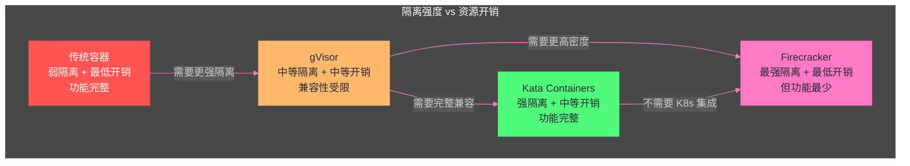

# 07 Firecracker 与 Cloud Hypervisor——MicroVM 的极简哲学

> [!abstract] 摘要
> [[05 gVisor——用户空间内核的系统调用拦截|第 5 篇]]和[[06 Kata Containers——硬件虚拟化的轻量容器|第 6 篇]]分别深入了"用户空间内核"和"完整 VM 硬件虚拟化"两条路线。本文深入第三条路线——Firecracker 的 MicroVM 极简哲学，以及它的"同胞兄弟"Cloud Hypervisor。Firecracker 由 AWS 开发，用于 Lambda 和 Fargate 的生产环境——它通过极致的"减法"设计实现了 ~125ms 启动、<5MB 内存开销、每秒 150 个 MicroVM 的创建速率：仅 6 个仿真设备、无 BIOS、无 USB、无图形、无 PCI 总线、无设备热插拔。文章深入 Firecracker 的三线程架构（API/VMM/vCPU）、jailer 安全伴生进程的权限降级机制、内置 token bucket rate limiter 的资源隔离设计、极简设备模型的攻击面最小化策略；然后转向 Cloud Hypervisor——同一 rust-vmm 生态但走了"中间路线"的 Rust VMM：支持 PCI/GPU passthrough、CPU/内存热插拔、live migration、Windows Guest——适合"长生命周期的有状态 VM"而非 Firecracker 的"短生命周期 serverless 函数"。最后对比 Firecracker、Cloud Hypervisor、Kata 三者在 Agent 沙箱场景中的适用性。核心认知：Firecracker 的"每个你不模拟的设备就是一个你不交付的 CVE"哲学，是"安全通过减法实现"的极致实践——但减法的代价是功能受限，Cloud Hypervisor 在同一技术基础上走了"足够精简但功能完整"的中间路线。

---

## 第 1 章 Firecracker——极致减法的 MicroVM

### 1.1 从 AWS Lambda 的需求出发

Firecracker 的设计不是学术研究——它直接来自 AWS Lambda 和 Fargate 的生产需求。AWS 在 2018 年的 NSDI 论文中明确阐述了设计动机：

> "We built Firecracker because we didn't want to choose between hypervisor-based virtualization (and the potentially unacceptable overhead related to it), and Linux containers (and the related compatibility vs. security tradeoffs)."

AWS 需要一种隔离方案，同时满足三个看似矛盾的目标：
- **VM 级隔离强度**——Lambda 上运行着不同客户的代码，必须保证隔离
- **容器级启动速度**——Serverless 函数需要毫秒级到秒级启动
- **极低资源开销**——单台服务器上运行数千个函数实例

传统 VM（QEMU/KVM）满足第一条但不满足第二、三条——QEMU 有 140 万行代码，启动一个完整 VM 需要数秒，内存开销数百 MB。传统容器满足第二、三条但不满足第一条——共享内核的隔离不够。

Firecracker 的解决方案是"保留 KVM，完全替换 QEMU"——用 Rust 从零构建一个极简的 VMM，只保留 Serverless 场景需要的最小功能。

### 1.2 极简设备模型——6 个设备就够了

Firecracker 的核心设计决策是**极简设备模型**——只模拟 6 个设备：

| 设备 | 用途 | 为什么需要 |
| :--- | :--- | :--- |
| **virtio-net** | 虚拟网络 | 函数需要网络访问 |
| **virtio-block** | 虚拟块设备 | 函数需要读写存储 |
| **virtio-vsock** | VM-宿主机通信 | Agent 通信通道 |
| **virtio-balloon** | 内存气球 | 动态内存回收 |
| **serial console** | 串口控制台 | 调试和日志输出 |
| **minimal keyboard controller** | 最小键盘控制器 | 重启控制 |

**不模拟的设备**（及其不模拟的原因）：
- **无 BIOS/UEFI**——Firecracker 直接加载内核镜像，不需要固件引导。这消除了固件中的潜在漏洞（BIOS/UEFI 是历史悠久的大规模代码库，漏洞众多）
- **无 PCI 总线**——使用 MMIO（Memory-Mapped I/O）而非 PCI 总线。PCI 总线支持设备热插拔和复杂配置，但也增加了大量模拟代码和攻击面
- **无 USB**——Serverless 函数不需要 USB 设备
- **无图形/GPU**——Serverless 函数不需要图形输出
- **无声卡**——Serverless 函数不需要音频

> [!info] 核心概念：每个你不模拟的设备就是一个你不交付的 CVE
> Firecracker 的设计哲学可以概括为"每个你不模拟的设备就是一个你不交付的 CVE"——减少模拟的设备数量，就直接减少了 VMM 的代码量和攻击面。QEMU 支持数百种设备，每种设备都有潜在的漏洞——Firecracker 只支持 6 种，将攻击面缩小了数量级。这不是"偷懒"——这是"安全通过减法实现"的工程哲学。在安全工程中，"代码量"与"漏洞数量"正相关——减少代码量是最有效的安全措施之一。Firecracker 的整个 VMM 代码量约 5 万行 Rust——相比 QEMU 的 140 万行 C，代码量减少了 28 倍，这直接对应了攻击面的显著缩小。

### 1.3 性能数据（官方规格）

Firecracker 的性能规格由集成测试强制保证——每次 PR 和主分支合并都会运行性能测试：

| 指标 | 规格 | 测试条件 |
| :--- | :--- | :--- |
| VMM 启动时间 | ≤ 8 CPU ms（到 API socket 可用） | 典型 12ms，范围 6-60ms |
| MicroVM 启动时间 | ≤ 125ms（到 /sbin/init） | 1 vCPU, 128MB RAM, 串口禁用, 精简内核 |
| 内存开销 | ≤ 5 MiB per microVM | 1 vCPU, 128MB RAM |
| 创建速率 | 150 microVMs/秒/主机 | 36 核主机上 180/秒 |
| CPU 性能 | > 95% 裸机性能 | compute-only 工作负载 |

**这些数字的含义**：
- **~125ms 启动**：从 API 调用到 Guest Linux 的 `/sbin/init` 开始执行——用户空间代码可以在 125ms 内开始运行。这比传统 VM（数秒）快一个数量级，虽然比传统容器（毫秒级）慢，但对于"不是每次请求都启动新 VM"的场景（使用预热池），启动延迟不是瓶颈
- **<5MB 内存开销**：Firecracker VMM 自身的内存开销（不包括 Guest OS）。这意味着在一个 64GB 内存的主机上，理论上可以运行 12000+ 个 Firecracker VMM 进程——实际受限于 Guest OS 的内存需求
- **150 microVMs/秒**：创建速率——每秒可以启动 150 个新 MicroVM。这对于"流量高峰期快速扩容"的场景至关重要

### 1.4 三线程架构

每个 Firecracker 进程封装一个且仅一个 MicroVM，运行三个类型的线程：

**API 线程**：负责 Firecracker 的 API 服务器和相关控制平面——接收配置 MicroVM 的 RESTful API 请求（如设置 vCPU 数量、配置网络接口、启动机器）。API 线程永远不在虚拟机的"快路径"（fast path）上——它只在配置和控制时活跃，不参与运行时的系统调用处理。

**VMM 线程**：暴露机器模型、最小遗留设备模型、MMDS（MicroVM Metadata Service）和 virtio 设备模拟——包括 I/O rate limiting。VMM 线程处理设备的模拟逻辑——当 Guest 发起 virtio-net 或 virtio-block 操作时，VMM 线程处理这些操作。

**vCPU 线程**（一个或多个）：通过 KVM 创建，运行 `KVM_RUN` 主循环——每个 Guest CPU 核对应一个 vCPU 线程。vCPU 线程执行同步 I/O 和内存映射 I/O 操作——它们是 Guest 代码实际运行的"载体"。

这种线程模型的分离确保了"控制平面"（API 线程）和"数据平面"（VMM + vCPU 线程）的解耦——API 线程的处理延迟不影响 Guest 的运行时性能。

### 1.5 AWS Lambda 的生产规模

Firecracker 的设计不是理论推演——它在 AWS Lambda 的生产环境中经过了极端规模的验证。根据 NSDI 2020 论文的数据，Firecracker 在 Lambda 中"powers millions of workloads and trillions of requests per month"——支撑每月数百万工作负载和数万亿次请求。这意味着 Firecracker 的每个设计决策——极简设备模型、~125ms 启动、<5MB 内存开销、150 microVMs/秒创建速率——都在这个极端规模下被反复验证。

**Lambda 的隔离需求背景**：AWS Lambda 是多租户的 Serverless 平台——不同客户的函数可能运行在同一台物理服务器上。如果客户 A 的函数被攻破，它不能影响客户 B 的函数，也不能影响宿主机。传统容器（namespace + cgroups）在这种"不同租户的不可信代码"场景下不够安全——一个内核漏洞可能导致跨租户逃逸。Firecracker 的 MicroVM 隔离确保了即使客户 A 的函数被攻破，逃逸需要 KVM 漏洞——这比内核漏洞少得多且更难利用。

**从 Lambda 到 Fargate**：Firecracker 不仅用于 Lambda——AWS Fargate（无服务器容器平台）也使用 Firecracker 作为底层隔离。Fargate 的使用场景比 Lambda 更接近"运行容器化应用"——每个 Fargate task 在一个 Firecracker MicroVM 中运行。这验证了 Firecracker 不仅适用于"短生命周期函数"，也适用于"较长生命周期的容器化应用"——对于 Agent 沙箱场景（Agent 可能需要运行数分钟到数小时），Fargate 的生产验证提供了重要的参考——Firecracker 的 MicroVM 模型不仅适合"秒级函数"，也适合"分钟到小时级的 Agent 任务"。

### 1.6 Firecracker 的 RESTful API 设计

Firecracker 通过 RESTful API 控制微型虚拟机的生命周期——这与 QEMU 的 QMP（QEMU Machine Protocol）或 Kata 的 shimv2 接口不同，Firecracker 选择了一个更通用的 HTTP API。

**API 端点**：Firecracker 启动后在一个 Unix domain socket 上监听 API 请求。API 使用 OpenAPI 规范定义——支持机器配置（vCPU 数量、内存大小）、驱动器配置（virtio-block 设备）、网络接口配置（virtio-net 设备）、启动/暂停等操作。

**API 的安全意义**：API socket 是 Firecracker 的唯一控制接口——没有其他方式可以配置或控制 MicroVM。jailer 确保 API socket 的文件权限只允许特定的控制进程访问——这意味着即使 MicroVM 内的攻击者逃逸到了 Firecracker 进程，它也无法通过 API socket 发送控制请求（因为 socket 的权限限制了访问者）。

**配置→启动→不可变**：Firecracker 的 API 设计有一个重要的安全特性——一旦 MicroVM 启动（`InstanceStart` API 调用），大部分配置变为不可变——不能在运行中添加新设备、改变 vCPU 数量或修改网络配置。这减少了"运行时配置篡改"的攻击面——攻击者即使获得了 API 访问权，也无法在 MicroVM 运行时改变其配置。

---

## 第 2 章 Jailer——安全伴生进程

### 2.1 为什么需要 jailer

Firecracker 进程本身需要一定的特权来操作 KVM——但如果 Firecracker 进程被攻破（VMM 漏洞导致逃逸），攻击者可能利用 Firecracker 进程的权限影响宿主机。jailer 的职责是**在启动 Firecracker 之前，把 Firecracker 进程的权限降到最低**。

### 2.2 jailer 的工作流程

jailer 是一个独立的二进制——在生产环境中，Firecracker 应该只通过 jailer 启动。jailer 的工作流程：

1. **创建 namespace**：jailer 为 Firecracker 进程创建新的 mount/pid/net/user namespace——隔离 Firecracker 的视图
2. **chroot**：jailer 把 Firecracker 进程的根目录改为一个专用目录——限制文件系统访问
3. **drop capabilities**：jailer 移除 Firecracker 进程的所有不必要的 capabilities——只保留 KVM 操作需要的最小权限
4. **设置 seccomp 过滤器**：jailer 安装 seccomp-bpf 过滤器——限制 Firecracker 进程能调用的系统调用
5. **切换用户**：jailer 把 Firecracker 进程切换为非 root 用户——进一步降低权限
6. **启动 Firecracker**：在上述所有安全措施就位后，jailer execve Firecracker 二进制

**效果**：即使攻击者通过 VMM 漏洞逃逸了 Firecracker 的 VM 隔离，它发现自己在一个高度受限的环境中——chroot 限制了文件系统访问、namespace 隔离了视图、seccomp 限制了系统调用、capabilities 被移除、非 root 用户——几乎没有能力进一步攻击宿主机。

### 2.3 jailer 的 cgroup 限制

除了上述安全措施，jailer 还把 Firecracker 进程放入一个专用的 cgroup——限制 Firecracker 进程自身的资源使用。这防止了一个边缘情况：如果 Firecracker 进程因为 bug（如内存泄漏）消耗大量资源，cgroup 限制确保它不会耗尽宿主机资源影响其他 MicroVM。这是"防御自身"的设计——不仅要防止 MicroVM 内的攻击者逃逸，还要防止 VMM 进程自身的异常行为影响系统稳定性。

### 2.4 jailer 与 Firecracker 的进程关系

jailer 和 Firecracker 的进程关系值得精确理解——jailer 不是"持续运行的守护进程"，它是"启动器"：

1. 用户（或管理系统）启动 jailer 进程，传入 Firecracker 二进制路径和配置参数
2. jailer 进程执行所有安全设置（namespace/chroot/drop capabilities/seccomp/切换用户）
3. jailer 进程 `execve` Firecracker 二进制——jailer 进程被 Firecracker 进程**替换**（不是 fork）
4. 此后，运行的是 Firecracker 进程（在 jailer 设置的安全沙箱内），jailer 进程已不存在

这种"execve 替换"设计意味着 jailer 不消耗持续资源——它只在启动时短暂运行，设置好安全环境后就把控制权交给 Firecracker。这也意味着"杀死 jailer 进程"不能影响已运行的 Firecracker——因为 jailer 进程已经不存在了。

> [!note] 设计哲学：jailer 是"防御纵深"的最后一层
> jailer 的设计体现了"防御纵深"原则——即使内层防御（VM 隔离）被突破，外层防御（jailer 的权限降级）仍然限制攻击者的影响。这种"不信任自身"的设计在安全关键系统中至关重要——任何 VMM 都可能有漏洞，jailer 确保即使 VMM 被攻破，影响也被限制在一个高度受限的进程中。这与传统容器的 seccomp + capabilities + user namespace 三重隔离的思路一致——不依赖单一防御层，而是多层叠加。

---

## 第 3 章 Rate Limiter——内置资源隔离

### 3.1 token bucket 算法

Firecracker 在每个 MicroVM 中内置了 rate limiter——对网络和存储 I/O 做速率限制。rate limiter 使用 **token bucket** 算法，基于两个桶：

**带宽桶**：限制每秒的字节数（B/s）——控制 I/O 吞吐量
**操作桶**：限制每秒的操作数（OPS）——控制 I/O 频率

每个桶由以下参数定义：
- **bucket size**：桶大小——允许的突发量
- **refill rate**：补充速率——持续速率限制
- **initial value**：初始值——启动时的 token 数
- **max burst**：最大突发——允许的短时间峰值

### 3.2 为什么 rate limiter 对 Agent 沙箱重要

在单台服务器上运行数千个 MicroVM 的场景中（如 AWS Lambda），如果没有 I/O 速率限制，一个"吵闹的"MicroVM 可以耗尽宿主机的网络带宽或磁盘 I/O——影响同主机上所有其他 MicroVM。rate limiter 确保每个 MicroVM 的 I/O 使用被限制在配额内——即使一个 MicroVM 尝试做大量 I/O，也不会影响其他 MicroVM。

对于 Agent 沙箱——Agent 可能执行大量文件读写或网络请求。Firecracker 的内置 rate limiter 让管理员可以精确控制每个 Agent 沙箱的 I/O 配额，而不需要依赖外部的 cgroup I/O 限制——这比 cgroup 的 io.max 更精细（可以分别限制网络和存储、带宽和 OPS）。

**Agent 沙箱的 rate limiter 配置实践**：对于典型的 Agent 沙箱，推荐的网络 rate limiter 配置是——带宽限制 10-50 MB/s（足够 API 调用和文件传输，但防止大规模数据外泄）、OPS 限制 1000-5000 ops/s（防止高频小包攻击）。存储 rate limiter 的推荐配置是——带宽限制 50-100 MB/s（足够代码执行和文件操作，但防止磁盘 I/O 耗尽）、OPS 限制 5000-10000 ops/s。这些值应根据宿主机硬件能力和 Agent 任务类型调整——关键是"设置一个上限"，即使 Agent 代码行为异常（如被 Prompt Injection 诱导做大量 I/O），也不会影响同主机上的其他 Agent 沙箱。

**rate limiter 与 Egress 过滤的配合**：Firecracker 的 rate limiter 限制 I/O 的"速率"——但不限制 I/O 的"目标"（如不限制连接到哪个 IP）。完整的 Agent 沙箱安全需要 rate limiter（限制速率）与 Egress 过滤（限制目标）配合使用——rate limiter 防止"吵闹邻居"，Egress 过滤防止"数据外泄"。本专栏第 10 篇将深入讨论 Egress 过滤的实现。

---

## 第 4 章 Cloud Hypervisor——同一生态，不同路线

### 4.1 同源但不同向

Cloud Hypervisor 和 Firecracker 的关系不是"竞争"——它们是同一 rust-vmm 生态中的"同胞兄弟"，共享大量底层代码（rust-vmm crates），但面向不同的使用场景。

**rust-vmm 生态**：rust-vmm 是一个社区项目，发布可复用的、经过审计的 Rust crates 用于构建 hypervisor——KVM 绑定、virtio 设备实现、Guest 内存管理等。Firecracker 实际上"先于"rust-vmm 存在并帮助催生了它——Firecracker 的一些组件被提取为 rust-vmm crates。Cloud Hypervisor 则重度依赖 rust-vmm crates。因此，当比较两者时，不是在比较两个不相关的代码库——而是在比较"同一工程哲学的不同范围决策"。

### 4.2 设计取向对比

| 维度 | Firecracker | Cloud Hypervisor |
| :--- | :--- | :--- |
| **设计目标** | 短生命周期 Serverless 函数 | 长生命周期有状态 VM |
| **开发者** | AWS | Linux Foundation（多组织） |
| **设备模型** | 6 个 virtio 设备，无 PCI | 更广的 virtio 设备集，有 PCI |
| **GPU passthrough** | ❌ | ✅（VFIO） |
| **CPU/内存热插拔** | ❌ | ✅ |
| **Live migration** | ❌ | ✅ |
| **Windows Guest** | ❌ | ✅ |
| **UEFI 固件启动** | ❌ | ✅ |
| **Jailer** | ✅（伴生安全进程） | seccomp 过滤 |
| **内置 rate limiter** | ✅（token bucket） | ❌ |
| **KVM 支持** | ✅ | ✅ |
| **MSHV 支持** | ❌ | ✅（Microsoft Hypervisor） |
| **启动时间** | ~125ms | < 100ms（直接内核启动） |
| **Kata Containers 集成** | ✅ | ✅（主要后端） |

### 4.3 为什么 Cloud Hypervisor 需要更多功能

Firecracker 的"极简"哲学适合 Serverless 函数——函数是短生命周期的、无状态的、不需要 GPU、不需要 live migration、不需要热插拔。但"有状态的长生命周期工作负载"需要更多功能：

**GPU passthrough**：ML 训练和推理工作负载需要 GPU——Cloud Hypervisor 支持 VFIO GPU passthrough，Firecracker 不支持。Fly.io 的 GPU 机器就用 Cloud Hypervisor 作为底层 VMM。

**Live migration**：长生命周期的 VM 需要在维护时迁移到另一台主机——Cloud Hypervisor 支持 live migration，Firecracker 不支持（Serverless 函数不需要迁移——直接在新主机上启动新实例即可）。

**CPU/内存热插拔**：长生命周期的 VM 的资源需求可能随时间变化——Cloud Hypervisor 支持运行时添加/移除 vCPU 和内存，Firecracker 不支持（函数实例的资源在创建时固定，不需要动态调整）。

**Windows Guest**：某些工作负载需要 Windows 环境——Cloud Hypervisor 支持 Windows 10/Server 2019 作为 Guest，Firecracker 只支持 Linux Guest。

> [!info] 核心概念：同一生态的"极简"与"足够"
> Firecracker 和 Cloud Hypervisor 的对比揭示了"极简"与"足够"两种设计哲学的差异。Firecracker 追求"极简"——只保留最小必需功能，一切非必需的都被移除。Cloud Hypervisor 追求"足够"——保留现代云工作负载需要的功能（GPU、热插拔、迁移），但仍然比 QEMU 精简得多。两种哲学没有优劣——Firecracker 适合"短生命周期、高密度、无状态"场景（Serverless），Cloud Hypervisor 适合"长生命周期、有状态、功能丰富"场景（云 VM、Agent 沙箱 with GPU）。选择哪个取决于你的工作负载特征。

### 4.4 rust-vmm 生态——共享的虚拟化基础

理解 Firecracker 和 Cloud Hypervisor 的关系，需要理解它们共同的基石——rust-vmm 生态。

**rust-vmm 是什么**：rust-vmm 是一个开源社区项目，由 Google、AWS、Intel、ARM 等公司共同推动——目标是发布可复用的、经过审计的 Rust crates 用于构建 VMM。这些 crates 覆盖了虚拟化的核心组件：

| rust-vmm crate | 功能 | 使用者 |
| :--- | :--- | :--- |
| `vm-memory` | Guest 物理内存管理 | Firecracker、Cloud Hypervisor、crosvm |
| `kvm-ioctls` | KVM ioctl 封装 | Firecracker、Cloud Hypervisor、crosvm |
| `virtio-device` | virtio 设备框架 | Cloud Hypervisor、crosvm |
| `vhost` | vhost 用户态后端 | Cloud Hypervisor |
| `linux-loader` | Linux 内核加载 | Firecracker、Cloud Hypervisor |

**代码共享的安全价值**：rust-vmm 的核心价值不只是"避免重复造轮子"——更重要的价值是"共享审计"。这些 crates 被多个 VMM 使用，意味着它们的代码被多个项目和公司的安全团队审查——漏洞更容易被发现和修复。一个在 `vm-memory` 中发现的漏洞修复，会让所有使用它的 VMM（Firecracker、Cloud Hypervisor、crosvm）同时受益。

**Firecracker 对 rust-vmm 的贡献**：Firecracker 实际上"先于"rust-vmm 存在——AWS 在开发 Firecracker 的过程中，把一些通用组件提取为独立 crates 并贡献给社区，形成了 rust-vmm 的种子。后来 Intel 在开发 Cloud Hypervisor 时重度使用 rust-vmm crates——因此 Firecracker 和 Cloud Hypervisor 的关系不是"两个独立项目碰巧用了相同技术"，而是"Firecracker 帮助创建了 rust-vmm，Cloud Hypervisor 在 rust-vmm 上构建"。

**Google crosvm——第三个同胞**：除了 Firecracker 和 Cloud Hypervisor，rust-vmm 生态中还有 Google 的 crosvm——Chrome OS 的 VMM。crosvm 也是 Rust 编写、基于 rust-vmm、极简设计。三个 VMM（Firecracker/Cloud Hypervisor/crosvm）共享 rust-vmm crates 但面向不同场景：Firecracker→Serverless、Cloud Hypervisor→云工作负载、crosvm→Chrome OS Android 应用。这种"同源不同向"的生态格局对 Agent 沙箱领域有积极意义——无论你选择哪个 Rust VMM，底层的核心组件（内存管理、KVM 接口、virtio 设备框架）都是共享的、经过多项目审计的代码——这比每个 VMM 各自实现一套基础组件的方案更安全、更可靠。

---

## 第 5 章 在 Agent 沙箱中的应用

### 5.1 Firecracker 在 Agent 沙箱中的角色

Firecracker 是多个 Agent 沙箱平台的底层隔离技术：

**E2B**：E2B 是专门为 AI Agent 代码执行设计的云端沙箱——底层使用 Firecracker MicroVM。E2B 的架构在下一篇文章中深入讨论。

**Fly.io Machines**：Fly.io 的 Machines 基于 Firecracker——支持 suspend/resume，停止或挂起的 Machine 不对 CPU 和 RAM 计费。这对于"Agent 长时间等待用户输入"的场景很有价值——Agent 挂起时不消耗计算资源。

**自建 Agent 沙箱**：对于自建 Agent 沙箱平台，可以直接使用 Firecracker API 创建和管理 MicroVM——Firecracker 提供 RESTful API，可以通过 HTTP 调用配置 vCPU、内存、网络、存储，然后启动机器。

### 5.2 Cloud Hypervisor 在 Agent 沙箱中的角色

Cloud Hypervisor 作为 Kata Containers 的主要 VMM 后端——在 GKE Agent Sandbox 等平台中，当选择 Kata 作为隔离后端时，底层可能使用 Cloud Hypervisor 而非 QEMU（Cloud Hypervisor 更轻量、更快）。

**Azure AKS Pod Sandboxing**：Azure 的 AKS Pod Sandboxing 使用 Cloud Hypervisor 作为 VMM——运行在 Microsoft Hypervisor（MSHV）之上，而非 KVM。这展示了 Cloud Hypervisor 的"跨 hypervisor"能力——可以在 KVM 和 MSHV 上运行。

### 5.3 Firecracker vs Kata with Cloud Hypervisor——Agent 沙箱的选型

| 维度 | 直接用 Firecracker | Kata with Cloud Hypervisor |
| :--- | :--- | :--- |
| **K8s 集成** | 需要自己实现 | 原生 CRI 集成 |
| **API** | RESTful API（直接控制） | CRI + shimv2 |
| **隔离强度** | VM 级（KVM + jailer） | VM 级（KVM/MSHV + seccomp） |
| **GPU 支持** | ❌ | ✅（Cloud Hypervisor VFIO） |
| **Live migration** | ❌ | ✅（Cloud Hypervisor） |
| **Rate limiting** | 内置 token bucket | 通过 cgroup |
| **密度** | 最高（<5MB 开销） | 高但低于直接 Firecracker |
| **适用场景** | 自建沙箱平台、Serverless Agent | K8s 原生 Agent 沙箱 |

**选择建议**：
- 如果你在构建**自定义 Agent 沙箱平台**（非 K8s 原生），直接用 Firecracker API——最轻量、最灵活、密度最高
- 如果你在 **K8s 集群中**运行 Agent 沙箱，用 Kata with Cloud Hypervisor——原生 CRI 集成，享受 K8s 的调度和管理能力
- 如果 Agent 需要 **GPU**，用 Kata with Cloud Hypervisor——Firecracker 不支持 GPU passthrough
- 如果你的 Agent 沙箱需要 **live migration**（如宿主机维护时不中断 Agent 工作），用 Kata with Cloud Hypervisor——Cloud Hypervisor 支持 live migration，Firecracker 不支持
- 如果你的 Agent 沙箱需要 **suspend/resume**（如 Agent 长时间等待用户输入时挂起以节省资源），直接用 Firecracker——通过 Firecracker 的 snapshot/restore API 实现，或使用 Fly.io Machines 等基于 Firecracker 的平台（内置 suspend/resume 支持）

---

## 第 6 章 三条技术路线的终极对比

| 维度 | gVisor | Kata Containers | Firecracker |
| :--- | :--- | :--- | :--- |
| **隔离机制** | 用户空间内核（Sentry） | 硬件虚拟化（VM） | 硬件虚拟化（MicroVM） |
| **信任边界** | Sentry 进程 | hypervisor | KVM + jailer |
| **Guest 内核** | 无（Sentry 实现 ABI） | 真实 Linux 内核 | 真实 Linux 内核（精简配置） |
| **兼容性** | ~82% 系统调用 | 100% | 100%（但设备模型受限） |
| **启动时间** | 亚秒级 | 秒级 | ~125ms |
| **内存开销** | 中等 | 较高（Guest OS） | < 5MB |
| **密度** | 高 | 中 | 最高 |
| **I/O 性能** | 10-30% 开销 | 接近原生 | 接近原生 |
| **GPU 支持** | ❌ | ✅ | ❌ |
| **K8s 集成** | runsc OCI 运行时 | 原生 CRI | 通过 Kata 或自定义 |
| **代码量** | ~50万行 Go | ~30万行 Rust | ~5万行 Rust |
| **生产验证** | GKE Sandbox | AKS/EKS | AWS Lambda/Fargate |
| **适合 Agent** | 高密度 CPU 密集型 | K8s 原生 + GPU 需求 | 自建高密度平台 |

> [!info] 核心概念：三条路线不是"谁最好"而是"谁最适合"
> gVisor、Kata、Firecracker 三条技术路线不是"谁最好"的竞赛——它们各自针对不同的约束组合做了优化。gVisor 优化"密度和兼容性的平衡"——用软件隔离换密度。Kata 优化"K8s 原生体验和完整兼容"——用 VM 开销换无缝集成。Firecracker 优化"极致轻量和极致隔离"——用功能减法换极低开销和极小攻击面。Agent 沙箱的选型应该基于具体约束：需要 K8s 原生体验？→ Kata。需要极致密度和性能？→ Firecracker。需要平衡且 CPU 密集？→ gVisor。需要 GPU？→ Kata with Cloud Hypervisor。没有任何一个方案在所有维度上最优——选型的本质是"认清自己的约束，选择最匹配的方案"。

---

## 第 7 章 总结与下一篇导读

### 7.1 本文核心要点

1. **Firecracker 的极简哲学**："每个你不模拟的设备就是一个你不交付的 CVE"——仅 6 个设备、无 BIOS/PCI/USB/GPU、~5 万行 Rust 代码——安全通过减法实现
2. **性能规格**：~125ms 启动、<5MB 内存、150 microVMs/秒、>95% 裸机 CPU 性能——由集成测试强制保证
3. **三线程架构**：API 线程（控制平面）+ VMM 线程（设备模拟）+ vCPU 线程（Guest 执行）——控制与数据平面解耦
4. **jailer 安全伴生进程**：namespace + chroot + drop capabilities + seccomp + 非 root 用户——防御纵深的最后一层
5. **内置 rate limiter**：token bucket 算法，带宽桶 + 操作桶——内置 I/O 隔离，适合高密度多租户
6. **Cloud Hypervisor 是"同胞兄弟"**：同 rust-vmm 生态，但面向"长生命周期有状态 VM"——支持 GPU passthrough、live migration、热插拔、Windows Guest
7. **三条路线终极对比**：gVisor（软件隔离，高密度）vs Kata（VM 隔离，K8s 原生）vs Firecracker（MicroVM，极致轻量）——选型基于约束而非优劣

### 7.2 下一篇导读

本文完成了"轻量虚拟化"三部曲（gVisor → Kata → Firecracker/Cloud Hypervisor）。接下来第 8-9 篇将转向"Agent 专用沙箱"——E2B、Daytona、OpenHands Runtime 等专为 AI Agent 代码执行设计的云端沙箱平台。这些平台在上述底层隔离技术之上，构建了 Agent 友好的 API、SDK 和管理界面——让 Agent 开发者不需要直接操作 gVisor/Kata/Firecracker 的底层 API，而是通过更高层的抽象使用沙箱。

> [!info] 专栏导航
> 本文是 [[00 专栏导览|Agent 沙箱与隔离技术专栏]] 的第 7 篇，完成"轻量虚拟化"主题。接下来第 8 篇 [[08 E2B、Daytona 与 Agent 专用云端沙箱]] 将讨论基于 Firecracker 的 E2B 和基于容器的 Daytona。

---

## 参考文献

1. Firecracker Official Site. https://firecracker-microvm.github.io/
2. Firecracker Design Document. https://github.com/firecracker-microvm/firecracker/blob/v1.16.0/docs/design.md
3. Firecracker Specification. https://github.com/firecracker-microvm/firecracker/blob/448df604b0ff8c3c9e7e98cb7808dd51c25a1d58/SPECIFICATION.md
4. Agache et al. "Firecracker: Lightweight Virtualization for Serverless Applications." NSDI 2020. https://www.usenix.org/system-files/nsdi20-paper-agache.pdf
5. Firecracker GitHub. https://github.com/firecracker-microvm/firecracker
6. "Firecracker vs Cloud Hypervisor." Northflank. https://northflank.com/blog/firecracker-vs-cloud-hypervisor
7. Cloud Hypervisor GitHub. https://github.com/cloud-hypervisor/cloud-hypervisor
8. "Guide to Cloud Hypervisor in 2026." Northflank. https://northflank.com/blog/guide-to-cloud-hypervisor
9. "Firecracker vs Cloud Hypervisor: Pick a VMM." PandaStack. https://www.pandastack.ai/blog/firecracker-vs-cloud-hypervisor/
10. "Cloud Hypervisor Research." Ry Walker. https://rywalker.com/research/cloud-hypervisor

---

## 思考题

1. **Firecracker 不支持 PCI 总线——使用 MMIO 而非 PCI。但 [[06 Kata Containers——硬件虚拟化的轻量容器|第 6 篇]]提到 Kata 的 Dragonball 从 MMIO 切换到 PCI + MSIX 中断获得了 34% 的 I/O 性能提升。这是否意味着 Firecracker 的"无 PCI"设计在 I/O 性能上有劣势？Firecracker 如何在不使用 PCI 的情况下保持高 I/O 性能？** 提示：考虑 Firecracker 的目标场景——Serverless 函数通常不是 I/O 密集型的（它们主要是计算+少量网络请求），34% 的 I/O 性能提升对 Serverless 场景可能不关键。Firecracker 选择了"更小攻击面"而非"更高 I/O 性能"。

2. **Firecracker 的 jailer 和传统容器的 seccomp + capabilities + user namespace 做的事情类似——都是"权限降级"。为什么 Firecracker 还需要 jailer，而不是直接用容器隔离技术？** 提示：考虑隔离对象的不同——容器隔离的是"容器内的进程"，jailer 隔离的是"Firecracker VMM 进程本身"。VMM 进程需要访问 KVM 设备（/dev/kvm），这是普通容器隔离不容易安全处理的——jailer 专门为"VMM 进程的权限降级"做了定制化设计。

3. **Cloud Hypervisor 支持 live migration 而 Firecracker 不支持。对于 Agent 沙箱，live migration 有什么价值？什么场景下需要它？** 提示：考虑"宿主机维护"场景——当运行 Agent 沙箱的宿主机需要维护（内核升级、硬件更换）时，live migration 可以把 Agent 沙箱迁移到另一台宿主机而不中断工作。如果没有 live migration，Agent 需要停止和重启——对于长时任务的 Agent，这可能意味着丢失工作进度。但如果有快照/恢复机制（如 GKE Pod Snapshots），可以用"快照→迁移→恢复"替代 live migration。
