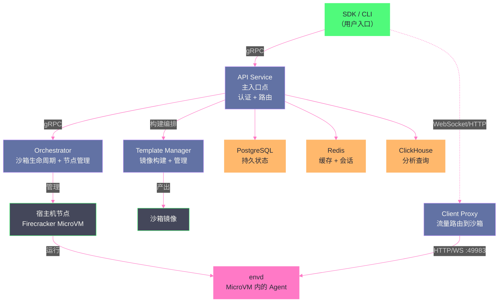

# 08 E2B、Daytona 与 Agent 专用云端沙箱

> [!abstract] 摘要
> 前 7 篇深入了从 Linux namespace 到 Firecracker 的底层隔离技术。本文转向在这些技术之上构建的"Agent 专用云端沙箱平台"——E2B 和 Daytona。这些平台不发明新的隔离技术，而是把 Firecracker/容器的底层能力包装成 Agent 开发者友好的 API 和 SDK——让开发者不需要直接操作 MicroVM 的配置 API，而是通过 `Sandbox.create()` 这样的高级抽象创建隔离环境。文章深入 E2B 的五组件架构（API Service/Orchestrator/Client Proxy/Template Manager/envd）、基于 fork 的 Firecracker 运行时、Code Interpreter SDK 的 Jupyter 风格代码执行、Desktop Sandbox 的计算机使用能力；然后剖析 Daytona 的三种沙箱类型（容器/VM/GPU）、沙箱类（small/medium/large/gpu/windows）、Fork/Pause/Resume/Snapshot 生命周期、与 OpenAI Agents SDK 的原生集成、Computer Use 支持；最后讨论共性架构（MicroVM/容器 + 网络隔离 + 资源限制 + 快照恢复 + 模板系统）和标准化缺失问题。核心认知：Agent 专用沙箱的核心价值不是"更强的隔离"，而是"更低的采用门槛"——把 Firecracker 的底层复杂性隐藏在 `Sandbox.create()` 之下，让 Agent 开发者可以像创建一个变量一样创建一个安全沙箱。

---

## 第 1 章 E2B——基于 Firecracker 的 AI 原生沙箱

### 1.1 定位与核心特性

E2B（e2b.dev）是一个开源的 AI Agent 代码执行基础设施——为 AI 生成的代码提供安全隔离的云端沙箱。它的核心定位是"AI 原生"——不是通用沙箱平台恰好也能用于 AI，而是从一开始就为 AI Agent 场景设计。

**核心特性**：
- 基于 fork 的 Firecracker microVM 运行时——继承 Firecracker 的 ~125ms 启动和 <5MB 内存开销
- 冷启动 < 200ms，运行最长 24 小时
- 支持 pause/resume/snapshot——长时任务的状态持久化
- JavaScript SDK（`@e2b/code-interpreter`）和 Python SDK（`e2b-code-interpreter`）
- Code Interpreter SDK——Jupyter 风格的代码执行，返回结构化结果（stdout/stderr/text/png/jpeg/svg/html/markdown/latex）
- Desktop Sandbox——为 Computer Use Agent 提供桌面环境
- 自定义模板系统——定义、构建、版本化、发布可复用的沙箱基础镜像
- Apache 2.0 开源，支持自托管（AWS/GCP/Azure/裸机）
- LLM 无关——不绑定特定 LLM 厂商

### 1.2 五组件架构

E2B 的基础设施是一个分布式 Go 系统，由五个核心服务组成：



**API Service**：主入口点——SDK 和 CLI 的所有请求首先到达 API Service。负责认证（API Key + JWT 验证）、请求路由、与 Orchestrator 和 Template Manager 通信。

**Orchestrator Service**：沙箱生命周期管理和节点管理——决定在哪个宿主机节点上创建 MicroVM、管理 MicroVM 的启动/暂停/恢复/销毁、通过 Consul 做服务发现。

**Client Proxy**：WebSocket 和 HTTP 流量路由——SDK 与沙箱内的 envd 之间的通信通过 Client Proxy 中转。Client Proxy 把外部流量路由到正确的 MicroVM（通过 envd 的 49983 端口）。

**Template Manager**：构建编排和镜像管理——用户定义沙箱模板（如"Python 3.11 + numpy + pandas"），Template Manager 负责构建这个模板的镜像，后续创建的沙箱从该镜像启动。

**Environment Daemon（envd）**：运行在 MicroVM 内部的 Agent 进程——它是 SDK 在沙箱内的"代理人"。SDK 的每个操作（运行代码、读写文件、执行命令）都通过 Client Proxy 路由到 envd，由 envd 在 MicroVM 内执行。

### 1.3 Code Interpreter SDK——Jupyter 风格的代码执行

E2B 的 Code Interpreter SDK 是其最独特的 Agent 友好特性——它把沙箱包装成一个"Jupyter 风格的代码解释器"，让 Agent 可以像在 Jupyter Notebook 中一样执行代码。

```python
from e2b_code_interpreter import Sandbox

with Sandbox.create() as sandbox:
    sandbox.run_code("x = 1")
    execution = sandbox.run_code("x += 1; x")
    print(execution.text)  # 输出 2
```

**关键特性——状态保持**：连续的 `run_code` 调用共享同一个 Python 环境——第一次调用定义的变量 `x` 在第二次调用中可用。这让 Agent 可以"分步执行"复杂代码——先定义函数，再调用函数，再处理结果——而不需要把所有代码放在一个脚本中。

**结构化结果**：`run_code` 返回的 `Execution` 对象包含结构化的结果——`stdout`（标准输出）、`stderr`（标准错误）、`text`（文本结果）、`png`/`jpeg`（图片结果）、`svg`/`html`/`markdown`/`latex`（格式化结果）。这让 Agent 可以处理"代码生成了图表"这类场景——图表作为 PNG 返回，Agent 可以把它展示给用户或做进一步分析。

**多语言支持**：虽然默认是 Python，但通过 `language` 参数可以指定其他语言——SDK 支持在同一个沙箱中运行多种语言的代码。

> [!info] 核心概念：Code Interpreter 是"Agent 的代码 REPL"
> E2B 的 Code Interpreter SDK 本质上是"Agent 的代码 REPL"——就像人类开发者用 Jupyter Notebook 交互式地探索数据一样，Agent 用 Code Interpreter 交互式地执行代码。这种"交互式代码执行"模式比"一次性运行整个脚本"更适合 Agent 的工作方式——Agent 可以"执行→观察结果→调整→再执行"，而非"一次性生成完整脚本然后祈祷它正确运行"。这与 [[LLM/Coding-Agent运行范式/02 ReAct 架构深度解析——Thought-Action-Observation 循环的本质|Coding Agent 专栏第 2 篇]]讨论的 ReAct 循环完美契合——Code Interpreter 的 `run_code` 就是 Action，返回的 `Execution` 就是 Observation。

### 1.4 Desktop Sandbox——Computer Use 支持

E2B 还提供 Desktop Sandbox——为 Computer Use Agent（如 [[LLM/Coding-Agent运行范式/08 Devin 与 ACI 设计——为 Agent 认知而生的计算机接口|Devin 的 Computer Use]]）提供完整的桌面环境。Desktop Sandbox 在 Firecracker MicroVM 内运行 Linux 桌面环境——Agent 可以截图、点击、输入、滚动，像人类操作桌面一样操作沙箱内的应用。

### 1.5 自定义模板系统

E2B 的模板系统让开发者定义可复用的沙箱基础镜像：

```toml
# e2b.toml 示例
template_name = "my-agent-sandbox"
dockerfile = "Dockerfile"
cpu = 2
memory = 512  # MB
```

模板通过 `e2b build` 命令构建——构建过程缓存层、支持版本化、可以标记为公开或团队私有。后续创建的沙箱从模板镜像启动——不需要每次都安装依赖包。这对于"Agent 需要特定运行环境"的场景很有价值——如"Agent 需要 Python 3.11 + PyTorch + CUDA"的模板，构建一次，后续所有沙箱从该模板启动。

### 1.6 envd——沙箱内的代理人

E2B 架构中一个关键但容易被忽视的组件是 envd（Environment Daemon）——运行在每个 Firecracker MicroVM 内部的 Agent 进程。理解 envd 的角色对于理解 E2B 的完整工作流至关重要。

**envd 的职责**：
- 接收来自 Client Proxy 的操作请求（运行代码、读写文件、执行命令）
- 在 MicroVM 内执行这些操作
- 返回执行结果给 Client Proxy，再由 Client Proxy 路由回 SDK

**envd 与 SDK 的通信链路**：
```
用户代码 → SDK → API Service → Client Proxy → envd（MicroVM 内）→ 执行 → 返回
```
这个通信链路涉及多次网络跳转——SDK 到 API Service（gRPC）、API Service 到 Client Proxy、Client Proxy 到 envd（HTTP/WebSocket on port 49983）。每次跳转都有延迟——但 E2B 的设计把这些延迟控制在可接受范围内（通常在毫秒级，对于 Agent 的"不是实时交互"的工作模式可接受）。

**envd 的安全角色**：envd 是 MicroVM 内的"受控入口"——所有来自外部的操作请求都通过 envd 执行。这意味着即使 Agent 代码在 MicroVM 内获得了特权（如 root 权限），它也只能通过 envd 暴露的接口与外部通信——envd 不暴露通用的"宿主机访问"能力，只暴露"在 MicroVM 内执行操作"的能力。这是一种"最小暴露面"设计——减少沙箱内代码能影响外部的路径。

### 1.7 E2B 的 fork 版 Firecracker

E2B 使用的是"fork 版"的 Firecracker——不是上游原版，而是 E2B 团队维护的一个定制版本。fork 的原因包括：

- **快照/恢复优化**：E2B 的 pause/resume/snapshot 功能需要 Firecracker 支持 checkpoint/restore——上游 Firecracker 的 snapshot 功能有限，E2B 的 fork 版可能包含增强的快照能力
- **模板快速启动**：E2B 的 < 200ms 冷启动可能依赖 fork 版中的优化——如更快的内核加载、预初始化的设备状态
- **envd 集成**：envd 需要与 Firecracker 的某些内部机制交互（如 vsock 通信），fork 版可能包含相关补丁

**fork 的风险**：维护一个 Firecracker 的 fork 版意味着需要持续合并上游的安全补丁——如果 E2B 团队未能及时合并一个关键安全修复，他们的 fork 版可能包含已知漏洞。这是"定制化 vs 安全更新及时性"的取舍——E2B 选择了定制化以获得更好的 Agent 沙箱体验，但需要承担"及时合并上游安全补丁"的责任。

### 1.8 E2B 的生产案例

E2B 被多个 AI 公司和实验室用于生产环境——包括构建代码解释器、深度研究 Agent、数据分析功能、强化学习环境和 Computer Use Agent。以下是一些典型使用模式：

**代码解释器模式**：LLM 生成代码 → 通过 Code Interpreter SDK 在 E2B 沙箱中执行 → 返回结构化结果（文本/图表/数据）给 LLM → LLM 基于结果继续推理。这是 ChatGPT Code Interpreter 的开源等价物——任何 LLM 应用都可以通过 E2B 获得"安全执行 AI 生成代码"的能力。

**深度研究 Agent 模式**：Agent 需要长时间运行（数小时）——在 E2B 沙箱中安装研究工具、下载数据集、运行分析脚本。pause/resume 让 Agent 可以在"等待数据下载"时暂停（不消耗 CPU），下载完成后恢复。24 小时的最长运行时间覆盖了大部分研究任务的时长。

**强化学习环境模式**：E2B 沙箱作为 RL Agent 的"训练环境"——Agent 在沙箱中执行动作（代码执行）、获取观测（执行结果）、获得奖励（基于结果质量）。沙箱的隔离确保 RL Agent 的探索性代码执行不会影响宿主机——即使 Agent 尝试了"危险"的动作（如删除文件），影响也限于沙箱内。

---

## 第 2 章 Daytona——多类型沙箱与 OpenAI Agents SDK 集成

### 2.1 定位与沙箱类型

Daytona 是一个开源的开发环境管理平台，其沙箱功能专为 AI Agent 设计。与 E2B 专注 Firecracker MicroVM 不同，Daytona 提供三种沙箱类型——容器、VM、GPU——覆盖更广的使用场景：

| 沙箱类型 | 隔离机制 | 适用场景 | 特殊能力 |
| :--- | :--- | :--- | :--- |
| **容器**（默认） | Linux 容器 | 通用代码执行 | 最快启动 |
| **VM** | Linux VM / Windows | 需要完整 OS | Fork/Pause/Resume/Snapshot |
| **GPU** | 容器 + NVIDIA GPU | ML 推理/训练/CUDA | GPU 加速 |

### 2.2 沙箱类——预配置的资源规格

Daytona 提供预配置的沙箱类（Sandbox Class），简化资源规格选择：

| 沙箱类 | vCPU | 内存 | 存储 | GPU | 类型 |
| :--- | :--- | :--- | :--- | :--- | :--- |
| `daytona-small` | 1 | 1GiB | 3GiB | — | 容器 |
| `daytona-medium` | 2 | 4GiB | 8GiB | — | 容器 |
| `daytona-large` | 4 | 8GiB | 10GiB | — | 容器 |
| `daytona-gpu` | 1 | 1GiB | 1GiB | 1 | GPU |
| `daytona-vm-small` | 1 | 1GiB | 3GiB | — | Linux VM |
| `daytona-vm-medium` | 2 | 4GiB | 8GiB | — | Linux VM |
| `daytona-vm-large` | 4 | 8GiB | 10GiB | — | Linux VM |
| `windows-small` | 1 | 4GiB | 30GiB | — | Windows |
| `windows-medium` | 2 | 8GiB | 50GiB | — | Windows |
| `windows-large` | 4 | 16GiB | 50GiB | — | Windows |

这种"预配置类"的设计让开发者不需要手动指定每个资源参数——选择一个类名即可。对于需要自定义资源的场景，Daytona SDK 也支持指定 `cpu`/`memory`/`disk` 参数。

### 2.3 VM 沙箱的高级生命周期

Daytona 的 VM 沙箱支持容器沙箱不具备的高级生命周期操作：

**Fork**：从一个运行中的沙箱创建一个副本——新沙箱继承了原沙箱的文件系统状态和内存快照。这对于"从一个基础环境快速创建多个相同配置的 Agent 沙箱"很有价值——先配置一个沙箱（安装依赖、设置环境），然后 fork 出多个副本给不同的 Agent 任务。

**Pause/Resume**：暂停沙箱（保存状态但释放 CPU）和恢复（从暂停状态继续）。这对于"Agent 等待用户输入"的场景很有价值——Agent 挂起时不消耗 CPU 资源，用户回来时从挂起点继续。

**Snapshot**：创建沙箱的完整快照——可以后续从快照创建新沙箱。与 Pause 不同，Snapshot 创建的是一个持久化的副本——即使原沙箱被销毁，快照仍然存在。

### 2.4 与 OpenAI Agents SDK 的原生集成

Daytona 最独特的特性是与 OpenAI Agents SDK 的原生集成——通过 `pip install openai-agents[daytona]` 安装后，可以直接在 Agents SDK 中使用 Daytona 沙箱：

```python
from agents import Runner, RunConfig
from agents.sandbox import Manifest, SandboxAgent, SandboxRunConfig
from agents.sandbox.capabilities import Shell
from agents.extensions.sandbox import DaytonaSandboxClient, DaytonaSandboxClientOptions

# 声明式定义工作空间内容
manifest = Manifest(
    root="/home/daytona/workspace",
    entries={
        "data/sales.csv": File(content=b"quarter,revenue\nQ1,3200000\n..."),
        "requirements.txt": File(content=b"pandas\nmatplotlib"),
    }
)

# 创建在沙箱中运行的 Agent
agent = SandboxAgent(
    name="Data Analyst",
    model="gpt-5.4",
    instructions="You're a data analyst with shell access to a sandbox...",
    default_manifest=manifest,
    capabilities=[Shell()],
)

# 配置 Daytona 作为沙箱后端
client = DaytonaSandboxClient()
run_config = RunConfig(
    sandbox=SandboxRunConfig(client=client, options=DaytonaSandboxClientOptions())
)

# 运行 Agent
result = Runner.run_streamed(
    agent,
    "Which quarter had the highest revenue? Write a script to plot the trend.",
    run_config=run_config,
)
```

**关键设计——Manifest 声明式工作空间**：`Manifest` 让开发者声明式地定义沙箱的初始文件内容——Agent 启动时，这些文件自动出现在沙箱的工作空间中。这比"Agent 启动后自己创建文件"更可靠——文件在 Agent 开始工作前就已经就位。

**Capabilities 系统**：`capabilities=[Shell()]` 声明 Agent 在沙箱中拥有 shell 执行能力——这是 [[LLM/Coding-Agent运行范式/12 Agent 权限与审批模型——人在环路的工程实践|Coding Agent 专栏第 12 篇]]讨论的"权限声明"在沙箱层面的应用——Agent 的能力被显式声明和限制。

### 2.5 Computer Use 支持

Daytona 也支持 Computer Use——通过 `sandbox.computer_use` API 暴露桌面操作能力：

```python
# Daytona 的 Computer Use API
sandbox.computer_use.screenshot.take_full_screen()  # 截图
sandbox.computer_use.mouse.click(x, y)              # 点击
sandbox.computer_use.mouse.move(x, y)               # 移动
sandbox.computer_use.mouse.scroll(direction)        # 滚动
sandbox.computer_use.mouse.drag(x1, y1, x2, y2)    # 拖拽
sandbox.computer_use.keyboard.type(text)            # 输入
sandbox.computer_use.keyboard.press(key)            # 按键
```

OpenAI Agents SDK 的 Computer Use 工具通过 `AsyncComputer` 接口与 Daytona 的桌面沙箱对接——Agent 使用 Computer Use 工具时，底层调用 Daytona 的 `computer_use` API 操作沙箱内的桌面环境。

> [!note] 设计哲学：Daytona 是"Agent 沙箱的 K8s"
> Daytona 的设计哲学可以类比为"Agent 沙箱的 Kubernetes"——K8s 把"在服务器上运行容器"的复杂性隐藏在 `kubectl create` 之下，Daytona 把"在云端创建隔离沙箱"的复杂性隐藏在 `Sandbox.create()` 之下。开发者不需要知道底层用的是 Firecracker 还是容器、不需要配置 cgroup 限制或 seccomp profile——只需要选择一个沙箱类（`daytona-medium`）或指定资源参数（`cpu=2, memory=4`）。这种"高层抽象"让 Agent 开发者可以专注于业务逻辑而非基础设施——与 K8s 让应用开发者专注于应用而非服务器管理的价值主张一致。

### 2.6 Daytona 的生产案例与使用模式

Daytona 在生产中有多种典型的使用模式，以下通过几个具体场景说明：

**Text-to-SQL Agent 模式**：Daytona 官方文档提供了一个完整的 Text-to-SQL Agent 案例——Agent 在 Daytona 沙箱中运行，使用 SQLite 数据库回答自然语言问题。关键特性包括：跨会话记忆（Agent 从之前的对话中学习）、pause/resume（用户离开后沙箱挂起，回来时恢复，不需要重新下载数据）、签名预览 URL（查询结果可通过沙箱暴露的端口下载）。这个模式展示了 Daytona 的"长生命周期有状态沙箱"价值——Agent 的工作环境在会话间持续存在，不每次从头开始。

**Computer Use Agent 模式**：OpenAI 的 Cookbook 提供了一个完整的 Daytona + Computer Use 案例——Daytona 沙箱运行 Linux 桌面（Xvfb + VNC），OpenAI Agents SDK 的 Computer Use 工具通过 `AsyncComputer` 接口操作这个桌面。Agent 可以看到浏览器中的第三方仪表板、管理面板、表单——这些是没有公共 API 但有 Web 界面的系统。Agent 通过截图→分析→点击/输入的循环操作这些界面，完成"人类需要登录后台手动操作"的任务。

**多 Agent 并行模式**：Daytona 的 Fork 能力让"从一个基础环境快速创建多个相同配置的沙箱"变得简单——先配置一个沙箱（安装依赖、准备数据），然后 fork 出多个副本，每个副本分配给一个 Agent 任务。这对于"同一分析对多个数据集并行执行"的场景很有价值——每个 Agent 沙箱处理一个数据集，互不干扰，但都从相同的基础环境启动。

### 2.7 Daytona 的自托管能力

Daytona 支持完全自托管——企业可以在自己的 AWS/GCP/Azure/裸机服务器上运行 Daytona 平台。自托管的价值包括：

**数据主权**：敏感数据不离开企业自己的基础设施——对于金融、医疗等合规敏感行业，Agent 处理的数据（可能包含客户信息、商业秘密）不能发送到第三方沙箱平台。自托管确保数据始终在企业控制的范围内。

**网络隔离**：自托管的 Daytona 可以部署在企业内网中——Agent 沙箱只能访问内网资源，无法连接外网。这比"公网沙箱 + Egress 过滤"更安全——物理隔离比逻辑过滤更强。

**成本控制**：对于大量使用沙箱的场景（如每天运行数千个 Agent 任务），自托管的固定成本可能低于按使用量付费的托管服务。但这需要企业自己承担运维成本——服务器管理、安全更新、故障恢复。

---

## 第 3 章 Agent 专用沙箱的共性架构

### 3.1 五个共性组件

尽管 E2B 和 Daytona 在底层技术选择和 API 设计上不同，它们的架构都包含五个共性组件：

**组件一：隔离边界**
- E2B：Firecracker MicroVM（fork 版本）
- Daytona：容器 / VM / GPU（多类型选择）

**组件二：资源限制**
- E2B：通过 Firecracker 配置 vCPU/RAM + 内置 rate limiter
- Daytona：通过沙箱类预配置 + 自定义参数

**组件三：网络控制**
- E2B：沙箱有独立网络栈，可通过配置控制出站
- Daytona：网络策略配置

**组件四：快照/恢复**
- E2B：pause/resume/snapshot
- Daytona：Fork/Pause/Resume/Snapshot（VM 类型）

**组件五：模板系统**
- E2B：`e2b.toml` + Dockerfile 定义模板，`e2b build` 构建
- Daytona：从快照或自定义镜像创建

### 3.2 标准化缺失——迁移成本高

E2B 和 Daytona 的 API 不兼容——E2B 用 `Sandbox.create()` + `run_code()`，Daytona 用 `AsyncDaytona()` + `sandbox.run_command()`。这意味着从一个平台迁移到另一个需要修改代码。

这是 Agent 沙箱领域当前的一个关键问题——**缺少标准化接口**。Kubernetes 之所以能成为容器编排的事实标准，是因为它定义了 CRI（Container Runtime Interface）——任何 CRI 兼容的运行时都可以被 K8s 使用。Agent 沙箱领域目前没有等价的"沙箱运行时接口"标准——每个平台定义自己的 API。

2025 年，Kubernetes 社区推出了 `kubernetes-sigs/agent-sandbox` 控制器——试图建立 Kubernetes 原生的 Agent 沙箱标准。GKE Agent Sandbox 基于这个标准构建。但 E2B/Daytona 等独立平台目前没有采用这个标准——它们有自己的 API 和 SDK。

**标准化的潜在路径**：Agent 沙箱的标准化可能通过以下路径实现——1）OpenAI Agents SDK 的沙箱接口成为事实标准（Daytona 已原生支持，E2B 可通过适配层支持）；2）Kubernetes agent-sandbox 标准成熟后，独立平台提供兼容适配层；3）社区发起一个类似 OCI（Open Container Initiative）的"开放沙箱接口"规范。无论哪条路径，标准化的核心价值是"让 Agent 代码与沙箱平台解耦"——Agent 开发者写一次沙箱交互代码，可以在多个平台上运行。

### 3.3 成本模型对比

E2B 和 Daytona 的成本模型不同，这影响大规模部署的选型：

**E2B 的计费模型**：按沙箱使用量计费——沙箱运行时间 + 资源规格。pause 状态的沙箱不计 CPU 费用但可能计存储费用。24 小时最大运行时间意味着长时任务需要拆分为多段。

**Daytona 的计费模型**：Daytona 的托管服务按使用量计费，但自托管版本不计沙箱运行费用——只算基础设施成本（服务器/网络/存储）。对于大规模使用，自托管的边际成本远低于托管服务。

**成本优化策略**：
- **预热池 + 快照恢复**：用快照恢复替代冷启动——从已有快照恢复比从头创建新沙箱快且便宜
- **Pause/Resume 减少空闲成本**：Agent 等待用户输入时 pause 沙箱——不消耗 CPU 费用
- **选择合适的沙箱类**：不需要 4 核 8GB 的任务用 small（1 核 1GB）——资源规格直接影响成本
- **Fork 替代重复初始化**：多个 Agent 需要相同基础环境时，先配置一个再 fork——比每个都从头初始化更高效

> [!warning] 生产避坑：Agent 沙箱平台的 vendor lock-in 风险
> 选择 E2B 或 Daytona 等 Agent 沙箱平台时，要注意 vendor lock-in 风险——你的 Agent 代码会依赖特定平台的 SDK API。如果未来需要迁移到另一个平台（或自建沙箱），需要修改所有与沙箱交互的代码。缓解策略：1）在 Agent 代码和沙箱 SDK 之间引入一个抽象层——Agent 代码调用抽象接口，抽象层转发到具体平台的 SDK；2）选择开源且支持自托管的平台（E2B 和 Daytona 都支持自托管），降低"平台消失"的风险；3）关注 Kubernetes agent-sandbox 标准的演进——如果这个标准成熟，未来可能成为跨平台兼容的基础。

---

## 第 4 章 E2B vs Daytona——选型对比

| 维度 | E2B | Daytona |
| :--- | :--- | :--- |
| **底层隔离** | Firecracker MicroVM | 容器 / VM / GPU（多类型） |
| **启动时间** | < 200ms | < 90ms（容器） |
| **GPU 支持** | ❌ | ✅（NVIDIA GPU 沙箱） |
| **Windows 支持** | ❌ | ✅（Windows 沙箱） |
| **Code Interpreter** | ✅（Jupyter 风格） | ❌（需要自行实现） |
| **Desktop/Computer Use** | ✅（Desktop Sandbox） | ✅（computer_use API） |
| **OpenAI Agents SDK 集成** | 间接 | ✅ 原生（`pip install openai-agents[daytona]`） |
| **模板系统** | ✅（e2b.toml + Dockerfile） | ✅（从快照/自定义镜像） |
| **Fork** | ❌ | ✅（VM 类型） |
| **自托管** | ✅（AWS/GCP/Azure/裸机） | ✅（任何云/自托管） |
| **开源许可** | Apache 2.0 | Apache 2.0 |
| **LLM 无关** | ✅ | ✅ |

**选择 E2B 的场景**：
- 需要代码解释器功能（Agent 执行 Python/JS 代码并获取结构化结果）
- 需要 Desktop Sandbox（Computer Use Agent）
- 偏好 Firecracker 的极简 MicroVM 隔离

**选择 Daytona 的场景**：
- 需要 GPU 支持（ML 推理/训练的 Agent）
- 需要 Windows 沙箱
- 使用 OpenAI Agents SDK（原生集成）
- 需要 Fork 能力（从一个基础环境快速创建多个副本）
- 需要最快的启动时间（< 90ms 容器沙箱）

### 4.1 安全模型对比

E2B 和 Daytona 的安全模型因底层隔离技术不同而有显著差异：

**E2B 的安全模型**：基于 Firecracker MicroVM——每个沙箱是一个独立的 MicroVM，有独立的 Guest 内核。逃逸需要 KVM 漏洞（[[07 Firecracker 与 Cloud Hypervisor——MicroVM 的极简哲学|第 7 篇]]讨论的 Firecracker 安全模型）。jailer 进程进一步限制了 Firecracker VMM 进程的权限。这是目前 Agent 沙箱平台中最强的隔离——与 AWS Lambda 的隔离级别相同。

**Daytona 的安全模型**：取决于沙箱类型——容器沙箱使用传统容器隔离（namespace + cgroups + seccomp，[[02 Linux namespaces——资源隔离的基石|第 2-4 篇]]讨论的三重机制）；VM 沙箱使用硬件虚拟化（类似 Kata）；GPU 沙箱在容器基础上加 GPU 直通。这意味着 Daytona 的容器沙箱隔离强度弱于 E2B 的 Firecracker 沙箱——但对于"不是极高安全需求"的 Agent 场景（如运行自己团队的 Agent 代码而非不受信任用户的代码），容器隔离通常足够。

**安全选型建议**：
- 运行**不受信任用户的代码**（如面向公众的 Agent 平台）→ E2B（Firecracker 隔离）或 Daytona VM 沙箱
- 运行**自己团队的 Agent 代码**（信任度较高）→ Daytona 容器沙箱（更快启动、更低开销）
- 运行**需要 GPU 的 Agent**（如本地 LLM 推理）→ Daytona GPU 沙箱（E2B 不支持 GPU）
- 需要**数据主权和内网隔离**→ Daytona 自托管（部署在内网中，物理隔离）

---

## 第 5 章 总结与下一篇导读

### 5.1 本文核心要点

1. **E2B 是"AI 原生"的 Firecracker 沙箱**：五组件架构（API/Orchestrator/ClientProxy/TemplateManager/envd）+ Code Interpreter SDK（Jupyter 风格、状态保持、结构化结果）+ Desktop Sandbox + 自定义模板
2. **Daytona 提供多类型沙箱**：容器/VM/GPU/Windows 四种类型 + 预配置沙箱类 + Fork/Pause/Resume/Snapshot 生命周期 + OpenAI Agents SDK 原生集成
3. **Agent 专用沙箱的核心价值是"降低采用门槛"**：把 Firecracker/容器的底层复杂性隐藏在 `Sandbox.create()` 之下——让 Agent 开发者不需要理解 MicroVM 配置即可创建安全沙箱
4. **共性架构五个组件**：隔离边界 + 资源限制 + 网络控制 + 快照恢复 + 模板系统
5. **标准化缺失是当前痛点**：E2B 和 Daytona 的 API 不兼容，迁移成本高——Kubernetes agent-sandbox 标准正在尝试解决但尚未被独立平台采纳。OpenAI Agents SDK 的沙箱接口有可能成为事实标准——因为它来自最大的 LLM 厂商之一，且 Daytona 已经原生支持。如果 E2B 也提供 OpenAI Agents SDK 的适配层，两个平台就可以通过统一的 Agent SDK 接口被使用——Agent 代码不直接调用 E2B 或 Daytona 的 SDK，而是调用 OpenAI Agents SDK 的沙箱接口，底层由适配层转发到具体平台。这种"通过 Agent 框架间接使用沙箱"的模式可能是未来 Agent 沙箱标准化的实际路径——不是制定一个新标准，而是让现有的 Agent 框架标准成为跨平台兼容的基石。
6. **选型决策**：E2B 适合"代码解释器 + Firecracker 隔离"，Daytona 适合"多类型 + GPU + OpenAI Agents SDK 集成"

### 5.2 下一篇导读

本文讨论了 E2B 和 Daytona 两个"Agent 原生"的云端沙箱平台。下一篇 [[09 OpenHands Runtime 与通用执行平台]] 将转向更广泛的沙箱生态——OpenHands 的 Docker Runtime/Remote Runtime/Modal Runtime、Modal Sandboxes（gVisor）、Fly.io Machines（Firecracker + suspend/resume）、以及 GKE Agent Sandbox 的生产实践。这些平台不一定是"Agent 专用"的，但被广泛用于 Agent 代码执行。

> [!info] 专栏导航
> 本文是 [[00 专栏导览|Agent 沙箱与隔离技术专栏]] 的第 8 篇。前 7 篇建立了从 Linux namespace 到 Firecracker 的底层隔离技术基础；本文和下一篇把这些技术落地到 Agent 专用和通用的沙箱平台。

---

## 参考文献

1. E2B. "Code Interpreter SDK." https://github.com/e2b-dev/code-interpreter
2. E2B. "System Architecture." https://deepwiki.com/e2b-dev/infra/2-system-architecture
3. E2B. "Code Interpreter Python SDK." https://e2b.mintlify.app/docs/sdk-reference/code-interpreter-python-sdk/v2.6.0/code_interpreter
4. E2B API Evangelist Overview. https://github.com/api-evangelist/e2b-dev
5. Daytona. "Sandboxes." https://www.daytona.io/docs/en/sandboxes/
6. Daytona. "Using the OpenAI Agents SDK with Sandboxes." https://www.daytona.io/docs/en/guides/openai-agents/openai-agents-sdk-with-sandboxes/
7. OpenAI Cookbook. "Computer Use Agents in Daytona Sandboxes." https://developers.openai.com/cookbook/examples/agents_sdk/computer_use_with_daytona/computer_use_with_daytona
8. OpenAI Agents SDK Daytona Extension. https://github.com/openai/openai-agents-python/blob/fea17ef5/src/agents/extensions/sandbox/daytona/sandbox.py

---

## 思考题

1. **E2B 的 Code Interpreter SDK 支持"状态保持"——连续的 run_code 调用共享同一个 Python 环境。这种设计有什么安全风险？如果一个 Agent 的第一次 run_code 执行了恶意代码（如修改了内置函数），第二次 run_code 是否会受影响？** 提示：考虑"环境污染"——第一次执行修改了 `print` 函数为恶意版本，第二次执行中的 `print` 调用就会触发恶意行为。缓解策略：每次 run_code 在独立的子进程中执行，或在执行前重置全局环境。

2. **Daytona 的 OpenAI Agents SDK 集成是原生支持的，但 E2B 没有原生集成。这是否意味着使用 OpenAI Agents SDK 的开发者必须选 Daytona？E2B 如何与 OpenAI Agents SDK 配合使用？** 提示：考虑"抽象层"——E2B 可以通过实现 OpenAI Agents SDK 的沙箱接口（如 `SandboxClient`）来间接集成。虽然不是"原生支持"，但通过适配层可以达到相同的效果。Daytona 的"原生支持"优势主要在"开箱即用"的便利性，而非功能上的排他性。

3. **E2B 和 Daytona 都是 Apache 2.0 开源且支持自托管。但"开源"和"自托管"是否足以消除 vendor lock-in 风险？如果 E2B 或 Daytona 的公司倒闭，自托管的平台能持续运行吗？** 提示：考虑"维护成本"——即使代码开源，平台的持续维护（安全补丁、新功能、bug 修复）依赖社区或公司的投入。如果公司倒闭且社区不够活跃，自托管平台可能逐渐过时——与新版 LLM/Agent 框架的不兼容会累积。"开源"降低了"平台消失"的风险，但不完全消除"平台过时"的风险。
