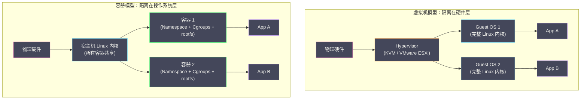
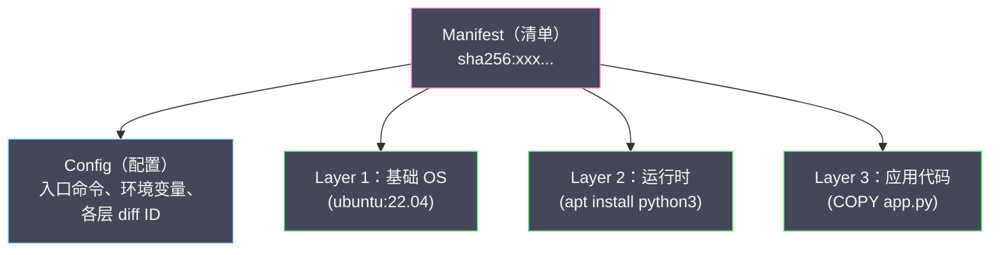
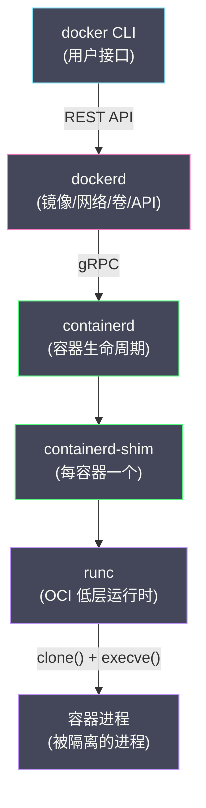
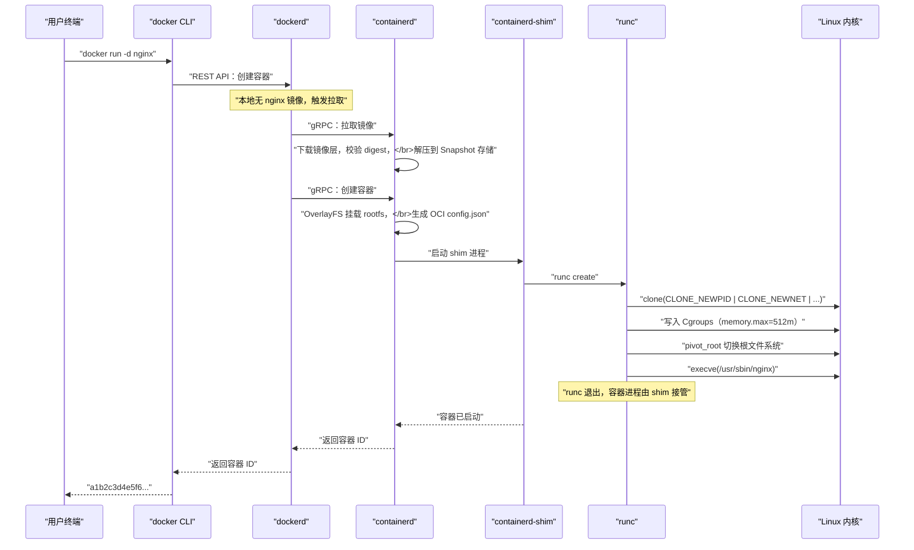
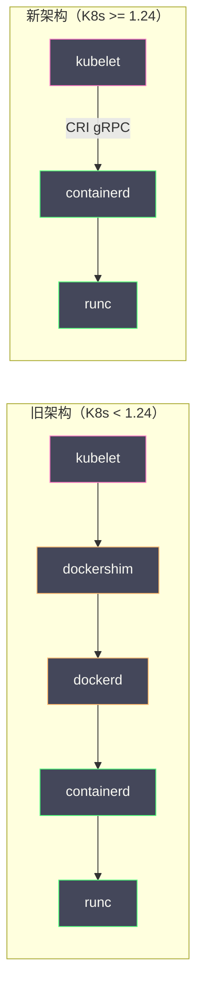

# 01 容器的本质——从进程隔离到 OCI 标准

**摘要：**

"容器就是轻量级虚拟机"——这可能是关于容器流传最广的一个误解。虚拟机靠 Hypervisor 模拟出一整套硬件，并在其上引导一个独立的操作系统内核；而容器根本没有自己的内核，它只是宿主机上一个被 Linux 内核的 Namespace、Cgroups 与联合文件系统隔离和限制的普通进程。这个本质区别决定了容器的一切优势（毫秒级启动、极高的部署密度、近乎为零的额外开销）与一切局限（共享内核带来的逃逸风险、只能运行与宿主机同内核的负载），是理解本专栏后续所有篇章的地基。本文从"在我的机器上能跑"这个部署领域的旧病出发，回答三个问题：容器与虚拟机把隔离放在了不同的层次，这条分界线为什么如此重要；从 1979 年的 chroot 到 2013 年的 Docker 再到 2015 年的 OCI，容器技术四十余年的演进里，每一代分别解决了什么、又留下了什么；以及当你敲下 `docker run` 时，dockerd、containerd、shim 与 runc 这条组件链上究竟发生了什么。读完全文，你应当能够完成一次"不用 Docker、只用内核原语造一个容器"的实验，并能向别人解释清楚一件事：容器是演进出来的，不是发明出来的。

---

## 第 1 章 "在我的机器上能跑"：部署领域的旧病

### 1.1 代码与环境的一次不体面分离

软件开发有一个流传了几十年的老笑话：这句话通常以"但那是一台开发机"收尾，背后则是一次真实的线上事故。一个 Java 服务在开发者的笔记本上运行一切正常，部署到测试环境的 CentOS 服务器上却开始报错——排查半天，原因可能平淡得令人沮丧：开发机装的是 JDK 17，服务器上是 JDK 11；或者是 `glibc` 的小版本差异导致某个 JNI 扩展加载失败；又或者只是配置文件里写死了 `/home/dev/logs` 这样一个在服务器上根本不存在的路径。应用代码本身没有任何变化，改变它的只是脚下的土地。

把这类问题抽象一下，其本质是：**应用程序对运行环境的依赖——操作系统版本、系统库版本、配置文件的布局、目录结构——无法随代码本身一起交付**。代码被版本控制系统管理得井井有条，而它所依赖的环境却散落在每台机器上，靠人肉与文档维系。代码与环境这对分离物之间没有强制的绑定关系，部署就是在赌两者恰好兼容。

这里说的"环境依赖"值得给出一个精确的清单，因为它比多数人直觉的更长：应用的二进制与解释器（JDK、CPython、Node 的具体版本）、动态链接的系统库（`glibc`、`libssl` 的版本与补丁级别）、编译型扩展模块与内核 ABI 的隐式耦合、文件系统布局（配置路径、日志目录、临时目录的约定）、环境变量与 DNS 解析行为、乃至内核参数（如 `net.core.somaxconn` 的默认值）对行为的影响。这份清单里任何一项的版本差异或默认值差异，都可能让"同一份代码"在不同机器上表现出不同行为。容器技术的全部意义，就是把这整份清单**连同应用一起封箱**，让部署的交付单位从"代码"升级为"代码加环境"。

在容器技术成为主流方案之前，业界沿着三条路径尝试缓解这个矛盾，三条路径各有斩获，也各有无法根除的病灶。逐一审视它们，才能看清容器到底补上了哪一块拼图。

### 1.2 容器出现之前的三条老路

**第一条路：把环境标准化到文档与脚本里。** 运维团队撰写详尽的部署文档，再用 Ansible、Puppet、Chef 这类配置管理工具把环境搭建固化成幂等的脚本。这条路在裸机与虚拟机时代是绝对的主流，它的思路是"环境不是管理出来的，是声明出来的"。问题在于，环境配置的组合空间是指数级的——操作系统版本 × 内核版本 × 系统库版本 × 运行时版本 × 中间件版本，任何一个维度出现偏差都可能引发故障。脚本只能覆盖已知的组合，而**配置漂移（Configuration Drift）**几乎不可避免：某台机器在某个深夜被临时登录打了补丁、某个依赖包在某次例行升级中被静默更新，随着时间推移，同一批名义上完全相同的服务器会渐行渐远。标准化的努力永远在追赶漂移，永远差一步。

**第二条路：把环境连根搬进虚拟机。** 让每个应用运行在自己的虚拟机里，虚拟机内部是一个完整的操作系统，环境天然自包含。这条路确实根治了一致性问题——虚拟机镜像里的环境就是它的全部世界。但代价可以用"重"字概括：每个虚拟机要引导一个完整的 Guest OS，动辄占用数百 MB 到数 GB 的内存与磁盘；启动时间以分钟计，因为要经历完整的内核引导与服务拉起流程；一台物理机通常只能承载几十台虚拟机。当微服务架构要求"每个服务独立部署、随时扩缩容"时，虚拟机的粒度就太粗了——你很难想象为了一个每天只在午高峰活跃两小时的小服务，去申请并引导一台分钟级启动的虚拟机。

**第三条路：把依赖打进应用交付物。** Java 的 fat JAR、Go 的静态编译二进制，都在尝试让"交付物"尽量自包含。这条路对语言生态友好，但走不远：Python、Node.js、C/C++ 的扩展模块都深度依赖系统库与解释器环境，"自包含交付物"在多语言企业里根本无法统一。它能缓解矛盾，却覆盖不了矛盾的全集。

三条路走完，缺口依然清晰：业界需要一种交付物，它像虚拟机镜像一样把环境完整打包，却像进程一样轻快地启动和销毁。容器就是对这道填空题的回答。

### 1.3 一个来自航运业的隐喻

理解容器的价值，航运业的历史提供了一个贴切的类比。1956 年，美国运输商马尔科姆·麦克莱恩把一艘油轮改装后装载了 58 个标准金属箱从纽瓦克驶向休斯敦，现代集装箱运输的历史由此开启。集装箱本身没有任何技术上的精妙之处——一个铁皮箱子而已——它真正改变世界的是**标准化的接口**：尺寸统一、吊具统一、船坞码头与卡车火车的接驳方式统一。从此货物再也不需要按"散装、桶装、捆装"逐件处理，码头装卸从"逐件搬运"变成了"整箱吊装"，全球物流的成本结构被这个不起眼的箱子彻底改写。

> [!info] 比喻的边界
> 软件容器借用了航运集装箱之名，两者的相似点在于**把"装载物"与"运输设施"解耦**：货物（应用及其依赖）被打包进标准化的箱子（镜像），码头（宿主机）只需要提供一个符合标准的吊装接口（容器运行时），而不必关心箱子里装的是什么。但两者的差异同样需要钉住：航运集装箱是不透明的实体，而软件容器的"箱子"在运行时需要与宿主机共享一个操作系统内核——这不是一个完全独立的封闭体，这个差异将在后文反复出现，并成为容器安全议题的根源。

比喻归比喻，技术上的定义必须精确。本专栏对容器采用如下定义：**容器 = 被 Namespace 隔离了视图、被 Cgroups 限制了资源、拥有独立根文件系统（rootfs）的 Linux 进程**。它没有虚拟硬件，没有独立内核，它就是一个进程——只不过这个进程"以为"自己独占了一台机器。后文的一切内容，都是对这个定义中三个加粗部分的展开。

---

## 第 2 章 容器与虚拟机：把隔离放在哪一层

### 2.1 两种隔离哲学

虚拟机与容器都宣称提供"隔离"，但隔离发生在完全不同的层次上，这是理解两者差异的正确切口。

虚拟机的隔离发生在**硬件层**。Hypervisor（如 KVM、VMware ESXi）在物理硬件之上模拟出一套完整的虚拟硬件——虚拟 CPU、虚拟内存、虚拟磁盘、虚拟网卡——Guest OS 被引导到这套虚拟硬件上，它对"自己在虚拟机里"这件事毫无感知（除非启用了半虚拟化驱动）。Guest OS 是一个货真价实的内核，拥有自己的内存管理、进程调度、设备驱动。隔离的强度因此非常高：即使 Guest 内核被攻破，攻击者仍然被困在虚拟机内部，想继续向上逃逸需要先攻破 Hypervisor，而 Hypervisor 的代码量与系统调用的暴露面远小于一个完整的 Linux 内核。

容器的隔离发生在**操作系统层**。所有容器与宿主机上所有其他进程共享同一个 Linux 内核，隔离靠的是内核提供的几组机制：Namespace 把全局资源"按进程分组呈现"（你看到的进程列表、网络栈、挂载表只是你的那一组），Cgroups 限制每组进程能消耗多少资源，联合文件系统给每组进程一个独立的根目录。因为不需要虚拟化硬件、不需要引导内核，创建一个容器本质上就是一次 `clone()` 系统调用加上若干配置操作，启动时间自然降到毫秒到秒级。

虚拟机"重"的技术根源也值得拆开看一眼，它主要落在三个环节上。其一是**内存开销**：每个 Guest OS 都要为内核数据结构、页表与缓存付出固定的内存底座，这个底座不随应用规模缩小；其二是**启动流程**：内核解压、初始化、systemd 依序拉起服务，这条链路以"秒到分钟"计，与容器"一次 execve 即就绪"形成数量级差距；其三是**地址翻译开销**：Guest 的物理地址还要经过宿主机一层映射，早期靠影子页表软件模拟，代价高昂，后来硬件辅助虚拟化（Intel 的 EPT / AMD 的 NPT）把二级翻译下沉到 MMU 才把开销压到可接受的水平——即便如此，额外的 TLB 压力与内存占用仍是虚拟化绕不开的底账。这些开销在"一台物理机只跑一个重负载"的场景里无所谓，但在微服务"几十个轻负载、随时扩缩"的场景里，每一项都成了成本中心。

两个模型并排摆开，差异一目了然：



### 2.2 逐维度的对比与判读

| 维度 | 虚拟机 | 容器 |
| :--- | :--- | :--- |
| **隔离层级** | 硬件级（Hypervisor 模拟硬件） | 操作系统级（内核特性隔离进程） |
| **内核** | 每个 VM 一个独立的 Guest OS 内核 | 所有容器共享宿主机内核 |
| **资源开销** | 每个 VM 需独立 OS 内存，GB 级起步 | 容器本身几乎无额外开销 |
| **启动速度** | 分钟级（完整内核引导） | 毫秒到秒级（本质是启动进程） |
| **部署密度** | 一台物理机数十个 VM | 一台物理机数百到数千个容器 |
| **隔离强度** | 强（独立内核，攻击面小） | 较弱（共享内核，存在逃逸面） |
| **兼容性** | 可运行异构 OS（Windows 宿主机跑 Linux VM） | 只能运行与宿主机同内核的负载 |

这张表里最值得咀嚼的是最后一行的因果关系：容器"快"和"省"的来源（共享内核、不虚拟化硬件）与它"弱"的根源（共享内核、无独立攻击面隔离）是同一件事。这不是工程上的疏漏，而是一笔公开的交换——用隔离强度换运行效率。什么时候这笔交换是划算的、什么时候必须换回虚拟机，本专栏第 6 篇会正面处理；现在只需要记住：**容器与虚拟机不是竞争关系，而是隔离谱系上的两个刻度**，云端常见的形态恰恰是"虚拟机里跑容器"——IaaS 提供商隔离租户用虚拟机，租户内部组织应用用容器，两层隔离各司其职。

部署密度这个维度还值得算一笔更直观的账。假设一台 64GB 内存的物理机：按每台虚拟机 2GB 内存底座计，全机内存的相当一部分被操作系统本身消耗，真正跑业务的内存大打折扣；换成容器后，每个容器的基础开销只有根文件系统占用的磁盘（且共享的层不重复计费）与进程自身的内存，同样的机器可以承载一个数量级以上的工作负载。对于按资源计费的公有云，这个差距直接折算成账单；对于自建机房，它折算成同等业务量所需的服务器数量。密度不是抽象的工程美学，是真金白银的成本结构。

还有一类常见疑问值得在此处一并了结：容器与虚拟机谁"更安全"这个问题本身就问错了对象。安全从来不是单选题，多租户公有云上跑一个不认识的人提交的代码，虚拟机（乃至后文的安全容器）是唯一负责任的选择；而同一公司内部可信服务之间的部署隔离，容器的强度通常绰绰有余。把这两种场景混为一谈，是容器安全讨论中最常见的话术陷阱。

---

## 第 3 章 漫长的前史：容器思想的四十年积累（1979-2013）

### 3.1 chroot：一切的起点（1979）

容器技术的思想源头通常被追溯到 1979 年的 Unix Version 7——这一年它引入了 `chroot` 系统调用，随后 1982 年 Bill Joy 将其带入 BSD，最初的用途是给 FTP 服务器构建一个受限的文件系统环境。`chroot`（change root）的作用极其简单：改变当前进程及其后代所看到的根目录。

```bash
# 将进程的根目录切换到 /var/sandbox
chroot /var/sandbox /bin/bash
```

执行之后，新启动的 bash 会"认为" `/var/sandbox` 就是 `/`——它执行 `ls /` 看到的是沙箱目录的内容，而不是真正的系统根目录。这个操作植入了一个影响至今的种子：**通过操作系统机制，让进程"看到"一个与宿主不同的环境**，而不需要任何虚拟化。

但 `chroot` 的局限同样从一开始就注定了。它只隔离了文件系统视图这一个维度——沙箱里的进程执行 `ps aux` 仍然能看到宿主机上的所有进程，执行 `ip addr` 仍然能看到所有网络接口。更关键的是，`chroot` 不是一个安全边界：经典的"双重 chroot"攻击（在沙箱内对某个还持有的目录描述符再次调用 `chroot`）就能跳出沙箱，连文件系统这一层的隔离都谈不上可靠。`chroot` 的正确定位是一个**便利工具**，而不是隔离机制——这个定位差异，此后每一个容器先行者都花了大力气去弥补。

### 3.2 操作系统级虚拟化的探索（2000-2008）

真正的转折发生在 2000 年。FreeBSD 4.0 引入了 **Jail**，第一次把"进程隔离"做成一个完整的机制：Jail 内的进程只能看到 Jail 内的其他进程，每个 Jail 可以绑定独立的 IP 地址，Jail 内的 root 被显式地限制了特权操作（譬如不能修改网络配置、不能挂载文件系统）。Jail 的设计者还处理了一个 chroot 时代悬而未决的细节——防止 Jail 内进程通过持有目录描述符的方式逃出文件系统边界，这使得 Jail 第一次可以被称为"安全边界"而不只是"便利工具"。Jail 证明了一个此后所有容器技术都依赖的命题：**不需要虚拟化硬件，仅凭操作系统内核自身的机制，就能实现足够完整的进程隔离**。

这条路线随即在各大系统上开花，值得记录名字的有：Solaris 10 在 2004 年推出的 **Zones**，它把隔离、资源分配与虚拟平台封装为一体，是商业 Unix 上最成熟的实现；Linux 阵营则在主线之外先行——2001 年前后出现的 **Linux-VServer** 与 2005 年开源的 **OpenVZ** 都以内核补丁的形式提供容器能力。OpenVZ 尤其值得一提，它因资源开销远小于虚拟机而被大量廉价 VPS 提供商采用，某种程度上是"容器改变云计算成本结构"的第一次大规模社会实践，比 Docker 早了近十年。

这些先行者共同的困境在于：它们都基于内核补丁或非 Linux 系统，能力无法惠及主流的 Linux 发行版。Linux 主线内核吸收这些经验花了十余年，逐年补齐隔离原语：

| 年份 | 内核版本 | 新增能力 | 意义 |
| :--- | :--- | :--- | :--- |
| 2002 | Linux 2.4.19 | Mount Namespace | 第一个 Namespace，挂载点隔离 |
| 2006 | Linux 2.6.19 | UTS / IPC Namespace | 主机名、进程间通信隔离 |
| 2008 | Linux 2.6.24 | PID Namespace | 进程 ID 隔离 |
| 2008 | Linux 2.6.24 | Cgroups v1 合入主线 | 资源限制与控制 |
| 2009 | Linux 2.6.29 | Network Namespace | 网络栈隔离 |
| 2013 | Linux 3.8 | User Namespace | UID/GID 映射，非特权容器成为可能 |

请注意这个时间表背后的节奏：每一个 Namespace 的合入都不是为了"做一个容器"这个宏大目标，而是为了填补某个具体的隔离缺口——没有 PID Namespace，容器进程就能看到并 `kill` 宿主机的关键进程；没有 Network Namespace，两个容器就无法同时监听 80 端口。**内核是按最小可用单元渐进演进的，容器的出现只是这些单元在某一时刻的自然汇聚。**

### 3.3 LXC：触到了天花板的原型（2008）

2008 年，**LXC（Linux Containers）** 项目出现，它是第一个完全基于 Linux 主线内核的 Namespace 与 Cgroups 构建的容器方案。LXC 直接调用 `clone()` 系统调用并传入 `CLONE_NEWPID | CLONE_NEWNET | ...` 等标志位来创建隔离环境，在能力上已经是一个"能用的容器"——你可以在 LXC 容器里运行 systemd、启动 SSH 服务，像使用一台轻量级虚拟机一样使用它。

但 LXC 在被 Docker 取代之前始终未成气候，它的三个短板在今天看依然是极好的反面教材：

**短板一：没有标准化的镜像与分发机制。** LXC 对"如何打包、分发容器的文件系统"没有给出答案，用户需要用 `debootstrap` 之类的工具自行准备 rootfs，没有镜像仓库，没有"拉取即用"。容器的核心价值之一——环境随镜像四处流转——在 LXC 上无从谈起。

**短板二：配置的门槛太高。** 创建一个 LXC 容器需要手写冗长的配置文件，逐项声明 Namespace、Cgroups 参数与网络拓扑。这份复杂度本该由工具消化，LXC 却把它原样交给了用户。

**短板三：面向"系统容器"而非"应用容器"。** LXC 的心智模型是把容器当虚拟机用——装一个完整的 Linux 环境进去。而应用部署的真实需求是"跑一个应用进程"：容器里只需要应用本身及其依赖，不需要 init 系统和一堆系统服务。需求定位的偏差，使得 LXC 即便技术上可行，也没有命中那个真正的痛点。

历史在这里提供了一个重要的教训：**一项技术的成败，往往不取决于它封装的内核能力有多强，而取决于它把"开发者想做的事情"翻译成了多么简单的一句话。** LXC 会说"给你一个轻量级 Linux"，Docker 会说"给你一个跑应用的盒子"——后者才是部署问题的原话。

---

## 第 4 章 Docker 的产品化革命（2013）

### 4.1 一次五分钟的演示与一次商业转型

2013 年 3 月，Solomon Hykes 在 PyCon 大会上做了一场题为 *The future of Linux Containers* 的五分钟即兴演示，现场敲下 `docker run` 并在几秒内得到了一个隔离的 Ubuntu 环境。这场演示被广泛视为容器时代的开幕。背景则是：Hykes 创立于 2008 年的 PaaS 公司 dotCloud 正处于经营困境，他们为了支撑自家的平台即服务业务，在 LXC 之上封装了一层面向应用的容器工具链——当平台业务难以维系时，公司决定把这件内部工具开源，并最终将公司押注其上，连名字都从 dotCloud 改成了 Docker。

这个故事里有一个容易被忽略的细节：Docker 的诞生土壤是 PaaS，而 PaaS 恰恰是最需要"应用与环境一起交付"的场景。Docker 的成功不是凭空的技术灵感，而是**把解决了自己平台真实痛点的东西，交给了全世界同样痛的开发者**。

### 4.2 四个真正改变行业的贡献

Docker 在内核技术上几乎没有原创——它最初直接构建在 LXC 之上。它对行业的贡献在于产品化，可以归纳为四件事：

**第一，分层镜像。** Docker 把容器文件系统组织成一组可叠加、可复用的层：每一层记录一次文件系统变更（新增、修改、删除的文件），上层覆盖下层。一个 Python 应用的镜像可以拆成"Ubuntu 基础层 + Python 运行时层 + 应用代码层"，多个基于相同基础的应用镜像共享前两层，磁盘与传输的开销随之大幅下降。分层还为后续的"构建缓存"与"按层拉取"提供了结构基础——这两个特性在镜像动辄上百 MB 的世界里是刚需。分层机制的底层实现（联合文件系统）将在 [[04 UnionFS 与容器镜像原理]] 中完整展开。

**第二，Dockerfile。** 用一个纯文本文件声明"如何从零构建一个镜像"，每条指令（`FROM`、`RUN`、`COPY`）对应一层的变更。这使得镜像的构建过程**可重复、可版本化、可审计**——环境不再是散落在机器上的状态，而是进了版本库的代码。它实质上是"基础设施即代码"理念在环境维度的一次轻量化落地，落地成本低到任何团队都能在一周内落地见效：

```dockerfile
FROM python:3.11-slim                # 基础层：Python 官方镜像的文件系统
WORKDIR /app                         # 元数据变更：设定工作目录
COPY requirements.txt .              # 新增一层：仅依赖清单
RUN pip install -r requirements.txt  # 新增一层：依赖的安装产物
COPY . /app                          # 新增一层：应用代码
CMD ["python3", "main.py"]           # 元数据变更：默认入口命令
```

短短六行，写清了"应用在什么环境里、依赖什么、怎么启动"。配合构建缓存（指令与输入未变的层直接复用），日常迭代只重建代码层；配合 `.dockerignore`，敏感文件与无关产物被挡在构建上下文之外。一个过去需要 README 三页纸说清的部署流程，被压缩成了一个可执行的声明文件。

**第三，Registry（镜像仓库）。** Docker Hub 于 2014 年上线，提供镜像的中央存储与分发。开发者 `docker push` 上传、`docker pull` 下载，容器镜像由此成为一种**标准化的可交付物**，其地位类似于 Java 世界上传到 Maven Central 的构件——构建的终点不再是一台服务器，而是一个可以被任何环境拉取的制品。

**第四，一条命令的用户体验。** `docker run ubuntu echo hello` ——一行命令，几秒之内，一个隔离环境就绪。Docker 把 Namespace/Cgroups/挂载配置的全部复杂度封装进了引擎，给开发者留下的接口简单到不需要学习。这个看似平淡的特性，实际是前面三项贡献能够被大众使用的最后一环：**技术采纳的上限，常常由使用门槛决定，而不是由技术上限决定。**

> [!note] Docker 的定位转变
> Docker 对容器心智模型的最大改写，是把容器从"轻量级虚拟机"重新定义为"**应用的标准化打包与运行单元**"。LXC 时代的容器里住着一个操作系统，Docker 时代的容器里住着一个应用——容器内不再需要 init 进程与系统服务，容器的生命周期开始与单个应用进程对齐。这个转变的影响远超 Docker 自身：后来的微服务架构、Kubernetes 的 Pod 抽象、乃至"单一职责容器"的实践，都建立在"容器即应用"这个新的默认认知上。

### 4.3 关于"原创性"的争论与一个公正的评价

Docker 火起来之后，"它不过是 LXC 的封装"之声不绝于耳，2014 年 3 月发布的 Docker 0.9 用自研的 libcontainer 取代 LXC 作为默认执行驱动，更是常被拿来证明"Docker 核心是壳"。这个评价在技术事实上没有错，在工程判断上却失之苛刻。回看 3.3 节，LXC 拥有内核能力的全部访问权，却没能跨过镜像、分发与体验这三道坎；Docker 没有发明任何零件，但它回答了"把零件组装成什么、以什么价格卖给谁"的问题——而组装的答案才是行业等待的那一个。技术上繁复而产品上成功的组合改造，在软件史上从来不缺先例，Docker 是其中最新的一例。

### 4.4 Docker 的商业沉浮：容器赢了，Docker 公司呢

Docker 公司的后续轨迹，是一份关于"开源基础设施商业化的活体样本"。2016 年 4 月的 Docker 1.11 把引擎拆分为 docker CLI、dockerd、containerd 与 runc 多个组件；2016 年底 containerd 被捐赠给 CNCF，2017 年 4 月 Docker 开源项目改名 Moby，2019 年 11 月公司将企业级业务出售给 Mirantis，2021 年 8 月又对大型企业使用 Docker Desktop 开始收费。这条轨迹的注脚耐人寻味：**容器技术本身取得了全面胜利，成为云原生时代的地基，而发明它的公司未能守住制高点**——因为 Docker 的核心贡献（镜像格式、用户体验）恰恰是最容易被标准化、被生态共有的部分。这个结局不是给"产品化"的否定，而是给"标准化时点"的注解：当一项技术的价值集中在体验层时，它需要更快地建立生态护城河，否则标准化进程会把它最有价值的部分变成公共品。Docker 的名字最终成了整个品类的代名词——就像人们说"复印"时未必用的是施乐复印机——这既是品牌影响力的极致，也是商业控制力流失的镜像。

---

## 第 5 章 OCI：给容器立宪（2015）

### 5.1 标准化是被逼出来的

Docker 在 2013 到 2015 年间的崛起速度，带来了一个所有巨头都无法忽视的问题：容器的镜像格式与运行时接口若由 Docker 公司一家定义，整个生态就被锁定在单一厂商的技术栈上。这个隐忧不是空穴来风——彼时 Docker 一家独大，镜像格式是它的私有事实标准。对 Google（内部已有 Borg 与 lmctfy 的容器实践）、CoreOS（2014 年发布了与 Docker 分庭抗礼的 rkt 与 AppC 镜像规范）、Red Hat 等公司而言，接受这个格局等于把云计算的下一个基础设施层交给别人。

2015 年 6 月，在 Linux 基金会的协调下，Docker、CoreOS、Google、Red Hat、VMware、IBM、Intel、Microsoft 等公司共同成立了 **Open Container Initiative（OCI，开放容器倡议）**，为容器制定开放标准。OCI 最终沉淀为三个规范：

- **Runtime Specification（运行时规范）**：定义"如何根据一份配置和一个根文件系统运行一个容器"；
- **Image Specification（镜像规范）**：定义容器镜像的格式——层（Layer）、配置（Config）、清单（Manifest）；
- **Distribution Specification（分发规范）**：定义镜像在 Registry 中存储与拉取的 HTTP API。

两个细节值得玩味。其一，OCI 的条款大量吸收了 Docker 的既成做法——镜像格式基本照搬 Docker 的设计，运行时规范由 Docker 捐出的 libcontainer 演化而来（即 runc）。这印证了标准化的普遍规律：**规范标准通常是对既成事实标准的蒸馏，而不是凭空的制度设计**。其二，与 OCI 形成对照的是 rkt 的命运：CoreOS 的这个"标准先行"实现没有等来生态繁荣，2019 年正式归档。标准赢了，但赢家是标准本身，不是任何一个率先高举标准的实现。

### 5.2 Runtime Spec：一份 config.json 就是一个容器

OCI 运行时规范把"一个容器"定义为**文件系统包（Filesystem Bundle）**：一个目录，内含一份 `config.json` 配置与一个 `rootfs/` 根文件系统。配置文件的核心字段如下：

```json
{
  "ociVersion": "1.0.2",
  "process": {
    "user": { "uid": 0, "gid": 0 },
    "args": ["/bin/myapp", "--port=8080"],
    "env": ["PATH=/usr/bin:/bin"],
    "cwd": "/"
  },
  "root": {
    "path": "rootfs",
    "readonly": false
  },
  "hostname": "my-container",
  "linux": {
    "namespaces": [
      { "type": "pid" },
      { "type": "network" },
      { "type": "ipc" },
      { "type": "uts" },
      { "type": "mount" }
    ],
    "resources": {
      "memory": { "limit": 4294967296 },
      "cpu": { "quota": 200000, "period": 100000 }
    }
  }
}
```

这份 JSON 完整描述了一个容器的全部要素：`process` 声明启动后执行什么程序、以什么身份、带什么环境变量；`linux.namespaces` 声明创建哪些隔离视图；`linux.resources` 声明资源限制（内存上限 4GB、CPU 限额 2 核）。运行时的工作就是读懂这份声明，然后用 Linux 系统调用把它变成现实——规范刻意把接口定义在"进程"这个最小粒度上，运行时本身应当是**用完即走的**：创建容器、启动进程、退出，不驻留任何常驻状态。这个"极简、无状态、用完即走"的接口哲学，正是第 6 章运行时分层架构的理论前提。

规范还定义了容器的**生命周期状态机**，值得单独一看，因为它解释了 runc 命令行的形态。容器从 `create` 开始——此时 Namespace 与 Cgroups 已经就位，但容器内的应用进程尚未运行（runc 用一个中间机制占住 PID 1 的位置）；随后 `start` 触发用户在 `config.json` 里声明的进程真正执行；运行中的容器可以被 `kill` 发送信号、被 `pause`/`resume` 冻结与恢复；最终 `delete` 清理残留状态。runc 的子命令（`runc create`、`runc start`、`runc kill`、`runc delete`）与这套状态一一对应，`docker run` 在底层正是按这个顺序驱动状态机走完一生。把状态机设计成显式的、分步的，而非一条命令到底的，好处是给上层编排者留出了介入点——Kubernetes 在 create 与 start 之间注入网络配置、在 kill 时执行优雅终止，都依赖这个分步接口。

### 5.3 Image Spec：内容的哈希就是它的名字

OCI 镜像规范定义了三个核心对象：

- **层（Layer）**：一个 tar 归档，记录一组文件系统变更，传输时通常以 gzip 或 zstd 压缩；
- **配置（Config）**：一个 JSON 文件，描述镜像元数据——创建时间、入口命令、环境变量、暴露端口，以及每一层解压后内容的哈希值（diff ID）；
- **清单（Manifest）**：把配置与各层组织在一起的索引文件，记录每层的摘要（digest）与媒体类型。

三者由一条核心原则串联：**内容寻址（Content-Addressable Storage）**。每个对象的标识符就是其内容的 SHA256 哈希值，`sha256:a3ed95caeb02...` 这样的 digest 既是"名字"也是校验码。由此自然导出三个性质：内容相同的层必然同名，存储天然去重；任何字节被篡改，哈希必然变化，完整性校验零成本；任何镜像可以按层引用其他镜像的内容，共享零成本。



### 5.4 标准化的实际效果

OCI 的效果可以用一组生态事实来验证：runc 是规范的参考实现（Go 语言编写，2017 年发布 1.0），此后出现了 C 语言编写的更轻量的 crun、Rust 语言编写的 youki——它们与 runc 可以互换，因为接口是同一份规范；Kubernetes 通过 CRI 接口对接任何符合 OCI 的运行时栈，不再依赖 Docker；Docker 自己构建的镜像与 Podman、Buildah、BuildKit 构建的镜像可以互相拉取运行，因为镜像格式是同一份规范。围绕这套格式，生态还长出了面向分发的配套件：镜像签名与校验（Cosign、Notation）建立在 digest 之上，漏洞扫描（Trivy、Grype）按层解析内容，镜像的懒加载（如 eStargz 格式配合按需拉取的 snapshotter）则在不动格式主体的前提下优化了启动速度。**标准的价值不在于它写得多好，而在于它让"实现"与"实现"之间可以互相替换，并让外围创新可以围绕同一个地基生长**——这句话在容器生态里得到了教科书式的演示。镜像与分发的细节，[[04 UnionFS 与容器镜像原理]] 将继续深入。

---

## 第 6 章 拆解 docker run：从一条命令到一个进程

### 6.1 运行时的分层架构：每一层都在为"可替换"服务

理解了 OCI，再看现代容器运行时的分层就不会觉得繁复。2016 年 4 月发布的 Docker 1.11 把引擎拆分成了如下几层，每一层各管一段：

| 组件 | 层级 | 职责 |
| :--- | :--- | :--- |
| **docker CLI** | 用户接口 | 解析命令行参数，通过 REST API 与 dockerd 通信 |
| **dockerd** | 高层功能 | 镜像构建、网络、卷、API 编排；将容器操作转发给 containerd |
| **containerd** | 高层运行时 | 容器生命周期管理、镜像存储、快照管理；CNCF 毕业项目 |
| **containerd-shim** | 垫片进程 | 每个容器一个，持有容器进程的 stdio 与退出状态 |
| **runc** | 低层运行时 | 读取 OCI bundle，调用系统调用创建隔离进程，随即退出 |

这个分层不是为拆而拆，核心动机是**生命周期与关注点的解耦**：dockerd 承担大量与"运行容器"无关的功能（构建、网络、卷、插件），把容器生命周期管理独立成 containerd，让 Kubernetes 这类编排系统可以直接对接容器能力而不必拖着整个 Docker 引擎；把"创建容器进程"这件事下沉到 runc 这个无状态的小工具，让运行时的实现可以整体替换（换 crun、换安全容器运行时都不影响其他层）。业界讨论运行时时的术语也由此定型：**高层运行时（high-level runtime）**指 containerd 这类负责镜像、存储与生命周期管理的常驻服务，**低层运行时（low-level runtime）**指 runc 这类真正创建隔离进程的执行器，日常语境里说"容器运行时"时务必先确认对方指哪一层，两层的可替换性、故障模型与安全边界完全不同。架构图如下：



其中 shim 这一层最容易被误解，值得单独说清。runc 是"用完即走"的：它创建完容器进程后自身退出。但容器进程总需要一个父进程来收集它的退出状态、持有它的标准输入输出——shim 就是这个父进程。把父进程的角色从 containerd 中独立出来，收益是**容器的存活与高层组件的存活彻底解耦**：containerd 甚至 dockerd 升级重启，运行中的容器毫发无损。用一个熟悉的类比来说，shim 像一台设备的"当地监护人"，而 containerd 是"总部"——总部搬迁装修，设备照常运转，因为监护人一直守在现场。

### 6.2 一次 docker run 的完整旅程

把整条链路串起来。当你执行 `docker run -d --memory=512m --cpus=1.5 nginx:latest` 时，底层发生的事情按时间顺序如下：



几个关键步骤值得展开。**镜像准备阶段**（图中 3-5），containerd 从 Registry 逐层下载镜像（已存在的层自动跳过），校验每层的 SHA256 digest 后解压到本地快照存储。**rootfs 组装阶段**，containerd 用 [[04 UnionFS 与容器镜像原理|OverlayFS]] 把镜像各层叠加为统一视图并挂载，顶层是容器的可写层。**配置翻译阶段**，dockerd 收到的 `--memory=512m`、`--cpus=1.5` 等参数被翻译成 OCI 的 `config.json`——这正是 5.2 节那份 JSON 的来源。**进程创建阶段**，runc 依次完成：`clone()` 加 Namespace 标志位创建新的隔离视图，写入 Cgroups 文件系统设定资源上限，`pivot_root()` 把进程根目录切换到组装好的 rootfs，最后 `execve()` 在新环境中启动 nginx——此后 nginx 就是这个容器本身。

这条链路上还有一个容易被问到的细节：`-d` 参数（后台运行）到底意味着什么。docker CLI 把请求交给 dockerd 后并不会一直挂在那里等容器退出，它拿到容器 ID 便返回终端；容器进程的"后台"不是靠 shell 的 `&`，而是靠 shim 作为父进程的持有——nginx 的父进程是 shim 而非任何终端，因此终端关闭、dockerd 重启都影响不到它。理解了这一点，也就理解了为什么容器内进程必须自己处理 `SIGTERM` 信号：除了 shim 没有人替它做优雅退出，这个话题在 [[02 Linux Namespace 深度解析]] 讨论 PID Namespace 时还会回来。

### 6.3 不用 Docker，手动造一个容器

验证"容器只是一组系统调用"的最有力方式，是自己把它造出来。以下步骤在一台 Linux 机器上完成（需要 root），全程不使用 Docker：

```bash
# 第一步：准备根文件系统（使用 Alpine 的 minirootfs，仅数 MB）
mkdir -p /tmp/my-container/rootfs && cd /tmp/my-container
wget https://dl-cdn.alpinelinux.org/alpine/v3.19/releases/x86_64/alpine-minirootfs-3.19.0-x86_64.tar.gz
tar xf alpine-minirootfs-3.19.0-x86_64.tar.gz -C rootfs

# 第二步：创建隔离的 Namespace 并进入
# --pid 需要配合 --fork：因为对当前进程 unshare PID Namespace
# 不会改变它自己的 PID 视图，只有新 fork 出的子进程才会
# 成为新 Namespace 中 PID=1 的进程
unshare --mount --uts --ipc --pid --fork /bin/bash
```

```bash
# 第三步：在新环境中切换根文件系统
mount -t proc proc /tmp/my-container/rootfs/proc   # 重新挂载 proc，否则 ps 看到的是宿主机进程
cd /tmp/my-container/rootfs
pivot_root . .old_root                              # 切换根目录，旧根挪到 .old_root
umount -l /.old_root && rmdir /.old_root            # 卸载旧根，斩断退路
hostname my-container                               # UTS Namespace 内改主机名

# 第四步：验证隔离效果
ps aux        # 只能看到一个进程：PID 1 的 bash
hostname      # my-container
ls /          # 是 Alpine 的目录树，宿主机的文件不可见
```

```bash
# 第五步：在宿主机的另一个终端里，给容器加上资源限制
# 假设容器 bash 在宿主机视角的 PID 为 12345（Cgroups v1 示例）
mkdir /sys/fs/cgroup/memory/my-container
echo 104857600 > /sys/fs/cgroup/memory/my-container/memory.limit_in_bytes   # 100MB
echo 12345 > /sys/fs/cgroup/memory/my-container/tasks
```

至此，一个具备视图隔离（Namespace）、文件系统隔离（pivot_root）、资源限制（Cgroups）的"容器"完成了。它当然比 runc 粗糙得多，差在哪里值得盘点清楚，因为这张缺口清单恰恰就是 runc 的工作清单：runc 会为容器创建 Network Namespace 并调用 CNI/内置网络逻辑配置接口与路由（我们的实验里容器还断着网）；会按 `config.json` 逐项设置 Capabilities、Seccomp、AppArmor（我们的实验里进程保留了 root 的全部特权）；会处理挂载传播类型、`/dev` 设备节点、伪终端与信号转发；还会以 Cgroups v2 的统一层级、加上父进程与清理逻辑把这些步骤做成可重试的工程实现。**"原理上一样"与"工程上可用"之间的全部距离，就是容器运行时这个软件品类存在的理由。**

**祛魅的意义在于建立正确的直觉：容器不神秘，神秘感来自对内核机制的不了解。**

---

## 第 7 章 Kubernetes 与 Docker 的分道扬镳

### 7.1 CRI 与 dockershim：一段勉强的婚姻

Kubernetes 从 2015 年起就确立了对接容器的方式：**CRI（Container Runtime Interface，容器运行时接口）**——kubelet 通过一组 gRPC 接口（`RuntimeService` 与 `ImageService`）与"符合 CRI 的运行时"通信，前者管 Pod 沙箱与容器的创建、启停、执行命令，后者管镜像的拉取、列举与删除。接口本身设计得很克制：它不涉及构建、不涉及网络插件的具体实现，只保留"把镜像变成运行中的容器"这一段编排者真正关心的语义。问题在于，CRI 诞生时（1.5 版本，2016 年底引入）Docker 已无处不在，而 Docker 引擎并不原生支持 CRI。kubelet 不得不在中间垫了一层 **dockershim**：把 CRI 调用翻译成 Docker API 调用，再由 Docker 引擎转交给 containerd 与 runc。

这条链路的冗余一眼可见：kubelet → dockershim → dockerd → containerd → runc，中间的 dockerd 与 dockershim 做的只是翻译工作。维持这层翻译的代价持续累积——Docker 的版本迭代节奏、API 变更都成了 Kubernetes 的维护负担，而 Docker 提供的构建、网络等高层功能在节点上根本用不上。2020 年 12 月，Kubernetes 官方发文 *Don't Panic: Kubernetes and Docker* 预告决策；2022 年 5 月发布的 1.24 版本正式移除 dockershim，kubelet 从此直连 containerd：



### 7.2 "移除 Docker"移除的到底是什么

这件事当年被大量标题党渲染为"Kubernetes 抛弃 Docker"，事实是：**被移除的只是节点上的一个中转层，Docker 镜像本身完好无损**。由于镜像格式在 2015 年后已被 OCI 统一，`docker build` 产出的镜像在 containerd、CRI-O 驱动的集群上原样可用——换的是引擎，不是燃料。开发者的本地工作流（`docker build`、`docker compose`、Docker Desktop）也不受任何影响，Docker 在开发场景至今仍是主流选择；生产节点上则需要建立新的肌肉记忆，用 `crictl`、`ctr` 或 `nerdctl` 替代 `docker ps`、`docker exec` 这类排障命令。

生态的后续演化也印证了这次解耦的方向。containerd 成了各大发行版与托管 Kubernetes 的默认运行时；其社区的 `nerdctl` 提供了与 Docker CLI 几乎一致的体验，弥补了直接使用 containerd 时的人体工学缺口；Red Hat 阵营的 Podman 以无守护进程（daemonless）与原生 Rootless 为卖点，构建、运行、编排（podman compose）一条龙，在安全敏感场景持续渗透；管理节点侧，`ctr` 与 `crictl` 的分工是前者面向 containerd 原生对象（含镜像、快照），后者面向 CRI 语义（Pod 沙箱与容器），排障时按需选用。工具在发散，接口在收敛——这是健康生态的典型形态。

> [!info] 一条分界线的澄清
> 生产集群里还有没有 Docker？严格地说，多数发行版的 containerd 本身就源自 Docker 捐出的代码，Docker 引擎（dockerd）也可以通过 CRI 适配继续作为 Kubernetes 的运行时（Mirantis 维护的 dockershim 分支）。但主流实践已经收敛：**开发机用 Docker，生产节点用 containerd**。这条分界线的底层逻辑仍然是 6.1 节那句话——节点上需要的是极简、可替换的运行时，而不是一个功能繁复的引擎。

---

## 第 8 章 边界与反例：容器不是万能的

### 8.1 共享内核：优势与风险同源

前文反复强调，容器"快"与"省"的来源是共享内核。同一枚硬币的反面是：**所有容器与宿主机运行在同一个内核上，一个容器若利用内核漏洞获得内核态执行权限，就能访问宿主机与全部容器的内存、文件系统和网络**——这就是容器逃逸（Container Escape）。虚拟机没有这个层面的问题：Guest 内核被攻破，攻击者仍被困在虚拟机里，向上逃逸需要再攻破 Hypervisor。本专栏第 6 篇将系统性地讨论这个风险的成因、真实案例与多层防御。

### 8.2 安全容器：把隔离强度补回来

为了在保留容器生态（镜像、OCI 接口、编排集成）的同时把隔离强度拉回虚拟机水准，业界发展出了**安全容器（Secure Container）**技术，三条代表性路线如下：

| 技术 | 提出方与时间 | 原理 | 优势 | 代价 |
| :--- | :--- | :--- | :--- | :--- |
| **gVisor** | Google，2018 年开源 | 用户态内核 Sentry 拦截并自行实现容器的系统调用 | 不需要虚拟化硬件，密度高 | 系统调用密集型负载性能损耗明显 |
| **Kata Containers** | Intel Clear Containers 与 Hyper runV 于 2017 年合并 | 每个容器（或 Pod）运行在一个轻量级虚拟机中 | 隔离强度等同虚拟机，应用无感知 | 每容器多出百 MB 量级内存与更高的启动耗时 |
| **Firecracker** | Amazon，2018 年开源 | 面向 Serverless 的微虚拟机（microVM） | 启动约 125ms，内存开销约 5MB | 设备模型极简，面向特定场景 |

在 Kubernetes 中，这三类运行时通过 **RuntimeClass** 机制接入——同一个集群里，可信的内部服务用默认的 runc（性能优先），不可信的多租户负载通过 `runtimeClassName: kata` 指定安全容器（隔离优先）。gVisor 与 Kata 的隔离思路值得对照着记：gVisor 把"减少攻击面"做在**用户态**——它的核心组件 Sentry 是一个用 Go 写的迷你内核，容器应用的每个系统调用都被 Sentry 拦截并自行实现，Sentry 自己只向宿主机内核发起极少量经过审查的系统调用，等于给内核套了一层语法解释器；Kata 则把隔离做在**硬件层**——每个 Pod 一个微型虚拟机，应用系统调用由虚拟机内的 Guest 内核原生处理，只有虚拟设备的 I/O 穿过 Hypervisor。前者省掉了虚拟化开销但付出了解释层的性能税，后者性能接近原生但付出虚拟机的内存与启动开销，两条路线没有绝对优劣，取决于负载的系统调用密度与信任模型。这个设计再一次体现了本专栏反复出现的价值观：**隔离强度不是全局统一的配置，而是按负载的信任级别逐个决策的权衡。**

### 8.3 容器不适用的场景清单

最后把边界收拢成一张负面清单，下列场景应当放弃普通容器或改用替代方案：

- **需要不同内核**：容器只能运行与宿主机同内核（乃至同系统调用 ABI）的负载，Linux 宿主机上跑不了 Windows 容器，旧内核上的新特性容器也用不了；
- **需要加载内核模块或定制内核参数**：容器的世界止步于系统调用，文件系统驱动、网络协议栈补丁都是内核领地；
- **纳秒级延迟敏感**：Namespace 切换与 Cgroups 统计引入微小但非零的开销，高频交易等极端场景仍以裸金属为主；
- **不信任负载的强隔离需求**：多租户公有云执行他人代码的场景，普通容器的隔离强度不满足威胁模型，需要虚拟机或安全容器。

### 8.4 本章总结与全文收束

本文完成了整个专栏的地基工程。容器不是轻量级虚拟机，而是被 Namespace 隔离视图、被 Cgroups 限制资源、以 OverlayFS 组装 rootfs 的 Linux 进程；容器的四十年历史是一部"内核原语渐进补齐 + 产品化封装 + 标准化蒸馏"的演进史——chroot 播种，Jail 与 Zones 验证方向，Linux 主线补齐原语，LXC 触到产品化天花板，Docker 完成产品化跃迁，OCI 把胜利果实蒸馏成公共规范，Kubernetes 最终把"运行"与"引擎"解耦。**容器不是发明出来的，是演进出来的；每一个环节都解决了上一环节留下的问题，也留下了让下一个环节存在的缺陷。** 这个认知比任何单个知识点都重要：它意味着容器技术的每个部件（镜像格式、运行时、网络方案）都不是终极答案，理解它们"为什么长成这样"，比记住"它们长什么样"更接近本质。

后续文章导读：

- [[02 Linux Namespace 深度解析]]：深入六大核心 Namespace 的内核实现与 clone/unshare/setns 三系统调用，手动构建完整的隔离环境；
- [[03 Cgroups 资源限制与控制]]：v1 与 v2 的架构分歧、CPU/Memory/IO 控制器机制、OOM Killer 与限流陷阱；
- [[04 UnionFS 与容器镜像原理]]：OverlayFS 的分层机制、镜像的内容寻址、构建缓存与分发流程；
- [[05 容器网络原理]]：veth pair、Linux Bridge、iptables NAT 与 CNI 接口规范；
- [[06 容器安全边界与逃逸风险]]：Capabilities、Seccomp、MAC 策略、真实逃逸案例与安全容器。

---

## 参考资料

1. Solomon Hykes (2013). *The future of Linux Containers*. PyCon Lightning Talk.
2. Open Container Initiative. *OCI Runtime / Image / Distribution Specification*：https://github.com/opencontainers/runtime-spec
3. Docker Documentation. *Docker containerd integration and runtime architecture*：https://docs.docker.com/engine/
4. containerd Documentation：https://containerd.io/docs/
5. Kubernetes Blog (2020). *Don't Panic: Kubernetes and Docker*：https://kubernetes.io/blog/2020/12/02/dont-panic-kubernetes-and-docker/
6. Kubernetes Blog (2021). *Kubernetes is Moving on From Dockershim: Commitments and Next Steps*：https://kubernetes.io/blog/2021/12/07/kubernetes-is-moving-on-from-dockershim/
7. Michael Kerrisk (2013). *Namespaces in operation*. LWN.net series.
8. Liz Rice (2020). *Container Security*. O'Reilly.
9. Linux man pages: `namespaces(7)`, `cgroups(7)`, `clone(2)`, `unshare(2)`, `setns(2)`, `pivot_root(2)`.
10. Firecracker Documentation：https://firecracker-microvm.github.io/ ；gVisor Documentation：https://gvisor.dev/docs/

---

> [!note] 思考题
> 1. 静态编译的 Go 二进制配合 `FROM scratch` 可以构建出几 MB 的可用镜像，而 Python 应用即使只写一行 `print` 也需要数百 MB 的基础镜像——请从"容器镜像里到底装了什么"的角度解释这个差异，并思考：一个镜像的体积下限由什么决定？
> 2. `docker exec` 与宿主机上的 `nsenter` 都能进入运行中的容器，底层都依赖 `setns()` 系统调用。两者在权限要求上有一个关键差异：为什么 `nsenter` 进入容器通常需要宿主机 root 权限，而 `docker exec` 不需要？这个差异与 Docker 守护进程以 root 运行有什么关系？
> 3. 一些团队坚持在 Kubernetes 节点上安装 Docker，理由是"排障时习惯用 docker ps 与 docker logs"。请尝试用 crictl 与 nerdctl 建立等价的排障命令映射，并分析：这个坚持的隐性成本有哪些（组件冗余、内核暴露面、升级耦合）？
