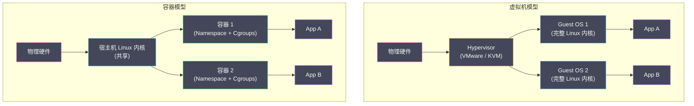
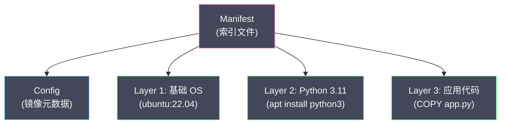
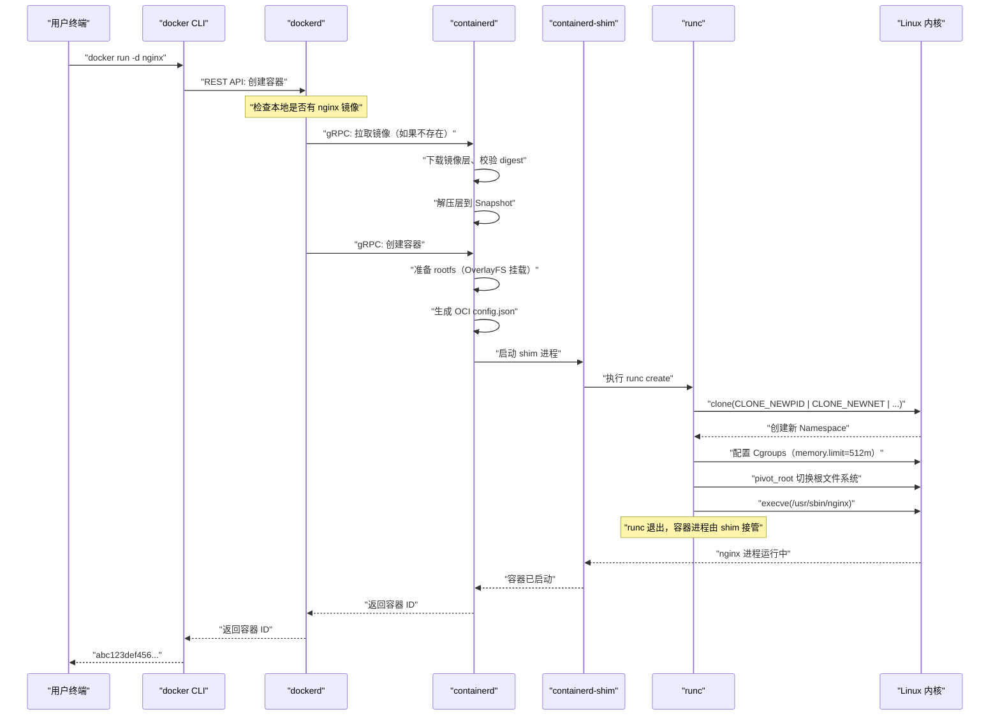
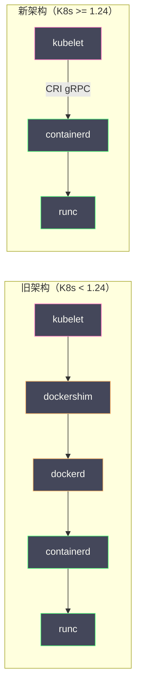

# 01 容器的本质——从进程隔离到 OCI 标准

**摘要：**

"容器就是轻量级虚拟机"——这是关于容器最常见的误解。虚拟机通过 Hypervisor 模拟出一套完整的硬件，在其上运行一个独立的操作系统内核；而容器**根本没有自己的内核**，它只是一个被 Linux 内核的 Namespace、Cgroups 等机制**隔离和限制**的普通进程。理解这个本质区别，是理解容器技术一切优势和一切局限的起点。本文从操作系统进程隔离的需求出发，回溯容器技术从 1979 年的 `chroot` 到 2013 年 Docker 再到 2015 年 OCI 标准的完整演进脉络，然后深入解析现代容器运行时的分层架构——从高层的 containerd 到底层的 runc，揭示 `docker run` 背后到底发生了什么。本文是整个容器核心原理专栏的总纲，为后续深入每一项内核技术奠定认知框架。

---

## 第 1 章 为什么需要容器

### 1.1 软件部署的根本矛盾

软件开发有一个古老的痛点：**"在我的机器上能跑"**。

一个 Java 服务在开发者的 MacBook 上运行正常，部署到测试环境的 CentOS 服务器上却报错——可能是 JDK 版本不一致（开发用 17，测试环境装的是 11），可能是某个系统库版本不同（`glibc` 的小版本差异导致 JNI 调用失败），也可能是配置文件路径不同。

这个矛盾的本质是：**应用程序依赖的运行环境（操作系统版本、库版本、配置、文件系统布局）在不同机器之间无法保持一致。**

在容器出现之前，业界尝试过多种方案来解决这个问题：

**方案一：标准化运维流程**。通过详尽的部署文档和自动化脚本（如 Ansible、Puppet、Chef）来确保每台服务器的环境一致。问题是——环境配置的排列组合是指数级的（操作系统版本 × 内核版本 × 库版本 × JDK 版本 × ...），脚本的维护成本随着复杂度增长而爆炸。而且"配置漂移"几乎不可避免——随着时间推移，不同服务器的环境会逐渐偏离标准。

**方案二：虚拟机**。每个应用运行在自己的虚拟机中，虚拟机内部有完整的操作系统，环境完全独立。虚拟机确实解决了环境一致性问题，但代价巨大——每个虚拟机需要运行一个完整的 Guest OS，占用数百 MB 到数 GB 的内存和磁盘；虚拟机的启动时间以分钟计；一台物理机能运行的虚拟机数量有限（通常几十个）。对于微服务架构——每个服务独立部署、需要快速扩缩容——虚拟机太"重"了。

**方案三：容器**。将应用程序及其所有依赖（库、配置、文件系统）打包成一个标准化的"容器镜像"，在任何安装了容器运行时的 Linux 机器上都能以相同的方式运行。容器不需要独立的操作系统内核（共享宿主机内核），启动时间以毫秒到秒计，内存和磁盘开销极小，一台物理机可以运行数百甚至数千个容器。

### 1.2 容器 vs 虚拟机：本质区别

| 维度 | 虚拟机 | 容器 |
| :--- | :--- | :--- |
| **隔离层级** | 硬件级（Hypervisor 模拟硬件）| 操作系统级（内核特性隔离进程）|
| **内核** | 每个 VM 有独立的 Guest OS 内核 | 所有容器**共享宿主机内核** |
| **资源开销** | 每个 VM 需要独立的 OS 内存（数百 MB+）| 容器本身几乎无额外开销 |
| **启动速度** | 分钟级（需要启动 OS）| 毫秒~秒级（只需启动进程）|
| **密度** | 一台物理机运行数十个 VM | 一台物理机运行数百~数千个容器 |
| **隔离强度** | 强（独立内核，攻击面小）| 较弱（共享内核，存在逃逸风险）|
| **兼容性** | 可以运行不同的 OS（如 Linux VM 跑在 Windows 上）| 只能运行与宿主机相同内核的程序 |



> [!info] 容器的本质定义
> **容器 = 被 Namespace 隔离视图 + 被 Cgroups 限制资源 + 拥有独立根文件系统（rootfs）的 Linux 进程。** 它没有独立的内核，没有虚拟硬件，它就是一个进程——只不过这个进程"以为"自己拥有一台独立的机器。

这个定义引出了容器技术的三大内核支柱：

- **[[Linux Namespace]]**：让容器进程看到独立的 PID 空间、网络栈、文件系统挂载点、主机名等——实现**视图隔离**（"我以为我是这台机器上唯一的进程"）
- **[[Cgroups]]**：限制容器进程能使用多少 CPU、内存、磁盘 I/O 等资源——实现**资源限制**（"你最多只能用 2 核 CPU 和 4GB 内存"）
- **[[UnionFS]]**（联合文件系统）：为容器提供一个独立的、分层的根文件系统——实现**文件系统隔离**（"你有自己的 /usr、/etc、/lib"）

后续三篇文章将分别深入这三大支柱。

---

## 第 2 章 容器技术的演进历史

### 2.1 chroot：一切的起点（1979）

容器技术的思想萌芽可以追溯到 1979 年 Unix V7 中引入的 `chroot` 系统调用。`chroot`（change root）的作用极其简单——**改变一个进程看到的根目录**。

```bash
# 将进程的根目录切换到 /var/sandbox
chroot /var/sandbox /bin/bash
```

执行上述命令后，新启动的 bash 进程会"认为" `/var/sandbox` 就是 `/`。它执行 `ls /` 看到的是 `/var/sandbox` 下面的内容，而不是真正的系统根目录。它无法访问 `/var/sandbox` 之外的文件（至少在理论上如此）。

`chroot` 的设计初衷不是安全隔离，而是**构建和测试**——在一个隔离的文件系统环境中编译和测试软件，不影响宿主系统。但它植入了一个重要的种子：**通过操作系统机制，让进程"看到"一个与宿主不同的环境**。

`chroot` 的局限是显而易见的：它只隔离了文件系统视图，进程仍然可以看到宿主机的所有进程（`ps aux`）、所有网络接口（`ip addr`）、所有用户（`cat /etc/passwd`）。而且 `chroot` 的"隔离"非常脆弱——有多种已知的方法可以"逃逸"出 chroot 环境（如通过 `fchdir` 系统调用）。它不是一个安全边界，只是一个方便的文件系统视图切换工具。

### 2.2 FreeBSD Jail：第一个真正的容器（2000）

2000 年，FreeBSD 4.0 引入了 **Jail** 机制——这是历史上第一个真正意义上的操作系统级虚拟化技术。Jail 在 `chroot` 的基础上增加了关键的隔离维度：

- **进程隔离**：Jail 内的进程只能看到 Jail 内的其他进程
- **网络隔离**：每个 Jail 可以绑定到独立的 IP 地址
- **文件系统隔离**：基于 chroot，但增加了更严格的限制
- **用户隔离**：Jail 内的 root 用户权限受到限制

Jail 证明了一个重要的命题：**不需要虚拟化硬件，仅通过操作系统内核的机制就能实现足够强的进程隔离**。这个思想直接影响了后来 Linux 容器技术的发展方向。

但 Jail 是 FreeBSD 专有的技术，不能直接用于 Linux。Linux 社区需要构建自己的隔离机制。

### 2.3 Linux 内核隔离原语的诞生（2002-2013）

受 Jail 的启发，Linux 内核社区从 2002 年开始逐步添加各种隔离原语。这是一个跨越十余年的渐进过程：

| 年份 | 内核版本 | 新增能力 | 意义 |
| :--- | :--- | :--- | :--- |
| 2002 | Linux 2.4.19 | Mount Namespace | 第一个 Namespace，文件系统挂载点隔离 |
| 2006 | Linux 2.6.19 | UTS Namespace | 主机名隔离 |
| 2006 | Linux 2.6.19 | IPC Namespace | 进程间通信隔离 |
| 2006 | Linux 2.6.24 | PID Namespace | 进程 ID 隔离 |
| 2007 | Linux 2.6.24 | Cgroups v1 合入主线 | 资源限制与控制 |
| 2009 | Linux 2.6.29 | Network Namespace | 网络栈隔离 |
| 2013 | Linux 3.8 | User Namespace | 用户 ID 映射，非特权容器 |

这些内核特性的添加不是偶然的——每一个 Namespace 的引入都是为了填补容器隔离中的一个具体缺口。比如没有 PID Namespace，容器内的进程可以看到宿主机上的所有进程，`kill` 命令可以杀死宿主机上的关键进程；没有 Network Namespace，容器无法拥有独立的 IP 地址和端口空间，端口冲突会成为噩梦。

### 2.4 LXC：Linux 原生容器（2008）

**LXC（Linux Containers）** 是第一个利用 Linux 内核 Namespace 和 Cgroups 实现的容器方案。它直接调用内核接口（`clone()` 系统调用配合 `CLONE_NEWPID | CLONE_NEWNET | ...` 标志位）来创建隔离的进程环境。

LXC 的目标是创建"轻量级虚拟机"——一个完整的 Linux 环境（包含 init 进程、系统服务），但共享宿主机内核。你可以在 LXC 容器中运行 `systemd`，启动 SSH 服务器，像使用虚拟机一样使用它。

LXC 证明了"仅依赖 Linux 内核特性就能实现容器"的可行性，但它有几个关键问题阻碍了大规模采用：

**问题一：缺乏标准化的镜像格式**。LXC 没有定义"如何打包和分发容器的文件系统"。每个用户需要自己准备 rootfs（通常通过 `debootstrap` 等工具创建一个最小的 Linux 文件系统），没有"镜像仓库"的概念，无法方便地共享和复用。

**问题二：配置复杂**。创建一个 LXC 容器需要编写冗长的配置文件，指定每一种 Namespace、Cgroups 参数、网络配置。这对于开发者来说门槛太高。

**问题三：面向"系统容器"而非"应用容器"**。LXC 的设计理念是"把容器当虚拟机用"——运行一个完整的 Linux 环境。而实际的应用部署需求通常是"运行一个应用进程"——容器中只需要应用本身和它的依赖，不需要 init 进程和系统服务。

### 2.5 Docker：容器的产品化革命（2013）

2013 年 3 月，Solomon Hykes 在 PyCon 上展示了 Docker——一个 5 分钟的演示改变了整个软件行业。

Docker 的技术原创性其实不高——它最初就是基于 LXC 构建的（后来替换为自己的 libcontainer，即 runc 的前身）。Docker 的真正贡献是**产品化和标准化**：

**贡献一：镜像（Image）与分层文件系统**。Docker 发明了分层的容器镜像格式——每一层是一组文件系统变更（增加/修改/删除的文件），层与层之间可以复用。一个 Python 应用的镜像 = Ubuntu 基础层 + Python 运行时层 + 应用代码层。如果另一个 Python 应用也基于 Ubuntu 和相同的 Python 版本，它们可以共享前两层，只有应用代码层不同。这种分层设计大幅减少了存储和传输的开销。

**贡献二：Dockerfile**。用一个简单的文本文件描述"如何从零构建一个容器镜像"——每条指令（`FROM`、`RUN`、`COPY`）生成一个新的镜像层。这让镜像的构建过程**可重复、可版本化、可审计**。

**贡献三：Registry（镜像仓库）**。Docker Hub 提供了一个中央化的镜像存储和分发平台。开发者可以 `docker push` 上传镜像，`docker pull` 下载镜像。这使得容器镜像成为一种"可交付物"——就像 Java 世界的 JAR 包可以上传到 Maven Central 一样。

**贡献四：极简的用户体验**。`docker run ubuntu echo hello` —— 一条命令就能在一个隔离的 Ubuntu 环境中执行命令。Docker 将 LXC 时代复杂的 Namespace/Cgroups 配置封装为简洁的 CLI 接口，大幅降低了容器技术的使用门槛。

> [!note] Docker 的定位转变
> Docker 从"面向系统"转向了"面向应用"——容器不再是"轻量级虚拟机"，而是"应用的标准化打包和运行单元"。每个容器运行一个应用进程（的一组进程），而不是一个完整的操作系统环境。这个理念的转变对后来的微服务架构和 [[Kubernetes]] 的设计产生了深远影响。

### 2.6 Docker 的架构演进

Docker 最初是一个单体二进制——`docker` 命令既是 CLI 客户端，又是守护进程，又是容器运行时。随着容器生态的发展，这种紧耦合的设计暴露出问题：其他项目（如 Kubernetes）想使用容器运行时，但不想依赖整个 Docker 引擎。

Docker 逐步将自身拆分为多个独立组件：

```mermaid
%%{init: {'theme': 'dracula'}}%%
graph TD
    subgraph "2013-2015: 单体 Docker"
        D1["docker (单一二进制)</br>CLI + 守护进程 + 运行时"]
    end

    subgraph "2016-至今: 拆分后的架构"
        CLI["docker CLI</br>(用户接口)"]
        DAEMON["dockerd</br>(Docker 守护进程)"]
        CTRD["containerd</br>(容器生命周期管理)"]
        SHIM["containerd-shim</br>(进程管理垫片)"]
        RUNC["runc</br>(OCI 容器运行时)"]
        CONTAINER["容器进程</br>(被隔离的进程)"]
    end

    CLI -->|"REST API"| DAEMON
    DAEMON -->|"gRPC"| CTRD
    CTRD --> SHIM
    SHIM --> RUNC
    RUNC -->|"clone() + exec()"| CONTAINER

    classDef old fill:#44475a,stroke:#ffb86c,color:#f8f8f2
    classDef cli fill:#44475a,stroke:#8be9fd,color:#f8f8f2
    classDef daemon fill:#44475a,stroke:#ff79c6,color:#f8f8f2
    classDef runtime fill:#44475a,stroke:#50fa7b,color:#f8f8f2
    classDef container fill:#44475a,stroke:#bd93f9,color:#f8f8f2

    class D1 old
    class CLI cli
    class DAEMON daemon
    class CTRD,SHIM runtime
    class RUNC,CONTAINER container
```



每个组件的职责：

- **docker CLI**：用户接口，解析命令行参数，通过 REST API 与 dockerd 通信
- **dockerd**：Docker 守护进程，管理镜像构建、网络、卷等高层功能
- **containerd**：容器生命周期管理（创建、启动、停止、删除），镜像管理。这是 CNCF 毕业项目，[[Kubernetes]] 可以直接对接 containerd 而不需要 dockerd
- **containerd-shim**：每个容器对应一个 shim 进程，解耦 containerd 与容器进程的生命周期——即使 containerd 重启，容器进程不受影响
- **runc**：OCI 标准的参考实现，负责调用 Linux 内核的 `clone()`、`unshare()` 等系统调用，实际创建 Namespace 和 Cgroups，启动容器进程

---

## 第 3 章 OCI 标准：容器的"TCP/IP"

### 3.1 为什么需要标准

Docker 在 2013-2015 年的快速崛起带来了一个隐忧：**容器技术会不会被 Docker 公司垄断？**

如果容器镜像的格式、运行时的接口都是 Docker 的私有规范，那么整个容器生态就被锁定在 Docker 的技术栈上。这对于 Google、Red Hat、CoreOS 等希望在容器生态中占有一席之地的公司来说是不可接受的。

2015 年，在 Linux 基金会的协调下，Docker、Google、CoreOS、Red Hat 等公司共同成立了 **Open Container Initiative（OCI）**，制定了两个核心标准：

- **OCI Runtime Specification**（运行时规范）：定义了"如何根据一个配置文件和一个根文件系统来运行一个容器"
- **OCI Image Specification**（镜像规范）：定义了容器镜像的格式——层（Layer）、清单（Manifest）、配置（Config）

后来又增加了第三个规范：

- **OCI Distribution Specification**（分发规范）：定义了镜像在 Registry 中如何存储和拉取的 HTTP API

### 3.2 OCI Runtime Specification

OCI 运行时规范定义了一个容器的**最小化描述**：

**一、文件系统包（Filesystem Bundle）**：一个目录，包含：
- `config.json`：容器的配置文件（详见下文）
- `rootfs/`：容器的根文件系统

**二、config.json 的核心字段**：

```json
{
  "ociVersion": "1.0.2",
  "process": {
    "terminal": false,
    "user": { "uid": 0, "gid": 0 },
    "args": ["/bin/myapp", "--port=8080"],
    "env": ["PATH=/usr/bin:/bin", "LANG=en_US.UTF-8"],
    "cwd": "/"
  },
  "root": {
    "path": "rootfs",
    "readonly": false
  },
  "hostname": "my-container",
  "linux": {
    "namespaces": [
      { "type": "pid" },
      { "type": "network" },
      { "type": "ipc" },
      { "type": "uts" },
      { "type": "mount" }
    ],
    "resources": {
      "memory": { "limit": 4294967296 },
      "cpu": { "quota": 200000, "period": 100000 }
    }
  }
}
```

这个 JSON 文件完整描述了一个容器的所有配置：

- `process`：容器启动后执行什么程序、以什么用户身份、带什么环境变量
- `root`：根文件系统的路径
- `linux.namespaces`：需要创建哪些 Namespace
- `linux.resources`：Cgroups 资源限制（内存上限 4GB、CPU 限额 200% 即 2 核）

**OCI 运行时规范的意义**：任何实现了 OCI Runtime Spec 的程序都可以运行容器。`runc` 是参考实现，但你也可以使用其他 OCI 兼容的运行时（如 `crun`——用 C 语言编写的更轻量级实现，或 `youki`——用 Rust 编写）。这种标准化打破了 Docker 的垄断——[[Kubernetes]] 不需要 Docker 就能运行容器，只需要一个 OCI 兼容的运行时。

### 3.3 OCI Image Specification

OCI 镜像规范定义了容器镜像的结构：

**镜像由三个核心部分组成**：

**一、层（Layer）**。每一层是一个 tar 归档文件，包含一组文件系统变更（增加、修改、删除的文件）。层之间是堆叠关系——上层的文件覆盖下层的同名文件。

**二、配置（Config）**。一个 JSON 文件，描述镜像的元数据：创建时间、作者、默认的入口命令、环境变量、暴露的端口，以及**每一层的 diff ID**（即层内容的 SHA256 哈希值）。

**三、清单（Manifest）**。将层和配置关联在一起的索引文件，包含每一层的摘要（digest）和媒体类型。



**内容寻址（Content-Addressable）**：OCI 镜像中的每个对象（层、配置、清单）都由其 **SHA256 哈希值**唯一标识。`sha256:a3ed95caeb02...` 这样的 digest 既是对象的"名字"，也是其完整性校验码。这意味着：
- 两个相同内容的层一定有相同的 digest——天然去重
- 任何篡改都会导致 digest 变化——天然防篡改
- 不同镜像可以共享相同的层——节省存储和传输

> [!info] 为什么是分层的
> 镜像分层是一个精妙的工程设计。假设你有 100 个基于 `ubuntu:22.04 + python:3.11` 的微服务镜像。如果每个镜像都完整包含 OS 和 Python 运行时，磁盘占用 = 100 × (OS 层 + Python 层 + 应用层)。但如果采用分层存储，OS 层和 Python 层只需要存储一次，100 个镜像共享这两层，磁盘占用 = 1 × OS 层 + 1 × Python 层 + 100 × 应用层。在 [[Kubernetes]] 的节点上，这种共享效应尤为显著——同一个节点上可能运行数十个共享基础层的容器。

---

## 第 4 章 容器运行时的分层架构

### 4.1 为什么需要分层

理解了 OCI 标准后，一个自然的问题是：为什么容器运行时不是一个单一的程序，而是分成了 containerd、containerd-shim、runc 这么多层？

答案是**关注点分离**：

**runc**（低层运行时 / OCI Runtime）：只做一件事——根据 OCI 的 `config.json` 和 `rootfs`，通过 Linux 系统调用创建一个容器进程。它调用 `clone()` 创建 Namespace，配置 Cgroups，`pivot_root` 切换根文件系统，然后 `exec` 启动容器进程。runc 是一个**"用完即走"**的工具——它创建完容器进程后自身就退出了。

**containerd-shim**（垫片进程）：runc 退出后，需要有一个进程作为容器进程的"父进程"，负责收集容器的退出状态、管理容器的 stdio 流。每个容器对应一个 shim 进程。shim 的存在使得 containerd 可以重启而不影响运行中的容器——因为容器的父进程是 shim 而不是 containerd。

**containerd**（高层运行时）：管理容器的完整生命周期——镜像拉取和存储、快照（snapshot）管理、容器的创建/启动/停止/删除、事件和日志。containerd 通过 gRPC API 对外提供服务，是 [[Kubernetes]] 的 kubelet 直接对接的组件。

### 4.2 docker run 的完整执行路径

当你执行 `docker run -d --memory=512m --cpus=1.5 nginx:latest` 时，底层经历了以下步骤：



**关键步骤详解**：

**步骤 1-2：CLI → dockerd**。docker CLI 将命令行参数解析为 REST API 请求，发送给 dockerd。dockerd 是一个长期运行的守护进程，监听 `/var/run/docker.sock` Unix socket。

**步骤 3：镜像拉取**。如果本地没有 `nginx:latest` 镜像，containerd 从 Registry（默认 Docker Hub）下载镜像层。每一层是一个压缩的 tar 包，containerd 校验每层的 SHA256 digest 确保完整性，然后解压到本地的 Snapshot 存储中。

**步骤 4：准备 rootfs**。containerd 使用 [[OverlayFS]]（Linux 内核的联合文件系统）将镜像的各层叠加为一个统一的文件系统视图，作为容器的根文件系统。底层是只读的镜像层，顶层是一个可写层——容器运行时的文件修改都写入这个可写层。

**步骤 5：生成 OCI config.json**。containerd 将 Docker 的容器配置（`--memory=512m`、`--cpus=1.5`、端口映射、环境变量等）转换为 OCI 标准的 `config.json`。

**步骤 6-7：runc 创建容器**。runc 读取 `config.json`，执行一系列 Linux 系统调用：
- `clone()` + Namespace 标志位：创建新的 PID/Network/Mount/UTS/IPC Namespace
- 写入 Cgroups 文件系统（`/sys/fs/cgroup/.../memory.limit_in_bytes = 536870912`）：设置资源限制
- `pivot_root()`：将容器进程的根文件系统切换到 OverlayFS 挂载点
- `execve("/usr/sbin/nginx")`：在隔离的环境中启动 nginx 进程

**步骤 8：runc 退出，shim 接管**。runc 完成容器创建后自身退出。nginx 进程的父进程是 containerd-shim。即使 containerd 或 dockerd 重启，nginx 进程不受影响。

### 4.3 Kubernetes 为什么不需要 Docker

理解了上述架构后，一个重要的结论浮出水面：**Docker 在容器运行时栈中的角色是可替代的**。

实际创建和管理容器的是 containerd 和 runc。dockerd 在这个链路中只是一个"中间人"——它接收 docker CLI 的请求，转发给 containerd。如果直接对接 containerd，完全可以绕过 dockerd。

这正是 [[Kubernetes]] 从 1.24 版本开始弃用 dockershim 的原因。Kubernetes 的 kubelet 现在直接通过 **CRI（Container Runtime Interface）** 与 containerd 通信，不再需要经过 dockerd：



减少了一层中间组件，链路更短、效率更高、维护更简单。**Docker 在开发者的工作站上仍然有价值**（`docker build`、`docker compose` 等开发工具），但在生产环境的 Kubernetes 集群中，containerd 已经成为主流的容器运行时。

---

## 第 5 章 手动构建一个"容器"

### 5.1 用 Linux 原语模拟 docker run

为了真正理解容器的本质，最有效的方法是**用 Linux 原语手动构建一个容器**——不使用 Docker、不使用 runc，仅使用内核提供的 Namespace、Cgroups 和文件系统操作。

以下步骤在一台 Linux 机器上演示（需要 root 权限）：

**第一步：准备根文件系统**

```bash
# 创建一个最小的根文件系统（使用 Alpine Linux 的 rootfs）
mkdir -p /tmp/my-container/rootfs
cd /tmp/my-container

# 下载 Alpine 的 minirootfs
wget https://dl-cdn.alpinelinux.org/alpine/v3.19/releases/x86_64/alpine-minirootfs-3.19.0-x86_64.tar.gz
tar xf alpine-minirootfs-3.19.0-x86_64.tar.gz -C rootfs
```

**第二步：用 unshare 创建隔离的 Namespace**

```bash
# unshare 命令创建新的 Namespace 并在其中执行命令
# --mount: 新的 Mount Namespace
# --uts:   新的 UTS Namespace（独立主机名）
# --ipc:   新的 IPC Namespace
# --pid:   新的 PID Namespace
# --fork:  fork 一个新进程（PID Namespace 需要）
unshare --mount --uts --ipc --pid --fork /bin/bash
```

此时你处于一个新的 Namespace 中，但根文件系统仍然是宿主机的。

**第三步：切换根文件系统**

```bash
# 挂载 proc 文件系统（PID Namespace 需要）
mount -t proc proc /tmp/my-container/rootfs/proc

# 切换根文件系统
cd /tmp/my-container/rootfs
pivot_root . .old_root

# 卸载旧的根文件系统
umount -l /old_root
rmdir /old_root

# 设置主机名
hostname my-container
```

**第四步：验证隔离**

```bash
# 查看进程——只能看到容器内的进程
ps aux
# PID   USER     COMMAND
#   1   root     /bin/bash    ← 容器的 init 进程

# 查看主机名
hostname
# my-container

# 查看文件系统——看到的是 Alpine 的文件系统
ls /
# bin  dev  etc  home  lib  media  mnt  opt  proc  root  run  sbin  srv  sys  tmp  usr  var
```

**第五步：添加 Cgroups 资源限制**

```bash
# 在宿主机的另一个终端中，为容器进程设置内存限制
# 假设容器进程的宿主机 PID 为 12345
mkdir /sys/fs/cgroup/memory/my-container
echo 104857600 > /sys/fs/cgroup/memory/my-container/memory.limit_in_bytes  # 100MB
echo 12345 > /sys/fs/cgroup/memory/my-container/tasks
```

至此，你手动构建了一个具备视图隔离（Namespace）、文件系统隔离（pivot_root）和资源限制（Cgroups）的"容器"。**这就是 `docker run` 底层做的全部事情**——当然 Docker/runc 的实现更加健壮和完善（错误处理、安全加固、网络配置等），但核心原理就是这些 Linux 系统调用的组合。

---

## 第 6 章 容器技术的边界与局限

### 6.1 共享内核带来的安全风险

容器的最大优势（共享内核 → 轻量高效）同时也是它最大的风险。所有容器与宿主机运行在同一个 Linux 内核上——如果一个容器利用内核漏洞获得了内核态的执行权限，它就可以访问宿主机和所有其他容器的内存、文件系统和网络。这被称为**容器逃逸（Container Escape）**。

虚拟机没有这个问题——每个 VM 有自己的内核，即使 Guest OS 的内核被攻破，攻击者仍然被困在虚拟机内部（需要再攻破 Hypervisor 才能逃逸到宿主机，而 Hypervisor 的攻击面远小于 Linux 内核）。

### 6.2 安全容器：弥补隔离的不足

为了在保持容器轻量性的同时增强隔离，业界发展出了**安全容器**技术：

| 技术 | 原理 | 优势 | 劣势 |
| :--- | :--- | :--- | :--- |
| **gVisor** | Google 开发的用户态内核，拦截容器的系统调用，在用户态模拟内核行为 | 不需要虚拟化硬件，兼容性好 | 系统调用性能下降 30-50% |
| **Kata Containers** | 每个容器运行在一个轻量级虚拟机（基于 QEMU/Cloud-Hypervisor）中 | 隔离强度接近 VM，兼容 OCI 标准 | 启动时间增加，内存开销增加 |
| **Firecracker** | Amazon 开发的微虚拟机，为 AWS Lambda 等无服务器场景优化 | 启动时间 < 125ms，内存开销 < 5MB | 设备支持有限，专为特定场景优化 |

这些技术在 [[Kubernetes]] 中可以通过 **RuntimeClass** 配置——同一个集群中，可信的内部服务使用普通的 runc 运行时（性能优先），不可信的多租户工作负载使用 Kata Containers 运行时（安全优先）。

### 6.3 容器不是万能的

容器技术不适用于以下场景：

- **需要不同内核**：容器共享宿主机内核，无法运行依赖不同内核版本或不同操作系统（如 Windows 容器不能跑在 Linux 宿主机上）的工作负载
- **需要内核模块**：容器无法加载宿主机没有的内核模块（如特定的文件系统驱动、网络驱动）
- **极致性能敏感**：Namespace 和 Cgroups 引入了微小但非零的性能开销，对于高频交易等纳秒级延迟敏感的场景，裸金属部署仍然是首选
- **强隔离需求**：在多租户公有云环境中，容器的隔离强度可能不满足合规要求，需要 VM 或安全容器

---

## 第 7 章 本章总结与后续导读

本文建立了容器技术的认知框架：

**核心结论**：
- 容器 = Namespace（视图隔离）+ Cgroups（资源限制）+ rootfs（文件系统隔离）
- 容器不是虚拟机，它是被内核机制隔离和限制的进程
- Docker 的核心贡献是产品化（镜像、Dockerfile、Registry），而非底层技术发明
- OCI 标准使容器生态去中心化——containerd + runc 成为行业标准
- Kubernetes 直接对接 containerd，不需要 Docker

**后续文章导读**：
- [[02 Linux Namespace 深度解析]]：深入六大 Namespace 的内核实现，手动构建完整的隔离环境
- [[03 Cgroups 资源限制与控制]]：v1 vs v2 架构、CPU/Memory/IO 控制器、OOM Killer
- [[04 UnionFS 与容器镜像原理]]：OverlayFS 的分层机制、镜像的构建与分发
- [[05 容器网络原理]]：veth pair、Bridge、CNI 接口
- [[06 容器安全边界与逃逸风险]]：Capabilities、Seccomp、AppArmor、Rootless 容器

---

## 参考资料

1. Solomon Hykes (2013). *The future of Linux Containers* (PyCon Lightning Talk).
2. Open Container Initiative. *OCI Runtime Specification*：https://github.com/opencontainers/runtime-spec
3. Open Container Initiative. *OCI Image Specification*：https://github.com/opencontainers/image-spec
4. containerd Documentation：https://containerd.io/docs/
5. runc：https://github.com/opencontainers/runc
6. Kubernetes Blog (2020). *Don't Panic: Kubernetes and Docker*：https://kubernetes.io/blog/2020/12/02/dont-panic-kubernetes-and-docker/
7. Brendan Burns, Joe Beda, Kelsey Hightower (2019). *Kubernetes: Up and Running*, 2nd Edition. O'Reilly.
8. Michael Kerrisk (2013). *Namespaces in operation* (LWN.net series).
9. Linux man pages: `namespaces(7)`, `cgroups(7)`, `clone(2)`, `unshare(2)`, `pivot_root(2)`.

---

> [!note] 思考题
> 1. 容器的隔离由 Linux Namespace 实现——PID/Network/Mount/UTS/IPC/User 各自隔离一类资源。但容器共享宿主机内核——如果容器中的进程利用内核漏洞（如 Dirty COW），可以逃逸到宿主机。与虚拟机（独立内核）相比，容器在安全隔离方面的根本差距是什么？gVisor 和 Kata Containers 如何弥补？
> 2. CGroups 限制容器的资源使用——`memory.max` 限制内存，`cpu.max` 限制 CPU。但容器内的应用可能不感知 CGroups 限制——JVM 在没有 `-XX:+UseContainerSupport` 时读取宿主机的总内存而非容器限制。除了 Java，哪些运行时（Python、Node.js、Go）需要特殊配置才能正确感知容器资源限制？
> 3. 容器的文件系统使用 OverlayFS——由只读的镜像层和可写的容器层叠加。容器写入文件时使用 COW（Copy-on-Write）——从镜像层复制文件到容器层再修改。频繁写入大文件时 COW 的性能开销如何？为什么数据库容器通常挂载 Volume 而非写入容器层？
