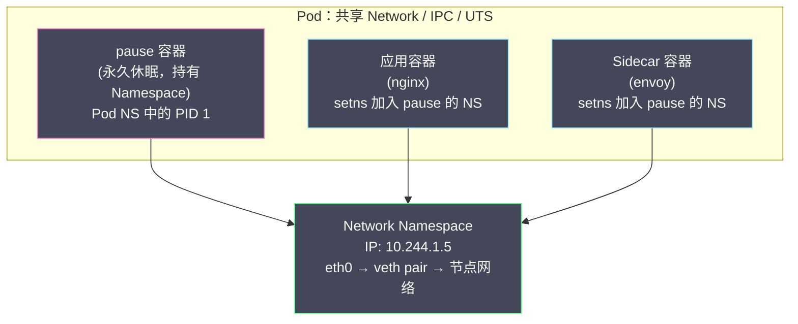

# 02 Linux Namespace 深度解析

**摘要：**

[[01 容器的本质——从进程隔离到 OCI 标准|上一篇]]把容器定义为"被 Namespace 隔离视图、被 Cgroups 限制资源、拥有独立 rootfs 的 Linux 进程"，其中 Namespace 是三大支柱里最"视错觉"的一个——它不划分资源本身，而是划分进程**能看到**的资源：独立的进程编号、独立的网络栈、独立的挂载表、独立的主机名。本文自底向上把这套机制讲透：先从"没有视图隔离的世界"出发看 Namespace 解决的具体痛点，再深入内核的数据结构（`task_struct` 到 `nsproxy`）理解它的实现本质；随后逐一拆解八种 Namespace——每一种都回答三个问题：它隔离什么、不存在它会怎样、容器与 Kubernetes 在什么场景依赖它；接着辨析操作 Namespace 的三个系统调用 `clone`/`unshare`/`setns` 的语义差异，并解释 `docker exec` 与 `nsenter` 的底层原理；再还原 Kubernetes Pod 通过 pause 容器共享 Namespace 的完整机制；最后划定 Namespace 的能力边界——它隔离什么、不隔离什么、为什么说它提供的是视图隔离而非安全隔离。读完全文，你应当能用裸的系统调用拼出一个具备完整视图隔离的进程，并准确回答"容器到底隔离了什么、没隔离什么"。

---

## 第 1 章 视图隔离：一个古老的系统问题

### 1.1 让每个进程活在自己的世界里

先设想一个没有 Namespace 的多租户服务器。一台 Linux 主机上运行着两家互不相干的应用，App A 与 App B，它们共享同一套内核数据结构：同一个全局进程表、同一套网络接口、同一棵挂载树、同一个 IPC 标识符空间。此时会发生一连串在多租户场景下不可接受的事情：App A 的运维脚本执行 `kill 5678` 时，如果 5678 恰好是 App B 进程的 PID，B 的进程就被杀掉了；App A 想监听 80 端口，B 也在监听 80 端口，后启动的那个得到 `Address already in use`；App A 修改了 `/etc/resolv.conf` 里的 DNS 配置，B 的域名解析随之改变；A 调用 `gethostname()` 拿到的是宿主机的主机名，把主机名用作服务注册标识时，A 和 B 注册出了同一个实例。

问题的共同根源在于：**内核的许多资源天然是"全局单例"的——一张全局进程表、一套网络栈、一棵挂载树——而多租户需求要求把它们按租户分组呈现**。Namespace 给出的答案非常有 Linux 的风格：不去修改任何一个应用程序，而是在内核的"资源查询"环节插入了分组逻辑——进程查询资源时，内核先看它属于哪个分组，再返回该分组自己的那份资源。全局资源变成了"每 Namespace 一份"的资源，进程看到的永远是自己的那一份。

用一间合租公寓来锚定这个概念：公寓里的水、电、宽带是全体租户共享的，但每间房有自己的门牌号、自己的门锁、自己房间里的电表读数——租户 A 看不到租户 B 的电表，也管不了 B 房间的门。Namespace 就是内核给每组进程分的"房间"：房间里的视图（你看到的 PID 列表、网卡列表）是独立的，但房间背后的供电供水（同一个内核、同一块物理网卡）是共享的。这个比喻的边界需要立刻钉住，否则后文会失真：合租公寓的房间锁是**物理隔离**，而 Namespace 的"房间门"只是**视图遮挡**——如果你有办法绕过视图层直接触碰内核（譬如利用内核漏洞），房间的遮挡就形同虚设。视图隔离与安全隔离的区别，是本文最后两章的核心议题。

### 1.2 与虚拟化的本质区别

把 Namespace 与硬件虚拟化对比，可以更准确地定位它的设计哲学。虚拟机的思路是**复制**：给每个租户一整套独立的硬件与内核，租户之间连内核都不同，隔离自然彻底，代价是每个租户都要承担一个完整操作系统的内存、启动时间与维护成本。Namespace 的思路是**分身**：内核只有一份，但每个分组看到的世界不同——它交换的是"呈现层"而不是"实现层"，因此开销几乎可以忽略，密度可以做到极高。

这个差异在工程上的一个直接后果是：Namespace 只能隔离"内核愿意分组呈现"的资源。内核不分组呈现的东西（内核版本、大部分 sysctl 参数、系统时间等），Namespace 就隔离不了——8.1 节会给出完整的清单。理解了"Namespace 是一组视图规则"，这个边界几乎是自明的。

两种思路的成本结构也截然不同，这笔账决定了它们各自的适用地盘。复制（虚拟机）的成本与租户数量成正比，每多一个租户就多一份内核底账，但隔离的强度不随租户数量衰减；分身（Namespace）的成本几乎与分组数量无关——新建一个 Namespace 只是分配一个内核对象，千个容器的宿主机上"分身"的开销依然可以忽略，但共享内核意味着所有租户背靠同一个攻击面，隔离强度有明确的天花板。云原生基础设施的演化史，某种意义上就是在这两笔账之间反复取中：虚拟机做租户间的硬边界，容器做租户内的软分组，安全容器（微虚拟机）再在两者之间补出中间档位。

### 1.3 一段被内核版本号记录的历史

Namespace 不是一次设计出来的，而是十几年里逐个"补洞"补出来的，回看引入时间表，能看到每个 Namespace 背后对应的那一类具体需求：

| 年份 | 内核版本 | Namespace | 隔离的资源 |
| :--- | :--- | :--- | :--- |
| 2002 | Linux 2.4.19 | **Mount** | 文件系统挂载点 |
| 2006 | Linux 2.6.19 | **UTS** | 主机名与域名 |
| 2006 | Linux 2.6.19 | **IPC** | System V IPC、POSIX 消息队列 |
| 2008 | Linux 2.6.24 | **PID** | 进程 ID 编号空间 |
| 2009 | Linux 2.6.29 | **Network** | 网络栈：设备、地址、路由、端口 |
| 2013 | Linux 3.8 | **User** | UID/GID 映射与 Capabilities |
| 2016 | Linux 4.6 | **Cgroup** | Cgroup 层级视图 |
| 2020 | Linux 5.6 | **Time** | 单调时钟与启动时钟 |

这份时间表还有一个版本考古学的花絮：Mount Namespace 的 clone 标志位是 `CLONE_NEWNS`——不是 `CLONE_NEWMNT`。因为它是历史上第一个 Namespace，设计者没有预见到"NS"会成为一组机制的名字，直接用了最泛化的 New Namespace 命名；等后来者陆续出现，命名才逐渐规范成 `CLONE_NEWPID`、`CLONE_NEWNET` 这样的具体形式。一个标志位名称里凝固着 2002 年设计者的视野边界，读代码时偶尔撞见，颇有历史现场感。

---

## 第 2 章 内核实现：Namespace 到底是什么

### 2.1 从 task_struct 到 nsproxy

在内核中，每个进程（准确说是每个调度单元 task）由 `task_struct` 结构体描述，进程的几乎所有属性——调度策略、打开的文件、信号处理——都挂在这个结构体上。Namespace 相关的部分是一个 `nsproxy` 指针，指向一个聚合了各类 Namespace 引用的结构体：

```c
// 简化后的内核数据结构（省略无关字段）
struct task_struct {
    /* ... */
    struct nsproxy *nsproxy;   // 指向该进程的 Namespace 集合
};

struct nsproxy {
    atomic_t           count;                  // 引用计数
    struct mnt_namespace   *mnt_ns;            // Mount Namespace
    struct uts_namespace      *uts_ns;           // UTS Namespace
    struct ipc_namespace   *ipc_ns;            // IPC Namespace
    struct pid_namespace   *pid_ns_for_children; // PID Namespace（影响子进程）
    struct net             *net_ns;            // Network Namespace
    struct time_namespace  *time_ns;           // Time Namespace
    struct cgroup_namespace *cgroup_ns;        // Cgroup Namespace
};
```

这段结构揭示了几件重要的事。其一，**Namespace 是"指针的共享"而不是"资源的复制"**：两个进程如果 `nsproxy` 里的 `net_ns` 指向同一个 `struct net`，它们就在同一个 Network Namespace 里——共享是通过指向同一个内核对象实现的，创建新 Namespace 是分配新的内核对象并让指针改指过去，没有任何数据拷贝，这就是 Namespace 轻量的实现层原因。其二，`pid_ns_for_children` 这个字段名本身就藏着 PID Namespace 的一个反直觉细节：**对当前进程调用 `unshare(CLONE_NEWPID)` 不会改变它自己所在的 PID Namespace**——因为进程的 PID 在创建时刻就已经按当时的编号空间分配完毕，无法追认改名；新分配的 PID Namespace 只对之后 fork 出的子进程生效（字段名 for_children 的字面含义）。命令行工具为此提供了 `--fork` 选项，先 unshare 再 fork 一个子进程，让子进程成为新编号空间的 PID 1。顺带澄清一个易混点：**Namespace 的归属单位是进程（线程组）而不是线程**——同一个进程的所有线程共享同一套 Namespace，你不能让同一个多线程进程的两个线程看到不同的网络栈；需要"同一应用内的视图分组"时，只能用多进程配合 unshare/setns 来实现，这对一些容器化的多租户 SDK 是实打实的架构约束。

其三，每个 Namespace 内核对象都有引用计数与生命周期：最后一个成员进程退出（或退出该 Namespace）时，Namespace 对象随之销毁；一个没有进程持有的 Network Namespace 会连同其中的虚拟设备一起消失。这个生命周期规则在 Kubernetes 里有个著名的应用——Pod 的 pause 容器存在的唯一意义，就是"赖着不走"地持有 Pod 级的 Network/IPC/UTS Namespace（第 7 章展开）。

### 2.2 观察 Namespace 的三扇窗

内核把 Namespace 的信息通过 `/proc` 暴露出来，日常排查有三个常用入口。第一扇窗是 `/proc/<PID>/ns/` 目录，其中每个符号链接代表该进程持有的一个 Namespace：

```bash
ls -l /proc/1/ns/
# lrwxrwxrwx ... pid   -> 'pid:[4026531836]'
# lrwxrwxrwx ... net   -> 'net:[4026531840]'
# lrwxrwxrwx ... mnt   -> 'mnt:[4026531841]'
```

方括号里的数字是该 Namespace 对象的 inode 号，**两 个进程某类 ns 链接的 inode 号相同，当且仅当它们处于同一个 Namespace**——这是判断"谁和谁共享网络栈"最可靠的依据，比任何间接推断都硬。第二扇窗是 `lsns` 命令，把系统中所有 Namespace 按类型列表展示（含其中的进程数与创建者），适合全局概览：

```bash
lsns -t net
#        NS TYPE NPROCS   PID USER   COMMAND
# 4026531840 net      2   1   root   /sbin/init                 ← 宿主机默认网络栈
# 4026532738 net      1   871 root   /pause                     ← 某 Pod 的网络栈
# 4026533012 net      1   913 root   nginx -g daemon off;       ← 某 Docker 容器的网络栈
```

一次 `lsns` 就能看出这台机器上有几个独立的网络世界、每个世界里有几个进程、由谁创造——在共享宿主机排查"谁占用了端口"或"容器是否真的共享了网络"时，它是最快的入口。第三扇窗是 `/proc/<PID>/status` 中的 `NSpid` 行，能同时看到一个进程在各层 PID Namespace 中的编号（根空间编号在前，逐层往后），排查"容器内 PID 与宿主机 PID 对不上"时非常直观。

进程如何"进入"别人的 Namespace？内核在 `/proc/<PID>/ns/<type>` 上支持 `open()` + `setns()` 的操作路径（第 5 章详述），这就是 `nsenter`、`docker exec` 们的底层通道。换句话说，Namespace 的三大操作原语——创建、脱离、加入——全部围绕 `/proc` 中的这些句柄展开，理解了 `ns/` 目录，Namespace 的操作面就完整了。

---

## 第 3 章 六大核心 Namespace 逐一拆解

容器运行时创建容器时，通常一次性创建 Mount、UTS、IPC、PID、Network 五种 Namespace（User 视安全策略、Cgroup 视内核版本追加）。本节按"隔离什么——不隔离会怎样——容器与 K8s 怎么用"的三段式，逐个拆解。

### 3.1 PID Namespace：进程编号的独立空间

**隔离什么。** PID Namespace 给每组进程一个独立的进程编号空间：新 Namespace 中创建的第一个进程编号为 1，其后进程依次编号，与宿主机进程表完全无关。宿主机（父 Namespace）能看到子 Namespace 里的所有进程（通过全局 PID 编号），反过来则不行——子 Namespace 中的进程连父 Namespace 的存在都感知不到。这个单向可见性是刻意的：**管理面（宿主机）必须能观察和管理容器内的进程，而容器不应能反向窥视或干扰宿主机**。

**不隔离会怎样。** 反事实推演一下就很清楚：没有 PID 隔离，容器里的 `ps aux` 会列出宿主机全部进程，拓扑信息直接泄露；容器内应用随手 `kill` 一个"恰好同号"的宿主机进程，就是一次事故；更微妙的是，应用普遍把"自己是 1 号进程"当作独占机器的信号（譬如某些 init 逻辑），共享编号空间时这个信号完全失真。

**PID 1 的特殊性。** 每个新 PID Namespace 的 1 号进程承担了 init 的部分职责：Namespace 内所有孤儿进程（父进程先退出）会被收养到它名下；它退出时，内核向该 Namespace 内所有进程发送 SIGKILL，整个进程组随它陪葬。还有一个容易被踩的细节：内核不向 1 号进程投递**未注册处理器**的信号——从容器内部对 PID 1 执行 `kill -TERM 1`，若 1 号进程没有注册 SIGTERM 处理函数，信号会被静默丢弃。设计动机是保护 init 不被意外杀死，但在容器场景里催生了一个经典的故障模式：应用的入口进程没有注册信号处理，`docker stop` 发出的 SIGTERM 被无视，等到宽限期（Docker 默认 10 秒，Kubernetes 里对应 `terminationGracePeriodSeconds` 默认 30 秒）结束，运行时只能补一刀 SIGKILL，正在处理的请求被硬生生截断。防范方法也直接：入口进程显式处理 SIGTERM，或用 shell 包装时采用 `exec` 形式（`ENTRYPOINT ["java", "-jar", "app.jar"]` 而非 `ENTRYPOINT ["sh", "-c", "java -jar app.jar"]`——后者里 java 是 shell 的子进程，且 shell 未必转发信号）。

**嵌套与双向可见性。** PID Namespace 支持**嵌套**（内核限制最大深度 32 层），嵌套后的编号与可见性规则值得用一张关系讲清：一个进程在每个它"身处"的 PID Namespace 里都有一个编号——容器里是 PID 1，宿主机上可能是 PID 28456，`/proc/<PID>/status` 的 `NSpid` 字段会依次列出各层编号。可见性沿"祖先"方向单向开放：父 Namespace 中的进程能看到所有子孙 Namespace 的进程（用子孙在自己 Namespace 里的编号操作即可），子孙看不到父辈与旁支。信号语义也顺着这棵树走：父 Namespace 可以向子 Namespace 的任意进程（包括其 PID 1）发送信号，不受"PID 1 免疫未注册信号"的保护——那道免疫只对 Namespace 内部的进程生效。这条规则正是容器管理的底层合法性来源：宿主机上的运行时始终保有对容器内一切进程的生杀权，而容器内进程对宿主机一无所知。

**容器与 K8s 的用法。** 默认情况下每个容器一个 PID Namespace（容器内 `ps` 只看到自己）。Kubernetes 1.17 起（beta）支持 Pod 级共享：`spec.shareProcessNamespace: true` 让同 Pod 所有容器共享一个 PID Namespace，典型用途是调试类 Sidecar——`strace` 主容器进程需要能看到目标进程，共享 PID 空间是前提。另一个 K8s 相关实践是给 Pod 设置 `pids` 资源限制（`pids.max`），防止失控的进程创建（fork 炸弹）在共享内核的宿主机上扩散，这属于 [[03 Cgroups 资源限制与控制|下一篇]] 的范畴。

**PID 1 与僵尸进程：被低估的容器故障源。** PID 1 收养孤儿还有一层不体面的职责——**为收养的孩子"收尸"**：子进程退出后若父进程从不调用 `wait()`，它会以僵尸进程（Z 状态）的形式留在进程表里占着编号与条目，唯一的清道夫就是它的父进程（机制细节参见 [[Linux/进程管理/05 进程的终结与善后——exit、wait 与僵尸进程|进程的终结与善后]]）。普通应用进程被推上 PID 1 的位置时，多数并不具备这个能力——它们被设计成"被别人管理"，而不是"管理别人"。后果是：容器里凡是会 fork 子进程又没有妥善 wait 的应用（常见于 wrapper 脚本、定时任务派生后台作业的场景），僵尸会持续累积，最终耗尽 PID 编号空间，容器内再也无法创建任何新进程。这个故障在容器环境远比虚拟机常见，因为"容器里没有真正的 init"。通用的解法是给容器配一个尽职的迷你 init：Docker 的 `--init` 参数（内置的 tini）或在镜像里显式引入 `tini`/`dumb-init` 作为入口，让它们作为 PID 1 接管收养与收尸，把应用降级为自己的子进程。一句话总结：**容器里的 PID 1 要么是完整的 init，要么是个会收尸的代理，唯独不能是个普通应用。**

### 3.2 Mount Namespace：挂载表的独立世界

**隔离什么。** Mount Namespace 隔离的是挂载点列表：不同 Namespace 各有一棵独立的挂载树，在一个 Namespace 里执行的 `mount`/`umount` 默认不影响其他 Namespace。容器"拥有自己的根文件系统"这个能力，直接建立在它之上——运行时先把镜像各层组装挂载成 rootfs，再让容器进程进入新的 Mount Namespace，最后用 `pivot_root` 把根切换过去（`pivot_root` 本身要求调用方在新 Mount Namespace 中，否则切换会污染宿主机的挂载树）。

**不隔离会怎样。** 没有它，任何进程的挂载操作都是全局的：容器启动流程中"挂载 rootfs、挂载 /proc、挂载 /sys"的每一个动作都会直接改写宿主机的挂载表，容器之间互相看见彼此的文件系统，"独立环境"无从谈起。它是八种 Namespace 里唯一没有专属 `CLONE_NEW*` 名字的一个（`CLONE_NEWNS`），也是最老的一个——因为容器的前身（chroot 系工具链）最早需要的恰恰是挂载隔离。

**它和 chroot、pivot_root 的关系。** 三者经常被混为一谈，值得一次说清。`chroot` 只改变当前进程对"根目录"的解释，宿主机的挂载树纹丝不动，且进程若还持有目录描述符，可以从内部逃出；`pivot_root` 则是把整棵挂载树的根**搬移**——旧的根被挪到新根下的某个目录，随后可以卸载掉，让旧文件系统从视图中彻底消失；而 Mount Namespace 保证这一切只发生在本 Namespace 的挂载树副本上，不惊动他人。容器运行时的标准姿势是三者配合：新 Mount Namespace 中挂载组装好的 rootfs，`pivot_root` 切根，卸载旧根，再把 `/proc`、`/sys`、`/dev` 等特殊文件系统补挂进去。缺了 Mount Namespace 的 chroot 是纸糊的墙，加了 Mount Namespace 与 `pivot_root` 才是砖砌的门。

**挂载传播（Mount Propagation）。** Mount Namespace 有一套控制"挂载事件是否跨 Namespace 扩散"的机制，这是容器与宿主机共享目录时最常被误解的部分。每个挂载点有四种传播属性：`private`（完全隔离，容器默认）、`shared`（双向传播，A 里挂载的目录 B 立即可见，反之亦然）、`slave`（单向传播，master 的挂载事件流向 slave，slave 自己的挂载不回流）、`unbindable`（拒绝被 bind mount 复制，防止传播树意外扩散）。这组机制在 Kubernetes 里直接对应 `volumeMounts.mountPropagation` 字段：`Bidirectional` 即 shared（容器与宿主机双向同步挂载事件，用于 CSI 存储驱动需要看容器内子挂载的场景），`HostToContainer` 即 slave（宿主机的挂载变化能进入容器，典型如日志采集侧目录），`None` 即 private（默认）。配置错误的最常见症状是"宿主机上后来挂载的子目录，容器里看不到"——症结十有八九在传播属性，而不是权限。

挂载隔离还有一个每天都在发生却不引人注意的应用：每个容器的 `/etc/hosts`、`/etc/hostname`、`/etc/resolv.conf` 都是**逐容器注入的 bind mount**，而不是镜像里的静态文件。这三个文件的内容按容器的网络身份动态生成（hostname 要写容器 ID 或 Pod 名，resolv.conf 要写运行时内嵌 DNS 或集群 DNS 的地址），若直接写进镜像层，同一镜像的所有容器就长了一张嘴。运行时在创建每个容器时从其管理数据里生成这三个文件、逐个 bind mount 进容器——于是同一个镜像可以数千次实例化，每个实例都有自己的主机名与 DNS 指向。这也是为什么在容器里直接改写这三个文件"重启就复原"：你改的是注入的挂载，不是镜像。

### 3.3 Network Namespace：一人一套网络栈

**隔离什么。** Network Namespace 隔离的是整套网络栈：网络设备、IP 地址、路由表、iptables/nftables 规则、端口空间、套接字缓冲的统计、乃至 `/proc/net` 的内容。两个进程只要 `net_ns` 指针不同，它们可以同时监听 80 端口、拥有同名接口、互不知道对方的存在。

**不隔离会怎样。** 端口冲突是最直接的痛——一台机器上跑不下第二个想监听 80 的服务，多租户从根上不成立。其次是无差别可见：没有网络隔离，任何进程都能抓包、伪造、监听宿主机全部流量，网络层面的租户边界完全消失。容器网络的"每个容器一个 IP"的故事，起点全部在 Network Namespace。

**先有孤岛，后有桥。** 这里必须先立一个框架性认知，为 [[05 容器网络原理|下一篇]] 的展开留好接口：新创建的 Network Namespace 是一张白纸——里面只有一个未启用的 `lo` 回环接口，没有 eth0，没有默认路由，连不通任何外部世界。**Namespace 创造隔离，连接隔离世界的管道（veth pair）、交换设备（bridge）、地址转换（NAT）是另一组独立的内核机制**。换句话说，Network Namespace 解决"分家"，容器网络要解决"分家之后怎么通网"，后者是一整章的工程，不是一条 Namespace 属性。用一个最小的实验感受"孤岛"状态：

```bash
# 创建一个命名好的 Network Namespace（内核自动为其分配独立网络栈）
ip netns add demo-ns

# 里面只有一个 lo 接口，且默认是 DOWN 状态
ip netns exec demo-ns ip link show
# 1: lo: <LOOPBACK> mtu 65536 qdisc noop state DOWN

# 连回环都要先手动拉起；此刻 ping 任何外部地址都是 Network is unreachable
ip netns exec demo-ns ip link set lo up
ip netns exec demo-ns ping -c1 8.8.8.8
# connect: Network is unreachable
```

注意 `ip netns exec` 这个命令形态——它就是 `setns()` 的用户态封装（先通过 `/var/run/netns/` 下的绑定挂载定位 Namespace，再进入其中执行命令），第 5 章的三个系统调用在这里已经提前现身。

**容器与 K8s 的用法。** Docker 默认模式下每个容器独享一个 Network Namespace，通过 veth pair 接到 `docker0` 网桥；Kubernetes 则相反——**同一 Pod 内所有容器共享同一个 Network Namespace**（共享 IP 与端口空间，因此 Pod 内容器互访用 `localhost`），这个共享的 Namespace 由 pause 容器持有（第 7 章展开），跨 Pod 的互通交给 CNI 插件。一个 Pod 拥有独立 IP、Pod 内无需 NAT 即可互访——Pod 作为"逻辑主机"的抽象，全部建立在 Network Namespace 的共享与隔离刻度上。

### 3.4 UTS Namespace：主机名隔离

UTS（UNIX Time-sharing System）Namespace 隔离的是主机名与 NIS 域名两个值，是八种里最简单的一个，却解决着不简单的实际需求：大量软件把主机名用作实例标识——日志记录、监控打点、服务注册、集群成员识别（如 Elasticsearch 的节点名、Cassandra 的种子发现）。如果所有容器共享宿主机主机名，这些机制会集体失真：日志无法区分实例来源，注册中心里几百个容器注册成同一个名字。有了 UTS 隔离，容器可以把主机名设为自己容器的短 ID；Kubernetes 更进一步，把 Pod 名直接设为 Pod 内的 hostname，于是 Pod 的 DNS 记录（`<pod-name>.<namespace>.pod.cluster.local`）、有状态应用（StatefulSet 的稳定网络标识）都顺着"容器的主机名"这根线自然接上。验证它只需要两条命令：`unshare --uts bash` 后执行 `hostname my-container`，退出再查宿主机主机名，纹丝未动。

UTS 还承担着一个心理层面的职责：给容器内的应用制造"独占一台机器"的幻觉。虚拟机时代编写的软件（尤其是集群软件）普遍假设"一个 hostname 对应一台物理机、一台物理机是一个成员"，容器若不改写这个假设，这类软件的集群发现逻辑会直接错乱。UTS Namespace 的价值就在于：**让旧时代"以主机名为身份锚点"的软件，无需改造就能在容器里正确地自我标识**——这也是八种 Namespace 共同的设计哲学：改变呈现，兼容存量。

### 3.5 IPC Namespace：进程间通信的隔离

Linux 提供的 System V IPC 三件套（消息队列、信号量、共享内存）与 POSIX 消息队列，都用数字键或标识符在全局命名空间里寻址。不隔离的后果比表面看起来严重：不同租户的应用不仅可能因键值冲突误读彼此的数据（安全性问题），还可能通过共享内存这一后门绕过一切文件权限直接交换字节（越权通道）。IPC Namespace 让每组进程拥有独立的标识符空间——同名的 IPC key 在不同 Namespace 里指向不同对象，跨 Namespace 的 IPC 访问在机制上不可能发生。对性能敏感的高频交易、大数据计算引擎而言，共享内存是最快的进程间通道，IPC 隔离保证了"快"的同时不牺牲"界"：同容器（或同 Pod）内的进程照常共享内存高效协作，跨边界的访问则被切干净。Kubernetes 中同 Pod 容器共享 IPC Namespace（配合上面的网络共享，Pod 内协作语义完整），跨 Pod 隔离。日常验证同样简单：`unshare --ipc bash` 里执行 `ipcmk -M 4096` 创建一段共享内存，退出后宿主机执行 `ipcs -m` 看不到它。

还有一个边界值得划清：上面说的隔离范围是 System V 与 POSIX **消息队列**这两类"内核键值寻址"的 IPC，而现代应用更常用的 `shm_open` + `mmap` 共享内存走的是另一条路——它背后是 `/dev/shm` 这个 tmpfs 文件系统，按路径寻址，归 **Mount Namespace** 管辖而非 IPC Namespace。所以两个容器即使 IPC Namespace 完全隔离，只要把同一个 `/dev/shm` 挂载共享进来，照样能通过它交换数据——Kubernetes 的 `emptyDir.medium: Memory` 正是给了 Pod 一个这样的共享 tmpfs。排查"容器间居然共享了内存"这类问题，如果只盯着 IPC Namespace 会一无所获，视图要切到挂载层。

### 3.6 User Namespace：UID 的翻译官与最大的争议

**隔离什么。** User Namespace 隔离的是用户与组标识，机制是 **UID/GID 映射**：Namespace 内的 UID 可以映射为宿主机上的另一个 UID，容器内看起来是 root（UID 0），宿主机上实际是个无特权的普通用户（譬如 UID 100000）。映射通过 `/proc/<PID>/uid_map` 与 `gid_map` 写入，格式为三段式"容器内起始 ID、宿主机起始 ID、映射长度"：

```
# 把容器内的 UID 0-65535 映射到宿主机的 UID 100000-165535
echo "0 100000 65536" > /proc/<PID>/uid_map
```

**它特殊在哪里。** User Namespace 与其他七种有两个本质差异。第一，它是唯一一个**创建时不需要特权**的 Namespace——普通用户调用 `unshare --user` 即可创建（内核 3.8 之后的默认方向），这也是"Rootless 容器"的机制基础：整个容器栈以非特权用户运行，容器内的 root 经映射后在宿主机上只是个普通账号，逃逸出去的攻击者拿到的也只是一个普通用户的权限。第二，它是其他 Namespace 的**放大器**——进入新的 User Namespace 后，进程在该 Namespace 内拥有全部 Capabilities，可以在其中创建其他类型的 Namespace、执行挂载等过去需要全局 root 的操作。其他 Namespace 的"特权操作"判定，都以 User Namespace 为单位检查权限。

一个手工映射的实验有助于把机制落到实处（普通用户即可执行）：

```bash
# 创建 User Namespace，并把自己映射为其中的 root
unshare --user --map-root-user bash

# 容器视角：自己就是 root
id
# uid=0(root) gid=0(root) groups=0(root)

# 但在宿主机的另一个终端查看该进程：
# ps -o pid,user,cmd -p <上面 bash 的宿主机 PID>
# 28456  alice   unshare --user --map-root-user bash
#       ← 宿主机视角仍是普通用户 alice
```

`--map-root-user` 选项做的正是替你写入 `uid_map`（把当前用户映射为 Namespace 内的 UID 0）。手工写映射文件时有一条顺序铁律：必须先写 `gid_map` 再写 `uid_map`（且写入者要么是映射目标用户本人，要么持有特定特权），顺序错了会得到 EPERM——这类细节在写自动化脚本时最容易翻车。此外，User Namespace 可以嵌套，内核同样限制了最大深度 32 层。

**它的争议。** 放大器是双刃剑：非特权用户能触达的内核代码路径因此大幅扩张——创建 Network Namespace、挂载文件系统、操作 netfilter 这些原本 root 专属的代码，任何用户都能经由 User Namespace 触发。内核在这些路径上的任何一个 bug（譬如 2022 年初的挂载参数解析堆溢出 CVE-2022-0185，其利用前提就是在 User Namespace 内获得了 `CAP_SYS_ADMIN`），都从"需要 root"降级为"任意用户可触发"，攻击面骤然扩大。发行版阵营因此分裂：Debian/Ubuntu 长期默认放开非特权 User Namespace（生态上支撑 Rootless 容器），RHEL 系列则长期默认收紧（威胁模型上优先减少内核暴露面），RHEL 9 之后因 Podman 生态成熟才逐步转向放开。这个分歧没有对错，是"便利"与"暴露面"的取舍，在安全要求严苛的环境里，它应当是显式决策而非默认值。

> [!warning] 使用提醒
> User Namespace 是 [[06 容器安全边界与逃逸风险|第 6 篇]] Rootless 容器与多层防御的机制地基，也是内核 CVE 的高发关联项。是否在生产环境放开 `kernel.unprivileged_userns_clone`，应基于自身威胁模型评估：放开它，得到的是非特权容器的安全上限；付出的是非特权用户可触达的内核代码路径。二者不可兼得。

---

## 第 4 章 新生代：Cgroup 与 Time Namespace

### 4.1 Cgroup Namespace：藏起宿主机的层级

Cgroup Namespace（Linux 4.6，2016）隔离的是进程眼中 Cgroup 层级视图的**起点**。没有它时，容器内进程读取 `/proc/self/cgroup`，看到的是宿主机视角的绝对路径——形如 `/docker/a1b2c3...`，既泄露了宿主机上的组织结构（运维信息外泄），也让一些按路径解析 Cgroup 的软件在容器里行为错乱。有了它，进程看到的路径以自己所在的 Cgroup 为根（显示为 `/`），容器对"自己被放在宿主机层级树的哪个位置"彻底失明。它是纯视图层面的封装，不改变任何实际的资源限制行为——资源限制本身由 Cgroups 机制完成，它只负责把这些机制的"地址簿"藏起来。

### 4.2 Time Namespace：为热迁移补的洞

Time Namespace（Linux 5.6，2020）是最新的一员，只隔离两种时钟：`CLOCK_MONOTONIC`（开机以来的单调流逝时间）与 `CLOCK_BOOTTIME`（含挂起时间的单调时钟）。它缺席的名单比覆盖的长——`CLOCK_REALTIME`（墙上时间）不受它管辖，容器改系统时间仍会影响宿主机。这种"半吊子"的覆盖范围是有明确设计动机的：Time Namespace 的目标场景是容器**热迁移**——把运行中的容器从一台宿主机搬到另一台，两台机器开机时刻不同，`CLOCK_MONOTONIC` 的基准自然不同，迁移瞬间容器内的单调时钟会跳变，依赖单调时钟计算超时、统计耗时的应用（譬如各类连接池、限流器）会出现逻辑错乱。Time Namespace 允许通过 `/proc/self/timens_offsets` 给新 Namespace 设置时钟偏移，让迁移后的时钟读数与迁移前连续。Time Namespace 提供的偏移配置写在 `/proc/self/timens_offsets` 中，格式为"时钟 ID、秒偏移、纳秒偏移"：

```bash
# 把本 Namespace 的单调时钟向前拨 3600 秒
echo "1 3600 0" > /proc/self/timens_offsets   # 1 = CLOCK_MONOTONIC
```

至于 `CLOCK_REALTIME`——多容器共享"现在几点"在绝大多数业务里正是期望行为，隔离它反而制造麻烦，内核选择了不做。**理解一个机制"为什么只做一半"，比记住它做了什么更能说明设计意图。**

---

## 第 5 章 操作 Namespace 的三个系统调用

### 5.1 clone：创建即隔离

`clone()` 是 `fork()` 的超集（关于两者的内核细节，参见 [[Linux/进程管理/03 进程的诞生——fork 的内核之旅|fork 的内核之旅]]），它接受一组标志位精确指定"父子进程之间共享什么、各自新建什么"——`CLONE_FILES` 共享文件表、`CLONE_VM` 共享地址空间，而 `CLONE_NEWPID | CLONE_NEWNET | ...` 则是为子进程创建全新 Namespace。容器运行时创建容器的核心动作就是一次带全组标志位的 `clone()`：

```c
int flags = CLONE_NEWPID | CLONE_NEWNET | CLONE_NEWNS
          | CLONE_NEWUTS | CLONE_NEWIPC | SIGCHLD;
pid_t child = clone(child_main, child_stack + STACK_SIZE, flags, NULL);
// child 在全新的五个 Namespace 中运行，宿主机全局表中
// 它以全局 PID 存在，但在自己的 Namespace 里编号从 1 开始
```

### 5.2 unshare：把当前进程"搬"进新世界

`unshare()` 不创建新进程，而是把**当前进程**脱离既有的 Namespace，进入新分配的 Namespace。命令行工具 `unshare`（util-linux 套件）是其封装，本专栏的手工实验大量使用它：

```bash
# 创建 PID + Mount + UTS + IPC Namespace 并在其中运行 bash
# --fork 的原因见 2.1 节：PID Namespace 只对 fork 后的子进程生效
unshare --pid --mount --uts --ipc --fork /bin/bash
```

需要注意 unshare 与 clone 的能力差异：`unshare(CLONE_NEWNET)` 可以把当前进程挪进新网络栈，但 `unshare(CLONE_NEWPID)` 对调用者自身的编号无影响（它只影响之后的子进程）——这是 PID Namespace 的"编号不可追改"特性在 API 层的直接体现。

### 5.3 setns：加入一个已存在的世界

`setns()` 完成的是第三种动作：把当前进程加入一个**已经存在**的 Namespace。它的用法是两步：先 `open()` 目标进程的 `/proc/<PID>/ns/<type>` 文件拿到句柄，再 `setns(fd, type)`：

```c
// 加入 PID 为 12345 的进程所在的 Network Namespace
int fd = open("/proc/12345/ns/net", O_RDONLY);
setns(fd, CLONE_NEWNET);   // 此后本进程与 12345 共享网络栈
close(fd);
```

`setns()` 是权限模型最讲究的一个：调用者需要在目标 Namespace 对应的 User Namespace 中持有 `CAP_SYS_ADMIN`——正因为有这道闸，普通用户不能随便把自己的进程塞进别人的网络栈。工程上还有个承接细节：Namespace 对象会随最后一个持有进程退出而销毁，`ip netns add` 为了让一个没有常驻进程的网络栈也能被后续 `exec` 进入，会在 `/var/run/netns/<name>` 上做一次绑定挂载来"钉住"它——挂载引用与进程引用都能延长 Namespace 的寿命，这是很多排障脚本赖以工作的隐含前提。它还有一个与 PID Namespace 相关的微妙行为：`setns()` 进入新的 PID Namespace 时，**调用者自己的 PID 编号不变**（理由同 2.1 节），变化的是它此后创建的子进程的编号归属。

### 5.4 三个调用与三个日常命令的对应

三个系统调用各对应一类日常操作，把它们对上号，容器工具的"魔法"就全部现形了：

| 系统调用 | 语义 | 对应的日常命令 | 典型场景 |
| :--- | :--- | :--- | :--- |
| `clone()` | 创建进程并放入新 Namespace | 容器启动（`docker run` 底层） | 容器的诞生 |
| `unshare()` | 当前进程进入新 Namespace | `unshare` 命令 | 手工实验、构建沙箱 |
| `setns()` | 加入既有 Namespace | `docker exec` / `nsenter` | 进入运行中的容器 |

其中 `docker exec` 的原理值得单独写透：它请求 dockerd/containerd 定位目标容器主进程，打开其各 Namespace 句柄，依次 `setns()` 加入网络、IPC、UTS、PID、Mount Namespace，然后在新环境中 `execve()` 用户指定的命令——于是这个新进程"身处"容器内，却拥有宿主机全局表中自己的独立编号。把这一串动作放进权限视角会看得更清楚：`docker exec` 之所以"随便谁能调"，是因为它把 `setns()` 的特权判定交给了以 root 运行的 Docker 守护进程代办——客户端只需有权访问 Docker 的 Unix socket，真正的跨 Namespace 操作全部在守护进程侧完成；`nsenter` 则是调用者亲力亲为，因此需要调用者自身具备相应特权。同一个系统调用，两种信任结构，这是安全分析时必须分辨的差异。`nsenter` 则是 `setns()` 的直接封装，比 `docker exec` 更通用的一点是它不依赖容器运行时：只要给一个 PID，就能进入它的任意 Namespace，**用宿主机上的工具（ip、tcpdump、ss）在容器的网络栈里工作**——排查容器网络问题时，这一招可以绕开"容器镜像里没装 tcpdump"的窘境：

```bash
# 用宿主机的 tcpdump 抓容器（主进程 PID 12345）的网络包
nsenter --target 12345 --net tcpdump -i eth0 -nn

# 进入容器的全部 Namespace（等价于登录）
nsenter --target 12345 --mount --uts --ipc --net --pid /bin/bash
```

---

## 第 6 章 动手实验：手工搭建一个五重隔离环境

### 6.1 实验目标与准备

验证 Namespace 知识最可靠的方式，是不借助任何容器工具，只用内核原语把一个"准容器"搭出来。本节的实验在一台 Linux 虚拟机上完成（需要 root；不要在生产机上做），目标是有视图隔离、有独立主机名、有独立网络栈视图、有独立 IPC 空间、有独立 rootfs 的进程环境。实验准备很简单——下载一份 Alpine Linux 的 minirootfs（几 MB 的最小文件系统），它将充当"镜像"：

```bash
mkdir -p /tmp/ns-lab && cd /tmp/ns-lab
# Alpine 的最小根文件系统，充当实验用 rootfs
wget https://dl-cdn.alpinelinux.org/alpine/v3.19/releases/x86_64/alpine-minirootfs-3.19.0-x86_64.tar.gz
mkdir rootfs && tar xf alpine-minirootfs-*.tar.gz -C rootfs
ls rootfs   # bin  dev  etc  home  lib  ... 一套完整的目录骨架
```

### 6.2 创建 Namespace 并切换根文件系统

```bash
# 创建五重 Namespace 并进入新 bash
# --mount --uts --ipc --pid：四个 CLONE_NEW* 标志
# --fork：PID Namespace 只对 fork 出的子进程生效（见 2.1 节）
unshare --mount --uts --ipc --pid --fork /bin/bash
```

进入新环境后，第一件事是把 `/proc` 重新挂载到新 rootfs 上，否则会撞上一个经典错觉：

```bash
# 此时 ps 看到的仍是宿主机进程。原因：/proc 还挂载着宿主机的 procfs，
# 它按"读取者的 PID Namespace"来生成内容——先切挂载表，再重新挂 proc
mount -t proc proc /proc
ps aux
# USER   PID  COMMAND
# root     1  /bin/bash   ← 新编号空间的 1 号进程
```

这个错觉值得多说一句：`/proc` 里的进程列表不是静态数据，而是 procfs 按**读取进程**所在的 PID Namespace 动态生成的视图。同一个 procfs 挂载点，宿主机进程读到全局列表，容器进程读到自己的列表——这是"视图由查询者决定"的又一次现身。接下来切换根文件系统：

```bash
# 把组装好的 rootfs 挂为新的根，旧根挪走并卸载
# 为什么要先 --bind 自身一次？因为 pivot_root 要求"新根"必须是一个
# 挂载点——bind mount 恰好把一个普通目录变成挂载点
mount --bind /tmp/ns-lab/rootfs /mnt
cd /mnt
pivot_root . mnt/oldroot      # 新根=当前目录，旧根挪到 mnt/oldroot
cd /
umount -l mnt/oldroot         # 懒卸载旧根，斩断退路
```

最后做两项收尾：为 UTS Namespace 设置独立主机名，并补齐设备节点（Alpine rootfs 的 `dev` 目录是空的，缺 `/dev/null` 时不少命令会异常）：

```bash
hostname lab-container        # 写入的是本 UTS Namespace 的主机名
mknod dev/null c 1 3 && chmod 666 dev/null
mknod dev/zero c 1 5 && chmod 666 dev/zero
```

### 6.3 逐项验证与对照

在实验环境内外各开一个终端，逐项对照验证：

```bash
# 实验环境内：
hostname        # lab-container（宿主机主机名未变，UTS 隔离生效）
ls /            # Alpine 的目录树（pivot_root 生效）
ipcs -m         # 空列表（IPC 隔离生效，宿主机的共享内存段不可见）
ip link         # 只有 lo（Network 未创建时与宿主机共享；加 --net 则完全独立）

# 宿主机终端：验证"双向可见性"与 inode 对照
# 实验内 bash 的宿主机 PID 假设为 28456
ls -l /proc/28456/ns/
# pid -> 'pid:[4026532900]'   ← 与宿主机 systemd 的 'pid:[4026531836]' 不同
ls -l /proc/1/ns/ | grep pid
# pid -> 'pid:[4026531836]'

# 宿主机视角下，实验进程就是普通的全局 PID
ps -o pid,ppid,cmd -p 28456
# 28456  28455  /bin/bash
```

inode 号的对照是全文知识的一次总验收：实验环境的 `pid:[4026532900]` 与宿主机 `1` 号进程的 `pid:[4026531836]` 不同，证明它确实住进了新分配的 Namespace 对象；而宿主机终端能用全局 PID 28456 看到它，证明祖先 Namespace 对子孙的单向可见性。

### 6.4 与 runc 的差距清单

这个实验 与 [[01 容器的本质——从进程隔离到 OCI 标准]] 的"手动造容器"一脉相承，差距清单同样值得盘点：runc 会在 `clone()` 前后按 `config.json` 设置 Capabilities 与 Seccomp 过滤（本实验进程保有 root 全部特权）；会配置 Cgroups 资源限制（本实验无限制）；会创建并配置 Network Namespace、挂载必要的 sysfs 与设备、处理挂载传播属性；还会管理 stdin/stdout、信号转发与退出状态回收。把这张清单与 [[06 容器安全边界与逃逸风险|第 6 篇]] 的安全机制对照着读，能更清楚地看到：**Namespace 解决的只是"视图"这一层，运行时的工程量大多花在视图之外的地方。**

---

## 第 7 章 组合使用：从 docker run 到 Kubernetes Pod

### 7.1 OCI 配置里的 Namespace 声明

回到 [[01 容器的本质——从进程隔离到 OCI 标准]] 介绍过的 OCI `config.json`，Namespace 在其中的声明方式支持两种模式：不带 `path` 字段表示"创建新的"，带 `path` 字段表示"加入已有的"：

```json
{
  "linux": {
    "namespaces": [
      { "type": "pid" },
      { "type": "network", "path": "/proc/12345/ns/net" }
    ]
  }
}
```

第二条声明的含义是：这个容器不创建自己的 Network Namespace，而是加入 PID 12345 进程所在的那个。**"共享 Namespace"不是什么新机制，就是"引用别人已有的 Namespace 对象"**——第 2 章说过的指针共享，在这里变成了可声明的配置。Kubernetes Pod 的核心机制就建立在这一个字段上。Docker 的 `--network container:<id>` 模式在机制上与它同源，但编排系统不能直接复用那个方案：业务容器会死会重启，被引用者一死，引用链全断，而编排场景恰恰默认"容器随时会死"。声明式的 `path` 指向加上一个专职持有者，才让"共享"从巧合变成承诺。

### 7.2 pause 容器：Pod 的 Namespace 持有者

Kubernetes 的 Pod 是"一组共享部分 Namespace 的容器"，共享关系如下：

| Namespace | Pod 内容器之间 | 不同 Pod 之间 |
| :--- | :--- | :--- |
| **Network** | 共享（同一 IP 与端口空间） | 隔离 |
| **IPC** | 共享（可用共享内存通信） | 隔离 |
| **UTS** | 共享（hostname 即 Pod 名） | 隔离 |
| **PID** | 默认隔离，可配置共享 | 隔离 |
| **Mount** | 隔离（各容器独立 rootfs 与挂载） | 隔离 |
| **User** | 通常不启用 | 通常不启用 |

实现这张共享表的关键角色是 **pause 容器**（也叫 infra 容器或 sandbox 容器）。kubelet 为每个 Pod 创建的第一样东西不是业务容器，而是一个极轻量的 pause 容器——它的进程体只做一件事：调用 `pause()` 系统调用永久休眠。这个"躺平"的进程唯一的职责是**持有 Pod 级的 Network、IPC、UTS Namespace**；随后所有业务容器按 7.1 节的方式，以 `path` 指向 pause 进程的 Namespace 句柄加入其中。

为什么要多此一举引入一个"空壳"？设想没有 pause 容器的方案：让第一个业务容器持有共享 Namespace，其余容器加入它——那么第一个容器重启时，它持有的 Namespace 随主进程退出而销毁，其余容器的网络栈集体蒸发，Pod 的 IP 地址也随之中断。pause 容器把"Namespace 的持有权"从业务容器中剥离出来：**业务容器来了又走，Namespace 恒在**——Pod 的 IP 稳定、容器重启不掉网、Probe 重启不影响 Sidecar 通信，全部依赖这个看似无用的空壳。它是对"Namespace 生命周期跟随最后一个持有者"这条内核规则的创造性运用。



在 CRI 的术语里，pause 容器被抽象为 **PodSandbox（Pod 沙箱）**：kubelet 每次创建 Pod，第一步是调用运行时的 `RunPodSandbox`——这一步创建 pause 进程、建立并持有共享 Namespace、由 CNI 插件配置好网络；第二步才是逐个 `CreateContainer` 创建业务容器，让它们 join 沙箱。理解了这个两段式，很多 K8s 现象就有了机制解释：Pod 的 IP 由沙箱阶段分配，所以容器重启（CreateContainer 重复）不影响 IP，而沙箱重启（pause 进程死了）才是"Pod 网络重建、IP 变更"的触发条件；容器内的 `127.0.0.1` 之所以指向"同 Pod 的兄弟容器"，因为大家 join 的是同一个沙箱的网络栈。机制、抽象与现象，在这里完成了闭环。

这张共享表还解释了一个设计取向：为什么 Pod 内共享 Network/IPC/UTS，却不默认共享 PID 与 Mount。前三种是**协作通道**——同 Pod 的容器被设计为"一个逻辑主机上的紧密协作单元"，共享地址与共享内存是这种协作的实现基础；后两种是**故障与安全边界**——文件系统独立让每个容器可独立升级、可限制权限，进程空间独立防止一个容器 `kill` 掉另一个容器的进程。协作要通透，故障要隔离，Pod 的 Namespace 刻度是这两条原则的折中点。

最后的验证照例交给 inode：在节点上（或共享了 PID 的 Pod 内）对比同 Pod 两个容器主进程的 `/proc/<PID>/ns/net`，会看到完全相同的 inode 号，而它们的 `ns/mnt` 各不相同——共享与隔离，各自落在一个可验证的数字上。这个 30 秒的小检查，胜过关于 Pod 网络的任何推测。

---

## 第 8 章 边界与局限：Namespace 没做什么

### 8.1 不被隔离的资源清单

Namespace 只隔离内核"愿意分组呈现"的资源，以下几类是明确不隔离的，每一类都对应着一族真实的生产坑：

| 共享的资源 | 风险与常见症状 |
| :--- | :--- |
| **内核版本与内核模块** | 容器无法使用与宿主机不同的内核；宿主机缺的驱动，容器里也加载不了 |
| **系统时间（`CLOCK_REALTIME`）** | 容器内修改时间影响宿主机与所有容器；Time NS 只管单调时钟 |
| **内核参数（多数 sysctl）** | 容器改 `net.ipv4.ip_forward` 这类全局参数波及整机；仅网络类少数参数随 Network NS 分组 |
| **`/proc` 与 `/sys` 的部分内容** | `cat /proc/meminfo` 看到的是宿主机内存总量，`/proc/cpuinfo` 同理 |
| **内核日志（dmesg）** | 未做隔离配置时容器可读宿主机内核日志，泄露硬件与其他容器信息 |
| **负载与调度** | 所有容器共享同一批 CPU 与调度器，资源争抢需 Cgroups 治理（下一篇） |

这张表里还有一个需要精细化的条目：sysctl 并非全然不隔离。内核参数按其所属子系统继承 Namespace 的分组：`net.*` 中的相当一部分（如 `net.ipv4.ip_local_port_range`）随 Network Namespace 每组一份，`kernel.shm*` 等 IPC 参数随 IPC Namespace 分组，而 `vm.swappiness`、`kernel.panic` 这类全局参数则真正的一套共享。Kubernetes 在 Pod 的 `securityContext.sysctls` 中区分了 safe 与 unsafe 两类清单，划分依据正是"该参数是否 Namespace 化"——safe 名单只收录随 Namespace 隔离、改动不波及他人的参数。判断"容器里改某个内核参数会不会影响别的容器"，第一步就是查它属于哪个子系统、是否被 Namespace 化，而不是凭感觉套用"全部共享"的印象。

其中 `/proc/meminfo` 问题值得展开，它是最经典的容器化兼容性陷阱：许多运行时在启动时读取 `/proc/meminfo` 来计算默认堆大小，JVM 尤其知名——早期版本按宿主机总内存的四分之一设置默认最大堆，容器里读到 128GB 宿主机内存，JVM 就敢按 32GB 计划堆上限，结果被 Cgroups 的 4GB 限制一击毙命（OOM Kill）。JDK 8u191 与 JDK 10 之后的版本引入了容器感知（`UseContainerSupport`，默认开启），会优先读取 Cgroups 限制而非 `/proc/meminfo`；其他运行时（Node.js 的 `--max-old-space-size`、Python 生态的各类内存配置）也各有类似的显式配置需求。**根源上这不是 JVM 的 bug，而是"视角资源"与"配额资源"的错位——Namespace 决定视角，Cgroups 决定配额，两者读数不一致时，应用应以配额为准。**

同一族的问题也出现在 CPU 侧：`/proc/cpuinfo` 报告的是宿主机全部核心，64 核机器上的容器里，Go 运行时曾据此把 `GOMAXPROCS` 设成 64，而 Cgroups 限制只有 2 核——过度的并行度带来的是调度抖动与限流，而不是加速。Go 1.25 起运行时默认读取 Cgroups 的 CPU 配额来设定 `GOMAXPROCS`，与此前的 JVM 容器感知走过了同一条"从相信 /proc 到相信配额"的修正之路。识别这类问题的通用思路可以沉淀为一句话：**凡是以 `/proc` 全局文件为输入的自动调优，在容器里都要重新验证一次输入是否真实。**

### 8.2 视图隔离不是安全隔离

必须再次强调贯穿全文的那条界线：**Namespace 提供的是视图隔离（你看不见我），不是安全隔离（你碰不到我）**。两者的区别在威胁模型下才显出分量：视图隔离防的是"误操作"与"信息泄露"——容器内进程看不到宿主机进程，自然谈不上误杀；但如果进程能通过内核漏洞绕过视图层（譬如利用某个系统调用实现中的缺陷获得内核态），Namespace 的遮挡就全部失效，这正是容器逃逸的本质。把 Namespace 当作安全边界，是容器安全认知中最危险的一类错误；真正的安全需要 Namespace（视图）、Cgroups（资源）、Capabilities（特权收窄）、Seccomp（系统调用过滤）、MAC（强制访问控制）多层叠加，逐层收缩攻击面——[[06 容器安全边界与逃逸风险|第 6 篇]] 将逐层展开。

在这个多层模型里给 Namespace 找准定位，有助于建立正确的预期：它是防御体系中的"纵深一层"，负责把误触面与信息面收窄，而不是"底线一道"。安全评估的常见误区是把"容器隔离了进程/网络"直接等价于"容器是安全的沙箱"——前者是 Namespace 的事实，后者需要全模型成立。做威胁建模时，正确的问法不是"Namespace 能挡住什么"，而是"在 Namespace 之上，攻击者还剩哪些路径"，剩下的每一条路径才是后续机制（Capabilities、Seccomp、MAC、安全容器）各自的靶子。

---

## 第 9 章 总结

本文沿着"问题——机制——操作——组合——边界"五步走完了 Linux Namespace 的全貌：

- **问题**：内核的全局单例资源（进程表、网络栈、挂载树、IPC 标识）无法满足多租户的分组呈现需求；
- **机制**：Namespace 在资源查询环节插入分组逻辑，`nsproxy` 中的指针共享是它轻量的根源，`/proc/<PID>/ns/` 的 inode 号是判断共享的硬依据；
- **操作**：`clone` 创建即隔离、`unshare` 搬迁自身、`setns` 加入既有世界——`docker run`、手工实验、`docker exec` 分别对应三者；
- **组合**：Kubernetes Pod 通过 pause 容器持有共享 Namespace，业务容器以 OCI 配置的 `path` 字段加入，业务容器生死轮替而 Pod 网络恒定；
- **边界**：它不隔离内核、时间、多数 sysctl 与调度资源；它是视图隔离而非安全隔离，`/proc/meminfo` 之类的视角-配额错位是兼容性陷阱的高发区。

下一篇 [[03 Cgroups 资源限制与控制]] 将解决本文留下的对偶问题——Namespace 让容器"看到"独立的世界，Cgroups 则决定这个世界"能用多少"。

---

## 参考资料

1. Michael Kerrisk (2013). *Namespaces in operation*. LWN.net 7 部系列：https://lwn.net/Articles/531114/
2. Linux man pages: `namespaces(7)`, `clone(2)`, `unshare(2)`, `setns(2)`, `pid_namespaces(7)`, `network_namespaces(7)`, `mount_namespaces(7)`, `user_namespaces(7)`, `time_namespaces(7)`.
3. Linux Kernel Documentation. *Mount namespaces and shared subtrees*：https://www.kernel.org/doc/Documentation/filesystems/sharedsubtree.txt
4. OCI Runtime Specification - Linux Namespace 配置：https://github.com/opencontainers/runtime-spec/blob/main/config-linux.md
5. Kubernetes Documentation. *Share Process Namespace between containers in a Pod*：https://kubernetes.io/docs/tasks/configure-pod-container/share-process-namespace/
6. Kubernetes Documentation. *Configure volume mount propagation*：https://kubernetes.io/docs/concepts/storage/volumes/#mount-propagation
7. runc 源码（libcontainer 模块）：https://github.com/opencontainers/runc
8. Liz Rice (2020). *Container Security*. O'Reilly, Chapter 4-6.

---

> [!note] 思考题
> 1. Pod 内两个容器分别执行 `date -u` 与 `ps aux`，前者结果永远一致，后者默认互不可见——请用本文的 Namespace 知识分别解释这两个现象的机制根源，并说明 `shareProcessNamespace: true` 会改变其中哪一个。
> 2. `unshare --pid --fork` 里的 `--fork` 若省略，命令会失败或行为异常，本文解释了机制原因（PID Namespace 只对后续子进程生效）。同理 `setns()` 进入 PID Namespace 后调用者编号不变——请据此推演：一个进程能否" 加入"某个 PID Namespace 并成为其中的 PID 1？为什么？
> 3. 把宿主机 `/etc/resolv.conf` 以 bind mount 挂进容器后，宿主机后来对 DNS 配置的修改（或动态挂载的子目录）有时在容器内不可见。请用挂载传播（private/shared/slave）的语义解释原因，并说明 Kubernetes `mountPropagation: HostToContainer` 对应哪种传播类型、解决什么问题。
