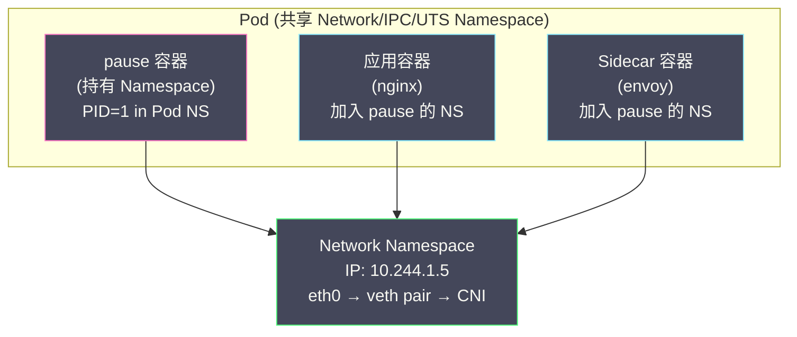

# 02 Linux Namespace 深度解析

**摘要：**

在 [[01 容器的本质——从进程隔离到 OCI 标准]] 中，我们将容器定义为"被 Namespace 隔离视图 + 被 Cgroups 限制资源 + 拥有独立 rootfs 的 Linux 进程"。Namespace 是这三大支柱中负责**视图隔离**的部分——它让容器进程"看到"一个与宿主机不同的世界：独立的进程树、独立的网络栈、独立的文件系统挂载点、独立的主机名。本文从 Namespace 的内核实现原理出发，逐一深入分析 Linux 内核提供的八种 Namespace 类型，解释每种 Namespace 解决的具体问题、不存在会怎样、在容器和 [[Kubernetes]] 中的具体应用，以及操作 Namespace 的三个核心系统调用（`clone`、`unshare`、`setns`）的语义差异。最后，我们通过纯 Namespace 操作手动构建一个隔离环境，从实践层面验证理论。

---

## 第 1 章 Namespace 的核心思想

### 1.1 什么是 Namespace

**Namespace 是 Linux 内核提供的一种资源隔离机制——它将全局的系统资源（如进程 ID、网络栈、文件系统挂载点）包装成一个个独立的"视图"，使得不同 Namespace 中的进程看到不同的资源集合。**

用一个类比来理解：一栋写字楼里有 20 家公司，每家公司的会议室从"会议室 1"到"会议室 5"编号。虽然整栋楼有 100 间会议室，但每家公司的员工只看到自己公司的 5 间——编号从 1 到 5。不同公司的"会议室 1"实际上是不同的物理房间，但在各自的视角中它们都是"会议室 1"。Namespace 做的就是这件事——让不同的进程组"看到"不同的资源编号空间。

### 1.2 为什么需要 Namespace

没有 Namespace 的世界是什么样的？

想象在一台 Linux 服务器上运行两个互不相关的 Web 应用（App A 和 App B）。没有 Namespace 的情况下：

**PID 冲突**：App A 的进程 PID 是 1234，App B 的进程 PID 是 5678。App A 可以通过 `kill 5678` 杀死 App B 的进程。更糟糕的是，如果 App A 以 root 身份运行，它可以 `kill -9` 宿主机上的任何进程，包括系统关键进程。

**端口冲突**：App A 和 App B 都想监听 80 端口。没有网络隔离，第二个绑定 80 端口的应用会失败（`Address already in use`）。

**文件系统污染**：App A 修改了 `/etc/resolv.conf`（DNS 配置），App B 的 DNS 解析也跟着变了。

**主机名混淆**：两个应用都调用 `gethostname()`，得到的是同一个宿主机的主机名。在基于主机名做服务注册的场景下，两个应用会注册为同一个实例。

Namespace 正是为了解决这些问题——每种 Namespace 隔离一类全局资源，让不同的进程组拥有独立的资源视图。

### 1.3 Namespace 的内核实现

在 Linux 内核中，每个进程由 `task_struct` 结构体表示。`task_struct` 中有一个 `nsproxy` 指针，指向一个 `nsproxy` 结构体，该结构体包含了当前进程所属的各种 Namespace 的引用：

```c
// 简化的内核数据结构
struct task_struct {
    // ... 其他字段 ...
    struct nsproxy *nsproxy;  // 指向 Namespace 代理结构体
};

struct nsproxy {
    atomic_t count;                // 引用计数
    struct uts_namespace *uts_ns;   // UTS Namespace
    struct ipc_namespace *ipc_ns;   // IPC Namespace
    struct mnt_namespace *mnt_ns;   // Mount Namespace
    struct pid_namespace *pid_ns_for_children; // PID Namespace
    struct net *net_ns;             // Network Namespace
    struct time_namespace *time_ns; // Time Namespace
    struct cgroup_namespace *cgroup_ns; // Cgroup Namespace
};
```

当进程调用 `clone()` 创建子进程时，如果指定了 `CLONE_NEWPID` 标志位，内核会为子进程创建一个新的 PID Namespace，并更新子进程的 `nsproxy->pid_ns_for_children` 指向新创建的 Namespace。当子进程后续调用 `getpid()` 时，内核会在子进程所属的 PID Namespace 中查找其 PID 编号——这个编号与宿主机的全局 PID 不同。

**关键设计决策：Namespace 是进程级的属性，而不是线程级的。** 同一个进程的所有线程共享同一套 Namespace。这意味着你不能让同一个进程的两个线程看到不同的 PID 空间——这在多线程程序中有时会带来限制。

---

## 第 2 章 八种 Namespace 详解

### 2.1 Linux 支持的 Namespace 类型总览

截至 Linux 5.6+ 内核，共有八种 Namespace 类型：

| Namespace | 标志位 | 隔离的资源 | 引入版本 |
| :--- | :--- | :--- | :--- |
| **Mount** | `CLONE_NEWNS` | 文件系统挂载点 | Linux 2.4.19 (2002) |
| **UTS** | `CLONE_NEWUTS` | 主机名和域名 | Linux 2.6.19 (2006) |
| **IPC** | `CLONE_NEWIPC` | System V IPC、POSIX 消息队列 | Linux 2.6.19 (2006) |
| **PID** | `CLONE_NEWPID` | 进程 ID | Linux 2.6.24 (2008) |
| **Network** | `CLONE_NEWNET` | 网络设备、IP 地址、端口、路由表 | Linux 2.6.29 (2009) |
| **User** | `CLONE_NEWUSER` | 用户 ID、组 ID、Capabilities | Linux 3.8 (2013) |
| **Cgroup** | `CLONE_NEWCGROUP` | Cgroup 根目录视图 | Linux 4.6 (2016) |
| **Time** | `CLONE_NEWTIME` | 系统时钟（CLOCK_MONOTONIC 等）| Linux 5.6 (2020) |

Mount Namespace 的标志位是 `CLONE_NEWNS`（而不是 `CLONE_NEWMNT`），因为它是 Linux 历史上第一个 Namespace——当时设计者没有预见到会有更多类型的 Namespace，所以直接用了通用的 `NS`（Namespace）命名。后来的 Namespace 都用了更具体的命名（`NEWPID`、`NEWNET` 等）。

容器运行时（如 runc）创建容器时，通常会创建 Mount、UTS、IPC、PID、Network 这五种 Namespace，User Namespace 视安全策略决定是否启用。下面逐一深入分析每种 Namespace。

### 2.2 PID Namespace：进程 ID 隔离

#### 2.2.1 解决的问题

在没有 PID Namespace 的情况下，宿主机上所有进程共享一个全局的 PID 编号空间。容器内的进程可以看到宿主机上所有其他进程（通过 `ps` 或读取 `/proc`），也可以向任意进程发送信号（如 `kill`）。这既是安全隐患（容器进程可以杀死宿主机关键进程），也破坏了容器的"独立虚拟环境"幻象。

#### 2.2.2 工作机制

PID Namespace 为每个 Namespace 提供一个独立的 PID 编号空间。在新的 PID Namespace 中创建的第一个进程，其 PID 为 1——这个进程扮演类似 [[init]] 的角色：

- 它是 Namespace 内所有进程的祖先
- 当 Namespace 内的孤儿进程（父进程已退出）出现时，会被自动收养（re-parented）到 PID 1
- 如果 PID 1 退出，整个 Namespace 内的所有进程都会被内核发送 `SIGKILL` 信号终止

**PID 的双重身份**：一个进程在其所属的 PID Namespace 中有一个 PID（如 PID=1），在父 Namespace 中有另一个 PID（如 PID=28456）。宿主机（根 PID Namespace）可以看到所有子 Namespace 中的进程，但子 Namespace 中的进程**看不到**父 Namespace 或兄弟 Namespace 中的进程。

```
宿主机 PID Namespace
├── PID 1 (systemd)
├── PID 100 (containerd)
├── PID 200 (nginx，在宿主机视角)  ─── 容器 A 的 PID Namespace
│   └── PID 1 (nginx，在容器视角)        └── PID 1 (nginx)
│       └── PID 2 (nginx worker)          └── PID 2 (nginx worker)
├── PID 300 (redis，在宿主机视角)  ─── 容器 B 的 PID Namespace
│   └── PID 1 (redis，在容器视角)        └── PID 1 (redis)
```

#### 2.2.3 PID 1 的特殊性

PID Namespace 中的 PID 1 进程有一个极其重要的特性：**Linux 内核不会向 PID 1 发送没有显式注册信号处理函数的信号**。这意味着：

```bash
# 在容器内执行以下命令不会杀死 PID 1（除非 PID 1 注册了 SIGTERM 的处理函数）
kill -SIGTERM 1   # 无效！
kill -SIGKILL 1   # 同样无效！（在容器内部发送时）
```

这个设计是为了保护 PID 1 不被意外杀死——因为 PID 1 的退出会导致整个 Namespace 被销毁。但它也带来了一个常见问题：**如果容器的入口进程没有正确处理 `SIGTERM` 信号，`docker stop` 会在等待超时后发送 `SIGKILL`，导致优雅停机失败**。这也是为什么 [[Kubernetes]] 有 `terminationGracePeriodSeconds` 配置——给容器进程足够的时间响应 `SIGTERM`。

> [!warning] 生产实践
> 容器中应用的入口进程（Dockerfile 的 `ENTRYPOINT`）必须正确处理 `SIGTERM` 信号，执行优雅停机逻辑（关闭连接、完成正在处理的请求、释放资源）。如果使用 shell 脚本作为入口点（如 `ENTRYPOINT ["/bin/sh", "-c", "..."]`），`SIGTERM` 会被 shell 拦截而不是传递给应用进程——应该使用 `exec` 形式（如 `ENTRYPOINT ["java", "-jar", "app.jar"]`）确保应用进程就是 PID 1。

#### 2.2.4 在 Kubernetes 中的应用

[[Kubernetes]] 1.17+ 支持 **Pod 级别的 PID Namespace 共享**（`shareProcessNamespace: true`）。启用后，同一个 Pod 内所有容器共享一个 PID Namespace，可以互相看到彼此的进程。这对于 Sidecar 模式非常有用——例如一个调试 Sidecar 需要 `strace` 主容器的进程。

### 2.3 Mount Namespace：文件系统挂载点隔离

#### 2.3.1 解决的问题

Linux 系统中的所有文件都挂载在一棵全局的目录树上。如果没有 Mount Namespace，一个进程在 `/mnt/data` 上挂载了一个新的文件系统，所有进程都能看到这个挂载。容器的核心需求之一是拥有**独立的根文件系统**（rootfs）——这需要 Mount Namespace 来实现。

#### 2.3.2 工作机制

Mount Namespace 为每个 Namespace 维护一份独立的挂载点列表。在新的 Mount Namespace 中执行 `mount` 或 `umount` 操作，**默认不会影响**其他 Namespace。

容器运行时（runc）创建容器时，在新的 Mount Namespace 中执行以下关键操作：

1. **挂载容器的 rootfs**：将 OverlayFS（或其他联合文件系统）挂载到一个临时目录
2. **挂载特殊文件系统**：`/proc`（进程信息）、`/sys`（系统信息）、`/dev`（设备文件）
3. **`pivot_root`**：将当前进程的根目录切换到新的 rootfs
4. **卸载旧的根文件系统**：让容器进程无法访问宿主机的文件系统

#### 2.3.3 挂载传播（Mount Propagation）

Mount Namespace 有一个重要的特性：**挂载传播**。它控制一个 Namespace 中的挂载操作是否"传播"到其他 Namespace。

| 传播类型 | 行为 |
| :--- | :--- |
| **private** | 挂载操作完全隔离，不传播 |
| **shared** | 挂载操作双向传播（两个 Namespace 互相同步）|
| **slave** | 单向传播（从 master 到 slave，slave 的挂载不影响 master）|
| **unbindable** | 不允许被 bind mount |

容器中默认使用 `private` 传播——容器内的挂载操作不影响宿主机。但在某些场景下需要使用 `shared` 或 `slave` 传播，例如 [[Kubernetes]] 中的 **Volume Mount Propagation**：当一个 CSI 驱动在宿主机上挂载了一个存储卷，这个挂载需要"传播"到容器内部。

```yaml
# Kubernetes Pod 中的 Volume Mount Propagation 配置
volumeMounts:
  - name: shared-data
    mountPath: /data
    mountPropagation: Bidirectional  # 双向传播（等同于 shared）
```

### 2.4 Network Namespace：网络栈隔离

#### 2.4.1 解决的问题

没有网络隔离的容器共享宿主机的网络栈——所有容器看到相同的网络接口、IP 地址和端口空间。两个容器不能同时监听 80 端口，一个容器可以嗅探其他容器的网络流量。

#### 2.4.2 工作机制

Network Namespace 为每个 Namespace 提供一套完整的、独立的网络栈：

- **独立的网络接口**：每个 Namespace 有自己的 `lo`（回环接口）和其他网络接口
- **独立的 IP 地址空间**：每个 Namespace 可以有自己的 IP 地址
- **独立的端口空间**：不同 Namespace 可以同时监听相同的端口号
- **独立的路由表**：每个 Namespace 有自己的路由规则
- **独立的 iptables/nftables 规则**：每个 Namespace 有自己的防火墙规则
- **独立的 ARP 表**：每个 Namespace 维护自己的地址解析缓存

但是 Network Namespace 创建后是**完全隔离**的——新 Namespace 中只有一个未启用的 `lo` 接口，没有任何外部网络连接。需要通过 **veth pair**（虚拟以太网对）将 Namespace 的网络与宿主机或其他 Namespace 连通。

#### 2.4.3 veth pair：连接不同网络世界的"管道"

**veth pair** 是一对虚拟网络接口，像一根两端分别插在不同 Namespace 中的"网线"——从一端发送的数据包会从另一端接收。

```bash
# 创建一个新的 Network Namespace
ip netns add container1

# 创建一对 veth 设备
ip link add veth-host type veth peer name veth-container

# 将一端移入容器的 Network Namespace
ip link set veth-container netns container1

# 在宿主机端配置 IP
ip addr add 172.18.0.1/24 dev veth-host
ip link set veth-host up

# 在容器端配置 IP
ip netns exec container1 ip addr add 172.18.0.2/24 dev veth-container
ip netns exec container1 ip link set veth-container up
ip netns exec container1 ip link set lo up

# 测试连通性
ip netns exec container1 ping 172.18.0.1  # 从容器 ping 宿主机 ✅
ping 172.18.0.2                             # 从宿主机 ping 容器 ✅
```

这就是 Docker 默认的 Bridge 网络模式的核心原理——每个容器有一个 veth pair，一端在容器的 Network Namespace 中，另一端连接到宿主机上的 `docker0` 网桥。我们将在 [[05 容器网络原理]] 中详细展开。

#### 2.4.4 在 Kubernetes 中的应用

[[Kubernetes]] 中，**同一个 Pod 内的所有容器共享一个 Network Namespace**——这意味着它们共享 IP 地址和端口空间，可以通过 `localhost` 互相通信。这是 Pod 作为"逻辑主机"抽象的基础。

不同 Pod 之间的网络通信则通过 **CNI（Container Network Interface）** 插件实现——CNI 插件负责为 Pod 配置 Network Namespace 中的网络接口和路由。

### 2.5 UTS Namespace：主机名隔离

#### 2.5.1 解决的问题

UTS（UNIX Time-sharing System）Namespace 隔离的是系统的主机名（`hostname`）和 NIS 域名（`domainname`）。

看起来主机名隔离是一个"小需求"，但在容器场景下非常重要：

- 很多应用在启动时获取主机名并用于日志记录、服务注册
- 如果所有容器共享宿主机的主机名，日志中无法区分来自不同容器的记录
- [[Kubernetes]] 将 Pod 名称设置为容器的主机名，用于 DNS 服务发现

#### 2.5.2 实现极简

```bash
# 在新的 UTS Namespace 中修改主机名
unshare --uts /bin/bash
hostname my-container
hostname
# my-container

# 退出后，宿主机的主机名不受影响
exit
hostname
# original-hostname
```

### 2.6 IPC Namespace：进程间通信隔离

#### 2.6.1 解决的问题

Linux 提供了多种进程间通信（IPC）机制：System V 消息队列、System V 信号量、System V 共享内存、POSIX 消息队列。这些 IPC 资源在全局范围内可见——如果不隔离，一个容器可以通过共享内存读取另一个容器的数据。

#### 2.6.2 工作机制

IPC Namespace 为每个 Namespace 提供独立的 IPC 标识符空间。不同 Namespace 中的进程无法访问彼此的 IPC 资源——即使它们使用相同的 IPC key。

```bash
# 在新的 IPC Namespace 中
unshare --ipc /bin/bash

# 创建一个共享内存段
ipcmk -M 4096
# Shared memory id: 0

# 退出后在宿主机上查看
ipcs -m
# 看不到容器中创建的共享内存段——因为它在不同的 IPC Namespace 中
```

在 [[Kubernetes]] 中，同一个 Pod 内的容器共享 IPC Namespace，可以通过共享内存等 IPC 机制进行高效通信。不同 Pod 之间的 IPC 是隔离的。

### 2.7 User Namespace：用户 ID 隔离

#### 2.7.1 解决的问题

传统的容器中，容器进程以 root（UID=0）运行意味着在宿主机上也是 root——如果容器逃逸成功，攻击者在宿主机上就拥有 root 权限。这是一个严重的安全隐患。

User Namespace 的目标是实现 **UID/GID 映射**——容器内的 root（UID=0）可以映射到宿主机上的一个非特权用户（如 UID=100000）。这样即使容器被攻破，攻击者在宿主机上只是一个普通用户，权限极为有限。

#### 2.7.2 UID 映射机制

```bash
# 创建新的 User Namespace（不需要 root 权限！）
unshare --user --map-root-user /bin/bash

# 在新 Namespace 中，当前用户映射为 root
id
# uid=0(root) gid=0(root)

# 但在宿主机上查看，该进程仍然以原始用户身份运行
# 宿主机终端：
ps -o pid,uid,cmd -p <容器进程PID>
# PID   UID  CMD
# 12345 1000 /bin/bash    ← 在宿主机上是 UID 1000（普通用户）
```

UID 映射通过写入 `/proc/<PID>/uid_map` 文件来配置：

```
# 格式：<容器内起始 UID> <宿主机起始 UID> <映射范围>
# 将容器内的 UID 0-65535 映射到宿主机的 UID 100000-165535
echo "0 100000 65536" > /proc/<PID>/uid_map
```

#### 2.7.3 User Namespace 的争议

User Namespace 是所有 Namespace 中**最复杂也最具争议**的：

**支持者的观点**：User Namespace 是 Rootless 容器的基础——允许非特权用户运行容器，大幅减少了容器逃逸的危害。

**反对者的担忧**：User Namespace 大幅扩展了非特权用户可以触发的内核代码路径——创建 User Namespace 后，非特权用户可以创建其他类型的 Namespace、挂载文件系统等，这些操作过去只有 root 可以执行。历史上有多个内核提权漏洞（如 CVE-2023-32233、CVE-2022-0185）与 User Namespace 有关。

> [!warning] 安全权衡
> 部分 Linux 发行版（如 Debian/Ubuntu）默认允许非特权用户创建 User Namespace，而其他发行版（如 RHEL/CentOS）默认禁止。在安全要求严格的生产环境中，是否启用 User Namespace 需要根据威胁模型进行权衡。

### 2.8 Cgroup Namespace：Cgroup 视图隔离

Cgroup Namespace（Linux 4.6 引入）隔离的是进程看到的 Cgroup 层级结构的视图。在新的 Cgroup Namespace 中，进程看到的 `/proc/self/cgroup` 显示的路径是**相对于其所在 Cgroup 根的路径**，而不是宿主机的绝对路径。

没有 Cgroup Namespace 时，容器内的进程读取 `/proc/self/cgroup` 会看到类似 `/docker/abc123def456/` 的路径——暴露了宿主机的 Cgroup 层级结构信息。有了 Cgroup Namespace，进程看到的路径是 `/`——就像它是 Cgroup 树的根一样。

### 2.9 Time Namespace：时钟隔离

Time Namespace（Linux 5.6 引入）是最新的 Namespace 类型，隔离的是 `CLOCK_MONOTONIC` 和 `CLOCK_BOOTTIME` 两个时钟。

应用场景相对小众：当容器从一台机器迁移（live migration）到另一台机器时，两台机器的 `CLOCK_MONOTONIC`（系统启动以来的时间）通常不同。如果不隔离时钟，迁移后容器内的 `clock_gettime(CLOCK_MONOTONIC)` 会出现跳变，可能导致依赖单调时钟的应用出错。Time Namespace 允许为迁移后的容器设置一个时钟偏移量，保持时间的连续性。

---

## 第 3 章 操作 Namespace 的系统调用

### 3.1 三个核心系统调用

Linux 提供了三个系统调用来操作 Namespace：

| 系统调用 | 语义 | 典型场景 |
| :--- | :--- | :--- |
| **`clone()`** | 创建子进程，同时将子进程放入新的 Namespace | 容器运行时创建容器进程 |
| **`unshare()`** | 将**当前进程**移入新的 Namespace | 在 shell 中创建隔离环境 |
| **`setns()`** | 将当前进程加入**已存在**的 Namespace | `docker exec` 进入运行中的容器 |

#### 3.1.1 clone()

`clone()` 是创建子进程的系统调用（`fork()` 的超集），通过标志位指定需要创建的 Namespace：

```c
// 创建子进程，同时创建新的 PID、Network、Mount Namespace
int flags = CLONE_NEWPID | CLONE_NEWNET | CLONE_NEWNS | SIGCHLD;
pid_t child_pid = clone(child_fn, child_stack + STACK_SIZE, flags, NULL);
```

**这就是 runc 创建容器的核心操作**——一个 `clone()` 调用，配合适当的标志位，就创建了一个处于新 Namespace 中的子进程。

#### 3.1.2 unshare()

`unshare()` 不创建新进程，而是将当前进程"脱离"旧的 Namespace，进入新的 Namespace：

```c
// 当前进程进入新的 Mount Namespace
unshare(CLONE_NEWNS);
// 之后的 mount/umount 操作只影响当前进程的 Namespace
```

命令行工具 `unshare` 就是对这个系统调用的封装：

```bash
# 创建新的 PID + Mount + UTS Namespace 并在其中运行 bash
unshare --pid --mount --uts --fork /bin/bash
```

#### 3.1.3 setns()

`setns()` 将当前进程加入一个**已经存在**的 Namespace。每个 Namespace 在 `/proc/<PID>/ns/` 目录下有一个对应的文件描述符：

```bash
ls -la /proc/1/ns/
# lrwxrwxrwx 1 root root 0  pid -> 'pid:[4026531836]'
# lrwxrwxrwx 1 root root 0  net -> 'net:[4026531840]'
# lrwxrwxrwx 1 root root 0  mnt -> 'mnt:[4026531841]'
# ...
```

方括号中的数字是 Namespace 的 inode 号——相同的 inode 号意味着相同的 Namespace。

```c
// 打开目标进程的 Network Namespace 文件
int fd = open("/proc/12345/ns/net", O_RDONLY);

// 将当前进程加入该 Network Namespace
setns(fd, CLONE_NEWNET);
// 此后当前进程与 PID 12345 共享同一个 Network Namespace

close(fd);
```

**这就是 `docker exec` 的核心原理**——`docker exec` 通过 `setns()` 将一个新进程加入到容器的各个 Namespace 中，使得该进程"进入"了容器的隔离环境。

### 3.2 nsenter 命令

`nsenter` 是 `setns()` 的命令行封装，用于"进入"一个已有的 Namespace：

```bash
# 进入 PID 为 12345 的进程的所有 Namespace
nsenter --target 12345 --mount --uts --ipc --net --pid -- /bin/bash

# 只进入其 Network Namespace（常用于调试容器网络）
nsenter --target 12345 --net -- ip addr show
```

在排查容器网络问题时，`nsenter --net` 比 `docker exec` 更灵活——它不依赖容器镜像中是否安装了 `ip`、`tcpdump` 等工具（因为你可以使用宿主机上的工具，只是网络视图切换到了容器的 Namespace）。

---

## 第 4 章 Namespace 在容器中的组合使用

### 4.1 runc 创建容器时的 Namespace 配置

在 [[01 容器的本质——从进程隔离到 OCI 标准]] 中，我们介绍了 OCI 的 `config.json` 文件。其中 `linux.namespaces` 字段定义了容器使用哪些 Namespace：

```json
{
  "linux": {
    "namespaces": [
      { "type": "pid" },
      { "type": "network" },
      { "type": "ipc" },
      { "type": "uts" },
      { "type": "mount" },
      { "type": "cgroup" }
    ]
  }
}
```

每种 Namespace 可以指定 `"path"` 字段——如果指定了路径，容器将加入已有的 Namespace（而非创建新的）。这是实现"多个容器共享同一个 Namespace"的机制：

```json
{
  "type": "network",
  "path": "/proc/12345/ns/net"
}
```

### 4.2 Kubernetes Pod 的 Namespace 共享模型

[[Kubernetes]] 的 Pod 是一组共享部分 Namespace 的容器。Pod 内容器的 Namespace 共享关系如下：

| Namespace | Pod 内容器之间 | 不同 Pod 之间 |
| :--- | :--- | :--- |
| **Network** | **共享**（同一 IP、同一端口空间）| 隔离 |
| **IPC** | **共享**（可以使用共享内存通信）| 隔离 |
| **UTS** | **共享**（相同的主机名 = Pod 名称）| 隔离 |
| **PID** | 默认隔离，可配置为共享 | 隔离 |
| **Mount** | **隔离**（每个容器有独立的文件系统）| 隔离 |
| **User** | 通常不使用 | 通常不使用 |

这种设计使得 Pod 中的容器既能**紧密协作**（共享网络和 IPC，可以通过 `localhost` 通信和共享内存交换数据），又保持**文件系统独立**（每个容器有自己的 rootfs 和 Volume 挂载）。

**Kubernetes 实现 Pod Namespace 共享的方式**：kubelet 首先创建一个 **pause 容器**（也叫 infra 容器或 sandbox 容器），这个容器极其轻量（其进程只是调用 `pause()` 系统调用永远休眠），它的唯一作用是**持有 Pod 的 Namespace**。Pod 中的其他业务容器通过 `setns()` 加入 pause 容器的 Network/IPC/UTS Namespace。即使业务容器重启，Namespace 仍然由 pause 容器持有，Pod 的 IP 地址不会变化。



---

## 第 5 章 Namespace 的边界与局限

### 5.1 Namespace 不隔离的资源

Namespace 并不能隔离所有系统资源。以下资源在 Namespace 之间是**共享的**：

| 共享的资源 | 风险 |
| :--- | :--- |
| **内核版本和内核模块** | 容器无法使用与宿主机不同的内核版本 |
| **系统时间（`CLOCK_REALTIME`）** | 容器修改系统时间会影响宿主机（Time NS 只隔离 MONOTONIC）|
| **内核参数（`/proc/sys/`）** | 部分 sysctl 参数是全局的，容器的修改影响所有进程 |
| **`/proc`、`/sys` 中的部分文件** | 容器中读取 `/proc/meminfo` 看到的是宿主机的内存信息 |
| **磁盘 I/O 调度** | 容器共享底层块设备的 I/O 调度器 |
| **内核日志（`dmesg`）** | 容器可以读取宿主机的内核日志 |

其中 `/proc/meminfo` 问题尤为常见——Java 应用在容器中读取 `/proc/meminfo` 获取的是宿主机的总内存（如 128GB），而不是容器的内存限制（如 4GB）。这会导致 JVM 计算错误的默认堆大小。现代 JVM（Java 10+）已经能够感知 Cgroups 的内存限制，但早期版本需要手动配置 `-Xmx`。

### 5.2 Namespace 不是安全边界

Namespace 提供的是**视图隔离**而非**安全隔离**。一个拥有 `CAP_SYS_ADMIN` Capability 的容器进程可以通过多种方式突破 Namespace 的限制。真正的安全隔离需要 Namespace + Cgroups + Capabilities + Seccomp + AppArmor/SELinux 的多层防御，这些将在 [[06 容器安全边界与逃逸风险]] 中详细讨论。

---

## 第 6 章 总结与后续

本文系统梳理了 Linux Namespace 的完整技术体系：

- **八种 Namespace** 各自隔离不同维度的系统资源
- **三个系统调用**（clone/unshare/setns）提供了创建和加入 Namespace 的操作接口
- **Kubernetes Pod** 通过 pause 容器共享部分 Namespace，实现了容器的紧密协作模型
- **Namespace 有明确的边界**——不隔离内核、系统时间、部分 /proc 文件等

下一篇 [[03 Cgroups 资源限制与控制]] 将深入容器的第二大支柱——Cgroups，解决"容器能用多少资源"的问题。

---

## 参考资料

1. Michael Kerrisk (2013). *Namespaces in operation* (LWN.net 7-part series)：https://lwn.net/Articles/531114/
2. Linux man pages: `namespaces(7)`, `clone(2)`, `unshare(2)`, `setns(2)`, `pid_namespaces(7)`, `network_namespaces(7)`, `mount_namespaces(7)`, `user_namespaces(7)`
3. OCI Runtime Specification - Linux Namespaces：https://github.com/opencontainers/runtime-spec/blob/main/config-linux.md#namespaces
4. Kubernetes Documentation - Share Process Namespace：https://kubernetes.io/docs/tasks/configure-pod-container/share-process-namespace/
5. runc source code：https://github.com/opencontainers/runc
6. Brendan Burns et al. (2019). *Kubernetes: Up and Running*, 2nd Edition. O'Reilly, Chapter 5.

---

> [!note] 思考题
> 1. Dockerfile 的每条指令创建一个镜像层。`RUN apt-get update && apt-get install -y python3` 写在一条 RUN 中——如果分成两条 RUN，`apt-get update` 的缓存层可能过期导致安装失败。多阶段构建（Multi-Stage Build）如何减少最终镜像大小？在一个 Go 应用中，编译阶段使用 `golang:1.22` 镜像，运行阶段使用 `scratch`——最终镜像可以多小？
> 2. 镜像层缓存加速构建——如果 Dockerfile 中的指令未变，直接使用缓存层。但 `COPY . .` 会在任何文件变化时使缓存失效——即使只改了一行代码。你如何通过将'依赖安装'和'代码复制'分开来最大化缓存命中率？`COPY go.mod go.sum ./` → `RUN go mod download` → `COPY . .` 的顺序为什么重要？
> 3. 镜像安全扫描（Trivy、Snyk）检测镜像中的已知漏洞。基础镜像（如 `ubuntu:22.04`）可能包含数百个 CVE。使用最小化基础镜像（`alpine`、`distroless`、`scratch`）可以大幅减少攻击面。但 `alpine` 使用 musl libc 而非 glibc——在什么场景下这会导致兼容性问题？
