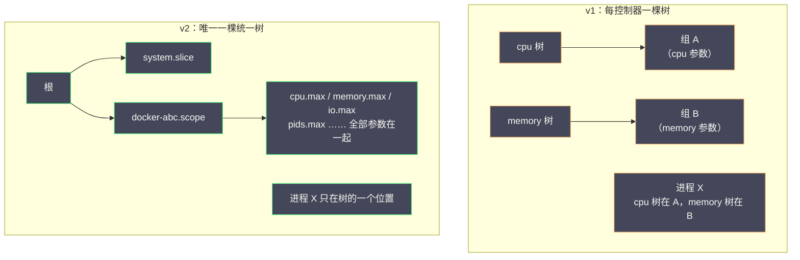
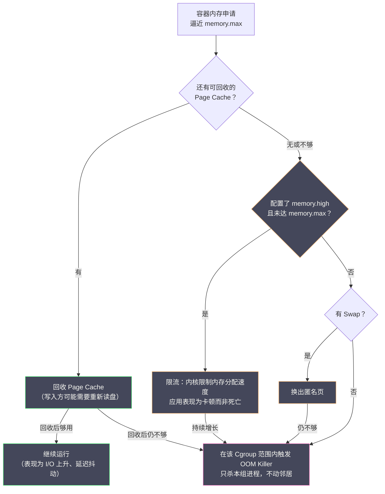

# 03 Cgroups 资源限制与控制

**摘要：**

[[02 Linux Namespace 深度解析|上一篇]]解决了"容器看到什么"——Namespace 让每个容器拥有独立的进程表、网络栈与挂载树。但视图隔离留了一个大洞：容器进程虽然"看不到"邻居，却可以放开手脚消耗宿主机的全部 CPU、内存与磁盘 I/O，直到把整台机器拖垮。**Cgroups（Control Groups，控制组）** 补上的正是"容器能用多少"这一半——它是 Linux 内核把进程组织成层级组、并为每组设定资源上限、分配权重与记账的机制，是容器资源治理、Kubernetes 的 requests/limits 模型乃至整套 QoS 分级的共同地基。本文从事故场景出发回答三个问题：没有资源限制的世界里，一个容器如何拖垮整台机器，故障又会以多么"冤枉"的方式落到无辜容器头上；Cgroups 从 v1 到 v2 的架构演进分别修正了什么，统一层级为什么是必要的；以及 CPU、内存、I/O 三大控制器各自的工作机制——CFS 带宽控制与限流（Throttling）如何制造"CPU 使用率不高但延迟爆炸"的怪象，OOM Killer 的评分逻辑与 Kubernetes QoS 的对应关系，缓冲 I/O 为什么天然难控。最后把机制落回工程：Docker 参数与 Cgroups 文件的映射、K8s 字段到内核参数的翻译、以及监控哪几个指标才能提前看见资源失控。读完全文，你应当能为任意负载设计合理的资源限制，并从容解释每一次 OOM 与限流背后的来龙去脉。

---

## 第 1 章 没有限制的世界：三个"冤枉"的事故

### 1.1 场景一：一个泄漏，全员陪葬

设想一台 16 核 64GB 的宿主机，跑着 20 个互不相干的容器，全部未设资源限制。这个设定本身在今天就显得不合时宜——容器平台几乎都默认或强制资源限制——但理解"没有限制会怎样"依然是理解"限制为什么这样设计"的前提，就像理解没有红绿灯的路口，才会明白信号灯的每种配时在防什么。某个深夜，容器 A 里的 Java 应用开始内存泄漏——堆外内存缓慢增长，没有任何告警，因为"机器还没满"。几个小时后宿主机可用内存耗尽，内核触发全局 OOM（Out of Memory）处理：OOM Killer 启动，按评分挑选一个进程杀掉以保住系统。这里就是第一个冤枉之处——**OOM Killer 的评分算法挑的未必是泄漏的元凶**。评分以内存占用为主、辅以各类权重，但一个恰好持有大 Page Cache 的无辜容器 B 可能比"分散在几十个进程里的"容器 A 得分更高，于是 B 的主进程被杀，B 的服务中断、K8s 里连续 CrashLoopBackOff，而真正泄漏的 A 还在缓慢膨胀。评分算法的大致逻辑是：`oom_score` 与进程占用的内存量正相关（RSS 加交换分区用量再乘以可调系数），并叠加"杀死它能释放多少"的整组估计；`oom_score_adj` 再做人工偏移。算法本身没有恶意，但在未分组的机器上它面对的题目本身就是错的——它只知道"杀谁能最快止血"，不知道"谁才是肇因"。一次排查下来，故障记录里写着"容器 B OOM 重启"，根因却藏在别人家的代码里——**没有资源边界时，故障的表象与根因天然分离**，这是多租户环境最恶劣的故障形态。

### 1.2 场景二：CPU 的无声抢占

容器 A 被发布团队布置了一个夜间批处理任务（模型评分、报表计算），它启动后立即把 16 个核心全部吃满。其他 19 个容器没有"被杀"那么戏剧性的遭遇，遭遇的是更无声的东西：CPU 时间片被压缩到正常的几十分之一，HTTP 请求的处理延迟从 20ms 涨到 800ms，健康检查开始间歇性超时，负载均衡器把实例摘除，服务容量雪崩。等运营团队发现"用户投诉激增"时，距离批处理上线已经过去了四个小时。CPU 争抢不会留下 OOM 那样的"案发现场"，它只留下延迟曲线的整体抬升——如果没有资源隔离，每一次批量任务、每一次日志压缩、每一次定时任务，都是对同宿主机所有邻居的隐性攻击。

### 1.3 场景三：I/O 的排队灾难

容器 A 的应用把调试日志开到了最高级别，疯狂写入本地磁盘，机械盘的 IOPS 被打满。数据库容器 B 的每一次查询都要排队等 I/O，慢查询告警响成一片；C 的数据导入任务从 10 分钟拖到两个小时。与 CPU 争抢一样，I/O 争抢的受害者名单是随机的——谁恰好在同一块盘上，谁就是受害者。

### 1.4 三个场景的共同教训

三个场景指向同一句总结：**Namespace 解决了"看得见"的隔离，没有解决"用得到"的隔离**。容器之间互相看不见，但它们共享同一份物理资源，没有任何机制阻止其中一方把公共资源吃干榨净。更糟的是，事故的代价由"评分算法"或"调度顺序"这样的随机机制分配，肇事者与受害者常常错位。Cgroups 要做的就是给每个容器划定资源边界：内存超出上限就由该容器自己承担 OOM（而不是连坐邻居），CPU 与 I/O 按权重或上限分配（而不是先到先得）。在此之后，A 的泄漏依然存在，但它最远只能烧掉自己的 4GB；A 的批处理依然能跑，但最多只能用分配给它的两个核心。把这个教训再抽象一层：**资源边界的价值不在于让肇事者变小，而在于让故障域变小**——没有边界时，任何局部故障都有全局化的通道（物理资源是公共的）；有了边界，故障被物理性地压缩在肇事者的配额之内。这是从"单机运维"到"多租户架构"真正需要的思维转换：前者管理一台机器的总量，后者管理无数租户之间的相互影响。

还有一点容易忽略：Cgroups 的记账能力同时是**度量衡的统一**。"这个容器用了多少资源"在没有 Cgroups 的世界里是个没有标准答案的问题（ps 的 RSS？smem 的 PSS？都是估算），而 Cgroups 的账本是内核权威给出的组级事实——容器的资源度量（监控、计费、调度、伸缩）全部建立在它之上。限制是防御，记账是度量，两者合在一起，资源才第一次变成"可以被管理的对象"。

---

## 第 2 章 Cgroups 的基本模型

### 2.1 定义与四项能力

**Cgroups（Control Groups）** 是 Linux 内核提供的一种机制：把一组进程组织成有层级的"控制组"，并以组为单位实施资源限制、优先级分配、用量统计与进程控制。它提供四项正交的能力：

| 能力 | 内核行为 | 在容器中的对应 |
| :--- | :--- | :--- |
| **限制（Limiting）** | 组内资源用量不得超过设定上限 | 容器最多用 4GB 内存、2 核 CPU |
| **优先级（Prioritization）** | 资源竞争时按权重分配 | 争抢时在线服务拿大头，批任务拿小头 |
| **记账（Accounting）** | 统计每组的资源消耗 | `kubectl top`、cAdvisor 的数据源头 |
| **控制（Control）** | 冻结、恢复、检查点整组进程 | `docker pause` 的底层实现 |

这份清单里最容易被低估的是记账：监控体系里的容器 CPU/内存指标，几乎全部来自 Cgroups 的统计文件（cAdvisor 采集后供 Prometheus 抓取）。没有 Cgroups，容器可观测性就没有数据地基。

### 2.2 一段值得记住的出身

Cgroups 由 Google 工程师 Paul Menage 与 Rohit Seth 于 2006 年前后开发，最初的名字直白地叫 "process containers"，2008 年初发布的 Linux 2.6.24 合入主线。它的出身藏着一条影响深远的主线：Google 开发它的动机，是管理自家超大规模数据中心里混杂运行的工作负载——同一个项目后来演化出了 Google 内部的集群管理系统 **Borg**，而 Borg 的经验又是 Kubernetes 的直接蓝本。所以"容器 + Cgroups + 集群编排"这条技术路线，在源头上就是同一个团队围绕同一类问题（如何在共享的机器群里隔离又高效地塞进尽可能多的负载）的连续作业，Kubernetes 把 requests/limits 建立在 Cgroups 之上不是工程巧合，而是同一条思想脉络的自然延伸。Cgroups 的名字也经历过一次摇摆：项目早期叫 process containers，Docker 兴起后"container"一词被容器生态占用了语义空间，内核社区为避免歧义改称 control groups（cgroups）——一个术语的让位，侧面记录了容器概念从"进程分组"到"交付单元"的语义迁移。

### 2.3 层级与控制器：两个核心概念

Cgroups 的世界只有两个基本概念。**层级（Hierarchy）**是一棵目录树，每个目录是一个控制组，子组继承父组的约束（父组限了 8GB 内存，子组无论如何设置都不能突破 8GB）；进程被挂到树的某个节点上，受该节点到根路径上所有约束的叠加。**控制器（Controller，v1 中也叫 subsystem）**是挂接在层级上的资源管理模块——`cpu` 控制器管 CPU 时间，`memory` 控制器管内存，`io` 控制器管块设备 I/O，`pids` 控制器管进程数量。用户态与 Cgroups 的全部交互都是文件操作：控制组就是挂载后的目录，每个参数是目录下的一个虚拟文件，`echo` 一个数字进去就是一条限制——用户态视角下，v2 每个组目录里最常打交道的三个文件分工明确：`cgroup.procs` 是成员进程的花名册（`echo PID >` 加入，读出成员列表），`cgroup.controllers` 与 `cgroup.subtree_control` 管理本层启用了哪些控制器，其余文件则是各控制器的参数与读数（`cpu.max`、`memory.current`……）。这种"一切皆文件"的设计让 Cgroups 不需要任何专用命令行工具，`mkdir` 加 `echo` 就能完成一次资源限制，脚本、运行时、编排系统都能以最朴素的方式驱动它。

### 2.4 动手：五分钟给一个进程戴上"镣铐"

模型讲完，直接上手最能建立直觉。在支持 v2 的机器上（root），把一个吃内存的小进程限制在 50MB 里：

```bash
# 创建控制组并启用 memory 控制器
cd /sys/fs/cgroup
mkdir demo && echo "+memory" > cgroup.subtree_control 2>/dev/null

# 设定 50MB 硬上限，并把当前 shell 扔进组里
echo "50M" > demo/memory.max
echo $$ > demo/cgroup.procs        # 把本 shell 加入 demo 组

# 在这个 shell 里跑一个逐步吃内存的小程序
python3 -c "
data = []
for i in range(10):
    data.append(bytearray(20 * 1024 * 1024))   # 每轮追加 20MB
    print(f'allocated {(i+1)*20}MB')
"
# allocated 20MB
# allocated 40MB
# Killed            ← 第三轮触顶，内核在本组内执行了 OOM
```

> [!note] 实验中的细节
> 第三轮 `bytearray` 追加触发 OOM 的位置可能略有出入（Python 解释器的启动内存已占去几 MB），这恰好演示了"限制针对的是整组用量而非单次申请"；若想复现得更精确，把 `memory.max` 调到 30M 即可。

退回上层目录（`cd /sys/fs/cgroup` 后 `echo $$ > cgroup.procs`）把 shell 摘出组，同样的程序就能顺利跑完。这几条命令就是容器运行时每天都在做的事情——runc 创建容器前，先建这样的控制组、写入从 `config.json` 翻译来的参数、再把容器进程写进 `cgroup.procs`。**整套机制没有任何"容器专属"的魔法，全部是内核的原生接口。**

---

## 第 3 章 从 v1 到 v2：一次迟到的架构修正

### 3.1 v1 的多层级架构与它的病灶

Cgroups v1 的架构选择是"每种控制器一棵独立的层级树"：`cpu`、`memory`、`blkio`、`cpuset`……各自挂载一套层级，进程可以分别加入不同控制器的不同组。这个设计给了极端的灵活性（CPU 按 A 维度分组、内存按 B 维度分组），但灵活性很快变成了维护灾难：

```bash
# v1 的文件布局：每种控制器一棵树
/sys/fs/cgroup/
├── cpu/
│   └── docker/<container-id>/
│       ├── cpu.cfs_quota_us     # CPU 配额
│       ├── cpu.cfs_period_us    # 配额周期
│       └── cpu.shares           # CPU 权重
├── memory/
│   └── docker/<container-id>/
│       ├── memory.limit_in_bytes  # 内存上限
│       └── memory.usage_in_bytes  # 当前用量
├── blkio/                       # 块 I/O，又是一棵树
├── cpuset/                      # CPU 绑定，再一棵树
└── pids/                        # 进程数，又一棵树
```

这套多树设计在 2008 年前后有其历史理由——各控制器的开发节奏不同，独立挂载让它们可以分阶段合入而不互相阻塞——但容器生态兴起后，每台机器上都跑着几十上百个容器，病灶迅速显形。病灶有三个。**其一，一个进程多个归属**：同一进程在 cpu 树里挂在 A 组、在 memory 树里挂在 B 组，"这个进程属于哪个资源域"这个问题没有单一答案，管理工具要为每个控制器单独记账。**其二，控制器无法协同**：cpu 与 memory 各自为政，"当内存紧张时降低 CPU 优先级"这类联合策略在 v1 的架构下无从表达。**其三，委托充满陷阱**：把某个子树的管理权下放给非 root 用户（容器内进程需要操作自己的 Cgroups），要为每棵树分别处理权限与挂载选项，安全模型支离破碎。

### 3.2 v2 的统一层级

v2（Linux 4.5 合入，2016）用一刀切的方案回应：**所有控制器共享唯一一棵层级树**。进程在整棵树里只有一个位置，所有控制器的参数都在这个位置的目录下：

```bash
# v2 的文件布局：一棵树，参数统一命名
/sys/fs/cgroup/
├── cgroup.controllers        # 本层可用的控制器列表
├── cgroup.subtree_control    # 启用了哪些控制器
├── system.slice/             # 系统服务（systemd 管理）
├── user.slice/
└── docker-<container-id>.scope/
    ├── cpu.max               # CPU 配额："quota period"
    ├── cpu.weight            # CPU 权重（1-10000，默认 100）
    ├── memory.max            # 内存硬上限
    ├── memory.high           # 内存软上限（限流）
    ├── memory.low            # 内存软保护
    ├── memory.current        # 当前内存用量
    ├── memory.events         # oom / oom_kill 计数
    ├── io.max                # I/O 上限
    └── pids.max              # 进程数上限
```



v2 还附带了两条重要的架构约束。其一是 **no-internal-process 规则**：一个组要么持有进程、要么开启子控制器，不能两者兼得（进程只能挂在叶子节点），这条"不自由"换来的是层级语义的确定性——父组的资源约束必然覆盖所有子孙，不会出现进程"绕过"中间组的情况；Linux 4.14 起补了 threaded cgroups 机制来照顾确实需要进程与子组并存的高级场景。其二是**按需启用控制器**：控制器要在父节点的 `cgroup.subtree_control` 中显式启用才会作用于子树，这让"这台机器上谁在管什么资源"变得一目了然。

### 3.3 迁移进度与兼容现实

v2 的生态普及花了约六年：2019 年 10 月 Fedora 31 成为首个默认启用 v2 的发行版，Docker 在 20.10（2020 年底）完整支持，Kubernetes 从 1.25（2022 年）起对 v2 提供完整（GA）支持。截至近年，主流发行版（Ubuntu 22.04+、Debian 12、RHEL 9）的默认都是 v2，新部署的生产环境应当直接面向 v2 设计。v2 还给容器生态带来了一些"顺手的红利"：统一层级让每个容器在树上的位置一目了然（`systemd-cgls` 一棵树看全），`memory.high` 这样的中间档参数成为可能（v1 只有硬顶），PSI 的组级压力指标也只在 v2 下按 Cgroup 暴露。反过来说，老节点上的 v1 并非"减配版 v2"，而是另一套行为细节（譬如 v1 的 memory 与 memsw 双参数、blkio 的 throttle 文件族），运维手册必须分开写。但 v1 不会在短期内消失——存量老机器、老内核的节点仍在运行，**运维与排障工具必须同时认识两套接口**：同一个"限制容器内存为 4GB"，v1 写 `memory.limit_in_bytes`，v2 写 `memory.max`；本专栏后续示例会同时给出两套写法。

> [!info] 检查自己环境的版本
> `stat -fc %T /sys/fs/cgroup/` 输出 `cgroup2fs` 即 v2，`tmpfs` 即 v1。排查容器资源问题时这是第一个要确认的事实——两套文件名、两种行为细节（譬如 v2 的 `memory.high` 限流在 v1 中不存在），用错手册会得出错误结论。

迁移期间还有一个常被忽视的验证点：**混部节点上 v1 与 v2 的容器可能同时存在**（同一内核以 hybrid 模式同时挂载两套视图），此时"同一台机器、两种行为"的疑难杂症时有发生——两个配置完全相同的容器表现不同，第一件事就是分别确认它们各自的 Cgroups 版本与挂载模式。规划全面迁移时，也应当按"先观测存量（哪些控制器在用、哪些参数被依赖）、再灰度迁移、最后关闭 v1 挂载"的节奏推进，而不是一刀切换内核参数。

---

## 第 4 章 CPU 控制器：权重与配额

### 4.1 两种正交的控制维度

CPU 是最典型的"可分时复用"资源，Cgroups 对它的控制分两个互不替代的维度：

- **权重（Weight）**：只在**竞争发生时**生效。CPU 空闲时，权重再低的组也能用满全部核心；一旦多个组抢同一批核心，就按权重比例切分时间。它是"分配策略"，不是"上限"。
- **配额（Quota）**：无论竞争与否，组在每个周期内能使用的 CPU 时间有硬上限。它是"上限"，不是"分配策略"。

| 维度 | v1 参数 | v2 参数 | 默认值 | 生效时机 |
| :--- | :--- | :--- | :--- | :--- |
| 权重 | `cpu.shares`（2-262144） | `cpu.weight`（1-10000） | 1024 / 100 | 仅竞争时 |
| 配额 | `cpu.cfs_quota_us` + `cpu.cfs_period_us` | `cpu.max`（"quota period"） | 不限 | 任何时候 |

两个维度的组合才有完整的资源模型：只设权重的容器在邻居空闲时可以无限抢 CPU（突发友好，但邻居忙起来自己被按比例压缩）；只设配额的容器在邻居空闲时也拿不到多余算力（稳定，但资源利用率低）。生产实践通常权重打底（保证相对公平）、配额封顶（保证绝对隔离），Kubernetes 的 requests/limits 正是这两个维度的直接映射。

### 4.2 CFS 带宽控制：配额如何被执行

Linux 的默认调度器是 CFS（Completely Fair Scheduler），它的带宽控制（CFS Bandwidth Control）机制用两个参数实现配额：**period**（周期，默认 100ms）与 **quota**（每周期允许使用的 CPU 时间总量）。两者的比值折算出核数——`quota=200000, period=100000` 意味着每 100ms 窗口内最多消耗 200ms 的 CPU 时间，在多核机器上这 200ms 可以分布在多个核心上，等效于"最多 2 个核心"：

```bash
# 限制容器最多使用 1.5 核 CPU
# v1：两个文件
echo 100000 > /sys/fs/cgroup/cpu/docker/<id>/cpu.cfs_period_us
echo 150000 > /sys/fs/cgroup/cpu/docker/<id>/cpu.cfs_quota_us

# v2：一个文件，格式为 "quota period"，"max" 表示不限
echo "150000 100000" > /sys/fs/cgroup/docker-<id>.scope/cpu.max
```

**Throttling（限流）是配额的执行动作**：当某组在一个 period 内用完 quota，调度器把该组的所有线程标记为限流状态——本周期剩余时间内不再被调度到任何核心上，直到下一个 period 开始、配额重置。注意限流的粒度是"整个组一起停"：哪怕组内只有一个线程还想运行，配额耗尽时它也要陪全组等下一个周期。period 与 quota 的搭配还有一个微调空间：把 period 从默认 100ms 调大（v1 最大可到 1s），同样配额下限流的"恢复间隔"变长、切换次数变少，对突发型负载更友好；但过长的 period 也让"窗口末端被冻结"的最坏等待变长（最坏要等满一个周期），延迟敏感型负载反而要维持小 period。没有普适参数，只有与负载形态匹配的参数——这条原则在 4.5 节的推演里会再次落地。

### 4.3 Throttling 的经典陷阱：低使用率下的延迟尖峰

限流机制有一个反直觉的故障模式，值得当作容器性能排查的第一课。一个 Java Web 应用设置 `--cpus=2`（quota=200000, period=100000），日常 CPU 使用率仅 30%，监控面板一片安宁。某天开始 P99 延迟周期性尖刺到数百毫秒，但使用率曲线毫无异动——问题就出在那条"不高的"使用率曲线上：应用触发一次 Full GC 时，多条 GC 线程并行工作，瞬时 CPU 需求远超 2 核；若这发生在周期末尾（本周期配额已被前面的请求消耗得所剩无几），GC 线程立刻被限流，本来 50ms 能完成的回收被硬生生拖到下一个乃至下几个周期，STW 时间成倍放大。**平均值掩盖瞬时需求，配额掐死瞬时峰值——"平均使用率不高 + throttled 指标很高"是这类问题的指纹。**

```bash
# CPU 限流统计（v2 的 cpu.stat）
cat /sys/fs/cgroup/docker-<id>.scope/cpu.stat
# usage_usec 123456789      累计使用的 CPU 时间
# nr_periods 123456         经历的周期数
# nr_throttled 892          被限流的周期数
# throttled_usec 456789000  被限流的总时长
```

工程上的应对按序展开：先确认限流比例（`nr_throttled / nr_periods`，Prometheus 体系下对应 cAdvisor 的 `container_cpu_cfs_throttled_periods_total` 指标，通常超过 5% 就该警惕）；然后区分两种病因——若是负载真涨了，加配额；若是瞬时并行度尖峰（GC、定时任务、突发线程池扩张），可以调大 period 减少限流次数、或压低应用的突发并行度（譬如收敛 GC 线程数）；对于延迟敏感的核心服务，也可以干脆提高配额让它"永远不会被限"，把突发空间当作明确的成本项。**关键在于把"限流"纳入监控视野——它不会体现在 CPU 使用率里，只会体现在延迟里。**

### 4.4 cpuset：绑定核心的硬约束

`cpuset` 控制器提供第三种控制：把组内的进程**绑定到指定的核心**上运行。它与权重、配额正交，解决的是另一类问题——缓存亲和与 NUMA 局部性：绑定核心后，进程的工作数据长驻该核心的缓存，跨 NUMA 节点的远端内存访问被消除，对延迟极其敏感的负载（低延迟交易、网络转发面）收益明显。代价是资源利用的僵化：绑定的核心别人用不了，自己空闲时也是浪费，且绑定的核心数必须与负载的并行度匹配（8 个线程绑 2 个核毫无意义）。cpuset 还有一层与内存子系统的联动（`cpuset.mems` 指定 NUMA 节点），在多路服务器上把"算力亲和"与"内存亲和"一起声明，才是 NUMA 调优的完整姿势。Kubernetes 的 CPU Manager 提供了 `static` 策略，为"Guaranteed QoS 且请求为整数核"的 Pod 独占分配核心，就是 cpuset 在编排层的接口。深入内核调度与 NUMA 的细节，可延伸阅读 [[Linux/性能优化/03 CPU 调度延迟——实时性、亲和性与 cgroup CPU|CPU 调度延迟]]。

### 4.5 一个配额决策的完整推演

把第 4 章的机制串成一个真实的决策场景：一个正常时段 QPS 稳定、发布后偶发 GC 尖峰的 Java 服务要容器化，CPU 配额怎么定。第一步看**稳态需求**：压测数据显示单实例满负载需要 1.8 核，这是配额的下限。第二步看**瞬时需求**：GC 期间并行线程的瞬时需求实测可达 4 核——如果配额贴着稳态设，4.3 节的限流陷阱就会在每次 GC 时上演。第三步做**取舍**：把配额定在 3 核（覆盖稳态并留出 GC 空间），接受 GC 尖峰时轻微的限流；同时把 GC 线程数从默认值收敛到 2，把瞬时需求从 4 核压到 2.5 核，让 3 核配额几乎不再触发限流。第四步**验证**：上线后盯住 `nr_throttled/nr_periods`，目标是长期小于 1%，一旦爬升说明负载形态变了、配额该重新推演。这个流程的要义在于：**配额不是抄最佳实践的数字，而是"稳态需求 + 瞬时需求 + 成本意愿"三者协商的结果，且必须有限流指标构成验证闭环。**

### 4.6 层级继承：约束沿树向下叠加

CPU 参数在层级树上的传递规则值得单独交代，因为它是"给容器分组"的基础玩法。v2 里父组的配额约束**覆盖全部子孙**：父组 `cpu.max` 设为 2 核，子组无论怎么设置都不能突破 2 核；权重则是父子相乘的相对关系——父组权重 100、子组权重 200，意味着这个子分支在与其他顶级分支竞争时占 100 份里的份额，赢下的份额再在内部按 200 份的相对权重细分。这个特性让"部门级配额"成为可能：宿主机上先按业务域建顶级组并设总配额，业务域内部再让容器竞争各自的小组，一台机器就能承载多业务域的混部而互不越界。Kubernetes 节点上 kubelet 为 QoS 等级建的组层级（`kubepods/burstable`、`kubepods/guaranteed`）正是这套玩法的官方实现。

---

## 第 5 章 Memory 控制器：回收、限流与 OOM

### 5.1 容器的"内存使用量"到底包含什么

内存控制器的一切行为，都建立在"统计口径"上。Cgroups 统计的内存远不止应用堆：

| 组成 | 说明 | 是否计入上限 |
| :--- | :--- | :--- |
| **匿名页（RSS）** | 进程的堆、栈、mmap 匿名映射 | 计入 |
| **Page Cache** | 内核为文件读写缓存的页面 | **计入** |
| **内核内存** | socket 缓冲、dentry/inode 缓存等内核对象 | 计入（v2 默认） |
| **tmpfs / 共享内存** | `/dev/shm`、`emptyDir{medium:Memory}` | 计入 |
| **Swap** | 已换出的匿名页 | 由 `memory.swap.max` 单独控制 |

Page Cache 计入限制是最常引发困惑的一条。内核会把进程读写过的文件内容缓存在内存里加速后续访问，这些页面属于"随时可回收"的干净资源（数据在磁盘上有底），但对 Cgroups 的账本而言它们实实在在占着额度。为什么必须把可回收的 Page Cache 计入？因为它同样占据着物理内存——若不计入，容器可以借"读写文件"之名无限占用内存，把"限制匿名页"的防线整个架空；计入之后，内存密集读写的容器会先经历 cache 回收的降速，而不是悄悄把宿主机挤爆。一个内存限制 4GB 的容器，应用堆占 2GB、频繁读写日志文件再吃掉 1.8GB 的 Page Cache，账面就逼近了 4GB——内核会开始频繁回收 Page Cache，表现为磁盘 I/O 上升、读写延迟抖动，而不是直接的 OOM。**内存"爆了"不等于 OOM，持续的 cache 回收也是资源受限的症状**，排查时务必把 `memory.stat` 里的 cache 部分与匿名页部分分开看（Page Cache 的回收机制详见 [[Linux/文件系统/04 Page Cache 与脏页回写——Linux IO 的秘密缓冲层|Page Cache 与脏页回写]]）。

### 5.2 触顶之后：回收、限流与 OOM 的三级响应

当容器内存逼近 `memory.max`，内核按固定的优先级顺序执行三级响应：



这张流程图的关键结论有二。其一，**Cgroup 级 OOM 是"组内事件"**：OOM Killer 只在该控制组范围内挑选受害者，隔壁容器毫发无伤——这正是第 1 章场景一的正解：有了资源边界，"一个泄漏拖垮全机"退化成"一个容器自己 OOM 重启"，故障域被边界截断。其二，**v2 的 memory.high 是宝贵的中间档**：它是软限制，触顶后内核积极回收并**对内存分配进行限流**（拖慢而不是杀死），给了应用与监控"在死亡前自救"的窗口；实践中常把 `memory.high` 设在 `memory.max` 的 90% 左右，把硬 OOM 留给真正的意外。顺带把排障时最该读的账本文件 `memory.stat` 的关键行做个导读：

```bash
cat /sys/fs/cgroup/docker-<id>.scope/memory.stat
# anon 2147483648        匿名页 2GB（应用堆、栈——不可回收的"实重"）
# file 1610612736        文件页 1.5GB（Page Cache——可回收的"虚胖"）
# sock 268435456         socket 缓冲 256MB（网络连接的隐性账单）
# shmem 134217728        tmpfs/共享内存 128MB（落不了盘的存储）
# pgmajfault 8213        主缺页次数（读盘频繁，cache 被反复回收的信号）
```

`anon` 是容量规划的主体，`file` 大幅波动说明 I/O 模式值得优化，`pgmajfault` 持续走高是"内存受限 + 读写密集"的联合症状。读懂这五行，容器内存排查就完成了从"感觉慢"到"数据定位"的跃迁。

### 5.3 OOM Killer 的评分与 Kubernetes 的 QoS

OOM Killer 如何在组内挑选受害者？内核为每个进程计算 `oom_score`（内存占用越大、可释放的内存越多，得分越高、越先被杀），管理员可通过 `oom_score_adj`（-1000 到 1000）人工干预：设为 -1000 表示免疫，1000 表示优先被杀。**Kubernetes 的 QoS 分级正是通过给容器进程设置不同的 `oom_score_adj` 实现的**：

| QoS 等级 | 判定条件 | oom_score_adj | 节点内存紧张时 |
| :--- | :--- | :--- | :--- |
| **Guaranteed** | 所有容器 requests == limits | -997 | 最后被杀 |
| **Burstable** | 设置了 requests 但不满足 Guaranteed | 按请求比例折算（2 到 999） | 中间顺位 |
| **BestEffort** | 什么都不设 | 1000 | 最先被杀 |

Burstable 的取值不是拍脑袋的常数，而是按"该 Pod 的内存请求占节点可分配内存的比例"折算——请求越接近整个节点，得分越低（越被保护），公式落在 2 到 999 之间；Guaranteed 统一取 -997（留出极小空间给更核心的系统组件），BestEffort 统一取 1000。这套设计把"谁该为节点内存危机让路"变成了显式的声明：核心服务申请多少用多少（Guaranteed），内核层面对它敬而远之；随手跑的调试容器（BestEffort）则是天然的牺牲品。> [!warning] 两个 OOM，两套规则
> 注意一个常见的认知错位：**QoS 决定的是"节点全局内存危机时的牺牲顺序"（内核 OOM），而不是"容器超了自己的 memory.max 该不该死"（组内 OOM 必死，与 QoS 无关）**——两个 OOM 的触发条件与决策者完全不同。

此外，Kubernetes 自身还有一层用户态的驱逐机制（kubelet 监控节点资源、按 QoS 与优先级驱逐 Pod、走优雅终止流程），它与内核 OOM 是两道独立的防线，前者温和且可预期，后者粗暴且即时，生产环境的内存告警应当赶在两者之前。

容器被组内 OOM 杀掉后的排查路径非常固定：退出码 137（128+SIGKILL）是第一指纹；内核日志确认详情（`dmesg | grep -i "killed process"`，形如 `Memory cgroup out of memory: Killed process xxx (java)`）；v2 下 `memory.events` 文件里的 `oom_kill` 计数器给出历史统计：

```bash
# v2：查看容器 Cgroup 的 OOM 事件
cat /sys/fs/cgroup/docker-<id>.scope/memory.events
# oom 3          触发 OOM 判定 3 次
# oom_kill 3     实际杀掉进程 3 次
```

把 OOM 排查整理成一份固定的动作序列，可以显著缩短 Mean Time To Diagnosis：第一步看退出码 137 确认死因；第二步读 `dmesg` 拿到被杀进程名与其 RSS（确认杀的是谁、当时用了多少）；第三步读 `memory.stat` 看账本构成（anon 高说明应用真的要这么多内存，file/sock 高说明账本里有水分可挤）；第四步看 `memory.events` 判断是偶发还是慢性；第五步才是决策——应用问题（泄漏、缓存失控）回去改代码，容量问题（真实增长）调整配额，形态问题（瞬时尖峰）加 `memory.high` 缓冲或收敛突发。五步走完，OOM 就从"随机死亡事件"变成"有账可查的资源决策错误"。

### 5.4 Java 容器的内存规划

Java 应用在容器里的内存账本值得单独一节，因为它是 OOM 事故的重灾区。JVM 的内存 = 堆（`-Xmx`）+ Metaspace + 线程栈（每线程固定额度）+ Direct Buffer（NIO 堆外内存）+ JIT 代码缓存 + GC 自身的元数据，堆之外的每一项都不受 `-Xmx` 约束却全部计入 Cgroups 账本。历史上最惨烈的坑是 JDK 8u191 之前的版本不看 Cgroups：容器限 4GB、宿主机 128GB，JVM 按宿主机的四分之一把默认堆上限设成 32GB，触顶的一定是 Cgroups 的 OOM 而不是 JVM 自己的 Full GC。现代 JDK（8u191+/10+）默认开启容器感知（`-XX:+UseContainerSupport`），并提供了按容器内存百分比设堆的 `-XX:MaxRAMPercentage`（容器内通常取 50%-75%，给堆外内存留出余量）。经验法则可以总结成一条：**容器的 memory.max 至少是 JVM 堆上限的 1.5 倍，并确认运行时真正读到了 Cgroups 限制**。这个 1.5 倍不是玄学，它对应"堆 + Metaspace + 线程栈 + Direct Buffer + 代码缓存"的典型比例，对堆外用量特别大的应用（重 NIO、重 JNI、大线程池）还要进一步放大；反方向的教训同样成立——堆设得太小而容器内存大量闲置，JVM 会用更频繁的 GC 换来不必要的 CPU 消耗。容量规划是系统级命题，任何单点参数的最优都不等于整体最优。

### 5.5 Swap：一道可选的缓冲垫

v2 把 swap 从总账里拆出来单独控制：`memory.swap.max` 限定"换出到 swap 的匿名页总量"（与 `memory.max` 分开记账），设为 0 即禁用该组使用 swap。这个设计回应了一个容器场景的经典两难：**开着 swap，内存超限的容器会先陷入漫长的换页颠簸**——应用看起来"活着"，延迟却是秒级的，比干脆利落地 OOM 更难排查；**关掉 swap，瞬时尖峰没有任何缓冲**，哪怕大部分占用只是可以回收的缓存。主流的容器实践偏向禁用（Kubernetes 默认要求节点关闭 swap，运行时大多把容器 swap 限额设为 0），把"内存就是硬约束"作为前提，转而用 5.2 节的 `memory.high` 提供死亡前的缓冲——用可观测的限流替代不可观测的颠簸，是工程上更受控的选择。`memory.oom.group`（内核 5.4 起）则补了另一个实用开关：置 1 后组内 OOM 会**整组处决**而不是只杀得分最高的进程，适合"一组进程是一个整体业务"的场景，避免只杀掉半个应用留下状态不一致的残局。

### 5.6 内核内存：网络连接的隐性账单

内存账本里最容易被遗忘的一页是**内核替进程代持的部分**：每个 TCP 连接的发送/接收缓冲区、每个 socket 的结构、协议栈的各类对象，都是内核内存，全部记账到创建它的 Cgroup 头上。一个维持数万条长连接的网关型应用，光是 socket 缓冲就可能吃掉数百 MB——这部分不出现在任何应用侧的内存报告里，却实实在在逼近 `memory.max`。高连接数服务的容量规划必须把这笔账算进去：缓冲区大小（`SO_SNDBUF/SO_RCVBUF`）、连接数上限（`pids` 之外的 `kmem` 维度）都要纳入估算；v1 时代有独立的 `kmem` 计量开关，v2 把内核内存并入总账统一管理，行为上更简单，也更要求"把整只大象看全"。类似的隐性内存还有 tmpfs：`/dev/shm` 与 Kubernetes 的 `emptyDir{medium: Memory}` 写进去的数据全部计入 Cgroups，一个失控的缓存目录就能触发组内 OOM——**凡是没有落盘的存储，都是内存**。

更底层的内核记账细节，可延伸阅读 [[Linux/内存管理/09 CGroups 内存子系统：容器内存隔离的底层实现|CGroups 内存子系统]]。

---

## 第 6 章 I/O 与 pids 控制器

### 6.1 I/O 限制的三个层次

I/O 控制器（v1 叫 `blkio`，v2 叫 `io`）对块设备流量提供两档控制，语义与 CPU 控制器同构：**权重**（`io.weight`，1-10000，竞争时按比例分配带宽与 IOPS，无人竞争时不设限）与**硬上限**（`io.max`，可分别限制读写带宽 `rbps/wbps` 与读写 IOPS `riops/wiops`，无论竞争与否都生效）。区别在于 I/O 的资源形态更复杂——同一块盘上顺序写与随机写的"性价比"天差地别，机械盘的带宽瓶颈在寻道而 SSD 的瓶颈在擦写与队列深度，单一维度的限制难以覆盖所有负载形态，这也是 I/O 治理比 CPU 治理更依赖"分盘"手段的原因：

```bash
# v2：限制容器在设备 8:0（sda）上的读写带宽
echo "8:0 rbps=104857600 wbps=52428800" > \
    /sys/fs/cgroup/docker-<id>.scope/io.max
```

需要认清两点局限。

**第一，粒度是设备**：限制针对块设备（`8:0` 这种主次设备号），不能按文件或目录精细划分，容器们若共享同一块盘的同一个文件系统，只能靠权重协调。**第二，缓冲 I/O 天然难控**：绝大多数应用的写操作是异步落盘的——数据先进 Page Cache（内存操作，瞬间完成），由内核回写线程（writeback）择机刷盘；I/O 控制器主要作用在真正发往设备的请求上，于是"谁产生的脏页"与"谁背回写惩罚"发生了错位：A 容器狂写文件把 Page Cache 塞满，回写线程刷盘时的 I/O 压力可能被记账到回写进程头上。v1 对此几乎没有好办法，v2 改善了回写记账（I/O 会按产生脏页的 Cgroup 归账），配合 cgroup writeback 机制让限流大体生效，但"异步写完就返回"的延迟错觉依然存在——应用看到的写入延迟很低，排队发生在它看不见的回写队列里。对 I/O 质量有硬要求的负载（数据库），正确做法是把数据放到独立的块设备/存储卷上，按设备划界，而不是指望在共享盘上靠权重精调。

值得留意的还有 v2 新一代的 **io.cost** 控制模型（内核 5.0 合入，Facebook 主导）：它不再逐个限制带宽，而是让管理员声明"这块盘上，多少比例的带宽分给哪个 Cgroup、按什么权重"，内核实时测量设备的吞吐-延迟特性后主动在组间切分带宽，目标是把设备时延控制在设定值以内。这与 CPU 权重的思路同构——不问"你最多能用多少"，而问"竞争时你该占几成"——对多租户共享 NVMe 盘的场景，比静态的 `io.max` 上限更贴合实际。对于绝大多数容器部署，短期内接触更多的仍是 `io.max` 与 `io.weight`，但方向上值得知道：**块设备的资源管理正在从"设置防火墙"走向"运行调度器"。**

### 6.2 容器 I/O 的路径与限流的作用点

把 I/O 控制放进容器的完整读写路径里看，它的作用点才清晰。容器里的文件写入有两条去向：写镜像可写层（落在宿主机 OverlayFS 的 upperdir，通常与镜像层同盘）与写挂载卷（落在显式指定的存储路径）。两条路径最终都要落到宿主机某块块设备上，`io.max`/`io.weight` 就守在设备层——**它不区分"这是日志、那是数据文件"，只认设备与流量**。这个特性带来一个实践推论：容器的 I/O 限制管得住"写入行为"，但容器共享宿主机盘面时，镜像解压、日志回写、数据库刷盘全部挤在同一条设备队列里，限流只是给每个容器划了车道，盘的总吞吐天花板不会因此提高；对 I/O 关键负载，"独立设备/独立存储卷"永远优先于"精细的限流参数"。

### 6.3 pids 控制器：防 fork 炸弹的小闸门

`pids` 控制器限制组内进程与线程的总数（`pids.max`），机制简单，却是共享内核环境里必备的保险丝：一个失控的 fork 循环（bug 或恶意）若不加限制，可以指数级耗尽进程编号与内核内存，拖垮整台宿主机。Docker 的 `--pids-limit` 与 Kubernetes 的 PodPIDsLimit（kubelet 参数 `--pod-max-pids`）都落在它身上。给一般业务容器设个几百到几千的额度，成本为零、收益巨大——它是"最便宜的保险"。

---

## 第 7 章 在运行时与编排系统中的映射

### 7.1 Docker 参数到 Cgroups 文件

Docker 的资源参数与 Cgroups 文件一一对应，这张翻译表是排查容器资源问题最常用的桥梁——从"用户设了什么"一路追到"内核执行了什么"，中间没有任何黑箱：

| Docker 参数 | v1 文件（值） | v2 文件（值） |
| :--- | :--- | :--- |
| `--memory=4g` | `memory.limit_in_bytes = 4294967296` | `memory.max = 4294967296` |
| `--memory-reservation=2g` | `memory.soft_limit_in_bytes` | `memory.low` |
| `--cpus=1.5` | `cpu.cfs_quota_us=150000`（period 100000） | `cpu.max = "150000 100000"` |
| `--cpu-shares=512` | `cpu.shares = 512` | `cpu.weight`（按比例折算） |
| `--cpuset-cpus=0,1` | `cpuset.cpus = "0-1"` | `cpuset.cpus = "0-1"` |
| `--pids-limit=1024` | `pids.max = 1024` | `pids.max = 1024` |

### 7.2 Kubernetes requests/limits 的翻译

Kubernetes 的资源模型把"保障"与"上限"拆成两个字段，各自翻译到 Cgroups 的不同维度：

```yaml
apiVersion: v1
kind: Pod
spec:
  containers:
    - name: app
      resources:
        requests:            # 保障：调度依据 + CPU 权重
          memory: "2Gi"
          cpu: "500m"
        limits:              # 上限：CPU 配额 + 内存硬顶
          memory: "4Gi"
          cpu: "2"
```

| K8s 字段 | 翻译目标 | 作用机制 |
| :--- | :--- | :--- |
| `requests.cpu: 500m` | `cpu.shares`（v1）/ `cpu.weight`（v2） | 竞争时的相对份额；调度器据此选节点 |
| `limits.cpu: 2` | CFS quota（200000/100000） | 绝对上限，超了就限流（第 4.3 节） |
| `requests.memory: 2Gi` | 不直接落到 Cgroups | 调度记账 + QoS 判定 + 节点驱逐阈值计算 |
| `limits.memory: 4Gi` | `memory.max` | 超了触发组内 OOM（第 5.2 节） |

两个细节值得钉住。第一，**requests.cpu 到权重的换算是线性的**：v1 中 `cpu.shares = milliCPU × 1024 / 1000`（500m 即 512 shares），v2 的 `cpu.weight` 换算比例类似——调度器只认这个折算后的相对份额，"500m"在内核眼里不存在，存在的只是"权重 512"。第二，**requests.memory 是纯"承诺"，内核层面没有任何机制强制它**——节点承诺给所有 Pod 的内存总和可以超过物理内存（Overcommit，超售），兑现依赖的是"不是所有 Pod 同时用满"。超售提高利用率，也埋下资源危机的种子，Kubernetes 用 QoS 排序与驱逐机制来管理危机时刻的分配顺序——这是一套完整的"信用体系"，requests 是信用额度，QoS 是违约时的清偿顺序。第二，**requests.cpu 与 limits.cpu 的语义差异在竞争时刻才显形**：CPU 空闲时，所有容器都能用满全部核心（哪怕 requests 只申请了 0.5 核）；一旦竞争，按 requests 折算的权重切分。把 requests 理解为"保底工资"、limits 理解为"绩效封顶"，这个模型就不难记了。

### 7.3 PSI：比使用率更好的压力信号

Cgroups v2 配套的 **PSI（Pressure Stall Information，压力失速信息）** 提供了一种与传统使用率完全不同的资源健康度量：它统计"组内任务因为等资源而停摆的时间占比"——`some` 行是"至少有一个任务在等"的时间占比，`full` 行是"所有任务都在等"的时间占比：

```bash
cat /sys/fs/cgroup/docker-<id>.scope/cpu.pressure
# some avg10=2.50 avg60=1.30 avg300=0.80 total=12345678
# full avg10=0.50 avg60=0.20 avg300=0.10 total=2345678
```

两个行别的语义差异用一个场景说清：单核容器里跑着一条主业务线程与一条日志线程，日志线程周期性打印导致双方互相抢时间片——`some` 会明显非零（总有人排队），`full` 接近零（从未全员同时停摆），这属于"可容忍的竞争"；若 `full` 持续攀升，意味着组内全部任务在同时等待——单核被彻底打满或遇到了核外的全局瓶颈（锁、内存回收），性质严重得多。PSI 的价值在于直接度量"痛"而不是"忙"：CPU 使用率 90% 可能只是一个大任务在满负荷干活（健康），而 CPU PSI `some` 达到 50% 意味着一半的时间里至少有任务在饿着等 CPU（真瓶颈）。内存 PSI 持续非零是"开始颠簸、离 OOM 不远"的早期预警，比 OOM 发生后再翻日志有价值得多。Prometheus 生态中 node_exporter 已暴露 PSI 指标，把它与限流、OOM 计数并排监控，是容器资源观测的完整拼图。三者各管一段：PSI 报"正在痛"，限流计数报"被规则惩罚"，OOM 计数报"已经死亡"——理想的告警顺序也依此排列，让每一次资源危机都先经过"预警—惩罚—死亡"的完整梯子，而不是直接跳到最后一格。把容器资源监控的核心指标整理成一张速查表：

| 指标 | 来源 | 报警含义 |
| :--- | :--- | :--- |
| `cpu.pressure` some | PSI | 任务在等 CPU，配额或调度紧张 |
| `memory.pressure` some/full | PSI | 内存回收开始拖慢业务，OOM 前兆 |
| `nr_throttled / nr_periods` | cpu.stat | CPU 配额规则在惩罚突发需求 |
| `memory.events` oom_kill | v2 计数 | 组内 OOM 实际发生 |
| `anon` 增长斜率 | memory.stat | 应用真实内存需求的趋势线 |
| `pgmajfault` | memory.stat | 缓存被反复回收，内存受限信号 |PSI 由 Facebook 主导设计，内核 4.20（2018 年底）合入。

### 7.4 节点级防线：kubelet 驱逐与 Cgroups OOM 的分工

把视角从单个容器拉到整个节点，资源的最后防线有两道，机制与性格完全不同。第一道是 **kubelet 的用户态驱逐**：kubelet 持续监控节点的可用内存与镜像/文件系统用量，越过软阈值（`eviction-soft`，可配宽限期）发告警，越过硬阈值（`eviction-hard`，默认 `memory.available<100Mi`）立刻驱逐——按 QoS 与优先级挑选牺牲者、走 Pod 的优雅终止流程、发终止事件。第二道是**内核 Cgroups OOM**：当内存消耗速度跑赢了 kubelet 的反应周期，内核直接动手，按 5.3 节的评分组内处决，没有优雅终止可言。两道防线的关键差别是**谁有资格被"礼貌处理"**：驱逐可以挑 BestEffort 顶包、可以给应用几秒钟收尾，OOM 只认分数。生产调优的目标就是把所有故障都拦截在第一道防线——给节点留足 `kube-reserved`/`system-reserved` 预算（保护 kubelet 与系统守护进程自身不被反噬）、避免全节点超售过度、监控节点 PSI 与可用内存的斜率。**驱逐发生在内核 OOM 之前是设计使然，运维要做的别让它俩反序登场。**

同一节点上除了业务容器，还住着 systemD 管理的系统服务（sshd、监控 agent、日志采集器），它们与容器共享全部物理资源，彼此之间同样需要边界。systemd 从 v2 时代起就是 Cgroups 层级的天然管理者——`system.slice`、`user.slice`、`kubepods.slice` 这样的顶层分组即出自它的手笔，每个服务单元的 `CPUQuota`、`MemoryMax` 配置最终都落到同一套 Cgroups 文件上。给系统守护进程显式设定资源边界（`system-reserved` 的本质就是"给 system.slice 之外再划一块承诺"），是容器节点混部稳定性的第一课：**业务容器吃光资源时，最先被挤死的往往不是业务，而是没有边界的监控与日志组件**——它们一死，故障可见性随之熄灭，排查就从救火变成考古。

---

## 第 8 章 边界、误区与总结

### 8.1 三个常见误区

**误区一：把 Cgroups 当资源分配器。** Cgroups 是"限制器"而非"预留器"——除了 CPU 权重提供相对倾斜，它不为任何组"预留"资源：内存的 `memory.low` 只是回收偏好（别人紧张时优先回收别人的），CPU 权重在无人竞争时毫无约束力。想要"确保某容器总能拿到 2 核"，得靠 cpuset 绑核（牺牲弹性）或超售 planning（依赖统计规律），没有免费的午餐。

**误区二：只设 limits 不看限流。** limits.cpu 是最容易被低估的参数——它不像内存超限那样立刻死亡，而是以延迟劣化的方式慢性中毒（4.3 节）。生产容器化的性能排查清单里，`nr_throttled` 应当与 CPU 使用率并列第一梯队。

**误区三：以宿主机视角读数。** 容器内应用读 `/proc/meminfo`、`/proc/cpuinfo` 看到的是宿主机的账（[[02 Linux Namespace 深度解析|上一篇]]的视角-配额错位），容量规划、线程池大小、堆大小若基于这些读数自动推导，全部要重新校验。**所有资源决策应以 Cgroups 暴露的配额为唯一事实来源**。Go 1.25 起运行时默认按 Cgroups CPU 配额设定 `GOMAXPROCS`、JVM 按容器感知设堆，本质上都是运行时在向 Cgroups 靠拢——趋势很明确，但存量代码与旧版本运行时仍需要人工对齐。

**误区四：把 OOM 当成偶发故障而不是容量信号。** 组内 OOM 被"重启解决"后再复现、再重启——这是容量规划失守的慢性病症状，监控里应当把 `memory.events` 的 `oom_kill` 计数与容器的内存水位斜率并列告警：OOM 一次是事故，OOM 三次是容量模型错了。同理，限流比例的持续爬升是"配额跟不上负载增长"的量化证据。Cgroups 把资源行为全部变成了可读的文件与计数器，**能不能提前看见，取决于是否把这些计数器当成了产品的核心指标而不是排障时的备查资料**。

### 8.2 Cgroups 管不到的资源

还有几类资源没有官方控制器，需要运维层面的替代方案。**网络带宽**没有第一方的 Cgroups 控制器——收发包路径上的限速与 Cgroups 的记账体系是两套独立机制，实践中用 tc/qdisc 给 veth 或物理口整形、用 eBPF 程序在 TC 钩子上限速，Kubernetes 的 NetworkPolicy 生态里 CNI 插件的 bandwidth 注解（如 Kubernetes 项目的 bandwidth plugin）是常见的编排层入口。**GPU** 的隔离走厂商方案：NVIDIA 的 MPS 与 Time-Slicing 提供算力切分，MIG 在硬件层物理切分显存与计算单元，Kubernetes 经由 device plugin 把这些能力暴露为扩展资源——它们的隔离强度与 Cgroups 完全不同源，混部 GPU 时需要单独评估。**存储容量**由文件系统配额与卷管理体系负责。知道 Cgroups 的边界在哪里，与知道它做什么同样重要——**遇到"明明设了限制为什么没生效"的工单，第一件事就是确认那个资源到底归不归 Cgroups 管**。

### 8.3 排障命令速查

把本文涉及的排查入口收拢成一张表，生产排障时按图索骥：

| 目标 | 命令 / 文件 |
| :--- | :--- |
| 确认 Cgroups 版本 | `stat -fc %T /sys/fs/cgroup/`（cgroup2fs 即 v2） |
| 找到容器的控制组 | `cat /proc/<PID>/cgroup` |
| 看 CPU 限流 | `cat .../cpu.stat`（nr_throttled、throttled_usec） |
| 看内存账本 | `cat .../memory.stat`（anon/file/sock/shmem） |
| 看 OOM 历史 | `cat .../memory.events`（oom、oom_kill） |
| 看资源压力 | `cat .../cpu.pressure`、`memory.pressure`、`io.pressure` |
| 看内核侧死亡记录 | `dmesg | grep -i "killed process"` |
| 人工压测验证限制 | `echo $$ > .../cgroup.procs` 后跑内存/CPU 压力程序 |

### 8.4 全文总结

本文沿着"事故—模型—架构—控制器—映射—边界"的顺序完成了容器第二大支柱的完整拼图：

- **模型**：Cgroups 以"层级 + 控制器"组织进程，一切交互皆文件操作；它由 Google 为大规模混部而生（2008 合入主线），与 Borg/Kubernetes 同源同宗；
- **架构**：v2 用统一层级修正了 v1 的多树混乱，no-internal-process 规则换来约束的确定性，主流环境已默认 v2，但两套接口并存是运维现实；
- **CPU**：权重管竞争分配、配额管绝对上限，CFS 带宽控制的限流是"低使用率高延迟"怪象的元凶，`nr_throttled` 必须进监控；
- **内存**：Page Cache 与内核内存都计入账本，触顶后的三级响应（回收、限流、组内 OOM）各有机理，K8s QoS 用 `oom_score_adj` 在节点级 OOM 时排序牺牲顺序；
- **I/O 与进程数**：设备粒度的限流对缓冲 I/O 有天然错位，`pids.max` 是零成本保险丝；
- **映射**：Docker 参数与 K8s requests/limits 最终都翻译成 Cgroups 文件，requests 是信用额度、limits 是物理上限，超售的代价由 QoS 驱逐与 OOM 排序兜底。

回到认知层面收束全文。Cgroups 的设计哲学与 Namespace 恰成对照：Namespace 改变"呈现"，几乎不付出运行时代价；Cgroups 改变"分配"，每一次限制都是一次真实的取舍——配额换取隔离、权重换取公平、cpuset 换取延迟、超售换取利用率，没有一项收益是白来的。**资源管理的本质不是"设置上限"这个动作，而是为业务选择付得起的价格、买最需要的隔离维度**——这篇文章给出的所有参数与指标，都只是这场谈判的筹码与账本。下一篇 [[04 UnionFS 与容器镜像原理]] 将进入第三大支柱——容器为什么需要独立的文件系统，镜像的分层结构如何在 OverlayFS 上生长出来。

---

## 参考资料

1. Linux Kernel Documentation. *Control Groups v2*：https://www.kernel.org/doc/html/latest/admin-guide/cgroup-v2.html
2. Linux man pages. `cgroups(7)`.
3. Paul Menage, Rohit Seth 等人关于 process containers 的内核补丁与讨论（2006-2008，合入 Linux 2.6.24）.
4. Kubernetes Documentation. *Resource Management for Pods and Containers*：https://kubernetes.io/docs/concepts/configuration/manage-resources-containers/
5. Kubernetes Documentation. *Pod Priority and Preemption / Pod QoS*：https://kubernetes.io/docs/concepts/workloads/pods/pod-qos/
6. Facebook Engineering. *PSI - Pressure Stall Information*（内核 4.20 合入）：https://www.kernel.org/doc/html/latest/accounting/psi.html
7. Brendan Gregg (2020). *BPF Performance Tools*. Addison-Wesley, Chapter 6（CPU 分析）.
8. Tim Hockin (2015). *Kubernetes Resource Model 设计说明*（GitHub kubernetes/community 设计文档）.
9. JDK Release Notes (2018). *JDK 8u191: Container Support*（UseContainerSupport 回移植）.

---

> [!note] 思考题
> 1. 一个容器的 `limits.cpu=2`、`limits.memory=4Gi`，内部 JVM 按 `MaxRAMPercentage=75` 设堆。某次线上该容器出现"CPU 使用率仅 35% 但 P99 延迟翻三倍"，`nr_throttled/nr_periods` 为 12%——请推演最可能的故障链条，并给出至少两种互不相同的缓解方案及其代价。
> 2. Kubernetes 中两个 Pod 都设 `requests.memory=1Gi`：Pod A 同时设 `limits.memory=1Gi`（Guaranteed），Pod B 不设 limits（Burstable）。当宿主机发生全局内存危机时，内核层面的处理顺序是什么？若 Pod B 的容器把自己 4Gi 的 memory.max 撑爆，处理结果与 QoS 有没有关系？
> 3. 某团队为提升资源利用率，把全部无状态服务的 requests 压到峰值的 30%。这批服务周期性地出现就绪探针超时与驱逐。请用 Overcommit、QoS 驱逐与 PSI 的知识设计一套"先观测、后调整"的改进流程，并说明哪些指标应当成为触发调整的信号。
