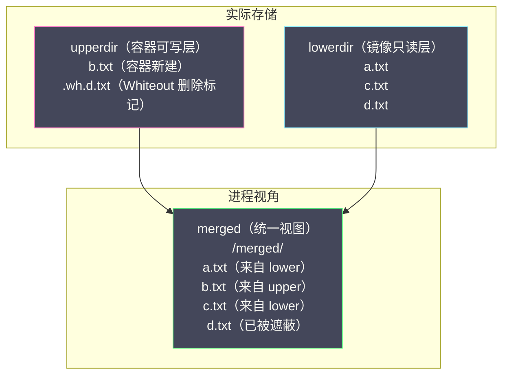
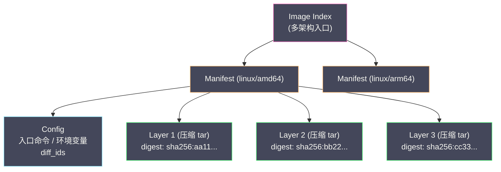
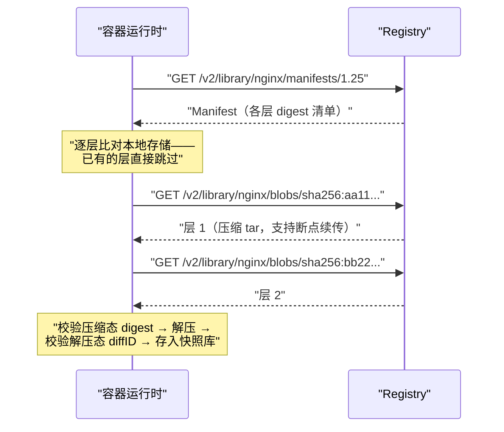

# 04 UnionFS 与容器镜像原理

**摘要：**

前两篇解决了容器的"视图隔离"（[[02 Linux Namespace 深度解析|Namespace]]）与"资源限制"（[[03 Cgroups 资源限制与控制|Cgroups]]），但一个容器要真正运行，还缺最朴素的物料——文件：容器里的 `/usr/bin/python`、`/etc/nginx/nginx.conf`、`/app/server.jar` 从哪里来？答案是**容器镜像**——一个精心设计成分层结构的文件系统包，而让多层文件"叠加成一套根文件系统"的机制，就是联合文件系统（UnionFS），Linux 内核中的现代实现叫 **OverlayFS**。本文沿"为什么需要——怎么实现——怎么组织——怎么构建——怎么分发——怎么运行"的完整链路展开：先论证容器为什么必须有独立 rootfs、完整复制为什么不可行；再深入 OverlayFS 的四个核心对象与读、写、删三类操作的完整路径，弄清 Copy-on-Write 的成本发生在哪一步、Whiteout 如何在只读层上"逻辑删除"；接着回到镜像本体——层与 Dockerfile 指令的关系、SHA256 内容寻址如何同时实现去重、防篡改与缓存复用；然后拆解构建缓存的链式失效规则与多阶段构建的原理，还原镜像从 Registry 到本地快照存储的分发流程；最后落在工程实践上：可写层与 Volume 的边界、数据库为什么必须绕开 OverlayFS、以及节点上的镜像生命周期管理。读完全文，你应当能对着任意一个 Dockerfile 推演出它将生成几层、哪些层会被缓存命中、以及哪些写入行为会给运行时埋雷。

---

## 第 1 章 容器为什么需要自己的文件系统

### 1.1 rootfs：容器的"国土"

[[01 容器的本质——从进程隔离到 OCI 标准]] 的手工实验里，有一个步骤的地位等同于"建国"：`pivot_root` 把进程的根目录切换到一个预先准备好的目录树，从此进程看到的世界就是这棵树——这棵树就是容器的 **rootfs（根文件系统）**。它必须包含应用运行所需的一切：基础工具（`/bin`、`/usr/bin`）、动态链接库（`/lib`）、运行时环境、配置文件骨架、以及应用代码本身。没有 rootfs，Namespace 给出的所有"独立世界"的幻觉都会塌方——进程看到的仍然是宿主机的目录树。rootfs 与 Namespace 的分工可以这样理解：Mount Namespace 提供的是"挂载表的独立房间"（[[02 Linux Namespace 深度解析]]），rootfs 的内容则是房间里摆放的家具——前者是结构机制，后者是内容本身，两者合起来才构成"独立的文件系统世界"。

为什么不能让容器直接使用宿主机的文件系统？三个理由层层递进。**其一是环境一致性**：容器的核心承诺是"在我的机器上能跑，在任何机器上都能跑"，若直接共享宿主机文件系统，应用的行为就取决于宿主机上恰好装了什么版本的库——这正是容器要消灭的问题本身。**其二是并行共存**：容器 A 要 Python 3.8，容器 B 要 Python 3.11，宿主机只有一个 `/usr/bin/python3`，共享即冲突；独立 rootfs 让每个容器拥有自己的版本组合。**其三是安全边界**：受控的 rootfs 只包含应用需要的文件，宿主机的 `/etc/shadow`、SSH 私钥、其他租户的数据从根上就不在容器的视野里（配合 Mount Namespace 的遮挡，这是一道真实的墙，尽管如第 6 篇将分析的，它不是最深的那道）。

### 1.2 朴素方案的账本

实现独立 rootfs 最直接的办法，是为每个容器完整复制一份文件系统。先算账：一个 Ubuntu 22.04 的基础文件系统约 78MB，一个 Python 运行时再添 100MB 级别，一台跑 50 个同类容器的机器就要为一模一样的内容支付几十 GB 的磁盘，更难堪的是创建速度——每次起容器都要先复制上百 MB，"毫秒级启动"的承诺直接破产；镜像分发同理，一个团队 20 个服务若每个镜像都完整打包基础层，Registry 与网络带宽都在搬运同样的字节。

账算到这里，解法的轮廓自然浮现：**共享只读的部分，只给每个容器维护独有的变更**。50 个基于同一基础镜像的容器，共享同一份只读的基础文件系统，每个容器只存储自己实际发生变更的文件（新建的日志、修改的配置）——总成本从 `50 × 完整镜像` 坍缩为 `1 × 完整镜像 + 50 × 增量`，增量通常只有 KB 到 MB 级。与虚拟机镜像对比能更看清这个设计的取舍。虚拟机镜像（qcow2/raw）是块设备级别的完整磁盘，文件系统装在镜像里，共享只能到"整镜像克隆"或"后端镜像 + 差分盘（qcow2 的 backing file）"的粒度，且差分链的合并与迁移都比较笨重；容器镜像把共享粒度细化到了"文件系统变更集"——一层就是一次 diff，轻到可以随网络传输、随哈希校验、随任意组合堆叠。粒度的差异决定了复用率的天花板：**块级共享的最好情况是整盘复用，文件级共享的常态是按层复用**。剩下的工程问题只有一个：怎么让"多份只读 + 一份私有可写"在进程眼里呈现为**一套完整的、可写的**文件系统？

### 1.3 这就是联合文件系统要回答的问题

把 1.2 节的需求翻译成文件系统语言：把多个目录（每个镜像层一个目录，加上一个可写目录）**叠加**成一个统一的目录视图，叠加的规则是"上层同名文件遮住下层"，对"看起来来自下层"的文件做修改时要妥善处理——这套机制就叫**联合文件系统（Union File System，UnionFS）**。它是镜像分层的运行时载体：镜像提供一组只读层，容器提供一个可写层，联合挂载之后，容器内的进程面对的是一套完整的、与任何普通文件系统无异的根目录。联合挂载的思想并不新——Plan 9 的命名空间设计、BSD 的 union mount 都早有实践——但把它与"镜像分层 + 内容寻址 + 仓库分发"组合成一个完整闭环，是容器生态的集体贡献。本章先讲清这个叠加机制本身，镜像的组织、构建与分发在后续章节逐层展开。

---

## 第 2 章 联合文件系统的思想与演进

### 2.1 一叠透明胶片

联合文件系统的概念可以用一叠透明胶片来锚定：每张胶片上画了一些图案（一个目录里的文件集合），把它们垂直对齐叠起来，从正上方看下去，你看到的是所有胶片图案的叠加——同一位置上层的图案遮住下层的图案。想"修改"下层图案？不是在下层胶片上动笔，而是拿一张新胶片盖在它上面重新画（Copy-on-Write）；想"删除"下层图案？在对应位置放一张不透明遮挡片（Whiteout）。这个比喻有一个必须钉住的边界：胶片叠加是物理重叠，而 UnionFS 的叠加是**路径级合成**——只发生覆盖关系的文件才互相影响，各自目录里的其他文件照常并列出现，它不是"图片合成"，而是"目录合并"。把需求写成规格说明书，联合文件系统要支持的操作其实只有四条：读文件时按"上层优先"找到唯一版本；写文件时保证只写可写区、只读区永不被污染；删除文件时在不触碰只读区的前提下让上层"看不见"它；列目录时把所有层的内容合并去重呈现。前两条是"分层"，后两条是"联合"——四条合起来，就是本章全部内容的目录。

### 2.2 演进史：从学术原型到内核主线

| 技术 | 时间 | 地位与命运 |
| :--- | :--- | :--- |
| **UnionFS** | 2004 | Stony Brook University 的研究项目，联合挂载的概念原型 |
| **AUFS** | 2006 | UnionFS 的重构分支（"Another UnionFS"），功能完善，Docker 早期默认 |
| **OverlayFS** | 2014（Linux 3.18 合入主线） | 内核原生实现，Docker 的 overlay 驱动支持 |
| **overlay2** | 2016（Linux 4.0 支持多层 lower） | 当前事实标准，Docker 自 17.06 起默认 |

这段演进里最值得咀嚼的是 AUFS 的遗憾。AUFS 工程上足够成熟，Docker 最初几年靠着它把分层镜像跑了起来，但它始终没有被合入 Linux 内核主线——只以内核补丁的形式被 Debian/Ubuntu 等发行版收录。后果是骨牌式的：官方内核不支持，意味着其他发行版的用户要用 Docker 就得换内核或打补丁，Docker 的普及被文件系统这一个环节卡住了脖子。这段历史的教训与 [[01 容器的本质——从进程隔离到 OCI 标准]] 的 OCI 章节遥相呼应：**技术组件若不在"公共地基"上，生态扩张迟早会在它这里断裂**——对运行时是接口标准，对文件系统就是内核主线。OverlayFS 于 2014 年合入 Linux 3.18 结束了这段尴尬，Docker 随即跟进支持；2016 年内核 4.0 解除了"层数限制"（初版 OverlayFS 只支持两层叠加，overlay2 驱动配合新内核支持任意多层 lower），Docker 自 17.06 起将 overlay2 设为默认存储驱动，联合文件系统的选型之争就此尘埃落定。本章后续的分析全部基于 OverlayFS。

为什么内核社区接受了 OverlayFS 而始终不收 AUFS？复盘这个问题对理解"什么样的代码能进主线"很有价值。OverlayFS 由 Miklos Szeredi 主导实现，采取了与 AUFS 完全不同的工程路线：不追求功能的完备，而是砍到最小可用集合（初版甚至只支持两层叠加），把实现建立在 VFS 的既有原语之上，逐版本逐步增强；AUFS 则功能繁复、与 VFS 内部结构深度耦合，可维护性在维护者眼中始终存疑。内核社区对"合入"的评判标准从来不是"它有多好用"，而是"接手的人未来十年要不要为它还债"——AUFS 的功能清单输给了 OverlayFS 的可维护性。这也解释了 overlay2 的出现节奏：主线版本先立骨架（两层），内核 4.0 再放开多层，功能随内核版本渐进——**进主线的代码按主线的节奏生长，不进主线的代码按用户的需求生长，两条曲线终会在生态上分出胜负**。

---

## 第 3 章 OverlayFS 深度解析

### 3.1 四个核心对象

OverlayFS 把若干目录合成为一个视图，涉及四个角色：

| 对象 | 角色 | 读写属性 |
| :--- | :--- | :--- |
| **lowerdir** | 下层目录，提供基础文件；可多层 | 只读 |
| **upperdir** | 上层目录，承接所有变更 | 可读写 |
| **merged** | 合成后的统一视图，进程实际看到的目录 | 读时来自 lower/upper，写落到 upper |
| **workdir** | OverlayFS 内部工作目录（如原子操作的临时区） | 内部使用 |

```bash
# 挂载一条 OverlayFS：lower1/lower2 叠加，upper 承接写入
mount -t overlay overlay \
    -o lowerdir=/lower2:/lower1,upperdir=/upper,workdir=/work \
    /merged
# 合成优先级：upper > lower2 > lower1（lowerdir 从左到右依次降低）
```

对容器而言，这四个角色有一张固定的映射表：**每个镜像层是一个 lowerdir（只读），容器的可写层是 upperdir，进程看到的根文件系统是 merged**。运行时在创建容器的"组装 rootfs"阶段做的正是这个挂载——[[01 容器的本质——从进程隔离到 OCI 标准]] 的执行路径图里那句"OverlayFS 挂载 rootfs"，展开后就是这条命令。



### 3.2 读路径：一层目录查找

读是三条路径里最简单的：进程打开 `/merged/a.txt` 时，OverlayFS 先查 upperdir——命中则直接返回（这是容器修改过的版本）；未命中再查 lowerdir（多层时按从上到下顺序），返回找到的第一份。整个查找对应用完全透明，应用只知道"这个文件存在，内容如此"，不知道它实际来自哪一层、甚至不知道脚下是联合文件系统。查询效率与层数线性相关（最坏情况逐层找），这正是层数过深的镜像（动辄上百层）启动略慢的原因之一，也是"合并 RUN 指令"（第 5 章）在运行时侧的收益来源。

### 3.3 写路径：Copy-on-Write 的完整细节

OverlayFS 的写操作遵循 **CoW（Copy-on-Write，写时复制）**策略，按写入类型分三种情况：

**新建文件**：直接写入 upperdir，不触碰任何 lower 层，没有额外成本——这是最便宜的一类写。

**修改来自 lower 的文件**：lower 层是只读的，OverlayFS 无法就地修改。第一次写入时，内核先把该文件**完整复制**到 upperdir（copy-up），随后这次及以后的所有修改都落在 upperdir 的副本上。三个成本要点：一是 copy-up 是**整文件复制**——修改一个 1GB 文件的一个字节，也要先复制 1GB，延迟尖峰由此而来；二是 copy-up 会**打破硬链接**——原文件若有多个硬链接名，复制后各名字指向的不再是同一个 inode；三是 copy-up 之后，**所有页缓存与该文件原层位置的关联作废**，紧随其后的读会重新从新位置预热缓存。

**元数据操作**：`chmod`、`chown`、`touch` 这类不修改文件内容的操作同样触发 copy-up（副本需要独立的元数据），只是复制成本通常被"只拷内容不重读数据"优化掉一部分。判断原则可以总结为一句话：**任何对"来自镜像层的文件"的写或属性变更，第一次都要付一次 copy-up。**

> [!warning] CoW 的性能画像
> CoW 的成本不是均匀的税，而是一根尖刺：首次修改大文件时一次性的整文件复制（可轻易达到秒级），后续访问则与普通文件无异。这决定了它的受害者画像——启动时就要改写大文件的服务（譬如首次运行要重建索引的搜索引擎、启动时改写自身配置的数据库）会在容器启动路径上吃到这根尖刺，而"只追加新文件"的负载（绝大多数 Web 应用）几乎无感。对策不是调参，而是布局——把会被改写的大文件挪出镜像层（挂 Volume），尖刺就不存在了。顺带解释一个关联现象：**有状态应用的容器首次启动常常明显慢于后续启动**——首次要把数据文件从镜像层 copy-up（或初始化落盘），后续启动这些文件已在可写层或 Volume 里，跳过了复制环节。排查"启动慢"问题时，区分"每次都慢"（架构问题）与"只有首次慢"（一次性成本）是分诊的第一刀。

### 3.4 删路径：Whiteout 的"逻辑删除"

删除来自 lower 层的文件是一个有趣的难题——lower 层只读，物理删除无从谈起。OverlayFS 的答案是**Whiteout（白色遮罩）**：删除 `/merged/d.txt` 时，内核在 upperdir 对应位置创建一个特殊文件 `.wh.d.txt`（字符设备，主次设备号为 0:0），它的唯一作用是遮蔽 lower 层的同名文件——此后 merged 视图里该文件彻底"消失"，虽然 lower 层里它还安然躺着。删除目录用更强的遮罩：在 upperdir 创建 opaque 目录（内含 `.wh..wh..opq` 标记文件），表示"整个目录以下层内容为准的部分全部隐藏"。Whiteout 机制还回答了一个镜像领域的常见困惑：**为什么在 Dockerfile 里 `RUN rm -rf /var/log/huge.log` 不会让镜像变小**——删除只是在新层放了一个 Whiteout，底层那 100MB 在旧层里原封不动，第 5 章会把它变成一条构建纪律。Whiteout 的存在形态可以在磁盘上直接验证：

```bash
# lower 层有 file.txt，在 merged 里删除它
rm /merged/file.txt
ls /lower/        # file.txt 依然存在（只读层纹丝不动）
ls -a /upper/     # .wh.file.txt 出现（字符设备文件，0:0）
ls /merged/       # file.txt 已不可见——被遮蔽，而非被删除
```

### 3.5 多层叠加与工程边界

OverlayFS 支持任意多层 lowerdir（冒号分隔、从左到右优先级递减），这正是"镜像有 N 层就挂 N 个 lowerdir"的机制基础。工程上有几条边界需要记在工具箱里：**层数有实际上限**——内核支持数百层，但 Docker 的 overlay2 驱动将层数限制在百层量级，超限的构建会失败，这也是"精简层数"不仅是美学问题的原因；**rename 有兼容性陷阱**——跨层目录的 rename 在 OverlayFS 上可能返回 `EXDEV`（invalid cross-device link），惯于在目录间搬移文件的应用需要像对待跨文件系统移动一样处理重试与降级；**inotify 有盲区**——对 lower 层文件的变更监听在 OverlayFS 上不总是可靠，依赖文件变更通知的热重载工具在容器里偶发失灵多半源于此；**扩展属性（xattr）与特性依赖**——部分高级特性（如 fscrypt、某些 NFS 导出）在 OverlayFS 上不可用或受限，选型前要核对内核文档的支持矩阵；**嵌套叠加**——OverlayFS 之上再挂 OverlayFS 是允许的（Docker in Docker 场景天然如此），但每层嵌套都叠加查找开销与行为复杂度，能不嵌就不嵌；**查找成本随层数增长**——百层镜像的冷启动路径查找开销可观。这些边界的共同解法都是同一个方向：**少而薄的层**。

### 3.6 动手：五分钟手工搭一条 OverlayFS

与 [[02 Linux Namespace 深度解析]] 的 Namespace 实验同一精神，OverlayFS 的全部机制也可以不借助任何容器工具、用一条 mount 命令完整复现：

```bash
# 准备目录与测试文件
mkdir -p /tmp/ovl/{lower,upper,work,merged}
echo "from lower" > /tmp/ovl/lower/a.txt
echo "from lower" > /tmp/ovl/lower/b.txt

# 挂载联合视图
mount -t overlay overlay   -o lowerdir=/tmp/ovl/lower,upperdir=/tmp/ovl/upper,workdir=/tmp/ovl/work   /tmp/ovl/merged

# 验证一：读——两个文件都可见（来自 lower）
cat /tmp/ovl/merged/a.txt

# 验证二：改——修改 lower 的文件，触发 copy-up
echo "modified" > /tmp/ovl/merged/a.txt
ls /tmp/ovl/upper/         # a.txt 的完整副本出现在 upper
cat /tmp/ovl/lower/a.txt   # 原件未动（只读）

# 验证三：删——Whiteout 登场
rm /tmp/ovl/merged/b.txt
ls -a /tmp/ovl/upper/      # .wh.b.txt 出现
ls /tmp/ovl/lower/         # b.txt 仍在 lower

# 验证四：新建——只进 upper
echo "new file" > /tmp/ovl/merged/c.txt
ls /tmp/ovl/upper/         # c.txt、a.txt 副本、.wh.b.txt 并列

umount /tmp/ovl/merged     # 清理
```

四个验证对应 3.2-3.4 节的全部路径，几分钟的动手胜过十遍重读：**upperdir 就是容器可写层的全部真相**——你在这个实验里看到的副本、遮罩与新文件，就是任何容器运行一天之后 upperdir 的样子。

---

## 第 4 章 镜像：分层的文件系统包

### 4.1 层与 Dockerfile 指令的关系

现在把镜头从运行时切换到镜像本体。OCI 镜像的基本单元是**层（Layer）**：一个 tar 归档，记录一组文件系统变更。构建时，Dockerfile 的每条会产生文件系统变更的指令（`RUN`、`COPY`、`ADD`）生成一层；`FROM` 引入基础镜像的全部层；`ENV`、`CMD` 这类纯元数据指令不新增层，只修改镜像的配置对象。看一个具体的例子：

```dockerfile
FROM ubuntu:22.04                  # 基础层（若干层，约 78MB）
RUN apt-get update && \
    apt-get install -y python3     # 层：安装 Python3（约 45MB）
COPY requirements.txt /app/        # 层：一个 1KB 的文件
RUN pip install -r /app/requirements.txt   # 层：依赖安装产物（约 50MB）
COPY . /app/                       # 层：应用代码（约 500KB）
CMD ["python3", "/app/main.py"]    # 无新层：纯元数据
```

一个关键的认知矫正：**镜像不是 Dockerfile 的"重放说明书"，而是构建的最终结果**。镜像里只有一叠 tar 层与元数据，没有 Dockerfile——你无法从镜像精确还原每条指令（`docker history` 展示的指令序列来自元数据里的历史记录，构建者可以伪造或清空它，且 `RUN` 的具体命令与层内容的对应关系并不严格可验证）。这个认知决定了两件事的可靠性边界：镜像的"来源可信"必须靠签名体系（谁构建的、内容是否被篡改），而不是"看到 Dockerfile 里写了什么"；以及下一节的构建缓存机制，本质是构建器在执行过程中的优化产物，不是镜像格式的一部分。想直视层的实体，两条路径都很方便：

```bash
# 路径一：docker history——按元数据展示层序列与大小
docker history nginx:1.25
# IMAGE          CREATED   SIZE    CREATED BY
# a72860cb95fd   2 weeks   1.2kB   CMD ["nginx" "-g" "daemon off;"]
# ...            2 weeks   45MB    RUN /bin/sh -c apt-get install ...

# 路径二：读 manifest——层的 digest 与大小清单
docker manifest inspect nginx:1.25
# "layers": [
#   { "digest": "sha256:2c03db...", "size": 29999482 },
#   ...
# ]
```

### 4.2 层的内容与两种哈希

OCI 镜像规范定义了三个对象与两条哈希链，值得把细节展开，因为"两种哈希"是理解镜像校验与去重的关键。**层（Layer）**是 gzip 压缩的 tar 包（OCI 1.1 起也支持 zstd）；**配置（Config）**是 JSON 对象，记录镜像元数据——入口命令、环境变量、暴露端口、构建历史，以及一个关键字段 `diff_ids`：**每一层解压后内容的 SHA256**；**清单（Manifest）**是索引对象，记录配置对象与**每一层压缩态的 SHA256**（即 Registry 上实际存储与传输的字节的哈希）。于是每个镜像层天然携带两个哈希：压缩态的 digest（用于传输与存储寻址）与解压态的 diffID（用于本地堆叠与内容校验），构建器在拉取时逐层校验压缩态哈希，组装 rootfs 前校验解压态哈希——**传输路径与运行路径各有各的完整性保证**。配置对象里的 `history` 字段（`docker history` 的数据源）则记录了每层的构建指令痕迹，它服务于可读性而非安全性：如前所述它可以被清空或伪造，审计场景应以 manifest 与签名为准，`history` 只当辅助线索。

多架构镜像再往上叠一层索引（Image Index，一个 manifest 的列表，按架构/平台指向不同的 manifest），`docker pull nginx` 时客户端按本机架构从中挑选——这张四层结构（index → manifest → config/layer）是所有镜像工具共同的事实地基。

### 4.3 内容寻址：一个哈希同时解决三个问题

所有对象以内容的 SHA256 为名（内容寻址存储，Content-Addressable Storage），这个设计一笔同时解决了存储、分发与安全三个领域的问题：

- **天然去重**：内容相同的层必然同名。20 个服务镜像共用同一个 `ubuntu:22.04` 基础层，磁盘与 Registry 上只存一份；Kubernetes 节点上几十个 Pod 共享基础层的场景下，这种共享是磁盘占用的数量级优化；
- **天然防篡改**：任何字节被改动，哈希即变，与声明的 digest 对不上——传输完整性校验零成本，供应链投毒在"下载即校验"的环节会被直接拒绝（更上游的"构建期投毒"则需要签名体系兜底）；
- **天然可缓存**：层的哈希就是构建缓存的键，输入不变则输出同名，缓存命中判断从"猜测等价"变成"比较哈希"，第 5 章的构建加速全建立在这上面。

内容寻址还赋予 digest 一种**引用语义**：`nginx@sha256:2c03db...` 这样的引用锁定的不是"名字"而是"确切内容"——同一个 digest 在任何 Registry、任何节点上展开必然是同一份字节。这让 digest 成为依赖管理的终极形态：Kubernetes 的部署清单里用 digest 引用镜像，等于把"我运行的是什么"从一句可变的口头禅升级为一份不可变的合同，供应链审计（这份清单里到底跑着什么）也因此有了可机械验证的答案。



### 4.4 层的堆叠顺序与容器的最终视图

把前面的机制合拢：容器运行时拿到 manifest 后按顺序展开各层（从基础层到最上层），每层解压出的目录树作为一个 lowerdir 加入 OverlayFS 挂载，最后再叠上容器专属的可写层作为 upperdir。层的堆叠顺序是严格记录的（manifest 中的 layers 数组），**顺序即语义**——同一个文件出现在多层时，以"最后出现的层"为准，这正是 Dockerfile 从上到下执行语义在存储侧的投影。运行时对堆叠结果的信任来自 diffID 校验：每层解压后重算哈希与 config 中的 diff_ids 比对，任何一层内容不符，容器创建直接失败——镜像从 Registry 到 rootfs 的旅程，自始至终被哈希锚定。

补一个工程上常见的"离线形态"：`docker save` 把镜像导出为一个 tar 包（内含 config、manifest 与各层），`docker load` 在断网环境还原——这正是 OCI 镜像作为"自包含制品"的直观体现；新一代工具链进一步定义了 **OCI Image Layout**（镜像在目录/压缩包中的标准布局），skopeo、oras 等工具可以不经过任何守护进程直接复制、检查、传输镜像制品。**同一份格式，既可以是 Registry 里的 blob 群，也可以是 U 盘里的一个 tar 文件**——格式标准的完备性在此体现。

---

## 第 5 章 构建：缓存、阶段与纪律

### 5.1 构建器如何执行 Dockerfile

理解缓存之前先看构建的执行模型。构建器逐条执行 Dockerfile：对每条指令，临时创建一个容器执行（`RUN apt-get install ...` 就是在上一层的文件系统之上启动一个临时容器跑这条命令），容器退出后把文件系统的增量固化为一层，然后在此基础上执行下一条。这个"容器即执行单元"的模型解释了很多现象：为什么 `RUN` 里的 `cd` 不能影响下一条指令（每条指令都是新容器，工作目录由 `WORKDIR` 声明）、为什么构建过程中写入的敏感信息会留在层里（临时容器的文件系统增量被完整固化，包括你以为"临时"的一切）、以及为什么构建缓存能以层为单位工作——**指令、输入、层三者一一对应**。BuildKit 的 `docker buildx` 把这个模型推广到了多平台：为 arm64 与 amd64 各执行一遍完整构建（或通过 QEMU 仿真跨架构执行），产出各自的 manifest 再归并到 4.2 节的 Image Index 下——一次构建，多架构交付，苹果芯片笔记本上构建生产镜像的日常，靠的就是这条链路。

### 5.2 构建缓存：键与链式失效

构建器执行每条指令前先查缓存：对 `RUN`，缓存键是指令字符串加上父层的哈希；对 `COPY`/`ADD`，还会校验被复制文件的**内容哈希**（修改文件内容而路径不变，缓存照样失效）。命中则直接复用既有层，未命中则执行并生成新层。缓存失效是**链式的**：第 N 层失效后，第 N+1 层及之后全部重建——因为它们站在一个"不存在于缓存中"的父层之上，即使后续指令一字未改，它们的缓存键（包含父层哈希）也不再匹配。

链式失效规则直接导出了 Dockerfile 编写的第一纪律：**按变更频率排列指令**。对比两种写法：

```dockerfile
# 正确：依赖清单先行，代码最后——日常改代码只重建最后两层
FROM python:3.11-slim
WORKDIR /app
COPY requirements.txt .
RUN pip install -r requirements.txt    # 依赖不变则恒命中
COPY . .                               # 代码每次变，只牺牲这一层
CMD ["python3", "main.py"]

# 错误：代码先行——每次改代码，pip install 全部重跑
FROM python:3.11-slim
WORKDIR /app
COPY . .
RUN pip install -r requirements.txt    # 每次构建都要重新下载依赖
```

还要警惕"伪不变"的指令：`RUN apt-get update && apt-get install -y curl` 的缓存键只有命令字符串——半年后命中缓存时，apt 源的内容早已变化，装到的还是半年前的索引。对这类"内容会漂移的命令"，要么定期 `--no-cache` 全量重建，要么在 CI 里给基础镜像与依赖锁定版本。

与缓存键相关的还有一个常被忽视的角色：**构建上下文（Build Context）**。`docker build .` 会把当前目录打包送上构建器，`COPY . .` 的内容哈希来自这个上下文——上下文里的无关文件（`.git`、本地日志、临时产物）不仅拖慢构建（上下文要先传输），还可能让缓存意外失效（无关文件变了，`COPY . .` 的哈希就变了），甚至把敏感文件（密钥、`.env`）打进镜像层。**`.dockerignore` 是构建工程的门禁**：上下文越干净，缓存越稳定、传输越快、泄漏面越小，它的性价比可能高于任何一条 Dockerfile 技巧。CI 环境里还有一个缓存相关的陷阱值得预警：构建过程若依赖"时间"或"随机性"（时间戳写入文件、随机生成 ID），同样的输入每次都会产出不同的层，缓存永远失效；反过来，若把"会变化的内容"固定在早期层（譬如把当天日期 COPY 进去），会让后续所有层每天重建一遍——**缓存友好性的本质，是让"变更"以最细的粒度进入最晚的层**。

### 5.3 BuildKit 与缓存挂载

传统的层缓存有一个盲区：**包管理器的下载缓存**。`pip install` 先下载 whl 包再安装，层缓存能把"安装结果"整体缓存，但一旦 `requirements.txt` 增加了一个依赖，整层作废，所有包从头下载。新一代构建器 **BuildKit**（2018 年起随 Docker 演进，自 Docker Engine 23.0 起成为默认）提供了**缓存挂载**来填这个坑：给命令声明一个持久化的缓存目录，它不属于任何镜像层，跨构建反复使用：

```dockerfile
# BuildKit 语法：pip 的下载缓存跨构建持久化
# 层仍会重建（结果要进镜像），但下载环节大多命中本地缓存
RUN --mount=type=cache,target=/root/.cache/pip \
    pip install -r requirements.txt
```

层缓存管"结果的复用"，缓存挂载管"过程的复用"，两者互补。BuildKit 还带来了并行执行（无依赖关系的指令并发跑）、按需传输构建上下文、`--secret` 挂载密钥（密钥不落层）等改进，如今它已是 `docker build` 的默认引擎。值得一提的是 CI 环境下的缓存策略：构建机是朝生暮死的容器时，层缓存会随构建环境一起消失，需要把 BuildKit 的缓存目录外挂到持久卷或推送到 Registry 的缓存镜像（`--cache-to/--cache-from type=registry`），把缓存从"构建机的私有财产"变成"流水线的公共资产"——CI 构建速度的优化常常不在 Dockerfile 本身，而在缓存的存放位置。

### 5.4 多阶段构建：把"出厂"与"仓库"分开

多阶段构建（Multi-stage Build）解决的是另一类浪费：**构建工具本身不应出现在最终镜像里**。编译型应用的构建环境（Go 工具链、gcc、maven）动辄上 GB，而运行只需要一个二进制：

```dockerfile
# 阶段一：构建环境（大，只活在构建期）
FROM golang:1.22 AS builder
WORKDIR /src
COPY . .
RUN CGO_ENABLED=0 go build -o /out/app .

# 阶段二：运行环境（小，交付物）
FROM gcr.io/distroless/static
COPY --from=builder /out/app /app
CMD ["/app"]
```

最终镜像只包含第二个阶段的层——一个 distroless 基础（无 shell、无包管理器，只留运行时必需品）加上应用二进制，体积从 GB 级压到 MB 级。收益是双重的：**更小的镜像**意味着更快的拉取与启动（对弹性伸缩直接有效——扩容速度受限于镜像下载），**更少的组件**意味着更小的攻击面（没有 shell 就没有反弹 shell 的载体，没有包管理器就没有旧漏洞包的藏身处）。多阶段构建是少数"性能、安全、成本三赢"的实践，没有理由不用。运行基础的选择上，静态链接的 Go/Rust 二进制可以配合 distroless 甚至 `FROM scratch`（空镜像）——极致的小与净；动态链接的应用则要留意基础镜像的 libc 匹配（Alpine 的 musl 与主流的 glibc 在部分 C 扩展、DNS 解析行为上有差异，切换前必须回归测试）。"把镜像做到多小"没有标准答案，但决策依据很清晰：**镜像里的每一样东西，都必须能回答"运行期为什么需要它"**——回答不了的，就是攻击面与拉取成本的双重浪费。

### 5.5 层数纪律：为什么"删了也不小"

第 3.4 节的 Whiteout 机制在这里兑现成纪律。每条 `RUN` 一层，层内容是**净变更**的固化——在一条 `RUN` 里安装了 200MB 编译工具，在另一条 `RUN` 里删除它们，结果是：第一层固化的 200MB 永久存在于镜像中，第二层只有一个 Whiteout 标记。**层的不可变性意味着"删除"永远不能回收空间，只有"不产生"才可以**。因此安装-使用-清理必须合并在同一条 `RUN` 里完成，清理的对象还包括一切过程产物（下载缓存、临时文件、`/var/lib/apt/lists`）：

> [!note] 一条经验判定法
> 检查 Dockerfile 时问每条 `RUN` 一个问题："这条命令的中间产物，在最终文件系统里应该存在吗？"答案是否而指令又分了多条的，就是层膨胀的候选——把它们合并，或挪进多阶段构建的"出厂车间"。


```dockerfile
# 错误：工具装在 A 层（200MB 永久存在），删除只产生 B 层的 Whiteout
RUN apt-get install -y build-essential
RUN make && apt-get remove -y build-essential

# 正确：同层内完成安装、使用、清理
RUN apt-get update && \
    apt-get install -y --no-install-recommends build-essential && \
    make && \
    apt-get purge -y build-essential && \
    rm -rf /var/lib/apt/lists/*
```

---

## 第 6 章 分发：从 Registry 到本地快照

### 6.1 分发协议的两次握手

镜像构建完成后的下一站是分发。镜像经由 **Registry**（实现 OCI Distribution Spec 的 HTTP 服务，公共的如 Docker Hub，企业内部多自建 Harbor）分发。拉取 `docker pull nginx:1.25` 的协议流程是一个简洁的两段式：



第一步拿 manifest，第二步按需拉取各层 blob。

这套"先清单后内容"的设计让**层去重天然发生在协议层**：运行时先对 manifest 里的 digest 清单与本地存储比对，已存在的层根本不发起请求——一个节点上第二次拉取基于相同基础镜像的应用，往往只需要下载几个 MB 的应用层——层去重不是存储引擎的内部优化，而是拉取协议的第一等公民。层的并行下载、gzip/zstd 压缩传输、HTTP Range 断点续传都是协议与实现层面的标准优化。**镜像的核心成本（体积）被分摊到最细的可共享粒度（层）上，这是容器分发体系最重要的经济学设计。**"先清单后内容"还有一层安全意味：清单先行意味着客户端在传输任何字节之前就拿到了完整的 digest 清单，传输过程中的每一层都能即时校验——不存在"先收全量再验证"的窗口期，中间人替换内容的攻击面被压缩到零（再配合 TLS 与签名，构成完整的传输信任链）。协议设计里"先给目录、再发货"的顺序，本身就是安全设计。

Distribution Spec 本身相当克制：只规定 manifest 与 blob 的存取语义，不规定存储后端——S3、本地文件系统、对象存储网关都可以做 Registry 的底座，Harbor、云厂商托管服务、单容器的 registry:2 各自实现同一套 API，客户端无感。规范管接口、实现各显神通，与 OCI 的整体哲学一以贯之。

### 6.2 懒加载：一次"按需"的革新

即便有层去重，一个几 GB 的镜像在冷启动扩容时仍要完整下载。**懒加载（Lazy Pulling）**改变了这个模型：以 containerd 生态的 **eStargz** 格式为例，镜像层被重新组织为可随机寻址的 chunks 并附带内容索引，运行时可以先只拉取"启动必需"的文件（入口程序、共享库），其余内容推迟到真正被读取时按 chunk 拉取——镜像下载从"前置的整块成本"变成"摊入运行期的按需成本"，冷启动时间可以从分钟级压到秒级。代价是运行期网络依赖变强（读任何未拉取的文件都可能触发网络请求），适合节点带宽充裕、镜像巨大的场景。它与 4.2 节的内容寻址一脉相承：**正因为每个 chunk 都有哈希，"只拉需要的部分"才能校验得住。**懒加载的适用边界也值得划清：它优化的是"首次到达时间"，把成本转移到了"首次读取延迟"上——对启动时就要顺序读完大半镜像的负载（fat jar 全量加载类），懒加载省不了多少，反而多了运行期的网络依赖；对启动路径短、镜像大部分内容闲置（工具镜像、多能力镜像）的场景收益最大。**先看启动路径的 I/O 特征，再决定是否上懒加载**，这个顺序不能反。

### 6.3 本地存储：快照器的世界

拉取的层最终落在运行时的本地存储里。containerd 把这层抽象称为 **Snapshotter**（快照器）：每个镜像层解压后是一个"快照"（对应磁盘上的一个目录），创建容器时从镜像层链派生出容器的活跃快照（作为 upperdir），整个派生关系由元数据数据库管理。它的磁盘布局大致如下：

```bash
# containerd overlayfs snapshotter 的存储布局（简化）
/var/lib/containerd/io.containerd.snapshotter.v1.overlayfs/
├── snapshots/
│   ├── 27/fs/    # 第 27 号快照：某镜像的某层（解压后的目录树）
│   ├── 28/fs/    # 第 28 号快照：另一层
│   └── 105/fs/   # 第 105 号快照：某运行中容器的可写层
└── metadata.db   # 快照间的父子关系与状态（BoltDB）
```

Docker 引擎自带的存储（`/var/lib/docker/overlay2/`）是同一思想的另一实现，目录组织略有差异但原理一致——**层即目录，容器即 upperdir，镜像即 lower 链**。理解这个布局的价值在排障：磁盘告警时按目录统计、清理悬空层、定位"哪个容器的可写层在疯涨"，都要落在这套目录结构上。

### 6.4 分发的规模工程：私有仓库与 P2P

当集群规模上到千节点量级，镜像分发本身成为系统工程。**私有 Registry（如 Harbor）**解决的是第一层问题：拉取就近（内网带宽与延迟）、内容可控（漏洞扫描、签名验证、复制规则）、权限收敛（谁可以推、谁可以拉）；它通常再配置**缓存/回源代理**，把公共镜像在首次拉取后缓存在内网，后续节点全部就近命中。千节点同时拉取一个大镜像的"惊群"场景，Registry 单点无论如何扩容都吃力，于是出现第二层方案——**P2P 分发**（如 Dragonfly、Kraken）：节点之间互为种子，Registry 只需要服务每个镜像的第一份拷贝，其余流量在节点网络内对等分摊，大促场景下万节点级的同时部署由此成为可能。分发体系的三级火箭（公共 Hub → 私有 Harbor → P2P 网络）各自对应一个规模门槛，多数团队走到第二级就够，但知道第三级的存在，扩容规划时才不会把 Registry 当成不可逾越的墙。

---

## 第 7 章 工程实践：可写层、Volume 与节点管理

### 7.1 容器写入的两个去向

容器运行时的文件写入有两个去向，选择权在使用者手里，边界必须划清：

| 维度 | 容器可写层（OverlayFS upper） | Volume（数据卷） |
| :--- | :--- | :--- |
| **存储位置** | 宿主机上的容器专属目录（快照器管理） | 显式指定的宿主机路径或外置存储 |
| **生命周期** | 与容器同生共死，删除容器即销毁 | 独立于容器，显式删除才销毁 |
| **写入成本** | 新文件零成本；改镜像内文件触发 CoW | 直接落盘，无 CoW |
| **典型用途** | 临时文件、运行期产生的缓存 | 数据库数据、上传文件、任何要"活过容器"的数据 |
| **K8s 对应** | （无显式对象，默认行为） | PersistentVolume / emptyDir / hostPath |

**数据库类负载必须使用 Volume，没有讨论空间**：可写层的数据随容器删除而消失（滚动更新即数据蒸发）；CoW 对随机小写入的放大效应直接影响性能；部分文件操作（跨层 rename）在 OverlayFS 上有兼容性风险。日志类负载的正解则是输出到 stdout/stderr 交给运行时日志驱动收集（或直接写 Volume），而不是写进容器文件系统——既避开 CoW，也让日志的生命周期与容器解耦。Volume 本身也有一个选型谱系：

| 类型 | 本质 | 适用场景 |
| :--- | :--- | :--- |
| **命名卷（named volume）** | 运行时管理的存储区，Docker/K8s 负责生命周期 | 数据库数据、需要备份迁移的持久数据 |
| **bind mount** | 直接映射宿主机目录 | 开发环境代码热载、宿主机日志采集 |
| **网络存储（PV + CSI）** | 外置存储系统（云盘/NFS/分布式存储） | 跨节点漂移的有状态服务 |

三种类型在"谁管生命周期、数据住在哪里、能否跨节点"三个维度上各有定位，选型的判断题只有一个：**数据需要活多久、跟着谁走**。

### 7.2 tmpfs：第三条路

还有第三种去向：**tmpfs 挂载**——把一个目录挂到内存文件系统，写入速度快（纯内存）、生命周期与挂载绑定（卸载即消失）、不产生任何磁盘痕迹。它适合两类场景：**敏感数据**（密钥、凭证经 tmpfs 挂载进容器，避免落盘的残留风险）、**高频临时读写**（压测时的临时数据目录，消除磁盘 I/O 变量）。Kubernetes 的 `emptyDir.medium: Memory` 就是 Pod 级的 tmpfs。注意它的内存账单属性——[[03 Cgroups 资源限制与控制|上一篇]] 说过 tmpfs 内容全额计入容器内存，"把磁盘不够的问题转移到内存"不是免费的。另有一个生命周期细节：Kubernetes 的普通 `emptyDir`（磁盘版）随 Pod 删除而清空，但**容器崩溃重启（Pod 内容器重建）不清空它**——emptyDir 挂在 Pod 沙箱的文件系统层，只有整个 Pod 重建才回收。这个差异让 emptyDir 成为"容器级临时、Pod 级共享"缓存的默认选择：Sidecar 写、主容器读的中间产物，用 emptyDir 比各自挂共享卷简单得多。

### 7.3 节点上的镜像生命周期管理

镜像与存储的最后一站是节点的日常运营。在 Kubernetes 节点上，镜像积累与磁盘回收是一对持续运转的矛盾——每个节点都同时住着几十个镜像、几十个容器的可写层、若干 Volume，kubelet 提供了三个管理杠杆：

**Image GC（镜像垃圾回收）**：节点磁盘使用率超过高水位（`imageGCHighThresholdPercent`，默认 85%）时，kubelet 开始删除无容器引用的镜像，直到降到低水位（默认 80%）以下。它回收的是"无引用"镜像——正在运行的容器所属镜像不会被删，但一个只在大促期间使用的镜像，平时就可能被 GC 清掉，大促前拉取风暴的伏笔由此埋下。

**imagePullPolicy（拉取策略）**：`Always`（每次创建 Pod 都询问 Registry 有无更新——`:latest` 标签的默认值）、`IfNotPresent`（本地有就用，默认值——对具名标签）、`Never`（只用本地）。它与 GC 的组合有一个隐蔽的坑：固定标签（如 `app:v1.2.3`）的镜像被 GC 后，节点回到 `IfNotPresent` 逻辑会重新拉取——若该镜像已被 CI 覆盖为同标签不同内容，"同一个标签，不同节点跑的代码不同"的灵异事件就发生了。**禁用可变标签 + Digest 固定**（`app@sha256:...`）是根治方案。

**预热（Pre-pulling）**：大规模扩容前把镜像提前分发到节点（DaemonSet 常驻拉取或节点初始化脚本），把拉取成本从扩容的关键路径上挪走。预热的执行时机也有讲究：发布新版本前预热（新镜像先进节点、再发部署）可以把"更新镜像"从发布流程中摘除，滚动更新的每一步只剩容器创建；配合发布前的分批预热（先 10% 节点、验证后再全量），还能把镜像缺陷的爆炸半径控制在预热批次里。镜像拉取是容器启动耗时里最不可控的一段（网络、Registry 抖动），**扩容速度的上限往往不是调度器的速度，而是镜像到达的速度**——这也是 6.2 节懒加载技术与 P2P 分发（如 Dragonfly）存在的理由。

镜像的"准入"管理则交给签名与策略体系，它把 4.3 节的引用语义补全成信任链：CI 构建完成后用 **Cosign** 之类的工具对镜像签名（签名本身也是 OCI 制品，存在同一个 Registry 里）；集群侧由准入控制器（Kyverno、OPA Gatekeeper 或 Cosign 的 policy-controller）在 Pod 创建时验证签名与来源，无签名或签名不符的镜像直接拒绝调度。加上 SBOM（软件物料清单）与漏洞扫描（Trivy、Grype），镜像从"构建产物"升级为"可审计的供应链节点"——这些机制全部建立在 4.2 节的内容寻址之上：**没有"内容即身份"，就没有可验证的信任**。

---

## 第 8 章 边界、误区与总结

### 8.1 OverlayFS 的能力边界

OverlayFS 是一个"看起来像普通文件系统"的翻译层，它的边界都在"翻译不到"的地方：**属性变更触发 copy-up**（哪怕是 chmod），让"镜像内文件 + 频繁属性操作"的负载天然低效；**硬链接在 copy-up 时断裂**，依赖硬链接共享 inode 的程序（某些去重备份工具）在容器里行为会变；**跨层 rename 可能返回 EXDEV**，应用需要按跨文件系统移动来处理；**inotify 对 lower 层盲**，热重载工具可能失灵；**fsync 语义经过翻译层**，对崩溃一致性有极端要求的负载（数据库）应在 Volume 而非可写层上运行——这些边界没有一条是致命的，但每一条都值得在踩坑前知道。排查这类文件系统怪象时，`docker diff` 是把可写层"显影"的第一工具：

```bash
docker diff <container>
# C /etc          ← C = Changed（修改了镜像层的文件）
# A /tmp/new.log  ← A = Added（容器新建）
# D /var/log/old  ← D = Deleted（Whiteout 标记）
```

三条输出与 3.3/3.4 节的机制一一对应——看到满屏的 `C`，就该意识到有大量 copy-up 在发生，写入布局需要重新设计。


### 8.2 三个高频误区

**误区一：把镜像体积等同于磁盘占用。** 由于层共享，节点上"镜像列表体积之和"远大于实际磁盘占用——两个 1GB 镜像若共享 800MB 的基础层，实际只占 1.2GB。评估节点的镜像容量时要用存储引擎的真实统计，而不是镜像列表的加总。

**误区二：以为 `rm` 能瘦身。** 5.5 节的纪律值得再重复一次：层不可变，删除只产生 Whiteout，永远不能回收已固化的空间；瘦身只能靠"合并指令让产物不进入任何一层"或"多阶段构建让产物不进入最终阶段"。一个佐证性的现象是 `docker history` 里那些 `SIZE = 0B` 的层——`ENV`、`WORKDIR`、`CMD` 这类纯元数据指令不产生文件变更，层内容为空；而任何 `SIZE > 0` 的层，其字节数都会永久计入镜像，无论后续如何"删除"。

**误区三：把 `:latest` 当"最新版本"用。** `latest` 只是"构建时恰好没打标签的那个默认标签"，它不随上游更新而更新、不同节点拉取的可能是完全不同的内容、配合 `IfNotPresent` 还会放大不一致。生产镜像必须有不可变标签（或 digest 固定），`:latest` 只适合本地实验。若必须保留可变标签（某些流水线依赖），至少让部署侧用 digest 落地——流水线内部用标签流转，部署清单里先解析成 digest 再提交，可变性与确定性就各得其所。

### 8.3 全文总结

本文完成了容器第三大支柱的完整链条：

- **为什么**：容器需要独立 rootfs 以保证环境一致、并行共存与安全边界；完整复制不可行，"共享只读 + 私有可写"是唯一经济的形态；
- **机制**：OverlayFS 以 lowerdir（镜像层）+ upperdir（可写层）+ merged（统一视图）实现联合挂载——读路径逐层查找，写路径写时复制（CoW 的成本是大文件的首次整文件复制），删路径用 Whiteout 逻辑删除；
- **镜像**：层（tar）+ 配置 + 清单构成 OCI 镜像，压缩态 digest 与解压态 diffID 双哈希链保证传输与运行两端的完整性，内容寻址让去重、防篡改、缓存复用共享同一套机制；
- **构建**：缓存键随链式失效逐级传导，"变更频率排序 + 多阶段构建 + 合并清理"是三条铁律，BuildKit 的缓存挂载补上了过程缓存的缺口；
- **分发**：先 manifest 后 blob 的两段式让层去重发生在协议层，懒加载把镜像成本从"前置整块"摊成"按需细粒度"；
- **运行**：可写层管临时、Volume 管持久、tmpfs 管敏感，数据库类负载必须绕开 OverlayFS；节点侧 Image GC、拉取策略与预热共同管理镜像生命周期。

回到认知层面：镜像体系的每一个设计——分层、内容寻址、Whiteout、双哈希——都是同一个原则的变体，**把"不可变的部分"做到极致地可共享、可验证，把"可变的部分"压缩到最小并明确其代价**。这个原则向下解释了存储（层共享、CoW 的代价集中在可写层），向上解释了工程纪律（Dockerfile 三铁律、Volume 划界、digest 固定）——机制与规范从来不是两套知识，后者是前者推演出的必然。它也是"不可变基础设施"理念的微观实现：与其在运行中的环境上打补丁，不如把环境本身做成不可变的制品，变更即替换。这条原则在下一篇将再次出现：[[05 容器网络原理]] 会展示容器的网络世界如何用同样"积木化"的内核原语——veth、网桥、NAT——一块块搭起来。

---

## 参考资料

1. Linux Kernel Documentation. *Overlay Filesystem*：https://www.kernel.org/doc/html/latest/filesystems/overlayfs.html
2. OCI Image Specification：https://github.com/opencontainers/image-spec
3. OCI Distribution Specification：https://github.com/opencontainers/distribution-spec
4. Docker Documentation. *Storage drivers / overlay2*：https://docs.docker.com/storage/storagedriver/overlayfs-driver/
5. containerd Documentation. *Snapshotters*：https://github.com/containerd/containerd/blob/main/docs/snapshotters/README.md
6. Docker Documentation. *Build cache optimization / Multi-stage builds*：https://docs.docker.com/build/building/multi-stage/
7. containerd stargz-snapshotter（eStargz 懒加载）：https://github.com/containerd/stargz-snapshotter
8. Kubernetes Documentation. *Images / Garbage Collection*：https://kubernetes.io/docs/concepts/containers/images/
9. Liz Rice (2020). *Container Security*. O'Reilly, Chapter 3（镜像与信任链）.

---

> [!note] 思考题
> 1. 一个 Dockerfile 中 `RUN apt-get install -y build-essential` 与 `RUN rm -rf /var/lib/apt/lists/*` 分属两条指令——请推演这两层各自的 tar 内容里有什么、最终镜像体积由什么决定，并解释为什么"分两条写"与"合并一条写"的镜像体积差异可能高达上百 MB。
> 2. 同一标签 `app:v1` 的镜像被 CI 重新构建推送后，某节点上新调度的 Pod 跑的仍是旧版本代码，而另一节点上是新版本——请用 imagePullPolicy、Image GC 与内容寻址的知识完整推演这条事故链，并给出至少两种根治方案。
> 3. 数据库容器把数据目录放在 Volume 中后，首次启动从备份导入 50GB 数据仍然比裸机慢——请从 OverlayFS 之外的角度（Page Cache、fsync 路径、Volume 的后端存储类型）排查可能的瓶颈，并说明为什么"换了 Volume 就一定快"是错误预期。
