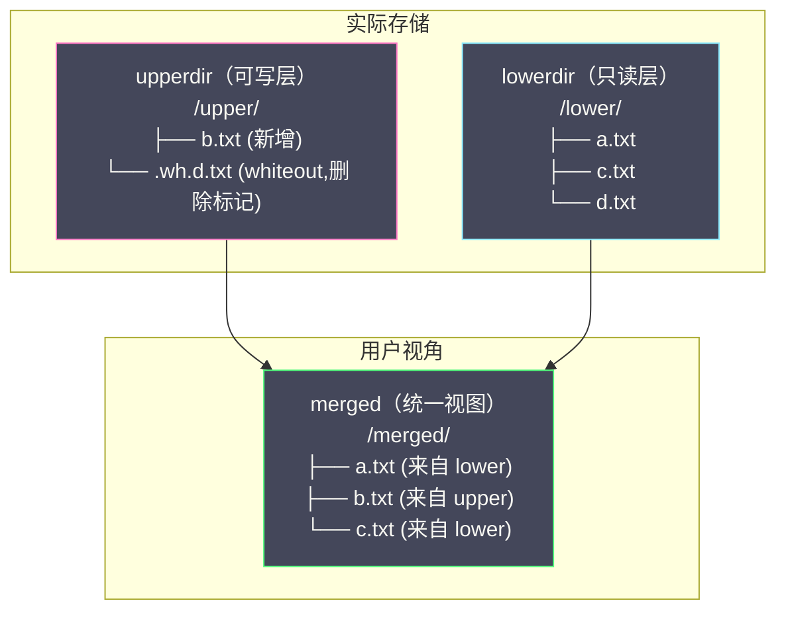
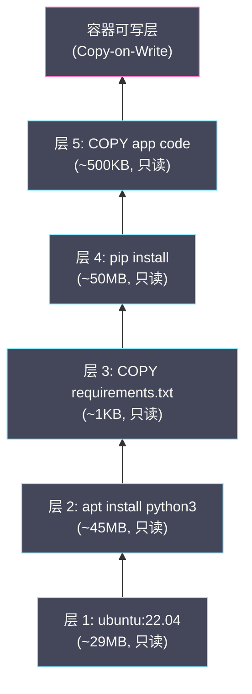
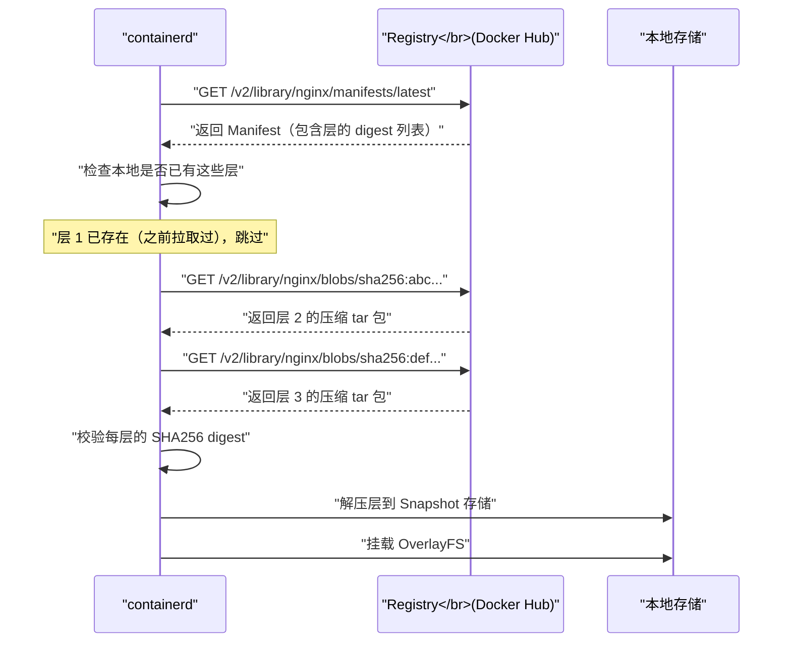

# 04 UnionFS 与容器镜像原理

**摘要：**

前两篇文章分别解决了容器的"视图隔离"（[[02 Linux Namespace 深度解析|Namespace]]）和"资源限制"（[[03 Cgroups 资源限制与控制|Cgroups]]）。但一个容器要运行，还需要一个**独立的文件系统**——容器中的 `/usr/bin/python`、`/etc/nginx/nginx.conf`、`/app/server.jar` 从哪里来？答案是**容器镜像**。容器镜像是一个精心设计的**分层文件系统包**，它的核心技术基础是 **UnionFS（联合文件系统）**——一种能够将多个目录"叠加"为一个统一视图的文件系统。本文从"为什么容器需要自己的文件系统"出发，深入解析 UnionFS 的设计思想，重点剖析 Linux 内核中主流实现 **OverlayFS** 的工作机制（lowerdir / upperdir / merged / whiteout），然后回到容器镜像本身——它的分层结构、内容寻址、构建过程（Dockerfile 每条指令如何生成一层）和分发机制（Registry 拉取流程），最后讨论镜像在 [[Kubernetes]] 节点上的存储与共享。

---

## 第 1 章 为什么容器需要独立的文件系统

### 1.1 从 rootfs 说起

在 [[01 容器的本质——从进程隔离到 OCI 标准]] 中，我们手动构建"容器"时的关键步骤之一是 `pivot_root`——将容器进程的根目录切换到一个预先准备好的目录。这个目录就是容器的 **rootfs（根文件系统）**，它包含了容器运行所需的一切：操作系统的基础工具（`/bin`、`/usr`）、系统库（`/lib`）、配置文件（`/etc`）、以及应用本身。

为什么不能直接使用宿主机的文件系统？

**原因一：环境一致性**。容器的核心价值之一是"在我的机器上能跑，在任何机器上都能跑"。如果容器直接使用宿主机的文件系统，容器的行为就依赖于宿主机上安装了什么库、什么版本——这正是容器要消灭的问题。

**原因二：文件系统隔离**。容器 A 的应用需要 Python 3.8，容器 B 需要 Python 3.11。如果共享宿主机的 `/usr/bin/python3`，只能有一个版本。独立的 rootfs 让每个容器拥有自己的 Python 版本。

**原因三：安全隔离**。容器的 rootfs 是一个受控的环境——只包含应用需要的文件，不包含宿主机上的敏感配置（如 `/etc/shadow`、SSH 密钥、其他应用的数据）。

### 1.2 朴素方案的问题

最简单的方案是为每个容器**完整复制**一份 rootfs。假设一个基于 Ubuntu 22.04 的 rootfs 大约 80MB，一台机器上运行 100 个基于同一镜像的容器，就需要 8GB 的磁盘空间存储 100 份完全相同的文件。而且每次创建容器都需要复制 80MB 的文件，启动时间会显著增加。

更聪明的方案是**共享只读的基础层，只为每个容器维护独有的变更**。假设 100 个容器都基于 Ubuntu 22.04，它们共享同一份 80MB 的只读基础层，每个容器只需要存储自己的修改（比如创建了一个 10KB 的配置文件）——总存储 = 80MB + 100 × 10KB ≈ 81MB，比完整复制节省了 99%。

这就是 **UnionFS（联合文件系统）** 的核心思想。

---

## 第 2 章 UnionFS 的设计思想

### 2.1 什么是联合挂载

**UnionFS（Union File System）** 是一类文件系统的统称——它们的共同特性是能够将多个目录（称为"分支"或"层"）**叠加（union）** 为一个统一的目录视图。用户看到的是一个普通的目录树，但底层实际上由多个目录组合而成。

用日常经验来类比：想象一叠透明胶片，每张胶片上画了一些图案。将它们叠在一起，从上往下看，你看到的是所有胶片图案的"叠加"效果。上面胶片的图案会遮挡下面相同位置的图案。这就是 UnionFS 的工作方式——多个目录层层叠加，上层的文件覆盖下层的同名文件。

### 2.2 UnionFS 的演进

| 技术 | 时间 | 特点 |
| :--- | :--- | :--- |
| **UnionFS** | 2004 | Stony Brook University 开发，概念验证 |
| **AUFS** | 2006 | Advanced UnionFS，功能完善，Docker 早期使用 |
| **OverlayFS** | 2014 (Linux 3.18) | 合入 Linux 内核主线，成为标准 |
| **Overlay2** | 2016 (Linux 4.0) | 优化的 OverlayFS，Docker 当前默认 |

**AUFS** 是 Docker 最初使用的联合文件系统，功能强大但从未被合入 Linux 内核主线（只有 Ubuntu/Debian 打了补丁支持），这限制了 Docker 在其他发行版上的可用性。

**OverlayFS** 在 Linux 3.18 合入内核主线，成为内核原生支持的联合文件系统。Docker 从 1.12 开始支持 OverlayFS，从 CE 18.06 开始将 **overlay2** 作为默认存储驱动。overlay2 是 OverlayFS 在 Docker 中的驱动实现，相比初版 overlay 驱动支持多层直接叠加（不需要硬链接），更高效也更稳定。

---

## 第 3 章 OverlayFS 深度解析

### 3.1 核心概念

OverlayFS 将两个目录叠加为一个统一视图，涉及四个关键概念：

| 概念 | 角色 | 读写属性 |
| :--- | :--- | :--- |
| **lowerdir** | 下层目录，提供基础文件 | **只读** |
| **upperdir** | 上层目录，存储变更（新增、修改、删除）| **可读写** |
| **merged** | 合并后的统一视图，用户实际看到的目录 | 读写（写入到 upperdir）|
| **workdir** | OverlayFS 内部使用的工作目录 | 内部使用 |



挂载 OverlayFS 的命令：

```bash
mount -t overlay overlay \
    -o lowerdir=/lower,upperdir=/upper,workdir=/work \
    /merged
```

### 3.2 读操作

当用户从 merged 目录读取文件时，OverlayFS 按以下优先级查找：

1. **先查 upperdir**：如果 upperdir 中存在该文件，直接返回 upperdir 的版本
2. **再查 lowerdir**：如果 upperdir 中不存在，从 lowerdir 返回

由于 upperdir 的优先级高于 lowerdir，如果两个目录中都存在同名文件，用户看到的是 upperdir 的版本——**上层覆盖下层**。

### 3.3 写操作（Copy-on-Write）

OverlayFS 的写操作遵循 **CoW（Copy-on-Write，写时复制）** 策略：

**新建文件**：直接在 upperdir 中创建，不影响 lowerdir。

**修改 lowerdir 中的文件**：由于 lowerdir 是只读的，OverlayFS 不能直接修改它。当用户第一次写入一个来自 lowerdir 的文件时，OverlayFS 先将该文件**完整复制**到 upperdir，然后在 upperdir 的副本上进行修改。后续对该文件的读写都直接操作 upperdir 的副本。

这就是"Copy-on-Write"的含义——只在写入时才复制，读取时不复制。如果一个 lowerdir 中的文件从未被修改，它在 upperdir 中不会有副本，不占用额外空间。

> [!warning] Copy-on-Write 的性能代价
> 第一次修改一个 lowerdir 中的大文件时，需要完整复制该文件到 upperdir——这个操作可能很慢（如复制一个 100MB 的数据库文件）。后续的读写操作不受影响（已经在 upperdir 中了）。这意味着对容器中大文件的第一次写入可能有明显的延迟尖峰。在数据库容器中，数据文件应该存放在 Volume（绕过 OverlayFS）中而不是容器的文件系统层中。

### 3.4 删除操作（Whiteout 文件）

删除一个来自 lowerdir 的文件是一个有趣的问题——lowerdir 是只读的，不能直接删除其中的文件。OverlayFS 通过 **Whiteout 文件**来实现"逻辑删除"：

当用户删除一个来自 lowerdir 的文件（如 `d.txt`）时，OverlayFS 在 upperdir 中创建一个特殊的 **Whiteout 文件**——一个字符设备文件 `.wh.d.txt`（以 `.wh.` 为前缀）。当 OverlayFS 在 merged 视图中看到一个 Whiteout 文件时，它会**隐藏** lowerdir 中对应的文件——用户看不到 `d.txt` 了，就好像它被删除了一样。

```bash
# lowerdir 中有 d.txt
ls /lower/
# a.txt  c.txt  d.txt

# 在 merged 中删除 d.txt
rm /merged/d.txt

# lowerdir 不变（只读）
ls /lower/
# a.txt  c.txt  d.txt   ← 仍然存在

# upperdir 中出现 Whiteout 文件
ls -la /upper/
# c--------- 1 root root 0, 0  .wh.d.txt   ← Whiteout 标记

# merged 中 d.txt 已不可见
ls /merged/
# a.txt  c.txt   ← d.txt 被 Whiteout 隐藏
```

删除一个目录也类似——创建一个 **Opaque Whiteout**（`.wh..wh..opq` 文件）标记整个目录被"删除"。

### 3.5 多层 lowerdir

OverlayFS 支持将多个目录作为 lowerdir，用冒号分隔，排列顺序决定优先级（左侧优先）：

```bash
mount -t overlay overlay \
    -o lowerdir=/layer3:/layer2:/layer1,upperdir=/upper,workdir=/work \
    /merged
# 优先级：upper > layer3 > layer2 > layer1
```

这正是容器镜像多层叠加的基础——每个镜像层对应一个 lowerdir，容器的可写层对应 upperdir。

---

## 第 4 章 容器镜像的分层结构

### 4.1 镜像层与 Dockerfile 的关系

每条 Dockerfile 指令（`FROM`、`RUN`、`COPY`、`ADD`）都会在镜像中产生一个新的**层（Layer）**。每一层记录了该指令对文件系统造成的**增量变更**（新增了哪些文件、修改了哪些文件、删除了哪些文件）。

```dockerfile
FROM ubuntu:22.04           # 层 1：Ubuntu 基础文件系统（~29MB）
RUN apt-get update && \
    apt-get install -y python3  # 层 2：安装 Python3（~45MB）
COPY requirements.txt /app/     # 层 3：复制 requirements.txt（~1KB）
RUN pip install -r /app/requirements.txt  # 层 4：安装 Python 依赖（~50MB）
COPY . /app/                    # 层 5：复制应用代码（~500KB）
CMD ["python3", "/app/main.py"]  # 不产生新层（只是元数据）
```



当容器运行时，这些层通过 OverlayFS 叠加：
- 层 1~5 作为 **lowerdir**（只读）
- 容器的可写层作为 **upperdir**
- 用户看到的 merged 视图就是容器的根文件系统

### 4.2 层共享与复用

镜像分层的最大工程价值在于**层共享**。考虑以下场景：

```
镜像 A（Python Web 应用）：
  层 1: ubuntu:22.04
  层 2: python3
  层 3: Flask + Gunicorn
  层 4: App A 代码

镜像 B（Python 数据处理应用）：
  层 1: ubuntu:22.04      ← 与镜像 A 共享
  层 2: python3            ← 与镜像 A 共享
  层 3: Pandas + NumPy
  层 4: App B 代码
```

镜像 A 和 B 共享了层 1 和层 2——在磁盘上只存储一份。当拉取镜像 B 时，如果层 1 和层 2 已经存在（因为之前拉取了镜像 A），只需要下载层 3 和层 4。

这种共享在 [[Kubernetes]] 节点上的效果更加显著——一个节点上可能运行几十个 Pod，它们的镜像大量共享基础层。如果没有分层共享，每个镜像都完整存储，磁盘空间会迅速耗尽。

### 4.3 内容寻址（Content-Addressable Storage）

在 [[01 容器的本质——从进程隔离到 OCI 标准]] 中提到过，OCI 镜像中的每个对象由其 **SHA256 哈希值**唯一标识。这种设计叫做**内容寻址存储（Content-Addressable Storage，CAS）**——对象的"名字"就是其内容的哈希值。

```bash
# 查看镜像的层信息
docker inspect nginx:latest --format='{{json .RootFS}}'
# {
#   "Type": "layers",
#   "Layers": [
#     "sha256:a3ed95caeb02ffe68cdd9fd84406680ae93d633cb16422d00e8a7c22955b46d4",
#     "sha256:1b43f53f679e2f5db2a0c0bb1c2a0f3e6e5d5e2a1f2d3c4b5a6b7c8d9e0f1a2",
#     "sha256:..."
#   ]
# }
```

内容寻址带来三个关键优势：

**天然去重**：两个镜像如果某一层的内容完全相同，它们的 SHA256 哈希值必然相同——存储系统只需存储一份。

**防篡改**：从 Registry 拉取镜像层时，校验下载内容的 SHA256 是否与预期一致。任何篡改都会导致哈希值不匹配。

**缓存友好**：构建镜像时，如果某一层的输入没有变化（Dockerfile 指令和上下文文件未改变），构建器可以直接复用缓存的层，不需要重新执行。

### 4.4 Dockerfile 构建缓存

Docker 构建镜像时会为每一层检查缓存——如果之前构建过相同的层（相同的 Dockerfile 指令 + 相同的输入文件），直接复用缓存的层，不需要重新执行。

缓存的判断逻辑：
- `FROM`：基础镜像的 digest 是否一致
- `RUN`：指令字符串是否完全一致（注意：`RUN apt-get update` 的内容可能随时间变化，但 Docker 只看指令字符串）
- `COPY` / `ADD`：被复制的文件内容（的哈希值）是否一致

**缓存失效是链式的**：如果第 3 层缓存失效，第 4、5 层也必须重新构建——因为上层的内容可能依赖下层。这就是为什么 **Dockerfile 中应该将变化频率低的指令放在前面，变化频率高的指令放在后面**：

```dockerfile
# ✅ 好的实践：先安装依赖（变化少），后复制代码（变化多）
FROM python:3.11-slim
COPY requirements.txt .        # 只有依赖变化时才失效
RUN pip install -r requirements.txt
COPY . /app                    # 代码每次都变，但只影响最后一层

# ❌ 差的实践：先复制代码（每次都变），导致后续层全部重建
FROM python:3.11-slim
COPY . /app                    # 代码一变，后面全部重建
RUN pip install -r /app/requirements.txt  # 每次都重新安装依赖
```

---

## 第 5 章 镜像的分发与拉取

### 5.1 Registry 与镜像分发

容器镜像通过 **Registry（镜像仓库）** 进行分发。Registry 是一个 HTTP 服务，实现了 OCI Distribution Specification 定义的 API。Docker Hub 是最大的公共 Registry，企业内部通常部署私有 Registry（如 Harbor）。

### 5.2 镜像拉取的完整流程

当执行 `docker pull nginx:latest` 或 containerd 为 [[Kubernetes]] Pod 拉取镜像时，流程如下：



**关键优化点**：

**层级去重**：客户端先获取 Manifest（包含所有层的 digest），然后检查本地存储中是否已有这些层。已存在的层不需要重新下载——这大幅减少了网络传输量。

**并行下载**：多个层可以并行下载，进一步加速拉取。

**压缩传输**：层在传输时是 gzip 压缩的（或 zstd 压缩），减少带宽占用。下载后在本地解压。

### 5.3 containerd 的 Snapshot 机制

containerd 使用 **Snapshotter** 来管理镜像层在本地的存储。Snapshotter 是 containerd 的存储抽象层——不同的 Snapshotter 对应不同的存储驱动（overlayfs、btrfs、zfs 等）。

默认的 **overlayfs Snapshotter** 的工作方式：

1. 每拉取一层，解压到一个独立的目录（称为 snapshot）
2. 创建容器时，将所有层的 snapshot 目录作为 OverlayFS 的 lowerdir 叠加
3. 创建一个空的 upperdir 作为容器的可写层
4. 挂载 OverlayFS 到 merged 目录，作为容器的 rootfs

```bash
# containerd 在本地的存储布局（简化）
/var/lib/containerd/io.containerd.snapshotter.v1.overlayfs/
├── snapshots/
│   ├── 1/fs/     # 层 1 的文件内容
│   ├── 2/fs/     # 层 2 的文件内容
│   ├── 3/fs/     # 层 3 的文件内容
│   └── 4/fs/     # 容器的可写层（upperdir）
└── metadata.db   # 层与层之间的关系（Bolt 数据库）
```

---

## 第 6 章 容器存储的工程实践

### 6.1 容器可写层 vs Volume

容器运行时的文件写入有两种去向：

**容器可写层（OverlayFS upperdir）**：默认行为。写入的数据随容器删除而消失。受 Copy-on-Write 影响，首次修改大文件有性能代价。适合临时文件（如日志、缓存）。

**Volume（卷）**：通过 `docker run -v /host/path:/container/path` 或 Kubernetes PersistentVolume 挂载。写入直接到宿主机文件系统或外部存储，**绕过 OverlayFS**。数据持久化，不随容器删除而消失。无 Copy-on-Write 开销。适合数据库、用户上传文件等需要持久化的数据。

> [!warning] 生产避坑
> **永远不要将数据库的数据文件存放在容器的可写层中**。理由有三：（1）容器删除后数据丢失；（2）Copy-on-Write 对随机写入性能有负面影响；（3）OverlayFS 的某些操作（如 `rename` 跨层）有兼容性问题。数据库容器（MySQL、PostgreSQL、Redis）必须使用 Volume 或 [[Kubernetes]] PersistentVolume。

### 6.2 镜像大小优化

镜像大小直接影响拉取速度和存储成本。常见的优化策略：

**使用小基础镜像**：`alpine`（~5MB）vs `ubuntu`（~29MB）vs `debian`（~50MB）。Alpine 使用 musl libc 而非 glibc，可能导致某些 C 扩展的兼容性问题——需要权衡。

**多阶段构建（Multi-stage Build）**：

```dockerfile
# 阶段 1：构建（需要编译工具，镜像大）
FROM golang:1.22 AS builder
COPY . /src
RUN cd /src && go build -o /app

# 阶段 2：运行（只需要二进制文件，镜像小）
FROM alpine:3.19
COPY --from=builder /app /app
CMD ["/app"]
# 最终镜像只有 alpine + 编译好的二进制，不包含 Go 编译器
```

**合并 RUN 指令**：每个 `RUN` 指令创建一层。如果一个 `RUN` 安装了 100MB 的编译工具，下一个 `RUN` 删除了它们——由于分层的特性，100MB 仍然存在于第一层中（删除操作只在上层创建 Whiteout 文件，不会减少镜像大小）。应该在同一个 `RUN` 中安装、使用和清理。

```dockerfile
# ❌ 差：两层，100MB 编译工具永远在第一层中
RUN apt-get install -y build-essential
RUN make && apt-get remove -y build-essential

# ✅ 好：一层，编译工具安装后在同一层中被清除
RUN apt-get install -y build-essential && \
    make && \
    apt-get remove -y build-essential && \
    rm -rf /var/lib/apt/lists/*
```

### 6.3 镜像在 Kubernetes 节点上的管理

[[Kubernetes]] 节点上的镜像管理需要关注以下问题：

**磁盘空间**：kubelet 的 **Image GC（垃圾回收）** 会在节点磁盘使用率超过阈值时自动清理不再使用的镜像。`imageGCHighThresholdPercent`（默认 85%）触发清理，`imageGCLowThresholdPercent`（默认 80%）停止清理。

**拉取策略**：Pod 的 `imagePullPolicy` 控制何时拉取镜像：
- `Always`：每次创建 Pod 都检查 Registry 是否有更新（对 `:latest` 标签自动使用此策略）
- `IfNotPresent`：本地有就用本地的（对带版本号标签的默认策略）
- `Never`：只使用本地镜像，不从 Registry 拉取

**预热（Pre-pulling）**：在大规模部署中，同时启动数百个 Pod 可能导致所有节点同时从 Registry 拉取镜像，形成带宽瓶颈。可以通过 DaemonSet 提前将镜像分发到所有节点。

---

## 第 7 章 总结

本文系统梳理了容器文件系统和镜像的完整技术链：

- **UnionFS 的核心思想**：多层只读目录 + 一个可写层 = 统一的文件系统视图
- **OverlayFS 的工作机制**：lowerdir（只读基础）、upperdir（可写变更）、merged（统一视图）、Whiteout（逻辑删除）、Copy-on-Write（写时复制）
- **容器镜像的分层结构**：Dockerfile 每条指令生成一层，层通过 SHA256 内容寻址实现去重和防篡改
- **镜像分发**：Registry API、按层去重下载、并行拉取
- **工程实践**：数据库必须使用 Volume、多阶段构建减小镜像、合并 RUN 指令避免层膨胀

下一篇 [[05 容器网络原理]] 将深入容器网络——veth pair、Linux Bridge、Docker Bridge 网络模型，以及 CNI 接口规范。

---

## 参考资料

1. Linux Kernel Documentation - OverlayFS：https://www.kernel.org/doc/html/latest/filesystems/overlayfs.html
2. OCI Image Specification：https://github.com/opencontainers/image-spec
3. OCI Distribution Specification：https://github.com/opencontainers/distribution-spec
4. containerd Snapshotter Design：https://github.com/containerd/containerd/blob/main/docs/snapshotters/README.md
5. Docker Documentation - Storage Drivers：https://docs.docker.com/storage/storagedriver/
6. Docker Documentation - Multi-stage Builds：https://docs.docker.com/build/building/multi-stage/
7. Kubernetes Documentation - Images：https://kubernetes.io/docs/concepts/containers/images/
