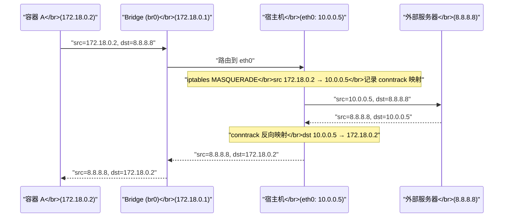
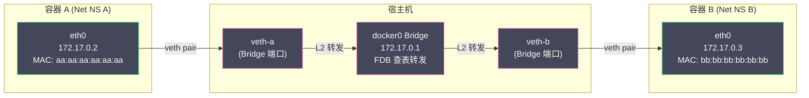

# 05 容器网络原理

**摘要：**

前几篇文章构建了容器的三大支柱：[[02 Linux Namespace 深度解析|Namespace]] 提供视图隔离、[[03 Cgroups 资源限制与控制|Cgroups]] 限制资源使用、[[04 UnionFS 与容器镜像原理|UnionFS]] 提供独立的文件系统。但一个完整的容器还需要**网络**——容器如何拥有独立的 IP 地址？容器之间如何通信？容器如何访问外部网络？外部请求如何到达容器？这些问题的答案都建立在 [[Linux Namespace]] 中的 **Network Namespace** 之上，但仅有 Network Namespace 远远不够——新创建的 Network Namespace 是一个"孤岛"，没有任何网络连接。本文从 Network Namespace 的"孤岛"状态出发，逐步引入 **veth pair**（虚拟以太网对）、**Linux Bridge**（虚拟交换机）、**iptables/NAT**（网络地址转换）等 Linux 网络原语，完整还原 Docker Bridge 网络的数据包转发路径，然后介绍 Docker 的四种网络模式，最后引出 **CNI（Container Network Interface）** 规范——[[Kubernetes]] 容器网络的标准接口——为后续 K8s 网络专栏奠定基础。

---

## 第 1 章 容器网络面临的核心问题

### 1.1 Network Namespace 创造的"孤岛"

在 [[02 Linux Namespace 深度解析]] 中我们了解到，Network Namespace 为容器提供了独立的网络栈：独立的网络接口、IP 地址、端口空间、路由表和 iptables 规则。但新创建的 Network Namespace 内部只有一个未启用的 `lo`（回环）接口——**没有任何与外部世界的连接**。

```bash
# 创建一个新的 Network Namespace
ip netns add test-ns

# 查看其中的网络接口——只有 lo，且状态为 DOWN
ip netns exec test-ns ip link show
# 1: lo: <LOOPBACK> mtu 65536 qdisc noop state DOWN
#    link/loopback 00:00:00:00:00:00 brd 00:00:00:00:00:00

# 尝试 ping 任何地址——失败，因为没有网络连接
ip netns exec test-ns ping 8.8.8.8
# connect: Network is unreachable
```

这就像建了一间密封的房间——里面有完整的房间设施（网络栈），但没有门窗（网络接口连接外部）。容器网络要解决的核心问题就是：**如何为这个"密封的房间"开一扇门，让它与外界通信？**

### 1.2 容器网络需要解决的四个问题

| 问题 | 描述 | 解决方案 |
| :--- | :--- | :--- |
| **容器与宿主机通信** | 容器需要访问宿主机上的服务 | veth pair 连接两个 Namespace |
| **同一宿主机上容器间通信** | 同一台机器上的容器 A 需要访问容器 B | Linux Bridge 作为虚拟交换机 |
| **容器访问外部网络** | 容器需要访问互联网（如拉取依赖包）| iptables MASQUERADE（SNAT）|
| **外部访问容器** | 用户需要通过宿主机 IP 访问容器中的服务 | iptables DNAT（端口映射）|

接下来我们逐一解决这四个问题，每一步都建立在前一步的基础之上。

---

## 第 2 章 veth pair：连接两个网络世界的"管道"

### 2.1 什么是 veth pair

**veth pair（Virtual Ethernet Pair）** 是 Linux 内核提供的一种虚拟网络设备——它**总是成对创建**，像一根两端分别插在不同地方的"虚拟网线"。从一端发送的数据包会立即出现在另一端，反之亦然。

veth pair 的关键特性：

- **成对出现**：创建时同时生成两个接口（如 `veth0` 和 `veth1`），销毁一端另一端也自动销毁
- **跨 Namespace**：两端可以分别放置在不同的 Network Namespace 中
- **二层设备**：工作在数据链路层（L2），像一根以太网线一样传输以太网帧

### 2.2 用 veth pair 连接容器与宿主机

```bash
# 第 1 步：创建 Network Namespace（模拟容器）
ip netns add container1

# 第 2 步：创建 veth pair
ip link add veth-host type veth peer name veth-c1

# 第 3 步：将一端移入容器的 Namespace
ip link set veth-c1 netns container1

# 第 4 步：配置宿主机端
ip addr add 172.18.0.1/24 dev veth-host
ip link set veth-host up

# 第 5 步：配置容器端
ip netns exec container1 ip addr add 172.18.0.2/24 dev veth-c1
ip netns exec container1 ip link set veth-c1 up
ip netns exec container1 ip link set lo up

# 第 6 步：验证连通性
ip netns exec container1 ping 172.18.0.1   # 容器 → 宿主机 ✅
ping 172.18.0.2                              # 宿主机 → 容器 ✅
```

此时容器与宿主机之间通过 veth pair 实现了**点对点通信**。但如果有多个容器，每个容器都需要一对 veth 连接到宿主机——宿主机上会出现大量 veth 接口，而且容器之间的通信需要经过宿主机的路由，效率不高。我们需要一个"虚拟交换机"来集中管理这些连接。

---

## 第 3 章 Linux Bridge：虚拟交换机

### 3.1 什么是 Linux Bridge

**Linux Bridge** 是 Linux 内核内置的虚拟交换机（L2 Switch）。它的工作原理与物理交换机相同——学习连接在其上的设备的 MAC 地址，根据目标 MAC 地址将以太网帧转发到正确的端口。

把 veth pair 和 Bridge 组合起来，就能构建一个多容器共享的虚拟网络：

```
                    宿主机
                    ┌──────────────────────────────────┐
                    │                                  │
                    │   ┌──────────┐                   │
                    │   │  Bridge  │ (docker0)         │
                    │   │172.17.0.1│                   │
                    │   └──┬───┬──┘                   │
                    │      │   │                       │
                    │  veth-a veth-b                    │
                    │      │   │                       │
                    └──────┼───┼───────────────────────┘
                           │   │
              ┌────────────┘   └────────────┐
              │                             │
    ┌─────────┴──────────┐    ┌─────────────┴────────┐
    │   容器 A            │    │   容器 B              │
    │   eth0: 172.17.0.2  │    │   eth0: 172.17.0.3   │
    │   (Network NS A)    │    │   (Network NS B)     │
    └────────────────────┘    └──────────────────────┘
```

每个容器有一对 veth：一端在容器内部（命名为 `eth0`），另一端连接到宿主机上的 Bridge（`docker0`）。Bridge 就像一个交换机——容器 A 发往容器 B 的数据包经过 Bridge 的 MAC 地址学习和转发，直接到达容器 B，不需要经过 IP 路由。

### 3.2 手动构建 Bridge 网络

```bash
# 第 1 步：创建 Bridge
ip link add br0 type bridge
ip addr add 172.18.0.1/24 dev br0
ip link set br0 up

# 第 2 步：创建容器 A
ip netns add containerA
ip link add veth-a-host type veth peer name veth-a-c
ip link set veth-a-c netns containerA
ip link set veth-a-host master br0   # 将宿主机端"插入"Bridge
ip link set veth-a-host up
ip netns exec containerA ip addr add 172.18.0.2/24 dev veth-a-c
ip netns exec containerA ip link set veth-a-c up
ip netns exec containerA ip link set lo up
ip netns exec containerA ip route add default via 172.18.0.1  # 默认网关指向 Bridge

# 第 3 步：创建容器 B（同理）
ip netns add containerB
ip link add veth-b-host type veth peer name veth-b-c
ip link set veth-b-c netns containerB
ip link set veth-b-host master br0
ip link set veth-b-host up
ip netns exec containerB ip addr add 172.18.0.3/24 dev veth-b-c
ip netns exec containerB ip link set veth-b-c up
ip netns exec containerB ip link set lo up
ip netns exec containerB ip route add default via 172.18.0.1

# 第 4 步：验证容器间通信
ip netns exec containerA ping 172.18.0.3   # A → B ✅
ip netns exec containerB ping 172.18.0.2   # B → A ✅
```

### 3.3 Bridge 的 MAC 地址学习

Linux Bridge 内部维护一个 **FDB（Forwarding Database）**——MAC 地址到端口的映射表。当 Bridge 收到一个以太网帧时：

1. **学习源 MAC**：记录"来自这个端口的设备的 MAC 地址是 X"
2. **查找目标 MAC**：在 FDB 中查找目标 MAC 地址对应的端口
3. **转发或泛洪**：如果找到了目标端口，将帧直接转发到该端口；如果没找到（未知单播）或者目标是广播/多播地址，将帧泛洪到所有端口（除了来源端口）

```bash
# 查看 Bridge 的 MAC 地址表
bridge fdb show dev br0
# 52:54:00:12:34:56 dev veth-a-host master br0
# 52:54:00:78:9a:bc dev veth-b-host master br0
```

这个工作原理与物理交换机完全一致——Linux Bridge 就是一个软件实现的 L2 交换机。

---

## 第 4 章 iptables 与 NAT：容器的外网通信

### 4.1 问题：容器如何访问外部网络

上一节我们实现了同一宿主机上容器之间的通信。但容器（如 172.18.0.2）发出的数据包如果目标是外部网络（如 8.8.8.8），路由器不认识 172.18.0.0/24 这个私有网段——数据包会被丢弃。

解决方案是 **SNAT（Source Network Address Translation）**——将容器发出的数据包的源 IP 地址替换为宿主机的外部 IP 地址。外部网络看到的是来自宿主机的请求，回复也发送给宿主机，宿主机再将回复转发给对应的容器。

### 4.2 iptables MASQUERADE

Linux 的 [[iptables]] 是内核级的包过滤和 NAT 框架。Docker 使用 iptables 的 `MASQUERADE` 规则实现 SNAT：

```bash
# 启用 IP 转发（宿主机作为路由器）
echo 1 > /proc/sys/net/ipv4/ip_forward

# 添加 MASQUERADE 规则：从 br0 网段出去的流量做源地址替换
iptables -t nat -A POSTROUTING -s 172.18.0.0/24 ! -o br0 -j MASQUERADE
```

**MASQUERADE** 的工作过程：



**关键组件：conntrack（连接跟踪）**。内核的 conntrack 模块记录了每个 NAT 转换的映射关系——"容器 172.18.0.2:12345 → 宿主机 10.0.0.5:54321 → 目标 8.8.8.8:443"。当回复数据包到达宿主机时，conntrack 根据映射表将目标地址从 10.0.0.5 转换回 172.18.0.2，并将数据包转发给容器。

### 4.3 端口映射：外部访问容器

容器默认只能"主动出去"（通过 SNAT），外部无法"主动进来"——因为外部网络不知道 172.18.0.2 这个地址。要让外部访问容器中的服务，需要 **DNAT（Destination NAT）**——将宿主机特定端口上的流量转发到容器的端口。

这就是 `docker run -p 8080:80` 的原理——将宿主机的 8080 端口映射到容器的 80 端口：

```bash
# Docker 自动添加的 iptables DNAT 规则
iptables -t nat -A PREROUTING -p tcp --dport 8080 \
    -j DNAT --to-destination 172.18.0.2:80

# 同时添加 FORWARD 规则允许转发
iptables -A FORWARD -p tcp -d 172.18.0.2 --dport 80 -j ACCEPT
```

外部用户访问 `http://10.0.0.5:8080` 时，iptables 将目标地址从 `10.0.0.5:8080` 转换为 `172.18.0.2:80`，数据包通过路由到达 Bridge，再通过 veth pair 到达容器。

### 4.4 iptables 的性能代价

Docker 的网络模型大量依赖 iptables 规则。当宿主机上运行的容器数量增多时，iptables 规则的数量也线性增长（每个端口映射对应多条规则）。iptables 的规则匹配是**线性扫描**的——每个数据包都需要依次检查所有规则，直到匹配。当规则数量达到数千条时，性能影响显著。

这也是 [[Kubernetes]] 中 kube-proxy 从 iptables 模式迁移到 **IPVS 模式** 的原因之一——IPVS 使用哈希表进行规则匹配，时间复杂度为 O(1)，远优于 iptables 的 O(n)。

> [!info] conntrack 表耗尽
> conntrack 表的大小有上限（默认通常为 65536 或 131072）。在高并发场景下（如每秒数万个新连接），conntrack 表可能被填满——新连接会被丢弃，表现为随机的连接超时。这是容器化环境中一个常见但隐蔽的网络问题。排查方法：`dmesg | grep "nf_conntrack: table full"`。解决方法：增大 `net.netfilter.nf_conntrack_max` 内核参数。

---

## 第 5 章 Docker 的四种网络模式

Docker 提供了四种网络模式，每种对应不同的 Network Namespace 策略：

### 5.1 Bridge 模式（默认）

```bash
docker run --network bridge nginx
```

这就是前面几节详细介绍的模式——每个容器有独立的 Network Namespace，通过 veth pair 连接到 `docker0` Bridge。容器有独立的 IP（如 172.17.0.x），通过 iptables NAT 访问外部网络。

**适用场景**：绝大多数单机容器部署场景。

### 5.2 Host 模式

```bash
docker run --network host nginx
```

容器**不创建独立的 Network Namespace**——直接使用宿主机的网络栈。容器中的进程看到的网络接口、IP 地址、端口空间与宿主机完全一致。

**优势**：没有 veth pair 和 Bridge 的转发开销，也没有 NAT 的性能损耗——网络性能与宿主机上直接运行进程完全一致。

**劣势**：没有网络隔离——容器监听的端口直接占用宿主机的端口空间，不同容器之间会有端口冲突。安全性也较差——容器可以看到宿主机的所有网络流量。

**适用场景**：对网络性能极度敏感且可以接受无网络隔离的场景，如网络监控工具、性能基准测试。

### 5.3 None 模式

```bash
docker run --network none alpine
```

创建独立的 Network Namespace，但**不做任何网络配置**——容器中只有一个未启用的 `lo` 接口，完全没有外部网络连接。

**适用场景**：安全敏感的离线计算、密码学运算等不需要网络的场景，或者用户想完全自定义网络配置。

### 5.4 Container 模式

```bash
docker run --name app1 nginx
docker run --network container:app1 debug-tools
```

新容器加入另一个**已运行容器的 Network Namespace**——两个容器共享 IP 地址和端口空间，可以通过 `localhost` 互相通信。

**这正是 [[Kubernetes]] Pod 网络模型的原型**。K8s 中同一个 Pod 的所有容器共享一个 Network Namespace（由 pause 容器持有），它们共享 IP 地址，可以通过 `localhost` 互相访问——底层实现与 Docker 的 Container 模式完全一致。

---

## 第 6 章 Docker Bridge 网络的完整数据包路径

### 6.1 场景：容器 A 访问容器 B

```
容器 A (172.17.0.2) → 容器 B (172.17.0.3)，同一宿主机
```



**步骤详解**：

1. 容器 A 的应用发送目标为 172.17.0.3 的数据包
2. 容器 A 的内核查路由表——172.17.0.3 在 172.17.0.0/16 网段内，通过 `eth0` 发送
3. 需要知道 172.17.0.3 的 MAC 地址——发送 ARP 请求（广播）
4. ARP 请求通过 veth pair 到达 `docker0` Bridge
5. Bridge 将 ARP 广播泛洪到所有端口——包括连接容器 B 的 veth-b
6. 容器 B 收到 ARP 请求，回复自己的 MAC 地址
7. 容器 A 得到容器 B 的 MAC 地址，构造以太网帧发送
8. 帧通过 veth pair → Bridge（FDB 查表找到 veth-b）→ veth pair → 容器 B

**整个过程是二层（L2）转发**——不需要经过宿主机的 IP 路由和 iptables，性能与物理交换机接近。

### 6.2 场景：容器访问外部网络

```
容器 A (172.17.0.2) → 外部服务器 (203.0.113.50)
```

1. 容器 A 发送目标为 203.0.113.50 的数据包
2. 容器内核查路由表——不在本地网段，发往默认网关 172.17.0.1（docker0 Bridge 的 IP）
3. 数据包通过 veth pair 到达 docker0 Bridge
4. Bridge 将数据包上送到宿主机内核的网络层（因为目标 MAC 是 Bridge 自身的 MAC）
5. 宿主机内核查路由表，决定从 `eth0` 发出
6. **iptables POSTROUTING 链**：MASQUERADE 规则将源地址从 172.17.0.2 替换为宿主机 eth0 的 IP（如 10.0.0.5）
7. **conntrack 记录映射**
8. 数据包从 eth0 发出，目标 203.0.113.50
9. 回复到达宿主机 eth0，conntrack 反向转换目标地址，经 Bridge 和 veth pair 回到容器

### 6.3 场景：外部访问容器（端口映射）

```
外部客户端 (198.51.100.10) → 宿主机 (10.0.0.5:8080) → 容器 (172.17.0.2:80)
```

1. 外部数据包到达宿主机 eth0，目标为 10.0.0.5:8080
2. **iptables PREROUTING 链**：DNAT 规则将目标地址从 10.0.0.5:8080 转换为 172.17.0.2:80
3. 宿主机内核查路由表——172.17.0.2 通过 docker0 可达
4. 数据包发往 docker0 Bridge，再通过 veth pair 到达容器 A
5. 容器 A 的 nginx 处理请求，回复发往 198.51.100.10
6. 回复经 veth pair → Bridge → 宿主机路由 → MASQUERADE → eth0 → 外部

---

## 第 7 章 CNI：Kubernetes 的容器网络标准

### 7.1 为什么需要 CNI

Docker 的网络模型（docker0 Bridge + iptables NAT）适合单机场景，但在**跨主机通信**时面临根本性问题：不同宿主机上的容器使用的是各自的私有 IP 段（172.17.0.0/16），互不可达。Docker 的原生方案（overlay network）需要 VXLAN 封装，增加了复杂性和性能开销。

[[Kubernetes]] 需要一个更灵活、可插拔的网络方案——**CNI（Container Network Interface）** 应运而生。

### 7.2 CNI 的设计

**CNI** 是 CNCF 制定的容器网络标准接口。它的设计极简——只定义了两个操作：

- **ADD**：为容器配置网络（创建 veth pair、分配 IP、设置路由）
- **DEL**：清理容器的网络配置

CNI 插件是一个**可执行的二进制文件**——kubelet 在创建 Pod 时调用 CNI 插件的 ADD 操作，在删除 Pod 时调用 DEL 操作。不同的 CNI 插件实现不同的网络拓扑：

| CNI 插件 | 网络模型 | 特点 |
| :--- | :--- | :--- |
| **Flannel** | VXLAN overlay / host-gw | 简单易用，适合小规模集群 |
| **Calico** | BGP 路由 / VXLAN | 高性能，支持 NetworkPolicy |
| **Cilium** | eBPF 数据平面 | 高性能，绕过 iptables，可观测性强 |
| **Weave** | 用户态 overlay | 自动发现，适合开发环境 |

### 7.3 Kubernetes 的网络模型

[[Kubernetes]] 对 Pod 网络有三条基本规则：

1. **每个 Pod 有一个唯一的 IP 地址**
2. **所有 Pod 可以直接通过 IP 互相通信**（无论是否在同一节点），不需要 NAT
3. **Pod 看到的自己的 IP 和别人看到的它的 IP 是一致的**

这三条规则的本质是：**Kubernetes 要求一个扁平的、无 NAT 的 Pod 网络**。这与 Docker 默认的 Bridge + NAT 模型截然不同——Docker 的容器 IP 是私有的（需要 NAT 才能被外部访问），而 Kubernetes 要求 Pod IP 全局可路由。

不同的 CNI 插件用不同的方式实现这个模型：

- **Flannel（VXLAN 模式）**：用 VXLAN 隧道封装跨节点的 Pod 流量——将 Pod 的二层以太网帧封装在 UDP 数据包中，通过节点的物理网络传输
- **Calico（BGP 模式）**：每个节点运行 BGP 客户端，将本节点的 Pod 网段通过 BGP 协议广播给其他节点——物理网络路由器直接知道如何路由 Pod IP，不需要隧道封装
- **Cilium（eBPF 模式）**：使用 [[eBPF]] 程序在内核数据路径上直接处理 Pod 网络流量，绕过传统的 iptables/Bridge 栈，性能显著提升

### 7.4 从 Docker 网络到 Kubernetes 网络的本质变化

| 维度 | Docker 默认网络 | Kubernetes 网络 |
| :--- | :--- | :--- |
| **IP 可见性** | 容器 IP 是私有的，外部不可见 | Pod IP 全局可路由 |
| **跨主机通信** | 需要 overlay 或端口映射 | Pod 直接通过 IP 互通 |
| **NAT** | 大量依赖 iptables NAT | 要求无 NAT |
| **网络插件** | Docker 内置 | 通过 CNI 标准接口可插拔 |
| **网络策略** | 无内置支持 | NetworkPolicy API 支持精细的 Pod 间流量控制 |

> [!note] 为什么 K8s 要求无 NAT
> NAT 会导致一系列问题：Pod 看到的自己的 IP 与别人看到的不一致（某些协议如 SIP 依赖 IP 地址一致性）；NAT 增加了排查网络问题的复杂度（抓包看到的源 IP 是 NAT 后的，不是真实来源）；NAT 的 conntrack 表在高并发下可能成为瓶颈。Kubernetes 的无 NAT 设计简化了网络模型，使得 Pod 间通信就像物理网络中的主机间通信一样直观。

---

## 第 8 章 总结与后续

本文完整还原了容器网络的技术链：

- **Network Namespace** 创造了隔离的网络栈，但也创造了"孤岛"
- **veth pair** 在不同 Namespace 之间建立了点对点连接
- **Linux Bridge** 作为虚拟交换机实现了多容器的二层互通
- **iptables MASQUERADE（SNAT）** 使容器能够访问外部网络
- **iptables DNAT** 实现端口映射，使外部能够访问容器服务
- Docker 提供了 Bridge / Host / None / Container 四种网络模式
- **CNI 标准** 将容器网络抽象为可插拔的接口，是 [[Kubernetes]] 网络的基础
- Kubernetes 要求**扁平的、无 NAT 的 Pod 网络**，由不同 CNI 插件（Flannel/Calico/Cilium）实现

下一篇 [[06 容器安全边界与逃逸风险]] 将聚焦容器的安全问题——共享内核的风险、Linux Capabilities 最小权限模型、Seccomp 系统调用过滤和安全容器技术。

---

## 参考资料

1. Linux man pages: `ip-netns(8)`, `ip-link(8)`, `bridge(8)`, `iptables(8)`
2. Docker Documentation - Networking：https://docs.docker.com/network/
3. CNI Specification：https://github.com/containernetworking/cni/blob/main/SPEC.md
4. Kubernetes Documentation - Cluster Networking：https://kubernetes.io/docs/concepts/cluster-administration/networking/
5. Kubernetes Documentation - Network Plugins：https://kubernetes.io/docs/concepts/extend-kubernetes/compute-storage-net/network-plugins/
6. Calico Documentation：https://docs.tigera.io/calico/latest/about/
7. Cilium Documentation：https://docs.cilium.io/
8. James Turnbull (2014). *The Docker Book*. Chapter 6: Docker Networking.
9. Linux Kernel Documentation - Bridge：https://www.kernel.org/doc/html/latest/networking/bridge.html

---

> [!note] 思考题
> 1. Docker 的架构是 Docker CLI → Docker Daemon → containerd → runc。Kubernetes 1.24 移除了对 Docker（dockershim）的直接支持——改为直接使用 containerd 通过 CRI 接口。移除 dockershim 后，Docker build 的镜像是否仍然兼容 Kubernetes（是，因为镜像格式遵循 OCI 标准）？在 Kubernetes 环境中你还需要安装 Docker 吗？
> 2. runc 是 OCI 运行时规范的参考实现——负责创建容器进程（设置 Namespace、CGroups、rootfs）。gVisor（runsc）和 Kata Containers 是替代运行时——gVisor 在用户态实现内核系统调用拦截，Kata 使用轻量级 VM。在多租户环境中（如 FaaS 平台），你会选择哪种运行时来增强隔离？各自的性能开销是多少？
> 3. OCI 规范包括 Image Spec（镜像格式）和 Runtime Spec（运行时行为）。标准化使得不同工具（Docker、Podman、Buildah）构建的镜像可以互通。Podman 是无守护进程（daemonless）的容器工具——与 Docker Daemon 模式相比有什么安全优势？在什么场景下 Podman 替代 Docker 是合理的？
