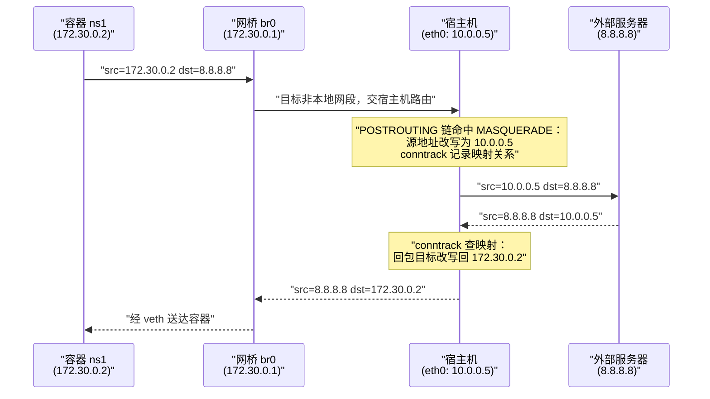
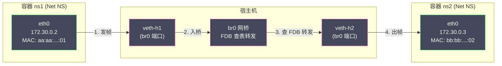

# 05 容器网络原理

**摘要：**

前三篇拼齐了容器的三大支柱——[[02 Linux Namespace 深度解析|Namespace]] 的视图隔离、[[03 Cgroups 资源限制与控制|Cgroups]] 的资源限制、[[04 UnionFS 与容器镜像原理|OverlayFS]] 的独立文件系统——但一个"完整的机器"还差最后一环：**网络**。容器如何拥有独立的 IP？同一台机器上的容器如何互相找到对方？容器如何访问外网、外网又如何访问容器？这些问题的全部机制，都建立在几块 Linux 内核的原生积木之上：Network Namespace 划出隔离的网络栈（[[02 Linux Namespace 深度解析]] 已述），**veth pair** 在隔离世界之间架起虚拟网线，**Linux Bridge** 充当多容器共享的虚拟交换机，**iptables/NAT** 打通容器与外部网络的往来。本文沿"问题清单——逐块积木——完整拼装——规模扩展"的路径展开：先把容器网络的五类通信需求列成清单，再逐一拆解每块积木的原理并配以可复现的手工实验，然后完整推演 Docker Bridge 模型下三类典型流量的逐跳路径，最后进入规模化的部分——跨主机通信为什么需要 overlay 封装、Kubernetes 的三条网络铁律、以及 **CNI**（Container Network Interface）如何把"容器接网"抽象成可插拔的接口。读完全文，你应当能徒手搭出与 Docker 默认网络等价的环境，并能在网络故障时准确说出每一个包走过哪些设备、哪条规则、哪张表。

---

## 第 1 章 从孤岛到互联：容器网络的问题清单

### 1.1 Network Namespace 只负责"分家"

回顾 [[02 Linux Namespace 深度解析]] 的结论：Network Namespace 给每组进程一套完整的独立网络栈——设备、地址、路由表、防火墙规则、端口空间——但新创建的 Namespace 是一张白纸：里面只有一个未启用的 `lo` 回环接口，连不通任何外部世界。`lo` 本身就值得多说半句：它是"进程与自己说话"的通道（`127.0.0.1` 与 localhost 的落点），Kubernetes Pod 内容器能互访 localhost 正是因为它们共享同一个网络栈——同一个 `lo`、同一套端口空间。启动容器时忘记拉起 lo（手工实验的常见翻车点）会让所有"连自己"的行为诡异失败，因为 127.0.0.1 根本没有出口。这个设计必须先立稳一个观念：**Network Namespace 负责"隔离"，不负责"连接"**。分家容易通网难——容器网络工程的全部内容，都在"分家之后如何通网"这半句里。

用一间毛坯房类比：Network Namespace 交付的是"四壁齐全的独立房间"，但房间没有门窗、没有水电管线。容器网络要做的装修有五项，对应五类通信需求：

| 需求 | 场景描述 | 需要的积木 |
| :--- | :--- | :--- |
| **容器 → 宿主机** | 容器访问宿主机上的服务（如宿主机上的 DNS、监控 agent） | veth pair |
| **容器 → 容器（同机）** | 同一宿主机上微服务之间的互调 | veth pair + Linux Bridge |
| **容器 → 外网** | 容器拉取依赖、调用第三方 API | iptables SNAT/MASQUERADE |
| **外网 → 容器** | 用户从外部访问容器发布的服务 | iptables DNAT（端口映射） |
| **容器 → 容器（跨机）** | 分布式服务的跨节点通信 | overlay 封装或路由方案（第 7 章） |

这份清单也是本文的行进路线：第 2、3 章用 veth 与 Bridge 解决前两项，第 4 章用 NAT 解决三四两项，第 6 章把典型流量逐跳推演一遍，第 7 章处理最难的跨机问题。

### 1.2 一个重要的设计哲学：内核积木，而非容器专属

在动手之前还有一个观念要校准：本章出现的一切机制——veth、bridge、iptables、conntrack——**没有一项是为容器发明的**。它们都是 Linux 网络子系统的通用组件，各有各的历史与用途（veth 最初服务于网络栈测试与隧道，bridge 模拟的是物理交换机，NAT 服务于家宽路由器）。容器的贡献是把这些通用积木**以固定的模式组装**：veth 一端进容器、一端插网桥，网桥上再挂一条宿主机路由，NAT 规则按容器网段自动生成——组装模式可以标准化（Docker 的 bridge 网络、CNI 的 bridge 插件），积木本身则完全是内核的原生能力。理解了这一点，排障时的视角就对了：**容器网络问题永远可以在宿主机上用标准网络工具（ip、bridge、iptables、tcpdump）观察和验证，不需要任何"容器专用"的视角**。本章的手工实验全部遵循这个原则。反过来说，"容器网络"这个词组容易让人以为存在一个独立的网络子系统——实际不存在，存在的只是"用通用积木搭出来的固定组装"。**学容器网络的正确姿势，是把它当作 Linux 网络的一次强制复习**：学完容器网络，你对交换、路由、NAT 的理解会比学之前扎实得多，这大概也是它作为面试高频考题之外的真正价值。

---

## 第 2 章 veth pair：连接两个世界的虚拟网线

### 2.1 设备特性

**veth（Virtual Ethernet）pair** 是一种成对出现的虚拟网络设备：创建时同时生成两个接口，从任一端注入的数据包会原样从另一端冒出来，仿佛两块网卡之间插着一根看不见的直通网线。三个特性决定了它在容器网络中的地位：

- **成对与连带**：一端被删除，另一端随之消失——设备的生命周期天然绑定；
- **可跨 Namespace 迁移**：任一端可以用 `ip link set <dev> netns <ns>` 挪进另一个 Network Namespace——迁移后两端分处两个世界，但直通关系不变，这正是"把包送进容器"的物理通道；
- **纯 L2 直通**：它不关心 IP 与路由，只负责以太网帧的搬运——报文进入一端后立即出现在对端的接收队列，不经过任何中间决策。

有人会问：为什么不给容器直接分配物理网卡（SR-IOV 之类），而要用 veth 这种"软件网线"？答案是密度与成本的权衡——物理网卡与虚拟功能（VF）的数量受硬件上限约束（几十个量级），而 veth 的创建是纯内存操作，单机数千个容器每个都能有一条；veth 的性能损耗对绝大多数业务无感，只有极致性能场景才值得动用 SR-IOV/DPDK 这类硬件直通方案（那些方案也代价不菲：牺牲热迁移、牺牲灵活的 CNI 集成）。**"软件网线够用，硬件直通补位"**——这个分工与容器在隔离谱系上的定位一致。

veth 解决的是"连通"问题，但两个容器之间如果都用直连 veth，N 个容器需要 N×(N-1)/2 条网线——这不是网络，是意大利面。多容器互联需要一台"交换机"，那是第 3 章 Bridge 的角色；本章先把"网线"摸透。

### 2.2 手工实验：给容器接上网线

用 veth 连接两个 Network Namespace 的完整过程，就是容器启动时网络配置的雏形：

```bash
# 1. 创建网络命名空间（模拟容器）
ip netns add ns1

# 2. 创建一对 veth
ip link add veth-host type veth peer name veth-ns1

# 3. 把一端挪进 ns1（迁移后，宿主机上 veth-ns1 "消失"，
#    只在 ns1 内可见——它没有消失，只是换了视图）
ip link set veth-ns1 netns ns1

# 4. 宿主机端配置地址并启用
ip addr add 172.30.0.1/24 dev veth-host
ip link set veth-host up

# 5. 容器端配置地址、启用接口与回环
ip netns exec ns1 ip addr add 172.30.0.2/24 dev veth-ns1
ip netns exec ns1 ip link set veth-ns1 up
ip netns exec ns1 ip link set lo up

# 6. 双向验证
ip netns exec ns1 ping -c1 172.30.0.1   # 容器 → 宿主机，通
ping -c1 172.30.0.2                      # 宿主机 → 容器，通
```

值得在实验里确认两个细节。其一，**容器内的网卡名是任意的**——运行时创建 veth 后，把容器那一端重命名为 `eth0`，让容器内的应用看到一台"正常机器"的样子；`ip netns exec ns1 ip link` 里看到的 veth-ns1，在真实容器里就是 `eth0`。其二，**宿主机视角能看到全部**：`ip link` 列出所有 veth 的宿主机端（通常形如 `vethxxxxx`，一端插在 docker0/CNI 网桥上），容器内进程却对邻居的网线一无所知——"宿主机全知、容器全盲"是容器网络可排障性的来源。这个不对称还有一个工程含义：**veth 宿主机端是挂监控点（qdisc 限速、抓包镜像、eBPF 采集）的天然位置**——每容器一端的接口在宿主机上唯一可见，CNI 的 bandwidth 插件与各类网络观测工具都把探针挂在这里。

### 2.3 veth 的性能画像

veth 的数据通路是纯内核态的：包从一端的发送队列直接进入对端的接收队列，中途经过一次软中断处理与协议栈入口，没有宿主机-用户态的上下文切换，也没有外部物理介质——同宿主机容器经 veth 互访的吞吐接近裸机网卡的上限，延迟略高于进程间直接通信（毕竟要走完整协议栈）。但它有两个结构性的成本点值得记住：**每次包进出容器都要经过 Namespace 的网络栈处理**（路由、iptables、conntrack 都可能介入，第 4 章的规则就是在这里生效的）；**跨 veth 的传输绕不开内核协议栈的两次进出**，对极致低延迟场景（纳秒级交易）仍是可感知的开销——这也是第 7 章会出现"绕过协议栈"方案（如 eBPF 加速）的动机之一。排障时确认 veth 的配对关系有一手小技巧：`ethtool -S veth-h1` 输出里的 `peer_ifindex` 指向对端的接口编号，配合 `ip link` 的编号即可双向定位——"这条 veth 到底连着哪个容器"这类问题，30 秒内可以拿到铁证。

### 2.4 变体：当网桥不再是唯一选择

bridge + veth 是默认组装，但不是唯一组装。Docker 还提供 **macvlan** 网络模式：容器的 veth 直接挂在物理网卡（或其子接口）上，容器获得与宿主机同网段的独立 MAC 地址，流量以二层直通物理网络——没有网桥（严格说 macvlan 驱动内部实现了精简的转发）、没有 NAT、容器 IP 与物理局域网平起平坐。它的适用画像清晰：**容器需要被局域网直接访问**（一些传统协议的注册与发现依赖真实 MAC 与二层广播）、或追求物理级网络性能时。代价同样明确：宿主机与容器默认**不能互相直接通信**（父接口被 macvlan 接管后需要额外的 macvlan 网桥接口才能互通），且容器 IP 需要在物理网络里手工规划（没有内建 IPAM 与外部世界的协调）。ipvlan 则是它的 L3 变体（容器共享父接口 MAC、按 IP 区分，L3 模式下直接做三层转发），常用于交换机禁用混杂端口的网络环境。选型的判断句是：**要"容器是局域网里的普通公民"选 macvlan/ipvlan，要"容器是宿主机里的一组隔离租户"选 bridge + NAT**——前者融入物理网络，后者在宿主机内部自成体系。

### 2.5 本章小结与承上启下

veth 的定位可以一句话收拢：**它是 Namespace 之间的"网线层"，解决"包怎么进出一个网络栈"**，而"多容器如何组织"、"私有地址如何出门"是网线回答不了的问题。下一章的网桥解决组织问题，再下一章的 NAT 解决出门问题——三块积木按依赖顺序登场，缺一不可。

---

## 第 3 章 Linux Bridge：虚拟交换机

### 3.1 工作原理：它就是一台软件交换机

**Linux Bridge** 是内核内置的二层交换机实现：`bridge` 类型的虚拟设备聚合若干端口（其他网卡或 veth 的宿主机端），按以太网帧的目标 MAC 地址在端口间转发。它的工作机制与任何物理交换机相同——**MAC 地址学习（FDB 表）**：收到帧时记录"源 MAC 来自哪个端口"，查表转发目标 MAC；查不到（未知单播）或是广播/组播帧，则向除入口外的所有端口泛洪。容器网络的经典组网就是"网线 + 交换机"的虚拟复刻：每个容器一条 veth 网线，宿主机端统一插在网桥上，容器间互访就是一次标准的二层交换。物理交换机的其他概念在这里大多有对应物——STP 生成树协议在网桥上同样存在（容器组网是星型拓扑、无环，Docker 默认直接关闭 STP 以省去收敛延迟），VLAN 子接口可以叠加在网桥上做多租户分域——但单机容器场景用不到这些企业交换机特性，知道"它们在、通常关着"即可。

### 3.2 手工实验：搭一个完整的多容器网络

把第 2 章的实验扩展成"网桥 + 多容器"的完整形态——这就是 Docker 默认 bridge 模式的手工复刻：

```bash
# 1. 创建网桥并配置网段（等价于 docker0 的角色）
ip link add br0 type bridge
ip addr add 172.30.0.1/24 dev br0
ip link set br0 up

# 2. 创建容器 ns1 的 veth，宿主机端插入网桥
ip netns add ns1
ip link add veth-h1 type veth peer name veth-c1
ip link set veth-c1 netns ns1
ip link set veth-h1 master br0          # ← "插网线"动作
ip link set veth-h1 up
ip netns exec ns1 ip addr add 172.30.0.2/24 dev veth-c1
ip netns exec ns1 ip link set veth-c1 up
ip netns exec ns1 ip link set lo up
ip netns exec ns1 ip route add default via 172.30.0.1

# 3. 用同样步骤创建 ns2（172.30.0.3）

# 4. 验证容器互通
ip netns exec ns1 ping -c1 172.30.0.3   # ns1 → ns2，经网桥二层转发，通
```

现在可以回答一个基础问题：**为什么网桥自己也要有 IP（172.30.0.1）**？因为它身兼两职——对容器间流量，它是纯 L2 的交换机（不消耗 IP）；对"容器要出外网"的流量，它是容器的**默认网关**（L3 设备）。容器发往外部网段的包先到网关（网桥），再由宿主机协议栈路由转发——网桥的 IP 就是这条"出口通道"的门牌。

### 3.3 观察 FDB 与一个排障利器

网桥的 MAC 学习表可以直接观察：

```bash
bridge fdb show dev veth-h1
# 9a:8e:3e:xx:xx:xx dev veth-h1 master br0   ← ns1 的 MAC 从 veth-h1 可达
```

这个视角在排障时极其好用：容器间"ping 不通"的一类经典原因就是**接口没插上网桥或没 up**——`bridge link` 一看便知哪个端口状态不对。另一个高频坑是**泛洪风暴的近亲**：大量未知单播在容器密集的节点上会产生可观的泛洪流量，通常由"容器互访但 MAC 表老化"或 ARP 风暴引发，`bridge fdb` 的条目数量是初步判断依据。

ARP 这个环节在容器网络里还有一处可说的门道：**ARP 的传播边界是网桥（广播域）**，同网桥的容器互发 ARP 广播没有问题，但**跨网桥（跨广播域）就必须靠路由**——这也是单机上可以并存多个 bridge 网络（Docker 的每个自定义网络一个网桥）的原因：不同网络之间默认隔离，互通需要宿主机路由与防火墙规则显式放行。**"同一网段看广播，跨网段看路由"**——物理网络的铁律在这里原样成立。

### 3.4 br_netfilter：网桥与 iptables 的十字路口

有一块隐藏积木在此必须登场，否则第 4 章的现象无法解释：内核模块 **br_netfilter** 让"经过网桥转发的二层流量"也能被宿主机的 iptables 规则处理（`bridge-nf-call-iptables=1` 时启用）。默认情况下，二层交换发生在网桥内部，根本不会上升到 iptables 的领地；但 Kubernetes 的 Service 实现恰恰依赖"容器间流量也要过 iptables"（kube-proxy 在 nat 表做 Service 地址改写），于是节点的标准配置就是打开 br_netfilter。这个模块是"网桥世界"与"防火墙世界"的十字路口，也是容器网络疑难杂症的高发地带——它没加载时，症状是"iptables 规则明明写了却对 Pod 间流量不生效"；排查从 `lsmod | grep br_netfilter` 与 `cat /proc/sys/net/bridge/bridge-nf-call-iptables` 开始。

---

## 第 4 章 iptables 与 NAT：容器通往外部世界的门

### 4.1 问题：私有地址出不了门

第 3 章的网络已经可以让容器互通，但容器发往外部（譬如 8.8.8.8）的包一出宿主机就会死掉——172.30.0.0/16 是私有网段（RFC1918），互联网上的路由器不认识它，会把它当作无效目标丢弃或按最佳实践过滤，回包更永远找不到归路。这不是容器的特殊问题——家庭宽带的多台设备共享一个公网 IP、公司内网访问互联网，走的都是同一套 NAT 机制——容器的特殊之处只是把 NAT 的使用密度提高了两个数量级：一台宿主机上一个网段、几十条并发连接，整个机房累计起来是天文数字。私有地址要出门，就必须解决"回包如何找到回来的路"的问题。解法是网络地址转换（NAT）：**容器出站的包在离开宿主机时，把源地址改写成宿主机的外网地址**，外部看到的请求全部来自宿主机；回包到达宿主机后，再按转换记录改回容器地址送回去。整个机制对两端透明：容器不知道自己被改写过，外部服务器不知道自己在跟一个"地址伪装"的容器说话。这个"改写 + 记账"的工作由 iptables 的 **MASQUERADE** 目标与内核的 **conntrack（连接跟踪）** 模块协作完成。MASQUERADE 是 SNAT 的动态版：普通 SNAT 要求写死转换后的地址，MASQUERADE 则在发包瞬间读取出口网卡的当前地址动态改写——Docker 选它正是因为宿主机的出口 IP 可能随 DHCP 或多网卡变化，动态改写免去规则同步的麻烦；代价是每次都要查出口地址，性能略逊于写死的 SNAT。

### 4.2 MASQUERADE 与 conntrack：改写与记账的配合

Docker 在容器网段上安装的出站规则形如：

```bash
# 启用宿主机的转发能力（把它变成一台路由器）
echo 1 > /proc/sys/net/ipv4/ip_forward

# 出站改写：容器网段出去的包，源地址换成出口网卡的地址
iptables -t nat -A POSTROUTING -s 172.30.0.0/16 ! -o br0 -j MASQUERADE
```

完整的一次出站往返如下：



conntrack 是这套机制的记忆器官：每条连接（四元组标识）的首包经过 NAT 时，conntrack 建立映射记录，后续包（无论方向）按记录改写——应用完全无感。这里有一个性能敏感读者应该记住的细节：**nat 表只对每条连接的首包求值**（后续包由 conntrack 直接改写），所以 NAT 规则的数量对"已建立连接"的包处理速度没有影响——iptables 的线性匹配在 nat 表上不是热点，真正随规则数变慢的是 filter 表对每个包的全量匹配。这个模块同时也是一把双刃剑，4.5 节会回到它的容量问题。

### 4.3 DNAT：让外部敲开容器的门

反向的需求——外部访问容器服务——靠目标地址转换（DNAT）实现。`docker run -p 8080:80` 的本质是：任何到达宿主机 8080 端口的新连接，目标地址被改写为容器的 80 端口：

```bash
# Docker 自动生成的规则（简化）
iptables -t nat -A PREROUTING -p tcp --dport 8080 \
    -j DNAT --to-destination 172.30.0.2:80
# 配套的 FORWARD 链放行转发流量
iptables -A FORWARD -d 172.30.0.2 --dport 80 -j ACCEPT
```

注意 DNAT 发生在 **PREROUTING 链**——包还没进入本地协议栈就被改写了目标地址，随后的路由决策自然把包导向容器方向。

这里把 iptables 的骨架——四表五链——做一次快速定位，容器网络只涉及其中的一个小子集，但这个小子集的**求值顺序**正是大部分规则冲突问题的根源：

| 表 | 管什么 | 容器网络中的角色 |
| :--- | :--- | :--- |
| **raw** | 连接跟踪的豁免 | NOTRACK 豁免 conntrack 记账 |
| **mangle** | 报文修改/标记 | 少用（QoS 标记） |
| **nat** | 地址转换 | SNAT 出站、DNAT 入站（仅连接首包） |
| **filter** | 过滤放行 | FORWARD 链管控容器流量出入 |

五个内置链按包的处理路径排列：**PREROUTING**（进接口、路由决策前，DNAT 在此）→ 路由决策 → **INPUT**（发给本机）/**FORWARD**（转发出去，容器流量的主战场）→ **OUTPUT**（本机发出）→ **POSTROUTING**（出接口前，SNAT 在此）。记住两句话即可应付多数排障："**改地址在 nat 表（且 nat 表只对每条连接的首包求值，后续包靠 conntrack 复用结果）**，"**放行与否在 filter 表的 FORWARD 链**"。还有一类特殊的访问路径：**宿主机自己访问 127.0.0.1:8080**——回环流量不经过 PREROUTING，Docker 为此在 OUTPUT 链上安装了同样的 DNAT 规则，并辅以一个用户态代理进程（docker-proxy）处理个别边角场景（如容器访问自己发布的端口，即 hairpin 问题）。**"一个端口映射，两条 iptables 路径加一个用户态兜底"**——理解了这条结构，端口映射类的疑难杂症（"宿主机上 curl 通、别的机器 curl 不通"）就都有了排查入口。

### 4.4 iptables 的规模病与规则链

iptables 是线性匹配的：一个包进入某条链后逐条比对规则直到命中，规则数增长时每个包的处理成本线性上升。Docker 的规则规模随容器与端口映射数量增长（每个端口映射在 nat/filter 表各占数条），单机几十个容器尚可，规则过千后新增规则的延迟与包处理的开销都会显现。Kubernetes 的 kube-proxy iptables 模式把这个问题推到极致——集群里每个 Service 的每条端口规则都是全局链的一部分，大集群里动辄数万条规则，线性匹配成为性能瓶颈，这正是 **IPVS 模式**（哈希查找，O(1)）出现的原因，Service 数据面的完整演进（userspace → iptables → IPVS → eBPF）在 [[云原生/Kubernetes/Kubernetes架构深度剖析/14 Service 与 kube-proxy：iptables IPVS eBPF 数据面演进|Service 与 kube-proxy]] 一文有系统展开。

在真实宿主机上观察 Docker 安装的规则，能看见这套机制的全貌（节选）：

```bash
iptables -t nat -S | grep -E "POSTROUTING|DOCKER"
# -P POSTROUTING ACCEPT
# -A POSTROUTING -s 172.17.0.0/16 ! -o docker0 -j MASQUERADE
# -A DOCKER ! -i docker0 -p tcp -m tcp --dport 8080 -j DNAT --to-destination 172.17.0.2:80

iptables -S FORWARD | head -5
# -P FORWARD DROP          ← 默认丢弃：容器流量的放行是显式的
# -A FORWARD -j DOCKER-USER
# -A FORWARD -j DOCKER
```

两条规则两条纪律：nat 表里"出站 MASQUERADE + 入站 DNAT"各就各位；filter 表 FORWARD 默认策略是 DROP——**容器转发的放行是逐条显式授予的**，这也是"清空 iptables 后容器网络反而挂了"的原因（默认策略从放行变丢弃）。

容器用户还需要知道 Docker 预留的规则插槽：**DOCKER-USER 链**。Docker 自动管理的规则链（DOCKER 链）不保证内容稳定——容器增删、重启都会改写；用户自定义的过滤策略必须放进 DOCKER-USER 链（它在 DOCKER 之前被求值且 Docker 永不修改），否则辛辛苦苦写好的防火墙规则会在某次容器操作后悄然蒸发——这是容器防火墙运维的第一军规。

### 4.5 conntrack 表：容量与耗尽

conntrack 的记账需要内存与表容量，`net.netfilter.nf_conntrack_max`（现代发行版常为数十万条）是硬上限。**表满的瞬间，所有新建连接被丢弃**——症状是"随机的新连接超时、已建立的连接不受影响"，日志里会出现 `nf_conntrack: table full, dropping packet`。容器环境天然是 conntrack 的重度消费者（NAT 的每条连接都要记账、Pod 间的每次互访都过 conntrack），高并发短连接的负载（爬虫、高频轮询）会把表吃满。应对三板斧：监控当前用量（`conntrack -S` 或 `/proc/sys/net/netfilter/nf_conntrack_count`）与上限的比例、调大上限（内存允许时）、对确定不需要跟踪的流量用 NOTRACK 豁免。

```bash
conntrack -L -d 172.17.0.2 | head -3
# tcp      6 431995 ESTABLISHED src=172.17.0.2 dst=10.0.0.5 sport=41234 dport=443
#          src=10.0.0.5 dst=10.0.0.5 sport=443 dport=41234
#          [ASSURED] mark=0 use=1
#          ↑ 本端地址、对端地址、状态与剩余超时一目了然
```

**"随机超时 + 建立中的连接失败 + 日志有 table full"——这三个证据凑齐，就可以直接下结论了。**顺带理解一下条目的生命周期：conntrack 为每条连接维护状态机（NEW → ESTABLISHED → TIMEOUT），不同协议与状态的超时不同——TCP 建立连接的条目默认超时 120 秒、TIME_WAIT 状态 120 秒，UDP 的"伪连接"默认 30 秒、DNS 一类的单次查询流 30 秒内复用。**高并发的短连接（尤其 UDP 查询）是表的主要消耗者**，因为它们的"连接"定义纯粹由超时决定；反过来，一台跑了大量长连接的节点，表占用反而稳定——容量规划时统计"每秒新建连接数"比统计"当前连接总数"更能预测表的消耗速度。

---

## 第 5 章 Docker 的四种网络模式

Docker 把上述积木组装成了四种开箱即用的网络模式，选择的本质是"给不给容器独立网络栈"与"要不要自动组网"两个开关的组合。逐一过一遍，每种模式都带着自己的适用画像与陷阱：

### 5.1 Bridge 模式（默认）

第 3、4 章的完整组合：每容器独立 Network Namespace + veth 接入 `docker0` 网桥（默认网段 172.17.0.0/16）+ MASQUERADE 出站 + DNAT 端口映射。绝大多数单机场景的默认解。

有两个细节值得注意。其一，**默认 bridge 与自定义 bridge 不是一回事**：`docker run` 不指定网络时接入的默认 bridge 没有自动服务发现（容器间只能按 IP 互访），而 `docker network create` 出来的自定义网络内置嵌入式 DNS——容器可以按名字互访。生产实践几乎总是应该用自定义网络。自定义网络的可配置面也更大：子网与网关手工规划（`--subnet`）、容器别名（`--network-alias`，一个名字可指向多个容器实现简易负载）、网段隔离（不同自定义网络天然隔离，跨网容器默认不通）——单机上的"多环境隔离 + 按名互访"，用自定义网络的两条配置就能落地。其二，**嵌入式 DNS 的地址是 127.0.0.11**：Docker 在容器的 `/etc/resolv.conf` 里写入这个回环地址，并在容器的网络栈里拦截发往它的 DNS 请求、由 dockerd 代答（先查容器名与网络别名的映射，未命中再转发到宿主机配置的上游 DNS）。DNS 请求能"被拦截"的前提是 127.0.0.11 是宿主机代答的监听地址——这也是容器 DNS 问题排查时第一个要确认的点。配套的 `/etc/hosts` 与 `/etc/hostname` 则是逐容器注入的 bind mount（[[04 UnionFS 与容器镜像原理]] 讲过其机制），三件套（hosts/hostname/resolv.conf）共同构成容器的"网络身份文件"。

### 5.2 Host 模式

容器**不创建独立的 Network Namespace**，与宿主机共享全套网络栈——端口直接开在宿主机上，性能与裸机进程完全一致（没有 veth 转发、没有 NAT）。代价是网络隔离的完全丧失：端口冲突、无差别可见宿主机流量、且第 6 篇将提到的安全风险（共享网络栈意味着容器可以触达宿主机网络命名空间里的所有服务，包括本应只对本机暴露的内部 API——CVE-2020-15257 正是借 host 网络容器攻击 containerd-shim 的案例）。适用场景收窄为：对网络性能极端敏感且信任容器内容的工具（网络探针、抓包工具、性能基准）。即便如此也要注意 host 模式的一个隐蔽成本：**它破坏了端口编排的全局性**——普通模式下"哪些端口被占用"由引擎管理，host 模式下容器与应用直接抢端口，调度与部署的冲突面扩大；在 Kubernetes 里 hostNetwork 更是被 Pod Security Standards 明确限制的选项（[[06 容器安全边界与逃逸风险|第 6 篇]]）。能用 bridge + 直通方案（macvlan/hostPort 的替代）解决的，就别动 host 模式。

### 5.3 None 模式

创建独立的 Network Namespace 但**不做任何组网**——只有未启用的 lo。它是"网络自理"模式：由外部工具（CNI 插件、自定义脚本）接管全部组网，或用于完全离线的安全计算。Kubernetes 的 Pod 沙箱在 CNI 配置完成前短暂处于类似状态。

### 5.4 Container 模式

新容器**加入另一个运行中容器的 Network Namespace**——两个容器共享 IP 与端口空间，`localhost` 互通。这是 Kubernetes Pod 模型的直系祖先：同 Pod 容器共享 pause 容器持有的网络栈，机制与 container 模式完全一致（[[02 Linux Namespace 深度解析]] 第 7 章）。单机上的典型用途是给主容器配一个"网络伴生"的辅助容器（日志管道、代理），这正是 Sidecar 模式的雏形：

```bash
# 主容器 + 伴生容器共享网络栈
docker run -d --name app nginx
docker run --rm --network container:app nicolaka/netshoot     curl -s localhost:80 >/dev/null && echo "via localhost: OK"
# ← 伴生容器里访问 localhost:80 实际命中的是 app 容器的 nginx
```


| 模式 | 独立网络栈 | 隔离强度 | 性能 | 典型场景 |
| :--- | :--- | :--- | :--- | :--- |
| **bridge** | 是（自动组网） | 强 | 接近裸机 | 默认选择，绝大多数场景 |
| **host** | 否（共享宿主机） | 无 | 与裸机一致 | 高性能网络工具 |
| **none** | 是（不组网） | ——（自理） | —— | 自定义组网、离线计算 |
| **container:xx** | 否（共享指定容器） | 与宿主一致 | 接近裸机 | Sidecar、K8s Pod 原型 |

---

## 第 6 章 完整数据包路径：三类流量的逐跳推演

积木全部就位，现在把它们拼起来，逐跳推演 Docker bridge 网络里三类典型流量，再补两类容易出问题的边角流量。推演的价值在于：**故障排查的本质就是"预期路径"与"实际路径"的比对**——脑子里没有路径图，抓包就是漫无目的的；有了路径图，每个包的每一步都有明确的"应该发生什么"，异常自然无处遁形。

### 6.1 场景一：容器 → 容器（同机）



逐跳展开：容器内应用发包给 172.30.0.3，内核查路由表——同网段，直接从 `eth0` 发出，但先要 ARP 解析目标 MAC（ARP 广播经 veth 进入网桥，被泛洪到所有端口，ns2 应答后 MAC 归位）；随后以太网帧经 veth-h1 进入 br0，网桥查 FDB 表把帧从 veth-h2 送出，经对端 veth 进入 ns2 的协议栈。**全程二层转发，不经过宿主机路由与 NAT**——这是容器间互访性能最好的原因，也解释了为什么容器间互访的故障要在网桥层（fdb、端口状态）排查而不是 iptables 层（除非 br_netfilter 打开了过滤，见 3.4）。顺带留意 ARP 的学习位置：容器 A 学到的"B 的 MAC 对应 veth-h1 这条路"存在于 A 的 ARP 缓存里，网桥的 FDB 学的则是"这个 MAC 从哪个端口进来的"——**两张表、两个视角，分别对应端系统与交换机的记忆**，排查互通问题时两边都要看。

### 6.2 场景二：容器 → 外网

容器发往 8.8.8.8 的包：容器内查路由——默认网关 172.30.0.1（br0）；帧经 veth 入桥后，因为目标 MAC 是网桥自身的 MAC，包被**上送宿主机协议栈**进入 L3 决策；宿主机路由判定从 eth0 出去，途经 nat 表 POSTROUTING 链命中 MASQUERADE——源地址改写为宿主机出口地址，conntrack 记账；包从 eth0 离开。回包反向走同一条路，conntrack 按账本把目标地址改回容器 IP，经桥与 veth 送回容器。**"上送 + 路由 + 改写"是这个场景的关键三步**，任何一步的规则缺失（ip_forward 关了、MASQUERADE 网段不匹配、conntrack 满了）都会以不同症状呈现。这里可以再解释一个"为什么容器出站源地址不是网桥 IP 而是宿主机物理口 IP"的细节：MASQUERADE 挂在 POSTROUTING，改写发生在"即将离开出口接口"的时刻，出口是 eth0，改写自然用 eth0 的地址——网桥 IP 只在"发往宿主机自身"的流量里出现。理解"规则挂在哪条链、哪个接口"就能预判改写结果，这是 iptables 阅读能力里最重要的一环。

> [!note] 抓包点位的选择
> 追踪这一路流量时，抓包点位决定了你看到的世界：容器内 `eth0` 上看到改写前的源地址，宿主机 `eth0` 上看到改写后的源地址，网桥上则两者都不完整。**"先定问题在改写前还是改写后，再选抓包点"**，是 NAT 流量排障的第一个动作。


### 6.3 场景三：外网 → 容器（端口映射）

外部客户端访问宿主机 8080 端口：包到达 eth0 后首先过 nat 表 PREROUTING 链，DNAT 规则把目标改写为 172.30.0.2:80；路由决策把包导向 br0 方向，过 filter 表 FORWARD 链（放行规则在此把关）；包经 veth 到达容器，容器内的 nginx 看到的目标地址已是自己的 IP——它不知道任何 NAT 的存在。回包按 conntrack 记录改写源地址后原路返回。**容器内应用"看到的连接"与外部用户"发起的连接"在地址上是两个世界**——这正是排查时抓包位置决定所见内容的根源：在容器内抓包看到的是容器视角的地址，在宿主机 eth0 上抓包看到的是改写后的地址，两份抓包对不上号不是异常，而是 NAT 的正常工作方式。

### 6.4 场景四：容器 → 宿主机上的服务

容器访问宿主机进程（例如宿主机上运行着数据库）有一个经典问题：**用哪个地址**。用宿主机在 br0 网段上的地址（172.30.0.1）——可靠，因为这是网关地址，天然可达；用宿主机的外网 IP——可达但流量会绕一圈 NAT；用"网关别名"——Docker 的 `host.docker.internal`（其本质就是在容器内把该域名解析到网关地址，Linux 上需要额外参数启用，Docker Desktop 内置）。Kubernetes 场景下的对应物更值得记住：节点本地服务用 Pod 的"宿主机 IP"（downward API 注入）访问，或干脆用 NodePort/Service 化——"容器如何找到宿主机"没有魔法地址，只有"宿主机在容器可达网段里的某个地址"这一个事实。

### 6.5 场景五：容器访问自己发布的端口（hairpin）

一个微妙的边角场景：容器 A 发布了 `-p 8080:80`，然后容器 A（或同机容器 B）访问"宿主机 IP:8080"。这个流量的路径是个回环——包从容器出来、被 DNAT 改写目标后又要送回同一台容器，NAT 术语里叫 **hairpin（发卡弯）**。它的问题在于：包在 PREROUTING 被 DNAT 后，路由决策送它回到网桥方向，但"源地址是容器自己"的组合会让部分路径上的设备（老内核的网桥、外部硬件网关）拒绝这种"进去又出来"的流量。Docker 的解法是 4.3 节提到的用户态代理（docker-proxy）：对这类回环流量由代理在宿主机侧中转，绕开网桥的发卡弯限制。**"容器访问自己发布的端口失败"这类问题的答案，几乎总是 hairpin 与代理行为——知道这个词，搜索就赢了一半。**

---

## 第 7 章 跨主机与 CNI：从单机到集群

### 7.1 跨主机为什么难

单机的三板斧（veth + bridge + NAT）在跨主机场景撞墙。撞墙的原因值得拆成两层：**可达性**——两台机器上的容器各自使用 172.30.0.0/16 这类私有网段，地址互相重叠且不可路由，容器 A 要访问另一台机器上的容器 B，既不知道 B 在哪台机器，就算知道了也无法路由（私有地址出门就死）；**可发现性**——即使解决了可达，"目标容器在哪个节点"这个信息本身也需要一套分发机制（谁维护、如何更新、容器迁移后如何收敛）。overlay 与路由两大流派，本质上是对这两层问题的不同切分：overlay 把"在哪"的信息藏进封装头部（VTEP 表），路由方案把信息显式注册进路由体系。解法分两大流派：**overlay（覆盖网络）**——把容器的二层帧封装进宿主机间的 IP 包里传输（隧道），典型协议 VXLAN：外层再包 50 字节左右的头部（外层以太网 14 + 外层 IP 20 + UDP 8 + VXLAN 8），容器的二层世界"漂浮"在物理网络之上，代价是封装解封装的 CPU 开销与 MTU 缩水（内层 MTU 通常从 1500 降到 1450，漏配 MTU 会造成"小包通大包丢"的经典怪象）；**underlay（路由方案）**——把容器网段注册进物理网络的路由体系（如 BGP 把每个节点的容器子网广播出去），包按路由直达，无封装开销，但要求网络基础设施配合（路由器接受动态路由）。两派的取舍是"零侵入但有效率税"对"高效率但有前提条件"，没有绝对赢家。

把 VXLAN 的工作方式展开一寸，因为它是最常见的默认选项（Flannel 的 VXLAN 模式、Calico 的 IPIP/VXLAN 兜底、Docker 的 overlay 网络都基于它）。每台节点上驻守一个 **VTEP（VXLAN Tunnel Endpoint）**——Linux 上通常表现为一个 `vxlan` 类型的虚拟接口（Flannel 里叫 `flannel.1`）：容器发出的原始以太网帧到达本节点 VTEP 后，被完整封装进一个外层 UDP 包（目的端口固定 4789），外层 IP 的目标地址是**目标容器所在节点的 VTEP 地址**——所以 VTEP 之间需要一张"容器网段 → 节点 IP"的映射表（Flannel 由 etcd/etcd 后端分发，BGP 方案由路由协议传递）；对端 VTEP 收包后解封装，把原始帧投递到本节点的目标容器。**封装的意义在于把"不可路由的容器流量"伪装成"可路由的节点流量"**——物理网络只需要认识节点 IP，对容器网段一无所知；代价则是 50 字节的头部税、MTU 缩水、以及封装解封装的每包 CPU 成本。在装了 Flannel 的节点上可以直接看到这些设备：

```bash
ip -d link show flannel.1
# 5: flannel.1: <...> mtu 1450 qdisc noqueue ...
#     vxlan id 1 local 10.0.0.5 dev eth0 srcport 0 0 dstport 4789 ...
#     ↑ MTU 已是 1450（1500 - 50），VXLAN id 1，外层 UDP 端口 4789
bridge fdb show dev flannel.1 | head -2
# a6:xx:xx:xx:xx:xx dst 10.0.0.6 self permanent
#     ↑ 对端 VTEP 的 MAC 与节点 IP 的映射（"容器世界"的路标）
```


### 7.2 Kubernetes 的三条网络铁律

Kubernetes 对 Pod 网络提出了三条要求，构成著名的"扁平网络"模型：**每个 Pod 有一个全集群唯一的 IP；所有 Pod 之间可以直接用 IP 通信（无论在哪个节点）；Pod 看到的自己的 IP 与别人看到的它一致**。第三条常被低估，它实质是**禁用了 NAT**——Pod 间流量不允许地址改写（Pod 访问外网的 SNAT 除外，那属于"出集群"的方向）。为什么如此强硬？NAT 破坏地址的一致性，会让"按源 IP 做访问控制与审计"失效（看到的源地址是改写后的）、让连接追踪与排障复杂化，并且服务发现（按 IP 注册与 DNS 解析）的前提就是地址稳定。扁平网络把"每 Pod 一个 IP"变成了与"每台物理机一个 IP"同构的模型——上层的一切（DNS、NetworkPolicy、Service）都建立在地址可信赖的地基上。这个模型也有自己的账单要付：**IP 容量**——集群的 Pod 网段要在设计期规划充足（VXLAN 下用 RFC1918 大段尚宽裕，underlay 直通方案则受物理网络规划约束），扩容中途换网段是出了名的伤筋动骨；**路由规模**——BGP 方案下每个节点广播自己的容器子网，千节点集群的路由表以千计，对网络设备是有感负载；**广播与 ARP**——扁平网络里 ARP 请求的传播范围随 Pod 密度增长，CNI 用 ARP 代答（proxy_arp）与邻居表优化来压制。**扁平模型的每一项好处都对应一项规模工程**，这也是大型集群选型时 Cilium（压缩 ARP 与路由）、Calico（路由反射器）们存在的意义。

### 7.3 CNI：把"接网"做成插件

要把扁平网络落地到任意基础设施，Kubernetes 把"给 Pod 接网"抽象成了标准接口——**CNI（Container Network Interface）**。它的设计哲学与 OCI 运行时一脉相承：**极简的进程间接口 + 可执行的插件**。kubelet 创建 Pod 沙箱后，调用 CNI 插件的可执行二进制完成组网：调用参数通过环境变量（`CNI_COMMAND=ADD/DEL/CHECK`、容器 ID、网络命名空间路径）与 stdin 的 JSON 配置传入，插件完成 veth 创建、接口配置、IP 分配（由独立的 IPAM 插件如 host-local 负责）后返回结果 JSON。整个接口没有守护进程、没有长连接、没有状态耦合——插件干完活就退出。三个设计细节让它经得起生产考验：**幂等的 DEL**——Pod 删除时 kubelet 调用 DEL 清理，插件对"资源已不存在"必须静默成功，因为删除路径上一切重试都依赖幂等；**CHECK 命令**——CNI 0.4 起增加的体检接口，kubelet 可周期性验证容器的网络配置仍然完好（接口还在、IP 没丢），检测到漂移可以触发重建；**链式插件**——配置里的 plugins 数组按序执行，前一个插件的输出（接口信息、IP）作为后一个的输入，portmap、bandwidth 这类辅助插件挂在主插件之后叠加能力。**用"退出即走的小工具 + 幂等协议"管理易变资源**，这个模式与 OCI 运行时的 runc 如出一辙——容器生态反复验证了同一句话：常驻组件越少，故障域越小。官方插件仓库里的常用角色一览：

| 插件 | 职责 | 对应本文机制 |
| :--- | :--- | :--- |
| `bridge` | 网桥组网：veth、接口配置、iptables | 第 2、3 章 |
| `host-local` | 在本地子网内顺序分配 IP | IPAM |
| `portmap` | 宿主机端口到容器的映射 | 第 4 章 DNAT |
| `bandwidth` | 出入口限速（token bucket） | 流量整形 |
| `loopback` | 拉起容器内 lo 接口 | 2.2 实验第 5 步 |


```json
{
  "cniVersion": "1.0.0",
  "name": "podnet",
  "plugins": [
    { "type": "bridge", "bridge": "cni0", "ipMasq": true,
      "ipam": { "type": "host-local",
                "subnet": "10.244.0.0/16" } },
    { "type": "portmap", "capabilities": { "portMappings": true } }
  ]
}
```

这份配置文件（简化自容器运行时最常见的 CNI 配置）本身就说明了组合方式：`bridge` 插件管二层组网（复刻第 3 章的手工实验），`host-local` 管 IP 分配（在子网里顺序分 IP），`portmap` 管端口映射（第 4 章的 DNAT 自动化）——**CNI 的"插件"们就是本文前六章手工实验的自动化版本**，理解了手工版，任何 CNI 配置都不再神秘。CNI 与 Docker 内置网络的哲学差异也在此显形：Docker 的组网逻辑封装在守护进程里（daemon 常驻、有状态），CNI 把组网做成一次性命令（无守护、无状态、幂等）——后者与编排系统的配合更干净（kubelet 只在沙箱创建/销毁时调用一次），也更适合声明式的世界。这个"从常驻服务到一次性进程"的演化方向，与第 1 篇讨论过的 runc"用完即走"完全同构。第三方插件则把组网方案整体替换：Flannel 默认 VXLAN overlay，Calico 主打 BGP 路由（可叠加 VXLAN 兜底），Cilium 用 eBPF 数据面绕过传统 iptables/网桥路径获得性能与可观测性（[[Linux/系统性能工程实战/03 eBPF 与动态追踪：性能观测的革命|eBPF 与动态追踪]]有机制展开）。三者的机制对照：

| 插件 | 数据面 | 封装 | 优势 | 代价 |
| :--- | :--- | :--- | :--- | :--- |
| **Flannel** | 网桥 + 路由 | VXLAN/host-gw | 简单稳定，上手快 | 无网络策略原生支持，规模上限 |
| **Calico** | 三层路由（BGP） | 默认无封装 | 高性能，NetworkPolicy 完整 | 需要网络基础设施支持 BGP |
| **Cilium** | eBPF 数据面 | 可选 | 高性能 + L7 策略 + 深度可观测 | 内核版本要求高，复杂度最高 |

从 Docker 网络到 K8s 网络的范式变化可以浓缩成一张表：

| 维度 | Docker bridge | Kubernetes 扁平网络 |
| :--- | :--- | :--- |
| **地址语义** | 容器 IP 是节点内的私有地址 | Pod IP 全集群可路由 |
| **跨机通信** | 需要 overlay 或端口映射暴露 | Pod IP 直达，按 CNI 方案承载 |
| **NAT** | 出站 SNAT + 入站 DNAT | Pod 间禁止 NAT |
| **组网接口** | Docker 引擎内置 | CNI 可插拔标准 |
| **策略能力** | 基本没有 | NetworkPolicy 按标签管控 Pod 间流量 |

### 7.4 从 Pod 网络到 Service：最后一块衔接

用本文的积木已经可以看懂 Kubernetes Service 的底层形态，此处只做一次衔接（详细机制见 [[云原生/Kubernetes/Kubernetes架构深度剖析/14 Service 与 kube-proxy：iptables IPVS eBPF 数据面演进|Service 与 kube-proxy]]）。Service 的 ClusterIP 是一个**不存在于任何设备上的虚拟地址**——它只活在规则里：每个节点上的 kube-proxy 把 Service 的"虚拟 IP：端口"规则写进 iptables/IPVS，Pod 访问 ClusterIP 的包在**本节点**的 PREROUTING 链就被 DNAT 改写成"某个后端 Pod IP：端口"（按规则的概率均衡挑选），随后包按 7.2 节的扁平网络直达后端 Pod。整个机制没有一根新网线——**Service = conntrack 记账下的概率性 DNAT**，用的正是 4.3 节那块积木。理解了这个衔接，"Pod 直连后端 IP 正常、走 Service 偶发失败"这类问题的排查范围立刻收窄到 DNAT 规则与 conntrack 上，而不是网络的任意角落。

K8s 网络专栏（[[云原生/Kubernetes/kubernetes网络原理与插件/00 专栏导览|K8s 网络原理与插件]]）会在 CNI 与 Service 的深度上继续展开，本专栏的目标是把"Pod 网络为什么这样设计"的根须扎进内核机制里。

---

## 第 8 章 边界、排障与总结

### 8.1 本章模型的适用边界

需要诚实划定本文组网模型（veth + bridge + iptables NAT）的边界。**它是"默认路径"而非"唯一路径"**：Cilium 等方案的 eBPF 数据面会绕过网桥与 iptables（Pod 流量直接在 socket 层或 TC 层被改写转发），此时本文的逐跳图不适用，排障要换 eBPF 工具集；**iptables 正在被 nftables 逐步替代**（Debian 10 起 iptables 命令默认是 nftables 的兼容层），命令语法仍通用但底层行为有细节差异；**网络策略能力缺失**——本文的模型只有"通/不通"（防火墙规则），没有"谁可以访问谁"的细粒度策略，那是 K8s NetworkPolicy 与 CNI 策略引擎的领地；**IPv6 与双栈**——本文以 IPv4 叙事，v6 的地址语义与 NDP 邻居发现让"同一张路径图"有另一套细节，双栈集群（现已是 Kubernetes 的稳定能力）需要在每块积木上重新核对一遍；**服务网格的旁路**——Sidecar 模式（[[云原生/服务网格/00 专栏导览|服务网格专栏]]）在 Pod 网络之上再叠加一层代理转发，流量路径图上多了"应用 → iptables 拦截 → sidecar → 对端"的环节，可观测性与开销都来自这条旁路。协议栈视角的深入分析可延伸阅读 [[Linux/网络协议栈与IO/09 容器网络原理——veth、bridge、iptables 与 eBPF|容器网络原理（协议栈视角）]]。

eBPF 数据面的兴起值得单独一句定位：Cilium 把 Pod 间流量的转发改写从"网桥 + iptables"迁移到内核 eBPF 程序（在 TC 或 socket 层直接完成寻址与改写，甚至绕过 conntrack 的部分记账），收益是每包路径更短、策略判定更灵活（可到 L7）、可观测性内建（每条流量的 verdict 可查询）；代价是内核版本门槛（较新的内核才能跑出完整能力）与心智模型的迁移——**排障工具从 iptables 换成了 bpftool 与 Hubble**。本文的逐跳推演对应的是"经典路径"，它是理解一切优化路径的基准线：不知道经典路径长什么样，就无法判断优化究竟省掉了哪几跳。

### 8.2 容器网络排障速查

先把第 6 章五类流量的路径浓缩成一张备忘表（路径即地图，排障先对图）：

| 流量 | 路径概要 | 改写点 |
| :--- | :--- | :--- |
| 容器 → 容器（同机） | eth0 → veth → 网桥 → veth → eth0 | 无（纯二层） |
| 容器 → 外网 | 网桥上送 → 路由 → eth0 出 | POSTROUTING SNAT |
| 外网 → 容器 | eth0 入 → 路由 → 网桥 → 容器 | PREROUTING DNAT |
| 容器 → 宿主机 | eth0 → 网关地址直达 | 无 |
| 跨机容器 | 本机 VTEP 封装 → 物理网 → 对端 VTEP 解封装 | VXLAN 封装/解封装 |

再把全文的排查入口收拢成一张速查表：

| 症状 | 第一检查点 | 对应章节 |
| :--- | :--- | :--- |
| 容器间 ping 不通 | `bridge link`（端口状态）、`bridge fdb`（MAC 表） | 3.3 |
| 容器 ping 不通外网 | `ip_forward`、MASQUERADE 规则、出口路由 | 4.2 |
| 外部访问端口超时 | DNAT 规则（PREROUTING）、FORWARD 放行、监听地址 | 4.3 |
| 随机新连接超时 | conntrack 用量（table full 日志） | 4.5 |
| 大包丢、小包通 | MTU（VXLAN 内层 1450） | 7.1 |
| iptables 规则对 Pod 流量不生效 | br_netfilter 是否加载 | 3.4 |
| 容器间按名字访问失败 | 嵌入式 DNS（127.0.0.11）、是否自定义网络 | 5.1 |
| 容器访问自己端口失败 | hairpin 与 docker-proxy 行为 | 6.5 |

排障工具的组合技也值得一段展开，**tcpdump + conntrack 是容器网络的"透视镜组合"**。抓包前先明确抓哪一侧（6.3 节：NAT 两侧看到的世界不同），典型的三连抓法：容器内抓（`nsenter --net tcpdump -i eth0`，看容器视角）、宿主机 veth 端抓（看进出容器的帧）、宿主机物理口抓（看 NAT 后的真实外发）——三份抓包逐段比对，地址在哪一跳被改写、哪一跳丢失，一目了然。conntrack 侧用 `conntrack -L | grep <ip>` 直接查某条连接的记账（NAT 前后地址、状态、剩余超时），配合 `conntrack -S` 的全局计数判断表容量。最后别忘了 3.4 节的 br_netfilter 与 4.4 节的 DOCKER-USER——**规则"写了不生效"与"生效了又消失"，各有专门的检查点**。

### 8.3 全文总结

本文用"积木——组装——模式——规模"四步完成了容器网络从单机到集群的完整拼图：

- **积木**：veth 是跨 Namespace 的虚拟网线，Bridge 是软件交换机（FDB 学习 + 转发 + 泛洪），iptables/NAT 是出站（MASQUERADE）与入站（DNAT）的地址翻译，conntrack 是翻译的账本；
- **组装**：Docker bridge 模式 = 每容器 veth 接 docker0 + MASQUERADE 出站 + DNAT 端口映射；容器间流量纯二层转发，出外网经"上送-路由-改写"，进容器经 PREROUTING 改写；
- **模式**：bridge/host/none/container 四种网络模式的本质是"独立栈与否、自动组网与否"的四个象限，container 模式正是 K8s Pod 的原型；
- **规模**：跨主机需要 overlay 封装或路由方案；K8s 以三条铁律确立扁平网络、以 CNI 把组网抽象为可插拔接口，插件即手工实验的自动化。

行文至此可以回望一次全文的骨架：本章的一切复杂性都由四块内核积木（veth、bridge、iptables/NAT、conntrack）承载，Docker 与 CNI 做的是"组装与自动化"，Kubernetes 做的是"规模化与策略化"。积木二十年没有大变，组装方式却一直在翻新——这正是网络层"稳定内核、活跃外围"的演化节奏。

整个专栏至此走完了容器的"计算、存储、网络"三大件：[[01 容器的本质——从进程隔离到 OCI 标准]] 的进程视图、[[02 Linux Namespace 深度解析|Namespace]] 与 [[03 Cgroups 资源限制与控制|Cgroups]] 的资源底座、[[04 UnionFS 与容器镜像原理|OverlayFS]] 的文件系统，加上本文的网络互联——容器作为"一台机器"的全部要素齐备。收官的 [[06 容器安全边界与逃逸风险]] 将直面贯穿四篇的那个悬而未决的问题：**这些隔离机制合在一起，到底构成多强的安全边界？**

---

## 参考资料

1. Linux man pages: `ip-link(8)`, `ip-netns(8)`, `bridge(8)`, `iptables(8)`, `iptables-extensions(8)`（MASQUERADE/DNAT）.
2. Docker Documentation. *Docker networking overview / Bridge networks*：https://docs.docker.com/network/
3. Linux Kernel Documentation. *bridge netfilter（br_netfilter）*：https://wiki.linuxfoundation.org/networking/bridge-netfilter
4. CNI Specification（CNCF）：https://github.com/containernetworking/cni/blob/main/SPEC.md
5. Kubernetes Documentation. *Cluster Networking / Concepts underlying the CNI model*：https://kubernetes.io/docs/concepts/cluster-administration/networking/
6. Kubernetes Blog. *Dynamic Kubernetes Network Policy / CNI 插件生态相关文章*.
7. Calico Documentation：https://docs.tigera.io/calico/latest/about/
8. Cilium Documentation：https://docs.cilium.io/
9. Julia Evans (2016). *Networking! ACK!*（容器网络入门漫画，概念直觉）
10. Liz Rice (2020). *Container Security*. O'Reilly, Chapter 8（网络隔离与策略）.

---

> [!note] 思考题
> 1. 两台宿主机上各有一台容器使用 172.30.0.0/16 网段，容器 A（机器一）ping 容器 B（机器二）的同网段地址——请推演这个包在机器一上的完整命运（ARP、路由、转发各环节），并解释为什么"两个集群用同一私有网段"的overlay方案必须在封装时携带节点信息。
> 2. 某团队反馈"Kubernetes 集群里 Pod 访问 Service 的 ClusterIP 偶发失败，但 Pod 直接访问后端 Pod IP 从不失败"——请用 conntrack（4.5 节）与 Service DNAT 机制推演可能的故障点，并设计验证实验。
> 3. VXLAN 把内层 MTU 降到 1450 后，如果应用侧没有同步调整（TCP MSS 与应用分片），会出现"ping 通但大包传输失败"——请从封装开销的角度计算 50 字节头部对 MTU 的扣减逻辑，并说明为什么小包能通而大包被丢弃。
