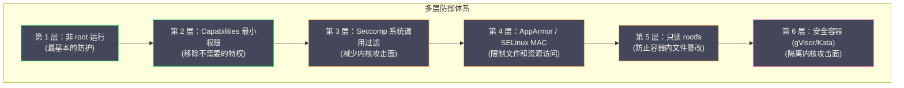
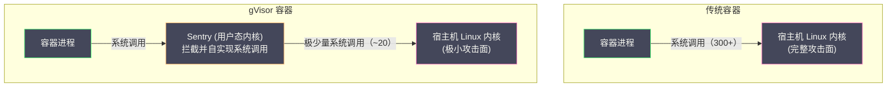
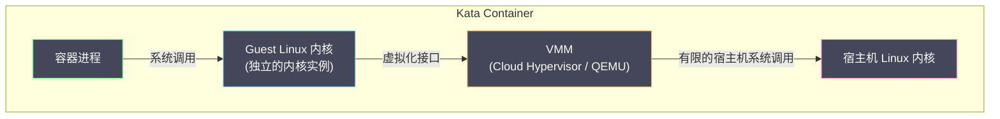

# 06 容器安全边界与逃逸风险

**摘要：**

本专栏前五篇文章构建了容器的完整技术栈：[[02 Linux Namespace 深度解析|Namespace]] 提供视图隔离、[[03 Cgroups 资源限制与控制|Cgroups]] 限制资源、[[04 UnionFS 与容器镜像原理|UnionFS]] 提供独立文件系统、[[05 容器网络原理|veth + Bridge]] 提供网络通信。但贯穿整个专栏的一个关键事实是：**容器共享宿主机内核**。Namespace 和 Cgroups 只是内核提供的"软隔离"——它们限制了进程"看到什么"和"用多少"，但进程与内核之间的系统调用接口是完全暴露的。一个容器进程可以调用内核的任何系统调用，如果某个系统调用存在漏洞，攻击者可以从容器"逃逸"到宿主机，获得对整台机器的完全控制权。本文作为容器核心原理专栏的收官之作，系统梳理容器的安全边界——哪些是隔离的、哪些不是，然后逐层剖析 Linux 内核提供的安全加固机制：**Capabilities**（最小权限）、**Seccomp**（系统调用过滤）、**AppArmor / SELinux**（强制访问控制），分析真实的容器逃逸案例及其利用路径，最后介绍 **Rootless 容器**和**安全容器**（gVisor / Kata Containers）如何从根本上缩小攻击面。

---

## 第 1 章 容器的安全模型

### 1.1 共享内核：容器安全的根本矛盾

在 [[01 容器的本质——从进程隔离到 OCI 标准]] 中我们明确了：容器不是虚拟机。虚拟机通过 Hypervisor 运行独立的 Guest OS 内核——即使 Guest 内核被攻破，攻击者仍然被困在虚拟机内部（需要再攻破 Hypervisor 才能到达宿主机）。而容器中的进程直接通过系统调用与宿主机内核交互——**容器进程与宿主机上的其他进程共享同一个内核**。

Linux 内核提供了超过 300 个系统调用。每一个系统调用都是内核暴露给用户态的接口——也是潜在的攻击面。如果内核在处理某个系统调用时存在 bug（如缓冲区溢出、竞态条件、权限检查缺失），一个容器进程就可以利用该 bug 获取内核态的执行权限，从而：

- 读取/修改宿主机上的任意文件
- 查看/杀死宿主机上的任何进程
- 访问其他容器的内存和网络
- 安装内核模块、修改内核参数
- 完全控制宿主机

这就是**容器逃逸（Container Escape）**——容器安全领域最严重的威胁。

### 1.2 容器的安全边界到底在哪里

要理解容器的安全边界，必须区分"隔离"和"安全"：

| 机制 | 提供的保护 | **不**提供的保护 |
| :--- | :--- | :--- |
| **Namespace** | 进程看不到其他 Namespace 的资源 | 不阻止通过内核漏洞访问其他 Namespace |
| **Cgroups** | 限制资源使用量 | 不阻止利用内核漏洞绕过限制 |
| **rootfs (pivot_root)** | 容器有独立的文件系统 | 不阻止通过内核漏洞访问宿主机文件系统 |
| **Capabilities** | 限制 root 用户的特权操作 | 某些保留的 Capability 仍可被利用 |
| **Seccomp** | 限制可调用的系统调用 | 未被过滤的系统调用仍可能存在漏洞 |
| **AppArmor/SELinux** | 限制文件/网络/资源访问 | 策略配置错误会留下缺口 |

> [!info] 核心认知
> **容器的安全不是由单一机制保证的，而是由多层防御（Defense in Depth）的组合实现的。** 每一层都不完美，但多层叠加后，攻击者需要同时突破所有层——这大幅提高了攻击的成本和难度。

### 1.3 容器安全的多层防御模型



接下来我们逐层深入。

---

## 第 2 章 Linux Capabilities：拆分 root 的超级权限

### 2.1 传统 Unix 权限模型的问题

传统的 Unix 权限模型非常粗暴——进程要么是**非特权的**（UID != 0），受到各种限制；要么是**特权的**（UID == 0，即 root），拥有几乎所有权限。这种"要么什么都不能，要么什么都能"的二元模型在容器场景中是一个严重问题。

很多应用需要某一项特定的特权操作，但并不需要 root 的全部权限。例如：

- Nginx 需要绑定 80 端口（端口号 < 1024 需要特权），但不需要加载内核模块
- 网络诊断工具需要发送原始数据包（raw socket），但不需要修改文件权限
- 某些监控程序需要读取 `/proc` 中的全局信息，但不需要挂载文件系统

如果为了满足这一项需求就赋予容器完整的 root 权限，攻击面被不必要地放大了。

### 2.2 Capabilities 的设计

**Linux Capabilities** 将 root 的超级权限拆分为多个独立的"能力单元"（capability），每个 capability 控制一类特权操作。进程可以只拥有需要的 capability，而不需要完整的 root 权限。

Linux 5.x 内核定义了约 40 个 capability，关键的几个：

| Capability | 控制的操作 | 容器中默认 |
| :--- | :--- | :--- |
| **CAP_NET_BIND_SERVICE** | 绑定 < 1024 的端口 | ✅ 保留 |
| **CAP_NET_RAW** | 使用 raw socket（如 `ping`）| ✅ 保留 |
| **CAP_CHOWN** | 修改文件所有者 | ✅ 保留 |
| **CAP_SETUID / CAP_SETGID** | 切换用户/组 ID | ✅ 保留 |
| **CAP_SYS_ADMIN** | 挂载文件系统、配置 Namespace 等（最危险的 capability）| ❌ 移除 |
| **CAP_SYS_PTRACE** | 使用 ptrace 调试其他进程 | ❌ 移除 |
| **CAP_NET_ADMIN** | 配置网络接口、路由、防火墙 | ❌ 移除 |
| **CAP_SYS_MODULE** | 加载/卸载内核模块 | ❌ 移除 |
| **CAP_DAC_OVERRIDE** | 绕过文件权限检查 | ✅ 保留 |
| **CAP_MKNOD** | 创建设备文件 | ✅ 保留 |

Docker 默认为容器保留了约 14 个 capability（满足大多数应用需求），移除了其他所有 capability。这意味着即使容器以 root 身份运行，它也**不能**加载内核模块、创建新的 Namespace、配置网络接口等——这些是容器逃逸的常见路径。

### 2.3 CAP_SYS_ADMIN：最危险的 Capability

`CAP_SYS_ADMIN` 被称为"新的 root"——它控制了大量的特权操作，包括：

- `mount()` / `umount()`：挂载和卸载文件系统
- `pivot_root()`：切换根文件系统
- `clone()` 时创建新的 Namespace
- `ioctl()` 中的多种特权操作
- 配置 Cgroups
- 使用 `bpf()` 系统调用（加载 eBPF 程序）

如果一个容器拥有 `CAP_SYS_ADMIN`，攻击者可以在容器内挂载宿主机的文件系统、创建新的 Namespace 来绕过隔离、加载 eBPF 程序在内核中执行代码——几乎等同于完全控制宿主机。

**Docker 默认移除了 `CAP_SYS_ADMIN`**，但某些应用（如 systemd 容器、FUSE 文件系统）需要它。通过 `--cap-add SYS_ADMIN` 添加时，必须充分评估安全风险。

### 2.4 Capabilities 的管理

```bash
# 查看容器默认的 Capabilities
docker run --rm alpine cat /proc/1/status | grep Cap
# CapPrm: 00000000a80425fb   (Permitted)
# CapEff: 00000000a80425fb   (Effective)

# 解码 Capability 位掩码
capsh --decode=00000000a80425fb
# 0x00000000a80425fb=cap_chown,cap_dac_override,cap_fowner,...

# 移除所有 Capabilities，只保留需要的
docker run --cap-drop ALL --cap-add NET_BIND_SERVICE nginx

# 在 Kubernetes 中配置
# securityContext:
#   capabilities:
#     drop: ["ALL"]
#     add: ["NET_BIND_SERVICE"]
```

> [!warning] 生产实践
> **始终遵循最小权限原则**：先 `drop ALL`，再逐一 `add` 真正需要的 capability。在 [[Kubernetes]] 中，Pod Security Standards 的 "restricted" 级别要求 `drop ALL`，只允许添加 `NET_BIND_SERVICE`。

---

## 第 3 章 Seccomp：系统调用级的攻击面收缩

### 3.1 为什么需要 Seccomp

Capabilities 限制了"哪些特权操作可以执行"，但容器进程仍然可以调用所有 300+ 个系统调用。很多系统调用在普通的 Web 应用容器中完全不需要——比如 `reboot()`（重启系统）、`kexec_load()`（加载新内核）、`init_module()`（加载内核模块）。每一个不必要的系统调用都是潜在的攻击入口——如果该系统调用的内核实现中存在漏洞，攻击者可以利用它。

**Seccomp（Secure Computing Mode）** 允许为进程定义一个系统调用"白名单"（或"黑名单"）——进程只能调用白名单中的系统调用，调用其他系统调用时内核直接拒绝（返回错误或杀死进程）。

### 3.2 Seccomp 的两种模式

**Strict 模式**（seccomp mode 1）：进程只能调用 `read()`、`write()`、`exit()` 和 `sigreturn()` 四个系统调用。过于严格，几乎无法运行真实的应用程序。

**Filter 模式**（seccomp-bpf，seccomp mode 2）：通过 BPF（Berkeley Packet Filter）程序定义灵活的过滤规则——可以对每个系统调用及其参数进行检查，决定允许、拒绝还是记录。这是容器运行时使用的模式。

### 3.3 Docker 的默认 Seccomp Profile

Docker 内置了一个默认的 Seccomp Profile，它屏蔽了约 44 个系统调用（约占总数的 15%），包括：

| 被屏蔽的系统调用 | 原因 |
| :--- | :--- |
| `reboot()` | 容器不应重启宿主机 |
| `kexec_load()` / `kexec_file_load()` | 容器不应加载新内核 |
| `init_module()` / `finit_module()` | 容器不应加载内核模块 |
| `mount()` / `umount2()` | 容器不应在运行时挂载文件系统（除非有 CAP_SYS_ADMIN） |
| `pivot_root()` | 容器不应切换根文件系统 |
| `swapon()` / `swapoff()` | 容器不应管理 swap |
| `keyctl()` | 容器不应访问内核密钥环 |
| `bpf()` | 容器不应加载 eBPF 程序 |
| `unshare()` | 容器不应创建新的 Namespace |
| `clone()` 的部分标志位 | 禁止创建新的 User/Cgroup Namespace |

这个默认 Profile 在安全性和兼容性之间取得了平衡——绝大多数应用不需要这些被屏蔽的系统调用，但一些特殊场景（如在容器中运行 Docker——Docker in Docker）需要放宽限制。

### 3.4 自定义 Seccomp Profile

对于安全要求更高的场景，可以创建自定义的 Seccomp Profile——只允许应用实际使用的系统调用：

```json
{
  "defaultAction": "SCMP_ACT_ERRNO",
  "architectures": ["SCMP_ARCH_X86_64"],
  "syscalls": [
    {
      "names": ["read", "write", "open", "close", "stat", "fstat",
                "mmap", "mprotect", "munmap", "brk", "ioctl",
                "access", "pipe", "select", "socket", "connect",
                "accept", "sendto", "recvfrom", "bind", "listen",
                "clone", "execve", "exit_group", "futex", "epoll_ctl",
                "epoll_wait", "openat", "newfstatat", "getrandom"],
      "action": "SCMP_ACT_ALLOW"
    }
  ]
}
```

```bash
docker run --security-opt seccomp=my-profile.json nginx
```

在 [[Kubernetes]] 1.19+ 中，可以通过 `securityContext.seccompProfile` 配置：

```yaml
securityContext:
  seccompProfile:
    type: Localhost
    localhostProfile: profiles/my-profile.json
```

> [!info] 如何生成自定义 Profile
> 手动列出应用使用的所有系统调用非常困难。可以使用工具辅助：
> - **strace**：`strace -c -f <command>` 统计应用使用的系统调用
> - **OCI seccomp-bpf hook**：记录容器运行时实际调用的系统调用
> - **Inspektor Gadget**：Kubernetes 环境下基于 eBPF 的系统调用审计工具

---

## 第 4 章 AppArmor 与 SELinux：强制访问控制

### 4.1 DAC vs MAC

Linux 传统的权限模型是 **DAC（Discretionary Access Control，自主访问控制）**——文件的所有者决定谁可以访问该文件（通过 `chmod`、`chown`）。DAC 的问题是：如果一个进程以 root 身份运行（或拥有 `CAP_DAC_OVERRIDE`），它可以绕过所有 DAC 限制。

**MAC（Mandatory Access Control，强制访问控制）** 是一种更严格的模型——系统管理员定义安全策略，即使 root 进程也必须遵守。MAC 策略不可被进程自身修改——它是"强制"的。

Linux 通过 **LSM（Linux Security Modules）** 框架支持 MAC，主要有两个实现：

| | AppArmor | SELinux |
| :--- | :--- | :--- |
| **开发者** | Canonical (Ubuntu) | NSA / Red Hat |
| **策略模型** | 基于路径（Path-based）| 基于标签（Label-based）|
| **配置难度** | 简单，可读性强 | 复杂，功能更强大 |
| **默认发行版** | Ubuntu, Debian, SUSE | RHEL, CentOS, Fedora |
| **容器支持** | Docker / K8s 原生支持 | Docker / K8s 原生支持 |

### 4.2 AppArmor

AppArmor 通过**配置文件（Profile）** 限制进程可以访问的文件路径、网络操作和 Capabilities。

Docker 的默认 AppArmor Profile（`docker-default`）包含以下关键限制：

```
# 禁止写入 /proc 和 /sys 中的敏感文件
deny /proc/sys/** w,
deny /sys/firmware/** w,

# 禁止挂载操作
deny mount,

# 禁止访问内核日志
deny /proc/kcore r,
deny /proc/kmsg r,

# 允许读取大部分文件
/usr/** r,
/etc/** r,
/tmp/** rw,
```

在 [[Kubernetes]] 中配置 AppArmor：

```yaml
metadata:
  annotations:
    container.apparmor.security.beta.kubernetes.io/app: localhost/my-profile
```

### 4.3 SELinux

SELinux 使用**标签（Label）** 系统——每个进程和每个文件都有一个安全标签（也叫安全上下文），策略定义了哪些进程标签可以访问哪些文件标签。

容器运行时为容器进程分配特定的 SELinux 标签（如 `container_t`），容器只能访问标记为 `container_file_t` 的文件——即使进程以 root 身份运行，也无法访问标记为 `etc_t`（系统配置）或 `kernel_t`（内核文件）的资源。

```bash
# 查看容器进程的 SELinux 标签
ps -eZ | grep nginx
# system_u:system_r:container_t:s0:c123,c456  12345 ? nginx

# 查看文件的 SELinux 标签
ls -Z /etc/passwd
# system_u:object_r:etc_t:s0  /etc/passwd
# container_t 进程不允许读取 etc_t 文件（除非策略明确允许）
```

SELinux 的强大之处在于——即使容器进程通过某种漏洞获取了 root 权限并突破了 Namespace 隔离，SELinux 的标签系统仍然限制它只能访问 `container_file_t` 标记的资源——宿主机的关键文件（`/etc/shadow`、`/root/`、内核模块目录等）的标签不同，无法被访问。

---

## 第 5 章 真实的容器逃逸案例

### 5.1 CVE-2019-5736：runc 容器逃逸

**这是容器安全历史上最著名的逃逸漏洞之一。**

**漏洞原理**：当容器内的进程通过 `docker exec` 进入容器时，runc 会在容器内部执行 `/proc/self/exe`（指向宿主机上的 runc 二进制文件）。如果容器中的恶意进程替换了容器内的 `/proc/self/exe`（通过打开 runc 的文件描述符并在 runc 退出前写入），就可以覆盖宿主机上的 runc 二进制文件——下次任何人在宿主机上执行 runc（如创建新容器）时，执行的就是攻击者的恶意代码，以 root 身份在宿主机上运行。

**影响**：Docker 18.09.2 之前的所有版本。攻击者需要在容器中以 root 身份运行。

**修复**：runc 在执行时将自身二进制复制到一个临时的只读文件描述符，通过 `memfd_create()` 系统调用执行内存中的副本，不再通过 `/proc/self/exe` 暴露宿主机文件。

**教训**：容器进程以 root 身份运行 + 容器可以写入 `/proc` 中的某些路径 = 潜在的逃逸路径。这也是为什么"不以 root 运行容器"是最重要的安全实践之一。

### 5.2 CVE-2020-15257：containerd Host Network 逃逸

**漏洞原理**：使用 Host Network 模式（`--network host`）的容器共享宿主机的 Network Namespace。containerd 的 containerd-shim API 监听在一个 Unix socket 上（位于一个 Abstract Unix Socket，不受文件系统权限控制）。Host Network 容器可以连接到这个 socket，通过 containerd-shim API 以 root 身份在宿主机上执行任意命令。

**教训**：Host Network 模式打破了网络隔离，暴露了宿主机网络栈上的所有服务——包括容器管理组件的内部 API。除非有明确需求，避免使用 Host Network 模式。

### 5.3 CVE-2022-0185：内核漏洞导致容器逃逸

**漏洞原理**：Linux 内核的 `legacy_parse_param()` 函数（用于解析文件系统挂载参数）存在堆缓冲区溢出漏洞。拥有 `CAP_SYS_ADMIN` 的容器进程可以通过 `fsconfig()` 系统调用触发该漏洞，在内核中执行任意代码，从而逃逸容器。

**关键条件**：容器需要拥有 `CAP_SYS_ADMIN`。在默认配置下，Docker 不赋予容器该 capability，因此大多数容器不受影响。但如果使用了 `--privileged` 或 `--cap-add SYS_ADMIN`，容器就暴露在此漏洞之下。

**教训**：再次印证了两个原则——（1）不给容器不必要的 capability，尤其是 `CAP_SYS_ADMIN`；（2）Seccomp 如果屏蔽了 `fsconfig()` 系统调用，也可以阻止此漏洞的利用。多层防御缺一不可。

### 5.4 --privileged 的恐怖

`docker run --privileged` 是容器安全的"核弹按钮"——它赋予容器**所有 Capabilities**、禁用 Seccomp 和 AppArmor、挂载宿主机的 `/dev` 下的所有设备。Privileged 容器几乎等同于在宿主机上以 root 身份运行，可以直接访问宿主机的磁盘设备、加载内核模块、修改内核参数。

```bash
# Privileged 容器可以直接挂载宿主机的磁盘并读取任意文件
docker run --privileged -it ubuntu bash
# 在容器内：
mount /dev/sda1 /mnt
cat /mnt/etc/shadow   # 读取宿主机的密码文件 ← 这就是逃逸
```

> [!warning] 绝对红线
> **永远不要在生产环境中使用 `--privileged`。** 如果应用需要某项特定权限，应该精确地添加对应的 capability（`--cap-add`），而不是开放所有权限。在 [[Kubernetes]] 中，Pod Security Standards 的 "baseline" 和 "restricted" 级别都禁止 `privileged: true`。

---

## 第 6 章 Rootless 容器：从根本上减少风险

### 6.1 什么是 Rootless 容器

传统的容器运行流程中，Docker 守护进程（dockerd）和容器运行时（runc）都以 **root** 身份运行——因为创建 Namespace、配置 Cgroups、挂载文件系统等操作需要 root 权限。这意味着如果 dockerd 或 runc 存在漏洞，攻击者可以直接获取 root 权限。

**Rootless 容器** 指的是整个容器运行栈（守护进程 + 运行时 + 容器进程）都以**非 root 用户**身份运行。这依赖于 [[02 Linux Namespace 深度解析|User Namespace]] 的 UID 映射机制——容器内的 root（UID 0）映射到宿主机上的一个普通用户（如 UID 100000）。

### 6.2 Rootless 的工作原理

```
宿主机视角：
  dockerd 进程: UID=1000 (普通用户 alice)
  runc 进程:    UID=1000
  容器进程:     UID=100000 (映射自容器内的 UID 0)

容器内视角：
  容器进程:     UID=0 (root)  ← 容器"以为"自己是 root
```

即使容器逃逸成功，攻击者在宿主机上的身份是 UID=100000 的普通用户——无法读取 `/etc/shadow`、无法 `kill` 其他用户的进程、无法安装软件、无法加载内核模块。攻击的危害被大幅限制。

### 6.3 Rootless 的局限

Rootless 容器并非万能——它有以下限制：

- **端口绑定**：非特权用户不能绑定 < 1024 的端口（需要额外配置 `sysctl net.ipv4.ip_unprivileged_port_start=0`）
- **Cgroups v2**：Rootless 容器需要 Cgroups v2（v1 不支持非 root 用户管理 Cgroups）
- **网络性能**：Rootless 网络使用 `slirp4netns` 或 `pasta` 进行用户态网络转发，性能低于内核态的 veth + Bridge
- **存储驱动**：某些存储驱动在 Rootless 模式下不可用或性能下降

Docker 20.10+ 和 Podman 原生支持 Rootless 模式。[[Kubernetes]] 从 1.22 开始支持 Rootless kubelet（实验性）。

---

## 第 7 章 安全容器：隔离内核攻击面

### 7.1 核心思想

Rootless 容器减少了逃逸后的危害，但没有阻止逃逸本身——容器进程仍然直接与宿主机内核交互。**安全容器**的思路是在容器和宿主机内核之间增加一个隔离层，使得容器进程不直接接触宿主机内核。

### 7.2 gVisor：用户态内核

**gVisor** 是 Google 开发的容器沙箱，核心组件是 **Sentry**——一个在用户态运行的"内核"。Sentry 拦截容器进程的所有系统调用，在用户态自己实现这些系统调用的逻辑（如文件读写、网络通信、进程管理），不将系统调用直接传递给宿主机内核。



**安全价值**：容器进程的 300+ 个系统调用被 Sentry 在用户态处理，Sentry 自身只使用约 20 个宿主机内核的系统调用。宿主机内核暴露给容器的攻击面从 300+ 缩小到 ~20——即使 Sentry 被攻破，攻击者也无法直接利用宿主机内核的漏洞。

**性能代价**：系统调用的用户态模拟比直接的内核系统调用慢 2-10 倍（需要上下文切换到 Sentry 进程）。对于系统调用密集型的工作负载（如高频文件 I/O、高并发网络），性能下降显著。

**兼容性**：gVisor 实现了大部分常用的系统调用，但并非所有——某些依赖特殊系统调用或 `/proc` `/sys` 中特定文件的应用可能无法运行。

### 7.3 Kata Containers：轻量级虚拟机

**Kata Containers** 采用了与 gVisor 完全不同的策略——它为每个容器（或每个 Pod）创建一个**轻量级虚拟机**。容器进程运行在虚拟机内部的 Guest 内核中，与宿主机内核完全隔离。



**安全价值**：与虚拟机相同级别的隔离——容器进程与宿主机之间隔着一层 Hypervisor 和 Guest 内核，即使 Guest 内核被完全攻破，攻击者仍然被困在虚拟机内部。

**性能**：比 gVisor 更好——容器进程的系统调用由 Guest 内核直接处理（原生速度），只有虚拟设备的 I/O 需要经过 VMM。

**开销**：每个 Pod 需要一个虚拟机——额外的内存开销（Guest 内核约 40-100MB）和启动时间（约 100-500ms，比普通容器的几十毫秒慢一个数量级）。

### 7.4 在 Kubernetes 中使用安全容器

[[Kubernetes]] 通过 **RuntimeClass** 支持在同一个集群中运行不同类型的容器运行时：

```yaml
# 定义 RuntimeClass
apiVersion: node.k8s.io/v1
kind: RuntimeClass
metadata:
  name: gvisor
handler: runsc     # gVisor 的 OCI 运行时
---
apiVersion: node.k8s.io/v1
kind: RuntimeClass
metadata:
  name: kata
handler: kata-runtime  # Kata 的 OCI 运行时
---
# 在 Pod 中指定 RuntimeClass
apiVersion: v1
kind: Pod
metadata:
  name: untrusted-workload
spec:
  runtimeClassName: kata    # 使用 Kata 安全容器
  containers:
    - name: app
      image: untrusted-app:v1
```

这种设计允许灵活的安全策略——内部可信的服务使用默认的 runc（性能优先），来自外部的不可信工作负载使用 gVisor 或 Kata（安全优先）。

---

## 第 8 章 容器安全加固清单

### 8.1 生产环境容器安全 Checklist

| 层级 | 措施 | 优先级 |
| :--- | :--- | :--- |
| **镜像** | 使用最小基础镜像（如 distroless / Alpine）| 高 |
| **镜像** | 定期扫描镜像漏洞（Trivy / Grype）| 高 |
| **镜像** | 不在镜像中嵌入密钥和凭证 | 高 |
| **运行时** | 不以 root 用户运行容器进程 | **极高** |
| **运行时** | 不使用 `--privileged` | **极高** |
| **运行时** | `capabilities: drop ALL`，按需添加 | 高 |
| **运行时** | 启用 Seccomp（至少使用 Docker/containerd 默认 Profile）| 高 |
| **运行时** | 启用 AppArmor 或 SELinux | 中 |
| **运行时** | rootfs 设为只读（`readOnlyRootFilesystem: true`）| 中 |
| **网络** | 避免使用 Host Network 模式 | 高 |
| **网络** | 在 K8s 中配置 NetworkPolicy 限制 Pod 间流量 | 中 |
| **存储** | 不挂载 Docker socket（`/var/run/docker.sock`）到容器 | **极高** |
| **存储** | 不挂载宿主机敏感目录（`/etc`、`/root`、`/proc/sys`）| 高 |
| **内核** | 及时更新宿主机内核（修补已知漏洞）| 高 |
| **编排** | 在 K8s 中启用 Pod Security Standards（restricted 级别）| 高 |
| **高安全场景** | 使用安全容器（gVisor / Kata）| 视场景 |

### 8.2 Kubernetes Pod Security Standards

[[Kubernetes]] 1.25+ 内置了 **Pod Security Standards**，分为三个级别：

| 级别 | 限制 | 适用场景 |
| :--- | :--- | :--- |
| **Privileged** | 无限制 | 系统组件（如 CNI、日志采集 DaemonSet）|
| **Baseline** | 禁止 privileged、禁止 hostPID/hostNetwork/hostIPC、禁止危险 Volume 类型 | 大多数工作负载 |
| **Restricted** | 在 Baseline 基础上：必须非 root 运行、必须 drop ALL capabilities、必须有 Seccomp Profile、rootfs 只读 | 安全敏感的工作负载 |

---

## 第 9 章 专栏总结

本文作为容器核心原理专栏的收官，系统梳理了容器安全的完整防御体系。

回顾整个专栏，我们建立了对容器技术的**从底至上的完整认知**：

| 篇章 | 核心问题 | 核心技术 |
| :--- | :--- | :--- |
| [[01 容器的本质——从进程隔离到 OCI 标准]] | 容器是什么 | OCI 标准、containerd / runc |
| [[02 Linux Namespace 深度解析]] | 容器看到什么 | 八种 Namespace、clone / unshare / setns |
| [[03 Cgroups 资源限制与控制]] | 容器能用多少 | Cgroups v1/v2、CPU Throttling、OOM Killer |
| [[04 UnionFS 与容器镜像原理]] | 容器的文件从哪来 | OverlayFS、分层镜像、内容寻址 |
| [[05 容器网络原理]] | 容器如何通信 | veth pair、Bridge、iptables NAT、CNI |
| **本文** | 容器的安全边界在哪 | Capabilities、Seccomp、MAC、安全容器 |

这六篇文章覆盖了容器技术的所有内核级基础——理解了这些底层原理，你在学习 [[Kubernetes]] 时会发现：Pod 的资源模型就是 Cgroups 的映射，Pod 的网络模型就是 Network Namespace + CNI，Pod Security Standards 就是 Capabilities + Seccomp + MAC 的策略化封装。**容器的内核原理是 Kubernetes 的地基**——地基打牢了，上层建筑才能理解得透彻。

---

## 参考资料

1. Linux man pages: `capabilities(7)`, `seccomp(2)`, `apparmor(7)`
2. Docker Documentation - Security：https://docs.docker.com/engine/security/
3. OCI Runtime Specification - Linux Security：https://github.com/opencontainers/runtime-spec/blob/main/config-linux.md
4. Kubernetes Documentation - Pod Security Standards：https://kubernetes.io/docs/concepts/security/pod-security-standards/
5. CVE-2019-5736 Analysis：https://blog.dragonsector.pl/2019/02/cve-2019-5736-escape-from-docker-and.html
6. gVisor Documentation：https://gvisor.dev/docs/
7. Kata Containers Architecture：https://github.com/kata-containers/kata-containers/blob/main/docs/design/architecture/README.md
8. NCC Group (2019). *Understanding and Hardening Linux Containers*.
9. Aqua Security (2022). *Cloud Native Threat Report*.
10. Liz Rice (2020). *Container Security*. O'Reilly.
