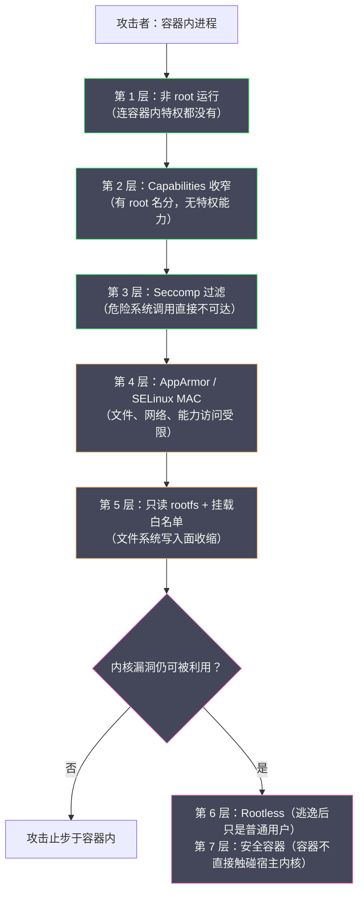
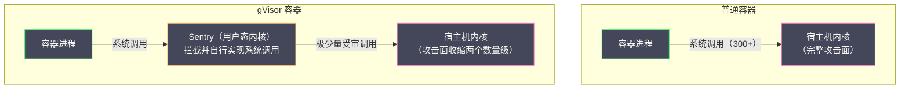

# 06 容器安全边界与逃逸风险

**摘要：**

前五篇把容器组装成了一台"逻辑机器"——[[02 Linux Namespace 深度解析|Namespace]] 遮住视图、[[03 Cgroups 资源限制与控制|Cgroups]] 圈住资源、[[04 UnionFS 与容器镜像原理|OverlayFS]] 隔开文件、[[05 容器网络原理|veth 与网桥]]接通网络。但贯穿全专栏的那个根本事实始终悬而未决：**所有容器与宿主机共享同一个内核**。Namespace 与 Cgroups 是内核提供的"软隔离"，容器进程与内核之间的系统调用接口完全敞开——一旦某个系统调用路径上存在漏洞，容器内的进程就能获得内核态的执行权，越过全部隔离直达宿主机，这就是容器逃逸。本文作为专栏收官，系统回答三个问题：容器的安全边界究竟在哪里——逐项检视每种隔离机制"防什么、不防什么"；Linux 内核提供了哪些收缩攻击面的机制——Capabilities（拆分 root 特权）、Seccomp（系统调用白名单）、AppArmor/SELinux（强制访问控制）各自如何工作、如何叠加；以及真实的逃逸案例（CVE-2019-5736、CVE-2020-15257、CVE-2022-0185）揭示了哪些共性教训。最后给出两条"改变隔离强度本身"的路线——Rootless 容器与安全容器（gVisor/Kata），并汇总一份可落地的加固清单。读完全文，你应当能为自己的环境做一次容器安全体检，并把每一项加固决策讲出机制层面的理由。

---

## 第 1 章 共享内核：容器安全的根本矛盾

### 1.1 一枚硬币的两面

本专栏第 1 篇就把话说透了：容器"快"与"省"的来源是共享内核，而它"弱"的根源也是共享内核。这里把后半句展开到机制层面。虚拟机的安全边界落在硬件虚拟化层——Guest 内核被攻破，攻击者仍需攻破 Hypervisor 才能触及宿主机，而 Hypervisor 的代码量以十万行计、暴露面极小；容器的安全边界则落在操作系统内核自身——容器进程通过系统调用直接与宿主机内核对话，Linux 内核暴露了 300 多个系统调用，加上 `/proc`、`/sys` 中的大量接口，**攻击面是整个内核**。内核代码以千万行计，每年稳定产出数十个可提权漏洞（从 Dirty COW（CVE-2016-5195）到近年各类 netfilter、io_uring 缺陷），其中相当一部分可以从容器内触发。对比之下，Hypervisor 的暴露面被刻意裁剪到极小（虚拟 CPU、内存、中断、少量设备模型），且经过长期的形式化验证投入——这是"逃出虚拟机"与"逃出容器"难度相差数量级的结构性原因，不是营销话术。

容器逃逸（Container Escape）指的是：利用上述攻击面中的某个缺陷，从"受隔离的进程"升级为"内核态或宿主机 root"，此后 Namespace 的视图遮挡全部失效——读取宿主机任意文件、操控其他容器、加载内核模块、乃至在宿主机上植入持久化后门。逃逸之后，前面五篇建立的所有隔离都是"已经被绕过的历史"。量化地说，"共享内核"意味着**宿主机内核的每一条提权路径，理论上都是容器的逃逸路径**——安全社区对容器隔离的严谨表述是"进程隔离"（process isolation）而非"虚拟机隔离"（machine isolation），两者的差距正是本章全部内容存在的理由。

### 1.2 隔离机制逐项检视：防什么、不防什么

每种前文介绍的机制都有自己的安全定位，把它们放回安全视角逐项检视：

| 机制 | 提供的保护 | 不提供的保护 |
| :--- | :--- | :--- |
| **Namespace** | 进程看不到其他 Namespace 的资源（防误触、防信息泄露） | 内核漏洞可绕过视图层直接触达底层资源 |
| **Cgroups** | 资源耗尽型攻击被限制在组内（防"吵闹邻居"、防 DoS 放大） | 内核漏洞可无视配额；不阻止任何逻辑攻击 |
| **rootfs / OverlayFS** | 只读镜像层防篡改；文件系统边界挡住"路径式"越权 | 内核漏洞可挂载宿主机文件系统；共享内核不变 |
| **Capabilities** | 收窄 root 特权（防"容器内 root = 宿主机 root"） | 未收干净的能力仍是攻击跳板 |
| **Seccomp** | 收缩系统调用暴露面（未白名单的调用直接不可达） | 白名单内的调用仍可能存在漏洞 |
| **MAC（AppArmor/SELinux）** | 即使越权也限制文件/网络/能力访问 | 策略配置错误或过宽即失效 |

这张表读下来，结论自己浮现：**每一层都真实有效，每一层又都不完整；容器安全不是"某个机制保证的"，而是多层叠加后攻击成本累加的结果**。这就是安全工程里的防御纵深（Defense in Depth）：攻击者必须同时穿透视图层、资源层、能力层、调用层、访问控制层——每一层都显著提高成本与失败概率，但没有任何一层单独构成"安全边界"。读这张表时还有一个隐含要点：**各行"不提供的保护"高度重合（都是"内核漏洞可绕过"），各行"提供的保护"却互不重叠**——这正是它们能叠加而不冗余的原因：防御纵深不是同一道墙加厚，而是不同类型的墙组合。理解了这一点，后文每一个机制的地位就都清楚了：它们是同一堵墙上不同高度的砖，而不是互相替代的备选方案。

### 1.3 威胁模型先行：你的对手是谁

所有安全讨论之前必须先问一个非技术问题：**容器里跑的东西可信到什么程度**。按对手强度划分，容器安全的三个档位对应三种截然不同的技术选型：**对手是自己公司的同事**（防止误操作、依赖漏洞、权限蔓延）——默认的 runc + 常规加固完全够用；**对手是外部输入**（处理不可信文件、用户提交代码的构建系统、SaaS 的代码执行）——必须上安全容器（gVisor/Kata）或专用沙箱；**对手是专业攻击者**（多租户公有云执行任意代码）——安全容器加上严格的多层策略，且持续跟进内核与运行时的安全公告。把威胁模型说清楚再谈加固，能避免两种典型浪费：为"同事级对手"堆砌全套安全容器（成本与运维复杂度双输），或为"专业攻击者"场景只做了默认加固（安全感是假的）。落到具体业务上，这个分档常常一目了然：内部 CRUD 服务是第一档，文档转换服务（处理任意上传的 Office/PDF——解析器漏洞是真实的攻击入口）是第二档，云厂商的 Serverless 平台是第三档。同一个集群里三种档位的负载并存是完全正常的，这恰好预告了第 7 章的结论——隔离强度应当按负载声明，而不是按集群统一。把威胁模型写下来还有第二个作用：**它让"为什么不加 X 防御"变成一个可回答的问题**——安全审查中最消耗时间的，是回答"我们为什么不这样做"式的追问；有明确威胁模型的团队，每个未采取的措施都有"不在当前对手画像内"或"成本超过风险"的书面理由。

> [!info] 一条容易被误读的边界
> "容器不是安全边界"不等于"容器毫无安全价值"。容器的隔离在**防误操作、防横向移动的早期阶段、压缩漏洞可达性**上真实有效——要否定的是"容器内进程攻不破宿主机"这个错误命题，而不是容器隔离本身。正确的表述是：容器是与"安全域"（security boundary）不同层次的"隔离域"（isolation domain），前者要求攻击者无法穿透，后者只要求故障与越权行为被限制在域内。

[[LLM/Agent沙箱技术/隔离原语/02 Linux 隔离原语——namespace、cgroups、seccomp 与 capabilities 的安全地基|Agent 沙箱技术专栏]] 对"执行不可信代码"场景的沙箱设计有更专门的展开。

---

## 第 2 章 多层防御的总体设计

### 2.1 防御纵深的层次图

把本章至第 7 章的机制放在一张图上，纵览它们在攻击路径上的位置：



这张图的阅读方式是从上往下：每一层都在前一层失效后继续增加攻击成本；前三层是"人人可做"的基础加固，中间两层是"应该做"的进阶加固，最后两层则是"改变游戏规则"的结构性方案——Rootless 让逃逸变得无害（逃逸出去也只是个普通用户），安全容器让逃逸变得困难（容器根本不直接接触宿主内核）。图上还有一个分支值得注意：内核漏洞的存在与否不受任何一层控制——防御纵深改变的是"漏洞的可达性"与"利用的成本"，而不是"内核有没有 bug"本身；**这也是为什么宿主机内核补丁永远是清单上不可替代的一项**。

### 2.2 两个贯穿原则

在逐层展开之前，先立两个贯穿全文的原则。**其一，最小权限是一切的地基**：后文每个机制的配置哲学都相同——先全部关闭，再按需打开（Capabilities 的 drop ALL 再 add、Seccomp 的 deny by default 白名单、MAC 的默认拒绝策略）；反向操作（先全开再逐项关闭）在工程上注定留下缝隙。本章之后的三章（第 3、4、5 章）依次展开中间三层——能力、调用、访问控制，第 6 章用真实案例检验这些层的缝隙，第 7 章讨论框架级的两条替代路线。**其二，默认配置是底线而非终点**：Docker 与 containerd 的默认配置（14 个 Capabilities、默认 Seccomp profile）是"兼容性优先"的均衡解，生产环境应当在其上按负载特性进一步收紧——默认值的目标是"大部分应用开箱能跑"，不是"你的应用已经足够安全"。两个原则合起来的操作化表述是：**安全配置的正确方向是"从零开始按需开放"，错误方向是"从全开开始逐项关闭"**——前者每一步都有记录在案的理由，后者注定留下"关到 95% 就嫌麻烦"的缝隙。

---

## 第 3 章 Capabilities：拆分 root 的超级权限

### 3.1 传统 Unix 权限模型的困境

传统 Unix 的权限模型是粗暴的二元制：进程要么是非特权的（UID 非 0），处处受限；要么是 root（UID 0），几乎无所不能。这个模型在容器场景暴露出尖锐的矛盾——许多应用只需要某一项特权，却被迫携带全部特权。经典例子：Web 服务器要绑定 80 端口（低于 1024 的端口需要特权），但它完全不需要加载内核模块；诊断容器需要发原始数据包（raw socket），但不需要修改任意文件的属主。"为了一个端口给整个 root"，攻击面被无谓放大了一个数量级。能力机制的替代方案在容器出现前就存在（长期实践是让 nginx 以 nobody 身份运行、由 root 进程绑定端口后降权——复杂且易错），容器把它推到日常化：每一秒都有人以 root 在容器里启动应用，二元模型的每一次失灵都被同步放大。

### 3.2 能力机制：把 root 拆成几十个开关

**Linux Capabilities**（内核 2.2 起引入，现代内核约 40 项）把 root 的特权拆分为独立的能力项，每项控制一类特权操作。与容器关系最密切的几项：

| Capability | 控制的特权操作 | Docker 默认 |
| :--- | :--- | :--- |
| `CAP_NET_BIND_SERVICE` | 绑定 <1024 的端口 | 保留 |
| `CAP_NET_RAW` | 原始 socket（ping、抓包） | 保留 |
| `CAP_CHOWN` / `CAP_FOWNER` | 改文件属主 / 绕过属主限制 | 保留 |
| `CAP_SETUID` / `CAP_SETGID` | 切换用户 / 组身份 | 保留 |
| `CAP_DAC_OVERRIDE` | 绕过文件读写执行权限检查 | 保留 |
| `CAP_MKNOD` | 创建设备文件 | 保留 |
| `CAP_SYS_ADMIN` | 挂载、切根、创建 Namespace、eBPF 等一大类特权 | **移除** |
| `CAP_SYS_MODULE` | 加载 / 卸载内核模块 | **移除** |
| `CAP_NET_ADMIN` | 配置网络接口、路由、防火墙 | **移除** |
| `CAP_SYS_PTRACE` | 追踪其他进程（注入、调试） | **移除** |

Docker 默认保留 14 项能力（满足绝大多数应用）、移除其余全部——这组默认值是兼容性与安全的均衡点：即使容器以 root 身份运行，它也加载不了内核模块、改不了网络栈、挂载不了文件系统——**容器逃逸的几条主干道在默认配置下就被堵住了**。`CAP_SYS_ADMIN` 值得单独点名：它横跨挂载、Namespace、eBPF 等几十种特权操作，被称为"新的 root"——拥有它的容器几乎等同于放弃能力机制的保护，Docker 默认移除、Kubernetes 的 Pod Security Standards 的 restricted 级别直接禁止，道理都在于此。文件维度的 file capabilities（`setcap` 把能力烧进二进制）可以让非 root 进程持有单项能力（譬如给 ping `cap_net_raw`），属于"不给进程整体特权、只给二进制单项特权"的精细玩法（内核机制参见 [[Linux/文件系统/09 文件系统的安全边界——权限、ACL 与 Capabilities|文件系统的安全边界]]）。

### 3.3 实操：查看、收窄与验证

```bash
# 查看容器进程的能力集（三个位掩码各司其职）
docker run --rm alpine sh -c "grep Cap /proc/1/status"
# CapEff: 00000000a80425fb   ← 当前生效的能力
# CapPrm / CapBnd            ← 可获取上限 / 边界

# 解码位掩码为可读能力名
capsh --decode=00000000a80425fb
# = cap_chown,cap_dac_override,cap_fowner,...  共 14 项

# 按最小权限原则配置：先全部移除，再按需添加
docker run --rm --cap-drop ALL --cap-add NET_BIND_SERVICE nginx
```

三个集合（Effective/Permitted/Bounding）的设计是能力机制的精髓之一：Bounding Set 是进程能拥有的能力上限（fork 不会越界），Permitted 是当前允许拥有的，Effective 是当前生效的——运行时正是通过设置 Bounding Set 把"容器永远拿不到的能力"在结构上封死，容器内即使某个进程被攻破，它 fork 出的一切后代都无法重新获得被裁剪的能力。`/proc/<pid>/status` 的 CapBnd 行可以直接验证这一点。完整的能力模型其实有五个集合（加上 Inheritable 与 Ambient，处理 execve 时的能力继承与保留），是内核权限体系里出了名的精细结构——容器实践只需要理解核心三件套：**Bounding 决定"永远拿不到什么"，这是安全边界；Effective 决定"现在能用什么"，这是功能运行面**。

在 Kubernetes 中，同样的配置落在 `securityContext.capabilities` 字段；社区的最佳实践收敛为一句话：**drop ALL，然后按应用的真实需要 add**——一个只做 HTTP 服务的容器，通常只需要 `NET_BIND_SERVICE`（甚至不用，如果监听高位端口）：

```yaml
# Kubernetes 中的能力收窄（restricted 级别的标准写法）
securityContext:
  runAsNonRoot: true
  allowPrivilegeEscalation: false
  capabilities:
    drop: ["ALL"]
    add: ["NET_BIND_SERVICE"]   # 仅当需要绑定 <1024 端口
```


> [!warning] 验证闭环不可省
> 收窄能力后必须在真实环境验证应用仍能工作——能力的缺失往往不在功能测试暴露（`chown` 失败可能在异常分支里），而在生产故障时爆发。可靠的验证方式是：`drop ALL` 后跑一轮完整的集成测试与启动自检，把每个权限报错映射回一项能力、逐一评估添加。**"配了"与"配对了"之间隔着一轮完整的验证。**

### 3.4 默认值的历史与差异

对比不同工具的默认能力集，能看出社区对"默认画像"的共识与分歧。Docker 的默认 14 项确立于早期版本，此后长期未动——它是兼容性的守护线，改动任何一项都可能破坏存量镜像；Podman 采取了更激进的默认（在部分版本中进一步裁剪了默认能力），并以"默认 Rootless"把整体安全基线抬高；Kubernetes 则把决定权交给 Pod Security Standards 的分级——Privileged 级别照单全收，Baseline 级别禁止危险能力与特权提升，Restricted 级别要求 drop ALL。三个工具三种默认，恰恰说明**"默认值"是产品定位的表达而非安全的终局**：Docker 的默认面向开发者体验，Podman 的默认面向安全敏感的企业用户，K8s 的默认面向集群管理员的可治理性。阅读任何一个环境时，第一件事是确认"这里的默认是什么"，而不是套用其他环境的经验。

---

## 第 4 章 Seccomp：系统调用白名单

### 4.1 从"限制特权"到"限制入口"

Capabilities 收窄的是"特权操作"，但对普通系统调用（读文件、建 socket、写内存……）无能为力——容器进程仍然可以调用全部 300 多个系统调用。而安全分析告诉我们：**每一个被允许调用的系统调用，其内核实现都是潜在漏洞的藏身处**（历年提权 CVE 大量落座于 `io_uring`、`netfilter`、文件系统挂载路径等具体系统调用的实现缺陷）。Seccomp（Secure Computing Mode）把这个思路推到极致：直接限定进程能发起哪些系统调用——白名单之外，内核在系统调用入口处直接拒绝（返回 EPERM、ENOSYS 或杀死进程），**内核里对应的那段代码永远没有机会执行**。这个机制在攻击者与内核之间加了一道"门卫"：无论漏洞藏在哪个调用的实现里，只要那个调用不在白名单上，漏洞就与攻击者隔着一道不可逾越的闸门——它不修补漏洞，但让漏洞不可达。

### 4.2 两种模式的演进

Seccomp 有两代模式。**严格模式**（2005 年，Linux 2.6.12）只能允许 `read`/`write`/`exit`/`sigreturn` 四个系统调用——安全价值立竿见影（Chrome 浏览器的渲染进程至今在用类似思路），但对服务器应用过于苛刻，业界几乎无法使用。**过滤模式**（seccomp-bpf，2012 年，Linux 3.5）带来质变：进程可以加载一段 BPF 过滤器，对每个系统调用的编号乃至参数做条件判断（"允许 openat，但如果传入了写标志则拒绝"），灵活性足以描述真实应用的需求——容器运行时的 Seccomp 全部构建在过滤模式之上。两代演进的共同启示是：**安全机制必须配合应用的现实形态才能落地，纯粹的安全理想（只许四个调用）换不来部署规模**。Chrome 浏览器对渲染进程的沙箱是严格模式最著名的生产应用——渲染不可信网页内容的进程只需要极小的系统调用面，严格模式的苛刻反而成了优点；服务器端负载形态千差万别，过滤模式才成为通用解。**同一个机制，在不同威胁场景下"最优配置"可以完全相反**——这也是安全工程没有普适参数的又一例证。

### 4.3 Docker 的默认 profile：44 个被屏蔽的系统调用

Docker 为容器内置了默认的 Seccomp profile（以 x86_64 为例，屏蔽约 44 个系统调用，随内核演进略有增减）。被屏蔽的选择极具代表性，按"攻击价值"分组：

| 被屏蔽的系统调用 | 攻击价值 |
| :--- | :--- |
| `mount` / `umount2` / `pivot_root` | 挂载宿主机文件系统、切根——逃逸的直通车 |
| `init_module` / `finit_module` / `kexec_load` | 加载内核模块 / 替换内核——直接拿下宿主机 |
| `bpf` | 加载 eBPF 程序——内核态代码执行的现代化入口 |
| `unshare` / `clone`（特定标志位） | 创建新 Namespace、越权放大 |
| `keyctl` / `ptrace`（对高权限目标） | 内核密钥环、进程注入 |
| `reboot` / `swapon` | 影响宿主机全局状态 |

这份清单与第 3 章的能力裁剪形成交叉印证：`mount` 同时被 CAP_SYS_ADMIN（能力层）与 Seccomp（调用层）双重拦截——**同一扇门上了两把锁**，这正是防御纵深的落实。 profile 允许以 `--security-opt seccomp=profile.json` 替换，Kubernetes 侧对应 `securityContext.seccompProfile`（`RuntimeDefault` 使用运行时默认 profile，1.19 起 GA）；Pod Security Standards 的 restricted 级别要求每个容器显式设置 Seccomp profile，把"有没有配"变成了准入检查项。profile 的形态就是一个 JSON 文件（默认动作 + 按调用编号的规则列表），观察与验证都很直接：

```bash
# 查看运行时内置的默认 profile（以 containerd 为例）
cat /etc/containerd/seccomp_default.json | head -20
# { "defaultAction": "SCMP_ACT_ERRNO",   ← 白名单制：默认拒绝
#   "architectures": ["SCMP_ARCH_X86_64"],
#   "syscalls": [ { "names": ["accept", ...],
#                   "action": "SCMP_ACT_ALLOW" } ] }

# 在容器内验证某调用确实被拦截
docker run --rm alpine sh -c "unshare --pid echo hi"
# unshare: unshare failed: Operation not permitted   ← EPERM，规则生效
```


### 4.4 为应用定制 profile 的务实路线

"白名单只留应用需要的调用"是理想态，工程上的难点是**枚举应用的真实调用面**。务实的路线是观测驱动的生成-收敛循环：先用 `strace -c -f ./app`（或运行期基于 eBPF 的工具）统计应用全部进程实际调用的系统调用集合，以此生成白名单初稿；在预发环境全量跑一遍功能与故障路径测试，迭代补充漏项；上线后保持对 `SCMP_ACT_ERRNO` 拒绝事件的监控（拒绝量突然上升，说明应用行为漂移或误杀）。选择拒绝动作时也有讲究：返回 `ENOSYS`（"系统调用不存在"）通常优于 `EPERM`（"操作不被允许"）——某些应用会据 ENOSYS 回退到旧接口，据 EPERM 则直接报错退出，兼容性行为因拒绝码而异。新 profile 的灰度 rollout 同样重要：先以"记录模式"（规则命中只记日志不拦截）运行一段时间，确认无合法流量被命中后再切换为强制模式——**任何 deny by default 的机制都必须经历先观察后强制的过渡期**。定制 profile 的收益与成本都集中在"维护"上：内核升级引入新系统调用（如 `io_uring` 家族）时需要重新评估——**它适合攻击面敏感的核心服务，不适合当作全公司一刀切的默认**。

Seccomp 的现代化扩展 **SECCOMP_USER_NOTIF**（内核 5.0 起）为它打开了一个新维度：过滤器可以把特定系统调用"转交"给一个用户态监督进程代为决策与执行，而不是简单放行或拒绝。这个"中介模式"让许多原本必须放行的危险调用有了新选项——譬如容器请求挂载时，由监督进程校验参数后**代为执行**，容器自身始终拿不到执行权。gVisor 的思路与它一脉相承（拦截并代为实现），SECCOMP_USER_NOTIF 则把这种能力以内核原生接口的形式提供给任意运行时，密钥代管、受限挂载代理等安全组件都构建在它上面。

---

## 第 5 章 MAC：AppArmor 与 SELinux

### 5.1 DAC 的天花板与 MAC 的补位

传统 Unix 的自主访问控制（DAC，Discretionary Access Control）有个结构性软肋：**权限由文件属主决定**，而 root（或持有 `CAP_DAC_OVERRIDE` 的进程）可以无视一切 DAC 检查——前面两章费力收窄的能力与调用，一旦有漏洞让攻击者拿到 root，DAC 就形同虚设。强制访问控制（MAC，Mandatory Access Control）补上了这块天花板：**由系统级策略定义"哪个进程可以访问哪个资源"，策略凌驾于进程之上，root 也必须遵守**。"策略独立于进程存在"是它最本质的特征——DAC 的规则寄生在文件系统上（可以被子进程篡改），MAC 的规则挂在内核里（容器内进程连读取完整策略都做不到），威胁模型从"防止越权"升级为"越权后仍然受限"。

用一句话概括三层的递进关系：**Capabilities 决定"你能执行哪类特权操作"，Seccomp 决定"你能敲内核的哪扇门"，MAC 决定"门后的房间里你被允许碰什么"**——三者作用在攻击路径的不同环节，缺任何一层，另外两层都要独自面对完整攻击面。Linux 通过 LSM（Linux Security Modules）框架挂接 MAC 实现，容器领域两大主流是 AppArmor 与 SELinux。

### 5.2 两大实现：路径模型与标签模型

| 维度 | AppArmor | SELinux |
| :--- | :--- | :--- |
| **策略模型** | 路径式：按文件路径写规则 | 标签式：进程与资源打安全标签，按标签匹配 |
| **上手难度** | 低（规则可读性好） | 高（标签体系与策略语言复杂） |
| **表达能力** | 中（路径易受挂载点变化影响） | 强（标签不随路径漂移，可覆盖进程间通信） |
| **发行版背景** | Ubuntu / Debian / SUSE 的默认 | RHEL / CentOS / Fedora 的默认 |
| **容器默认策略** | `docker-default` profile | `container_t` 域 + MCS 隔离类别 |

两者的容器接入机制不同但目标一致。**AppArmor** 以 profile 文件约束进程：Docker 默认给容器挂上 `docker-default` profile，禁止写入 `/proc/sys` 与 `/sys/firmware`、禁止挂载、禁止读取内核日志等——`aa-exec` 与 `aa-logprof` 支撑自定义策略的生成与调试。一段 profile 大致长这样：

```
#include <tunables/global>
profile my-container flags=(attach_disconnected) {
  #include <abstractions/base>

  deny /proc/sys/** w,          # 内核参数不可写
  deny /sys/firmware/** rw,     # 固件接口不可触
  deny mount,                   # 禁止一切挂载
  deny /proc/kcore r,           # 内核内存镜像不可读

  /usr/bin/myapp mr,            # 应用本体可读可映射
  /var/lib/myapp/** rw,         # 数据目录可读写
  network inet stream,          # 允许 IPv4 TCP
}
```

**SELinux** 以标签约束一切：容器进程被标为 `container_t` 域，容器可写的文件被标为 `container_file_t`（并附加 MCS 类别对实现多容器间的细分隔离），宿主机的 `/etc/shadow`（`shadow_t`）、内核镜像等资源在标签上与容器域天然隔离——**即使攻击者突破能力与调用两层拿到 root，SELinux 的标签体系仍限制它只能摸到 `container_file_t` 标签的资源**。`ps -eZ` 与 `ls -Z` 可以直接观察进程与文件的标签：

```bash
ps -eZ | grep container
# system_u:system_r:container_t:s0:c123,c456 ... nginx
#          ↑ 域（进程类型）   ↑ MCS 隔离类别（容器级细分）

ls -Z /var/lib/containers/storage/overlay/ -d
# system_u:object_r:container_file_t:s0:c123,c456
#          ↑ 文件类型              ↑ 与进程配对的类别
```

MCS 类别（`c123,c456`）是 SELinux 在容器场景的点睛之笔：同一 `container_t` 域内的进程与文件还需类别配对才能互访，**不同容器的类别不同，容器之间的文件访问被这道额外的配对约束隔开**——即使两个容器同为"容器进程"，也摸不到对方的文件。


### 5.3 MAC 的现实成本

MAC 的工程现实是"能力强大、维护昂贵"：策略必须随应用演进同步维护（新配置文件路径、新的网络行为都要更新规则），配置错误的失效方式是安静的（该拦的没拦，直到出事才发现策略写宽了）。实践上的建议是：** 发行版默认的容器策略（docker-default / container_t）必须开着**——它们是零维护成本的基线保护；自定义策略留给安全团队有精力维护的核心组件；不在支持 MAC 的内核上（或策略框架被禁用时），要意识到自己比默认画像少了整整一层。一个务实的折中策略是"分层推进"：先保证所有节点 MAC 基线开启（发行版默认策略），再对核心业务逐个定制严格策略，把"策略维护"变成少数人的专项而非全员的负担——安全工程的可执行性，往往比它的理论完备性更能决定真实水位。新一代机制 Landlock（内核 5.13 起）提供了更轻量的路径级沙箱（应用自行声明文件访问范围），在进程自沙箱化的场景里是 MAC 的补充选项。

### 5.4 检测层：假设被穿透之后的发现能力

防御纵深还有一环常被漏掉——**检测**。预防机制（能力、调用过滤、MAC）把攻击成本抬高，但成熟的安全设计必须假设"总有穿透成功的一天"，此时发现速度决定损失规模。容器环境的检测层有两类抓手：**系统调用与日志审计**——内核审计（auditd）与容器运行时的日志能记录"哪个容器在什么时间发起了什么异常调用"，配合基线画像（这个容器的正常行为长什么样）识别漂移；**行为检测**——以 Falco 为代表的运行时安全工具基于 eBPF 观察系统调用流，用规则描述"异常行为"（shell 在 Web 容器里被启动、读取敏感路径、异常的出站连接），命中即告警。检测层不改变攻击是否成功，但把"逃逸后自由活动数月"压缩为"逃逸后数分钟被发现"——**在攻击者的时间线上设卡，与在攻击路径上设卡同等重要**。检测规则的质量取决于基线画像的精细度：Web 容器里出现 shell 是异常，运维工具容器里出现 shell 是日常——"按负载定义正常"是所有行为检测的第一性原则。

---

## 第 6 章 逃逸案例解剖：三条真实的主干道

机制讲完，用三个真实 CVE 把"攻击者如何组合利用"落到具体。它们的共性比细节更有价值：**每一条逃逸路径都踩中了多层防御的某个缝隙，而缝隙的存在几乎都能追溯到某个默认配置被放宽**——放宽的原因各不相同（调试便利、历史镜像、对威胁的误判），结果却一致。案例解剖的目标不是记住漏洞编号，而是把"哪些操作在拆自己的墙"内化成条件反射。把四个案例与防御层的对应关系复盘成一张表：

| 案例 | 利用的缝隙 | 哪层防御能拦截 |
| :--- | :--- | :--- |
| CVE-2019-5736 | 容器内 root 打开 `/proc/self/exe` | 非 root 运行（第 7 章 Rootless） |
| CVE-2020-15257 | host 网络共享宿主机网络栈 | 禁用 hostNetwork（Baseline） |
| CVE-2022-0185 | `CAP_SYS_ADMIN` + `fsconfig` 可达 | 能力收窄 + Seccomp 默认 profile |
| privileged / socket 挂载 | 多层防御整体关闭 | 准入控制（PSS）硬性禁止 |


### 6.1 CVE-2019-5736：覆盖宿主机的 runc

这是容器安全史上最著名的逃逸漏洞。**利用链**：容器内的恶意进程等待 `docker exec` 等操作触发 runc 进入容器；runc 执行时其自身二进制以 `/proc/self/exe` 的形式暴露在容器内；恶意进程抢先打开该文件描述符并在 runc 退出前覆写它——由于该描述符指向**宿主机上的 runc 二进制**，宿主机的 runc 文件被替换为恶意载荷；下一次任何人在宿主机执行 runc（创建新容器、exec 进容器），执行的已经是攻击者的代码，以 root 身份运行于宿主机。**前提条件**：容器内需要 root（或足够打开该 fd 的权限）——默认能力集下容器 root 恰好可以。**修复**：runc 改为以 `memfd_create` 创建匿名内存副本执行自身，不再从文件系统暴露真实路径。完整的攻击时间线值得再排一遍以看清其精巧：恶意进程在容器启动后常驻 → 管理员或流水线执行 `docker exec`（或任何触发 runc 进入容器的操作）→ runc 进程在容器内创建并执行 → 它的 `/proc/self/exe` 指向宿主机的 runc 文件 → 恶意进程竞速打开并覆写该 fd → runc 退出，宿主机的 runc 已被替换。**攻击者要赢的只是一场"打开文件描述符"的竞速**——没有内核漏洞、没有提权原语，纯粹利用了"运行时在容器内暴露自身"这个设计惯性。**教训**：其一，`/proc` 暴露的运行时信息（`/proc/self/exe`）可以成为攻击载体——视图层"看得见的文件"未必是容器自己的；其二，"容器内 root"的默认画像在真实攻击面前太宽，以非 root 运行容器进程（第 7 章的 Rootless 思路）从源头切断这条利用链——即使竞速失败，普通用户也打不开宿主机 runc 的写入通道。

### 6.2 CVE-2020-15257：host 网络容器的接口越权

**利用链**：containerd-shim 通过一个 Abstract Unix Socket（`abstract` 命名空间的套接字，**不落在文件系统上、不受文件权限约束**）暴露容器管理 API；使用 host 网络模式的容器与宿主机共享 Network Namespace——于是它可以连上这个 socket，调用 shim 的 API 以 root 身份在宿主机执行命令。**前提条件**：容器以 `--network host` 运行。**教训**：其一，host 网络模式撕掉的不只是"网络隔离"，还有"基于网络边界的控制面保护"——宿主机网络栈里的所有监听者（包括本应只对本机暴露的内部 API）都对容器敞开；其二，Abstract Socket 的权限模型是"Namespace 即边界"，共享 Namespace 即共享一切——它再次说明**共享 Namespace 是一个原子性的决定，牵动的不只是可见性，还有所有"以 Namespace 为权限边界"的机制**。这个教训有一个现代的镜像：Kubernetes 中 `hostNetwork: true` 的 Pod 同样能触达节点上监听在宿主机网络栈的管理接口（kubelet 的只读端口、本地 socket 类服务），PSS 因此把 hostNetwork 列为 Baseline 级别的禁止项——**五年前的 CVE 直接写进了今天的准入策略**，这就是案例分析的复利。

### 6.3 CVE-2022-0185：内核漏洞的标准利用路径

**利用链**：Linux 内核的旧版挂载参数解析函数（`legacy_parse_param`）存在堆溢出；持有 `CAP_SYS_ADMIN` 的进程可通过 `fsconfig` 系统调用触达该函数，在内核态执行任意代码完成逃逸。**前提条件**：容器需要 `CAP_SYS_ADMIN`——而 User Namespace 的"放大器"机制允许非特权用户在自己的 userns 内获得这个能力，把"需要 root"降级为"任意用户"。**教训**：这是内核漏洞的标准样本，也完整演示了多层防御的价值链——默认 Docker 容器（无 CAP_SYS_ADMIN、Seccomp 默认屏蔽）不受影响；打开 `--privileged` 或放宽 Seccomp 的环境直接暴露。**"内核漏洞不可避免，但利用前提可以管理"**——能力收窄与调用过滤不能阻止内核有 bug，却能决定 bug 是否可达。

把这条教训固化为一个可复用的评估流程，面对任何新披露的内核/运行时 CVE 时按四步走：第一步**读前提**——利用需要哪些能力、哪些系统调用、哪些配置（privileged？host 网络？特殊挂载？）；第二步**对画像**——逐项比对自己的容器默认画像与 CVE 前提，得出"默认受影响/配置后受影响/不受影响"的结论；第三步**定缓释**——在补丁可用前，能否用 Seccomp 屏蔽触发调用、用准入策略禁止特定配置先行止血；第四步**留记录**——评估结论与缓释措施入档，下一次同类 CVE 的评估速度会成倍提升。**安全响应的速度差异，本质上是"有没有把判断流程沉淀下来"的差异。**

### 6.4 --privileged 与挂载宿主机核心路径

比任何单个 CVE 更危险的，是两种把"多层防御一键拆除"的常见操作。**`--privileged`**：赋予全部 Capabilities、关闭 Seccomp 与 AppArmor、把宿主机 `/dev` 全部设备挂进容器——容器内 root 与宿主机 root 之间只隔几条命令的距离，这是容器安全的"核弹按钮"，生产环境应当被准入策略硬性禁止（K8s PSS 的 baseline 级别即如此）：

```bash
docker run --privileged -it ubuntu bash
# 容器内：
mount /dev/sda1 /mnt        # 宿主机根分区直接挂进来
cat /mnt/etc/shadow          # 读到宿主机密码文件——这就是逃逸
ls /dev/sda /dev/kmsg        # 宿主机的全部设备触手可及
```

**挂载 Docker/容器运行时的 socket**（`/var/run/docker.sock`）：容器获得与守护进程对话的能力，等于把宿主机上"创建任意 privileged 容器"的权力交了出去——逃逸不需要内核漏洞，一条 API 调用就够：

```bash
docker run -v /var/run/docker.sock:/var/run/docker.sock -it alpine sh
# 容器内：通过 socket 直接指挥宿主机的 Docker 守护进程
apk add docker-cli
docker -H unix:///var/run/docker.sock run --privileged     -v /:/host alpine cat /host/etc/shadow
# ↑ 新建一个把宿主机根目录整个挂进来的特权容器
```

**"privileged 容器与 socket 挂载，是容器安全清单上仅有的两项'默认即高危'"**——CI/CD 与准入控制里应当直接拒绝。

### 6.5 CVE-2024-21626：新的教训，同样的母题

较近的一个案例再次印证了共性：runc 1.1.5（2024 年 2 月修复）的漏洞源于**内部文件描述符泄漏**——构建或配置过程中（如 Dockerfile 的 `WORKDIR` 指向容器内不存在的路径链）让 runc 的内部 fd 透到了容器进程的文件描述符表里，容器进程经由这个 fd 可以访问宿主机文件系统。修复核心是确保 runc 的内部 fd 在进入容器视图前被关闭——一行修复的背后，是"进程间交接边界"这个安全母题的又一次现身。这个案例的教训与 CVE-2019-5736 遥相呼应：**"运行时与容器共享的那个瞬间"（exec、启动、fd 表交接）是逃逸研究的主战场**——所有进程间交接的边界都要回答"哪些资源会被带过去"的问题，运行时的每一次重构都必须重新回答一遍。

### 6.6 另一条战线：镜像供应链

逃逸攻击攻破的是"运行中的隔离"，供应链攻击则更早——它攻破的是"你运行的是什么"。容器镜像的供应链攻击面有三类经典形态：**投毒的公共镜像**——Docker Hub 上同名或近似名（typosquatting）的恶意镜像、以及被入侵的合法账号推送带毒版本；**依赖链污染**——基础镜像里的系统包、应用构建拉取的第三方库被植入后门，镜像只是"最后的载体"；**构建流程劫持**——CI 环境被攻破后，构建产物天然携带恶意代码且签名可用。对应的三道防线与 [[04 UnionFS 与容器镜像原理]] 的内容寻址一脉相承：最小化基础镜像（暴露面收缩）、digest 固定与镜像签名验证（Cosign 签名加准入控制校验，"谁构建的、构建后是否被改过"可机械验证）、CI 流水线的权限收敛与 SBOM 留档（可追溯）。**运行时防御与供应链防御是同一枚硬币的两面**——前者假设"镜像可信"后保护运行，后者保证"镜像可信"这个假设本身成立，缺任何一面，另一面的价值都要打折。供应链防线有一个容易被忽略的时间维度：**依赖的过期速度**——基础镜像里的系统包从构建那天起就开始"变旧"，半年前的"干净镜像"在今天可能已积累了一批已披露的 CVE，因此镜像重建（即使内容未变）应当是流水线的周期性动作，"一次构建永久使用"在供应链视角下等于放弃后续所有补丁。

---

## 第 7 章 Rootless 与安全容器：改变游戏规则的两条路

前几章的机制都在"默认隔离框架"内做加固——框架本身（容器进程直接对话宿主内核）没有变。本章的两条路线则改变框架本身：Rootless 让逃逸变得**无害**（逃出去的只是普通用户），安全容器让逃逸变得**困难**（容器根本不直接触碰宿主内核）。它们代表了安全架构里两种不同性质的改进——降低损失与抬高成本，值得分别细看。

### 7.1 Rootless：把逃逸的后果降级

**Rootless 容器**指整个容器栈（守护进程、运行时、容器进程）全部以非特权用户运行，机制地基是 [[02 Linux Namespace 深度解析]] 讲过的 User Namespace 的 UID 映射——容器内的 root 映射为宿主机上的普通用户（如 UID 100000）。安全价值直击要害：**即使容器逃逸成功，攻击者在宿主机上拿到的也只是 UID 100000 的普通用户**——读不了 `/etc/shadow`、杀不了其他用户的进程、改不了系统配置，逃逸的"收益"被釜底抽薪。Docker（20.10+）与 Podman 原生支持 Rootless 模式，Podman 的 daemonless 设计（无 root 守护进程）天然契合。代价集中在工程细节：非特权用户无法绑定 <1024 端口（需 sysctl 调整或端口转发）、网络转发走用户态实现（slirp4netns 或其继任者 pasta，性能低于内核态 veth + bridge）、Cgroups v2 为必要条件、部分存储驱动不可用。启用方式上，Docker 需要 rootless-kit 支撑的独立安装模式（`dockerd-rootless-setuptool.sh install`），Podman 则默认就是 Rootless（普通用户直接 `podman run`）。迁移评估的关键检查项是网络模型（用户态转发的吞吐上限是否满足）与挂载需求（涉及系统目录的 bind mount 在非特权模式下受限）——**Rootless 迁移的成功率取决于业务对"内核态网络性能"与"宿主机文件系统自由度"的依赖程度**。验证 Rootless 生效与否同样只看一个事实：容器内的 root 在宿主机上是谁。

```bash
podman run --rm alpine sleep 60 &
# 另一终端，查看该容器主进程在宿主机上的身份
ps -o uid,user,cmd -C sleep
# UID    USER  CMD
# 100999 100999 sleep 60    ← UID 100999（映射后的普通用户），而非 root
```

Rootless 的定位可以概括为：**它不回答"逃逸会不会发生"，只回答"逃逸了能怎样"——把安全预期从"防止"调整为"止损"，这正是它与安全容器的互补之处**。

> [!note] 两条路线可以叠加
> Rootless 与安全容器并不互斥：gVisor 的 runsc 本身支持在 Rootless 模式下运行，Kata 也能以非特权用户管理虚拟机。极端场景（多租户执行完全不可信代码）的完整答案是"Rootless + 安全容器 + MAC + Seccomp"的四层叠加——每一层单独都不完美，叠加后攻击者面对的是一道几乎没有缝的墙。


### 7.2 gVisor：在用户态重写内核接口

**安全容器（Secure Container）**的思路是在容器与宿主内核之间插入一层隔离，容器进程不再直接触碰宿主内核。**gVisor**（Google 开源，2018）选择在用户态实现这层隔离：它的核心组件 Sentry 是一个用 Go 编写的"用户态内核"，拦截容器进程的全部系统调用并在用户态自行实现（文件、网络、进程管理的逻辑都在 Sentry 里），Sentry 自己只向宿主内核发起极少量、经过审查的系统调用。




攻击面的收缩是数量级的：宿主内核对容器暴露的调用面从 300+ 收缩到 Sentry 转发的那几十个——内核漏洞的"可达性"大幅下降。Sentry 之外还有第二个组件值得知道：**Gofer**——文件系统访问的独立守护进程，Sentry 对文件的操作经由 Gofer 转发到宿主文件系统，两者以受限协议通信。把文件访问拆给独立进程，是刻意的故障隔离设计：即便 Sentry 的文件实现存在漏洞，攻击者到达的是 Gofer 的协议面而非宿主文件系统的系统调用面。**"分层拦截 + 组件间最小协议"**——gVisor 的架构本身就是一篇防御纵深的活教材。代价同样明确：系统调用经过用户态解释，调用密集型负载（高频文件 I/O、高并发网络）性能损耗显著；Sentry 实现的系统调用虽覆盖主流但非全部，少数依赖特殊调用或 `/proc` 特性的应用跑不起来。gVisor 已支撑 Google 的 App Engine、Cloud Functions 等多租户产品多年，其生产成熟度经过大规模验证。对使用者而言还有一点值得宽心：**应用视角完全无感**——容器内进程看到的就是"一个 Linux"，不需要为 gVisor 修改任何代码，迁移的评估成本集中在兼容性验证与性能测试，而非应用改造。


### 7.3 Kata Containers：每容器一个微型虚拟机

**Kata Containers**（2017 年由 Intel Clear Containers 与 Hyper runV 合并而来）选择硬件路线：每个容器（或 Pod）运行在一个轻量级虚拟机里，应用系统调用由虚拟机内的 Guest 内核原生处理，只有虚拟设备的 I/O 穿过 Hypervisor。隔离强度与虚拟机同级——即使 Guest 内核被完全攻破，攻击者仍被困在虚拟机内。Kata 的架构里还有一个对部署有实际影响的细节：**它以 Pod 为单位共享虚拟机**（同 Pod 容器共处一个 microVM，与 Pod 共享网络栈的抽象天然对齐），而不是死板地"每容器一个 VM"——这让它在 Kubernetes 里落地的粒度与业务心智一致。

性能与开销的对照可以记成一张小表：

| 维度 | runc | gVisor | Kata |
| :--- | :--- | :--- | :--- |
| 启动开销 | 毫秒级 | 接近毫秒级 | 亚秒级（百 ms 量级） |
| 内存底座 | 无 | 低 | 每Pod百 MB 量级 |
| I/O 密集负载 | 原生 | 有感损耗 | 接近原生 |

性能特征与 gVisor 互补：系统调用原生速度（无解释税），付出的是每 Pod 百 MB 量级的虚拟机底座内存与亚秒级（而非毫秒级）的启动时间。对"启动延迟"要辩证地看：对常驻服务，百毫秒的启动差一次性付清、无足轻重；对大规模弹性伸缩，每个 Pod 多出的百毫秒乘以并发调度数，就是扩容时间线上可感知的延迟——**开销是否成立，取决于负载的生命周期形态**。**Firecracker**（AWS 开源，2018）是同一思路的极致化：为 Serverless 场景优化的微虚拟机（microVM），启动约 125ms、内存底座约 5MB，支撑着 AWS Lambda 与 Fargate 的隔离层——证明"每函数一个虚拟机"在经济上可行。Firecracker 的存在还有一层架构史意义：它把"安全容器"从"Kubernetes 的特殊配置"推广为"云计算的基础构件"——Serverless 的每个函数、Fargate 的每个任务背后都是一台 microVM，**终端用户完全无感知，隔离却已达到虚拟机级别**。好的安全机制的最高境界，是让用户意识不到它的存在。

Firecracker 的"微"字值得展开：设备模型被砍到 Serverless 负载需要的最小集（网络、块设备、少量串口），没有图形、USB、PCI 透传这些传统虚拟化的负担——**砍掉的是设备模拟的代码量，也就是 Hypervisor 自身的攻击面与启动耗时**。"隔离强度"与"功能完备"在微虚拟机这里实现了某种反直觉的同向：更少的代码同时意味着更快与更安全。

### 7.4 选型：一张权衡表与 Kubernetes 的接入

| 维度 | runc（默认） | gVisor | Kata / Firecracker |
| :--- | :--- | :--- | :--- |
| **隔离机制** | 内核软隔离 | 用户态内核拦截 | 硬件虚拟化 |
| **性能** | 原生 | 调用密集型负载损耗明显 | 接近原生，启动慢一个量级 |
| **兼容性** | 完整 | 大部分主流应用 | 完整（应用视角就是 Linux） |
| **资源开销** | 几乎为零 | 低 | 每容器百 MB 级底座 |
| **适用对手** | 误操作与依赖漏洞 | 不可信输入的执行 | 专业攻击者 / 多租户 |

Kubernetes 通过 **RuntimeClass** 把三种运行时纳入同一个集群——节点上并排部署多个运行时，Pod 用 `runtimeClassName` 指定走哪条：

```yaml
apiVersion: node.k8s.io/v1
kind: RuntimeClass
metadata:
  name: kata
handler: kata
---
apiVersion: v1
kind: Pod
spec:
  runtimeClassName: kata     # 该 Pod 的容器运行在微型虚拟机中
  containers:
    - name: app
      image: untrusted-app:v1
```

部署形态上还要注意一个细节：安全运行时需要在节点上预装（gVisor 的 runsc 二进制与 shim 配置、Kata 的 VMM 与 Guest 内核），节点镜像与普通节点不同——生产实践通常把"安全节点池"独立成组（打上污点与标签），让安全运行时的运维变更与普通节点的节奏解耦。

这个设计的价值在于**隔离强度成为工作负载的属性而非集群的属性**：可信的内部服务用 runc（性能优先），处理不可信输入的负载用 gVisor 或 Kata（隔离优先），同一个集群、同一套编排逻辑。选型时可以按三个问题收敛决策：**负载里跑的是谁的代码**——只有自己的代码用 runc 足矣；有用户提交的代码或不可信文件解析，进入 gVisor/Kata 候选。**系统调用的密集程度如何**——高频文件 I/O 与网络风暴的负载（数据库、消息代理）对 gVisor 的解释税敏感，优先考虑 Kata；普通 Web 服务两者皆可。**能否接受每容器百 MB 的虚拟机底座**——密度敏感的大规模部署要为 Kata 的内存账单做预算。三问的答案组合出选型，而非按"哪个更安全"排序——**安全选型的输入永远是负载画像，不是工具排行榜**。OCI 运行时规范在这一切中再次证明其价值——第 1 篇讲的"标准让实现可替换"，在这里兑现为"安全等级可按 Pod 调度"。

---

## 第 8 章 加固清单与专栏总结

### 8.1 生产环境容器安全清单

机制、案例与路线都讲完了，把它们收拢成一份按优先级排序的落地清单——安全工作的现实形态就是这张表：

| 层面 | 措施 | 优先级 |
| :--- | :--- | :--- |
| **运行时** | 容器进程以非 root 运行（`runAsNonRoot` / Dockerfile `USER`） | 极高 |
| **运行时** | 禁止 `--privileged`、禁止挂载容器运行时 socket | 极高 |
| **运行时** | `capabilities: drop ALL` 后按需 add；启用 Seccomp（至少 RuntimeDefault） | 高 |
| **镜像** | 多阶段构建 + 最小基础镜像；漏洞扫描（Trivy/Grype）进 CI | 高 |
| **镜像** | digest 固定 + 签名验证（Cosign + 准入控制） | 高 |
| **存储** | rootfs 只读（`readOnlyRootFilesystem`）；数据只写 Volume | 高 |
| **编排** | 启用 Pod Security Standards（baseline 起步，核心业务 restricted） | 高 |
| **主机** | 及时更新内核与容器运行时的安全补丁 | 高 |
| **网络** | NetworkPolicy 收紧 Pod 间流量；避免 hostNetwork | 中 |
| **高敏负载** | 处理不可信输入的服务改用 gVisor / Kata（RuntimeClass） | 视威胁模型 |
| **检测** | 运行时行为检测（Falco 类工具）+ 内核审计 | 中 |
| **验证** | 用 `capsh --decode`、`lsns`、`conntrack` 等工具做定期安全体检 | 中 |

体检的具体动作可以固化为一组命令：`capsh --decode=$(grep CapEff /proc/<pid>/status 的值)` 核对实际生效能力、`grep CapBnd` 确认上限被裁剪、`lsns -t user` 确认是否启用了用户映射、`docker inspect` 的 SecurityOpt 字段核对 Seccomp 与 MAC 状态、容器内 `ls /host` 类路径确认没有意外的宿主机挂载——**安全状态必须是可检查的命令输出，而不是配置仓库里的"应该如此"**。

清单的执行需要制度载体，Kubernetes 的 **Pod Security Standards** 把清单中的运行时项固化为集群准入的三级标准：

| 级别 | 允许什么 | 禁止什么 | 定位 |
| :--- | :--- | :--- | :--- |
| **Privileged** | 一切（含特权提升、host 网络、宿主机路径） | 无 | 系统组件专用（CNI、存储驱动） |
| **Baseline** | 常规容器能力 | 特权容器、hostNetwork/hostPID、危险 Volume、能力新增过宽 | 绝大多数业务负载 |
| **Restricted** | Baseline 之上再加"必须"项 | 同上，另强制非 root、drop ALL、Seccomp、只读 rootfs | 面向不可信输入与强合规负载 |

PSS 以准入控制的方式在 Pod 创建时拦截违规——**把"安全清单"从文档变成代码，是清单真正被执行的唯一方式**。配合 CI 侧的预检（kubesec、checkov 之类工具在部署清单入库前先扫一遍），违规清单在"合并前"与"创建时"被双重拦截——左移的拦截每多一道，线上豁免的谈判就少一轮。

安全加固的最后一课是"演练"：清单、准入与检测都就位后，用一次刻意的红蓝对抗（例如在测试集群里复现 CVE-2022-0185 的前提条件、观察各层拦截与告警是否如期触发）来验证整套体系的真实水位——**未经对抗验证的防御配置，其有效性与"未测试的代码"同级**。

### 8.2 专栏总结：从进程到机器，从机器到边界

六篇文章走完，把容器技术的完整拼图收拢成一张总表。这张表同时是一张"知识地图"——读者回溯任何概念时，都可以从"核心问题"一列找到它在整个体系中的位置：

| 篇章 | 核心问题 | 核心机制 |
| :--- | :--- | :--- |
| [[01 容器的本质——从进程隔离到 OCI 标准]] | 容器是什么 | 隔离进程、OCI 标准、运行时分层 |
| [[02 Linux Namespace 深度解析]] | 容器看到什么 | 八种 Namespace、clone/unshare/setns |
| [[03 Cgroups 资源限制与控制]] | 容器能用多少 | v1/v2 架构、CPU/内存/IO 控制器、OOM |
| [[04 UnionFS 与容器镜像原理]] | 容器的文件从哪来 | OverlayFS、分层镜像、内容寻址、构建分发 |
| [[05 容器网络原理]] | 容器如何通信 | veth、网桥、NAT、CNI |
| **本文** | **边界有多硬** | **Capabilities、Seccomp、MAC、Rootless、安全容器** |

回到本文的题目——容器的安全边界在哪里。机制层面的答案是清晰的：**边界不在任何单一机制上，而在"共享内核"这个架构事实与"多层防御"这个工程答案的张力之中**。普通容器为密度与效率把攻击面留在内核，然后用能力、调用、访问控制三层机制把"可达性"压缩到最低；Rootless 把逃逸的后果降级为无害；安全容器把内核从攻击路径上整个摘除。四个选项没有高下之分，只有与威胁模型的匹配之分——**对手是误操作，默认加固足矣；对手是不可信输入，安全容器是底线；对手是专业攻击者，多层叠加加持续运营是唯一诚实的答案**。安全从来不是一个"配置完成"的状态，而是一个与威胁共同演化的过程——内核在变、运行时在变、对手的手法在变，唯一能穿越变化的是"最小权限 + 分层防御 + 持续验证"这套方法论本身。

还可以再补一个经济学视角收束这个话题。安全投入的边际收益递减得很快：默认配置（运行时默认能力集与 Seccomp）拿走 70% 的风险；基础加固（非 root、drop ALL、准入策略、镜像扫描）再拿走 20%；剩下 10% 要靠安全容器、检测响应、供应链治理这样高成本的手段去磨——**为最后 10% 付出的成本，必须是那 10% 的风险真实存在时才值得**。这个分布解释了为什么容器安全的最佳实践总是从"最小权限"开始，而把 gVisor/Kata 放在清单末尾：不是它们不重要，而是顺序本身就是策略。

本专栏的终点也是下一个起点：Kubernetes 的 Pod 沙箱模型、资源体系（requests/limits 与 QoS）、网络铁律、Pod Security Standards，全部建立在这六篇的内核机制之上——[[云原生/Kubernetes/kubernetes架构原则和对象设计/00 专栏导览|K8s 架构专栏]]与[[云原生/Kubernetes/kubernetes网络原理与插件/00 专栏导览|K8s 网络专栏]]将沿着同一套积木走向编排的层次。**理解了地基，上层建筑的每一个设计都不再是巧合。**

---

## 参考资料

1. Linux man pages: `capabilities(7)`, `seccomp(2)`, `apparmor(7)`, `user_namespaces(7)`.
2. Docker Documentation. *Seccomp security profiles / Capabilities*：https://docs.docker.com/engine/security/
3. runc Security Advisory. *CVE-2019-5736: container breakout via /proc/self/exe*（2019）：https://github.com/opencontainers/runc/security/advisories
4. containerd Security Advisory. *CVE-2020-15257: Host Network container escape*（2020）.
5. NCC Group (2022). *CVE-2022-0185: Linux Kernel Privilege Escalation*（Crusaders of Rust 发现过程见 William Liu 与 Jamie Hill-Daniel 的公开分析）.
6. Kubernetes Documentation. *Pod Security Standards*：https://kubernetes.io/docs/concepts/security/pod-security-standards/
7. gVisor Documentation（Sentry 架构）：https://gvisor.dev/docs/
8. Kata Containers Architecture：https://github.com/kata-containers/kata-containers/blob/main/docs/design/architecture/README.md
9. Firecracker Documentation：https://firecracker-microvm.github.io/
10. Liz Rice (2020). *Container Security*. O'Reilly.
11. Landlock kernel documentation（Linux 5.13）：https://www.kernel.org/doc/html/latest/userspace-api/landlock.html

---

> [!note] 思考题
> 1. CVE-2022-0185 的利用前提是容器持有 `CAP_SYS_ADMIN`，而 User Namespace 允许普通用户在自己的 userns 内获得该能力——请推演：在"默认 Docker 配置"与"默认 + User Namespace 放开"两种环境下，该漏洞的可利用性有何不同？这说明 User Namespace 的安全评估为什么要与 Capabilities 一起做？
> 2. 一个团队计划把处理用户上传文件的服务从 runc 迁移到 gVisor，预期"性能损耗可接受、隔离显著提升"——请列出迁移前必须验证的三类兼容性风险（系统调用覆盖、`/proc` 行为、文件系统语义），并设计一套灰度验证流程。
> 3. Pod Security Standards 的 restricted 级别要求"非 root、drop ALL、Seccomp、只读 rootfs"四件套——请逐项说明每一条在本文哪一章的机制上落脚，并分析：为什么"只读 rootfs"单独无法防止逃逸，却仍然被列入基线要求？
