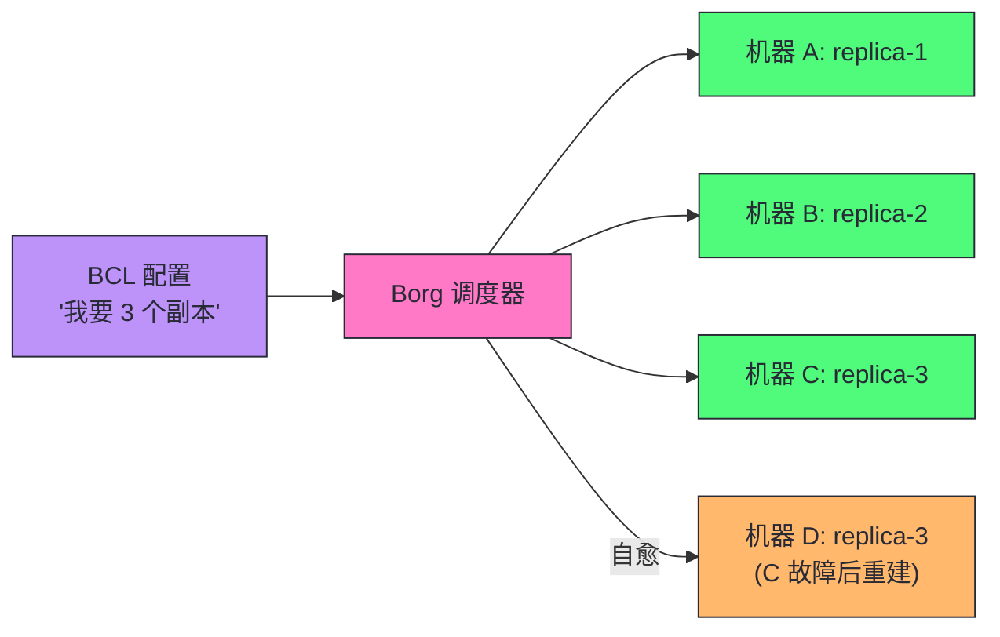
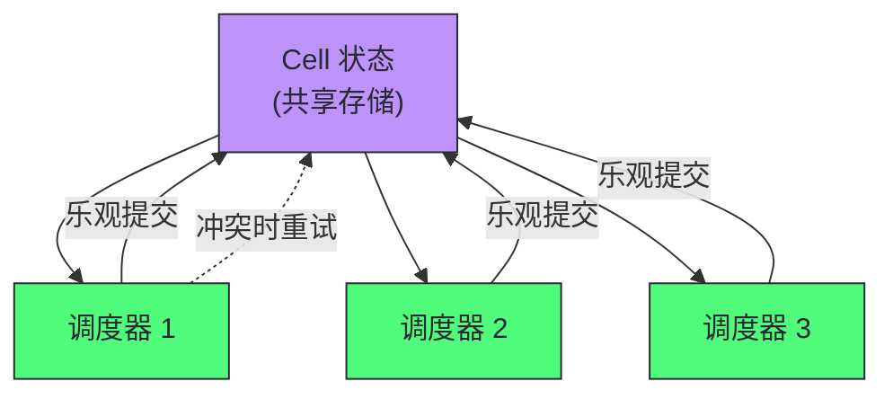
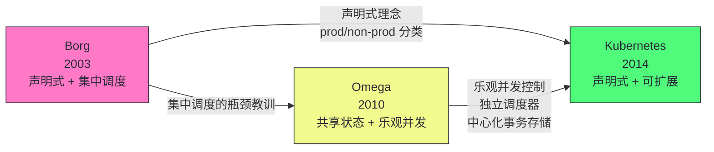
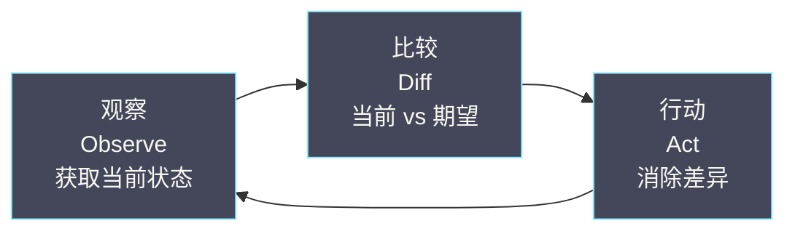
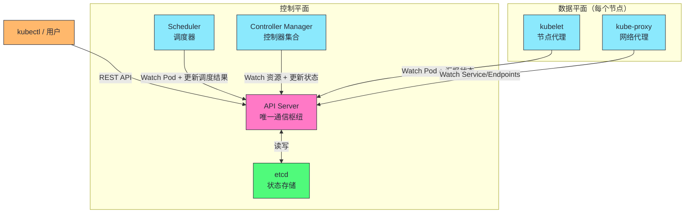
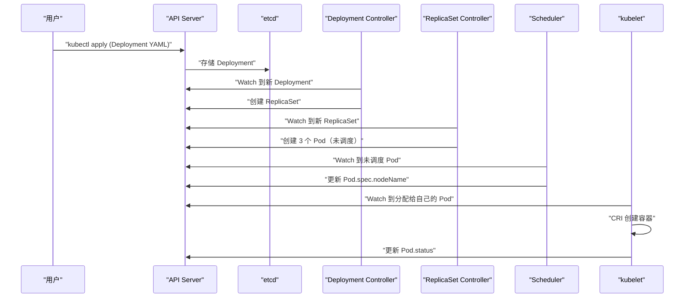
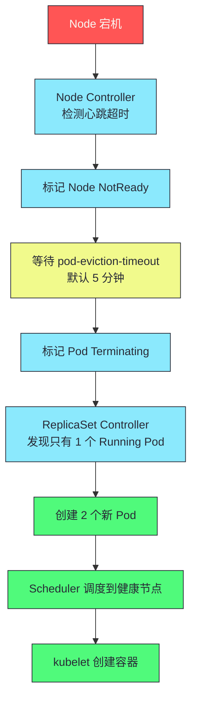

# 01 Kubernetes 的设计哲学：从 Borg 到云原生操作系统

> [!abstract] 摘要
> Kubernetes 不是凭空出现的——它脱胎于 Google 内部运行了十五年的集群管理系统 Borg，又汲取了 Borg 的继任者 Omega 在调度架构上的教训。本文从 Google 内部的集群管理演进（Borg → Omega → Kubernetes）出发，深度剖析三代系统的设计差异和工程教训。然后系统梳理 K8s 的六大核心设计原则：声明式 API、控制器模式、面向终态协调、Level-triggered 而非 Edge-triggered、松耦合的 Hub-and-Spoke 架构、以及可扩展性优先。这些原则不是抽象的"设计模式口号"，而是直接决定了 K8s 每一个组件的行为方式和每一个 API 的字段语义。最后讨论 K8s 的"非目标"——它不做什么，以及为什么不做。理解这些设计哲学，是深入学习后续所有组件实现原理的基础。核心认知：K8s 的成功不是因为它功能多，而是因为它克制——只做编排原语，把上层能力留给生态。

---

## 第 1 章 Google 的集群管理三代演进

### 1.1 为什么需要集群管理系统

在讨论 Borg/K8s 之前，先理解问题本身。Google 在 2000 年代初面临一个前所未有的工程挑战：**如何在数万台机器上高效运行数十万个应用**。

这个挑战的几个核心维度：

| 维度 | 单机时代的假设 | Google 规模的现实 |
|------|-------------|----------------|
| **机器数量** | 1 台 | 数万台 |
| **应用数量** | 几个 | 数十万 |
| **故障频率** | 月级 | 秒级（每天都有机器故障） |
| **部署速度** | 天级 | 分钟级 |
| **资源利用率** | 30-50%（单应用独占） | 需要提升到 60-80% |

单机时代的运维模式——SSH 到机器上手动启动进程——在这个规模下完全失效。你需要一个系统来：自动调度应用到合适的机器、自动重启故障的应用、自动回收故障机器上的资源、自动平衡集群负载。

这就是**集群管理系统**诞生的动机。Google 的解决方案经历了三代演进：Borg → Omega → Kubernetes。

### 1.2 第一代：Borg（2003-至今）

Borg 是 Google 内部的集群管理系统，运行了超过十五年，管理着 Google 几乎所有的生产工作负载——从搜索引擎、Gmail 到 YouTube。2015 年 Google 发表了 Borg 论文（*Large-scale cluster management at Google with Borg*），揭示了它的核心设计。

Borg 的几个关键设计思想直接影响了 Kubernetes：

**将整个数据中心视为一台计算机**

用户不需要关心应用运行在哪台物理机上，只需要告诉 Borg "我需要 2 核 CPU、4GB 内存来运行这个二进制文件"，Borg 负责找到合适的机器并启动它。这个思想直接演变为 K8s 的 Pod 调度模型——用户提交 Pod 声明，Scheduler 决定节点。

**区分 prod 和 non-prod 工作负载**

Borg 将工作负载分为两类：
- **prod**：长期运行的服务（如 Web 服务器、数据库），拥有更高的调度优先级，可以抢占 non-prod 的资源
- **non-prod**：批处理任务，优先级低，可以被抢占

这个分类在 K8s 中演变为 Deployment/StatefulSet（长期运行）和 Job/CronJob（批处理）两种工作负载对象，以及 PriorityClass 和抢占机制。

**声明式任务描述**

用户通过配置文件（BCL，Borg Configuration Language）描述期望状态——"运行 3 个副本的 Web 服务"——而不是"在机器 A 上启动一个进程，在机器 B 上启动一个进程"。Borg 负责将当前状态调整到期望状态。



> [!info] 核心概念：Borg 的声明式设计是 K8s 的直接灵感来源
> Borg 证明了一个关键工程洞察：**在大规模分布式系统中，声明式比命令式更健壮**。声明式系统的自愈能力来源于"持续比较当前状态和期望状态"——不依赖"之前发生了什么事件"。这使得系统能够从任何故障状态恢复，而不仅仅是正常流程中的错误处理。K8s 继承了这个理念，并将其推广到所有 API 对象。

### 1.3 第二代：Omega（2010-2013）

Omega 是 Google 对 Borg 调度架构的一次重大实验。Borg 使用集中式调度器——所有调度决策由一个中心节点完成。当集群规模达到数万台机器、每秒需要做出数千个调度决策时，集中式调度器成为瓶颈。

Omega 的核心创新是**共享状态调度（Shared-state Scheduling）**：



多个调度器并行工作，共享一份集群状态的副本，各自独立做出调度决策，然后通过**乐观并发控制（Optimistic Concurrency Control）** 解决冲突。如果两个调度器同时尝试将 Pod 调度到同一个节点，其中一个会在提交时发现冲突，重试。

Omega 的另一个重要理念：**所有集群状态存储在一个中心化的、支持事务的存储系统中**。在 K8s 中，这个角色由 etcd 承担。

> [!note] 设计哲学：Omega 影响了 K8s 的两个关键设计
> (1) **Scheduler 是独立组件**——K8s 的 Scheduler 是一个独立进程（kube-scheduler），可以被替换或扩展（多调度器、自定义调度器），而不是 API Server 或 Controller Manager 的一部分。(2) **乐观并发控制**——K8s 的 ResourceVersion 机制本质上是 Omega 的共享状态调度的工程化实现，我们将在第 08 篇深入讨论。

### 1.4 第三代：Kubernetes（2014-至今）

2014 年 6 月，Google 宣布开源 Kubernetes。K8s 不是 Borg 的开源版——它是 Google 工程师基于十五年 Borg 运维经验，重新设计的一个**面向外部用户的容器编排系统**。

K8s 与 Borg 的关键差异在于面向的用户群体不同：

| 维度 | Borg | Kubernetes |
|------|------|-----------|
| **用户群体** | Google 内部工程师 | 全球所有开发者 |
| **技术背景** | 熟悉分布式系统 | 背景各异 |
| **配置语言** | BCL（内部定制） | YAML/JSON（标准格式） |
| **容器技术** | 自研容器 | Docker/OCI 标准 |
| **扩展性** | 内部修改代码 | CRD + Controller |
| **API 风格** | 内部 RPC | RESTful HTTP |

这个目标差异直接驱动了 K8s 在 API 设计上的诸多决策：使用标准的 YAML/JSON 而非内部配置语言、使用 RESTful HTTP API 而非内部 RPC、提供 CRD 扩展机制而非要求修改源码。

> [!warning] 生产避坑：K8s 不是 Borg，不要用 Borg 的运维方式管理 K8s
> 很多从大厂出来的工程师试图用 Borg 的运维方式管理 K8s——比如编写复杂的调度策略、大规模定制控制器。但 K8s 的设计哲学是"低门槛高天花板"——开箱即用的默认配置覆盖 80% 场景，定制能力留给 20% 的复杂场景。先用好默认配置，再考虑定制。过度定制是 K8s 运维的常见陷阱——它增加了维护成本，且在 K8s 版本升级时容易出问题。

### 1.5 三代系统的设计传承



| Borg 贡献 | Omega 贡献 | K8s 创新 |
|----------|-----------|---------|
| 声明式任务描述 | 共享状态调度 | RESTful API |
| prod/non-prod 分类 | 乐观并发控制 | CRD 扩展机制 |
| 数据中心即计算机 | 独立调度器 | Pod 模型（多容器） |
| 自愈能力 | 中心化事务存储 | Label/Selector 松耦合 |

---

## 第 2 章 为什么 Kubernetes 赢了

### 2.1 容器编排的三国争霸

2014-2017 年，容器编排领域有三个主要竞争者：

| 系统 | 来源 | 定位 | 结局 |
|------|------|------|------|
| **Docker Swarm** | Docker 公司 | 原生编排，简单易用 | 2017 年败北 |
| **Apache Mesos + Marathon** | Twitter/Airbnb | 通用调度框架 | 2018 年后衰退 |
| **Kubernetes** | Google/CNCF | 容器编排 | 2017 年胜出 |

### 2.2 K8s 胜出的三个原因

**原因一：架构优势——声明式 + 控制器模式**

K8s 的声明式 API 和控制器模式提供了比 Swarm 的命令式操作更强大的自愈能力和扩展性。Swarm 的命令式操作（`docker service create`）虽然简单，但缺乏"期望状态"的概念——容器挂了需要手动重启或编写外部脚本。K8s 的控制器自动处理这些。

Mesos 虽然调度能力强大（两级调度器支持多种框架共存），但"通用调度框架"的定位使得它在容器编排这个具体场景上不如 K8s 专注和易用——你需要先在 Mesos 上跑一个 Marathon 框架来管理容器，增加了复杂度。

**原因二：生态优势——CNCF 中立治理**

Google 将 K8s 捐赠给了 CNCF（Cloud Native Computing Foundation），而不是由 Google 单独控制。这种中立的治理模式让 AWS、Azure、阿里云等各大云厂商放心参与——K8s 成为了所有公有云的标准容器编排层。

> [!info] 核心概念：中立治理是 K8s 生态繁荣的关键
> 如果 K8s 由 Google 独家控制，AWS 和 Azure 不会积极参与——他们不愿意把战略控制权交给竞争对手。CNCF 的中立治理解决了这个信任问题。这也是为什么 K8s 生态（Prometheus、Istio、ArgoCD、Tekton）远比 Swarm 生态繁荣——所有公司都可以放心地围绕 K8s 构建产品，不用担心 Google 改变方向。治理模式的选择对开源项目的长期成功至关重要。

**原因三：扩展性优势——CRD + Controller**

K8s 的 CRD（Custom Resource Definition）+ 控制器模式允许任何人扩展 K8s 的能力——定义新的 API 对象、编写新的控制逻辑——而无需修改 K8s 本身的代码。这使得围绕 K8s 涌现了庞大的生态：Istio（服务网格）、Prometheus（监控）、ArgoCD（GitOps）、Tekton（CI/CD）等。

2017 年 Docker 公司宣布在 Docker Enterprise 中集成 Kubernetes 支持，标志着"编排之战"的终结。

---

## 第 3 章 六大核心设计原则

### 3.1 原则一：声明式 API（Declarative over Imperative）

#### 声明式 vs 命令式

**声明式**：你告诉系统"我想要什么（What）"，系统负责"怎么做（How）"。
**命令式**：你告诉系统每一步怎么做。

```bash
# 命令式：告诉系统每一步怎么做
ssh machine-A "docker run -d --name web nginx:1.25"
ssh machine-B "docker run -d --name web nginx:1.25"
ssh machine-C "docker run -d --name web nginx:1.25"
# machine-B 挂了？你需要自己发现并在 machine-D 上重新启动
```

```yaml
# 声明式：告诉系统你想要什么
apiVersion: apps/v1
kind: Deployment
metadata:
  name: web
spec:
  replicas: 3      # 我想要 3 个副本
  template:
    spec:
      containers:
        - name: nginx
          image: nginx:1.25
# K8s 自动找到合适的机器、启动 3 个副本
# 任何一个挂了，K8s 自动重新创建
```

#### 声明式的四大优势

| 优势 | 说明 | 命令式的劣势 |
|------|------|------------|
| **幂等性** | 提交同一配置 10 次和 1 次效果一致 | 执行"创建容器"10 次会创建 10 个 |
| **自愈能力** | 持续比较当前状态和期望状态，自动修复偏差 | 没有"期望状态"概念，无法自愈 |
| **审计与版本控制** | 配置文件存 Git，变更历史一目了然 | 操作历史分散在 shell history |
| **多方协作** | 乐观并发控制确保修改基于最新状态 | 并发操作容易覆盖 |

> [!note] 设计哲学：用户描述意图，系统负责实现
> 用户不需要关心"Pod 运行在哪台机器上"、"旧 Pod 先删除还是新 Pod 先创建"——这些细节由 K8s 的控制器和调度器处理。用户只需要维护一份描述"期望状态"的 YAML 文件。这种"意图与实现分离"的设计，使得 K8s 的用户（开发者）和 K8s 的实现（控制器/调度器）可以独立演化——用户不需要了解 K8s 内部实现细节，只需要描述期望状态。

### 3.2 原则二：控制器模式（Controller Pattern）

#### 控制器的本质

**控制器**是一个持续运行的循环，它不断地：

1. **观察（Observe）**：通过 API Server 获取资源的当前状态
2. **比较（Diff）**：计算当前状态与期望状态的差异
3. **行动（Act）**：执行操作消除差异，使当前状态趋近于期望状态

这个循环被称为 **Reconcile Loop（协调循环）**。



#### 空调恒温器：控制器的完美类比

控制器模式并非 K8s 的发明——它在物理世界中无处不在。**空调的恒温器**就是一个完美的控制器：

- **期望状态**：用户设置温度 25°C
- **当前状态**：室内温度传感器读数 28°C
- **Diff**：当前温度比期望高 3°C
- **Action**：启动制冷
- 持续循环直到室内温度达到 25°C

关键点：恒温器**不会记住**"我 5 分钟前开始制冷了"——它只看当前温度和目标温度的差值。每次循环都是独立的判断。这正是 K8s 控制器的工作方式——**无状态的协调循环，基于当前状态做决策，不依赖历史操作记录**。

#### ReplicaSet 控制器的协调逻辑

```go
// 伪代码：ReplicaSet 控制器的 Reconcile 逻辑
func reconcile(replicaSet *appsv1.ReplicaSet) error {
    expectedReplicas := *replicaSet.Spec.Replicas           // 期望 3 个
    currentPods := getPodsForReplicaSet(replicaSet)         // 当前只有 2 个
    
    diff := expectedReplicas - len(currentPods)             // 差 1 个
    
    if diff > 0 {
        return createPods(replicaSet, diff)                 // 创建 1 个
    } else if diff < 0 {
        return deletePods(currentPods, -diff)               // 删除多余的
    }
    return nil  // 状态一致，无需操作
}
```

K8s 中有数十个内置控制器（Deployment Controller、StatefulSet Controller、Endpoint Controller、Node Controller……），它们各自负责不同类型资源的协调。所有控制器运行在 **kube-controller-manager** 进程中。

> [!info] 核心概念：控制器的无状态性是自愈能力的基础
> 控制器的协调循环是无状态的——每次循环都基于当前状态做决策，不依赖"上一次做了什么"。这使得控制器在面对自身故障时极其健壮——控制器崩溃重启后，重新从当前状态开始协调，不需要恢复之前的执行进度。如果协调过程中某一步失败了，下一次循环会重新尝试。这是 K8s 自愈能力的工程基础。

### 3.3 原则三：面向终态（Desired State Reconciliation）

#### 过程驱动 vs 终态驱动

传统的运维系统是**过程驱动**的——你编写一个脚本描述操作步骤："先停 A，再启 B，然后修改 C 的配置，最后重启 D"。如果脚本执行到一半失败了，系统停留在不确定的中间状态——A 已经停了，B 已经启动了，但 C 的配置没改——你需要手动判断该如何恢复。

K8s 是**终态驱动**的——你只描述最终期望的状态，K8s 负责从任何当前状态到达这个终态。即使协调过程中某一步失败了，控制器会在下一次循环中重新尝试。

#### spec 与 status 的分离

K8s 的每个 API 对象都有两个关键字段：

- **spec**：期望状态——由用户编写，描述"我想要什么"
- **status**：当前状态——由控制器更新，描述"现在是什么"

```yaml
apiVersion: apps/v1
kind: Deployment
metadata:
  name: web
spec:                          # 用户写的：期望状态
  replicas: 3
  template:
    spec:
      containers:
        - image: nginx:1.25
status:                        # 控制器更新的：当前状态
  replicas: 2                  # 当前只有 2 个副本
  readyReplicas: 2             # 2 个已就绪
  updatedReplicas: 2           # 2 个已是最新版本
  conditions:
    - type: Available
      status: "True"
```

控制器的工作就是持续将 `status` 向 `spec` 对齐。当 `status.replicas`（2）小于 `spec.replicas`（3）时，控制器创建新 Pod。当它们相等时，状态一致，控制器不行动。

> [!info] 核心概念：spec 是契约，status 是汇报
> spec 是用户与 K8s 之间的"契约"——用户声明意图，K8s 承诺履行。status 是 K8s 向用户的"汇报"——告诉用户系统当前的真实状态。所有的自动化逻辑（自愈、扩缩容、滚动更新）都建立在 spec 和 status 的差异比较之上。理解 spec/status 分离，是理解所有 K8s 控制器行为的关键——无论多么复杂的控制器，核心逻辑都是"读 spec，比较 status，采取行动"。

### 3.4 原则四：Level-triggered 而非 Edge-triggered

这是 K8s 设计中最精妙也最容易被忽视的原则。

#### 概念来源：电子工程

| 触发方式 | 定义 | 例子 |
|---------|------|------|
| **Edge-triggered** | 只在信号**变化的瞬间**做出响应 | 温度从 24°C 变到 26°C 的那一刻发警报 |
| **Level-triggered** | 只要信号**处于某个状态**就持续响应 | 只要温度高于 25°C 就持续发警报 |

#### 为什么 K8s 选择 Level-triggered

在分布式系统中，**消息可能丢失、事件可能被错过、组件可能重启**。如果系统是 Edge-triggered 的——只在事件发生的瞬间做出反应——那么错过一个事件就意味着永远错过了。

```
时刻 1：用户创建 Deployment（replicas=3）
时刻 2：Deployment Controller 收到"创建事件"，开始创建 3 个 Pod
时刻 3：Controller 创建了 2 个 Pod 后崩溃重启
时刻 4：Controller 重启后……
```

**Edge-triggered**：Controller 只响应"创建事件"。重启后，事件已消费过，不会再看到。系统停留在只有 2 个 Pod 的状态——**自愈失败**。

**Level-triggered**：Controller 重启后，不关心之前发生了什么事件。它只观察当前状态——"spec 说要 3 个 Pod，现在只有 2 个"——于是创建 1 个新 Pod。**自愈成功**。

K8s 的控制器本质上是 Level-triggered 的：Watch 事件只是**加速触发**协调循环的手段，不是协调逻辑的唯一依赖。即使没有收到任何事件，控制器也会通过定期的 **Resync**（重新同步所有资源）确保状态一致。

> [!warning] 生产避坑：写自定义控制器必须遵循 Level-triggered 原则
> 如果你编写自定义 K8s 控制器（Operator），Reconcile 函数的逻辑**必须基于资源的当前状态做决策，而不是基于"发生了什么事件"**。不要在 Reconcile 中维护"上一次处理到哪了"的状态——每次 Reconcile 都应该像第一次被调用一样，完整地评估当前状态并决定需要采取什么行动。违反这个原则的控制器在面对自身重启时会出 bug——重启后丢失了"上一次处理到哪了"的状态，导致行为异常。这是 Operator 开发中最常见的陷阱。

### 3.5 原则五：松耦合的 Hub-and-Spoke 架构

#### 所有通信通过 API Server

K8s 的组件之间**不直接通信**——所有通信都通过 API Server 作为中心枢纽。这被称为 **Hub-and-Spoke（辐射轮毂）** 架构。



#### 三个关键设计决策

**Scheduler 不直接与 kubelet 通信**。Scheduler 将调度结果写入 API Server（更新 Pod 的 `spec.nodeName`），kubelet Watch 到 Pod 被调度到自己的节点，然后拉取镜像、启动容器。Scheduler 和 kubelet 之间没有任何直接的网络连接。

**Controller Manager 不直接创建容器**。Deployment Controller 创建 ReplicaSet 对象、ReplicaSet Controller 创建 Pod 对象——都是写入 API Server。实际创建容器的是 kubelet——它 Watch 到分配给自己节点的 Pod，通过 CRI 调用 containerd 创建容器。

#### Hub-and-Spoke 的三大优势

| 优势 | 说明 |
|------|------|
| **组件可独立替换** | 每个组件只依赖 API Server 的 API，可替换默认 Scheduler 为自定义 Scheduler |
| **故障隔离** | Scheduler 崩溃不影响已运行 Pod，只是新 Pod 无法调度 |
| **可观测性** | 所有状态变更经过 API Server 并记录在 etcd，审计日志可追踪 |

> [!info] 核心概念：只有 API Server 和 etcd 是单点
> 在 K8s 的高可用架构中，只有 API Server 和 etcd 需要多实例部署——它们是整个集群的单点。其他组件（Scheduler、Controller Manager、kubelet、kube-proxy）即使崩溃，也不会导致整个集群不可用——只是它们负责的功能暂时停滞。这是 Hub-and-Spoke 架构的容错优势——故障不会级联传播。

### 3.6 原则六：可扩展性优先

K8s 从一开始就将"可扩展性"作为核心设计目标——不要求修改 K8s 源码就能扩展功能。

| 扩展点 | 机制 | 扩展场景 |
|--------|------|---------|
| **自定义资源** | CRD（Custom Resource Definition） | 定义新的 API 对象 |
| **自定义控制器** | Controller Runtime / Operator SDK | 为自定义资源编写控制逻辑 |
| **调度扩展** | Scheduler Framework / Extender | 自定义调度策略 |
| **网络扩展** | CNI 插件 | 自定义 Pod 网络实现 |
| **存储扩展** | CSI 插件 | 自定义持久化存储 |
| **准入扩展** | Admission Webhook | 自定义准入控制逻辑 |

> [!note] 设计哲学：K8s 只做编排原语，把上层能力留给生态
> K8s 提供的是"原语"（Primitives）——Pod、Service、Deployment——而不是端到端的解决方案。数据库、消息队列、监控、服务网格都不是 K8s 内核的一部分，而是通过 CRD + Controller 扩展实现。这种"只做编排，不做上层"的定位使得 K8s 成为一个可组合的平台——用户根据自己的需求选择和组合生态组件。这是 K8s 生态繁荣的根本原因——任何人都可以在不修改 K8s 源码的情况下扩展功能。

---

## 第 4 章 Kubernetes 的非目标

理解一个系统"不做什么"和理解它"做什么"同样重要。K8s 官方文档明确列出了以下非目标：

### 4.1 不限制应用类型

K8s 不在乎你跑的是 Java、Go、Python 还是 Node.js。它不提供应用层面的服务（数据库、消息队列、缓存）作为内置功能——这些通过 Operator 模式以扩展的方式提供。

### 4.2 不管理源代码，不构建应用

K8s 不关心你的代码仓库在哪里、如何编译、如何打包成镜像。CI/CD 是 K8s 之外的关注点——由 Jenkins、GitLab CI、ArgoCD 等工具处理。K8s 只接受构建好的容器镜像，负责运行和编排。

### 4.3 不提供应用级服务

日志收集、监控告警、服务网格——这些都不是 K8s 内核的一部分。K8s 提供的是可扩展的接口（如 Metrics API、自定义资源），由生态系统中的项目（Prometheus、Fluentd、Istio）实现这些功能。

### 4.4 为什么克制是优势

| 如果 K8s 内置了 | 会出现的问题 |
|----------------|------------|
| **数据库** | 用户被迫用 K8s 的数据库而非自己选择的 |
| **CI/CD** | 与 Jenkins/GitLab CI 等现有工具冲突 |
| **监控** | 与 Prometheus/Datadog 等生态冲突 |
| **服务网格** | 与 Istio/Linkerd 等生态冲突 |

> [!warning] 生产避坑：不要试图用 K8s 内置功能替代生态工具
> 有些团队试图用 K8s 的 ConfigMap + 自定义控制器实现"简化版配置中心"，用 K8s 的 Service + Ingress 实现"简化版服务网格"。这些"简化版"通常在功能、性能、可维护性上远不如专业工具，且在 K8s 版本升级时容易出问题。K8s 的定位是编排原语，上层能力用生态工具——这是 K8s 设计哲学的明确选择。克制是优势，不是缺陷。

---

## 第 5 章 设计原则的落地：一个 Pod 的完整流程

将六大原则代入一个具体场景——用户执行 `kubectl apply -f deployment.yaml` 创建一个 3 副本的 Deployment：



| 步骤 | 执行者 | 对应的设计原则 |
|------|--------|--------------|
| 用户提交 Deployment YAML | kubectl | **声明式 API**：用户只描述期望状态 |
| API Server 验证并存储到 etcd | API Server | **松耦合**：API Server 是唯一入口 |
| Deployment Controller 发现新 Deployment | Controller Manager | **控制器模式**：观察-比较-行动 |
| ReplicaSet Controller 创建 3 个 Pod | Controller Manager | **面向终态**：当前 0 个 → 期望 3 个 |
| Scheduler 分配 Pod 到节点 | Scheduler | **松耦合**：通过 API Server 间接通信 |
| kubelet 创建容器 | kubelet | **Level-triggered**：基于当前状态行动 |
| 全程异步、事件驱动 | 所有组件 | **可扩展性**：每步可通过 CRD/Webhook 扩展 |

这个过程是**异步的、事件驱动的、最终一致的**。没有一个"编排者"在指挥每一步——每个组件独立 Watch 自己关心的资源变化，独立做出决策。这种去中心化的协作模式使得 K8s 在面对组件故障时依然健壮——任何组件的临时不可用只会导致该组件负责的功能暂时停滞，不会级联影响其他组件。

---

## 第 6 章 自愈的完整链路

假设一个 Node 宕机了，上面运行着 2 个 Pod（属于一个 replicas=3 的 Deployment）：



全程无人工干预。每一步都是某个控制器"观察当前状态，与期望状态比较，采取行动"的结果。如果 ReplicaSet Controller 在创建 Pod 过程中崩溃重启——没关系，重启后它会重新检查状态（Level-triggered），发现仍然只有 1 个 Running Pod，继续创建。

> [!info] 核心概念：自愈是六大原则的协同结果
> 自愈不是某个单独的组件实现的——它是六大设计原则协同作用的结果。声明式 API 定义了"期望状态"；控制器模式持续比较当前与期望；面向终态确保从任何状态收敛；Level-triggered 确保错过事件也能恢复；松耦合确保单个组件崩溃不影响整体；可扩展性允许添加新的自愈逻辑（如 PodDisruptionBudget）。理解自愈的完整链路，就是理解 K8s 设计哲学如何在工程中落地。

---

## 总结

Kubernetes 的设计哲学可以归纳为以下主线：

1. **K8s 脱胎于 Google 十五年的集群管理经验**。Borg 贡献了声明式理念和 prod/non-prod 分类，Omega 贡献了共享状态调度和乐观并发控制，K8s 创新了 RESTful API 和 CRD 扩展机制。

2. **K8s 胜出因为架构、生态、扩展性三重优势**。声明式 + 控制器模式提供更强的自愈能力；CNCF 中立治理让所有云厂商放心参与；CRD + Controller 允许任何人扩展功能。

3. **声明式 API 是 K8s 的核心范式**。用户描述"想要什么"，系统负责"怎么做"。四大优势：幂等性、自愈、审计、多方协作。

4. **控制器模式是 K8s 的自动化基础**。观察-比较-行动的持续循环。无状态的协调循环——基于当前状态做决策，不依赖历史操作记录。

5. **面向终态是自愈能力的根本**。spec（期望）与 status（当前）分离，控制器持续将 status 向 spec 对齐。终态驱动而非过程驱动——从任何状态都能收敛。

6. **Level-triggered 是分布式健壮性的关键**。基于当前状态做决策，不依赖事件是否被消费。即使错过事件，也能通过定期 Resync 恢复。写自定义控制器必须遵循这个原则。

7. **Hub-and-Spoke 架构实现松耦合**。所有组件通过 API Server 间接通信。组件可独立替换、故障隔离、可观测。只有 API Server 和 etcd 是单点。

8. **可扩展性优先是生态繁荣的根本**。CRD、Controller、CNI、CSI、Admission Webhook——K8s 提供扩展点而非内置功能。任何人都能不修改源码扩展功能。

9. **克制是优势，不是缺陷**。K8s 只做编排原语，不内置数据库/CI/CD/监控/服务网格。上层能力留给生态——这使得 K8s 成为可组合的平台。

10. **六大原则协同实现自愈**。声明式 API 定义期望状态，控制器模式持续比较，面向终态确保收敛，Level-triggered 确保健壮，松耦合确保容错，可扩展性允许添加新逻辑。

> [!info] 专栏导航
> 本文是 [[00 专栏导览|Kubernetes 架构深度剖析专栏]] 的第 01 篇，建立了 K8s 的设计哲学认知。下一篇 [[02 声明式 API 与面向终态协调：K8s 的核心范式]] 将深入声明式 API 的技术实现——API 对象的统一结构、RESTful 设计、Spec/Status 分离的工程细节。

---

## 延伸思考

1. **你的系统是声明式还是命令式？** 如果你的运维依赖脚本和手动操作，评估迁移到声明式模型的成本。声明式的自愈能力在大规模系统中价值巨大——它消除了"手动恢复故障"的运维负担。

2. **你的控制器是否遵循 Level-triggered？** 如果你开发了自定义控制器，检查 Reconcile 函数是否基于当前状态做决策，而非依赖"上一次做了什么"。违反这个原则的控制器在重启后会出 bug。

3. **你的 K8s 使用是否过度定制？** 列出你的定制组件（自定义调度器、自定义控制器、自定义 Admission Webhook）。如果定制太多，评估是否可以用默认配置 + 生态工具替代。过度定制增加维护成本且升级困难。

4. **你的集群高可用是否覆盖了 API Server 和 etcd？** 这两个是 K8s 的单点。检查它们是否多实例部署，是否有负载均衡，是否有备份和容灾方案。

5. **你是否试图用 K8s 内置功能替代生态工具？** 如果用 ConfigMap 实现"配置中心"、用 Service+Ingress 实现"服务网格"，评估迁移到专业工具的成本。专业工具在功能、性能、可维护性上通常远优于"简化版"。

6. **你的团队是否理解 spec/status 分离？** 这是理解所有 K8s 控制器行为的关键。如果团队成员不理解这个概念，他们会困惑于"为什么 kubectl apply 后状态不是立即变化的"——因为控制器异步协调 status 向 spec 对齐。

---

## 参考资料

1. Abhishek Verma et al. (2015). *Large-scale cluster management at Google with Borg*. EuroSys'15.
2. Malte Schwarzkopf et al. (2013). *Omega: flexible, scalable schedulers for large compute clusters*. EuroSys'13.
3. Brendan Burns et al. (2016). *Borg, Omega, and Kubernetes: Lessons learned from three container-management systems over a decade*. ACM Queue.
4. Kubernetes Documentation - Concepts：https://kubernetes.io/docs/concepts/
5. Kubernetes Design Principles：https://github.com/kubernetes/design-proposals-archive
6. Brian Grant (2018). *Kubernetes Design Principles*. KubeCon keynote.
7. Joe Beda, Brendan Burns, Kelsey Hightower (2019). *Kubernetes: Up and Running*, 2nd Edition. O'Reilly.
8. K8s 源码：https://github.com/kubernetes/kubernetes（参考 v1.28+）

---

> [!note] 思考题
> 1. Kubernetes 的声明式 API——用户描述"期望状态"，Controller 负责将实际状态收敛到期望状态。与命令式 API 相比，声明式的优势在于自愈能力。但声明式也有劣势——你无法精确控制"如何"达到目标状态。在什么场景下声明式模型不够灵活（如需要特定的操作顺序）？
> 2. Kubernetes 的"最终一致性"模型——Controller 异步调谐，状态变化不是瞬间完成的。从 `kubectl apply` 到 Pod 实际运行可能需要数秒。在需要快速响应的场景中（如自动扩缩容应对流量突增），这个延迟是否可接受？你如何缩短从"决策到生效"的延迟？
> 3. Kubernetes 的 Label 和 Selector 是松耦合的对象关联机制——Service 通过 Selector 关联 Pod，Deployment 通过 Selector 关联 ReplicaSet。Label 的错误配置可能导致严重问题——如两个 Deployment 使用相同 Selector 导致 Pod 被错误管理。你在 Label 设计中遵循什么命名规范？`app.kubernetes.io/*` 推荐 Label 集有什么价值？
