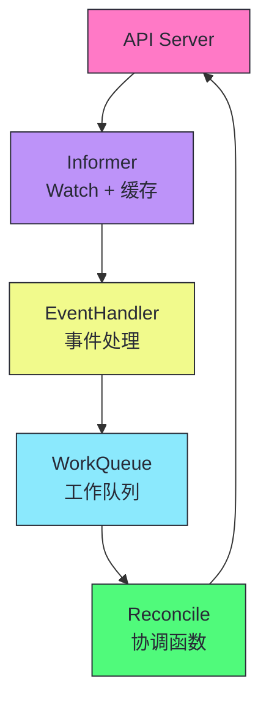
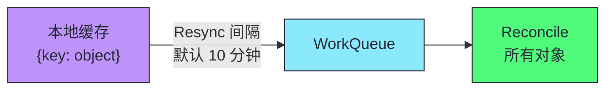
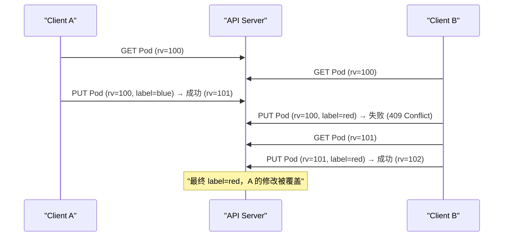
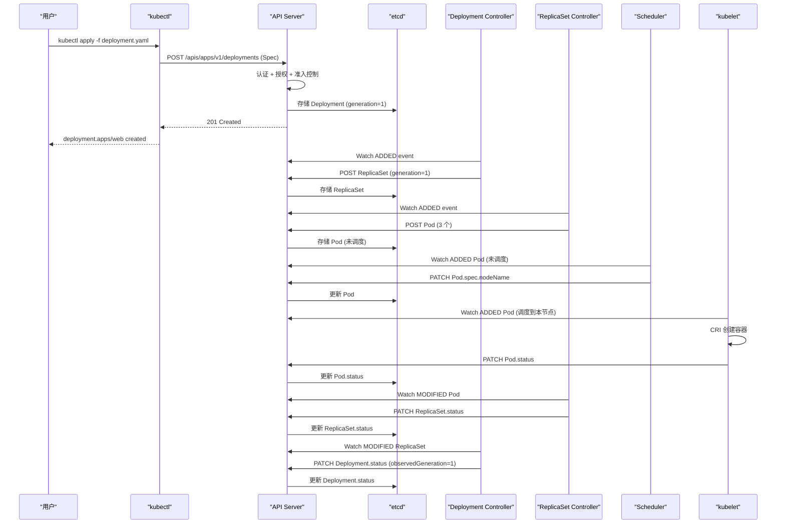

# 02 声明式 API 与面向终态协调：K8s 的核心范式

> [!abstract] 摘要
> 本文深入 Kubernetes 最核心的工程范式——声明式 API 和面向终态协调。第 01 篇从设计哲学层面讨论了"为什么选择声明式"，本文从技术实现层面讲透"声明式 API 如何落地"。首先剖析 K8s API 的 RESTful 设计——资源即 URL、HTTP 动词映射 CRUD、Watch 端点实现事件流。然后深入 API 对象的统一四段式结构：TypeMeta（类型标识）、ObjectMeta（身份与并发控制）、Spec（期望状态）、Status（当前状态）。讲透 Spec/Status 分离的工程含义——为什么用户只能写 Spec、控制器只能写 Status，以及 generation 和 observedGeneration 如何衡量"控制器是否已处理用户的最新变更"。然后从源码级讨论控制器协调循环的工程实现——Informer、WorkQueue、Reconcile 函数的三层架构，以及为什么协调循环必须幂等、必须无状态、必须基于当前状态而非事件历史。最后讨论声明式 API 的代价——异步性带来的延迟、调试困难、以及"last-write-wins"的冲突解决策略。核心认知：声明式不是"配置即代码"，而是"意图即契约"——用户提交 Spec 是与系统签订契约，系统承诺持续将 Status 向 Spec 收敛。

---

## 第 1 章 K8s API 的 RESTful 设计

### 1.1 资源即 URL

K8s API 完全遵循 RESTful 风格——每种资源类型对应一个 URL 路径，HTTP 动词对应 CRUD 操作。

| HTTP 动词 | K8s 操作 | URL 路径示例 | 说明 |
|----------|---------|------------|------|
| GET | 读取 | `/api/v1/pods` | 列出 Pod |
| GET | 读取 | `/api/v1/pods/web-abc` | 读取单个 Pod |
| POST | 创建 | `/api/v1/pods` | 创建 Pod |
| PUT | 更新 | `/api/v1/pods/web-abc` | 全量更新 |
| PATCH | 局部更新 | `/api/v1/pods/web-abc` | 局部更新 |
| DELETE | 删除 | `/api/v1/pods/web-abc` | 删除 Pod |

### 1.2 API 路径的层级结构

```
/api/v1/namespaces/default/pods/web-abc
│   │   │         │       │    │
│   │   │         │       │    └── 对象名
│   │   │         │       └── 资源类型（复数）
│   │   │         └── Namespace
│   │   └── 版本（核心组无组名）
│   └── 核心组
└── API 根路径

/apis/apps/v1/namespaces/default/deployments/web
│   │   │   │         │       │           │
│   │   │   │         │       │           └── 对象名
│   │   │   │         │       └── 资源类型
│   │   │   │         └── Namespace
│   │   │   └── 版本
│   │   └── API 组
│   └── API 根路径（命名组）
└── API 根路径
```

> [!info] 核心概念：核心组 vs 命名组的 URL 差异
> K8s 最初所有资源都在"核心组"（core group），URL 是 `/api/v1/...`。后来为了可管理性引入了 API 组的概念，新资源放在命名组中，URL 是 `/apis/<组>/<版本>/...`。核心资源（Pod、Service、ConfigMap、Node、Namespace、Event、Secret、PersistentVolume 等）保留了无组名的 `v1`，这是历史遗留——核心组没有组名是因为它早于 API 组机制。理解这个差异很重要——kubectl 的 `api-resources` 命令会显示每个资源的 API 组，核心组显示为空。

### 1.3 Watch 端点：RESTful 的事件流扩展

K8s 在标准 RESTful 之外增加了一个关键扩展——**Watch 端点**。在 GET 请求中添加 `?watch=true` 参数，API Server 会将响应从"一次性返回所有对象"变为"持续推送资源变更事件"。

```
GET /api/v1/pods?watch=true&resourceVersion=12345
```

响应是一个**持续打开的 HTTP 长连接**，服务器不断推送 JSON 事件：

```json
{"type":"ADDED","object":{"kind":"Pod","metadata":{"name":"web-abc",...},...}}
{"type":"MODIFIED","object":{"kind":"Pod","metadata":{"name":"web-abc",...},...}}
{"type":"DELETED","object":{"kind":"Pod","metadata":{"name":"web-abc",...},...}}
{"type":"BOOKMARK","object":{...,"resourceVersion":"12350"}}
```

| 事件类型 | 说明 |
|---------|------|
| **ADDED** | 资源被创建 |
| **MODIFIED** | 资源被更新 |
| **DELETED** | 资源被删除 |
| **BOOKMARK** | 仅更新 resourceVersion，不携带对象（防止客户端 Watch 卡在旧版本） |

> [!note] 设计哲学：Watch 是 RESTful 的增量扩展，不破坏 HTTP 语义
> K8s 没有引入 WebSocket 或自定义协议来实现事件流——它用标准的 HTTP 长连接（chunked transfer encoding）在 GET 请求上扩展了一个 `?watch=true` 参数。这使得 Watch 端点可以穿透标准的 HTTP 代理、负载均衡器和 CDN，无需特殊配置。这种"不破坏 HTTP 语义"的设计是 K8s API 在大规模分布式环境中可靠运行的基础——任何理解 HTTP 的基础设施都能承载 K8s API 流量。

---

## 第 2 章 API 对象的统一四段式结构

### 2.1 为什么需要统一结构

想象一个没有统一对象模型的编排系统——每种资源都有独特的数据结构：Pod 用 `name`，Deployment 用 `deployment_name`，Service 用 `svc_id`。这种混乱会导致：工具无法通用（kubectl 需为每种资源编写不同展示逻辑）、控制器无法通用（垃圾回收器需为每种资源编写特殊解析逻辑）、客户端库无法自动生成。

K8s 的解决方案：**所有 API 资源都遵守统一结构**。

```yaml
apiVersion: apps/v1            # ┐ TypeMeta：类型信息
kind: Deployment               # ┘
metadata:                      # ─ ObjectMeta：元数据
  name: web
  namespace: default
  labels:
    app: nginx
  resourceVersion: "12345"
  uid: "abc-def-123"
  creationTimestamp: "2026-07-17T10:00:00Z"
  ownerReferences: []
spec:                          # ─ Spec：期望状态（用户定义）
  replicas: 3
  selector:
    matchLabels:
      app: nginx
  template:
    spec:
      containers:
        - name: nginx
          image: nginx:1.25
status:                        # ─ Status：当前状态（系统填写）
  replicas: 3
  readyReplicas: 3
  availableReplicas: 3
```

### 2.2 TypeMeta：类型标识

TypeMeta 包含 `apiVersion` 和 `kind`，联合起来唯一标识资源类型。API Server 据此将请求路由到正确的处理逻辑。

| 资源 | apiVersion | kind |
|------|-----------|------|
| Pod | `v1` | Pod |
| Deployment | `apps/v1` | Deployment |
| Job | `batch/v1` | Job |
| CustomResource | `example.com/v1` | MyResource |

### 2.3 ObjectMeta：身份与并发控制

ObjectMeta 是所有 K8s 对象共享的元数据结构，每个字段都有明确的设计目的：

#### 身份标识

| 字段 | 说明 |
|------|------|
| **name** | 对象名，同 Namespace + 同资源类型下唯一 |
| **namespace** | 所属 Namespace（集群级资源无此字段） |
| **uid** | 全局唯一 UUID，创建时自动生成，删除重建后不同 |

> [!info] 核心概念：name 是逻辑标识，uid 是物理标识
> `name + namespace + resource type` 构成对象的"逻辑标识"——同一 Namespace 不能有两个同名 Deployment。但 `uid` 是"物理标识"——删除后重建同名对象，新对象 uid 不同。Garbage Collector 使用 uid（而非 name）判断 OwnerReference 的有效性——如果 Owner 被删除后重建（uid 变了），旧的 OwnerReference 不再匹配，子对象会被垃圾回收。这是 K8s 处理"同名但不同实例"的精妙机制。

#### 并发控制

| 字段 | 说明 |
|------|------|
| **resourceVersion** | etcd 中的版本号，每次修改递增，乐观并发控制的核心 |
| **generation** | spec 部分被修改的次数，只有 spec 变更递增 |

**resourceVersion** 的乐观并发控制流程：

```
时刻1：Client A 读取 Pod（resourceVersion=100）
时刻2：Client B 读取 Pod（resourceVersion=100）
时刻3：Client A 更新 Pod（携带 resourceVersion=100）→ 成功，resourceVersion 变为 101
时刻4：Client B 更新 Pod（携带 resourceVersion=100）→ 失败！当前是 101
时刻5：Client B 重新读取 Pod（resourceVersion=101），合并变更，重新更新 → 成功
```

> [!warning] 生产避坑：不要在控制器中缓存 resourceVersion 跨多次协调使用
> resourceVersion 只在单次读-改-写操作中有效。控制器在协调循环中读取对象的 resourceVersion，更新时携带它——这是正确的。但如果控制器缓存了 resourceVersion 并在多次协调循环中复用，会导致更新失败（对象已被其他组件修改）。每次协调循环都应重新读取对象的最新状态，而非使用缓存的状态。这是 Level-triggered 原则在并发控制上的体现——基于当前状态做决策，不依赖历史状态。

#### 关联关系

| 字段 | 说明 |
|------|------|
| **labels** | 键值对，用于 Selector 查询过滤 |
| **annotations** | 键值对，用于附加任意非查询元数据 |
| **ownerReferences** | 拥有者列表，用于垃圾回收和级联删除 |

```yaml
# ReplicaSet 拥有 Pod 的 OwnerReference 示例
metadata:
  ownerReferences:
    - apiVersion: apps/v1
      kind: ReplicaSet
      name: web-abc
      uid: "rs-uid-123"
      controller: true        # 是否为直接控制器
      blockOwnerDeletion: true # 是否阻止 Owner 删除直到此对象被删除
```

### 2.4 Spec：期望状态（用户契约）

**Spec 是用户与 K8s 签订的"契约"**——用户在 spec 中描述期望状态，K8s 承诺持续将实际状态向 spec 对齐。

spec 的几个关键特性：

| 特性 | 说明 |
|------|------|
| **用户可写** | 只有用户（或代表用户的控制器）可以修改 spec |
| **控制器只读** | 控制器不修改 spec（除了某些自动扩缩容场景） |
| **变更触发协调** | spec 变更递增 generation，控制器检测到 generation 变化后重新协调 |
| **声明式** | 描述"想要什么"，不描述"怎么做" |

> [!note] 设计哲学：spec 是意图，不是过程
> spec 描述的是"期望状态"（我要 3 个副本），不是"操作过程"（先创建 A，再创建 B，再创建 C）。这使得 spec 天然幂等——提交同一份 spec 10 次和 1 次效果一致。控制器负责从任何当前状态到达 spec 描述的终态，不依赖"之前做了什么"。这是 K8s 自愈能力的根本——控制器每次都从当前状态向 spec 收敛，而非从"上一次操作进度"继续。

### 2.5 Status：当前状态（系统汇报）

**Status 是 K8s 向用户的"汇报"**——控制器更新 status，描述系统当前的真实状态。

status 的几个关键特性：

| 特性 | 说明 |
|------|------|
| **控制器可写** | 控制器更新 status 反映协调结果 |
| **用户只读** | 用户不直接修改 status（除非有特殊权限） |
| **observedGeneration** | 控制器已处理的 spec generation 值 |
| **conditions** | 标准化的状态条件列表 |

#### observedGeneration：控制器进度的衡量

```yaml
spec:
  # ... 用户期望 ...
status:
  observedGeneration: 5    # 控制器已处理到 spec 的第 5 次变更
  # generation=6 时，observedGeneration=5 表示控制器还没处理最新变更
```

`observedGeneration` 是衡量"控制器是否已处理用户最新变更"的关键指标。当 `observedGeneration < generation` 时，表示用户修改了 spec 但控制器还没来得及处理——kubectl 会显示 "Progressing" 状态。

#### conditions：标准化的状态条件

```yaml
status:
  conditions:
    - type: Available        # 条件类型
      status: "True"         # True/False/Unknown
      reason: MinimumReplicasAvailable  # 机器可读的原因
      message: "Deployment has minimum availability."  # 人类可读的说明
      lastUpdateTime: "2026-07-17T10:01:00Z"
      lastTransitionTime: "2026-07-17T10:01:00Z"
```

conditions 是 K8s 资源状态的**标准化表达方式**——不同资源定义不同的 condition type（如 Deployment 的 Available/Progressing、Pod 的 Ready/ContainersReady/PodScheduled/Initialized）。

> [!info] 核心概念：Spec/Status 分离是 K8s 的核心工程契约
> Spec/Status 分离不是简单的字段组织——它是一个工程契约：**用户拥有 spec，系统拥有 status**。用户不直接修改 status，控制器不直接修改 spec（除了自动扩缩容等特殊场景）。这种分离使得多个组件可以同时观察一个对象——用户看 spec 知道"期望什么"，控制器看 status 知道"现在是什么"，监控看 status 判断"系统是否健康"。理解这个契约，是理解所有 K8s 控制器行为的关键——无论多么复杂的控制器，核心逻辑都是"读 spec，比较 status，采取行动让 status 向 spec 收敛"。

---

## 第 3 章 控制器协调循环的工程实现

### 3.1 三层架构：Informer + WorkQueue + Reconcile

K8s 控制器的工程实现通常采用三层架构：



#### 第一层：Informer（Watch + 本地缓存）

Informer 通过 List-Watch 协议从 API Server 获取资源，维护一份本地缓存。Watch 事件触发后，Informer 调用 EventHandler。

#### 第二层：WorkQueue（工作队列）

EventHandler 不直接调用 Reconcile，而是将对象的 key（namespace/name）放入 WorkQueue。WorkQueue 的特性：

| 特性 | 说明 |
|------|------|
| **去重** | 同一 key 多次入队只处理一次 |
| **延迟** | 支持延迟入队（如失败后延迟 30 秒重试） |
| **限速** | 限制每秒处理的对象数，避免突发流量冲击 API Server |
| **有序** | 同一 key 的多次变更按顺序处理 |

#### 第三层：Reconcile（协调函数）

Reconcile 从 WorkQueue 取出 key，从 Informer 本地缓存读取对象的**最新状态**，比较 spec 和 status，采取行动。

```go
// 伪代码：Reconcile 函数的标准结构
func (r *Reconciler) Reconcile(ctx context.Context, req ctrl.Request) (ctrl.Result, error) {
    // 1. 从缓存读取对象的最新状态
    var deployment appsv1.Deployment
    if err := r.Get(ctx, req.NamespacedName, &deployment); err != nil {
        if errors.IsNotFound(err) {
            return ctrl.Result{}, nil  // 对象已删除，无需处理
        }
        return ctrl.Result{}, err  // 读取失败，重试
    }

    // 2. 比较 spec 和 status
    diff := deployment.Spec.Replicas - deployment.Status.ReadyReplicas

    // 3. 采取行动消除差异
    if diff > 0 {
        // 创建 Pod...
    } else if diff < 0 {
        // 删除 Pod...
    }

    // 4. 更新 status
    deployment.Status.ObservedGeneration = deployment.Generation
    if err := r.Status().Update(ctx, &deployment); err != nil {
        return ctrl.Result{}, err  // 更新失败，重试
    }

    return ctrl.Result{}, nil  // 成功，不重试
}
```

### 3.2 协调循环的三大铁律

> [!warning] 生产避坑：协调循环的三大铁律
> 1. **幂等性**：Reconcile 函数必须幂等——多次执行同一 Reconcile 的效果与执行一次一致。因为 WorkQueue 可能在失败后重试，或因 Resync 被重复触发。
> 2. **无状态性**：Reconcile 函数不应依赖"上一次做了什么"——每次都从缓存读取对象的最新状态，基于当前状态做决策。这是 Level-triggered 原则的体现。
> 3. **基于当前状态而非事件**：Reconcile 函数的输入是对象的 key（namespace/name），不是"发生了什么事件"。EventHandler 转换事件为 key 入队，Reconcile 只关心"这个对象当前的状态与期望状态是否一致"。

### 3.3 Resync 机制：Level-triggered 的工程保障

即使没有收到任何 Watch 事件，Informer 也会定期触发 **Resync**——将本地缓存中的所有对象 key 重新放入 WorkQueue，触发所有对象的 Reconcile。



Resync 的价值：

| 场景 | 没有 Resync | 有 Resync |
|------|-----------|----------|
| **Watch 事件丢失** | 状态永久不一致 | 下次 Resync 时恢复 |
| **控制器重启后** | 只处理重启后的事件 | Resync 触发所有对象重新协调 |
| **外部状态变化** | 控制器无感知 | Resync 重新检查所有对象 |

> [!info] 核心概念：Resync 是 Level-triggered 原则的工程保障
> Resync 确保即使错过 Watch 事件，控制器也能通过定期全量重新协调恢复一致状态。这是 Level-triggered 原则在工程上的具体实现——不依赖事件是否被消费，定期检查当前状态。Resync 间隔（默认 10 分钟）是一个权衡——间隔短增加 API Server 负载，间隔长恢复慢。对于关键控制器，可以缩短 Resync 间隔；对于非关键控制器，保持默认值以减少负载。

---

## 第 4 章 声明式 API 的代价

### 4.1 异步性带来的延迟

声明式 API 是异步的——`kubectl apply` 提交 spec 后，控制器需要时间协调 status。从 apply 到 Pod 实际运行可能需要数秒。

```
kubectl apply ──→ API Server 存储 spec ──→ Controller Watch 到变更 ──→ Reconcile ──→ 创建 Pod ──→ 调度 ──→ kubelet 创建容器
     <─────────────────────── 数秒到数十秒 ──────────────────────────────>
```

| 延迟来源 | 典型耗时 |
|---------|---------|
| API Server 处理请求 | ~10ms |
| Controller Watch 到变更 | ~100ms |
| Reconcile 执行 | ~100ms |
| Scheduler 调度 | ~100ms |
| kubelet 创建容器 | 数秒（含镜像拉取） |

### 4.2 调试困难

声明式系统的调试比命令式困难——没有一个"执行到哪一步了"的明确进度。你需要从多个组件的状态推断：

| 调试问题 | 排查方法 |
|---------|---------|
| Pod 没创建 | `kubectl get deployment` 看 status.replicas |
| Pod 创建了但没调度 | `kubectl get pod -o wide` 看 NODE 列 |
| Pod 调度了但没运行 | `kubectl describe pod` 看 Events |
| Pod 运行了但不健康 | `kubectl logs` 看容器日志 |

### 4.3 Last-Write-Wins 的冲突解决

当多个组件同时修改同一对象时，K8s 采用乐观并发控制——resourceVersion 不匹配的更新被拒绝，客户端需要重试。但重试时的合并策略是 **Last-Write-Wins**（最后写入胜出）——后写入的版本覆盖先写入的。



> [!warning] 生产避坑：Last-Write-Wins 可能丢失变更
> 如果 Client A 和 Client B 同时修改同一对象的不同字段，Last-Write-Wins 可能丢失 A 的变更——B 重试时基于 A 修改后的版本，但如果 B 是全量 PUT（而非 PATCH），B 的请求会覆盖 A 的修改。解决方案：(1) 使用 PATCH 而非 PUT，只修改需要变更的字段；(2) 使用 Strategic Merge Patch，K8s 的特殊合并策略（如 list 的 merge key）；(3) 使用 Server-Side Apply（K8s 1.18+），让 API Server 跟踪每个字段的拥有者，避免冲突字段的覆盖。

---

## 第 5 章 Server-Side Apply：声明式 API 的演进

### 5.1 传统客户端 Apply 的问题

传统的 `kubectl apply` 是客户端操作——kubectl 读取服务器上的当前状态，与本地 YAML 对比计算 diff，生成 PATCH 请求。问题：

| 问题 | 说明 |
|------|------|
| **冲突丢失** | 多个控制器管理同一对象时，Last-Write-Wins 覆盖变更 |
| **全量 vs 局部** | PUT 全量更新可能覆盖其他字段的变更 |
| **无法跟踪字段所有权** | 谁管理哪个字段不明确 |

### 5.2 Server-Side Apply 的解决方案

**Server-Side Apply**（SSA，K8s 1.18+）将 apply 逻辑从客户端移到服务器端，并引入**字段所有权**（Field Ownership）概念——每个字段记录"谁管理这个字段"，冲突时 API Server 可以智能合并。

```yaml
# Server-Side Apply 请求
apiVersion: apps/v1
kind: Deployment
metadata:
  name: web
  managedFields:  # API Server 自动维护
    - manager: kubectl-client-side-apply
      operation: Update
      fieldsV1:
        f:spec:
          f:replicas: {}
    - manager: controller-manager
      operation: Update
      fieldsV1:
        f:status:
          f:readyReplicas: {}
```

| SSA 特性 | 说明 |
|---------|------|
| **字段所有权** | 每个字段记录管理者（manager） |
| **冲突检测** | 两个 manager 试图管理同一字段时返回 409 |
| **强制覆盖** | 可通过 `force: true` 强制接管字段所有权 |
| **三方合并** | 基于 managedFields 智能合并，不丢失非冲突字段 |

> [!info] 核心概念：Server-Side Apply 是声明式 API 的成熟形态
> SSA 解决了传统客户端 Apply 的冲突丢失问题——通过字段所有权跟踪，API Server 知道每个字段由谁管理，冲突时可以智能合并而非简单覆盖。这使得多个组件（如 kubectl、Helm、Operator）可以协同管理同一对象的不同字段，而不会互相覆盖。这是声明式 API 的成熟形态——从"全量 apply"演化为"字段级 apply"。对于有多个管理者的场景（如 Helm + Operator 同时管理一个 Deployment），SSA 是推荐的方式。

---

## 第 6 章 从 API 到控制器：完整链路示例

以 `kubectl apply -f deployment.yaml` 为例，完整链路：



> [!note] 设计哲学：每一步都是声明式的
> 整个链路中，没有任何一个组件"命令"另一个组件做什么。每个组件都是独立 Watch 自己关心的资源，基于当前状态做出决策，将结果写回 API Server。这种"通过共享状态协调"（coordination through shared state）的模式，使得组件之间完全解耦——任何组件的故障不会阻塞其他组件。这是 K8s 声明式哲学的完整体现——从 API 到控制器到 kubelet，全链路都是"观察-比较-行动"的协调循环。

---

## 总结

声明式 API 与面向终态协调的核心知识可以归纳为以下主线：

1. **K8s API 完全 RESTful**。资源即 URL，HTTP 动词映射 CRUD。Watch 端点用 HTTP 长连接扩展事件流，不破坏 HTTP 语义。

2. **核心组 vs 命名组的 URL 差异**。核心资源（Pod/Service/ConfigMap）用 `/api/v1/...`，命名组资源用 `/apis/<组>/<版本>/...`。核心组无组名是历史遗留。

3. **统一四段式结构**。TypeMeta（类型）、ObjectMeta（身份与并发控制）、Spec（期望状态）、Status（当前状态）。所有资源共享这个结构，使得工具链和控制器框架可通用。

4. **name 是逻辑标识，uid 是物理标识**。Garbage Collector 用 uid 判断 OwnerReference 有效性——删除重建后 uid 变化，旧 OwnerReference 失效。

5. **resourceVersion 是乐观并发控制的核心**。读-改-写操作必须携带 resourceVersion，不匹配时返回 409 Conflict。客户端重试。

6. **generation 只在 spec 变更时递增**。observedGeneration 衡量控制器是否已处理用户最新变更。observedGeneration < generation 表示控制器还没处理。

7. **Spec/Status 分离是工程契约**。用户拥有 spec，系统拥有 status。控制器读 spec、写 status，不修改 spec（除自动扩缩容等特殊场景）。

8. **控制器三层架构**。Informer（Watch + 缓存）→ WorkQueue（去重 + 限速）→ Reconcile（协调函数）。EventHandler 转换事件为 key 入队。

9. **协调循环三大铁律**。幂等性（多次执行效果一致）、无状态性（基于当前状态而非历史）、基于当前状态而非事件。

10. **Resync 是 Level-triggered 的工程保障**。定期全量重新协调，即使错过 Watch 事件也能恢复一致。默认间隔 10 分钟。

11. **声明式 API 的代价**。异步性带来延迟、调试困难、Last-Write-Wins 可能丢失变更。

12. **Server-Side Apply 是声明式 API 的成熟形态**。字段所有权跟踪，智能合并而非简单覆盖。多组件协同管理同一对象时推荐 SSA。

> [!info] 专栏导航
> 本文是 [[00 专栏导览|Kubernetes 架构深度剖析专栏]] 的第 02 篇，深入声明式 API 的技术实现。上一篇 [[01 Kubernetes 的设计哲学：从 Borg 到云原生操作系统]] 建立了设计哲学认知，本文在此基础上讲透声明式 API 的工程落地。下一篇 [[03 架构全景：控制平面、数据平面与一个 Pod 的完整生命周期]] 将从组件视角拆解 K8s 的整体架构——每个组件的职责、内部工作机制和交互方式。

---

## 延伸思考

1. **你的控制器是否遵循三大铁律？** 检查你的 Reconcile 函数——是否幂等？是否无状态？是否基于当前状态而非事件历史？违反任何一个铁律都会在生产中出 bug。

2. **你是否用 PATCH 而非 PUT 更新对象？** PUT 全量更新可能覆盖其他字段的变更。使用 PATCH 或 Server-Side Apply 避免变更丢失。

3. **你的多组件协作是否用了 Server-Side Apply？** 如果多个组件（kubectl、Helm、Operator）管理同一对象，SSA 的字段所有权跟踪可以避免冲突覆盖。K8s 1.18+ 支持 SSA。

4. **你的控制器 Resync 间隔是否合理？** 默认 10 分钟对大多数场景够用。对于关键控制器（如节点控制器），可以缩短间隔加快恢复速度——但注意 API Server 负载。

5. **你是否理解 observedGeneration 的价值？** 它是判断"控制器是否已处理用户最新变更"的关键指标。如果 observedGeneration < generation，kubectl 显示 "Progressing"，表示还在处理中。

6. **你的控制器是否正确处理对象删除？** Reconcile 函数中 Get 返回 NotFound 时，应返回成功而非错误——对象已删除，无需处理。常见 bug 是 NotFound 时返回错误导致无限重试。

7. **你是否在控制器中使用了 WorkQueue 的限速功能？** 限速可以避免突发流量冲击 API Server。对于高频更新的资源，设置合理的限速参数（如 10 QPS）保护 API Server。

8. **你是否理解 Watch 事件的 BOOKMARK 类型？** BOOKMARK 不携带对象，只更新 resourceVersion，防止客户端 Watch 卡在旧版本。如果你的 Watch 客户端不处理 BOOKMARK，可能错过后续事件。

---

## 参考资料

1. Kubernetes API Conventions：https://github.com/kubernetes/community/blob/master/contributors/devel/sig-architecture/api-conventions.md
2. Kubernetes Controller Patterns：https://github.com/kubernetes/community/blob/master/contributors/devel/sig-architecture/controller_patterns.md
3. Server-Side Apply 文档：https://kubernetes.io/docs/reference/using-api/server-side-apply/
4. client-go Informer 机制：https://pkg.go.dev/k8s.io/client-go/informers
5. controller-runtime 文档：https://pkg.go.dev/sigs.k8s.io/controller-runtime
6. K8s 源码：https://github.com/kubernetes/kubernetes（参考 v1.28+ 的 staging/src/k8s.io/client-go）

---

> [!note] 思考题
> 1. Server-Side Apply 引入了"字段所有权"概念——每个字段记录"谁管理这个字段"，冲突时 API Server 智能合并。这与传统的 Last-Write-Wins 相比有什么优势？在什么场景下 SSA 特别有价值（如多个 Operator 管理同一 Deployment 的不同字段）？
> 2. K8s 的 resourceVersion 是 etcd 的 ModRevision——全局单调递增。这意味着不同资源的 resourceVersion 可以比较大小（虽然语义上无意义）。如果你在控制器中比较两个不同资源的 resourceVersion，会得到什么结论？这种比较有什么实际用途或风险？
> 3. observedGeneration 是控制器汇报"我已处理到 spec 的第几次变更"。如果控制器崩溃重启后，observedGeneration 会重置吗？如果不会，控制器如何确保重启后正确处理 spec 的最新变更（而非基于旧的 observedGeneration 跳过）？
