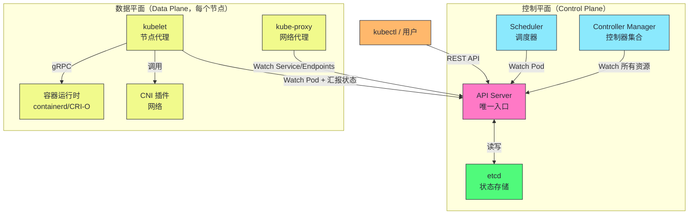
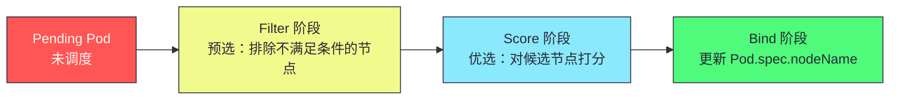
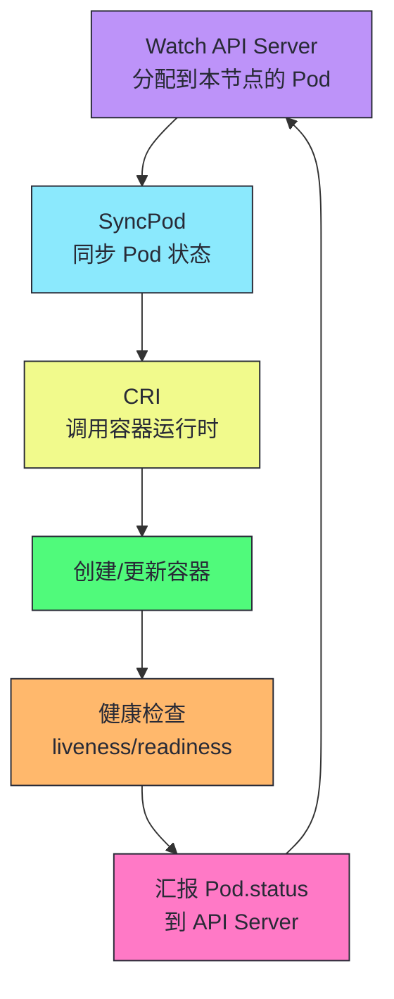
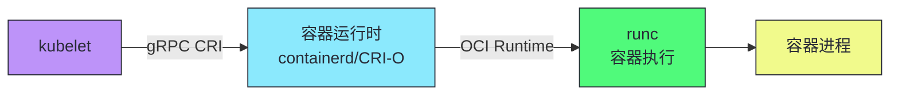
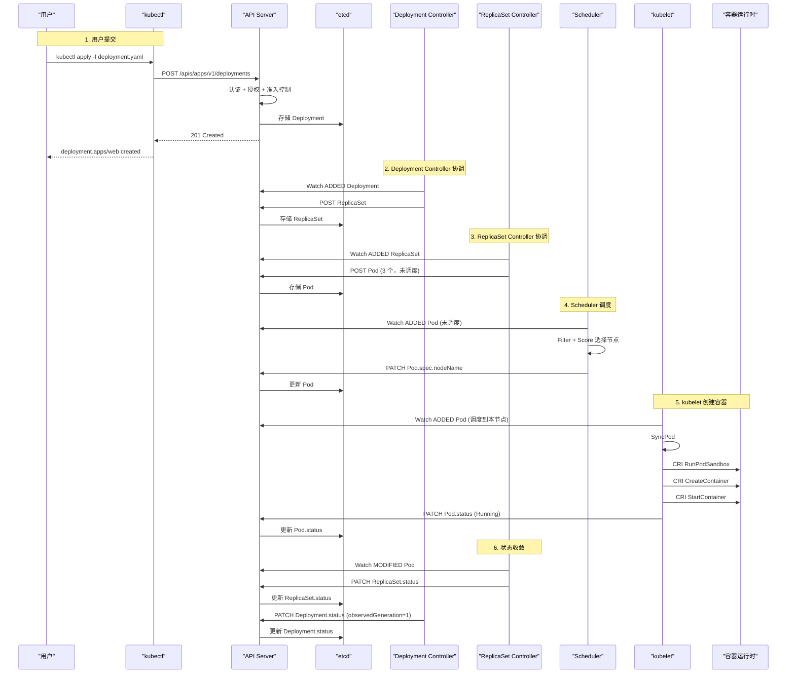
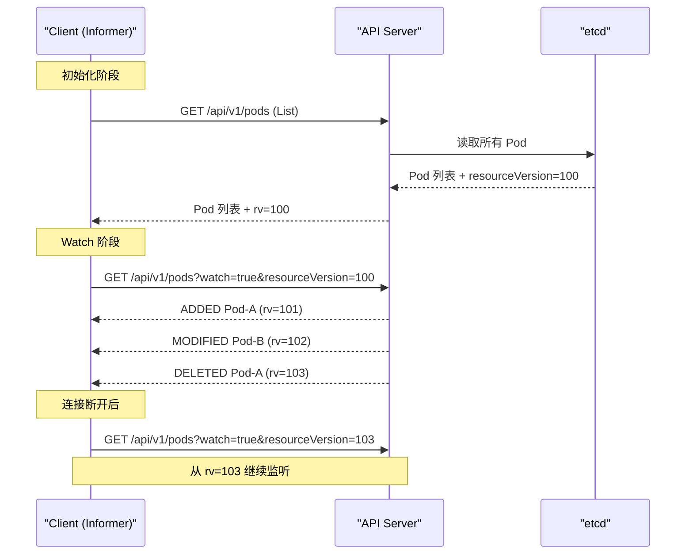
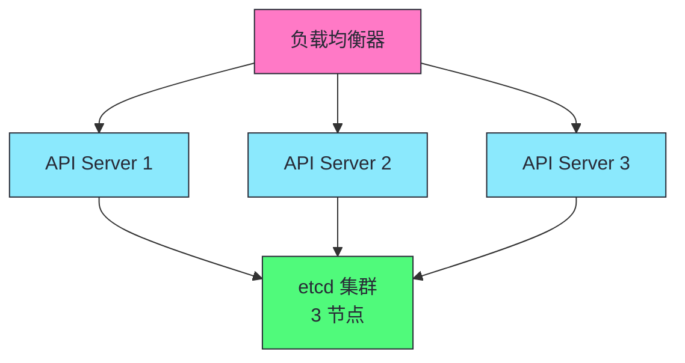
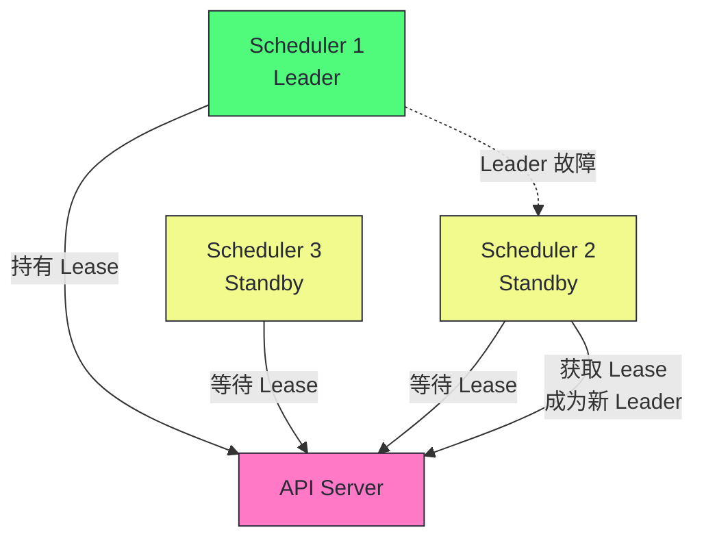

# 03 架构全景：控制平面、数据平面与一个 Pod 的完整生命周期

> [!abstract] 摘要
> 本文从组件视角拆解 Kubernetes 的整体架构。K8s 分为控制平面（API Server、etcd、Scheduler、Controller Manager）和数据平面（kubelet、kube-proxy、容器运行时）。控制平面是"大脑"——做决策、存状态、协调组件；数据平面是"四肢"——执行决策、运行容器、实现网络。文章首先详解每个组件的职责和内部结构，然后用一个 Pod 从提交到运行的完整链路串联所有组件——`kubectl apply` → API Server → etcd → Deployment Controller → ReplicaSet Controller → Scheduler → kubelet → CRI → 容器运行时。之后深入组件间的通信协议——List-Watch、gRPC（CRI）、gRPC（CSI）、CNI 插件调用。最后讨论控制平面的高可用架构——多实例 API Server + etcd 集群 + Leader Election。核心认知：K8s 的所有组件都是"无状态协调者"——除了 etcd 存储状态外，其他组件都是 Watch API Server 并做出反应，组件间没有直接通信，所有协调通过共享状态（etcd 中的对象）完成。

---

## 第 1 章 控制平面：集群的大脑

### 1.1 控制平面的四个组件



### 1.2 API Server：唯一入口

**API Server**（kube-apiserver）是 K8s 控制平面的"前台总调度"——所有组件和用户都通过它读写集群状态。

| 职责 | 说明 |
|------|------|
| **RESTful API** | 提供 K8s 所有资源的 CRUD 接口 |
| **认证授权** | 验证请求者身份，检查是否有权限 |
| **准入控制** | 在写入前修改或验证对象 |
| **etcd 代理** | 所有 etcd 读写都经过 API Server |
| **Watch 端点** | 提供 List-Watch 协议支持事件流 |
| **缓存层** | 缓存热点资源减少 etcd 压力 |

> [!info] 核心概念：API Server 是 etcd 的"门卫"
> etcd 不对集群其他组件直接开放——只有 API Server 可以读写 etcd。这种设计有三个好处：(1) 统一的认证授权和准入控制——所有写操作经过 API Server 的安全检查；(2) 统一的 API 语义——客户端不需要了解 etcd 的内部数据结构；(3) 缓存层——API Server 缓存热点资源，减少 etcd 读取压力。这种"门卫"设计使得 etcd 可以专注于它的核心职责（一致性存储），而 API Server 处理 API 语义和安全。

### 1.3 etcd：唯一持久化存储

**etcd** 是 K8s 的"唯一记忆"——集群所有状态都存在 etcd 中。etcd 是一个分布式键值存储，使用 Raft 共识算法保证强一致性。

| 特性 | 说明 |
|------|------|
| **强一致性** | Raft 共识，所有写操作经过 Leader |
| **Watch 机制** | 客户端可以监听 key 的变化 |
| **MVCC** | 多版本并发控制，支持历史版本查询 |
| **事务** | 支持 CAS（Compare-And-Swap）原子操作 |
| ** Lease** | 支持租约（TTL key），用于心跳和锁 |

> [!warning] 生产避坑：etcd 是 K8s 最重要的单点
> etcd 故障意味着整个集群的状态丢失——所有 Pod、Service、Deployment 的定义都消失了。etcd 必须有高可用部署（3 或 5 节点 Raft 集群）和定期备份。备份策略：(1) 定期 etcdctl snapshot save；(2) 备份存储到异地（如 S3）；(3) 定期演练恢复流程——很多团队备份了但从没验证过恢复，真出事时发现备份不可用。我们将在第 07 篇深入 etcd 的原理和运维。

### 1.4 Scheduler：调度决策者

**Scheduler**（kube-scheduler）决定 Pod 运行在哪个节点上。它是控制平面中唯一不运行控制器的组件——它的职责是单纯的调度决策。

调度器的两阶段流程：



| 阶段 | 说明 | 示例 |
|------|------|------|
| **Filter** | 排除不满足条件的节点 | 资源不足、节点污点不匹配、亲和性违反 |
| **Score** | 对候选节点打分 | 资源均衡打分、亲和性打分、镜像本地性打分 |
| **Bind** | 将调度结果写入 API Server | 更新 Pod.spec.nodeName |

> [!note] 设计哲学：调度器只做决策，不做执行
> Scheduler 决定 Pod 运行在哪个节点后，不直接通知 kubelet——它只更新 Pod 的 spec.nodeName 字段。kubelet 通过 Watch 自己发现被分配的 Pod，然后创建容器。这种"通过共享状态协调"的模式使得调度器和 kubelet 完全解耦——调度器崩溃时，已调度的 Pod 仍能正常运行，只是新 Pod 无法被调度。

### 1.5 Controller Manager：控制器集合

**Controller Manager**（kube-controller-manager）是一个进程，内部运行着数十个控制器，每个负责不同类型资源的协调。

| 控制器 | 职责 |
|--------|------|
| **Deployment Controller** | 管理 Deployment → ReplicaSet 的级联 |
| **ReplicaSet Controller** | 维护 Pod 副本数 |
| **StatefulSet Controller** | 管理 StatefulSet 的有序部署 |
| **Node Controller** | 监控节点健康状态 |
| **Endpoint Controller** | 维护 Service → Pod 的 Endpoints 映射 |
| **ServiceAccount Controller** | 为 Namespace 创建默认 ServiceAccount |
| **Garbage Collector** | 基于 OwnerReference 回收孤儿对象 |

> [!info] 核心概念：所有控制器共享一个进程但不共享状态
| kube-controller-manager 中运行的所有控制器共享一个进程，但每个控制器有自己的 Informer 和 WorkQueue——它们不共享缓存或队列。这种"同进程不同状态"的设计使得控制器之间不会相互影响（一个控制器卡住不会阻塞其他控制器），同时减少了进程数量。每个控制器可以独立启用/禁用（通过 `--controllers` 参数）。

---

## 第 2 章 数据平面：集群的四肢

### 2.1 kubelet：节点代理

**kubelet** 是运行在每个节点上的代理，负责管理该节点上 Pod 的生命周期。

| 职责 | 说明 |
|------|------|
| **Pod 生命周期管理** | 创建、更新、删除 Pod 的容器 |
| **健康检查** | 执行 livenessProbe/readinessProbe |
| **状态汇报** | 向 API Server 汇报 Pod 和 Node 的状态 |
| **资源管理** | 管理 CPU/内存/磁盘资源 |
| **垃圾回收** | 清理已退出的容器和镜像 |

kubelet 的工作流程：



### 2.2 kube-proxy：网络代理

**kube-proxy** 运行在每个节点上，负责实现 Service 的负载均衡——将发往 Service IP 的流量转发到后端 Pod。

| 模式 | 机制 | 特点 |
|------|------|------|
| **iptables** | 用 iptables 规则做 DNAT | 默认模式，性能稳定 |
| **IPVS** | 用 IPVS 做负载均衡 | 大规模 Service 性能更好 |
| **eBPF** | 用 eBPF 程序做数据面 | Cilium 等新型 CNI 使用 |

> [!note] 设计哲学：kube-proxy 是控制平面组件但运行在数据平面
> kube-proxy 运行在每个节点上（数据平面位置），但它的职责是"配置网络规则"而非"转发数据包"——实际数据包转发由内核的 iptables/IPVS/eBPF 完成。kube-proxy 只是 Watch Service 和 Endpoints 的变化，更新本节点的网络规则。这种"控制平面配置 + 内核数据面转发"的设计使得转发性能不受用户态进程影响。

### 2.3 容器运行时：CRI 接口

**容器运行时**（containerd、CRI-O）负责实际的容器创建、启动、停止。kubelet 通过 **CRI（Container Runtime Interface）** gRPC 接口与容器运行时通信。



CRI 接口的主要方法：

| 方法 | 说明 |
|------|------|
| **RunPodSandbox** | 创建 Pod 的网络/IPC 命名空间 |
| **CreateContainer** | 在 Pod 沙箱中创建容器 |
| **StartContainer** | 启动容器 |
| **StopContainer** | 停止容器 |
| **RemoveContainer** | 删除容器 |
| **ListContainers** | 列出容器 |
| **ContainerStatus** | 获取容器状态 |

> [!info] 核心概念：CRI 解耦了 kubelet 和容器运行时
> CRI 接口使得 kubelet 不依赖特定容器运行时——你可以用 containerd、CRI-O 或任何 CRI 兼容的运行时。这是 K8s "可扩展性优先" 原则在数据平面的体现。早期 K8s 直接调用 Docker API，后来抽象出 CRI 接口解耦。Docker 由于不支持 CRI 而需要 dockershim 适配层，K8s 1.24 移除了 dockershim，现在主流运行时是 containerd。

---

## 第 3 章 一个 Pod 的完整生命周期

### 3.1 从 kubectl apply 到 Pod Running 的完整链路



### 3.2 每一步的详细解析

#### 步骤 1：用户提交

```bash
kubectl apply -f deployment.yaml
```

kubectl 读取 YAML 文件，通过 REST API 发送 POST 请求到 API Server。API Server 执行：
1. **认证**：验证客户端证书或 Token
2. **授权**：检查用户是否有权创建 Deployment
3. **准入控制**：Mutating Webhook 修改对象 → Validating Webhook 验证对象
4. **持久化**：将对象序列化后写入 etcd

#### 步骤 2：Deployment Controller 协调

Deployment Controller 通过 Informer Watch 到新 Deployment，执行 Reconcile：
1. 发现 Deployment 没有 ReplicaSet
2. 创建一个新 ReplicaSet（ownerReference 指向 Deployment）

#### 步骤 3：ReplicaSet Controller 协调

ReplicaSet Controller Watch 到新 ReplicaSet，执行 Reconcile：
1. 发现 ReplicaSet 期望 3 个副本，当前 0 个
2. 创建 3 个 Pod 对象（ownerReference 指向 ReplicaSet，未设置 nodeName）

#### 步骤 4：Scheduler 调度

Scheduler Watch 到未调度的 Pod（spec.nodeName 为空），执行调度：
1. **Filter**：排除资源不足或不符合约束的节点
2. **Score**：对候选节点打分
3. **Bind**：更新 Pod.spec.nodeName 为选中的节点

#### 步骤 5：kubelet 创建容器

目标节点的 kubelet Watch 到分配给自己的 Pod，执行 SyncPod：
1. 创建 Pod 沙箱（网络/IPC 命名空间）
2. 拉取容器镜像（如本地不存在）
3. 创建并启动容器
4. 执行启动后钩子（PostStart）
5. 开始健康检查（livenessProbe/readinessProbe）
6. 更新 Pod.status

#### 步骤 6：状态收敛

ReplicaSet Controller Watch 到 Pod 状态变化，更新 ReplicaSet.status。Deployment Controller Watch 到 ReplicaSet 状态变化，更新 Deployment.status（observedGeneration）。

> [!info] 核心概念：全链路是异步的、事件驱动的、最终一致的
> 从 `kubectl apply` 到 Pod Running，全链路没有任何"同步阻塞"——每个组件独立 Watch、独立决策、独立行动。这种异步性使得单个组件的延迟不会阻塞其他组件，但也意味着整个流程的完成需要时间（通常数秒到数十秒）。kubectl apply 返回成功只表示"对象已存储到 etcd"，不表示"Pod 已运行"——用户需要通过 `kubectl rollout status` 或 `kubectl wait` 等待最终状态收敛。

---

## 第 4 章 组件间的通信协议

### 4.1 通信协议全景

| 通信路径 | 协议 | 说明 |
|---------|------|------|
| 客户端 ↔ API Server | HTTPS REST | kubectl、SDK 访问 K8s API |
| API Server ↔ etcd | gRPC | etcd 的原生协议 |
| 组件 ↔ API Server | HTTPS REST + Watch | List-Watch 协议 |
| kubelet ↔ 容器运行时 | gRPC CRI | 容器运行时接口 |
| kubelet ↔ CSI 插件 | gRPC CSI | 容器存储接口 |
| kubelet ↔ CNI 插件 | 二进制调用 | 容器网络接口（exec 插件二进制） |

### 4.2 List-Watch 协议

K8s 组件与 API Server 的主要通信方式是 **List-Watch**：



List-Watch 的两阶段设计：

1. **List 阶段**：一次性获取所有对象的当前状态和 resourceVersion
2. **Watch 阶段**：从 resourceVersion 开始持续监听变更事件

> [!note] 设计哲学：List-Watch 保证不丢失事件
> 为什么不直接 Watch 而要先 List？因为如果直接 Watch，客户端不知道从哪个 resourceVersion 开始——可能错过 Watch 连接建立前的变更。先 List 获取当前状态和 resourceVersion，再从该 resourceVersion 开始 Watch，确保不丢失任何事件。如果 Watch 连接断开，客户端用最后收到的 resourceVersion 重新 Watch——API Server 会从该版本之后的所有事件重新发送。这是 K8s 分布式神经系统的基础——所有组件都依赖 List-Watch 获取状态变化。

### 4.3 CRI：容器运行时接口

kubelet 通过 CRI gRPC 接口与容器运行时通信。CRI 定义了两类服务：

| 服务 | 方法 | 说明 |
|------|------|------|
| **RuntimeService** | RunPodSandbox, StopPodSandbox | Pod 沙箱管理 |
| | CreateContainer, StartContainer, StopContainer | 容器生命周期 |
| | ListContainers, ContainerStatus | 容器查询 |
| **ImageService** | ListImages, PullImage, RemoveImage | 镜像管理 |

### 4.4 CNI：容器网络接口

CNI 不同于 CRI/CSI——它不是 gRPC 接口，而是**二进制插件调用**。kubelet 在创建 Pod 沙箱时，调用 CNI 插件二进制文件配置网络。

```bash
# kubelet 调用 CNI 插件（简化示例）
/opt/cni/bin/calix < /etc/cni/net.d/10-calico.conf
```

> [!warning] 生产避坑：CNI 插件是二进制调用，不是常驻进程
> CNI 插件是 kubelet 在创建/删除 Pod 时调用的二进制文件——它不是常驻进程。每次调用时，kubelet 将 CNI 配置和容器信息通过 stdin 传递给插件二进制，插件执行完毕后退出。这意味着 CNI 插件不能依赖"上次调用时的内存状态"——每次调用都必须从配置文件或 API 重新获取所需信息。理解 CNI 的"无状态二进制"特性很重要——它影响 CNI 插件的调试方式和性能特征。

---

## 第 5 章 控制平面的高可用架构

### 5.1 多实例 + Leader Election

K8s 控制平面的高可用采用**多实例 + Leader Election** 模式：

| 组件 | 高可用方式 | 说明 |
|------|----------|------|
| **API Server** | 多实例 + 负载均衡 | 所有实例都活跃，无 Leader Election |
| **etcd** | Raft 集群 | 3 或 5 节点，Raft 选主 |
| **Scheduler** | 多实例 + Leader Election | 只有 Leader 做调度决策 |
| **Controller Manager** | 多实例 + Leader Election | 只有 Leader 运行控制器 |

### 5.2 API Server 的水平扩展

API Server 是无状态的（状态都在 etcd），可以水平扩展——多个实例并行运行，前面用负载均衡器分发请求。



### 5.3 Scheduler 和 Controller Manager 的 Leader Election

Scheduler 和 Controller Manager 使用 Leader Election——多个实例运行，但只有 Leader 做实际工作，其他实例待命。Leader 故障后，其他实例通过 Lease 竞选新 Leader。



> [!info] 核心概念：Leader Election 用 Lease 资源实现
> Scheduler 和 Controller Manager 的 Leader Election 通过一个 Lease 资源实现——Leader 定期更新 Lease 的 renewTime，其他实例检查 Lease 是否过期。如果过期，尝试获取 Lease 成为新 Leader。这种基于 Lease 的选举机制依赖于 API Server 和 etcd 的可用性——如果 API Server 不可用，Leader 无法续约，其他实例也无法获取 Lease，整个控制平面停滞。这也是为什么 API Server 和 etcd 的高可用是 K8s 高可用的基础。

---

## 第 6 章 数据平面的高可用

### 6.1 kubelet 和 kube-proxy 的容错

kubelet 和 kube-proxy 运行在每个节点上，是"单节点单实例"的。它们的容错方式与控制平面不同：

| 组件 | 故障影响 | 恢复方式 |
|------|---------|---------|
| **kubelet 故障** | 该节点上的 Pod 无法被管理（不能创建/删除容器） | 重启 kubelet，恢复管理能力 |
| **kube-proxy 故障** | 该节点上的 Service 网络规则不更新 | 重启 kube-proxy，恢复规则同步 |
| **节点故障** | 该节点上所有 Pod 丢失 | Node Controller 检测后驱逐 Pod，ReplicaSet Controller 在其他节点重建 |

### 6.2 节点故障的完整恢复链路

```
节点故障 → kubelet 心跳停止 → Node Controller 标记 NotReady
→ 等待 pod-eviction-timeout（默认 5 分钟）
→ Pod 标记 Terminating → ReplicaSet Controller 发现副本数不足
→ 创建新 Pod → Scheduler 调度到健康节点 → kubelet 创建容器
```

> [!warning] 生产避坑：pod-eviction-timeout 是关键参数
> 节点故障后，K8s 等待 pod-eviction-timeout（默认 5 分钟）才开始驱逐 Pod。对于需要快速故障转移的场景（如延迟敏感的在线服务），5 分钟太长。解决方案：(1) 缩短 pod-eviction-timeout（但太短会导致网络抖动时误判节点故障）；(2) 使用 Pod 反亲和性将副本分散到不同节点，单节点故障只影响部分副本；(3) 使用 PDB（PodDisruptionBudget）确保驱逐时保持最小可用副本数。

---

## 总结

K8s 架构全景的核心知识可以归纳为以下主线：

1. **控制平面是大脑，数据平面是四肢**。控制平面（API Server/etcd/Scheduler/Controller Manager）做决策存状态，数据平面（kubelet/kube-proxy/容器运行时）执行决策运行容器。

2. **API Server 是唯一入口和 etcd 门卫**。所有组件通过 API Server 读写状态，API Server 处理认证授权准入控制，etcd 不对其他组件直接开放。

3. **etcd 是唯一持久化存储和最重要的单点**。所有集群状态存在 etcd 中。必须高可用部署（3/5 节点 Raft）和定期备份。

4. **Scheduler 只做决策不做执行**。Filter + Score + Bind，更新 Pod.spec.nodeName。kubelet 通过 Watch 自己发现被分配的 Pod。

5. **Controller Manager 是控制器集合**。数十个控制器共享一个进程但各自有独立 Informer 和 WorkQueue，互不影响。

6. **kubelet 通过 CRI 与容器运行时通信**。CRI gRPC 接口解耦 kubelet 和容器运行时。containerd 是主流运行时。

7. **kube-proxy 配置网络规则而非转发数据包**。实际转发由内核 iptables/IPVS/eBPF 完成。

8. **Pod 生命周期是全链路异步协调**。kubectl apply → API Server → etcd → Deployment Controller → ReplicaSet Controller → Scheduler → kubelet → CRI → 容器。每一步都是 Watch + Reconcile。

9. **List-Watch 是 K8s 的分布式神经系统**。先 List 获取当前状态和 resourceVersion，再 Watch 从该版本持续监听。连接断开后用最后的 resourceVersion 重新 Watch。

10. **CNI 是二进制插件调用，不是常驻进程**。kubelet 在创建/删除 Pod 时调用 CNI 插件二进制，插件执行完毕后退出。CNI 插件必须无状态。

11. **控制平面高可用：多实例 + Leader Election**。API Server 水平扩展，etcd Raft 集群，Scheduler/Controller Manager Leader Election。

12. **数据平面容错：节点故障 → Node Controller → Pod 驱逐 → 重建**。pod-eviction-timeout 是关键参数，需根据场景调整。

> [!info] 专栏导航
> 本文是 [[00 专栏导览|Kubernetes 架构深度剖析专栏]] 的第 03 篇，建立了 K8s 架构全景认知。下一篇 [[04 API Server 请求链路：从 HTTP 请求到 etcd 写入]] 将深入 API Server 的内部实现——多层架构、请求处理流水线、Scheme/Codec/Converter、RESTStorage 映射。

---

## 延伸思考

1. **你的控制平面是否高可用？** 检查 API Server（多实例+LB）、etcd（3/5 节点 Raft）、Scheduler/CM（Leader Election）。任何单点故障都可能导致整个集群不可用。

2. **你的 etcd 是否有备份和恢复演练？** 备份了从没验证过恢复等于没备份。定期演练恢复流程——在测试环境恢复一份备份，验证数据完整性。

3. **你的 pod-eviction-timeout 是否合理？** 默认 5 分钟对延迟敏感场景太长。评估缩短到 1-2 分钟，或用 Pod 反亲和性分散副本避免单节点故障影响。

4. **你的组件间通信是否经过 API Server？** 如果有组件直接访问 etcd，这是反模式——绕过了 API Server 的认证授权和准入控制。所有状态访问应通过 API Server。

5. **你的 Watch 客户端是否正确处理连接断开？** Watch 连接可能因网络问题断开。客户端应保存最后的 resourceVersion，断开后从该版本重新 Watch，而非从头 List。

6. **你的容器运行时是否已从 Docker 迁移到 containerd？** K8s 1.24 移除了 dockershim，Docker 不再被原生支持。评估迁移到 containerd 的成本——大多数场景只需改容器运行时配置，镜像兼容。

7. **你的 CNI 插件是否无状态？** CNI 插件是二进制调用，不能依赖内存状态。如果你的 CNI 插件有状态依赖，检查每次调用是否从配置文件或 API 重新获取信息。

8. **你的 API Server 是否有缓存层？** API Server 缓存热点资源减少 etcd 压力。检查 `--watch-cache` 是否开启（默认开启），缓存大小是否合理（`--default-watch-cache-size`）。

---

## 参考资料

1. Kubernetes Components：https://kubernetes.io/docs/concepts/overview/components/
2. Kubernetes Architecture：https://github.com/kubernetes/community/blob/master/contributors/design-proposals/architecture/architecture.md
3. CRI 文档：https://kubernetes.io/docs/concepts/architecture/cri/
4. CNI 规范：https://github.com/containernetworking/cni/blob/main/SPEC.md
5. K8s 源码：https://github.com/kubernetes/kubernetes（参考 v1.28+ 的 pkg/kubelet, pkg/scheduler, staging/src/k8s.io/client-go）
6. Kubernetes The Hard Way：https://github.com/kelseyhightower/kubernetes-the-hard-way

---

> [!note] 思考题
> 1. API Server 是无状态的（状态都在 etcd），可以水平扩展。但如果 API Server 缓存了热点资源（Watch Cache），多实例之间的缓存一致性如何保证？是否可能出现"API Server A 的缓存比 API Server B 旧"的情况？
> 2. Scheduler 和 Controller Manager 使用 Leader Election——只有 Leader 做实际工作。这意味着这些组件不是水平扩展的——增加实例只提高可用性，不提高吞吐量。如果你需要更高的调度吞吐量（如每秒调度数千个 Pod），有什么方案（如 Pod 批量调度、调度器扩展）？
> 3. kubelet 通过 CRI 与容器运行时通信。如果容器运行时（containerd）崩溃但 kubelet 还在运行，kubelet 如何检测和处理这种情况？已运行的容器会被杀死吗？Pod 的状态会如何变化？
