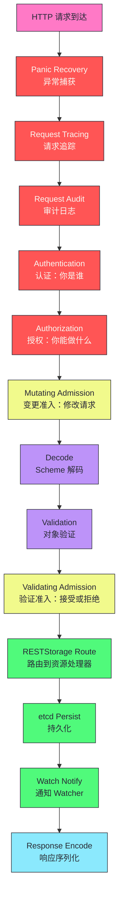
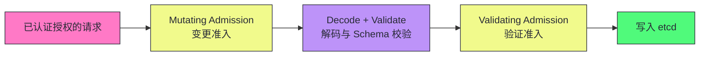
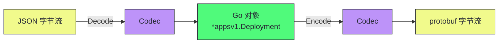
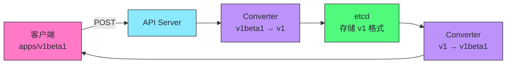
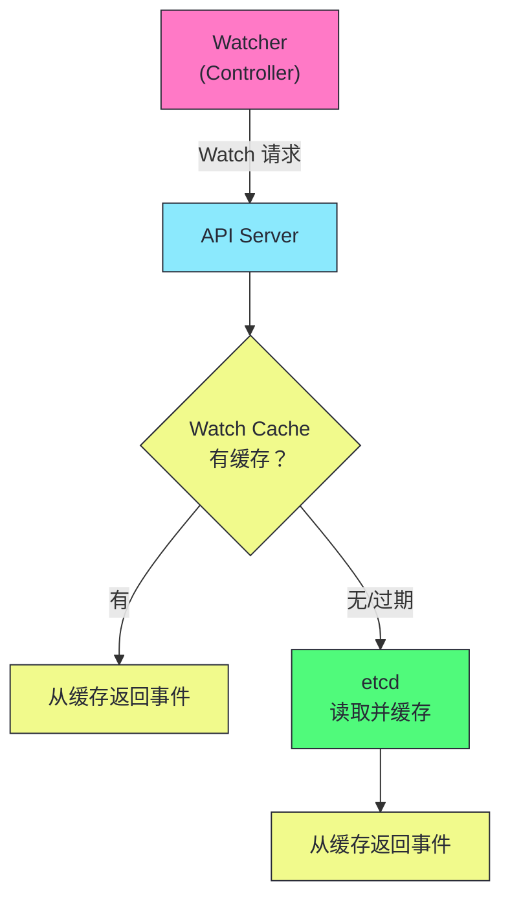
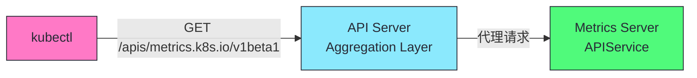

# 04 API Server 请求链路：从 HTTP 请求到 etcd 写入

> [!abstract] 摘要
> 本文从源码级深度剖析 API Server 的请求处理链路。一个 HTTP 请求从到达 API Server 到写入 etcd，经历完整的 Handler Chain：Panic Recovery → Request Tracing → Request Audit → 认证（Authentication）→ 授权（Authorization）→ Mutating Admission → Scheme 解码 → 对象验证 → Validating Admission → RESTStorage 路由 → etcd 持久化 → Watch 通知 → Response 序列化。文章首先拆解每个处理阶段的职责和实现细节，然后深入 K8s 的类型系统核心——Scheme（注册所有 API 类型）、Codec（JSON/protobuf 编解码）、Converter（API 版本转换）。讲透 RESTStorage 映射——每种 K8s 资源如何映射到一个 RESTStorage 实现，RESTStorage 如何通过 etcd 完成实际的 CRUD。之后分析 API Server 的 Watch Cache 机制——为什么 Watch 不直接查 etcd 而是从缓存读取，以及 Bookmark 事件的作用。最后讨论 API Server 的性能调优参数和常见故障排查。核心认知：API Server 的复杂度来自于"在一个进程内同时扮演七重角色"——REST 网关、认证门卫、授权门卫、准入控制器、Schema 校验器、etcd 代理、Watch 分发器——理解每一层的作用，才能定位 API Server 的性能问题和故障。

---

## 第 1 章 Handler Chain：请求处理流水线

### 1.1 全链路概览

一个 HTTP 请求从到达 API Server 到写入 etcd 并通知 Watcher，经历以下处理阶段：



### 1.2 每个阶段的职责

| 阶段 | 职责 | 失败行为 |
|------|------|---------|
| **Panic Recovery** | 捕获 handler 中的 panic，返回 500 而非崩溃 | 返回 500 |
| **Request Tracing** | 为请求分配 trace ID，记录各阶段耗时 | 不影响请求 |
| **Request Audit** | 记录请求的审计日志（谁、何时、做了什么） | 不影响请求（日志异步） |
| **Authentication** | 验证请求者身份（TLS/Token/OIDC/SA） | 401 Unauthorized |
| **Authorization** | 检查请求者是否有权限执行操作 | 403 Forbidden |
| **Mutating Admission** | 修改请求对象（注入 sidecar、设默认值） | 拒绝请求 |
| **Decode** | 将请求 body 反序列化为 Go 对象 | 400 Bad Request |
| **Validation** | Schema 校验（字段类型、必填、枚举值） | 422 Unprocessable Entity |
| **Validating Admission** | 业务规则验证（如 PodSecurity） | 422 |
| **RESTStorage Route** | 路由到对应资源的处理逻辑 | 404 Not Found |
| **etcd Persist** | 序列化并写入 etcd | 500 |
| **Watch Notify** | 通知订阅该资源的 Watcher | 不影响响应 |
| **Response Encode** | 将结果序列化为 JSON/protobuf 返回 | - |

> [!info] 核心概念：Handler Chain 是洋葱模型
> API Server 的 Handler Chain 是"洋葱模型"——外层 handler 包裹内层 handler，请求从外到内依次通过每层，响应从内到外依次返回。每层 handler 可以在请求通过前做预处理（如认证）、在响应返回后做后处理（如审计日志记录）。这种分层设计使得每个关注点（安全、审计、限流）可以独立添加或移除，不影响其他层。

---

## 第 2 章 认证与授权（Authentication & Authorization）

### 2.1 认证链（Authentication Chain）

API Server 支持多种认证方式，将它们组织为一条**认证链**——请求按顺序通过每种认证方式，任意一种成功即可，全部失败则拒绝。

| 认证方式 | 机制 | 适用场景 |
|---------|------|---------|
| **Client Certificate** | TLS 客户端证书验证 | 组件间通信（kubelet→API Server） |
| **Token** | Bearer Token（如 Bootstrap Token） | 外部系统接入 |
| **OIDC** | OpenID Connect（如 Google/Azure AD） | 用户认证 |
| **ServiceAccount Token** | SA 的 JWT Token | Pod 内访问 API Server |
| **Basic Auth** | 用户名密码（已废弃） | 不推荐 |

```go
// 伪代码：认证链逻辑
func authenticateRequest(req *http.Request) (user.Info, bool, error) {
    for _, authn := range authenticationChain {
        user, ok, err := authn.AuthenticateRequest(req)
        if err != nil {
            continue  // 该认证方式出错，尝试下一个
        }
        if ok {
            return user, true, nil  // 认证成功
        }
    }
    return nil, false, nil  // 所有认证方式都未成功
}
```

### 2.2 授权（Authorization）

认证确定"你是谁"，授权决定"你能做什么"。K8s 授权基于 **Attributes**——请求的动词（get/list/create/update/delete）、资源类型、Namespace。

| 授权模式 | 机制 | 说明 |
|---------|------|------|
| **RBAC** | Role/ClusterRole + Binding | 最常用，推荐 |
| **ABAC** | 基于属性的策略文件 | 已废弃 |
| **Node** | 节点授权（kubelet 特殊权限） | 始终启用 |
| **Webhook** | 外部服务做授权决策 | 自定义授权逻辑 |

> [!warning] 生产避坑：RBAC 是生产环境的唯一选择
> ABAC（基于属性的访问控制）已废弃，配置文件难维护且无审计。Node 授权是 kubelet 专用的，不适用于用户。Webhook 授权引入外部依赖，增加延迟和故障点。RBAC 是 K8s 授权的事实标准——Role/ClusterRole 定义权限，RoleBinding/ClusterRoleBinding 绑定到用户/组/ServiceAccount。我们将在第 05 篇深入 RBAC 的设计和使用。

---

## 第 3 章 准入控制（Admission Control）

### 3.1 两阶段准入控制

通过认证和授权后，请求进入**准入控制**——在写入 etcd 前的最后修改和验证机会。准入控制分为两个子阶段：



| 阶段 | 能力 | 示例 |
|------|------|------|
| **Mutating Admission** | 修改请求对象 | 注入 sidecar（Istio）、设默认 StorageClass、注入 ServiceAccount |
| **Validating Admission** | 接受或拒绝（不能修改） | PodSecurity 校验、资源配额检查、镜像签名验证 |

### 3.2 为什么先 Mutating 后 Validating

顺序很重要——Mutating Admission 可能修改对象（如注入 sidecar），修改后的对象需要通过 Validating Admission 验证。如果反过来，验证通过的对象可能被 Mutating 修改成不合规的状态。

> [!info] 核心概念：准入控制器是 K8s 安全策略的核心
> 准入控制器是 K8s 安全策略的执行点——PodSecurity Standards（特权/基线/受限）、镜像签名验证、资源配额强制、命名空间验证等都在这里实施。除了内置准入控制器，K8s 支持通过 Webhook 扩展——MutatingWebhookConfiguration 和 ValidatingWebhookConfiguration 允许外部服务参与准入控制。这使得企业可以实施自定义安全策略（如禁止使用 latest 标签、强制资源限制、镜像来源限制）而无需修改 K8s 源码。我们将在第 05 篇深入准入控制器的配置和使用。

---

## 第 4 章 Scheme、Codec、Converter：K8s 的类型系统

### 4.1 Scheme：类型注册表

**Scheme** 是 K8s 类型系统的核心——它是一个注册表，记录了所有 API 类型与 GVK（Group-Version-Kind）的映射关系。

```go
// 伪代码：Scheme 的核心数据结构
type Scheme struct {
    // GVK → Go 类型
    typeToGVK map[reflect.Type]schema.GroupVersionKind
    
    // Go 类型 → 所有支持的 GVK（用于版本转换）
    typeToAllGVKs map[reflect.Type][]schema.GroupVersionKind
}
```

每种 K8s 资源（Pod、Deployment、Service 等）在 API Server 启动时注册到 Scheme：

```go
// 注册 Pod 到 Scheme
scheme.AddKnownTypes(schema.GroupVersion{Group: "", Version: "v1"}, &Pod{})
scheme.AddKnownTypes(schema.GroupVersion{Group: "", Version: "v1beta1"}, &Pod{})
```

Scheme 的价值：

| 价值 | 说明 |
|------|------|
| **类型路由** | API Server 根据 GVK 从 Scheme 查到 Go 类型，创建对应实例 |
| **版本转换** | Scheme 记录类型支持的所有版本，支持版本间转换 |
| **代码生成** | client-gen 等工具基于 Scheme 生成客户端代码 |

### 4.2 Codec：编解码器

**Codec** 负责对象与字节流之间的转换——反序列化请求 body 为 Go 对象，序列化 Go 对象为响应 body。



K8s 支持多种序列化格式：

| 格式 | Content-Type | 用途 |
|------|-------------|------|
| **JSON** | `application/json` | kubectl 默认，人类可读 |
| **protobuf** | `application/vnd.kubernetes.protobuf` | 组件间通信，性能更高 |
| **YAML** | `application/yaml` | kubectl apply |

> [!info] 核心概念：protobuf 用于组件间通信，JSON 用于人机交互
| API Server 内部和组件间通信（kubelet→API Server）默认用 protobuf——比 JSON 更快、更小。kubectl 等人机交互工具用 JSON/YAML——可读性好。API Server 根据 Accept header 选择响应格式。客户端发送请求时用 Content-Type 声明 body 格式。这种"协议协商"使得 API Server 可以同时服务人和机器，无需为不同客户端提供不同 API。

### 4.3 Converter：版本转换

**Converter** 处理 API 版本间的转换——客户端用 `apps/v1beta1` 创建 Deployment，API Server 转换为 `apps/v1`（存储版本）后写入 etcd。



转换的工程复杂度在于不同版本的字段可能语义不同——不是简单的字段重命名，可能涉及字段合并、拆分、默认值填充。K8s 通过 `conversion-gen` 工具自动生成大部分转换代码，复杂场景需要手写转换函数。

> [!warning] 生产避坑：不要轻易删除 API 版本
> 删除 API 版本（如从 v1beta1 升级到 v1 后删除 v1beta1）是破坏性变更——使用旧版本的客户端会失败。K8s 的版本策略：(1) 新版本引入后旧版本保持一段时间的兼容期；(2) 在兼容期内通过 Deprecated 警告提示用户迁移；(3) 删除旧版本前确保所有客户端已迁移。生产环境升级 API 版本前，检查集群中是否有客户端仍在使用旧版本——kubectl 的 API 调用日志和审计日志可以提供线索。

---

## 第 5 章 RESTStorage：资源到 etcd 的映射

### 5.1 RESTStorage 是什么

每种 K8s 资源映射到一个 **RESTStorage** 实现——它定义了该资源的 CRUD 操作如何与 etcd 交互。

```go
// 伪代码：RESTStorage 接口
type RESTStorage interface {
    Create(ctx context.Context, obj runtime.Object) (runtime.Object, error)
    Get(ctx context.Context, name string) (runtime.Object, error)
    List(ctx context.Context, options *metav1.ListOptions) (runtime.Object, error)
    Update(ctx context.Context, obj runtime.Object) (runtime.Object, error)
    Delete(ctx context.Context, name string) (runtime.Object, error)
    Watch(ctx context.Context, options *metav1.ListOptions) (watch.Interface, error)
}
```

K8s 提供了一个通用的 **Registry** 实现——`GenericStore`，它处理了大部分通用逻辑（认证、授权、准入、Schema 校验后的 etcd 读写），资源特定的逻辑通过 hook 函数注入。

### 5.2 etcd 的 key 路径

K8s 对象在 etcd 中的 key 路径遵循固定模式：

```
/registry/<resource>/<namespace>/<name>
```

| K8s 资源 | etcd key |
|---------|---------|
| Pod `web-abc` in `default` | `/registry/pods/default/web-abc` |
| Deployment `web` in `default` | `/registry/deployments/default/web` |
| Node `node-1` | `/registry/minions/node-1` |
| Service `web` in `default` | `/registry/services/specs/default/web` |

> [!info] 核心概念：etcd 存储的是序列化后的对象，不是 JSON
> etcd 中存储的 K8s 对象默认是 protobuf 序列化的字节流，不是 JSON。这使得存储更紧凑、反序列化更快。只有通过 API Server 读取时才会转换为 JSON/protobuf 响应格式。这也是为什么直接用 etcdctl 读取 K8s 数据看到的是乱码——它是 protobuf 字节流，不是人类可读的 JSON。K8s 提供了 `etcdctl get --key /registry/pods/default/web-abc --print-value-only | protoc --decode_raw` 等工具解码。

---

## 第 6 章 Watch Cache：减少 etcd 压力的关键

### 6.1 为什么 Watch 不直接查 etcd

API Server 内部为每种资源维护一个 **Watch Cache**——缓存最近的变更事件和资源对象。当客户端发起 Watch 请求时，API Server 从 Watch Cache 中获取数据，不直接查询 etcd。



在大规模集群中，可能有数百个控制器同时 Watch 不同类型的资源。如果每个 Watch 都直接查询 etcd，etcd 会被压垮。Watch Cache 使得多个 Watcher 共享同一份缓存数据，大幅减少 etcd 读取压力。

### 6.2 Watch Cache 的数据结构

```go
// 伪代码：Watch Cache 的核心数据结构
type watchCache struct {
    // 环形缓冲区，存储最近的事件
    cache []watchCacheElement
    
    // 当前缓冲区的 resourceVersion
    resourceVersion uint64
    
    // 所有资源的本地索引（用于 List 请求）
    store cache.Store
}
```

| 组件 | 作用 |
|------|------|
| **环形缓冲区** | 存储最近的 N 个事件（默认 100） |
| **resourceVersion** | 缓存对应的 etcd 版本 |
| **本地 store** | 所有资源的完整缓存（用于 List 请求） |

### 6.3 Bookmark 事件

当 Watcher 的 resourceVersion 落后于缓存但缓存中没有新事件时，API Server 会发送 **Bookmark 事件**——只更新 resourceVersion，不携带对象。

```json
{"type":"BOOKMARK","object":{"kind":"Pod","apiVersion":"v1","metadata":{"resourceVersion":"12350"}}}
```

> [!info] 核心概念：Bookmark 防止 Watch 卡在旧版本
> 如果没有 Bookmark，Watcher 的 resourceVersion 可能长时间不更新——下次重连时从这个旧版本开始 Watch，可能需要传输大量历史事件。Bookmark 定期更新 Watcher 的 resourceVersion，使得重连时从较新的版本开始，减少历史事件传输。这是 K8s 1.16 引入的优化，对于大规模集群的 Watch 性能有显著提升。

---

## 第 7 章 API Server 的性能调优

### 7.1 关键启动参数

| 参数 | 作用 | 默认值 | 调优建议 |
|------|------|--------|---------|
| `--max-mutating-requests-inflight` | 并发变更请求上限 | 200 | 大集群调高到 400-1000 |
| `--max-requests-inflight` | 并发只读请求上限 | 400 | 大集群调高到 800-2000 |
| `--watch-cache-size` | Watch Cache 大小 | 100MB | 大集群调高 |
| `--default-watch-cache-size` | 每种资源的缓存大小 | 100 | 大集群调高 |
| `--apiserver-loopback-timeout` | 内部请求超时 | 60s | 视集群规模调整 |

### 7.2 常见性能问题

| 问题 | 症状 | 排查方法 |
|------|------|---------|
| **请求排队** | API 响应慢，max-requests-inflight 达上限 | 调高 max-requests-inflight |
| **Watch Cache 不够** | Watch 延迟高 | 调高 watch-cache-size |
| **etcd 瓶颈** | 写入慢，etcd 延迟高 | 检查 etcd 磁盘 IOPS |
| **准入 Webhook 慢** | 创建/更新请求慢 | 检查 Webhook 响应时间 |
| **客户端 List 全量** | 大 List 拖慢 API Server | 改用 Watch 或分页 List |

> [!warning] 生产避坑：全量 List 是 API Server 性能杀手
> `kubectl get pods --all-namespaces` 会 List 所有 Pod——在大集群（数万 Pod）中，这个请求可能传输数十 MB 数据，阻塞 API Server 的处理能力。解决方案：(1) 用 `--field-selector` 限制范围（如只查某 Namespace）；(2) 用 `kubectl get --watch` 改为 Watch；(3) 控制器用 Informer 的 List-Watch 而非直接 List；(4) 配置 `--max-requests-inflight` 限制并发只读请求，防止大 List 拖垮 API Server。

---

## 第 8 章 API Aggregation Layer

### 8.1 扩展 API 端点

K8s 支持通过 **API Aggregation Layer** 扩展 API 端点——注册一个新的 API Group，由独立的 API Server（APIServices）处理，主 API Server 代理请求。



| 扩展方式 | 机制 | 适用场景 |
|---------|------|---------|
| **CRD** | 在主 API Server 注册新资源类型 | 大多数扩展场景 |
| **Aggregation Layer** | 独立 API Server 处理新 Group | 需要独立存储/逻辑的场景 |

> [!note] 设计哲学：CRD vs Aggregation Layer 的选择
> CRD 将新资源存储在主 API Server 的 etcd 中，复用主 API Server 的认证授权准入。Aggregation Layer 用独立 API Server 处理，可以有独立存储和逻辑。大多数扩展场景用 CRD 就够了——更简单，无需维护独立 API Server。Aggregation Layer 适用于需要独立存储（如 Metrics Server 不存 etcd）或特殊处理逻辑的场景。我们将在第 12 篇深入 CRD 和 Operator 模式。

---

## 总结

API Server 请求链路的核心知识可以归纳为以下主线：

1. **Handler Chain 是洋葱模型**。请求从外到内通过 Panic Recovery → Tracing → Audit → 认证 → 授权 → Mutating Admission → Decode → Validation → Validating Admission → RESTStorage → etcd → Watch → Response。

2. **认证链多种方式任一成功即可**。Client Certificate、Token、OIDC、ServiceAccount Token。认证链按顺序尝试，任一成功则通过。

3. **RBAC 是授权的事实标准**。ABAC 已废弃，Node 授权是 kubelet 专用，Webhook 授权增加外部依赖。RBAC 用 Role/ClusterRole + Binding 定义权限。

4. **两阶段准入控制先 Mutating 后 Validating**。Mutating 可修改对象（注入 sidecar），Validating 只能接受或拒绝。顺序确保修改后的对象通过验证。

5. **Scheme 是 K8s 类型系统的核心**。注册所有 API 类型与 GVK 的映射，支持类型路由和版本转换。client-gen 等工具基于 Scheme 生成代码。

6. **Codec 支持多种序列化格式**。protobuf 用于组件间通信（更快更小），JSON/YAML 用于人机交互（可读性好）。API Server 根据 Accept/Content-Type 协商格式。

7. **Converter 处理 API 版本间转换**。客户端用任意版本读写，API Server 转换为存储版本后写入 etcd。转换可能涉及字段合并、拆分、默认值填充。

8. **RESTStorage 映射资源到 etcd 操作**。每种 K8s 资源有 RESTStorage 实现，定义 CRUD 如何与 etcd 交互。通用 Registry 处理大部分逻辑，资源特定逻辑通过 hook 注入。

9. **etcd 存储的是 protobuf 字节流**。不是人类可读的 JSON。直接用 etcdctl 读取看到的是乱码，需要 protoc 解码。etcd key 路径遵循 `/registry/<resource>/<namespace>/<name>` 模式。

10. **Watch Cache 减少 etcd 压力**。API Server 为每种资源维护 Watch Cache，多个 Watcher 共享缓存数据。大集群中数百个 Watcher 不直接查询 etcd。

11. **Bookmark 事件定期更新 Watcher 的 resourceVersion**。防止 Watch 卡在旧版本，重连时减少历史事件传输。K8s 1.16 引入的优化。

12. **全量 List 是 API Server 性能杀手**。大集群中 `kubectl get pods --all-namespaces` 可能传输数十 MB 数据。用 field-selector 限制范围、用 Watch 代替 List、调高 max-requests-inflight。

13. **API Aggregation Layer 扩展 API 端点**。独立 API Server 处理新 Group。大多数扩展场景用 CRD 更简单，Aggregation Layer 适用于需要独立存储的场景。

14. **API Server 在一个进程内扮演七重角色**。REST 网关、认证门卫、授权门卫、准入控制器、Schema 校验器、etcd 代理、Watch 分发器——理解每一层的作用，才能定位 API Server 的性能问题和故障。这种"多功能合一"的设计增加了复杂度，但简化了部署和运维。

15. **审计日志是安全合规和故障排查的基础**。API Server 的审计日志记录"谁、何时、做了什么"——Metadata 级别（只记元数据）、Request 级别（记请求体）、Response 级别（记响应体）。生产环境至少配置 Metadata 级别审计日志，敏感操作配置 Request 级别。

> [!info] 专栏导航
> 本文是 [[00 专栏导览|Kubernetes 架构深度剖析专栏]] 的第 04 篇，深入 API Server 的请求处理链路。下一篇 [[05 认证、授权与准入控制：K8s 的安全三级防线]] 将详细讨论 K8s 的安全机制——TLS 双向认证、OIDC 集成、RBAC 权限模型、Pod Security Standards、Admission Webhook 的配置和使用。

---

## 延伸思考

1. **你的 API Server 性能参数是否调优？** 检查 max-requests-inflight 和 watch-cache-size。大集群（100+ 节点）通常需要调高这些参数，否则 API Server 成为瓶颈。

2. **你的准入 Webhook 是否有超时和故障兜底？** Webhook 故障可能导致所有创建/更新请求失败。配置 Webhook 的 timeoutSeconds 和 failurePolicy（Fail 或 Ignore）——对关键 Webhook 用 Fail，对非关键 Webhook 考虑 Ignore 兜底。

3. **你的客户端是否避免全量 List？** 检查控制器和监控工具是否有全量 List 行为。改为 Watch 或分页 List，减少 API Server 压力。

4. **你的 API 版本是否在使用前验证兼容性？** 升级 K8s 版本前，检查是否有客户端使用即将移除的 API 版本。`kubectl get --raw "/apis"` 可以列出所有可用版本。

5. **你的 API Server 是否有审计日志？** 审计日志记录"谁、何时、做了什么"，是安全合规和故障排查的基础。配置 audit-policy 文件定义日志级别。

6. **你的 etcd key 是否可直接读？** etcd 存储的是 protobuf 字节流，不是 JSON。调试 etcd 数据时用 `etcdctl get --print-value-only | protoc --decode_raw` 解码，或通过 API Server 的 API 读取。

7. **你的 Watch Cache 大小是否够用？** 大集群中 Watch Cache 可能不够，导致 Watch 频繁回退到 etcd 读取。监控 API Server 的 `apiserver_request_duration_seconds` 和 `etcd_request_duration_seconds` 指标。

8. **你的 API Server 是否水平扩展？** API Server 无状态可水平扩展。大集群用多实例 + 负载均衡提升吞吐量。注意 etcd 是共享状态，多实例 API Server 共用同一 etcd。

---

## 参考资料

1. Kubernetes API Server 源码：https://github.com/kubernetes/kubernetes/tree/master/staging/src/k8s.io/apiserver
2. API Server Handler Chain：https://github.com/kubernetes/apiserver/blob/master/pkg/server/config.go
3. Scheme 和 Codec：https://github.com/kubernetes/apimachinery/blob/master/pkg/runtime/scheme.go
4. Watch Cache：https://github.com/kubernetes/apiserver/blob/master/pkg/storage/cacher/watch_cache.go
5. Kubernetes API Access Control：https://kubernetes.io/docs/reference/access-authn-authz/
6. API Server 性能调优：https://kubernetes.io/docs/admin/cluster-large/

---

> [!note] 思考题
> 1. API Server 的 Handler Chain 中，Mutating Admission 在 Decode 之前还是之后？为什么？如果顺序反了（先 Validating 后 Mutating），会有什么问题？
> 2. Watch Cache 的环形缓冲区默认存储 100 个事件。如果一个 Watcher 的 resourceVersion 落后超过 100 个事件，会发生什么？（提示：List-Watch 重新初始化）
> 3. API Server 是 etcd 的唯一客户端。如果 API Server 缓存了资源（Watch Cache），etcd 中的数据被外部修改（如直接用 etcdctl 修改），API Server 的缓存如何感知这种变化？是否会出现缓存与 etcd 不一致？
