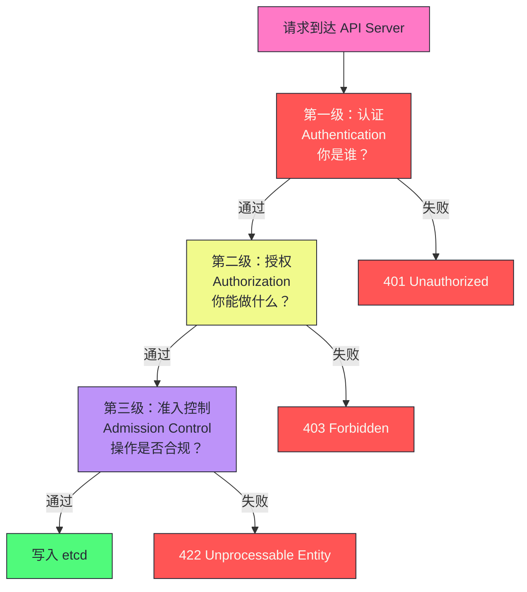
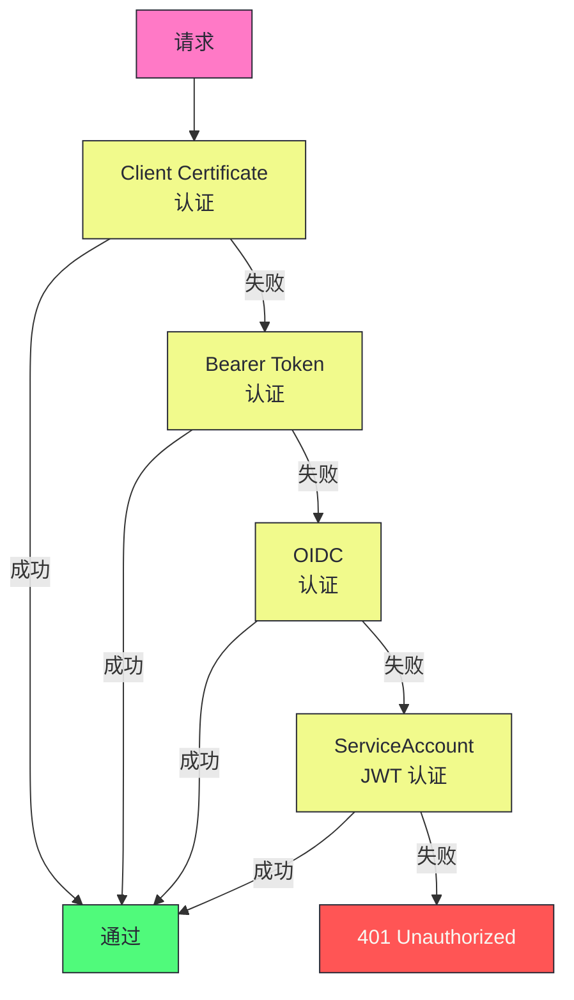
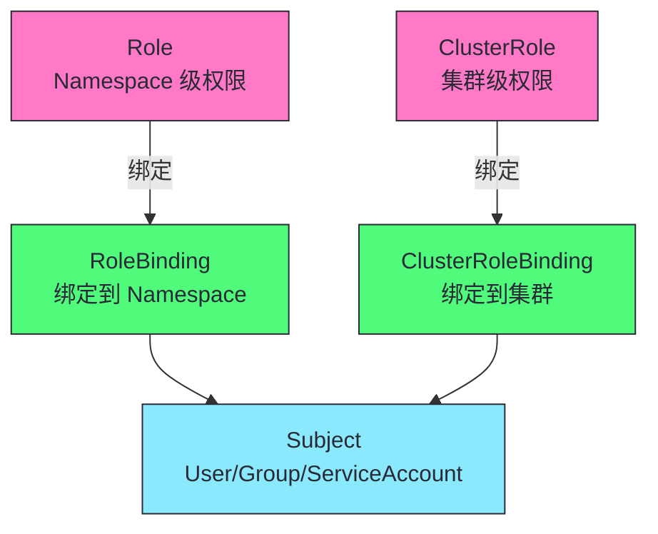
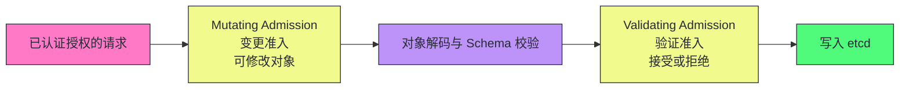
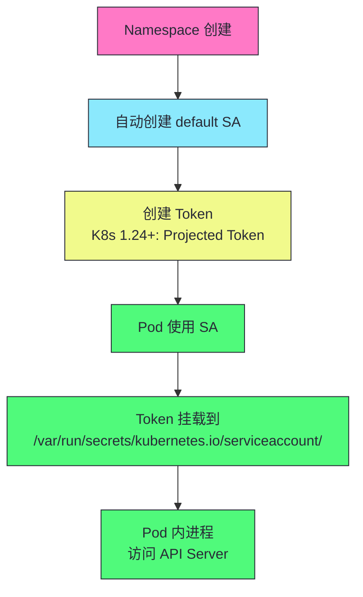

# 05 认证、授权与准入控制：K8s 的安全三级防线

> [!abstract] 摘要
> 本文深入 Kubernetes 的安全三级防线——认证（Authentication）、授权（Authorization）、准入控制（Admission Control）。认证回答"你是谁"——通过 TLS 客户端证书、Bearer Token、OIDC、ServiceAccount JWT 等方式验证请求者身份，认证链多种方式任一成功即可。授权回答"你能做什么"——RBAC 是事实标准，通过 Role/ClusterRole 定义权限、RoleBinding/ClusterRoleBinding 绑定到用户/组/ServiceAccount。准入控制是"写入前的最后关卡"——Mutating Admission 可修改对象（注入 sidecar、设默认值），Validating Admission 验证业务规则（PodSecurity、资源配额、镜像签名）。文章首先详解每级的机制和配置，然后讨论 ServiceAccount 和 Pod 内访问 API 的安全模型——Token 投影卷、Projected ServiceAccount Token、Token 轮转。之后深入 Pod Security Standards 的三个级别（Privileged/Baseline/Restricted）和 PodSecurity Admission 替换 PSP 的演进。最后讨论生产环境的安全加固实践——最小权限原则、NetworkPolicy、密钥管理、审计日志。核心认知：K8s 安全不是单一机制，而是"纵深防御"——认证挡住匿名访问，授权限制操作范围，准入控制确保操作合规，三层协同构成完整防线。

---

## 第 1 章 K8s 安全模型概览

### 1.1 三级防线



### 1.2 每级的职责

| 级别 | 问题 | 机制 | 失败响应 |
|------|------|------|---------|
| **认证** | 你是谁？ | TLS 证书/Token/OIDC/SA | 401 Unauthorized |
| **授权** | 你能做什么？ | RBAC/Node/Webhook | 403 Forbidden |
| **准入控制** | 操作是否合规？ | Mutating/Validating Webhook | 422 Unprocessable Entity |

> [!info] 核心概念：纵深防御是 K8s 安全的核心理念
> K8s 安全不是单一机制，而是"纵深防御"（Defense in Depth）——三层防线层层把关。认证挡住匿名访问（不知道你是谁就拒绝一切）。授权限制操作范围（即使知道你是谁，也不能做你没权限的事）。准入控制确保操作合规（即使你有权限，也要符合安全策略）。三层协同构成完整防线——任一层被绕过，其他层仍能保护。理解这个分层模型，是设计 K8s 安全策略的基础。

---

## 第 2 章 认证（Authentication）

### 2.1 认证链

API Server 支持多种认证方式，组织为一条**认证链**——请求按顺序通过每种方式，任一成功即可，全部失败则 401。



### 2.2 四种主要认证方式

| 方式 | 机制 | 用户类型 | 适用场景 |
|------|------|---------|---------|
| **Client Certificate** | TLS 客户端证书 | 普通用户 | 组件间通信、管理员访问 |
| **Bearer Token** | 静态 Token 文件 | 普通用户 | 外部系统集成（不推荐生产） |
| **OIDC** | OpenID Connect | 普通用户 | 企业 SSO（Google/Azure AD/Keycloak） |
| **ServiceAccount Token** | JWT Token | ServiceAccount | Pod 内访问 API Server |

#### Client Certificate 认证

```bash
# 生成客户端证书
openssl genrsa -out alice.key 2048
openssl req -new -key alice.key -out alice.csr -subj "/CN=alice/O=devs"

# 用 CA 签名
openssl x509 -req -in alice.csr -CA ca.crt -CAkey ca.key -CAcreateserial -out alice.crt

# 配置 kubectl 使用客户端证书
kubectl config set-credentials alice --client-certificate=alice.crt --client-key=alice.key
```

证书中的 CN（Common Name）成为用户名，O（Organization）成为用户组。

#### ServiceAccount Token 认证

Pod 内访问 API Server 使用 ServiceAccount 的 JWT Token。Token 通过投影卷自动挂载到 Pod 中。

```yaml
# Pod 自动挂载 ServiceAccount Token
apiVersion: v1
kind: Pod
metadata:
  name: my-pod
spec:
  serviceAccountName: my-sa  # 指定使用的 ServiceAccount
  containers:
    - name: app
      image: my-app
      # Token 自动挂载到 /var/run/secrets/kubernetes.io/serviceaccount/token
```

> [!warning] 生产避坑：ServiceAccount Token 的安全性演进
> 早期 K8s 的 ServiceAccount Token 是永久有效的静态 Token——一旦泄露无法撤销。K8s 1.21+ 引入了 **Projected ServiceAccount Token**——Token 有过期时间（默认 1 小时），kubelet 自动轮转。K8s 1.24+ 默认使用 Bound ServiceAccount Token——Token 绑定到特定的 Pod 和 audience，Pod 删除后 Token 失效。生产环境应使用 K8s 1.24+ 并启用 Bound Token，避免静态 Token 的泄露风险。

### 2.3 用户 vs ServiceAccount

K8s 区分两类身份：

| 类型 | 创建方式 | 认证方式 | 适用场景 |
|------|---------|---------|---------|
| **用户（User）** | 外部管理（证书/OIDC） | Client Cert/OIDC/Token | 人类用户、外部系统 |
| **ServiceAccount** | K8s API 创建 | JWT Token | Pod 内进程 |

> [!info] 核心概念：K8s 没有内置的用户管理
> K8s 不提供 User 资源——用户不是 K8s 对象，没有 `kubectl create user` 命令。用户身份由外部系统管理（证书 CA、OIDC Provider），K8s 只在认证时验证身份、在授权时检查权限。ServiceAccount 是 K8s 对象，有对应的 API 资源。这种设计使得 K8s 可以与企业现有身份系统集成（LDAP/AD/OIDC），而非自己维护一套用户体系。

---

## 第 3 章 授权（Authorization）：RBAC 深度解析

### 3.1 RBAC 的四个核心对象



| 对象 | 作用域 | 说明 |
|------|--------|------|
| **Role** | Namespace | 定义 Namespace 内的权限 |
| **ClusterRole** | 集群 | 定义集群级权限（含 Namespace 资源） |
| **RoleBinding** | Namespace | 将 Role 绑定到 Subject（Namespace 级） |
| **ClusterRoleBinding** | 集群 | 将 ClusterRole 绑定到 Subject（集群级） |

### 3.2 Role 和 ClusterRole 的定义

```yaml
# Role：Namespace 级权限
apiVersion: rbac.authorization.k8s.io/v1
kind: Role
metadata:
  name: pod-reader
  namespace: default
rules:
  - apiGroups: [""]
    resources: ["pods", "pods/log"]
    verbs: ["get", "list", "watch"]
  - apiGroups: [""]
    resources: ["configmaps"]
    verbs: ["get"]  # 只读 ConfigMap
```

```yaml
# ClusterRole：集群级权限
apiVersion: rbac.authorization.k8s.io/v1
kind: ClusterRole
metadata:
  name: node-reader
rules:
  - apiGroups: [""]
    resources: ["nodes"]
    verbs: ["get", "list", "watch"]
```

### 3.3 verbs 和 resources 的组合

| verb | 说明 | 示例 |
|------|------|------|
| **get** | 读取单个对象 | `kubectl get pod web` |
| **list** | 列出对象列表 | `kubectl get pods` |
| **watch** | 监听对象变化 | List-Watch |
| **create** | 创建对象 | `kubectl apply` |
| **update** | 全量更新 | `kubectl replace` |
| **patch** | 局部更新 | `kubectl patch` |
| **delete** | 删除对象 | `kubectl delete` |
| **deletecollection** | 批量删除 | `kubectl delete pods --all` |

### 3.4 RoleBinding 的绑定

```yaml
apiVersion: rbac.authorization.k8s.io/v1
kind: RoleBinding
metadata:
  name: alice-pod-reader
  namespace: default
subjects:
  - kind: User
    name: alice
    apiGroup: rbac.authorization.k8s.io
  - kind: ServiceAccount
    name: my-sa
    namespace: default
roleRef:
  kind: Role
  name: pod-reader
  apiGroup: rbac.authorization.k8s.io
```

> [!info] 核心概念：RoleBinding 可以引用 ClusterRole
> RoleBinding 可以引用 ClusterRole——这使得你可以在某个 Namespace 中授予集群级权限的子集。例如，定义一个 ClusterRole 允许读取所有 Namespace 的 Pod，然后用 RoleBinding 在 `default` Namespace 中绑定——Subject 只能在 `default` 中读 Pod，不能读其他 Namespace。这是一种复用 ClusterRole 定义但限制作用域的技巧。

### 3.5 RBAC 的最佳实践

| 实践 | 说明 |
|------|------|
| **最小权限原则** | 只授予必要的权限，避免使用 cluster-admin |
| **按 Namespace 隔离** | 不同团队用不同 Namespace，权限按 Namespace 授予 |
| **ServiceAccount 粒度** | 每个应用用独立 ServiceAccount，而非共享 default |
| **避免通配符** | 不要用 `verbs: ["*"]` 或 `resources: ["*"]` |
| **定期审计** | 用 `kubectl auth can-i --list` 检查权限 |

> [!warning] 生产避坑：cluster-admin 是"上帝权限"，慎用
> cluster-admin 拥有集群所有资源的所有操作权限——相当于 root。生产环境应严格限制 cluster-admin 的绑定对象。日常运维用自定义的受限 ClusterRole（如只读 + 特定 Namespace 的写权限）。审计 ClusterRoleBinding 检查谁有 cluster-admin 权限——`kubectl get clusterrolebinding -o json | jq '.items[] | select(.roleRef.name=="cluster-admin")'`。

---

## 第 4 章 准入控制（Admission Control）

### 4.1 两阶段准入控制



### 4.2 内置准入控制器

K8s 内置了数十个准入控制器，通过 `--enable-admission-plugins` 启用：

| 准入控制器 | 阶段 | 作用 |
|-----------|------|------|
| **NamespaceLifecycle** | Validating | 阻止在正在删除的 Namespace 中创建资源 |
| **ServiceAccount** | Mutating | 为没有指定 SA 的 Pod 注入 default SA |
| **DefaultStorageClass** | Mutating | 为没有指定 StorageClass 的 PVC 注入默认值 |
| **DefaultTolerationSeconds** | Mutating | 为 Pod 注入默认的污点容忍时间 |
| **PodSecurity** | Validating | 验证 Pod 是否符合 Pod Security Standards |
| **ResourceQuota** | Validating | 检查 Namespace 的资源配额是否超限 |
| **LimitRanger** | Validating | 检查 Pod 资源限制是否符合 LimitRange |

### 4.3 Admission Webhook

除了内置准入控制器，K8s 支持通过 **Webhook** 扩展——外部服务参与准入控制。

```yaml
# MutatingWebhookConfiguration 示例（Istio sidecar 注入）
apiVersion: admissionregistration.k8s.io/v1
kind: MutatingWebhookConfiguration
metadata:
  name: istio-sidecar-injector
webhooks:
  - name: sidecar-injector.istio.io
    clientConfig:
      service:
        name: istiod
        namespace: istio-system
        path: "/inject"
    rules:
      - operations: ["CREATE"]
        apiGroups: [""]
        resources: ["pods"]
    namespaceSelector:
      matchLabels:
        istio-injection: enabled
```

| 配置项 | 说明 |
|--------|------|
| **clientConfig.service** | Webhook 服务的地址 |
| **rules** | 何时调用 Webhook（操作/资源） |
| **namespaceSelector** | 哪些 Namespace 触发 Webhook |
| **timeoutSeconds** | Webhook 超时时间（默认 10s） |
| **failurePolicy** | Webhook 故障时行为（Fail/Ignore） |

> [!warning] 生产避坑：Webhook 故障可能导致整个集群不可用
> Webhook 的 failurePolicy=Fail 意味着 Webhook 不可用时所有匹配的请求被拒绝——如果 Webhook 服务故障，可能导致所有 Pod 创建失败。对于关键 Webhook（如安全策略），用 Fail 确保安全；对于非关键 Webhook（如 sidecar 注入），考虑 Ignore 兜底。同时设置合理的 timeoutSeconds（如 3s），避免 Webhook 慢响应拖垮 API Server。监控 Webhook 的延迟和错误率——它是 API Server 延迟的常见来源。

---

## 第 5 章 Pod Security Standards

### 5.1 三个安全级别

K8s 1.25+ 用 **Pod Security Standards** 替换了 PodSecurityPolicy（PSP）。三个级别：

| 级别 | 限制程度 | 说明 |
|------|---------|------|
| **Privileged** | 最宽松 | 无限制，特权容器可用 |
| **Baseline** | 中等 | 禁止最危险的特权，保留普通容器需求 |
| **Restricted** | 最严格 | 严格限制，要求 non-root、readOnlyRootFilesystem 等 |

### 5.2 各级别的限制

#### Baseline 禁止的配置

| 配置 | Baseline 禁止 | Restricted 禁止 |
|------|-------------|----------------|
| **privileged** | 是 | 是 |
| **hostNetwork/hostPID/hostIPC** | 是 | 是 |
| **hostPath volumes** | 是 | 是 |
| **hostPort** | 是 | 是 |
| **runAsNonRoot** | - | 必须为 true |
| **readOnlyRootFilesystem** | - | 必须为 true |
| **allowPrivilegeEscalation** | - | 必须为 false |
| **capabilities** | 限制添加 | 只允许 NET_BIND_SERVICE |

### 5.3 PodSecurity Admission 配置

```yaml
# Namespace 级别配置 Pod Security
apiVersion: v1
kind: Namespace
metadata:
  name: my-namespace
  labels:
    # enforces Restricted 级别——违反则拒绝
    pod-security.kubernetes.io/enforce: restricted
    pod-security.kubernetes.io/enforce-version: latest
    # audits Baseline 级别——违反只记审计日志
    pod-security.kubernetes.io/audit: baseline
    pod-security.kubernetes.io/audit-version: latest
    # warns Baseline 级别——违反返回警告
    pod-security.kubernetes.io/warn: baseline
    pod-security.kubernetes.io/warn-version: latest
```

| 模式 | 行为 |
|------|------|
| **enforce** | 违反则拒绝创建/更新 |
| **audit** | 违反则记审计日志，但不拒绝 |
| **warn** | 违反则返回警告消息，但不拒绝 |

> [!info] 核心概念：PodSecurity Standards 是 PSP 的简化替代
> PSP（PodSecurityPolicy）在 K8s 1.25 被移除——它太复杂，配置繁琐，且与 RBAC 耦合导致权限管理混乱。PodSecurity Standards 用 Namespace 标签替代——简单、声明式、与 RBAC 解耦。三种模式（enforce/audit/warn）允许渐进式迁移——先 audit 和 warn 发现不合规的 Pod，修复后再 enforce。这是 K8s 安全简化的典型实践——用更简单的机制替代过度复杂的方案。

---

## 第 6 章 ServiceAccount 与 Pod 内访问

### 6.1 ServiceAccount 的生命周期



### 6.2 Bound ServiceAccount Token（K8s 1.24+）

```yaml
# Projected ServiceAccount Token
apiVersion: v1
kind: Pod
metadata:
  name: my-pod
spec:
  serviceAccountName: my-sa
  containers:
    - name: app
      image: my-app
      volumeMounts:
        - name: token
          mountPath: /var/run/secrets/kubernetes.io/serviceaccount
  volumes:
    - name: token
      projected:
        sources:
          - serviceAccountToken:
              path: token
              expirationSeconds: 3600  # 1 小时过期
              audience: my-audience    # 绑定到特定 audience
```

| 特性 | 静态 Token（旧） | Bound Token（新） |
|------|-----------------|-----------------|
| **过期时间** | 永不过期 | 默认 1 小时，自动轮转 |
| **绑定范围** | 绑定到 SA | 绑定到 SA + Pod + Audience |
| **撤销** | 需删除 Secret | Pod 删除后自动失效 |
| **安全性** | 泄露后无法撤销 | 短期有效，泄露风险低 |

> [!info] 核心概念：Bound Token 是 Pod 内访问的安全基础
> Bound ServiceAccount Token 解决了静态 Token 的安全问题——Token 短期有效（默认 1 小时），kubelet 自动轮转，Pod 删除后 Token 立即失效。即使 Token 泄露，攻击窗口也很短。生产环境必须使用 K8s 1.24+ 的 Bound Token——这是 Pod 内访问 API Server 的安全最佳实践。如果你的集群还在用旧版静态 Token，优先升级。

---

## 第 7 章 生产环境安全加固实践

### 7.1 最小权限原则

| 维度 | 推荐 | 避免 |
|------|------|------|
| **RBAC** | 按需授予最小权限 | cluster-admin |
| **ServiceAccount** | 每应用独立 SA | 共享 default SA |
| **Pod Security** | Restricted 级别 | Privileged 级别 |
| **NetworkPolicy** | 默认拒绝，按需放行 | 无 NetworkPolicy |
| **密钥访问** | 按 SA 绑定特定 Secret | 所有 SA 可访问所有 Secret |

### 7.2 NetworkPolicy：网络层隔离

```yaml
# 默认拒绝所有入站流量
apiVersion: networking.k8s.io/v1
kind: NetworkPolicy
metadata:
  name: default-deny
  namespace: my-namespace
spec:
  podSelector: {}  # 选择所有 Pod
  policyTypes:
    - Ingress
  # 没有 ingress 规则 = 拒绝所有入站
```

```yaml
# 只允许特定标签的 Pod 访问
apiVersion: networking.k8s.io/v1
kind: NetworkPolicy
metadata:
  name: allow-frontend
  namespace: my-namespace
spec:
  podSelector:
    matchLabels:
      app: backend
  policyTypes:
    - Ingress
  ingress:
    - from:
        - podSelector:
            matchLabels:
              app: frontend
      ports:
        - protocol: TCP
          port: 8080
```

> [!warning] 生产避坑：NetworkPolicy 依赖 CNI 插件支持
> NetworkPolicy 需要支持它的 CNI 插件——Calico、Cilium、Antrea 支持，Flannel 默认不支持。如果你的 CNI 不支持 NetworkPolicy，NetworkPolicy 资源可以创建但不会生效——Pod 之间的网络不受限制。部署 NetworkPolicy 前确认 CNI 插件支持。我们将在第 15 篇深入各 CNI 插件的 NetworkPolicy 实现差异。

### 7.3 密钥管理

| 方式 | 说明 | 适用场景 |
|------|------|---------|
| **K8s Secret** | etcd 中 base64 编码存储 | 简单场景（但 etcd 不加密） |
| **etcd 加密** | API Server 加密 Secret 数据 | 中等安全需求 |
| **外部密钥管理** | External Secrets Operator + Vault/Cloud KMS | 高安全需求 |

```yaml
# etcd 加密配置
apiVersion: apiserver.config.k8s.io/v1
kind: EncryptionConfiguration
resources:
  - resources:
      - secrets
    providers:
      - aescbc:
          keys:
            - name: key1
              secret: <base64-encoded-key>
      - identity: {}  # 兜底：无法解密时明文读取
```

### 7.4 审计日志

```yaml
# audit-policy.yaml 示例
apiVersion: audit.k8s.io/v1
kind: Policy
rules:
  # 记录 Secret 的元数据级别（不记内容）
  - level: Metadata
    resources:
      - group: ""
        resources: ["secrets"]
  # 记录 Pod/Deployment 的请求级别（记请求体）
  - level: Request
    resources:
      - group: ""
        resources: ["pods"]
      - group: "apps"
        resources: ["deployments"]
  # 其他记元数据
  - level: Metadata
```

| 审计级别 | 记录内容 |
|---------|---------|
| **None** | 不记录 |
| **Metadata** | 请求元数据（谁/何时/做了什么） |
| **Request** | 元数据 + 请求体 |
| **RequestResponse** | 元数据 + 请求体 + 响应体 |

---

## 总结

K8s 安全三级防线的核心知识可以归纳为以下主线：

1. **纵深防御是 K8s 安全的核心理念**。认证挡住匿名访问，授权限制操作范围，准入控制确保操作合规。三层协同构成完整防线。

2. **认证链多种方式任一成功即可**。Client Certificate（组件通信）、Bearer Token（外部集成）、OIDC（企业 SSO）、ServiceAccount JWT（Pod 内访问）。

3. **K8s 没有内置用户管理**。用户不是 K8s 对象，由外部系统管理（证书 CA/OIDC）。ServiceAccount 是 K8s 对象。

4. **RBAC 是授权的事实标准**。Role/ClusterRole 定义权限，RoleBinding/ClusterRoleBinding 绑定到 Subject。RoleBinding 可引用 ClusterRole 限制作用域。

5. **最小权限原则是 RBAC 最佳实践**。按需授予最小权限，避免 cluster-admin 和通配符。按 Namespace 隔离，每应用独立 ServiceAccount。

6. **两阶段准入控制先 Mutating 后 Validating**。Mutating 可修改对象（注入 sidecar），Validating 只能接受或拒绝。顺序确保修改后的对象通过验证。

7. **Admission Webhook 是安全策略的扩展点**。MutatingWebhookConfiguration 和 ValidatingWebhookConfiguration 允许外部服务参与准入控制。注意 failurePolicy 和 timeoutSeconds 的配置。

8. **Webhook 故障可能导致整个集群不可用**。failurePolicy=Fail 时 Webhook 不可用会拒绝所有匹配请求。关键 Webhook 用 Fail，非关键 Webhook 考虑 Ignore 兜底。

9. **PodSecurity Standards 用三个级别替代 PSP**。Privileged（无限制）、Baseline（禁危险特权）、Restricted（严格限制）。用 Namespace 标签配置，简单声明式。

10. **三种模式支持渐进式迁移**。enforce（拒绝）、audit（记日志）、warn（返回警告）。先 audit 和 warn 发现不合规 Pod，修复后再 enforce。

11. **Bound ServiceAccount Token 是 Pod 内访问的安全基础**。K8s 1.24+ 默认使用——Token 短期有效（1 小时），自动轮转，Pod 删除后失效。

12. **NetworkPolicy 实现网络层隔离**。默认拒绝，按需放行。依赖 CNI 插件支持——Calico/Cilium/Antrea 支持，Flannel 默认不支持。

13. **密钥管理分三个层次**。K8s Secret（base64 不加密）、etcd 加密（API Server 加密 Secret 数据）、外部密钥管理（Vault/Cloud KMS）。

14. **审计日志是安全合规和故障排查的基础**。Metadata 级别（元数据）、Request 级别（记请求体）、RequestResponse 级别（记响应体）。生产环境至少 Metadata，敏感操作 Request。

> [!info] 专栏导航
> 本文是 [[00 专栏导览|Kubernetes 架构深度剖析专栏]] 的第 05 篇，深入 K8s 的安全三级防线。下一篇 [[06 List-Watch 与 Informer：K8s 的分布式神经系统]] 将详细讨论 K8s 的 List-Watch 协议和 Informer 框架——Reflector、Delta FIFO、Local Cache、Indexer 的实现原理。

---

## 延伸思考

1. **你的 RBAC 是否遵循最小权限原则？** 用 `kubectl auth can-i --list --as=<user>` 检查每个用户的实际权限。如果发现有 cluster-admin 绑定，评估是否能用受限 Role 替代。

2. **你的 Webhook 是否有故障兜底？** 检查 Webhook 的 failurePolicy 和 timeoutSeconds。关键 Webhook 用 Fail + 短超时，非关键 Webhook 考虑 Ignore 兜底。

3. **你的集群是否启用了 PodSecurity Standards？** 检查 Namespace 标签是否配置了 pod-security.kubernetes.io/enforce。先用 audit 模式发现不合规 Pod，修复后再 enforce。

4. **你的 ServiceAccount Token 是否是 Bound Token？** K8s 1.24+ 默认使用 Bound Token。检查 Pod 内的 Token 是否有过期时间——`cat /var/run/secrets/kubernetes.io/serviceaccount/token | jwt decode`。

5. **你的 NetworkPolicy 是否生效？** 确认 CNI 插件支持 NetworkPolicy。用测试 Pod 验证——创建 default-deny NetworkPolicy 后，尝试从其他 Pod 访问，应该被拒绝。

6. **你的 Secret 是否加密存储？** 检查 API Server 是否配置了 EncryptionConfiguration。未加密的 Secret 在 etcd 中是 base64 编码，直接用 etcdctl 可以读取明文。

7. **你的审计日志是否覆盖关键操作？** 检查 audit-policy 是否记录 Secret 访问、RBAC 变更、Pod 创建等关键操作。审计日志是事后排查安全事件的基础。

8. **你是否为每个应用使用了独立 ServiceAccount？** 共享 default SA 意味着所有 Pod 有相同权限。每应用独立 SA 允许细粒度权限控制——A 应用可以访问 Secret X，B 应用不能。

---

## 参考资料

1. Kubernetes Authentication：https://kubernetes.io/docs/reference/access-authn-authz/authentication/
2. Kubernetes Authorization：https://kubernetes.io/docs/reference/access-authn-authz/authorization/
3. RBAC 文档：https://kubernetes.io/docs/reference/access-authn-authz/rbac/
4. Pod Security Standards：https://kubernetes.io/docs/concepts/security/pod-security-standards/
5. Admission Webhooks：https://kubernetes.io/docs/reference/access-authn-authz/extensible-admission-controllers/
6. ServiceAccount Token 投影：https://kubernetes.io/docs/tasks/configure-pod-container/configure-service-account/
7. K8s 安全最佳实践：https://kubernetes.io/docs/concepts/security/security-checklist/

---

> [!note] 思考题
> 1. RBAC 的 RoleBinding 可以引用 ClusterRole——在 Namespace A 中用 RoleBinding 绑定 ClusterRole（允许读所有 Namespace 的 Pod），Subject 实际能读哪些 Namespace 的 Pod？这种设计有什么实用价值？
> 2. MutatingWebhook 的 failurePolicy=Ignore 意味着 Webhook 故障时请求继续。如果这个 Webhook 负责注入安全 sidecar（如 Istio 的 Envoy），Webhook 故障时 Pod 会被创建但没有 sidecar——这可能导致流量不受服务网格管控。如何在安全性和可用性之间权衡？
> 3. Bound ServiceAccount Token 的过期时间默认 1 小时，kubelet 自动轮转。如果 Pod 内的应用缓存了 Token（而非每次从文件读取），在 Token 轮转后应用还在用旧 Token——这会导致什么问题？应用应如何正确使用 Token？
