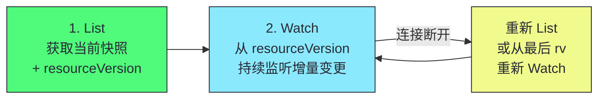
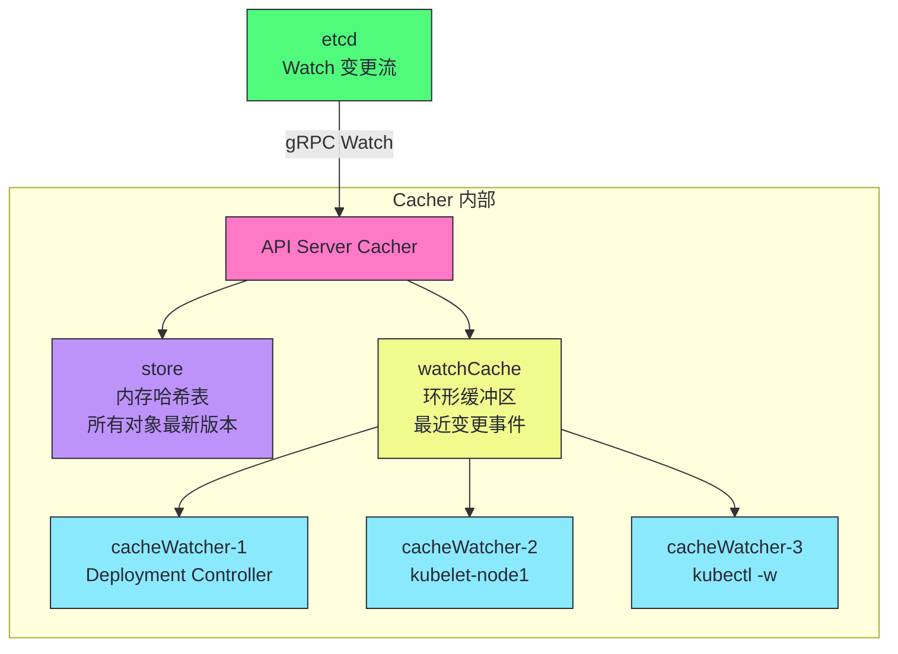
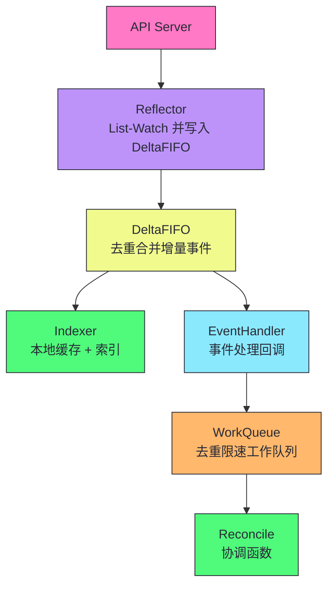
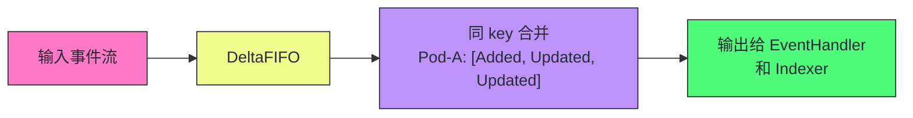
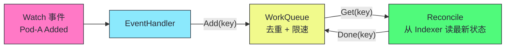
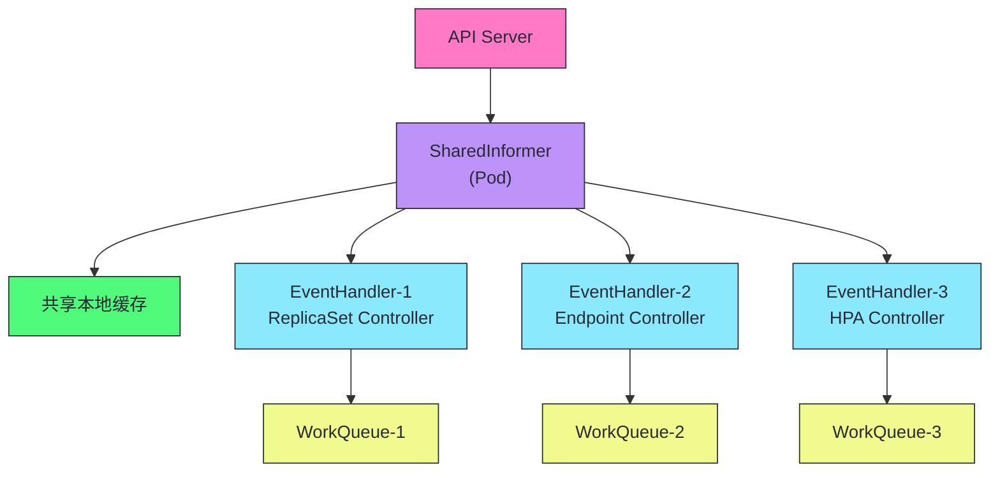
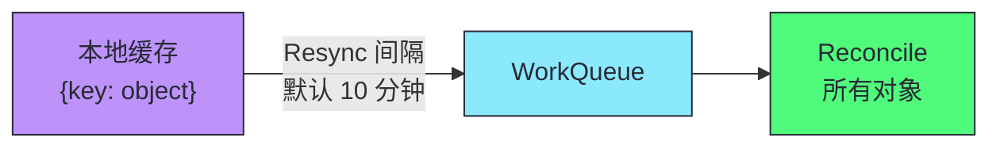

# 06 List-Watch 与 Informer：K8s 的分布式神经系统

> [!abstract] 摘要
> 本文深入 Kubernetes 的分布式神经系统——List-Watch 协议和 Informer 框架。K8s 的所有控制器都不轮询 API Server，而是通过 List-Watch 获取资源的初始状态和增量变更。文章首先从"为什么需要 List-Watch 而非轮询"出发，量化轮询的代价（5000 Pod 集群中 20 个控制器轮询 = 500MB/s 流量），对比 Watch 的增量推送优势。然后深入 API Server 端的 Watch 实现——Cacher、watchCache 环形缓冲区、cacheWatcher 分发器、Bookmark 事件。之后系统剖析 client-go 的 Informer 框架四层架构：Reflector（List-Watch 并写入 DeltaFIFO）、DeltaFIFO（去重合并增量）、Indexer（本地缓存 + 索引）、WorkQueue（去重限速的工作队列）。讲透 SharedInformer 的共享机制——多个控制器共享同一份 Informer，避免重复 List-Watch。然后讨论 Resync 机制——为什么定期全量重新协调是 Level-triggered 原则的工程保障。最后讨论 Informer 的内存管理和性能优化——大集群中 Informer 缓存的内存占用、Resync 的 API Server 压力、Watch 断连恢复。核心认知：Informer 是 K8s 控制器编程的基石——理解 Reflector/DeltaFIFO/Indexer/WorkQueue 如何协作，是编写 Operator 和理解 K8s 内部行为的必备知识。

---

## 第 1 章 为什么需要 List-Watch

### 1.1 轮询的代价

假设 K8s 没有 Watch，所有控制器只能**轮询**——每隔 N 秒 List 所有资源。

5000 Pod 集群，20 个控制器各自轮询 Pod，间隔 1 秒：

| 指标 | 数值 |
|------|------|
| 每秒请求数 | 20 QPS（仅 Pod） |
| 每次响应大小 | 5000 Pod × 5KB = 25MB |
| 每秒网络流量 | 20 × 25MB = 500MB/s |
| etcd 读取压力 | 每次 List 都读 etcd |

这个开销不可接受——而且大部分时候两次轮询间 Pod 列表根本没变化。控制器传输 25MB 数据，只为发现"什么都没变"。

### 1.2 Watch 的增量推送优势

| 维度 | 轮询 | Watch |
|------|------|-------|
| **网络开销** | O(N × 资源总量)/每次 | O(变更数量)/持续 |
| **延迟** | 最大 = 轮询间隔 | 接近实时（毫秒级） |
| **API Server 压力** | 高（每次全量 List） | 低（只推增量） |
| **etcd 压力** | 高（每次 List 读 etcd） | 低（从 watch cache 获取） |

> [!info] 核心概念：Watch 是增量推送，不是全量拉取
> Watch 建立一个 HTTP 长连接，API Server 只在数据变化时推送**变更事件**（而非完整列表）。1 秒内只有 1 个 Pod 更新，只推送这 1 个 Pod 的变更（~5KB），而非 5000 个 Pod 的完整列表（25MB）。这使得 K8s 可以在大规模集群中高效传播状态变更——网络开销与变更频率成正比，而非与资源总量成正比。

### 1.3 List-Watch 协议

单独 Watch 有问题——客户端启动时不知道当前有哪些资源，只能收到启动后的变更。因此 K8s 定义了 **List-Watch 协议**：



1. **Initial List**：先执行一次 List，获取所有资源当前快照和 resourceVersion
2. **Watch**：从该 resourceVersion 开始 Watch，获取后续增量变更

这保证客户端既知道"当前有什么"（List），又能实时感知"发生了什么变化"（Watch）。

---

## 第 2 章 API Server 端的 Watch 实现

### 2.1 Cacher：每种资源的 Watch 缓存

API Server 为每种资源类型维护一个 **Cacher** 对象，包含三个核心组件：



| 组件 | 作用 |
|------|------|
| **store** | 内存哈希表，存储所有对象最新版本。List 请求直接从 store 读取，不查 etcd |
| **watchCache** | 环形缓冲区（默认 100 事件），存储最近变更事件 |
| **cacheWatcher** | 每个 Watch 请求对应一个，将匹配事件推送给客户端 |

### 2.2 事件流转全链路

```
etcd 变更 → API Server Cacher 收到 gRPC Watch 事件
→ 更新 store（最新版本）
→ 写入 watchCache 环形缓冲区
→ 遍历所有 cacheWatcher，推送匹配事件
→ cacheWatcher 通过 HTTP 长连接推送给客户端
```

### 2.3 Bookmark 事件

当 Watcher 的 resourceVersion 落后于缓存但缓存中没有新事件时，API Server 发送 **Bookmark 事件**——只更新 resourceVersion，不携带对象。

```json
{"type":"BOOKMARK","object":{"kind":"Pod","apiVersion":"v1","metadata":{"resourceVersion":"12350"}}}
```

> [!info] 核心概念：Bookmark 防止 Watch 卡在旧版本
> 如果没有 Bookmark，Watcher 的 resourceVersion 可能长时间不更新——下次重连时从这个旧版本开始 Watch，可能需要传输大量历史事件。Bookmark 定期更新 Watcher 的 resourceVersion，使得重连时从较新版本开始，减少历史事件传输。K8s 1.16 引入的优化，对大规模集群的 Watch 性能有显著提升。

---

## 第 3 章 client-go Informer 框架

### 3.1 Informer 的四层架构



### 3.2 第一层：Reflector

**Reflector** 负责 List-Watch API Server，将变更写入 DeltaFIFO。

```go
// 伪代码：Reflector 的核心逻辑
func (r *Reflector) Run() {
    for {
        // 1. List 获取初始状态
        list, err := r.client.List()
        r.syncWith(list.Items, list.ResourceVersion)
        
        // 2. Watch 持续监听
        w, err := r.client.Watch(list.ResourceVersion)
        for event := range w.ResultChan() {
            r.store.Add(Delta{Type: event.Type, Object: event.Object})
        }
        // 3. Watch 断开后重新 List-Watch
    }
}
```

| 职责 | 说明 |
|------|------|
| **List** | 启动时获取所有资源的当前快照 |
| **Watch** | 持续监听资源变更 |
| **断连恢复** | Watch 断开后从最后 resourceVersion 重新 Watch，或全量 List |
| **写入 DeltaFIFO** | 将事件转换为 Delta 写入队列 |

### 3.3 第二层：DeltaFIFO

**DeltaFIFO** 是一个特殊的队列——它存储对象的增量（Delta），并对同一对象的多个事件去重合并。

```go
// Delta 的结构
type Delta struct {
    Type   DeltaType  // Added/Updated/Deleted/Sync
    Object runtime.Object
}

// DeltaFIFO 的核心特性
// 1. 按 key（namespace/name）去重
// 2. 同一 key 的多个 Delta 合并为一个列表
// 3. 先进先出（FIFO）保证顺序
```



> [!info] 核心概念：DeltaFIFO 的去重合并是性能关键
> 如果同一对象在短时间内被多次更新（如 Pod status 频繁变化），DeltaFIFO 将多个 Delta 合并为一个列表——EventHandler 处理时看到的是"这个对象经历了 Added→Updated→Updated"的完整历史，但只需处理最终状态。这减少了 EventHandler 的调用次数，避免高频更新淹没控制器。但注意——合并不意味着丢弃中间状态，EventHandler 可以看到完整的 Delta 列表，只是通常只关心最终状态。

### 3.4 第三层：Indexer

**Indexer** 是一个带索引的本地缓存——存储所有对象的最新版本，支持快速查询。

```go
// Indexer 的核心接口
type Indexer interface {
    // 基本操作
    Add(obj interface{}) error
    Get(obj interface{}) (interface{}, bool, error)
    Delete(obj interface{}) error
    List() []interface{}
    
    // 索引操作
    Index(indexName string, obj interface{}) ([]interface{}, error)
    ByIndex(indexName string, indexKey string) ([]interface{}, error)
}
```

| 索引类型 | Key 函数 | 用途 |
|---------|---------|------|
| **namespace 索引** | `metadata.namespace` | 按 Namespace 查询 |
| **label 索引** | 自定义 | 按 Label 查询 |
| **owner 索引** | `ownerReferences` | 查找某对象的所有子对象 |

```go
// 示例：用 Indexer 按 Namespace 查询 Pod
pods, err := indexer.ByIndex("namespace", "default")
// 无需查询 API Server，直接从本地缓存返回
```

> [!note] 设计哲学：Indexer 让控制器基于内存缓存做决策
> Indexer 使得控制器在 Reconcile 时不需要查询 API Server——直接从本地缓存读取对象的最新状态。这大幅减少了 API Server 的读取压力。例如，ReplicaSet Controller 在协调时需要查找"属于这个 ReplicaSet 的所有 Pod"——通过 owner 索引，一次内存查询即可，无需 API Server 调用。这是 K8s 控制器高性能的工程基础——所有读操作都基于本地缓存，只有写操作才访问 API Server。

### 3.5 第四层：WorkQueue

**WorkQueue** 是 EventHandler 将对象 key 放入的工作队列——支持去重、延迟、限速。

```go
// EventHandler 的标准模式
func onAdd(obj interface{}) {
    key, _ := meta.Accessor(obj)
    workQueue.Add(key)  // 将 key 放入工作队列
}
```

| 特性 | 说明 |
|------|------|
| **去重** | 同一 key 多次入队只处理一次 |
| **延迟** | 支持延迟入队（如失败后延迟 30 秒重试） |
| **限速** | 限制每秒处理的对象数 |
| **有序** | 同一 key 的多次变更按顺序处理 |



> [!warning] 生产避坑：EventHandler 不应直接调用 Reconcile
> EventHandler 的职责是将对象 key 放入 WorkQueue，不是直接执行 Reconcile。如果 EventHandler 直接调用 Reconcile，会阻塞 Informer 的事件分发——后续事件无法被处理。正确的模式是 EventHandler 快速将 key 入队，由独立的 worker goroutine 从队列取 key 执行 Reconcile。这种"事件分发与处理解耦"的设计使得 Informer 不会因 Reconcile 慢而阻塞。

---

## 第 4 章 SharedInformer：共享 Informer

### 4.1 为什么需要共享

如果一个进程中有多个控制器都关心 Pod 资源，每个控制器创建独立的 Informer 会导致：

- 重复的 List-Watch（多个 Watch 连接到 API Server）
- 重复的本地缓存（多份 Pod 数据在内存中）
- 重复的事件处理

### 4.2 SharedInformer 的解决方案

**SharedInformer** 让多个控制器共享同一份 Informer——一份 List-Watch、一份本地缓存，多个 EventHandler。



| 维度 | 独立 Informer | SharedInformer |
|------|--------------|----------------|
| **List-Watch 连接数** | N（每个控制器一个） | 1（共享） |
| **本地缓存** | N 份 | 1 份（共享） |
| **内存占用** | N × 资源大小 | 1 × 资源大小 |
| **API Server 压力** | N 倍 | 1 倍 |

> [!info] 核心概念：SharedInformer 是 kube-controller-manager 的标准模式
> kube-controller-manager 中所有控制器都使用 SharedInformer——共享 Pod、Service、Node 等资源的 Informer。这使得数十个控制器共享同一份本地缓存，而非各自维护。controller-runtime（Operator SDK 底层）也使用 SharedInformer。编写自定义控制器时，务必使用 SharedInformer——用 `informerFactory.Core().V1().Pods().Informer()` 获取共享 Informer，而非自己创建。

---

## 第 5 章 Resync：Level-triggered 的工程保障

### 5.1 什么是 Resync

即使没有收到任何 Watch 事件，Informer 也会定期触发 **Resync**——将本地缓存中的所有对象 key 重新放入 WorkQueue，触发所有对象的 Reconcile。



### 5.2 Resync 的价值

| 场景 | 没有 Resync | 有 Resync |
|------|-----------|----------|
| **Watch 事件丢失** | 状态永久不一致 | 下次 Resync 恢复 |
| **控制器重启后** | 只处理重启后的事件 | Resync 触发所有对象重新协调 |
| **外部状态变化** | 控制器无感知 | Resync 重新检查所有对象 |

> [!info] 核心概念：Resync 是 Level-triggered 原则的工程保障
> Resync 确保即使错过 Watch 事件，控制器也能通过定期全量重新协调恢复一致状态。这是 Level-triggered 原则在工程上的具体实现——不依赖事件是否被消费，定期检查当前状态。Resync 间隔（默认 10 分钟）是一个权衡——间隔短增加 API Server 负载（所有对象 key 入队），间隔长恢复慢。对于关键控制器，可以缩短 Resync 间隔；对于非关键控制器，保持默认值以减少负载。

### 5.3 Resync 的注意事项

Resync 产生的是 **Sync 事件**（不是 Added/Updated/Deleted），EventHandler 需要正确处理：

```go
// EventHandler 的标准实现
func onAdd(obj interface{}) {
    enqueue(obj)
}
func onUpdate(oldObj, newObj interface{}) {
    enqueue(newObj)
}
func onDelete(obj interface{}) {
    enqueue(obj)
}

// Resync 时，所有对象都会触发 onUpdate
// 因为 Informer 比较缓存中的对象与 Resync 传入的对象
// 即使对象没变，也会触发 onUpdate
```

> [!warning] 生产避坑：Resync 不产生 Sync 事件而是 onUpdate
> 很多人以为 Resync 产生特殊的 Sync 事件——实际上在大多数 Informer 实现中，Resync 触发的是 onUpdate（因为缓存中的对象与"重新同步"的对象比较后被视为更新）。这意味着 Reconcile 在 Resync 期间会被所有对象触发——如果你的 Reconcile 有副作用（如创建外部资源），需确保幂等性。三大铁律之一——Reconcile 必须幂等，Resync 是检验幂等性的最佳时机。

---

## 第 6 章 Informer 的内存管理与性能

### 6.1 内存占用

在大型集群中，Informer 的本地缓存可能占用大量内存：

| 集群规模 | Pod 数量 | 平均 Pod 大小 | 缓存内存 |
|---------|---------|-------------|---------|
| 小 | 1,000 | 5KB | 5MB |
| 中 | 10,000 | 5KB | 50MB |
| 大 | 50,000 | 5KB | 250MB |
| 超大 | 100,000 | 5KB | 500MB |

如果进程 Watch 多种资源（Pod + Service + Endpoints + Node），内存占用叠加。

### 6.2 性能优化建议

| 优化 | 说明 |
|------|------|
| **只用 SharedInformer** | 多个控制器共享缓存，避免重复 |
| **设置 Resync 间隔** | 非关键控制器用较长间隔（如 1 小时） |
| **限制 Watch 资源范围** | 用 FieldSelector 限制 Watch 范围 |
| **监控内存** | 监控 Informer 缓存的内存占用 |
| **分进程部署** | 大集群中不同控制器分进程，避免单进程内存过大 |

> [!warning] 生产避坑：大集群中 Informer 内存可能 OOM
> 在 5 万 Pod 的集群中，一个 Watch Pod + Service + Endpoints + Node 的控制器进程可能占用 1GB+ 内存。如果部署为单进程，可能 OOM。解决方案：(1) 不同控制器分进程部署，各自只 Watch 需要的资源；(2) 用 FieldSelector 限制 Watch 范围（如 kubelet 只 Watch 本节点的 Pod）；(3) 监控内存并在接近限制时告警。Informer 的内存占用与集群规模成正比——这是控制器水平扩展的动机之一。

---

## 第 7 章 List-Watch 断连恢复

### 7.1 Watch 连接断开的原因

| 原因 | 说明 |
|------|------|
| **网络问题** | 网络抖动、LB 超时 |
| **API Server 重启** | 升级或故障 |
| **Watch Cache 过期** | resourceVersion 落后太多 |
| **HTTP 超时** | 长连接被中间代理关闭 |

### 7.2 恢复机制

```
Watch 断开 → Reflector 检测到连接关闭
→ 从最后收到的 resourceVersion 重新 Watch
→ 如果 resourceVersion 太旧（超过 watchCache 容量）
→ API Server 返回 410 Gone
→ Reflector 执行全量 List 重新初始化
```

> [!info] 核心概念：List-Watch 的恢复保证不丢数据
> Watch 断开后，Reflector 从最后收到的 resourceVersion 重新 Watch——API Server 会从该版本之后的所有事件重新发送。如果 resourceVersion 太旧（超过 watchCache 环形缓冲区容量，默认 100 个事件），API Server 返回 410 Gone，Reflector 执行全量 List 重新初始化。无论哪种恢复方式，都不会丢失数据——这是 List-Watch 协议的设计保证。理解这个恢复机制对于排查"控制器状态不一致"问题很重要——如果 Watch 频繁断连，可能需要检查网络稳定性或增大 watchCache。

---

## 第 8 章 Informer 的工程实践：编写自定义控制器

### 8.1 标准模式

```go
// 使用 controller-runtime 编写控制器的标准模式
func main() {
    mgr, _ := ctrl.NewManager(ctrl.GetConfigOrDie(), ctrl.Options{
        // 设置 Resync 间隔
        SyncPeriod: &[]time.Duration{10 * time.Minute}[0],
    })
    
    // 注册 Reconciler
    ctrl.NewControllerManagedBy(mgr).
        For(&appsv1.Deployment{}).
        Owns(&appsv1.ReplicaSet{}).
        Complete(&DeploymentReconciler{Client: mgr.GetClient()})
    
    mgr.Start(ctrl.SetupSignalHandler())
}

type DeploymentReconciler struct {
    client.Client
}

func (r *DeploymentReconciler) Reconcile(ctx context.Context, req ctrl.Request) (ctrl.Result, error) {
    // 1. 从缓存（Indexer）读取对象
    var deploy appsv1.Deployment
    if err := r.Get(ctx, req.NamespacedName, &deploy); err != nil {
        if errors.IsNotFound(err) {
            return ctrl.Result{}, nil  // 对象已删除
        }
        return ctrl.Result{}, err
    }
    
    // 2. 比较 spec 和 status，采取行动
    // 3. 更新 status
    return ctrl.Result{}, nil
}
```

### 8.2 controller-runtime 的 Informer 管理

controller-runtime（Operator SDK 底层）自动管理 Informer：

| 功能 | controller-runtime 行为 |
|------|------------------------|
| **SharedInformer** | 自动使用 SharedInformer |
| **缓存范围** | 默认缓存所有 Namespace，可配置按 Namespace 缓存 |
| **Resync** | 通过 SyncPeriod 配置 |
| **Get/List** | 从本地缓存读取，不查 API Server |
| **Create/Update/Delete** | 通过 Client 写入 API Server |

> [!info] 核心概念：controller-runtime 封装了 Informer 的复杂性
> controller-runtime 封装了 Reflector/DeltaFIFO/Indexer/WorkQueue 的复杂性——你只需实现 Reconcile 函数，框架处理 List-Watch、缓存、事件分发、工作队列。`r.Get()` 从本地缓存读取（快），`r.Update()` 写入 API Server（触发 Watch 事件）。这种"读缓存、写 API"的模式是 K8s 控制器编程的标准范式。我们将在第 12 篇深入 CRD 和 Operator 的开发。

---

## 总结

List-Watch 与 Informer 的核心知识可以归纳为以下主线：

1. **轮询的代价在大集群中不可接受**。5000 Pod × 20 控制器轮询 = 500MB/s 流量。Watch 的增量推送使网络开销与变更频率成正比，而非与资源总量成正比。

2. **List-Watch 协议保证不丢数据**。先 List 获取快照和 resourceVersion，再 Watch 从该版本持续监听。断连后从最后 resourceVersion 恢复，或全量 List 重新初始化。

3. **API Server 的 Cacher 是 Watch 缓存**。store（内存哈希表）+ watchCache（环形缓冲区）+ cacheWatcher（分发器）。List 从 store 读取，Watch 从 watchCache 推送，不查 etcd。

4. **Bookmark 事件定期更新 resourceVersion**。防止 Watch 卡在旧版本，重连时减少历史事件传输。K8s 1.16 引入。

5. **Informer 四层架构**。Reflector（List-Watch）→ DeltaFIFO（去重合并）→ Indexer（本地缓存+索引）→ WorkQueue（去重限速）。

6. **DeltaFIFO 按 key 去重合并**。同一对象的多个事件合并为 Delta 列表，减少 EventHandler 调用次数。

7. **Indexer 让控制器基于内存缓存做决策**。带索引的本地缓存，支持按 Namespace/Label/Owner 快速查询。所有读操作基于缓存，只有写操作访问 API Server。

8. **WorkQueue 解耦事件分发与处理**。EventHandler 快速将 key 入队，独立 worker 执行 Reconcile。支持去重、延迟、限速。

9. **SharedInformer 让多个控制器共享缓存**。一份 List-Watch、一份缓存、多个 EventHandler。kube-controller-manager 的标准模式。

10. **Resync 是 Level-triggered 的工程保障**。定期全量重新协调，即使错过 Watch 事件也能恢复。默认间隔 10 分钟。Resync 触发 onUpdate，检验 Reconcile 幂等性。

11. **大集群中 Informer 内存可能 OOM**。5 万 Pod × 多种资源 = 1GB+ 内存。分进程部署、FieldSelector 限制范围、监控内存。

12. **List-Watch 断连恢复保证不丢数据**。从最后 resourceVersion 重新 Watch，或全量 List 重新初始化。

13. **controller-runtime 封装了 Informer 的复杂性**。只需实现 Reconcile 函数，框架处理 List-Watch、缓存、事件分发、工作队列。读缓存、写 API 是标准范式。

> [!info] 专栏导航
> 本文是 [[00 专栏导览|Kubernetes 架构深度剖析专栏]] 的第 06 篇，深入 List-Watch 和 Informer 的实现原理。下一篇 [[07 etcd 深度剖析：Raft 共识、MVCC 与 Watch 机制]] 将深入 etcd 的内部实现——Raft 共识算法、Leader 选举、日志复制、MVCC 多版本并发控制、Watch 的实现原理。

---

## 延伸思考

1. **你的控制器是否用了 SharedInformer？** 如果有多个控制器在同一进程，确认它们共享 Informer 而非各自创建。用 `informerFactory.SharedInformerFactory` 或 controller-runtime 自动管理。

2. **你的 Resync 间隔是否合理？** 默认 10 分钟对大多数场景够用。关键控制器可缩短，非关键控制器可延长。监控 Resync 期间的 WorkQueue 积压情况。

3. **你的 Reconcile 是否幂等？** Resync 会触发所有对象的 onUpdate——如果 Reconcile 不幂等，Resync 会产生副作用。用 Resync 测试幂等性。

4. **你的控制器在大集群中是否会 OOM？** 估算缓存内存占用——Watch 的资源数量 × 平均对象大小。如果超过 1GB，考虑分进程或 FieldSelector 限制范围。

5. **你的 EventHandler 是否快速入队？** EventHandler 不应执行耗时操作——快速将 key 放入 WorkQueue，让独立 worker 处理。阻塞 EventHandler 会卡住整个 Informer 的事件分发。

6. **你的 Watch 是否正确处理断连？** Reflector 自动处理断连恢复，但如果你自己实现了 Watch 逻辑，确保保存最后 resourceVersion 并从该版本恢复。

7. **你是否用 Indexer 的索引加速查询？** 如果控制器频繁按 Label 或 Owner 查询对象，创建自定义索引——比遍历所有对象快得多。

8. **你是否监控了 Informer 的性能？** 监控 Informer 的缓存大小、WorkQueue 深度、Reconcile 延迟。Prometheus 的 controller-runtime metrics 提供这些指标。

---

## 参考资料

1. client-go Informer 源码：https://github.com/kubernetes/client-go/tree/master/tools/cache
2. client-go Informer 文档：https://pkg.go.dev/k8s.io/client-go/informers
3. controller-runtime：https://pkg.go.dev/sigs.k8s.io/controller-runtime
4. Kubernetes List-Watch 协议：https://kubernetes.io/docs/reference/using-api/api-concepts/
5. Efficient detection of changes：https://github.com/kubernetes/community/blob/master/contributors/devel/sig-architecture/api-conventions.md
6. K8s Watch Cache 源码：https://github.com/kubernetes/apiserver/blob/master/pkg/storage/cacher/watch_cache.go

---

> [!note] 思考题
> 1. DeltaFIFO 对同一 key 的多个 Delta 合并为一个列表——如果 Pod 在短时间内被创建后立即删除（Added 然后 Deleted），DeltaFIFO 会合并为 [Added, Deleted]。EventHandler 处理时应该怎么做？是创建 Pod 然后立即删除，还是直接跳过？
> 2. SharedInformer 让多个控制器共享同一份缓存。如果其中一个控制器的 EventHandler 慢（处理耗时长），会影响其他控制器的事件分发吗？controller-runtime 如何隔离不同控制器的事件处理？
> 3. Resync 触发所有对象的 onUpdate——在 5 万 Pod 的集群中，一次 Resync 会产生 5 万个 WorkQueue 项。如果 Reconcile 每个耗时 100ms，处理完 5 万项需要多久？这期间新的 Watch 事件如何处理？
