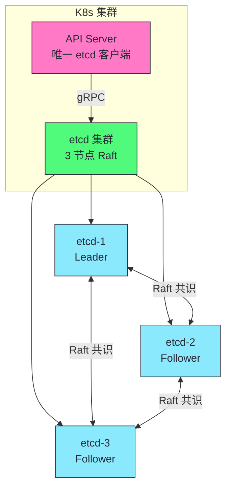
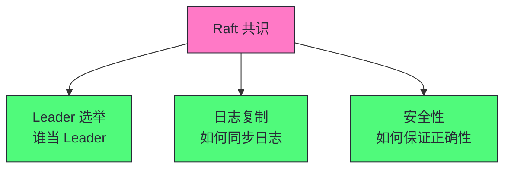
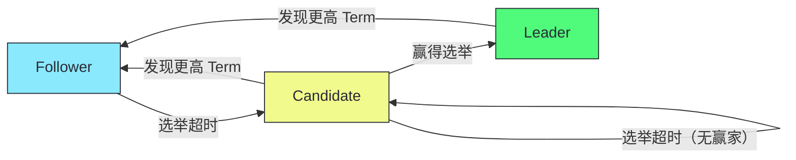
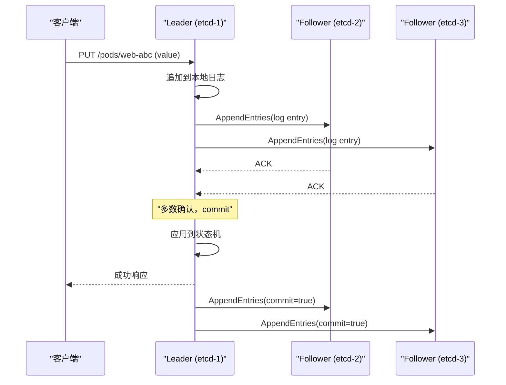
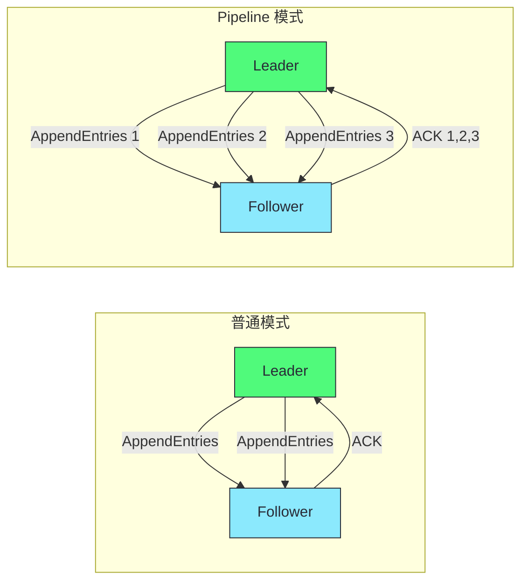
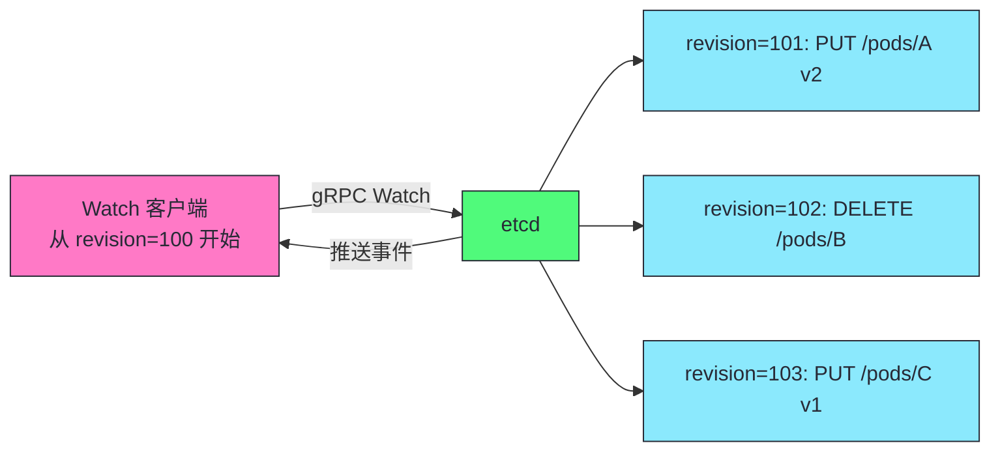

# 07 etcd 深度剖析：Raft 共识、MVCC 与 Watch 机制

> [!abstract] 摘要
> 本文深入 Kubernetes 的唯一持久化存储——etcd。etcd 是一个分布式键值存储，使用 Raft 共识算法保证强一致性，是 K8s 集群的"唯一记忆"。文章从 etcd 在 K8s 中的角色出发——所有集群状态（Pod、Service、Deployment、Secret 等）都存在 etcd 中，etcd 故障意味着整个集群的状态丢失。然后深入 Raft 共识算法的工程实现——Leader 选举（Term、RequestVote、随机化超时）、日志复制（AppendEntries、commit 规则、线性一致性读）、安全性保证（Leader 完整性、选举限制）。讲透 etcd 的 MVCC 多版本并发控制——每个 key 的每次修改都生成新版本，支持历史版本查询和 Watch。然后讨论 etcd 的 Watch 机制——K8s 的 List-Watch 协议底层依赖 etcd Watch，从 Watch 到 MVCC 的关系。之后深入 etcd 的存储引擎——WAL（预写日志）、Snapshot（快照）、compaction（压缩），以及为什么压缩对 etcd 性能至关重要。最后讨论 etcd 的运维实践——容量规划、备份恢复、性能调优、常见故障。核心认知：etcd 是 K8s 最重要的单点，必须高可用部署（3/5 节点 Raft）和定期备份，备份了从没验证过恢复等于没备份。

---

## 第 1 章 etcd 在 K8s 中的角色

### 1.1 唯一持久化存储

K8s 的所有集群状态都存在 etcd 中——Pod、Service、Deployment、Secret、ConfigMap、RBAC 等。API Server 是 etcd 的唯一客户端，其他组件通过 API Server 间接读写。



### 1.2 etcd 的核心特性

| 特性 | 说明 | K8s 用途 |
|------|------|---------|
| **强一致性** | Raft 共识，所有写经过 Leader | 集群状态一致性 |
| **Watch 机制** | 客户端监听 key 变化 | K8s List-Watch 底层 |
| **MVCC** | 多版本并发控制 | 历史版本、ResourceVersion |
| **事务** | CAS（Compare-And-Swap） | 乐观并发控制 |
| **Lease** | TTL key | 心跳、锁、Leader Election |
| **高可用** | 3/5 节点 Raft | 容忍 1/2 节点故障 |

> [!info] 核心概念：etcd 是 K8s 最重要的单点
> etcd 故障意味着整个集群的状态丢失——所有 Pod、Service、Deployment 的定义都消失了。虽然运行中的容器不会立即停止（kubelet 独立管理容器生命周期），但任何新操作（创建/更新/删除 Pod）都无法执行。etcd 必须有高可用部署（3 或 5 节点 Raft 集群）和定期备份。备份策略：(1) 定期 etcdctl snapshot save；(2) 备份存储到异地（如 S3）；(3) 定期演练恢复流程。

---

## 第 2 章 Raft 共识算法

### 2.1 Raft 的设计目标

Raft 是 Diego Ongaro 在 2014 年提出的共识算法，设计目标是**可理解性**（相比 Paxos 更易理解和实现）。etcd、Consul、TiKV 等都使用 Raft。

Raft 将共识分解为三个子问题：



### 2.2 节点状态

| 状态 | 说明 |
|------|------|
| **Follower** | 接收 Leader 的 AppendEntries，被动响应 |
| **Candidate** | 选举超时后发起选举，请求投票 |
| **Leader** | 处理所有写请求，复制日志到 Followers |



### 2.3 Leader 选举

#### Term（任期）

**Term** 是单调递增的整数，充当 Raft 的"逻辑时钟"。每次选举启动一个新 Term。Term 保证了过期的 Leader 不会造成危害——如果节点收到更高 Term 的消息，它自己变为 Follower。

#### 选举流程

```
1. Follower 在选举超时（随机 150-300ms）内没收到 Leader 心跳
2. Follower 变为 Candidate，Term + 1，给自己投票
3. Candidate 向其他节点发送 RequestVote RPC
4. 获得多数票的 Candidate 成为 Leader
5. Leader 定期发送心跳（AppendEntries 无 entries）维持领导地位
```

> [!info] 核心概念：随机化选举超时防止活锁
> 如果所有节点同时选举超时，它们同时变为 Candidate，同时请求投票，没人获得多数——这导致"活锁"（election livelock）。Raft 用**随机化选举超时**（150-300ms 随机）解决这个问题——不同节点超时时间不同，先超时的节点先发起选举，大概率获得多数。这是 Raft 相比 Paxos 的工程优势之一——简单有效地避免了选举活锁。

### 2.4 日志复制

#### 写请求处理流程



#### Commit 规则

Leader 只有在**当前 Term 的日志条目被多数确认**后才 commit。这是 Raft 的安全性保证——防止旧 Term 的 Leader commit 未复制的日志（脑裂场景）。

> [!warning] 生产避坑：Raft 的 commit 规则防止脑裂数据丢失
> 假设旧 Leader（Term=5）网络分区，它继续接受写请求但无法复制到多数。网络恢复后，新 Leader（Term=6）被选举。旧 Leader 的未 commit 的日志不会丢失——新 Leader 会检测到日志不一致，用自己的日志覆盖。但如果旧 Leader 已经 commit 了（在分区前），新 Leader 必须保留这些已 commit 的日志。Raft 的"当前 Term commit 规则"确保了这一点——只有当前 Term 的日志被多数确认才 commit，防止旧 Term 的错误 commit。

### 2.5 线性一致性读

etcd 默认提供**线性一致性读**——读请求看到的是最近一次已 commit 的写。实现方式：

| 方式 | 机制 | 性能 |
|------|------|------|
| **ReadIndex** | Leader 确认自己仍是 Leader，读本地状态机 | 中 |
| **Lease Read** | Leader 基于租约认为自己是 Leader，直接读 | 高（但有风险） |

> [!note] 设计哲学：线性一致性读的代价
> 线性一致性读需要 Leader 确认自己仍是 Leader（避免读到旧 Leader 的数据）——这需要一次心跳确认。etcd 默认用 ReadIndex，每次读有一次 RTT 的额外延迟。Lease Read 基于租约跳过确认，性能更高——但如果租约未及时过期而 Leader 已切换，可能读到旧数据。生产环境用默认的 ReadIndex 确保正确性，除非对延迟极端敏感且能容忍偶尔的旧读。

### 2.6 etcd 的 Raft 实现

etcd 的 Raft 实现（etcd-raft）与标准 Raft 的差异：

| 特性 | 标准 Raft | etcd-raft |
|------|----------|-----------|
| **日志存储** | 内存 | 持久化（WAL + Snapshot） |
| **批量提交** | 单条 | 批量（BatchAppend） |
| **Pipeline 复制** | 无 | 有（PipelineAppend） |
| **只读请求** | 走 Raft 日志 | ReadIndex/Lease Read 优化 |

### 2.7 etcd 的 Pipeline 复制优化

标准 Raft 的日志复制是"请求-响应"模式——Leader 发送 AppendEntries，等待 Follower 确认，再发送下一批。这种模式在高延迟网络下效率低——每次复制的 RTT 都被等待时间占据。

etcd-raft 的 **Pipeline 复制**：Leader 持续发送 AppendEntries 而不等待确认——假设 Follower 会按顺序确认。如果发现 Follower 的日志落后（通过 nextIndex 不匹配），退回到普通模式重新同步。



> [!info] 核心概念：Pipeline 复制提升高延迟网络的吞吐量
> Pipeline 复制使得 Leader 不需要等待每个 AppendEntries 的确认——在高延迟网络（如跨数据中心）中，这显著提升吞吐量。但 Pipeline 模式需要处理乱序确认和日志不一致——如果 Follower 确认失败，Leader 需要回退到普通模式重新同步。这是 etcd 在工程实现上对标准 Raft 的优化之一。

---

## 第 3 章 MVCC 多版本并发控制

### 3.1 为什么需要 MVCC

etcd 的每个 key 的每次修改都生成新版本——这使得 etcd 支持：
- **历史版本查询**：查询 key 在某个版本时的值
- **Watch**：从某个版本开始监听变更
- **事务**：基于版本的 CAS（Compare-And-Swap）

### 3.2 MVCC 的版本机制

```
# 写入 key=/pods/web-abc value=v1
revision=1, key=/pods/web-abc, value=v1

# 更新 key=/pods/web-abc value=v2
revision=2, key=/pods/web-abc, value=v2

# 更新 key=/pods/web-abc value=v3
revision=3, key=/pods/web-abc, value=v3

# 查询 key=/pods/web-abc 在 revision=2 时的值
→ 返回 v2
```

| 概念 | 说明 |
|------|------|
| **revision** | 全局单调递增的版本号，每次写操作递增 |
| **ModRevision** | key 最后被修改的 revision |
| **Version** | key 的修改次数（从创建开始） |

### 3.3 K8s 的 ResourceVersion

K8s 的 `metadata.resourceVersion` 直接对应 etcd 的 **ModRevision**。

```yaml
# K8s 对象
metadata:
  resourceVersion: "12345"  # 对应 etcd 的 ModRevision
```

> [!info] 核心概念：ResourceVersion 是 etcd ModRevision 的直接映射
> K8s 的 ResourceVersion 不是 K8s 自己维护的版本号——它是 etcd ModRevision 的字符串形式。这意味着：(1) ResourceVersion 全局单调递增（跨所有资源类型）；(2) 不同资源的 ResourceVersion 可以比较大小（虽然语义上无意义）；(3) ResourceVersion 的更新由 etcd 的写操作驱动，K8s 不主动管理。理解这个映射很重要——它是 K8s 乐观并发控制和 List-Watch 协议的底层基础。我们将在第 08 篇深入讨论 ResourceVersion 的工程使用。

---

## 第 4 章 Watch 机制

### 4.1 etcd Watch 的实现

etcd Watch 基于 MVCC——客户端从某个 revision 开始监听，etcd 推送该 revision 之后的所有变更事件。



### 4.2 Watch 的压缩问题

etcd 定期**压缩**（compact）旧版本——删除 revision 之前的历史版本。如果 Watch 的起始 revision 已被压缩，etcd 返回错误，客户端需要重新 List。

```
compact(revision=1000)
→ 删除 revision < 1000 的所有历史版本

Watch from revision=500
→ 失败：revision 已被压缩
→ 客户端需要重新 List 获取当前快照
```

> [!warning] 生产避坑：Watch 失败后必须重新 List
> 如果 etcd 压缩了 Watch 的起始 revision，Watch 返回失败。K8s 的 Reflector 自动处理这种情况——执行全量 List 重新初始化，然后从新的 revision 开始 Watch。但如果你自己实现了 Watch 逻辑（不使用 client-go Informer），必须处理这种失败——重新 List 获取当前快照，而非无限重试 Watch。这是 List-Watch 协议中"List"阶段的价值——Watch 失败时可以回到 List 恢复。

---

## 第 5 章 存储引擎：WAL、Snapshot、Compaction

### 5.1 WAL（预写日志）

**WAL（Write-Ahead Log）** 是 etcd 的持久化机制——所有写操作在应用到状态机前先写入 WAL 文件。etcd 重启时通过回放 WAL 恢复状态。


### 5.2 Snapshot（快照）

**Snapshot** 是状态机的定期快照——将内存状态序列化到文件，避免 WAL 无限增长。etcd 重启时先加载最近的 Snapshot，再回放 Snapshot 之后的 WAL。

```
启动恢复流程：
1. 加载最近的 Snapshot（如 revision=1000 时的状态）
2. 回放 Snapshot 之后的 WAL（revision 1001-当前）
3. 应用所有日志条目到状态机
4. 恢复完成
```

### 5.3 Compaction（压缩）

**Compaction** 删除旧版本的历史数据——revision < compact_revision 的所有版本被删除。

| 压缩方式 | 说明 |
|---------|------|
| **手动压缩** | `etcdctl compact <revision>` |
| **自动压缩** | `--auto-compaction-retention=1h`（按时间）或 `--auto-compaction-retention=10000`（按 revision 数） |

> [!warning] 生产避坑：不压缩会导致 etcd 性能退化
> 如果不定期压缩，etcd 的历史版本无限增长——WAL 文件越来越大，重启恢复时间越来越长，Watch 历史窗口越来越大但无用。K8s 的 kube-apiserver 默认每 5 分钟自动压缩一次（`--etcd-compaction-interval=5m`）。如果你禁用了自动压缩（设为 0），必须手动定期压缩。监控 etcd 的 `etcd_mvcc_db_total_size_in_bytes`——如果持续增长，说明压缩没生效。

---

## 第 6 章 etcd 运维实践

### 6.1 容量规划

| 集群规模 | 推荐 etcd 节点数 | 推荐 etcd 资源 |
|---------|----------------|--------------|
| 小（<100 节点） | 3 | 2 vCPU, 4GB RAM, 50GB SSD |
| 中（100-1000 节点） | 3 或 5 | 4 vCPU, 8GB RAM, 100GB SSD |
| 大（1000+ 节点） | 5 | 8 vCPU, 16GB RAM, 200GB SSD |

> [!info] 核心概念：etcd 对磁盘 IOPS 极其敏感
> etcd 的写操作需要先 fsync 到 WAL——磁盘延迟直接影响写延迟。普通 HDD 的 fsync 延迟约 5-10ms，SSD 约 0.5-1ms，NVMe SSD 约 0.1ms。etcd 官方推荐使用 SSD 或 NVMe。如果 etcd 共享磁盘（如与 K8s 其他组件同一块盘），磁盘争用会导致 etcd 延迟抖动——建议 etcd 独占磁盘。

### 6.2 备份恢复

```bash
# 备份
ETCDCTL_API=3 etcdctl snapshot save /backup/etcd-snapshot.db \
  --endpoints=https://127.0.0.1:2379 \
  --cacert=/etc/etcd/ca.crt \
  --cert=/etc/etcd/peer.crt \
  --key=/etc/etcd/peer.key

# 验证备份
ETCDCTL_API=3 etcdctl snapshot status /backup/etcd-snapshot.db

# 恢复（在新集群上）
ETCDCTL_API=3 etcdctl snapshot restore /backup/etcd-snapshot.db \
  --data-dir=/var/lib/etcd-restored
```

> [!warning] 生产避坑：备份了从没验证过恢复等于没备份
> 很多团队定期备份 etcd，但从未演练恢复流程——真出事时发现备份不可用（备份文件损坏、恢复步骤错误、版本不兼容）。定期演练恢复：(1) 在测试环境恢复一份备份；(2) 验证 K8s 资源完整性（`kubectl get pods --all-namespaces`）；(3) 记录恢复步骤和耗时。建议每季度演练一次恢复。

### 6.3 性能调优

| 参数 | 作用 | 推荐值 |
|------|------|--------|
| `--heartbeat-interval` | 心跳间隔 | 100ms（默认） |
| `--election-timeout` | 选举超时 | 1000ms（默认） |
| `--snapshot-count` | 多少次写后 Snapshot | 10000（默认） |
| `--quota-backend-bytes` | 后端存储配额 | 8GB（默认，超过只读） |
| `--auto-compaction-retention` | 自动压缩保留 | 1h（按时间） |

### 6.4 常见故障

| 故障 | 症状 | 排查方法 |
|------|------|---------|
| **磁盘满** | etcd 只读，K8s 无法创建资源 | 检查磁盘空间，压缩或扩容 |
| **Leader 频繁切换** | API Server 延迟抖动 | 检查网络和磁盘延迟 |
| **多数节点故障** | 集群不可用 | 恢复故障节点，或从备份恢复 |
| **WAL 损坏** | etcd 无法启动 | 从 Snapshot + WAL 恢复，或从备份恢复 |
| **内存不足** | etcd OOM | 扩容内存，或压缩减少历史版本 |

### 6.5 etcd 监控指标

生产环境必须监控的 etcd 指标：

| 指标 | 说明 | 告警阈值 |
|------|------|---------|
| `etcd_server_has_leader` | 是否有 Leader | 0 表示无 Leader，立即告警 |
| `etcd_server_leader_changes_seen_total` | Leader 切换次数 | 5 分钟内 >3 告警 |
| `etcd_disk_wal_fsync_duration_seconds` | WAL fsync 延迟 | P99 >10ms 告警 |
| `etcd_disk_backend_commit_duration_seconds` | 后端 commit 延迟 | P99 >25ms 告警 |
| `etcd_mvcc_db_total_size_in_bytes` | 数据库大小 | 接近 quota（8GB）告警 |
| `etcd_server_proposals_failed_total` | 提案失败次数 | 持续增长告警 |

> [!info] 核心概念：WAL fsync 延迟是 etcd 健康的关键指标
> etcd 的写性能直接受 WAL fsync 延迟影响——fsync 慢意味着写慢。如果 `etcd_disk_wal_fsync_duration_seconds` 的 P99 超过 10ms，说明磁盘成为瓶颈——可能是 HDD、磁盘争用、或 IOPS 不足。这会导致 K8s API Server 的写延迟增加，影响所有创建/更新操作。监控这个指标并在异常时告警，是 etcd 运维的关键实践。

---

## 总结

etcd 深度剖析的核心知识可以归纳为以下主线：

1. **etcd 是 K8s 唯一持久化存储和最重要的单点**。所有集群状态存在 etcd 中。必须高可用部署（3/5 节点 Raft）和定期备份。

2. **Raft 共识分解为三个子问题**。Leader 选举、日志复制、安全性。随机化选举超时防止活锁。

3. **Term 是 Raft 的逻辑时钟**。单调递增，过期的 Leader 遇到更高 Term 自动降级为 Follower。

4. **日志复制需要多数确认才 commit**。当前 Term 的日志被多数确认才 commit，防止脑裂数据丢失。

5. **线性一致性读需要 Leader 确认**。ReadIndex（确认后读）或 Lease Read（基于租约跳过确认）。默认 ReadIndex 确保正确性。

6. **MVCC 多版本并发控制支持历史版本**。每个 key 的每次修改生成新版本（revision）。支持历史查询和 Watch。

7. **K8s ResourceVersion 是 etcd ModRevision 的映射**。全局单调递增，跨所有资源类型。乐观并发控制和 List-Watch 的底层基础。

8. **etcd Watch 基于 MVCC**。从某 revision 开始监听，推送该 revision 之后的变更。压缩后 Watch 失败，需重新 List。

9. **WAL 保证持久性**。写操作先 fsync 到 WAL 再应用到状态机。重启时回放 WAL 恢复状态。

10. **Snapshot 避免 WAL 无限增长**。定期快照状态机，重启时先加载 Snapshot 再回放后续 WAL。

11. **Compaction 删除旧版本**。不压缩导致性能退化。K8s 默认每 5 分钟自动压缩。

12. **etcd 对磁盘 IOPS 极其敏感**。使用 SSD 或 NVMe，独占磁盘。fsync 延迟直接影响写延迟。

13. **备份了从没验证过恢复等于没备份**。定期演练恢复流程，在测试环境验证备份可用性。

14. **3 节点容忍 1 故障，5 节点容忍 2 故障**。奇数节点避免脑裂。大多数生产环境用 3 或 5 节点。

15. **WAL fsync 延迟是 etcd 健康的关键指标**。P99 >10ms 说明磁盘成为瓶颈。监控 `etcd_disk_wal_fsync_duration_seconds` 并在异常时告警。

16. **etcd 的 ReadIndex 和 Lease Read 是线性一致性读的两种实现**。ReadIndex 每次读确认 Leader 身份（一次 RTT），Lease Read 基于租约跳过确认（更快但有风险）。生产环境用默认 ReadIndex 确保正确性。

> [!info] 专栏导航
> 本文是 [[00 专栏导览|Kubernetes 架构深度剖析专栏]] 的第 07 篇，深入 etcd 的内部实现。下一篇 [[08 ResourceVersion 与乐观并发控制]] 将详细讨论 K8s 如何基于 etcd 的 ModRevision 实现乐观并发控制——ResourceVersion 的语义、冲突重试、List-Watch 中的 ResourceVersion 使用。

---

## 延伸思考

1. **你的 etcd 是否高可用部署？** 检查 etcd 节点数（应为 3 或 5 的奇数）。所有节点在同一台机器上是单点——不是高可用。

2. **你的 etcd 是否有定期备份？** 检查备份策略和频率。备份应存储到异地（如 S3），而非同机房。

3. **你是否演练过 etcd 恢复？** 如果从没演练过，你的备份可能不可用。在测试环境恢复一份备份，验证 K8s 资源完整性。

4. **你的 etcd 是否用了 SSD？** etcd 对磁盘 IOPS 极其敏感。如果还在用 HDD，升级到 SSD 或 NVMe。etcd 独占磁盘避免争用。

5. **你的 etcd 是否启用了自动压缩？** 检查 `--auto-compaction-retention`。不压缩会导致历史版本无限增长，性能退化。

6. **你的 etcd Leader 是否频繁切换？** 监控 `etcd_server_leader_changes_seen_total`。频繁切换表明网络或磁盘问题。

7. **你的 etcd 内存是否足够？** 监控 `etcd_mvcc_db_total_size_in_bytes`。接近 `--quota-backend-bytes`（默认 8GB）时 etcd 变只读。

8. **你的 etcd 选举超时是否合理？** 默认 1000ms。网络延迟高的环境可能需要调大（如 2000ms），但太大会导致 Leader 故障后恢复慢。

9. **你的 etcd 是否监控了提案失败率？** `etcd_server_proposals_failed_total` 持续增长表明集群不稳定——可能是网络问题、磁盘慢、或节点过载。提案失败意味着写操作被拒绝，影响 K8s API Server 的写入。

10. **你的 etcd 是否跨可用区部署？** 3 节点分散到 3 个可用区比同可用区更健壮——一个可用区故障不会丢失多数。但跨可用区的网络延迟更高，需要评估对写延迟的影响。

---

## 参考资料

1. etcd 文档：https://etcd.io/docs/
2. Raft 论文：https://raft.github.io/raft.pdf
3. etcd 源码：https://github.com/etcd-io/etcd
4. etcd 运维指南：https://etcd.io/docs/v3.5/op-guide/
5. K8s etcd 备份恢复：https://kubernetes.io/docs/tasks/administer-cluster/configure-upgrade-etcd/
6. etcd 性能调优：https://etcd.io/docs/v3.5/tuning/

---

> [!note] 思考题
> 1. etcd 用 3 节点 Raft 集群——容忍 1 节点故障。如果 2 节点同时故障，集群失去多数，无法选主也无法写。此时运行中的 K8s 集群会发生什么？已运行的 Pod 会停止吗？新 Pod 能创建吗？API Server 能读吗？
> 2. etcd 的 MVCC 保留所有历史版本——K8s 默认每 5 分钟压缩一次。压缩后，旧版本的 ResourceVersion 不可查询。如果一个控制器的 Informer 在压缩期间断连，它保存的最后 ResourceVersion 可能已被压缩——它如何恢复？
> 3. etcd 的线性一致性读需要 Leader 确认自己仍是 Leader（ReadIndex）。如果 Leader 已经脑裂但租约未过期，它可能确认"我还是 Leader"但其实不是——这会导致读到旧数据吗？Lease Read 的风险有多大？
