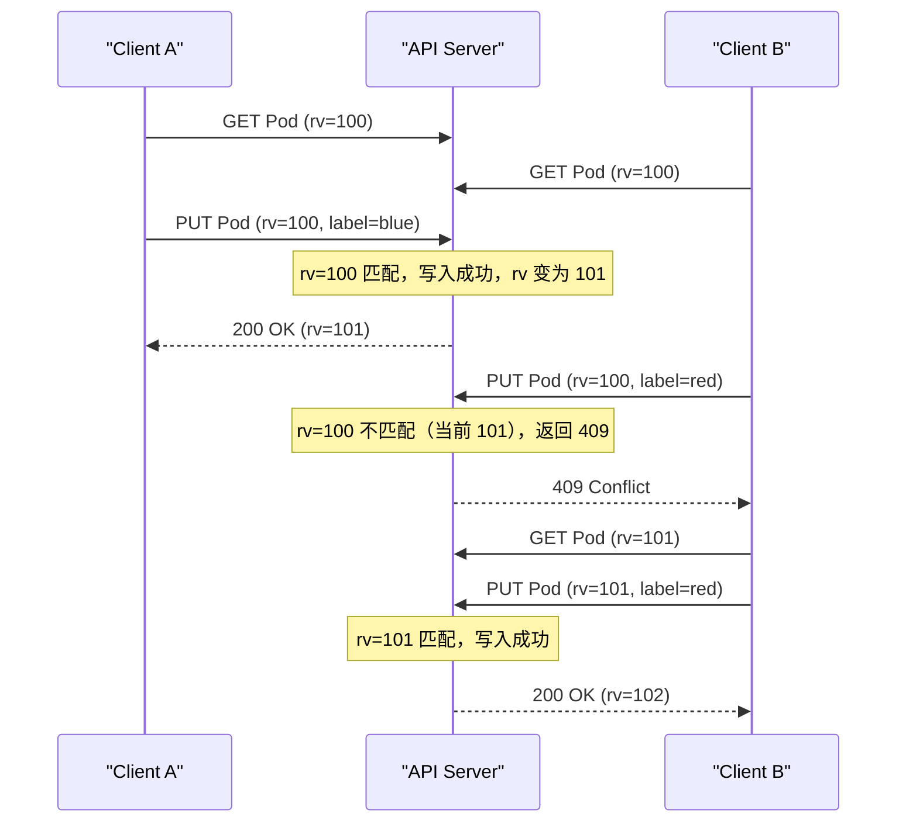
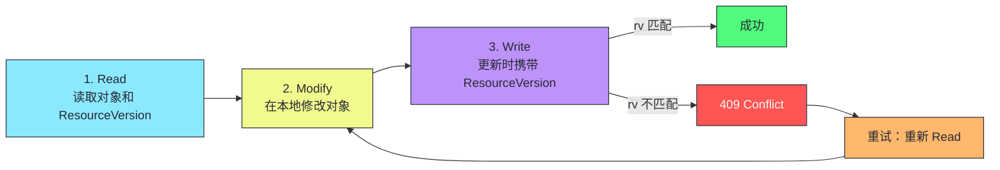
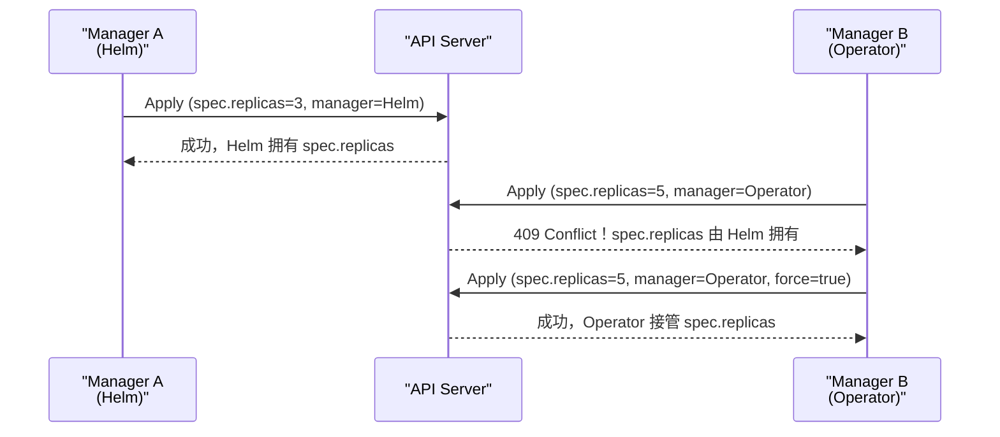

# 08 ResourceVersion 与乐观并发控制

> [!abstract] 摘要
> 本文深入 K8s 并发控制的核心机制——ResourceVersion 与乐观并发控制。K8s 不使用分布式锁——它基于 etcd 的 ModRevision 实现乐观并发控制（Optimistic Concurrency Control）。文章首先讲透 ResourceVersion 的本质——它是 etcd ModRevision 的字符串映射，全局单调递增，每次写操作递增。然后详解乐观并发控制的流程——读-改-写三步，更新时携带 ResourceVersion，不匹配返回 409 Conflict，客户端重试。对比乐观并发与悲观锁的差异——为什么 K8s 选择乐观并发而非分布式锁。然后深入 generation 和 observedGeneration 的语义——generation 只在 spec 变更时递增，observedGeneration 是控制器汇报的"已处理到的 generation"，两者比较衡量控制器进度。之后讨论 List-Watch 中的 ResourceVersion 使用——List 返回的 ResourceVersion 作为 Watch 的起始点，Bookmark 事件定期更新。最后分析 Server-Side Apply 的字段所有权机制——如何解决多个组件管理同一对象时的冲突。核心认知：乐观并发控制是 K8s 在高并发分布式环境中的工程选择——它假设冲突很少发生，冲突时重试比持锁等待更高效。

---

## 第 1 章 ResourceVersion 的本质

### 1.1 什么是 ResourceVersion

每个 K8s 对象的 `metadata.resourceVersion` 是一个字符串，标识该对象的版本。

```yaml
apiVersion: apps/v1
kind: Deployment
metadata:
  name: web
  resourceVersion: "12345"  # 这个值是什么？
```

**ResourceVersion 是 etcd ModRevision 的字符串映射**。etcd 中每次写操作生成一个全局单调递增的 revision，ModRevision 是 key 最后被修改时的 revision。

### 1.2 etcd 的版本体系

| 概念 | 说明 | 示例 |
|------|------|------|
| **revision** | 全局单调递增，每次写操作递增 | 1, 2, 3, ... |
| **ModRevision** | key 最后被修改的 revision | key=A 的 ModRevision=5 |
| **Version** | key 的修改次数（从创建开始） | key=A 的 Version=3（被修改了 3 次） |

```
revision=1: PUT key=A value=v1  → A.ModRevision=1, A.Version=1
revision=2: PUT key=B value=v1  → B.ModRevision=2, B.Version=1
revision=3: PUT key=A value=v2  → A.ModRevision=3, A.Version=2
revision=4: PUT key=A value=v3  → A.ModRevision=4, A.Version=3
```

> [!info] 核心概念：ResourceVersion 全局单调递增
> ResourceVersion 是 etcd ModRevision 的映射——而 ModRevision 是全局的 revision，不绑定特定 key。这意味着不同资源的 ResourceVersion 可以比较大小（虽然语义上无意义）——Pod 的 ResourceVersion=100 和 Service 的 ResourceVersion=200，100 < 200 只表示 Pod 的修改比 Service 早，不表示 Pod "比 Service 旧"。理解这个全局性很重要——它使得 K8s 可以用一个 ResourceVersion 标识"整个集群在某个时刻的快照"（List 请求返回的 ResourceVersion）。

### 1.3 ResourceVersion 的三个用途

| 用途 | 说明 |
|------|------|
| **乐观并发控制** | 更新时携带 ResourceVersion，检测冲突 |
| **List-Watch 的起始点** | List 返回的 ResourceVersion 作为 Watch 起点 |
| **对象的新鲜度比较** | 同一对象的两个版本，ResourceVersion 大的是更新的 |

---

## 第 2 章 乐观并发控制

### 2.1 为什么不用分布式锁

传统并发控制用**悲观锁**——操作前先获取锁，操作完释放锁。但在分布式系统中，分布式锁有严重问题：

| 问题 | 说明 |
|------|------|
| **锁持有者故障** | 持锁节点故障，锁无法释放（需要 lease + fencing token） |
| **锁服务单点** | 锁服务自身需要高可用 |
| **性能开销** | 每次操作都要获取/释放锁，增加延迟 |
| **死锁风险** | 多个组件互相等待对方的锁 |
| **可扩展性差** | 高并发下锁竞争成为瓶颈 |

K8s 的场景特点使得乐观并发更合适：

| K8s 场景特点 | 为什么乐观并发合适 |
|------------|-----------------|
| **冲突很少** | 一个对象通常由一个控制器管理 |
| **读多写少** | 控制器频繁读（从缓存），写相对少 |
| **容忍重试** | Reconcile 可重试，冲突重试不影响正确性 |
| **无死锁** | 不持锁，没有死锁风险 |
| **可扩展** | 不需要全局锁服务，etcd CAS 原子操作 |

### 2.2 乐观并发的思路

**乐观并发控制（OCC）** 假设冲突很少发生——不持锁，操作前读版本，操作时验证版本未变，变了就重试。



### 2.3 乐观并发的三步流程



| 步骤 | 操作 | 说明 |
|------|------|------|
| **Read** | `GET /api/v1/pods/web` | 获取对象和 ResourceVersion |
| **Modify** | 在本地修改对象 | 修改 label/spec 等 |
| **Write** | `PUT /api/v1/pods/web`（携带 ResourceVersion） | API Server 验证 rv 匹配 |

### 2.4 etcd 层面的 CAS

K8s 的乐观并发控制底层是 etcd 的 **CAS（Compare-And-Swap）** 事务：

```go
// 伪代码：API Server 的更新逻辑
func UpdateObject(key string, newValue Object, expectedRV int64) error {
    // etcd 的事务：如果 ModRevision == expectedRV，则写入
    resp, err := etcd.Txn(ctx).
        If(clientv3.Compare(clientv3.ModRevision(key), "=", expectedRV)).
        Then(clientv3.OpPut(key, serialize(newValue))).
        Else().
        Commit()
    
    if !resp.Succeeded {
        return errors.NewConflict("resourceVersion mismatch")
    }
    return nil
}
```

> [!info] 核心概念：乐观并发控制假设冲突很少发生
> 乐观并发控制在"冲突很少"的场景下高效——大多数更新不会冲突，无需持锁等待。但在"冲突频繁"的场景下（如多个组件频繁更新同一对象），重试次数增加，性能下降。K8s 的大多数场景冲突很少——一个对象通常由一个控制器管理，并发更新不多。但对于高频更新的对象（如 Endpoints 频繁更新 Pod IP），冲突可能较多——K8s 用 SharedInformer 和本地缓存减少 API Server 调用，缓解这个问题。

---

## 第 3 章 generation 与 observedGeneration

### 3.1 generation：spec 的变更计数

**generation** 是 ObjectMeta 中的字段，只在 **spec 部分被修改**时递增。status 变更不递增 generation。

```yaml
metadata:
  generation: 5  # spec 被修改了 5 次
spec:
  replicas: 3    # 用户修改 replicas，generation +1
status:
  replicas: 3    # 控制器更新 status，generation 不变
```

### 3.2 observedGeneration：控制器的进度汇报

**observedGeneration** 是 Status 中的字段，控制器汇报"我已处理到 spec 的第几次变更"。

```yaml
spec:
  # ... 用户的期望 ...
status:
  observedGeneration: 5  # 控制器已处理到 generation=5
```

### 3.3 generation vs observedGeneration

| 场景 | generation | observedGeneration | 含义 |
|------|-----------|-------------------|------|
| 用户刚修改 spec，控制器还没处理 | 6 | 5 | 控制器落后 1 步 |
| 控制器已处理最新 spec | 6 | 6 | 状态一致 |
| 控制器崩溃后重启 | 6 | 5 | 重启后需追赶 |

> [!info] 核心概念：generation 和 observedGeneration 衡量控制器进度
> 当 `observedGeneration < generation` 时，表示用户修改了 spec 但控制器还没处理——kubectl 显示 "Progressing" 状态。控制器在 Reconcile 后更新 observedGeneration = generation，表示"我已看到并处理了用户的最新变更"。这是判断"控制器是否已处理用户最新变更"的关键指标。如果你在等待 Deployment 滚动更新完成，检查 `observedGeneration == generation` 且 `updatedReplicas == replicas`——两个条件都满足才算完成。

### 3.4 控制器的正确实现

```go
// 伪代码：控制器 Reconcile 中正确更新 observedGeneration
func Reconcile(deployment *appsv1.Deployment) error {
    // 1. 检查 observedGeneration 是否落后
    if deployment.Status.ObservedGeneration < deployment.Generation {
        // 用户修改了 spec，需要处理
        // ... 执行协调逻辑 ...
    }
    
    // 2. 更新 status，包含 observedGeneration
    deployment.Status.ObservedGeneration = deployment.Generation
    deployment.Status.ReadyReplicas = currentReadyReplicas
    
    // 3. 用 Status().Update() 更新（携带 ResourceVersion 做乐观并发）
    return Status().Update(ctx, deployment)
}
```

> [!warning] 生产避坑：控制器必须更新 observedGeneration
> 如果控制器处理了 spec 变更但不更新 observedGeneration，kubectl 会一直显示 "Progressing"——因为 observedGeneration < generation。这会误导用户以为滚动更新还没完成。正确做法：Reconcile 完成后，将 observedGeneration 设为 generation。这是控制器实现的必备逻辑——controller-runtime 的 Reconcile 函数中应显式更新 observedGeneration。

---

## 第 4 章 List-Watch 中的 ResourceVersion

### 4.1 List 返回的 ResourceVersion

List 请求返回的不仅是对象列表，还有一个 **List 的 ResourceVersion**——表示"这个快照对应的全局版本"。

```json
{
  "apiVersion": "v1",
  "kind": "PodList",
  "metadata": {
    "resourceVersion": "12345"  // 这个快照的全局版本
  },
  "items": [
    {"metadata": {"name": "web-1", "resourceVersion": "12340"}, ...},
    {"metadata": {"name": "web-2", "resourceVersion": "12342"}, ...}
  ]
}
```

### 4.2 Watch 的起始 ResourceVersion

Watch 请求用 List 返回的 ResourceVersion 作为起始点——从该版本之后开始监听变更。

```
GET /api/v1/pods?watch=true&resourceVersion=12345
→ 推送 revision > 12345 的所有变更事件
```

### 4.3 ResourceVersion 的特殊值

| 值 | 含义 |
|----|------|
| `0` | 从任意可用版本开始（通常是 cache 的最新版本） |
| 未设置 | 从最新版本开始（只看后续变更） |

> [!info] 核心概念：ResourceVersion=0 表示"从缓存最新版本开始"
> List 请求中 `resourceVersion=0` 不是"从版本 0 开始"——它表示"从 API Server 缓存的最新版本开始"。这使得 List 可以从 Watch Cache 快速返回，不查 etcd。如果需要严格一致性，用 `resourceVersion=<具体版本>` 或不设置 resourceVersion（从 etcd 读取）。理解 `resourceVersion=0` 的语义对性能优化很重要——Informer 初始化时的 List 用 `resourceVersion=0` 从缓存快速获取快照。

---

## 第 5 章 Server-Side Apply 的字段所有权

### 5.1 传统 Apply 的问题

传统 `kubectl apply` 是客户端操作——kubectl 读取当前状态，与本地 YAML 对比计算 diff，生成 PATCH。问题：

| 问题 | 说明 |
|------|------|
| **冲突丢失** | 多个组件管理同一对象时，Last-Write-Wins 覆盖 |
| **全量 vs 局部** | PUT 全量更新可能覆盖其他字段 |
| **无法跟踪字段所有权** | 谁管理哪个字段不明确 |

### 5.2 Server-Side Apply 的字段所有权

**Server-Side Apply**（SSA，K8s 1.18+）引入**字段所有权**——每个字段记录"谁管理这个字段"，冲突时 API Server 智能合并。

```yaml
# SSA 请求后对象的 managedFields
metadata:
  managedFields:
    - manager: kubectl-client-side-apply
      operation: Update
      fieldsV1:
        f:spec:
          f:replicas: {}
    - manager: controller-manager
      operation: Update
      fieldsV1:
        f:status:
          f:readyReplicas: {}
```

### 5.3 SSA 的冲突处理



| SSA 特性 | 说明 |
|---------|------|
| **字段所有权** | 每个字段记录管理者（manager） |
| **冲突检测** | 两个 manager 试图管理同一字段时返回 409 |
| **强制覆盖** | `force: true` 强制接管字段所有权 |
| **三方合并** | 基于 managedFields 智能合并，不丢失非冲突字段 |

> [!info] 核心概念：SSA 是多组件协作的正确方式
> 在多个组件（如 Helm + Operator + kubectl）管理同一对象的场景中，传统 Apply 的 Last-Write-Wins 会丢失变更。SSA 的字段所有权跟踪使得每个组件管理自己的字段，冲突时明确报错而非静默覆盖。对于有多管理者的场景，SSA 是推荐的方式。`kubectl apply --server-side` 启用 SSA。

---

## 第 6 章 冲突重试的工程实践

### 6.1 client-go 的冲突重试

client-go 提供了 `retry.RetryOnConflict` 工具函数，自动处理乐观并发的冲突重试：

```go
err = retry.RetryOnConflict(retry.DefaultRetry, func() error {
    // 1. 读取最新版本
    if err := client.Get(ctx, key, &obj); err != nil {
        return err
    }
    // 2. 修改
    obj.Spec.Replicas = newReplicas
    // 3. 更新（可能冲突）
    return client.Update(ctx, &obj)
})
```

### 6.2 重试的退避策略

| 重试次数 | 退避时间 | 说明 |
|---------|---------|------|
| 1 | 10ms | 立即重试 |
| 2 | 20ms | 短退避 |
| 3 | 40ms | 指数退避 |
| ... | ... | 最大 100ms |
| 5 | 放弃 | 返回错误 |

> [!warning] 生产避坑：冲突重试不要无限重试
> 如果冲突持续发生（如两个控制器频繁更新同一对象），无限重试会消耗 CPU 和 API Server 带宽。`retry.DefaultRetry` 最多重试 5 次，之后返回错误。控制器应将错误返回 WorkQueue，由 WorkQueue 的延迟重试机制处理。不要在 Reconcile 中自己实现无限重试循环——这会阻塞 WorkQueue 的其他项。

---

## 第 7 章 乐观并发的代价与边界

### 7.1 高频更新对象的冲突问题

某些对象被高频更新——如 Endpoints 频繁更新 Pod IP 列表。多个组件同时更新 Endpoints 时，冲突率上升，重试次数增加。

| 对象 | 更新频率 | 冲突风险 |
|------|---------|---------|
| **Endpoints** | 高（Pod 频繁变化） | 高 |
| **Pod status** | 高（kubelet 频繁汇报） | 中（每个 Pod 一个 kubelet） |
| **Deployment status** | 低（控制器协调） | 低 |
| **Service** | 极低 | 极低 |

### 7.2 缓解高频冲突的策略

| 策略 | 说明 |
|------|------|
| **SharedInformer 本地缓存** | 读操作从缓存读取，减少 API Server 调用 |
| **批量更新** | 合并多个更新为一次写操作 |
| **Status 子资源** | 更新 status 用 `/status` 子资源，不与 spec 更新冲突 |
| **分片** | 将高频更新的对象分片（如 Endpoints 按 Service 分片） |

### 7.3 EndpointsSlice：高频更新对象的分片方案

K8s 1.21+ 用 **EndpointsSlice** 替代 Endpoints 解决高频更新冲突：

| 维度 | Endpoints | EndpointsSlice |
|------|----------|---------------|
| **结构** | 一个 Service 一个 Endpoints 对象 | 一个 Service 多个 EndpointsSlice |
| **更新粒度** | 整个 Endpoints 更新 | 单个 Slice 更新 |
| **冲突风险** | 高（所有 Pod 变化都更新同一对象） | 低（每个 Slice 独立更新） |
| **扩展性** | 差（大 Service 的 Endpoints 可能超大） | 好（按节点分片） |
| **最大 Pod 数** | 5000（etcd 单对象限制） | 无限制（多个 Slice） |

> [!info] 核心概念：EndpointsSlice 是乐观并发控制的分片实践
> Endpoints 对象在大型 Service（如 1000+ Pod）中频繁更新——每个 Pod 变化都更新同一 Endpoints，冲突率高且对象可能超过 etcd 单对象大小限制。EndpointsSlice 将一个 Service 的 Endpoints 分成多个 Slice（按节点分片），每个 Slice 独立更新，冲突风险大幅降低。这是 K8s 用"分片"缓解乐观并发冲突的典型实践——将高频更新的对象拆分为多个低频更新的子对象。

> [!info] 核心概念：Status 子资源分离了 spec 和 status 的更新冲突
> K8s 的每种资源都有 `/status` 子资源——更新 status 用 `PUT /pods/web/status`，更新 spec 用 `PUT /pods/web`。这两者是独立的乐观并发控制——spec 更新和 status 更新不互相冲突。这使得控制器更新 status 时不会因用户修改 spec 而冲突。理解 spec/status 的独立并发控制对控制器实现很重要——用 `Status().Update()` 而非 `Update()` 更新 status。

---

## 总结

ResourceVersion 与乐观并发控制的核心知识可以归纳为以下主线：

1. **ResourceVersion 是 etcd ModRevision 的字符串映射**。全局单调递增，跨所有资源类型。每次写操作递增。

2. **K8s 选择乐观并发而非分布式锁**。乐观并发假设冲突很少发生，冲突时重试比持锁等待更高效。避免了锁持有者故障、锁服务单点、死锁等问题。

3. **乐观并发三步流程**：Read（读版本）→ Modify（本地修改）→ Write（验证版本匹配后写入）。版本不匹配返回 409 Conflict，客户端重试。

4. **etcd CAS 是乐观并发的底层**。API Server 用 etcd 的事务（Compare ModRevision + OpPut）实现乐观并发。

5. **generation 只在 spec 变更时递增**。status 变更不递增。generation 衡量"用户修改了 spec 几次"。

6. **observedGeneration 是控制器的进度汇报**。`observedGeneration < generation` 表示控制器还没处理最新 spec。控制器 Reconcile 后必须更新 observedGeneration。

7. **List 返回的 ResourceVersion 是全局快照版本**。Watch 用它作为起始点，从该版本之后监听变更。

8. **ResourceVersion=0 表示"从缓存最新版本开始"**。Informer 初始化时的 List 用 `resourceVersion=0` 从 Watch Cache 快速获取快照。

9. **Server-Side Apply 引入字段所有权**。每个字段记录管理者，冲突时智能合并而非静默覆盖。多组件协作时用 SSA。

10. **冲突重试不要无限重试**。`retry.DefaultRetry` 最多 5 次，之后返回错误由 WorkQueue 延迟重试。

11. **Status 子资源分离 spec 和 status 的并发控制**。更新 status 用 `/status` 子资源，不与 spec 更新冲突。用 `Status().Update()` 而非 `Update()`。

12. **高频更新对象的冲突风险高**。Endpoints 等高频更新对象冲突率上升。用 SharedInformer 缓存、批量更新、Status 子资源缓解。

13. **EndpointsSlice 是乐观并发控制的分片实践**。将一个 Service 的 Endpoints 分成多个 Slice，每个独立更新，冲突风险大幅降低。K8s 1.21+ 默认使用 EndpointsSlice。

14. **乐观并发控制的边界是冲突频率**。冲突很少时高效，冲突频繁时重试成本上升。K8s 的大多数场景冲突很少——一个对象通常由一个控制器管理。对高频冲突场景用分片、批量、子资源分离。

> [!info] 专栏导航
> 本文是 [[00 专栏导览|Kubernetes 架构深度剖析专栏]] 的第 08 篇，深入 ResourceVersion 和乐观并发控制。下一篇 [[09 控制器模式与协调循环：从 Deployment 到 Operator]] 将详细讨论 K8s 控制器的通用模式——协调循环、级联控制、最终一致性、以及如何编写自定义控制器。

---

## 延伸思考

1. **你的控制器是否正确更新了 observedGeneration？** 检查 Reconcile 函数——处理后是否将 observedGeneration 设为 generation。不更新会导致 kubectl 一直显示 "Progressing"。

2. **你的更新是否用了 Status 子资源？** 更新 status 用 `Status().Update()` 而非 `Update()`——分离 spec 和 status 的并发控制，避免与用户修改 spec 冲突。

3. **你的多组件协作是否用了 Server-Side Apply？** 如果多个组件管理同一对象，SSA 的字段所有权可以避免冲突覆盖。`kubectl apply --server-side` 启用。

4. **你的冲突重试是否有上限？** 不要无限重试——用 `retry.RetryOnConflict` 最多 5 次，之后返回错误由 WorkQueue 延迟重试。

5. **你是否理解 ResourceVersion=0 的语义？** 它不是"从版本 0 开始"，而是"从缓存最新版本开始"。Informer 初始化用 `resourceVersion=0` 从 Watch Cache 快速获取。

6. **你的控制器是否在协调循环中缓存了 ResourceVersion 跨多次使用？** ResourceVersion 只在单次读-改-写中有效。每次 Reconcile 都应重新读取最新状态。

7. **你是否监控了冲突率？** 高冲突率表明多个组件频繁更新同一对象。监控 API Server 的 409 Conflict 响应率，定位冲突源。

8. **你的高频更新对象是否有分片或批量策略？** Endpoints 等高频更新对象冲突率高。评估用 EndpointsSlice 分片，或批量合并更新。

9. **你是否在控制器中用 retry.RetryOnConflict？** 不要自己实现冲突重试——用 client-go 的 `retry.RetryOnConflict`，它有合理的退避策略和重试上限。

10. **你是否理解 List 的 ResourceVersion 是全局版本？** List 返回的 ResourceVersion 不是某个对象的版本，而是"这个快照对应的全局版本"。Watch 用它作为起始点，从该版本之后监听所有变更。

---

## 参考资料

1. Kubernetes API Conventions - Resource Version：https://github.com/kubernetes/community/blob/master/contributors/devel/sig-architecture/api-conventions.md
2. Optimistic Concurrency Control：https://kubernetes.io/docs/reference/using-api/api-concepts/
3. Server-Side Apply：https://kubernetes.io/docs/reference/using-api/server-side-apply/
4. client-go retry：https://pkg.go.dev/k8s.io/client-go/util/retry
5. etcd Transactions：https://etcd.io/docs/v3.5/learning/api_guarantees/
6. K8s generation 和 observedGeneration：https://kubernetes.io/docs/concepts/workloads/controllers/deployment/

---

> [!note] 思考题
> 1. ResourceVersion 全局单调递增——Pod A 的 rv=100 和 Pod B 的 rv=200。如果你在控制器中比较 `podA.rv < podB.rv`，得到什么结论？这种比较有什么实际用途（如判断哪个 Pod 更新）或风险（如不同资源的 rv 比较无意义）？
> 2. observedGeneration 是控制器汇报"我已处理到 spec 的第几次变更"。如果控制器崩溃重启后，observedGeneration 不会重置（它在 etcd 中持久化）。控制器重启后如何确保正确处理 spec 的最新变更（而非基于旧的 observedGeneration 跳过）？
> 3. Server-Side Apply 的字段所有权——如果 Manager A 拥有 `spec.replicas`，Manager B 用 `force=true` 接管了 `spec.replicas`。之后 Manager A 再次 Apply（不 force），会发生什么？A 能夺回字段所有权吗？
