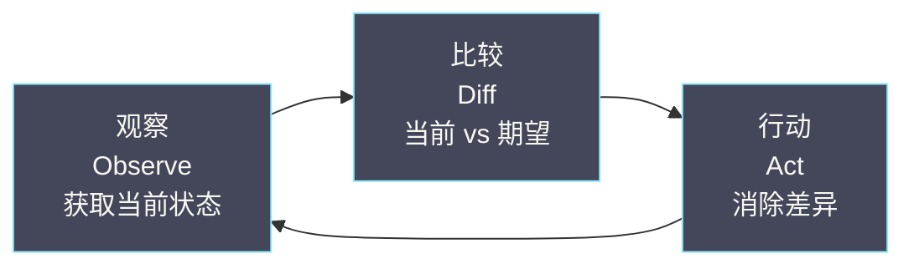
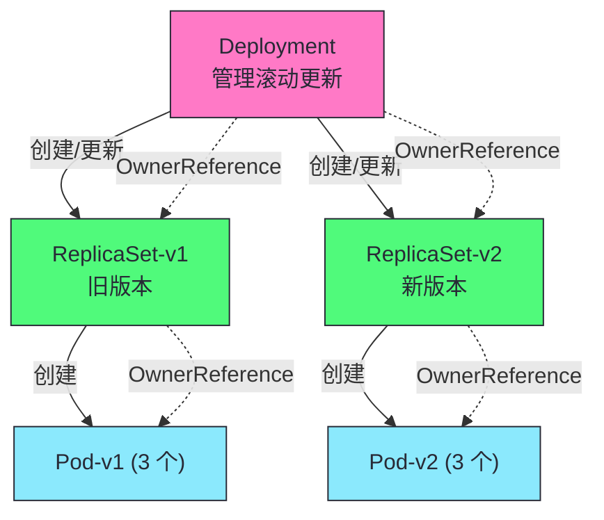
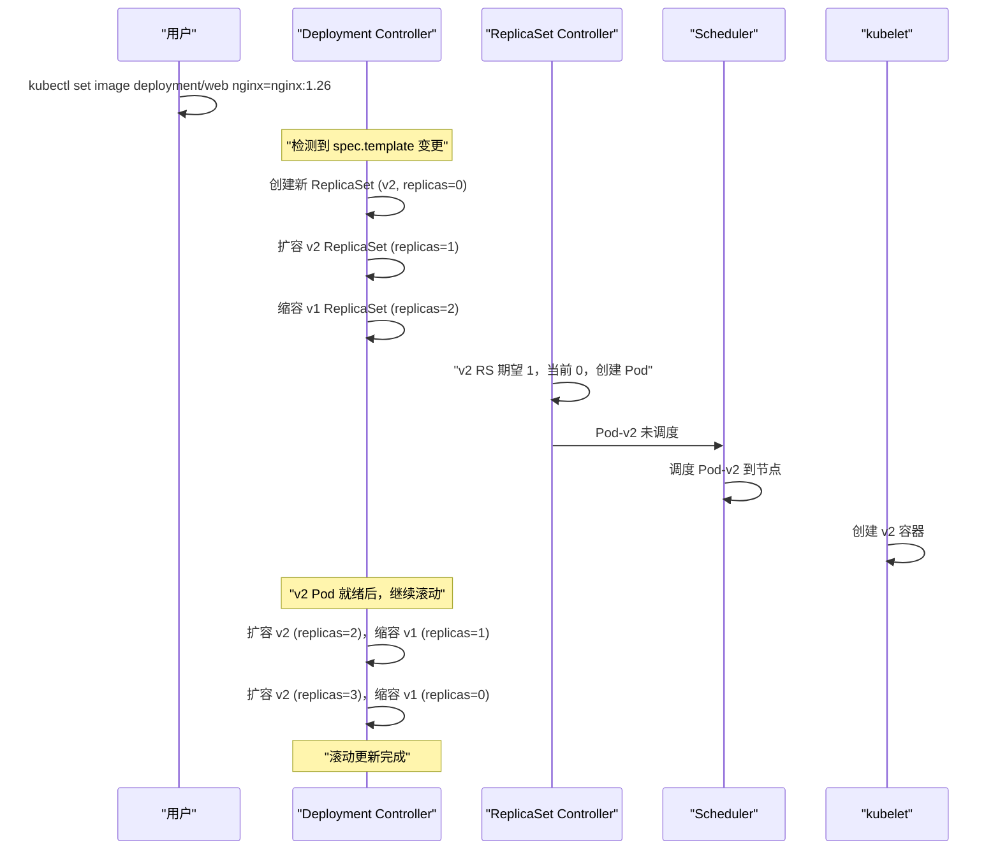
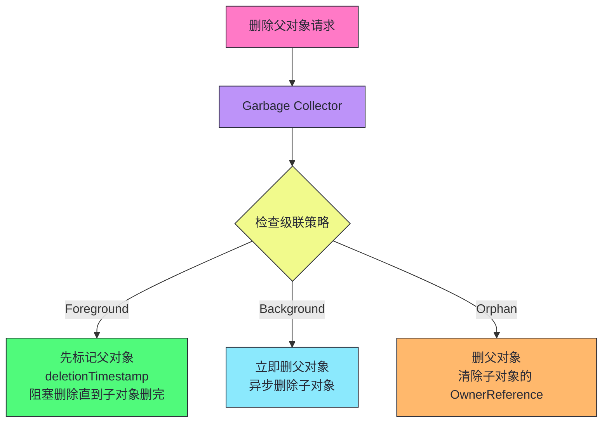
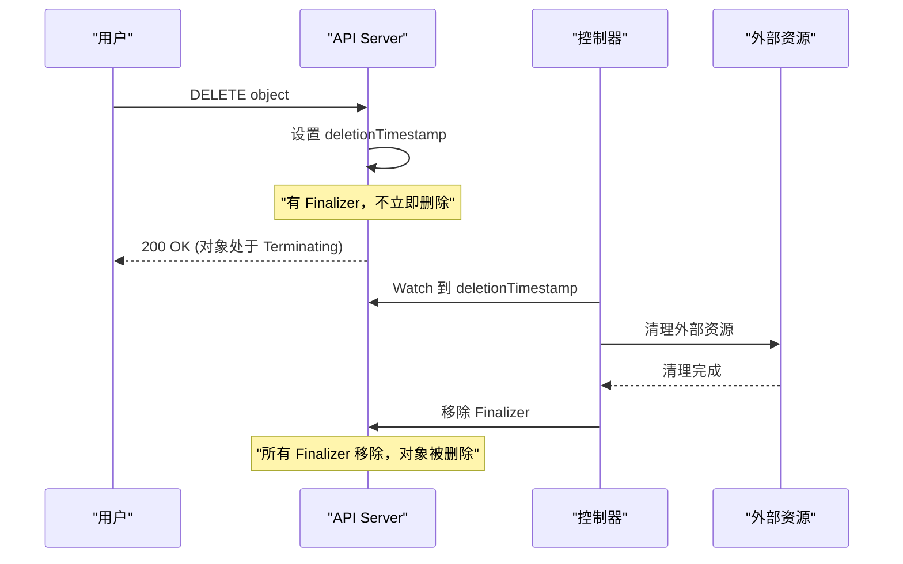
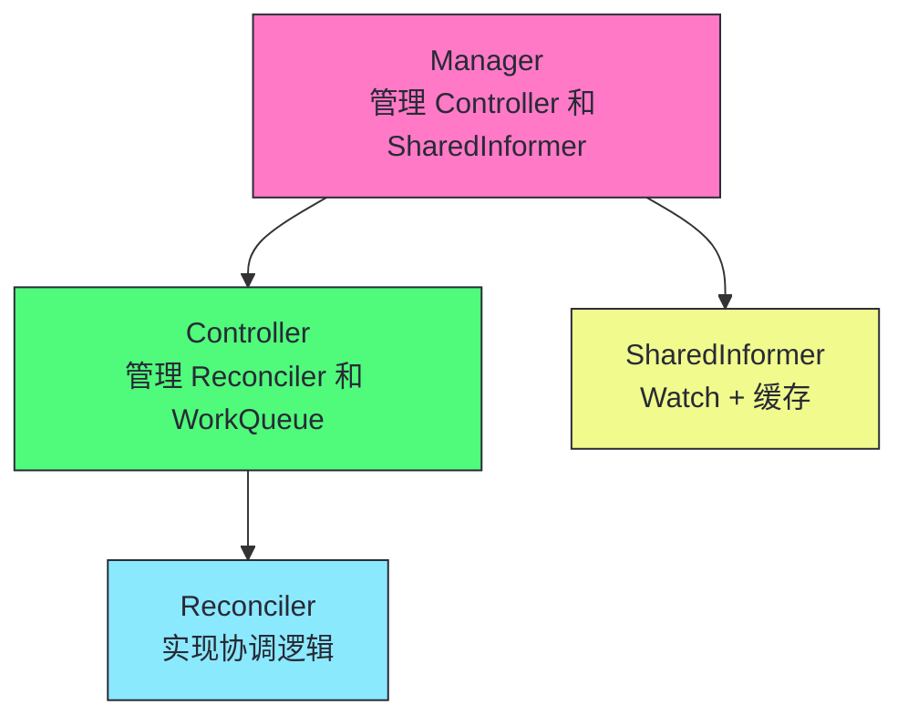
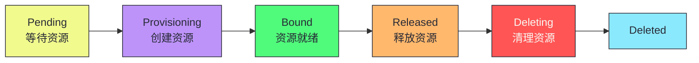

# 09 控制器模式与协调循环：从 Deployment 到 Operator

> [!abstract] 摘要
> 本文深入 Kubernetes 控制器的通用模式——协调循环（Reconcile Loop）。控制器是 K8s 的"自动驾驶员"——它们持续协调实际状态向期望状态收敛。文章从控制器的通用模式出发——观察（Observe）、比较（Diff）、行动（Act）三步循环，以及为什么这个循环必须幂等、无状态、基于当前状态。然后以 Deployment → ReplicaSet → Pod 的级联控制为例，详解三层控制器的协作——Deployment Controller 管理 ReplicaSet 的滚动更新，ReplicaSet Controller 维护 Pod 副本数，每个控制器独立协调但通过 OwnerReference 串联。讲透级联删除的两种模式——Foreground（先删子对象再删父对象）和 Background（先删父对象再异步删子对象），以及 Garbage Collector 的工作机制。之后深入控制器的高级模式——Finalizer（删除前的清理钩子）、OwnerReference 与垃圾回收、状态机式协调。然后讨论 controller-runtime 框架——编写自定义控制器的标准工具，Manager、Controller、Reconciler 的关系。最后以一个完整的 Operator 示例结束——从 CRD 定义到控制器实现到生产部署。核心认知：所有 K8s 控制器无论多么复杂，核心逻辑都是"读 spec，比较 status，采取行动让 status 向 spec 收敛"——理解这个模式，就能理解和编写任何控制器。

---

## 第 1 章 控制器的通用模式

### 1.1 观察-比较-行动

每个 K8s 控制器的核心都是一个持续运行的循环：



| 步骤 | 操作 | 数据来源 |
|------|------|---------|
| **观察** | 获取资源的当前状态 | Informer 本地缓存 |
| **比较** | 计算当前状态与期望状态的差异 | spec vs status |
| **行动** | 执行操作消除差异 | 创建/更新/删除对象 |

### 1.2 三大铁律

> [!warning] 生产避坑：协调循环的三大铁律
> 1. **幂等性**：Reconcile 多次执行效果与一次一致。WorkQueue 可能重试，Resync 可能重复触发。
> 2. **无状态性**：Reconcile 不依赖"上一次做了什么"——每次从缓存读最新状态。Level-triggered 原则。
> 3. **基于当前状态而非事件**：Reconcile 的输入是对象 key，不是"发生了什么事件"。EventHandler 转换事件为 key。

### 1.3 空调恒温器：控制器的完美类比

**空调恒温器**是一个完美的控制器：

| 恒温器 | K8s 控制器 |
|--------|----------|
| 期望温度 25°C | spec.replicas = 3 |
| 室内温度传感器 | status.readyReplicas |
| 温度差 > 0 启动制冷 | replicas 差 > 0 创建 Pod |
| 持续循环到温度达标 | 持续循环到 status = spec |
| 不记住"5 分钟前开始制冷" | 不依赖"上一次做了什么" |

> [!info] 核心概念：控制器的无状态性是自愈能力的基础
> 控制器的协调循环是无状态的——每次循环都基于当前状态做决策，不依赖"上一次做了什么"。这使得控制器在面对自身故障时极其健壮——控制器崩溃重启后，重新从当前状态开始协调，不需要恢复之前的执行进度。如果协调过程中某一步失败了，下一次循环会重新尝试。这是 K8s 自愈能力的工程基础。

---

## 第 2 章 Deployment → ReplicaSet → Pod 的级联控制

### 2.1 三层控制器架构



### 2.2 每层控制器的职责

| 控制器 | 职责 | 协调逻辑 |
|--------|------|---------|
| **Deployment Controller** | 管理滚动更新 | 比较 spec.template 与 ReplicaSet 的 template，创建新 ReplicaSet |
| **ReplicaSet Controller** | 维护 Pod 副本数 | 比较 spec.replicas 与实际 Pod 数，创建/删除 Pod |
| **kubelet**（非控制器） | 运行容器 | Watch 分配给自己的 Pod，通过 CRI 创建容器 |

### 2.3 滚动更新的完整流程



### 2.4 滚动更新的参数

```yaml
apiVersion: apps/v1
kind: Deployment
spec:
  strategy:
    type: RollingUpdate
    rollingUpdate:
      maxUnavailable: 25%      # 滚动时最多 25% 不可用
      maxSurge: 25%            # 滚动时最多超出期望 25%
  minReadySeconds: 30          # Pod 就绪后等 30 秒才认为可用
  progressDeadlineSeconds: 600 # 600 秒没进展标记为失败
```

| 参数 | 作用 | 影响 |
|------|------|------|
| **maxUnavailable** | 滚动时允许多少 Pod 不可用 | 值大更新快但可用性降低 |
| **maxSurge** | 滚动时允许超出期望多少 Pod | 值大更新快但资源消耗多 |
| **minReadySeconds** | Pod 就绪后等多久才算可用 | 防止刚就绪就挂的 Pod 被认为可用 |
| **progressDeadlineSeconds** | 多久没进展标记失败 | 超时后 Deployment 状态变为 Failed |

> [!info] 核心概念：滚动更新是两个 ReplicaSet 的扩缩容交替
> Deployment 的滚动更新不是"修改 Pod 镜像"——而是创建新 ReplicaSet（新镜像），逐步扩容新 RS 同时缩容旧 RS。这使得回滚简单——只需将旧 RS 重新扩容、新 RS 缩容。每个 ReplicaSet 对应一个版本的 Pod 模板，Deployment 通过管理多个 ReplicaSet 实现版本切换。理解这个"两层控制"很重要——Deployment 不管 Pod，它管 ReplicaSet；ReplicaSet 才管 Pod。

---

## 第 3 章 OwnerReference 与级联删除

### 3.1 OwnerReference：对象间的父子关系

每个子对象通过 `metadata.ownerReferences` 声明其父对象：

```yaml
# ReplicaSet 的 OwnerReference 指向 Deployment
metadata:
  ownerReferences:
    - apiVersion: apps/v1
      kind: Deployment
      name: web
      uid: "deploy-uid-123"
      controller: true        # 是否为直接控制器
      blockOwnerDeletion: true # 是否阻止 Owner 删除直到此对象被删除
```

### 3.2 级联删除的两种模式

| 模式 | 行为 | propagationPolicy |
|------|------|------------------|
| **Foreground** | 先删子对象，子对象都删完后再删父对象 | Foreground |
| **Background** | 立即删父对象，异步删子对象 | Background |
| **Orphan** | 删父对象，保留子对象（成为孤儿） | Orphan |

```bash
# Foreground 级联删除
kubectl delete deployment web --cascade=foreground

# Background 级联删除（默认）
kubectl delete deployment web --cascade=background

# Orphan（保留子对象）
kubectl delete deployment web --cascade=orphan
```

### 3.3 Garbage Collector 的工作机制



> [!warning] 生产避坑：Foreground 删除会阻塞直到子对象全部删除
> Foreground 级联删除会阻塞父对象的删除——直到所有子对象被删除完毕。如果子对象有 Finalizer（如 PVC 等待 Pod 删除），父对象会一直处于 "Terminating" 状态。对于有大量子对象的父对象（如一个 Deployment 有 1000 个 Pod），Foreground 删除可能耗时很长。大多数场景用默认的 Background 删除——立即删父对象，异步删子对象，不阻塞。

---

## 第 4 章 Finalizer：删除前的清理钩子

### 4.1 什么是 Finalizer

**Finalizer** 是 `metadata.finalizers` 中的字符串列表——存在 Finalizer 的对象不会被立即删除，直到所有 Finalizer 被移除。

```yaml
metadata:
  finalizers:
    - kubernetes.io/pv-protection    # PVC 的 Finalizer
    - example.com/my-cleanup         # 自定义 Finalizer
```

### 4.2 Finalizer 的工作流程



### 4.3 自定义 Finalizer 的实现

```go
// 伪代码：自定义控制器的 Finalizer 处理
const myFinalizer = "example.com/my-cleanup"

func Reconcile(ctx context.Context, req ctrl.Request) (ctrl.Result, error) {
    var obj MyResource
    if err := r.Get(ctx, req.NamespacedName, &obj); err != nil {
        return ctrl.Result{}, client.IgnoreNotFound(err)
    }
    
    // 检查是否在删除中
    if !obj.DeletionTimestamp.IsZero() {
        // 对象正在删除，执行清理
        if containsString(obj.Finalizers, myFinalizer) {
            // 清理外部资源
            if err := cleanupExternalResources(&obj); err != nil {
                return ctrl.Result{}, err  // 清理失败，重试
            }
            // 移除 Finalizer
            obj.Finalizers = removeString(obj.Finalizers, myFinalizer)
            if err := r.Update(ctx, &obj); err != nil {
                return ctrl.Result{}, err
            }
        }
        return ctrl.Result{}, nil
    }
    
    // 正常协调逻辑
    if !containsString(obj.Finalizers, myFinalizer) {
        obj.Finalizers = append(obj.Finalizers, myFinalizer)
        if err := r.Update(ctx, &obj); err != nil {
            return ctrl.Result{}, err
        }
    }
    // ... 正常协调 ...
    return ctrl.Result{}, nil
}
```

> [!info] 核心概念：Finalizer 是控制器管理外部资源的必要机制
> 如果控制器创建了 K8s 外部的资源（如云厂商的 LB、DNS 记录、外部数据库），对象被删除时这些外部资源不会自动清理——导致资源泄露。Finalizer 确保控制器在对象删除前有机会清理外部资源。创建对象时添加 Finalizer，删除时执行清理然后移除 Finalizer。这是管理外部资源的控制器的必备模式——没有 Finalizer，删除对象会泄露外部资源。

---

## 第 5 章 controller-runtime：编写控制器的标准框架

### 5.1 三层架构



| 组件 | 职责 |
|------|------|
| **Manager** | 管理 Controller 和 SharedInformerFactory |
| **Controller** | 管理 Reconciler 和 WorkQueue |
| **Reconciler** | 实现协调逻辑（用户编写） |

### 5.2 标准控制器代码结构

```go
func main() {
    // 1. 创建 Manager
    mgr, _ := ctrl.NewManager(ctrl.GetConfigOrDie(), ctrl.Options{
        Scheme:             scheme,
        MetricsBindAddress: ":8080",
        SyncPeriod:         &[]time.Duration{10 * time.Minute}[0],
    })
    
    // 2. 注册 Reconciler
    ctrl.NewControllerManagedBy(mgr).
        For(&appsv1.Deployment{}).           // 主资源
        Owns(&appsv1.ReplicaSet{}).           // 子资源（自动 Watch + 事件转发）
        WithOptions(controller.Options{
            MaxConcurrentReconciles: 5,       // 并发协调数
        }).
        Complete(&DeploymentReconciler{
            Client: mgr.GetClient(),
            Scheme: mgr.GetScheme(),
        })
    
    // 3. 启动 Manager
    mgr.Start(ctrl.SetupSignalHandler())
}

// Reconciler 实现
type DeploymentReconciler struct {
    client.Client
    Scheme *runtime.Scheme
}

func (r *DeploymentReconciler) Reconcile(ctx context.Context, req ctrl.Request) (ctrl.Result, error) {
    // 1. 读取对象
    var deploy appsv1.Deployment
    if err := r.Get(ctx, req.NamespacedName, &deploy); err != nil {
        return ctrl.Result{}, client.IgnoreNotFound(err)
    }
    
    // 2. 检查删除
    if !deploy.DeletionTimestamp.IsZero() {
        return r.handleDeletion(ctx, &deploy)
    }
    
    // 3. 正常协调
    // ... 比较 spec 和 status，采取行动 ...
    
    return ctrl.Result{}, nil
}
```

### 5.3 Owns 的妙用

```go
ctrl.NewControllerManagedBy(mgr).
    For(&appsv1.Deployment{}).
    Owns(&appsv1.ReplicaSet{})
```

`Owns(&appsv1.ReplicaSet{})` 自动：
1. Watch ReplicaSet 的变更
2. ReplicaSet 变化时，通过 OwnerReference 找到所属的 Deployment
3. 将 Deployment 的 key 放入 WorkQueue

> [!info] 核心概念：Owns 实现了子资源到父资源的事件转发
> 当 ReplicaSet 变化时（如 Pod 数量变化），Deployment Controller 需要知道——因为 Deployment 的 status 取决于 ReplicaSet 的状态。`Owns` 自动建立这个事件转发——ReplicaSet 变化触发所属 Deployment 的 Reconcile。无需手动 Watch ReplicaSet 并查找 OwnerReference。这是 controller-runtime 简化控制器开发的典型设计。

---

## 第 6 章 状态机式协调

### 6.1 复杂控制器的状态机模式

某些控制器的协调逻辑复杂——不是简单的"比较 spec 和 status"，而是有多个状态阶段：



### 6.2 状态机的协调逻辑

```go
func Reconcile(ctx context.Context, req ctrl.Request) (ctrl.Result, error) {
    var obj MyResource
    r.Get(ctx, req.NamespacedName, &obj)
    
    switch obj.Status.Phase {
    case "":
        // 初始状态，转为 Pending
        obj.Status.Phase = "Pending"
        r.Status().Update(ctx, &obj)
        
    case "Pending":
        // 检查资源是否可用
        if resourceAvailable() {
            obj.Status.Phase = "Provisioning"
            r.Status().Update(ctx, &obj)
        }
        
    case "Provisioning":
        // 创建资源
        if err := createResource(&obj); err != nil {
            return ctrl.Result{}, err  // 失败重试
        }
        obj.Status.Phase = "Bound"
        r.Status().Update(ctx, &obj)
        
    case "Bound":
        // 检查资源是否仍健康
        if !resourceHealthy(&obj) {
            obj.Status.Phase = "Released"
            r.Status().Update(ctx, &obj)
        }
    }
    
    return ctrl.Result{}, nil
}
```

> [!note] 设计哲学：状态机模式处理多阶段协调
> 简单控制器的协调是"比较 spec 和 status，一次行动"——但复杂控制器（如 PV 控制器、StatefulSet 控制器）有多个阶段——Pending → Provisioning → Bound → Released。状态机模式将每个阶段作为 Reconcile 的一个分支——每次 Reconcile 根据当前 phase 决定下一步。这种模式保持了 Level-triggered 原则——每次 Reconcile 基于 phase（当前状态）做决策，不依赖"上一次做了什么"。

---

## 第 7 章 编写 Operator 的完整示例

### 7.1 CRD 定义

```yaml
apiVersion: apiextensions.k8s.io/v1
kind: CustomResourceDefinition
metadata:
  name: databases.example.com
spec:
  group: example.com
  names:
    kind: Database
    plural: databases
    singular: database
  scope: Namespaced
  versions:
    - name: v1
      served: true
      storage: true
      schema:
        openAPIV3Schema:
          type: object
          properties:
            spec:
              type: object
              properties:
                engine:
                  type: string
                  enum: [mysql, postgresql]
                version:
                  type: string
                replicas:
                  type: integer
                  minimum: 1
                  maximum: 5
            status:
              type: object
              properties:
                phase:
                  type: string
                ready:
                  type: boolean
```

### 7.2 Controller 实现

```go
type DatabaseReconciler struct {
    client.Client
    Scheme *runtime.Scheme
}

const databaseFinalizer = "example.com/database-cleanup"

func (r *DatabaseReconciler) Reconcile(ctx context.Context, req ctrl.Request) (ctrl.Result, error) {
    var db examplev1.Database
    if err := r.Get(ctx, req.NamespacedName, &db); err != nil {
        return ctrl.Result{}, client.IgnoreNotFound(err)
    }
    
    // 处理删除
    if !db.DeletionTimestamp.IsZero() {
        if controllerutil.ContainsFinalizer(&db, databaseFinalizer) {
            if err := r.deleteExternalDatabase(&db); err != nil {
                return ctrl.Result{}, err
            }
            controllerutil.RemoveFinalizer(&db, databaseFinalizer)
            if err := r.Update(ctx, &db); err != nil {
                return ctrl.Result{}, err
            }
        }
        return ctrl.Result{}, nil
    }
    
    // 添加 Finalizer
    if !controllerutil.ContainsFinalizer(&db, databaseFinalizer) {
        controllerutil.AddFinalizer(&db, databaseFinalizer)
        if err := r.Update(ctx, &db); err != nil {
            return ctrl.Result{}, err
        }
        return ctrl.Result{Requeue: true}, nil
    }
    
    // 正常协调：根据 spec 创建 StatefulSet/Service
    if err := r.ensureStatefulSet(ctx, &db); err != nil {
        return ctrl.Result{}, err
    }
    if err := r.ensureService(ctx, &db); err != nil {
        return ctrl.Result{}, err
    }
    
    // 更新 status
    db.Status.Phase = "Running"
    db.Status.Ready = true
    db.Status.ObservedGeneration = db.Generation
    if err := r.Status().Update(ctx, &db); err != nil {
        return ctrl.Result{}, err
    }
    
    return ctrl.Result{}, nil
}
```

> [!info] 核心概念：Operator 是控制器的特化——管理特定应用的生命周期
> Operator 本质上是"管理特定应用的控制器"——它用 CRD 定义应用的期望状态（如 Database 的 engine/version/replicas），用控制器实现应用的生命周期管理（创建 StatefulSet/Service、处理升级、备份恢复）。Operator 模式将应用的运维知识编码到控制器中——自动化了人类运维专家的手动操作。我们将在第 12 篇深入 CRD 和 Operator 的完整开发流程。

---

## 总结

控制器模式与协调循环的核心知识可以归纳为以下主线：

1. **控制器是观察-比较-行动的持续循环**。观察当前状态，比较与期望状态的差异，行动消除差异。无状态的协调循环，基于当前状态做决策。

2. **三大铁律：幂等、无状态、基于当前状态**。Reconcile 多次执行效果一致；不依赖"上一次做了什么"；基于当前状态而非事件历史。

3. **Deployment → ReplicaSet → Pod 是级联控制**。Deployment Controller 管理滚动更新（创建新 ReplicaSet），ReplicaSet Controller 维护 Pod 副本数，kubelet 运行容器。每层独立协调，通过 OwnerReference 串联。

4. **滚动更新是两个 ReplicaSet 的扩缩容交替**。不是"修改 Pod 镜像"，而是创建新 RS 逐步扩容、旧 RS 逐步缩容。回滚简单——重新扩容旧 RS。

5. **OwnerReference 声明对象间的父子关系**。Garbage Collector 基于 OwnerReference 实现级联删除。uid（而非 name）判断 OwnerReference 有效性。

6. **级联删除三种模式**。Foreground（先删子后删父，阻塞）、Background（先删父异步删子，默认）、Orphan（保留子对象）。

7. **Finalizer 是删除前的清理钩子**。有 Finalizer 的对象不立即删除，直到 Finalizer 被移除。管理外部资源的控制器必须用 Finalizer 防止资源泄露。

8. **controller-runtime 是编写控制器的标准框架**。Manager 管理 Controller 和 SharedInformer，Controller 管理 Reconciler 和 WorkQueue，Reconciler 实现协调逻辑。

9. **Owns 实现子资源到父资源的事件转发**。子资源变化自动触发所属父资源的 Reconcile，无需手动 Watch 和查找 OwnerReference。

10. **状态机模式处理多阶段协调**。复杂控制器用 phase 字段表示当前阶段，每次 Reconcile 根据 phase 决定下一步。保持 Level-triggered 原则。

11. **Operator 是管理特定应用的控制器**。用 CRD 定义应用期望状态，用控制器实现生命周期管理。将运维知识编码到控制器中。

12. **所有控制器无论多复杂，核心都是"读 spec，比较 status，采取行动"**。理解这个模式，就能理解和编写任何控制器。

> [!info] 专栏导航
> 本文是 [[00 专栏导览|Kubernetes 架构深度剖析专栏]] 的第 09 篇，深入控制器模式和协调循环。下一篇 [[10 StatefulSet 深度解析：有序部署与持久化身份]] 将详细讨论 StatefulSet 的设计——有序部署、稳定网络身份、PV 绑定，以及与 Deployment 的差异。

---

## 延伸思考

1. **你的控制器是否遵循三大铁律？** 检查 Reconcile——是否幂等？是否无状态？是否基于当前状态？违反任何一个都会在生产中出 bug。

2. **你的控制器是否处理了删除？** 如果控制器创建了外部资源，必须用 Finalizer 在删除前清理。没有 Finalizer 会泄露外部资源。

3. **你的滚动更新参数是否合理？** 检查 maxUnavailable 和 maxSurge。值大更新快但可用性降低、资源消耗多。根据 SLA 要求调整。

4. **你的控制器是否用了 Owns？** 如果控制器管理子资源，用 `Owns` 自动转发子资源事件到父资源 Reconcile，比手动 Watch 简单。

5. **你的控制器是否设置了 MaxConcurrentReconciles？** 默认 1（串行）。大集群中调高可以提升吞吐量，但注意 API Server 压力。

6. **你的控制器是否更新了 observedGeneration？** Reconcile 完成后设 observedGeneration = generation，否则 kubectl 一直显示 "Progressing"。

7. **你的控制器是否处理了冲突重试？** 更新对象时用 `retry.RetryOnConflict`，而非自己实现重试循环。

8. **你的 Operator 是否将运维知识编码到了控制器中？** Operator 的价值在于自动化运维专家的手动操作——备份、恢复、升级、扩缩容。如果你的 Operator 只是创建 StatefulSet/Service，它还没体现 Operator 的真正价值。

---

## 参考资料

1. Kubernetes Controller Patterns：https://github.com/kubernetes/community/blob/master/contributors/devel/sig-architecture/controller_patterns.md
2. controller-runtime：https://pkg.go.dev/sigs.k8s.io/controller-runtime
3. Kubernetes Garbage Collection：https://kubernetes.io/docs/concepts/architecture/garbage-collection/
4. Finalizers 文档：https://kubernetes.io/docs/concepts/overview/working-with-objects/finalizers/
5. Operator Pattern：https://kubernetes.io/docs/concepts/extend-kubernetes/operator/
6. K8s 控制器源码：https://github.com/kubernetes/kubernetes/tree/master/pkg/controller

---

> [!note] 思考题
> 1. Deployment 的滚动更新是"创建新 ReplicaSet 逐步扩容、旧 ReplicaSet 逐步缩容"。如果滚动过程中新版本的 Pod 一直不就绪（如镜像有 bug），Deployment 会一直等待吗？progressDeadlineSeconds 如何介入？超时后 Deployment 的状态是什么？
> 2. Finalizer 确保控制器在删除前清理外部资源。如果控制器的 Pod 崩溃了（无法执行清理），有 Finalizer 的对象会一直处于 Terminating 状态吗？如何恢复？
> 3. controller-runtime 的 Owns 自动转发子资源事件到父资源 Reconcile。如果一个父对象有 1000 个子对象，1000 个子对象同时变化，会触发 1000 次 Reconcile 吗？WorkQueue 的去重如何减少协调次数？
