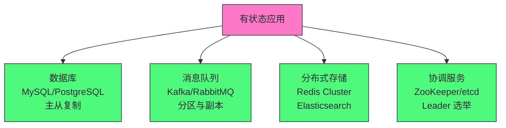
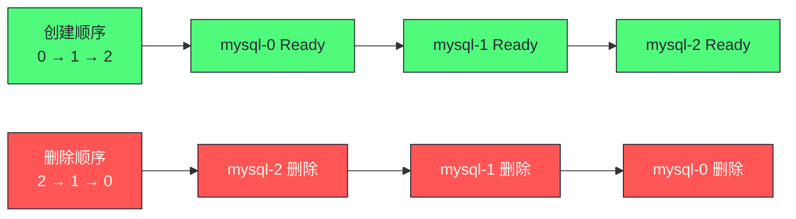
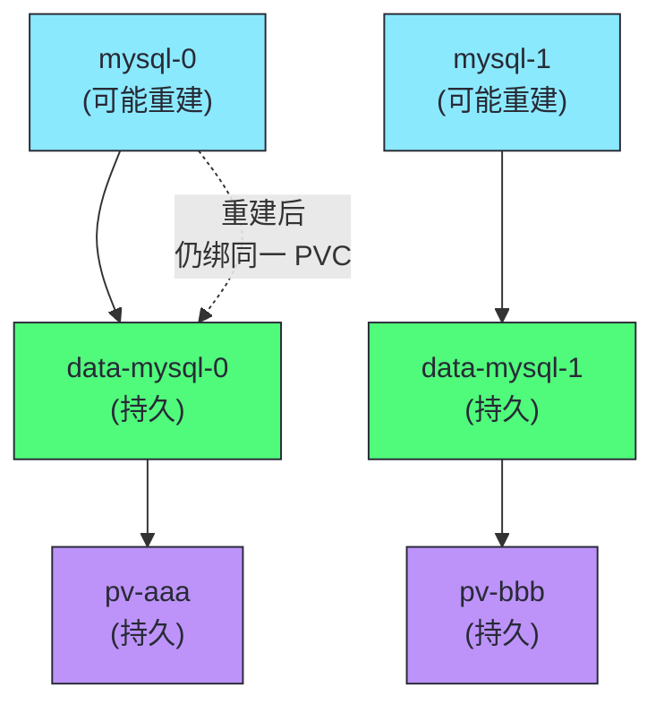

# 10 StatefulSet 深度解析：有序部署与持久化身份

> [!abstract] 摘要
> 本文深入 Kubernetes StatefulSet 的设计与实现。StatefulSet 是为"有状态应用"设计的工作负载控制器——与 Deployment 的"无状态"假设不同，StatefulSet 保证 Pod 的稳定网络身份、有序部署/删除、持久化存储绑定。文章首先讲透 StatefulSet vs Deployment 的核心差异——为什么有状态应用不能用 Deployment（Pod 名随机、无序、存储不绑定）。然后深入 StatefulSet 的三大保证：稳定网络身份（Pod 名为 `<sts-name>-<ordinal>`，DNS 名稳定）、有序部署（从 0 到 N 依次创建，前一个 Ready 才创建下一个）、持久化存储绑定（每个 Pod 绑定自己的 PVC，Pod 重建后 PVC 不变）。讲透 Headless Service 的作用——为什么 StatefulSet 必须配合 Headless Service（返回 Pod IP 而非负载均衡）。之后讨论 StatefulSet 的滚动更新策略——RollingUpdate（有序逆序更新）和 OnDelete（手动删除触发更新），以及 partition 参数的灰度更新。然后分析 StatefulSet 的典型应用场景——数据库（MySQL/PostgreSQL）、消息队列（Kafka/RabbitMQ）、分布式存储（Redis Cluster/Elasticsearch）。最后讨论 StatefulSet 的运维实践——Pod 手动删除与 PVC 保留、节点故障时的 Pod 驱逐、扩缩容的有序性。核心认知：StatefulSet 不是"更复杂的 Deployment"——它是有状态应用的编排工具，通过稳定身份和有序操作保证有状态应用的一致性。

---

## 第 1 章 为什么需要 StatefulSet

### 1.1 Deployment 的局限

Deployment 假设 Pod 是"无状态"的——任何 Pod 可以替换任何 Pod，客户端不关心连的是哪个 Pod。但有状态应用不满足这个假设：

| 有状态应用的需求 | Deployment 的表现 | 问题 |
|----------------|-----------------|------|
| **稳定网络身份** | Pod 名随机（web-abc123） | 客户端无法通过名找到特定 Pod |
| **有序启动** | Pod 并发创建 | 集群需要先选主再选从 |
| **持久化存储绑定** | Pod 重建后可能用不同 PV | 数据"飘移"到不同节点 |
| **稳定 DNS** | Service 负载均衡到随机 Pod | 无法定位特定 Pod |

### 1.2 典型有状态应用场景



| 场景 | 为什么需要 StatefulSet |
|------|---------------------|
| **数据库主从** | 从节点需要知道主节点地址（稳定 DNS），主节点先启动 |
| **Kafka 分区** | 分区 leader 固定在特定 broker，broker 需要稳定身份 |
| **Redis Cluster** | 节点间通过稳定地址通信，slot 分配绑定节点 |
| **ZooKeeper** | leader/follower 角色通过稳定身份选举 |

> [!info] 核心概念：StatefulSet 不是"更复杂的 Deployment"
> StatefulSet 不是 Deployment 的"升级版"——它是有状态应用的编排工具，设计目标和 Deployment 完全不同。Deployment 追求"无状态、可替换、并发"，StatefulSet 追求"有身份、有序、持久"。用 StatefulSet 跑无状态应用是过度设计——增加复杂度但无收益。用 Deployment 跑有状态应用是错误——无法保证有状态应用的一致性需求。选择基于应用是否有状态，而非"哪个更高级"。

---

## 第 2 章 StatefulSet 的三大保证

### 2.1 保证一：稳定网络身份

StatefulSet 的 Pod 名遵循固定模式：`<statefulset-name>-<ordinal>`

```yaml
apiVersion: apps/v1
kind: StatefulSet
metadata:
  name: mysql
spec:
  serviceName: mysql-headless  # 必须指定 Headless Service
  replicas: 3
  # ...
```

创建的 Pod 名为：`mysql-0`、`mysql-1`、`mysql-2`（有序，可预测）。

DNS 解析：

| DNS 名 | 解析为 |
|--------|--------|
| `mysql-0.mysql-headless.default.svc.cluster.local` | mysql-0 的 Pod IP |
| `mysql-1.mysql-headless.default.svc.cluster.local` | mysql-1 的 Pod IP |
| `mysql-headless.default.svc.cluster.local` | 随机一个 Pod IP |

### 2.2 Headless Service：为什么不用普通 Service

```yaml
apiVersion: v1
kind: Service
metadata:
  name: mysql-headless
spec:
  clusterIP: None  # Headless：没有 ClusterIP
  selector:
    app: mysql
  ports:
    - port: 3306
```

| 维度 | 普通 Service | Headless Service |
|------|------------|-----------------|
| **ClusterIP** | 有（虚拟 IP） | None（无虚拟 IP） |
| **DNS 解析** | 返回 ClusterIP | 返回所有 Pod IP |
| **负载均衡** | kube-proxy 规则 | 客户端自行选择 |
| **用途** | 无状态应用负载均衡 | 有状态应用定位特定 Pod |

> [!info] 核心概念：Headless Service 让客户端能定位特定 Pod
> 普通 Service 的 DNS 返回 ClusterIP——客户端不知道连的是哪个 Pod。Headless Service 的 DNS 返回所有 Pod IP——客户端可以自行选择连哪个。更关键的是，`<pod-name>.<headless-service-name>` 的 DNS 解析返回特定 Pod 的 IP——这使得"mysql-0" 的地址始终可预测。数据库从节点配置 `master-host=mysql-0.mysql-headless`，无论 mysql-0 重建到哪个节点，DNS 都能解析到它的新 IP。这是 StatefulSet 稳定网络身份的基础。

### 2.3 保证二：有序部署与删除



| 操作 | 顺序 | 等待条件 |
|------|------|---------|
| **创建** | 0 → 1 → 2 | 前一个 Pod Ready 且 Running 才创建下一个 |
| **删除** | 2 → 1 → 0 | 逆序删除 |
| **扩容** | 从当前最大序号 +1 | 有序创建 |
| **缩容** | 从当前最大序号开始 | 有序删除 |

```yaml
spec:
  podManagementPolicy: OrderedReady  # 默认：有序。或 Parallel：并行
```

> [!warning] 生产避坑：OrderedReady 在大规模时部署慢
> `OrderedReady`（默认）要求前一个 Pod Ready 才创建下一个——5 个 Pod 的 StatefulSet，如果每个 Pod 启动需 30 秒，总部署时间 150 秒。对于不需要严格有序的应用（如 Redis Cluster），用 `podManagementPolicy: Parallel` 并行创建，大幅缩短部署时间。但注意——并行模式不保证有序，有状态应用需自行处理启动顺序。

### 2.4 保证三：持久化存储绑定

```yaml
spec:
  volumeClaimTemplates:  # PVC 模板
    - metadata:
        name: data
      spec:
        accessModes: ["ReadWriteOnce"]
        resources:
          requests:
            storage: 10Gi
```

StatefulSet 为每个 Pod 创建独立的 PVC：

| Pod | PVC 名 | 绑定的 PV |
|-----|--------|----------|
| mysql-0 | data-mysql-0 | pv-aaa |
| mysql-1 | data-mysql-1 | pv-bbb |
| mysql-2 | data-mysql-2 | pv-ccc |

**关键保证**：mysql-0 重建后，仍然绑定 `data-mysql-0` PVC，而 `data-mysql-0` 仍然绑定 `pv-aaa`——数据不会"飘移"。



> [!info] 核心概念：PVC 与 Pod 解耦保证数据不飘移
> Deployment 的 Pod 重建后可能调度到不同节点，如果用共享 PV，数据可能"飘移"。StatefulSet 通过 volumeClaimTemplates 为每个 Pod 创建独立 PVC——PVC 和 PV 的绑定是持久的，Pod 重建后仍绑同一 PVC。即使 Pod 调度到不同节点，PV 的数据仍在原节点（除非用网络存储如 NFS/Ceph）。这是 StatefulSet 保证数据一致性的核心机制。

---

## 第 3 章 滚动更新策略

### 3.1 RollingUpdate：有序逆序更新

```yaml
spec:
  updateStrategy:
    type: RollingUpdate
    rollingUpdate:
      partition: 0  # 默认 0，更新所有 Pod。>0 时只更新序号 >= partition 的 Pod
```

滚动更新顺序：**从最大序号开始，逆序更新**

```
更新前：mysql-0(v1), mysql-1(v1), mysql-2(v1)
更新中：mysql-0(v1), mysql-1(v1), mysql-2(v2)  ← 先更新 mysql-2
更新中：mysql-0(v1), mysql-1(v2), mysql-2(v2)  ← 再更新 mysql-1
更新后：mysql-0(v2), mysql-1(v2), mysql-2(v2)  ← 最后更新 mysql-0
```

### 3.2 partition：灰度更新

```yaml
updateStrategy:
  rollingUpdate:
    partition: 2  # 只更新序号 >= 2 的 Pod
```

```
partition=2: 只更新 mysql-2，mysql-0/1 保持旧版本
partition=1: 更新 mysql-1/2，mysql-0 保持旧版本
partition=0: 更新所有 Pod
```

> [!info] 核心概念：partition 实现金丝雀发布
> partition 参数允许灰度更新——先更新序号最大的 Pod（如 mysql-2），验证新版本无问题后再逐步降低 partition（2→1→0），扩大更新范围。这是 StatefulSet 的金丝雀发布机制——先在小范围验证，再全量更新。对于数据库等关键有状态应用，partition 灰度是安全升级的重要工具。

### 3.3 OnDelete：手动触发更新

```yaml
updateStrategy:
  type: OnDelete  # 不自动更新，手动删除 Pod 时才更新
```

OnDelete 模式下，修改 spec.template 后不会自动更新 Pod——只有手动删除 Pod 时，重建的 Pod 才用新版本。这给了运维人员完全控制——可以选择在维护窗口手动删除 Pod 触发更新。

---

## 第 4 章 StatefulSet 的典型应用

### 4.1 数据库主从架构

```yaml
apiVersion: apps/v1
kind: StatefulSet
metadata:
  name: mysql
spec:
  serviceName: mysql-headless
  replicas: 3
  selector:
    matchLabels:
      app: mysql
  template:
    metadata:
      labels:
        app: mysql
    spec:
      containers:
        - name: mysql
          image: mysql:8.0
          env:
            - name: MYSQL_MASTER
              value: "mysql-0.mysql-headless"  # 主节点地址稳定
          volumeMounts:
            - name: data
              mountPath: /var/lib/mysql
  volumeClaimTemplates:
    - metadata:
        name: data
      spec:
        accessModes: ["ReadWriteOnce"]
        resources:
          requests:
            storage: 50Gi
---
apiVersion: v1
kind: Service
metadata:
  name: mysql-headless
spec:
  clusterIP: None
  selector:
    app: mysql
  ports:
    - port: 3306
```

| Pod | 角色 | 数据 |
|-----|------|------|
| mysql-0 | 主节点 | 独立 PVC（读写） |
| mysql-1 | 从节点 | 独立 PVC（复制主节点） |
| mysql-2 | 从节点 | 独立 PVC（复制主节点） |

### 4.2 Kafka 集群

Kafka 的 broker.id 需要稳定且唯一——StatefulSet 的序号（0,1,2）天然适合作为 broker.id。

```yaml
spec:
  template:
    spec:
      containers:
        - name: kafka
          env:
            - name: BROKER_ID
              valueFrom:
                fieldRef:
                  fieldPath: metadata.labels['controller.kubernetes.io/pod-index']
                  # K8s 1.28+ 支持 pod-index label，值为序号
```

---

## 第 5 章 StatefulSet 运维实践

### 5.1 Pod 手动删除与 PVC 保留

```bash
# 删除 Pod（PVC 保留）
kubectl delete pod mysql-2
# StatefulSet 控制器会重建 mysql-2，绑定同一 PVC
```

```bash
# 删除 StatefulSet 但保留 Pod 和 PVC
kubectl delete statefulset mysql --cascade=orphan
```

> [!warning] 生产避坑：缩容不删除 PVC
> StatefulSet 缩容时（replicas 从 3 改为 1），只删除 Pod（mysql-2, mysql-1），不删除 PVC（data-mysql-2, data-mysql-1 保留）。这是为了防止数据丢失——如果后续扩容回来，PVC 仍在，数据可恢复。但这也意味着缩容不释放存储——如果确实需要释放，手动删除 PVC：`kubectl delete pvc data-mysql-2`。删除 PVC 前确保数据已备份或不再需要。

### 5.2 节点故障时的处理

节点故障时，该节点上的 StatefulSet Pod 处于 "Unknown" 或 "Terminating" 状态。由于 PVC 绑定了该节点的 PV（如果是本地存储），Pod 无法在其他节点重建。

```bash
# 强制删除 Pod（绕过 grace period）
kubectl delete pod mysql-2 --force --grace-period=0
# Pod 在其他节点重建，但如果 PV 是本地存储，数据丢失
```

> [!info] 核心概念：节点故障时 StatefulSet 的数据安全取决于存储类型
> 如果 PV 是网络存储（NFS、Ceph、EBS），Pod 重建到其他节点后可以重新挂载同一 PV——数据安全。如果 PV 是本地存储（local PV），Pod 重建到其他节点后无法挂载原 PV——数据"卡"在故障节点。对于关键有状态应用，用网络存储（或至少有副本的存储）保证节点故障时数据可访问。

### 5.3 扩缩容的有序性

| 操作 | 行为 |
|------|------|
| **扩容** | 从当前最大序号 +1 有序创建新 Pod |
| **缩容** | 从当前最大序号开始逆序删除 Pod |
| **缩容时更新** | 先缩容到目标，再更新（或更新时缩容，取决于策略） |

### 5.4 StatefulSet 与 PodDisruptionBudget

有状态应用的自愿驱逐（如节点维护）需要特别小心——同时驱逐多个 Pod 可能导致服务不可用。

```yaml
apiVersion: policy/v1
kind: PodDisruptionBudget
metadata:
  name: mysql-pdb
spec:
  minAvailable: 2  # 至少保持 2 个 Pod 可用
  selector:
    matchLabels:
      app: mysql
```

| PDB 参数 | 说明 |
|---------|------|
| **minAvailable** | 至少保持多少 Pod 可用 |
| **maxUnavailable** | 最多允许多少 Pod 不可用 |

> [!warning] 生产避坑：有状态应用必须配置 PDB
> 没有PDB 的有状态应用在节点维护时可能被同时驱逐多个 Pod——导致服务不可用或数据不一致。配置 PDB 确保自愿驱逐时保持最小可用副本数。注意 PDB 只对自愿驱逐（kubectl drain、cluster autoscaler）有效——非自愿驱逐（节点故障）不受 PDB 限制。

---

## 总结

StatefulSet 深度解析的核心知识可以归纳为以下主线：

1. **StatefulSet 是有状态应用的编排工具**。不是"更复杂的 Deployment"——设计目标完全不同。用 StatefulSet 跑无状态应用是过度设计。

2. **三大保证：稳定网络身份、有序部署、持久化存储绑定**。Pod 名为 `<sts-name>-<ordinal>`，DNS 名稳定；有序创建/删除；每个 Pod 绑定独立 PVC。

3. **Headless Service 是 StatefulSet 的必要组件**。无 ClusterIP，DNS 返回 Pod IP。`<pod-name>.<headless-service>` 解析特定 Pod——客户端能定位特定 Pod。

4. **有序部署：OrderedReady（默认）或 Parallel**。OrderedReady 前一个 Ready 才创建下一个，适合需要严格有序的应用。Parallel 并行创建，适合不需要有序的应用。

5. **volumeClaimTemplates 为每个 Pod 创建独立 PVC**。Pod 重建后仍绑同一 PVC，数据不飘移。缩容不删除 PVC——防止数据丢失。

6. **滚动更新从最大序号逆序进行**。先更新 mysql-2，再 mysql-1，最后 mysql-0——保证主节点（通常是序号 0）最后更新。

7. **partition 实现金丝雀发布**。partition=2 只更新序号 >=2 的 Pod，验证后逐步降低 partition 扩大范围。

8. **OnDelete 模式手动触发更新**。修改 spec.template 后不自动更新，手动删除 Pod 时才更新。给运维完全控制。

9. **典型应用：数据库主从、Kafka、Redis Cluster、ZooKeeper**。这些应用需要稳定身份、有序启动、持久化存储。

10. **节点故障时数据安全取决于存储类型**。网络存储（NFS/Ceph/EBS）Pod 重建后可重新挂载——数据安全。本地存储 Pod 重建后无法挂载——数据卡在故障节点。

11. **缩容不删除 PVC**。防止数据丢失。如需释放存储，手动删除 PVC。删除前确保数据已备份。

12. **broker.id 等需要稳定唯一 ID 的场景用序号**。K8s 1.28+ 的 pod-index label 提供序号，适合作为 broker.id/node.id。

13. **有状态应用必须配置 PDB**。PodDisruptionBudget 确保自愿驱逐时保持最小可用副本数。没有 PDB 的有状态应用在节点维护时可能被同时驱逐多个 Pod。

14. **StatefulSet 的 serviceName 必须指向 Headless Service**。这是 StatefulSet 的强制要求——Headless Service 提供 Pod 级 DNS 解析，是稳定网络身份的基础。

> [!info] 专栏导航
> 本文是 [[00 专栏导览|Kubernetes 架构深度剖析专栏]] 的第 10 篇，深入 StatefulSet 的设计。下一篇 [[11 Scheduler 调度算法：预选、优选与扩展机制]] 将详细讨论 K8s 调度器的两阶段流程——Filter/Score、节点亲和性/反亲和性、Taint/Toleration，以及调度扩展机制。

---

## 延伸思考

1. **你的有状态应用是否用了 StatefulSet？** 如果用 Deployment 跑数据库，Pod 名随机、无序、存储不绑定——数据一致性风险。评估迁移到 StatefulSet。

2. **你的 StatefulSet 是否用了 Headless Service？** StatefulSet 必须指定 serviceName 指向 Headless Service。普通 Service 无法提供 Pod 级 DNS 解析。

3. **你的 StatefulSet 存储是否是网络存储？** 如果用 local PV，节点故障时数据卡在故障节点。关键应用用网络存储（EBS/Ceph/NFS）保证节点故障后数据可访问。

4. **你的 StatefulSet 滚动更新是否用了 partition 灰度？** 对于关键有状态应用，partition 灰度是安全升级的工具。先更新一个 Pod 验证，再扩大范围。

5. **你的 StatefulSet 缩容是否误删了 PVC？** 缩容只删 Pod 不删 PVC——这是保护数据。如果需要释放存储，确认数据已备份后再手动删 PVC。

6. **你的 StatefulSet 是否需要 Parallel 部署？** 如果应用不需要严格有序启动（如 Redis Cluster），用 `podManagementPolicy: Parallel` 大幅缩短部署时间。

7. **你的数据库主节点地址是否通过 Headless Service 解析？** 从节点应配置 `master-host=mysql-0.mysql-headless`，而非具体 IP。mysql-0 重建后 IP 变但 DNS 名不变。

8. **你的 StatefulSet 是否设置了 podManagementPolicy？** 默认 OrderedReady 适合需要严格有序的应用。不需要有序的应用用 Parallel 提升部署速度。

9. **你的有状态应用是否配置了 PDB？** 没有PDB 的有状态应用在节点维护时可能被同时驱逐多个 Pod。配置 minAvailable 确保最小可用副本数。

10. **你的 StatefulSet 是否正确设置了 serviceName？** serviceName 必须指向 Headless Service——这是 StatefulSet 的强制要求。普通 Service 无法提供 Pod 级 DNS 解析。

---

## 参考资料

1. StatefulSet 文档：https://kubernetes.io/docs/concepts/workloads/controllers/statefulset/
2. Headless Service：https://kubernetes.io/docs/concepts/services-networking/service/#headless-services
3. StatefulSet 基础：https://kubernetes.io/docs/tutorials/stateful-application/basic-statefulset/
4. StatefulSet 源码：https://github.com/kubernetes/kubernetes/tree/master/pkg/controller/statefulset
5. pod-index label（K8s 1.28+）：https://kubernetes.io/docs/concepts/workloads/controllers/statefulset/#pod-index-label
6. 有状态应用最佳实践：https://kubernetes.io/docs/concepts/workloads/controllers/statefulset/#deployment-and-scaling-guarantees

---

> [!note] 思考题
> 1. StatefulSet 缩容时不删除 PVC（保护数据）。但这也意味着 PVC 无限累积——如果一个 StatefulSet 频繁扩缩容，会留下大量"孤儿" PVC。如何清理这些不再使用的 PVC？是否有自动清理机制？
> 2. StatefulSet 的滚动更新从最大序号逆序进行——先更新 mysql-2，最后更新 mysql-0（主节点）。这个顺序有什么好处？如果反过来（先更新主节点），会有什么风险？
> 3. Headless Service 的 DNS 解析返回所有 Pod IP——如果客户端用 `mysql-headless.default.svc.cluster.local` 连接，它如何选择连哪个 Pod？是否需要客户端自行负载均衡？这与普通 Service 的负载均衡有何不同？
