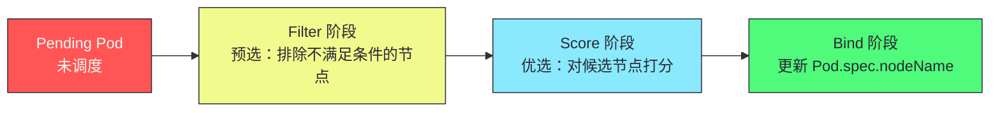
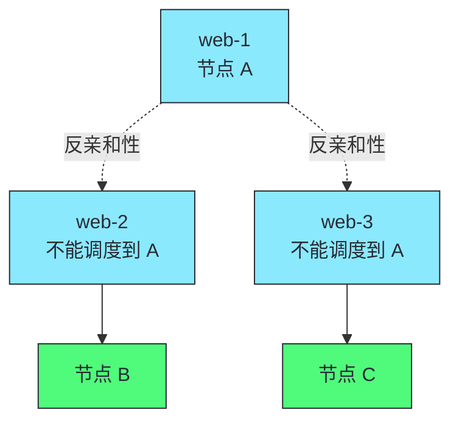
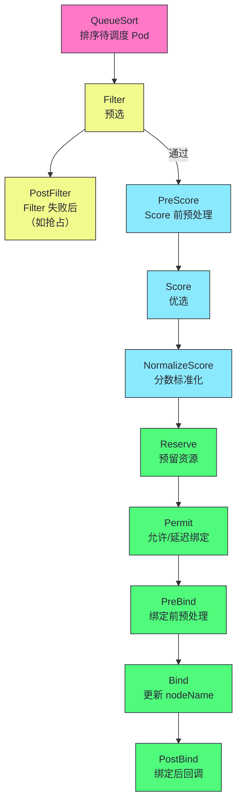
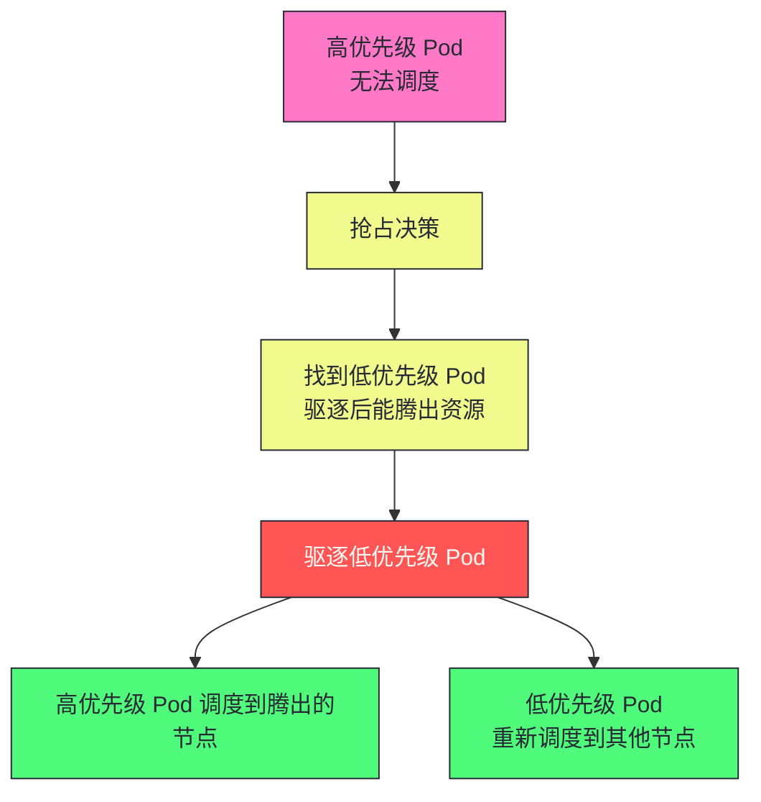
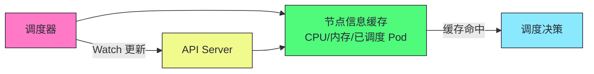

# 11 Scheduler 调度算法：预选、优选与扩展机制

> [!abstract] 摘要
> 本文深入 Kubernetes 调度器的两阶段算法和扩展机制。调度器决定 Pod 运行在哪个节点上——这是 K8s "数据中心即计算机"理念的核心实现。文章首先讲透调度的两阶段流程——Filter（预选，排除不满足条件的节点）和 Score（优选，对候选节点打分），每个阶段的内置插件和评分策略。然后深入节点亲和性（NodeAffinity）和反亲和性（PodAntiAffinity）——硬约束 vs 软约束的区分，以及为什么反亲和性对高可用至关重要。讲透 Taint 和 Toleration——节点级别的"排斥"机制，为什么 master 节点默认有 NoSchedule Taint。之后讨论调度器的扩展机制——Scheduler Framework（K8s 1.19+ 的插件化架构）和调度器扩展（Extender，外部 HTTP 服务），以及多调度器支持。然后分析调度器的性能优化——缓存节点信息避免每次调度都 List、批量调度、优先级队列。最后讨论调度失败的处理——Pending 状态、优先级与抢占、Pod 的重试机制。核心认知：调度器只做决策不做执行——它更新 Pod.spec.nodeName，kubelet 通过 Watch 自己发现被分配的 Pod，两者完全解耦。

---

## 第 1 章 调度的两阶段流程

### 1.1 Filter + Score + Bind



### 1.2 Filter 阶段：预选

Filter 阶段排除不满足 Pod 约束条件的节点。每个 Filter 插件返回 true（节点可用）或 false（节点不可用）。

| 内置 Filter 插件 | 作用 |
|-----------------|------|
| **PodFitsResources** | 节点是否有足够 CPU/内存 |
| **PodFitsHostPorts** | Pod 需要的 hostPort 是否被占用 |
| **NoVolumeZoneConflict** | PV 的 zone 与节点 zone 是否匹配 |
| **MatchNodeSelector** | 节点 Label 是否匹配 nodeSelector |
| **PodToleratesNodeTaints** | Pod 是否容忍节点的 Taint |
| **VolumeBinding** | PVC 是否能绑定到节点的 PV |

### 1.3 Score 阶段：优选

Score 阶段对 Filter 通过的节点打分（0-100），选最高分的节点。

| 内置 Score 插件 | 评分策略 |
|----------------|---------|
| **NodeResourcesFit** | 资源均衡（LeastRequested）或装箱（MostRequested） |
| **InterPodAffinity** | Pod 亲和性打分 |
| **NodeAffinity** | 节点亲和性打分 |
| **ImageLocality** | 节点是否已有镜像（避免拉取） |
| **PodTopologySpread** | 拓扑分布（跨 zone/region 分散） |

> [!info] 核心概念：Score 阶段是"软约束"打分
> Filter 是"硬约束"——不满足就排除。Score 是"软约束"——满足得高分，不满足得低分但不会被排除。例如，Pod 希望调度到有镜像的节点（ImageLocality），但如果所有节点都没有镜像，仍会选一个节点调度——只是 ImageLocality 得分低。理解硬约束 vs 软约束的区别，是设计调度策略的关键——硬约束用 nodeSelector/Taint，软约束用 Affinity 的 preferredDuringScheduling。

---

## 第 2 章 节点亲和性与反亲和性

### 2.1 NodeAffinity：节点亲和性

```yaml
spec:
  affinity:
    nodeAffinity:
      requiredDuringSchedulingIgnoredDuringExecution:  # 硬约束
        nodeSelectorTerms:
          - matchExpressions:
              - key: disktype
                operator: In
                values: ["ssd"]
      preferredDuringSchedulingIgnoredDuringExecution:  # 软约束
        - weight: 80
          preference:
            matchExpressions:
              - key: zone
                operator: In
                values: ["us-east-1a"]
```

| 类型 | 说明 | Filter/Score |
|------|------|-------------|
| **requiredDuringScheduling** | 硬约束，必须满足 | Filter |
| **preferredDuringScheduling** | 软约束，尽量满足 | Score |

### 2.2 PodAntiAffinity：Pod 反亲和性

```yaml
spec:
  affinity:
    podAntiAffinity:
      requiredDuringSchedulingIgnoredDuringExecution:  # 硬约束
        - labelSelector:
            matchLabels:
              app: web
          topologyKey: kubernetes.io/hostname  # 不同节点
```

这个配置确保：同一 Deployment 的 web Pod 不会调度到同一节点——高可用保证。



> [!warning] 生产避坑：PodAntiAffinity 的 topologyKey 选择
> `topologyKey: kubernetes.io/hostname` 确保不同节点——但节点数少于副本数时，多余 Pod 永远 Pending。对于跨 zone 高可用，用 `topologyKey: topology.kubernetes.io/zone`——确保 Pod 分散到不同 zone。但注意 topologyKey 必须是节点 Label——如果节点没有该 Label，调度行为可能不符合预期。生产环境高可用：hostname 级反亲和 + zone 级 preferred 分散。

### 2.3 PodAffinity：Pod 亲和性

```yaml
spec:
  affinity:
    podAffinity:
      preferredDuringSchedulingIgnoredDuringExecution:
        - weight: 100
          podAffinityTerm:
            labelSelector:
              matchLabels:
                app: cache
            topologyKey: kubernetes.io/hostname
```

这个配置希望：Pod 调度到有 cache Pod 的节点——减少网络延迟（就近访问缓存）。

---

## 第 3 章 Taint 与 Toleration

### 3.1 Taint：节点级别的排斥

Taint 是节点上的"标记"——排斥不容忍该 Taint 的 Pod。

```bash
# 给节点打 Taint
kubectl taint nodes node-1 dedicated=gpu:NoSchedule
```

| Taint 效果 | 说明 |
|-----------|------|
| **NoSchedule** | 不调度新 Pod（已运行的 Pod 不受影响） |
| **NoExecute** | 驱逐不容忍的已运行 Pod |
| **PreferNoSchedule** | 尽量不调度（软约束） |

### 3.2 Toleration：Pod 级别的容忍

```yaml
spec:
  tolerations:
    - key: "dedicated"
      operator: "Equal"
      value: "gpu"
      effect: "NoSchedule"
```

这个 Pod 容忍 `dedicated=gpu:NoSchedule` 的 Taint——可以调度到有该 Taint 的节点。

### 3.3 内置 Taint

K8s 自动给节点打一些 Taint：

| Taint | 触发条件 | 作用 |
|-------|---------|------|
| `node.kubernetes.io/not-ready` | 节点 NotReady | NoExecute，驱逐 Pod |
| `node.kubernetes.io/unreachable` | 节点不可达 | NoExecute，驱逐 Pod |
| `node.kubernetes.io/memory-pressure` | 内存压力 | NoSchedule |
| `node.kubernetes.io/disk-pressure` | 磁盘压力 | NoSchedule |
| `node.kubernetes.io/pid-pressure` | PID 压力 | NoSchedule |
| `node.kubernetes.io/network-unavailable` | 网络不可用 | NoSchedule |

> [!info] 核心概念：master 节点默认有 NoSchedule Taint
> K8s 的 master 节点默认有 `node-role.kubernetes.io/control-plane:NoSchedule` Taint——排斥普通 Pod。这确保普通 Pod 不会调度到 master，避免影响控制平面。如果要在 master 上运行 Pod（如网络插件），需添加 Toleration。理解 Taint/Toleration 的"排斥-容忍"模型，是管理节点资源分配的基础——GPU 节点打 `dedicated=gpu:NoSchedule`，只有 GPU Pod 容忍它。

---

## 第 4 章 Scheduler Framework：插件化架构

### 4.1 K8s 1.19+ 的调度框架

Scheduler Framework 将调度流程拆分为多个扩展点，每个扩展点可以注册插件：



| 扩展点 | 作用 | 典型插件 |
|--------|------|---------|
| **QueueSort** | 排序待调度 Pod | 优先级排序 |
| **Filter** | 排除不满足条件的节点 | 资源检查、Taint、Affinity |
| **Score** | 对候选节点打分 | 资源均衡、镜像本地性 |
| **Reserve** | 预留资源（防止并发调度冲突） | 资源预留 |
| **Permit** | 允许或延迟绑定 | 批量调度等待 |
| **Bind** | 更新 Pod.spec.nodeName | 默认 Binder |

### 4.2 自定义调度插件

```go
// 自定义 Filter 插件示例
type MyFilter struct{}

func (f *MyFilter) Filter(ctx context.Context, state *framework.CycleState, pod *v1.Pod, nodeInfo *framework.NodeInfo) *framework.Status {
    // 自定义过滤逻辑
    if !customCondition(pod, nodeInfo) {
        return framework.NewStatus(framework.Unschedulable, "custom condition not met")
    }
    return framework.NewStatus(framework.Success, "")
}

func (f *MyFilter) Name() string {
    return "MyFilter"
}

// 注册插件
func main() {
    command := app.NewSchedulerCommand(
        app.WithPlugin("MyFilter", func(...) framework.Plugin { return &MyFilter{} }),
    )
    command.Execute()
}
```

> [!info] 核心概念：Scheduler Framework 让调度器可扩展但不需 fork
> 早期 K8s 自定义调度需 fork 调度器源码或用 Extender（HTTP 外部服务）。Scheduler Framework 允许通过插件扩展调度流程——注册自定义 Filter/Score 插件，编译为自定义调度器二进制。这比 fork 源码更易维护（跟随上游更新），比 Extender 更高效（进程内调用而非 HTTP）。对于复杂调度需求（如 GPU 拓扑感知、NUMA 亲和），Scheduler Framework 是推荐方式。

---

## 第 5 章 优先级与抢占

### 5.1 优先级

```yaml
apiVersion: scheduling.k8s.io/v1
kind: PriorityClass
metadata:
  name: high-priority
value: 1000  # 优先级值，越大越高
globalDefault: false
description: "高优先级 Pod"
```

```yaml
spec:
  priorityClassName: high-priority
```

### 5.1.1 内置 PriorityClass

K8s 有两个内置的 PriorityClass：

| PriorityClass | 值 | 说明 |
|---------------|-----|------|
| **system-cluster-critical** | 2000000000 | 集群关键组件（如 Calico、CoreDNS） |
| **system-node-critical** | 2000001000 | 节点关键组件（如 kube-proxy、CNI） |

> [!info] 核心概念：system-node-critical 比 system-cluster-critical 优先级更高
> 节点关键组件（如 kube-proxy）比集群关键组件（如 CoreDNS）优先级更高——因为节点组件不运行，节点上的所有 Pod 都受影响。这个优先级层次确保了在资源紧张时，最基础的组件优先调度。自定义 PriorityClass 的值不要超过这两个内置值——1000000000 以下是用户可用的范围。

### 5.2 抢占

当高优先级 Pod 无法调度时，调度器尝试驱逐低优先级 Pod 腾出资源：



> [!warning] 生产避坑：抢占可能导致低优先级 Pod 频繁被驱逐
> 抢占确保高优先级 Pod 能调度，但代价是低优先级 Pod 被驱逐。如果没有 PodDisruptionBudget 保护，低优先级 Pod 可能被频繁驱逐——导致服务不稳定。生产环境：(1) 关键服务用高 PriorityClass；(2) 非关键服务用低 PriorityClass；(3) 低优先级 Pod 配置 PDB 限制驱逐速率；(4) 慎用抢占——确保集群有足够资源避免频繁抢占。

---

## 第 6 章 调度器的性能优化

### 6.1 节点信息缓存

调度器维护节点信息的本地缓存——不每次调度都 List 节点：



### 6.2 批量调度与优先级队列

| 优化 | 说明 |
|------|------|
| **优先级队列** | 高优先级 Pod 优先调度 |
| **批量调度** | 多个 Pod 一起调度（减少锁竞争） |
| **并行 Score** | 多节点并行打分 |
| **缓存节点信息** | 避免每次 List 节点 |

---

## 第 7 章 调度失败与 Pending

### 7.1 Pending 的原因

```bash
# 查看 Pending 原因
kubectl describe pod <pod-name>
# Events:
#   Warning  FailedScheduling  Pod is unschedulable
#   Message: 0/5 nodes are available: 5 Insufficient cpu.
```

| 常见原因 | 解决方案 |
|---------|---------|
| **资源不足** | 扩容节点或减少 Pod 资源请求 |
| **nodeSelector 不匹配** | 检查节点 Label |
| **Taint 不容忍** | 添加 Toleration 或移除 Taint |
| **PodAntiAffinity 太严** | 放宽反亲和性或增加节点 |
| **PVC 无法绑定** | 检查 StorageClass 和 PV |

> [!info] 核心概念：kubectl describe pod 是排查 Pending 的第一步
> 调度失败时，`kubectl describe pod` 的 Events 部分会显示调度失败的具体原因——"0/5 nodes are available: 5 Insufficient cpu" 说明 CPU 不足。根据原因定位问题——资源不足扩容，亲和性不匹配调整配置。这是排查 Pending Pod 的标准流程。

---

## 总结

Scheduler 调度算法的核心知识可以归纳为以下主线：

1. **调度两阶段：Filter + Score**。Filter 排除不满足条件的节点（硬约束），Score 对候选节点打分（软约束），Bind 更新 nodeName。

2. **Filter 是硬约束，Score 是软约束**。不满足 Filter 被排除，不满足 Score 得低分但不被排除。

3. **NodeAffinity 区分 required 和 preferred**。required 是硬约束（Filter），preferred 是软约束（Score）。

4. **PodAntiAffinity 确保高可用**。同 Deployment 的 Pod 分散到不同节点/zone，避免单点故障。

5. **Taint/Toleration 是节点级排斥**。master 节点默认有 NoSchedule Taint。GPU 节点用 Taint 专用化。

6. **内置 Taint 自动标记节点状态**。not-ready、unreachable、memory-pressure 等——驱动 Pod 驱逐。

7. **Scheduler Framework 是插件化架构**。QueueSort/Filter/Score/Reserve/Permit/Bind 等扩展点。自定义插件编译为自定义调度器。

8. **优先级与抢占**。高优先级 Pod 可驱逐低优先级 Pod 腾出资源。慎用抢占，低优先级 Pod 配 PDB。

9. **调度器只做决策不做执行**。更新 Pod.spec.nodeName，kubelet 通过 Watch 自己发现被分配的 Pod。完全解耦。

10. **节点信息缓存避免每次 List**。调度器维护本地缓存，Watch 更新缓存。

11. **kubectl describe pod 排查 Pending**。Events 部分显示调度失败的具体原因——资源不足、亲和性不匹配等。

12. **topologyKey 选择影响高可用策略**。hostname 级反亲和确保不同节点，zone 级确保不同可用区。根据高可用需求选择。

13. **system-node-critical 和 system-cluster-critical 是内置高优先级**。节点关键组件优先级最高（kube-proxy/CNI），其次集群关键组件（CoreDNS/Calico）。自定义 PriorityClass 值不超过 1000000000。

14. **PodTopologySpread 比 PodAntiAffinity 更灵活**。PodTopologySpread 确保跨 zone/region 均匀分布，支持 maxSkew 参数控制不均匀程度。K8s 1.19+ 默认启用，是高可用分布的推荐方式。

> [!info] 专栏导航
> 本文是 [[00 专栏导览|Kubernetes 架构深度剖析专栏]] 的第 11 篇，深入调度器算法。下一篇 [[12 CRD 与 Operator 模式：自定义控制器与扩展 K8s]] 将详细讨论 CRD 的定义、Controller-Runtime 框架、Operator 的设计模式和生产级最佳实践。

---

## 延伸思考

1. **你的高可用 Pod 是否用了 PodAntiAffinity？** 没有 反亲和性的 Deployment，所有 Pod 可能调度到同一节点——节点故障导致全部不可用。配置 hostname 级反亲和。

2. **你的 GPU 节点是否用了 Taint 专用化？** 没有Taint 的 GPU 节点可能被普通 Pod 占用。打 `dedicated=gpu:NoSchedule` Taint，只有 GPU Pod 容忍。

3. **你的调度策略是否需要自定义插件？** 如果内置 Filter/Score 不满足需求（如 GPU 拓扑感知），用 Scheduler Framework 编写自定义插件。比 Extender 更高效。

4. **你的低优先级 Pod 是否有 PDB？** 抢占可能驱逐低优先级 Pod。配置 PDB 限制驱逐速率，防止低优先级服务频繁中断。

5. **你的 Pending Pod 是否用 describe 排查？** `kubectl describe pod` 的 Events 显示调度失败原因。根据原因定位——资源不足、亲和性、Taint 等。

6. **你的拓扑分布是否用了 PodTopologySpread？** PodTopologySpread 插件确保 Pod 跨 zone/region 分散，比 PodAntiAffinity 更灵活。K8s 1.19+ 默认启用。

7. **你的调度器是否性能足够？** 大集群（1000+ 节点）中调度器可能成为瓶颈。监控调度延迟和吞吐量，必要时用多调度器或批量调度。

8. **你的 PriorityClass 是否合理？** 关键服务用高优先级，非关键用低优先级。但避免所有 Pod 都高优先级——失去优先级的意义。

---

## 参考资料

1. Kubernetes Scheduler：https://kubernetes.io/docs/concepts/scheduling-eviction/kube-scheduler/
2. Scheduler Framework：https://kubernetes.io/docs/concepts/scheduling-eviction/scheduling-framework/
3. Pod 亲和性：https://kubernetes.io/docs/concepts/scheduling-eviction/assign-pod-node/
4. Taint 和 Toleration：https://kubernetes.io/docs/concepts/scheduling-eviction/taint-and-toleration/
5. 优先级与抢占：https://kubernetes.io/docs/concepts/scheduling-eviction/pod-priority-preemption/
6. 调度器源码：https://github.com/kubernetes/kubernetes/tree/master/pkg/scheduler

---

> [!note] 思考题
> 1. PodAntiAffinity 的 `topologyKey: kubernetes.io/hostname` 确保不同节点。如果集群只有 3 个节点但 Deployment 有 5 个副本，会发生什么？多余的 2 个 Pod 会怎样？如何解决？
> 2. Taint 的 NoExecute 效果会驱逐不容忍的已运行 Pod。如果节点突然打了 `node.kubernetes.io/not-ready:NoExecute` Taint（节点故障），所有 Pod 都被驱逐。但如果 Pod 配置了 `tolerationSeconds: 300`，行为有何不同？
> 3. Scheduler Framework 的 Reserve 扩展点在 Score 之后、Bind 之前预留资源。为什么需要 Reserve？如果两个 Pod 同时调度到同一节点（并发调度），没有 Reserve 会导致什么问题？
