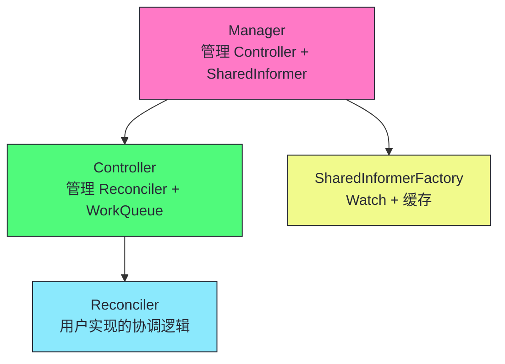
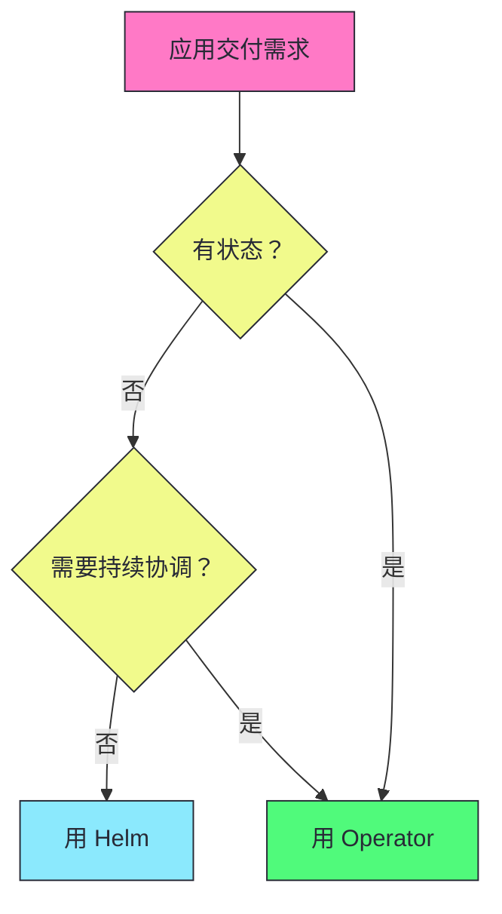

# 12 CRD 与 Operator 模式：自定义控制器与扩展 K8s

> [!abstract] 摘要
> 本文深入 Kubernetes 的扩展机制——CRD（Custom Resource Definition）和 Operator 模式。CRD 允许用户在不修改 K8s 源码的情况下定义新的 API 资源类型，Operator 是管理特定应用生命周期的自定义控制器。文章首先讲透 CRD 的定义——OpenAPI v3 Schema 验证、API 版本演进、status 子资源、分类与列定义。然后深入 controller-runtime 框架——Manager/Controller/Reconciler 的三层架构，以及编写控制器的完整流程。讲透 Operator 的设计模式——Finalizer 管理外部资源、OwnerReference 级联控制、状态机式协调、幂等性保证。对比 Helm vs Operator 的应用交付——Helm 是"一次性模板渲染"，Operator 是"持续协调"，各自适用场景。然后讨论生产级 Operator 的最佳实践——RBAC 最小权限、监控指标、Webhook 验证、多版本 CRD 的转换。最后以一个完整的 Operator 开发示例结束——从 CRD 定义到控制器实现到部署。核心认知：Operator 的价值不是"创建 StatefulSet/Service"，而是将运维专家的知识编码到控制器中——自动化备份、恢复、升级、扩缩容等原本需要人工操作的运维任务。

---

## 第 1 章 CRD：自定义 API 资源

### 1.1 什么是 CRD

**CRD（Custom Resource Definition）** 允许用户定义新的 K8s API 资源类型。定义 CRD 后，用户可以用 `kubectl get <custom-resource>` 操作自定义资源，就像操作内置资源一样。

```yaml
apiVersion: apiextensions.k8s.io/v1
kind: CustomResourceDefinition
metadata:
  name: databases.example.com
spec:
  group: example.com
  names:
    kind: Database
    plural: databases
    singular: database
    shortNames: [db]
  scope: Namespaced
  versions:
    - name: v1
      served: true
      storage: true
      schema:
        openAPIV3Schema:
          type: object
          properties:
            spec:
              type: object
              properties:
                engine:
                  type: string
                  enum: [mysql, postgresql]
                version:
                  type: string
                replicas:
                  type: integer
                  minimum: 1
                  maximum: 5
            status:
              type: object
              properties:
                phase:
                  type: string
                ready:
                  type: boolean
```

### 1.2 CRD 的关键字段

| 字段 | 说明 |
|------|------|
| **group** | API 组名（如 example.com） |
| **names** | 资源名称（kind/plural/singular/shortNames） |
| **scope** | Namespaced 或 Cluster |
| **versions** | API 版本列表 |
| **schema** | OpenAPI v3 Schema 验证 |
| **subresources** | status 和 scale 子资源 |

### 1.3 status 子资源

```yaml
versions:
  - name: v1
    subresources:
      status: {}  # 启用 status 子资源
```

启用 status 子资源后，spec 和 status 的更新分离——更新 status 用 `/status` 端点，不与 spec 更新冲突（乐观并发控制独立）。

> [!info] 核心概念：CRD 复用 K8s 的所有基础设施
> CRD 定义后，自定义资源复用 K8s 的所有基础设施——RESTful API、kubectl 操作、RBAC 授权、Watch/Informer、Label/Selector、OwnerReference/GC。你不需要自己实现这些——它们是 K8s API 框架的通用能力。这是 CRD 相比"自己写 API 服务"的优势——站在 K8s 的肩膀上，而非重新发明轮子。

---

## 第 2 章 controller-runtime：编写控制器的框架

### 2.1 三层架构



### 2.2 编写控制器的完整流程

```go
// 1. 定义 API 类型（types.go）
type DatabaseSpec struct {
    Engine  string `json:"engine"`
    Version string `json:"version"`
    Replicas int32 `json:"replicas"`
}

type DatabaseStatus struct {
    Phase string `json:"phase"`
    Ready bool   `json:"ready"`
}

// +kubebuilder:object:root=true
type Database struct {
    metav1.TypeMeta   `json:",inline"`
    metav1.ObjectMeta `json:"metadata,omitempty"`
    Spec   DatabaseSpec   `json:"spec,omitempty"`
    Status DatabaseStatus `json:"status,omitempty"`
}

// 2. 实现 Reconciler
type DatabaseReconciler struct {
    client.Client
    Scheme *runtime.Scheme
}

func (r *DatabaseReconciler) Reconcile(ctx context.Context, req ctrl.Request) (ctrl.Result, error) {
    var db examplev1.Database
    if err := r.Get(ctx, req.NamespacedName, &db); err != nil {
        return ctrl.Result{}, client.IgnoreNotFound(err)
    }
    
    // 处理删除
    if !db.DeletionTimestamp.IsZero() {
        return r.handleDeletion(ctx, &db)
    }
    
    // 添加 Finalizer
    if !controllerutil.ContainsFinalizer(&db, finalizerName) {
        controllerutil.AddFinalizer(&db, finalizerName)
        return ctrl.Result{Requeue: true}, r.Update(ctx, &db)
    }
    
    // 正常协调：创建 StatefulSet/Service
    if err := r.ensureStatefulSet(ctx, &db); err != nil {
        return ctrl.Result{}, err
    }
    
    // 更新 status
    db.Status.Phase = "Running"
    db.Status.Ready = true
    db.Status.ObservedGeneration = db.Generation
    return ctrl.Result{}, r.Status().Update(ctx, &db)
}

// 3. 注册 Controller
func main() {
    mgr, _ := ctrl.NewManager(ctrl.GetConfigOrDie(), ctrl.Options{
        Scheme: scheme,
    })
    
    ctrl.NewControllerManagedBy(mgr).
        For(&examplev1.Database{}).
        Owns(&appsv1.StatefulSet{}).
        Owns(&corev1.Service{}).
        Complete(&DatabaseReconciler{Client: mgr.GetClient(), Scheme: mgr.GetScheme()})
    
    mgr.Start(ctrl.SetupSignalHandler())
}
```

### 2.3 Owns 的级联 Watch

```go
ctrl.NewControllerManagedBy(mgr).
    For(&examplev1.Database{}).      // 主资源
    Owns(&appsv1.StatefulSet{}).     // 子资源：StatefulSet 变化触发 Reconcile
    Owns(&corev1.Service{})          // 子资源：Service 变化触发 Reconcile
```

> [!info] 核心概念：Owns 自动建立子资源到父资源的事件转发
> 当 StatefulSet 变化时（如副本数变化），Database Operator 需要知道——因为 Database 的 status 取决于 StatefulSet 的状态。`Owns` 自动建立这个转发——StatefulSet 变化触发所属 Database 的 Reconcile。无需手动 Watch StatefulSet 并查找 OwnerReference。这是 controller-runtime 简化控制器开发的典型设计。

---

## 第 3 章 Operator 的设计模式

### 3.1 Finalizer：管理外部资源

```go
const finalizerName = "example.com/database-cleanup"

func (r *DatabaseReconciler) handleDeletion(ctx context.Context, db *examplev1.Database) (ctrl.Result, error) {
    if controllerutil.ContainsFinalizer(db, finalizerName) {
        // 清理外部资源（如云数据库实例）
        if err := r.deleteCloudDatabase(db); err != nil {
            return ctrl.Result{}, err  // 失败重试
        }
        controllerutil.RemoveFinalizer(db, finalizerName)
        return ctrl.Result{}, r.Update(ctx, db)
    }
    return ctrl.Result{}, nil
}
```

### 3.2 状态机式协调

```go
func (r *DatabaseReconciler) Reconcile(ctx context.Context, req ctrl.Request) (ctrl.Result, error) {
    var db examplev1.Database
    r.Get(ctx, req.NamespacedName, &db)
    
    switch db.Status.Phase {
    case "":
        db.Status.Phase = "Pending"
        r.Status().Update(ctx, &db)
    case "Pending":
        if r.canProvision(&db) {
            db.Status.Phase = "Provisioning"
            r.Status().Update(ctx, &db)
        }
    case "Provisioning":
        if err := r.provision(&db); err != nil {
            return ctrl.Result{}, err
        }
        db.Status.Phase = "Running"
        r.Status().Update(ctx, &db)
    case "Running":
        if !r.isHealthy(&db) {
            db.Status.Phase = "Degraded"
            r.Status().Update(ctx, &db)
        }
    }
    return ctrl.Result{}, nil
}
```

### 3.3 幂等性保证

```go
func (r *DatabaseReconciler) ensureStatefulSet(ctx context.Context, db *examplev1.Database) error {
    var sts appsv1.StatefulSet
    err := r.Get(ctx, types.NamespacedName{Name: db.Name, Namespace: db.Namespace}, &sts)
    
    if errors.IsNotFound(err) {
        // 创建
        sts = r.buildStatefulSet(db)
        return r.Create(ctx, &sts)
    }
    
    // 更新（如果需要）
    desired := r.buildStatefulSet(db)
    if !reflect.DeepEqual(sts.Spec, desired.Spec) {
        sts.Spec = desired.Spec
        return r.Update(ctx, &sts)
    }
    return nil  // 已一致，无需操作
}
```

> [!warning] 生产避坑：Reconcile 必须幂等
> Reconcile 可能因 WorkQueue 重试或 Resync 被重复调用。每次 Reconcile 都应像第一次一样——检查当前状态，决定是否需要行动。`ensureStatefulSet` 先检查 StatefulSet 是否存在且 spec 一致——存在且一致就不操作，不存在才创建，不一致才更新。不要假设"上一次创建了"——可能上一次创建后又被删除了。

---

## 第 4 章 Helm vs Operator

### 4.1 两种应用交付方式

| 维度 | Helm | Operator |
|------|------|---------|
| **模式** | 一次性模板渲染 | 持续协调 |
| **触发** | helm install/upgrade | 持续 Watch |
| **自愈** | 无（模板渲染完就结束） | 有（状态偏离自动修复） |
| **复杂度** | 低 | 高 |
| **适用场景** | 无状态应用、简单配置 | 有状态应用、复杂运维 |

### 4.2 选择依据



> [!info] 核心概念：Operator 的价值是自动化运维，不是创建资源
> 如果 Operator 只是"创建 StatefulSet/Service"，它和 Helm 没本质区别——都是创建 K8s 资源。Operator 的真正价值在于自动化运维——备份、恢复、升级、扩缩容、故障转移等原本需要人工操作的运维任务。一个数据库 Operator 应该：定时备份、自动故障检测、主从切换、版本升级、按指标扩缩容。这些是 Helm 做不到的——Helm 渲染完模板就结束，不持续协调。Operator 持续 Watch 资源状态，自动执行运维操作。

---

## 第 5 章 生产级 Operator 最佳实践

### 5.1 RBAC 最小权限

```yaml
apiVersion: rbac.authorization.k8s.io/v1
kind: ClusterRole
metadata:
  name: database-operator
rules:
  - apiGroups: ["example.com"]
    resources: ["databases", "databases/status", "databases/finalizers"]
    verbs: ["get", "list", "watch", "update", "patch"]
  - apiGroups: ["apps"]
    resources: ["statefulsets"]
    verbs: ["get", "list", "watch", "create", "update", "delete"]
  - apiGroups: [""]
    resources: ["services"]
    verbs: ["get", "list", "watch", "create", "update", "delete"]
```

### 5.2 Webhook 验证

```yaml
apiVersion: admissionregistration.k8s.io/v1
kind: ValidatingWebhookConfiguration
metadata:
  name: database-validator
webhooks:
  - name: validator.example.com
    rules:
      - operations: ["CREATE", "UPDATE"]
        apiGroups: ["example.com"]
        resources: ["databases"]
```

### 5.3 监控指标

```go
import "sigs.k8s.io/controller-runtime/pkg/metrics"

var reconcileTotal = prometheus.NewCounterVec(
    prometheus.CounterOpts{Name: "controller_reconcile_total"},
    []string{"controller", "result"},
)

var reconcileDuration = prometheus.NewHistogramVec(
    prometheus.HistogramOpts{Name: "controller_reconcile_duration_seconds"},
    []string{"controller"},
    nil,
)

func init() {
    metrics.Registry.MustRegister(reconcileTotal)
    metrics.Registry.MustRegister(reconcileDuration)
}
```

### 5.4 多版本 CRD 的转换

CRD 支持多版本（如 v1alpha1、v1beta1、v1），版本间需要转换：

| 转换方式 | 说明 |
|---------|------|
| **None** | 不转换（各版本结构相同） |
| **Webhook** | 通过 Conversion Webhook 转换（结构不同时） |

```yaml
versions:
  - name: v1alpha1
    served: true
    storage: false  # 不存储
  - name: v1
    served: true
    storage: true   # 存储版本
    schema: ...
conversion:
  strategy: Webhook
  webhook:
    clientConfig:
      service:
        name: conversion-webhook
        namespace: operator-system
        path: /convert
```

> [!warning] 生产避坑：CRD 版本升级需规划转换路径
> CRD 版本升级是破坏性变更——从 v1alpha1 到 v1 可能字段变化。升级策略：(1) 新版本 served=true 但 storage=false（只读）；(2) 提供 Conversion Webhook 转换新旧版本；(3) 迁移所有客户端后，旧版本 served=false。不要直接删除旧版本——使用旧版本的客户端会失败。K8s 的 API 版本演进策略适用于 CRD。

### 5.5 Operator 的 leader election

生产环境 Operator 通常多副本部署——但只有一个实例运行 Reconcile，其他待命。用 Leader Election 实现：

```go
mgr, _ := ctrl.NewManager(ctrl.GetConfigOrDie(), ctrl.Options{
    LeaderElection: true,
    LeaderElectionID: "database-operator-leader",
})
```

> [!info] 核心概念：Operator 的 Leader Election 用 Lease 实现
> Operator 多副本部署时，通过 Lease 资源选举 Leader——只有 Leader 运行 Reconcile，其他实例待命。Leader 故障后，其他实例通过 Lease 竞选新 Leader。这确保了 Operator 的高可用——单实例故障不影响运维功能。注意 Leader 切换期间 Reconcile 暂停——如果切换频繁，检查网络和 etcd 稳定性。

> [!warning] 生产避坑：Operator 必须有监控和告警
> 生产级 Operator 必须暴露监控指标——Reconcile 次数、延迟、错误率。没有监控的 Operator 是"黑箱"——你不知道它是否正常工作、是否有性能问题。controller-runtime 内置 Prometheus 指标，默认在 :8080/metrics 暴露。配置 Prometheus 抓取这些指标，并设置告警——Reconcile 错误率 >5% 或延迟 P99 >5s 告警。

---

## 总结

CRD 与 Operator 模式的核心知识可以归纳为以下主线：

1. **CRD 允许不修改 K8s 源码定义新资源类型**。复用 K8s 所有基础设施——API/kubectl/RBAC/Watch/GC。

2. **OpenAPI v3 Schema 验证 CRD 字段**。类型、枚举、最小最大值、必填等验证。生产级 CRD 必须定义完整 Schema。

3. **status 子资源分离 spec 和 status 的并发控制**。更新 status 用 `/status` 端点，不与 spec 更新冲突。

4. **controller-runtime 是编写控制器的标准框架**。Manager/Controller/Reconciler 三层，Owns 自动建立子资源到父资源的事件转发。

5. **Finalizer 管理外部资源**。创建时添加 Finalizer，删除时执行清理然后移除 Finalizer。防止外部资源泄露。

6. **状态机模式处理多阶段协调**。phase 字段表示当前阶段，每次 Reconcile 根据 phase 决定下一步。

7. **Reconcile 必须幂等**。先检查当前状态，决定是否需要行动。不要假设"上一次做了什么"。

8. **Helm 是一次性模板渲染，Operator 是持续协调**。无状态应用用 Helm，有状态应用用 Operator。

9. **Operator 的价值是自动化运维，不是创建资源**。备份、恢复、升级、故障转移——将运维知识编码到控制器。

10. **生产级 Operator 需要 RBAC 最小权限、Webhook 验证、监控指标**。没有监控的 Operator 是黑箱——不知道是否正常工作。

> [!info] 专栏导航
> 本文是 [[00 专栏导览|Kubernetes 架构深度剖析专栏]] 的第 12 篇，深入 CRD 和 Operator 模式。下一篇 [[13 kubelet 深度剖析：Pod 生命周期与容器运行时接口]] 将详细讨论 kubelet 的内部实现——CRI 接口、SyncPod 流程、PLEG、健康检查、垃圾回收。

---

## 延伸思考

1. **你的应用是否需要 Operator？** 如果只是创建 StatefulSet/Service，Helm 够了。如果需要备份/恢复/升级/故障转移，Operator 才有价值。

2. **你的 CRD 是否定义了完整 Schema？** 没有Schema 的 CRD 接受任意字段——容易出错。生产级 CRD 必须定义 OpenAPI v3 Schema。

3. **你的 Operator 是否有 Finalizer？** 如果创建了外部资源（云 LB/DNS/数据库），必须有 Finalizer 在删除前清理。没有 Finalizer 会泄露外部资源。

4. **你的 Operator Reconcile 是否幂等？** 用 Resync 测试——Resync 触发所有对象的 onUpdate，如果 Reconcile 不幂等会产生副作用。

5. **你的 Operator 是否有监控指标？** 暴露 Reconcile 次数/延迟/错误率。配置 Prometheus 抓取和告警。没有监控的 Operator 是黑箱。

6. **你的 Operator RBAC 是否最小权限？** 只授予必要的资源操作权限。避免通配符和 cluster-admin。

---

## 参考资料

1. CRD 文档：https://kubernetes.io/docs/concepts/extend-kubernetes/api-extension/custom-resources/
2. controller-runtime：https://pkg.go.dev/sigs.k8s.io/controller-runtime
3. Operator SDK：https://sdk.operatorframework.io/
4. Operator Pattern：https://kubernetes.io/docs/concepts/extend-kubernetes/operator/
5. Kubebuilder：https://book.kubebuilder.io/
6. 最佳实践：https://sdk.operatorframework.io/docs/best-practices/

---

> [!note] 思考题
> 1. Operator 用 OwnerReference 让 StatefulSet 成为 Database 的子资源——Database 删除时 StatefulSet 被级联删除。但如果用户手动创建了同名 StatefulSet（不属于任何 Database），Operator 的 Reconcile 会如何处理？会删除用户的 StatefulSet 吗？
> 2. CRD 的 status 子资源分离了 spec 和 status 的更新——但如果控制器更新 status 时与用户更新 spec 冲突（两者都修改了同一对象），409 Conflict 会发生吗？status 子资源如何避免这种冲突？
> 3. Operator 的 Finalizer 确保删除前清理外部资源。如果 Operator 的 Pod 崩溃了（无法执行清理），有 Finalizer 的 Database 会一直处于 Terminating 状态吗？如何恢复？删除 Finalizer 是否安全？
