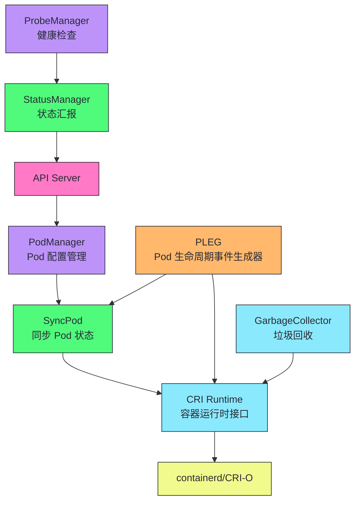
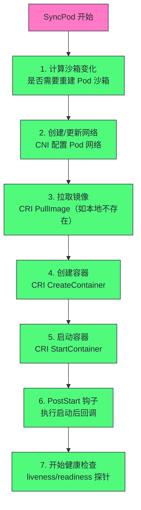
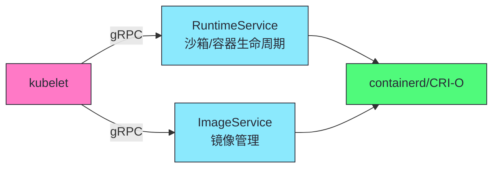
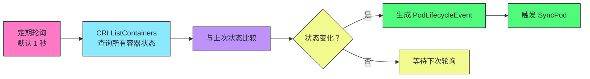

# 13 kubelet 深度剖析：Pod 生命周期与容器运行时接口

> [!abstract] 摘要
> 本文深入 Kubernetes 数据平面的核心组件——kubelet。kubelet 运行在每个节点上，负责管理该节点上 Pod 的完整生命周期。文章首先讲透 kubelet 的架构——PodManager（Pod 配置管理）、CRI Runtime（容器运行时接口）、PLEG（Pod 生命周期事件生成器）、StatusManager（状态汇报）、ProbeManager（健康检查）。然后深入 Pod 的创建/更新/删除流程——SyncPod 的完整步骤（计算沙箱变化、创建网络、拉取镜像、创建容器、启动容器）。讲透 CRI（Container Runtime Interface）gRPC 接口——RuntimeService 和 ImageService 的方法，kubelet 如何通过 CRI 调用 containerd。然后讨论 PLEG 机制——kubelet 如何通过定期查询容器状态生成 Pod 生命周期事件，以及 PLEG 的"最后观测状态"问题。之后深入健康检查——livenessProbe/readinessProbe/startupProbe 的区别和实现，以及为什么 readinessProbe 影响 Service 流量。然后讨论 kubelet 的垃圾回收——容器 GC 和镜像 GC 的策略。最后讨论 kubelet 的常见故障和排查方法。核心认知：kubelet 是 K8s 在每个节点上的"代理人"——它将声明式 API 的期望状态转化为实际的容器操作，是控制平面与数据平面之间的桥梁。

---

## 第 1 章 kubelet 的架构

### 1.1 核心组件



| 组件 | 职责 |
|------|------|
| **PodManager** | 管理 Pod 配置（来自 API Server 和本地静态文件） |
| **CRI Runtime** | 通过 gRPC 调用容器运行时 |
| **PLEG** | 定期查询容器状态，生成生命周期事件 |
| **StatusManager** | 向 API Server 汇报 Pod 状态 |
| **ProbeManager** | 执行 liveness/readiness/startup 探针 |
| **GarbageCollector** | 清理已退出容器和未使用镜像 |

> [!info] 核心概念：kubelet 是控制平面与数据平面的桥梁
> kubelet 将声明式 API 的期望状态转化为实际的容器操作——API Server 说"创建这个 Pod"，kubelet 通过 CRI 调用 containerd 创建容器。这是 K8s "声明式"与"执行"之间的转换点。理解 kubelet 的工作机制，是理解 K8s 如何"落地"声明式 API 的关键——spec 到容器的完整链路。

---

## 第 2 章 Pod 创建流程：SyncPod

### 2.1 SyncPod 的完整步骤



### 2.2 每步的详细说明

| 步骤 | 操作 | 失败行为 |
|------|------|---------|
| **沙箱变化** | 比较当前沙箱与期望，决定是否重建 | 重建时先停所有容器 |
| **网络配置** | CNI 插件配置 Pod 网络命名空间 | 网络失败 Pod 创建失败 |
| **拉取镜像** | 本地不存在时 PullImage | 拉取失败 Pod 创建失败 |
| **创建容器** | CreateContainer（不启动） | 创建失败记录错误 |
| **启动容器** | StartContainer | 启动失败重启（根据重启策略） |
| **PostStart** | 执行启动后钩子 | 钩子失败容器被杀 |
| **健康检查** | 开始 liveness/readiness 探针 | 探针失败根据类型处理 |

---

## 第 3 章 CRI：容器运行时接口

### 3.1 CRI 的两类服务



### 3.2 RuntimeService 的核心方法

| 方法 | 说明 |
|------|------|
| **RunPodSandbox** | 创建 Pod 沙箱（网络/IPC 命名空间） |
| **StopPodSandbox** | 停止 Pod 沙箱 |
| **CreateContainer** | 在沙箱中创建容器（不启动） |
| **StartContainer** | 启动容器 |
| **StopContainer** | 停止容器 |
| **ListContainers** | 列出容器 |
| **ContainerStats** | 获取容器资源使用 |
| **ExecSync** | 在容器中执行命令（如 exec） |

> [!info] 核心概念：CRI 解耦了 kubelet 和容器运行时
> CRI 使得 kubelet 不依赖特定容器运行时——可以用 containerd、CRI-O 或任何 CRI 兼容运行时。早期 K8s 直接调用 Docker API，后来抽象出 CRI 解耦。Docker 由于不支持 CRI 需要 dockershim 适配层，K8s 1.24 移除了 dockershim，现在主流运行时是 containerd。这是 K8s "可扩展性优先"原则在数据平面的体现。

---

## 第 4 章 PLEG：Pod 生命周期事件生成器

### 4.1 PLEG 的工作机制



### 4.2 PLEG 的"最后观测状态"问题

PLEG 通过定期轮询 CRI 获取容器状态——但轮询有延迟（默认 1 秒）。容器在两次轮询之间崩溃又重启，PLEG 可能感知不到。

> [!warning] 生产避坑：PLEG 的轮询延迟可能导致状态滞后
> PLEG 每秒轮询一次容器状态——如果容器在两次轮询之间崩溃又重启，PLEG 可能感知不到"曾经崩溃"。这可能导致 Pod status 与实际状态短暂不一致。对于需要快速感知容器状态变化的场景，可以缩短 PLEG 轮询间隔（`--pleg-relist-interval`，默认 1s），但太短会增加 CRI 调用压力。大多数场景默认值够用。

---

## 第 5 章 健康检查探针

### 5.1 三种探针

| 探针 | 作用 | 失败行为 |
|------|------|---------|
| **livenessProbe** | 容器是否存活 | 重启容器（根据 restartPolicy） |
| **readinessProbe** | 容器是否就绪 | 从 Service Endpoints 移除（停止流量） |
| **startupProbe** | 容器是否启动完成 | 失败前禁用 liveness/readiness 探针 |

### 5.2 探针类型

```yaml
livenessProbe:
  httpGet:
    path: /health
    port: 8080
  initialDelaySeconds: 30  # 启动后等 30 秒才开始探针
  periodSeconds: 10        # 每 10 秒探一次
  timeoutSeconds: 5        # 探针超时 5 秒
  successThreshold: 1      # 成功 1 次视为健康
  failureThreshold: 3      # 失败 3 次视为不健康
```

| 探针类型 | 机制 | 适用场景 |
|---------|------|---------|
| **httpGet** | HTTP GET 请求，2xx/3xx 为健康 | Web 服务 |
| **tcpSocket** | TCP 连接成功为健康 | 数据库等非 HTTP 服务 |
| **exec** | 执行命令，退出码 0 为健康 | 需要复杂检查逻辑 |
| **grpc** | gRPC 健康检查（K8s 1.24+） | gRPC 服务 |

> [!info] 核心概念：readinessProbe 影响 Service 流量
> readinessProbe 失败时，kubelet 将 Pod 从 Service 的 Endpoints 中移除——流量不再发往该 Pod。这是滚动更新时"先启动新 Pod，就绪后再切流量"的机制——新 Pod 的 readinessProbe 通过后才加入 Endpoints，旧 Pod 的 readinessProbe 失败后从 Endpoints 移除。理解 readinessProbe 与 Endpoints 的关系，是配置零停机更新的关键。

### 5.3 startupProbe 的价值

```yaml
startupProbe:
  httpGet:
    path: /startup
    port: 8080
  failureThreshold: 30    # 允许失败 30 次
  periodSeconds: 10        # 每 10 秒探一次
  # 总启动时间上限 = 30 × 10 = 300 秒

livenessProbe:
  httpGet:
    path: /health
    port: 8080
  periodSeconds: 10
  failureThreshold: 3
```

> [!warning] 生产避坑：慢启动应用用 startupProbe
> 没有startupProbe 时，livenessProbe 的 initialDelaySeconds 需要设为应用启动时间——但启动时间可能不确定（如 JVM 预热 30-120 秒）。设太短，livenessProbe 在应用启动期间失败导致重启循环。设太长，应用启动后故障感知慢。startupProbe 解决这个问题——启动期间只检查 startupProbe，通过后才启用 livenessProbe。慢启动应用（Java/Python）推荐用 startupProbe。

---

## 第 6 章 垃圾回收

### 6.1 容器 GC

| 策略 | 默认值 | 说明 |
|------|--------|------|
| **MinAge** | 0 | 容器退出超过此时长才清理 |
| **MaxPerPodContainer** | 1 | 每个 Pod 保留的已退出容器数 |
| **MaxContainers** | -1 | 全节点保留的已退出容器总数 |

### 6.2 镜像 GC

| 阈值 | 默认值 | 行为 |
|------|--------|------|
| **HighThresholdPercent** | 85% | 磁盘使用超过时开始清理镜像 |
| **LowThresholdPercent** | 80% | 清理到此时停止 |

> [!info] 核心概念：镜像 GC 按 LRU 清理
> 当磁盘使用超过 HighThresholdPercent（85%）时，kubelet 开始清理未使用的镜像——按"最近最少使用"（LRU）排序，先清理最久未用的。清理到 LowThresholdPercent（80%）停止。运行中 Pod 使用的镜像不会被清理。这是 K8s 自动管理节点磁盘空间的机制——无需人工干预。

---

## 第 7 章 kubelet 常见故障

| 故障 | 症状 | 排查方法 |
|------|------|---------|
| **Pod 一直 Pending** | 调度失败 | `kubectl describe pod` 看 Events |
| **Pod 一直 ContainerCreating** | 镜像拉取失败/CNI 错误 | `kubectl describe pod` 看 Events |
| **Pod CrashLoopBackOff** | 容器启动失败重启 | `kubectl logs pod` 看容器日志 |
| **Pod Running 但不在 Endpoints** | readinessProbe 失败 | `kubectl describe pod` 看探针状态 |
| **节点 NotReady** | kubelet 心跳超时 | 检查 kubelet 进程和网络 |
| **镜像拉取失败** | ImagePullBackOff | 检查镜像名、Registry 认证、网络 |
| **容器 OOMKilled** | 内存超限被杀 | 检查 resources.limits.memory |

### 7.1 Pod 状态详解

| 状态 | 说明 | 常见原因 |
|------|------|---------|
| **Pending** | 已提交但未调度 | 资源不足、亲和性不匹配 |
| **ContainerCreating** | 已调度正在创建容器 | 拉镜像、CNI 配置、挂载卷 |
| **Running** | 容器运行中 | 正常状态 |
| **CrashLoopBackOff** | 容器反复崩溃重启 | 应用 bug、配置错误、依赖缺失 |
| **ImagePullBackOff** | 镜像拉取失败 | 镜像名错误、Registry 认证、网络 |
| **OOMKilled** | 内存超限 | resources.limits.memory 太小 |
| **Evicted** | 被驱逐 | 节点资源压力（磁盘/内存） |

### 7.2 ContainerCreating 卡住的排查

Pod 处于 ContainerCreating 状态长时间不变化，常见原因：

| 原因 | 排查方法 |
|------|---------|
| **镜像拉取慢/失败** | `kubectl describe pod` 看 Events |
| **CNI 网络配置失败** | 检查 CNI 插件日志和配置 |
| **PV 挂载失败** | 检查 PVC 绑定状态和 CSI 插件 |
| **Secret 挂载失败** | 检查 Secret 是否存在 |
| **kubelet 卡死** | 检查 kubelet 日志和 PLEG 状态 |

> [!warning] 生产避坑：ContainerCreating 卡住先看 Events
> Pod 处于 ContainerCreating 长时间不变化时，`kubectl describe pod` 的 Events 部分会显示具体原因——"Failed to pull image"、"Failed to mount volume"、"CNI setup failed"。根据原因定位问题。如果 Events 为空，检查 kubelet 日志——`journalctl -u kubelet | grep <pod-name>`。

> [!warning] 生产避坑：节点 NotReady 后的 Pod 驱逐
> 节点 NotReady 后，kubelet 心跳超时，Node Controller 将节点标记为 NotReady。等待 pod-eviction-timeout（默认 5 分钟）后，Pod 被标记为 Terminating 并在其他节点重建。对于有状态应用（StatefulSet），如果 PV 是本地存储，Pod 无法在其他节点重建——数据卡在故障节点。

---

## 总结

kubelet 深度剖析的核心知识可以归纳为以下主线：

1. **kubelet 是控制平面与数据平面的桥梁**。将声明式 API 的期望状态转化为实际的容器操作。

2. **核心组件：PodManager/CRI/PLEG/StatusManager/ProbeManager/GC**。各司其职，协同管理 Pod 生命周期。

3. **SyncPod 七步**：沙箱变化→网络配置→拉取镜像→创建容器→启动容器→PostStart→健康检查。

4. **CRI 解耦 kubelet 和容器运行时**。gRPC 接口，containerd 是主流运行时。K8s 1.24 移除 dockershim。

5. **PLEG 定期轮询容器状态生成事件**。默认 1 秒轮询，可能有"最后观测状态"延迟。

6. **三种探针：liveness/readiness/startup**。liveness 决定重启，readiness 决定 Endpoints，startup 保护慢启动。

7. **readinessProbe 影响 Service 流量**。失败时从 Endpoints 移除，是零停机更新的关键。

8. **startupProbe 解决慢启动问题**。启动期间只检查 startupProbe，通过后才启用 liveness。

9. **镜像 GC 按 LRU 清理**。磁盘超过 85% 开始清理未使用镜像，清理到 80% 停止。

10. **CrashLoopBackOff 是容器启动失败重启**。`kubectl logs` 查看容器日志定位原因。

11. **Pod 状态详解帮助快速定位问题**。Pending=调度问题，ContainerCreating=创建问题，CrashLoopBackOff=应用问题，OOMKilled=资源问题。

12. **kubelet 心跳通过 Lease 汇报节点状态**。kubelet 定期更新节点 Lease 的 renewTime，Node Controller 检测心跳超时标记 NotReady。心跳超时通常意味着 kubelet 故障或节点网络问题。

13. **CRI 的 Pod 沙箱是 Pod 的网络/IPC 命名空间**。Pod 内所有容器共享同一沙箱——共享网络和 IPC，但文件系统隔离。这是 Pod "多容器共享网络" 的实现基础。

> [!info] 专栏导航
> 本文是 [[00 专栏导览|Kubernetes 架构深度剖析专栏]] 的第 13 篇，深入 kubelet 的实现。下一篇 [[14 Service 与 kube-proxy：iptables/IPVS/eBPF 数据面演进]] 将详细讨论 Service 的负载均衡机制和 kube-proxy 的三种数据面模式。

---

## 延伸思考

1. **你的 Pod 是否配置了正确的探针？** Web 服务用 httpGet liveness + readiness，慢启动应用加 startupProbe，非 HTTP 服务用 tcpSocket。

2. **你的 readinessProbe 是否正确？** readinessProbe 失败会从 Endpoints 移除——确保应用真正就绪才通过，避免流量打到未就绪 Pod。

3. **你的镜像 GC 阈值是否合理？** 默认 85%/80% 对大多数场景够用。磁盘小的节点可能需要调低。

4. **你的节点 NotReady 后 Pod 如何处理？** 检查 pod-eviction-timeout 和 PV 类型。有状态应用用网络存储保证节点故障后可重建。

5. **你是否用 startupProbe 保护慢启动应用？** Java/Python 等慢启动应用用 startupProbe 避免启动期间被 livenessProbe 重启。

6. **你的 ContainerCreating 卡住是否检查了 Events？** `kubectl describe pod` 的 Events 显示具体原因——镜像拉取、CNI、PV 挂载、Secret。根据原因定位问题。

7. **你的 OOMKilled 是否调大了 memory limit？** OOMKilled 是容器内存超限被内核杀。检查 resources.limits.memory 是否足够，或检查应用是否有内存泄露。

8. **你的节点 NotReady 是否检查了 kubelet？** 节点 NotReady 通常是 kubelet 心跳超时——检查 kubelet 进程是否运行、网络是否通畅、磁盘是否满。

9. **你的 Pod 驱逐是否配置了 PDB？** 自愿驱逐（节点维护）时 PDB 确保最小可用副本数。非自愿驱逐（节点故障）不受 PDB 限制。

10. **你的镜像是否预加载到节点？** 频繁拉取大镜像会增加 Pod 创建时间。考虑用 ImageCache 或预加载镜像到节点。

---

## 参考资料

1. kubelet 文档：https://kubernetes.io/docs/reference/command-line-tools-reference/kubelet/
2. CRI 文档：https://kubernetes.io/docs/concepts/architecture/cri/
3. Pod 生命周期：https://kubernetes.io/docs/concepts/workloads/pods/pod-lifecycle/
4. 探针配置：https://kubernetes.io/docs/tasks/configure-pod-container/configure-liveness-readiness-startup-probes/
5. kubelet 源码：https://github.com/kubernetes/kubernetes/tree/master/pkg/kubelet

---

> [!note] 思考题
> 1. PLEG 每秒轮询容器状态——如果容器在两次轮询之间崩溃又重启（如 JVM OOM 后被 livenessProbe 重启），PLEG 会感知到吗？如果不感知，Pod status 会怎样？
> 2. readinessProbe 失败时 Pod 从 Endpoints 移除——但如果 Pod 同时是 StatefulSet 的成员（如 MySQL 从节点），移除后 Service 不再转发流量到它。这对 MySQL 从节点复制有影响吗？复制是否走 Service？
> 3. 镜像 GC 按 LRU 清理——如果节点上有两个应用，A 频繁更新（镜像新），B 很少更新（镜像旧）。磁盘满时 GC 会先清理 B 的镜像——下次 B 的 Pod 重启时需要重新拉取镜像。如何避免关键应用的镜像被清理？
