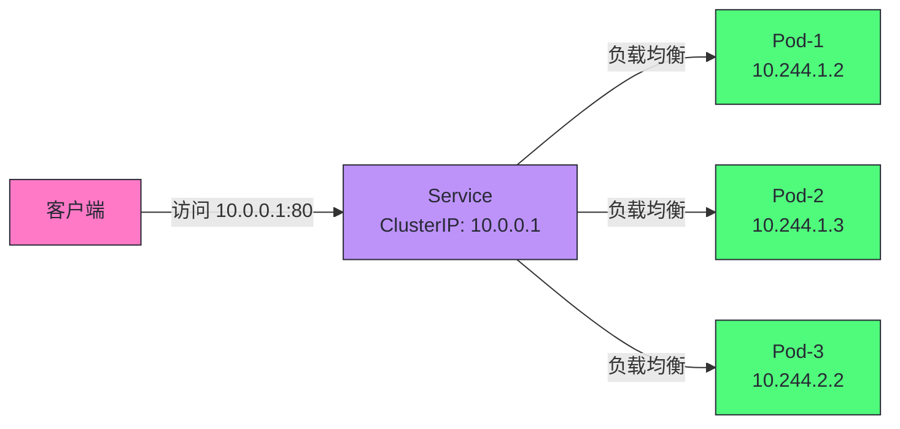
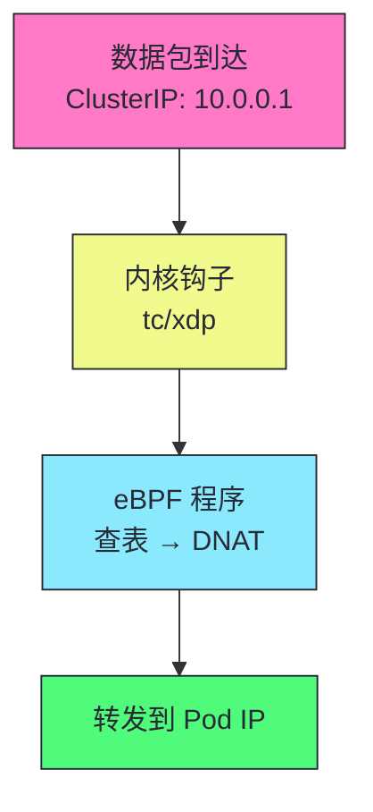

# 14 Service 与 kube-proxy：iptables/IPVS/eBPF 数据面演进

> [!abstract] 摘要
> 本文深入 Kubernetes Service 的负载均衡机制和 kube-proxy 的三种数据面模式。Service 是 K8s 的"虚拟 IP + 负载均衡"——为一组 Pod 提供稳定的访问入口。文章首先讲透 Service 的本质——ClusterIP 是虚拟 IP（不绑定任何网卡），由 kube-proxy 在内核配置转发规则实现。然后深入 kube-proxy 的三种数据面模式：iptables（默认，DNAT 规则）、IPVS（内核级负载均衡，大规模 Service 性能更好）、eBPF（Cilium 等，绕过 iptables 性能最高）。对比三种模式的性能、功能、适用场景。讲透 Service 的四种类型：ClusterIP（集群内）、NodePort（节点端口）、LoadBalancer（云 LB）、ExternalName（DNS CNAME）。然后讨论 Endpoints 和 EndpointsSlice——Service 如何关联 Pod，以及 EndpointsSlice 解决大规模 Endpoints 的分片方案。之后深入 Headless Service——无 ClusterIP 的 Service，DNS 直接返回 Pod IP，StatefulSet 的基础。最后讨论 Service 的会话亲和性和流量策略。核心认知：Service 不是"代理"——kube-proxy 只配置内核转发规则，实际数据包转发由内核完成，kube-proxy 不在数据路径上。

---

## 第 1 章 Service 的本质

### 1.1 什么是 Service

Service 为一组 Pod 提供稳定的访问入口——虚拟 IP（ClusterIP）+ 负载均衡。

```yaml
apiVersion: v1
kind: Service
metadata:
  name: web
spec:
  selector:
    app: web
  ports:
    - port: 80
      targetPort: 8080
```

| 特性 | 说明 |
|------|------|
| **ClusterIP** | 虚拟 IP，不绑定任何网卡 |
| **负载均衡** | 流量转发到后端 Pod |
| **稳定地址** | Pod IP 变化时 Service IP 不变 |
| **Selector 关联** | 通过 Label Selector 关联 Pod |

### 1.2 为什么需要 Service

Pod 的 IP 是临时的——Pod 重建后 IP 变化。客户端不能硬编码 Pod IP。Service 提供稳定的虚拟 IP，客户端访问 Service IP，kube-proxy 负责转发到后端 Pod。



> [!info] 核心概念：Service 不是代理，是内核转发规则
> kube-proxy 不是"代理服务器"——它不接收和转发数据包。kube-proxy 的职责是"配置内核转发规则"——在 iptables/IPVS/eBPF 中设置 DNAT 规则，将发往 ClusterIP 的流量 DNAT 为后端 Pod IP。实际数据包转发由内核完成，kube-proxy 不在数据路径上。这使得转发性能不受用户态进程影响——即使 kube-proxy 崩溃，已配置的规则仍然生效（直到规则被更新或节点重启）。

---

## 第 2 章 kube-proxy 的三种数据面模式

### 2.1 iptables 模式（默认）

```bash
# iptables 规则示例
-A KUBE-SVC-XXX -m statistic --mode random --probability 0.333 -j KUBE-SEP-1
-A KUBE-SVC-XXX -m statistic --mode random --probability 0.5 -j KUBE-SEP-2
-A KUBE-SVC-XXX -j KUBE-SEP-3
-A KUBE-SEP-1 -p tcp -j DNAT --to-destination 10.244.1.2:8080
-A KUBE-SEP-2 -p tcp -j DNAT --to-destination 10.244.1.3:8080
-A KUBE-SEP-3 -p tcp -j DNAT --to-destination 10.244.2.2:8080
```

iptables 用 `statistic` 模块的随机概率实现负载均衡。

### 2.2 IPVS 模式

```bash
# IPVS 规则示例
ipvsadm -A -t 10.0.0.1:80 -s rr
ipvsadm -a -t 10.0.0.1:80 -r 10.244.1.2:8080 -m
ipvsadm -a -t 10.0.0.1:80 -r 10.244.1.3:8080 -m
ipvsadm -a -t 10.0.0.1:80 -r 10.244.2.2:8080 -m
```

IPVS 是内核级负载均衡，支持多种调度算法（rr/wrr/lc/sh 等）。

### 2.3 eBPF 模式（Cilium）

eBPF 程序在内核中直接处理数据包，绕过 iptables——性能最高。



### 2.4 三种模式对比

| 维度 | iptables | IPVS | eBPF |
|------|---------|------|------|
| **性能** | 中（O(n) 规则匹配） | 高（O(1) 哈希查找） | 最高（内核直接处理） |
| **大规模 Service** | 差（规则数线性增长） | 好（哈希查找） | 好 |
| **调度算法** | 随机概率 | rr/wrr/lc/sh 等 | 自定义 |
| **可观测性** | iptables 规则 | ipvsadm | Cilium CLI/monitor |
| **依赖** | 内核 iptables | 内核 IPVS | 内核 eBPF（4.10+） |
| **推荐场景** | 小集群 | 大集群 | 追求性能的集群 |

> [!warning] 生产避坑：大集群必须用 IPVS 或 eBPF
> iptables 模式在大集群（1000+ Service）中性能退化——每个数据包需要遍历所有规则匹配。IPVS 用哈希查找，O(1) 复杂度，大规模性能稳定。eBPF 绕过 iptables，性能最高。生产集群（100+ 节点）建议用 IPVS 模式（`--proxy-mode=ipvs`）。追求极致性能且用 Cilium 的集群用 eBPF 模式。

---

## 第 3 章 Service 的四种类型

### 3.1 ClusterIP

```yaml
spec:
  type: ClusterIP  # 默认
  clusterIP: 10.0.0.1  # 可指定，或自动分配
```

集群内访问的虚拟 IP。集群外不可访问。

### 3.2 NodePort

```yaml
spec:
  type: NodePort
  ports:
    - port: 80
      targetPort: 8080
      nodePort: 30080  # 可指定，或自动分配（30000-32767）
```

在每个节点上开放端口，集群外可通过 `节点IP:NodePort` 访问。

### 3.3 LoadBalancer

```yaml
spec:
  type: LoadBalancer
  # 云厂商自动创建 LB 并关联到 Service
```

云厂商（AWS/GCP/Azure）自动创建外部 LB 并关联到 Service。

### 3.4 ExternalName

```yaml
spec:
  type: ExternalName
  externalName: db.example.com
```

DNS CNAME 记录，将 Service 名映射到外部域名。不做负载均衡。

| 类型 | 访问方式 | 适用场景 |
|------|---------|---------|
| **ClusterIP** | 集群内 | 内部服务间通信 |
| **NodePort** | 节点IP:端口 | 简单外部访问 |
| **LoadBalancer** | 云 LB IP | 生产外部访问 |
| **ExternalName** | DNS CNAME | 引用外部服务 |

---

## 第 4 章 Endpoints 与 EndpointsSlice

### 4.1 Endpoints：Service 到 Pod 的映射

```yaml
apiVersion: v1
kind: Endpoints
metadata:
  name: web
subsets:
  - addresses:
      - ip: 10.244.1.2
      - ip: 10.244.1.3
      - ip: 10.244.2.2
    ports:
      - port: 8080
```

Endpoints Controller Watch Service 和 Pod 变化，维护 Service → Pod IP 的映射。

### 4.2 EndpointsSlice：分片解决大规模问题

```yaml
apiVersion: discovery.k8s.io/v1
kind: EndpointsSlice
metadata:
  name: web-abc123
  labels:
    kubernetes.io/service-name: web
endpoints:
  - addresses: [10.244.1.2]
    conditions:
      ready: true
  - addresses: [10.244.1.3]
    conditions:
      ready: true
```

| 维度 | Endpoints | EndpointsSlice |
|------|----------|---------------|
| **结构** | 一个 Service 一个 Endpoints | 一个 Service 多个 Slice |
| **更新粒度** | 整个 Endpoints 更新 | 单个 Slice 更新 |
| **冲突风险** | 高 | 低 |
| **最大 Pod 数** | 5000 | 无限制 |
| **K8s 版本** | 所有版本 | 1.21+ 默认 |

> [!info] 核心概念：EndpointsSlice 解决大规模 Service 的更新冲突和大小限制
> 一个有 1000 Pod 的 Service，Endpoints 对象非常大且频繁更新——每个 Pod 变化都更新整个 Endpoints，冲突率高。EndpointsSlice 将 Endpoints 分成多个 Slice（按节点分片），每个 Slice 独立更新，冲突风险降低。且 Endpoints 有 5000 Pod 限制（etcd 单对象大小），EndpointsSlice 无限制。K8s 1.21+ 默认使用 EndpointsSlice。

---

## 第 5 章 Headless Service

### 5.1 什么是 Headless Service

```yaml
apiVersion: v1
kind: Service
metadata:
  name: mysql-headless
spec:
  clusterIP: None  # Headless：无 ClusterIP
  selector:
    app: mysql
```

Headless Service 没有 ClusterIP——DNS 查询返回所有 Pod IP，而非虚拟 IP。

### 5.2 DNS 解析差异

| Service 类型 | DNS 查询 `web.default.svc.cluster.local` |
|-------------|--------------------------------------|
| **普通 Service** | 返回 ClusterIP（10.0.0.1） |
| **Headless Service** | 返回所有 Pod IP（10.244.1.2, 10.244.1.3, ...） |
| **Headless + StatefulSet** | `mysql-0.mysql-headless` 返回 mysql-0 的 IP |

> [!info] 核心概念：Headless Service 让客户端能定位特定 Pod
> 普通 Service 的 DNS 返回 ClusterIP——客户端不知道连的是哪个 Pod。Headless Service 的 DNS 返回所有 Pod IP——客户端可以自行选择。更关键的是，StatefulSet + Headless Service 的 `<pod-name>.<headless-service>` DNS 解析返回特定 Pod 的 IP——这是 StatefulSet 稳定网络身份的基础。我们已在第 10 篇深入讨论。

---

## 第 6 章 会话亲和性与流量策略

### 6.1 会话亲和性

```yaml
spec:
  sessionAffinity: ClientIP  # 或 None
  sessionAffinityConfig:
    clientIP:
      timeoutSeconds: 10800  # 3 小时
```

同一客户端 IP 的请求转发到同一 Pod——适合有状态的会话。

### 6.2 流量策略

```yaml
spec:
  externalTrafficPolicy: Local  # 或 Cluster
```

| 策略 | 说明 |
|------|------|
| **Cluster**（默认） | 流量可转发到任何节点的 Pod（可能跨节点转发） |
| **Local** | 流量只转发到本节点的 Pod（保留客户端 IP） |

> [!warning] 生产避坑：externalTrafficPolicy: Local 可能导致不均匀
> `Local` 策略只将流量转发到本节点的 Pod——如果某节点没有该 Service 的 Pod，流量会被丢弃（不是转发到其他节点）。这要求每个节点都有该 Service 的 Pod（通常用 DaemonSet）。`Local` 的优势是保留客户端真实 IP（不做 SNAT），适合需要客户端 IP 的场景（如日志分析）。

---

## 总结

Service 与 kube-proxy 的核心知识可以归纳为以下主线：

1. **Service 是虚拟 IP + 负载均衡**。ClusterIP 不绑定网卡，由 kube-proxy 配置内核转发规则实现。

2. **kube-proxy 不是代理，是规则配置器**。实际转发由内核 iptables/IPVS/eBPF 完成，kube-proxy 不在数据路径上。

3. **三种数据面模式：iptables/IPVS/eBPF**。iptables 默认但大规模性能差。IPVS 哈希查找性能稳定。eBPF 绕过 iptables 性能最高。

4. **大集群用 IPVS 或 eBPF**。1000+ Service 时 iptables 规则线性增长，性能退化。

5. **四种 Service 类型**。ClusterIP（集群内）、NodePort（节点端口）、LoadBalancer（云 LB）、ExternalName（DNS CNAME）。

6. **Endpoints 维护 Service → Pod 映射**。Endpoints Controller Watch Service 和 Pod 变化更新 Endpoints。

7. **EndpointsSlice 解决大规模 Service 问题**。分片更新降低冲突，无 Pod 数限制。K8s 1.21+ 默认。

8. **Headless Service 无 ClusterIP**。DNS 返回 Pod IP，客户端能定位特定 Pod。StatefulSet 的基础。

9. **会话亲和性 ClientIP**。同一客户端 IP 转发到同一 Pod，适合有状态会话。

10. **externalTrafficPolicy: Local 保留客户端 IP**。但要求每个节点都有 Pod，否则流量丢弃。

11. **kube-proxy 三种模式的核心差异在于数据面位置**。iptables 在 netfilter 钩子用规则链匹配，IPVS 在内核用哈希表查找，eBPF 在 tc/xdp 钩子用自定义程序处理。eBPF 绕过了 iptables 和 IPVS 的所有开销，性能最高但需要较新内核（4.10+）和 Cilium 等支持。

12. **Service 的 DNS 解析由 CoreDNS 提供**。CoreDNS Watch Service 变化，为每个 Service 创建 DNS 记录。`<service>.<namespace>.svc.cluster.local` 解析为 ClusterIP。Headless Service 解析为所有 Pod IP。

13. **LoadBalancer 类型的 Service 由云厂商的 Controller 实现**。cloud-controller-manager 中的 Service Controller Watch LoadBalancer 类型 Service，调用云 API 创建 LB 并关联到 NodePort。删除 Service 时自动删除 LB。

14. **Service 的 ClusterIP 来自 service CIDR**。`--service-cluster-ip-range` 定义 ClusterIP 范围（如 10.0.0.0/16）。ClusterIP 是虚拟的——不路由，只在内核转发规则中存在。

> [!info] 专栏导航
> 本文是 [[00 专栏导览|Kubernetes 架构深度剖析专栏]] 的第 14 篇，深入 Service 和 kube-proxy。下一篇 [[15 CNI 网络模型与数据面对比：Flannel/Calico/Cilium]] 将详细讨论 K8s 网络模型和主流 CNI 插件的实现差异。

---

## 延伸思考

1. **你的集群是否用了 IPVS 模式？** 大集群（100+ 节点）建议用 IPVS——iptables 模式大规模性能退化。检查 kube-proxy 的 `--proxy-mode` 参数。

2. **你的外部访问是否用了 LoadBalancer？** NodePort 简单但端口有限制（30000-32767）。生产外部访问用 LoadBalancer（云厂商自动创建 LB）。

3. **你的大规模 Service 是否用了 EndpointsSlice？** K8s 1.21+ 默认启用。检查 EndpointsSlice 是否正常创建——`kubectl get endpointslice`。

4. **你的有状态应用是否用了 Headless Service？** StatefulSet 必须配合 Headless Service——提供 Pod 级 DNS 解析。

5. **你的 externalTrafficPolicy 是否合理？** 需要客户端 IP 用 Local（但需每节点有 Pod），不需要用 Cluster（默认，负载更均匀）。

6. **你的 Service 是否配置了会话亲和性？** 有状态会话用 sessionAffinity: ClientIP。无状态应用不需要——均匀负载更重要。

---

## 参考资料

1. Service 文档：https://kubernetes.io/docs/concepts/services-networking/service/
2. kube-proxy：https://kubernetes.io/docs/reference/command-line-tools-reference/kube-proxy/
3. IPVS 模式：https://kubernetes.io/blog/2018/07/09/ipvs-based-in-cluster-load-balancing-deep-dive/
4. EndpointsSlice：https://kubernetes.io/docs/concepts/services-networking/endpoint-slices/
5. Cilium eBPF：https://docs.cilium.io/
6. kube-proxy 源码：https://github.com/kubernetes/kubernetes/tree/master/pkg/proxy

---

> [!note] 思考题
> 1. iptables 模式用随机概率实现负载均衡——`--probability 0.333` 转发到第一个 Pod，`--probability 0.5`（在剩余的）转发到第二个，剩下的转发到第三个。这种概率转发在 Pod 数量变化时是否均匀？如果从 3 个 Pod 扩到 4 个，规则如何更新？
> 2. Headless Service 的 DNS 返回所有 Pod IP——客户端如何选择连哪个？是随机选择还是轮询？如果某个 Pod IP 不可用，客户端会重试其他 IP 吗？这需要客户端支持 DNS 多 IP 解析。
> 3. externalTrafficPolicy: Local 保留客户端 IP——但要求每个节点都有该 Service 的 Pod。如果一个节点没有 Pod，NodePort 流量到该节点会被丢弃。如何确保每节点都有 Pod（如用 DaemonSet）？这对 Service 的副本数有什么要求？
