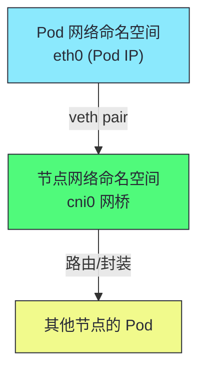
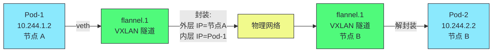
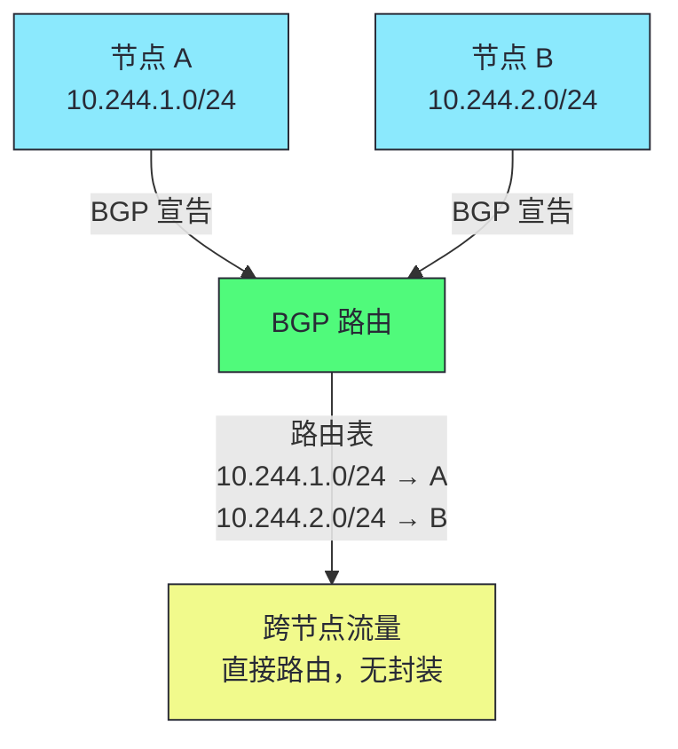
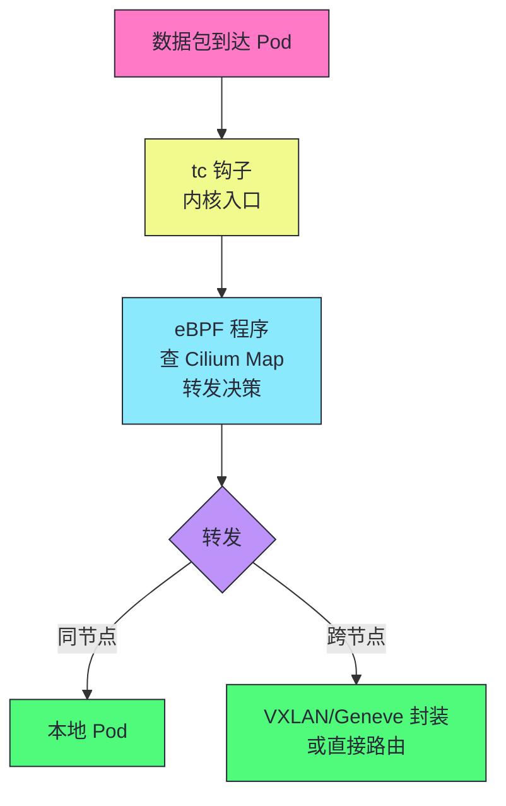
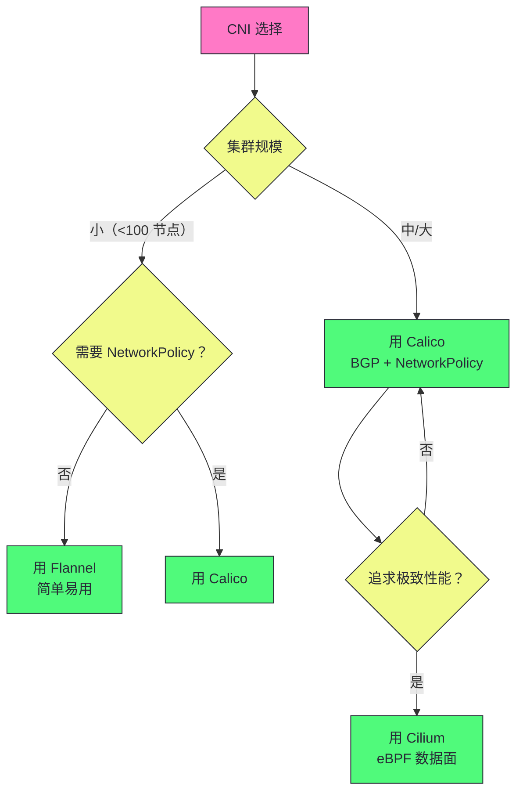

# 15 CNI 网络模型与数据面对比：Flannel/Calico/Cilium

> [!abstract] 摘要
> 本文深入 Kubernetes 网络模型和主流 CNI 插件的实现对比。K8s 网络模型要求每个 Pod 有唯一 IP、Pod 间直接通信无需 NAT、节点上代理能访问所有 Pod。文章首先讲透 K8s 网络模型的基础——Linux 网络命名空间、veth pair、网桥，以及 CNI 插件规范（ADD/DEL/CHECK 命令）。然后对比三种主流 CNI 插件的实现：Flannel（VXLAN/Host-GW/UDP，简单易用）、Calico（BGP 路由/eBPF 数据面，企业级）、Cilium（eBPF 原生，性能最高）。深入每种插件的数据面机制——Flannel 的 VXLAN 封装 vs Host-GW 直连路由、Calico 的 BGP 路由传播 vs eBPF 数据面、Cilium 的 eBPF 程序绕过 iptables。讲透 NetworkPolicy 的实现差异——Flannel 默认不支持，Calico 用 iptables/mark，Cilium 用 eBPF 程序。然后讨论 CNI 选择决策框架——小集群用 Flannel，企业集群用 Calico，追求性能用 Cilium。最后讨论 CNI 的运维实践——网络故障排查、性能调优、跨子网通信。核心认知：CNI 插件的选择决定了 Pod 网络的性能、功能（NetworkPolicy）和可观测性——根据集群规模和需求选择，而非"哪个最流行"。

---

## 第 1 章 K8s 网络模型

### 1.1 三大基本要求

| 要求 | 说明 |
|------|------|
| **Pod 唯一 IP** | 每个 Pod 有集群内唯一的 IP |
| **Pod 间直接通信** | 无需 NAT，Pod IP 可直接路由 |
| **节点访问 Pod** | 节点上的 kubelet/kube-proxy 能访问所有 Pod |

### 1.2 Linux 网络基础



| 组件 | 作用 |
|------|------|
| **网络命名空间** | 隔离 Pod 的网络栈（独立 IP/路由/iptables） |
| **veth pair** | 连接 Pod 命名空间和节点命名空间的虚拟网线 |
| **网桥（cni0）** | 节点上连接所有 Pod veth 的二层交换机 |
| **路由表** | 决定 Pod 流量的下一跳 |

### 1.3 CNI 插件规范

CNI 是**二进制插件调用**——kubelet 在创建/删除 Pod 时调用 CNI 插件二进制：

```bash
# kubelet 调用 CNI ADD（创建 Pod 网络时）
/opt/cni/bin/calix < /etc/cni/net.d/10-calico.conf

# kubelet 调用 CNI DEL（删除 Pod 网络时）
# 同一二进制，环境变量 CNI_COMMAND=DEL
```

| 命令 | 作用 |
|------|------|
| **ADD** | 为 Pod 配置网络（创建 veth、分配 IP、配置路由） |
| **DEL** | 清理 Pod 网络（删除 veth、释放 IP） |
| **CHECK** | 检查 Pod 网络是否正常 |

> [!info] 核心概念：CNI 插件是无状态二进制调用
> CNI 插件不是常驻进程——它是 kubelet 在创建/删除 Pod 时调用的二进制文件，执行完毕后退出。每次调用时 kubelet 通过 stdin 传递 CNI 配置和 Pod 信息，插件执行后通过 stdout 返回结果。这意味着 CNI 插件不能依赖"上次调用时的内存状态"——每次调用都必须从配置文件或 API 重新获取信息。

---

## 第 2 章 Flannel：简单易用的 CNI

### 2.1 三种后端模式

| 模式 | 机制 | 性能 | 适用场景 |
|------|------|------|---------|
| **VXLAN** | 二层封装（50 字节开销） | 中 | 跨子网，默认 |
| **Host-GW** | 直接路由（节点为网关） | 高 | 同子网 |
| **UDP** | 用户态封装 | 低 | 兼容性（不推荐） |

### 2.2 VXLAN 模式



### 2.3 Host-GW 模式

Host-GW 不封装——直接在节点路由表添加"目标 Pod 网段 → 节点 IP"的路由。性能更高（无封装开销），但要求节点在同一二层网络。

> [!warning] 生产避坑：Flannel 默认不支持 NetworkPolicy
> Flannel 专注于"简单连通"——不实现 NetworkPolicy。如果你需要网络隔离（如限制 Pod 间通信），需要额外安装 Calico 的 NetworkPolicy 组件，或直接用 Calico/Cilium。Flannel 适合不需要 NetworkPolicy 的简单场景——如开发/测试集群。

---

## 第 3 章 Calico：企业级 CNI

### 3.1 两种数据面

| 数据面 | 机制 | 性能 | 适用场景 |
|--------|------|------|---------|
| **iptables** | iptables 规则 + mark | 中 | 默认，兼容性好 |
| **eBPF** | eBPF 程序 | 高 | 追求性能，K8s 1.20+ |

### 3.2 BGP 路由模式

Calico 用 BGP 协议在节点间传播 Pod 路由——每个节点宣告"我负责的 Pod 网段"。



### 3.3 NetworkPolicy 实现

```yaml
apiVersion: networking.k8s.io/v1
kind: NetworkPolicy
metadata:
  name: allow-frontend
spec:
  podSelector:
    matchLabels:
      app: backend
  policyTypes:
    - Ingress
  ingress:
    - from:
        - podSelector:
            matchLabels:
              app: frontend
```

Calico 用 iptables mark 实现NetworkPolicy——给符合规则的包打 mark，根据 mark 决定接受/拒绝。

> [!info] 核心概念：Calico 是企业级 CNI 的事实标准
> Calico 提供 BGP 路由（无封装高性能）、NetworkPolicy（网络隔离）、eBPF 数据面（性能优化）——功能全面，适合企业生产环境。BGP 模式无封装开销，性能接近原生网络。NetworkPolicy 支持精细的访问控制。eBPF 数据面绕过 iptables，性能进一步提升。大多数企业 K8s 集群用 Calico。

---

## 第 4 章 Cilium：eBPF 原生 CNI

### 4.1 eBPF 数据面

Cilium 用 eBPF 程序在内核中直接处理数据包——绕过 iptables 和 IPVS，性能最高。



### 4.2 Cilium 的优势

| 优势 | 说明 |
|------|------|
| **性能最高** | eBPF 绕过 iptables/IPVS |
| **可观测性强** | Hubble 提供流量可视化 |
| **NetworkPolicy 增强** | 支持 L7（HTTP/gRPC/Kafka）策略 |
| **Service Mesh** | 可替代 kube-proxy（eBPF 实现 Service） |
| **无 iptables 依赖** | 不需要 iptables 规则，减少内核开销 |

> [!info] 核心概念：Cilium 可以完全替代 kube-proxy
> Cilium 的 eBPF 程序可以实现 Service 的负载均衡——在 eBPF 中查表 DNAT，无需 iptables/IPVS。这被称为"kube-proxy replacement"——Cilium 直接在 eBPF 中实现 Service 转发，性能比 iptables/IPVS 更高。配合 Hubble（基于 eBPF 的流量监控），Cilium 提供了网络 + 安全 + 可观测的一体化方案。

---

## 第 5 章 CNI 选择决策框架



| 场景 | 推荐 CNI | 理由 |
|------|---------|------|
| **开发/测试** | Flannel | 简单易用，快速部署 |
| **小生产（<100 节点）** | Calico | NetworkPolicy + BGP |
| **大生产（100+ 节点）** | Calico 或 Cilium | BGP/eBPF 性能 |
| **追求性能** | Cilium | eBPF 数据面 |
| **需要 L7 策略** | Cilium | 支持 HTTP/gRPC/Kafka 策略 |
| **需要可观测性** | Cilium | Hubble 流量可视化 |

---

## 第 6 章 CNI 运维实践

### 6.1 网络故障排查

| 故障 | 排查方法 |
|------|---------|
| **Pod 无法通信** | 检查 CNI 配置、路由表、iptables/eBPF 规则 |
| **跨节点不通** | 检查 VXLAN 隧道/BGP 路由/Host-GW 路由 |
| **NetworkPolicy 不生效** | 确认 CNI 支持 NetworkPolicy |
| **DNS 解析失败** | 检查 CoreDNS Pod 和网络 |

### 6.2 性能调优

| 调优项 | 说明 |
|--------|------|
| **MTU** | VXLAN 封装减少 MTU（50 字节），确保各端 MTU 一致 |
| **数据面选择** | 大集群用 eBPF 数据面（Calico/Cilium） |
| **NetworkPolicy 数量** | 过多 NetworkPolicy 增加规则匹配开销 |
| **Pod 网段规划** | 避免网段冲突，预留足够 IP |

---

## 总结

CNI 网络模型的核心知识可以归纳为以下主线：

1. **K8s 网络模型三要求**。Pod 唯一 IP、Pod 间直接通信无 NAT、节点访问所有 Pod。

2. **CNI 是无状态二进制调用**。kubelet 在创建/删除 Pod 时调用 CNI 插件，通过 stdin 传配置，插件执行后退出。

3. **Flannel 简单易用但功能有限**。VXLAN（封装）/Host-GW（直连路由）。默认不支持 NetworkPolicy。

4. **Calico 是企业级 CNI 事实标准**。BGP 路由（无封装高性能）+ NetworkPolicy + eBPF 数据面。

5. **Cilium 是 eBPF 原生 CNI**。eBPF 数据面性能最高，可替代 kube-proxy，支持 L7 策略，Hubble 提供可观测性。

6. **CNI 选择基于集群规模和需求**。小集群 Flannel，企业集群 Calico，追求性能 Cilium。

7. **VXLAN 封装有 50 字节开销**。Host-GW/BGP 直连路由无封装但要求同二层网络。

8. **NetworkPolicy 依赖 CNI 支持**。Calico/Cilium 支持，Flannel 默认不支持。

9. **Cilium 可完全替代 kube-proxy**。eBPF 实现 Service 转发，性能比 iptables/IPVS 更高。

10. **MTU 调优是 CNI 性能基础**。VXLAN 封装减少 MTU，确保各端一致避免分片。

> [!info] 专栏导航
> 本文是 [[00 专栏导览|Kubernetes 架构深度剖析专栏]] 的第 15 篇，深入 CNI 网络模型。下一篇 [[16 生产化集群管理：多租户隔离、资源治理与安全加固]] 将讨论生产环境的集群管理实践。

---

## 延伸思考

1. **你的 CNI 是否支持 NetworkPolicy？** 如果用 Flannel 且需要网络隔离，安装 Calico 的 NetworkPolicy 组件或迁移到 Calico/Cilium。

2. **你的集群规模是否需要 eBPF 数据面？** 100+ 节点的集群用 Calico eBPF 或 Cilium——iptables 大规模性能退化。

3. **你的 VXLAN MTU 是否一致？** VXLAN 封装减少 50 字节 MTU。确保各端 MTU 一致避免分片——物理 MTU 1500，VXLAN MTU 1450。

4. **你的跨节点通信是否正常？** 检查 VXLAN 隧道/BGP 路由/Host-GW 路由。`calicoctl node status` 查看 BGP 状态。

5. **你的 NetworkPolicy 是否过多？** 过多 NetworkPolicy 增加规则匹配开销。定期审计并清理无用策略。

---

## 参考资料

1. CNI 规范：https://github.com/containernetworking/cni/blob/main/SPEC.md
2. Flannel：https://github.com/flannel-io/flannel
3. Calico：https://docs.tigera.io/calico
4. Cilium：https://docs.cilium.io/
5. K8s 网络模型：https://kubernetes.io/docs/concepts/services-networking/
6. NetworkPolicy：https://kubernetes.io/docs/concepts/services-networking/network-policies/

---

> [!note] 思考题
> 1. Flannel 的 Host-GW 模式无封装性能高，但要求节点在同一二层网络。如果集群跨多个子网（如多机房），Host-GW 还能用吗？需要切换到什么模式？
> 2. Cilium 用 eBPF 替代 kube-proxy 实现 Service 转发——如果 Cilium 的 eBPF 程序有 bug 导致 Service 不通，如何排查？eBPF 程序的错误对节点网络有什么影响？
> 3. Calico 的 BGP 模式在节点间传播 Pod 路由——如果集群有 1000 个节点，每个节点宣告自己的 Pod 网段，BGP 路由表会有 1000 条。这对路由表大小和收敛速度有什么影响？Calico 如何优化大规模 BGP？
