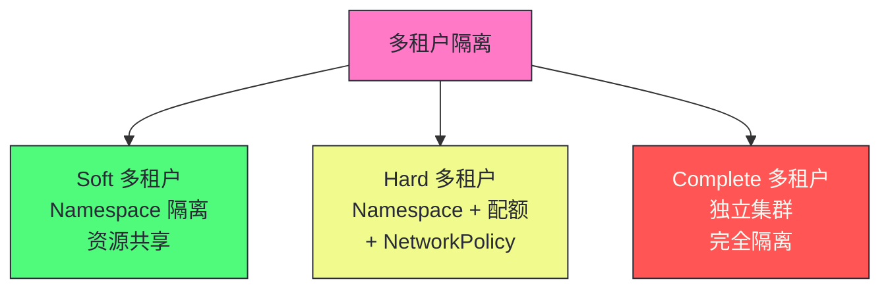

# 16 生产化集群管理：多租户隔离、资源治理与安全加固

> [!abstract] 摘要
> 本文深入 Kubernetes 生产环境的集群管理实践——多租户隔离、资源治理和安全加固。从"理解 K8s"到"用好 K8s"的关键转变。文章首先讲透多租户的三个隔离层次——Soft（Namespace 隔离，资源共享）、Hard（Namespace + 资源配额 + NetworkPolicy）、Complete（独立集群）。然后深入资源治理——ResourceQuota（Namespace 级配额）、LimitRange（Pod 级资源限制）、PriorityClass（优先级调度）、PodDisruptionBudget（驱逐保护）。讲透为什么没有资源限制的集群终将崩溃——一个 Pod 可能耗尽节点资源导致所有 Pod 被驱逐。之后讨论安全加固——Pod Security Standards、ServiceAccount 最小权限、Secret 加密、审计日志、网络隔离。然后讨论集群的容量规划——如何根据业务需求规划节点数和资源。最后讨论集群的升级策略——滚动升级、版本兼容性、回滚方案。核心认知：生产化集群管理的核心是"治理"——通过配额、限制、策略防止"坏行为"破坏集群稳定性，而非事后救火。

---

## 第 1 章 多租户隔离模型

### 1.1 三个隔离层次



| 层次 | 隔离方式 | 隔离强度 | 成本 | 适用场景 |
|------|---------|---------|------|---------|
| **Soft** | Namespace | 弱 | 低 | 内部团队共享 |
| **Hard** | Namespace + 配额 + NetworkPolicy | 中 | 中 | 多团队/多项目 |
| **Complete** | 独立集群 | 强 | 高 | 强隔离需求（合规） |

### 1.2 Namespace 隔离的局限

Namespace 提供**逻辑隔离**，不是物理隔离：

| 维度 | Namespace 隔离 | 不隔离的内容 |
|------|--------------|------------|
| **资源名** | ✓ 同 Namespace 内唯一 | 跨 Namespace 可同名 |
| **RBAC** | ✓ 可按 Namespace 授权 | - |
| **ResourceQuota** | ✓ 按 Namespace 配额 | - |
| **网络** | ✗ 默认不隔离 | Pod 间可跨 Namespace 通信 |
| **节点** | ✗ 不隔离 | 同节点可运行不同 Namespace Pod |
| **内核** | ✗ 不隔离 | 共享内核（非容器逃逸级隔离） |

> [!warning] 生产避坑：Namespace 隔离不等于安全隔离
> Namespace 是逻辑隔离——不是安全边界。同集群不同 Namespace 的 Pod 默认可以互相通信（除非配置 NetworkPolicy）。同节点可能运行不同 Namespace 的 Pod（共享内核）。对于强隔离需求（如多租户 SaaS、合规要求），用独立集群而非 Namespace。Namespace 适合"可信租户"的软隔离——如内部团队。

---

## 第 2 章 资源治理

### 2.1 ResourceQuota：Namespace 级配额

```yaml
apiVersion: v1
kind: ResourceQuota
metadata:
  name: team-a-quota
  namespace: team-a
spec:
  hard:
    requests.cpu: "100"
    requests.memory: "200Gi"
    limits.cpu: "200"
    limits.memory: "400Gi"
    pods: "50"
    services.loadbalancers: "2"
    persistentvolumeclaims: "20"
```

| 配额维度 | 说明 |
|---------|------|
| **CPU/内存** | requests 和 limits 的总量上限 |
| **Pod 数** | Namespace 内最大 Pod 数 |
| **Service 数** | 各类型 Service 数量上限 |
| **PVC 数** | 持久化卷声明数量上限 |
| **ConfigMap/Secret 数** | 配置和密钥数量上限 |

### 2.2 LimitRange：Pod 级资源限制

```yaml
apiVersion: v1
kind: LimitRange
metadata:
  name: default-limits
  namespace: team-a
spec:
  limits:
    - type: Container
      default:          # 默认 limits（未设置时注入）
        cpu: 500m
        memory: 512Mi
      defaultRequest:   # 默认 requests
        cpu: 100m
        memory: 128Mi
      max:              # 最大 limits
        cpu: 4
        memory: 8Gi
      min:              # 最小 requests
        cpu: 50m
        memory: 64Mi
```

> [!info] 核心概念：没有资源限制的集群终将崩溃
> 如果 Pod 不设置 resources.limits，一个 Pod 可能消耗整个节点的资源——导致同节点其他 Pod 被驱逐或 OOMKilled。LimitRange 为没有显式设置限制的 Pod 注入默认值，并限制最大/最小值。生产环境必须配置 LimitRange——这是防止"坏邻居"破坏集群稳定性的基础。没有资源治理的集群不是生产就绪的。

### 2.3 PriorityClass：优先级调度

```yaml
apiVersion: scheduling.k8s.io/v1
kind: PriorityClass
metadata:
  name: production
value: 1000
globalDefault: false
description: "生产环境 Pod"
```

### 2.4 PodDisruptionBudget：驱逐保护

```yaml
apiVersion: policy/v1
kind: PodDisruptionBudget
metadata:
  name: web-pdb
spec:
  minAvailable: 2  # 或 maxUnavailable: 1
  selector:
    matchLabels:
      app: web
```

| 参数 | 说明 |
|------|------|
| **minAvailable** | 至少保持多少 Pod 可用 |
| **maxUnavailable** | 最多允许多少 Pod 不可用 |

> [!warning] 生产避坑：PDB 只对自愿驱逐有效
> PDB 保护 Pod 不被自愿驱逐（kubectl drain、cluster autoscaler）过度驱逐——但非自愿驱逐（节点故障）不受 PDB 限制。节点故障时所有 Pod 丢失，PDB 无法阻止。PDB 的价值在于"维护时保证最小可用副本"——节点 drain 时 PDB 确保不驱逐太多 Pod。

---

## 第 3 章 安全加固

### 3.1 安全加固清单

| 维度 | 措施 | 说明 |
|------|------|------|
| **Pod Security** | Restricted 级别 | 禁止特权、non-root、readOnly FS |
| **RBAC** | 最小权限 | 避免 cluster-admin，按 Namespace 授权 |
| **ServiceAccount** | 每应用独立 | 不共享 default SA |
| **NetworkPolicy** | 默认拒绝 | 限制 Pod 间通信 |
| **Secret 加密** | etcd 加密 | API Server 加密 Secret 数据 |
| **审计日志** | Metadata 级别 | 记录关键操作 |
| **镜像安全** | 扫描 + 签名 | 禁止 latest 标签 |
| **API Server** | 关闭匿名访问 | 禁用不安全端口 |

### 3.2 Namespace 的安全基线

```yaml
apiVersion: v1
kind: Namespace
metadata:
  name: production
  labels:
    # Pod Security Standards
    pod-security.kubernetes.io/enforce: restricted
    pod-security.kubernetes.io/audit: restricted
    pod-security.kubernetes.io/warn: restricted
---
apiVersion: networking.k8s.io/v1
kind: NetworkPolicy
metadata:
  name: default-deny
  namespace: production
spec:
  podSelector: {}
  policyTypes:
    - Ingress
    - Egress
  # 默认拒绝所有入站和出站，按需放行
```

---

## 第 4 章 容量规划

### 4.1 资源规划方法

```
业务需求 → 应用资源需求 → Pod 数量 → 节点资源 → 节点数
```

| 步骤 | 计算 |
|------|------|
| **应用资源** | CPU/内存 requests |
| **Pod 数量** | 副本数 × 应用数 |
| **总资源需求** | Pod 数 × 单 Pod requests |
| **节点资源** | 单节点可用资源（减去系统开销） |
| **节点数** | 总资源 / 节点资源 + 冗余 |

### 4.2 冗余规划

| 冗余类型 | 建议值 | 说明 |
|---------|--------|------|
| **节点冗余** | N+1 或 N+2 | 容忍 1-2 节点故障 |
| **资源缓冲** | 20-30% | 应对突发流量 |
| **IP 预留** | Pod CIDR 充足 | 避免 IP 耗尽 |

---

## 第 5 章 集群升级策略

### 5.1 滚动升级

K8s 版本升级遵循"一次升级一个小版本"原则——1.28 → 1.29 → 1.30，不跳版本。

| 步骤 | 操作 |
|------|------|
| **1. 预检查** | 检查 API 废弃、依赖兼容性 |
| **2. 升级 etcd** | 先升级 etcd（如有需要） |
| **3. 升级控制平面** | 逐个升级 master 节点 |
| **4. 升级 kubelet** | 逐个升级 worker 节点 |
| **5. 验证** | 检查所有组件正常运行 |

### 5.2 版本兼容性

K8s 的版本偏差策略：

| 组件 | 允许偏差 |
|------|---------|
| **kube-apiserver** | 最高版本 |
| **kube-controller-manager/scheduler** | 最多低 1 个小版本 |
| **kubelet** | 最多低 3 个小版本 |
| **kubectl** | 最多高/低 1 个小版本 |

> [!warning] 生产避坑：升级前检查 API 废弃
> 每个 K8s 版本会废弃一些旧 API（如 v1.22 废弃了 batch/v1beta1 CronJob）。升级前用 `kubectl get --raw /apis` 检查是否有客户端使用即将移除的 API。生产环境升级前在测试环境验证——特别是有自定义 Controller/Operator 的场景，它们可能使用旧 API。

---

## 总结

生产化集群管理的核心知识可以归纳为以下主线：

1. **多租户三个隔离层次**。Soft（Namespace）、Hard（Namespace+配额+NetworkPolicy）、Complete（独立集群）。根据隔离需求选择。

2. **Namespace 是逻辑隔离，非安全边界**。默认不隔离网络，共享内核。强隔离用独立集群。

3. **ResourceQuota 限制 Namespace 资源总量**。CPU/内存/Pod 数/Service 数等配额。防止租户耗尽集群资源。

4. **LimitRange 限制 Pod 资源**。为无限制 Pod 注入默认值，限制最大/最小。没有资源限制的集群终将崩溃。

5. **PriorityClass 实现优先级调度**。关键服务高优先级，非关键低优先级。高优先级可抢占低优先级。

6. **PDB 保护自愿驱逐**。确保维护时最小可用副本。非自愿驱逐（节点故障）不受 PDB 限制。

7. **安全加固清单**。Pod Security Restricted、RBAC 最小权限、独立 SA、NetworkPolicy、Secret 加密、审计日志、镜像扫描。

8. **容量规划需考虑冗余**。节点 N+1/N+2、资源缓冲 20-30%、IP 预留充足。

9. **升级一次一个小版本**。不跳版本。升级前检查 API 废弃和兼容性。

10. **K8s 版本偏差策略**。kubelet 最多低 3 个小版本，允许滚动升级时 kubelet 暂时落后。

> [!info] 专栏导航
> 本文是 [[00 专栏导览|Kubernetes 架构深度剖析专栏]] 的第 16 篇，深入生产化集群管理。下一篇 [[17 集群可观测性与故障排查：监控、日志、追踪与诊断]] 将讨论 K8s 的可观测性体系和故障排查方法。

---

## 延伸思考

1. **你的集群是否配置了 ResourceQuota？** 没有配额的 Namespace，一个租户可能耗尽集群资源。为每个 Namespace 配置 ResourceQuota。

2. **你的 Pod 是否设置了 resources.limits？** 没有限制的 Pod 可能消耗整个节点资源。用 LimitRange 为无限制 Pod 注入默认值。

3. **你的多租户隔离是否足够？** 如果租户间需要网络隔离，配置 NetworkPolicy。如果需要强隔离，用独立集群而非 Namespace。

4. **你的集群升级是否检查了 API 废弃？** 升级前用 `kubectl get --raw /apis` 检查即将移除的 API。测试环境先验证。

5. **你的关键服务是否配置了 PDB？** 维护时 PDB 确保最小可用副本。没有 PDB 的服务在节点 drain 时可能全部不可用。

---

## 参考资料

1. 多租户指南：https://kubernetes.io/docs/concepts/security/multi-tenancy/
2. ResourceQuota：https://kubernetes.io/docs/concepts/policy/resource-quotas/
3. LimitRange：https://kubernetes.io/docs/concepts/policy/limit-range/
4. PodDisruptionBudget：https://kubernetes.io/docs/concepts/workloads/pods/disruptions/
5. 集群安全检查清单：https://kubernetes.io/docs/concepts/security/security-checklist/
6. 升级 K8s：https://kubernetes.io/docs/tasks/administer-cluster/cluster-management/

---

> [!note] 思考题
> 1. ResourceQuota 限制 Namespace 的资源总量——如果 Namespace 的配额已满，新 Pod 创建会被拒绝。但如果已有 Pod 修改了 resources.requests 超过配额，会发生什么？ResourceQuota 是"创建时检查"还是"运行时检查"？
> 2. PodDisruptionBudget 的 minAvailable=2 在节点 drain 时确保至少 2 个 Pod 可用。但如果集群只有 3 个节点且每节点 1 个 Pod，drain 一个节点后只剩 2 个 Pod——PDB 允许吗？如果允许，drain 第二个节点时呢？
> 3. K8s 升级时 kubelet 最多低 3 个小版本——这意味着可以先升级 API Server 到 1.30，kubelet 保持 1.27。这个偏差策略的工程意义是什么？为什么不要求所有组件同时升级？
