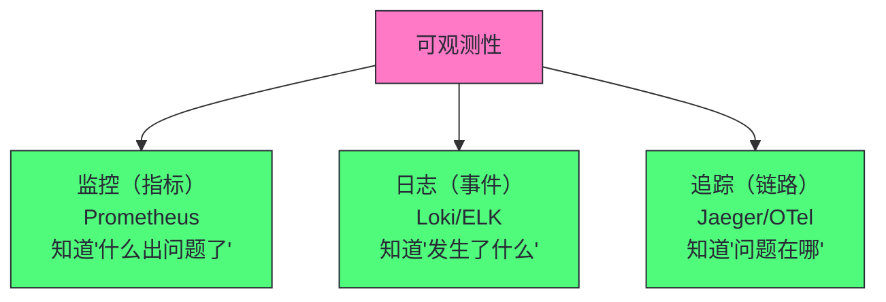
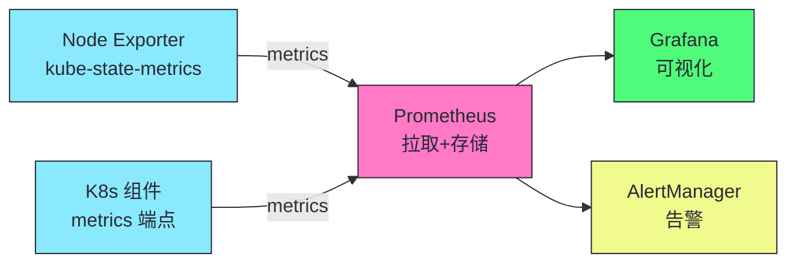
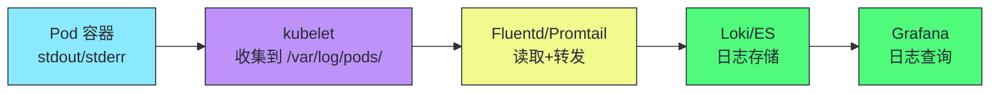
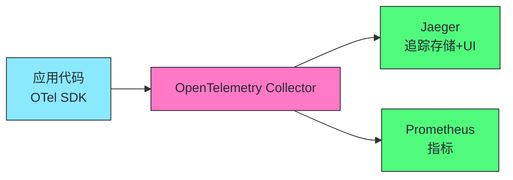

# 17 集群可观测性与故障排查：监控、日志、追踪与诊断

> [!abstract] 摘要
> 本文深入 Kubernetes 集群的可观测性体系——监控、日志、追踪三大支柱，以及故障排查方法。可观测性是生产就绪的基础——没有可观测性的集群是"黑箱"，故障时无从排查。文章首先讲透可观测性三大支柱的关系——监控（指标，知道"什么出问题了"）、日志（事件，知道"发生了什么"）、追踪（请求链路，知道"问题在哪"）。然后深入监控体系——Prometheus（指标采集）+ Grafana（可视化）+ AlertManager（告警），K8s 核心组件的监控指标（API Server/etcd/kubelet/scheduler），以及四类黄金指标（延迟/流量/错误/饱和度）。讲透日志体系——Loki/Fluentd/ELK 的日志收集，K8s Pod 日志的 stdout/stderr 模型，以及结构化日志的价值。之后讨论分布式追踪——Jaeger/Zipkin/OpenTelemetry，以及 K8s 中追踪的挑战（跨 Pod 传播 trace context）。然后系统讲解故障排查方法——Pod 级别、节点级别、集群级别的问题诊断流程。核心认知：可观测性不是"装个 Prometheus 就完了"——它是覆盖指标、日志、追踪的完整体系，加上清晰的故障排查流程。

---

## 第 1 章 可观测性三大支柱



| 支柱 | 回答的问题 | 工具 | 数据特征 |
|------|----------|------|---------|
| **监控** | 什么出问题了？ | Prometheus + Grafana | 时序数值 |
| **日志** | 发生了什么？ | Loki/ELK + Fluentd | 事件文本 |
| **追踪** | 问题在哪？ | Jaeger + OpenTelemetry | 请求链路 |

> [!info] 核心概念：三大支柱互补而非替代
> 监控告诉你"延迟升高了"，日志告诉你"某个 Pod 报错了"，追踪告诉你"请求经过 A→B→C，在 B 超时"。三者缺一不可——只有监控不知道根因，只有日志不知道影响范围，只有追踪不知道系统状态。完整的可观测性体系覆盖三者，加上告警和故障排查流程。

---

## 第 2 章 监控体系：Prometheus + Grafana

### 2.1 Prometheus 架构



### 2.2 K8s 核心组件监控指标

| 组件 | 关键指标 | 告警阈值 |
|------|---------|---------|
| **API Server** | apiserver_request_duration_seconds | P99 >1s |
| **etcd** | etcd_disk_wal_fsync_duration_seconds | P99 >10ms |
| **kubelet** | kubelet_running_pod_count | 接近节点上限 |
| **Scheduler** | scheduler_e2e_scheduling_duration_seconds | P99 >1s |
| **Pod** | container_cpu_usage_seconds_total | 接近 limit |

### 2.3 四类黄金指标

| 指标 | 说明 | PromQL 示例 |
|------|------|------------|
| **延迟** | 请求响应时间 | `histogram_quantile(0.99, ...)` |
| **流量** | 请求量 | `rate(http_requests_total[5m])` |
| **错误** | 错误率 | `rate(http_errors_total[5m])` |
| **饱和度** | 资源使用率 | `cpu_usage / cpu_limit` |

> [!warning] 生产避坑：告警必须有 runbook
> 每个告警必须有对应的 runbook（操作手册）——告诉值班人员"这个告警意味着什么"、"如何排查"、"如何恢复"。没有 runbook 的告警只是噪音——值班人员不知道如何处理，只能忽略。告警 + runbook 才是完整的可操作性。

---

## 第 3 章 日志体系

### 3.1 K8s 日志模型

K8s Pod 的日志通过 stdout/stderr 输出——kubelet 收集到 `/var/log/pods/`，日志收集工具（Fluentd/Promtail）读取并转发。



### 3.2 日志收集方案对比

| 方案 | 机制 | 优势 | 劣势 |
|------|------|------|------|
| **DaemonSet（Fluentd）** | 每节点一个，读 /var/log/pods | 资源开销固定 | 日志量大时压力大 |
| **Sidecar** | 每 Pod 一个 sidecar | 隔离性好 | 资源浪费 |
| **Node Agent（Promtail）** | 类似 DaemonSet | 与 Loki 集成好 | - |

### 3.3 结构化日志的价值

```json
// 非结构化日志
2026-07-17 10:00:00 GET /api/users 200 50ms

// 结构化日志（JSON）
{"timestamp":"2026-07-17T10:00:00Z","method":"GET","path":"/api/users","status":200,"duration_ms":50,"trace_id":"abc123"}
```

> [!info] 核心概念：结构化日志支持字段查询
> 结构化日志（JSON）支持按字段查询——"查找所有 status=500 的请求"、"按 trace_id 关联日志"。非结构化日志只能全文搜索。K8s 1.19+ 的组件已支持结构化日志（JSON 格式）。生产环境应用应输出结构化日志，包含 trace_id 用于关联追踪。

---

## 第 4 章 分布式追踪

### 4.1 OpenTelemetry



### 4.2 K8s 中追踪的挑战

| 挑战 | 说明 |
|------|------|
| **跨 Pod 传播 context** | HTTP header 传播 trace context |
| **Sidecar 不可见** | Service Mesh 的 sidecar 产生 span |
| **异步消息** | 消息队列的 trace context 传播 |
| **数据库调用** | 数据库驱动的 trace 支持 |

---

## 第 5 章 故障排查方法

### 5.1 Pod 级别排查

```bash
# 1. 查看 Pod 状态
kubectl get pod <name> -o wide

# 2. 查看 Pod 详情（Events）
kubectl describe pod <name>

# 3. 查看容器日志
kubectl logs <name>
kubectl logs <name> --previous  # 上一次崩溃的日志

# 4. 进入容器
kubectl exec -it <name> -- /bin/sh

# 5. 查看容器状态
kubectl get pod <name> -o jsonpath='{.status.containerStatuses}'
```

### 5.2 节点级别排查

```bash
# 1. 节点状态
kubectl describe node <name>

# 2. 节点上的 Pod
kubectl get pods --field-selector spec.nodeName=<name> --all-namespaces

# 3. 节点资源使用
kubectl top node <name>

# 4. SSH 到节点检查
systemctl status kubelet
journalctl -u kubelet
```

### 5.3 集群级别排查

| 问题 | 排查方法 |
|------|---------|
| **API Server 慢** | 检查 max-requests-inflight、etcd 延迟 |
| **Pod 大量 Pending** | 检查资源是否充足、调度器是否正常 |
| **节点大量 NotReady** | 检查网络、kubelet、节点资源 |
| **etcd 不稳定** | 检查磁盘 IOPS、Leader 切换 |

> [!info] 核心概念：故障排查从最具体到最通用
> 故障排查的正确顺序：Pod 级别（describe/logs/exec）→ 节点级别（node status/top）→ 集群级别（API Server/etcd/scheduler）。先定位"哪个 Pod/节点有问题"，再查"为什么"。不要一开始就查集群级别的日志——大多数问题是 Pod 或节点级别的。

---

## 总结

集群可观测性与故障排查的核心知识可以归纳为以下主线：

1. **可观测性三大支柱：监控、日志、追踪**。互补而非替代。监控知道"什么出问题"，日志知道"发生什么"，追踪知道"问题在哪"。

2. **Prometheus + Grafana 是 K8s 监控事实标准**。Prometheus 拉取指标，Grafana 可视化，AlertManager 告警。

3. **四类黄金指标：延迟、流量、错误、饱和度**。覆盖服务的核心健康维度。

4. **告警必须有 runbook**。没有 runbook 的告警只是噪音——值班人员不知道如何处理。

5. **K8s 日志通过 stdout/stderr**。kubelet 收集到 /var/log/pods，Fluentd/Promtail 读取转发。

6. **DaemonSet 日志收集是主流方案**。每节点一个，资源开销固定。Sidecar 方案资源浪费。

7. **结构化日志支持字段查询**。JSON 格式，包含 trace_id 关联追踪。K8s 1.19+ 组件支持结构化日志。

8. **OpenTelemetry 统一指标/日志/追踪**。OTel SDK 采集，Collector 转发到 Jaeger/Prometheus。

9. **K8s 追踪挑战：跨 Pod context 传播**。HTTP header 传播 trace context，Service Mesh sidecar 产生 span。

10. **故障排查从具体到通用**。Pod 级别（describe/logs）→ 节点级别（top/describe）→ 集群级别（API Server/etcd）。

> [!info] 专栏导航
> 本文是 [[00 专栏导览|Kubernetes 架构深度剖析专栏]] 的第 17 篇，深入可观测性和故障排查。下一篇 [[18 弹性伸缩与多集群：HPA/VPA/Cluster Autoscaler 与 KubeFed]] 将讨论 K8s 的弹性伸缩和多集群管理。

---

## 延伸思考

1. **你的集群是否有完整的可观测性？** 检查三大支柱——Prometheus 监控、Loki/ELK 日志、Jaeger 追踪。缺任何一个都是盲区。

2. **你的告警是否有 runbook？** 每个告警对应的排查和恢复步骤。没有 runbook 的告警是噪音。

3. **你的应用日志是否结构化？** JSON 格式 + trace_id。非结构化日志只能全文搜索，难以关联追踪。

4. **你的故障排查是否有标准流程？** 从 Pod 到节点到集群的排查顺序。先定位"哪个有问题"再查"为什么"。

5. **你的 K8s 核心组件是否被监控？** API Server 延迟、etcd fsync、kubelet Pod 数、调度延迟——这些是集群健康的关键指标。

---

## 参考资料

1. Prometheus：https://prometheus.io/docs/
2. Grafana：https://grafana.com/docs/
3. Loki：https://grafana.com/docs/loki/
4. OpenTelemetry：https://opentelemetry.io/docs/
5. K8s 监控：https://kubernetes.io/docs/tasks/debug-application-cluster/resource-usage-monitoring/
6. K8s 故障排查：https://kubernetes.io/docs/tasks/debug/

---

> [!note] 思考题
> 1. Prometheus 用拉取（pull）模式采集指标——它主动访问目标的 /metrics 端点。这与推送（push）模式相比有什么优势和劣势？在 K8s 中 Service Discovery 如何帮助 Prometheus 发现采集目标？
> 2. 结构化日志包含 trace_id 可以关联追踪——但如果应用没有手动传播 trace context（HTTP header），不同服务的日志 trace_id 不同，无法关联。如何确保微服务间的 trace context 传播？Service Mesh（Istio）能自动传播吗？
> 3. 故障排查从 Pod 级别开始——但如果所有 Pod 都正常，而集群整体慢（如 API Server 延迟高），如何排查？哪些指标指向 API Server 本身的问题 vs etcd 的问题？
