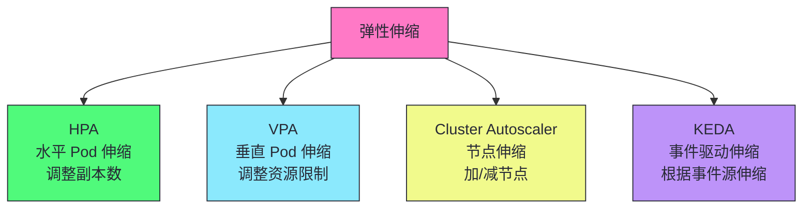
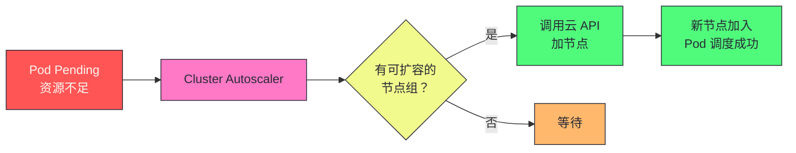
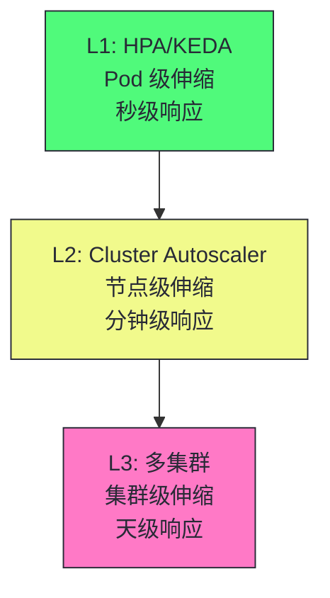

# 18 弹性伸缩与多集群：HPA/VPA/Cluster Autoscaler 与 KubeFed

> [!abstract] 摘要
> 本文是 Kubernetes 架构深度剖析专栏的收官之作，深入 K8s 的弹性伸缩和多集群管理。弹性伸缩是 K8s "可扩展性"核心目标的工程实现——根据负载自动调整资源。文章首先讲透四种弹性伸缩机制：HPA（水平 Pod 伸缩，根据 CPU/内存/自定义指标调整副本数）、VPA（垂直 Pod 伸缩，调整 Pod 资源 requests/limits）、Cluster Autoscaler（节点伸缩，Pod Pending 时自动加节点）、KEDA（事件驱动伸缩，根据 Kafka/Redis/云消息队列等事件源伸缩）。对比四种机制的适用场景和组合使用。然后深入 HPA 的算法——从指标值到副本数的计算公式，以及冷却期的防止震荡机制。之后讨论多集群管理——KubeFed（联邦集群）、Cluster API（集群生命周期管理）、Karmada（多集群调度）的定位和差异。最后讨论多集群的典型架构——多集群服务网格（Istio Multi-Cluster）、跨集群应用分发、多集群容灾。核心认知：弹性伸缩不是"加机器"，而是"在正确的时间加正确的资源"——HPA 应对短期流量波动，Cluster Autoscaler 应对长期容量增长，多集群应对地理分布和容灾。

---

## 第 1 章 四种弹性伸缩机制



### 1.1 四种机制的对比

| 机制 | 伸缩对象 | 触发条件 | 适用场景 |
|------|---------|---------|---------|
| **HPA** | Pod 副本数 | CPU/内存/自定义指标 | Web 服务、流量波动 |
| **VPA** | Pod 资源限制 | 历史资源使用 | 资源配不准的应用 |
| **Cluster Autoscaler** | 节点数 | Pod Pending | 集群容量不足 |
| **KEDA** | Pod 副本数 | 事件源（Kafka/Redis 等） | 事件驱动应用 |

---

## 第 2 章 HPA：水平 Pod 伸缩

### 2.1 HPA 的工作原理

```yaml
apiVersion: autoscaling/v2
kind: HorizontalPodAutoscaler
metadata:
  name: web-hpa
spec:
  scaleTargetRef:
    apiVersion: apps/v1
    kind: Deployment
    name: web
  minReplicas: 3
  maxReplicas: 50
  metrics:
    - type: Resource
      resource:
        name: cpu
        target:
          type: Utilization
          averageUtilization: 70  # 目标 CPU 使用率 70%
```

### 2.2 HPA 的副本数计算公式

```
期望副本数 = ceil(当前副本数 × (当前指标值 / 目标指标值))
```

例如：当前 5 副本，CPU 使用率 90%，目标 70%：

```
期望副本数 = ceil(5 × (90 / 70)) = ceil(6.43) = 7
```

### 2.3 HPA 的冷却期

| 参数 | 默认值 | 说明 |
|------|--------|------|
| `--horizontal-pod-autoscaler-downscale-stabilization` | 5 分钟 | 缩容冷却期，防止震荡 |
| `--horizontal-pod-autoscaler-sync-period` | 15 秒 | HPA 检查间隔 |

> [!warning] 生产避坑：HPA 缩容冷却期防止震荡
> 没有冷却期时，HPA 可能在流量波动时频繁扩缩容——扩容后流量降低立即缩容，缩容后流量升高又扩容。冷却期（默认 5 分钟）确保缩容后至少 5 分钟不再缩容，防止震荡。但这也意味着流量降低后需要 5 分钟才缩容——对于成本敏感场景可能太慢。根据业务调整冷却期。

---

## 第 3 章 VPA：垂直 Pod 伸缩

### 3.1 VPA 的三种模式

| 模式 | 说明 |
|------|------|
| **Auto** | 自动调整 requests，需要重启 Pod |
| **Recommender** | 只推荐资源值，不自动调整 |
| **Initial** | 创建 Pod 时设置 requests，不修改已运行的 |

### 3.2 VPA 的局限

> [!warning] 生产避坑：VPA Auto 模式需要重启 Pod
> VPA 调整 Pod 的 resources.requests 需要重建 Pod——K8s 不支持修改运行中容器的资源限制。这意味着 VPA Auto 模式会驱逐并重建 Pod，可能导致服务中断。生产环境慎用 VPA Auto——用 Recommender 模式获取建议，手动调整。HPA 和 VPA 不能同时用于同一资源的 CPU/内存（冲突）。

---

## 第 4 章 Cluster Autoscaler：节点伸缩

### 4.1 工作原理



### 4.2 缩容机制

Cluster Autoscaler 也会缩容——标记低利用率节点上的 Pod 驱逐，然后终止节点。

| 缩容条件 | 说明 |
|---------|------|
| **节点利用率低** | CPU/内存使用低于阈值 |
| **Pod 可迁移** | 节点上的 Pod 没有强约束（如 local PV） |
| **PDB 允许** | PodDisruptionBudget 不阻止驱逐 |

---

## 第 5 章 KEDA：事件驱动伸缩

### 5.1 KEDA 的优势

```yaml
apiVersion: keda.sh/v1alpha1
kind: ScaledObject
metadata:
  name: kafka-scaler
spec:
  scaleTargetRef:
    name: kafka-consumer
  minReplicaCount: 0  # 可缩到 0
  maxReplicaCount: 100
  triggers:
    - type: kafka
      metadata:
        topic: orders
        consumerGroup: order-processor
        lagThreshold: "100"  # 消费延迟超过 100 时扩容
```

| 特性 | HPA | KEDA |
|------|-----|------|
| **触发源** | CPU/内存/自定义指标 | 50+ 事件源（Kafka/Redis/云消息队列等） |
| **缩到 0** | 不支持 | 支持 |
| **复杂度** | 低 | 中 |

> [!info] 核心概念：KEDA 可以缩到 0
> HPA 的 minReplicas 最少为 1——不能缩到 0。KEDA 支持缩到 0——当没有事件时完全不运行 Pod，有事件时自动启动。这适合事件驱动的应用——如 Kafka 消费者，无消息时不需运行。KEDA 是 HPA 的超集——它用 HPA 做实际伸缩，但扩展了触发源和缩到 0 的能力。

---

## 第 6 章 多集群管理

### 6.1 多集群的动机

| 动机 | 说明 |
|------|------|
| **地理分布** | 多地域部署降低延迟 |
| **容灾** | 一个集群故障不影响业务 |
| **多租户强隔离** | 独立集群完全隔离 |
| **混合云** | 跨云厂商部署 |
| **规模扩展** | 单集群规模上限 |

### 6.2 多集群管理工具

| 工具 | 定位 | 特点 |
|------|------|------|
| **KubeFed** | 联邦集群 | 已停止维护，不推荐 |
| **Cluster API** | 集群生命周期 | 声明式创建/管理集群 |
| **Karmada** | 多集群调度 | 跨集群应用分发和调度 |
| **Argo CD** | GitOps 多集群 | 通过 kubeconfig 部署到多集群 |
| **Istio Multi-Cluster** | 多集群服务网格 | 跨集群服务发现和通信 |

### 6.3 多集群架构模式

```mermaid
graph TD
    Pattern["多集群架构"] --> Hub["Hub-Spoke<br/>中心管理多集群"]
    Pattern --> Mesh["多集群 Service Mesh<br/>跨集群服务发现"]
    Pattern := GitOps["GitOps 多集群<br/>统一配置分发"]

    classDef pattern fill:#ff79c6,stroke:#282a36,color:#282a36
    classDef hub fill:#50fa7b,stroke:#282a36,color:#282a36
    classDef mesh fill:#8be9fd,stroke:#282a36,color:#282a36
    classDef gitops fill:#f1fa8c,stroke:#282a36,color:#282a36
    class Pattern pattern
    class Hub hub
    class Mesh mesh
    class GitOps gitops
```

> [!info] 核心概念：多集群是 K8s 的未来方向
> 单集群规模有上限——etcd 性能、API Server 吞吐量、网络规模。大型组织趋向多集群——按地域/业务/团队分集群。多集群管理的挑战：跨集群服务发现、跨集群应用分发、跨集群容灾。Karmada 和 Argo CD 是当前主流的多集群管理方案。KubeFed 已停止维护，不推荐新项目使用。

---

## 第 7 章 弹性伸缩的组合使用

### 7.1 HPA + Cluster Autoscaler

```
流量增加 → HPA 扩容 Pod → 节点资源不足 → Pod Pending → Cluster Autoscaler 加节点 → Pod 调度成功
```

### 7.2 KEDA + Cluster Autoscaler

```
Kafka 消息积压 → KEDA 扩容消费者 → 节点不足 → Cluster Autoscaler 加节点
```

### 7.3 弹性伸缩的层级



> [!info] 核心概念：弹性伸缩是分层的
> Pod 级伸缩（HPA/KEDA）秒级响应短期波动。节点级伸缩（Cluster Autoscaler）分钟级响应容量增长。集群级伸缩（多集群）天级响应地理扩展和容灾。三层互补——短期波动用 HPA，长期增长用 Cluster Autoscaler，地理扩展用多集群。不要用单一机制应对所有场景——层级化弹性是生产最佳实践。

---

## 总结：专栏的完整知识体系

弹性伸缩与多集群的核心知识可以归纳为以下主线：

1. **四种弹性伸缩机制**。HPA（水平 Pod 伸缩）、VPA（垂直 Pod 伸缩）、Cluster Autoscaler（节点伸缩）、KEDA（事件驱动伸缩）。

2. **HPA 根据 CPU/内存/自定义指标调整副本数**。公式：期望副本数 = ceil(当前 × 当前指标/目标指标)。冷却期防止震荡。

3. **VPA Auto 模式需要重启 Pod**。生产环境慎用——用 Recommender 模式获取建议。HPA 和 VPA 不能同时用于同资源的 CPU/内存。

4. **Cluster Autoscaler 在 Pod Pending 时加节点**。缩容标记低利用率节点驱逐并终止。PDB 保护自愿驱逐。

5. **KEDA 支持 50+ 事件源和缩到 0**。Kafka/Redis/云消息队列等。无事件时不运行 Pod，有事件时自动启动。

6. **弹性伸缩是分层的**。HPA 秒级响应波动，Cluster Autoscaler 分钟级响应容量，多集群天级响应地理扩展。

7. **多集群动机：地理分布、容灾、强隔离、混合云、规模扩展**。

8. **Karmada 和 Argo CD 是当前主流多集群管理方案**。KubeFed 已停止维护。

9. **多集群架构模式：Hub-Spoke、多集群 Service Mesh、GitOps 多集群**。

10. **多集群是 K8s 的未来方向**。单集群规模有上限，大型组织趋向多集群。

> [!info] 专栏结语
> 本专栏从"K8s 的设计哲学"出发，经过声明式 API、架构全景、API Server、认证授权、List-Watch、etcd、ResourceVersion、控制器、StatefulSet、Scheduler、CRD/Operator、kubelet、Service/kube-proxy、CNI、生产化集群管理、可观测性，最终在"弹性伸缩与多集群"画上句号。18 篇文章形成了一个完整的知识体系——从设计哲学到组件深度剖析到生产实战。希望这个专栏能帮助你建立对 Kubernetes 架构的完整认知，并在实践中做出更好的工程决策。K8s 的复杂性来自于"在一个系统内同时解决调度、自愈、服务发现、滚动更新、配置管理、扩展性等多个问题"——理解每个组件的设计原理和交互方式，才能驾驭这种复杂性。

> [!info] 专栏导航
> 本文是 [[00 专栏导览|Kubernetes 架构深度剖析专栏]] 的第 18 篇，也是收官之作。建议从 [[00 专栏导览]] 开始顺序阅读，建立完整的知识体系。

---

## 延伸思考

1. **你的服务是否用了 HPA？** Web 服务用 HPA 根据 CPU/自定义指标自动伸缩。没有 HPA 的服务在流量波动时需手动扩容。

2. **你的集群是否用了 Cluster Autoscaler？** Pod Pending 时自动加节点。没有 CA 的集群在资源不足时需手动加节点。

3. **你的事件驱动应用是否用了 KEDA？** Kafka/Redis 消费者用 KEDA 根据消费延迟伸缩，支持缩到 0。

4. **你的 VPA 是否用了 Auto 模式？** Auto 模式需要重启 Pod，可能导致服务中断。生产环境用 Recommender 模式。

5. **你的多集群是否有统一管理？** Karmada/Argo CD 统一管理多集群的应用分发。没有统一管理的多集群运维成本高。

6. **你的弹性伸缩是否分层？** HPA 应对短期波动，Cluster Autoscaler 应对长期容量，多集群应对地理扩展。单一机制不足以应对所有场景。

7. **你的 HPA 冷却期是否合理？** 默认 5 分钟防止震荡。成本敏感场景可缩短，稳定性优先场景可延长。

8. **你的多集群容灾是否演练过？** 多集群容灾需要定期演练——切换流量到备用集群，验证服务正常。没有演练过的容灾方案可能在真故障时失效。

---

## 参考资料

1. HPA：https://kubernetes.io/docs/tasks/run-application/horizontal-pod-autoscale/
2. VPA：https://github.com/kubernetes/autoscaler/tree/master/vertical-pod-autoscaler
3. Cluster Autoscaler：https://github.com/kubernetes/autoscaler/tree/master/cluster-autoscaler
4. KEDA：https://keda.sh/
5. Karmada：https://karmada.io/
6. Cluster API：https://cluster-api.sigs.k8s.io/
7. Argo CD：https://argo-cd.readthedocs.io/
8. Istio Multi-Cluster：https://istio.io/latest/docs/setup/install/multicluster/

---

> [!note] 思考题
> 1. HPA 根据 CPU 使用率伸缩——如果 Pod 的 CPU limit 设得很低（如 100m），HPA 会在 CPU 接近 100m 时扩容。但如果应用实际需要 500m 才能正常运行，扩容更多 Pod 仍然每个都 CPU 不足。HPA 与 CPU limit 的关系如何影响伸缩效果？
> 2. Cluster Autoscaler 在 Pod Pending 时加节点——但加节点需要 1-5 分钟（云厂商启动 EC2/VM 的时间）。在此期间 Pod 一直 Pending。如何减少这种延迟（如预留节点、Spot Fleet）？
> 3. 多集群容灾——如果一个集群故障，流量切换到备用集群。但 Pod IP 变化，DNS 需要更新。如何确保客户端快速感知集群切换（如使用全局 LB、DNS TTL 调整）？
