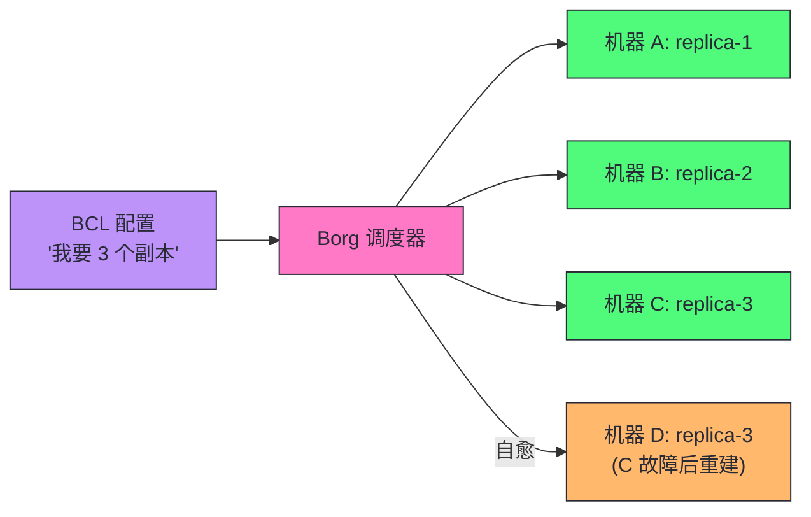
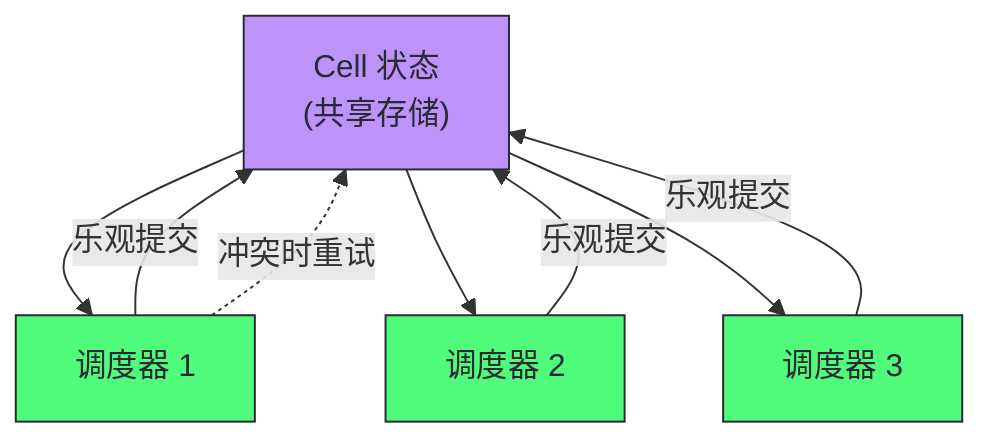
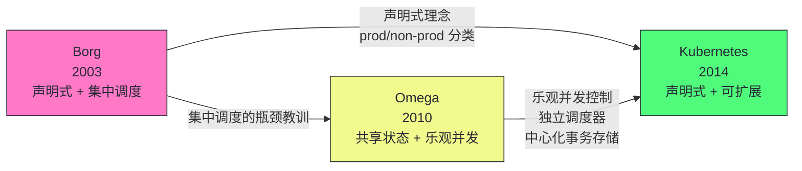
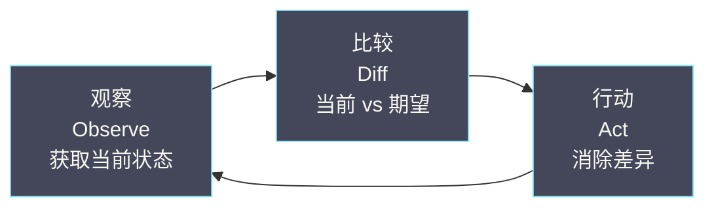
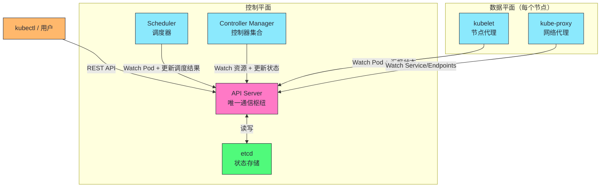
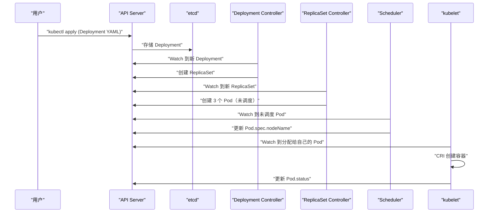
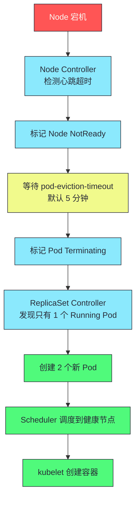

# 01 Kubernetes 的设计哲学：从 Borg 到云原生操作系统

**摘要：**
Kubernetes 并非凭空出现的工程产物，它脱胎于 Google 内部运行了十五年的集群管理系统 Borg，又汲取了 Borg 的继任者 Omega 在调度架构上的教训，最终在 2014 年以开源姿态重新设计为一套面向外部用户的容器编排系统。本文从 Google 内部的集群管理演进脉络出发，剖析三代系统（Borg → Omega → Kubernetes）的设计差异与工程教训，进而系统梳理 K8s 的六大核心设计原则——声明式 API、控制器模式、面向终态协调、Level-triggered 而非 Edge-triggered、松耦合的 Hub-and-Spoke 架构、可扩展性优先——并说明这些原则如何直接决定每一个组件的行为方式与每一个 API 的字段语义。最后讨论 K8s 的"非目标"，即它刻意不做什么以及为何不做。理解这些设计哲学，是深入学习后续所有组件实现原理的基础，核心认知在于：K8s 的成功并非因为它功能多，而是因为它克制——只做编排原语，把上层能力留给生态。

---

## 第 1 章 集群管理的三代演进

### 1.1 问题的起点

在讨论 Borg 与 Kubernetes 之前，不妨先回到问题本身。Google 在 2000 年代初面临一个前所未有的工程挑战：如何在数万台机器上高效运行数十万个应用。这个挑战的几个核心维度，与单机时代的运维假设已经完全断裂。

| 维度 | 单机时代的假设 | Google 规模的现实 |
|------|-------------|----------------|
| **机器数量** | 1 台 | 数万台 |
| **应用数量** | 几个 | 数十万 |
| **故障频率** | 月级 | 秒级（每天都有机器故障） |
| **部署速度** | 天级 | 分钟级 |
| **资源利用率** | 30-50%（单应用独占） | 需要提升到 60-80% |

单机时代的运维模式——SSH 到机器上手动启动进程——在这个规模下完全失效。笔者不妨换一个角度来理解这个失效的本质：当故障从"月级事件"变为"秒级常驻"时，人工介入的响应速度已经远远跟不上故障发生的频率，系统必须具备自我恢复的能力，否则运维团队会被淹没在告警洪流里。这就是集群管理系统诞生的动机，Google 的解决方案经历了三代演进：Borg → Omega → Kubernetes。

### 1.2 第一代：Borg（2003 至今）

Borg 是 Google 内部的集群管理系统，运行了超过十五年，管理着 Google 几乎所有的生产工作负载——从搜索引擎、Gmail 到 YouTube。2015 年 Google 发表了 Borg 论文（*Large-scale cluster management at Google with Borg*，EuroSys'15），首次向外界揭示了它的核心设计。这篇论文的发表本身就是一件值得玩味的事：一个运行了十二年的生产系统才公开其设计，说明 Google 在集群管理领域积累了远超外界想象的工程经验，而这些经验恰恰是 Kubernetes 得以诞生的土壤。

Borg 的几个关键设计思想直接影响了 Kubernetes，值得逐一剖析。

**将整个数据中心视为一台计算机**

用户不需要关心应用运行在哪台物理机上，只需要告诉 Borg "我需要 2 核 CPU、4GB 内存来运行这个二进制文件"，Borg 负责找到合适的机器并启动它。这个思想直接演变为 K8s 的 Pod 调度模型——用户提交 Pod 声明，Scheduler 决定节点。但这个抽象的代价并非零：它要求 Borg 隐藏掉机器的异构性（不同的 CPU 架构、内存大小、磁盘类型），而隐藏异构性意味着调度器必须维护一份精确的机器资源画像，一旦画像失真，调度决策就会出错。这个矛盾在 K8s 中以 Node Condition 和资源上报的形式延续下来。

**区分 prod 和 non-prod 工作负载**

Borg 将工作负载分为两类：prod 是长期运行的服务（如 Web 服务器、数据库），拥有更高的调度优先级，可以抢占 non-prod 的资源；non-prod 是批处理任务，优先级低，可以被抢占。这个分类在 K8s 中演变为 Deployment/StatefulSet（长期运行）和 Job/CronJob（批处理）两种工作负载对象，以及 PriorityClass 和抢占机制。值得注意的是，这种区分并非单纯的优先级排序，而是一种资源利用策略：prod 任务保证可用性，non-prod 任务填充 prod 任务的资源碎片，从而把集群利用率从 30-50% 推高到 60-80%。Borg 论文披露的数据显示，这种混合调度使 Google 集群的平均利用率比同类公司高出 20-30 个百分点，这是一个相当可观的工程收益。

**声明式任务描述**

用户通过配置文件（BCL，Borg Configuration Language）描述期望状态——"运行 3 个副本的 Web 服务"——而不是"在机器 A 上启动一个进程，在机器 B 上启动一个进程"。Borg 负责将当前状态调整到期望状态。



> [!info] 核心概念：Borg 的声明式设计是 K8s 的直接灵感来源
> Borg 证明了一个关键工程洞察：在大规模分布式系统中，声明式比命令式更健壮。声明式系统的自愈能力来源于"持续比较当前状态和期望状态"——不依赖"之前发生了什么事件"。这使得系统能够从任何故障状态恢复，而不仅仅是正常流程中的错误处理。K8s 继承了这个理念，并将其推广到所有 API 对象。但声明式并非没有代价：它放弃了精确控制"如何达到目标"的能力，用户只能描述"想要什么"，而把"怎么做"交给系统，这在需要特定操作顺序的场景下会显得不够灵活。

Borg 的架构由两部分组成：Borgmaster 是中心调度器，负责接收任务提交和调度决策；Borglet 是运行在每台机器上的代理，负责上报机器状态和执行任务启停。这个架构与 K8s 的 API Server 加 kubelet 的对应关系几乎是同构的——Borgmaster 对应 API Server 加 Scheduler，Borglet 对应 kubelet。但 Borg 有一个 K8s 没有的设计：Borgmaster 内部通过 Paxos 实现多副本一致性，而 K8s 把一致性职责完全交给了外部的 etcd，API Server 本身是无状态的。这个差异体现了 K8s 的一个设计取向——把存储一致性从控制平面剥离出来，交给专门的组件，从而简化 API Server 的实现和扩展。

Borg 的优先级抢占机制也值得细说。Borg 定义了从最低到最高的优先级序列，高优先级任务在资源不足时可以抢占低优先级任务的资源，被抢占的任务会被重新调度到其他机器。这个机制在 K8s 中演变为 PriorityClass 和抢占式调度，但 K8s 的抢占比 Borg 更保守——K8s 会尽量避免抢占，只有在 Pod 处于 Pending 状态超过一定时间后才触发抢占，而 Borg 的抢占更为激进。这个保守化的设计是面向外部用户的必然选择：外部用户对"我的任务被抢占了"的容忍度远低于 Google 内部工程师。

### 1.3 第二代：Omega（2010-2013）

Omega 是 Google 对 Borg 调度架构的一次重大实验，也是一次并不算成功的实验。Borg 使用集中式调度器——所有调度决策由一个中心节点完成。当集群规模达到数万台机器、每秒需要做出数千个调度决策时，集中式调度器成为瓶颈，这个瓶颈不是单纯的性能问题，而是架构层面的单点：调度器的故障会直接导致整个集群无法调度新任务，而调度器的扩展又受限于单机的 CPU 和内存。

Omega 的核心创新是**共享状态调度（Shared-state Scheduling）**：



多个调度器并行工作，共享一份集群状态的副本，各自独立做出调度决策，然后通过**乐观并发控制（Optimistic Concurrency Control）** 解决冲突。如果两个调度器同时尝试将 Pod 调度到同一个节点，其中一个会在提交时发现冲突，重试。Omega 的另一个重要理念是：所有集群状态存储在一个中心化的、支持事务的存储系统中。在 K8s 中，这个角色由 etcd 承担。

但 Omega 在 Google 内部并未取代 Borg，这一点值得深思。共享状态调度虽然解决了调度器的扩展性问题，却引入了新的复杂性：当多个调度器并发提交时，冲突重试的开销在高负载下会急剧上升，极端情况下系统会陷入"所有人都在重试"的活锁边缘。Omega 的经验教训是，分布式系统中的乐观并发控制并非银弹——它在低冲突场景下表现优异，但在高冲突场景下反而比悲观锁更差。这个教训直接影响了 K8s 的设计：K8s 没有采用多调度器共享状态的方案，而是保留了单调度器（可配置多实例主备），把扩展性交给了调度框架（Scheduler Framework）的插件机制。

> [!note] 设计哲学：Omega 影响了 K8s 的两个关键设计
> (1) **Scheduler 是独立组件**——K8s 的 Scheduler 是一个独立进程（kube-scheduler），可以被替换或扩展（多调度器、自定义调度器），而不是 API Server 或 Controller Manager 的一部分。(2) **乐观并发控制**——K8s 的 ResourceVersion 机制本质上是 Omega 的共享状态调度的工程化实现，我们将在第 08 篇深入讨论。但 K8s 对 Omega 的借鉴是有取舍的：它继承了乐观并发的思想用于 API 层面的并发控制，却没有继承多调度器共享状态用于调度层面的扩展，这是一个值得注意的工程权衡。

### 1.4 第三代：Kubernetes（2014 至今）

2014 年 6 月，Google 宣布开源 Kubernetes。K8s 不是 Borg 的开源版——它是 Google 工程师基于十五年 Borg 运维经验，重新设计的一个面向外部用户的容器编排系统。这个"面向外部用户"的定位差异，比技术实现差异更为根本，因为它决定了 K8s 在 API 设计上的几乎所有取舍。

K8s 与 Borg 的关键差异在于面向的用户群体不同：

| 维度 | Borg | Kubernetes |
|------|------|-----------|
| **用户群体** | Google 内部工程师 | 全球所有开发者 |
| **技术背景** | 熟悉分布式系统 | 背景各异 |
| **配置语言** | BCL（内部定制） | YAML/JSON（标准格式） |
| **容器技术** | 自研容器 | Docker/OCI 标准 |
| **扩展性** | 内部修改代码 | CRD + Controller |
| **API 风格** | 内部 RPC | RESTful HTTP |

这个目标差异直接驱动了 K8s 在 API 设计上的诸多决策：使用标准的 YAML/JSON 而非内部配置语言，使用 RESTful HTTP API 而非内部 RPC，提供 CRD 扩展机制而非要求修改源码。这些决策的共性是"降低使用门槛"——Borg 的用户是 Google 内部工程师，他们可以接受学习 BCL 和内部 RPC 的成本；K8s 的用户是全世界开发者，任何额外的学习成本都会成为采用障碍。换言之，K8s 的 API 设计不是技术最优解，而是采用成本最优解，这是一个典型的"因地制宜"权衡。

> [!warning] 生产避坑：K8s 不是 Borg，不要用 Borg 的运维方式管理 K8s
> 很多从大厂出来的工程师试图用 Borg 的运维方式管理 K8s——譬如编写复杂的调度策略、大规模定制控制器。但 K8s 的设计哲学是"低门槛高天花板"——开箱即用的默认配置覆盖 80% 场景，定制能力留给 20% 的复杂场景。先用好默认配置，再考虑定制。过度定制是 K8s 运维的常见陷阱——它增加了维护成本，且在 K8s 版本升级时容易出问题，因为定制代码往往依赖内部实现细节，而这些细节在不同版本间并不稳定。

### 1.5 三代传承的脉络



| Borg 贡献 | Omega 贡献 | K8s 创新 |
|----------|-----------|---------|
| 声明式任务描述 | 共享状态调度 | RESTful API |
| prod/non-prod 分类 | 乐观并发控制 | CRD 扩展机制 |
| 数据中心即计算机 | 独立调度器 | Pod 模型（多容器） |
| 自愈能力 | 中心化事务存储 | Label/Selector 松耦合 |

三代系统的传承并非简单的"继承"，而是"继承 + 扬弃"。Borg 的集中调度被扬弃，Omega 的多调度器共享状态被扬弃，K8s 保留的是声明式理念、乐观并发控制、独立调度器、中心化事务存储这些经过验证的设计，再以 RESTful API 和 CRD 机制重新包装为面向外部用户的形态。这种"演进而非发明"的路径，正是架构演进的典型模式——复杂性不会消失只会转移，每一代系统都在试图把上一代的复杂性转移到更可控的位置。

---

## 第 2 章 容器编排的胜出逻辑

### 2.1 三国争霸的格局

2014-2017 年，容器编排领域有三个主要竞争者，它们的命运截然不同，而理解它们为何胜败，比单纯知道"K8s 赢了"更有价值。

| 系统 | 来源 | 定位 | 结局 |
|------|------|------|------|
| **Docker Swarm** | Docker 公司 | 原生编排，简单易用 | 2017 年败北 |
| **Apache Mesos + Marathon** | Twitter/Airbnb | 通用调度框架 | 2018 年后衰退 |
| **Kubernetes** | Google/CNCF | 容器编排 | 2017 年胜出 |

### 2.2 胜出的三重逻辑

**架构优势——声明式加控制器模式**

K8s 的声明式 API 和控制器模式提供了比 Swarm 的命令式操作更强大的自愈能力和扩展性。Swarm 的命令式操作（`docker service create`）虽然简单，但缺乏"期望状态"的概念——容器挂了需要手动重启或编写外部脚本。K8s 的控制器自动处理这些。但这个优势并非 K8s 独有，Mesos 配合 Marathon 也能实现类似的自愈能力，K8s 的真正优势在于它把声明式和控制器模式做成了整个系统的统一范式，而不是某个框架的可选功能。

Mesos 虽然调度能力强大（两级调度器支持多种框架共存），但"通用调度框架"的定位使得它在容器编排这个具体场景上不如 K8s 专注和易用——你需要先在 Mesos 上跑一个 Marathon 框架来管理容器，增加了复杂度。Mesos 的两级调度器设计在学术上很优雅：第一级调度器（Mesos Master）把资源分配给各个 Framework，第二级调度器（Framework Scheduler）在分配到的资源内调度具体任务。这种设计允许 Mesos 同时运行 Hadoop、Spark、Marathon 等不同框架，但代价是每个框架都要自己实现一套调度逻辑，而框架之间的资源隔离和优先级协调又引入了额外的复杂性。在"只编排容器"这个场景下，Mesos 的通用性反而成了负担——用户要的是"把容器跑起来并保证它活着"，而不是"在通用调度框架上选一个编排框架再跑容器"。

**生态优势——CNCF 中立治理**

Google 将 K8s 捐赠给了 CNCF（Cloud Native Computing Foundation），而不是由 Google 单独控制。这种中立的治理模式让 AWS、Azure、阿里云等各大云厂商放心参与——K8s 成为了所有公有云的标准容器编排层。CNCF 成立于 2015 年，是 Linux Foundation 旗下的子基金会，其治理模式的核心是"厂商中立"——任何公司都可以参与贡献，但没有任何一家公司可以单方面决定项目方向。这个治理模式的选择并非偶然，而是 Google 从 Borg 的内部经验中得出的教训：一个由单一厂商控制的编排系统，无法成为行业基础设施，因为其他厂商不愿意把战略控制权交给竞争对手。

> [!info] 核心概念：中立治理是 K8s 生态繁荣的关键
> 如果 K8s 由 Google 独家控制，AWS 和 Azure 不会积极参与——他们不愿意把战略控制权交给竞争对手。CNCF 的中立治理解决了这个信任问题。这也是为什么 K8s 生态（Prometheus、Istio、ArgoCD、Tekton）远比 Swarm 生态繁荣——所有公司都可以放心地围绕 K8s 构建产品，不用担心 Google 改变方向。治理模式的选择对开源项目的长期成功至关重要，这一点在 OpenStack 的衰落（由单一厂商主导）与 CloudFoundry 的转型中已有前车之鉴。

**扩展性优势——CRD 加 Controller**

K8s 的 CRD（Custom Resource Definition）加控制器模式允许任何人扩展 K8s 的能力——定义新的 API 对象、编写新的控制逻辑——而无需修改 K8s 本身的代码。这使得围绕 K8s 涌现了庞大的生态：Istio（服务网格）、Prometheus（监控）、ArgoCD（GitOps）、Tekton（CI/CD）等。2017 年 Docker 公司宣布在 Docker Enterprise 中集成 Kubernetes 支持，标志着"编排之战"的终结。但回过头看，K8s 的胜出并非因为它在某个技术点上碾压了对手，而是因为它在架构、生态、扩展性三个维度上都没有明显短板，而 Swarm 和 Mesos 各自在一个维度上有致命缺陷——Swarm 缺乏声明式的自愈能力，Mesos 缺乏中立治理的生态信任。

Docker Swarm 的失败还有一个常被忽视的技术因素：它绑定在 Docker 公司的商业模式上。Swarm 内置于 Docker Engine，这意味着它的演进节奏与 Docker Engine 的发布周期耦合，而 Docker Engine 的商业策略变化（譬如企业版与社区版的分拆）直接影响了 Swarm 的可用性和功能。K8s 通过 CRD 和 API 扩展机制把功能演进与内核解耦，避免了这种商业模式绑架技术演进的风险。

---

## 第 3 章 六大核心设计原则

### 3.1 声明式 API

#### 声明与命令的分野

**声明式**：你告诉系统"我想要什么（What）"，系统负责"怎么做（How）"。
**命令式**：你告诉系统每一步怎么做。

```bash
# 命令式：告诉系统每一步怎么做
ssh machine-A "docker run -d --name web nginx:1.25"
ssh machine-B "docker run -d --name web nginx:1.25"
ssh machine-C "docker run -d --name web nginx:1.25"
# machine-B 挂了？你需要自己发现并在 machine-D 上重新启动
```

```yaml
# 声明式：告诉系统你想要什么
apiVersion: apps/v1
kind: Deployment
metadata:
  name: web
spec:
  replicas: 3      # 我想要 3 个副本
  template:
    spec:
      containers:
        - name: nginx
          image: nginx:1.25
# K8s 自动找到合适的机器、启动 3 个副本
# 任何一个挂了，K8s 自动重新创建
```

#### 声明式的四大优势

| 优势 | 说明 | 命令式的劣势 |
|------|------|------------|
| **幂等性** | 提交同一配置 10 次和 1 次效果一致 | 执行"创建容器"10 次会创建 10 个 |
| **自愈能力** | 持续比较当前状态和期望状态，自动修复偏差 | 没有"期望状态"概念，无法自愈 |
| **审计与版本控制** | 配置文件存 Git，变更历史一目了然 | 操作历史分散在 shell history |
| **多方协作** | 乐观并发控制确保修改基于最新状态 | 并发操作容易覆盖 |

> [!note] 设计哲学：用户描述意图，系统负责实现
> 用户不需要关心"Pod 运行在哪台机器上"、"旧 Pod 先删除还是新 Pod 先创建"——这些细节由 K8s 的控制器和调度器处理。用户只需要维护一份描述"期望状态"的 YAML 文件。这种"意图与实现分离"的设计，使得 K8s 的用户（开发者）和 K8s 的实现（控制器/调度器）可以独立演化——用户不需要了解 K8s 内部实现细节，只需要描述期望状态。但声明式的代价在于放弃了过程控制：当业务逻辑需要严格的操作顺序时（譬如"先停旧版本再启新版本"的蓝绿部署），声明式模型需要借助额外的控制器或 Hook 来补充顺序语义，这增加了复杂度。

### 3.2 控制器模式

#### 控制器的本质

**控制器**是一个持续运行的循环，它不断地：观察（Observe，通过 API Server 获取资源的当前状态）、比较（Diff，计算当前状态与期望状态的差异）、行动（Act，执行操作消除差异，使当前状态趋近于期望状态）。这个循环被称为 **Reconcile Loop（协调循环）**。



#### 恒温器的类比

控制器模式并非 K8s 的发明——它在物理世界中无处不在。空调的恒温器就是一个完美的控制器：期望状态是用户设置温度 25°C，当前状态是室内温度传感器读数 28°C，Diff 是当前温度比期望高 3°C，Action 是启动制冷，持续循环直到室内温度达到 25°C。关键点在于：恒温器不会记住"我 5 分钟前开始制冷了"——它只看当前温度和目标温度的差值，每次循环都是独立的判断。这正是 K8s 控制器的工作方式——无状态的协调循环，基于当前状态做决策，不依赖历史操作记录。

这个比喻的精确之处在于"无状态"二字，但笔者必须紧接着给出技术限定：K8s 控制器的"无状态"是指协调逻辑不依赖历史事件序列，而非控制器进程本身不持有任何缓存。事实上，Informer 框架会在本地维护一份资源缓存以减少 API Server 压力，但这份缓存只是性能优化，协调逻辑的正确性不依赖它——即使缓存丢失，控制器重新 List 一次也能恢复正确状态。

#### ReplicaSet 控制器的协调逻辑

```go
// 伪代码：ReplicaSet 控制器的 Reconcile 逻辑
func reconcile(replicaSet *appsv1.ReplicaSet) error {
    expectedReplicas := *replicaSet.Spec.Replicas           // 期望 3 个
    currentPods := getPodsForReplicaSet(replicaSet)         // 当前只有 2 个
    
    diff := expectedReplicas - len(currentPods)             // 差 1 个
    
    if diff > 0 {
        return createPods(replicaSet, diff)                 // 创建 1 个
    } else if diff < 0 {
        return deletePods(currentPods, -diff)               // 删除多余的
    }
    return nil  // 状态一致，无需操作
}
```

K8s 中有数十个内置控制器（Deployment Controller、StatefulSet Controller、Endpoint Controller、Node Controller……），它们各自负责不同类型资源的协调。所有控制器运行在 **kube-controller-manager** 进程中。

如果 K8s 没有控制器模式，会怎样？用户提交一个 Deployment 后，系统不会自动创建 Pod，不会自动调度，不会自动重启故障副本——所有这些操作都需要用户手动触发或编写外部脚本。在几十个控制器、数千个资源对象的规模下，手动协调的复杂度会指数级增长，系统将退化为传统的"命令式运维平台"，失去自愈能力。控制器模式的价值在于把这些协调逻辑从用户的脑中转移到代码中，使得系统在任何状态下都能自动收敛到期望状态。

> [!info] 核心概念：控制器的无状态性是自愈能力的基础
> 控制器的协调循环是无状态的——每次循环都基于当前状态做决策，不依赖"上一次做了什么"。这使得控制器在面对自身故障时极其健壮——控制器崩溃重启后，重新从当前状态开始协调，不需要恢复之前的执行进度。如果协调过程中某一步失败了，下一次循环会重新尝试。这是 K8s 自愈能力的工程基础，也是 Level-triggered 原则的直接体现。

### 3.3 面向终态

#### 过程驱动与终态驱动

传统的运维系统是**过程驱动**的——你编写一个脚本描述操作步骤："先停 A，再启 B，然后修改 C 的配置，最后重启 D"。如果脚本执行到一半失败了，系统停留在不确定的中间状态——A 已经停了，B 已经启动了，但 C 的配置没改——你需要手动判断该如何恢复。这种"中间状态"的不可预测性，是过程驱动系统在大规模场景下脆弱的根源。

K8s 是**终态驱动**的——你只描述最终期望的状态，K8s 负责从任何当前状态到达这个终态。即使协调过程中某一步失败了，控制器会在下一次循环中重新尝试。终态驱动的核心优势在于：无论系统当前处于什么状态（哪怕是混乱的中间状态），控制器都能通过比较当前状态与期望状态的差异，决定下一步该做什么，而不需要知道"之前发生了什么"。

#### spec 与 status 的分离

K8s 的每个 API 对象都有两个关键字段：**spec** 是期望状态——由用户编写，描述"我想要什么"；**status** 是当前状态——由控制器更新，描述"现在是什么"。

```yaml
apiVersion: apps/v1
kind: Deployment
metadata:
  name: web
spec:                          # 用户写的：期望状态
  replicas: 3
  template:
    spec:
      containers:
        - image: nginx:1.25
status:                        # 控制器更新的：当前状态
  replicas: 2                  # 当前只有 2 个副本
  readyReplicas: 2             # 2 个已就绪
  updatedReplicas: 2           # 2 个已是最新版本
  conditions:
    - type: Available
      status: "True"
```

控制器的工作就是持续将 `status` 向 `spec` 对齐。当 `status.replicas`（2）小于 `spec.replicas`（3）时，控制器创建新 Pod。当它们相等时，状态一致，控制器不行动。

如果没有 spec 与 status 的分离，会怎样？用户无法区分"期望 3 个副本"和"当前有 2 个副本"——系统将失去判断"是否需要行动"的依据。传统运维系统之所以脆弱，正是因为它没有这种分离：用户执行一条命令创建容器，系统记不住"用户想要几个"，只记住了"现在有几个"，容器挂了之后系统无从判断这是正常还是异常。spec/status 分离的本质是给系统一个"参照系"——没有参照系，自愈就无从谈起。

> [!info] 核心概念：spec 是契约，status 是汇报
> spec 是用户与 K8s 之间的"契约"——用户声明意图，K8s 承诺履行。status 是 K8s 向用户的"汇报"——告诉用户系统当前的真实状态。所有的自动化逻辑（自愈、扩缩容、滚动更新）都建立在 spec 和 status 的差异比较之上。理解 spec/status 分离，是理解所有 K8s 控制器行为的关键——无论多么复杂的控制器，核心逻辑都是"读 spec，比较 status，采取行动"。但这个分离也带来了一个认知陷阱：用户常常困惑于"为什么 kubectl apply 后状态不是立即变化的"，原因正是 status 由控制器异步更新，从 apply 到 status 收敛需要时间，这个时间取决于控制器的协调频率和下游系统的响应速度。

### 3.4 Level-triggered 而非 Edge-triggered

这是 K8s 设计中最精妙也最容易被忽视的原则。

#### 概念溯源：电子工程

| 触发方式 | 定义 | 例子 |
|---------|------|------|
| **Edge-triggered** | 只在信号**变化的瞬间**做出响应 | 温度从 24°C 变到 26°C 的那一刻发警报 |
| **Level-triggered** | 只要信号**处于某个状态**就持续响应 | 只要温度高于 25°C 就持续发警报 |

这两个术语来自电子工程中的中断触发机制，K8s 借用它们来描述控制器的触发策略，并非故弄玄虚，而是因为分布式系统中的"事件丢失"问题与硬件中断的"边沿检测遗漏"在数学结构上同构。

#### 为什么选择 Level-triggered

在分布式系统中，消息可能丢失、事件可能被错过、组件可能重启。如果系统是 Edge-triggered 的——只在事件发生的瞬间做出反应——那么错过一个事件就意味着永远错过了。

```
时刻 1：用户创建 Deployment（replicas=3）
时刻 2：Deployment Controller 收到"创建事件"，开始创建 3 个 Pod
时刻 3：Controller 创建了 2 个 Pod 后崩溃重启
时刻 4：Controller 重启后……
```

**Edge-triggered**：Controller 只响应"创建事件"。重启后，事件已消费过，不会再看到。系统停留在只有 2 个 Pod 的状态——自愈失败。

**Level-triggered**：Controller 重启后，不关心之前发生了什么事件。它只观察当前状态——"spec 说要 3 个 Pod，现在只有 2 个"——于是创建 1 个新 Pod。自愈成功。

K8s 的控制器本质上是 Level-triggered 的：Watch 事件只是**加速触发**协调循环的手段，不是协调逻辑的唯一依赖。即使没有收到任何事件，控制器也会通过定期的 **Resync**（重新同步所有资源）确保状态一致。这个设计选择的代价是：控制器需要周期性地全量扫描资源，在大集群中这会带来不可忽视的 CPU 和内存开销，但相比于"错过事件导致状态永久不一致"的风险，这个代价是值得的。

Level-triggered 与 Edge-triggered 的取舍，本质上是在"效率"与"健壮性"之间做权衡。Edge-triggered 更高效——只在事件发生时处理，没有事件时不消耗资源——但它假设事件不会丢失，这个假设在分布式系统中是不成立的。Level-triggered 更健壮——不依赖事件，只看当前状态——但它需要周期性扫描，开销更大。K8s 选择了健壮性优先，这与它"面向终态"的设计哲学一脉相承：系统的正确性不应依赖于某个中间件（事件传递）的可靠性，而应建立在"持续比较当前状态与期望状态"这个简单而可靠的原语之上。

> [!warning] 生产避坑：写自定义控制器必须遵循 Level-triggered 原则
> 如果你编写自定义 K8s 控制器（Operator），Reconcile 函数的逻辑必须基于资源的当前状态做决策，而不是基于"发生了什么事件"。不要在 Reconcile 中维护"上一次处理到哪了"的状态——每次 Reconcile 都应该像第一次被调用一样，完整地评估当前状态并决定需要采取什么行动。违反这个原则的控制器在面对自身重启时会出 bug——重启后丢失了"上一次处理到哪了"的状态，导致行为异常。这是 Operator 开发中最常见的陷阱。

### 3.5 松耦合的 Hub-and-Spoke 架构

#### 所有通信经过 API Server

K8s 的组件之间不直接通信——所有通信都通过 API Server 作为中心枢纽。这被称为 **Hub-and-Spoke（辐射轮毂）** 架构。



#### 三个关键设计决策

**Scheduler 不直接与 kubelet 通信**。Scheduler 将调度结果写入 API Server（更新 Pod 的 `spec.nodeName`），kubelet Watch 到 Pod 被调度到自己的节点，然后拉取镜像、启动容器。Scheduler 和 kubelet 之间没有任何直接的网络连接。

**Controller Manager 不直接创建容器**。Deployment Controller 创建 ReplicaSet 对象、ReplicaSet Controller 创建 Pod 对象——都是写入 API Server。实际创建容器的是 kubelet——它 Watch 到分配给自己节点的 Pod，通过 CRI 调用 containerd 创建容器。

#### Hub-and-Spoke 的三大优势

| 优势 | 说明 |
|------|------|
| **组件可独立替换** | 每个组件只依赖 API Server 的 API，可替换默认 Scheduler 为自定义 Scheduler |
| **故障隔离** | Scheduler 崩溃不影响已运行 Pod，只是新 Pod 无法调度 |
| **可观测性** | 所有状态变更经过 API Server 并记录在 etcd，审计日志可追踪 |

Hub-and-Spoke 架构在计算机科学中有一个更通用的名字——微内核架构（Microkernel），API Server 扮演的是内核的角色，而 Scheduler、Controller Manager、kubelet 则是可插拔的服务进程。这种类比并非牵强附会：微内核架构的核心思想是"内核只提供最小的通信机制，功能由外部服务实现"，而 K8s 的 API Server 只提供资源存储和 Watch 机制，所有编排逻辑由外部控制器实现。理解这个类比，有助于把握 K8s 架构的本质——它不是一个单体系统，而是一个以 API Server 为内核的微内核操作系统。

如果 K8s 没有采用 Hub-and-Spoke，而是让组件之间直接通信，会怎样？Scheduler 直接调用 kubelet 启动容器，Controller Manager 直接调用 Scheduler 触发调度——这种点对点通信在组件数量增加时会产生 O(n²) 的连接复杂度，每个组件都需要知道其他所有组件的地址和接口，任何一个组件的接口变更都会波及所有调用方。更严重的是，故障会级联传播：Scheduler 崩溃会导致 Controller Manager 的调用失败，进而影响整个编排流程。Hub-and-Spoke 把 O(n²) 的连接复杂度降为 O(n)，所有组件只需知道 API Server 一个地址，故障被隔离在单个组件内部。

> [!info] 核心概念：只有 API Server 和 etcd 是单点
> 在 K8s 的高可用架构中，只有 API Server 和 etcd 需要多实例部署——它们是整个集群的单点。其他组件（Scheduler、Controller Manager、kubelet、kube-proxy）即使崩溃，也不会导致整个集群不可用——只是它们负责的功能暂时停滞。这是 Hub-and-Spoke 架构的容错优势——故障不会级联传播。但这个优势的代价是：所有组件间的通信都要经过 API Server，API Server 的性能成为整个集群的吞吐瓶颈，这也是为什么大集群需要特别关注 API Server 的请求限流和 etcd 的存储优化。

### 3.6 可扩展性优先

K8s 从一开始就将"可扩展性"作为核心设计目标——不要求修改 K8s 源码就能扩展功能。

| 扩展点 | 机制 | 扩展场景 |
|--------|------|---------|
| **自定义资源** | CRD（Custom Resource Definition） | 定义新的 API 对象 |
| **自定义控制器** | Controller Runtime / Operator SDK | 为自定义资源编写控制逻辑 |
| **调度扩展** | Scheduler Framework / Extender | 自定义调度策略 |
| **网络扩展** | CNI 插件 | 自定义 Pod 网络实现 |
| **存储扩展** | CSI 插件 | 自定义持久化存储 |
| **准入扩展** | Admission Webhook | 自定义准入控制逻辑 |

> [!note] 设计哲学：K8s 只做编排原语，把上层能力留给生态
> K8s 提供的是"原语"（Primitives）——Pod、Service、Deployment——而不是端到端的解决方案。数据库、消息队列、监控、服务网格都不是 K8s 内核的一部分，而是通过 CRD + Controller 扩展实现。这种"只做编排，不做上层"的定位使得 K8s 成为一个可组合的平台——用户根据自己的需求选择和组合生态组件。这是 K8s 生态繁荣的根本原因——任何人都可以在不修改 K8s 源码的情况下扩展功能。但可扩展性的代价是认知负担：用户面对数十个 CNI 插件、十几个 CSI 驱动、无数个 Operator 时，选择成本极高，这也是为什么 K8s 的"开箱即用"默认配置如此重要——它降低了入门门槛，让用户在需要时才逐步引入扩展。

如果没有可扩展性优先的设计，会怎样？用户想要一个自定义的调度策略，只能 fork K8s 源码修改 Scheduler，然后维护一个自己的 K8s 分支——每次 K8s 升级都要重新合并代码，维护成本随版本数量线性增长。这正是 Borg 的扩展方式：所有定制都在 Google 内部完成，没有外部生态。这种方式在 Google 内部可行（因为只有一个使用者），但在开源环境下会迅速碎片化——每个用户维护自己的 fork，社区无法形成合力。CRD 加 Controller 机制把"扩展 K8s"从"修改源码"降维为"写一个独立程序"，使得扩展可以独立演进、独立分发、独立维护，这是 K8s 生态得以繁荣的工程基础。

---

## 第 4 章 Kubernetes 的非目标

理解一个系统"不做什么"和理解它"做什么"同样重要。K8s 官方文档明确列出了以下非目标，这些非目标并非功能缺失，而是刻意的设计克制。

### 4.1 不限制应用类型

K8s 不在乎你跑的是 Java、Go、Python 还是 Node.js。它不提供应用层面的服务（数据库、消息队列、缓存）作为内置功能——这些通过 Operator 模式以扩展的方式提供。这个非目标的深层逻辑是：K8s 定位为"容器编排原语"，而应用类型是无限多样的，把任何特定应用类型内置进 K8s 都会限制其通用性，并引发"为什么内置了数据库却不内置消息队列"的争议。

### 4.2 不管理源代码，不构建应用

K8s 不关心你的代码仓库在哪里、如何编译、如何打包成镜像。CI/CD 是 K8s 之外的关注点——由 Jenkins、GitLab CI、ArgoCD 等工具处理。K8s 只接受构建好的容器镜像，负责运行和编排。这个边界划分使得 K8s 不会与任何 CI/CD 工具竞争，反而成为所有 CI/CD 工具的统一部署目标。

### 4.3 不提供应用级服务

日志收集、监控告警、服务网格——这些都不是 K8s 内核的一部分。K8s 提供的是可扩展的接口（如 Metrics API、自定义资源），由生态系统中的项目（Prometheus、Fluentd、Istio）实现这些功能。

### 4.4 克制为何是优势

| 如果 K8s 内置了 | 会出现的问题 |
|----------------|------------|
| **数据库** | 用户被迫用 K8s 的数据库而非自己选择的 |
| **CI/CD** | 与 Jenkins/GitLab CI 等现有工具冲突 |
| **监控** | 与 Prometheus/Datadog 等生态冲突 |
| **服务网格** | 与 Istio/Linkerd 等生态冲突 |

这个克制清单值得逐项审视。如果 K8s 内置了数据库 Operator，用户会被迫使用 K8s 的数据库实现，而非自己选择的 MySQL Operator 或 PostgreSQL Operator——这会扼杀数据库生态在 K8s 上的多样性。如果 K8s 内置了监控，Prometheus 就不会诞生，因为没有人会在一个已经有内置监控的平台上再开发一套监控。克制的本质是"把决策权留给用户和生态"，而非"K8s 团队做不了这些功能"。事实上，K8s 团队完全有能力实现这些功能，但他们选择不做，因为他们深知：一个试图包办一切的平台，最终会因为内部功能的耦合而失去演进能力。

> [!warning] 生产避坑：不要试图用 K8s 内置功能替代生态工具
> 有些团队试图用 K8s 的 ConfigMap + 自定义控制器实现"简化版配置中心"，用 K8s 的 Service + Ingress 实现"简化版服务网格"。这些"简化版"通常在功能、性能、可维护性上远不如专业工具，且在 K8s 版本升级时容易出问题。K8s 的定位是编排原语，上层能力用生态工具——这是 K8s 设计哲学的明确选择。克制是优势，不是缺陷。这个判断的依据在于：专业工具在其领域内的迭代速度远快于 K8s 内核，把专业能力内置进 K8s 等于把它锁死在 K8s 的发布周期里，反而拖累了它的演进。

---

## 第 5 章 设计原则的落地：一个 Pod 的完整流程

将六大原则代入一个具体场景——用户执行 `kubectl apply -f deployment.yaml` 创建一个 3 副本的 Deployment：



| 步骤 | 执行者 | 对应的设计原则 |
|------|--------|--------------|
| 用户提交 Deployment YAML | kubectl | **声明式 API**：用户只描述期望状态 |
| API Server 验证并存储到 etcd | API Server | **松耦合**：API Server 是唯一入口 |
| Deployment Controller 发现新 Deployment | Controller Manager | **控制器模式**：观察-比较-行动 |
| ReplicaSet Controller 创建 3 个 Pod | Controller Manager | **面向终态**：当前 0 个 → 期望 3 个 |
| Scheduler 分配 Pod 到节点 | Scheduler | **松耦合**：通过 API Server 间接通信 |
| kubelet 创建容器 | kubelet | **Level-triggered**：基于当前状态行动 |
| 全程异步、事件驱动 | 所有组件 | **可扩展性**：每步可通过 CRD/Webhook 扩展 |

这个过程是异步的、事件驱动的、最终一致的。没有一个"编排者"在指挥每一步——每个组件独立 Watch 自己关心的资源变化，独立做出决策。这种去中心化的协作模式使得 K8s 在面对组件故障时依然健壮——任何组件的临时不可用只会导致该组件负责的功能暂时停滞，不会级联影响其他组件。

但最终一致性是有代价的：从 `kubectl apply` 到 Pod 实际运行，中间可能经历数秒甚至数十秒的延迟，这个延迟由多个环节叠加而成——API Server 写入 etcd 的延迟、Deployment Controller 的 Watch 延迟、ReplicaSet Controller 的协调延迟、Scheduler 的调度延迟、kubelet 拉取镜像和启动容器的延迟。在需要快速响应的场景中（譬如自动扩缩容应对流量突增），这个延迟需要被纳入 SLO 设计，而不是被忽略。

最终一致性还带来一个认知层面的挑战：用户习惯于"命令执行即完成"的心智模型，而 K8s 的"命令提交只是触发协调"的心智模型与之完全不同。用户执行 `kubectl apply` 后，命令立即返回成功，但这只意味着"期望状态已写入 etcd"，而非"Pod 已经运行"。用户需要通过 `kubectl get` 轮询或 `kubectl wait` 等待来确认最终状态。这种异步性是声明式系统的固有特征，它用"延迟满足"换取了"自愈能力"——如果系统是同步的，每个操作必须立即完成，那么操作中途的失败就需要用户手动恢复；而异步系统把恢复逻辑内置到控制器中，用户只需声明期望状态，系统最终会收敛过去。这个取舍的本质是用"延迟"换"健壮性"，在大多数运维场景下是值得的，但在需要强一致性的场景下（譬如"确保只有一个实例在运行"的互斥语义），需要借助 Leader Election 或分布式锁等额外机制。

---

## 第 6 章 自愈的完整链路

假设一个 Node 宕机了，上面运行着 2 个 Pod（属于一个 replicas=3 的 Deployment）：



全程无人工干预。每一步都是某个控制器"观察当前状态，与期望状态比较，采取行动"的结果。如果 ReplicaSet Controller 在创建 Pod 过程中崩溃重启——没关系，重启后它会重新检查状态（Level-triggered），发现仍然只有 1 个 Running Pod，继续创建。

但这个自愈链路并非无懈可击。`pod-eviction-timeout` 默认 5 分钟，意味着 Node 宕机后 5 分钟内 Pod 不会被驱逐，新 Pod 也不会被创建——这 5 分钟是"脑裂"窗口，业务在这段时间内是降级运行的。如果业务对可用性敏感，需要调短这个超时时间，但调短又会带来新的风险：网络抖动导致的短暂心跳丢失可能触发误驱逐。这是一个典型的权衡——快速故障检测与误报率之间的取舍，没有标准答案，只有因地制宜。

自愈链路中还有几个容易被忽视的边界条件。其一，如果集群资源不足，新创建的 Pod 会一直处于 Pending 状态，自愈实际上失败了——系统检测到了故障并尝试恢复，但资源瓶颈阻止了恢复完成。其二，如果 Pod 挂载了 ReadWriteOnce 的 PV，而该 PV 仍然绑定在宕机的 Node 上，新 Pod 无法调度到其他节点，因为它无法挂载同一个 PV——这是 StatefulSet 场景下自愈的典型障碍。其三，如果 Node 没有真正宕机，只是网络分区导致心跳丢失，系统可能误驱逐 Pod，而原 Node 上的 Pod 仍在运行，导致"双写"或"脑裂"。这些边界条件说明，K8s 的自愈不是万能的，它有明确的前提和失效场景，理解这些边界比盲目信任"K8s 会自动恢复一切"更重要。

> [!info] 核心概念：自愈是六大原则的协同结果
> 自愈不是某个单独的组件实现的——它是六大设计原则协同作用的结果。声明式 API 定义了"期望状态"；控制器模式持续比较当前与期望；面向终态确保从任何状态收敛；Level-triggered 确保错过事件也能恢复；松耦合确保单个组件崩溃不影响整体；可扩展性允许添加新的自愈逻辑（如 PodDisruptionBudget）。理解自愈的完整链路，就是理解 K8s 设计哲学如何在工程中落地。

---

## 结语

行文至此，可以回过头来审视 K8s 设计哲学的主线了。K8s 脱胎于 Google 十五年的集群管理经验：Borg 贡献了声明式理念和 prod/non-prod 分类，Omega 贡献了共享状态调度和乐观并发控制（同时也留下了高冲突场景下乐观并发失效的教训），K8s 则以 RESTful API 和 CRD 扩展机制重新包装了这些经验，面向外部用户重新设计。它的六大设计原则——声明式 API、控制器模式、面向终态、Level-triggered、Hub-and-Spoke、可扩展性优先——并非互相独立的设计模式，而是一个协同的整体：声明式 API 定义期望状态，控制器模式持续比较，面向终态确保收敛，Level-triggered 确保健壮，松耦合确保容错，可扩展性允许添加新逻辑。这个整体的落点是"克制"——K8s 只做编排原语，不内置数据库、CI/CD、监控、服务网格，把上层能力留给生态，这一点贯穿全文始终。

这种克制并非技术上的无奈，而是架构上的自觉。一个试图包办一切的编排系统，最终会因为内部功能的耦合而失去演进能力——这正是 CloudFoundry 等前辈平台的教训。CloudFoundry 试图内置从构建到部署到监控的全套能力，结果每个环节都面临专业工具的竞争，而内置功能的演进速度又跟不上专业工具，最终在容器化浪潮中失去了位置。K8s 的成功，恰恰在于它清楚地知道自己不该做什么。但克制也有代价：用户面对 K8s 时，需要自行选择和组合大量生态组件，这个选择成本对新手而言是相当高的，这也是为什么 K8s 的学习曲线被公认为陡峭。有利有弊才需要决策，有取有舍才需要权衡，K8s 的设计哲学本身就是一次"以克制换取可组合性"的权衡，而历史已经证明，这个权衡在容器编排这个场景下是站得住脚的。换言之，K8s 选择了"做少而精"而非"做多而全"，这个选择本身就是它最重要的设计决策，没有之一。

回看 Borg 到 K8s 的三代演进，可以提炼出一条贯穿始终的主线：复杂性不会消失只会转移。Borg 把集群管理的复杂性集中在 Borgmaster，Omega 试图把复杂性分散到多个调度器，K8s 则把复杂性转移到 API 层和生态层——内核只保留最小的编排原语，复杂性由用户和生态按需引入。这种转移并非消除复杂性，而是让复杂性出现在"用户可以选择是否承担"的位置，而非"系统强制所有人承担"的位置。理解这条主线，也就理解了 K8s 设计哲学的深层逻辑——它不是一个功能最全的编排系统，而是一个让复杂性可选择的编排系统，而选择权本身，恰恰是平台留给用户最重要的东西。

最后值得指出的是，K8s 的设计哲学并非放之四海皆准的通用法则，而是针对"容器编排"这个特定场景的因地制宜。声明式 API 在需要精确操作顺序的场景下不够灵活，Level-triggered 在低延迟场景下开销偏高，Hub-and-Spoke 在超大规模集群下面临 API Server 瓶颈，可扩展性优先在入门体验上付出了认知成本。这些局限不是 K8s 的缺陷，而是任何设计选择都必然伴随的代价——理解代价，才能在合适的场景下做出合适的选择，也只有理解了这些代价，才能真正用好这个平台。后续章节将逐一展开这些设计原则在具体组件中的落地实现，读者不妨带着"这个组件为何这样设计"的疑问继续阅读。

> [!info] 专栏导航
> 本文是 [[00 专栏导览|Kubernetes 架构深度剖析专栏]] 的第 01 篇，建立了 K8s 的设计哲学认知。下一篇 [[02 声明式 API 与面向终态协调：K8s 的核心范式]] 将深入声明式 API 的技术实现——API 对象的统一结构、RESTful 设计、Spec/Status 分离的工程细节。

---

## 参考资料

1. Abhishek Verma et al. (2015). *Large-scale cluster management at Google with Borg*. EuroSys'15.
2. Malte Schwarzkopf et al. (2013). *Omega: flexible, scalable schedulers for large compute clusters*. EuroSys'13.
3. Brendan Burns et al. (2016). *Borg, Omega, and Kubernetes: Lessons learned from three container-management systems over a decade*. ACM Queue.
4. Kubernetes Documentation - Concepts：https://kubernetes.io/docs/concepts/
5. Kubernetes Design Principles：https://github.com/kubernetes/design-proposals-archive
6. Brian Grant (2018). *Kubernetes Design Principles*. KubeCon keynote.
7. Joe Beda, Brendan Burns, Kelsey Hightower (2019). *Kubernetes: Up and Running*, 2nd Edition. O'Reilly.
8. K8s 源码：https://github.com/kubernetes/kubernetes（参考 v1.28+）

---

> [!note] 思考题
> 1. Kubernetes 的声明式 API——用户描述"期望状态"，Controller 负责将实际状态收敛到期望状态。与命令式 API 相比，声明式的优势在于自愈能力。但声明式也有劣势——你无法精确控制"如何"达到目标状态。在什么场景下声明式模型不够灵活（如需要特定的操作顺序）？
> 2. Kubernetes 的"最终一致性"模型——Controller 异步调谐，状态变化不是瞬间完成的。从 `kubectl apply` 到 Pod 实际运行可能需要数秒。在需要快速响应的场景中（如自动扩缩容应对流量突增），这个延迟是否可接受？你如何缩短从"决策到生效"的延迟？
> 3. Kubernetes 的 Label 和 Selector 是松耦合的对象关联机制——Service 通过 Selector 关联 Pod，Deployment 通过 Selector 关联 ReplicaSet。Label 的错误配置可能导致严重问题——如两个 Deployment 使用相同 Selector 导致 Pod 被错误管理。你在 Label 设计中遵循什么命名规范？`app.kubernetes.io/*` 推荐 Label 集有什么价值？
