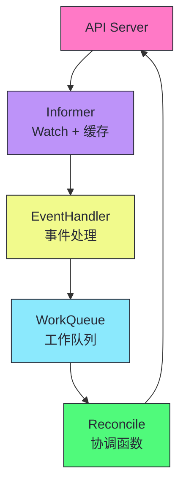
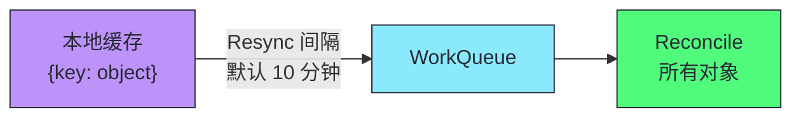
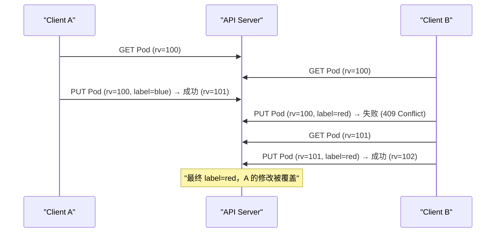
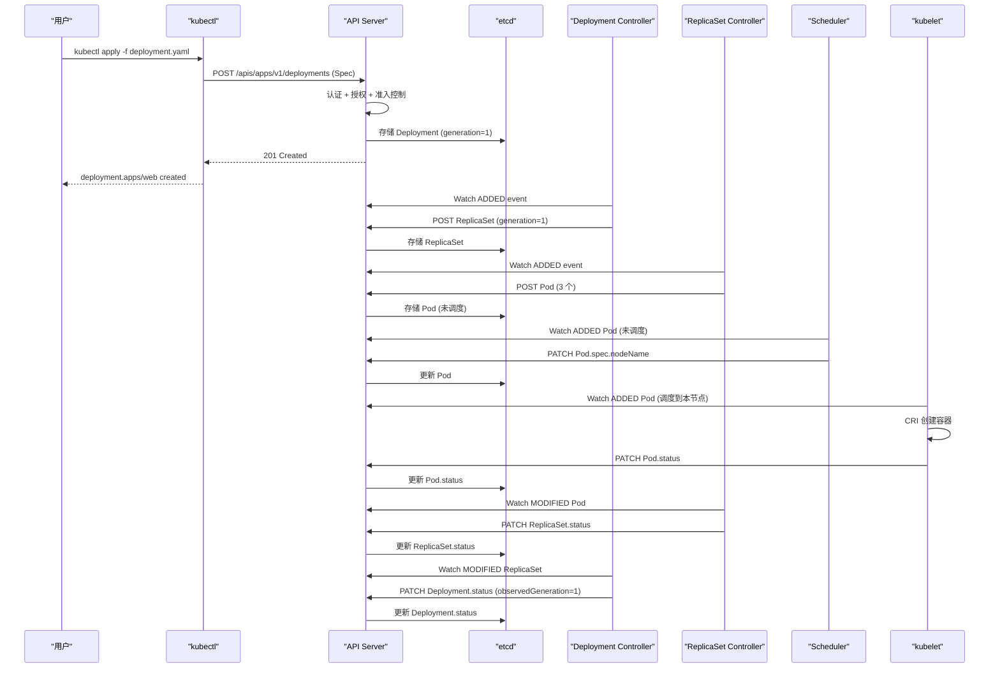

# 02 声明式 API 与面向终态协调：K8s 的核心范式

**摘要：**
本文深入 Kubernetes 最核心的工程范式——声明式 API 和面向终态协调。第 01 篇从设计哲学层面讨论了"为什么选择声明式"，本文从技术实现层面讲透"声明式 API 如何落地"。首先剖析 K8s API 的 RESTful 设计——资源即 URL、HTTP 动词映射 CRUD、Watch 端点实现事件流，并追溯 RESTful 架构风格的历史渊源。然后深入 API 对象的统一四段式结构：TypeMeta（类型标识）、ObjectMeta（身份与并发控制）、Spec（期望状态）、Status（当前状态），讲透 Spec/Status 分离的工程含义——为什么用户只能写 Spec、控制器只能写 Status，以及 generation 和 observedGeneration 如何衡量"控制器是否已处理用户的最新变更"。接着从源码级讨论控制器协调循环的工程实现——Informer、WorkQueue、Reconcile 的三层架构，以及为什么协调循环必须幂等、必须无状态、必须基于当前状态而非事件历史。然后讨论声明式 API 的代价——异步性带来的延迟、调试困难、以及"last-write-wins"的冲突解决策略，并介绍 Server-Side Apply 如何演进为声明式 API 的成熟形态。核心认知在于：声明式不是"配置即代码"，而是"意图即契约"——用户提交 Spec 是与系统签订契约，系统承诺持续将 Status 向 Spec 收敛。

---

## 第 1 章 K8s API 的 RESTful 设计

### 1.1 RESTful 的历史渊源

在讨论 K8s 的 API 设计之前，不妨先回到 RESTful 架构风格的起源。2000 年，Roy Fielding 在其博士论文《Architectural Styles and the Design of Network-Based Software Architectures》中首次提出了 REST（Representational State Transfer）架构风格，彼时他正在参与 HTTP/1.1 规范的制定。REST 的核心思想是：将网络应用视为资源的集合，每个资源有唯一的 URI，通过统一的接口（HTTP 动词）对资源进行操作，状态不保存在服务器端（无状态约束）。这套思想在 2000 年代随着 Web 2.0 的兴起而普及，到 2010 年代已经成为互联网 API 的事实标准。REST 并非唯一的选择——同期还有 SOAP、XML-RPC 等竞争者，但 REST 以其简洁性和 Web 原生兼容性胜出，成为互联网 API 的主流范式。

K8s 选择 RESTful 作为 API 风格，并非偶然。Borg 的 API 是基于内部 RPC 的，Google 内部工程师可以接受学习 RPC 接口的成本；但 K8s 面向的是全球开发者，任何额外的接口学习成本都会成为采用障碍。RESTful 的优势在于"零学习成本"——任何理解 HTTP 的开发者都能上手 K8s API，任何支持 HTTP 的工具（curl、Postman、浏览器）都能直接调用 K8s API。这个选择也有代价：RESTful 的资源模型不如 RPC 灵活，某些复杂操作（譬如"重启所有 Pod"）需要通过自定义子资源或控制器来实现，而非一个简单的 RPC 调用。但 K8s 团队认为，API 的"可理解性"比"灵活性"更重要，这是一个面向外部用户的必然取舍。

RESTful 与 gRPC 的对比也值得一提。gRPC 基于 HTTP/2 和 Protocol Buffers，在性能上优于 RESTful——二进制编码比 JSON 更紧凑，HTTP/2 的多路复用比 HTTP/1.1 的长连接更高效。但 gRPC 的劣势在于工具生态：浏览器无法直接调用 gRPC（需要 gRPC-Web 转换），curl 和 Postman 不能直接调试 gRPC 接口，开发者需要学习 Protocol Buffers 的 IDL 语法。K8s 选择 RESTful 而非 gRPC，本质上是选择了"生态兼容性"而非"极致性能"——这是一个面向外部用户的典型权衡。内部组件间的通信（如 API Server 与 etcd 之间）则使用 gRPC，因为内部通信不需要考虑外部工具兼容性，性能优先。

### 1.2 资源即 URL

K8s API 完全遵循 RESTful 风格——每种资源类型对应一个 URL 路径，HTTP 动词对应 CRUD 操作。这个映射关系看似简单，但它是 K8s API 可理解性的基础——任何有 Web 开发经验的开发者都能立即理解"GET /api/v1/pods 是列出 Pod"，无需学习新的接口语义。RESTful 的 CRUD 映射还有一个隐含优势：HTTP 动词的语义是标准化的，GET 是幂等的（多次执行结果一致），PUT 是幂等的（全量更新），POST 不是幂等的（创建），DELETE 是幂等的（删除已删除的资源不报错）——这些语义约束与 K8s 的声明式模型天然契合。

| HTTP 动词 | K8s 操作 | URL 路径示例 | 说明 |
|----------|---------|------------|------|
| GET | 读取 | `/api/v1/pods` | 列出 Pod |
| GET | 读取 | `/api/v1/pods/web-abc` | 读取单个 Pod |
| POST | 创建 | `/api/v1/pods` | 创建 Pod |
| PUT | 更新 | `/api/v1/pods/web-abc` | 全量更新 |
| PATCH | 局部更新 | `/api/v1/pods/web-abc` | 局部更新 |
| DELETE | 删除 | `/api/v1/pods/web-abc` | 删除 Pod |

### 1.3 API 路径的层级结构

```
/api/v1/namespaces/default/pods/web-abc
│   │   │         │       │    │
│   │   │         │       │    └── 对象名
│   │   │         │       └── 资源类型（复数）
│   │   │         └── Namespace
│   │   └── 版本（核心组无组名）
│   └── 核心组
└── API 根路径

/apis/apps/v1/namespaces/default/deployments/web
│   │   │   │         │       │           │
│   │   │   │         │       │           └── 对象名
│   │   │   │         │       └── 资源类型
│   │   │   │         └── Namespace
│   │   │   └── 版本
│   │   └── API 组
│   └── API 根路径（命名组）
└── API 根路径
```

> [!info] 核心概念：核心组 vs 命名组的 URL 差异
> K8s 最初所有资源都在"核心组"（core group），URL 是 `/api/v1/...`。后来为了可管理性引入了 API 组的概念，新资源放在命名组中，URL 是 `/apis/<组>/<版本>/...`。核心资源（Pod、Service、ConfigMap、Node、Namespace、Event、Secret、PersistentVolume 等）保留了无组名的 `v1`，这是历史遗留——核心组没有组名是因为它早于 API 组机制。理解这个差异很重要——kubectl 的 `api-resources` 命令会显示每个资源的 API 组，核心组显示为空。API 组的引入使得 K8s 的 API 可以按领域分组演进（apps、batch、networking、storage），每个组可以独立版本化，这为 K8s 的 API 扩展提供了必要的解耦基础。

### 1.4 Watch 端点：RESTful 的事件流扩展

K8s 在标准 RESTful 之外增加了一个关键扩展——**Watch 端点**。在 GET 请求中添加 `?watch=true` 参数，API Server 会将响应从"一次性返回所有对象"变为"持续推送资源变更事件"。这个扩展是 K8s 控制器模式的基石——没有 Watch，控制器只能轮询 API Server，在大规模集群中轮询的开销是不可接受的（这个量化分析在第 06 篇详细展开）。Watch 把"获取变更"从 O(N) 的轮询降为 O(1) 的事件推送，使得控制器可以实时感知资源变化，而非周期性扫描。这个设计是 K8s 能够支撑大规模集群的关键技术基础之一。

```
GET /api/v1/pods?watch=true&resourceVersion=12345
```

响应是一个持续打开的 HTTP 长连接，服务器不断推送 JSON 事件：

```json
{"type":"ADDED","object":{"kind":"Pod","metadata":{"name":"web-abc",...},...}}
{"type":"MODIFIED","object":{"kind":"Pod","metadata":{"name":"web-abc",...},...}}
{"type":"DELETED","object":{"kind":"Pod","metadata":{"name":"web-abc",...},...}}
{"type":"BOOKMARK","object":{...,"resourceVersion":"12350"}}
```

| 事件类型 | 说明 |
|---------|------|
| **ADDED** | 资源被创建 |
| **MODIFIED** | 资源被更新 |
| **DELETED** | 资源被删除 |
| **BOOKMARK** | 仅更新 resourceVersion，不携带对象（防止客户端 Watch 卡在旧版本） |

> [!note] 设计哲学：Watch 是 RESTful 的增量扩展，不破坏 HTTP 语义
> K8s 没有引入 WebSocket 或自定义协议来实现事件流——它用标准的 HTTP 长连接（chunked transfer encoding）在 GET 请求上扩展了一个 `?watch=true` 参数。这使得 Watch 端点可以穿透标准的 HTTP 代理、负载均衡器和 CDN，无需特殊配置。这种"不破坏 HTTP 语义"的设计是 K8s API 在大规模分布式环境中可靠运行的基础——任何理解 HTTP 的基础设施都能承载 K8s API 流量。但这个选择也有代价：HTTP 长连接在代理层可能被超时断开，K8s 客户端需要处理 Watch 断连重连的逻辑，这增加了客户端的复杂度。

---

## 第 2 章 API 对象的统一四段式结构

### 2.1 为什么需要统一结构

想象一个没有统一对象模型的编排系统——每种资源都有独特的数据结构：Pod 用 `name`，Deployment 用 `deployment_name`，Service 用 `svc_id`。这种混乱会导致：工具无法通用（kubectl 需为每种资源编写不同展示逻辑）、控制器无法通用（垃圾回收器需为每种资源编写特殊解析逻辑）、客户端库无法自动生成。这个问题的本质是"缺乏元模型"——没有一套统一的抽象来描述"所有 K8s 对象长什么样"。统一对象模型在软件工程中并非新概念——关系数据库的"表-行-列"模型、面向对象的"类-实例"模型都是统一结构的例子——但 K8s 把它应用到了分布式系统 API 的领域，这是一个值得注意的工程创新。

K8s 的解决方案是：所有 API 资源都遵守统一结构。这个设计决策的深远影响在于，它使得 K8s 的工具链可以完全通用化——kubectl 不需要知道 Deployment 和 Pod 的具体字段差异，它只需要知道"每个对象都有 metadata 和 spec"这个统一结构，就能通用地展示、过滤、操作任何资源。同样，controller-runtime 框架可以提供一个通用的 Reconcile 接口，因为所有对象的访问模式都是统一的（Get/List/Watch/Update/Delete）。

这个统一结构的另一个受益者是 CRD（Custom Resource Definition）。CRD 允许用户定义新的资源类型，而新资源自动继承统一结构——TypeMeta、ObjectMeta、Spec、Status。这意味着用户定义的 CRD 资源可以立即被 kubectl 操作，可以被 Informer Watch，可以被 controller-runtime 管理，无需任何额外的适配工作。如果没有统一结构，每种 CRD 都需要自己实现一套工具链适配，K8s 的可扩展性优势将大打折扣。统一结构是 K8s 可扩展性的隐含基础——它使得"定义新资源"的成本从"实现一整套工具链"降为"定义一个 schema"。

```yaml
apiVersion: apps/v1            # ┐ TypeMeta：类型信息
kind: Deployment               # ┘
metadata:                      # ─ ObjectMeta：元数据
  name: web
  namespace: default
  labels:
    app: nginx
  resourceVersion: "12345"
  uid: "abc-def-123"
  creationTimestamp: "2026-07-17T10:00:00Z"
  ownerReferences: []
spec:                          # ─ Spec：期望状态（用户定义）
  replicas: 3
  selector:
    matchLabels:
      app: nginx
  template:
    spec:
      containers:
        - name: nginx
          image: nginx:1.25
status:                        # ─ Status：当前状态（系统填写）
  replicas: 3
  readyReplicas: 3
  availableReplicas: 3
```

### 2.2 TypeMeta：类型标识

TypeMeta 包含 `apiVersion` 和 `kind`，联合起来唯一标识资源类型。API Server 据此将请求路由到正确的处理逻辑。TypeMeta 的两个字段缺一不可：`apiVersion` 确定 API 版本（影响校验规则和存储格式），`kind` 确定资源类型（影响处理逻辑和存储路径）。这个组合设计使得 K8s 可以在同一个 API Server 中处理数百种资源类型，而每种类型的处理逻辑完全独立，互不干扰。

| 资源 | apiVersion | kind |
|------|-----------|------|
| Pod | `v1` | Pod |
| Deployment | `apps/v1` | Deployment |
| Job | `batch/v1` | Job |
| CustomResource | `example.com/v1` | MyResource |

TypeMeta 的设计看似简单，但它承担着一个关键的职责：序列化与反序列化的类型锚点。当 API Server 收到一个 JSON/YAML 请求时，它通过 `apiVersion` 和 `kind` 确定应该反序列化为哪种 Go 类型，进而选择正确的校验逻辑和存储路径。这个机制使得 K8s 可以在同一个 API 端点上处理多种资源类型，而无需为每种类型设计独立的协议。

apiVersion 的版本号设计也值得一提。K8s 的 API 版本遵循一个演进规则：alpha（如 `v1alpha1`）表示实验性功能，可能被废弃或大幅修改；beta（如 `v1beta1`）表示功能相对稳定，但仍有变更可能；stable（如 `v1`）表示正式版本，保证向后兼容。这个版本策略使得 K8s 可以在不破坏现有用户的前提下引入新功能——新功能先以 alpha 版本发布，经过社区验证后升级为 beta，最终成为 stable。但这个策略也有代价：同一资源可能同时存在多个版本（譬如 Deployment 同时有 `apps/v1`、`apps/v1beta1`、`apps/v1beta2`），API Server 需要在不同版本间做转换，这个转换逻辑的维护成本随着版本数量线性增长。K8s 社区通过定期废弃旧版本（deprecation cycle）来控制这个成本，但版本转换的 bug 仍然是 K8s 升级时常见的问题来源。

### 2.3 ObjectMeta：身份与并发控制

ObjectMeta 是所有 K8s 对象共享的元数据结构，每个字段都有明确的设计目的。ObjectMeta 的设计哲学是"把所有对象共有的元信息统一到一个结构中"，这样工具链只需要理解 ObjectMeta 就能处理任何对象的元数据，而不需要为每种资源类型单独处理。这个设计看似简单，但它是 K8s 工具链通用化的基础——kubectl 的 `get`、`describe`、`label`、`annotate` 等命令可以通用于所有资源类型，正是因为它们操作的是 ObjectMeta 的统一字段。

#### 身份标识

| 字段 | 说明 |
|------|------|
| **name** | 对象名，同 Namespace + 同资源类型下唯一 |
| **namespace** | 所属 Namespace（集群级资源无此字段） |
| **uid** | 全局唯一 UUID，创建时自动生成，删除重建后不同 |

> [!info] 核心概念：name 是逻辑标识，uid 是物理标识
> `name + namespace + resource type` 构成对象的"逻辑标识"——同一 Namespace 不能有两个同名 Deployment。但 `uid` 是"物理标识"——删除后重建同名对象，新对象 uid 不同。Garbage Collector 使用 uid（而非 name）判断 OwnerReference 的有效性——如果 Owner 被删除后重建（uid 变了），旧的 OwnerReference 不再匹配，子对象会被垃圾回收。这是 K8s 处理"同名但不同实例"的精妙机制，也是为什么在编写控制器时不应依赖 name 判断对象身份——name 可能被复用，uid 才是真正唯一的物理标识。

#### 并发控制

| 字段 | 说明 |
|------|------|
| **resourceVersion** | etcd 中的版本号，每次修改递增，乐观并发控制的核心 |
| **generation** | spec 部分被修改的次数，只有 spec 变更递增 |

**resourceVersion** 的乐观并发控制流程：

```
时刻1：Client A 读取 Pod（resourceVersion=100）
时刻2：Client B 读取 Pod（resourceVersion=100）
时刻3：Client A 更新 Pod（携带 resourceVersion=100）→ 成功，resourceVersion 变为 101
时刻4：Client B 更新 Pod（携带 resourceVersion=100）→ 失败，当前是 101
时刻5：Client B 重新读取 Pod（resourceVersion=101），合并变更，重新更新 → 成功
```

乐观并发控制并非 K8s 的发明——它源自数据库领域，早在 1981 年就由 H.T. Kung 和 John T. Robinson 在论文《On Optimistic Methods for Concurrency Control》中提出。K8s 把这个学术概念工程化为 resourceVersion 机制，使得分布式环境下的并发修改变得可控。但乐观并发控制有一个固有局限：在高冲突场景下，重试开销会急剧上升，极端情况下系统会陷入"所有人都在重试"的活锁边缘。K8s 通过 WorkQueue 的限速机制缓解了这个问题，但冲突率高的场景（譬如大量控制器同时更新同一对象）仍然需要谨慎设计。

resourceVersion 的底层实现是 etcd 的 ModRevision——etcd 对每个 key 的每次修改分配一个全局单调递增的版本号。这意味着 resourceVersion 不是 K8s 自己维护的，而是直接复用 etcd 的版本机制，这保证了 resourceVersion 的全局一致性和单调性。但这也带来了一个约束：resourceVersion 的比较只在同一个 etcd 集群内有意义，跨集群比较 resourceVersion 是无意义的（不同 etcd 集群的 ModRevision 序列独立）。这个约束在多集群联邦场景下需要特别注意。

> [!warning] 生产避坑：不要在控制器中缓存 resourceVersion 跨多次协调使用
> resourceVersion 只在单次读-改-写操作中有效。控制器在协调循环中读取对象的 resourceVersion，更新时携带它——这是正确的。但如果控制器缓存了 resourceVersion 并在多次协调循环中复用，会导致更新失败（对象已被其他组件修改）。每次协调循环都应重新读取对象的最新状态，而非使用缓存的状态。这是 Level-triggered 原则在并发控制上的体现——基于当前状态做决策，不依赖历史状态。

#### 关联关系

| 字段 | 说明 |
|------|------|
| **labels** | 键值对，用于 Selector 查询过滤 |
| **annotations** | 键值对，用于附加任意非查询元数据 |
| **ownerReferences** | 拥有者列表，用于垃圾回收和级联删除 |

```yaml
# ReplicaSet 拥有 Pod 的 OwnerReference 示例
metadata:
  ownerReferences:
    - apiVersion: apps/v1
      kind: ReplicaSet
      name: web-abc
      uid: "rs-uid-123"
      controller: true        # 是否为直接控制器
      blockOwnerDeletion: true # 是否阻止 Owner 删除直到此对象被删除
```

labels 与 annotations 的区分值得细说。labels 设计用于查询过滤——Service 通过 `selector` 匹配 Pod 的 labels 来关联后端，kubectl 通过 `-l` 参数过滤资源。annotations 则设计用于附加任意非查询元数据——譬如镜像摘要、构建时间、负责人的联系方式。两者的关键区别在于：labels 的值会被索引，可以高效查询；annotations 的值不会被索引，只用于存储。把查询用的键值对放进 annotations 会导致查询失效，把大段元数据放进 labels 会导致索引膨胀，这是一个常见的配置错误。

ownerReferences 的设计是 K8s 垃圾回收机制的基石。当 ReplicaSet 创建一个 Pod 时，它会在 Pod 的 ownerReferences 中写入自己的信息（包括 uid）。当 ReplicaSet 被删除时，Garbage Collector 检查所有 ownerReferences 指向它的对象，并根据级联删除策略（Foreground、Background、Orphan）决定是否删除子对象。这个机制使得 K8s 的资源生命周期可以自动管理——用户删除 Deployment，ReplicaSet 和 Pod 会被自动清理，无需手动删除每一级。但 ownerReferences 的设计也有一个边界条件：它只能表达"拥有"关系，不能表达"依赖"关系——譬如一个 Pod 依赖一个 ConfigMap，但 ConfigMap 不会因为 Pod 的删除而被清理，因为 ConfigMap 不在 Pod 的 ownerReferences 中。这种"依赖但不拥有"的关系需要通过 Finalizer 或外部控制器来管理。

### 2.4 Spec：期望状态（用户契约）

**Spec 是用户与 K8s 签订的"契约"**——用户在 spec 中描述期望状态，K8s 承诺持续将实际状态向 spec 对齐。这个"契约"比喻并非修辞——spec 一旦写入 etcd，K8s 的控制器就会持续工作直到 status 与 spec 一致，即使中间经历控制器崩溃、节点故障、网络分区，最终也会收敛。这种"承诺"的强度是声明式 API 区别于命令式 API 的根本特征：命令式 API 执行完就结束了，不保证最终状态；声明式 API 持续工作直到期望状态达成，是一种"持续承诺"，而非一次性的执行动作。

spec 的几个关键特性：

| 特性 | 说明 |
|------|------|
| **用户可写** | 只有用户（或代表用户的控制器）可以修改 spec |
| **控制器只读** | 控制器不修改 spec（除了某些自动扩缩容场景） |
| **变更触发协调** | spec 变更递增 generation，控制器检测到 generation 变化后重新协调 |
| **声明式** | 描述"想要什么"，不描述"怎么做" |

> [!note] 设计哲学：spec 是意图，不是过程
> spec 描述的是"期望状态"（我要 3 个副本），不是"操作过程"（先创建 A，再创建 B，再创建 C）。这使得 spec 天然幂等——提交同一份 spec 10 次和 1 次效果一致。控制器负责从任何当前状态到达 spec 描述的终态，不依赖"之前做了什么"。这是 K8s 自愈能力的根本——控制器每次都从当前状态向 spec 收敛，而非从"上一次操作进度"继续。但 spec 的声明式特性也有边界：当业务逻辑需要严格的操作顺序时（譬如"先扩容数据库再扩容应用"），spec 本身无法表达这种依赖关系，需要借助控制器间的协调或外部编排工具（如 ArgoCD 的 Workflow）来补充顺序语义。

spec 的另一个设计细节是它的不可变性约束。虽然 spec 在技术上可以被用户随时修改，但某些字段在创建后被标记为 immutable（不可变）——譬如 Job 的 `spec.parallelism` 在某些版本中不可变，StatefulSet 的 `spec.volumeClaimTemplates` 在创建后不可变。这个约束的工程目的是：这些字段的变化会触发复杂的迁移逻辑（譬如修改 PVC 模板需要重建所有 Pod），而控制器无法安全地处理这种迁移，因此直接禁止修改。理解哪些字段不可变，是编写 K8s 配置时避免踩坑的关键——试图修改不可变字段会返回 422 错误，用户需要删除重建对象而非直接修改。

### 2.5 Status：当前状态（系统汇报）

**Status 是 K8s 向用户的"汇报"**——控制器更新 status，描述系统当前的真实状态。status 与 spec 的分离构成了 K8s 声明式 API 的核心契约：spec 是"期望"，status 是"现实"，控制器的职责是消除两者之间的差距。这个分离的工程意义在于，它使得"期望"和"现实"可以被独立观察和修改——用户修改 spec 表达新意图，控制器修改 status 反映新现实，两者通过 resourceVersion 的乐观并发控制协调，不会互相干扰。这种分离是声明式 API 能够支撑多组件协作的技术基础。

status 的几个关键特性：

| 特性 | 说明 |
|------|------|
| **控制器可写** | 控制器更新 status 反映协调结果 |
| **用户只读** | 用户不直接修改 status（除非有特殊权限） |
| **observedGeneration** | 控制器已处理的 spec generation 值 |
| **conditions** | 标准化的状态条件列表 |

#### observedGeneration：控制器进度的衡量

```yaml
spec:
  # ... 用户期望 ...
status:
  observedGeneration: 5    # 控制器已处理到 spec 的第 5 次变更
  # generation=6 时，observedGeneration=5 表示控制器还没处理最新变更
```

`observedGeneration` 是衡量"控制器是否已处理用户最新变更"的关键指标。当 `observedGeneration < generation` 时，表示用户修改了 spec 但控制器还没来得及处理——kubectl 会显示 "Progressing" 状态。这个机制看似简单，但它解决了一个重要的工程问题：在没有 observedGeneration 的情况下，用户无法判断"status 反映的是最新的 spec 还是旧的 spec"——如果控制器崩溃后重启，它可能基于旧的 spec 更新了 status，而用户误以为 status 已经反映了最新 spec。observedGeneration 通过"控制器汇报自己处理到了第几代 spec"消除了这个歧义。

#### conditions：标准化的状态条件

```yaml
status:
  conditions:
    - type: Available        # 条件类型
      status: "True"         # True/False/Unknown
      reason: MinimumReplicasAvailable  # 机器可读的原因
      message: "Deployment has minimum availability."  # 人类可读的说明
      lastUpdateTime: "2026-07-17T10:01:00Z"
      lastTransitionTime: "2026-07-17T10:01:00Z"
```

conditions 是 K8s 资源状态的**标准化表达方式**——不同资源定义不同的 condition type（如 Deployment 的 Available/Progressing、Pod 的 Ready/ContainersReady/PodScheduled/Initialized）。conditions 的设计精妙之处在于它把"状态"从单一布尔值扩展为带原因和消息的结构化记录，使得监控系统和人类用户都能从 conditions 中获取比"Running/Pending"更丰富的诊断信息。

conditions 的一个设计细节是 `lastTransitionTime`——它记录条件最后一次从一种状态转变为另一种状态的时间。这个字段在故障排查中极其重要：如果一个 Pod 的 Ready 条件从 True 变为 False，`lastTransitionTime` 告诉你"什么时候开始不 Ready"，结合 Events 可以还原故障发生的精确时间线。但 conditions 的设计也有一个局限：它是"状态快照"而非"事件流"——conditions 只记录当前状态，不记录状态变化的历史。如果需要回溯"过去一小时 Ready 条件变化了几次"，conditions 无法提供，需要依赖 Events 或外部监控系统。

> [!info] 核心概念：Spec/Status 分离是 K8s 的核心工程契约
> Spec/Status 分离不是简单的字段组织——它是一个工程契约：**用户拥有 spec，系统拥有 status**。用户不直接修改 status，控制器不直接修改 spec（除了自动扩缩容等特殊场景）。这种分离使得多个组件可以同时观察一个对象——用户看 spec 知道"期望什么"，控制器看 status 知道"现在是什么"，监控看 status 判断"系统是否健康"。理解这个契约，是理解所有 K8s 控制器行为的关键——无论多么复杂的控制器，核心逻辑都是"读 spec，比较 status，采取行动让 status 向 spec 收敛"。但这个契约并非没有例外：HPA（HorizontalPodAutoscaler）控制器会修改 Deployment 的 spec.replicas，这是一个被刻意设计的"契约破坏"——HPA 代表用户做扩缩容决策，因此它有权修改 spec。理解这些例外，才能理解契约的边界。

---

## 第 3 章 控制器协调循环的工程实现

### 3.1 三层架构：Informer + WorkQueue + Reconcile

K8s 控制器的工程实现通常采用三层架构：Informer 负责感知状态变化，WorkQueue 负责调度协调任务，Reconcile 负责执行协调逻辑。这三层架构的分离使得每一层可以独立优化——Informer 优化缓存效率，WorkQueue 优化调度策略，Reconcile 优化业务逻辑——而不影响其他层。这种"关注点分离"的设计是 K8s 控制器框架（如 controller-runtime）能够提供通用抽象的基础。理解这三层架构，是编写自定义控制器的入门门槛。



#### 第一层：Informer（Watch 加本地缓存）

Informer 通过 List-Watch 协议从 API Server 获取资源，维护一份本地缓存。Watch 事件触发后，Informer 调用 EventHandler。Informer 的本地缓存是一个关键设计——它使得控制器不需要每次协调都访问 API Server，而是从本地内存读取对象状态，大幅降低了 API Server 的负载。但缓存的代价是内存占用：一个大集群中，所有 Pod 对象的缓存可能占用数百 MB 内存，这是控制器进程内存规划时必须考虑的因素。

Informer 的缓存一致性依赖于 Watch 事件流。当 Watch 连接断开时，Informer 会尝试从断点（最后一个 resourceVersion）重新建立 Watch，如果断点过旧（API Server 已经清理了对应的历史版本），Informer 会退化为全量 List 重新构建缓存。这种"断连重连"的机制使得 Informer 能够在网络抖动环境下自愈，但全量 List 的代价是短暂的 API Server 负载突增——在大集群中，多个 Informer 同时全量 List 可能导致 API Server 过载，这也是为什么 K8s 社区在持续优化 List 的分页和缓存机制。

#### 第二层：WorkQueue（工作队列）

EventHandler 不直接调用 Reconcile，而是将对象的 key（namespace/name）放入 WorkQueue。WorkQueue 的特性：

| 特性 | 说明 |
|------|------|
| **去重** | 同一 key 多次入队只处理一次 |
| **延迟** | 支持延迟入队（如失败后延迟 30 秒重试） |
| **限速** | 限制每秒处理的对象数，避免突发流量冲击 API Server |
| **有序** | 同一 key 的多次变更按顺序处理 |

WorkQueue 的去重设计解决了一个重要的工程问题：当同一对象在短时间内被多次修改（譬如用户连续 patch 10 次），Watch 会推送 10 个事件，但 WorkQueue 只入队一次 key，Reconcile 只执行一次——它读取的是对象的最新状态，而非 10 个中间状态。这种"合并多次变更为一次协调"的设计，是 K8s 控制器在高频变更场景下保持效率的关键。

WorkQueue 的限速机制同样值得细说。它支持多种限速策略：BucketRateLimiter（令牌桶限速，控制全局 QPS）、ItemExponentialFailureRateLimiter（按对象指数退避，失败次数越多延迟越长）、MaxOfRateLimiter（取多种限速器的最大值）。这些策略的组合使得 WorkQueue 既能保护 API Server 不被突发流量冲击，又能对频繁失败的对象实施渐进式退避，避免"错误对象反复重试拖慢整个队列"的问题。在编写自定义控制器时，合理配置限速参数是保护集群稳定性的重要手段——默认配置对大多数场景够用，但高频更新的资源（如 Endpoint）需要更精细的限速调优。

#### 第三层：Reconcile（协调函数）

Reconcile 从 WorkQueue 取出 key，从 Informer 本地缓存读取对象的**最新状态**，比较 spec 和 status，采取行动。Reconcile 函数是控制器逻辑的核心，它的设计约束直接决定了控制器的健壮性：它必须幂等（多次执行效果一致），必须无状态（不依赖历史执行上下文），必须基于当前状态而非事件历史。这些约束使得 Reconcile 函数在面对重试、重启、Resync 时都能正确工作，是 Level-triggered 原则在函数层面的体现。

```go
// 伪代码：Reconcile 函数的标准结构
func (r *Reconciler) Reconcile(ctx context.Context, req ctrl.Request) (ctrl.Result, error) {
    // 1. 从缓存读取对象的最新状态
    var deployment appsv1.Deployment
    if err := r.Get(ctx, req.NamespacedName, &deployment); err != nil {
        if errors.IsNotFound(err) {
            return ctrl.Result{}, nil  // 对象已删除，无需处理
        }
        return ctrl.Result{}, err  // 读取失败，重试
    }

    // 2. 比较 spec 和 status
    diff := deployment.Spec.Replicas - deployment.Status.ReadyReplicas

    // 3. 采取行动消除差异
    if diff > 0 {
        // 创建 Pod...
    } else if diff < 0 {
        // 删除 Pod...
    }

    // 4. 更新 status
    deployment.Status.ObservedGeneration = deployment.Generation
    if err := r.Status().Update(ctx, &deployment); err != nil {
        return ctrl.Result{}, err  // 更新失败，重试
    }

    return ctrl.Result{}, nil  // 成功，不重试
}
```

### 3.2 协调循环的三大铁律

> [!warning] 生产避坑：协调循环的三大铁律
> 1. **幂等性**：Reconcile 函数必须幂等——多次执行同一 Reconcile 的效果与执行一次一致。因为 WorkQueue 可能在失败后重试，或因 Resync 被重复触发。
> 2. **无状态性**：Reconcile 函数不应依赖"上一次做了什么"——每次都从缓存读取对象的最新状态，基于当前状态做决策。这是 Level-triggered 原则的体现。
> 3. **基于当前状态而非事件**：Reconcile 函数的输入是对象的 key（namespace/name），不是"发生了什么事件"。EventHandler 转换事件为 key 入队，Reconcile 只关心"这个对象当前的状态与期望状态是否一致"。

这三大铁律并非孤立的规则，而是同一个设计原则——Level-triggered——在三个层面的体现。幂等性确保重试不会产生副作用，无状态性确保重启不会丢失上下文，基于当前状态确保错过事件不会导致永久不一致。违反任何一条，控制器在面对重启或重试时都会出问题。笔者在实践中见过最多的违规案例是：在 Reconcile 中维护一个"已处理事件"的集合，跳过"已处理"的事件——这在控制器重启后会导致集合丢失，所有事件被重新处理，如果处理逻辑不幂等就会产生重复副作用（譬如重复创建资源）。

另一个常见的违规案例是在 Reconcile 中依赖外部状态——譬如从数据库读取一个配置项来决定协调行为。如果数据库在 Reconcile 执行期间被修改，下一次 Reconcile 读到的配置可能不同，但控制器无法感知这个变化（因为它不在 K8s 的 Watch 范围内），导致协调行为不可预测。正确的做法是把外部状态映射为 K8s 资源（譬如 ConfigMap 或 CRD），让 Informer 能够 Watch 到它的变化，从而纳入 Level-triggered 的协调框架。

### 3.3 Resync 机制：Level-triggered 的工程保障

即使没有收到任何 Watch 事件，Informer 也会定期触发 **Resync**——将本地缓存中的所有对象 key 重新放入 WorkQueue，触发所有对象的 Reconcile。Resync 是 K8s 控制器在"事件驱动"和"状态驱动"之间的一个工程平衡点：纯事件驱动效率高但可能丢事件，纯状态驱动健壮但开销大，Resync 以"定期状态驱动"补充"实时事件驱动"，既保证了效率又保证了健壮性。



Resync 的价值：

| 场景 | 没有 Resync | 有 Resync |
|------|-----------|----------|
| **Watch 事件丢失** | 状态永久不一致 | 下次 Resync 时恢复 |
| **控制器重启后** | 只处理重启后的事件 | Resync 触发所有对象重新协调 |
| **外部状态变化** | 控制器无感知 | Resync 重新检查所有对象 |

> [!info] 核心概念：Resync 是 Level-triggered 原则的工程保障
> Resync 确保即使错过 Watch 事件，控制器也能通过定期全量重新协调恢复一致状态。这是 Level-triggered 原则在工程上的具体实现——不依赖事件是否被消费，定期检查当前状态。Resync 间隔（默认 10 分钟）是一个权衡——间隔短增加 API Server 负载，间隔长恢复慢。对于关键控制器，可以缩短 Resync 间隔；对于非关键控制器，保持默认值以减少负载。但需要注意的是，Resync 只重新触发协调，不重新从 API Server 拉取数据——它基于 Informer 本地缓存的对象状态，如果缓存本身已经过期（譬如 Watch 长时间断连且未恢复），Resync 也无法纠正。这意味着 Resync 是"最终一致性"的保障，而非"强一致性"的保障。

Resync 在大集群中的性能影响是一个需要关注的问题。一个管理 10000 个对象的 Informer，每次 Resync 会把 10000 个 key 放入 WorkQueue，触发 10000 次 Reconcile。如果 Resync 间隔是 10 分钟，那么平均每分钟有 1000 次 Reconcile，这对控制器的 CPU 和 API Server 的写压力（如果 Reconcile 需要更新 status）都是不可忽视的负载。K8s 社区在持续优化 Resync 的开销，譬如通过 SharedInformer 让多个控制器共享同一份缓存，避免每个控制器各自 Resync。

---

## 第 4 章 声明式 API 的代价

声明式 API 并非没有代价的银弹。理解它的代价，才能在合适的场景下做出合适的选择。声明式 API 的核心代价可以归纳为三点：异步性带来延迟、调试需要跨组件推断、并发冲突需要额外机制解决。这些代价不是 K8s 实现的缺陷，而是声明式范式本身的固有约束——任何采用声明式 API 的系统都会面临这些问题，K8s 只是通过 Server-Side Apply 等机制把它们缓解到可接受的程度，而非完全消除。

### 4.1 异步性带来的延迟

声明式 API 是异步的——`kubectl apply` 提交 spec 后，控制器需要时间协调 status。从 apply 到 Pod 实际运行可能需要数秒。这个异步性是声明式范式的固有特征：用户提交的是"期望状态"而非"操作命令"，系统需要时间从当前状态收敛到期望状态。命令式系统是同步的——执行一条命令，立即看到结果；声明式系统是异步的——提交期望状态，等待系统收敛。这个差异在心智模型上是一个根本性的转换，也是 K8s 新用户最常见的困惑来源。理解这个差异，是从命令式思维转向声明式思维的第一步。

```
kubectl apply ──→ API Server 存储 spec ──→ Controller Watch 到变更 ──→ Reconcile ──→ 创建 Pod ──→ 调度 ──→ kubelet 创建容器
     <─────────────────────── 数秒到数十秒 ──────────────────────────────>
```

| 延迟来源 | 典型耗时 |
|---------|---------|
| API Server 处理请求 | ~10ms |
| Controller Watch 到变更 | ~100ms |
| Reconcile 执行 | ~100ms |
| Scheduler 调度 | ~100ms |
| kubelet 创建容器 | 数秒（含镜像拉取） |

这个延迟的叠加效应在需要快速响应的场景下是不可忽视的。譬如自动扩缩容应对流量突增时，从 HPA 检测到指标超标到新 Pod 实际接收流量，可能需要 30-60 秒——这个延迟意味着流量突增的最初一分钟内，系统是降级运行的。如果业务对这个延迟敏感，需要在架构层面做缓冲（譬如预留冗余容量、使用预热 Pod），而非依赖 K8s 的即时扩容能力。

延迟的另一个来源容易被忽视：API Server 的请求排队。当集群中控制器数量增多、Watch 连接数增大时，API Server 的请求处理能力成为瓶颈，请求会被排队等待，这个排队延迟在高负载下可能达到秒级。K8s 通过 Priority and Fairness（APF）机制对请求进行优先级分级和限流，确保高优先级请求（如 kubelet 的心跳）不被低优先级请求（如批量 List）挤占，但 APF 本身也是一个需要调优的组件——配置不当会导致控制器请求被限流，进一步放大协调延迟。

### 4.2 调试困难

声明式系统的调试比命令式困难——没有一个"执行到哪一步了"的明确进度。你需要从多个组件的状态推断系统当前处于协调链路的哪个环节，以及哪个环节可能卡住了。这种"从结果反推原因"的调试方式，要求调试者对 K8s 的协调链路有整体认知。

| 调试问题 | 排查方法 |
|---------|---------|
| Pod 没创建 | `kubectl get deployment` 看 status.replicas |
| Pod 创建了但没调度 | `kubectl get pod -o wide` 看 NODE 列 |
| Pod 调度了但没运行 | `kubectl describe pod` 看 Events |
| Pod 运行了但不健康 | `kubectl logs` 看容器日志 |

这种"从多个组件状态推断"的调试方式，对习惯了命令式系统"看日志看堆栈"的工程师而言是一个认知转换。命令式系统的故障通常是"某一步执行失败了"，而声明式系统的故障通常是"某个组件没有协调到期望状态"——前者有明确的错误点，后者需要排查整个协调链路。K8s 社区为此提供了 `kubectl describe`、`kubectl events`、`kubectl get -o yaml` 等工具，但它们只能展示"当前状态"，无法展示"为什么没有协调到期望状态"——后者需要理解每个控制器的协调逻辑，这对调试者的 K8s 内部知识要求较高。

调试困难的另一个维度是"跨组件追踪"。一个 `kubectl apply` 的完整链路涉及 API Server、etcd、Deployment Controller、ReplicaSet Controller、Scheduler、kubelet 等多个组件，每个组件都有自己的日志，而这些日志分散在不同的进程甚至不同的节点上。当 Pod 没有正常启动时，你需要依次检查 API Server 是否存储了 Deployment、Deployment Controller 是否创建了 ReplicaSet、ReplicaSet Controller 是否创建了 Pod、Scheduler 是否调度了 Pod、kubelet 是否启动了容器——这个排查链路可能涉及 5 个以上的组件日志。分布式追踪（如 OpenTelemetry）可以缓解这个问题，但 K8s 内部组件的追踪支持仍然有限，这是声明式系统调试体验远不如命令式系统的根本原因。

### 4.3 Last-Write-Wins 的冲突解决

当多个组件同时修改同一对象时，K8s 采用乐观并发控制——resourceVersion 不匹配的更新被拒绝，客户端需要重试。但重试时的合并策略是 **Last-Write-Wins**（最后写入胜出）——后写入的版本覆盖先写入的。这个策略的工程逻辑是：在乐观并发控制下，冲突是概率性的而非确定性的，重试时基于最新版本重新计算 diff，最终所有客户端的修改都会被串行化应用。但"串行化应用"不等于"所有修改都被保留"——如果两个客户端修改的是同一字段，后写入的会覆盖先写入的，先写入的修改丢失。



> [!warning] 生产避坑：Last-Write-Wins 可能丢失变更
> 如果 Client A 和 Client B 同时修改同一对象的不同字段，Last-Write-Wins 可能丢失 A 的变更——B 重试时基于 A 修改后的版本，但如果 B 是全量 PUT（而非 PATCH），B 的请求会覆盖 A 的修改。解决方案：(1) 使用 PATCH 而非 PUT，只修改需要变更的字段；(2) 使用 Strategic Merge Patch，K8s 的特殊合并策略（如 list 的 merge key）；(3) 使用 Server-Side Apply（K8s 1.18+），让 API Server 跟踪每个字段的拥有者，避免冲突字段的覆盖。

---

## 第 5 章 Server-Side Apply：声明式 API 的演进

### 5.1 传统客户端 Apply 的问题

传统的 `kubectl apply` 是客户端操作——kubectl 读取服务器上的当前状态，与本地 YAML 对比计算 diff，生成 PATCH 请求。这个设计在单客户端场景下工作良好，但在多客户端场景下暴露了根本性问题：客户端无法知道"自己管理的字段是否被其他客户端修改了"，因为字段所有权信息不存在。

| 问题 | 说明 |
|------|------|
| **冲突丢失** | 多个控制器管理同一对象时，Last-Write-Wins 覆盖变更 |
| **全量 vs 局部** | PUT 全量更新可能覆盖其他字段的变更 |
| **无法跟踪字段所有权** | 谁管理哪个字段不明确 |

这些问题的根源在于：传统 apply 把"计算 diff"的职责放在客户端，而客户端无法知道其他客户端的修改意图。当多个客户端（kubectl、Helm、Operator）同时管理同一对象的不同字段时，客户端各自计算的 diff 互相覆盖，最终结果取决于写入顺序，而非字段归属。

这个问题的典型场景是：Helm 部署了一个 Deployment，设置了 `replicas: 3`；同时一个 HPA 控制器在运行，根据负载把 `replicas` 调整为 5。当 Helm 执行 `helm upgrade` 时，它用本地 YAML 中的 `replicas: 3` 覆盖了 HPA 设置的 5，导致扩容被回退。下一次 HPA 协调时又把 replicas 调回 5，但 Helm upgrade 又会覆盖——两个客户端陷入"互相覆盖"的拉锯战。传统客户端 apply 无法解决这个问题，因为客户端不知道"replicas 字段现在由 HPA 管理"。

### 5.2 Server-Side Apply 的解决方案

**Server-Side Apply**（SSA，K8s 1.18+）将 apply 逻辑从客户端移到服务器端，并引入**字段所有权**（Field Ownership）概念——每个字段记录"谁管理这个字段"，冲突时 API Server 可以智能合并。SSA 的核心思想是把"谁管理哪个字段"这个信息从客户端的隐式约定提升为 API Server 的显式记录——每个字段的 managedFields 中记录了管理者（manager）、操作类型（operation）和字段路径（fieldsV1），API Server 在处理 apply 请求时检查这些信息，只有当新请求的 manager 与字段当前 manager 一致时才允许更新，否则返回 409 Conflict。

```yaml
# Server-Side Apply 请求
apiVersion: apps/v1
kind: Deployment
metadata:
  name: web
  managedFields:  # API Server 自动维护
    - manager: kubectl-client-side-apply
      operation: Update
      fieldsV1:
        f:spec:
          f:replicas: {}
    - manager: controller-manager
      operation: Update
      fieldsV1:
        f:status:
          f:readyReplicas: {}
```

| SSA 特性 | 说明 |
|---------|------|
| **字段所有权** | 每个字段记录管理者（manager） |
| **冲突检测** | 两个 manager 试图管理同一字段时返回 409 |
| **强制覆盖** | 可通过 `force: true` 强制接管字段所有权 |
| **三方合并** | 基于 managedFields 智能合并，不丢失非冲突字段 |

> [!info] 核心概念：Server-Side Apply 是声明式 API 的成熟形态
> SSA 解决了传统客户端 Apply 的冲突丢失问题——通过字段所有权跟踪，API Server 知道每个字段由谁管理，冲突时可以智能合并而非简单覆盖。这使得多个组件（如 kubectl、Helm、Operator）可以协同管理同一对象的不同字段，而不会互相覆盖。这是声明式 API 的成熟形态——从"全量 apply"演化为"字段级 apply"。对于有多个管理者的场景（如 Helm + Operator 同时管理一个 Deployment），SSA 是推荐的方式。SSA 的引入也体现了 K8s API 的一个演进规律：从"够用就好"的初版设计，逐步补齐工程实践中暴露的缺陷，最终走向成熟。这种演进而非一步到位的设计方式，是 K8s 作为一个生产系统持续迭代的写照。

SSA 与 GitOps 的关系也值得提及。GitOps 的核心理念是"Git 作为唯一真相源"——集群的期望状态存储在 Git 仓库中，通过持续同步工具（如 ArgoCD、Flux）将 Git 中的状态应用到集群。SSA 为 GitOps 提供了关键的技术基础：同步工具以 SSA 方式应用 Git 中的配置，API Server 记录同步工具为字段管理者，当人工修改（如 kubectl edit）覆盖了同步工具管理的字段时，下一次同步会检测到冲突并报告，而非静默覆盖。这使得 GitOps 的"Git 即真相源"原则在技术上可执行——没有 SSA，同步工具无法区分"自己管理的字段被谁改了"，GitOps 的冲突检测就无从谈起。

---

## 第 6 章 从 API 到控制器：完整链路示例

以 `kubectl apply -f deployment.yaml` 为例，完整链路展示了从用户提交到 Pod 运行的全过程。这个链路是声明式 API 范式的完整体现——每一步都是"观察-比较-行动"的协调循环，每一步都通过 API Server 间接通信，没有组件直接命令另一个组件。理解这个链路，就理解了声明式 API 如何从"用户提交 YAML"到"容器实际运行"的完整工程路径。



> [!note] 设计哲学：每一步都是声明式的
> 整个链路中，没有任何一个组件"命令"另一个组件做什么。每个组件都是独立 Watch 自己关心的资源，基于当前状态做出决策，将结果写回 API Server。这种"通过共享状态协调"（coordination through shared state）的模式，使得组件之间完全解耦——任何组件的故障不会阻塞其他组件。这是 K8s 声明式哲学的完整体现——从 API 到控制器到 kubelet，全链路都是"观察-比较-行动"的协调循环。但这个模式的代价是：全链路的延迟由多个协调环节叠加而成，且每个环节都是异步的，无法精确控制端到端的执行时间。在需要确定性延迟的场景下，这种异步协调模式需要额外的补充机制。

这个完整链路还揭示了一个容易被忽视的细节：generation 的传播是逐级的。Deployment 的 generation 变化触发 Deployment Controller 创建新的 ReplicaSet，ReplicaSet 的 generation 变化触发 ReplicaSet Controller 创建新的 Pod，Pod 的状态变化再逐级回传——ReplicaSet Controller 更新 ReplicaSet 的 status，Deployment Controller 更新 Deployment 的 status。这个"逐级传播"的设计使得每一级控制器只需要关注自己直接管理的资源，而不需要了解整个链路——Deployment Controller 不需要知道 Pod 的状态，它只需要看 ReplicaSet 的 status。这种"关注点分离"降低了每个控制器的复杂度，但也意味着端到端的状态收敛需要经过多级传播，每一级传播都增加一层延迟。

链路中的每一步都可能失败，而失败的处理方式体现了声明式系统的健壮性。如果 Deployment Controller 创建 ReplicaSet 失败（譬如 API Server 限流），WorkQueue 会在延迟后重试；如果 ReplicaSet Controller 创建 Pod 失败，同样重试；如果 Scheduler 调度失败（譬如没有可用节点），Pod 会保持 Pending 状态，Scheduler 会在下一个调度周期重试。整个链路没有任何一步是"不可恢复"的——每一步失败都可以通过重试恢复，这正是 Level-triggered 原则的全链路体现。但重试并非无限——WorkQueue 有最大重试次数限制（默认 16 次），超过后对象会被放入 dead letter 队列，需要人工介入。理解这个"有限重试"的边界，是运维 K8s 控制器时需要关注的。

---

## 结语

声明式 API 与面向终态协调是 K8s 最核心的工程范式，也是理解 K8s 所有组件行为的钥匙。K8s API 完全遵循 RESTful 风格——资源即 URL，HTTP 动词映射 CRUD，Watch 端点用 HTTP 长连接扩展事件流而不破坏 HTTP 语义。所有 API 对象遵守统一的四段式结构——TypeMeta 标识类型，ObjectMeta 承载身份与并发控制，Spec 描述期望状态，Status 汇报当前状态——这套统一结构使得工具链和控制器框架可以完全通用化。Spec/Status 分离是一个工程契约：用户拥有 spec，系统拥有 status，控制器读 spec、写 status，持续将 status 向 spec 收敛。resourceVersion 实现乐观并发控制，generation 和 observedGeneration 衡量控制器进度，这些机制共同构成了声明式 API 的技术底座。

控制器协调循环的三层架构——Informer 加 WorkQueue 加 Reconcile——是这套范式的工程落地。Informer 通过 List-Watch 维护本地缓存，WorkQueue 去重限速并合并多次变更为一次协调，Reconcile 基于当前状态做幂等决策。三大铁律——幂等性、无状态性、基于当前状态而非事件——是 Level-triggered 原则在控制器层面的具体体现。Resync 机制作为 Level-triggered 的工程保障，确保即使错过 Watch 事件也能通过定期全量重新协调恢复一致。这三层架构的每一层都解决了一个具体的工程问题，它们的组合构成了 K8s 控制器的标准实现模式。

但声明式 API 并非银弹。异步性带来延迟，调试需要跨组件推断，Last-Write-Wins 可能丢失变更——这些代价是声明式范式的固有约束。Server-Side Apply 通过字段所有权跟踪，把"全量 apply"演进为"字段级 apply"，是声明式 API 走向成熟的标志。理解这些代价与演进，才能在合适的场景下用好声明式 API，而非盲目套用。有利有弊才需要决策，有取有舍才需要权衡，声明式 API 的选择本身就是一次"以异步性换取自愈能力"的权衡，而这个权衡在容器编排这个场景下，已经被实践证明是站得住脚的。换言之，声明式 API 的价值不在于它没有代价，而在于它的代价是可预期、可接受的。

回看本文的技术脉络，可以发现一条清晰的演进线索：从 RESTful 的历史渊源到 K8s 的工程选择，从统一四段式结构到 Spec/Status 契约，从 Informer/WorkQueue/Reconcile 的三层架构到 Resync 的工程保障，从 Last-Write-Wins 的冲突困境到 Server-Side Apply 的字段所有权——每一层都不是凭空设计的，而是前一层在工程实践中暴露问题后的补丁与演进。这种"演进而非发明"的路径，正是生产系统走向成熟的典型模式。理解这条演进线索，比记住任何一个具体的 API 字段更重要，因为字段会变，而演进逻辑是稳定的。

最后值得指出的是，声明式 API 的这些技术细节并非孤立的工程实现，而是 K8s 设计哲学（第 01 篇讨论的六大原则）在 API 层面的具体落地。RESTful 对应"可扩展性优先"——标准 API 降低采用门槛；统一结构对应"松耦合"——工具链可以通用化；Spec/Status 分离对应"面向终态"——期望与现实分离；resourceVersion 对应"Level-triggered"——基于当前状态做并发控制；Informer/WorkQueue/Reconcile 对应"控制器模式"——观察-比较-行动的协调循环。理解了设计哲学，再来看这些技术细节，会发现它们不是随意的设计选择，而是哲学原则的工程映射。后续章节将逐一展开这些技术细节在具体组件中的实现，读者不妨带着"这个机制如何体现设计哲学"的视角继续阅读。

> [!info] 专栏导航
> 本文是 [[00 专栏导览|Kubernetes 架构深度剖析专栏]] 的第 02 篇，深入声明式 API 的技术实现。上一篇 [[01 Kubernetes 的设计哲学：从 Borg 到云原生操作系统]] 建立了设计哲学认知，本文在此基础上讲透声明式 API 的工程落地。下一篇 [[03 架构全景：控制平面、数据平面与一个 Pod 的完整生命周期]] 将从组件视角拆解 K8s 的整体架构——每个组件的职责、内部工作机制和交互方式。

---

## 参考资料

1. Roy Fielding (2000). *Architectural Styles and the Design of Network-Based Software Architectures*. PhD Dissertation, UC Irvine.
2. H.T. Kung, John T. Robinson (1981). *On Optimistic Methods for Concurrency Control*. ACM Transactions on Database Systems.
3. Kubernetes API Conventions：https://github.com/kubernetes/community/blob/master/contributors/devel/sig-architecture/api-conventions.md
4. Kubernetes Controller Patterns：https://github.com/kubernetes/community/blob/master/contributors/devel/sig-architecture/controller_patterns.md
5. Server-Side Apply 文档：https://kubernetes.io/docs/reference/using-api/server-side-apply/
6. client-go Informer 机制：https://pkg.go.dev/k8s.io/client-go/informers
7. controller-runtime 文档：https://pkg.go.dev/sigs.k8s.io/controller-runtime
8. K8s 源码：https://github.com/kubernetes/kubernetes（参考 v1.28+ 的 staging/src/k8s.io/client-go）

---

> [!note] 思考题
> 1. Server-Side Apply 引入了"字段所有权"概念——每个字段记录"谁管理这个字段"，冲突时 API Server 智能合并。这与传统的 Last-Write-Wins 相比有什么优势？在什么场景下 SSA 特别有价值（如多个 Operator 管理同一 Deployment 的不同字段）？
> 2. K8s 的 resourceVersion 是 etcd 的 ModRevision——全局单调递增。这意味着不同资源的 resourceVersion 可以比较大小（虽然语义上无意义）。如果你在控制器中比较两个不同资源的 resourceVersion，会得到什么结论？这种比较有什么实际用途或风险？
> 3. observedGeneration 是控制器汇报"我已处理到 spec 的第几次变更"。如果控制器崩溃重启后，observedGeneration 会重置吗？如果不会，控制器如何确保重启后正确处理 spec 的最新变更（而非基于旧的 observedGeneration 跳过）？
