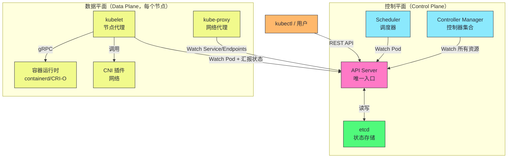
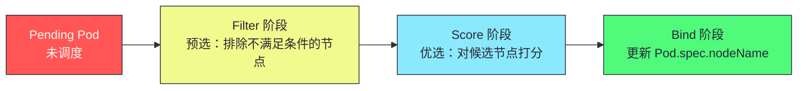
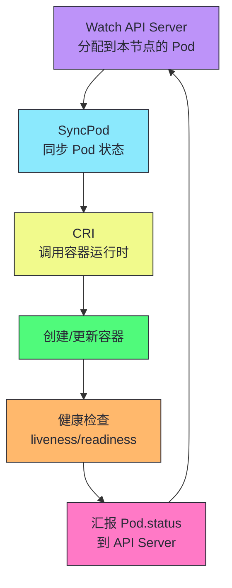
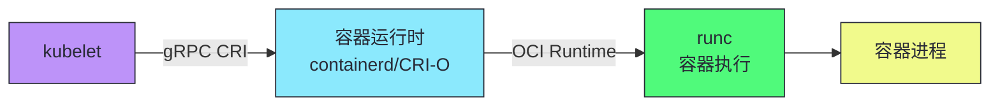
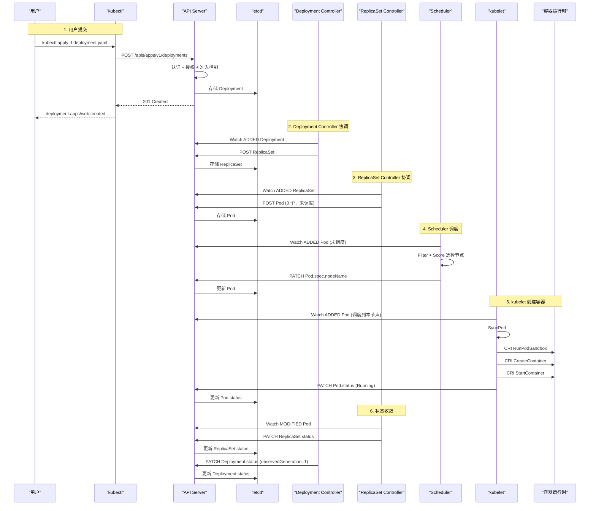
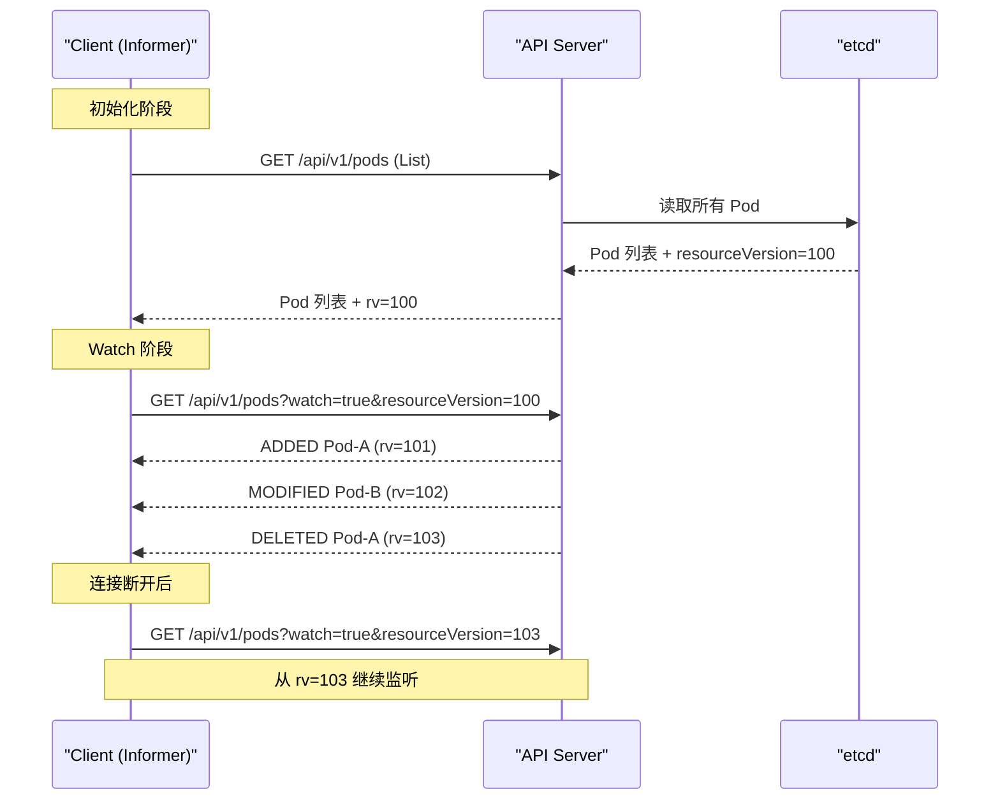
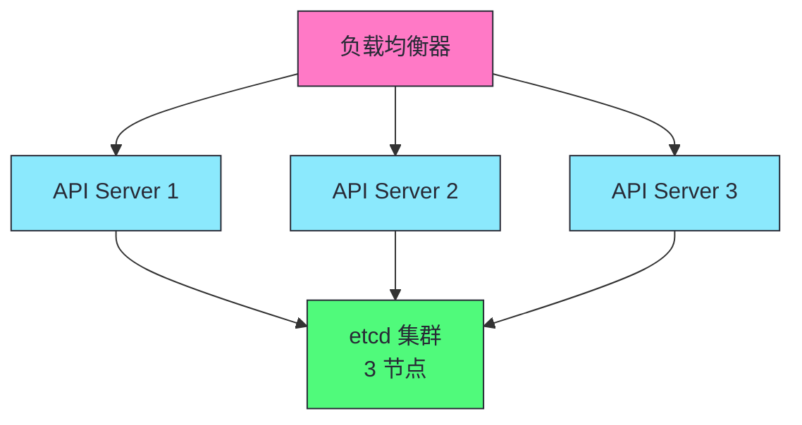
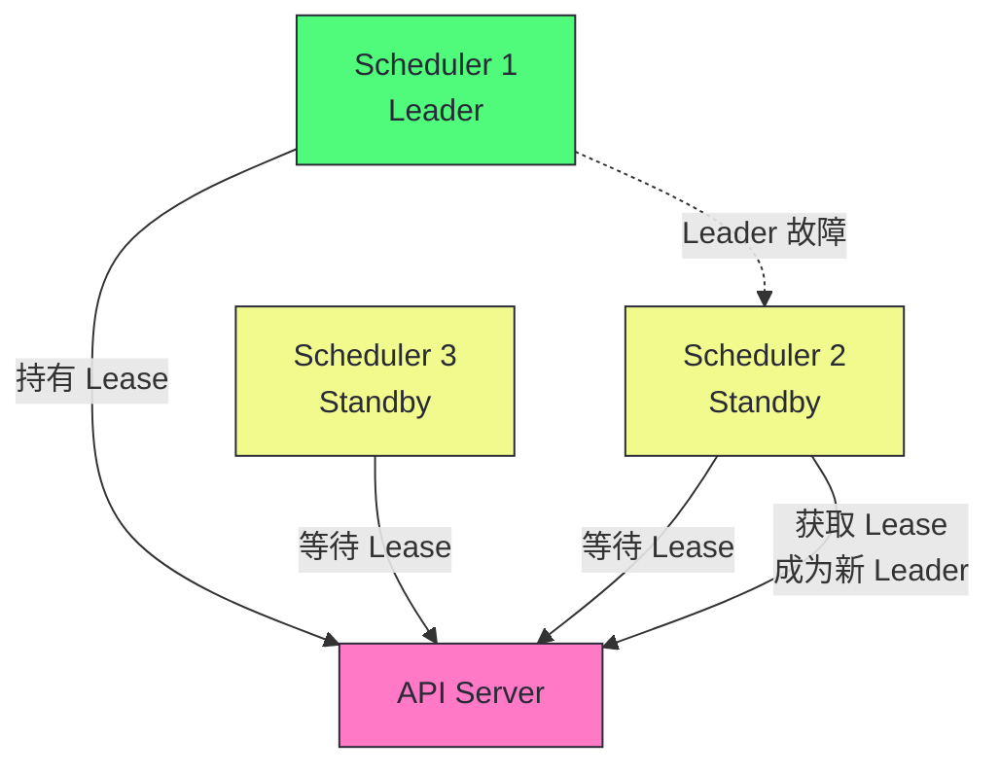

# 03 架构全景：控制平面、数据平面与一个 Pod 的完整生命周期

**摘要：**
本文从组件视角拆解 Kubernetes 的整体架构。K8s 分为控制平面（API Server、etcd、Scheduler、Controller Manager）和数据平面（kubelet、kube-proxy、容器运行时）。控制平面是"大脑"——做决策、存状态、协调组件；数据平面是"四肢"——执行决策、运行容器、实现网络。文章首先详解每个组件的职责和内部结构，追溯 K8s 架构从 Borg 到 Omega 再到 K8s 的演进脉络，然后用一个 Pod 从提交到运行的完整链路串联所有组件——`kubectl apply` → API Server → etcd → Deployment Controller → ReplicaSet Controller → Scheduler → kubelet → CRI → 容器运行时。之后深入组件间的通信协议——List-Watch、gRPC（CRI）、gRPC（CSI）、CNI 插件调用，以及这些协议选择背后的工程权衡。最后讨论控制平面的高可用架构——多实例 API Server 加 etcd 集群加 Leader Election，以及数据平面的容错机制。核心认知在于：K8s 的所有组件都是"无状态协调者"——除了 etcd 存储状态外，其他组件都是 Watch API Server 并做出反应，组件间没有直接通信，所有协调通过共享状态（etcd 中的对象）完成。理解这个架构原则，就掌握了 K8s 所有组件行为的钥匙。

---

## 第 1 章 控制平面：集群的大脑

### 1.1 从 Borg 到 K8s 的架构演进

在拆解 K8s 的组件之前，有必要回顾它的架构渊源。Borg 的架构是中心化的——Borgmaster 集群负责调度和状态管理，Borglet 运行在每个节点上执行任务。Borgmaster 内部又分为 scheduler（调度器）和 master logic（控制器逻辑），两者通过共享状态协调。这个设计在 Google 内部运行了十余年，证明了中心化控制平面加分布式数据平面的可行性。

Borg 的一个关键设计决策是把调度和执行分离——Borgmaster 做调度决策，Borglet 做实际执行，两者通过共享状态协调而非直接命令。这个设计被 K8s 完整继承——Scheduler 做调度决策，kubelet 做实际执行，两者通过 API Server 中的 Pod 对象协调。理解这个设计的延续性，就能理解 K8s 为什么选择"组件间不直接通信"的架构——它不是凭空发明的，而是 Borg 十余年实践的沉淀。

Omega 是 Borg 的下一代，它把 Borgmaster 的单体架构改为共享存储架构——所有控制器直接访问一个基于 Paxos 的共享存储（类比 K8s 的 etcd），控制器之间通过共享状态协调而非通过中心化的 master 传递。Omega 的架构已经非常接近 K8s——共享状态存储加多个独立控制器，但 Omega 仍然是 Google 内部项目，没有对外发布。Omega 的设计思想通过 Google 发表的论文（如《Omega: flexible, scalable schedulers for large compute clusters》）影响了 K8s 的架构设计。

K8s 继承了 Omega 的共享状态架构，但做了两个关键改进：第一，引入 API Server 作为共享存储的唯一访问入口，所有控制器不直接访问 etcd，而是通过 API Server 间接读写，这使得认证授权和准入控制可以统一实施；第二，把控制器的协调模式标准化为 List-Watch 加 Reconcile，而非 Omega 中各控制器自定义的访问模式。这两个改进使得 K8s 的架构既保持了 Omega 的解耦性，又具备了 Borg 的安全性。

从 Borg 到 Omega 再到 K8s 的演进，反映了一个清晰的架构趋势：控制平面从单体走向共享存储，从紧耦合走向松耦合，从内部专用走向对外通用。这个演进路径不是一蹴而就的——Borg 运行了十余年才演进到 Omega，Omega 的设计思想又经过数年才在 K8s 中落地。理解这个演进脉络，就能理解 K8s 架构中每一个设计选择的来龙去脉——它们不是凭空发明的，而是在前人实践基础上的改进与取舍。

### 1.2 控制平面的四个组件



控制平面的四个组件各有明确分工：API Server 是唯一入口，etcd 是唯一存储，Scheduler 负责调度决策，Controller Manager 负责状态协调。这种分工的核心设计原则是"单一职责"——每个组件只做一件事，组件间通过 API Server 间接通信，没有直接依赖。这种解耦使得任何一个组件的故障不会扩散到其他组件，是 K8s 高可用架构的基础。

值得对比的是 Borg 的架构。Borg 的 Borgmaster 是一个单体组件，集成了调度、状态管理、控制器逻辑——这种"大而全"的设计在 Google 内部运行良好，因为 Google 有足够的工程能力维护单体系统。但 K8s 面向外部开发者，单体架构的维护门槛太高，因此选择了"拆分为多个独立组件"的架构。这个选择的代价是组件间通信的复杂性——K8s 需要设计 List-Watch 协议、Leader Election 机制、多组件协调流程，这些都是单体架构不需要的。但收益是每个组件可以独立开发、独立部署、独立演进，这是 K8s 能够吸引大量社区贡献者的关键。

### 1.3 API Server：唯一入口

**API Server**（kube-apiserver）是 K8s 控制平面的"前台总调度"——所有组件和用户都通过它读写集群状态。API Server 是 K8s 架构中唯一一个所有组件都必须经过的组件，它的设计直接决定了 K8s 的安全模型和性能上限。API Server 的实现基于 Go 语言的 net/http 包，通过一组过滤器链处理每个请求。

| 职责 | 说明 |
|------|------|
| **RESTful API** | 提供 K8s 所有资源的 CRUD 接口 |
| **认证授权** | 验证请求者身份，检查是否有权限 |
| **准入控制** | 在写入前修改或验证对象 |
| **etcd 代理** | 所有 etcd 读写都经过 API Server |
| **Watch 端点** | 提供 List-Watch 协议支持事件流 |
| **缓存层** | 缓存热点资源减少 etcd 压力 |

> [!info] 核心概念：API Server 是 etcd 的"门卫"
> etcd 不对集群其他组件直接开放——只有 API Server 可以读写 etcd。这种设计有三个好处：(1) 统一的认证授权和准入控制——所有写操作经过 API Server 的安全检查；(2) 统一的 API 语义——客户端不需要了解 etcd 的内部数据结构；(3) 缓存层——API Server 缓存热点资源，减少 etcd 读取压力。这种"门卫"设计使得 etcd 可以专注于它的核心职责（一致性存储），而 API Server 处理 API 语义和安全。但这个设计也有代价：API Server 成为所有请求的必经之路，它的处理能力直接决定了集群的吞吐上限。在大规模集群中，API Server 的请求排队和 Watch 连接管理是需要重点优化的环节。

API Server 的内部架构也是一个多层流水线——从 HTTP 请求到 etcd 写入，需要经过认证、授权、准入控制、Schema 校验、转换、存储等多个阶段。这个流水线的详细分析将在第 04 篇展开，此处只需理解 API Server 不是一个简单的代理，而是一个功能丰富的 API 网关。

API Server 的一个关键设计是"无状态"——它不存储任何持久状态，所有状态都在 etcd 中。这个设计使得 API Server 可以水平扩展——多个实例并行运行，前面用负载均衡器分发请求。但 API Server 维护了内存中的 Watch 缓存，这个缓存是"软状态"——实例重启后缓存会重建，不影响数据正确性。理解 API Server 的"无状态"特性，是理解它为什么可以水平扩展的关键。

### 1.4 etcd：唯一持久化存储

**etcd** 是 K8s 的"唯一记忆"——集群所有状态都存在 etcd 中。etcd 是一个分布式键值存储，使用 Raft 共识算法保证强一致性。etcd 这个名字来自 Unix 的 `/etc` 目录（传统配置存储位置）加 "d"（distributed），暗示它是一个分布式的配置存储。etcd 由 CoreOS 团队开发，2018 年成为 CNCF 孵化项目，2020 年毕业。etcd 的 v3 版本是 K8s 的标配，相比 v2 版本引入了 gRPC 接口、扁平键空间和改进的 Watch 机制，这些特性使得 etcd v3 更适合 K8s 的大规模 Watch 场景。

| 特性 | 说明 |
|------|------|
| **强一致性** | Raft 共识，所有写操作经过 Leader |
| **Watch 机制** | 客户端可以监听 key 的变化 |
| **MVCC** | 多版本并发控制，支持历史版本查询 |
| **事务** | 支持 CAS（Compare-And-Swap）原子操作 |
| **Lease** | 支持租约（TTL key），用于心跳和锁 |

etcd 的选择并非偶然。在 K8s 设计之初，团队评估了多个存储方案：ZooKeeper（成熟但复杂，Java 生态）、Consul（功能丰富但一致性模型不如 etcd 严格）、自研存储（成本高）。etcd 的优势在于：Raft 算法比 Paxos 更易理解和实现，Go 语言与 K8s 同源便于集成，Watch 机制天然支持 K8s 的 List-Watch 协议，MVCC 支持乐观并发控制。这些特性使得 etcd 成为 K8s 的理想存储选择，但 etcd 的性能也直接制约了 K8s 集群的规模——etcd 的写入延迟在大集群中可能成为瓶颈，这也是为什么 K8s 社区持续优化 etcd 的性能和 API Server 的缓存策略。

etcd 在 K8s 中的角色可以用一句话概括：它是 K8s 的"唯一真相源"（single source of truth）。所有集群状态——Pod、Service、Deployment、ConfigMap、Secret——都存储在 etcd 中。如果 etcd 数据丢失，整个集群的状态就丢失了，即使所有节点和容器还在运行，K8s 也不知道它们的存在。这种"唯一真相源"的设计使得 K8s 的状态管理非常清晰——任何时刻只有一个权威的集群状态，所有组件都通过 API Server 访问这个状态，不存在多源数据的冲突问题。但这个设计的代价是 etcd 成为单点——etcd 故障意味着整个集群的状态管理失效，因此 etcd 的高可用是 K8s 高可用的重中之重。

> [!warning] 生产避坑：etcd 是 K8s 最重要的单点
> etcd 故障意味着整个集群的状态丢失——所有 Pod、Service、Deployment 的定义都消失了。etcd 必须有高可用部署（3 或 5 节点 Raft 集群）和定期备份。备份策略：(1) 定期 etcdctl snapshot save；(2) 备份存储到异地（如 S3）；(3) 定期演练恢复流程——很多团队备份了但从没验证过恢复，真出事时发现备份不可用。我们将在第 07 篇深入 etcd 的原理和运维。

### 1.5 Scheduler：调度决策者

**Scheduler**（kube-scheduler）决定 Pod 运行在哪个节点上。它是控制平面中唯一不运行控制器的组件——它的职责是单纯的调度决策。这个职责分离的设计使得调度器可以独立演进——譬如替换为自定义调度器（如 Volcano 用于批处理调度）而不影响其他组件。K8s 支持多调度器共存——你可以指定某个 Pod 用自定义调度器调度，其他 Pod 用默认调度器。

Scheduler 的"只做决策不做执行"设计还有一个工程收益：调度器故障不会影响已运行的工作负载。如果 Scheduler 崩溃，已调度的 Pod 继续在 kubelet 管理下运行，只是新的 Pending Pod 无法被调度——它们会等待 Scheduler 恢复后处理。这种"决策与执行分离"的设计使得 Scheduler 的故障影响范围被限制在"新 Pod 的调度"，而非"已有 Pod 的运行"，是 K8s 故障隔离设计的一个典型应用。

调度器的两阶段流程：



| 阶段 | 说明 | 示例 |
|------|------|------|
| **Filter** | 排除不满足条件的节点 | 资源不足、节点污点不匹配、亲和性违反 |
| **Score** | 对候选节点打分 | 资源均衡打分、亲和性打分、镜像本地性打分 |
| **Bind** | 将调度结果写入 API Server | 更新 Pod.spec.nodeName |

> [!note] 设计哲学：调度器只做决策，不做执行
> Scheduler 决定 Pod 运行在哪个节点后，不直接通知 kubelet——它只更新 Pod 的 spec.nodeName 字段。kubelet 通过 Watch 自己发现被分配的 Pod，然后创建容器。这种"通过共享状态协调"的模式使得调度器和 kubelet 完全解耦——调度器崩溃时，已调度的 Pod 仍能正常运行，只是新 Pod 无法被调度。这个设计是 K8s "共享状态协调"模式的典型应用——组件间不直接通信，而是通过 API Server 中的共享状态间接协调。调度器的详细分析将在第 11 篇展开。

### 1.6 Controller Manager：控制器集合

**Controller Manager**（kube-controller-manager）是一个进程，内部运行着数十个控制器，每个负责不同类型资源的协调。Controller Manager 是 K8s 控制平面的"协调中心"——它把"期望状态"持续转化为"现实状态"，是声明式 API 范式的核心执行者。如果说 API Server 是 K8s 的"大脑"负责存储和路由，Scheduler 是"调度官"负责分配资源，那 Controller Manager 就是"执行官"负责持续协调——它确保集群的现实状态不断向期望状态收敛。这种"持续协调"的工作模式是 K8s 自愈能力的核心来源。

| 控制器 | 职责 |
|--------|------|
| **Deployment Controller** | 管理 Deployment → ReplicaSet 的级联 |
| **ReplicaSet Controller** | 维护 Pod 副本数 |
| **StatefulSet Controller** | 管理 StatefulSet 的有序部署 |
| **Node Controller** | 监控节点健康状态 |
| **Endpoint Controller** | 维护 Service → Pod 的 Endpoints 映射 |
| **ServiceAccount Controller** | 为 Namespace 创建默认 ServiceAccount |
| **Garbage Collector** | 基于 OwnerReference 回收孤儿对象 |

> [!info] 核心概念：所有控制器共享一个进程但不共享状态
> kube-controller-manager 中运行的所有控制器共享一个进程，但每个控制器有自己的 Informer 和 WorkQueue——它们不共享缓存或队列。这种"同进程不同状态"的设计使得控制器之间不会相互影响（一个控制器卡住不会阻塞其他控制器），同时减少了进程数量。每个控制器可以独立启用/禁用（通过 `--controllers` 参数）。这种设计的代价是：一个控制器的内存泄漏或 panic 可能影响整个进程，因此关键控制器（如 Node Controller）在某些生产部署中会被拆分到独立进程运行。

---

## 第 2 章 数据平面：集群的四肢

### 2.1 kubelet：节点代理

**kubelet** 是运行在每个节点上的代理，负责管理该节点上 Pod 的生命周期。kubelet 是 K8s 数据平面中最重要的组件——它是控制平面决策的执行者，所有"创建容器"、"停止容器"、"健康检查"的动作都由 kubelet 在节点上实际执行。如果说 API Server 是 K8s 的"大脑"，那 kubelet 就是 K8s 的"双手"——大脑做决策，双手做执行，两者通过 API Server 中的共享状态协调。kubelet 是用 Go 语言编写的，与 K8s 其他组件同源。

| 职责 | 说明 |
|------|------|
| **Pod 生命周期管理** | 创建、更新、删除 Pod 的容器 |
| **健康检查** | 执行 livenessProbe/readinessProbe |
| **状态汇报** | 向 API Server 汇报 Pod 和 Node 的状态 |
| **资源管理** | 管理 CPU/内存/磁盘资源 |
| **垃圾回收** | 清理已退出的容器和镜像 |

kubelet 的工作流程：



kubelet 的工作流程是一个典型的"观察-比较-行动"协调循环——Watch 感知 Pod 变化，SyncPod 比较期望与现实，CRI 执行容器操作，Probe 检查健康状态，Status 汇报结果。这个循环与第 02 篇讨论的控制器协调循环在结构上完全一致，区别在于 kubelet 的"行动"是操作容器而非更新 API 对象。这种结构上的一致性并非偶然——K8s 的所有组件都遵循同一个协调模式，只是"行动"的具体内容不同。

kubelet 的一个设计细节值得注意：它不只 Watch Pod，还负责汇报 Node 状态。kubelet 定期向 API Server 发送心跳（通过更新 Node 的 status），Node Controller 通过观察心跳判断节点是否健康。如果 kubelet 自身故障（无法发送心跳），Node Controller 会在 `pod-eviction-timeout` 后驱逐该节点的 Pod。这种"kubelet 自我汇报"的设计使得节点故障检测不需要额外的监控机制——节点状态本身就是 K8s 资源，纳入了声明式协调框架。kubelet 的详细分析将在第 13 篇展开。

kubelet 还负责 Pod 的健康检查——livenessProbe 和 readinessProbe。livenessProbe 判断容器是否存活，失败时 kubelet 会重启容器；readinessProbe 判断容器是否就绪，失败时 kubelet 会把 Pod 从 Service 的 Endpoints 中移除（通过更新 Pod 的 status.conditions）。这两个探针的设计使得 K8s 能够自动处理容器级别的故障——无需外部监控，kubelet 自身就能检测并恢复故障容器。但探针的配置需要谨慎——过于敏感的 livenessProbe 可能在容器启动期间误判为失败，导致容器被反复重启；过于迟钝的 readinessProbe 可能导致流量被路由到尚未就绪的容器。

### 2.2 kube-proxy：网络代理

**kube-proxy** 运行在每个节点上，负责实现 Service 的负载均衡——将发往 Service IP 的流量转发到后端 Pod。kube-proxy 是 K8s 网络模型的关键组件——它把"Service 这个虚拟 IP"映射到"实际的 Pod IP"，使得客户端可以用稳定的 Service IP 访问一组动态变化的 Pod。

Service 的虚拟 IP（ClusterIP）是一个稳定的网络端点——无论后端 Pod 如何变化（创建、删除、重启），Service IP 保持不变。kube-proxy 的职责就是维护"Service IP 到 Pod IP"的映射关系——当 Pod 变化时，kube-proxy 更新本节点的网络规则，使得发往 Service IP 的流量被转发到当前健康的 Pod。这种"稳定入口加动态后端"的设计是 K8s 服务发现的基础。

| 模式 | 机制 | 特点 |
|------|------|------|
| **iptables** | 用 iptables 规则做 DNAT | 默认模式，性能稳定 |
| **IPVS** | 用 IPVS 做负载均衡 | 大规模 Service 性能更好 |
| **eBPF** | 用 eBPF 程序做数据面 | Cilium 等新型 CNI 使用 |

> [!note] 设计哲学：kube-proxy 是控制平面组件但运行在数据平面
> kube-proxy 运行在每个节点上（数据平面位置），但它的职责是"配置网络规则"而非"转发数据包"——实际数据包转发由内核的 iptables/IPVS/eBPF 完成。kube-proxy 只是 Watch Service 和 Endpoints 的变化，更新本节点的网络规则。这种"控制平面配置 + 内核数据面转发"的设计使得转发性能不受用户态进程影响。但这个设计也有代价：iptables 模式在大规模集群中规则数量线性增长（数千 Service 意味着数万条 iptables 规则），规则更新需要全量替换，延迟可达秒级。IPVS 模式通过哈希表查找解决了规则数量问题，但需要内核加载 IPVS 模块。kube-proxy 的详细分析将在第 14 篇展开。

### 2.3 容器运行时：CRI 接口

**容器运行时**（containerd、CRI-O）负责实际的容器创建、启动、停止。kubelet 通过 **CRI（Container Runtime Interface）** gRPC 接口与容器运行时通信。容器运行时是 K8s 数据平面的最底层——它直接管理容器进程的生命周期，是 Pod 从"API 对象"变为"运行中进程"的最后一环。

容器运行时的层级结构也值得理解。containerd 本身不直接运行容器——它调用 OCI Runtime（通常是 runc）来创建和运行容器。runc 是 OCI Runtime 规范的参考实现，它直接操作 Linux 的 namespace 和 cgroup 来隔离和限制容器进程。这种"高层运行时（containerd）加低层运行时（runc）"的分层设计使得各层可以独立演进——containerd 负责镜像管理和容器生命周期，runc 负责容器隔离和资源限制。K8s 通过 CRI 与 containerd 通信，containerd 通过 OCI Runtime 接口与 runc 通信，每一层都有明确的职责边界。



CRI 接口的主要方法：

| 方法 | 说明 |
|------|------|
| **RunPodSandbox** | 创建 Pod 的网络/IPC 命名空间 |
| **CreateContainer** | 在 Pod 沙箱中创建容器 |
| **StartContainer** | 启动容器 |
| **StopContainer** | 停止容器 |
| **RemoveContainer** | 删除容器 |
| **ListContainers** | 列出容器 |
| **ContainerStatus** | 获取容器状态 |

> [!info] 核心概念：CRI 解耦了 kubelet 和容器运行时
> CRI 接口使得 kubelet 不依赖特定容器运行时——你可以用 containerd、CRI-O 或任何 CRI 兼容的运行时。这是 K8s "可扩展性优先" 原则在数据平面的体现。早期 K8s 直接调用 Docker API，后来抽象出 CRI 接口解耦。Docker 由于不支持 CRI 而需要 dockershim 适配层，K8s 1.24 移除了 dockershim，现在主流运行时是 containerd。CRI 的引入是 K8s 架构演进的一个典型案例——从"直接依赖特定实现"到"通过接口抽象解耦"，这种演进模式在 K8s 的多个组件中反复出现（CSI 解耦存储、CNI 解耦网络、CRI 解耦运行时），体现了 K8s "可扩展性优先"的设计哲学。

---

## 第 3 章 一个 Pod 的完整生命周期

### 3.1 从 kubectl apply 到 Pod Running 的完整链路



### 3.2 每一步的详细解析

#### 步骤 1：用户提交

```bash
kubectl apply -f deployment.yaml
```

kubectl 读取 YAML 文件，通过 REST API 发送 POST 请求到 API Server。API Server 执行：
1. **认证**：验证客户端证书或 Token
2. **授权**：检查用户是否有权创建 Deployment
3. **准入控制**：Mutating Webhook 修改对象 → Validating Webhook 验证对象
4. **持久化**：将对象序列化后写入 etcd

这一步的耗时主要在认证授权和准入控制——如果配置了外部 Webhook（如 OPA Gatekeeper），准入控制可能需要调用外部服务，延迟可达数十毫秒。在大规模集群中，准入控制的延迟是需要关注的性能瓶颈。

kubectl 在这一步还做了一个容易被忽视的工作：本地校验。kubectl 在发送请求前会用本地的 schema 信息校验 YAML 的基本结构（字段名是否正确、必填字段是否缺失），避免无效请求浪费 API Server 的处理能力。但本地校验不是强制的——直接用 curl 发送 POST 请求可以绕过本地校验，API Server 的服务端校验才是最终的防线。

#### 步骤 2：Deployment Controller 协调

Deployment Controller 通过 Informer Watch 到新 Deployment，执行 Reconcile：
1. 发现 Deployment 没有 ReplicaSet
2. 创建一个新 ReplicaSet（ownerReference 指向 Deployment）

这一步是异步的——Deployment Controller 通过 Watch 感知新 Deployment，延迟取决于 Watch 事件的传播速度（通常毫秒级）。Deployment Controller 在创建 ReplicaSet 时会计算 ReplicaSet 的模板——从 Deployment 的 spec.template 中提取 Pod 模板，加上版本号（基于 Pod 模板的 hash），生成 ReplicaSet 的 name。这个版本号机制使得 Deployment 的滚动更新可以通过创建新 ReplicaSet 实现——新模板生成新 ReplicaSet，旧 ReplicaSet 被缩容到 0，但保留以便回滚。

#### 步骤 3：ReplicaSet Controller 协调

ReplicaSet Controller Watch 到新 ReplicaSet，执行 Reconcile：
1. 发现 ReplicaSet 期望 3 个副本，当前 0 个
2. 创建 3 个 Pod 对象（ownerReference 指向 ReplicaSet，未设置 nodeName）

这一步同样是异步的，ReplicaSet Controller 独立于 Deployment Controller 运行，两者通过 API Server 中的共享状态协调。ReplicaSet Controller 在创建 Pod 时会应用一些默认值——譬如如果 Pod 没有指定 serviceAccountName，会注入默认的 ServiceAccount；如果 Namespace 没有默认的 ImagePullPolicy，会根据镜像 tag 设置（latest 默认 Always，其他默认 IfNotPresent）。这些默认值注入是通过准入控制器（Mutating Admission Webhook）完成的，而非 ReplicaSet Controller 自己，体现了 K8s 的职责分离设计。

ReplicaSet Controller 创建 Pod 时还有一个细节：Pod 的 name 是自动生成的——ReplicaSet 的 name 加上随机后缀（如 `web-abc123`）。这个随机后缀保证了 Pod name 的唯一性，即使 ReplicaSet 被删除重建，新创建的 Pod 也不会与旧 Pod 同名。但这个设计也意味着 Pod name 不可预测——如果你需要稳定的 Pod 标识（如 DNS 名称），需要用 StatefulSet 而非 Deployment。

#### 步骤 4：Scheduler 调度

Scheduler Watch 到未调度的 Pod（spec.nodeName 为空），执行调度：
1. **Filter**：排除资源不足或不符合约束的节点
2. **Score**：对候选节点打分
3. **Bind**：更新 Pod.spec.nodeName 为选中的节点

调度是整个链路中计算密集度最高的一步——Filter 需要评估所有节点，Score 需要对候选节点打分。在大规模集群中（数千节点），单次调度的耗时可能达到百毫秒级，这也是为什么 Scheduler 是控制平面中需要重点优化性能的组件。

Scheduler 的调度决策基于多种因素：资源请求（CPU/内存）、节点亲和性（nodeSelector/nodeAffinity）、Pod 亲和性/反亲和性（podAffinity/podAntiAffinity）、污点容忍（tolerations）、数据局部性（镜像是否已在节点上）。这些因素在 Filter 阶段作为硬约束（不满足则排除节点），在 Score 阶段作为软约束（满足则加分）。理解这些调度因素如何影响 Pod 的分布，是优化集群资源利用率的关键。

Scheduler 的调度还有一个容易被忽视的细节：调度是基于"资源请求"而非"实际使用"。Scheduler 根据 Pod 的 `spec.containers[].resources.requests` 评估节点是否有足够资源，而非根据节点当前的 CPU/内存使用率。这意味着节点可能"看起来有空闲资源"（实际使用率低），但 Scheduler 不会把 Pod 调度到它（因为所有 requests 已经被分配）。这种"基于请求而非使用"的调度方式使得资源分配可预测——Pod 一旦调度成功，它的资源请求就被保证，不会因为其他 Pod 的突发使用而被挤压。

#### 步骤 5：kubelet 创建容器

目标节点的 kubelet Watch 到分配给自己的 Pod，执行 SyncPod：
1. 创建 Pod 沙箱（网络/IPC 命名空间）
2. 拉取容器镜像（如本地不存在）
3. 创建并启动容器
4. 执行启动后钩子（PostStart）
5. 开始健康检查（livenessProbe/readinessProbe）
6. 更新 Pod.status

这一步的耗时主要在镜像拉取——如果镜像不在本地，拉取可能需要数十秒甚至数分钟。生产环境中通常通过预拉取镜像（如 DaemonSet 部署常用镜像）或使用镜像缓存加速这一步。

kubelet 的 SyncPod 是一个"声明式同步"过程——它比较 Pod 的期望状态（spec 中的容器定义）和当前状态（节点上实际运行的容器），采取行动消除差异。如果 Pod 的 spec 变化了（譬如镜像更新），kubelet 会停止旧容器、启动新容器；如果 Pod 被删除，kubelet 会停止并清理所有容器。这种"基于期望状态同步"的设计使得 kubelet 能够处理任何状态变化——无论是新建、更新还是删除，核心逻辑都是"比较期望与现实，消除差异"。

#### 步骤 6：状态收敛

ReplicaSet Controller Watch 到 Pod 状态变化，更新 ReplicaSet.status。Deployment Controller Watch 到 ReplicaSet 状态变化，更新 Deployment.status（observedGeneration）。

这一步是状态逐级回传的过程——Pod 状态变化触发 ReplicaSet Controller 更新 ReplicaSet status，ReplicaSet status 变化触发 Deployment Controller 更新 Deployment status。每一级都是异步的，端到端的状态收敛延迟是各级延迟的叠加。

状态收敛的"逐级回传"设计使得每一级控制器只需要关注自己直接管理的资源——Deployment Controller 不需要直接观察 Pod 状态，它只需要看 ReplicaSet 的 status 就知道整体情况。这种"关注点分离"降低了每个控制器的复杂度，但也意味着端到端的状态可见性需要经过多级传播。对于需要实时感知 Pod 状态的场景（如自动扩缩容），HPA 控制器直接 Watch Pod 的 metrics 而非依赖 Deployment status，以减少状态传播延迟。

> [!info] 核心概念：全链路是异步的、事件驱动的、最终一致的
> 从 `kubectl apply` 到 Pod Running，全链路没有任何"同步阻塞"——每个组件独立 Watch、独立决策、独立行动。这种异步性使得单个组件的延迟不会阻塞其他组件，但也意味着整个流程的完成需要时间（通常数秒到数十秒）。kubectl apply 返回成功只表示"对象已存储到 etcd"，不表示"Pod 已运行"——用户需要通过 `kubectl rollout status` 或 `kubectl wait` 等待最终状态收敛。这种"提交即返回，异步收敛"的模式是声明式 API 的核心特征，也是 K8s 与命令式编排系统的根本区别。

理解这个全链路的异步性，对于生产环境的运维至关重要。譬如在 CI/CD 流水线中，部署一个新版本后不能立即认为部署完成——需要等待 Pod 就绪（`kubectl wait --for=condition=ready pod/...`），否则流量可能被路由到尚未就绪的 Pod。再譬如在自动扩缩容中，HPA 触发扩容后不能立即认为容量已增加——需要等待新 Pod 调度、启动、通过健康检查，这个过程可能需要 30-60 秒。在需要快速响应的场景下，这个延迟需要通过预留冗余容量来缓解。

---

## 第 4 章 组件间的通信协议

### 4.1 通信协议全景

| 通信路径 | 协议 | 说明 |
|---------|------|------|
| 客户端 ↔ API Server | HTTPS REST | kubectl、SDK 访问 K8s API |
| API Server ↔ etcd | gRPC | etcd 的原生协议 |
| 组件 ↔ API Server | HTTPS REST + Watch | List-Watch 协议 |
| kubelet ↔ 容器运行时 | gRPC CRI | 容器运行时接口 |
| kubelet ↔ CSI 插件 | gRPC CSI | 容器存储接口 |
| kubelet ↔ CNI 插件 | 二进制调用 | 容器网络接口（exec 插件二进制） |

这些协议的选择并非随意——每种协议都对应特定的工程权衡。REST 用于外部 API（兼容性优先），gRPC 用于内部通信（性能优先），二进制调用用于 CNI（简单性优先，CNI 插件生命周期短，gRPC 的连接管理开销不划算）。理解这些协议选择，就理解了 K8s 在"兼容性"、"性能"、"简单性"之间的权衡逻辑。这种"按通信场景选择协议"的设计方式，比"所有通信统一用一种协议"更高效，但也要求开发者理解多种协议的特性。

这种"不同通信路径用不同协议"的设计也带来了一个挑战：调试时需要理解多种协议。譬如排查 Pod 创建问题，可能需要看 API Server 的 REST 日志（用户请求阶段）、etcd 的 gRPC 日志（存储阶段）、kubelet 的 CRI gRPC 日志（容器创建阶段）、CNI 的二进制调用日志（网络配置阶段）。这些日志分散在不同组件中，格式各异，是 K8s 运维复杂度的一个来源。分布式追踪（如 OpenTelemetry）可以缓解这个问题，但 K8s 内部组件的追踪支持仍然有限。

### 4.2 List-Watch 协议

K8s 组件与 API Server 的主要通信方式是 **List-Watch**。List-Watch 是 K8s 架构的"分布式神经系统"——所有组件都通过它感知状态变化，它是组件间解耦协调的技术基础。没有 List-Watch，组件只能轮询 API Server，在大规模集群中轮询的开销是不可接受的。



List-Watch 的两阶段设计：

1. **List 阶段**：一次性获取所有对象的当前状态和 resourceVersion
2. **Watch 阶段**：从 resourceVersion 开始持续监听变更事件

> [!note] 设计哲学：List-Watch 保证不丢失事件
> 为什么不直接 Watch 而要先 List？因为如果直接 Watch，客户端不知道从哪个 resourceVersion 开始——可能错过 Watch 连接建立前的变更。先 List 获取当前状态和 resourceVersion，再从该 resourceVersion 开始 Watch，确保不丢失任何事件。如果 Watch 连接断开，客户端用最后收到的 resourceVersion 重新 Watch——API Server 会从该版本之后的所有事件重新发送。这是 K8s 分布式神经系统的基础——所有组件都依赖 List-Watch 获取状态变化。List-Watch 的详细分析将在第 06 篇展开。

List-Watch 的一个工程细节是 Watch 连接的管理。在大规模集群中，可能有数百个组件同时 Watch 同一资源（譬如所有 kubelet 都 Watch Pod），API Server 需要管理大量长连接。K8s 通过 Watch 缓存（API Server 内存中缓存资源状态）和事件合并（多个 Watch 客户端共享同一份事件流）优化连接管理，但 Watch 连接数仍然是 API Server 的资源瓶颈之一。生产环境中可以通过限制 Watch 的资源范围（如只 Watch 特定 Namespace）减少连接压力。

### 4.3 CRI：容器运行时接口

kubelet 通过 CRI gRPC 接口与容器运行时通信。CRI 定义了两类服务：

| 服务 | 方法 | 说明 |
|------|------|------|
| **RuntimeService** | RunPodSandbox, StopPodSandbox | Pod 沙箱管理 |
| | CreateContainer, StartContainer, StopContainer | 容器生命周期 |
| | ListContainers, ContainerStatus | 容器查询 |
| **ImageService** | ListImages, PullImage, RemoveImage | 镜像管理 |

CRI 的 gRPC 选择值得说明。kubelet 与容器运行时之间的调用频率很高（每个 Pod 的创建、停止、状态查询都是 CRI 调用），gRPC 的二进制编码和 HTTP/2 多路复用比 REST 更高效。但 gRPC 的劣势在于调试不便——无法用 curl 直接调用 CRI 接口，需要借助 crictl 等专用工具。K8s 在这里选择了性能优先，因为 kubelet 与容器运行时在同一节点上通信，延迟敏感度高。

CRI 的引入也经历了一个演进过程。早期 K8s 直接调用 Docker API，没有抽象层——kubelet 的代码中嵌入了 Docker 客户端，直接操作 Docker 容器。这种紧耦合使得 K8s 难以支持其他容器运行时（如 rkt），也使得 Docker 的 API 变化直接影响 K8s。CRI 的引入把"容器运行时"抽象为接口，kubelet 只依赖接口而非具体实现，使得 containerd、CRI-O 等运行时可以无缝替换 Docker。这个演进是 K8s "可扩展性优先"原则的典型应用——通过接口抽象解耦具体实现，使得系统可以灵活替换组件。

CRI 的引入也带来了一些兼容性挑战。Docker 早期不支持 CRI 接口，K8s 通过 dockershim 适配层让 kubelet 能与 Docker 通信。但维护 dockershim 增加了 K8s 的维护成本，且 Docker 的架构（Docker daemon 加 containerd）比直接用 containerd 多了一层，性能和稳定性都有损耗。K8s 1.24 移除了 dockershim，标志着 K8s 彻底放弃了对 Docker 的原生支持，转向直接支持 CRI 兼容的运行时（如 containerd、CRI-O）。这个迁移对大多数用户是无感的——containerd 与 Docker 使用相同的镜像格式，应用的容器定义不需要修改。

### 4.4 CNI：容器网络接口

CNI 不同于 CRI/CSI——它不是 gRPC 接口，而是**二进制插件调用**。kubelet 在创建 Pod 沙箱时，调用 CNI 插件二进制文件配置网络。CNI 的全称是 Container Network Interface，由 CoreOS 团队（与 etcd 同源）提出，是一个比 K8s 更早的项目，最初为 rkt 容器运行时设计，后来被 K8s 采纳为网络插件标准。

```bash
# kubelet 调用 CNI 插件（简化示例）
/opt/cni/bin/calico < /etc/cni/net.d/10-calico.conf
```

> [!warning] 生产避坑：CNI 插件是二进制调用，不是常驻进程
> CNI 插件是 kubelet 在创建/删除 Pod 时调用的二进制文件——它不是常驻进程。每次调用时，kubelet 将 CNI 配置和容器信息通过 stdin 传递给插件二进制，插件执行完毕后退出。这意味着 CNI 插件不能依赖"上次调用时的内存状态"——每次调用都必须从配置文件或 API 重新获取所需信息。理解 CNI 的"无状态二进制"特性很重要——它影响 CNI 插件的调试方式和性能特征。CNI 的详细分析将在第 15 篇展开。

CNI 选择二进制调用而非 gRPC 的原因是简单性——CNI 插件的生命周期极短（配置网络接口只需毫秒级），gRPC 的连接建立和管理开销不划算。二进制调用的劣势是每次调用都有进程启动开销，但对于低频调用（Pod 创建/删除）这个开销可以接受。这个选择体现了"简单性优先于通用性"的工程原则——CNI 的设计目标是"让网络插件实现尽可能简单"，而非"提供最通用的接口"。

CNI 的二进制调用模型也影响插件的实现方式——插件不能维护内存状态（因为每次调用是新进程），必须把状态存储在节点上的文件或 API 中。譬如 Calico 把网络配置存储在节点的 `/etc/cni/net.d/` 目录和 Felix 守护进程中，CNI 二进制插件在调用时读取这些配置。这种"无状态二进制加外部状态存储"的设计使得 CNI 插件的调试相对简单——可以直接运行插件二进制并传入测试配置，观察其行为，而不需要模拟一个完整的 gRPC 服务端。

---

## 第 5 章 控制平面的高可用架构

### 5.1 多实例加 Leader Election

K8s 控制平面的高可用采用**多实例加 Leader Election** 模式：

| 组件 | 高可用方式 | 说明 |
|------|----------|------|
| **API Server** | 多实例 + 负载均衡 | 所有实例都活跃，无 Leader Election |
| **etcd** | Raft 集群 | 3 或 5 节点，Raft 选主 |
| **Scheduler** | 多实例 + Leader Election | 只有 Leader 做调度决策 |
| **Controller Manager** | 多实例 + Leader Election | 只有 Leader 运行控制器 |

这四种高可用方式的差异反映了组件特性的差异。API Server 是无状态的，可以水平扩展——多实例并行处理请求，吞吐量随实例数线性增长。etcd 是有状态的强一致性存储，必须用 Raft 集群保证一致性——写入需要多数派确认，因此 3 节点集群只能容忍 1 节点故障，5 节点集群能容忍 2 节点故障。Scheduler 和 Controller Manager 是"有状态协调者"——如果多个实例同时运行，可能产生冲突决策（譬如两个 Scheduler 把同一个 Pod 调度到不同节点），因此用 Leader Election 确保只有一个实例工作。

这种"按组件特性选择高可用方式"的设计体现了 K8s 的务实态度——没有追求"所有组件都用同一种高可用方式"的统一性，而是根据每个组件的实际特性选择最合适的方式。API Server 的无状态特性使得它可以受益于水平扩展，etcd 的强一致性需求使得它必须用 Raft，Scheduler/Controller Manager 的决策排他性使得它们必须用 Leader Election。这种"因材施用"的设计方式比"一刀切"更高效，但也增加了架构的复杂度——运维者需要理解每种高可用方式的工作原理和故障模式。

这种"因材施用"的高可用设计也意味着 K8s 的故障模式是多样化的——API Server 故障表现为请求超时，etcd 故障表现为写入失败，Scheduler/Controller Manager 故障表现为协调停滞。运维者需要针对每种故障模式设计不同的监控和恢复策略，这比"所有组件用同一种高可用方式"的统一监控更复杂，但能更精确地定位和处理故障。

### 5.2 API Server 的水平扩展

API Server 是无状态的（状态都在 etcd），可以水平扩展——多个实例并行运行，前面用负载均衡器分发请求。



API Server 的"无状态"需要精确理解——它不存储持久状态，但维护了 Watch 缓存（内存中的资源缓存）。多个 API Server 实例各自维护自己的 Watch 缓存，缓存通过 etcd 的 Watch 事件保持一致。但缓存一致性是最终一致的——一个 API Server 实例可能比另一个实例晚几毫秒收到 etcd 的变更事件，这意味着通过不同 API Server 实例的 Watch 客户端可能短暂看到不同的状态。对于大多数场景这个延迟可以忽略，但对于强一致性要求高的场景（譬如基于 Watch 做实时决策的控制器），需要理解这个缓存延迟的存在。

API Server 的水平扩展也受限于 etcd 的性能——虽然 API Server 可以水平扩展，但所有实例共享同一个 etcd 集群，etcd 的写入能力是 API Server 吞吐量的天花板。在大规模集群中，etcd 的写入延迟可能成为瓶颈，这也是为什么 K8s 社区在持续优化 etcd 的性能（如 etcd v3.4 的并行读、v3.5 的 gRPC gateway）和 API Server 的缓存策略（如分页 List、Watch 缓存压缩）。

### 5.3 Scheduler 和 Controller Manager 的 Leader Election

Scheduler 和 Controller Manager 使用 Leader Election——多个实例运行，但只有 Leader 做实际工作，其他实例待命。Leader 故障后，其他实例通过 Lease 竞选新 Leader。



> [!info] 核心概念：Leader Election 用 Lease 资源实现
> Scheduler 和 Controller Manager 的 Leader Election 通过一个 Lease 资源实现——Leader 定期更新 Lease 的 renewTime，其他实例检查 Lease 是否过期。如果过期，尝试获取 Lease 成为新 Leader。这种基于 Lease 的选举机制依赖于 API Server 和 etcd 的可用性——如果 API Server 不可用，Leader 无法续约，其他实例也无法获取 Lease，整个控制平面停滞。这也是为什么 API Server 和 etcd 的高可用是 K8s 高可用的基础。Leader Election 的故障切换时间取决于 Lease 的 TTL（默认 15 秒）——Leader 故障后，其他实例需要等待 Lease 过期才能竞选，这个延迟在生产环境中需要评估是否可接受。

Leader Election 的一个潜在问题是"脑裂"风险——如果 Leader 由于网络分区无法续约 Lease，但仍然认为自己是 Leader 并继续做决策，而其他实例已经选出了新 Leader，就会出现两个 Leader 同时工作的情况。K8s 通过 Lease 的原子性（基于 etcd 的 CAS）避免了这个问题——Lease 的更新是原子的，只有一个实例能成功获取 Lease。但旧 Leader 在感知到自己失去 Lease 之前可能已经做了一些决策（如调度了 Pod），这些决策不会自动回滚。这是分布式系统中"脑裂"问题的典型表现，K8s 的处理方式是接受这个短暂的不一致，依赖后续的协调循环纠正。

---

## 第 6 章 数据平面的高可用

### 6.1 kubelet 和 kube-proxy 的容错

kubelet 和 kube-proxy 运行在每个节点上，是"单节点单实例"的。它们的容错方式与控制平面不同：

| 组件 | 故障影响 | 恢复方式 |
|------|---------|---------|
| **kubelet 故障** | 该节点上的 Pod 无法被管理（不能创建/删除容器） | 重启 kubelet，恢复管理能力 |
| **kube-proxy 故障** | 该节点上的 Service 网络规则不更新 | 重启 kube-proxy，恢复规则同步 |
| **节点故障** | 该节点上所有 Pod 丢失 | Node Controller 检测后驱逐 Pod，ReplicaSet Controller 在其他节点重建 |

数据平面的容错逻辑与控制平面不同。控制平面通过多实例加选举实现高可用，数据平面通过"节点故障后重建 Pod"实现容错——不试图让故障节点恢复，而是把 Pod 迁移到健康节点。这种"重建而非修复"的容错策略是 K8s 面向终态设计的体现——控制器持续比较期望状态（ReplicaSet 的 replicas）和当前状态（实际运行的 Pod 数），发现差异就采取行动消除差异，无论差异的来源是节点故障还是其他原因。

这种"重建而非修复"的策略有一个前提：Pod 必须是无状态的或状态可恢复的。对于无状态应用（如 Web 服务），重建 Pod 没有任何代价——新 Pod 与旧 Pod 功能等价。对于有状态应用（如数据库），重建 Pod 可能导致数据丢失——如果数据存在本地磁盘，节点故障时磁盘可能不可用。这就是为什么 K8s 引入了 StatefulSet（有序、稳定的 Pod 标识）和 PersistentVolume（持久化存储与 Pod 解耦）——它们使得有状态应用也能在"重建而非修复"的容错模型下运行，但代价是增加了配置复杂度。

"重建而非修复"的策略也影响了 K8s 的运维文化。在传统运维中，节点故障的第一反应是"修复节点"——登录节点排查问题，恢复服务。在 K8s 运维中，节点故障的第一反应是"驱逐工作负载"——让 Pod 在其他节点重建，故障节点可以后续排查。这种文化转变使得 K8s 运维更关注"工作负载的可用性"而非"节点的可用性"，是云原生运维与传统运维的一个根本区别。

### 6.2 节点故障的完整恢复链路

```
节点故障 → kubelet 心跳停止 → Node Controller 标记 NotReady
→ 等待 pod-eviction-timeout（默认 5 分钟）
→ Pod 标记 Terminating → ReplicaSet Controller 发现副本数不足
→ 创建新 Pod → Scheduler 调度到健康节点 → kubelet 创建容器
```

> [!warning] 生产避坑：pod-eviction-timeout 是关键参数
> 节点故障后，K8s 等待 pod-eviction-timeout（默认 5 分钟）才开始驱逐 Pod。对于需要快速故障转移的场景（如延迟敏感的在线服务），5 分钟太长。解决方案：(1) 缩短 pod-eviction-timeout（但太短会导致网络抖动时误判节点故障）；(2) 使用 Pod 反亲和性将副本分散到不同节点，单节点故障只影响部分副本；(3) 使用 PDB（PodDisruptionBudget）确保驱逐时保持最小可用副本数。这个参数的调整是一个典型的权衡——缩短超时加快故障恢复，但增加误判风险；延长超时减少误判，但故障恢复慢。没有最优值，只有适合特定场景的值。

节点故障的恢复链路还涉及一个容易被忽视的环节：Pod 的优雅终止。当 Pod 被标记为 Terminating 后，kubelet 会先执行 PreStop 钩子，然后发送 SIGTERM 信号给容器，等待 `terminationGracePeriodSeconds`（默认 30 秒）后如果容器仍未退出则发送 SIGKILL。但节点故障时 kubelet 已经不可用，无法执行优雅终止——Pod 会被直接强制终止。这意味着节点故障场景下，Pod 内的应用没有机会做清理工作（如关闭数据库连接、保存状态），因此应用必须设计为能够处理非优雅终止——譬如使用幂等的启动逻辑，确保重启后能从任何状态恢复。

---

## 结语

K8s 架构全景的核心可以归纳为以下主线。控制平面是大脑，数据平面是四肢——控制平面（API Server/etcd/Scheduler/Controller Manager）做决策存状态，数据平面（kubelet/kube-proxy/容器运行时）执行决策运行容器。API Server 是唯一入口和 etcd 门卫——所有组件通过 API Server 读写状态，API Server 处理认证授权准入控制，etcd 不对其他组件直接开放。etcd 是唯一持久化存储和最重要的单点——所有集群状态存在 etcd 中，必须高可用部署（3/5 节点 Raft）和定期备份。Scheduler 只做决策不做执行——Filter 加 Score 加 Bind，更新 Pod.spec.nodeName，kubelet 通过 Watch 自己发现被分配的 Pod。Controller Manager 是控制器集合——数十个控制器共享一个进程但各自有独立 Informer 和 WorkQueue，互不影响。

kubelet 通过 CRI 与容器运行时通信——CRI gRPC 接口解耦 kubelet 和容器运行时，containerd 是主流运行时。kube-proxy 配置网络规则而非转发数据包——实际转发由内核 iptables/IPVS/eBPF 完成。Pod 生命周期是全链路异步协调——kubectl apply 到 Pod Running 的每一步都是 Watch 加 Reconcile，没有同步阻塞。List-Watch 是 K8s 的分布式神经系统——先 List 获取当前状态和 resourceVersion，再 Watch 从该版本持续监听，连接断开后用最后的 resourceVersion 重新 Watch。CNI 是二进制插件调用而非常驻进程——kubelet 在创建/删除 Pod 时调用 CNI 插件二进制，插件执行完毕后退出，必须无状态。控制平面高可用采用多实例加 Leader Election——API Server 水平扩展，etcd Raft 集群，Scheduler/Controller Manager Leader Election。数据平面容错采用"重建而非修复"——节点故障后 Node Controller 驱逐 Pod，ReplicaSet Controller 在其他节点重建。

回看整个架构，可以发现一条贯穿始终的设计原则：组件间通过共享状态协调，而非直接通信。这个原则源自 Omega 的共享存储架构，在 K8s 中通过 API Server 和 List-Watch 协议落地。理解这个原则，就理解了 K8s 架构的核心——它不是一个"组件间互相调用的系统"，而是一个"组件间通过共享状态协调的系统"。这种架构的代价是异步性和最终一致性，收益是解耦性和自愈能力。有利有弊才需要决策，有取有舍才需要权衡，K8s 的架构选择本身就是一次"以异步性换取解耦性"的权衡，而这个权衡在容器编排这个场景下，已经被实践证明是站得住脚的。

这种"共享状态协调"的架构还有一个深远的影响：它使得 K8s 的组件可以独立演进。因为组件间没有直接依赖（都通过 API Server 间接通信），一个组件的升级不需要其他组件同步升级——譬如 Scheduler 可以升级到新版本而不影响 Controller Manager，只要 API 兼容。这种独立演进能力是 K8s 能够快速迭代的关键——每个组件可以按自己的节奏开发、测试、发布，不需要整个系统同步升级。但这个能力的代价是 API 兼容性的维护成本——API Server 必须保持向后兼容，否则会破坏所有依赖它的组件。K8s 通过 API 版本化（alpha/beta/stable）和废弃周期管理这个成本，但版本兼容性仍然是 K8s 升级时最常见的问题来源。

理解了 K8s 的架构全景，后续章节将逐一深入每个组件——从 API Server 的请求处理流水线，到 etcd 的 Raft 共识，到控制器的协调循环，到 Scheduler 的调度算法，到 kubelet 的容器管理。每一篇都是对本文某个组件的深度展开，但所有组件都遵循本文建立的"共享状态协调"架构原则。带着这个全景视角阅读后续章节，就能把每个组件的细节放在整体架构中理解，而非孤立地记忆。

> [!info] 专栏导航
> 本文是 [[00 专栏导览|Kubernetes 架构深度剖析专栏]] 的第 03 篇，建立了 K8s 架构全景认知。上一篇 [[02 声明式 API 与面向终态协调：K8s 的核心范式]] 讲透了声明式 API 的工程落地，本文从组件视角串联了整个架构。下一篇 [[04 API Server 请求链路：从 HTTP 请求到 etcd 写入]] 将深入 API Server 的内部实现——多层架构、请求处理流水线、Scheme/Codec/Converter、RESTStorage 映射。

---

## 参考资料

1. Kubernetes Components：https://kubernetes.io/docs/concepts/overview/components/
2. Kubernetes Architecture：https://github.com/kubernetes/community/blob/master/contributors/design-proposals/architecture/architecture.md
3. Borg, Omega, and Kubernetes（Brendan Burns 等，ACM Queue 2016）：https://queue.acm.org/detail.cfm?id=2898444
4. CRI 文档：https://kubernetes.io/docs/concepts/architecture/cri/
5. CNI 规范：https://github.com/containernetworking/cni/blob/main/SPEC.md
6. K8s 源码：https://github.com/kubernetes/kubernetes（参考 v1.28+ 的 pkg/kubelet, pkg/scheduler, staging/src/k8s.io/client-go）
7. Kubernetes The Hard Way：https://github.com/kelseyhightower/kubernetes-the-hard-way

---

> [!note] 思考题
> 1. API Server 是无状态的（状态都在 etcd），可以水平扩展。但如果 API Server 缓存了热点资源（Watch Cache），多实例之间的缓存一致性如何保证？是否可能出现"API Server A 的缓存比 API Server B 旧"的情况？
> 2. Scheduler 和 Controller Manager 使用 Leader Election——只有 Leader 做实际工作。这意味着这些组件不是水平扩展的——增加实例只提高可用性，不提高吞吐量。如果你需要更高的调度吞吐量（如每秒调度数千个 Pod），有什么方案（如 Pod 批量调度、调度器扩展）？
> 3. kubelet 通过 CRI 与容器运行时通信。如果容器运行时（containerd）崩溃但 kubelet 还在运行，kubelet 如何检测和处理这种情况？已运行的容器会被杀死吗？Pod 的状态会如何变化？
