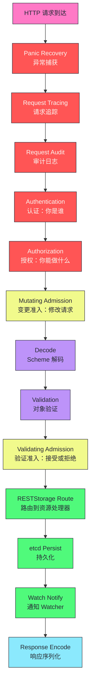
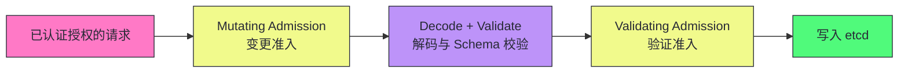
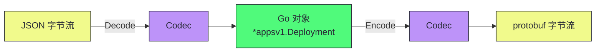
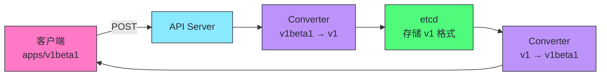
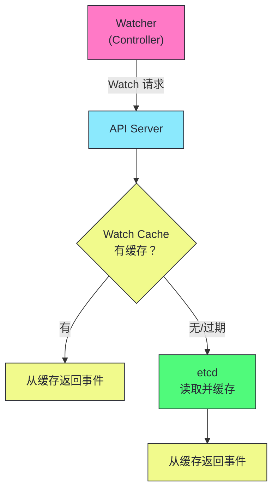
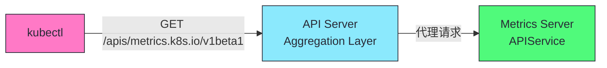

# 04 API Server 请求链路：从 HTTP 请求到 etcd 写入

**摘要：**
API Server 是 K8s 的唯一入口，一个 HTTP 请求从到达它到写入 etcd，要经过一条完整的 Handler Chain——认证、授权、变更准入、解码、Schema 校验、验证准入、RESTStorage 路由、etcd 持久化、Watch 通知。本文从源码级拆解这条链路的每个阶段，再深入 K8s 类型系统的三件套（Scheme/Codec/Converter）、RESTStorage 到 etcd 的映射、Watch Cache 的环形缓冲区与 Bookmark 机制，最后落到性能调优参数和常见故障排查。核心认知：API Server 的复杂度来自"一个进程扮演七重角色"，理解每一层的职责和失败行为，才能定位性能瓶颈。

---

## 第 1 章 Handler Chain：请求处理流水线

API Server 是 K8s 的唯一入口，所有对集群状态的读写都通过它。理解 API Server 如何处理一个请求，是理解 K8s 内部机制的基础。本章从 Handler Chain 的全链路入手，拆解每个处理阶段的职责和实现细节。

### 1.1 全链路概览

一个 HTTP 请求从到达 API Server 到写入 etcd 并通知 Watcher，经历以下处理阶段。每个阶段都有明确的职责和失败行为，任何一个阶段的失败都会导致请求被拒绝，但失败的方式（HTTP 状态码、错误信息）因阶段而异。



### 1.2 每个阶段的职责

每个阶段有明确的职责和失败行为。理解每个阶段的职责，就能在故障排查时精确定位问题所在——譬如 401 错误意味着认证失败，403 意味着授权失败，422 意味着准入或校验失败，500 意味着存储或内部错误。客户端可以根据 HTTP 状态码判断问题出在哪个阶段，无需查看 API Server 内部日志。

| 阶段 | 职责 | 失败行为 |
|------|------|---------|
| **Panic Recovery** | 捕获 handler 中的 panic，返回 500 而非崩溃 | 返回 500 |
| **Request Tracing** | 为请求分配 trace ID，记录各阶段耗时 | 不影响请求 |
| **Request Audit** | 记录请求的审计日志（谁、何时、做了什么） | 不影响请求（日志异步） |
| **Authentication** | 验证请求者身份（TLS/Token/OIDC/SA） | 401 Unauthorized |
| **Authorization** | 检查请求者是否有权限执行操作 | 403 Forbidden |
| **Mutating Admission** | 修改请求对象（注入 sidecar、设默认值） | 拒绝请求 |
| **Decode** | 将请求 body 反序列化为 Go 对象 | 400 Bad Request |
| **Validation** | Schema 校验（字段类型、必填、枚举值） | 422 Unprocessable Entity |
| **Validating Admission** | 业务规则验证（如 PodSecurity） | 422 |
| **RESTStorage Route** | 路由到对应资源的处理逻辑 | 404 Not Found |
| **etcd Persist** | 序列化并写入 etcd | 500 |
| **Watch Notify** | 通知订阅该资源的 Watcher | 不影响响应 |
| **Response Encode** | 将结果序列化为 JSON/protobuf 返回 | - |

> [!info] 核心概念：Handler Chain 是洋葱模型
> API Server 的 Handler Chain 是"洋葱模型"——外层 handler 包裹内层 handler，请求从外到内依次通过每层，响应从内到外依次返回。每层 handler 可以在请求通过前做预处理（如认证）、在响应返回后做后处理（如审计日志记录）。这种分层设计使得每个关注点（安全、审计、限流）可以独立添加或移除，不影响其他层。洋葱模型是 Web 框架中的常见模式——Go 的 chi、gin，Python 的 Django、Flask 都有类似的中间件链设计。API Server 的 Handler Chain 本质上就是一组中间件的有序组合，每个中间件处理一个关注点。

洋葱模型的一个工程优势是"关注点分离"——每层 handler 只处理一个关注点，不关心其他层的逻辑。譬如认证 handler 只关心"你是谁"，不关心"你能做什么"（那是授权 handler 的事）；审计 handler 只关心"记录这次请求"，不关心请求是否成功。这种分离使得每层 handler 可以独立开发、测试、维护，降低了系统的复杂度。

### 1.3 链路的工程价值

理解 Handler Chain 的完整链路对于生产环境的故障排查至关重要。当 API Server 响应慢时，需要定位是哪个阶段慢——是认证阶段（外部 OIDC 提供者慢），还是准入阶段（Webhook 慢），还是 etcd 写入阶段（etcd 磁盘 IOPS 不足）。API Server 通过 Request Tracing 记录每个阶段的耗时，运维者可以通过 `--audit-log-path` 和 tracing 数据定位瓶颈。不理解链路，就只能在"API Server 慢"这个笼统的层面打转，无法精确定位问题。

Handler Chain 的设计也影响了 API Server 的扩展方式。每一层 handler 都是独立的，可以单独替换或增强。譬如想增加限流功能，只需要在链路中插入一个限流 handler；想增加请求日志，只需要插入一个日志 handler。API Server 通过配置（如 `--enable-aggregator-routing`、`--admission-control-config-file`）启用或禁用某些层，而不需要修改核心代码。K8s 的 Admission Webhook 就是这种扩展性的体现——用户可以通过 Webhook 在准入控制层注入自定义逻辑，而不需要修改 API Server 源码。

---

## 第 2 章 认证与授权（Authentication & Authorization）

认证与授权是 API Server 安全模型的前两道闸门——认证确定"你是谁"，授权决定"你能做什么"。这两道闸门是 K8s 集群安全的基础，所有 API 请求都必须通过这两道闸门才能继续处理。

### 2.1 认证链（Authentication Chain）

API Server 支持多种认证方式，将它们组织为一条**认证链**——请求按顺序通过每种认证方式，任意一种成功即可，全部失败则拒绝。认证是 K8s 安全模型的第一道闸门——只有通过认证的请求才能进入后续的授权和准入控制。

| 认证方式 | 机制 | 适用场景 |
|---------|------|---------|
| **Client Certificate** | TLS 客户端证书验证 | 组件间通信（kubelet→API Server） |
| **Token** | Bearer Token（如 Bootstrap Token） | 外部系统接入 |
| **OIDC** | OpenID Connect（如 Google/Azure AD） | 用户认证 |
| **ServiceAccount Token** | SA 的 JWT Token | Pod 内访问 API Server |
| **Basic Auth** | 用户名密码（已废弃） | 不推荐 |

这五种认证方式覆盖了 K8s 的所有使用场景——组件间通信用 Client Certificate（双向 TLS，最高安全），用户用 OIDC（对接企业身份系统），Pod 用 ServiceAccount Token（自动注入），外部系统用 Bearer Token（简单接入）。Basic Auth 已废弃，不应在生产环境使用。

```go
// 伪代码：认证链逻辑
func authenticateRequest(req *http.Request) (user.Info, bool, error) {
    for _, authn := range authenticationChain {
        user, ok, err := authn.AuthenticateRequest(req)
        if err != nil {
            continue  // 该认证方式出错，尝试下一个
        }
        if ok {
            return user, true, nil  // 认证成功
        }
    }
    return nil, false, nil  // 所有认证方式都未成功
}
```

认证链的"任一成功即可"设计使得 K8s 可以同时支持多种认证方式——内部组件用 Client Certificate，用户用 OIDC，Pod 用 ServiceAccount Token，无需为不同客户端配置不同的 API Server。但这个设计也有一个潜在问题：如果认证链中某个认证方式配置错误（如 OIDC 提供者不可达），它会被跳过而非报错——这可能导致一个本应被 OIDC 认证的请求被其他认证方式（如 Token）错误地认证。生产环境中需要仔细审查认证链的配置，确保每种认证方式的适用范围明确。

OIDC 认证的验证流程值得深入了解。API Server 启动时通过 `--oidc-issuer-url`、`--oidc-client-id` 等参数配置 OIDC 提供者。请求到达时，API Server 从 Bearer Token 中提取 JWT，先验证签名（用 OIDC 提供者的公钥，通过 JWKS 端点获取），再验证 `iss`（签发者）和 `aud`（受众）声明，最后提取用户名和组信息。JWKS 公钥会缓存并在过期后自动刷新——如果 OIDC 提供者不可达且缓存过期，所有 OIDC 认证请求会失败。生产环境中 OIDC 提供者的高可用性直接影响 API Server 的认证可用性。

Client Certificate 认证的验证逻辑也值得说明。API Server 通过 `--client-ca-file` 指定信任的 CA 证书。请求到达时，API Server 验证客户端证书的签名链（从客户端证书到 CA 证书），再从证书的 Subject 中提取用户名（`CN=`）和组（`O=`）。譬如 kubelet 的客户端证书通常 `CN=system:node:node-1`、`O=system:nodes`，RBAC 据此授予 kubelet 的 Node 权限。证书过期后需要轮换——K8s 1.8+ 提供了 `kubeadm alpha certs renew` 和证书自动轮换机制（kubelet 客户端证书在到期前 90% 生命周期时自动轮换）。

认证链的顺序也有工程考量。K8s 会按照配置顺序依次尝试每种认证方式，第一个成功的方式就确定用户身份。如果多种认证方式可能匹配同一个请求（如 Client Certificate 和 Token 都能认证某个请求），顺序决定了哪个方式优先。生产环境中通常把最可靠的认证方式放在前面（如 Client Certificate 用于组件通信），把可能出错的认证方式放在后面（如 OIDC 依赖外部服务，可能不可达）。

ServiceAccount Token 的验证机制在 K8s 1.24 后发生了重大变化。1.24 之前，SA Token 是永久有效的 JWT，存储在 Secret 中，API Server 通过公钥验证签名。1.24 引入了 TokenRequest API——Token 不再永久有效，而是绑定到特定 Pod，有过期时间（默认 1 小时）。API Server 验证 Token 时除了检查签名，还检查 Token 是否过期、绑定的 Pod 是否仍然存在。这解决了旧机制的一个安全问题：Token 泄露后无法撤销（除非删除 Secret，但这会影响所有使用该 Secret 的 Pod）。新机制下，Token 自动过期，Pod 删除后 Token 自动失效。

### 2.2 授权（Authorization）

认证确定"你是谁"，授权决定"你能做什么"。K8s 授权基于 **Attributes**——请求的动词（get/list/create/update/delete）、资源类型、Namespace。授权是 K8s 安全模型的第二道闸门——认证通过后，授权决定请求者是否有权限执行特定操作。

K8s 的授权模型基于"显式允许"——默认拒绝所有操作，只有明确授权的操作才允许。这种"默认拒绝"的安全模型使得 K8s 集群在未配置授权策略时是安全的（所有操作被拒绝），而非危险的（所有操作被允许）。生产环境中需要为每个用户和组件配置最小权限——只授予完成工作所需的最低权限，避免过度授权。

| 授权模式 | 机制 | 说明 |
|---------|------|------|
| **RBAC** | Role/ClusterRole + Binding | 最常用，推荐 |
| **ABAC** | 基于属性的策略文件 | 已废弃 |
| **Node** | 节点授权（kubelet 特殊权限） | 始终启用 |
| **Webhook** | 外部服务做授权决策 | 自定义授权逻辑 |

这四种授权模式各有适用场景——RBAC 用于用户和组件的权限控制（最常用），Node 用于 kubelet 的特殊权限（始终启用），Webhook 用于自定义授权逻辑（如对接外部权限系统），ABAC 已废弃。生产环境中通常同时启用 RBAC 和 Node——RBAC 管理用户权限，Node 管理 kubelet 权限。

> [!warning] 生产避坑：RBAC 是生产环境的唯一选择
> ABAC（基于属性的访问控制）已废弃，配置文件难维护且无审计。Node 授权是 kubelet 专用的，不适用于用户。Webhook 授权引入外部依赖，增加延迟和故障点。RBAC 是 K8s 授权的事实标准——Role/ClusterRole 定义权限，RoleBinding/ClusterRoleBinding 绑定到用户/组/ServiceAccount。我们将在第 05 篇深入 RBAC 的设计和使用。

授权与认证的分离体现了 K8s 的安全设计原则——"谁"和"能做什么"是两个独立的问题，应该分开处理。认证只关心身份验证，不关心权限；授权只关心权限检查，不关心身份验证。这种分离使得权限策略可以独立于认证方式变化——譬如从 Token 认证切换到 OIDC 认证，RBAC 策略不需要修改，因为 RBAC 基于用户/组标识而非认证方式。

授权决策的性能也是一个需要关注的点。每个 API 请求都需要经过授权检查，授权检查的延迟直接影响 API Server 的吞吐量。RBAC 的授权检查是内存操作（Role/ClusterRole 缓存在 API Server 内存中），延迟在微秒级，对性能影响可以忽略。但 Webhook 授权需要调用外部服务，延迟可能在毫秒级，对高频请求有显著影响。生产环境中通常避免使用 Webhook 授权，或为 Webhook 配置缓存以减少外部调用。

---

## 第 3 章 准入控制（Admission Control）

准入控制是 API Server 安全模型的第三道闸门——在认证和授权之后，写入 etcd 之前。准入控制可以修改请求对象（Mutating Admission）或验证请求对象（Validating Admission），是 K8s 安全策略的执行点。

### 3.1 两阶段准入控制

通过认证和授权后，请求进入**准入控制**——在写入 etcd 前的最后修改和验证机会。准入控制是 K8s 安全模型的第三道闸门，也是最后一道——通过准入控制后，对象就会被写入 etcd。准入控制分为两个子阶段：Mutating Admission（变更准入）和 Validating Admission（验证准入）。这种两阶段设计使得 K8s 可以在写入前既修改对象（如注入 sidecar）又验证对象（如检查资源配额），确保写入 etcd 的对象是合规且完整的，是 K8s 安全策略的执行点。



| 阶段 | 能力 | 示例 |
|------|------|------|
| **Mutating Admission** | 修改请求对象 | 注入 sidecar（Istio）、设默认 StorageClass、注入 ServiceAccount |
| **Validating Admission** | 接受或拒绝（不能修改） | PodSecurity 校验、资源配额检查、镜像签名验证 |

这两个阶段的分工体现了"修改与验证分离"的设计原则——Mutating Admission 负责修改（可以改变对象内容），Validating Admission 负责验证（只能接受或拒绝，不能修改）。这种分离使得验证逻辑可以基于"最终对象"做判断，而非基于"修改前或修改后的某个中间状态"。

### 3.2 为什么先 Mutating 后 Validating

顺序很重要——Mutating Admission 可能修改对象（如注入 sidecar），修改后的对象需要通过 Validating Admission 验证。如果反过来，验证通过的对象可能被 Mutating 修改成不合规的状态。这个顺序是 K8s 准入控制的核心设计决策，确保了修改后的对象符合所有验证规则。这个顺序设计是 K8s 安全模型的关键——它保证了写入 etcd 的对象是经过完整验证的，而非"验证后又被修改"的对象。

这个顺序设计的一个工程后果是：Validating Admission 看到的是 Mutating Admission 修改后的对象，而非客户端原始提交的对象。譬如客户端提交一个没有 sidecar 的 Pod，Mutating Admission 注入了 sidecar，Validating Admission 验证的是"带 sidecar 的 Pod"。如果 Validating Admission 的规则假设"Pod 没有 sidecar"（如检查资源配额时只算用户容器的资源），可能产生误判。编写 Validating Admission Webhook 时需要考虑 Mutating Admission 可能已经修改了对象。

另一个值得注意的细节是：Mutating Admission 可以被调用多次。K8s 允许配置多个 Mutating Webhook，它们按顺序执行，每个 Webhook 都可以修改对象。这意味着后面的 Mutating Webhook 看到的是前面 Webhook 修改后的对象。如果两个 Mutating Webhook 修改了同一个字段（如都注入 sidecar），后执行的 Webhook 可能覆盖前者的修改。生产环境中需要仔细规划 Mutating Webhook 的执行顺序，避免冲突。

K8s 1.15 引入了 Webhook Reinvocation Policy 来处理这种冲突。默认策略是 `Never`——每个 Webhook 只调用一次。但可以设置为 `IfNeeded`——如果前面的 Webhook 修改了对象，后面的 Webhook 可以被重新调用。这个机制解决了一个场景：Webhook A 修改了对象，Webhook B 基于修改后的对象做判断，但 Webhook A 的修改影响了 Webhook B 的判断条件，Webhook B 需要重新执行。Reinvocation Policy 增加了灵活性，但也增加了延迟——最坏情况下 Webhook 调用次数是 O(n²)。生产环境中应尽量设计互不冲突的 Webhook，避免依赖 Reinvocation。

Webhook 的超时配置也是一个关键参数。`timeoutSeconds` 控制单个 Webhook 调用的最大等待时间（默认 10 秒，最大 30 秒）。如果 Webhook 在超时内未响应，`failurePolicy` 决定行为：`Fail` 拒绝请求（适合关键安全策略），`Ignore` 放行请求（适合非关键策略）。生产环境中应将超时设为 Webhook 正常响应时间的 2-3 倍，并为关键 Webhook 配置 `Fail` 策略。

> [!info] 核心概念：准入控制器是 K8s 安全策略的核心
> 准入控制器是 K8s 安全策略的执行点——PodSecurity Standards（特权/基线/受限）、镜像签名验证、资源配额强制、命名空间验证等都在这里实施。除了内置准入控制器，K8s 支持通过 Webhook 扩展——MutatingWebhookConfiguration 和 ValidatingWebhookConfiguration 允许外部服务参与准入控制。这使得企业可以实施自定义安全策略（如禁止使用 latest 标签、强制资源限制、镜像来源限制）而无需修改 K8s 源码。我们将在第 05 篇深入准入控制器的配置和使用。

准入控制器与授权的区别在于：授权基于"身份加资源加动词"做粗粒度决策（如"用户 A 可以创建 Pod"），准入控制器基于"对象内容"做细粒度决策（如"Pod 的镜像不能是 latest"）。这种"粗粒度授权加细粒度准入"的分层设计使得 K8s 的安全策略既灵活又高效——粗粒度策略用 RBAC（高性能，内置），细粒度策略用 Admission Webhook（灵活，可扩展）。

准入控制器的性能影响也需要关注。内置准入控制器（如 ServiceAccount 注入、DefaultStorageClass）是内存操作，延迟可以忽略。但 Webhook 准入控制器需要调用外部服务，延迟可能在毫秒级。如果一个请求配置了多个 Webhook，延迟会累积——5 个 Webhook 各 50ms 延迟，总延迟 250ms。生产环境中需要监控 Webhook 的响应时间，对慢 Webhook 进行优化或合并。

---

## 第 4 章 Scheme、Codec、Converter：K8s 的类型系统

K8s 的类型系统是 API Server 处理请求的基础——它定义了 K8s 有哪些资源类型、如何序列化/反序列化、如何在 API 版本间转换。Scheme、Codec、Converter 是类型系统的三个核心组件，理解它们的作用，就理解了 K8s 如何处理"多版本 API 共存"这个分布式系统的经典难题。

### 4.1 Scheme：类型注册表

**Scheme** 是 K8s 类型系统的核心——它是一个注册表，记录了所有 API 类型与 GVK（Group-Version-Kind）的映射关系。Scheme 是 K8s API Server 的"类型字典"——它告诉 API Server 如何把 HTTP 请求中的 API 路径（如 `/apis/apps/v1/deployments`）映射到 Go 类型（如 `*appsv1.Deployment`）。没有 Scheme，API Server 就无法知道请求 body 应该反序列化成什么类型，整个请求处理链路就无法运作。Scheme 是 K8s 类型系统的基石。

```go
// 伪代码：Scheme 的核心数据结构
type Scheme struct {
    // GVK → Go 类型
    typeToGVK map[reflect.Type]schema.GroupVersionKind
    
    // Go 类型 → 所有支持的 GVK（用于版本转换）
    typeToAllGVKs map[reflect.Type][]schema.GroupVersionKind
}
```

每种 K8s 资源（Pod、Deployment、Service 等）在 API Server 启动时注册到 Scheme：

```go
// 注册 Pod 到 Scheme
scheme.AddKnownTypes(schema.GroupVersion{Group: "", Version: "v1"}, &Pod{})
scheme.AddKnownTypes(schema.GroupVersion{Group: "", Version: "v1beta1"}, &Pod{})
```

Scheme 的价值：

| 价值 | 说明 |
|------|------|
| **类型路由** | API Server 根据 GVK 从 Scheme 查到 Go 类型，创建对应实例 |
| **版本转换** | Scheme 记录类型支持的所有版本，支持版本间转换 |
| **代码生成** | client-gen 等工具基于 Scheme 生成客户端代码 |

这三个价值构成了 K8s 类型系统的"三角支撑"——类型路由使得 API Server 能处理任意类型的请求，版本转换使得 K8s 能平滑演进 API，代码生成使得客户端开发可以自动化。没有 Scheme，K8s 的类型系统将无法运作——API Server 不知道如何反序列化请求，客户端不知道如何构造请求。

Scheme 的设计是 K8s 类型系统的基石。理解 Scheme，就能理解 K8s 如何处理"同一个资源有多个 API 版本"的问题——每个版本对应一个 Go 类型（或同一个 Go 类型的多个注册），Scheme 记录所有版本的映射，Converter 负责版本间的转换。这种设计使得 K8s 可以平滑地演进 API——引入新版本时，旧版本保持可用，客户端可以按自己的节奏迁移。

Scheme 的另一个价值是支持 API 路由。当 API Server 收到 `GET /apis/apps/v1/deployments/web` 请求时，它从 URL 解析出 GVK（Group=apps, Version=v1, Kind=Deployment），然后从 Scheme 查到对应的 Go 类型（`*appsv1.Deployment`），创建该类型的实例用于反序列化。没有 Scheme，API Server 就无法知道请求 body 应该反序列化成什么类型。Scheme 本质上是"API 路径到 Go 类型"的映射表，是 API Server 处理请求的第一步。

API Server 的 API Group 发现机制也依赖 Scheme。客户端通过 `GET /apis` 获取所有 API Group 列表，通过 `GET /apis/apps` 获取 `apps` Group 的所有版本，通过 `GET /apis/apps/v1` 获取 `v1` 版本的所有资源类型。这些发现端点由 API Server 根据 Scheme 中注册的类型动态生成。kubectl 在执行 `kubectl apply` 时先调用发现 API 获取资源映射，再根据映射构造请求路径。如果 Scheme 中没有注册某个类型，该类型不会出现在发现 API 中，客户端也无法通过 API Server 操作它。

### 4.2 Codec：编解码器

**Codec** 负责对象与字节流之间的转换——反序列化请求 body 为 Go 对象，序列化 Go 对象为响应 body。API Server 内部只处理 Go 对象，格式转换在入口和出口完成，内部逻辑不受格式影响。



K8s 支持多种序列化格式：

| 格式 | Content-Type | 用途 |
|------|-------------|------|
| **JSON** | `application/json` | kubectl 默认，人类可读 |
| **protobuf** | `application/vnd.kubernetes.protobuf` | 组件间通信，性能更高 |
| **YAML** | `application/yaml` | kubectl apply |

这三种格式覆盖了 K8s 的所有使用场景——JSON 用于 API 响应（kubectl 显示），YAML 用于配置文件（kubectl apply），protobuf 用于内部组件通信（kubelet 与 API Server）。

> [!info] 核心概念：protobuf 用于组件间通信，JSON 用于人机交互
> API Server 内部和组件间通信（kubelet→API Server）默认用 protobuf——比 JSON 更快、更小。kubectl 等人机交互工具用 JSON/YAML——可读性好。API Server 根据 Accept header 选择响应格式。客户端发送请求时用 Content-Type 声明 body 格式。这种"协议协商"使得 API Server 可以同时服务人和机器，无需为不同客户端提供不同 API。

protobuf 与 JSON 的性能差异在大规模集群中是显著的。protobuf 是二进制格式，编码后比 JSON 小 30-50%，反序列化速度快 5-10 倍。对于 K8s 内部组件的高频通信（如 kubelet 每秒查询 Pod 状态），protobuf 的性能优势可以累积成显著的吞吐量提升。但 protobuf 的劣势在于可读性差——调试时需要用 `protoc --decode_raw` 解码，不如 JSON 直观。K8s 通过"内部用 protobuf，外部用 JSON"的分工，兼顾了性能和可读性。

Codec 的协议协商机制值得深入理解。客户端通过 `Accept` header 声明期望的响应格式（如 `Accept: application/json`），通过 `Content-Type` header 声明请求 body 的格式（如 `Content-Type: application/yAML`）。API Server 根据 `Content-Type` 选择解码器，根据 `Accept` 选择编码器。如果客户端不指定 `Accept`，API Server 默认返回 JSON。这种协商机制使得同一个 API 端点可以服务多种客户端——kubectl 用 JSON（可读），kubelet 用 protobuf（高效），无需为不同客户端提供不同端点。

### 4.3 Converter：版本转换

**Converter** 处理 API 版本间的转换——客户端用 `apps/v1beta1` 创建 Deployment，API Server 转换为 `apps/v1`（存储版本）后写入 etcd。etcd 中只存储一个版本（存储版本），客户端可以用任意版本读写，API Server 负责版本转换。引入新版本时，只需要在 Converter 中添加新版本与存储版本的转换逻辑，etcd 中的数据不需要迁移。



转换的工程复杂度在于不同版本的字段可能语义不同——不是简单的字段重命名，可能涉及字段合并、拆分、默认值填充。K8s 通过 `conversion-gen` 工具自动生成大部分转换代码，对于简单的字段重命名或类型变化可以自动处理。但对于复杂的转换（如字段合并、拆分、语义变化），需要手写转换函数。这些手写函数是 K8s 版本升级时最容易出 bug 的地方——如果转换函数不正确，可能导致数据丢失或语义变化。K8s 社区通过大量的测试覆盖转换逻辑，但生产环境中升级 API 版本时仍需要仔细测试。

> [!warning] 生产避坑：不要轻易删除 API 版本
> 删除 API 版本（如从 v1beta1 升级到 v1 后删除 v1beta1）是破坏性变更——使用旧版本的客户端会失败。K8s 的版本策略：(1) 新版本引入后旧版本保持一段时间的兼容期；(2) 在兼容期内通过 Deprecated 警告提示用户迁移；(3) 删除旧版本前确保所有客户端已迁移。生产环境升级 API 版本前，检查集群中是否有客户端仍在使用旧版本——kubectl 的 API 调用日志和审计日志可以提供线索。

---

## 第 5 章 RESTStorage：资源到 etcd 的映射

RESTStorage 是 API Server 的存储层抽象——它把 HTTP 请求的 CRUD 操作映射到 etcd 的读写操作。理解 RESTStorage，就理解了 K8s 资源如何持久化到 etcd。

### 5.1 RESTStorage 是什么

每种 K8s 资源映射到一个 **RESTStorage** 实现——它定义了该资源的 CRUD 操作如何与 etcd 交互。RESTStorage 是 API Server 的"存储适配器"——它把 HTTP 请求的 CRUD 操作（GET/POST/PUT/DELETE）映射到 etcd 的读写操作。这种"HTTP 动词到 etcd 操作"的映射是 K8s RESTful API 的核心——客户端用 HTTP 动词操作资源，API Server 通过 RESTStorage 把操作转换为 etcd 读写，使得客户端无需关心 etcd 的细节。

```go
// 伪代码：RESTStorage 接口
type RESTStorage interface {
    Create(ctx context.Context, obj runtime.Object) (runtime.Object, error)
    Get(ctx context.Context, name string) (runtime.Object, error)
    List(ctx context.Context, options *metav1.ListOptions) (runtime.Object, error)
    Update(ctx context.Context, obj runtime.Object) (runtime.Object, error)
    Delete(ctx context.Context, name string) (runtime.Object, error)
    Watch(ctx context.Context, options *metav1.ListOptions) (watch.Interface, error)
}
```

K8s 提供了一个通用的 **Registry** 实现——`GenericStore`，它处理了大部分通用逻辑（认证、授权、准入、Schema 校验后的 etcd 读写），资源特定的逻辑通过 hook 函数注入。GenericStore 是 K8s "通用框架加特定逻辑"模式的典型应用——它把通用的 CRUD 逻辑抽象为框架，把资源特定的逻辑通过 hook 注入，使得添加新资源时只需要实现特定 hook，不需要重写整个 CRUD 逻辑。

RESTStorage 的设计是 K8s "通用框架加特定逻辑"模式的典型应用。GenericStore 提供了通用的 CRUD 逻辑——所有资源的 Create/Get/List/Update/Delete 都有相似的处理流程（认证、授权、准入、存储），资源特定的逻辑（如 Pod 创建时分配 IP、Service 创建时分配 ClusterIP）通过 hook 函数注入。这种设计使得添加新资源时只需要实现特定的 hook，不需要重写整个 CRUD 逻辑。

RESTStorage 的另一个设计细节是"子资源"的处理。K8s 的很多资源有子资源——如 Pod 的 `/log`、`/exec`、`/portforward`，Deployment 的 `/scale`。这些子资源有独立的 RESTStorage 实现，与主资源的 RESTStorage 分离。譬如 Pod 的 `/log` 子资源不需要经过完整的认证授权准入链路（它只是读取日志，不修改对象），因此有更轻量的处理流程。这种"主资源加子资源"的分离设计使得 API Server 可以针对不同操作提供不同级别的处理，而非"一刀切"。

RESTStorage 的 Update 操作通过 etcd 的事务（compare-and-swap）实现乐观并发控制。API Server 读取对象时记录其 `resourceVersion`（对应 etcd 的 `mod_revision`），写入时带上该版本号。etcd 在事务中比较当前 `mod_revision` 与传入的版本号——如果一致，说明没有并发修改，写入成功；如果不一致，说明对象已被其他请求修改，API Server 返回 409 Conflict，客户端需要重新读取后重试。这保证了在无锁条件下的并发安全，是 K8s 乐观并发控制的基础（详见第 08 篇）。Delete 操作同样基于事务——可以带上 `resourceVersion` 做条件删除，确保只删除特定版本的对象。

### 5.2 etcd 的 key 路径

K8s 对象在 etcd 中的 key 路径遵循固定模式：

```
/registry/<resource>/<namespace>/<name>
```

这种路径设计使得 etcd 的前缀查询可以高效地支持 K8s 的 List 操作——按 Namespace 查询只需要前缀匹配 `/registry/pods/default/`，按资源类型查询只需要前缀匹配 `/registry/pods/`。etcd 的前缀查询是基于 key 的有序存储（B-tree 索引），效率远高于全量扫描。这种"key 路径反映资源层级"的设计是 K8s 存储层的基础。

| K8s 资源 | etcd key |
|---------|---------|
| Pod `web-abc` in `default` | `/registry/pods/default/web-abc` |
| Deployment `web` in `default` | `/registry/deployments/default/web` |
| Node `node-1` | `/registry/minions/node-1` |
| Service `web` in `default` | `/registry/services/specs/default/web` |

这些 key 路径的命名规则是 K8s 存储层的基础——理解了这个规则，就能直接从 etcd 读取 K8s 数据（虽然通常是 protobuf 编码的，需要解码）。生产环境中调试 etcd 数据时，知道 key 路径可以快速定位特定资源的数据，而不需要扫描所有 key。

etcd key 路径的设计有几个值得注意的细节。第一，Node 资源的 key 用 `minions` 而非 `nodes`——这是 K8s 早期历史遗留（Borg 中叫 minion），后来改名为 Node 但 etcd key 没改。第二，Service 的 key 路径有 `specs` 子路径——Service 在 etcd 中存储了两个 key（`/registry/services/specs/...` 和 `/registry/services/endpoints/...`），分别存储 Service 定义和 Endpoints。第三，Pod 的 key 路径直接是 `/registry/pods/<ns>/<name>`，没有中间层——这反映了 Pod 是 K8s 中最频繁访问的资源，key 路径越短，etcd 的查找开销越低。这些历史细节不影响日常使用，但在直接调试 etcd 数据时需要了解。

etcd key 的命名还有一个工程考量：key 路径中包含 Namespace，使得按 Namespace 查询可以通过 etcd 的前缀查询实现。譬如查询 `default` Namespace 的所有 Pod，API Server 用 `etcdctl get /registry/pods/default/ --prefix` 获取所有以该前缀开头的 key，无需扫描所有 key。

> [!info] 核心概念：etcd 存储的是序列化后的对象，不是 JSON
> etcd 中存储的 K8s 对象默认是 protobuf 序列化的字节流，不是 JSON。这使得存储更紧凑、反序列化更快。只有通过 API Server 读取时才会转换为 JSON/protobuf 响应格式。这也是为什么直接用 etcdctl 读取 K8s 数据看到的是乱码——它是 protobuf 字节流，不是人类可读的 JSON。K8s 提供了 `etcdctl get --key /registry/pods/default/web-abc --print-value-only | protoc --decode_raw` 等工具解码。

---

## 第 6 章 Watch Cache：减少 etcd 压力的关键

Watch Cache 是 API Server 性能优化的关键组件——它通过缓存 etcd 的变更事件，使得多个 Watcher 共享同一份缓存数据，大幅减少 etcd 的读取压力。理解 Watch Cache，就理解了 K8s 如何在大规模集群中保持 Watch 的性能。

### 6.1 为什么 Watch 不直接查 etcd

API Server 内部为每种资源维护一个 **Watch Cache**——缓存最近的变更事件和资源对象。当客户端发起 Watch 请求时，API Server 从 Watch Cache 中获取数据，不直接查询 etcd。Watch Cache 是 API Server 内存中的一个数据结构，它通过 Watch etcd 的变更事件保持与 etcd 的同步。这种"缓存 etcd 事件"的设计是 K8s 大规模集群性能的关键优化，也是 K8s 能够支撑万节点级集群的基础，是 API Server 性能优化的核心。



在大规模集群中，可能有数百个控制器同时 Watch 不同类型的资源。如果每个 Watch 都直接查询 etcd，etcd 会被压垮。Watch Cache 使得多个 Watcher 共享同一份缓存数据，大幅减少 etcd 读取压力。Watch Cache 的设计是 K8s 能够支撑大规模集群的关键——没有它，etcd 的连接数和读取压力会成为集群规模的瓶颈。

Watch Cache 的设计是 K8s 大规模集群性能的关键优化。没有 Watch Cache，数百个 Watcher 同时 Watch Pod 变化，etcd 需要为每个 Watcher 维护一个 Watch 连接，每次 Pod 变化需要向数百个连接推送事件。有了 Watch Cache，API Server 维护一个到 etcd 的 Watch 连接，把事件缓存后分发给所有 Watcher，etcd 只需要一个连接。这种"单连接加多分发"的设计把 etcd 的 Watch 连接数从"Watcher 数量"降到"资源类型数量"，大幅降低了 etcd 的压力。

Watch Cache 还有一个容易被忽视的功能：List 请求也可以从缓存读取。当客户端发起 List 请求时，API Server 可以从 Watch Cache 的本地 store 中读取数据，不需要查询 etcd。这个优化对于频繁 List 的场景（如控制器启动时 List 所有资源）特别有效——避免了 List 请求直接打到 etcd，减少了 etcd 的读取压力。但这个优化有一个前提：Watch Cache 的本地 store 必须包含所有资源的数据。如果 Watch Cache 还没有完全同步（如 API Server 刚启动），List 请求会回退到 etcd 读取。

Watch Cache 的实现核心是 `Cacher` 组件，它包装了底层 etcd storage。Cacher 在 API Server 启动时为每种资源创建一个 watchCache 实例，启动一个 goroutine 从 etcd Watch 事件，将事件写入环形缓冲区和本地 store。当客户端发起 Watch 或 List 请求时，Cacher 拦截请求，从缓存返回数据。如果 Cacher 还未完成初始同步（从 etcd List 全量数据填充本地 store），请求会直接穿透到 etcd。这个"先 List 后 Watch"的初始化流程与 Informer 的 List-Watch 模式如出一辙——先获取全量快照，再增量同步。

### 6.2 Watch Cache 的数据结构

Watch Cache 的数据结构设计需要平衡"内存占用"和"事件覆盖范围"。环形缓冲区只保留最近的事件，内存占用可控；本地 store 保存所有资源，支持 List 请求但内存占用较大。生产环境中需要根据集群规模调整这两个数据结构的大小。这种"增量缓存加全量缓存"的双层设计使得 Watch Cache 既能高效处理 Watch（增量），又能高效处理 List（全量），是 K8s 大规模集群性能优化的关键。

```go
// 伪代码：Watch Cache 的核心数据结构
type watchCache struct {
    // 环形缓冲区，存储最近的事件
    cache []watchCacheElement
    
    // 当前缓冲区的 resourceVersion
    resourceVersion uint64
    
    // 所有资源的本地索引（用于 List 请求）
    store cache.Store
}
```

| 组件 | 作用 |
|------|------|
| **环形缓冲区** | 存储最近的 N 个事件（默认 100） |
| **resourceVersion** | 缓存对应的 etcd 版本 |
| **本地 store** | 所有资源的完整缓存（用于 List 请求） |

这三个组件构成了 Watch Cache 的"三层结构"——环形缓冲区服务 Watch 请求（增量事件），本地 store 服务 List 请求（全量数据），resourceVersion 标识缓存的版本。这种分层设计使得 Watch Cache 既能高效处理 Watch（从环形缓冲区读取），又能高效处理 List（从本地 store 读取），无需分别查询 etcd。

Watch Cache 的环形缓冲区设计有一个重要的工程考量：缓冲区大小决定了 Watcher 能容忍的最大"落后程度"。如果 Watcher 的 resourceVersion 落后超过缓冲区中的事件数（默认 100），Watcher 需要重新 List 获取当前状态。在大规模集群中，事件产生速度可能很快（每秒数十个 Pod 变化），100 个事件可能只覆盖几秒的变化。生产环境中可以通过 `--watch-cache-size` 调大缓冲区，减少 Watcher 重新 List 的频率。

环形缓冲区的另一个设计细节是"滑动窗口"——缓冲区满了后，新事件会覆盖最旧的事件。这意味着如果 Watcher 的 resourceVersion 对应的事件已经被覆盖，Watcher 无法从缓存获取这些事件，必须重新 List。这种"滑动窗口"设计使得 Watch Cache 只保留最近的事件，内存占用可控，但代价是长时间未同步的 Watcher 需要重新 List。

Cacher 的 Watch 分发机制使用了 channel + goroutine 的模式。每个 Watcher 注册时，Cacher 创建一个 channel，启动一个 goroutine 从环形缓冲区读取事件写入 channel。当 etcd 产生新事件时，Cacher 遍历所有注册的 Watcher channel，将事件分发。如果某个 Watcher 的 channel 满了（消费速度跟不上），Cacher 会丢弃该 Watcher 并通知其重新 List——这被称为"slow watcher" 问题。生产环境中如果控制器处理事件慢（如 Operator 的 reconcile 逻辑耗时），可能触发 slow watcher 机制导致频繁 List-Watch，形成恶性循环。

### 6.3 Bookmark 事件

当 Watcher 的 resourceVersion 落后于缓存但缓存中没有新事件时，API Server 会发送 **Bookmark 事件**——只更新 resourceVersion，不携带对象。Bookmark 是 K8s 1.16 引入的优化，解决了"长时间无事件的 Watcher 重连时需要传输大量历史事件"的问题。Bookmark 的设计体现了 K8s 对大规模集群性能的持续优化——即使没有实际事件，也定期更新 Watcher 的 resourceVersion，使得重连时只需要传输少量事件。

```json
{"type":"BOOKMARK","object":{"kind":"Pod","apiVersion":"v1","metadata":{"resourceVersion":"12350"}}}
```

> [!info] 核心概念：Bookmark 防止 Watch 卡在旧版本
> 如果没有 Bookmark，Watcher 的 resourceVersion 可能长时间不更新——下次重连时从这个旧版本开始 Watch，可能需要传输大量历史事件。Bookmark 定期更新 Watcher 的 resourceVersion，使得重连时从较新的版本开始，减少历史事件传输。这是 K8s 1.16 引入的优化，对于大规模集群的 Watch 性能有显著提升。

Bookmark 的设计体现了 K8s 对大规模集群性能的持续优化。在 K8s 1.16 之前，Watcher 的 resourceVersion 只在实际事件发生时更新——如果资源长时间没有变化，Watcher 的 resourceVersion 会卡在旧版本，重连时需要传输大量历史事件。Bookmark 通过定期发送"无事件但更新 resourceVersion"的消息，使得 Watcher 的 resourceVersion 保持较新，重连时只需要传输少量事件。这个优化对于"长时间运行但事件稀少"的资源（如 ConfigMap、Secret）特别有效。

Bookmark 的发送频率由 API Server 的 `--default-bookmark-interval` 参数控制（默认 1 分钟）。对于高频变化的资源（如 Pod），Bookmark 的作用不明显（因为实际事件已经频繁更新 resourceVersion）；对于低频变化的资源（如 ConfigMap），Bookmark 可以显著减少重连时的历史事件传输量。生产环境中通常不需要调整 Bookmark 频率，但需要理解它对 Watch 行为的影响——即使没有实际事件，Watcher 也会定期收到 Bookmark 事件，这是正常行为而非异常。Bookmark 事件在客户端侧的处理也需要注意——Informer 会静默处理 Bookmark，但手写 Watch 客户端需要正确处理 Bookmark 事件类型，避免将其当作错误或异常事件。

---

## 第 7 章 API Server 的性能调优

API Server 的性能直接影响整个集群的响应速度。在大规模集群中，API Server 的性能调优是运维工作的重点——错误的参数配置可能导致请求排队、Watch 延迟、甚至集群不可用。

### 7.1 关键启动参数

API Server 的性能调优主要通过启动参数进行。这些参数控制了 API Server 的并发处理能力、缓存大小、超时时间等关键指标。正确的参数配置是 API Server 稳定运行的基础——错误的参数可能导致请求排队、Watch 延迟、甚至集群不可用。

| 参数 | 作用 | 默认值 | 调优建议 |
|------|------|--------|---------|
| `--max-mutating-requests-inflight` | 并发变更请求上限 | 200 | 大集群调高到 400-1000 |
| `--max-requests-inflight` | 并发只读请求上限 | 400 | 大集群调高到 800-2000 |
| `--watch-cache-size` | Watch Cache 大小 | 100MB | 大集群调高 |
| `--default-watch-cache-size` | 每种资源的缓存大小 | 100 | 大集群调高 |
| `--apiserver-loopback-timeout` | 内部请求超时 | 60s | 视集群规模调整 |

这些参数的调优需要根据集群规模和负载特征进行。小集群（100 节点以下）通常用默认值就够了，大集群（500 节点以上）需要调高并发请求上限和 Watch Cache 大小。调优时需要监控 API Server 的指标——`apiserver_request_duration_seconds`（请求延迟）、`apiserver_request_total`（请求总数）、`etcd_request_duration_seconds`（etcd 延迟）——根据指标变化判断调优效果。这些指标是 API Server 调优的"仪表盘"，没有监控数据就盲目调参是生产环境的大忌。

`--max-mutating-requests-inflight` 和 `--max-requests-inflight` 的调优需要特别注意——这两个参数限制了 API Server 同时处理的请求数。如果设置过低，请求会排队等待，导致延迟增加；如果设置过高，API Server 可能消耗过多内存（每个请求需要分配缓冲区），甚至压垮 etcd。生产环境中通常先调高到集群规模对应的推荐值，然后根据监控指标微调。

`--watch-cache-size` 的调优需要考虑资源类型和数量。每种资源类型有独立的 Watch Cache，缓存大小决定了能容忍的 Watcher 落后程度。对于高频变化的资源（如 Pod），需要更大的缓存；对于低频变化的资源（如 ConfigMap），较小的缓存就够了。K8s 允许为不同资源配置不同的缓存大小（通过 `--watch-cache-sizes` 参数），生产环境中可以根据资源特性分别配置。

K8s 1.20 引入了 API Priority and Fairness（APF）机制，替代了传统的 `--max-requests-inflight` 限流方式。APF 将请求分为不同的 Priority Level（如 `system`、`cluster-admin`、`default`），每个 Priority Level 有独立的并发配额。在同一 Priority Level 内，请求按 FlowSchema 规则分为不同的 Queue，每个 Queue 公平共享并发配额。这解决了旧限流方式的一个问题：少量高频客户端（如 kubelet 的 List 请求）可能占满所有并发配额，导致其他请求（如用户的 kubectl 操作）被拒绝。APF 确保不同类型的请求有公平的访问机会。APF 通过 `--enable-priority-and-fairness` 启用（1.20+ 默认启用），通过 FlowSchema 和 PriorityLevelConfiguration 资源配置。

### 7.2 常见性能问题

| 问题 | 症状 | 排查方法 |
|------|------|---------|
| **请求排队** | API 响应慢，max-requests-inflight 达上限 | 调高 max-requests-inflight |
| **Watch Cache 不够** | Watch 延迟高 | 调高 watch-cache-size |
| **etcd 瓶颈** | 写入慢，etcd 延迟高 | 检查 etcd 磁盘 IOPS |
| **准入 Webhook 慢** | 创建/更新请求慢 | 检查 Webhook 响应时间 |
| **客户端 List 全量** | 大 List 拖慢 API Server | 改用 Watch 或分页 List |

这些性能问题的排查需要结合 API Server 的监控指标。`apiserver_request_duration_seconds` 按动词和资源类型分桶记录请求延迟，可以定位是哪类操作慢。`apiserver_request_total` 记录请求总数和错误率，可以发现异常请求模式。`etcd_request_duration_seconds` 记录 etcd 操作延迟，可以区分"API Server 慢"和"etcd 慢"。生产环境中应该为这些指标配置告警，在性能问题影响用户之前发现并处理。

审计日志是性能排查和安全合规的另一个重要数据源。API Server 通过 `--audit-policy-file` 配置审计策略，按级别记录请求：`Metadata` 级别只记录请求元数据（谁、何时、操作了什么资源），`Request` 级别记录请求体，`RequestResponse` 级别记录请求和响应体。审计日志可以输出到文件（`--audit-log-path`）、Webhook 后端（`--audit-webhook-batch-max-size`）或两者同时。生产环境中通常配置 `Metadata` 级别审计所有请求，`Request` 级别审计敏感操作（如 create/delete secret）。审计日志的写入是异步的（通过 batch 机制），不会阻塞请求处理，但批量写入的间隔（`--audit-webhook-batch-max-wait`，默认 10s）影响日志的实时性。

性能问题的排查需要遵循"分层定位"的方法——先看 API Server 的整体指标（请求延迟、错误率），再深入到具体阶段（认证、授权、准入、etcd），最后定位到具体原因（如某个 Webhook 慢、etcd 磁盘 IOPS 不足）。这种"从宏观到微观"的排查方法可以避免在错误的方向上浪费时间。

> [!warning] 生产避坑：全量 List 是 API Server 性能杀手
> `kubectl get pods --all-namespaces` 会 List 所有 Pod——在大集群（数万 Pod）中，这个请求可能传输数十 MB 数据，阻塞 API Server 的处理能力。解决方案：(1) 用 `--field-selector` 限制范围（如只查某 Namespace）；(2) 用 `kubectl get --watch` 改为 Watch；(3) 控制器用 Informer 的 List-Watch 而非直接 List；(4) 配置 `--max-requests-inflight` 限制并发只读请求，防止大 List 拖垮 API Server。

全量 List 的问题在于它不仅消耗 API Server 的 CPU 和内存（序列化大量对象），还消耗网络带宽（传输大量数据），并且阻塞其他请求（占用 max-requests-inflight 配额）。在大集群中，一个全量 List 可能需要数秒甚至数十秒，期间其他请求可能被阻塞。生产环境中应该通过 RBAC 限制用户执行全量 List 的权限，并通过监控告警发现频繁执行全量 List 的客户端。

除了全量 List，另一个常见的性能问题是"Watch 风暴"。当 API Server 重启或 Watch Cache 失效时，所有 Watcher 会同时重新 List-Watch——数百个客户端同时发起 List 请求，可能导致 API Server 短暂过载。K8s 通过 Watch Cache 的渐进式同步和客户端的退避重试缓解这个问题，但大规模集群中 Watch 风暴仍是一个需要关注的场景。生产环境中可以通过分散客户端的重启时间、配置客户端的 List 退避策略减少 Watch 风暴的影响。

K8s 1.18 引入的 Server-Side Apply（SSA）也改变了 API Server 的 Update 语义。传统 Update 是全量替换——客户端发送完整对象，API Server 直接覆盖。如果两个控制器同时修改同一个对象的不同字段（如一个改 `spec.replicas`，另一个改 `metadata.labels`），后写入的会覆盖前者的修改。SSA 引入了"字段管理"（field manager）——每个字段的修改归属一个管理者（通常是控制器名），Update 时只修改管理者拥有的字段，不覆盖其他管理者的字段。冲突时（两个管理者修改同一字段）API Server 返回 409，客户端可以选择强制覆盖或放弃。SSA 解决了多控制器协作修改同一对象的冲突问题，但增加了 API Server 的处理复杂度——每个字段需要记录管理者信息，存储在 `metadata.managedFields` 中。

---

## 第 8 章 API Aggregation Layer

API Aggregation Layer 是 K8s 扩展 API 的机制之一——它允许第三方注册新的 API Group，由独立的 API Server 处理，主 API Server 代理请求。理解 Aggregation Layer，就理解了 K8s 如何在不修改核心代码的前提下扩展 API。

### 8.1 扩展 API 端点

K8s 支持通过 **API Aggregation Layer** 扩展 API 端点——注册一个新的 API Group，由独立的 API Server（APIServices）处理，主 API Server 代理请求。Aggregation Layer 与 CRD 的根本差异在于存储位置——CRD 复用主 API Server 的 etcd，Aggregation Layer 用独立存储，这决定了它们的适用场景。

Aggregation Layer 与 CRD 是 K8s 扩展 API 的两种方式。CRD 是 K8s 1.7 引入的，它简化了扩展 API 的流程——定义一个 YAML 就能注册新资源。Aggregation Layer 是 K8s 1.8 引入的，它提供了更灵活的扩展方式——可以用任何语言实现独立 API Server。两种方式各有适用场景，理解它们的差异是选择扩展方式的基础。



| 扩展方式 | 机制 | 适用场景 |
|---------|------|---------|
| **CRD** | 在主 API Server 注册新资源类型 | 大多数扩展场景 |
| **Aggregation Layer** | 独立 API Server 处理新 Group | 需要独立存储/逻辑的场景 |

这两种扩展方式的根本差异在于"存储位置"——CRD 把新资源存储在主 API Server 的 etcd 中，Aggregation Layer 把新资源存储在独立 API Server 的存储中（可以是内存、数据库、或其他存储）。这个差异决定了它们的适用场景：需要持久化且访问频率不高的资源用 CRD（复用 etcd），需要高性能或特殊存储的资源用 Aggregation Layer（独立存储）。

> [!note] 设计哲学：CRD vs Aggregation Layer 的选择
> CRD 将新资源存储在主 API Server 的 etcd 中，复用主 API Server 的认证授权准入。Aggregation Layer 用独立 API Server 处理，可以有独立存储和逻辑。大多数扩展场景用 CRD 就够了——更简单，无需维护独立 API Server。Aggregation Layer 适用于需要独立存储（如 Metrics Server 不存 etcd）或特殊处理逻辑的场景。我们将在第 12 篇深入 CRD 和 Operator 模式。

CRD 与 Aggregation Layer 的选择是一个典型的"简单性 vs 灵活性"权衡。CRD 更简单——定义一个 YAML 就能注册新资源，复用 K8s 的所有基础设施（认证、授权、准入、Watch、etcd 存储）。Aggregation Layer 更灵活——可以用任何语言实现独立 API Server，可以有独立存储（不占用 etcd），可以实现自定义的 Watch 逻辑。大多数扩展场景用 CRD 就够了，只有在 CRD 无法满足需求时（如需要独立存储或自定义 Watch 逻辑）才考虑 Aggregation Layer。

CRD 的一个重要特性是"复用 API Server 的所有能力"。CRD 注册的资源自动获得 K8s 的所有 API 特性——RESTful 接口、List-Watch、认证授权、准入控制、乐观并发、版本转换。这意味着用 CRD 定义的新资源与 K8s 内置资源（如 Pod、Deployment）在 API 层面完全等价，客户端可以用同样的方式访问。这种"一等公民"待遇是 CRD 成为 K8s 扩展首选方案的关键原因。

Aggregation Layer 的典型应用是 Metrics Server。Metrics Server 收集集群的 CPU/内存使用数据，供 HPA（水平 Pod 自动扩缩容）和 `kubectl top` 使用。Metrics 数据变化频繁且不需要持久化（只需要最近几分钟的数据），存储到 etcd 会浪费空间且增加 etcd 压力。因此 Metrics Server 用 Aggregation Layer 实现——它有自己的内存存储，不占用 etcd，通过 Aggregation Layer 暴露 `/apis/metrics.k8s.io/v1beta1` 端点。

Aggregation Layer 的工作机制值得深入理解。当客户端请求 `/apis/metrics.k8s.io/v1beta1/nodes` 时，主 API Server 发现这个 API Group 由 Aggregation Layer 处理（通过 APIService 资源注册），于是把请求代理给 Metrics Server 的 API Server。Metrics Server 处理请求后返回结果，主 API Server 把结果转发给客户端。整个过程对客户端透明——客户端以为是在与主 API Server 通信，实际上请求被代理给了扩展 API Server。这种"透明代理"设计使得 Aggregation Layer 的扩展对客户端无感——客户端用同样的方式访问内置资源和扩展资源。

APIService 资源是 Aggregation Layer 的注册入口。每个 APIService 声明了一个 API Group 的版本由哪个后端服务处理。APIService 的 `spec.service` 字段指向一个 Service（名称加 Namespace），主 API Server 通过该 Service 的端点代理请求。APIService 还可以设置优先级（`spec.priority`）——当多个 APIService 注册同一个 Group 的不同版本时，优先级高的先被发现。APIService 注册后，主 API Server 会定期对后端做健康检查（通过 `/apis/<group>/<version>` 端点），如果后端不可达，该 API Group 会被标记为不可用，请求返回 503。

Aggregation Layer 的一个工程挑战是"认证授权的传递"。主 API Server 代理请求时，需要把客户端的身份信息（用户名、组、UID）传递给扩展 API Server，使得扩展 API Server 可以基于客户端身份做授权决策。K8s 通过特定的 HTTP header（如 `X-Remote-User`、`X-Remote-Group`）传递身份信息。扩展 API Server 需要配置信任这些 header（通过 `--requestheader-username-headers` 等参数），否则身份信息会被忽略。这种"身份传递"机制使得 Aggregation Layer 的扩展资源可以复用主 API Server 的认证授权，无需客户端重新认证。

---

## 结语

API Server 的设计哲学可以概括为"分层加协商"——每个关注点（安全、审计、存储、序列化）独立为一层，层与层之间通过明确接口协商（Accept/Content-Type 协商序列化格式，GVK 协商类型，RBAC 协商权限）。对外暴露 RESTful API，对内却同时扮演七重角色：REST 网关、认证门卫、授权门卫、准入控制器、Schema 校验器、etcd 代理、Watch 分发器。复杂性被吸收到 API Server 内部，使得客户端只需发 HTTP 请求，不必理解内部机制。

从 1.0 到 1.28+，API Server 经历了多次渐进式优化——Watch Cache（1.0+）、protobuf 默认序列化（1.6+）、Bookmark 事件（1.16）、Server-Side Apply（1.18+）、API Priority and Fairness（1.20+）——每次都针对特定瓶颈，而非推倒重来。理解这条链路，是定位 API Server 性能问题和故障的前提。

> [!info] 专栏导航
> 本文是 [[00 专栏导览|Kubernetes 架构深度剖析专栏]] 的第 04 篇，深入 API Server 的请求处理链路。上一篇 [[03 架构全景：控制平面、数据平面与一个 Pod 的完整生命周期]] 建立了架构全景认知，本文深入了 API Server 的内部实现。下一篇 [[05 认证、授权与准入控制：K8s 的安全三级防线]] 将详细讨论 K8s 的安全机制——TLS 双向认证、OIDC 集成、RBAC 权限模型、Pod Security Standards、Admission Webhook 的配置和使用。

---

## 延伸思考

1. **你的 API Server 性能参数是否调优？** 检查 max-requests-inflight 和 watch-cache-size。大集群（100+ 节点）通常需要调高这些参数，否则 API Server 成为瓶颈。

2. **你的准入 Webhook 是否有超时和故障兜底？** Webhook 故障可能导致所有创建/更新请求失败。配置 Webhook 的 timeoutSeconds 和 failurePolicy（Fail 或 Ignore）——对关键 Webhook 用 Fail，对非关键 Webhook 考虑 Ignore 兜底。

3. **你的客户端是否避免全量 List？** 检查控制器和监控工具是否有全量 List 行为。改为 Watch 或分页 List，减少 API Server 压力。

4. **你的 API 版本是否在使用前验证兼容性？** 升级 K8s 版本前，检查是否有客户端使用即将移除的 API 版本。`kubectl get --raw "/apis"` 可以列出所有可用版本。

5. **你的 API Server 是否有审计日志？** 审计日志记录"谁、何时、做了什么"，是安全合规和故障排查的基础。配置 audit-policy 文件定义日志级别。

6. **你的 etcd key 是否可直接读？** etcd 存储的是 protobuf 字节流，不是 JSON。调试 etcd 数据时用 `etcdctl get --print-value-only | protoc --decode_raw` 解码，或通过 API Server 的 API 读取。

7. **你的 Watch Cache 大小是否够用？** 大集群中 Watch Cache 可能不够，导致 Watch 频繁回退到 etcd 读取。监控 API Server 的 `apiserver_request_duration_seconds` 和 `etcd_request_duration_seconds` 指标。

8. **你的 API Server 是否水平扩展？** API Server 无状态可水平扩展。大集群用多实例加负载均衡提升吞吐量。注意 etcd 是共享状态，多实例 API Server 共用同一 etcd。

---

## 参考资料

1. Kubernetes API Server 源码：https://github.com/kubernetes/kubernetes/tree/master/staging/src/k8s.io/apiserver
2. API Server Handler Chain：https://github.com/kubernetes/apiserver/blob/master/pkg/server/config.go
3. Scheme 和 Codec：https://github.com/kubernetes/apimachinery/blob/master/pkg/runtime/scheme.go
4. Watch Cache：https://github.com/kubernetes/apiserver/blob/master/pkg/storage/cacher/watch_cache.go
5. Kubernetes API Access Control：https://kubernetes.io/docs/reference/access-authn-authz/
6. API Server 性能调优：https://kubernetes.io/docs/admin/cluster-large/

---

> [!note] 思考题
> 1. API Server 的 Handler Chain 中，Mutating Admission 在 Decode 之前还是之后？为什么？如果顺序反了（先 Validating 后 Mutating），会有什么问题？
> 2. Watch Cache 的环形缓冲区默认存储 100 个事件。如果一个 Watcher 的 resourceVersion 落后超过 100 个事件，会发生什么？（提示：List-Watch 重新初始化）
> 3. API Server 是 etcd 的唯一客户端。如果 API Server 缓存了资源（Watch Cache），etcd 中的数据被外部修改（如直接用 etcdctl 修改），API Server 的缓存如何感知这种变化？是否会出现缓存与 etcd 不一致？
