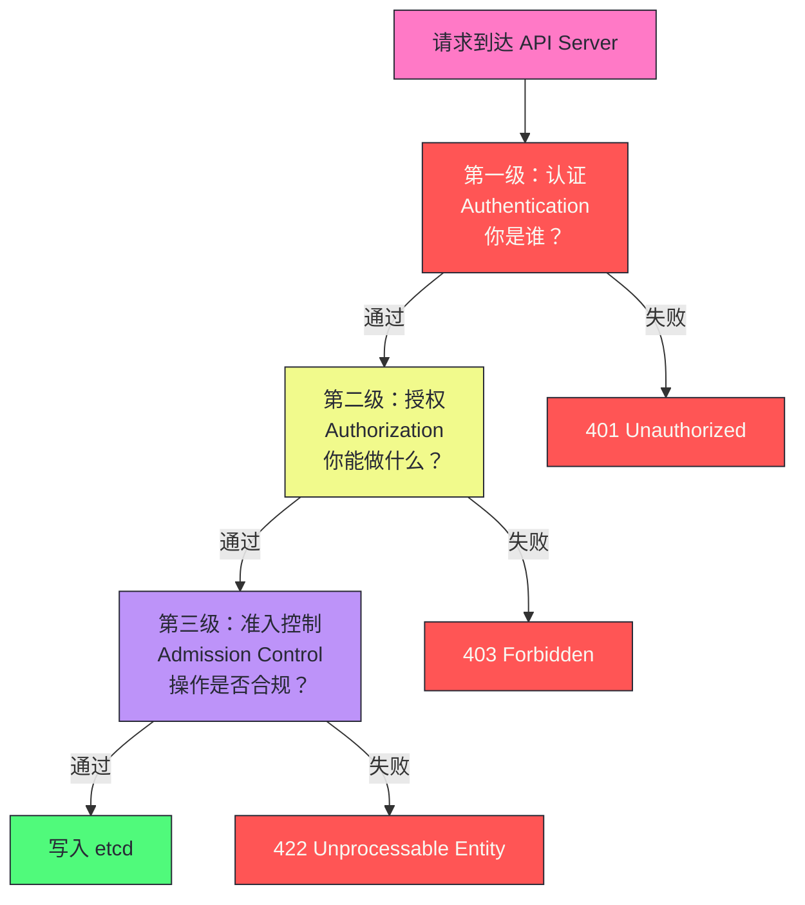
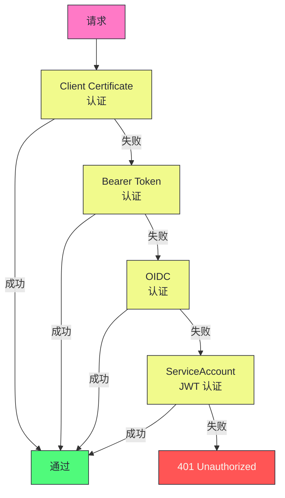
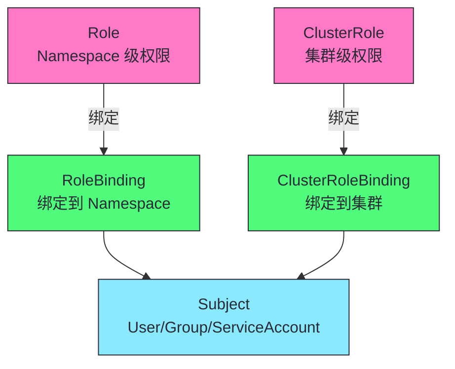
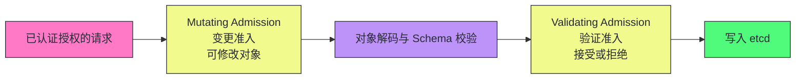
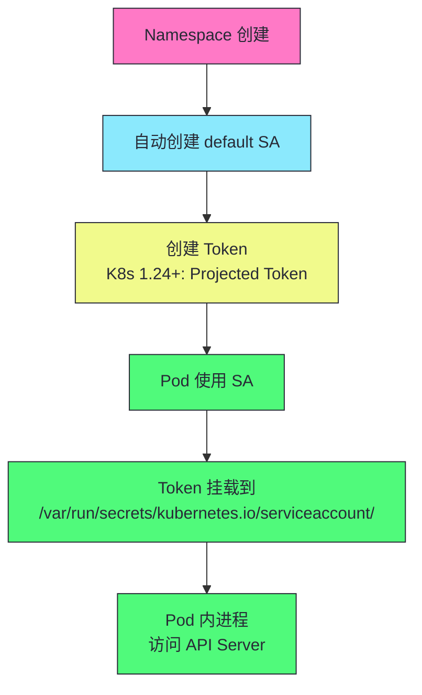

# 05 认证、授权与准入控制：K8s 的安全三级防线

**摘要：**
本文深入 Kubernetes 的安全三级防线——认证（Authentication）、授权（Authorization）、准入控制（Admission Control）。认证回答"你是谁"，授权回答"你能做什么"，准入控制回答"操作是否合规"。文章详解每级的机制和配置，包括认证链、RBAC 权限模型、Mutating/Validating Admission Webhook、ServiceAccount Token 投影与轮转、Pod Security Standards 三级策略，以及生产环境的安全加固实践——最小权限、NetworkPolicy、密钥管理、审计日志。核心认知：K8s 安全是"纵深防御"——三层协同构成完整防线，任一层被绕过其他层仍能保护。

---

## 第 1 章 K8s 安全模型概览

K8s 的安全模型是理解整个安全体系的基础。本章从全局视角介绍 K8s 的三级安全防线——认证、授权、准入控制，以及它们如何协同工作保护集群安全。理解这个全局模型，是深入每层防线细节的基础。

### 1.1 三级防线

K8s 的安全模型基于"纵深防御"（Defense in Depth）原则——三层防线层层把关，任一层被绕过，其他层仍能保护。这种设计使得 K8s 的安全不依赖单一机制，而是通过多层协同提供完整的安全保障。纵深防御是安全领域的经典原则——单一安全机制总有被绕过的可能，多层独立的安全机制使得攻击者需要同时绕过所有层才能得手，大幅提高了攻击难度。



### 1.2 每级的职责

| 级别 | 问题 | 机制 | 失败响应 |
|------|------|------|---------|
| **认证** | 你是谁？ | TLS 证书/Token/OIDC/SA | 401 Unauthorized |
| **授权** | 你能做什么？ | RBAC/Node/Webhook | 403 Forbidden |
| **准入控制** | 操作是否合规？ | Mutating/Validating Webhook | 422 Unprocessable Entity |

这三层防线的分工体现了安全设计的基本原则——"身份验证、权限控制、内容审查"分离。认证只关心身份（你是谁），不关心权限；授权只关心权限（你能做什么），不关心内容；准入控制只关心内容（操作是否合规），不关心身份。这种分离使得每层可以独立配置和演进，譬如更换认证方式（从 Token 切换到 OIDC）不需要修改授权策略，更换授权策略（从 ABAC 切换到 RBAC）不需要修改准入控制。

三层防线的失败响应也反映了它们的职责差异——认证失败返回 401（Unauthorized，不知道你是谁），授权失败返回 403（Forbidden，知道你是谁但不能做），准入失败返回 422（Unprocessable Entity，知道你是谁且你有权限但操作不合规）。客户端可以根据 HTTP 状态码判断问题出在哪一层，无需查看 API Server 内部日志。

> [!info] 核心概念：纵深防御是 K8s 安全的核心理念
> K8s 安全不是单一机制，而是"纵深防御"（Defense in Depth）——三层防线层层把关。认证挡住匿名访问（不知道你是谁就拒绝一切）。授权限制操作范围（即使知道你是谁，也不能做你没权限的事）。准入控制确保操作合规（即使你有权限，也要符合安全策略）。三层协同构成完整防线——任一层被绕过，其他层仍能保护。理解这个分层模型，是设计 K8s 安全策略的基础。

纵深防御的工程价值在于"单点失效不致命"。如果认证层被绕过（如证书泄露），授权层仍能限制泄露身份的权限；如果授权层配置错误（如过度授权），准入控制仍能阻止不合规的操作。生产环境的安全加固应该同时加强三层——只加强一层是不够的。

---

## 第 2 章 认证（Authentication）

认证是 K8s 安全模型的第一道闸门——所有请求必须先通过认证才能进入后续处理。认证回答"你是谁"——通过验证请求者提供的凭证（证书、Token、OIDC Token），确定请求者的身份。K8s 的认证模型设计为"多方式并存"——支持多种认证方式，每种方式适用于不同的客户端，API Server 统一处理。

### 2.1 认证链

API Server 支持多种认证方式，组织为一条**认证链**——请求按顺序通过每种方式，任一成功即可，全部失败则 401。K8s 需要同时服务组件（kubelet、kube-proxy）、人类用户（kubectl）、Pod 内进程、外部系统，每种客户端的认证方式不同，认证链使得它们可以共存。认证链的执行顺序由 API Server 的启动参数决定——参数中列出的认证方式按顺序执行，任一成功即停止。



认证链的"任一成功即可"设计有一个潜在问题：如果某种认证方式配置错误（如 OIDC 提供者不可达），它会被跳过而非报错——这可能导致一个本应被 OIDC 认证的请求被其他方式（如 Token）错误地认证。生产环境中需要仔细审查认证链的配置，确保每种认证方式的适用范围明确，避免认证链的"回退"行为导致安全漏洞。

### 2.2 四种主要认证方式

K8s 支持四种主要认证方式，每种方式适用于不同的客户端和使用场景。理解这四种方式的机制和适用场景，是选择合适认证方式的基础。

| 方式 | 机制 | 用户类型 | 适用场景 |
|------|------|---------|---------|
| **Client Certificate** | TLS 客户端证书 | 普通用户 | 组件间通信、管理员访问 |
| **Bearer Token** | 静态 Token 文件 | 普通用户 | 外部系统集成（不推荐生产） |
| **OIDC** | OpenID Connect | 普通用户 | 企业 SSO（Google/Azure AD/Keycloak） |
| **ServiceAccount Token** | JWT Token | ServiceAccount | Pod 内访问 API Server |

这四种认证方式覆盖了 K8s 的所有使用场景——组件间通信用 Client Certificate（双向 TLS，最高安全），用户用 OIDC（对接企业身份系统），Pod 用 ServiceAccount Token（自动注入），外部系统用 Bearer Token（简单接入）。选择认证方式时需要考虑安全性、便利性和运维成本的平衡——Client Certificate 最安全但管理复杂，OIDC 对接企业身份系统但依赖外部服务，ServiceAccount Token 自动注入但权限需细粒度控制，Bearer Token 最简单但最不安全。

#### Client Certificate 认证

```bash
# 生成客户端证书
openssl genrsa -out alice.key 2048
openssl req -new -key alice.key -out alice.csr -subj "/CN=alice/O=devs"

# 用 CA 签名
openssl x509 -req -in alice.csr -CA ca.crt -CAkey ca.key -CAcreateserial -out alice.crt

# 配置 kubectl 使用客户端证书
kubectl config set-credentials alice --client-certificate=alice.crt --client-key=alice.key
```

证书中的 CN（Common Name）成为用户名，O（Organization）成为用户组。Client Certificate 认证的安全性依赖于 CA 的私钥保护——如果 CA 私钥泄露，任何人都可以签发合法证书，冒充任何用户。生产环境中 CA 私钥应该严格保护（如存储在 HSM 或 Vault 中），并定期轮转。CA 私钥的泄露是 K8s 安全的最严重事故——攻击者可以冒充任何用户（包括 cluster-admin），获得集群的完全控制。

Client Certificate 认证的一个工程优势是"无状态"——API Server 只需要 CA 证书（公钥）即可验证所有客户端证书，不需要查询外部服务。这使得 Client Certificate 认证的延迟极低（微秒级），适合高频的组件间通信。但 Client Certificate 的劣势是"撤销困难"——证书一旦签发，在过期前无法撤销（除非配置 CRL 或 OCSP，但 K8s 默认不支持）。生产环境中如果需要撤销证书，通常通过短期证书（如 24 小时过期）+ 频繁轮转来降低风险。这种"短期证书加频繁轮转"的模式是 K8s 组件间通信认证的最佳实践——即使证书泄露，攻击窗口也很短。

Client Certificate 认证的另一个细节是"用户名和组从证书字段提取"——CN（Common Name）映射为用户名，O（Organization）映射为用户组。一个证书可以有多个 O 字段，对应多个用户组。这种映射使得 RBAC 可以基于用户组授权——譬如为 "devs" 组签发证书，然后 RBAC 授予 "devs" 组开发环境的权限。Client Certificate 认证与 RBAC 无缝集成，无需额外的身份映射配置。

#### ServiceAccount Token 认证

Pod 内访问 API Server 使用 ServiceAccount 的 JWT Token。Token 通过投影卷自动挂载到 Pod 中。

```yaml
# Pod 自动挂载 ServiceAccount Token
apiVersion: v1
kind: Pod
metadata:
  name: my-pod
spec:
  serviceAccountName: my-sa  # 指定使用的 ServiceAccount
  containers:
    - name: app
      image: my-app
      # Token 自动挂载到 /var/run/secrets/kubernetes.io/serviceaccount/token
```

ServiceAccount Token 的 JWT 结构包含三个部分：Header（签名算法）、Payload（声明信息）、Signature（签名）。Payload 中包含关键声明：`iss`（签发者，API Server 地址）、`sub`（Subject，ServiceAccount 名）、`aud`（Audience，目标 API）、`exp`（过期时间）、`iat`（签发时间）。API Server 验证 Token 时检查签名（用自己的私钥验证）和声明（过期时间、Audience 是否匹配）。

JWT Token 的一个工程优势是"自包含"——Token 本身包含了身份信息（ServiceAccount 名、Namespace、过期时间），API Server 验证 Token 时不需要查询外部服务（除了检查 Token 是否被撤销）。这使得 JWT Token 的验证延迟很低（微秒级），适合 Pod 内高频访问 API Server 的场景。但 JWT Token 的劣势是"撤销困难"——Token 在过期前无法主动撤销（除非 API Server 维护撤销列表）。Bound Token 通过"绑定到 Pod"解决了这个问题——Pod 删除后 Token 立即失效，无需显式撤销。

OIDC 认证的生产配置需要关注几个关键参数。`--oidc-issuer-url` 指定 OIDC 提供者的 URL（如 `https://keycloak.example.com/realms/myrealm`），API Server 会从该 URL 的 `/.well-known/openid-configuration` 端点获取配置。`--oidc-client-id` 指定 Token 的受众声明，API Server 验证 Token 的 `aud` 必须匹配该值。`--oidc-username-claim` 指定 Token 中哪个声明作为用户名（如 `preferred_username` 或 `email`），`--oidc-username-prefix` 为用户名添加前缀（如 `oidc:`），避免与本地用户冲突。`--oidc-groups-claim` 指定哪个声明作为用户组，`--oidc-groups-prefix` 为组添加前缀。这些参数的配置决定了 OIDC Token 如何映射到 K8s 的用户和组，进而决定 RBAC 授权。配置错误可能导致用户无法访问集群，或更严重地，导致权限映射错误——低权限用户被映射到高权限组。

> [!warning] 生产避坑：ServiceAccount Token 的安全性演进
> 早期 K8s 的 ServiceAccount Token 是永久有效的静态 Token——一旦泄露无法撤销。K8s 1.21+ 引入了 **Projected ServiceAccount Token**——Token 有过期时间（默认 1 小时），kubelet 自动轮转。K8s 1.24+ 默认使用 Bound ServiceAccount Token——Token 绑定到特定的 Pod 和 audience，Pod 删除后 Token 失效。生产环境应使用 K8s 1.24+ 并启用 Bound Token，避免静态 Token 的泄露风险。

### 2.3 用户 vs ServiceAccount

K8s 区分两类身份：

| 类型 | 创建方式 | 认证方式 | 适用场景 |
|------|---------|---------|---------|
| **用户（User）** | 外部管理（证书/OIDC） | Client Cert/OIDC/Token | 人类用户、外部系统 |
| **ServiceAccount** | K8s API 创建 | JWT Token | Pod 内进程 |

这两类身份的根本区别在于"是否是 K8s 对象"。ServiceAccount 是 K8s 对象，有对应的 API 资源，可以通过 kubectl 创建、查看、删除；用户不是 K8s 对象，没有对应的 API 资源，不能通过 kubectl 创建。这种区别源于 K8s 的设计哲学——人类用户的身份管理是企业身份系统（LDAP/AD/OIDC）的职责，K8s 不应该重复造轮子；而 Pod 内进程的身份是 K8s 特有的概念，需要 K8s 自己管理。

> [!info] 核心概念：K8s 没有内置的用户管理
> K8s 不提供 User 资源——用户不是 K8s 对象，没有 `kubectl create user` 命令。用户身份由外部系统管理（证书 CA、OIDC Provider），K8s 只在认证时验证身份、在授权时检查权限。ServiceAccount 是 K8s 对象，有对应的 API 资源。这种设计使得 K8s 可以与企业现有身份系统集成（LDAP/AD/OIDC），而非自己维护一套用户体系。

K8s 不内置用户管理的设计体现了"关注点分离"——身份管理是身份系统（LDAP/AD/OIDC）的职责，K8s 只负责验证身份和检查权限。这种分离使得 K8s 可以与企业现有身份基础设施集成，而非要求企业为 K8s 单独维护一套用户体系。生产环境中通常用 OIDC 对接企业 SSO（如 Keycloak、Azure AD），用户通过 SSO 登录后获得 OIDC Token，用 Token 访问 K8s API。

OIDC 认证的工作流程值得深入理解。用户通过 OIDC Provider（如 Keycloak）登录，获得 ID Token（JWT 格式）。用户用 ID Token 访问 API Server，API Server 验证 Token 的签名（用 OIDC Provider 的公钥）和声明（过期时间、Audience 是否匹配）。如果验证通过，API Server 从 Token 的声明中提取用户名和组（通过 `--oidc-username-claim` 和 `--oidc-groups-claim` 配置），用于后续的授权检查。这种"OIDC Provider 签发 Token，API Server 验证 Token"的流程使得 K8s 可以与企业 SSO 无缝集成，用户用 SSO 凭证访问 K8s，无需单独的 K8s 凭证。

---

## 第 3 章 授权（Authorization）：RBAC 深度解析

授权是 K8s 安全模型的第二道闸门——在认证之后，准入控制之前。授权回答"你能做什么"——基于认证确定的身份，检查该身份是否有权限执行请求的操作。K8s 支持多种授权方式（RBAC、ABAC、Node、Webhook），但 RBAC 是事实标准——它用声明式 API 定义权限，易于管理和审计，是生产环境的首选。

### 3.1 RBAC 的四个核心对象

RBAC（Role-Based Access Control）是 K8s 授权的事实标准。它通过四个核心对象定义权限：Role、ClusterRole、RoleBinding、ClusterRoleBinding。RBAC 在 K8s 1.8 进入稳定版本，替代了早期的 ABAC（Attribute-Based Access Control）——ABAC 需要为每个用户维护一个策略文件，难以管理和审计；RBAC 用声明式 API 定义权限，可以通过 kubectl 管理和审计，成为 K8s 授权的默认选择。RBAC 的核心思想是"角色加绑定"——先定义角色（权限集合），再把角色绑定到用户/组/ServiceAccount。



| 对象 | 作用域 | 说明 |
|------|--------|------|
| **Role** | Namespace | 定义 Namespace 内的权限 |
| **ClusterRole** | 集群 | 定义集群级权限（含 Namespace 资源） |
| **RoleBinding** | Namespace | 将 Role 绑定到 Subject（Namespace 级） |
| **ClusterRoleBinding** | 集群 | 将 ClusterRole 绑定到 Subject（集群级） |

这四个对象的组合产生了四种权限授予模式：Role + RoleBinding（Namespace 级权限授予 Namespace 级 Subject）、ClusterRole + RoleBinding（集群级权限定义复用到 Namespace 级）、ClusterRole + ClusterRoleBinding（集群级权限授予集群级 Subject）、Role + ClusterRoleBinding（不常用，Role 是 Namespace 级但绑定到集群级）。理解这四种模式的差异是正确配置 RBAC 的基础。生产环境中通常优先使用 ClusterRole + RoleBinding 模式——定义一组通用的 ClusterRole 权限模板，然后在不同的 Namespace 中用 RoleBinding 绑定，实现权限定义的复用和作用域的限制。

### 3.2 Role 和 ClusterRole 的定义

Role 和 ClusterRole 是 RBAC 中定义权限的两个对象。Role 定义 Namespace 级权限，ClusterRole 定义集群级权限。它们都通过 rules 字段定义权限规则——每条规则由 apiGroups、resources、verbs 组成，表示"对哪些 API 组的哪些资源有哪些操作权限"。

```yaml
# Role：Namespace 级权限
apiVersion: rbac.authorization.k8s.io/v1
kind: Role
metadata:
  name: pod-reader
  namespace: default
rules:
  - apiGroups: [""]
    resources: ["pods", "pods/log"]
    verbs: ["get", "list", "watch"]
  - apiGroups: [""]
    resources: ["configmaps"]
    verbs: ["get"]  # 只读 ConfigMap
```

```yaml
# ClusterRole：集群级权限
apiVersion: rbac.authorization.k8s.io/v1
kind: ClusterRole
metadata:
  name: node-reader
rules:
  - apiGroups: [""]
    resources: ["nodes"]
    verbs: ["get", "list", "watch"]
```

Role 和 ClusterRole 的区别在于作用域——Role 只能定义 Namespace 资源的权限（如 Pods、Services、ConfigMaps），ClusterRole 可以定义任何资源的权限（包括集群级资源如 Nodes、PersistentVolumes、Namespaces）。生产环境中通常优先使用 ClusterRole 定义权限模板，然后用 RoleBinding 在特定 Namespace 中绑定——这样权限定义可以复用，但作用域可以限制。这种"集群级定义、Namespace 级绑定"的模式是 RBAC 的最佳实践，既减少了重复定义，又限制了权限范围。

Role 和 ClusterRole 的 rules 字段是一个数组，每条规则由 apiGroups、resources、verbs、resourceNames 组成。resourceNames 是可选的，用于限制只能操作特定名称的资源——譬如只允许操作名为 "my-config" 的 ConfigMap，而非所有 ConfigMap。这种"资源名称级"的细粒度授权使得 RBAC 可以精确到单个对象，而非整个资源类型。生产环境中对于敏感资源（如 Secret），可以用 resourceNames 限制只能访问特定的 Secret，而非所有 Secret。

ClusterRole 支持聚合规则（aggregationRule）——通过标签选择器将多个 ClusterRole 的权限合并为一个。譬如定义一个 "monitoring-role"，通过 `aggregationRule.clusterRoleSelectors` 选择所有带 `rbac.example.com/aggregate-to-monitoring: "true"` 标签的 ClusterRole，它们的权限自动合并到 "monitoring-role" 中。K8s 内置的 `cluster-admin` 角色就使用了聚合规则——它聚合了所有带 `rbac.authorization.k8s.io/aggregate-to-cluster-admin: "true"` 标签的 ClusterRole。聚合规则使得权限可以模块化组合——新增权限只需要创建带标签的 ClusterRole，无需修改聚合角色。系统控制器会定期检查标签匹配并自动更新聚合角色的 rules。

RBAC 还有一个重要的安全机制：权限提升防护（privilege escalation prevention）。API Server 默认禁止用户创建比自己拥有更多权限的 Role 或 ClusterRole——如果用户没有 cluster-admin 权限，他不能创建一个 cluster-admin 的 Role。这个机制防止了权限提升攻击——低权限用户不能通过创建高权限 Role 来提升自己的权限。如果确实需要创建比自己权限更广的 Role，需要通过 `--allow-privileged-escalation` 参数（或 Binding 的 `allow-escalation` 字段）显式授权。此外，用户也不能为自己授予 Binding 的权限——即不能绑定自己没有的 Role。

### 3.3 verbs 和 resources 的组合

verbs 和 resources 的组合是 RBAC 权限规则的核心——每条规则由"对哪些 resources 有哪些 verbs"定义。理解 verbs 的含义和 resources 的粒度，是正确配置 RBAC 的基础。

| verb | 说明 | 示例 |
|------|------|------|
| **get** | 读取单个对象 | `kubectl get pod web` |
| **list** | 列出对象列表 | `kubectl get pods` |
| **watch** | 监听对象变化 | List-Watch |
| **create** | 创建对象 | `kubectl apply` |
| **update** | 全量更新 | `kubectl replace` |
| **patch** | 局部更新 | `kubectl patch` |
| **delete** | 删除对象 | `kubectl delete` |
| **deletecollection** | 批量删除 | `kubectl delete pods --all` |

这些 verbs 对应 HTTP 动词——get 对应 GET，create 对应 POST，update 对应 PUT，patch 对应 PATCH，delete 对应 DELETE。RBAC 的授权检查基于"verb + resource + namespace"三元组——譬如"alice 可以在 default Namespace 中 create pods"。这种细粒度的授权使得 K8s 可以精确控制每个操作的权限，而非粗粒度地授予"管理员"或"只读"权限。

verbs 的一个容易混淆的点是"get 和 list 的区别"——get 是读取单个对象（需要指定名称），list 是列出对象列表（不指定名称）。watch 是监听对象变化（基于 List-Watch 机制）。这三个 verbs 通常一起授予（get/list/watch），因为控制器需要 List-Watch 资源变化。但生产环境中对于敏感资源（如 Secret），可以只授予 get 而不授予 list/watch——这样用户只能读取特定的 Secret（通过 resourceNames 限制），而不能列出所有 Secret。

RBAC 授权检查的内部实现值得了解。API Server 在授权阶段构建一个 `authorizer.Attributes` 对象，包含用户名、组、verb、resource、namespace、name 等信息，然后调用授权器（RBAC authorizer）的 `Authorize()` 方法。RBAC authorizer 遍历所有 RoleBinding 和 ClusterRoleBinding，找到绑定到当前用户/组的所有 Role/ClusterRole，检查其中是否有任何一条 rule 匹配当前请求的 verb/resource/namespace。如果找到匹配的 rule，返回 `Allow`；否则返回 `Deny`。这个遍历过程是内存操作（所有 RBAC 对象缓存在 API Server 内存中），延迟在微秒级。但在大规模集群中（数千个 RoleBinding），遍历可能成为性能瓶颈——K8s 通过 RBAC 缓存和索引优化来缓解这个问题。`kubectl auth can-i` 命令使用相同的授权检查逻辑，可以用来验证用户的实际权限。

### 3.4 RoleBinding 的绑定

RoleBinding 的作用是把 Role 或 ClusterRole 绑定到 Subject（User、Group、ServiceAccount）。RoleBinding 是 Namespace 级资源——它只在该 Namespace 内生效。Subject 可以是 User（普通用户）、Group（用户组）或 ServiceAccount（Pod 内进程身份），RBAC 可以同时服务人类用户和 Pod 内进程。

```yaml
apiVersion: rbac.authorization.k8s.io/v1
kind: RoleBinding
metadata:
  name: alice-pod-reader
  namespace: default
subjects:
  - kind: User
    name: alice
    apiGroup: rbac.authorization.k8s.io
  - kind: ServiceAccount
    name: my-sa
    namespace: default
roleRef:
  kind: Role
  name: pod-reader
  apiGroup: rbac.authorization.k8s.io
```

> [!info] 核心概念：RoleBinding 可以引用 ClusterRole
> RoleBinding 可以引用 ClusterRole——这使得你可以在某个 Namespace 中授予集群级权限的子集。例如，定义一个 ClusterRole 允许读取所有 Namespace 的 Pod，然后用 RoleBinding 在 `default` Namespace 中绑定——Subject 只能在 `default` 中读 Pod，不能读其他 Namespace。这是一种复用 ClusterRole 定义但限制作用域的技巧。

RoleBinding 引用 ClusterRole 的设计是 RBAC 复用权限定义的关键机制。生产环境中通常定义一组通用的 ClusterRole（如 pod-reader、configmap-writer、secret-accessor），然后在不同的 Namespace 中用 RoleBinding 绑定——这样权限定义只维护一份，但可以在多个 Namespace 中复用。这种"集群级定义、Namespace 级绑定"的模式使得 RBAC 的维护成本可控，避免为每个 Namespace 重复定义 Role。

### 3.5 RBAC 的最佳实践

RBAC 的最佳实践是"最小权限原则"——只授予必要的权限，避免过度授权。这些实践是生产环境 RBAC 配置的指导原则，遵循这些原则可以最大限度地降低安全风险。

| 实践 | 说明 |
|------|------|
| **最小权限原则** | 只授予必要的权限，避免使用 cluster-admin |
| **按 Namespace 隔离** | 不同团队用不同 Namespace，权限按 Namespace 授予 |
| **ServiceAccount 粒度** | 每个应用用独立 ServiceAccount，而非共享 default |
| **避免通配符** | 不要用 `verbs: ["*"]` 或 `resources: ["*"]` |
| **定期审计** | 用 `kubectl auth can-i --list` 检查权限 |

这些最佳实践的核心是"最小化"——只授予必要的权限，避免过度授权。按 Namespace 隔离使得不同团队的权限互不影响，譬如开发团队的 SA 不能访问生产 Namespace 的资源。ServiceAccount 粒度使得每个应用有独立身份，权限可以精确控制。避免通配符使得权限明确，不会意外授予过多权限。定期审计使得权限配置保持合规，及时发现过度授权。

> [!warning] 生产避坑：cluster-admin 是"上帝权限"，慎用
> cluster-admin 拥有集群所有资源的所有操作权限——相当于 root。生产环境应严格限制 cluster-admin 的绑定对象。日常运维用自定义的受限 ClusterRole（如只读 + 特定 Namespace 的写权限）。审计 ClusterRoleBinding 检查谁有 cluster-admin 权限——`kubectl get clusterrolebinding -o json | jq '.items[] | select(.roleRef.name=="cluster-admin")'`。

最小权限原则是 RBAC 安全的基石——只授予完成工作所需的最低权限，避免过度授权。生产环境中常见的过度授权包括：使用 cluster-admin 代替受限 Role、使用通配符 `verbs: ["*"]` 代替具体 verbs、共享 default ServiceAccount 代替独立 ServiceAccount。这些过度授权虽然方便，但一旦身份泄露（如 Token 被窃取），攻击者获得的权限范围极大。定期审计 RBAC 配置，发现并修复过度授权，是生产环境安全运维的必要工作。

---

## 第 4 章 准入控制（Admission Control）

准入控制是 K8s 安全模型的第三道闸门——在认证和授权之后，写入 etcd 之前。准入控制可以修改请求对象（Mutating Admission）或验证请求对象（Validating Admission），是 K8s 安全策略的执行点。准入控制与认证、授权的区别在于：认证和授权基于"身份"做决策，准入控制基于"内容"做决策——即使你有权限创建 Pod，准入控制也会检查 Pod 的内容是否符合安全策略（如镜像来源、资源限制、安全上下文）。这种"身份检查加内容检查"的分层设计是 K8s 安全模型的核心。

### 4.1 两阶段准入控制

准入控制是 K8s 安全模型的第三道闸门——在认证和授权之后，写入 etcd 之前。准入控制可以修改请求对象（Mutating Admission）或验证请求对象（Validating Admission），是 K8s 安全策略的执行点。准入控制与授权的区别在于：授权基于"身份加资源加动词"做粗粒度决策（如"用户 A 可以创建 Pod"），准入控制基于"对象内容"做细粒度决策（如"Pod 的镜像不能是 latest"）。这种"粗粒度授权加细粒度准入"的分层设计使得 K8s 的安全策略既灵活又高效。

两阶段准入控制允许 K8s 在写入前既修改对象（如注入 sidecar、设置默认值）又验证对象（如检查资源配额、验证镜像来源）。Mutating Admission 阶段可以修改对象，Validating Admission 阶段只能接受或拒绝。验证逻辑基于"最终对象"做判断，而非基于"修改前或修改后的某个中间状态"。



两阶段准入控制的顺序设计是 K8s 安全模型的关键——先 Mutating 后 Validating，确保修改后的对象通过完整验证。如果反过来，验证通过的对象可能被 Mutating 修改成不合规的状态。这个顺序保证了写入 etcd 的对象是经过完整验证的，而非"验证后又被修改"的对象。

### 4.2 内置准入控制器

K8s 内置了数十个准入控制器，通过 `--enable-admission-plugins` 启用。这些内置准入控制器是 K8s 默认安全策略的执行点，不需要额外配置，启用后自动工作。

| 准入控制器 | 阶段 | 作用 |
|-----------|------|------|
| **NamespaceLifecycle** | Validating | 阻止在正在删除的 Namespace 中创建资源 |
| **ServiceAccount** | Mutating | 为没有指定 SA 的 Pod 注入 default SA |
| **DefaultStorageClass** | Mutating | 为没有指定 StorageClass 的 PVC 注入默认值 |
| **DefaultTolerationSeconds** | Mutating | 为 Pod 注入默认的污点容忍时间 |
| **PodSecurity** | Validating | 验证 Pod 是否符合 Pod Security Standards |
| **ResourceQuota** | Validating | 检查 Namespace 的资源配额是否超限 |
| **LimitRanger** | Validating | 检查 Pod 资源限制是否符合 LimitRange |

这些准入控制器的执行顺序由 API Server 的 `--enable-admission-plugins` 参数决定——参数中列出的顺序就是执行顺序。生产环境中应该仔细安排准入控制器的顺序，譬如 ServiceAccount 准入控制器应该在 PodSecurity 之前——先注入 default SA，再检查 Pod 安全合规性。如果顺序反了，没有指定 SA 的 Pod 可能因为 PodSecurity 检查失败而被拒绝，而实际上它只是缺少 SA 注入。

这些内置准入控制器是 K8s 默认安全策略的执行点——它们不需要额外配置，启用后自动工作。生产环境中通常启用所有推荐的准入控制器（通过 `--enable-admission-plugins` 配置），确保基础安全策略生效。内置准入控制器的性能影响可以忽略——它们是内存操作，延迟在微秒级。

内置准入控制器的一个设计原则是"不可配置"——它们的行为是固定的，用户不能修改。譬如 ServiceAccount 准入控制器总是为没有指定 SA 的 Pod 注入 default SA，用户不能改为注入其他 SA。内置准入控制器的行为可预测，不会因配置错误导致安全问题。如果需要自定义行为，用户应该使用 Admission Webhook，而非试图修改内置准入控制器的行为。

### 4.3 Admission Webhook

除了内置准入控制器，K8s 支持通过 **Webhook** 扩展——外部服务参与准入控制。Webhook 是 K8s 安全策略扩展的核心机制——它允许企业实施自定义安全策略（如禁止使用 latest 标签、强制资源限制、镜像来源限制）而无需修改 K8s 源码。Webhook 的工作原理是 API Server 在准入阶段调用外部服务，把请求对象发送给 Webhook，Webhook 返回修改后的对象（Mutating）或验证结果（Validating）。

Admission Webhook 的一个典型应用场景是 Istio 的 sidecar 注入。当用户在启用 Istio 注入的 Namespace 中创建 Pod 时，Istio 的 MutatingWebhook 被调用，向 Pod 中注入 sidecar 容器（Envoy 代理）。这个过程对用户透明——用户提交的 Pod 没有 sidecar，但创建后的 Pod 有 sidecar。Istio 可以无侵入地为应用添加服务网格功能，而无需修改应用的部署配置。

```yaml
# MutatingWebhookConfiguration 示例（Istio sidecar 注入）
apiVersion: admissionregistration.k8s.io/v1
kind: MutatingWebhookConfiguration
metadata:
  name: istio-sidecar-injector
webhooks:
  - name: sidecar-injector.istio.io
    clientConfig:
      service:
        name: istiod
        namespace: istio-system
        path: "/inject"
    rules:
      - operations: ["CREATE"]
        apiGroups: [""]
        resources: ["pods"]
    namespaceSelector:
      matchLabels:
        istio-injection: enabled
```

| 配置项 | 说明 |
|--------|------|
| **clientConfig.service** | Webhook 服务的地址 |
| **rules** | 何时调用 Webhook（操作/资源） |
| **namespaceSelector** | 哪些 Namespace 触发 Webhook |
| **timeoutSeconds** | Webhook 超时时间（默认 10s） |
| **failurePolicy** | Webhook 故障时行为（Fail/Ignore） |

> [!warning] 生产避坑：Webhook 故障可能导致整个集群不可用
> Webhook 的 failurePolicy=Fail 意味着 Webhook 不可用时所有匹配的请求被拒绝——如果 Webhook 服务故障，可能导致所有 Pod 创建失败。对于关键 Webhook（如安全策略），用 Fail 确保安全；对于非关键 Webhook（如 sidecar 注入），考虑 Ignore 兜底。同时设置合理的 timeoutSeconds（如 3s），避免 Webhook 慢响应拖垮 API Server。监控 Webhook 的延迟和错误率——它是 API Server 延迟的常见来源。

Webhook 的 failurePolicy 配置是一个"安全性 vs 可用性"的权衡——Fail 优先安全（Webhook 故障时拒绝请求，防止不合规操作），Ignore 优先可用性（Webhook 故障时放行请求，避免阻塞集群操作）。生产环境中通常对安全相关的 Webhook（如镜像签名验证）用 Fail，对功能相关的 Webhook（如 sidecar 注入）用 Ignore。这种"分类配置"的策略使得安全性和可用性可以兼顾。

Webhook 的另一个重要配置是"匹配规则"——rules 字段定义了 Webhook 何时被调用（哪些操作、哪些资源），namespaceSelector 定义了哪些 Namespace 触发 Webhook。生产环境中应该精确配置匹配规则，避免 Webhook 被不必要的请求触发——每次 Webhook 调用都增加 API Server 的延迟，不必要的调用会拖慢集群操作。譬如 sidecar 注入 Webhook 只需要匹配 Pod 创建操作，且只匹配特定标签的 Namespace（如 `istio-injection: enabled`），而非所有 Namespace 的所有操作。

Webhook 还有一个容易被忽视的配置：`matchPolicy`。默认值 `Equivalent` 意味着即使请求使用了旧 API 版本（如 `apps/v1beta1`），API Server 也会将请求转换为 Webhook 配置中声明的版本（如 `apps/v1`）再发送给 Webhook。这确保 Webhook 总是处理同一版本的对象，无需关心版本转换。如果设为 `Exact`，则只有请求版本与配置版本完全匹配时才调用 Webhook。生产环境中通常用默认的 `Equivalent`，避免因版本不匹配导致 Webhook 被跳过。

---

## 第 5 章 Pod Security Standards

Pod Security Standards 是 K8s 1.25+ 替代 PSP 的 Pod 安全策略机制。它通过三个安全级别（Privileged/Baseline/Restricted）和三种模式（enforce/audit/warn）控制 Pod 的安全配置。PodSecurity Standards 的设计目标是简化 Pod 安全管理——用 Namespace 标签替代复杂的 CRD 配置，用声明式模式替代命令式策略。

### 5.1 三个安全级别

K8s 1.25+ 用 **Pod Security Standards** 替换了 PodSecurityPolicy（PSP）。三个级别：

| 级别 | 限制程度 | 说明 |
|------|---------|------|
| **Privileged** | 最宽松 | 无限制，特权容器可用 |
| **Baseline** | 中等 | 禁止最危险的特权，保留普通容器需求 |
| **Restricted** | 最严格 | 严格限制，要求 non-root、readOnlyRootFilesystem 等 |

PodSecurity Standards 的设计目标是"用简单的 Namespace 标签替代复杂的 PSP 配置"。PSP 需要为每个安全策略定义一个 CRD 对象，然后通过 RBAC 绑定到用户——配置繁琐，且与 RBAC 耦合导致权限管理混乱。PodSecurity Standards 用 Namespace 标签配置——只需在 Namespace 上打标签（如 `pod-security.kubernetes.io/enforce: restricted`），即可对该 Namespace 中的所有 Pod 生效。这种"标签即策略"的设计大幅简化了安全配置，使得安全策略的管理成本从"每个策略一个 CRD"降到"每个 Namespace 一个标签"。

这三个级别的命名也值得理解——Privileged 表示"特权"（无限制），Baseline 表示"基线"（最低安全要求），Restricted 表示"受限"（严格安全）。这三个级别覆盖了从"完全信任"到"严格限制"的安全谱系，使得应用可以根据实际需求选择合适的级别。

这三个级别覆盖了从"完全信任"到"严格限制"的安全谱系——Privileged 用于系统组件（如 CNI 插件、存储插件），Baseline 用于普通应用，Restricted 用于高安全要求的应用。生产环境中通常对应用 Namespace 强制 Restricted，对系统 Namespace（如 kube-system）允许 Privileged。这种"分级别配置"的策略使得不同安全要求的应用可以在同一集群中共存，而不会相互影响。

三个级别的选择需要根据应用的实际需求——Privileged 级别的 Pod 可以访问节点资源（如 hostNetwork、hostPath），适合需要节点级访问的系统组件；Baseline 级别的 Pod 禁止了最危险的特权，适合大多数普通应用；Restricted 级别的 Pod 要求 non-root、只读根文件系统，适合高安全要求的应用（如处理敏感数据的应用）。生产环境中应该从 Restricted 开始，只有当应用确实需要更高权限时才放宽到 Baseline 或 Privileged，而非从 Privileged 开始然后限制。

### 5.2 各级别的限制

三个安全级别的限制是递增的——Privileged 无限制，Baseline 禁止最危险的特权，Restricted 在 Baseline 基础上增加应用自身安全的要求。理解各级别的具体限制，是选择合适级别的基础。这种递增的限制设计使得应用可以根据实际需求选择合适的级别——需要节点级访问的系统组件用 Privileged，普通应用用 Baseline，高安全要求的应用用 Restricted。

#### Baseline 禁止的配置

| 配置 | Baseline 禁止 | Restricted 禁止 |
|------|-------------|----------------|
| **privileged** | 是 | 是 |
| **hostNetwork/hostPID/hostIPC** | 是 | 是 |
| **hostPath volumes** | 是 | 是 |
| **hostPort** | 是 | 是 |
| **runAsNonRoot** | - | 必须为 true |
| **readOnlyRootFilesystem** | - | 必须为 true |
| **allowPrivilegeEscalation** | - | 必须为 false |
| **capabilities** | 限制添加 | 只允许 NET_BIND_SERVICE |

Baseline 禁止的是"可能影响节点或其他 Pod"的特权配置——hostNetwork、hostPID、hostPath 等可能让 Pod 访问节点资源或影响其他 Pod。Restricted 在 Baseline 基础上增加了"应用自身安全"的要求——必须 non-root、只读根文件系统、禁止权限提升。这些要求使得 Restricted 级别的 Pod 即使被攻破，攻击者也无法获得 root 权限或修改文件系统。

Restricted 级别的安全要求对应用开发有直接影响——应用必须以 non-root 用户运行，必须使用 Volume 挂载可写目录（而非根文件系统），必须放弃不必要的 Linux capabilities。这些要求可能需要修改应用镜像或 Pod 配置。生产环境中迁移到 Restricted 级别时，应该先用 audit 模式发现不合规的 Pod，修复后再 enforce，避免"一刀切"导致应用故障。

### 5.3 PodSecurity Admission 配置

PodSecurity Admission 的配置方式是 Namespace 标签——在 Namespace 上打标签即可对该 Namespace 中的所有 Pod 生效。这种"标签即策略"的配置方式比 PSP 的 CRD 配置简单得多，也更容易管理和审计。生产环境中通常为每个 Namespace 配置合适的 PodSecurity 级别，确保 Pod 的安全配置符合要求。

```yaml
# Namespace 级别配置 Pod Security
apiVersion: v1
kind: Namespace
metadata:
  name: my-namespace
  labels:
    # enforces Restricted 级别——违反则拒绝
    pod-security.kubernetes.io/enforce: restricted
    pod-security.kubernetes.io/enforce-version: latest
    # audits Baseline 级别——违反只记审计日志
    pod-security.kubernetes.io/audit: baseline
    pod-security.kubernetes.io/audit-version: latest
    # warns Baseline 级别——违反返回警告
    pod-security.kubernetes.io/warn: baseline
    pod-security.kubernetes.io/warn-version: latest
```

| 模式 | 行为 |
|------|------|
| **enforce** | 违反则拒绝创建/更新 |
| **audit** | 违反则记审计日志，但不拒绝 |
| **warn** | 违反则返回警告消息，但不拒绝 |

> [!info] 核心概念：PodSecurity Standards 是 PSP 的简化替代
> PSP（PodSecurityPolicy）在 K8s 1.25 被移除——它太复杂，配置繁琐，且与 RBAC 耦合导致权限管理混乱。PodSecurity Standards 用 Namespace 标签替代——简单、声明式、与 RBAC 解耦。三种模式（enforce/audit/warn）允许渐进式迁移——先 audit 和 warn 发现不合规的 Pod，修复后再 enforce。这是 K8s 安全简化的典型实践——用更简单的机制替代过度复杂的方案。

三种模式允许 PodSecurity Standards 渐进式部署——先用 audit 和 warn 发现不合规的 Pod，修复后再 enforce。生产环境中通常先在 audit 模式下运行一段时间（如 1-2 周），收集不合规的 Pod 列表，修复后再切换到 enforce。

三种模式可以同时配置不同级别——譬如 enforce Restricted、audit Baseline、warn Baseline。这种"分级配置"使得安全策略可以渐进收紧——先 audit 和 warn Baseline 级别的不合规 Pod（如使用 hostPath 的 Pod），修复后再 enforce Baseline；然后 audit 和 warn Restricted 级别的不合规 Pod（如以 root 运行的 Pod），修复后再 enforce Restricted。这种"逐级收紧"的策略使得安全加固可以分阶段进行，而非一次性完成。

Restricted 级别的具体要求值得列举——它是生产环境推荐的最低安全基线。Restricted 级别要求：Pod 必须设置 `runAsNonRoot: true`（或 `runAsUser` 设为非 0 值）；必须删除 `capabilities` 中的所有 Linux capabilities（只允许保留 `NET_BIND_SERVICE`）；必须设置 `seccompProfile` 为 `RuntimeDefault` 或 `Localhost`；禁止使用 `hostNetwork`、`hostPID`、`hostIPC`；禁止使用 `hostPath` 卷；必须设置 `readOnlyRootFilesystem: true` 或对可写路径有明确理由。这些要求确保 Pod 以最小权限运行，即使被攻破也难以逃逸到宿主机。

Baseline 级别的要求比 Restricted 宽松，主要禁止高危特权：禁止使用 `hostNetwork`、`hostPID`、`hostIPC`；禁止添加除 `NET_BIND_SERVICE` 外的 Linux capabilities；禁止使用 `privileged: true`；禁止使用 hostPath 卷；禁止使用宿主机命名空间。Baseline 适合不能立即满足 Restricted 要求的应用——许多旧应用以 root 运行或需要写根文件系统，无法直接达到 Restricted 级别，但至少应该满足 Baseline 级别。Privileged 级别则无任何限制，仅用于系统组件或特殊场景。

---

## 第 6 章 ServiceAccount 与 Pod 内访问

ServiceAccount 是 K8s 中 Pod 内进程访问 API Server 的身份。理解 ServiceAccount 的生命周期和 Token 机制，是理解 Pod 内访问 API Server 安全模型的基础。Pod 内进程通过 ServiceAccount Token 访问 API Server，权限由 ServiceAccount 的 RBAC 绑定决定——这种"身份加权限"的模型使得 Pod 内进程的权限可以精确控制。

### 6.1 ServiceAccount 的生命周期



ServiceAccount 的生命周期与 Namespace 绑定——创建 Namespace 时自动创建 default ServiceAccount，删除 Namespace 时删除所有 ServiceAccount。Pod 创建时指定 ServiceAccount（默认 default），Token 自动挂载到 Pod 中。Pod 内进程通过 Token 访问 API Server，权限由 ServiceAccount 的 RBAC 绑定决定。不同 Namespace 的 ServiceAccount 互不影响，譬如 dev Namespace 的 SA 不能访问 prod Namespace 的资源。

ServiceAccount 的一个重要实践是"每应用独立 ServiceAccount"。共享 default ServiceAccount 意味着同一 Namespace 的所有 Pod 有相同权限——如果某个 Pod 被攻破，攻击者可以访问 default SA 有权限的所有资源。每应用独立 ServiceAccount 允许细粒度权限控制——A 应用可以访问 Secret X，B 应用不能。生产环境中应该为每个应用创建独立的 ServiceAccount，并通过 RBAC 授予最小权限。

ServiceAccount 的另一个设计细节是"自动挂载 Token"。Pod 创建时如果没有显式指定 ServiceAccount，K8s 自动使用 default ServiceAccount，并把 Token 挂载到 Pod 的 `/var/run/secrets/kubernetes.io/serviceaccount/` 目录。Pod 内进程可以无配置地访问 API Server——读取 Token 文件即可。但这也带来一个安全风险——如果 Pod 不需要访问 API Server（如纯前端应用），自动挂载的 Token 反而增加了攻击面。K8s 1.24+ 允许通过 `automountServiceAccountToken: false` 禁用自动挂载，生产环境中对于不需要访问 API Server 的 Pod 应该禁用。

### 6.2 Bound ServiceAccount Token（K8s 1.24+）

Bound ServiceAccount Token 是 K8s 1.24+ 的默认 Token 机制，解决了静态 Token 的安全问题。Bound Token 的核心改进是"绑定"——Token 绑定到特定的 Pod 和 Audience，Pod 删除后 Token 失效，Audience 不匹配时 Token 被拒绝。这种"绑定"机制使得 Token 的泄露风险大幅降低——即使 Token 被窃取，攻击窗口也被限制在 Pod 存活期间，且 Token 只能用于特定的 Audience。Bound Token 是 Pod 内访问 API Server 的安全基础。

```yaml
# Projected ServiceAccount Token
apiVersion: v1
kind: Pod
metadata:
  name: my-pod
spec:
  serviceAccountName: my-sa
  containers:
    - name: app
      image: my-app
      volumeMounts:
        - name: token
          mountPath: /var/run/secrets/kubernetes.io/serviceaccount
  volumes:
    - name: token
      projected:
        sources:
          - serviceAccountToken:
              path: token
              expirationSeconds: 3600  # 1 小时过期
              audience: my-audience    # 绑定到特定 audience
```

| 特性 | 静态 Token（旧） | Bound Token（新） |
|------|-----------------|-----------------|
| **过期时间** | 永不过期 | 默认 1 小时，自动轮转 |
| **绑定范围** | 绑定到 SA | 绑定到 SA + Pod + Audience |
| **撤销** | 需删除 Secret | Pod 删除后自动失效 |

Bound Token 的轮转机制由 kubelet 负责。kubelet 在 Token 过期前 80% 生命周期时（如 1 小时过期，则在 48 分钟时）自动向 API Server 的 TokenRequest API 请求新 Token，写入投影卷。Pod 内进程读取 Token 文件时总是获得最新的 Token——投影卷使用 `fsprojected` 机制，kubelet 定期更新文件内容。如果 Pod 内进程缓存了 Token（如启动时读取一次），需要定期重新读取文件以获取新 Token。大多数 K8s 客户端库（如 client-go）已经内置了 Token 轮转支持——定期重新读取 Token 文件，无需应用代码处理。但如果应用使用了非官方 SDK 或直接 HTTP 客户端，需要自行实现 Token 刷新逻辑，否则 Token 过期后 API 调用会返回 401。
| **安全性** | 泄露后无法撤销 | 短期有效，泄露风险低 |

> [!info] 核心概念：Bound Token 是 Pod 内访问的安全基础
> Bound ServiceAccount Token 解决了静态 Token 的安全问题——Token 短期有效（默认 1 小时），kubelet 自动轮转，Pod 删除后 Token 立即失效。即使 Token 泄露，攻击窗口也很短。生产环境必须使用 K8s 1.24+ 的 Bound Token——这是 Pod 内访问 API Server 的安全最佳实践。如果你的集群还在用旧版静态 Token，优先升级。

Bound Token 的"绑定到 Pod"特性是一个重要的安全增强——Token 中包含了 Pod 的身份信息（如 Pod UID），API Server 验证 Token 时会检查 Pod 是否仍然存在。如果 Pod 被删除，即使 Token 还没过期，API Server 也会拒绝该 Token。Token 泄露后的攻击窗口被限制在 Pod 存活期间，大幅降低了泄露风险。

Bound Token 的"绑定到 Audience"特性也是一个重要的安全增强——Token 中包含了 Audience 声明（如 "my-audience"），API Server 验证 Token 时会检查 Audience 是否匹配。这使得 Token 只能用于特定的 API Server 或特定的用途，不能被滥用。譬如为访问 K8s API Server 的 Token 设置 Audience "kubernetes"，为访问外部服务的 Token 设置不同的 Audience，两种 Token 不能互换使用。

---

## 第 7 章 生产环境安全加固实践

前面几章讨论了 K8s 安全三级防线的机制和配置。本章讨论如何把这些机制应用到生产环境的安全加固中。生产环境的安全加固不是单一的配置，而是多个机制协同工作——RBAC 限制 API 操作权限、ServiceAccount 隔离应用身份、PodSecurity 限制 Pod 特权、NetworkPolicy 限制网络访问、密钥管理保护敏感数据、审计日志记录操作历史。这些机制构成了多维度的安全加固体系。

### 7.1 最小权限原则

最小权限原则是生产环境安全加固的总纲。它的核心思想是"只授予必要的最小权限"——每个维度（RBAC、ServiceAccount、Pod Security、NetworkPolicy、密钥访问）都应该只授予完成工作所需的最低权限。这种"最小化"的思路使得即使某个维度被攻破，攻击者能造成的损害也被限制在最小范围内。

| 维度 | 推荐 | 避免 |
|------|------|------|
| **RBAC** | 按需授予最小权限 | cluster-admin |
| **ServiceAccount** | 每应用独立 SA | 共享 default SA |
| **Pod Security** | Restricted 级别 | Privileged 级别 |
| **NetworkPolicy** | 默认拒绝，按需放行 | 无 NetworkPolicy |
| **密钥访问** | 按 SA 绑定特定 Secret | 所有 SA 可访问所有 Secret |

最小权限原则是生产环境安全加固的总纲——每个维度都应该只授予必要的最小权限。这种"最小化"的思路使得即使某个维度被攻破（如 ServiceAccount Token 泄露），攻击者能造成的损害也被限制在最小范围内。生产环境的安全加固应该从"默认拒绝"开始，然后按需放行——而非从"默认允许"开始然后限制。

最小权限原则的落地需要结合多个机制——RBAC 限制 API 操作权限、ServiceAccount 隔离应用身份、PodSecurity 限制 Pod 特权、NetworkPolicy 限制网络访问、Secret 绑定限制密钥访问。这些机制协同工作，构成了多维度的权限控制体系。生产环境中应该定期审计这些机制的配置，发现并修复过度授权——譬如用 `kubectl auth can-i --list --as=<user>` 检查用户权限，用 `kubectl get pods -o yaml | grep serviceAccountName` 检查 Pod 是否用了独立 SA。

最小权限原则的一个常见误区是"为了方便而过度授权"。譬如为了快速排查问题，给开发人员 cluster-admin 权限；为了简化配置，给 SA 通配符权限。这些"方便"的配置在平时看似无害，但一旦发生安全事件（如 Token 泄露、配置错误），过度授权会放大损害范围。生产环境中应该坚持最小权限原则，即使牺牲一些便利性——安全性和便利性是永恒的权衡，但在生产环境中应该优先安全性。

### 7.2 NetworkPolicy：网络层隔离

NetworkPolicy 是 K8s 网络层安全的核心机制。它通过标签选择器控制 Pod 之间的网络流量，实现了"默认拒绝，按需放行"的白名单模式。这种模式确保了只有明确允许的流量才能通过，所有未明确的流量都被拒绝，是生产环境网络隔离的最佳实践。NetworkPolicy 是 K8s 安全模型在网络层的延伸——认证授权准入控制保护 API Server，NetworkPolicy 保护 Pod 之间的网络通信。

```yaml
# 默认拒绝所有入站流量
apiVersion: networking.k8s.io/v1
kind: NetworkPolicy
metadata:
  name: default-deny
  namespace: my-namespace
spec:
  podSelector: {}  # 选择所有 Pod
  policyTypes:
    - Ingress
  # 没有 ingress 规则 = 拒绝所有入站
```

```yaml
# 只允许特定标签的 Pod 访问
apiVersion: networking.k8s.io/v1
kind: NetworkPolicy
metadata:
  name: allow-frontend
  namespace: my-namespace
spec:
  podSelector:
    matchLabels:
      app: backend
  policyTypes:
    - Ingress
  ingress:
    - from:
        - podSelector:
            matchLabels:
              app: frontend
      ports:
        - protocol: TCP
          port: 8080
```

> [!warning] 生产避坑：NetworkPolicy 依赖 CNI 插件支持
> NetworkPolicy 需要支持它的 CNI 插件——Calico、Cilium、Antrea 支持，Flannel 默认不支持。如果你的 CNI 不支持 NetworkPolicy，NetworkPolicy 资源可以创建但不会生效——Pod 之间的网络不受限制。部署 NetworkPolicy 前确认 CNI 插件支持。我们将在第 15 篇深入各 CNI 插件的 NetworkPolicy 实现差异。

NetworkPolicy 是 K8s 网络层安全的核心机制——它通过标签选择器控制 Pod 之间的网络流量。默认拒绝所有入站流量，然后按需放行，是最安全的 NetworkPolicy 策略。这种"白名单"模式确保了只有明确允许的流量才能通过，所有未明确的流量都被拒绝。生产环境中应该为每个 Namespace 配置默认拒绝的 NetworkPolicy，然后为需要通信的 Pod 之间配置放行规则。

NetworkPolicy 的工作原理是基于 CNI 插件的实现——CNI 插件（如 Calico、Cilium）在节点上配置 iptables 规则或 eBPF 程序，根据 NetworkPolicy 的规则过滤 Pod 之间的流量。NetworkPolicy 资源只是声明式配置，实际的流量过滤由 CNI 插件完成。这就是为什么 NetworkPolicy 依赖 CNI 插件支持——不支持 NetworkPolicy 的 CNI（如 Flannel）无法执行过滤规则，NetworkPolicy 资源可以创建但不会生效。

不同 CNI 插件的 NetworkPolicy 实现有性能差异。Calico 用 iptables（或 eBPF data plane）实现 NetworkPolicy，每个节点的 kube-proxy 规则和 Calico 规则叠加，大规模集群中 iptables 规则数可能达到数万条，影响转发性能。Cilium 用 eBPF 替代 iptables，在 kernel 层面过滤流量，性能更高且规则数不影响转发延迟。Antrea 基于 OVS（Open vSwitch）实现，适合基于流的细粒度控制。选择 CNI 插件时，NetworkPolicy 的性能和功能是重要考量因素——如果网络隔离是核心需求，Cilium 或 Calico 是更好的选择。

### 7.3 密钥管理

密钥管理是生产环境安全加固的重要环节。K8s Secret 默认只是 base64 编码存储，不是加密——任何能访问 etcd 的人都能读取明文。生产环境中必须根据安全需求选择合适的密钥管理方式。密钥管理的核心原则是"密钥不进入代码和配置"——密钥应该通过运行时注入（如 Volume 挂载、环境变量），而非硬编码在镜像或配置中。

| 方式 | 说明 | 适用场景 |
|------|------|---------|
| **K8s Secret** | etcd 中 base64 编码存储 | 简单场景（但 etcd 不加密） |
| **etcd 加密** | API Server 加密 Secret 数据 | 中等安全需求 |
| **外部密钥管理** | External Secrets Operator + Vault/Cloud KMS | 高安全需求 |

这三种方式的安全性递增——K8s Secret 默认只是 base64 编码（不是加密），任何能访问 etcd 的人都能读取明文；etcd 加密在 API Server 层加密 Secret 数据，etcd 中存储的是密文；外部密钥管理把密钥存储在外部系统（如 Vault、Cloud KMS），K8s 只存储引用，密钥本身不进入 etcd。生产环境中应该根据安全需求选择——低安全需求用 etcd 加密，高安全需求用外部密钥管理。

```yaml
# etcd 加密配置
apiVersion: apiserver.config.k8s.io/v1
kind: EncryptionConfiguration
resources:
  - resources:
      - secrets
    providers:
      - aescbc:
          keys:
            - name: key1
              secret: <base64-encoded-key>
      - identity: {}  # 兜底：无法解密时明文读取
```

K8s Secret 的默认存储是不安全的——Secret 在 etcd 中只是 base64 编码，不是加密。任何能访问 etcd 的人都可以直接读取 Secret 的明文。生产环境中必须启用 etcd 加密（通过 EncryptionConfiguration），或使用外部密钥管理（如 Vault + External Secrets Operator）。外部密钥管理的优势是密钥轮转、访问审计、动态生成——这些是 K8s Secret 不具备的能力。

etcd 加密的实现机制值得了解。API Server 在写入 Secret 到 etcd 前先用 EncryptionConfiguration 中配置的 provider 加密数据，读取时解密。支持的 provider 包括 `aescbc`（AES-CBC 加密）、`aesgcm`（AES-GCM 加密）、`secretbox`（XSalsa20-Poly1305 加密）和 `identity`（不加密，用于兜底）。配置加密后，已有的 Secret 不会自动加密——需要通过 `kubectl get secrets --all-namespaces -o yaml | kubectl replace -f -` 触发重新写入，使 API Server 用新配置加密所有 Secret。密钥轮转时需要同时配置新旧密钥——新写入用新密钥，旧数据用旧密钥解密，然后逐步重新加密旧数据。

etcd 加密的工作原理是 API Server 在写入 Secret 到 etcd 前先用配置的密钥加密，读取时解密。加密密钥存储在 EncryptionConfiguration 中，API Server 启动时加载。这种"API Server 加解密"的模式使得 etcd 中的 Secret 是加密的，即使 etcd 被直接访问（如 etcdctl），也无法读取 Secret 明文。但加密密钥本身需要保护——如果密钥泄露，加密就失去了意义。生产环境中加密密钥应该存储在安全的位置（如 KMS 或 Vault），并定期轮转。

### 7.4 审计日志

审计日志是 K8s 安全合规的重要组成部分。它记录了"谁、何时、做了什么"，是事后追溯安全事件的唯一依据。生产环境中必须配置审计日志，并确保证据的完整性和可追溯性。审计日志的配置通过 audit-policy.yaml 文件定义——它指定了哪些操作记录什么级别的日志。审计日志应该持久化存储到外部系统（如 ELK、Loki），并设置保留期限以满足合规要求。

```yaml
# audit-policy.yaml 示例
apiVersion: audit.k8s.io/v1
kind: Policy
rules:
  # 记录 Secret 的元数据级别（不记内容）
  - level: Metadata
    resources:
      - group: ""
        resources: ["secrets"]
  # 记录 Pod/Deployment 的请求级别（记请求体）
  - level: Request
    resources:
      - group: ""
        resources: ["pods"]
      - group: "apps"
        resources: ["deployments"]
  # 其他记元数据
  - level: Metadata
```

| 审计级别 | 记录内容 |
|---------|---------|
| **None** | 不记录 |
| **Metadata** | 请求元数据（谁/何时/做了什么） |
| **Request** | 元数据 + 请求体 |
| **RequestResponse** | 元数据 + 请求体 + 响应体 |

审计日志是安全合规和故障排查的基础——它记录了"谁、何时、做了什么"，是事后追溯安全事件的唯一依据。生产环境中至少配置 Metadata 级别的审计日志（记录所有请求的元数据），对敏感操作（如 Secret 访问、RBAC 变更）配置 Request 级别（记录请求体）。审计日志应该持久化存储（如发送到日志系统），并设置保留期限（如 90 天或更长，视合规要求而定）。

审计策略文件（audit-policy.yaml）支持按资源粒度配置审计级别。譬如可以配置 `pods` 资源用 Metadata 级别，`secrets` 资源用 Request 级别，`configmaps` 资源用 None（不记录）。这种细粒度配置使得审计日志既满足合规要求，又控制了存储成本和日志量。生产环境中审计策略应该定期审查——随着集群规模增长，审计日志量可能超出预期，需要调整策略控制日志量。

审计日志的配置需要平衡"安全合规"和"存储成本"——RequestResponse 级别记录最详细（包括请求体和响应体），但存储成本最高；Metadata 级别记录最少（只有元数据），但存储成本最低。生产环境中通常对不同操作配置不同级别——敏感操作（如 Secret 访问）用 Request 级别，普通操作（如 Pod 创建）用 Metadata 级别，忽略的操作（如 List-Watch）用 None 级别。这种"分级配置"的策略使得审计日志既满足合规要求，又控制了存储成本。

---

## 结语

K8s 的安全设计哲学是"分层防御加最小权限"——每层防线独立工作，每层只授予必要权限。从早期的 ABAC 到 RBAC，从 PSP 到 PodSecurity Standards，从静态 Token 到 Bound Token，每次演进都简化了配置、增强了安全。安全不是一次性配置，而是持续的过程——定期审计 RBAC、检查 PodSecurity 合规、监控 Webhook 健康、审查审计日志，这些是生产环境安全运维的日常工作。

> [!info] 专栏导航
> 本文是 [[00 专栏导览|Kubernetes 架构深度剖析专栏]] 的第 05 篇，深入 K8s 的安全三级防线。上一篇 [[04 API Server 请求链路：从 HTTP 请求到 etcd 写入]] 介绍了 API Server 的请求处理链路，本文深入了其中认证、授权、准入控制三个阶段的细节。下一篇 [[06 List-Watch 与 Informer：K8s 的分布式神经系统]] 将详细讨论 K8s 的 List-Watch 协议和 Informer 框架——Reflector、Delta FIFO、Local Cache、Indexer 的实现原理。

---

## 延伸思考

1. **你的 RBAC 是否遵循最小权限原则？** 用 `kubectl auth can-i --list --as=<user>` 检查每个用户的实际权限。如果发现有 cluster-admin 绑定，评估是否能用受限 Role 替代。

2. **你的 Webhook 是否有故障兜底？** 检查 Webhook 的 failurePolicy 和 timeoutSeconds。关键 Webhook 用 Fail + 短超时，非关键 Webhook 考虑 Ignore 兜底。

3. **你的集群是否启用了 PodSecurity Standards？** 检查 Namespace 标签是否配置了 pod-security.kubernetes.io/enforce。先用 audit 模式发现不合规 Pod，修复后再 enforce。

4. **你的 ServiceAccount Token 是否是 Bound Token？** K8s 1.24+ 默认使用 Bound Token。检查 Pod 内的 Token 是否有过期时间——`cat /var/run/secrets/kubernetes.io/serviceaccount/token | jwt decode`。

5. **你的 NetworkPolicy 是否生效？** 确认 CNI 插件支持 NetworkPolicy。用测试 Pod 验证——创建 default-deny NetworkPolicy 后，尝试从其他 Pod 访问，应该被拒绝。

6. **你的 Secret 是否加密存储？** 检查 API Server 是否配置了 EncryptionConfiguration。未加密的 Secret 在 etcd 中是 base64 编码，直接用 etcdctl 可以读取明文。

7. **你的审计日志是否覆盖关键操作？** 检查 audit-policy 是否记录 Secret 访问、RBAC 变更、Pod 创建等关键操作。审计日志是事后排查安全事件的基础。

8. **你是否为每个应用使用了独立 ServiceAccount？** 共享 default SA 意味着所有 Pod 有相同权限。每应用独立 SA 允许细粒度权限控制——A 应用可以访问 Secret X，B 应用不能。

---

## 参考资料

1. Kubernetes Authentication：https://kubernetes.io/docs/reference/access-authn-authz/authentication/
2. Kubernetes Authorization：https://kubernetes.io/docs/reference/access-authn-authz/authorization/
3. RBAC 文档：https://kubernetes.io/docs/reference/access-authn-authz/rbac/
4. Pod Security Standards：https://kubernetes.io/docs/concepts/security/pod-security-standards/
5. Admission Webhooks：https://kubernetes.io/docs/reference/access-authn-authz/extensible-admission-controllers/
6. ServiceAccount Token 投影：https://kubernetes.io/docs/tasks/configure-pod-container/configure-service-account/

---

> [!note] 思考题
> 1. 如果攻击者窃取了一个 ServiceAccount 的 Token，他能做什么？如何限制损害范围？（提示：RBAC 最小权限 + Bound Token + NetworkPolicy）
> 2. 为什么 K8s 用 PodSecurity Standards 替代 PSP？PSP 的哪些问题导致它被移除？（提示：配置复杂、与 RBAC 耦合、权限管理混乱）
> 3. 如果你的 Webhook 服务故障了，failurePolicy=Fail 和 failurePolicy=Ignore 分别会发生什么？如何选择？（提示：安全性 vs 可用性的权衡）
