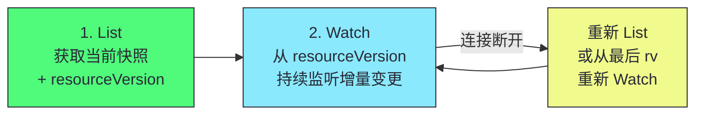
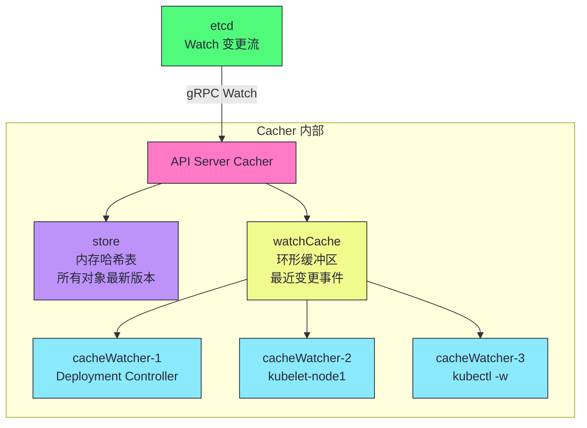
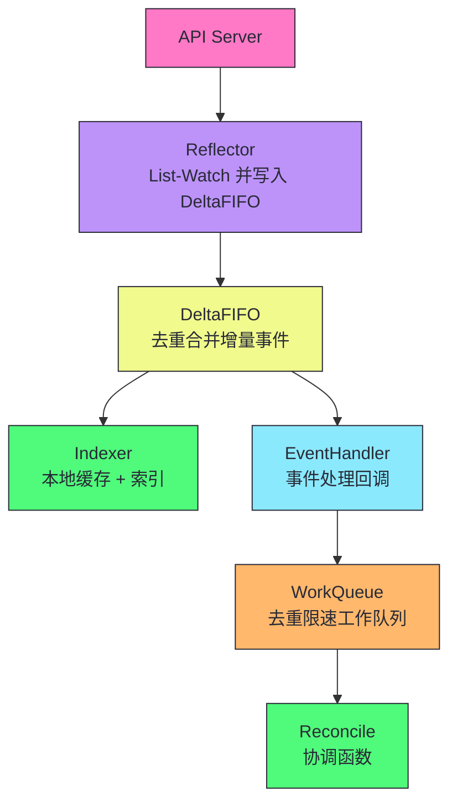
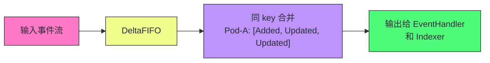
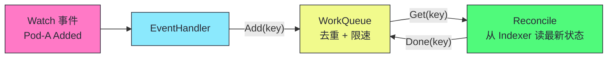
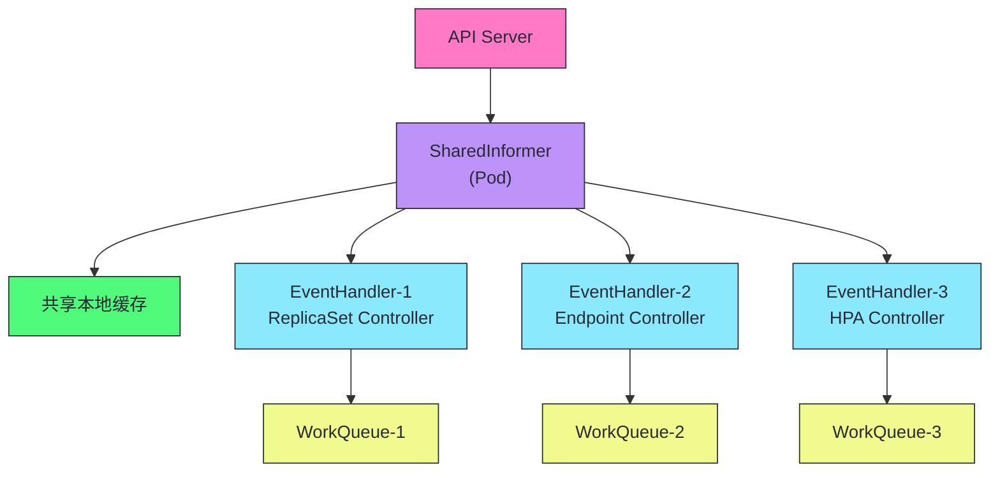
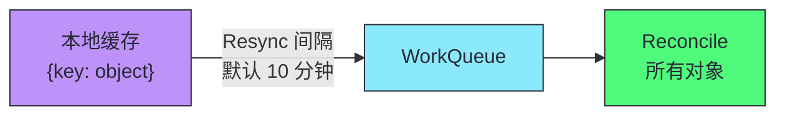

# 06 List-Watch 与 Informer：K8s 的分布式神经系统

**摘要：**
本文深入 Kubernetes 的分布式神经系统——List-Watch 协议和 Informer 框架。K8s 的所有控制器都不轮询 API Server，而是通过 List-Watch 获取资源的初始状态和增量变更。文章从轮询的代价出发，深入 API Server 端的 Watch 实现（Cacher、watchCache 环形缓冲区、cacheWatcher 分发器、Bookmark 事件），再系统剖析 client-go 的 Informer 框架四层架构：Reflector、DeltaFIFO、Indexer、WorkQueue。之后讨论 SharedInformer 的共享机制、Resync 机制、Informer 的内存管理和性能优化。核心认知：Informer 是 K8s 控制器编程的基石——理解 Reflector/DeltaFIFO/Indexer/WorkQueue 如何协作，是编写 Operator 和理解 K8s 内部行为的必备知识。

---

## 第 1 章 为什么需要 List-Watch

K8s 的控制器模式要求控制器持续观察集群状态，并与期望状态比较。控制器如何获取集群状态是一个基础设计问题——最直观的方式是轮询，但轮询在大规模集群中的代价不可接受。K8s 选择了 List-Watch 协议——先 List 获取快照，再 Watch 持续监听增量变更。本章从轮询的代价出发，解释为什么 K8s 必须用 List-Watch 而非轮询。

K8s 的控制器模式是其声明式 API 的实现基础——用户声明期望状态（如"3 个 Pod"），控制器持续观察实际状态（如"当前有 2 个 Pod"），并采取行动使实际状态趋近期望状态（如"创建 1 个 Pod"）。这个"观察-比较-行动"的循环要求控制器能持续获取集群状态，而获取状态的方式直接决定了控制器的性能和可扩展性。轮询是最直观的方式，但在大规模集群中不可行；List-Watch 是 K8s 的选择，它使得控制器可以高效、实时地获取状态变更。

### 1.1 轮询的代价

K8s 的控制器模式要求控制器持续观察集群状态，并与期望状态比较。最直观的实现方式是轮询——控制器定期 List 所有资源，检查状态是否符合期望。但轮询在大规模集群中的代价是不可接受的。轮询的根本问题是"全量拉取"——每次轮询都传输所有资源，即使大部分资源没有变化。这种"全量拉取"的模式使得网络流量与资源总量成正比，而非与变更频率成正比，在大规模集群中导致巨大的流量浪费。轮询的另一个根本问题是"无效传输"——大部分轮询返回的数据没有变化，传输这些数据是纯粹的浪费。

轮询的另一个问题是"延迟与流量的矛盾"。如果轮询间隔是 1 秒，状态变化的最大延迟就是 1 秒；如果缩短间隔到 100 毫秒，流量增加 10 倍。这种"延迟与流量成正比"的特性使得轮询无法同时满足低延迟和低流量的需求。在大规模集群中，这个矛盾更加突出——5000 Pod 的集群中，1 秒轮询一次的流量已经 500MB/s，缩短到 100 毫秒就是 5GB/s，这是任何网络都无法承受的。

假设 K8s 没有 Watch，所有控制器只能**轮询**——每隔 N 秒 List 所有资源。5000 Pod 集群，20 个控制器各自轮询 Pod，间隔 1 秒：

| 指标 | 数值 |
|------|------|
| 每秒请求数 | 20 QPS（仅 Pod） |
| 每次响应大小 | 5000 Pod × 5KB = 25MB |
| 每秒网络流量 | 20 × 25MB = 500MB/s |
| etcd 读取压力 | 每次 List 都读 etcd |

这个开销不可接受——而且大部分时候两次轮询间 Pod 列表根本没变化。控制器传输 25MB 数据，只为发现"什么都没变"。轮询的另一个问题是延迟——如果轮询间隔是 1 秒，状态变化的最大延迟就是 1 秒；如果缩短间隔到 100 毫秒，流量增加 10 倍。这种"延迟与流量成正比"的特性使得轮询无法同时满足低延迟和低流量的需求。

### 1.2 Watch 的增量推送优势

Watch 是 K8s 解决轮询问题的核心机制。它建立一个 HTTP 长连接，API Server 只在数据变化时推送变更事件，而非完整列表。这种"增量推送"模式使得网络开销与变更频率成正比，而非与资源总量成正比。Watch 的设计灵感来自 HTTP 的 Server-Sent Events（SSE）和 HTTP/2 的流式传输——客户端发起一个请求，服务器持续推送数据，而非一次请求一次响应。这种"长连接加增量推送"的模式是大规模分布式系统状态同步的经典方案，也是 K8s 控制器高效运行的基础。

| 维度 | 轮询 | Watch |
|------|------|-------|
| **网络开销** | O(N × 资源总量)/每次 | O(变更数量)/持续 |
| **延迟** | 最大 = 轮询间隔 | 接近实时（毫秒级） |
| **API Server 压力** | 高（每次全量 List） | 低（只推增量） |
| **etcd 压力** | 高（每次 List 读 etcd） | 低（从 watch cache 获取） |

> [!info] 核心概念：Watch 是增量推送，不是全量拉取
> Watch 建立一个 HTTP 长连接，API Server 只在数据变化时推送**变更事件**（而非完整列表）。1 秒内只有 1 个 Pod 更新，只推送这 1 个 Pod 的变更（~5KB），而非 5000 个 Pod 的完整列表（25MB）。这使得 K8s 可以在大规模集群中高效传播状态变更——网络开销与变更频率成正比，而非与资源总量成正比。

Watch 的增量推送模式解决了轮询的两个核心问题——流量和延迟。流量方面，Watch 只推送变更，而非全量列表，流量与变更频率成正比。延迟方面，Watch 是推送模式，状态变化后立即推送，延迟在毫秒级。这种"低流量加低延迟"的特性使得 Watch 成为大规模集群状态同步的理想机制。在 5000 Pod 的集群中，如果 1 秒内只有 10 个 Pod 变化，Watch 只推送 10 个 Pod 的变更（约 50KB），而非 5000 个 Pod 的完整列表（25MB）——流量降低了 500 倍。

### 1.3 List-Watch 协议

单独 Watch 有问题——客户端启动时不知道当前有哪些资源，只能收到启动后的变更。因此 K8s 定义了 **List-Watch 协议**：先 List 获取当前快照和 resourceVersion，再 Watch 从该版本持续监听增量变更。List-Watch 协议是 K8s 客户端获取资源状态的标准方式——所有控制器、Informer、kubectl 都使用这个协议。

List-Watch 协议的设计体现了"基线加增量"的经典模式——先建立基线（List 获取快照），再跟踪增量（Watch 持续监听）。这种模式在分布式系统中很常见——譬如数据库的快照加 WAL（Write-Ahead Log）、Git 的 clone 加 fetch。List-Watch 协议的特殊之处在于它用 resourceVersion 作为"基线标记"——List 返回的 resourceVersion 标记了快照的版本，Watch 从这个版本开始跟踪增量。如果 Watch 断连，客户端从最后的 resourceVersion 恢复，或全量 List 重新初始化。



1. **Initial List**：先执行一次 List，获取所有资源当前快照和 resourceVersion
2. **Watch**：从该 resourceVersion 开始 Watch，获取后续增量变更

这保证客户端既知道"当前有什么"（List），又能实时感知"发生了什么变化"（Watch）。List-Watch 协议的核心是 resourceVersion——它是资源版本的"书签"，标记了 List 时的集群状态。Watch 从这个书签开始，获取后续的所有变更。如果 Watch 断连，客户端从最后的 resourceVersion 恢复，或全量 List 重新初始化。客户端既能获取完整状态，又能实时感知变化，且不丢失数据。

---

## 第 2 章 API Server 端的 Watch 实现

客户端的 List-Watch 协议需要 API Server 的支持。本章深入 API Server 端的 Watch 实现——Cacher、watchCache、cacheWatcher、Bookmark 事件。理解 API Server 端的 Watch 实现，是理解 List-Watch 协议性能特征的基础——为什么 Watch 不压垮 etcd，为什么 Watch 可以支持数百个客户端，为什么 Bookmark 事件对大规模集群重要。

API Server 端的 Watch 实现是 K8s 应对大规模 Watch 的核心机制。如果没有 Cacher，每个 Watch 请求直接连到 etcd，数百个 Watcher 会压垮 etcd。Cacher 通过"单连接加多分发"的设计，把 etcd 的 Watch 连接数从"Watcher 数量"降到"资源类型数量"，使得 etcd 可以支持大规模 Watch。这种"中间层缓存"的设计是 K8s 控制平面可扩展性的基础。

### 2.1 Cacher：每种资源的 Watch 缓存

API Server 为每种资源类型维护一个 **Cacher** 对象，它是 API Server 内存中的 Watch 缓存。Cacher 的设计目标是减少 etcd 的 Watch 压力——如果没有 Cacher，每个 Watch 请求直接连到 etcd，数百个 Watcher 会压垮 etcd。Cacher 维护一个到 etcd 的 Watch 连接，把事件缓存后分发给所有 Watcher，使得 etcd 只需要一个连接。Cacher 是 API Server 应对大规模 Watch 的核心机制——它把"每 Watcher 一个 etcd 连接"优化为"每资源类型一个 etcd 连接"，使得 etcd 的 Watch 连接数与 Watcher 数量解耦。

Cacher 的设计体现了"中间层缓存"的经典模式——在 etcd 和客户端之间加一层缓存，减少 etcd 的压力。这种模式在分布式系统中很常见——譬如数据库前的缓存层、CDN 节点的缓存。Cacher 的特殊之处在于它不仅缓存数据（store），还缓存事件流（watchCache），并支持增量推送（cacheWatcher）。这种"数据缓存加事件缓存加增量推送"的三层设计使得 Cacher 可以同时服务 List 和 Watch 请求，且都不查询 etcd。



| 组件 | 作用 |
|------|------|
| **store** | 内存哈希表，存储所有对象最新版本。List 请求直接从 store 读取，不查 etcd |
| **watchCache** | 环形缓冲区（默认 100 事件），存储最近变更事件 |
| **cacheWatcher** | 每个 Watch 请求对应一个，将匹配事件推送给客户端 |

Cacher 的三个组件协同工作——store 保存所有对象的最新版本，支持 List 请求直接从内存读取；watchCache 保存最近的变更事件，支持 Watch 请求从缓存推送；cacheWatcher 是每个 Watch 请求的分发器，把匹配的事件推送给客户端。这种"全量缓存加增量缓存"的双层设计使得 List 和 Watch 都不需要查询 etcd，大幅降低了 etcd 的读取压力。

Cacher 的启动过程值得了解。API Server 启动时为每种资源类型创建 Cacher，Cacher 启动时先从 etcd List 所有对象填充 store，然后建立一个到 etcd 的 Watch 连接开始接收变更事件。在 Cacher 启动完成前，所有 List 和 Watch 请求直接转发到 etcd；启动完成后，请求由 Cacher 处理。如果 Cacher 的 etcd Watch 连接断开，Cacher 会重新 List 填充 store 并重建 Watch 连接——这期间 List 请求可能降级为直接查 etcd，Watch 请求可能返回错误触发客户端重连。这种降级机制保证了 Cacher 故障期间服务不中断。

### 2.2 事件流转全链路

Cacher 的事件流转是一个从 etcd 到客户端的完整链路。理解这个链路，就理解了 API Server 如何把 etcd 的变更传播给所有 Watcher。这个链路的设计体现了 K8s 对性能的极致追求——每个环节都经过优化，使得事件从 etcd 到客户端的延迟在毫秒级。这种高效的链路设计是 K8s 控制器实时响应状态变化的基础。

```
etcd 变更 → API Server Cacher 收到 gRPC Watch 事件
→ 更新 store（最新版本）
→ 写入 watchCache 环形缓冲区
→ 遍历所有 cacheWatcher，推送匹配事件
→ cacheWatcher 通过 HTTP 长连接推送给客户端
```

这个链路的关键设计是"单连接加多分发"——Cacher 维护一个到 etcd 的 Watch 连接，把事件缓存后分发给所有 Watcher。这种设计把 etcd 的 Watch 连接数从"Watcher 数量"降到"资源类型数量"，大幅降低了 etcd 的压力。在 5000 Pod 集群中，可能有数百个 Watcher Watch Pod 变化，但 etcd 只需要一个 Watch 连接——Cacher 把这一个连接的事件分发给数百个 Watcher。

事件流转链路的另一个设计细节是"非阻塞分发"——Cacher 向 cacheWatcher 推送事件时，如果 cacheWatcher 的缓冲区满了（客户端消费慢），Cacher 不会阻塞等待，而是丢弃该 cacheWatcher 并触发其重新 List-Watch。这种"丢弃慢消费者"的设计保证了快速的 Watcher 不会被慢速的 Watcher 拖累，但代价是被丢弃的 Watcher 需要重新 List-Watch 恢复。生产环境中如果发现 Watcher 频繁重新 List-Watch，可能需要检查客户端的消费速度或增大 cacheWatcher 的缓冲区。

cacheWatcher 的内部实现是一个带缓冲区的 goroutine——Cacher 把事件写入 cacheWatcher 的 channel，cacheWatcher 的 goroutine 从 channel 读取并通过 HTTP 长连接推送给客户端。每个 cacheWatcher 有一个 `bookmarkAfterResourceVersion` 字段，用于控制何时发送 Bookmark。当 Cacher 遍历 cacheWatcher 时，如果发现该 cacheWatcher 的 resourceVersion 落后于当前缓存版本，但缓存中没有新的匹配事件（如该 Watcher 只关心特定 Namespace 的事件，而变更发生在其他 Namespace），Cacher 会发送一个 Bookmark 事件更新该 Watcher 的 resourceVersion。这种机制确保低频资源的 Watcher 也能保持 resourceVersion 较新，避免重连时大量历史回放。

### 2.3 Bookmark 事件

当 Watcher 的 resourceVersion 落后于缓存但缓存中没有新事件时，API Server 发送 **Bookmark 事件**——只更新 resourceVersion，不携带对象。Bookmark 事件是 K8s 1.16 引入的优化，解决了长时间无事件的 Watcher 的 resourceVersion 老化问题。

Bookmark 事件的发送频率由 API Server 的 `--default-watch-cache-size` 参数控制。默认情况下，Bookmark 事件大约每 10 秒发送一次（具体频率取决于资源类型和活动情况）。这种"定期心跳"的设计虽然简单，但对大规模集群的 Watch 性能有显著提升——它使得长时间无事件的 Watcher 的 resourceVersion 保持较新，重连时从较新版本开始，减少了历史事件传输量。

```json
{"type":"BOOKMARK","object":{"kind":"Pod","apiVersion":"v1","metadata":{"resourceVersion":"12350"}}}
```

> [!info] 核心概念：Bookmark 防止 Watch 卡在旧版本
> 如果没有 Bookmark，Watcher 的 resourceVersion 可能长时间不更新——下次重连时从这个旧版本开始 Watch，可能需要传输大量历史事件。Bookmark 定期更新 Watcher 的 resourceVersion，使得重连时从较新版本开始，减少历史事件传输。K8s 1.16 引入的优化，对大规模集群的 Watch 性能有显著提升。

Bookmark 的设计体现了 K8s 对大规模集群性能的持续优化。在没有 Bookmark 之前，长时间无事件的 Watcher（如 Watch 低频变更的资源）的 resourceVersion 会长时间不更新。一旦 Watch 断连重连，需要从这个旧版本开始 Watch，可能需要传输大量历史事件。Bookmark 定期发送"空事件"更新 resourceVersion，使得重连时从较新版本开始，减少了历史事件传输量。这种"定期心跳"的设计虽然简单，但对大规模集群的 Watch 性能有显著提升。

---

## 第 3 章 client-go Informer 框架

client-go 是 K8s 的官方 Go 客户端库，其中 Informer 框架是控制器编程的核心。Informer 封装了 List-Watch、缓存、事件分发、工作队列的复杂性，使得控制器开发者只需实现 Reconcile 函数。本章深入 Informer 的四层架构——Reflector、DeltaFIFO、Indexer、WorkQueue，理解每一层的职责和协作方式。

Informer 框架的设计体现了"分层架构"的经典思想——每一层有明确的职责，层间通过清晰的数据流协作。这种分层设计使得每一层可以独立优化和测试，且层间的耦合度低。Reflector 负责与 API Server 通信，DeltaFIFO 负责事件去重合并，Indexer 负责本地缓存和索引，WorkQueue 负责工作调度。这种"关注点分离"的设计是 Informer 框架可维护性和可扩展性的基础。

### 3.1 Informer 的四层架构

Informer 是 client-go 提供的 K8s 控制器编程框架。它封装了 List-Watch、缓存、事件分发、工作队列的复杂性，使得控制器开发者只需实现 Reconcile 函数。Informer 的四层架构是 K8s 控制器高性能的工程基础——每一层都有明确的职责，层间通过清晰的接口协作。这种分层设计是 K8s 控制器编程范式的核心——它把"获取状态、缓存状态、分发事件、调度处理"四个关注点分离，使得每一层可以独立优化和测试。这种"关注点分离"的设计是软件工程的经典原则在 K8s 中的具体应用。



四层架构的职责分工是 Informer 设计的核心——Reflector 负责与 API Server 通信（List-Watch），DeltaFIFO 负责事件去重合并，Indexer 负责本地缓存和索引，WorkQueue 负责工作调度。这种分层设计使得每一层可以独立优化和测试，且层间通过清晰的数据流协作——Reflector 把事件写入 DeltaFIFO，DeltaFIFO 把事件分发给 Indexer 和 EventHandler，EventHandler 把 key 放入 WorkQueue，WorkQueue 调度 Reconcile 执行。

### 3.2 第一层：Reflector

**Reflector** 负责 List-Watch API Server，将变更写入 DeltaFIFO。Reflector 是 Informer 与 API Server 通信的唯一通道——它执行 List-Watch 协议，把 API Server 的变更事件转换为 Delta 写入 DeltaFIFO。Reflector 的命名反映了它的职责——"反射"API Server 的状态到本地缓存，使得控制器可以基于本地缓存做决策。

Reflector 的工作流程是"List 建立基线、Watch 跟踪增量、断连自动恢复"。启动时先执行一次 List，获取所有资源的当前快照和 resourceVersion，把快照写入 DeltaFIFO 和 Indexer。然后从这个 resourceVersion 开始 Watch，持续监听增量变更，把变更事件转换为 Delta 写入 DeltaFIFO。如果 Watch 断连，Reflector 自动从最后的 resourceVersion 重新 Watch，或全量 List 重新初始化。Informer 可以在 Watch 断连后无缝恢复，不需要人工干预。

Reflector 的初始 List 请求支持分页（pagination）。当资源数量很大时（如数万 Pod），单次 List 响应可能达到数百 MB，超过 API Server 的响应限制。Reflector 通过 `limit` 和 `continue` 参数分页 List——每页请求固定数量的对象（默认 500），API Server 返回一页对象和 `continue` token，Reflector 用该 token 请求下一页，直到所有对象获取完毕。分页机制使得初始 List 的内存峰值可控，不会因单次响应过大导致 OOM。但分页 List 的一致性问题值得注意——分页期间如果有变更，后续页可能包含新创建的对象，但 resourceVersion 仍然是第一页的版本，Watch 从该版本开始会重新收到这些对象的 Added 事件，DeltaFIFO 的去重机制会处理这种重复。生产环境中可以通过 `--max-requests-inflight` 控制并发 List 请求数。

```go
// 伪代码：Reflector 的核心逻辑
func (r *Reflector) Run() {
    for {
        // 1. List 获取初始状态
        list, err := r.client.List()
        r.syncWith(list.Items, list.ResourceVersion)
        
        // 2. Watch 持续监听
        w, err := r.client.Watch(list.ResourceVersion)
        for event := range w.ResultChan() {
            r.store.Add(Delta{Type: event.Type, Object: event.Object})
        }
        // 3. Watch 断开后重新 List-Watch
    }
}
```

| 职责 | 说明 |
|------|------|
| **List** | 启动时获取所有资源的当前快照 |
| **Watch** | 持续监听资源变更 |
| **断连恢复** | Watch 断开后从最后 resourceVersion 重新 Watch，或全量 List |
| **写入 DeltaFIFO** | 将事件转换为 Delta 写入队列 |

Reflector 的一个重要设计是"断连恢复"——Watch 断开后，Reflector 自动从最后的 resourceVersion 重新 Watch。如果 resourceVersion 太旧（超过 watchCache 容量），API Server 返回 410 Gone，Reflector 执行全量 List 重新初始化。

### 3.3 第二层：DeltaFIFO

**DeltaFIFO** 是一个特殊的队列——它存储对象的增量（Delta），并对同一对象的多个事件去重合并。DeltaFIFO 的设计目标是处理高频更新——如果同一对象在短时间内被多次更新（如 Pod status 频繁变化），DeltaFIFO 将多个 Delta 合并为一个列表，减少 EventHandler 的调用次数。DeltaFIFO 的命名反映了它的核心特性——Delta（增量）+ FIFO（先进先出），即"按顺序处理增量事件"。

DeltaFIFO 的去重机制是按 key（namespace/name）进行的——同一 key 的多个 Delta 合并为一个列表，而非丢弃。这意味着 EventHandler 处理时可以看到完整的 Delta 列表（如 [Added, Updated, Updated]），只是通常只关心最终状态。这种"合并不丢弃"的设计保证了事件历史的完整性，同时减少了 EventHandler 的调用次数。

```go
// Delta 的结构
type Delta struct {
    Type   DeltaType  // Added/Updated/Deleted/Sync
    Object runtime.Object
}

// DeltaFIFO 的核心特性
// 1. 按 key（namespace/name）去重
// 2. 同一 key 的多个 Delta 合并为一个列表
// 3. 先进先出（FIFO）保证顺序
```



> [!info] 核心概念：DeltaFIFO 的去重合并是性能关键
> 如果同一对象在短时间内被多次更新（如 Pod status 频繁变化），DeltaFIFO 将多个 Delta 合并为一个列表——EventHandler 处理时看到的是"这个对象经历了 Added→Updated→Updated"的完整历史，但只需处理最终状态。这减少了 EventHandler 的调用次数，避免高频更新淹没控制器。但注意——合并不意味着丢弃中间状态，EventHandler 可以看到完整的 Delta 列表，只是通常只关心最终状态。

DeltaFIFO 的"去重合并"设计有一个重要的工程价值——它使得控制器不会被高频更新淹没。譬如 Pod 的 status 字段可能在短时间内被 kubelet 多次更新（如容器状态变化），如果没有 DeltaFIFO 的去重，每次更新都会触发一次 Reconcile，导致控制器被高频调用。DeltaFIFO 把这些更新合并为一个 Delta 列表，EventHandler 只需处理一次，大幅减少了控制器的处理压力。

DeltaFIFO 有两个特殊操作：`Replace` 和 `Resync`。`Replace` 在 Reflector 的初始 List 完成后调用——它把 List 返回的所有对象作为 Sync 事件写入 DeltaFIFO，同时对于本地缓存中存在但 List 中不存在的对象，生成 Deleted 事件。这个机制确保了 Indexer 与 API Server 的状态一致——如果某个对象在 List 之前被删除（但客户端还没收到 Deleted 事件），Replace 会通过"List 中没有但缓存中有"检测到这个删除。`Resync` 则定期触发——它把 Indexer 中所有对象作为 Sync 事件重新写入 DeltaFIFO，强制 Reconcile 重新处理所有对象。

### 3.4 第三层：Indexer

**Indexer** 是一个带索引的本地缓存——存储所有对象的最新版本，支持快速查询。Indexer 的设计目标是让控制器基于内存缓存做决策，而非查询 API Server。这是 K8s 控制器高性能的工程基础——所有读操作都基于本地缓存，只有写操作才访问 API Server。Indexer 的核心思想是"用内存换性能"——用内存存储所有对象的最新版本，使得读操作在内存中完成，避免查询 API Server 的网络延迟。

Indexer 的索引机制是其高性能查询的关键。Indexer 支持多种索引类型——namespace 索引（按 Namespace 查询）、label 索引（按 Label 查询）、owner 索引（按 OwnerReferences 查询）。这些索引使得控制器可以按多种维度快速查询对象，而无需遍历所有对象。索引的创建是通过 Indexers 函数定义的——每个索引类型对应一个 Key 函数，把对象映射到索引键。

```go
// Indexer 的核心接口
type Indexer interface {
    // 基本操作
    Add(obj interface{}) error
    Get(obj interface{}) (interface{}, bool, error)
    Delete(obj interface{}) error
    List() []interface{}
    
    // 索引操作
    Index(indexName string, obj interface{}) ([]interface{}, error)
    ByIndex(indexName string, indexKey string) ([]interface{}, error)
}
```

| 索引类型 | Key 函数 | 用途 |
|---------|---------|------|
| **namespace 索引** | `metadata.namespace` | 按 Namespace 查询 |
| **label 索引** | 自定义 | 按 Label 查询 |
| **owner 索引** | `ownerReferences` | 查找某对象的所有子对象 |

```go
// 示例：用 Indexer 按 Namespace 查询 Pod
pods, err := indexer.ByIndex("namespace", "default")
// 无需查询 API Server，直接从本地缓存返回
```

Indexer 的底层实现是 `threadSafeMap`——一个带读写锁的 `map[string]interface{}`，存储 key（namespace/name）到对象的映射。索引则是一个二级 map：`map[indexName]map[indexKey]map[objectKey]bool`。添加对象时，Indexer 计算该对象在每个索引下的 key，更新索引映射；删除对象时，反向清理索引。查询时通过索引直接定位对象，无需遍历。这种实现使得 Indexer 的查询复杂度为 O(1) 或 O(k)（k 是索引 key 下的对象数），远优于遍历所有对象的 O(n)。

> [!note] 设计哲学：Indexer 让控制器基于内存缓存做决策
> Indexer 使得控制器在 Reconcile 时不需要查询 API Server——直接从本地缓存读取对象的最新状态。这大幅减少了 API Server 的读取压力。例如，ReplicaSet Controller 在协调时需要查找"属于这个 ReplicaSet 的所有 Pod"——通过 owner 索引，一次内存查询即可，无需 API Server 调用。这是 K8s 控制器高性能的工程基础——所有读操作都基于本地缓存，只有写操作才访问 API Server。

Indexer 的索引机制是控制器高效查询的关键。没有索引，控制器要查找"属于某个 ReplicaSet 的所有 Pod"需要遍历所有 Pod，时间复杂度 O(N)。有了 owner 索引，只需一次哈希查询，时间复杂度 O(1)。在大规模集群中（数万 Pod），索引机制使得控制器的查询效率从"秒级"降到"毫秒级"，这是控制器能够实时响应状态变化的基础。

### 3.5 第四层：WorkQueue

**WorkQueue** 是 EventHandler 将对象 key 放入的工作队列——支持去重、延迟、限速。WorkQueue 的设计目标是解耦事件分发与处理——EventHandler 快速将 key 入队，独立的 worker 从队列取 key 执行 Reconcile。这种解耦使得 Informer 不会因 Reconcile 慢而阻塞事件分发。WorkQueue 的核心思想是"生产者-消费者"模式——EventHandler 是生产者（入队），worker 是消费者（出队处理），两者通过队列解耦。

WorkQueue 的四种特性——去重、延迟、限速、有序——分别解决了不同的工程问题。去重解决了高频更新问题——同一 key 多次入队只处理一次。延迟解决了失败重试问题——Reconcile 失败后延迟入队，避免立即重试导致雪崩。限速解决了流量控制问题——限制每秒处理的对象数，避免控制器压垮下游系统。有序解决了顺序保证问题——同一 key 的多次变更按顺序处理，避免乱序导致的状态不一致。

```go
// EventHandler 的标准模式
func onAdd(obj interface{}) {
    key, _ := meta.Accessor(obj)
    workQueue.Add(key)  // 将 key 放入工作队列
}
```

| 特性 | 说明 |
|------|------|
| **去重** | 同一 key 多次入队只处理一次 |
| **延迟** | 支持延迟入队（如失败后延迟 30 秒重试） |
| **限速** | 限制每秒处理的对象数 |
| **有序** | 同一 key 的多次变更按顺序处理 |



> [!warning] 生产避坑：EventHandler 不应直接调用 Reconcile
> EventHandler 的职责是将对象 key 放入 WorkQueue，不是直接执行 Reconcile。如果 EventHandler 直接调用 Reconcile，会阻塞 Informer 的事件分发——后续事件无法被处理。正确的模式是 EventHandler 快速将 key 入队，由独立的 worker goroutine 从队列取 key 执行 Reconcile。事件分发与处理解耦，Informer 不会因 Reconcile 慢而阻塞。

WorkQueue 的"去重"特性是一个重要的性能优化——如果同一对象在短时间内被多次更新，EventHandler 多次将 key 入队，但 WorkQueue 只保留一个，Reconcile 只处理一次。这避免了控制器被高频更新淹没。WorkQueue 的"延迟"特性支持失败重试——如果 Reconcile 失败，可以将 key 延迟入队（如 30 秒后重试），避免立即重试导致雪崩。WorkQueue 的"限速"特性支持流量控制——限制每秒处理的对象数，避免控制器压垮下游系统。

client-go 的 WorkQueue 提供三种限速器（RateLimiter）实现。`BucketRateLimiter` 基于 token bucket 算法，固定速率发放 token，每次处理消耗一个 token，适合平滑流量。`ExponentialBackoffLimiter` 指数退避——第一次失败后等待 5ms，第二次 10ms，第三次 20ms，以此类推，最大间隔默认 1000s，适合失败重试场景。`MaxOfRateLimiter` 取多个限速器中的最大值——譬如同时配置 BucketRateLimiter（限制 QPS）和 ExponentialBackoffLimiter（控制重试），取两者中较大的等待时间。controller-runtime 默认使用 `MaxOfRateLimiter` 组合 BucketRateLimiter（默认 10 QPS）和 ExponentialBackoffLimiter。

---

## 第 4 章 SharedInformer：共享 Informer

Informer 的四层架构解决了单个控制器的 List-Watch 和缓存问题。但在实际应用中，一个进程通常有多个控制器（如 kube-controller-manager 有数十个控制器），如果每个控制器创建独立的 Informer，会导致大量重复。SharedInformer 解决了这个问题——让多个控制器共享同一份 Informer。本章深入 SharedInformer 的设计动机和实现机制。

SharedInformer 是 K8s 控制器高效运行的关键机制。它通过共享 List-Watch 连接和本地缓存，避免了多个控制器重复监听同一资源。kube-controller-manager 可以在单个进程中运行数十个控制器，而不会压垮 API Server 或消耗过多内存。

### 4.1 为什么需要共享

如果一个进程中有多个控制器都关心 Pod 资源，每个控制器创建独立的 Informer 会导致：

- 重复的 List-Watch（多个 Watch 连接到 API Server）
- 重复的本地缓存（多份 Pod 数据在内存中）
- 重复的事件处理

这种重复在大规模集群中是严重的浪费——kube-controller-manager 中有数十个控制器，如果每个都创建独立的 Pod Informer，会有数十个 Watch 连接和数十份 Pod 缓存，大幅增加 API Server 压力和内存占用。SharedInformer 的设计正是为了解决这个问题——让多个控制器共享同一份 Informer，避免重复的 List-Watch 和缓存。

独立 Informer 的重复问题在 kube-controller-manager 中尤为突出。kube-controller-manager 内置了数十个控制器（Deployment Controller、ReplicaSet Controller、Endpoint Controller、HPA Controller 等），很多控制器都需要 Watch Pod 资源。如果每个控制器创建独立的 Pod Informer，会有数十个 Watch 连接和数十份 Pod 缓存。在 5 万 Pod 的集群中，数十份 Pod 缓存意味着数 GB 的内存浪费，数十个 Watch 连接意味着 API Server 的 Watch 压力增加数十倍。SharedInformer 通过共享 Informer 解决了这个问题——数十个控制器共享一份 Pod 缓存和一个 Watch 连接，内存占用和 API Server 压力都降到最低。

### 4.2 SharedInformer 的解决方案

**SharedInformer** 让多个控制器共享同一份 Informer——一份 List-Watch、一份本地缓存，多个 EventHandler。SharedInformer 的核心思想是"共享资源、独立处理"——List-Watch 连接和本地缓存是共享的，但每个控制器的 EventHandler 和 WorkQueue 是独立的。既节省了资源又保证了隔离性。

SharedInformer 的共享机制通过 SharedInformerFactory 实现——工厂模式确保同一资源类型的 Informer 只创建一次，后续请求返回同一个 Informer 实例。多个控制器可以透明地共享 Informer，而不需要显式协调。生产环境中使用 SharedInformer 的标准方式是 `informerFactory.Core().V1().Pods().Informer()`——工厂方法返回共享的 Pod Informer，多个控制器调用同一方法得到同一个实例。



| 维度 | 独立 Informer | SharedInformer |
|------|--------------|----------------|
| **List-Watch 连接数** | N（每个控制器一个） | 1（共享） |
| **本地缓存** | N 份 | 1 份（共享） |
| **内存占用** | N × 资源大小 | 1 × 资源大小 |
| **API Server 压力** | N 倍 | 1 倍 |

> [!info] 核心概念：SharedInformer 是 kube-controller-manager 的标准模式
> kube-controller-manager 中所有控制器都使用 SharedInformer——共享 Pod、Service、Node 等资源的 Informer。这使得数十个控制器共享同一份本地缓存，而非各自维护。controller-runtime（Operator SDK 底层）也使用 SharedInformer。编写自定义控制器时，务必使用 SharedInformer——用 `informerFactory.Core().V1().Pods().Informer()` 获取共享 Informer，而非自己创建。

SharedInformer 的一个重要设计细节是"EventHandler 隔离"——虽然多个控制器共享同一份 Informer 和缓存，但每个控制器有独立的 EventHandler 和 WorkQueue。这意味着一个控制器的 EventHandler 慢不会阻塞其他控制器的事件分发——每个控制器的 EventHandler 独立将 key 放入自己的 WorkQueue，独立调度 Reconcile。SharedInformer 既节省资源又保证隔离性。

---

## 第 5 章 Resync：Level-triggered 的工程保障

Informer 的事件驱动模式使得控制器可以实时响应状态变化。但事件驱动有一个潜在问题——如果事件丢失（如 Watch 断连期间的事件），控制器可能错过状态变化，导致状态不一致。Resync 机制解决了这个问题——定期全量重新协调，即使错过事件也能恢复一致状态。本章深入 Resync 的设计动机、价值和注意事项。

Resync 是 K8s 控制器"最终一致性"理念的工程实现。即使错过事件，通过定期全量重新协调，最终也能恢复一致状态。这种"事件驱动加定期全量"的双重保障使得 K8s 控制器既高效又可靠。

### 5.1 什么是 Resync

即使没有收到任何 Watch 事件，Informer 也会定期触发 **Resync**——将本地缓存中的所有对象 key 重新放入 WorkQueue，触发所有对象的 Reconcile。Resync 是 Level-triggered 原则在工程上的具体实现——不依赖事件是否被消费，定期检查当前状态。Resync 的设计动机是"防止事件丢失导致的状态不一致"——即使 Watch 事件因网络问题或客户端 bug 丢失，Resync 也能通过定期全量重新协调恢复一致状态。

Resync 的设计体现了"边缘触发加水平触发"的经典组合。Watch 是边缘触发——只在状态变化时通知，如果客户端错过事件就永远不知道。Resync 是水平触发——定期检查当前状态，即使错过事件也能恢复。这种"边缘加水平"的双重保障使得 K8s 控制器既高效（Watch 实时响应）又可靠（Resync 兜底恢复）。

Resync 的实现细节值得了解。SharedInformer 的 `processorListener` 有一个 `resyncPeriod` 参数，默认 10 分钟。Resync 触发时，Informer 遍历 Indexer 中所有对象，把每个对象的 key 作为 `Sync` 类型的 Delta 写入 DeltaFIFO。EventHandler 收到 `OnUpdate` 回调（old 和 new 是同一对象），把 key 放入 WorkQueue。Resync 不触发 API Server 请求——它完全基于本地缓存，不会增加 API Server 负载。但 Resync 会产生大量 WorkQueue 项——5 万 Pod 的集群中，一次 Resync 产生 5 万个 WorkQueue 项，如果 Reconcile 每个耗时 100ms，处理完需要 5000 秒（约 83 分钟）。这期间新的 Watch 事件排队等待，可能导致延迟。生产环境中如果 Resync 期间 WorkQueue 积压严重，可以考虑延长 Resync 间隔或增加 worker 数。



### 5.2 Resync 的价值

Resync 的价值在于"兜底事件丢失"。即使 Watch 事件因网络问题或客户端 bug 丢失，Resync 也能通过定期全量重新协调恢复一致状态。这种"事件驱动加定期全量"的双重保障是 K8s 控制器可靠性的核心设计——事件驱动保证实时性，Resync 保证可靠性。这种双重保障使得 K8s 控制器既高效又可靠。

| 场景 | 没有 Resync | 有 Resync |
|------|-----------|----------|
| **Watch 事件丢失** | 状态永久不一致 | 下次 Resync 恢复 |
| **控制器重启后** | 只处理重启后的事件 | Resync 触发所有对象重新协调 |
| **外部状态变化** | 控制器无感知 | Resync 重新检查所有对象 |

> [!info] 核心概念：Resync 是 Level-triggered 原则的工程保障
> Resync 确保即使错过 Watch 事件，控制器也能通过定期全量重新协调恢复一致状态。这是 Level-triggered 原则在工程上的具体实现——不依赖事件是否被消费，定期检查当前状态。Resync 间隔（默认 10 分钟）是一个权衡——间隔短增加 API Server 负载（所有对象 key 入队），间隔长恢复慢。对于关键控制器，可以缩短 Resync 间隔；对于非关键控制器，保持默认值以减少负载。

Resync 的设计体现了 K8s 控制器的"最终一致性"理念——即使错过事件，通过定期全量重新协调，最终也能恢复一致状态。这种"事件驱动加定期全量"的双重保障使得 K8s 控制器既高效（事件驱动，实时响应）又可靠（Resync 兜底，不丢数据）。Resync 间隔的选择是一个权衡——间隔短（如 1 分钟）恢复快但增加负载，间隔长（如 1 小时）负载低但恢复慢。生产环境中通常对关键控制器用较短间隔，对非关键控制器用较长间隔。

### 5.3 Resync 的注意事项

Resync 产生的是 **Sync 事件**（不是 Added/Updated/Deleted），EventHandler 需要正确处理。Resync 的一个容易混淆的点是"它触发的是 onUpdate 而非特殊的 Sync 事件"——很多人以为 Resync 会产生特殊的 Sync 事件，实际上在大多数 Informer 实现中，Resync 触发的是 onUpdate。

Resync 触发 onUpdate 的设计意味着 Reconcile 在 Resync 期间会被所有对象触发。这有两个重要含义。第一，Reconcile 必须幂等——如果 Reconcile 有副作用（如创建外部资源），Resync 会重复触发这些副作用，必须确保幂等性。第二，Resync 期间 WorkQueue 会积压——在 5 万 Pod 的集群中，一次 Resync 会产生 5 万个 WorkQueue 项，如果 Reconcile 每个耗时 100ms，处理完需要约 83 分钟。生产环境中需要监控 Resync 期间的 WorkQueue 深度，如果积压严重，考虑缩短 Reconcile 耗时或分片处理。

```go
// EventHandler 的标准实现
func onAdd(obj interface{}) {
    enqueue(obj)
}
func onUpdate(oldObj, newObj interface{}) {
    enqueue(newObj)
}
func onDelete(obj interface{}) {
    enqueue(obj)
}

// Resync 时，所有对象都会触发 onUpdate
// 因为 Informer 比较缓存中的对象与 Resync 传入的对象
// 即使对象没变，也会触发 onUpdate
```

> [!warning] 生产避坑：Resync 不产生 Sync 事件而是 onUpdate
> 很多人以为 Resync 产生特殊的 Sync 事件——实际上在大多数 Informer 实现中，Resync 触发的是 onUpdate（因为缓存中的对象与"重新同步"的对象比较后被视为更新）。这意味着 Reconcile 在 Resync 期间会被所有对象触发——如果你的 Reconcile 有副作用（如创建外部资源），需确保幂等性。三大铁律之一——Reconcile 必须幂等，Resync 是检验幂等性的最佳时机。

Resync 触发所有对象的 onUpdate，这意味着在大规模集群中一次 Resync 会产生大量 WorkQueue 项。在 5 万 Pod 的集群中，一次 Resync 会产生 5 万个 WorkQueue 项。如果 Reconcile 每个耗时 100ms，处理完 5 万项需要 5000 秒（约 83 分钟）。这期间新的 Watch 事件会继续入队，WorkQueue 会积压。生产环境中需要监控 Resync 期间的 WorkQueue 深度，如果积压严重，考虑缩短 Reconcile 耗时或分片处理。

---

## 第 6 章 Informer 的内存管理与性能

Informer 的本地缓存是控制器高性能的基础，但也是内存占用的主要来源。在大规模集群中，Informer 的内存占用可能达到 GB 级，需要认真规划和管理。本章讨论 Informer 的内存占用估算和性能优化建议。Informer 的内存管理是大规模集群运维的重要课题——理解内存占用规律和优化手段，是运行大规模 K8s 集群的基础。

### 6.1 内存占用

在大型集群中，Informer 的本地缓存可能占用大量内存。Informer 的内存占用与集群规模成正比——Watch 的资源数量越多，缓存越大。这是控制器水平扩展的动机之一——单个控制器进程无法 Watch 所有资源，需要分片或分进程。Informer 的内存占用是一个需要认真评估的运维指标——在大规模集群中，Informer 缓存的内存可能达到 GB 级，如果不提前规划，可能导致 OOM。这种内存占用是 Informer 设计的代价。

Informer 的内存占用估算公式是"Watch 的资源数量 × 平均对象大小"。譬如 Watch 5 万 Pod，每个 Pod 平均 5KB，缓存占用 250MB。如果同时 Watch Pod + Service + Endpoints + Node，内存占用叠加。在 5 万 Pod 的集群中，一个 Watch Pod + Service + Endpoints + Node 的控制器进程可能占用 1GB+ 内存。这种内存占用是 Informer 设计的代价——用内存换取性能，所有读操作基于缓存，避免查询 API Server。

| 集群规模 | Pod 数量 | 平均 Pod 大小 | 缓存内存 |
|---------|---------|-------------|---------|
| 小 | 1,000 | 5KB | 5MB |
| 中 | 10,000 | 5KB | 50MB |
| 大 | 50,000 | 5KB | 250MB |
| 超大 | 100,000 | 5KB | 500MB |

如果进程 Watch 多种资源（Pod + Service + Endpoints + Node），内存占用叠加。在 5 万 Pod 的集群中，一个 Watch Pod + Service + Endpoints + Node 的控制器进程可能占用 1GB+ 内存。这种内存占用是 Informer 设计的代价——用内存换取性能，所有读操作基于缓存，避免查询 API Server。

### 6.2 性能优化建议

Informer 的性能优化是大规模集群运维的重要课题。优化的核心思路是"减少不必要的 Watch 和缓存"——只 Watch 需要的资源，用 FieldSelector 限制范围，用 SharedInformer 共享缓存。这些优化手段可以显著减少 Informer 的内存占用和 API Server 压力。

性能优化的另一个重要方面是监控。生产环境中应该监控 Informer 的缓存大小、WorkQueue 深度、Reconcile 延迟等指标。Prometheus 的 controller-runtime metrics 提供了这些指标，可以通过 Grafana 可视化。如果发现缓存大小持续增长（可能内存泄漏）、WorkQueue 深度持续积压（Reconcile 太慢）、Reconcile 延迟过高（处理逻辑需要优化），需要及时处理。

| 优化 | 说明 |
|------|------|
| **只用 SharedInformer** | 多个控制器共享缓存，避免重复 |
| **设置 Resync 间隔** | 非关键控制器用较长间隔（如 1 小时） |
| **限制 Watch 资源范围** | 用 FieldSelector 限制 Watch 范围 |
| **监控内存** | 监控 Informer 缓存的内存占用 |
| **分进程部署** | 大集群中不同控制器分进程，避免单进程内存过大 |

> [!warning] 生产避坑：大集群中 Informer 内存可能 OOM
> 在 5 万 Pod 的集群中，一个 Watch Pod + Service + Endpoints + Node 的控制器进程可能占用 1GB+ 内存。如果部署为单进程，可能 OOM。解决方案：(1) 不同控制器分进程部署，各自只 Watch 需要的资源；(2) 用 FieldSelector 限制 Watch 范围（如 kubelet 只 Watch 本节点的 Pod）；(3) 监控内存并在接近限制时告警。Informer 的内存占用与集群规模成正比——这是控制器水平扩展的动机之一。

FieldSelector 限制 Watch 范围是减少内存占用的有效手段。kubelet 只 Watch 本节点的 Pod（通过 FieldSelector `spec.nodeName=<node-name>`），而非所有 Pod。这使得 kubelet 的 Informer 缓存只包含本节点的 Pod（通常几十到几百个），而非集群所有 Pod（可能数万个）。kubelet 可以在任意规模集群中运行，内存占用与节点 Pod 数成正比，而非与集群 Pod 数成正比。

---

## 第 7 章 List-Watch 断连恢复

Watch 连接是 HTTP 长连接，可能因网络问题、API Server 重启、Watch Cache 过期等原因断开。List-Watch 协议的恢复机制保证了断连后不丢数据——从最后的 resourceVersion 恢复，或全量 List 重新初始化。本章深入 Watch 断连的原因和恢复机制。理解断连恢复机制，是排查"控制器状态不一致"问题的基础。

### 7.1 Watch 连接断开的原因

Watch 连接是 HTTP 长连接，可能因多种原因断开。理解这些原因有助于排查"控制器状态不一致"问题——如果 Watch 频繁断连，可能需要检查网络稳定性或增大 watchCache。Watch 连接的稳定性是控制器可靠性的基础——频繁断连会导致频繁全量 List，增加 API Server 压力，并可能导致控制器状态短暂不一致。生产环境中需要认真对待 Watch 断连问题。

Watch 连接断开的原因可以分为四类——网络问题（网络抖动、LB 超时）、API Server 重启（升级或故障）、Watch Cache 过期（resourceVersion 落后太多）、HTTP 超时（长连接被中间代理关闭）。其中网络问题和 HTTP 超时是最常见的原因——生产环境中 LB（负载均衡器）通常有连接超时配置（如 60 秒），如果 Watch 连接长时间无数据传输，LB 可能关闭连接。解决方法是配置合理的 LB 超时时间，或启用 Bookmark 事件保持连接活跃。

| 原因 | 说明 |
|------|------|
| **网络问题** | 网络抖动、LB 超时 |
| **API Server 重启** | 升级或故障 |
| **Watch Cache 过期** | resourceVersion 落后太多 |
| **HTTP 超时** | 长连接被中间代理关闭 |

### 7.2 恢复机制

Watch 断连后的恢复机制是 List-Watch 协议的核心设计之一。它保证了"不丢数据"——即使 Watch 断连，Reflector 也能从断点恢复或全量重新初始化。理解这个恢复机制对于排查"控制器状态不一致"问题很重要。这种"不丢数据"的保证是 K8s 控制器可靠性的基础——控制器可以容忍 Watch 断连，不需要担心数据丢失。

```
Watch 断开 → Reflector 检测到连接关闭
→ 从最后收到的 resourceVersion 重新 Watch
→ 如果 resourceVersion 太旧（超过 watchCache 容量）
→ API Server 返回 410 Gone
→ Reflector 执行全量 List 重新初始化
```

恢复机制的关键是 resourceVersion——它是 Watch 的"书签"，标记了最后收到的事件版本。Watch 断连后，Reflector 从这个书签恢复，API Server 会从该版本之后的所有事件重新发送。如果 resourceVersion 太旧（超过 watchCache 环形缓冲区容量），API Server 返回 410 Gone，Reflector 执行全量 List 重新初始化。这种"从断点恢复或全量重新初始化"的双层恢复机制保证了无论 Watch 断连多久，都不会丢失数据。

resourceVersion 的本质是 etcd 的 `revision`——etcd 为每次写操作分配一个全局递增的 revision，K8s 把它映射为 resourceVersion。watchCache 环形缓冲区存储最近的事件，每个事件关联一个 resourceVersion。如果客户端请求的 resourceVersion 仍在缓冲区内，API Server 从缓冲区发送事件；如果不在缓冲区内（太旧），返回 410 Gone。watchCache 的默认容量是 100 个事件（可通过 `--watch-cache-size` 调整），对于高频变更的资源（如 Pod status），100 个事件可能只覆盖几秒钟的变更——如果 Watch 断连超过几秒，就可能触发全量 List。生产环境中对于高频变更的大集群，可以增大 watchCache 容量减少全量 List 的频率。

> [!info] 核心概念：List-Watch 的恢复保证不丢数据
> Watch 断开后，Reflector 从最后收到的 resourceVersion 重新 Watch——API Server 会从该版本之后的所有事件重新发送。如果 resourceVersion 太旧（超过 watchCache 环形缓冲区容量，默认 100 个事件），API Server 返回 410 Gone，Reflector 执行全量 List 重新初始化。无论哪种恢复方式，都不会丢失数据——这是 List-Watch 协议的设计保证。理解这个恢复机制对于排查"控制器状态不一致"问题很重要——如果 Watch 频繁断连，可能需要检查网络稳定性或增大 watchCache。

List-Watch 的恢复机制保证了"不丢数据"——即使 Watch 断连，Reflector 也能从断点恢复或全量重新初始化。这种"不丢数据"的保证是 K8s 控制器可靠性的基础——控制器可以容忍 Watch 断连，不需要担心数据丢失。但恢复机制有一个代价——全量 List 会增加 API Server 压力（读取所有资源），频繁断连会导致频繁全量 List，可能压垮 API Server。生产环境中应该尽量减少 Watch 断连的频率——配置合理的 LB 超时时间、避免中间代理关闭长连接、确保网络稳定性。

---

## 第 8 章 Informer 的工程实践：编写自定义控制器

理解了 Informer 的四层架构和 SharedInformer 机制后，本章讨论如何在实际工程中使用 Informer 编写自定义控制器。controller-runtime 是 K8s 生态中 Operator 开发的事实标准框架，它封装了 Informer 的复杂性，使得开发者只需实现 Reconcile 函数。本章通过代码示例展示 controller-runtime 的标准模式和 Informer 管理机制。编写自定义控制器是 Informer 知识的实际应用——理解 Informer 的四层架构和 SharedInformer 机制，是正确使用 controller-runtime 的基础。controller-runtime 的封装使得开发者可以专注于业务逻辑，而不需要处理 Informer 的底层复杂性。

### 8.1 标准模式

controller-runtime 是编写自定义控制器的标准框架。它封装了 Informer 的复杂性——你只需实现 Reconcile 函数，框架处理 List-Watch、缓存、事件分发、工作队列。开发者专注业务逻辑，框架处理复杂性，编写 Operator 成为一件相对简单的工作。controller-runtime 是 K8s 生态中 Operator 开发的事实标准——大多数生产级 Operator（如 Prometheus Operator、Cert Manager、ArgoCD）都基于 controller-runtime。

controller-runtime 的标准模式包括三个步骤——创建 Manager、注册 Reconciler、启动 Manager。Manager 负责管理 Informer 和 Client，Reconciler 负责实现业务逻辑，Manager.Start 启动控制器。这种"Manager 管理、Reconciler 处理"的分工使得开发者只需关注 Reconcile 逻辑，不需要处理 Informer 的复杂性。

Manager 的 Cache 配置值得关注。默认情况下，Manager 的 Cache 会 Watch 集群中所有命名空间的所有资源。在大集群中，这可能导致内存问题。controller-runtime 支持通过 `cache.Options.Namespaces` 限制 Watch 的命名空间，或通过 `cache.Options.DefaultSelector` 限制 Watch 的资源类型。对于多租户场景的 Operator，可以只 Watch 特定命名空间的资源，大幅减少内存占用。此外，`For(&appsv1.Deployment{})` 声明主资源，`Owns(&appsv1.ReplicaSet{})` 声明子资源——Manager 会自动为这些资源创建 Informer 并关联 OwnerReferences，当 ReplicaSet 变化时触发关联 Deployment 的 Reconcile。

```go
// 使用 controller-runtime 编写控制器的标准模式
func main() {
    mgr, _ := ctrl.NewManager(ctrl.GetConfigOrDie(), ctrl.Options{
        // 设置 Resync 间隔
        SyncPeriod: &[]time.Duration{10 * time.Minute}[0],
    })
    
    // 注册 Reconciler
    ctrl.NewControllerManagedBy(mgr).
        For(&appsv1.Deployment{}).
        Owns(&appsv1.ReplicaSet{}).
        Complete(&DeploymentReconciler{Client: mgr.GetClient()})
    
    mgr.Start(ctrl.SetupSignalHandler())
}

type DeploymentReconciler struct {
    client.Client
}

func (r *DeploymentReconciler) Reconcile(ctx context.Context, req ctrl.Request) (ctrl.Result, error) {
    // 1. 从缓存（Indexer）读取对象
    var deploy appsv1.Deployment
    if err := r.Get(ctx, req.NamespacedName, &deploy); err != nil {
        if errors.IsNotFound(err) {
            return ctrl.Result{}, nil  // 对象已删除
        }
        return ctrl.Result{}, err
    }
    
    // 2. 比较 spec 和 status，采取行动
    // 3. 更新 status
    return ctrl.Result{}, nil
}
```

### 8.2 controller-runtime 的 Informer 管理

controller-runtime（Operator SDK 底层）自动管理 Informer。它封装了 SharedInformerFactory 的创建和配置，使得开发者不需要手动管理 Informer 的生命周期。controller-runtime 的 Informer 管理是"约定优于配置"的体现——默认配置适用于大多数场景，特殊需求可以通过 Options 配置。这种设计大幅降低了 Operator 开发的门槛。

controller-runtime 的 Informer 管理有几个关键设计。首先是自动使用 SharedInformer——多个控制器共享同一份 Informer，避免重复。其次是缓存范围可配置——默认缓存所有 Namespace，可配置按 Namespace 缓存（减少内存占用）。最后是 Resync 间隔可配置——通过 SyncPeriod 参数配置，默认 10 分钟。这些设计使得 controller-runtime 既能满足大多数场景的默认需求，又能通过配置满足特殊需求。

| 功能 | controller-runtime 行为 |
|------|------------------------|
| **SharedInformer** | 自动使用 SharedInformer |
| **缓存范围** | 默认缓存所有 Namespace，可配置按 Namespace 缓存 |
| **Resync** | 通过 SyncPeriod 配置 |
| **Get/List** | 从本地缓存读取，不查 API Server |
| **Create/Update/Delete** | 通过 Client 写入 API Server |

> [!info] 核心概念：controller-runtime 封装了 Informer 的复杂性
> controller-runtime 封装了 Reflector/DeltaFIFO/Indexer/WorkQueue 的复杂性——你只需实现 Reconcile 函数，框架处理 List-Watch、缓存、事件分发、工作队列。`r.Get()` 从本地缓存读取（快），`r.Update()` 写入 API Server（触发 Watch 事件）。这种"读缓存、写 API"的模式是 K8s 控制器编程的标准范式。我们将在第 12 篇深入 CRD 和 Operator 的开发。

controller-runtime 的"读缓存、写 API"模式是 K8s 控制器编程的标准范式。这种模式的核心思想是——读操作（Get/List）从本地缓存读取，避免查询 API Server；写操作（Create/Update/Delete）通过 Client 写入 API Server，触发 Watch 事件。控制器的读操作极快（内存级），写操作通过 API Server 保证一致性。理解这个模式，就理解了 K8s 控制器编程的核心——读缓存、写 API、事件驱动、Reconcile 协调。

---

## 结语

回看 List-Watch 与 Informer 的设计，K8s 控制平面的"神经系统"设计哲学是：用事件驱动替代轮询，用本地缓存替代远程查询，用去重合并处理高频更新，用 Resync 兜底事件丢失，用 SharedInformer 共享资源。这些设计协同工作，使得 K8s 控制平面可以在大规模集群中高效、可靠地运行。K8s 通过 List-Watch 协议和 Informer 框架选择了"高性能加最终一致性"——用内存换网络，用 Resync 换可靠性。理解这些权衡，是设计大规模分布式系统的基础，也是编写高质量 Operator 的前提。

> [!info] 专栏导航
> 本文是 [[00 专栏导览|Kubernetes 架构深度剖析专栏]] 的第 06 篇，深入 List-Watch 和 Informer 的实现原理。上一篇 [[05 认证、授权与准入控制：K8s 的安全三级防线]] 讨论了 K8s 的安全机制，本文深入了控制器获取状态变更的核心机制。下一篇 [[07 etcd 深度剖析：Raft 共识、MVCC 与 Watch 机制]] 将深入 etcd 的内部实现——Raft 共识算法、MVCC 多版本并发控制、Watch 机制。

---

## 延伸思考

1. **你的控制器是否用了 SharedInformer？** 如果有多个控制器在同一进程，确认它们共享 Informer 而非各自创建。用 `informerFactory.SharedInformerFactory` 或 controller-runtime 自动管理。

2. **你的 Resync 间隔是否合理？** 默认 10 分钟对大多数场景够用。关键控制器可缩短，非关键控制器可延长。监控 Resync 期间的 WorkQueue 积压情况。

3. **你的 Reconcile 是否幂等？** Resync 会触发所有对象的 onUpdate——如果 Reconcile 不幂等，Resync 会产生副作用。用 Resync 测试幂等性。

4. **你的控制器在大集群中是否会 OOM？** 估算缓存内存占用——Watch 的资源数量 × 平均对象大小。如果超过 1GB，考虑分进程或 FieldSelector 限制范围。

5. **你的 EventHandler 是否快速入队？** EventHandler 不应执行耗时操作——快速将 key 放入 WorkQueue，让独立 worker 处理。阻塞 EventHandler 会卡住整个 Informer 的事件分发。

6. **你的 Watch 是否正确处理断连？** Reflector 自动处理断连恢复，但如果你自己实现了 Watch 逻辑，确保保存最后 resourceVersion 并从该版本恢复。

7. **你是否用 Indexer 的索引加速查询？** 如果控制器频繁按 Label 或 Owner 查询对象，创建自定义索引——比遍历所有对象快得多。

8. **你是否监控了 Informer 的性能？** 监控 Informer 的缓存大小、WorkQueue 深度、Reconcile 延迟。Prometheus 的 controller-runtime metrics 提供这些指标。

---

## 参考资料

1. client-go Informer 源码：https://github.com/kubernetes/client-go/tree/master/tools/cache
2. client-go Informer 文档：https://pkg.go.dev/k8s.io/client-go/informers
3. controller-runtime：https://pkg.go.dev/sigs.k8s.io/controller-runtime
4. Kubernetes List-Watch 协议：https://kubernetes.io/docs/reference/using-api/api-concepts/
5. Efficient detection of changes：https://github.com/kubernetes/community/blob/master/contributors/devel/sig-architecture/api-conventions.md
6. K8s Watch Cache 源码：https://github.com/kubernetes/apiserver/blob/master/pkg/storage/cacher/watch_cache.go

---

> [!note] 思考题
> 1. DeltaFIFO 对同一 key 的多个 Delta 合并为一个列表——如果 Pod 在短时间内被创建后立即删除（Added 然后 Deleted），DeltaFIFO 会合并为 [Added, Deleted]。EventHandler 处理时应该怎么做？是创建 Pod 然后立即删除，还是直接跳过？
> 2. SharedInformer 让多个控制器共享同一份缓存。如果其中一个控制器的 EventHandler 慢（处理耗时长），会影响其他控制器的事件分发吗？controller-runtime 如何隔离不同控制器的事件处理？
> 3. Resync 触发所有对象的 onUpdate——在 5 万 Pod 的集群中，一次 Resync 会产生 5 万个 WorkQueue 项。如果 Reconcile 每个耗时 100ms，处理完 5 万项需要多久？这期间新的 Watch 事件如何处理？
