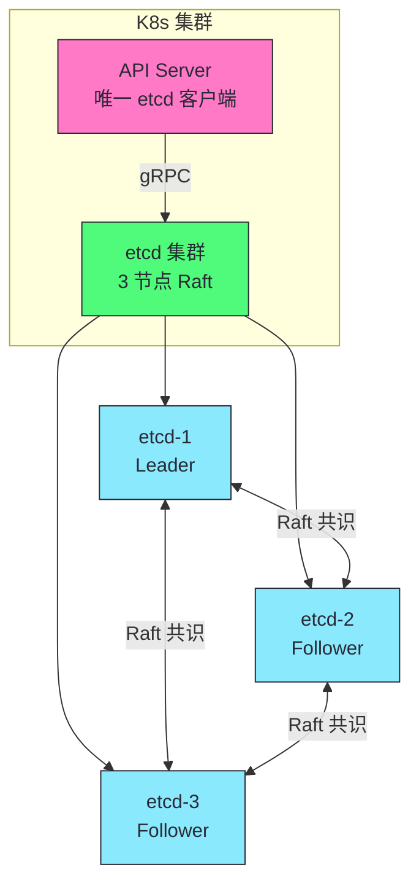
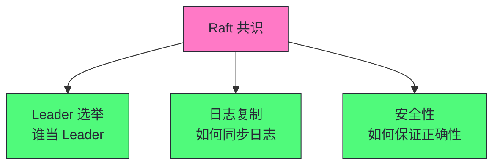
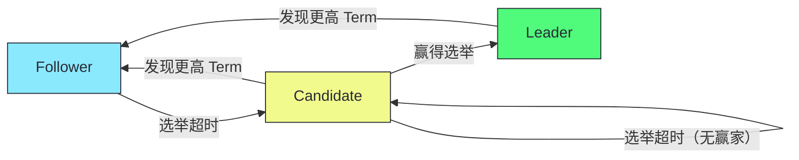
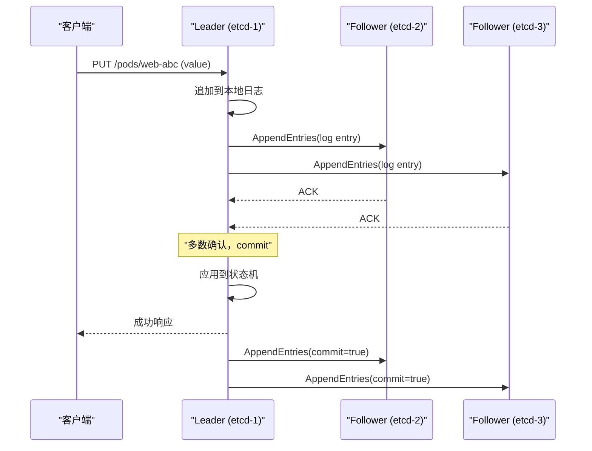
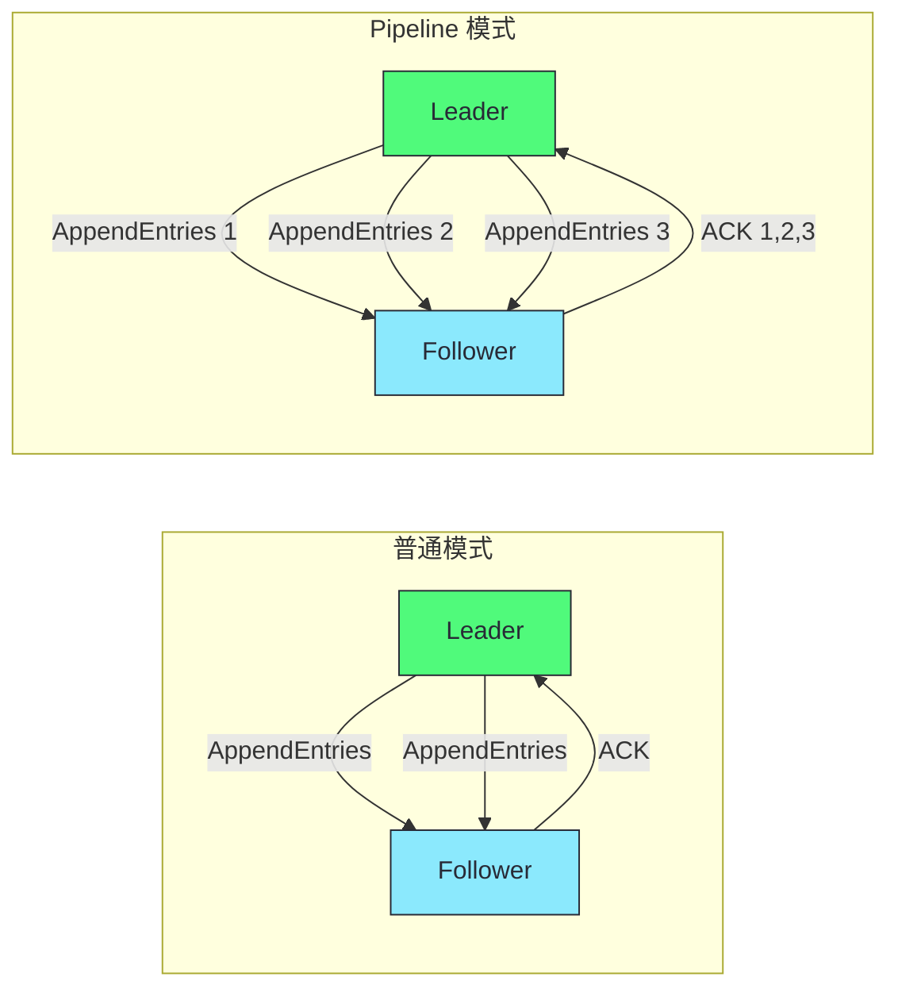
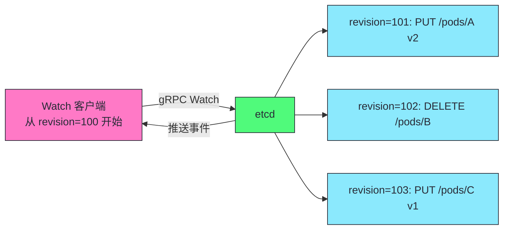

# 07 etcd 深度剖析：Raft 共识、MVCC 与 Watch 机制

**摘要：**
本文深入 Kubernetes 的唯一持久化存储——etcd。etcd 是一个分布式键值存储，使用 Raft 共识算法保证强一致性，是 K8s 集群的"唯一记忆"。文章从 etcd 在 K8s 中的角色出发，深入 Raft 共识算法的工程实现（Leader 选举、日志复制、线性一致性读）、MVCC 多版本并发控制、Watch 机制，以及 etcd 的存储引擎（WAL、Snapshot、Compaction），最后讨论运维实践——容量规划、备份恢复、性能调优、常见故障。核心认知：etcd 是 K8s 最重要的单点，必须高可用部署和定期备份，备份了从没验证过恢复等于没备份。

---

## 第 1 章 etcd 在 K8s 中的角色

etcd 是 K8s 的唯一持久化存储，所有集群状态都存储在 etcd 中。本章从 etcd 在 K8s 中的角色出发，解释为什么 K8s 选择 etcd，以及 etcd 的核心特性如何支撑 K8s 的运行。理解 etcd 在 K8s 中的角色，是理解 K8s 可靠性基础的关键——K8s 的所有一致性保证最终都落在 etcd 上。

### 1.1 唯一持久化存储

K8s 的所有集群状态都存在 etcd 中——Pod、Service、Deployment、Secret、ConfigMap、RBAC 等。API Server 是 etcd 的唯一客户端，其他组件通过 API Server 间接读写。这种"API Server 作为唯一客户端"的设计保证了 etcd 的访问路径单一——所有写操作都经过 API Server 的认证、授权、准入控制，避免了组件直接写 etcd 导致的安全和一致性问题。

etcd 中的 key 布局遵循固定模式：`/registry/<resource>/<namespace>/<name>`。譬如 default 命名空间的 Pod `web-abc` 在 etcd 中的 key 是 `/registry/pods/default/web-abc`。集群级资源（如 Node）的 key 是 `/registry/minions/node-1`（minions 是 Node 的历史名称，K8s 早期叫法）。这种层次化的 key 布局使得 API Server 可以通过 key 前缀快速查询某类资源的所有对象——List Pods 时查询 `/registry/pods/` 前缀下的所有 key。Watch 也基于前缀——API Server Watch `/registry/pods/` 前缀，收到该前缀下所有 key 的变更事件。

etcd 在 K8s 中的角色可以用"唯一记忆"来概括——K8s 集群的所有状态都存储在 etcd 中，etcd 故障意味着整个集群的状态丢失。K8s 的状态管理高度集中——所有状态变更都通过 API Server 写入 etcd，所有组件通过 API Server 读取 etcd 中的状态。这种集中式存储是 K8s 声明式 API的基础——用户声明期望状态，控制器读取实际状态，两者都存储在 etcd 中。

为什么 K8s 选择 etcd 而非其他存储？这涉及几个关键考量。首先是强一致性——K8s 的集群状态要求强一致，不能出现不同节点看到不同状态的情况，etcd 的 Raft 共识保证了这一点。其次是 Watch 机制——K8s 的 List-Watch 协议需要底层存储支持变更监听，etcd 原生支持 Watch。然后是事务支持——K8s 的乐观并发控制需要 CAS 操作，etcd 的事务接口支持这一点。最后是高可用——etcd 的 Raft 集群支持 3/5 节点高可用部署，容忍节点故障。这些特性使得 etcd 成为 K8s 的理想存储选择。

"API Server 作为唯一客户端"的设计还有一个重要的安全价值——所有写操作都经过 API Server 的认证、授权、准入控制，避免了组件直接写 etcd 导致的安全问题。如果组件可以直接写 etcd，任何被攻破的组件都可以任意修改集群状态，安全风险极高。通过 API Server 作为唯一入口，K8s 可以集中控制所有写操作的权限，保证安全。这种"单一入口"的安全设计是 K8s 安全模型的基础。



etcd 在 K8s 中的角色可以用"唯一记忆"来概括——K8s 集群的所有状态都存储在 etcd 中，etcd 故障意味着整个集群的状态丢失。虽然运行中的容器不会立即停止（kubelet 独立管理容器生命周期），但任何新操作（创建/更新/删除 Pod）都无法执行。K8s 的状态管理高度集中——所有状态变更都通过 API Server 写入 etcd，所有组件通过 API Server 读取 etcd 中的状态。这种集中式存储是 K8s 声明式 API的基础——用户声明期望状态，控制器读取实际状态，两者都存储在 etcd 中。

### 1.2 etcd 的核心特性

| 特性 | 说明 | K8s 用途 |
|------|------|---------|
| **强一致性** | Raft 共识，所有写经过 Leader | 集群状态一致性 |
| **Watch 机制** | 客户端监听 key 变化 | K8s List-Watch 底层 |
| **MVCC** | 多版本并发控制 | 历史版本、ResourceVersion |
| **事务** | CAS（Compare-And-Swap） | 乐观并发控制 |
| **Lease** | TTL key | 心跳、锁、Leader Election |
| **高可用** | 3/5 节点 Raft | 容忍 1/2 节点故障 |

> [!info] 核心概念：etcd 是 K8s 最重要的单点
> etcd 故障意味着整个集群的状态丢失——所有 Pod、Service、Deployment 的定义都消失了。虽然运行中的容器不会立即停止（kubelet 独立管理容器生命周期），但任何新操作（创建/更新/删除 Pod）都无法执行。etcd 必须有高可用部署（3 或 5 节点 Raft 集群）和定期备份。备份策略：(1) 定期 etcdctl snapshot save；(2) 备份存储到异地（如 S3）；(3) 定期演练恢复流程。

etcd 的六个核心特性分别服务于 K8s 的不同需求。强一致性保证集群状态在所有 etcd 节点上一致，不会出现数据不一致。Watch 机制是 K8s List-Watch 协议的底层基础——API Server 的 Watch 最终通过 etcd Watch 实现。MVCC 支持历史版本查询和 ResourceVersion——K8s 的乐观并发控制依赖于此。事务支持 CAS——K8s 的更新操作通过 CAS 保证并发安全。Lease 支持心跳和 Leader Election——K8s 组件的 Leader Election（如 kube-controller-manager）基于 etcd Lease 实现。高可用保证 etcd 自身的可靠性——3 节点容忍 1 故障，5 节点容忍 2 故障。

这六个特性的协同工作使得 etcd 成为 K8s 的理想存储。强一致性是基础——保证集群状态一致。Watch 和 MVCC 是 K8s 控制器机制的基础——List-Watch 和乐观并发控制都依赖于此。事务是并发安全的基础——CAS 保证多客户端并发写不冲突。Lease 是高可用组件的基础——Leader Election 保证组件高可用。高可用是 etcd 自身可靠性的基础——Raft 集群容忍节点故障。这些特性共同构成了 etcd 作为 K8s 唯一持久化存储的能力基础。

---

## 第 2 章 Raft 共识算法

Raft 是 etcd 的共识算法，保证了 etcd 多节点数据的一致性。本章深入 Raft 的设计目标、节点状态、Leader 选举、日志复制、线性一致性读，以及 etcd 对 Raft 的工程优化。理解 Raft，是理解 etcd 强一致性保证的基础。

### 2.1 Raft 的设计目标

Raft 是 Diego Ongaro 在 2014 年提出的共识算法，设计目标是**可理解性**（相比 Paxos 更易理解和实现）。etcd、Consul、TiKV 等都使用 Raft。Raft 的设计哲学是"为了可理解性而设计"——它在保证正确性的前提下，尽量简化算法，使得普通工程师也能理解和实现。Raft 在工程实践中广受欢迎，成为现代分布式系统的首选共识算法。

Raft 诞生的背景是 Paxos 的复杂性。Paxos 是 Leslie Lamport 在 1990 年代提出的共识算法，虽然理论完备，但极其难以理解和实现。很多团队在实现 Paxos 时遇到困难——算法细节复杂，工程实现容易出错。Raft 的设计目标就是"和 Paxos 一样强大，但更容易理解和实现"。Raft 通过"分而治之"（分解为 Leader 选举、日志复制、安全性三个子问题）和"减少状态空间"（限制节点状态为三种）等设计，大幅降低了理解和实现的难度。这种"可理解性优先"的设计哲学使得 Raft 成为现代分布式系统的首选共识算法。

Raft 将共识分解为三个子问题：



Raft 的三个子问题分别解决了共识的不同方面。Leader 选举解决了"谁来协调"的问题——Raft 通过选举一个 Leader 来协调日志复制，避免了多 Leader 导致的冲突。日志复制解决了"如何同步"的问题——Leader 接收写请求，复制到 Followers，多数确认后 commit。安全性解决了"如何保证正确"的问题——通过 Term、选举限制、commit 规则等机制保证已 commit 的日志不会丢失。Raft 的复杂性可控，每个子问题可以独立理解和实现。

### 2.2 节点状态

Raft 节点有三种状态——Follower、Candidate、Leader。状态转换的规则清晰明确，使得节点的行为可预测。

| 状态 | 说明 |
|------|------|
| **Follower** | 接收 Leader 的 AppendEntries，被动响应 |
| **Candidate** | 选举超时后发起选举，请求投票 |
| **Leader** | 处理所有写请求，复制日志到 Followers |



节点状态的转换规则是 Raft 的基础。Follower 在选举超时内没收到 Leader 心跳，变为 Candidate 发起选举。Candidate 获得多数票成为 Leader，或发现更高 Term 降为 Follower。Leader 发现更高 Term 降为 Follower。这种"Term 驱动的状态转换"保证了过期的 Leader 不会继续服务——一旦发现更高 Term，立即降级，避免脑裂。

三种状态的设计体现了"主从模式"的经典思想——Leader 是主，处理所有写请求；Follower 是从，被动响应 Leader 的请求；Candidate 是中间状态，用于选举。Raft 的状态管理简单清晰——任何时刻只有一个 Leader，所有写请求经过 Leader 协调，避免了多 Leader 导致的冲突。这种设计在分布式系统中很常见——譬如 MySQL 的主从复制、Redis 的哨兵模式，都是类似的"主从"设计。

### 2.3 Leader 选举

#### Term（任期）

**Term** 是单调递增的整数，充当 Raft 的"逻辑时钟"。每次选举启动一个新 Term。Term 保证了过期的 Leader 不会造成危害——如果节点收到更高 Term 的消息，它自己变为 Follower。Term 的设计是 Raft 的核心——它提供了"逻辑时间"的概念，使得节点可以判断消息的新旧。这种"逻辑时钟"的设计在分布式系统中很常见——譬如 Lamport 时钟、向量时钟，都是用逻辑时间替代物理时间，避免了物理时钟不同步的问题。

Term 的工程价值在于"防止脑裂"。考虑一个场景——旧 Leader（Term=5）网络分区，与多数节点失联。分区期间它继续接受写请求（但无法复制到多数）。网络恢复后，新 Leader（Term=6）已经被选举。旧 Leader 收到新 Leader 的更高 Term 消息后，立即降级为 Follower，停止接受写请求。这种"Term 驱动的自动降级"保证了不会有两个 Leader 同时服务——只要发现更高 Term，立即降级，避免脑裂。这是 Raft 相比 Paxos 的工程优势之一——用简单的 Term 机制解决了脑裂问题。

#### 选举流程

```
1. Follower 在选举超时（随机 150-300ms）内没收到 Leader 心跳
2. Follower 变为 Candidate，Term + 1，给自己投票
3. Candidate 向其他节点发送 RequestVote RPC
4. 获得多数票的 Candidate 成为 Leader
5. Leader 定期发送心跳（AppendEntries 无 entries）维持领导地位
```

> [!info] 核心概念：随机化选举超时防止活锁
> 如果所有节点同时选举超时，它们同时变为 Candidate，同时请求投票，没人获得多数——这导致"活锁"（election livelock）。Raft 用**随机化选举超时**（150-300ms 随机）解决这个问题——不同节点超时时间不同，先超时的节点先发起选举，大概率获得多数。这是 Raft 相比 Paxos 的工程优势之一——简单有效地避免了选举活锁。

随机化选举超时是 Raft 的一个精妙设计。它不需要节点间的协调，仅通过随机化就避免了活锁。这种"用随机化避免冲突"的思想在分布式系统中广泛应用——譬如以太网的 CSMA/CD 协议用随机退避避免碰撞，K8s 的控制器用随机化 Resync 间隔避免同时全量协调。随机化的本质是"分散冲突"——把同时发生的冲突分散到不同时间，使得冲突概率大幅降低。

etcd 对选举超时的默认配置值得了解。`--election-timeout` 默认 1000ms，随机化范围为 [election-timeout, 2×election-timeout)。网络延迟高的环境（如跨数据中心）可能需要调大（如 2000ms），避免网络抖动导致误触发选举。但太大会导致 Leader 故障后恢复慢——Leader 崩溃后，Follower 需要等待 election-timeout 才能发起选举。etcd 还引入了 PreVote 机制（Raft 的扩展）——Follower 在正式发起选举前先发 PreVote 探测，确认自己能获得多数支持才正式选举。PreVote 避免了网络分区中的孤立节点恢复后频繁触发选举，干扰正常 Leader，这是 etcd 工程实践的重要改进。

### 2.4 日志复制

#### 写请求处理流程



日志复制是 Raft 的核心机制——Leader 接收写请求，追加到本地日志，复制到 Followers，多数确认后 commit。这个流程保证了已 commit 的日志在多数节点上持久化，即使 Leader 故障，新 Leader 也有这些日志。日志复制的"多数确认"是 Raft 可靠性的基础——只要多数节点存活，已 commit 的日志就不会丢失。

日志复制的流程可以分解为几个阶段。首先是日志追加——Leader 收到写请求后，追加到本地日志（但不立即 commit）。然后是并行复制——Leader 并行向所有 Followers 发送 AppendEntries RPC，包含日志条目。接着是确认收集——Leader 收集 Followers 的确认，等待多数确认。然后是 commit——多数确认后，Leader commit 日志条目，应用到状态机。最后是响应客户端——Leader 返回成功响应，并异步通知 Followers 日志已 commit。这个流程的关键是"多数确认才 commit"——保证了已 commit 的日志在多数节点上持久化。

日志复制的"多数确认"设计有一个重要的容错特性——只要多数节点存活，已 commit 的日志就不会丢失。考虑 3 节点集群——任何 2 个节点存活就构成多数，已 commit 的日志在这 2 个节点上都有副本。即使 1 个节点故障，新 Leader 从存活的 2 个节点中选举，必然有已 commit 的日志。这种"多数容错"是 Raft 可靠性的核心——3 节点容忍 1 故障，5 节点容忍 2 故障，2N+1 节点容忍 N 故障。

#### Commit 规则

Leader 只有在**当前 Term 的日志条目被多数确认**后才 commit。这是 Raft 的安全性保证——防止旧 Term 的 Leader commit 未复制的日志（脑裂场景）。

> [!warning] 生产避坑：Raft 的 commit 规则防止脑裂数据丢失
> 假设旧 Leader（Term=5）网络分区，它继续接受写请求但无法复制到多数。网络恢复后，新 Leader（Term=6）被选举。旧 Leader 的未 commit 的日志不会丢失——新 Leader 会检测到日志不一致，用自己的日志覆盖。但如果旧 Leader 已经 commit 了（在分区前），新 Leader 必须保留这些已 commit 的日志。Raft 的"当前 Term commit 规则"确保了这一点——只有当前 Term 的日志被多数确认才 commit，防止旧 Term 的错误 commit。

Raft 的 commit 规则是一个容易误解的点。很多人以为"日志被多数复制就 commit"，实际上 Raft 要求"当前 Term 的日志被多数确认才 commit"。这个区别在 Leader 切换时至关重要——如果旧 Leader 在分区前已经复制了日志但没 commit，新 Leader 上任后不能直接 commit 这些日志（因为它们是旧 Term 的），必须等到当前 Term 有新日志被多数确认后，才能间接 commit 之前的日志。这种"当前 Term commit 规则"保证了不会 commit 未安全复制的日志。

### 2.5 线性一致性读

etcd 默认提供**线性一致性读**——读请求看到的是最近一次已 commit 的写。实现方式：

| 方式 | 机制 | 性能 |
|------|------|------|
| **ReadIndex** | Leader 确认自己仍是 Leader，读本地状态机 | 中 |
| **Lease Read** | Leader 基于租约认为自己是 Leader，直接读 | 高（但有风险） |

> [!note] 设计哲学：线性一致性读的代价
> 线性一致性读需要 Leader 确认自己仍是 Leader（避免读到旧 Leader 的数据）——这需要一次心跳确认。etcd 默认用 ReadIndex，每次读有一次 RTT 的额外延迟。Lease Read 基于租约跳过确认，性能更高——但如果租约未及时过期而 Leader 已切换，可能读到旧数据。生产环境用默认的 ReadIndex 确保正确性，除非对延迟极端敏感且能容忍偶尔的旧读。

线性一致性读的两种实现方式体现了"正确性 vs 性能"的经典权衡。ReadIndex 保证正确性但每次读有一次 RTT 延迟——Leader 需要确认自己仍是 Leader（通过心跳），避免读到脑裂后的旧 Leader 数据。Lease Read 基于租约跳过确认，性能更高——但如果租约未及时过期而 Leader 已切换（譬如时钟漂移），可能读到旧数据。生产环境通常用默认的 ReadIndex 确保正确性，除非对延迟极端敏感且能容忍偶尔的旧读。这种权衡在分布式系统中很常见——强一致性有性能代价，最终一致性有正确性风险。

为什么线性一致性读需要 Leader 确认？考虑一个场景——旧 Leader（Term=5）网络分区，它认为自己还是 Leader。如果客户端读到旧 Leader，可能读到旧数据（旧 Leader 的状态机没更新）。ReadIndex 通过"Leader 确认自己仍是 Leader"避免了这个问题——旧 Leader 发送心跳时发现更高 Term，立即降级，不再服务读请求。这种"读前确认"的机制保证了客户端不会读到旧 Leader 的数据。

Lease Read 是 ReadIndex 的优化版本。ReadIndex 每次读都需要一次 RTT 确认 Leader 身份，Lease Read 基于租约跳过确认——Leader 持有一个租约（由心跳续约），租约有效期内直接读，无需确认。Lease Read 的风险是：如果 Leader 的时钟漂移（如 NTP 同步问题），租约可能比实际有效期长，导致旧 Leader 服务读请求。生产环境中 etcd 默认使用 ReadIndex 确保正确性，只有在明确接受这个风险时才启用 Lease Read。K8s API Server 读取 etcd 时默认走 ReadIndex，保证读到的数据是最新的。

### 2.6 etcd 的 Raft 实现

etcd 的 Raft 实现（etcd-raft）与标准 Raft 的差异：

| 特性 | 标准 Raft | etcd-raft |
|------|----------|-----------|
| **日志存储** | 内存 | 持久化（WAL + Snapshot） |
| **批量提交** | 单条 | 批量（BatchAppend） |
| **Pipeline 复制** | 无 | 有（PipelineAppend） |
| **只读请求** | 走 Raft 日志 | ReadIndex/Lease Read 优化 |

etcd-raft 对标准 Raft 的优化体现了"理论 vs 工程"的差异。标准 Raft 是理论算法，注重可理解性；etcd-raft 是工程实现，注重性能和可靠性。日志持久化保证了重启后状态不丢失，批量提交减少了网络开销，Pipeline 复制提升了高延迟网络的吞吐量，ReadIndex/Lease Read 优化了读性能。这些优化使得 etcd 可以在生产环境中高效运行，同时保持 Raft 的正确性保证。

etcd-raft 的另一个重要设计是"Ready"抽象。etcd-raft 不直接执行网络 IO 和磁盘 IO，而是通过 Ready 结构体把"需要做的事"打包给上层应用。上层应用（etcd server）收到 Ready 后，执行 WAL 写入、网络发送、Snapshot 保存等操作，完成后通知 etcd-raft。etcd-raft 可以专注于共识逻辑，IO 操作由上层应用控制。这种设计的好处是可测试性——etcd-raft 可以在没有真实 IO 的情况下测试，只需要模拟 Ready 的处理。

### 2.7 etcd 的 Pipeline 复制优化

标准 Raft 的日志复制是"请求-响应"模式——Leader 发送 AppendEntries，等待 Follower 确认，再发送下一批。这种模式在高延迟网络下效率低——每次复制的 RTT 都被等待时间占据。

etcd-raft 的 **Pipeline 复制**：Leader 持续发送 AppendEntries 而不等待确认——假设 Follower 会按顺序确认。如果发现 Follower 的日志落后（通过 nextIndex 不匹配），退回到普通模式重新同步。



> [!info] 核心概念：Pipeline 复制提升高延迟网络的吞吐量
> Pipeline 复制使得 Leader 不需要等待每个 AppendEntries 的确认——在高延迟网络（如跨数据中心）中，这显著提升吞吐量。但 Pipeline 模式需要处理乱序确认和日志不一致——如果 Follower 确认失败，Leader 需要回退到普通模式重新同步。这是 etcd 在工程实现上对标准 Raft 的优化之一。

Pipeline 复制的设计体现了"假设正常、异常回退"的工程模式。正常情况下，Follower 会按顺序确认 AppendEntries，Leader 可以持续发送而不等待。异常情况下（Follower 日志落后或网络问题），Leader 检测到 nextIndex 不匹配，退回到普通模式重新同步。正常路径高效，异常路径正确——是分布式系统优化的常见模式。

Pipeline 复制的性能提升在高延迟网络中尤为明显。考虑跨数据中心部署的 etcd 集群——数据中心间 RTT 约 10-50ms。普通模式下，每次 AppendEntries 复制需要 10-50ms（等待 ACK），吞吐量约 20-100 次/秒。Pipeline 模式下，Leader 可以持续发送，吞吐量不受 RTT 限制，只受网络带宽限制。这种"RTT 无关吞吐量"的特性使得 Pipeline 复制成为跨数据中心 etcd 部署的关键优化。

---

## 第 3 章 MVCC 多版本并发控制

MVCC 是 etcd 的核心设计之一，支持历史版本查询、Watch 和事务。本章深入 MVCC 的设计动机、版本机制，以及 K8s ResourceVersion 与 etcd ModRevision 的映射关系。

### 3.1 为什么需要 MVCC

etcd 的每个 key 的每次修改都生成新版本——这使得 etcd 支持：

- **历史版本查询**：查询 key 在某个版本时的值
- **Watch**：从某个版本开始监听变更
- **事务**：基于版本的 CAS（Compare-And-Swap）

MVCC（Multi-Version Concurrency Control）是 etcd 的核心设计之一。传统键值存储只保存 key 的最新值，修改时覆盖旧值。etcd 保存 key 的所有历史版本，每次修改生成新版本，旧版本保留。etcd 支持历史查询和 Watch——客户端可以从任意版本开始查询或监听。MVCC 的代价是存储空间——历史版本需要存储，如果不压缩会无限增长。etcd 通过 compaction 机制定期清理旧版本，控制存储空间。

为什么 etcd 需要 MVCC 而非简单的覆盖式存储？这涉及几个关键需求。首先是 Watch——K8s 的 List-Watch 协议需要从某个版本开始监听变更，如果没有历史版本，Watch 无法从指定版本恢复。其次是乐观并发控制——K8s 的更新操作基于 ResourceVersion（对应 etcd 的 ModRevision），需要版本号来判断并发冲突，如果没有 MVCC，无法实现版本号。然后是历史查询——某些场景需要查询 key 在某个历史版本的值（如审计、调试），MVCC 支持这种查询。最后是事务——etcd 的事务基于版本比较（CAS），需要 MVCC 提供版本号。这些需求使得 MVCC 成为 etcd 的必要设计。

MVCC 的另一个重要价值是"读写不冲突"。在传统覆盖式存储中，读和写是冲突的——写时不能读（读到不一致数据），读时不能写（阻塞写）。MVCC 通过保留历史版本解决了这个问题——读操作读取某个历史版本，写操作创建新版本，两者互不干扰。这种"读写不冲突"的特性使得 etcd 支持高并发读写，是 etcd 高性能的基础之一。

etcd 的事务（Txn）接口是 MVCC 的关键应用。etcd 支持原子事务——一组 CAS（Compare-And-Swap）操作要么全部成功，要么全部失败。事务的语法是 `Txn(If[compare], Then[ops], Else[ops])`——如果 compare 条件满足，执行 Then 操作，否则执行 Else 操作。K8s 的乐观并发控制正是基于 etcd 事务实现的：API Server 在更新对象时，先比较 etcd 中的 ModRevision 是否等于客户端提供的 ResourceVersion，如果相等（无并发修改），执行写入；如果不相等（有并发修改），返回 409 Conflict，客户端需要重新读取后重试。这种 CAS 机制保证了并发更新不会覆盖其他客户端的修改，是 K8s 声明式 API 的并发安全基石。

### 3.2 MVCC 的版本机制

```
# 写入 key=/pods/web-abc value=v1
revision=1, key=/pods/web-abc, value=v1

# 更新 key=/pods/web-abc value=v2
revision=2, key=/pods/web-abc, value=v2

# 更新 key=/pods/web-abc value=v3
revision=3, key=/pods/web-abc, value=v3

# 查询 key=/pods/web-abc 在 revision=2 时的值
→ 返回 v2
```

| 概念 | 说明 |
|------|------|
| **revision** | 全局单调递增的版本号，每次写操作递增 |
| **ModRevision** | key 最后被修改的 revision |
| **Version** | key 的修改次数（从创建开始） |

etcd 的 MVCC 有三个版本概念——revision、ModRevision、Version。revision 是全局单调递增的版本号，每次写操作（任何 key）递增——它标记了 etcd 的全局状态版本。ModRevision 是 key 最后被修改的 revision——它标记了某个 key 的最后修改时间。Version 是 key 的修改次数——它标记了某个 key 被修改了多少次。这三个版本概念分别服务于不同用途——revision 用于全局排序，ModRevision 用于 key 级别的版本控制，Version 用于 key 的修改计数。

MVCC 的实现依赖于 etcd 的后端存储 BoltDB（etcd v3.5 之前用 bbolt，之后可选 BoltDB）。BoltDB 是一个嵌入式键值数据库，etcd 把 MVCC 的版本数据存储在 BoltDB 中。每个 key 的每个版本对应 BoltDB 中的一个条目，key 的格式是"key + revision"——这使得 BoltDB 可以按 key 和 revision 联合查询。这种"key 加 revision 的联合索引"使得 etcd 可以高效查询某个 key 的某个历史版本，或从某个 revision 开始 Watch。MVCC 的存储代价是每个版本都占用空间，不压缩会无限增长。

### 3.3 K8s 的 ResourceVersion

K8s 的 `metadata.resourceVersion` 直接对应 etcd 的 **ModRevision**。

```yaml
# K8s 对象
metadata:
  resourceVersion: "12345"  # 对应 etcd 的 ModRevision
```

> [!info] 核心概念：ResourceVersion 是 etcd ModRevision 的直接映射
> K8s 的 ResourceVersion 不是 K8s 自己维护的版本号——它是 etcd ModRevision 的字符串形式。这意味着：(1) ResourceVersion 全局单调递增（跨所有资源类型）；(2) 不同资源的 ResourceVersion 可以比较大小（虽然语义上无意义）；(3) ResourceVersion 的更新由 etcd 的写操作驱动，K8s 不主动管理。理解这个映射很重要——它是 K8s 乐观并发控制和 List-Watch 协议的底层基础。我们将在第 08 篇深入讨论 ResourceVersion 的工程使用。

ResourceVersion 与 etcd ModRevision 的映射是 K8s 与 etcd 关系的核心。理解这个映射，就理解了 K8s 的一致性保证——K8s 的乐观并发控制基于 ResourceVersion（CAS），List-Watch 协议基于 ResourceVersion（从某版本开始 Watch），最终都落在 etcd 的 MVCC 上。K8s 不需要自己维护版本系统，直接复用 etcd 的 MVCC。

ResourceVersion 的全局单调递增特性有一个重要含义——不同资源类型的 ResourceVersion 可以比较大小。譬如 Pod A 的 ResourceVersion=100，Service B 的 ResourceVersion=200，可以判断"Service B 的修改晚于 Pod A"。虽然这种比较在语义上无意义（不同资源类型），但在工程上有用——譬如 List-Watch 协议中，客户端可以用 ResourceVersion 判断"是否错过了事件"（如果 Watch 的起始 ResourceVersion 小于当前 ResourceVersion，可能错过了事件）。这种"全局版本号"的设计是 etcd MVCC 的直接结果——所有 key 共享一个全局 revision。

---

## 第 4 章 Watch 机制

### 4.1 etcd Watch 的实现

etcd Watch 基于 MVCC——客户端从某个 revision 开始监听，etcd 推送该 revision 之后的所有变更事件。etcd Watch 是 K8s List-Watch 协议的底层实现——API Server 的 Watch 请求最终通过 etcd Watch 实现。

etcd Watch 的工作原理是"从某个 revision 开始推送增量变更"。客户端发起 Watch 请求时指定起始 revision，etcd 推送该 revision 之后的所有变更事件。这种"从某版本开始推送"的模式依赖于 MVCC——etcd 保留了所有历史版本，可以从任意版本开始推送。如果起始 revision 已被压缩（compaction），etcd 返回错误，客户端需要重新 List 获取当前快照。

etcd Watch 的实现有几个关键设计。首先是基于 gRPC 流——Watch 使用 gRPC 的双向流，客户端发起 Watch 请求后，etcd 持续推送事件，直到客户端取消或连接断开。其次是多 key 监听——一个 Watch 请求可以监听多个 key 或 key 前缀（如 `/pods/`），etcd 只推送匹配的事件。然后是 revision-based——Watch 的起始点由 revision 指定，支持从任意历史版本开始（只要未被压缩）。最后是自动恢复——Watch 连接断开后，客户端可以从最后的 revision 重新 Watch，或全量 List 重新初始化。这些设计使得 etcd Watch 成为 K8s List-Watch 协议的理想底层。

etcd Watch 与 K8s API Server 的 Watch 有层次关系。K8s API Server 的 Watch 是面向客户端的（kubectl、controller），使用 HTTP/2 流；etcd Watch 是面向 API Server 的，使用 gRPC 流。API Server 收到客户端的 Watch 请求后，转换为 etcd Watch 请求，把 etcd 推送的事件转换为 K8s 事件推送给客户端。这种"客户端 Watch → API Server Watch → etcd Watch"的层次关系使得 K8s 的 List-Watch 协议可以复用 etcd 的 Watch 能力，而不需要自己实现事件推送。

etcd Watch 还有一个重要的实现细节：Watch 事件是过滤后推送的。API Server 为每种资源类型建立到 etcd 的 Watch，但 etcd Watch 监听的是 key 前缀（如 `/registry/pods/`），etcd 推送该前缀下所有 key 的变更。API Server 收到 etcd 事件后，根据 key 解析出资源类型和对象，再根据客户端 Watch 请求的过滤条件（如 Namespace、LabelSelector）过滤后推送给客户端。这意味着同一个 etcd Watch 事件可能被分发给多个客户端 Watcher，每个 Watcher 只收到自己关心的子集，这种过滤机制大幅减少了不必要的网络传输。



etcd Watch 的工作原理是"从某个 revision 开始推送增量变更"。客户端发起 Watch 请求时指定起始 revision，etcd 推送该 revision 之后的所有变更事件。这种"从某版本开始推送"的模式依赖于 MVCC——etcd 保留了所有历史版本，可以从任意版本开始推送。如果起始 revision 已被压缩（compaction），etcd 返回错误，客户端需要重新 List 获取当前快照。

### 4.2 Watch 的压缩问题

etcd 定期**压缩**（compact）旧版本——删除 revision 之前的历史版本。如果 Watch 的起始 revision 已被压缩，etcd 返回错误，客户端需要重新 List。

```
compact(revision=1000)
→ 删除 revision < 1000 的所有历史版本

Watch from revision=500
→ 失败：revision 已被压缩
→ 客户端需要重新 List 获取当前快照
```

> [!warning] 生产避坑：Watch 失败后必须重新 List
> 如果 etcd 压缩了 Watch 的起始 revision，Watch 返回失败。K8s 的 Reflector 自动处理这种情况——执行全量 List 重新初始化，然后从新的 revision 开始 Watch。但如果你自己实现了 Watch 逻辑（不使用 client-go Informer），必须处理这种失败——重新 List 获取当前快照，而非无限重试 Watch。这是 List-Watch 协议中"List"阶段的价值——Watch 失败时可以回到 List 恢复。

Watch 的压缩问题是 List-Watch 协议设计的重要考虑。如果只有 Watch 没有 List，Watch 失败后无法恢复——起始 revision 被压缩，历史事件丢失。List-Watch 协议通过"List 建立基线、Watch 跟踪增量"解决了这个问题——Watch 失败后重新 List 获取当前快照，从新 revision 开始 Watch。这种"List 兜底 Watch"的设计是 K8s 控制器可靠性的基础——即使 Watch 失败，也能通过 List 恢复。

etcd 的 Lease 机制也值得提及。Lease 是 etcd 的租约机制——客户端可以创建一个带 TTL 的 Lease，然后把 key 关联到该 Lease。Lease 过期后，关联的 key 自动删除。K8s 广泛使用 Lease 机制：kubelet 的节点心跳通过 Lease 实现（`/registry/leases/kube-node-lease/<node-name>`），kube-controller-manager 的 Leader 选举通过 Lease 实现（持有 Lease 的实例是 Leader，Lease 过期后其他实例竞选）。Lease 的优势是自动清理——即使持有者崩溃无法显式删除 key，Lease 过期后 key 也会自动删除，避免了僵尸资源残留。

压缩与 Watch 的关系可以用一个类比来理解——Watch 像是"追剧"，从某一集开始看后续剧情。压缩像是"平台删除了旧集数"——如果你追剧的起始集被删除了，你无法从那集开始看，只能从最新集重新开始。List-Watch 协议的"List 兜底"相当于"如果起始集被删除了，先看最新集的剧情概要（List 获取当前快照），再从最新集开始追（Watch 从新 revision 开始）"。这种"追剧加剧情概要"的组合保证了即使旧集被删除，也能恢复追剧。

---

## 第 5 章 存储引擎：WAL、Snapshot、Compaction

### 5.1 WAL（预写日志）

**WAL（Write-Ahead Log）** 是 etcd 的持久化机制——所有写操作在应用到状态机前先写入 WAL 文件。etcd 重启时通过回放 WAL 恢复状态。WAL 是数据库领域的经典设计——先写日志再改数据，保证持久性。这种"先日志后数据"的模式使得即使数据修改中途崩溃，也能通过日志恢复——日志记录了所有修改，重放日志即可恢复数据。

WAL 的写流程是"先 fsync 到 WAL 文件，再应用到内存状态机"。fsync 保证了日志持久化到磁盘——即使机器崩溃，日志也不会丢失。etcd 的写延迟直接受磁盘 fsync 性能影响——SSD 的 fsync 延迟约 0.5-1ms，HDD 约 5-10ms。这就是为什么 etcd 官方推荐使用 SSD——fsync 延迟直接影响写延迟。

WAL 的设计体现了"持久性优先"的原则——即使性能受影响，也要保证数据不丢。这种设计在数据库领域很常见——MySQL 的 InnoDB 也有 redo log，PostgreSQL 有 WAL，都是"先写日志再改数据"的模式。WAL 的代价是写放大——每次写操作都要 fsync 到 WAL 文件，增加了磁盘 I/O。但这个代价是值得的——它保证了数据的持久性，即使机器崩溃也能恢复。

WAL 的一个重要工程细节是"预写"。WAL 是"Write-Ahead Log"——日志必须在数据修改前写入。这个"先写日志"的顺序保证了即使数据修改中途崩溃，日志也已经持久化——重启时通过回放日志恢复数据。如果反过来"先改数据再写日志"，数据修改中途崩溃时日志还没写，无法恢复。这种"先日志后数据"的顺序是 WAL 的核心约束，也是数据库持久性的基础。


### 5.2 Snapshot（快照）

**Snapshot** 是状态机的定期快照——将内存状态序列化到文件，避免 WAL 无限增长。etcd 重启时先加载最近的 Snapshot，再回放 Snapshot 之后的 WAL。

```
启动恢复流程：
1. 加载最近的 Snapshot（如 revision=1000 时的状态）
2. 回放 Snapshot 之后的 WAL（revision 1001-当前）
3. 应用所有日志条目到状态机
4. 恢复完成
```

Snapshot 的设计解决了 WAL 无限增长的问题。如果没有 Snapshot，WAL 会记录所有历史修改，文件越来越大，重启恢复时间越来越长。Snapshot 定期把当前状态序列化到文件，之前的 WAL 可以删除——重启时先加载 Snapshot（快速恢复大部分状态），再回放 Snapshot 之后的 WAL（恢复增量修改）。这种"Snapshot 加 WAL"的组合是数据库领域的经典设计——譬如 MySQL 的 InnoDB 也有类似的 redo log 加 checkpoint 机制。

Snapshot 的触发机制有两种——按写次数触发（`--snapshot-count`，默认 10000）和按大小触发。etcd 每达到 snapshot-count 次写操作后触发一次 Snapshot。Snapshot 的代价是"写放大"——Snapshot 时需要把整个状态机序列化到磁盘，如果状态机很大（如 8GB），Snapshot 会占用大量磁盘 I/O 和 CPU。生产环境中需要平衡 Snapshot 频率——太频繁影响性能，太少导致 WAL 增长。

Snapshot 还有一个重要的 Raft 功能——同步慢节点的状态。如果一个 Follower 落后太多（譬如刚加入集群或长时间离线），Leader 的日志已经覆盖了 Follower 需要的起始位置，此时 Leader 不能通过 AppendEntries 同步，而是发送 Snapshot 给 Follower，Follower 加载 Snapshot 后继续同步。这种"Snapshot 同步慢节点"的机制保证了慢节点可以快速追上集群，而不需要回放所有历史日志。

### 5.3 Compaction（压缩）

**Compaction** 删除旧版本的历史数据——revision < compact_revision 的所有版本被删除。Compaction 是 etcd 存储管理的关键机制——不压缩会导致历史版本无限增长，影响性能。

Compaction 的设计体现了"保留必要历史、删除无用历史"的存储管理原则。MVCC 保留所有历史版本，但大部分历史版本在压缩后无用——客户端通常只关心最新版本或最近一段时间的变更。Compaction 删除旧版本，释放存储空间，同时保留最近一段时间的历史版本（支持 Watch 和历史查询）。这种"定期清理旧数据"的设计是存储系统的通用模式——譬如数据库的 vacuum、日志系统的 log rotation。

Compaction 对 Watch 的影响是一个重要的工程考量。Compaction 后，被压缩的 revision 不可查询，也不可 Watch。如果一个客户端的 Watch 起始 revision 已被压缩，Watch 返回失败，客户端需要重新 List 获取当前快照。这种"压缩导致 Watch 失败"的机制是 List-Watch 协议设计的重要考虑——List 阶段兜底 Watch 失败，保证客户端可以恢复。生产环境中需要合理设置压缩间隔——太短导致 Watch 频繁失败（客户端频繁全量 List），太长导致历史版本堆积（存储空间增长）。K8s 默认每 5 分钟压缩一次，这是一个经验值，适用于大多数场景。

Compaction 与 Snapshot 是协同工作的两个机制。Compaction 清理 MVCC 的旧版本（BoltDB 中的旧数据），Snapshot 清理 WAL 的旧日志。两者共同控制 etcd 的存储增长——Compaction 控制数据库大小，Snapshot 控制 WAL 大小。生产环境中需要同时关注两者——如果只 Compaction 不 Snapshot，WAL 会无限增长；如果只 Snapshot 不 Compaction，数据库会无限增长。K8s 默认每 5 分钟 Compaction 一次，每 10000 次写 Snapshot 一次，这是经验值，适用于大多数场景。

| 压缩方式 | 说明 |
|---------|------|
| **手动压缩** | `etcdctl compact <revision>` |
| **自动压缩** | `--auto-compaction-retention=1h`（按时间）或 `--auto-compaction-retention=10000`（按 revision 数） |

> [!warning] 生产避坑：不压缩会导致 etcd 性能退化
> 如果不定期压缩，etcd 的历史版本无限增长——WAL 文件越来越大，重启恢复时间越来越长，Watch 历史窗口越来越大但无用。K8s 的 kube-apiserver 默认每 5 分钟自动压缩一次（`--etcd-compaction-interval=5m`）。如果你禁用了自动压缩（设为 0），必须手动定期压缩。监控 etcd 的 `etcd_mvcc_db_total_size_in_bytes`——如果持续增长，说明压缩没生效。

Compaction 有两种模式：按时间（`--auto-compaction-mode=periodic`）和按 revision 数（`--auto-compaction-mode=revision`）。按时间模式如 `--auto-compaction-retention=1h` 表示保留最近 1 小时的历史版本。按 revision 数模式如 `--auto-compaction-retention=1000` 表示保留最近 1000 个 revision。K8s 默认使用按时间模式，每 5 分钟自动压缩一次。Compaction 后，被压缩的 revision 不可再用于 Watch 或历史查询——客户端需要重新 List 获取当前快照。

Compaction 释放的是逻辑空间（删除旧版本），但 etcd 的后端存储（bbolt）不会自动回收物理空间。物理空间回收需要执行 `etcdctl defrag`——defrag 会压缩 bbolt 数据库文件，回收已删除数据的物理空间。defrag 期间 etcd 节点无法服务请求（阻塞约几秒），生产环境中应该逐个节点 defrag（先 defrag Follower，再 defrag Leader），避免同时 defrag 导致服务中断。

---

## 第 6 章 etcd 运维实践

### 6.1 容量规划

| 集群规模 | 推荐 etcd 节点数 | 推荐 etcd 资源 |
|---------|----------------|--------------|
| 小（<100 节点） | 3 | 2 vCPU, 4GB RAM, 50GB SSD |
| 中（100-1000 节点） | 3 或 5 | 4 vCPU, 8GB RAM, 100GB SSD |
| 大（1000+ 节点） | 5 | 8 vCPU, 16GB RAM, 200GB SSD |

> [!info] 核心概念：etcd 对磁盘 IOPS 极其敏感
> etcd 的写操作需要先 fsync 到 WAL——磁盘延迟直接影响写延迟。普通 HDD 的 fsync 延迟约 5-10ms，SSD 约 0.5-1ms，NVMe SSD 约 0.1ms。etcd 官方推荐使用 SSD 或 NVMe。如果 etcd 共享磁盘（如与 K8s 其他组件同一块盘），磁盘争用会导致 etcd 延迟抖动——建议 etcd 独占磁盘。

etcd 的容量规划需要考虑集群规模和性能需求。节点数选择——3 节点容忍 1 故障，5 节点容忍 2 故障，奇数节点避免脑裂。资源选择——CPU 影响处理能力，内存影响缓存大小，磁盘影响 fsync 延迟。其中磁盘是最关键的因素——etcd 的写性能直接受 fsync 延迟影响，SSD 是必须的，独占磁盘避免争用。生产环境中 etcd 的资源不足会导致集群不稳定——Leader 频繁切换、提案失败、写延迟抖动。

容量规划的另一个重要考量是 etcd 的数据库大小。etcd 的默认存储配额是 8GB（`--quota-backend-bytes`），超过配额后 etcd 变只读。K8s 的集群状态存储在 etcd 中，随着集群规模增长（更多 Pod、Service、ConfigMap 等），etcd 的数据库大小会增长。生产环境中需要监控 `etcd_mvcc_db_total_size_in_bytes`，接近配额时需要扩容或清理无用资源。对于超大集群（10000+ 节点），可能需要增大配额或优化资源使用。

### 6.2 备份恢复

```bash
# 备份
ETCDCTL_API=3 etcdctl snapshot save /backup/etcd-snapshot.db \
  --endpoints=https://127.0.0.1:2379 \
  --cacert=/etc/etcd/ca.crt \
  --cert=/etc/etcd/peer.crt \
  --key=/etc/etcd/peer.key

# 验证备份
ETCDCTL_API=3 etcdctl snapshot status /backup/etcd-snapshot.db

# 恢复（在新集群上）
ETCDCTL_API=3 etcdctl snapshot restore /backup/etcd-snapshot.db \
  --data-dir=/var/lib/etcd-restored
```

> [!warning] 生产避坑：备份了从没验证过恢复等于没备份
> 很多团队定期备份 etcd，但从未演练恢复流程——真出事时发现备份不可用（备份文件损坏、恢复步骤错误、版本不兼容）。定期演练恢复：(1) 在测试环境恢复一份备份；(2) 验证 K8s 资源完整性（`kubectl get pods --all-namespaces`）；(3) 记录恢复步骤和耗时。建议每季度演练一次恢复。

etcd 的备份恢复是 K8s 灾难恢复的核心。备份策略——定期 snapshot save，存储到异地（如 S3），防止机房故障导致备份丢失。恢复策略——snapshot restore 到新集群，验证 K8s 资源完整性。备份恢复的常见问题——备份文件损坏（定期验证）、恢复步骤错误（演练并记录）、版本不兼容（备份和恢复用相同版本）。生产环境中"备份了从没验证过恢复等于没备份"——只有演练过的恢复才是可靠的。

备份恢复的工程实践有几个关键点。首先是备份频率——根据集群变更频率选择，通常每小时或每天备份一次。其次是备份存储——备份文件应存储到异地（如 S3），防止机房故障导致备份丢失。然后是备份验证——定期验证备份文件的完整性（snapshot status），确保备份可用。最后是恢复演练——定期在测试环境演练恢复流程，记录步骤和耗时，确保真出事时能快速恢复。这些实践构成了 etcd 灾难恢复的完整流程。

etcd 恢复有两种场景：单节点故障恢复和多节点故障恢复（集群恢复）。单节点故障时，剩余节点仍构成多数，集群正常工作——只需重新部署故障节点，新节点从 Leader 同步数据，无需恢复备份。多节点故障（如丢失多数节点）时，集群无法工作——需要用备份恢复整个集群。恢复流程：停止所有 etcd 节点，在每个节点上执行 `etcdctl snapshot restore` 恢复备份到新的 data-dir，然后用新 data-dir 启动 etcd。恢复后的集群会丢失备份时间点之后的变更——这就是为什么备份频率重要，生产环境建议每小时备份一次。

### 6.3 性能调优

| 参数 | 作用 | 推荐值 |
|------|------|--------|
| `--heartbeat-interval` | 心跳间隔 | 100ms（默认） |
| `--election-timeout` | 选举超时 | 1000ms（默认） |
| `--snapshot-count` | 多少次写后 Snapshot | 10000（默认） |
| `--quota-backend-bytes` | 后端存储配额 | 8GB（默认，超过只读） |
| `--auto-compaction-retention` | 自动压缩保留 | 1h（按时间） |

etcd 的性能调优需要根据实际环境调整。心跳间隔——太短增加网络开销，太长导致 Leader 故障检测慢。选举超时——太短容易误触发选举，太长导致 Leader 故障后恢复慢。Snapshot 频率——太频繁影响性能，太少导致 WAL 增长。存储配额——防止 etcd 数据无限增长，超过配额变只读。自动压缩——控制历史版本数量，避免性能退化。这些参数的调优需要基于实际负载和集群规模，没有通用最优值。

etcd 3.x 还引入了几个重要的后端参数。`--backend-batch-interval` 和 `--backend-batch-limit` 控制 bbolt 的批量提交行为——增大批次可以减少 fsync 次数，提升写吞吐量，但增加单次提交延迟。`--max-request-bytes` 限制单个请求的最大字节数（默认 1.5MB），防止大请求拖慢集群——K8s 中创建大 ConfigMap 或 Secret 时可能触发此限制。`--max-txn-ops` 限制单个事务的最大操作数（默认 128），防止超大事务阻塞集群。这些参数在大集群调优时需要关注，建议根据实际负载测试后调整。

性能调优的核心原则是"先监控再调优"。生产环境中应该先监控 etcd 的关键指标（WAL fsync 延迟、提案失败率、Leader 切换次数等），发现瓶颈后再针对性调优。盲目调优可能适得其反——譬如增大心跳间隔可能减少网络开销，但导致 Leader 故障检测变慢。etcd 的性能问题通常不是参数问题，而是硬件问题（磁盘慢、网络延迟高）或集群规模问题（资源过多导致 etcd 压力大）。调优前先排除硬件和规模问题，再考虑参数调优。

### 6.4 常见故障

| 故障 | 症状 | 排查方法 |
|------|------|---------|
| **磁盘满** | etcd 只读，K8s 无法创建资源 | 检查磁盘空间，压缩或扩容 |
| **Leader 频繁切换** | API Server 延迟抖动 | 检查网络和磁盘延迟 |
| **多数节点故障** | 集群不可用 | 恢复故障节点，或从备份恢复 |
| **WAL 损坏** | etcd 无法启动 | 从 Snapshot + WAL 恢复，或从备份恢复 |
| **内存不足** | etcd OOM | 扩容内存，或压缩减少历史版本 |

etcd 的常见故障可以分为几类。磁盘相关——磁盘满导致 etcd 只读，磁盘慢导致 Leader 频繁切换。网络相关——网络分区导致多数节点不可达，集群不可用。数据相关——WAL 损坏导致无法启动，内存不足导致 OOM。这些故障的排查需要监控 etcd 的关键指标——Leader 切换次数、WAL fsync 延迟、数据库大小、提案失败率。生产环境中应该建立 etcd 的监控告警体系，及时发现和处理故障。

故障排查的一个常见误区是"只看 etcd 指标，忽略 K8s 症状"。etcd 故障通常会表现为 K8s 的异常——API Server 延迟增加、kubectl 命令超时、Pod 创建失败。排查时应该同时看 etcd 指标和 K8s 症状，关联分析。譬如 API Server 延迟增加 + etcd WAL fsync 延迟增加 = 磁盘问题；Pod 创建失败 + etcd 提案失败率增加 = etcd 集群不稳定。这种"etcd 指标加 K8s 症状"的关联分析是排查 etcd 故障的有效方法。

etcd 故障对 K8s 的影响是全局性的——因为 etcd 是 K8s 的唯一持久化存储，etcd 故障会影响所有 K8s 操作。磁盘满导致 etcd 只读，K8s 无法创建/更新/删除资源，但已运行的 Pod 不受影响（kubelet 独立管理）。多数节点故障导致 etcd 集群不可用，K8s 集群进入"只读"状态——所有写操作失败，读操作可能正常（如果 API Server 有缓存）。理解 etcd 故障对 K8s 的影响，是 K8s 运维的重要知识。

### 6.5 etcd 监控指标

生产环境必须监控的 etcd 指标：

| 指标 | 说明 | 告警阈值 |
|------|------|---------|
| `etcd_server_has_leader` | 是否有 Leader | 0 表示无 Leader，立即告警 |
| `etcd_server_leader_changes_seen_total` | Leader 切换次数 | 5 分钟内 >3 告警 |
| `etcd_disk_wal_fsync_duration_seconds` | WAL fsync 延迟 | P99 >10ms 告警 |
| `etcd_disk_backend_commit_duration_seconds` | 后端 commit 延迟 | P99 >25ms 告警 |
| `etcd_mvcc_db_total_size_in_bytes` | 数据库大小 | 接近 quota（8GB）告警 |
| `etcd_server_proposals_failed_total` | 提案失败次数 | 持续增长告警 |

> [!info] 核心概念：WAL fsync 延迟是 etcd 健康的关键指标
> etcd 的写性能直接受 WAL fsync 延迟影响——fsync 慢意味着写慢。如果 `etcd_disk_wal_fsync_duration_seconds` 的 P99 超过 10ms，说明磁盘成为瓶颈——可能是 HDD、磁盘争用、或 IOPS 不足。这会导致 K8s API Server 的写延迟增加，影响所有创建/更新操作。监控这个指标并在异常时告警，是 etcd 运维的关键实践。

etcd 的监控指标可以分为几类。Leader 相关——`etcd_server_has_leader` 和 `etcd_server_leader_changes_seen_total` 监控 Leader 状态，Leader 频繁切换表明集群不稳定。磁盘相关——`etcd_disk_wal_fsync_duration_seconds` 和 `etcd_disk_backend_commit_duration_seconds` 监控磁盘性能，fsync 慢直接影响写延迟。存储相关——`etcd_mvcc_db_total_size_in_bytes` 监控数据库大小，接近配额会变只读。提案相关——`etcd_server_proposals_failed_total` 监控提案失败率，持续增长表明集群不稳定。这些指标的监控和告警是 etcd 运维的基础。

监控告警的设置需要考虑几个原则。首先是分级告警——Leader 丢失是 P0 级告警（立即处理），WAL fsync 延迟是 P1 级告警（尽快处理），数据库大小接近配额是 P2 级告警（计划处理）。其次是趋势告警——Leader 切换次数和提案失败率应该看趋势，而非瞬时值。譬如 Leader 切换 5 分钟内 >3 次告警，而非单次切换告警。然后是关联告警——etcd 指标与 K8s 症状关联，譬如 etcd WAL fsync 慢 + API Server 延迟高 = 磁盘问题。这些原则使得监控告警更有效，减少误报和漏报。

---

## 结语

回看整个 etcd 的设计，K8s 可靠性基础的"层层递进"清晰可见：Raft 共识保证多节点数据一致性，MVCC 保证多版本数据可查询，WAL 保证写操作持久性，Snapshot 保证恢复效率，Compaction 保证存储可控。这些机制协同工作，使得 etcd 可以作为 K8s 的唯一持久化存储，支撑大规模集群的可靠运行。Raft 共识、MVCC、WAL 都是分布式系统的核心概念，etcd 是这些概念的最佳工程实践之一。理解 etcd 的内部机制，是 K8s 运维的基础，也是设计大规模分布式系统的重要参考依据。

> [!info] 专栏导航
> 本文是 [[00 专栏导览|Kubernetes 架构深度剖析专栏]] 的第 07 篇，深入 etcd 的内部实现。上一篇 [[06 List-Watch 与 Informer：K8s 的分布式神经系统]] 讨论了 List-Watch 和 Informer 的实现原理，本文深入了 List-Watch 底层的 etcd 存储。下一篇 [[08 ResourceVersion 与乐观并发控制]] 将详细讨论 K8s 如何基于 etcd 的 ModRevision 实现乐观并发控制——ResourceVersion 的语义、冲突重试、List-Watch 中的 ResourceVersion 使用。

---

## 延伸思考

1. **你的 etcd 是否高可用部署？** 检查 etcd 节点数（应为 3 或 5 的奇数）。所有节点在同一台机器上是单点——不是高可用。

2. **你的 etcd 是否有定期备份？** 检查备份策略和频率。备份应存储到异地（如 S3），而非同机房。

3. **你是否演练过 etcd 恢复？** 如果从没演练过，你的备份可能不可用。在测试环境恢复一份备份，验证 K8s 资源完整性。

4. **你的 etcd 是否用了 SSD？** etcd 对磁盘 IOPS 极其敏感。如果还在用 HDD，升级到 SSD 或 NVMe。etcd 独占磁盘避免争用。

5. **你的 etcd 是否启用了自动压缩？** 检查 `--auto-compaction-retention`。不压缩会导致历史版本无限增长，性能退化。

6. **你的 etcd Leader 是否频繁切换？** 监控 `etcd_server_leader_changes_seen_total`。频繁切换表明网络或磁盘问题。

7. **你的 etcd 内存是否足够？** 监控 `etcd_mvcc_db_total_size_in_bytes`。接近 `--quota-backend-bytes`（默认 8GB）时 etcd 变只读。

8. **你的 etcd 选举超时是否合理？** 默认 1000ms。网络延迟高的环境可能需要调大（如 2000ms），但太大会导致 Leader 故障后恢复慢。

9. **你的 etcd 是否监控了提案失败率？** `etcd_server_proposals_failed_total` 持续增长表明集群不稳定——可能是网络问题、磁盘慢、或节点过载。提案失败意味着写操作被拒绝，影响 K8s API Server 的写入。

10. **你的 etcd 是否跨可用区部署？** 3 节点分散到 3 个可用区比同可用区更健壮——一个可用区故障不会丢失多数。但跨可用区的网络延迟更高，需要评估对写延迟的影响。

---

## 参考资料

1. etcd 文档：https://etcd.io/docs/
2. Raft 论文：https://raft.github.io/raft.pdf
3. etcd 源码：https://github.com/etcd-io/etcd
4. etcd 运维指南：https://etcd.io/docs/v3.5/op-guide/
5. K8s etcd 备份恢复：https://kubernetes.io/docs/tasks/administer-cluster/configure-upgrade-etcd/
6. etcd 性能调优：https://etcd.io/docs/v3.5/tuning/

---

> [!note] 思考题
> 1. etcd 用 3 节点 Raft 集群——容忍 1 节点故障。如果 2 节点同时故障，集群失去多数，无法选主也无法写。此时运行中的 K8s 集群会发生什么？已运行的 Pod 会停止吗？新 Pod 能创建吗？API Server 能读吗？
> 2. etcd 的 MVCC 保留所有历史版本——K8s 默认每 5 分钟压缩一次。压缩后，旧版本的 ResourceVersion 不可查询。如果一个控制器的 Informer 在压缩期间断连，它保存的最后 ResourceVersion 可能已被压缩——它如何恢复？
> 3. etcd 的线性一致性读需要 Leader 确认自己仍是 Leader（ReadIndex）。如果 Leader 已经脑裂但租约未过期，它可能确认"我还是 Leader"但其实不是——这会导致读到旧数据吗？Lease Read 的风险有多大？
