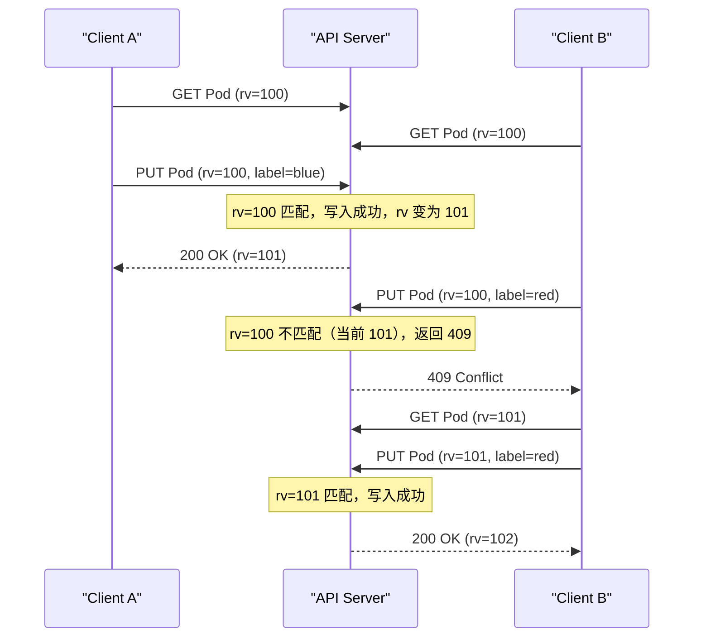
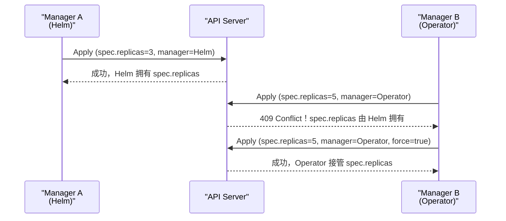

# 08 ResourceVersion 与乐观并发控制

**摘要：**
本文深入 Kubernetes 并发控制的核心机制——ResourceVersion 与乐观并发控制。K8s 没有采用分布式锁，而是基于 etcd 的 ModRevision 实现乐观并发控制（OCC）。文章讲透 ResourceVersion 的本质（etcd ModRevision 的字符串映射）、乐观并发与悲观锁的差异、Read-Modify-Write 三步流程与 409 Conflict 重试、generation 与 observedGeneration 的语义、List-Watch 中的 ResourceVersion 使用、Server-Side Apply 的字段所有权机制、冲突重试退避策略、高频更新对象的分片方案、Status 子资源分离。核心认知：乐观并发控制是 K8s 在高并发分布式环境中的工程权衡——假设冲突很少发生，冲突时重试比持锁等待更高效，但当冲突频率越过阈值，重试成本反超持锁成本，K8s 用分片、子资源分离、本地缓存把冲突频率压在阈值之下。

---

## 第 1 章 ResourceVersion 的本质

理解 K8s 的并发控制，必须从 ResourceVersion 的本质讲起。ResourceVersion 不是 K8s 自己发明的版本号，而是 etcd ModRevision 的一层字符串封装。这个看似简单的映射关系，决定了 K8s 一致性保证的全部底层逻辑——乐观并发控制、List-Watch 协议、对象新鲜度比较，最终都落在 etcd 的 MVCC 版本体系之上。

### 1.1 什么是 ResourceVersion

每个 K8s 对象的 `metadata.resourceVersion` 是一个字符串，标识该对象的版本。这个字段由 API Server 在每次写操作后自动填充，客户端只读不写。

```yaml
apiVersion: apps/v1
kind: Deployment
metadata:
  name: web
  resourceVersion: "12345"  # 这个值是什么？
```

**ResourceVersion 是 etcd ModRevision 的字符串映射**。etcd 中每次写操作生成一个全局单调递增的 revision，ModRevision 是某个 key 最后被修改时的 revision。K8s 把每个对象存储为 etcd 的一个 key，对象的 ResourceVersion 就是这个 key 的 ModRevision 转成字符串。这意味着 ResourceVersion 的生命周期完全由 etcd 驱动——K8s 不主动维护版本号，每次写操作经过 API Server 转发给 etcd，etcd 完成写入后返回新的 ModRevision，API Server 把它填进对象的 metadata.resourceVersion 再返回给客户端。

这个映射关系是理解 K8s 一致性保证的钥匙。K8s 没有自己实现一套版本系统，而是直接复用 etcd 的 MVCC 版本号——版本号的正确性由 etcd 的 Raft 共识保证，单调递增由全局 revision 保证，持久化由 WAL 保证。代价是 K8s 的一致性保证完全绑定在 etcd 上——etcd 故障意味着版本号体系崩溃，这也是为什么 etcd 是 K8s 最重要的单点。

### 1.2 etcd 的版本体系

要理解 ResourceVersion，必须先理解 etcd 的三个版本概念。etcd 的 MVCC（Multi-Version Concurrency Control）维护了三个层次的版本号，它们分别服务于不同的用途。

| 概念 | 说明 | 示例 |
|------|------|------|
| **revision** | 全局单调递增，每次写操作（任何 key）递增 | 1, 2, 3, ... |
| **ModRevision** | key 最后被修改时的 revision | key=A 的 ModRevision=5 |
| **Version** | key 的修改次数（从创建开始计数） | key=A 的 Version=3（被修改了 3 次） |

```
revision=1: PUT key=A value=v1  → A.ModRevision=1, A.Version=1
revision=2: PUT key=B value=v1  → B.ModRevision=2, B.Version=1
revision=3: PUT key=A value=v2  → A.ModRevision=3, A.Version=2
revision=4: PUT key=A value=v3  → A.ModRevision=4, A.Version=3
```

这三个版本概念分别服务于不同用途。revision 是全局单调递增的版本号，每次写操作（无论改哪个 key）都递增——它标记了 etcd 的全局状态版本，相当于 etcd 的"逻辑时钟"。ModRevision 是某个 key 最后被修改时的 revision——它标记了某个 key 的最后修改时间，K8s 的 ResourceVersion 映射的就是这个。Version 是某个 key 的修改次数——它标记了某个 key 被修改了多少次，从创建开始计数，这个概念在 K8s 中很少直接使用。

revision 与 ModRevision 的区别是理解 ResourceVersion 全局性的关键。revision 是全局的——所有 key 共享一个 revision 序列，每次写操作（无论改哪个 key）都让 revision 加一。ModRevision 是 key 级别的——它记录"这个 key 最后一次被修改时的全局 revision"。譬如上面的例子，key=A 的 ModRevision=4，意味着 A 最后一次修改发生在全局 revision=4 时；key=B 的 ModRevision=2，意味着 B 最后一次修改发生在全局 revision=2 时。K8s 的 ResourceVersion 取的是 ModRevision，所以它继承了 revision 的全局单调递增特性——不同对象的 ResourceVersion 可以比较大小，因为它们都来自同一个全局 revision 序列。

### 1.3 ResourceVersion 的全局单调递增

ResourceVersion 的全局单调递增特性，是 etcd MVCC 设计的直接结果。因为 etcd 的 revision 是全局的——所有 key 共享一个 revision 序列——所以每个对象的 ModRevision（也就是 ResourceVersion）都来自这个全局序列，天然具有全局可比性。

> [!info] 核心概念：ResourceVersion 全局单调递增
> ResourceVersion 是 etcd ModRevision 的映射，而 ModRevision 来自全局 revision 序列。这意味着不同资源的 ResourceVersion 可以比较大小——Pod 的 ResourceVersion=100 和 Service 的 ResourceVersion=200，100 < 200 只表示 Pod 的修改比 Service 早，不表示 Pod"比 Service 旧"。理解这个全局性很重要，它使得 K8s 可以用一个 ResourceVersion 标识"整个集群在某个时刻的快照"（List 请求返回的 ResourceVersion），也使得 List-Watch 协议可以用一个版本号衔接 List 与 Watch 两个阶段。

全局单调递增的工程价值体现在 List-Watch 协议中。当客户端执行一次 List 请求，API Server 返回对象列表的同时，还返回一个 List 级别的 ResourceVersion——这个版本号代表"这个快照对应的全局版本"。客户端随后发起 Watch 请求，用这个 ResourceVersion 作为起始点，API Server 就知道从哪个 revision 之后开始推送变更事件。因为 ResourceVersion 是全局的，一个版本号就能标识"整个集群在某个时刻的状态"，不需要为每种资源分别维护版本号。这种"全局版本号衔接 List 与 Watch"的设计，是 K8s List-Watch 协议简洁性的基础。

需要强调的是，ResourceVersion 的全局可比性在语义上并无意义——Pod 的 rv=100 和 Service 的 rv=200 比较，只能得出"Pod 的修改比 Service 早"这个时间顺序结论，不能得出"Pod 比 Service 旧"这种语义结论。但在工程上，这种比较是有用的——譬如判断 Watch 是否错过了事件，譬如判断两个客户端缓存的快照哪个更新。

### 1.4 ResourceVersion 的三个用途

ResourceVersion 在 K8s 中承载三个工程用途，这三个用途共同构成了 K8s 并发控制和一致性保证的基础。

| 用途 | 说明 | 依赖的特性 |
|------|------|-----------|
| **乐观并发控制** | 更新时携带 ResourceVersion，API Server 验证版本匹配才写入 | 单调递增、对象级唯一 |
| **List-Watch 的起始点** | List 返回的 ResourceVersion 作为 Watch 的起始 revision | 全局单调递增 |
| **对象的新鲜度比较** | 同一对象的两个版本，ResourceVersion 大的是更新的 | 单调递增 |

第一个用途是乐观并发控制——客户端更新对象时携带读到的 ResourceVersion，API Server 用它和 etcd 当前的 ModRevision 比较，匹配才允许写入，不匹配返回 409 Conflict。这是本文的核心主题，后续章节详细展开。第二个用途是 List-Watch 的衔接——List 返回的 ResourceVersion 作为 Watch 的起始点，使得客户端可以先 List 建立基线、再 Watch 跟踪增量，两者用同一个版本号衔接。第三个用途是对象新鲜度比较——同一对象的两个版本，ResourceVersion 大的一定是后修改的，客户端可以用它判断缓存是否过期。

这三个用途都依赖 ResourceVersion 的单调递增特性，而单调递增来自 etcd 的全局 revision。K8s 把 etcd 的 MVCC 版本体系"借"过来，用一层字符串封装变成了 ResourceVersion，然后在这层封装之上构建了并发控制、变更监听、新鲜度判断三大能力。理解这层映射，就理解了 K8s 一致性保证的底层逻辑。

---

## 第 2 章 乐观并发控制：为什么 K8s 不用分布式锁

讲透了 ResourceVersion 的本质，接下来要回答一个更根本的问题：K8s 为什么选择乐观并发控制，而不是更直观的悲观锁？这个问题不能从"乐观并发更先进"这种空泛角度回答，而要从 K8s 的具体场景出发——它的访问模式、它的组件构成、它的故障模型，共同决定了悲观锁在这个场景下弊大于利。

### 2.1 悲观锁在分布式环境下的问题

传统并发控制用**悲观锁**（Pessimistic Locking）——操作前先获取锁，操作完释放锁，锁存在期间其他操作阻塞等待。这种模式在单机环境下工作良好，譬如 Java 的 `synchronized`、数据库的行锁，但在分布式环境下会遇到一系列棘手问题。

| 问题 | 说明 |
|------|------|
| **锁持有者故障** | 持锁节点故障，锁无法释放，需要 lease 加 fencing token 兜底 |
| **锁服务单点** | 锁服务自身需要高可用，否则锁服务故障导致全局阻塞 |
| **性能开销** | 每次操作都要获取/释放锁，增加 RTT，降低吞吐 |
| **死锁风险** | 多个组件互相等待对方的锁，需要死锁检测和超时机制 |
| **可扩展性差** | 高并发下锁竞争成为瓶颈，锁成为系统吞吐天花板 |

锁持有者故障是分布式锁最经典的问题。考虑一个场景——控制器 A 获取了 Pod 的锁，准备更新它的 status，这时控制器 A 所在节点崩溃。锁无法释放，其他组件想更新这个 Pod 只能阻塞等待，直到锁超时。这个问题需要 lease（租约）机制兜底——锁带一个 TTL，持锁者定期续租，超时自动释放。但 lease 机制又引入新问题——如果持锁者只是网络分区而非崩溃，lease 超时后锁被释放，另一个组件获取锁，此时原持锁者恢复认为自己还持有锁，两个组件同时操作导致数据损坏。解决这个问题需要 fencing token——每次获取锁带一个单调递增的 token，写操作携带 token，存储层拒绝低 token 的写操作。

锁服务单点是另一个问题。如果用一个独立的锁服务管理 K8s 所有对象的锁，这个锁服务自身需要高可用，否则它故障会导致整个集群无法写操作。K8s 已经有 etcd 作为唯一持久化存储，如果再用 etcd 做锁服务，锁服务和数据服务耦合，故障域重叠；如果引入独立的锁服务，又增加了一个需要高可用的组件，运维复杂度上升。

性能开销是悲观锁在 K8s 场景下的突出问题。K8s 的控制器模式是"读多写少"——控制器频繁读对象（从本地缓存），写操作相对少（只在状态变化时更新）。如果每次写都要先获取锁，锁的 RTT 开销会累积。考虑一个 1000 节点的集群，每秒可能有数百次写操作（Pod status 汇报、Deployment 协调、Service Endpoints 更新），如果每次写都走锁服务，锁服务会成为吞吐瓶颈。

死锁风险在多组件协作场景下不可忽视。K8s 的一个对象可能被多个组件管理——譬如 Deployment 被 Deployment Controller 和 Horizontal Pod Autoscaler 同时关注，Service 被 Service Controller 和 Endpoints Controller 同时更新。如果这些组件用悲观锁，可能出现 A 持有 Deployment 的锁等待 Service 的锁、B 持有 Service 的锁等待 Deployment 的锁，形成死锁。避免死锁需要全局锁排序，但 K8s 的组件是独立部署的，很难强制统一的锁排序规则。

### 2.2 K8s 的场景特点

悲观锁的问题在 K8s 场景下被放大，而 K8s 的场景特点恰好让乐观并发变得合适。

| K8s 场景特点 | 为什么乐观并发合适 |
|------------|-----------------|
| **冲突很少** | 一个对象通常由一个控制器管理，并发更新不多 |
| **读多写少** | 控制器频繁读（从缓存），写相对少，持锁等待不划算 |
| **容忍重试** | Reconcile 可重试，冲突重试不影响正确性 |
| **无死锁** | 不持锁，没有死锁风险，组件可独立部署 |
| **可扩展** | 不需要全局锁服务，etcd CAS 原子操作即可 |

冲突很少是乐观并发高效的前提。乐观并发控制假设"冲突很少发生"——大多数更新不会冲突，无需持锁等待。这个假设在 K8s 中大部分场景成立——一个 Deployment 通常由一个 Deployment Controller 管理，一个 Service 通常由一个 Service Controller 管理，并发更新同一对象的情况不多。即使有多个组件关注同一对象，它们通常关注不同的字段（用户管理 spec、控制器管理 status），通过 Status 子资源分离后不会冲突。对于冲突频繁的场景（如 Endpoints），K8s 用分片（EndpointsSlice）、批量更新、本地缓存等手段降低冲突频率，把冲突频率压在乐观并发高效的阈值之下。

读多写少是 K8s 控制器模式的固有特征。控制器的 Reconcile 循环每次执行时，先读取对象当前状态（通常从 Informer 的本地缓存读，不访问 API Server），比较期望状态与实际状态，只在状态不一致时才写。这意味着读操作远多于写操作。悲观锁在"读多写少"场景下不划算——写操作持锁，每次都要等锁，延迟增加。乐观并发在"读多写少"场景下高效——读操作无锁，写操作用 CAS 验证，大多数写不冲突直接成功。

容忍重试是 K8s 声明式 API 的特性。控制器的 Reconcile 是幂等的——执行多次和执行一次效果相同，因为它是"比较期望状态与实际状态，使之一致"的逻辑。这意味着冲突重试不影响正确性——重试不需要回滚已做的操作，只需要重新读取最新状态再试一次。

无死锁是乐观并发的结构性优势。乐观并发不持锁，所以不存在"互相等待对方锁"的死锁问题。这在 K8s 的多组件协作场景下尤为重要——组件可以独立部署、独立升级，不需要协调锁的获取顺序。乐观并发用"不持锁"避开了整个死锁问题域，代价是冲突时重试。

可扩展性是乐观并发在大规模集群下的优势。悲观锁需要锁服务，锁服务的吞吐是系统天花板。乐观并发不需要锁服务——etcd 的 CAS 是原子的单次事务，不需要额外的锁协调。etcd 的吞吐就是乐观并发的吞吐上限，可以通过 Raft 批量提交、Pipeline 复制等优化提升。这意味着乐观并发的可扩展性直接绑定 etcd 的可扩展性。

### 2.3 乐观并发控制的思路

**乐观并发控制**（Optimistic Concurrency Control，OCC）的思路是"先操作，提交时验证，冲突时重试"。它不持锁，操作前读版本，操作时验证版本未变，变了就重试。这个思路与悲观锁的"先持锁，再操作，后释放"形成鲜明对比。



这个时序图展示了乐观并发的典型流程。Client A 和 Client B 同时读取了 Pod（rv=100），各自在本地修改。Client A 先提交，携带 rv=100，API Server 验证当前 rv 仍是 100，匹配，写入成功，rv 变为 101。Client B 随后提交，携带 rv=100，API Server 验证当前 rv 是 101，不匹配，返回 409 Conflict。Client B 收到 409 后，重新读取 Pod（rv=101），基于最新状态重新修改，再次提交（rv=101），这次匹配，写入成功。

这个流程的关键在于"验证版本未变"——只有先提交的 A 成功，后提交的 B 被拒绝。这保证了"后提交者感知到先提交者的变更"——B 的重试基于 A 提交后的最新状态，不会覆盖 A 的修改。这种"后提交者重试"的机制是乐观并发正确性的基础，它避免了"丢失更新"（lost update）问题。

---

## 第 3 章 乐观并发三步流程：Read-Modify-Write 与 409 Conflict

理解了乐观并发的思路，接下来拆解它的具体流程。K8s 的乐观并发控制遵循一个固定的三步模式——Read-Modify-Write，每一步都有明确的语义和边界。

| 步骤 | 操作 | 说明 |
|------|------|------|
| **Read** | `GET /api/v1/pods/web` | 获取对象和 ResourceVersion |
| **Modify** | 在本地修改对象 | 修改 label/spec 等，不涉及 API Server |
| **Write** | `PUT /api/v1/pods/web`（携带 ResourceVersion） | API Server 验证 rv 匹配才写入 |

Read 阶段读取对象和它的 ResourceVersion。这一步的关键是"读到的 ResourceVersion 只在本次 Read-Modify-Write 中有效"——它代表"读取时刻"的对象版本，不能跨多次 Read 复用。如果客户端缓存了 ResourceVersion，过了一段时间再用它更新，期间对象可能已被其他组件修改，版本号过期，更新必然冲突。正确的做法是每次更新前重新读取最新状态，拿到最新的 ResourceVersion，再修改再提交。client-go 的 `retry.RetryOnConflict` 正是这么做的——每次重试都重新 GET 对象。

Modify 阶段在本地修改对象，不涉及 API Server。这一步的工程要点是"修改基于 Read 读到的完整对象，而非部分字段"。如果客户端只读了对象的部分字段，修改后用 PUT 全量提交，未读的字段会被覆盖为空。这就是为什么 K8s 的 PUT 是全量更新——客户端必须提交完整对象，API Server 用它整体替换 etcd 中的旧值。如果只想更新部分字段，应该用 PATCH（局部更新），而非 PUT（全量更新）。

Write 阶段提交更新，携带 Read 时读到的 ResourceVersion。API Server 收到请求后，把客户端携带的 ResourceVersion 与 etcd 当前的 ModRevision 比较，匹配才允许写入，不匹配返回 409 Conflict。这一步的"验证版本匹配"是乐观并发正确性的核心——它保证了"基于版本 N 修改的写入，只有当对象当前版本仍是 N 时才成功"，从而避免了丢失更新。

### 3.2 409 Conflict 的语义

当 ResourceVersion 不匹配时，API Server 返回 **409 Conflict** 状态码。这个状态码携带了具体的冲突信息，客户端用它决定如何重试。

```json
{
  "kind": "Status",
  "apiVersion": "v1",
  "status": "Failure",
  "message": "Operation cannot be fulfilled on deployments.apps \"web\": the object has been modified; please apply your changes to the latest version and try again",
  "reason": "Conflict",
  "code": 409
}
```

409 Conflict 的语义是"对象已被修改，请基于最新版本重试"。它不是错误，而是乐观并发的正常流程——冲突发生时，API Server 拒绝写入，告诉客户端"你基于的版本过期了，重新读取再试"。这种"冲突即重试"的模式是乐观并发控制的核心特征，与悲观锁的"冲突即等待"形成对比。

409 Conflict 与其他错误状态码的区别值得注意。404 Not Found 表示对象不存在，403 Forbidden 表示权限不足，422 Unprocessable Entity 表示请求格式错误——这些重试无意义。只有 409 Conflict 是"重试有意义"的——重新读取最新状态，基于最新状态重试，可能成功。client-go 的 `retry.RetryOnConflict` 只对 409 Conflict 重试，对其他错误直接返回。

### 3.3 冲突重试的正确姿势

冲突重试的正确姿势是"重新 Read，基于最新状态 Modify，再 Write"。错误的姿势是"用旧的 ResourceVersion 反复重试 Write"——版本号已过期，重试必然失败，形成无限循环。

正确姿势的关键是"每次重试都重新 GET"。`retry.RetryOnConflict` 的回调函数中，第一步是 `client.Get` 重新读取最新对象，拿到最新的 ResourceVersion，然后基于最新状态修改，再提交。这样每次重试都基于最新版本，只要冲突不再持续，最终会成功。错误姿势的问题是"用旧版本反复提交"——ResourceVersion 已过期，etcd 的 ModRevision 已前进，每次提交都不匹配，形成无限循环。

> [!warning] 生产避坑：ResourceVersion 只在单次 Read-Modify-Write 中有效
> ResourceVersion 代表"读取时刻"的对象版本，不能跨多次 Read 复用。如果控制器在 Reconcile 开始时读取对象，处理了很久（譬如等待 Pod 调度），然后用开始时的 ResourceVersion 更新，期间对象可能已被其他组件修改，更新必然 409。正确做法是每次更新前重新读取最新状态。不要在控制器中缓存 ResourceVersion 跨多次 Reconcile 使用——每次 Reconcile 都应重新读取。

---

## 第 4 章 etcd CAS：乐观并发的底层实现

K8s 的乐观并发控制在 API Server 层面表现为"验证 ResourceVersion 匹配"，但在底层，这个验证是 etcd 的 CAS（Compare-And-Swap）事务。理解 etcd CAS 的实现，才能理解乐观并发为什么是原子的——为什么"验证版本"和"写入"之间不会被打断。

### 4.1 etcd 的事务接口

etcd 提供了 **Txn（Transaction）** 接口，支持原子的"条件-操作"组合。一个 Txn 包含三部分——If（条件）、Then（条件成立时执行）、Else（条件不成立时执行），整个事务原子执行。

```go
// etcd Txn 的结构
resp, err := clientv3.Txn(ctx).
    If(条件...).       // Compare：比较 key 的 ModRevision/CreateRevision/Version/Value
    Then(操作...).     // OpPut/OpDelete/OpGet
    Else(操作...).     // 条件不成立时执行
    Commit()
```

etcd Txn 的条件比较支持四种 key 属性——ModRevision（最后修改版本）、CreateRevision（创建版本）、Version（修改次数）、Value（值）。K8s 的乐观并发控制用 ModRevision 比较——"如果 key 的 ModRevision 等于客户端期望的值，则写入新值"。这个比较和写入在 etcd 内部是原子的——Raft 保证整个 Txn 作为一个日志条目提交，要么全部成功，要么全部失败，不存在"比较成功但写入前被其他操作打断"的中间状态。

### 4.2 API Server 的更新逻辑

API Server 收到客户端的更新请求后，把它翻译成 etcd 的 CAS 事务。这个过程的核心是"把 ResourceVersion 翻译成 ModRevision，把更新翻译成 OpPut"。

```go
// 伪代码：API Server 的更新逻辑
func UpdateObject(key string, newValue Object, expectedRV int64) error {
    // etcd 的事务：如果 ModRevision == expectedRV，则写入
    resp, err := etcd.Txn(ctx).
        If(clientv3.Compare(clientv3.ModRevision(key), "=", expectedRV)).
        Then(clientv3.OpPut(key, serialize(newValue))).
        Else().
        Commit()

    if !resp.Succeeded {
        return errors.NewConflict("resourceVersion mismatch")
    }
    return nil
}
```

这段伪代码展示了 API Server 更新对象的核心逻辑。客户端携带的 ResourceVersion 被解析成 int64 类型的 expectedRV，然后构造 etcd Txn——If 条件是"key 的 ModRevision 等于 expectedRV"，Then 操作是"写入新值"。Txn 提交后，如果 `resp.Succeeded` 为 true，表示条件成立，写入成功；如果为 false，表示条件不成立（ModRevision 已变化），返回 409 Conflict。

这个过程的原子性由 etcd 的 Raft 保证。整个 Txn 作为一个日志条目提交到 Raft，Leader 复制到多数 Followers，commit 后应用到状态机。在应用状态机时，etcd 先检查 If 条件，条件成立才执行 Then，否则执行 Else。这个检查和执行在 etcd 的状态机应用层是原子的——状态机应用一个日志条目期间不会被打断。因此，"验证 ModRevision"和"写入新值"之间不存在时间窗口，不可能被其他操作插入，保证了乐观并发的原子性。

### 4.3 CAS 与悲观锁的原子性对比

CAS 的原子性与悲观锁的原子性来源不同，理解这个差异有助于理解乐观并发为什么不需要锁。

悲观锁的原子性来自"锁的互斥"——获取锁后，其他操作无法介入，验证和写入在锁的保护下原子执行。这种原子性的代价是"锁的获取和释放需要额外开销"，以及"持锁期间其他操作阻塞"。

CAS 的原子性来自"事务的原子应用"——条件验证和写入被封装在一个 Txn 中，etcd 的状态机原子应用这个 Txn，验证和写入之间没有时间窗口。这种原子性不需要锁——Txn 的原子性由 Raft 的日志应用保证，状态机应用一个日志条目是原子的。因此，CAS 不需要获取/释放锁，不需要阻塞其他操作，只需要一次 Txn 提交。

这种"原子性来源"的差异决定了两种方案的适用场景。悲观锁适合"持锁时间长、冲突频繁"的场景——锁的获取开销分摊到长时间操作中，冲突时等待比重试高效。CAS 适合"操作短、冲突很少"的场景——一次 Txn 提交就完成验证和写入，冲突时重试比持锁等待高效。K8s 的场景属于后者——对象的更新操作很短（一次 etcd 写入），冲突很少（一个对象通常由一个控制器管理），所以 CAS 更合适。

### 4.4 ResourceVersion 未设置时的行为

如果客户端更新时不携带 ResourceVersion，API Server 的行为取决于操作类型。对于 PUT（全量更新），不携带 ResourceVersion 表示"不验证版本，直接覆盖"——这是危险的，可能丢失其他组件的更新。对于 PATCH（局部更新），不携带 ResourceVersion 表示"不验证版本，直接 patch"——同样可能丢失更新。

实际工程中，client-go 的 `client.Update` 会自动携带对象的 ResourceVersion（从 GET 读到的对象中取），所以正常使用 client-go 的开发者不需要手动处理 ResourceVersion。但如果直接构造 HTTP 请求，必须手动携带 ResourceVersion，否则会丢失并发安全保证。这是"不要绕过 client-go 直接构造请求"的原因之一——client-go 封装了乐观并发的正确姿势。

---

## 第 5 章 generation 与 observedGeneration：控制器的进度汇报

ResourceVersion 是对象级别的版本号，每次写操作（无论改 spec 还是 status）都递增。但 K8s 还需要一种更细粒度的版本号——只跟踪 spec 的变更，忽略 status 的变更。这就是 generation。generation 与 observedGeneration 的配合，构成了 K8s 控制器进度汇报的机制——用户修改 spec，generation 递增；控制器处理 spec 变更，更新 observedGeneration；两者比较，衡量控制器是否跟上了用户的变更。

### 5.1 generation：spec 的变更计数

**generation** 是 ObjectMeta 中的字段，只在 **spec 部分被修改**时递增。status 变更不递增 generation，metadata 的部分变更（譬如 label、annotation）也不递增 generation。

```yaml
metadata:
  generation: 5  # spec 被修改了 5 次
spec:
  replicas: 3    # 用户修改 replicas，generation +1
status:
  replicas: 3    # 控制器更新 status，generation 不变
```

generation 的设计动机是区分"用户意图的变更"和"控制器状态的汇报"。用户修改 spec 表示"我期望集群达到这个状态"，这是需要控制器处理的变更。控制器更新 status 表示"我观察到集群当前是这个状态"，这是状态汇报，不是用户意图的变更。如果用 ResourceVersion 衡量控制器进度，status 更新也会让 ResourceVersion 递增，导致"控制器自己更新 status 也算作用户变更"的混淆。generation 把 spec 变更和 status 变更分开——只有 spec 变更才递增 generation，status 变更不递增，这样 generation 就纯粹反映"用户意图变更了几次"。

generation 的递增规则有几个细节：只有 spec 部分变更才递增（修改 label/annotation 不递增）；创建对象时 generation=1；generation 计数的是"修改动作"而非"修改结果"（改回原值仍递增）；只有包含 spec 的资源（如 Deployment、StatefulSet）才有 generation，不含 spec 的资源（如 ConfigMap、Secret）没有这个字段。

### 5.2 observedGeneration：控制器的进度汇报

**observedGeneration** 是 Status 中的字段，控制器汇报"我已处理到 spec 的第几次变更"。它由控制器在 Reconcile 后更新，表示"我已看到并处理了 generation=N 的 spec"。

```yaml
spec:
  # ... 用户的期望 ...
status:
  observedGeneration: 5  # 控制器已处理到 generation=5
```

observedGeneration 的语义是"控制器已观察到的 generation"。它不是"控制器已完成的 generation"，而是"控制器已看到的 generation"——控制器在 Reconcile 开始时读取对象的 generation，处理完后把 observedGeneration 设为这个值。这意味着 observedGeneration 落后于 generation 时，控制器还没处理用户的最新变更；observedGeneration 等于 generation 时，控制器已处理用户的最新变更（但不一定已完成，譬如滚动更新可能还在进行）。

### 5.3 generation 与 observedGeneration 的比较

generation 与 observedGeneration 的比较，是判断控制器进度的关键指标。这个比较在 kubectl 和自动化运维工具中广泛使用。

| 场景 | generation | observedGeneration | 含义 |
|------|-----------|-------------------|------|
| 用户刚修改 spec，控制器还没处理 | 6 | 5 | 控制器落后 1 步，显示 Progressing |
| 控制器已处理最新 spec | 6 | 6 | 状态一致，但可能还在执行 |
| 控制器崩溃后重启 | 6 | 5 | 重启后需追赶，显示 Progressing |
| 控制器处理失败 | 6 | 5 | 持续落后，需要排查 |

> [!info] 核心概念：generation 和 observedGeneration 衡量控制器进度
> 当 `observedGeneration < generation` 时，表示用户修改了 spec 但控制器还没处理——kubectl 显示 "Progressing" 状态。控制器在 Reconcile 后更新 observedGeneration = generation，表示"我已看到并处理了用户的最新变更"。这是判断"控制器是否已处理用户最新变更"的关键指标。如果你在等待 Deployment 滚动更新完成，检查 `observedGeneration == generation` 且 `updatedReplicas == replicas`——两个条件都满足才算完成。

这个比较的工程价值体现在自动化运维中。譬如一个 CI/CD 流水线更新 Deployment 的镜像后，需要等待滚动更新完成再推进下一步。如何判断"完成"？只看 `availableReplicas == replicas` 不够——如果控制器还没处理新 spec（observedGeneration < generation），availableReplicas 可能还是旧 spec 的值。正确的判断是"observedGeneration == generation 且 availableReplicas == replicas"——前者确保控制器已处理新 spec，后者确保新 spec 的副本已就绪。这种"双条件判断"是 K8s 控制器进度汇报的标准用法。

### 5.4 控制器的正确实现

控制器的 Reconcile 中必须正确更新 observedGeneration，否则会误导用户判断控制器进度。

```go
// 伪代码：控制器 Reconcile 中正确更新 observedGeneration
func Reconcile(deployment *appsv1.Deployment) error {
    // 1. 检查 observedGeneration 是否落后
    if deployment.Status.ObservedGeneration < deployment.Generation {
        // 用户修改了 spec，需要处理
        // ... 执行协调逻辑（创建/更新 ReplicaSet）...
    }

    // 2. 更新 status，包含 observedGeneration
    deployment.Status.ObservedGeneration = deployment.Generation
    deployment.Status.ReadyReplicas = currentReadyReplicas
    deployment.Status.UpdatedReplicas = currentUpdatedReplicas

    // 3. 用 Status().Update() 更新（携带 ResourceVersion 做乐观并发）
    return client.Status().Update(ctx, deployment)
}
```

这段伪代码展示了控制器 Reconcile 中更新 observedGeneration 的正确逻辑。第一步检查 observedGeneration 是否落后于 generation，如果落后，执行协调逻辑（譬如创建新的 ReplicaSet）。第二步更新 status，把 observedGeneration 设为当前的 generation，表示"我已处理到这个 generation"。第三步用 `Status().Update()` 更新 status——注意是 `Status().Update()` 而非 `Update()`，这涉及 Status 子资源的分离，后续章节详细讨论。

> [!warning] 生产避坑：控制器必须更新 observedGeneration
> 如果控制器处理了 spec 变更但不更新 observedGeneration，kubectl 会一直显示 "Progressing"——因为 observedGeneration < generation。这会误导用户以为滚动更新还没完成，可能触发不必要的告警或人工干预。正确做法：Reconcile 完成后，将 observedGeneration 设为 generation。这是控制器实现的必备逻辑——controller-runtime 的 Reconcile 函数中应显式更新 observedGeneration。如果用 controller-runtime 的 builder，可以通过 `controller.Watch` 配合 `EnqueueRequestForGenerationChange` 过滤无关变更，但 observedGeneration 的更新仍需在 Reconcile 中手动处理。

### 5.5 observedGeneration 与 ResourceVersion 的关系

observedGeneration 与 ResourceVersion 是两个不同层次的版本号，理解它们的区别和联系，有助于避免混淆。

ResourceVersion 是对象级别的版本号，每次写操作（无论改 spec 还是 status）都递增，它来自 etcd 的 ModRevision，用于乐观并发控制。generation 是 spec 级别的版本号，只在 spec 变更时递增，它由 API Server 维护，用于跟踪用户意图的变更。observedGeneration 是控制器汇报的"已处理的 generation"，它由控制器维护，用于衡量控制器进度。

三者的关系可以这样理解——ResourceVersion 是"物理版本号"，反映对象的每次修改；generation 是"逻辑版本号"，反映用户意图的变更；observedGeneration 是"消费进度"，反映控制器跟上了多少逻辑变更。一个对象的 ResourceVersion 可能远大于 generation——因为 status 更新、label 修改都让 ResourceVersion 递增，但不让 generation 递增。譬如一个 Deployment 被创建（generation=1，rv=100），用户修改 replicas（generation=2，rv=101），控制器更新 status（generation=2，rv=102），用户修改 image（generation=3，rv=104）——generation 从 1 到 3，但 ResourceVersion 从 100 到 104，中间的 102 是 status 更新，不影响 generation。

---

## 第 6 章 List-Watch 中的 ResourceVersion：从快照到增量

ResourceVersion 在 List-Watch 协议中扮演关键角色——它衔接 List 与 Watch 两个阶段，使得客户端可以先 List 建立基线、再 Watch 跟踪增量，两者用同一个版本号无缝衔接。

### 6.1 List 返回的 ResourceVersion

List 请求返回的不仅是对象列表，还有一个 **List 的 ResourceVersion**——表示"这个快照对应的全局版本"。

```json
{
  "apiVersion": "v1",
  "kind": "PodList",
  "metadata": {
    "resourceVersion": "12345"
  },
  "items": [
    {"metadata": {"name": "web-1", "resourceVersion": "12340"}},
    {"metadata": {"name": "web-2", "resourceVersion": "12342"}}
  ]
}
```

List 的 ResourceVersion（12345）是全局版本，不是某个对象的版本。它表示"这个快照对应的全局 revision=12345"——即"当 etcd 的全局 revision 到达 12345 时，集群中这些 Pod 的状态如 items 所示"。items 中每个对象有自己的 ResourceVersion（12340、12342），这些是对象级别的版本号，表示每个对象最后修改时的全局 revision。

List 的 ResourceVersion 通常大于或等于所有 items 的 ResourceVersion——因为 List 的 ResourceVersion 是"快照时刻"的全局版本，而 items 的 ResourceVersion 是"对象最后修改时"的全局版本，快照时刻可能晚于对象最后修改时刻。譬如 web-1 在 revision=12340 修改，web-2 在 revision=12342 修改，之后 revision=12343 到 12345 可能是其他资源（如 Service）的修改，不影响这两个 Pod，所以 List 快照在 revision=12345 时，items 的 ResourceVersion 仍是 12340 和 12342。

### 6.2 Watch 的起始 ResourceVersion

Watch 请求用 List 返回的 ResourceVersion 作为起始点——从该版本之后开始监听变更。

```
GET /api/v1/pods?watch=true&resourceVersion=12345
→ 推送 revision > 12345 的所有变更事件
```

Watch 的起始 ResourceVersion 是"从哪个 revision 之后开始推送"。如果客户端用 List 返回的 12345 作为 Watch 起点，API Server 推送 revision > 12345 的所有变更——即 List 快照之后的所有变更。这样，客户端的状态是"List 快照（revision=12345）+ Watch 增量（revision > 12345）"，覆盖了从快照时刻到当前的所有变更，不会遗漏。

这种"List 建立基线、Watch 跟踪增量"的设计，是 List-Watch 协议的核心。List 提供全量快照，Watch 提供增量变更，两者用 ResourceVersion 衔接——List 返回的 ResourceVersion 是 Watch 的起始点。如果只有 List 没有 Watch，客户端无法感知 List 之后的变更；如果只有 Watch 没有 List，客户端无法建立初始状态。List-Watch 的组合保证了客户端既能建立初始状态，又能跟踪后续变更。

### 6.3 Bookmark 事件

Watch 连接长时间运行时，起始 ResourceVersion 会越来越旧。如果这个 revision 被 etcd 压缩（compaction），Watch 会失败，客户端需要重新 List。为了避免频繁的重新 List，K8s 引入了 **Bookmark 事件**。

```json
{
  "type": "BOOKMARK",
  "object": {
    "apiVersion": "v1",
    "kind": "Pod",
    "metadata": {
      "resourceVersion": "13000"
    }
  }
}
```

Bookmark 事件是一种特殊的 Watch 事件，它不携带对象变更，只携带一个最新的 ResourceVersion。客户端收到 Bookmark 后，更新自己保存的"最后看到的 ResourceVersion"，这样即使 Watch 连接断开，重新 Watch 时也可以用较新的 ResourceVersion 作为起点，减少重新 Watch 的数据量。

Bookmark 事件的推送频率由 API Server 的 `--default-watch-cache-size` 和资源类型决定。对于高频变更的资源，Bookmark 推送更频繁；对于低频变更的资源，Bookmark 推送较少。Bookmark 的设计动机是"减少 Watch 断连后的恢复成本"——如果没有 Bookmark，客户端保存的 ResourceVersion 一直停留在 List 时的值，几小时后这个 revision 可能已被压缩，Watch 断连后必须重新 List 全量数据。有了 Bookmark，客户端的 ResourceVersion 定期更新，Watch 断连后可以用较新的 revision 重新 Watch，减少数据传输。

### 6.4 ResourceVersion 的特殊值

ResourceVersion 在 List 和 Watch 请求中有几个特殊值，它们的语义不同于普通版本号。

| 值 | 用于 List | 用于 Watch |
|----|---------|----------|
| `0` | 从缓存最新版本返回（不查 etcd） | 从缓存最新版本开始 Watch |
| 未设置 | 从 etcd 读取最新版本（严格一致） | 从最新版本开始 Watch（只看后续） |
| 具体值 | 返回该版本对应的快照（可能已过期） | 从该版本之后开始 Watch |

ResourceVersion=0 的语义最容易误解。它不是"从版本 0 开始"，而是"从 API Server 缓存的最新版本开始"。这使得 List 可以从 Watch Cache 快速返回，不查 etcd，延迟低、负载小。如果需要严格一致性（确保读到 etcd 的最新数据），不设置 ResourceVersion（或设置 `resourceVersion=<具体版本>`），API Server 会从 etcd 读取。

> [!info] 核心概念：ResourceVersion=0 表示"从缓存最新版本开始"
> List 请求中 `resourceVersion=0` 不是"从版本 0 开始"——它表示"从 API Server 缓存的最新版本开始"。这使得 List 可以从 Watch Cache 快速返回，不查 etcd。如果需要严格一致性，用 `resourceVersion=<具体版本>` 或不设置 resourceVersion（从 etcd 读取）。理解 `resourceVersion=0` 的语义对性能优化很重要——Informer 初始化时的 List 用 `resourceVersion=0` 从缓存快速获取快照，避免给 etcd 造成压力。

### 6.5 ResourceVersion 与一致性语义

ResourceVersion 的不同取值对应不同的一致性语义，理解这个对应关系，才能在性能与一致性之间做正确权衡。

List rv=0 读 Watch Cache，速度快，但 Watch Cache 可能略微落后于 etcd（毫秒级延迟），不是严格一致。List rv 未设置读 etcd，严格一致，但每次读都走 etcd，延迟高、负载大。List rv=具体值读 etcd 的历史版本，如果该版本已被压缩，返回错误；如果未压缩，返回该版本的快照，可能已过期。

Informer 初始化时用 List rv=0——从 Watch Cache 快速获取快照，建立本地缓存，然后用 List 返回的 ResourceVersion 开始 Watch。这种"缓存快照加增量 Watch"的组合，既快又最终一致——初始快照可能略微落后，但 Watch 会推送后续变更，最终收敛到最新状态。对于需要严格一致的场景（譬如读后写，确保读到最新数据再修改），应该用 List rv 未设置（读 etcd），而非 List rv=0（读缓存）。

---

## 第 7 章 Server-Side Apply：字段所有权与冲突协调

传统的 `kubectl apply` 是客户端操作——kubectl 读取当前状态，与本地 YAML 对比计算 diff，生成 PATCH 提交。这种模式在多组件管理同一对象时会出现"丢失更新"问题。K8s 1.18 引入的 Server-Side Apply（SSA）通过字段所有权机制解决了这个问题。

### 7.1 传统 Apply 的问题

传统 `kubectl apply` 是客户端侧的 Last-Write-Wins——kubectl 读取当前对象，与本地 YAML 对比，计算 diff，生成 PATCH 提交。这种模式在多组件管理同一对象时会出现问题。

| 问题 | 说明 |
|------|------|
| **冲突丢失** | 多个组件管理同一对象时，后写者覆盖先写者的变更 |
| **全量 vs 局部** | PUT 全量更新可能覆盖其他组件管理的字段 |
| **无法跟踪字段所有权** | 谁管理哪个字段不明确，冲突时无法智能协调 |

冲突丢失是传统 Apply 的核心问题。考虑一个场景——Helm 部署了一个 Deployment，管理 `spec.replicas`；同时一个 HPA（Horizontal Pod Autoscaler）也管理这个 Deployment 的 `spec.replicas`。Helm 执行 apply 时设置 replicas=3，HPA 执行 apply 时设置 replicas=5。如果两者用传统 Apply，后执行者覆盖先执行者——譬如 Helm 先设 replicas=3，HPA 后设 replicas=5，Helm 的设置被覆盖。更糟的是，HPA 下次扩容时可能又被 Helm 的 apply 覆盖，导致 HPA 失效。

无法跟踪字段所有权是传统 Apply 的结构性缺陷。传统 Apply 不记录"谁管理哪个字段"，冲突时只能 Last-Write-Wins，无法智能协调。

### 7.2 Server-Side Apply 的字段所有权

**Server-Side Apply**（SSA）引入**字段所有权**——每个字段记录"谁管理这个字段"，冲突时 API Server 智能合并或报错。SSA 把"计算 diff 和生成 PATCH"从客户端移到服务端，API Server 负责跟踪字段所有权。对象的 `metadata.managedFields` 记录了每个字段的管理者（manager）、操作类型（operation）和管理的字段列表（fieldsV1）——譬如 `spec.replicas` 由 `kubectl-client-side-apply` 管理，`status.readyReplicas` 由 `controller-manager` 管理。当另一个 manager 试图修改 `spec.replicas` 时，API Server 检测到冲突，返回 409。

manager 的标识由客户端的 `User-Agent` 或 `fieldManager` 参数决定。kubectl 默认用 `kubectl-client-side-apply` 作为 manager，controller 默认用控制器的名称。如果两个组件用相同的 manager 名，它们被视为同一个管理者，不会冲突。

### 7.3 SSA 的冲突处理

当两个 manager 试图管理同一字段时，SSA 返回 409 Conflict，提示用户"字段已被其他 manager 管理"。



这个时序图展示了 SSA 的冲突处理流程。Manager A（Helm）先 Apply，设置 spec.replicas=3，API Server 记录"Helm 拥有 spec.replicas"。Manager B（Operator）后 Apply，设置 spec.replicas=5，API Server 检测到 spec.replicas 已由 Helm 拥有，返回 409 Conflict。Manager B 收到 409 后，可以选择 force=true 强制接管——API Server 把 spec.replicas 的所有权从 Helm 转移给 Operator，写入 replicas=5。之后如果 Helm 再次 Apply（不 force），也会收到 409——所有权已在 Operator 手中。

| SSA 特性 | 说明 |
|---------|------|
| **字段所有权** | 每个字段记录管理者（manager） |
| **冲突检测** | 两个 manager 试图管理同一字段时返回 409 |
| **强制覆盖** | `force: true` 强制接管字段所有权 |
| **三方合并** | 基于 managedFields 智能合并，不丢失非冲突字段 |

三方合并是 SSA 的另一个重要特性。当 Manager A Apply 时，它只声明自己管理的字段，不触碰其他 manager 管理的字段。譬如 Helm Apply 声明管理 spec.replicas 和 spec.template，不触碰 status（由 controller-manager 管理）。这种"只管自己的字段"的合并策略，使得多个 manager 可以共存——每个 manager 管理自己的字段，互不干扰，只有当两个 manager 试图管理同一字段时才冲突。

> [!info] 核心概念：SSA 是多组件协作的正确方式
> 在多个组件（如 Helm + Operator + kubectl）管理同一对象的场景中，传统 Apply 的 Last-Write-Wins 会丢失变更。SSA 的字段所有权跟踪使得每个组件管理自己的字段，冲突时明确报错而非静默覆盖。对于有多管理者的场景，SSA 是推荐的方式。`kubectl apply --server-side` 启用 SSA。

### 7.4 SSA 与乐观并发控制的关系

SSA 与乐观并发控制不是替代关系，而是互补关系。SSA 是"字段级别的冲突协调"，乐观并发是"对象级别的版本验证"。SSA 的 Apply 请求仍然携带 ResourceVersion 做乐观并发验证——如果对象在 Apply 期间被其他操作修改，ResourceVersion 不匹配，Apply 返回 409。但 SSA 的 409 有两种来源——ResourceVersion 不匹配（版本冲突）和字段所有权冲突（字段被其他 manager 占用），客户端需要区分处理。

SSA 的冲突重试逻辑比普通更新复杂。普通更新的重试是"重新 Read，基于最新状态 Modify，再 Write"。SSA 的重试需要考虑字段所有权——如果冲突来自字段所有权（其他 manager 占用字段），重试时需要决定是 force 接管还是放弃；如果冲突来自 ResourceVersion（对象被修改），重试时重新 Apply 即可。client-go 的 `apply.Apply` 方法封装了这些逻辑，开发者通常不需要手动处理。

---

## 第 8 章 冲突重试的工程实践

乐观并发控制在冲突时需要重试，重试的姿势直接影响系统的稳定性和性能。本章讲透 client-go 提供的 `retry.RetryOnConflict` 工具函数、重试的退避策略、重试上限的设置，以及控制器中冲突重试与 WorkQueue 的配合。

### 8.1 client-go 的 RetryOnConflict

client-go 提供了 `retry.RetryOnConflict` 工具函数，自动处理乐观并发的冲突重试。它封装了"重新 Read、Modify、Write、冲突时重试"的正确姿势，开发者只需要提供回调函数。

```go
err = retry.RetryOnConflict(retry.DefaultRetry, func() error {
    // 1. 读取最新版本（每次重试都重新读）
    if err := client.Get(ctx, key, &obj); err != nil {
        return err
    }
    // 2. 修改
    obj.Spec.Replicas = newReplicas
    // 3. 更新（可能冲突）
    return client.Update(ctx, &obj)
})
```

`RetryOnConflict` 的回调函数中，第一步是 `client.Get` 重新读取最新对象——这一步在每次重试时都执行，确保基于最新状态修改。第二步修改对象的字段。第三步调用 `client.Update` 提交——如果冲突（409），`RetryOnConflict` 自动重试，重新执行回调函数。如果回调函数返回非 409 错误（譬如 403 Forbidden），`RetryOnConflict` 直接返回，不重试。

`RetryOnConflict` 的正确性依赖于回调函数的"每次都重新 Get"。如果回调函数只 Get 一次，后续重试复用旧对象，ResourceVersion 过期，必然 409，形成无限循环。所以回调函数中 `client.Get` 必须在回调内部（而非外部），确保每次重试都重新读取。

### 8.2 重试的退避策略

`retry.DefaultRetry` 定义了重试的退避策略——指数退避，避免在冲突频繁时压垮 API Server。

| 重试次数 | 退避时间 | 说明 |
|---------|---------|------|
| 1 | 10ms | 立即重试 |
| 2 | 20ms | 短退避 |
| 3 | 40ms | 指数退避 |
| 4 | 80ms | 指数退避 |
| 5 | 100ms | 达到上限 |
| 6 | 放弃 | 返回错误 |

退避策略的设计动机是"冲突时给系统喘息时间"。如果两个控制器频繁更新同一对象，立即重试会加剧冲突——两个控制器同时重试，又同时冲突。指数退避让重试间隔逐渐增大，给冲突源（其他控制器）时间完成更新，降低再次冲突的概率。退避时间的上限是 100ms，对于冲突极其频繁的场景可以自定义退避策略，但通常 `retry.DefaultRetry` 足够。

### 8.3 重试上限与 WorkQueue 的配合

`RetryOnConflict` 最多重试 5 次，之后返回错误。这个上限是必要的——如果冲突持续发生（譬如两个控制器频繁更新同一对象），无限重试会消耗 CPU 和 API Server 带宽。

> [!warning] 生产避坑：冲突重试不要无限重试
> 如果冲突持续发生（如两个控制器频繁更新同一对象），无限重试会消耗 CPU 和 API Server 带宽。`retry.DefaultRetry` 最多重试 5 次，之后返回错误。控制器应将错误返回 WorkQueue，由 WorkQueue 的延迟重试机制处理。不要在 Reconcile 中自己实现无限重试循环——这会阻塞 WorkQueue 的其他项。

WorkQueue 的延迟重试机制是控制器处理"持续冲突"的正确方式。`RetryOnConflict` 5 次后返回错误，Reconcile 把错误返回给 WorkQueue，WorkQueue 把这个项放入延迟队列，一段时间后重新入队，Reconcile 再次执行。这种"RetryOnConflict 短期重试 + WorkQueue 长期重试"的两层重试机制，既保证了短期冲突的快速恢复，又避免了长期冲突的无限循环。WorkQueue 的延迟重试策略也是指数退避——第一次重试延迟 5ms，之后每次翻倍，上限 1000s。这种"短期重试快速、长期重试慢速"的策略，使得短期冲突能快速恢复，长期冲突不会压垮系统。

### 8.4 自定义重试策略

对于特殊场景，可以自定义 `RetryOnConflict` 的重试策略。譬如冲突极其频繁的对象，可以增大重试次数或退避时间。自定义重试策略需要权衡——更多重试次数意味着更多 API Server 调用，更长退避意味着更长延迟。通常 `retry.DefaultRetry` 足够，只有在明确知道冲突模式时才自定义。盲目增大重试次数可能适得其反——如果冲突持续，更多重试只是延迟了"返回错误给 WorkQueue"的时间，不如让 WorkQueue 处理长期重试。

---

## 第 9 章 高频更新对象的冲突问题：Endpoints 与 EndpointsSlice

乐观并发控制在"冲突很少"的场景下高效，但 K8s 中有些对象被高频更新——Endpoints 频繁更新 Pod IP 列表，多个组件同时更新时冲突率上升，重试成本反超。本章讲透高频更新对象的冲突问题，以及 K8s 用 EndpointsSlice 分片方案解决这个问题的工程实践。

### 9.1 高频更新对象的冲突场景

某些 K8s 对象被高频更新，它们的冲突风险远高于普通对象。

| 对象 | 更新频率 | 冲突风险 | 原因 |
|------|---------|---------|------|
| **Endpoints** | 高（Pod 频繁变化） | 高 | 一个 Service 一个 Endpoints，所有 Pod 变化都更新同一对象 |
| **Pod status** | 高（kubelet 频繁汇报） | 中 | 每个 Pod 一个 kubelet，冲突限于单 Pod |
| **Deployment status** | 低（控制器协调） | 低 | 一个 Deployment 一个控制器 |
| **Service** | 极低 | 极低 | Service 很少变化 |

Endpoints 是冲突风险最高的对象。一个 Service 对应一个 Endpoints 对象，记录该 Service 后端的所有 Pod IP。当 Pod 创建、删除、就绪、未就绪时，Endpoints Controller 都要更新 Endpoints 对象。考虑一个 1000 Pod 的 Service——每秒可能有数十个 Pod 状态变化，每个变化都触发 Endpoints 更新。如果多个组件同时更新同一 Endpoints，冲突率上升，重试次数增加。

Endpoints 的冲突问题在大规模集群下尤为严重。一个 1000 节点的集群，可能有数千个 Service，每个 Service 的 Endpoints 频繁更新。如果每个 Endpoints 更新平均冲突 2 次，API Server 的写负载翻倍。更糟的是，Endpoints 对象可能超大——一个 1000 Pod 的 Service，其 Endpoints 对象可能数百 KB，每次更新都传输这么大的对象，网络和 etcd 负载都很高。

### 9.2 缓解高频冲突的策略

在 EndpointsSlice 出现之前，K8s 用几种策略缓解 Endpoints 的冲突问题。

| 策略 | 说明 | 效果 |
|------|------|------|
| **SharedInformer 本地缓存** | 读操作从缓存读取，减少 API Server 调用 | 减少读负载，不解决写冲突 |
| **批量更新** | 合并多个 Pod 变化为一次 Endpoints 更新 | 降低更新频率，缓解冲突 |
| **Status 子资源** | 更新 status 用 `/status` 子资源，不与 spec 更新冲突 | 分离 spec/status，不解决 Endpoints 内部冲突 |
| **分片** | 将高频更新的对象分片 | 根本性解决冲突 |

SharedInformer 本地缓存减少了读负载——控制器从本地缓存读 Endpoints，不访问 API Server。但这不解决写冲突——Endpoints Controller 仍然需要更新 Endpoints 对象，多个 Pod 变化同时触发更新时仍然冲突。

批量更新是 Endpoints Controller 的内置策略——它不是每个 Pod 变化都立即更新 Endpoints，而是累积一批变化后批量更新。这降低了更新频率，缓解了冲突，但无法完全消除——如果批量大，更新间隔长，Pod 状态变化延迟传播；如果批量小，更新频率高，冲突又回来。

### 9.3 EndpointsSlice：分片方案

K8s 1.21+ 用 **EndpointsSlice** 替代 Endpoints，从根本上解决高频更新冲突。EndpointsSlice 将一个 Service 的 Endpoints 分成多个 Slice，每个 Slice 独立更新，冲突风险大幅降低。

| 维度 | Endpoints | EndpointsSlice |
|------|----------|---------------|
| **结构** | 一个 Service 一个 Endpoints 对象 | 一个 Service 多个 EndpointsSlice |
| **更新粒度** | 整个 Endpoints 更新 | 单个 Slice 更新 |
| **冲突风险** | 高（所有 Pod 变化都更新同一对象） | 低（每个 Slice 独立更新） |
| **扩展性** | 差（大 Service 的 Endpoints 可能超大） | 好（按节点分片） |
| **最大 Pod 数** | 5000（etcd 单对象大小限制） | 无限制（多个 Slice） |

EndpointsSlice 的分片策略是"按节点分片"——同一节点上的 Pod IP 放在同一个 Slice 中。这种分片方式使得"节点上的 Pod 变化"只更新该节点对应的 Slice，不影响其他 Slice。譬如节点 1 上的一个 Pod 变化，只更新 Slice 1，不触碰 Slice 2、Slice 3。这把"一个 Service 的所有 Pod 变化都更新同一 Endpoints"变成"每个节点的 Pod 变化只更新该节点的 Slice"，冲突风险从"全局"降到"节点级"，大幅降低。

> [!info] 核心概念：EndpointsSlice 是乐观并发控制的分片实践
> Endpoints 对象在大型 Service（如 1000+ Pod）中频繁更新——每个 Pod 变化都更新同一对象，冲突率高且对象可能超过 etcd 单对象大小限制。EndpointsSlice 将一个 Service 的 Endpoints 分成多个 Slice（按节点分片），每个 Slice 独立更新，冲突风险大幅降低。这是 K8s 用"分片"缓解乐观并发冲突的典型实践——将高频更新的对象拆分为多个低频更新的子对象。

### 9.4 分片的通用模式

EndpointsSlice 的分片方案体现了一个通用模式——当乐观并发的冲突频率过高时，把高频更新的对象拆分为多个低频更新的子对象，每个子对象独立做乐观并发，冲突频率降低。

这个模式的核心思想是"降低冲突域"。乐观并发的冲突来自"多个写者同时更新同一对象"——如果把这个对象拆成 N 个子对象，写者分散到不同子对象，每个子对象的写者减少，冲突频率降低。数学上，如果一个对象有 W 个写者，拆成 N 个子对象后，每个子对象平均 W/N 个写者，冲突频率从 O(W²) 降到 O((W/N)²)，降低 N² 倍。这个模式在分布式系统中广泛应用——譬如数据库的分库分表、分布式计数器，K8s 的 EndpointsSlice 是这个模式在"乐观并发控制"场景下的应用。

---

## 第 10 章 Status 子资源：spec 与 status 的并发控制分离

K8s 的每种资源都有 `/status` 子资源——更新 status 用 `PUT /pods/web/status`，更新 spec 用 `PUT /pods/web`。这两者是独立的乐观并发控制——spec 更新和 status 更新不互相冲突。本章讲透 Status 子资源的设计动机、分离机制，以及控制器实现中的正确用法。

### 10.1 为什么需要分离 spec 和 status 的并发控制

K8s 的对象分为 spec（用户期望）和 status（实际状态）两部分。用户修改 spec，控制器更新 status。如果 spec 和 status 共用同一个乐观并发控制，会出现"用户修改 spec 导致控制器更新 status 冲突"的问题。

考虑一个场景——用户修改 Deployment 的 spec.replicas（从 2 改到 3），同时控制器正在更新 Deployment 的 status.readyReplicas（从 2 改到 3）。如果两者用同一个 ResourceVersion 做乐观并发，用户修改 spec 让 rv 从 100 变到 101，控制器基于 rv=100 更新 status 时发现 rv 已变到 101，冲突，重试。这种"用户改 spec 导致控制器更新 status 冲突"是不合理的——spec 和 status 是不同的关注点，它们的更新不应该互相干扰。

### 10.2 Status 子资源的实现机制

Status 子资源的实现机制是"独立的 etcd key 或独立的版本跟踪"。在 etcd 层面，spec 和 status 可以存储在不同的 key（譬如 `/pods/web/spec` 和 `/pods/web/status`），各自有独立的 ModRevision，各自的 CAS 验证独立的 ModRevision。这样 spec 更新和 status 更新是独立的 etcd 事务，不互相冲突。

实际上，K8s 的实现比"独立 key"更复杂——API Server 内部为 spec 和 status 维护独立的版本跟踪，但它们可能存储在同一个 etcd key 中。具体的实现细节因资源类型和 K8s 版本而异，但对外暴露的语义是一致的——更新 status 用 `/status` 子资源，不与 spec 更新冲突。

### 10.3 控制器中的正确用法

控制器更新 status 时必须用 `Status().Update()` 而非 `Update()`，否则会与 spec 更新冲突。

```go
// 正确：用 Status().Update() 更新 status
func Reconcile(deployment *appsv1.Deployment) error {
    // ... 协调逻辑 ...
    deployment.Status.ReadyReplicas = currentReadyReplicas
    deployment.Status.ObservedGeneration = deployment.Generation
    // 用 Status().Update()，走 /status 子资源
    return client.Status().Update(ctx, deployment)
}

// 错误：用 Update() 更新 status
func ReconcileWrong(deployment *appsv1.Deployment) error {
    deployment.Status.ReadyReplicas = currentReadyReplicas
    // 用 Update()，走普通端点，会与 spec 更新冲突
    return client.Update(ctx, deployment)
}
```

`Status().Update()` 走 `/status` 子资源，只更新 status 部分，不触碰 spec。`Update()` 走普通端点，全量更新（包括 spec 和 status），会与 spec 更新冲突。如果控制器用 `Update()` 更新 status，用户同时修改 spec，两者冲突——控制器重试时基于最新状态，但用户的 spec 修改可能被控制器的 `Update()` 覆盖（因为 `Update()` 是全量更新，包含 spec）。

> [!info] 核心概念：Status 子资源分离了 spec 和 status 的更新冲突
> K8s 的每种资源都有 `/status` 子资源——更新 status 用 `PUT /pods/web/status`，更新 spec 用 `PUT /pods/web`。这两者是独立的乐观并发控制——spec 更新和 status 更新不互相冲突。这使得控制器更新 status 时不会因用户修改 spec 而冲突。理解 spec/status 的独立并发控制对控制器实现很重要——用 `Status().Update()` 而非 `Update()` 更新 status。

### 10.4 spec/status 分离的工程价值

spec/status 分离的工程价值体现在控制器的实现简洁性上。如果没有分离，控制器每次更新 status 都要担心与用户修改 spec 冲突，需要复杂的重试逻辑。分离后，控制器更新 status 不受 spec 修改影响，可以独立更新，逻辑简洁。spec/status 分离还支持"多组件协作"——譬如一个 Deployment 的 spec 由用户管理，status 由 Deployment Controller 管理，status 中的不同字段可能由不同控制器管理。如果 status 不分离，多个控制器更新 status 互相冲突。K8s 通过 Status 子资源加 SSA 的字段所有权，让多个控制器各自管理 status 的不同字段，冲突时 SSA 协调。

---

## 第 11 章 乐观并发的边界与反例

乐观并发控制不是万能的，它有明确的适用边界。当冲突频率越过某个阈值，重试成本会反超持锁成本，乐观并发变得不划算。本章讲透乐观并发的边界——什么场景下它失效，K8s 如何在这些场景下做工程妥协，以及哪些反例需要警惕。

### 11.1 乐观并发的理论边界

乐观并发控制的效率取决于冲突频率。当冲突很少时，大多数更新一次成功，无需重试，性能优于悲观锁。当冲突频繁时，重试次数增加，每次重试都重新读取和提交，性能下降。当冲突极其频繁时，重试成本反超持锁成本，乐观并发不如悲观锁。

理论上，乐观并发和悲观锁的平衡点在"冲突频率约 30%"附近——当超过 30% 的更新冲突时，悲观锁的等待开销开始小于乐观并发的重试开销。这个数字因场景而异，但核心结论不变——乐观并发适合"冲突少"的场景，悲观锁适合"冲突多"的场景。K8s 的大多数场景冲突很少（一个对象通常由一个控制器管理），所以乐观并发合适。但对于高频冲突场景（如 Endpoints），K8s 用分片把冲突频率压到阈值之下。

### 11.2 活锁：乐观并发的极端反例

乐观并发的极端反例是**活锁**（livelock）——两个客户端反复冲突，反复重试，永远无法完成。考虑一个场景——客户端 A 和 B 同时读取对象（rv=100），A 先提交（rv=100 匹配，rv 变 101），B 提交冲突（rv=100 不匹配），B 重新读取（rv=101），此时 A 又修改了对象（rv 变 102），B 提交又冲突（rv=101 不匹配），B 再重试……如果 A 和 B 的修改频率恰好使得 B 每次重试都赶上 A 的下一次修改，B 永远无法完成，形成活锁。

活锁与死锁的区别在于"死锁是互相等待，活锁是反复尝试但无法成功"。死锁会被死锁检测机制打破，活锁没有通用的检测机制——系统看起来在正常工作（客户端在重试），但实际上没有进展。K8s 通过重试上限避免活锁——`RetryOnConflict` 最多重试 5 次，之后返回错误，交给 WorkQueue 延迟重试。WorkQueue 的延迟重试使得"反复冲突"的客户端退避更长时间，降低与冲突源的碰撞概率，间接缓解活锁。

### 11.3 高频冲突的工程妥协

对于高频冲突场景，K8s 采取了多种工程妥协，把冲突频率压在乐观并发高效的阈值之下。

| 妥协方案 | 适用场景 | 机制 | 代价 |
|---------|---------|------|------|
| **分片** | Endpoints | 拆成 EndpointsSlice，每个独立更新 | 增加对象数量，查询复杂 |
| **批量更新** | Endpoints Controller | 累积变化后批量更新 | 状态传播延迟 |
| **本地缓存** | 所有控制器 | 读从缓存，减少 API 调用 | 缓存可能略微落后 |
| **Status 子资源** | 控制器更新 status | 分离 spec/status 并发 | 实现复杂度增加 |
| **SSA 字段所有权** | 多组件管理同一对象 | 字段级冲突协调 | managedFields 占用空间 |

这些妥协方案的共同思路是"降低冲突频率或降低冲突代价"。分片和批量更新降低冲突频率——把高频更新拆成多个低频更新，或累积变化减少更新次数。本地缓存降低冲突代价——读操作从缓存读，减少 API Server 调用，即使写冲突，读不受影响。Status 子资源和 SSA 降低冲突范围——把"对象级冲突"缩小到"字段级冲突"，冲突频率自然降低。

### 11.4 不适合乐观并发的场景

有些场景不适合乐观并发，K8s 在这些场景下用了其他机制。

**Leader Election** 不用乐观并发。K8s 组件的 Leader Election（如 kube-controller-manager 的多实例选主）基于 etcd 的 Lease 加 CAS——组件创建一个 Lease 对象，用 CAS 抢占，抢占成功者成为 Leader。这里用 CAS 是合理的（抢占冲突少），但 Leader 选举的本质是"独占"，更接近悲观锁的语义——Leader 持有 Lease（类似持锁），其他组件等待。K8s 用 Lease 而非乐观并发实现 Leader Election，因为 Leader Election 需要"独占语义"，乐观并发的"冲突重试"不适合。

**分布式事务** 不用乐观并发。K8s 的跨资源操作（譬如创建 Deployment 后创建 Service）不是原子的——可能 Deployment 创建成功但 Service 创建失败，需要客户端处理部分失败。K8s 没有提供跨资源的原子事务，因为分布式事务的代价（两阶段提交、补偿事务）远超收益。客户端用"创建后检查、失败重试"的模式处理部分失败。

**计数器** 不用乐观并发。如果需要精确计数（譬如统计某类资源的数量），乐观并发的"读-改-写"在并发下会冲突。K8s 没有提供原子的计数器操作——如果需要计数，客户端用"读-改-写加重试"，或用外部系统（如 Prometheus）统计。这种"不提供原子计数器"的设计是 K8s 的有意选择——K8s 的资源模型是声明式的，计数器属于命令式语义，不在核心范围内。

### 11.5 乐观并发与最终一致性

乐观并发控制保证的是"单个对象的强一致性"——更新时验证版本，避免丢失更新。但它不保证"跨对象的一致性"——多个对象的更新不是原子的，可能部分成功部分失败。K8s 的整体一致性模型是"单个对象强一致，跨对象最终一致"——单个对象的读写是线性一致性的（通过 etcd 的 Raft 保证），但跨对象的操作不是原子的，通过控制器的协调循环最终收敛到一致状态。

这种"单对象强一致加跨对象最终一致"的模型是 K8s 声明式 API 的基础。用户声明期望状态，控制器通过协调循环逐步实现期望状态，整个过程不是原子的，但最终收敛到一致状态。乐观并发控制保证"控制器的每次更新不丢失其他组件的变更"，但不保证"整个协调过程原子完成"。理解这个边界，才能正确使用 K8s 的声明式 API——不要假设跨对象操作是原子的，要设计幂等的协调逻辑，容忍部分失败和重试。

---

## 结语

ResourceVersion 是 etcd ModRevision 的字符串映射——全局单调递增，K8s 自身不维护版本号，直接复用 etcd 的 MVCC。K8s 选择乐观并发而非分布式锁——悲观锁在分布式环境下有锁持有者故障、锁服务单点、死锁等问题，而 K8s 的场景（冲突少、读多写少、容忍重试）恰好让乐观并发合适。乐观并发的边界是冲突频率——冲突频繁时重试成本反超持锁成本，K8s 用分片、批量更新、本地缓存、Status 子资源、SSA 等手段把冲突频率压在阈值之下。理解这个边界，才能正确使用 K8s 的声明式 API——不要假设跨对象操作是原子的，要设计幂等的协调逻辑，容忍部分失败和重试。

> [!info] 专栏导航
> 本文是 [[00 专栏导览|Kubernetes 架构深度剖析专栏]] 的第 08 篇，深入 ResourceVersion 和乐观并发控制。上一篇 [[07 etcd 深度剖析：Raft 共识、MVCC 与 Watch 机制]] 讲透了 etcd 的 Raft 共识、MVCC 版本体系和 Watch 机制，本文承接 etcd 的 MVCC，讲透 K8s 如何基于 etcd 的 ModRevision 实现乐观并发控制。下一篇 [[09 控制器模式与协调循环：从 Deployment 到 Operator]] 将详细讨论 K8s 控制器的通用模式——协调循环、级联控制、最终一致性、以及如何编写自定义控制器。

---

## 延伸思考

1. **你的控制器是否正确更新了 observedGeneration？** 检查 Reconcile 函数——处理后是否将 observedGeneration 设为 generation。不更新会导致 kubectl 一直显示 "Progressing"，误导用户判断。

2. **你的更新是否用了 Status 子资源？** 更新 status 用 `Status().Update()` 而非 `Update()`——分离 spec 和 status 的并发控制，避免与用户修改 spec 冲突。

3. **你的多组件协作是否用了 Server-Side Apply？** 如果多个组件管理同一对象，SSA 的字段所有权可以避免冲突覆盖。`kubectl apply --server-side` 启用。

4. **你的冲突重试是否有上限？** 不要无限重试——用 `retry.RetryOnConflict` 最多 5 次，之后返回错误由 WorkQueue 延迟重试。

5. **你是否理解 ResourceVersion=0 的语义？** 它不是"从版本 0 开始"，而是"从缓存最新版本开始"。Informer 初始化用 `resourceVersion=0` 从 Watch Cache 快速获取。

6. **你的控制器是否在协调循环中缓存了 ResourceVersion 跨多次使用？** ResourceVersion 只在单次读-改-写中有效。每次 Reconcile 都应重新读取最新状态。

7. **你是否监控了冲突率？** 高冲突率表明多个组件频繁更新同一对象。监控 API Server 的 409 Conflict 响应率，定位冲突源。

8. **你的高频更新对象是否有分片或批量策略？** Endpoints 等高频更新对象冲突率高。评估用 EndpointsSlice 分片，或批量合并更新。

9. **你是否在控制器中用 retry.RetryOnConflict？** 不要自己实现冲突重试——用 client-go 的 `retry.RetryOnConflict`，它有合理的退避策略和重试上限。

10. **你是否理解 List 的 ResourceVersion 是全局版本？** List 返回的 ResourceVersion 不是某个对象的版本，而是"这个快照对应的全局版本"。Watch 用它作为起始点，从该版本之后监听所有变更。

---

## 参考资料

1. Kubernetes API Conventions - Resource Version：https://github.com/kubernetes/community/blob/master/contributors/devel/sig-architecture/api-conventions.md
2. Optimistic Concurrency Control：https://kubernetes.io/docs/reference/using-api/api-concepts/
3. Server-Side Apply：https://kubernetes.io/docs/reference/using-api/server-side-apply/
4. client-go retry：https://pkg.go.dev/k8s.io/client-go/util/retry
5. etcd Transactions：https://etcd.io/docs/v3.5/learning/api_guarantees/
6. K8s generation 和 observedGeneration：https://kubernetes.io/docs/concepts/workloads/controllers/deployment/
7. EndpointsSlice：https://kubernetes.io/docs/concepts/services-networking/endpoint-slices/
8. Martin Kleppmann - How to do distributed locking：https://martin.kleppmann.com/2016/02/08/how-to-do-distributed-locking.html

---

> [!note] 思考题
> 1. ResourceVersion 全局单调递增——Pod A 的 rv=100 和 Pod B 的 rv=200。如果你在控制器中比较 `podA.rv < podB.rv`，得到什么结论？这种比较有什么实际用途（如判断哪个 Pod 更新）或风险（如不同资源的 rv 比较无语义意义）？
> 2. observedGeneration 是控制器汇报"我已处理到 spec 的第几次变更"。如果控制器崩溃重启后，observedGeneration 不会重置（它在 etcd 中持久化）。控制器重启后如何确保正确处理 spec 的最新变更（而非基于旧的 observedGeneration 跳过）？
> 3. Server-Side Apply 的字段所有权——如果 Manager A 拥有 `spec.replicas`，Manager B 用 `force=true` 接管了 `spec.replicas`。之后 Manager A 再次 Apply（不 force），会发生什么？A 能夺回字段所有权吗？
> 4. 假设一个高频更新的对象（如 Endpoints）在 1000 节点集群中每秒被 50 个组件同时更新，乐观并发的冲突率可能超过 30%。此时重试成本反超持锁成本。K8s 用 EndpointsSlice 分片把冲突频率压下来——如果分片数不足以把冲突频率压到阈值之下，还有什么进一步的工程手段？
