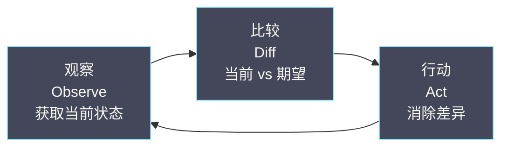
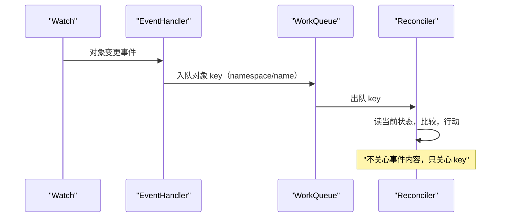
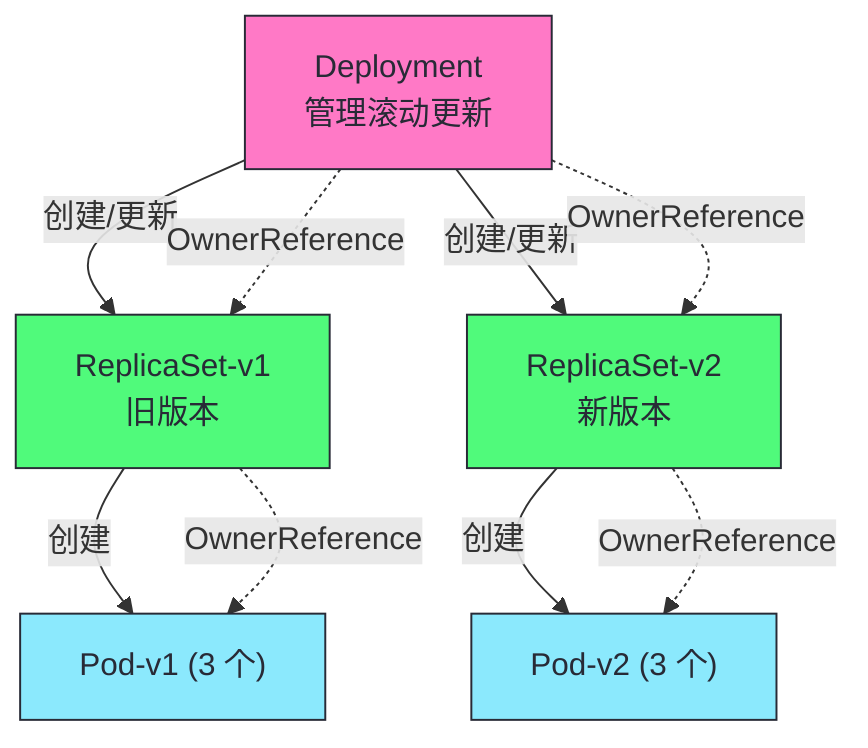
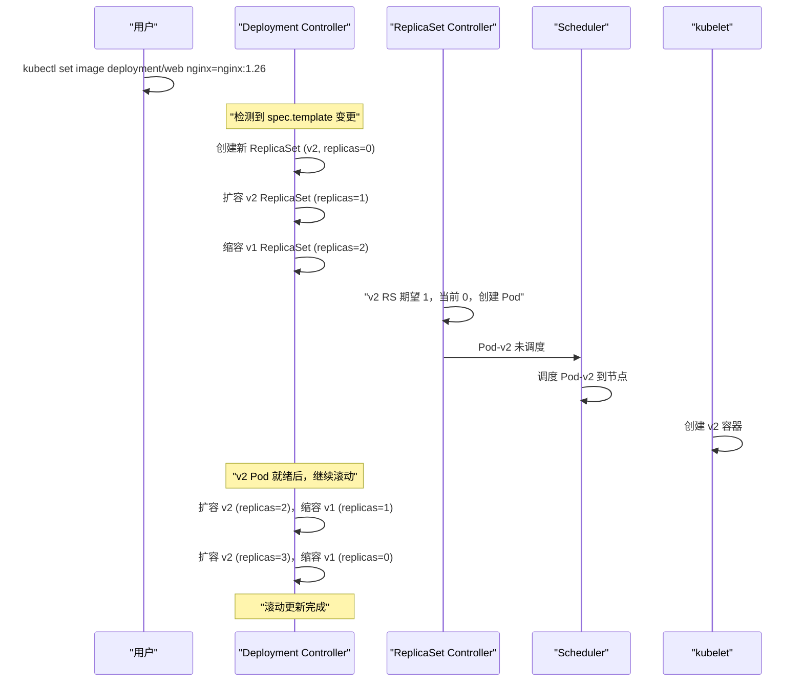
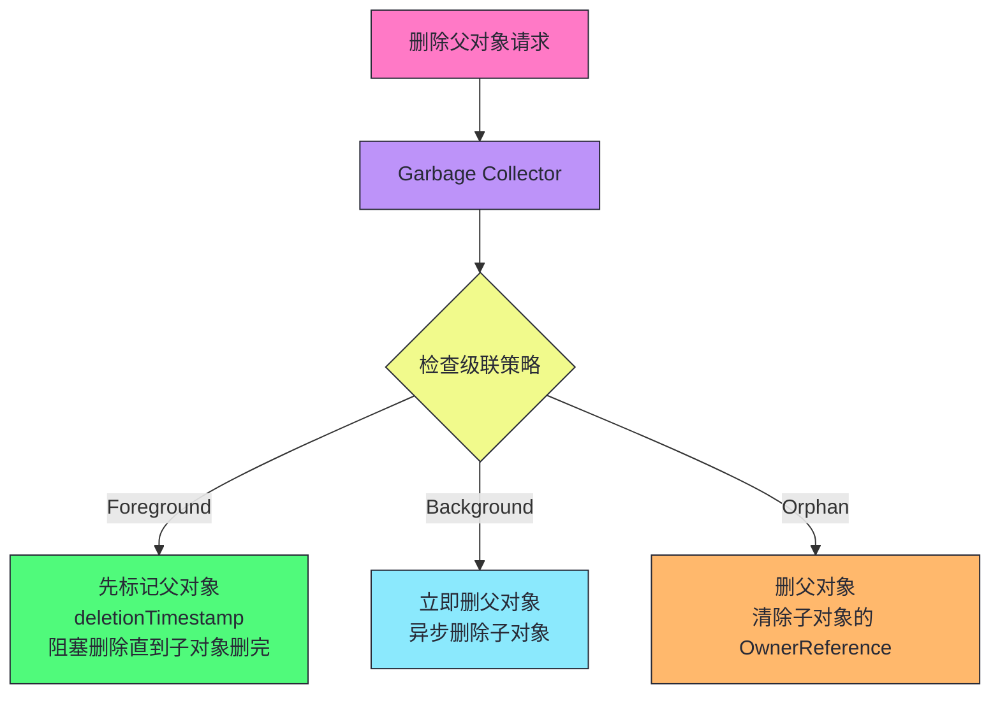
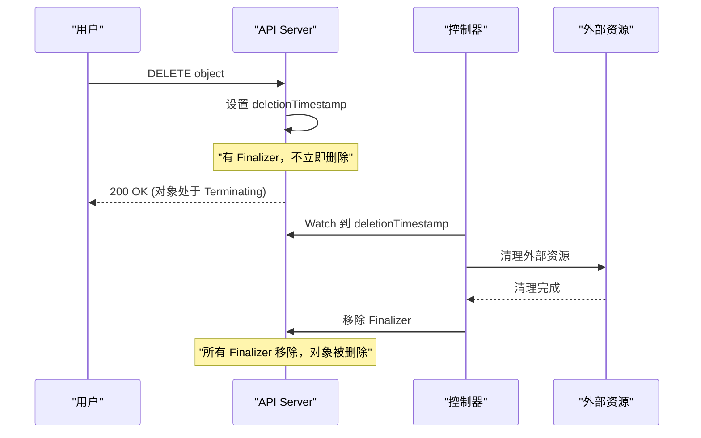
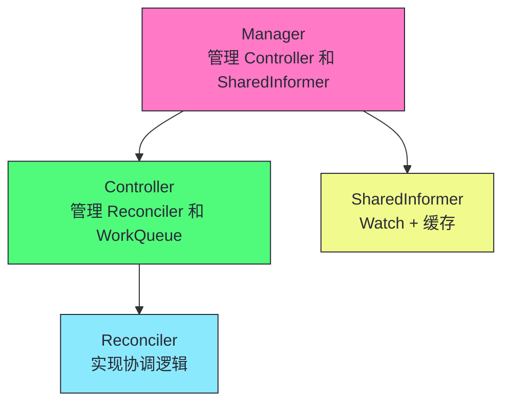
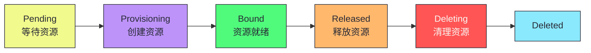

# 09 控制器模式与协调循环：从 Deployment 到 Operator

**摘要：**
本文深入 Kubernetes 控制器的通用范式——协调循环（Reconcile Loop）。控制器是 K8s 的"自动驾驶员"，持续把实际状态推向期望状态收敛。文章追溯控制器模式的起源（从 Borg 到 K8s），拆解 Observe-Diff-Act 三步循环，以 Deployment→ReplicaSet→Pod 级联控制为例详解三层控制器协作，讲透级联删除的两种模式与 Garbage Collector 机制，深入 Finalizer、OwnerReference、状态机式协调等高级模式，讨论 controller-runtime 框架的分层关系，最后以完整 Operator 示例收束。核心认知：所有 K8s 控制器无论多么复杂，核心逻辑都是"读 spec，比较 status，采取行动让 status 向 spec 收敛"。

---

## 第 1 章 控制器模式的起源：从 Borg 到 Kubernetes

讲 K8s 的控制器，不能从"什么是 Reconcile"这种定义式问题切入，而要先回到它的源头——Google 内部的 Borg 系统。控制器模式不是 K8s 凭空发明的，它是 Borg 十余年大规模集群运维经验的提炼，是把人类运维专家的"看一眼、比一下、动手修"这套手工作法，固化为可自动执行的循环。

### 1.1 Borg 的运维启示

Borg 是 Google 内部的集群管理系统，2015 年随《Large-scale cluster management at Google with Borg》论文公开。Borg 的核心设计之一，是把集群状态的管理分解为一系列持续的"协调"动作——调度器把任务分配到机器，Borgmaster 持续比对任务的期望状态与实际状态，发现差异就驱动相应的组件去消除差异。这种"期望状态 vs 实际状态"的持续比对，就是控制器模式的雏形。

Borg 的运维经验告诉 Google 工程师一件事——大规模集群中，故障是常态而非异常。机器会宕机、网络会分区、进程会崩溃、配置会出错，如果把每一次故障都当作"事件"来处理，系统会被事件风暴淹没。更稳健的做法是**不关心发生了什么事件，只关心当前状态与期望状态的差异**——只要差异存在，就持续尝试消除它，至于差异是机器宕机还是网络分区造成的，控制器不需要知道。这种思路就是 level-triggered（电平触发）而非 edge-triggered（边沿触发），后文会详细展开。

K8s 的几位核心开发者（Brendan Burns、Brian Grant、Tim Hockin 等）都来自 Borg 与 Omega 团队，他们把 Borg 的协调理念带到了 K8s，并做了关键改进——Borg 的协调逻辑散落在多个模块中，K8s 把它提炼为统一的"控制器模式"，每个控制器遵循同样的"观察-比较-行动"循环，使得控制器的编写有章可循、可复用、可组合。

### 1.2 控制器模式的核心理念

控制器模式的核心理念可以用一句话概括——**持续把实际状态推向期望状态**。这句话看似平淡，但它蕴含了三个关键设计决策。

第一个决策是"期望状态"与"实际状态"的分离。K8s 把每个资源对象拆成两半——spec 是用户声明的期望状态（"我要 3 个副本"），status 是系统汇报的实际状态（"目前有 2 个就绪副本"）。控制器的全部工作，就是读 spec、读 status、比较差异、采取行动让 status 向 spec 收敛。这种分离使得"声明式 API"成为可能——用户只说"要什么"，不说"怎么做"，"怎么做"由控制器自动完成。

第二个决策是"持续"而非"一次性"。控制器不是收到一次事件就执行一次动作然后退出，而是持续运行一个循环——每次循环都重新读当前状态、重新比较、重新行动。这意味着即使某次行动失败了，下一次循环会重新尝试；即使控制器自己崩溃重启了，重新从当前状态开始协调即可，不需要恢复之前的执行进度。这种"持续循环"是 K8s 自愈能力的工程基础。

第三个决策是"收敛"而非"同步"。控制器不保证 status 立刻等于 spec，只保证"最终"收敛——这叫最终一致性（Eventual Consistency）。譬如 spec.replicas=3，当前只有 1 个 Pod，控制器创建 2 个 Pod，但 Pod 启动需要时间，status.readyReplicas 不会立刻变成 3。控制器持续循环，每次循环检查 Pod 是否就绪，就绪了就更新 status。这种"最终收敛"的语义，使得 K8s 可以容忍异步、延迟、部分失败，而不需要强同步保证。

> [!info] 核心概念：控制器模式是 Borg 运维经验的提炼
> Borg 教会 K8s 一件事——大规模集群中，故障是常态，事件驱动会被淹没，更稳健的做法是 level-triggered：只关心当前状态与期望状态的差异，不关心差异的成因。K8s 把这个理念提炼为统一的"控制器模式"——观察、比较、行动的三步循环，持续运行直到收敛。这个模式是 K8s 自愈能力、声明式 API、最终一致性的共同基础。

### 1.3 控制器的分类

K8s 内置了大量控制器，它们遵循同样的模式但管理不同的资源。理解控制器的分类，有助于建立对控制平面的整体认知。

| 控制器类型 | 代表控制器 | 管理的资源 |
|-----------|-----------|-----------|
| **工作负载控制器** | Deployment、StatefulSet、DaemonSet、Job、CronJob | Pod 的副本数与生命周期 |
| **服务发现控制器** | Service Controller、Endpoints Controller、EndpointSlice Controller | Service 与后端 Pod 的映射 |
| **存储控制器** | PV Controller、PVC Controller、Attach/Detach Controller | 持久化卷的绑定与挂载 |
| **调度控制器** | ReplicaSet Controller（触发调度）、kubelet（运行容器） | Pod 的调度与运行 |
| **节点控制器** | Node Controller、Cloud Provider Controller | 节点状态与生命周期 |
| **安全控制器** | Service Account Controller、Token Controller | 凭证与权限 |

这些控制器都运行在控制平面（kube-controller-manager 与 cloud-controller-manager 中），各自独立协调各自的资源，通过 OwnerReference 与共享的 Informer 缓存串联协作。后文以工作负载控制器为主线展开，因为它最能体现级联控制与协调循环的精髓。

---

## 第 2 章 协调循环：观察-比较-行动

讲完了起源，接下来拆解控制器模式的具体形态。每个 K8s 控制器的核心都是一个持续运行的循环，这个循环可以分解为三个步骤——观察（Observe）、比较（Diff）、行动（Act）。这三步循环是所有控制器的最小公约数，无论控制器管理的是 Pod 还是自定义 CRD，都逃不出这个框架。

### 2.1 三步循环



| 步骤 | 操作 | 数据来源 |
|------|------|---------|
| **观察** | 获取资源的当前状态 | Informer 本地缓存 |
| **比较** | 计算当前状态与期望状态的差异 | spec vs status |
| **行动** | 执行操作消除差异 | 创建/更新/删除对象 |

观察阶段，控制器从 Informer 的本地缓存读取对象的当前状态——spec 与 status。这里有一个关键点：控制器读的是本地缓存，不是直接读 etcd。本地缓存由 Informer 通过 List-Watch 维护（详见 [[06 List-Watch 与 Informer：K8s 的分布式神经系统]]），它最终一致于 etcd 的真实状态，但可能短暂滞后。控制器接受这种滞后——因为协调循环是持续运行的，下一次循环会读到更新的状态，短暂的滞后不影响最终收敛。

比较阶段，控制器计算 spec 与 status 的差异。譬如 spec.replicas=3 而 status.readyReplicas=2，差异是"还差 1 个就绪副本"；譬如 spec.template.image 与当前 ReplicaSet 的 template.image 不同，差异是"需要新版本的 Pod"。比较的粒度因控制器而异——ReplicaSet Controller 只比副本数，Deployment Controller 还要比 Pod 模板，StatefulSet Controller 还要比序号与持久化身份。

行动阶段，控制器执行操作消除差异——创建缺失的 Pod、删除多余的 Pod、更新 status、创建新的 ReplicaSet。行动通常通过 API Server 的写接口完成，写操作会经过认证、授权、准入、etcd 持久化（详见 [[04 API Server 请求链路：从 HTTP 请求到 etcd 写入]]）。行动可能失败——API Server 拒绝、etcd 写入冲突、网络超时——失败后控制器不特殊处理，下一次循环会重新尝试。

### 2.2 三大铁律

> [!warning] 生产避坑：协调循环的三大铁律
> 1. **幂等性**：Reconcile 多次执行效果与一次一致。WorkQueue 可能重试，Resync 可能重复触发。
> 2. **无状态性**：Reconcile 不依赖"上一次做了什么"——每次从缓存读最新状态。Level-triggered 原则。
> 3. **基于当前状态而非事件**：Reconcile 的输入是对象 key，不是"发生了什么事件"。EventHandler 转换事件为 key。

三大铁律不是凭空规定的，每一条都对应着具体的工程场景。幂等性对应 WorkQueue 的重试机制——Reconcile 失败后 WorkQueue 会把 key 重新入队，如果 Reconcile 不幂等，重试会导致重复副作用（譬如重复创建 Pod）。无状态性对应控制器的崩溃恢复——控制器重启后从当前状态开始协调，如果 Reconcile 依赖"上一次做了什么"，重启后这个上下文丢失，协调逻辑会错乱。基于当前状态而非事件，对应 level-triggered 原则——如果 Reconcile 依赖"发生了什么事件"，错过一个事件就会导致状态永久偏离，而基于当前状态则无论错过多少事件，下一次循环都能从当前状态重新收敛。

### 2.3 空调恒温器：控制器的完美类比

理解协调循环，最贴切的类比是**空调恒温器**（Thermostat）。恒温器是一个完美的控制器——它持续测量室内温度，与设定温度比较，温度高了启动制冷，温度低了停止制冷，持续循环直到温度稳定。

| 恒温器 | K8s 控制器 |
|--------|----------|
| 期望温度 25°C | spec.replicas = 3 |
| 室内温度传感器 | status.readyReplicas |
| 温度差 > 0 启动制冷 | replicas 差 > 0 创建 Pod |
| 持续循环到温度达标 | 持续循环到 status = spec |
| 不记住"5 分钟前开始制冷" | 不依赖"上一次做了什么" |

恒温器的几个特征与 K8s 控制器高度对应。第一，恒温器不记录"5 分钟前开始制冷了"这种历史信息——它每次只看当前温度与设定温度的差，K8s 控制器同样不记录"上一次创建了几个 Pod"，每次只看当前副本数与期望副本数的差。第二，恒温器断电重启后能立刻恢复工作——它重新读当前温度开始制冷，不需要恢复断电前的执行进度，K8s 控制器崩溃重启后同样从当前状态开始协调。第三，恒温器容忍传感器的短暂误差——譬如开门时温度短暂升高，恒温器不会因此疯狂制冷，因为它持续循环，等温度稳定后再决策，K8s 控制器同样容忍本地缓存的短暂滞后。

但这个类比有一个重要局限——恒温器只有一个传感器和一个执行器，K8s 控制器面对的是分布式环境，多个控制器可能同时操作相关联的对象，网络分区可能导致缓存滞后，etcd 的乐观并发可能导致更新冲突。这些分布式特有的复杂性，是恒温器类比无法覆盖的，后文章节会逐一展开。

> [!info] 核心概念：控制器的无状态性是自愈能力的基础
> 控制器的协调循环是无状态的——每次循环都基于当前状态做决策，不依赖"上一次做了什么"。这使得控制器在面对自身故障时极其健壮——控制器崩溃重启后，重新从当前状态开始协调，不需要恢复之前的执行进度。如果协调过程中某一步失败了，下一次循环会重新尝试。这是 K8s 自愈能力的工程基础。

---

## 第 3 章 Level-triggered 与 Edge-triggered

三大铁律中有一条"基于当前状态而非事件"，这条铁律背后是一个更基础的设计选择——level-triggered（电平触发）而非 edge-triggered（边沿触发）。这个概念来自电子电路，但用它来理解 K8s 控制器的设计哲学，比任何软件术语都贴切。

### 3.1 两种触发模式的区别

电子电路中，edge-triggered（边沿触发）指只在信号"跳变"的瞬间触发动作——譬如电压从 0 跳到 1 的那一刻触发；level-triggered（电平触发）指只要信号"维持"在某个电平就持续触发动作——譬如电压维持在高电平期间持续触发。两者的关键区别在于：edge-triggered 一旦错过了跳变瞬间，就再也补不回来；level-triggered 只要信号还在那个电平，随时都能触发。

把这个概念映射到 K8s：edge-triggered 对应"事件驱动"——控制器在"对象变更事件"发生时执行动作，错过事件就错过动作；level-triggered 对应"状态驱动"——控制器持续检查"当前状态与期望状态的差异"，只要差异存在就持续行动，不关心差异是什么时候产生的。

| 维度 | Edge-triggered（事件驱动） | Level-triggered（状态驱动） |
|------|---------------------------|---------------------------|
| **触发条件** | 事件发生瞬间 | 状态差异存在 |
| **错过事件** | 永久丢失，状态偏离 | 不影响，下次循环重新检测 |
| **重试机制** | 需要显式重试队列 | 循环天然重试 |
| **崩溃恢复** | 需要恢复事件流位置 | 从当前状态重新开始 |
| **实现复杂度** | 需要事件去重、顺序保证 | 简单，只需读当前状态 |

### 3.2 为什么 K8s 选择 level-triggered

K8s 选择 level-triggered 不是审美偏好，而是分布式环境下的工程必然。分布式系统有三个无法回避的现实——事件会丢失、组件会崩溃、网络会分区。这三个现实使得 edge-triggered 在 K8s 场景下几乎不可行。

事件会丢失是第一个问题。K8s 的 Watch 机制基于 HTTP 长连接，连接断开时错过的事件需要通过重新 List 补齐（详见 [[06 List-Watch 与 Informer：K8s 的分布式神经系统]]）。如果控制器是 edge-triggered，Watch 断开期间发生的事件就丢失了，控制器的状态会永久偏离。level-triggered 不存在这个问题——Watch 恢复后控制器重新读当前状态，无论错过了多少事件，都能从当前状态重新收敛。

组件会崩溃是第二个问题。控制器进程可能因为 OOM、节点故障、手动重启而崩溃。edge-triggered 控制器崩溃后，需要恢复"崩溃前处理到哪个事件"的位置，这需要持久化事件消费位点，增加复杂度与故障面。level-triggered 控制器崩溃后，重启重新读当前状态即可，不需要恢复任何位点——因为它的决策只依赖当前状态，不依赖事件历史。

网络会分区是第三个问题。分区期间控制器与 API Server 通信中断，事件无法送达。edge-triggered 控制器在分区期间会错过事件，分区恢复后需要补齐——但补齐多少、从哪里补齐，都是棘手问题。level-triggered 控制器在分区期间无法行动（无法写 API Server），但分区恢复后重新读当前状态，自然能发现差异并消除——不需要任何补齐逻辑。

> [!info] 核心概念：Level-triggered 是 K8s 容错能力的根基
> Level-triggered 使得 K8s 控制器在面对事件丢失、组件崩溃、网络分区时都能自动恢复——因为它的决策基于"当前状态"而非"事件历史"，无论中间错过了什么，只要重新读当前状态就能重新收敛。这是 K8s 在分布式环境下保持稳健的根基，也是"协调循环必须无状态"这条铁律的底层原因。

### 3.3 EventHandler：事件到 key 的转换

虽然 Reconcile 是 level-triggered，但 K8s 控制器仍然需要监听事件——不然它不知道何时触发 Reconcile。这里有一个精妙的设计——EventHandler 把 edge-triggered 的事件转换为 level-triggered 的 Reconcile 触发。



EventHandler 收到对象变更事件后，不把"事件本身"传给 Reconciler，而是把对象的 key（namespace/name）放入 WorkQueue。Reconciler 从 WorkQueue 取出 key，用 key 从本地缓存读对象的当前状态，然后做比较与行动。这个设计的关键在于——Reconciler 的输入是 key 而非事件，它不关心"发生了什么变更"，只关心"这个对象当前是什么状态"。事件只是触发 Reconcile 的信号，不参与 Reconcile 的决策。

这种"事件触发、状态决策"的混合模式，兼具了 edge-triggered 的及时性（事件来了立刻触发）与 level-triggered 的稳健性（决策基于当前状态）。WorkQueue 的去重机制进一步优化——如果同一个 key 被多次入队，Reconciler 只会处理一次，避免事件风暴导致 Reconcile 风暴。

---

## 第 4 章 Deployment → ReplicaSet → Pod 的级联控制

讲透了协调循环的通用模式，接下来以 K8s 最经典的工作负载控制器链——Deployment → ReplicaSet → Pod——为例，看协调循环如何级联组合。这条链是理解 K8s 工作负载管理的钥匙，也是后文 StatefulSet、DaemonSet 等控制器的参照系。

### 4.1 三层控制器架构



这条链有三层，每层控制器职责单一、互不越权。Deployment Controller 不直接管 Pod，它管 ReplicaSet；ReplicaSet Controller 不直接管 Deployment 的事，它只管 Pod 副本数；kubelet 不关心上层是谁，它只管运行分配给自己的 Pod。这种分层是 K8s 控制器设计的一贯风格——单一职责、组合优先于继承、通过 OwnerReference 串联而非直接调用。

### 4.2 每层控制器的职责

| 控制器 | 职责 | 协调逻辑 |
|--------|------|---------|
| **Deployment Controller** | 管理滚动更新 | 比较 spec.template 与 ReplicaSet 的 template，创建新 ReplicaSet |
| **ReplicaSet Controller** | 维护 Pod 副本数 | 比较 spec.replicas 与实际 Pod 数，创建/删除 Pod |
| **kubelet**（非控制器） | 运行容器 | Watch 分配给自己的 Pod，通过 CRI 创建容器 |

Deployment Controller 的协调逻辑是——比较 Deployment 的 spec.template 与各 ReplicaSet 的 template，如果没有任何 ReplicaSet 的 template 匹配 spec.template，就创建新 ReplicaSet；然后根据滚动更新策略，调整新旧 ReplicaSet 的 replicas。Deployment Controller 不直接创建 Pod，它把"维护副本数"的职责委托给 ReplicaSet Controller。

滚动更新策略由 `spec.strategy.rollingUpdate` 的两个参数控制：`maxSurge` 和 `maxUnavailable`。`maxSurge` 定义可以超出期望副本数的最大数量（默认 25%），`maxUnavailable` 定义更新过程中不可用的最大数量（默认 25%）。譬如 replicas=10、maxSurge=25%、maxUnavailable=25%，滚动更新时最多同时存在 12 个 Pod（10+2 surge），最少保持 8 个可用（10-2 unavailable）。Deployment Controller 先扩容新 ReplicaSet 到 maxSurge 上限，再缩容旧 ReplicaSet 到 maxUnavailable 下限，交替进行直到新 ReplicaSet 达到期望副本数、旧 ReplicaSet 缩容到 0。这两个参数的调优影响更新速度和可用性——增大 maxSurge 加快更新但消耗更多资源，增大 maxUnavailable 加快更新但降低可用性。

ReplicaSet Controller 的协调逻辑是——比较 ReplicaSet 的 spec.replicas 与实际匹配的 Pod 数（通过 label selector 匹配），如果实际 Pod 数少于期望，创建 Pod；如果多于期望，删除多余的 Pod。ReplicaSet Controller 不关心 Pod 里跑的是什么镜像，它只关心副本数。

ReplicaSet Controller 创建 Pod 时有一个重要细节：Pod 的 name 由 ReplicaSet 的 name 加随机后缀生成（如 `web-abc123`），而非顺序编号。这与 StatefulSet 的顺序编号（`web-0`、`web-1`）不同——ReplicaSet 的 Pod 是无序的，任何 Pod 都可以删除和重建，不影响整体功能。Pod 创建时会被自动注入 OwnerReference 指向 ReplicaSet，这样 ReplicaSet 删除时 Pod 会被级联删除。如果 Pod 因节点故障被驱逐，ReplicaSet Controller 会发现实际 Pod 数少于期望，自动创建新 Pod 补充——这是 level-triggered 的体现，不依赖事件，只看当前状态，体现了声明式系统的核心优势。

kubelet 严格说不是"控制器"，但它的运行模式与控制器同构——它 Watch 分配给自己节点的 Pod，发现新 Pod 就通过 CRI 创建容器，发现 Pod 被删除就停止容器。kubelet 是控制平面与数据平面之间的桥梁，把"声明"落地为"运行"。

### 4.3 为什么分三层

为什么不把 Deployment 与 ReplicaSet 合并成一层？这个问题值得深究。分离三层的核心收益是**关注点分离与历史版本保留**。

关注点分离使得每层控制器可以独立演进。Deployment Controller 只关心"如何滚动更新"，不关心"如何维护副本数"；ReplicaSet Controller 只关心"如何维护副本数"，不关心"上层是什么工作负载"。这种分离使得 ReplicaSet 可以被其他上层控制器复用——譬如早期的 ReplicationController（已被 ReplicaSet 取代）、自定义的扩缩容控制器都可以基于 ReplicaSet 构建。

历史版本保留是滚动更新的关键支撑。Deployment 不删除旧 ReplicaSet，而是把它缩容到 0 但保留对象——这使得回滚极其简单，只需把旧 ReplicaSet 重新扩容、新 ReplicaSet 缩容。如果合并成一层，每次更新都覆盖旧版本，回滚就需要从外部备份恢复，复杂度大增。保留旧 ReplicaSet 还支持"查看历史版本"——`kubectl rollout history` 列出的就是这些保留的 ReplicaSet。

> [!info] 核心概念：分层是为了关注点分离与历史版本保留
> Deployment 与 ReplicaSet 分离，不是过度设计，而是两个实际收益的驱动——关注点分离让 ReplicaSet 可被复用，历史版本保留让回滚与版本审计变得简单。这种"分层 + 保留历史"的设计，是 K8s 工作负载控制器的一贯风格，StatefulSet、DaemonSet 都遵循类似模式。

---

## 第 5 章 滚动更新：两个 ReplicaSet 的扩缩容交替

Deployment 最核心的能力是滚动更新——零停机地把 Pod 从旧版本迁移到新版本。理解滚动更新的关键，是认识到它不是"修改 Pod 镜像"，而是"两个 ReplicaSet 的扩缩容交替"。

### 5.1 滚动更新的完整流程



滚动更新的完整流程是——用户更新 Deployment 的 spec.template（譬如改镜像版本），Deployment Controller 检测到 spec.template 变更，发现没有任何现有 ReplicaSet 的 template 匹配新 spec.template，于是创建新 ReplicaSet（初始 replicas=0）。然后 Deployment Controller 按滚动更新策略，交替扩容新 ReplicaSet 与缩容旧 ReplicaSet——扩容新 RS 到 1，缩容旧 RS 到 2；新 RS 的 Pod 就绪后，扩容新 RS 到 2，缩容旧 RS 到 1；继续扩容新 RS 到 3，缩容旧 RS 到 0。整个过程结束，3 个 Pod 全部是新版本，旧 ReplicaSet 缩容到 0 但保留对象。

这个流程的关键在于——Deployment Controller 只调整 ReplicaSet 的 replicas，不直接创建 Pod。创建 Pod 是 ReplicaSet Controller 的事，Deployment Controller 触发它通过"修改 ReplicaSet 的 spec.replicas"间接完成。这种间接控制是级联控制的精髓——每层只管自己的直接下级，不越权操作下级的下级。

### 5.2 滚动更新的参数

```yaml
apiVersion: apps/v1
kind: Deployment
spec:
  strategy:
    type: RollingUpdate
    rollingUpdate:
      maxUnavailable: 25%      # 滚动时最多 25% 不可用
      maxSurge: 25%            # 滚动时最多超出期望 25%
  minReadySeconds: 30          # Pod 就绪后等 30 秒才认为可用
  progressDeadlineSeconds: 600 # 600 秒没进展标记为失败
```

| 参数 | 作用 | 影响 |
|------|------|------|
| **maxUnavailable** | 滚动时允许多少 Pod 不可用 | 值大更新快但可用性降低 |
| **maxSurge** | 滚动时允许超出期望多少 Pod | 值大更新快但资源消耗多 |
| **minReadySeconds** | Pod 就绪后等多久才算可用 | 防止刚就绪就挂的 Pod 被认为可用 |
| **progressDeadlineSeconds** | 多久没进展标记失败 | 超时后 Deployment 状态变为 Failed |

这四个参数共同决定了滚动更新的速度与安全性的权衡。maxUnavailable 与 maxSurge 控制并行的"新旧版本同时存在的 Pod 数"——maxUnavailable 越大，旧版本 Pod 删得越快但可用 Pod 越少；maxSurge 越大，新版本 Pod 创建得越快但资源消耗越多。minReadySeconds 防止"假就绪"——Pod 刚启动时 readiness probe 可能短暂通过，但应用实际还没准备好，minReadySeconds 强制等一段时间才认为 Pod 真正可用，避免假就绪的 Pod 被当作"可用"继续滚动。progressDeadlineSeconds 是兜底——如果滚动更新卡住了（譬如新版本镜像拉不下来），超过这个时间 Deployment 状态变为 Failed，提示用户介入。

### 5.3 回滚的简洁性

滚动更新的"两个 ReplicaSet 扩缩容交替"设计，使得回滚异常简洁。回滚不是"恢复 Pod 镜像到旧版本"，而是"把旧 ReplicaSet 重新扩容、新 ReplicaSet 缩容"——这与正向滚动更新是同一个机制，只是方向相反。

```bash
# 回滚到上一版本
kubectl rollout undo deployment/web

# 回滚到指定版本
kubectl rollout undo deployment/web --to-revision=2

# 查看滚动历史
kubectl rollout history deployment/web
```

`kubectl rollout undo` 的实现是——找到目标版本的 ReplicaSet，把它的 template 复制回 Deployment 的 spec.template，Deployment Controller 检测到 spec.template 变更，又会创建新 ReplicaSet（或复用已有的），开始新一轮滚动更新。从控制器视角，回滚与正向更新没有本质区别，都是 spec.template 变更触发的滚动。这种"回滚即更新"的设计，使得回滚路径与更新路径完全一致，不需要为回滚单独设计一套机制——这是分层与历史版本保留带来的工程简洁性。

> [!info] 核心概念：滚动更新是两个 ReplicaSet 的扩缩容交替
> Deployment 的滚动更新不是"修改 Pod 镜像"——而是创建新 ReplicaSet（新镜像），逐步扩容新 RS 同时缩容旧 RS。这使得回滚简单——只需将旧 RS 重新扩容、新 RS 缩容。每个 ReplicaSet 对应一个版本的 Pod 模板，Deployment 通过管理多个 ReplicaSet 实现版本切换。理解这个"两层控制"很重要——Deployment 不管 Pod，它管 ReplicaSet；ReplicaSet 才管 Pod。

---

## 第 6 章 OwnerReference 与垃圾回收

级联控制依赖一个关键机制——对象间的父子关系声明。K8s 用 OwnerReference 字段声明这种关系，垃圾回收器（Garbage Collector）基于它实现级联删除。理解 OwnerReference 与垃圾回收，是理解 K8s 对象生命周期管理的基础。

### 6.1 OwnerReference：对象间的父子关系

每个子对象通过 `metadata.ownerReferences` 声明其父对象：

```yaml
# ReplicaSet 的 OwnerReference 指向 Deployment
metadata:
  ownerReferences:
    - apiVersion: apps/v1
      kind: Deployment
      name: web
      uid: "deploy-uid-123"
      controller: true        # 是否为直接控制器
      blockOwnerDeletion: true # 是否阻止 Owner 删除直到此对象被删除
```

OwnerReference 的几个字段值得逐一说明。apiVersion 与 kind 标识父对象的类型，name 标识父对象的名称，uid 是父对象的唯一标识。这里有一个关键设计——**判断 OwnerReference 是否有效，用的是 uid 而非 name**。为什么？因为 name 可以被复用——删除一个叫 web 的 Deployment 后，可以再创建一个叫 web 的 Deployment，但它们的 uid 不同。如果用 name 判断，旧 ReplicaSet 的 OwnerReference 指向已删除的 web，新 web 创建后会被误认为父对象，导致垃圾回收错乱。uid 是对象的全局唯一标识，删除后不可复用，用它判断 OwnerReference 有效性才能避免这种错乱。

controller: true 表示这个 OwnerReference 是"直接控制器"——一个对象只能有一个 controller=true 的 OwnerReference，它代表"负责协调这个对象的控制器"。blockOwnerDeletion: true 表示删除父对象时，这个子对象会阻塞父对象的删除（在 Foreground 级联删除模式下），直到子对象被删除。

### 6.2 垃圾回收器的工作机制

垃圾回收器（Garbage Collector）是 kube-controller-manager 中的一个组件，它负责清理"孤儿对象"——owner 不存在的对象。它的工作机制比直觉想象的复杂，核心是一个基于 UID 的图遍历过程。



垃圾回收器维护两张图——owner 依赖图（owner 到 dependents 的映射）与 dependent 依赖图（dependent 到 owner 的映射）。这两张图通过监听集群中所有对象的 OwnerReference 字段动态维护。当某个对象被删除，垃圾回收器查找 owner 依赖图，找到它的所有 dependents（子对象），根据级联策略决定如何处理这些 dependents。

Garbage Collector 的实现分为两个核心组件：GraphBuilder 和 GarbageCollector。GraphBuilder 维护依赖图——它 Watch 所有资源类型，解析每个对象的 OwnerReference，构建 owner→dependents 的映射。当对象被删除，GraphBuilder 把删除事件放入队列。GarbageCollector 从队列取删除事件，查找依赖图确定要级联删除的子对象，根据级联策略执行删除。GraphBuilder 和 GarbageCollector 分离，图维护和删除执行解耦——图维护是持续的高频操作（每次对象变更都要更新图），删除执行是低频操作（只在对象删除时触发），两者互不阻塞。

Foreground 模式下，垃圾回收器先给父对象打上 deletionTimestamp（标记为"正在删除"），但暂不真正删除——它先删除所有 blockOwnerDeletion=true 的子对象，等所有子对象删除完毕，再真正删除父对象。Background 模式下，垃圾回收器立即删除父对象，然后异步遍历依赖图删除子对象。Orphan 模式下，垃圾回收器删除父对象，但清除子对象的 OwnerReference，让子对象成为"孤儿"继续存在。

### 6.3 级联删除的两种模式

| 模式 | 行为 | propagationPolicy |
|------|------|------------------|
| **Foreground** | 先删子对象，子对象都删完后再删父对象 | Foreground |
| **Background** | 立即删父对象，异步删子对象 | Background |
| **Orphan** | 删父对象，保留子对象（成为孤儿） | Orphan |

```bash
# Foreground 级联删除
kubectl delete deployment web --cascade=foreground

# Background 级联删除（默认）
kubectl delete deployment web --cascade=background

# Orphan（保留子对象）
kubectl delete deployment web --cascade=orphan
```

Foreground 与 Background 的选择，本质是"删除的阻塞语义"与"删除的最终一致性"的权衡。Foreground 阻塞——父对象一直处于 Terminating 状态直到所有子对象删除完毕，适合"必须确保子对象全部清理完才能算删除成功"的场景，譬如删除一个有 Finalizer 的资源。Background 立即返回——父对象立刻删除，子对象异步清理，适合"不关心子对象何时清理完"的大多数场景。K8s 默认用 Background，因为大多数场景下用户只关心"父对象删了"，子对象的清理可以异步进行。

> [!warning] 生产避坑：Foreground 删除会阻塞直到子对象全部删除
> Foreground 级联删除会阻塞父对象的删除——直到所有子对象被删除完毕。如果子对象有 Finalizer（如 PVC 等待 Pod 删除），父对象会一直处于 "Terminating" 状态。对于有大量子对象的父对象（如一个 Deployment 有 1000 个 Pod），Foreground 删除可能耗时很长。大多数场景用默认的 Background 删除——立即删父对象，异步删子对象，不阻塞。

---

## 第 7 章 Finalizer：删除前的清理钩子

OwnerReference 与垃圾回收处理的是 K8s 内部对象的级联，但控制器经常需要管理 K8s 外部的资源——云厂商的 LoadBalancer、DNS 记录、外部数据库。这些外部资源不在 etcd 中，垃圾回收器无法清理它们。Finalizer 就是为此而生的机制——它给控制器一个"删除前清理"的机会。

### 7.1 什么是 Finalizer

**Finalizer** 是 `metadata.finalizers` 中的字符串列表——存在 Finalizer 的对象不会被立即删除，直到所有 Finalizer 被移除。

```yaml
metadata:
  finalizers:
    - kubernetes.io/pv-protection    # PVC 的 Finalizer
    - example.com/my-cleanup         # 自定义 Finalizer
```

Finalizer 的语义是——"在所有 Finalizer 被移除前，对象不能被真正删除"。当用户删除一个有 Finalizer 的对象，API Server 给它打上 deletionTimestamp（标记为"正在删除"），但不真正从 etcd 删除——对象处于 Terminating 状态，等待控制器移除 Finalizer。控制器在删除前执行清理逻辑（譬如删除外部 LoadBalancer），清理完成后移除 Finalizer，所有 Finalizer 移除后对象才被真正删除。

### 7.2 Finalizer 的工作流程



Finalizer 的工作流程是一个典型的协调循环应用。控制器 Watch 到对象有了 deletionTimestamp，进入"删除中"分支——执行外部资源清理，清理成功后移除 Finalizer。如果清理失败，控制器不移除 Finalizer，对象继续处于 Terminating 状态，下一次 Reconcile 会重新尝试。这种"清理失败就重试"的语义，与协调循环的幂等性、无状态性完全契合。

Finalizer 卡住是生产环境常见问题。对象处于 Terminating 状态长时间不删除，通常原因是负责移除 Finalizer 的控制器崩溃、配置错误或外部资源不可达。排查方法：先 `kubectl get <resource> <name> -o yaml` 查看 deletionTimestamp 和 finalizers 列表，确认是哪个 Finalizer 卡住；再检查对应控制器的日志和状态，确认它是否在运行、是否在处理删除事件。如果确认控制器已不存在（如 Operator 卸载但 Finalizer 残留），可以手动移除 Finalizer（`kubectl patch <resource> <name> --type=json -p='[{"op":"remove","path":"/metadata/finalizers"}]'`），但这会跳过清理逻辑，可能导致外部资源泄露，应谨慎使用，仅在确认安全的情况下操作。

### 7.3 自定义 Finalizer 的实现

```go
// 伪代码：自定义控制器的 Finalizer 处理
const myFinalizer = "example.com/my-cleanup"

func Reconcile(ctx context.Context, req ctrl.Request) (ctrl.Result, error) {
    var obj MyResource
    if err := r.Get(ctx, req.NamespacedName, &obj); err != nil {
        return ctrl.Result{}, client.IgnoreNotFound(err)
    }
    
    // 检查是否在删除中
    if !obj.DeletionTimestamp.IsZero() {
        // 对象正在删除，执行清理
        if containsString(obj.Finalizers, myFinalizer) {
            // 清理外部资源
            if err := cleanupExternalResources(&obj); err != nil {
                return ctrl.Result{}, err  // 清理失败，重试
            }
            // 移除 Finalizer
            obj.Finalizers = removeString(obj.Finalizers, myFinalizer)
            if err := r.Update(ctx, &obj); err != nil {
                return ctrl.Result{}, err
            }
        }
        return ctrl.Result{}, nil
    }
    
    // 正常协调逻辑
    if !containsString(obj.Finalizers, myFinalizer) {
        obj.Finalizers = append(obj.Finalizers, myFinalizer)
        if err := r.Update(ctx, &obj); err != nil {
            return ctrl.Result{}, err
        }
    }
    // ... 正常协调 ...
    return ctrl.Result{}, nil
}
```

这段代码体现了 Finalizer 的两个关键时机——创建对象时添加 Finalizer，删除对象时执行清理后移除 Finalizer。添加 Finalizer 必须在"对象创建后、控制器第一次 Reconcile 时"完成，如果对象创建后控制器还没来得及添加 Finalizer 就被删除了，Finalizer 不会被添加，删除时不会触发清理逻辑——这是 Finalizer 模式的一个边界条件，生产中需要确保控制器高可用，避免长时间不可达导致 Finalizer 未添加。

清理失败的处理也值得注意——`cleanupExternalResources` 失败时返回 error，Reconcile 返回 error 后 WorkQueue 会重新入队这个 key，下一次 Reconcile 重新尝试清理。这种"失败重试"依赖协调循环的幂等性——`cleanupExternalResources` 必须幂等，多次调用不能有副作用（譬如重复删除外部资源不能报错）。

> [!info] 核心概念：Finalizer 是控制器管理外部资源的必要机制
> 如果控制器创建了 K8s 外部的资源（如云厂商的 LB、DNS 记录、外部数据库），对象被删除时这些外部资源不会自动清理——导致资源泄露。Finalizer 确保控制器在对象删除前有机会清理外部资源。创建对象时添加 Finalizer，删除时执行清理然后移除 Finalizer。这是管理外部资源的控制器的必备模式——没有 Finalizer，删除对象会泄露外部资源。

### 7.4 Finalizer 的陷阱

Finalizer 在生产中有几个常见陷阱需要警惕。

第一个陷阱是**Finalizer 卡住导致对象无法删除**。如果控制器崩溃了、被删除了、或者清理逻辑有 bug 一直失败，Finalizer 永远不会被移除，对象会一直处于 Terminating 状态。这是生产中最常见的 Finalizer 问题——用户发现某个对象删不掉，kubectl delete 等了很久还在 Terminating。排查方法是 `kubectl get <resource> <name> -o yaml` 查看 finalizers 字段，确认是哪个 Finalizer 卡住，然后检查对应控制器的日志。紧急恢复手段是手动 patch 移除 finalizers（`kubectl patch <resource> <name> --type=merge -p '{"metadata":{"finalizers":[]}}'`），但这会跳过清理逻辑，可能导致外部资源泄露，只能作为最后手段。

第二个陷阱是**Finalizer 与级联删除的交互**。Foreground 级联删除会阻塞父对象删除直到子对象删除完毕，如果子对象有 Finalizer，父对象会一直 Terminating。这种"Finalizer 阻塞级联删除"的链式效应，在大规模集群中可能导致删除操作大面积卡住。生产中需要为关键资源设置删除超时与告警，监控长时间 Terminating 的对象。

第三个陷阱是**Finalizer 的命名冲突**。Finalizer 是字符串，没有命名空间的隔离，不同控制器可能用相同的 Finalizer 字符串导致冲突。最佳实践是用域名前缀——`example.com/my-cleanup` 而非 `my-cleanup`，避免与其它控制器冲突。

---

## 第 8 章 controller-runtime：编写控制器的标准框架

讲完了内置控制器的机制，接下来看如何编写自定义控制器。controller-runtime 是 K8s SIG 提供的标准框架，它封装了 Informer、WorkQueue、Reconciler 的样板代码，让开发者只需实现 Reconcile 逻辑。理解 controller-runtime 的分层，是编写 Operator 的前提。

### 8.1 三层架构



| 组件 | 职责 |
|------|------|
| **Manager** | 管理 Controller 和 SharedInformerFactory |
| **Controller** | 管理 Reconciler 和 WorkQueue |
| **Reconciler** | 实现协调逻辑（用户编写） |

Manager 是顶层容器，它管理一组 Controller 与共享的 SharedInformerFactory。一个 Manager 进程可以托管多个 Controller，它们共享同一组 Informer 缓存——这避免了每个 Controller 各自 Watch 同一资源导致的内存与连接浪费。Manager 还负责提供通用的基础设施——Metrics 暴露、健康检查、Leader 选举（用于高可用）、Client（封装的 API Server 客户端）。

Controller 是单个控制器的运行时，它管理一个 Reconciler 与一个 WorkQueue。Controller 把 Informer 的事件通过 EventHandler 转换为 key 入队 WorkQueue，WorkQueue 出队 key 调用 Reconciler。Controller 还管理并发度——MaxConcurrentReconciles 控制同时运行多少个 Reconcile goroutine，默认 1（串行），调高可以提升吞吐量但要注意 API Server 压力与协调顺序。

Reconciler 是用户实现的接口，签名是 `Reconcile(ctx, req) (Result, error)`。req 只包含 NamespacedName（对象的 key），Reconciler 用 key 从缓存读对象，执行协调逻辑，返回 Result（包含 Requeue 与 RequeueAfter）与 error。这种"只给 key"的设计，强制 Reconciler 基于 level-triggered 决策——它不接收事件，只读当前状态。

### 8.2 标准控制器代码结构

```go
func main() {
    // 1. 创建 Manager
    mgr, _ := ctrl.NewManager(ctrl.GetConfigOrDie(), ctrl.Options{
        Scheme:             scheme,
        MetricsBindAddress: ":8080",
        SyncPeriod:         &[]time.Duration{10 * time.Minute}[0],
    })
    
    // 2. 注册 Reconciler
    ctrl.NewControllerManagedBy(mgr).
        For(&appsv1.Deployment{}).           // 主资源
        Owns(&appsv1.ReplicaSet{}).           // 子资源（自动 Watch + 事件转发）
        WithOptions(controller.Options{
            MaxConcurrentReconciles: 5,       // 并发协调数
        }).
        Complete(&DeploymentReconciler{
            Client: mgr.GetClient(),
            Scheme: mgr.GetScheme(),
        })
    
    // 3. 启动 Manager
    mgr.Start(ctrl.SetupSignalHandler())
}

// Reconciler 实现
type DeploymentReconciler struct {
    client.Client
    Scheme *runtime.Scheme
}

func (r *DeploymentReconciler) Reconcile(ctx context.Context, req ctrl.Request) (ctrl.Result, error) {
    // 1. 读取对象
    var deploy appsv1.Deployment
    if err := r.Get(ctx, req.NamespacedName, &deploy); err != nil {
        return ctrl.Result{}, client.IgnoreNotFound(err)
    }
    
    // 2. 检查删除
    if !deploy.DeletionTimestamp.IsZero() {
        return r.handleDeletion(ctx, &deploy)
    }
    
    // 3. 正常协调
    // ... 比较 spec 和 status，采取行动 ...
    
    return ctrl.Result{}, nil
}
```

这段代码体现了 controller-runtime 的典型结构——main 函数中创建 Manager、注册 Reconciler、启动 Manager；Reconciler 中读取对象、检查删除、正常协调。`For(&appsv1.Deployment{})` 声明主资源（控制器 Watch 它并通过它触发 Reconcile），`Owns(&appsv1.ReplicaSet{})` 声明子资源（自动 Watch 并通过 OwnerReference 转发事件到父资源 Reconcile），`WithOptions` 配置并发度等参数。

### 8.3 For、Owns、Watches 的语义

controller-runtime 提供三个方法声明控制器监听哪些资源——For、Owns、Watches，理解它们的区别是正确编写控制器的基础。

`For(&appsv1.Deployment{})` 声明主资源——控制器 Watch Deployment，Deployment 变化时把它的 key 入队 WorkQueue 触发 Reconcile。这是控制器的"主要协调对象"，通常一个控制器只有一个 For。

`Owns(&appsv1.ReplicaSet{})` 声明子资源——控制器 Watch ReplicaSet，ReplicaSet 变化时通过它的 OwnerReference 找到所属的 Deployment，把 Deployment 的 key 入队（不是 ReplicaSet 的 key）。这种"子资源变化触发父资源 Reconcile"的语义，是因为父资源的 status 通常依赖子资源的状态——譬如 Deployment 的 status 依赖 ReplicaSet 的副本数。

`Watches(&source.Kind{Type: &corev1.ConfigMap{}}, &handler.EnqueueRequestForObject{})` 是更底层的 Watch 声明——监听 ConfigMap，但如何把 ConfigMap 的变化映射到 Reconcile key，由 handler 决定。`EnqueueRequestForObject` 把 ConfigMap 自己的 key 入队，`EnqueueRequestsFromMapFunc` 允许自定义映射逻辑（譬如 ConfigMap 变化时找到引用它的 Deployment 入队）。

> [!info] 核心概念：Owns 实现了子资源到父资源的事件转发
> 当 ReplicaSet 变化时（如 Pod 数量变化），Deployment Controller 需要知道——因为 Deployment 的 status 取决于 ReplicaSet 的状态。`Owns` 自动建立这个事件转发——ReplicaSet 变化触发所属 Deployment 的 Reconcile。无需手动 Watch ReplicaSet 并查找 OwnerReference。这是 controller-runtime 简化控制器开发的典型设计。

### 8.4 Requeue 与 RequeueAfter

Reconcile 返回的 `ctrl.Result` 有两个关键字段——`Requeue bool` 与 `RequeueAfter time.Duration`，它们控制 Reconcile 的重新触发时机。

`Requeue: true` 表示立即重新入队这个 key——下一次 Reconcile 会立刻执行。这通常用于"本次 Reconcile 没有完成所有工作，需要立刻重试"的场景，譬如添加 Finalizer 后立即 Requeue 以继续正常协调。

`RequeueAfter: 30 * time.Second` 表示 30 秒后重新入队这个 key——用于"等待一段时间后再检查"的场景，譬如等待外部资源创建完成、等待证书到期前续期。RequeueAfter 不阻塞 Reconcile goroutine——它只是给 WorkQueue 设一个定时器，Reconcile goroutine 立刻释放去处理其它 key。

返回 `error` 也会触发 Requeue——WorkQueue 的指数退避机制会把这个 key 按递增间隔重新入队（默认 5ms、10ms、20ms、40ms...，上限 1000s）。这种"出错自动退避重试"是 controller-runtime 的内置能力，开发者不需要自己实现重试循环。

Reconcile 的返回值语义有一个重要原则：返回 error 前不要修改集群状态（或确保修改是幂等的）。因为返回 error 会触发重试，如果修改不是幂等的，重试可能导致重复操作。譬如创建外部资源时，如果创建了但返回 error（如更新 status 失败），重试会再次创建——正确做法是先检查外部资源是否已存在，存在则跳过创建。这种"先检查再操作"的幂等模式是 Reconcile 的基本要求，也是编写健壮控制器的关键实践。

| 返回值 | 行为 | 适用场景 |
|--------|------|---------|
| `Result{}, nil` | 不重入队，等下次事件 | 协调完成 |
| `Result{Requeue: true}, nil` | 立即重入队 | 需要立刻继续协调 |
| `Result{RequeueAfter: 30s}, nil` | 30s 后重入队 | 等待外部状态 |
| `Result{}, err` | 指数退避重入队 | 协调失败 |

---

## 第 9 章 状态机式协调与多阶段协调

简单的协调循环是"比较 spec 与 status，一次行动"——但复杂控制器的协调逻辑有多个阶段，譬如 PV 控制器要经历 Pending → Provisioning → Bound → Released，StatefulSet 控制器要按序号逐个创建 Pod。这种多阶段协调，需要状态机模式来组织。

### 9.1 复杂控制器的状态机模式

某些控制器的协调逻辑复杂——不是简单的"比较 spec 和 status"，而是有多个状态阶段：



PV（PersistentVolume）的生命周期就是一个典型的状态机——Pending（等待绑定）、Bound（已绑定到 PVC）、Released（PVC 删除但 PV 保留）、Available（回收后可重新绑定）。每个阶段的转换由不同的条件触发，控制器根据当前 phase 决定下一步行动。

### 9.2 状态机的协调逻辑

```go
func Reconcile(ctx context.Context, req ctrl.Request) (ctrl.Result, error) {
    var obj MyResource
    r.Get(ctx, req.NamespacedName, &obj)
    
    switch obj.Status.Phase {
    case "":
        // 初始状态，转为 Pending
        obj.Status.Phase = "Pending"
        r.Status().Update(ctx, &obj)
        
    case "Pending":
        // 检查资源是否可用
        if resourceAvailable() {
            obj.Status.Phase = "Provisioning"
            r.Status().Update(ctx, &obj)
        }
        
    case "Provisioning":
        // 创建资源
        if err := createResource(&obj); err != nil {
            return ctrl.Result{}, err  // 失败重试
        }
        obj.Status.Phase = "Bound"
        r.Status().Update(ctx, &obj)
        
    case "Bound":
        // 检查资源是否仍健康
        if !resourceHealthy(&obj) {
            obj.Status.Phase = "Released"
            r.Status().Update(ctx, &obj)
        }
    }
    
    return ctrl.Result{}, nil
}
```

状态机模式的核心是——每次 Reconcile 根据 `status.phase` 决定执行哪个分支，每个分支执行完更新 phase，下一次 Reconcile 进入新 phase 的分支。这种模式保持了 level-triggered 原则——每次 Reconcile 基于 phase（当前状态）做决策，不依赖"上一次做了什么"。即使控制器崩溃重启，重新读 phase 就知道该执行哪个分支，不需要恢复执行进度。

状态机模式有一个常见陷阱——**phase 转换的原子性**。每次 phase 转换需要先执行行动（譬如 createResource），再更新 phase。如果行动成功但 phase 更新失败（譬如 etcd 冲突），下一次 Reconcile 会重新执行行动——这要求行动幂等。如果行动不幂等（譬如创建外部资源有副作用），需要用 Finalizer 或幂等键（idempotency key）保护。

> [!note] 设计哲学：状态机模式处理多阶段协调
> 简单控制器的协调是"比较 spec 和 status，一次行动"——但复杂控制器（如 PV 控制器、StatefulSet 控制器）有多个阶段——Pending → Provisioning → Bound → Released。状态机模式将每个阶段作为 Reconcile 的一个分支——每次 Reconcile 根据当前 phase 决定下一步。这种模式保持了 Level-triggered 原则——每次 Reconcile 基于 phase（当前状态）做决策，不依赖"上一次做了什么"。

### 9.3 status.phase 的争议

值得一提的是，K8s 社区对 `status.phase` 字段的态度是矛盾的。早期 K8s 大量使用 phase（Pod 有 Pending/Running/Succeeded/Failed/Unknown），但社区逐渐认识到 phase 的表达力不足——一个 phase 字段无法表达"正在做什么"与"为什么卡住"。新版资源倾向于用更结构化的 condition（条件）替代 phase——condition 是一组带状态（True/False/Unknown）与原因（reason/message）的字段，能表达更丰富的状态信息。

譬如 Pod 除了 phase，还有 conditions（PodReady、PodScheduled、ContainersReady），每个 condition 有 status、reason、message。Deployment 的 status 用 conditions（Available、Progressing、ReplicaFailure）而非 phase。这种"condition 优于 phase"的趋势，是 K8s API 演进的一个缩影——从粗粒度的状态枚举，走向细粒度的状态聚合。

---

## 第 10 章 Operator 模式：把运维知识编码为控制器

讲完了控制器模式的机制与框架，最后看一个把这些机制组合起来的高级形态——Operator。Operator 是 K8s 生态中最具表现力的扩展方式，它把特定应用的运维知识编码为控制器，实现应用生命周期的自动化。

### 10.1 Operator 的起源

Operator 模式由 CoreOS（后被 Red Hat 收购）在 2016 年提出，名称来自 "operational operator"——把人类运维专家（operator）的操作（operation）编码为软件。第一个 Operator 是 etcd-operator，它把 etcd 集群的部署、扩容、备份、恢复、故障恢复等运维操作编码为控制器逻辑。

Operator 的提出背景是——K8s 内置控制器管理的是通用工作负载（Deployment、StatefulSet），但特定应用有特定的运维需求。譬如 etcd 集群扩容不是"加一个 Pod"那么简单——新成员加入需要重新分片，需要保证 Raft 多数派不中断；etcd 备份不是"复制数据文件"那么简单——需要用 etcdctl snapshot save 保证一致性。这些运维知识掌握在少数专家手中，手动操作易错且不可扩展。Operator 的思路是——把这些运维知识编码为控制器，让控制器自动执行专家的手动操作。

### 10.2 CRD 定义

Operator 的第一步是定义 CRD（CustomResourceDefinition），用自定义资源表达应用的期望状态。

```yaml
apiVersion: apiextensions.k8s.io/v1
kind: CustomResourceDefinition
metadata:
  name: databases.example.com
spec:
  group: example.com
  names:
    kind: Database
    plural: databases
    singular: database
  scope: Namespaced
  versions:
    - name: v1
      served: true
      storage: true
      schema:
        openAPIV3Schema:
          type: object
          properties:
            spec:
              type: object
              properties:
                engine:
                  type: string
                  enum: [mysql, postgresql]
                version:
                  type: string
                replicas:
                  type: integer
                  minimum: 1
                  maximum: 5
            status:
              type: object
              properties:
                phase:
                  type: string
                ready:
                  type: boolean
```

CRD 定义了 Database 这个自定义资源——spec 有 engine（mysql/postgresql）、version、replicas，status 有 phase、ready。用户创建 Database 对象声明"我要一个 PostgreSQL 14 集群，3 个副本"，Operator 控制器读这个 spec，自动创建 StatefulSet、Service、ConfigMap，并管理升级、备份、故障恢复。

CRD 的 openAPIV3Schema 是 K8s 的 schema 校验机制——它定义 spec 与 status 的结构，API Server 在写入时校验。这保证了用户写的 spec 不会乱来——譬如 replicas 不能是负数，engine 只能是 mysql 或 postgresql。这种"API Server 层校验"是 CRD 相比早期 TPR（ThirdPartyResource，已废弃）的关键改进。

### 10.3 Controller 实现

```go
type DatabaseReconciler struct {
    client.Client
    Scheme *runtime.Scheme
}

const databaseFinalizer = "example.com/database-cleanup"

func (r *DatabaseReconciler) Reconcile(ctx context.Context, req ctrl.Request) (ctrl.Result, error) {
    var db examplev1.Database
    if err := r.Get(ctx, req.NamespacedName, &db); err != nil {
        return ctrl.Result{}, client.IgnoreNotFound(err)
    }
    
    // 处理删除
    if !db.DeletionTimestamp.IsZero() {
        if controllerutil.ContainsFinalizer(&db, databaseFinalizer) {
            if err := r.deleteExternalDatabase(&db); err != nil {
                return ctrl.Result{}, err
            }
            controllerutil.RemoveFinalizer(&db, databaseFinalizer)
            if err := r.Update(ctx, &db); err != nil {
                return ctrl.Result{}, err
            }
        }
        return ctrl.Result{}, nil
    }
    
    // 添加 Finalizer
    if !controllerutil.ContainsFinalizer(&db, databaseFinalizer) {
        controllerutil.AddFinalizer(&db, databaseFinalizer)
        if err := r.Update(ctx, &db); err != nil {
            return ctrl.Result{}, err
        }
        return ctrl.Result{Requeue: true}, nil
    }
    
    // 正常协调：根据 spec 创建 StatefulSet/Service
    if err := r.ensureStatefulSet(ctx, &db); err != nil {
        return ctrl.Result{}, err
    }
    if err := r.ensureService(ctx, &db); err != nil {
        return ctrl.Result{}, err
    }
    
    // 更新 status
    db.Status.Phase = "Running"
    db.Status.Ready = true
    db.Status.ObservedGeneration = db.Generation
    if err := r.Status().Update(ctx, &db); err != nil {
        return ctrl.Result{}, err
    }
    
    return ctrl.Result{}, nil
}
```

这个 Reconciler 体现了 Operator 的典型结构——处理删除（Finalizer 清理外部数据库）、添加 Finalizer、正常协调（创建 StatefulSet/Service）、更新 status。`ensureStatefulSet` 与 `ensureService` 是"幂等的创建/更新"——存在则更新，不存在则创建，这是协调循环幂等性的具体落地。

`db.Status.ObservedGeneration = db.Generation` 这一行值得专门说明——generation 是 spec 的版本号（spec 变更时递增），observedGeneration 是控制器汇报的"已处理到的 generation"。把 observedGeneration 设为 generation，表示"我已经处理了最新的 spec"。如果两者不匹配，kubectl 会显示 "Progressing"，提示用户控制器还没跟上 spec 的最新变更。这是控制器与用户之间的进度通信机制，详见 [[08 ResourceVersion 与乐观并发控制]]。

Operator 的成熟度可以从几个维度衡量。基础级 Operator 只实现"创建/删除"——CRD 创建时拉起 StatefulSet，删除时清理资源。进阶级 Operator 实现升级——支持版本滚动更新、回滚。高级 Operator 实现备份恢复——定期备份、按时间点恢复。成熟级 Operator 实现故障转移——主节点故障自动切换、数据一致性保证。CNCF 的 Operator 成熟度模型把这些能力分为 5 级（Phase 1-5），从基础的安装升级到高级的自动扩缩容和故障恢复。评估一个 Operator 时，不应只看它能否创建资源，还要看它是否处理了升级、备份、恢复、故障转移等复杂运维场景——这些才是 Operator 的真正价值所在。

### 10.4 Operator 的价值边界

> [!info] 核心概念：Operator 是控制器的特化——管理特定应用的生命周期
> Operator 本质上是"管理特定应用的控制器"——它用 CRD 定义应用的期望状态（如 Database 的 engine/version/replicas），用控制器实现应用的生命周期管理（创建 StatefulSet/Service、处理升级、备份恢复）。Operator 模式将应用的运维知识编码到控制器中——自动化了人类运维专家的手动操作。我们将在第 12 篇深入 CRD 和 Operator 的完整开发流程。

Operator 的价值边界值得清醒认识。一个"只是创建 StatefulSet/Service"的 Operator，与一个"管理备份、恢复、扩容、故障转移、版本升级"的 Operator，价值天差地别。前者只是 Deployment 的包装，没有体现 Operator 的真正价值；后者把运维专家的知识编码为自动化逻辑，才是 Operator 模式的本意。

判断一个 Operator 是否"真 Operator"，可以问几个问题——它是否处理了应用的升级（譬如 PostgreSQL 大版本升级需要 pg_dump/pg_restore）？它是否处理了备份与恢复？它是否处理了故障转移（譬如主节点宕机自动提升从节点）？它是否处理了扩容的副作用（譬如 etcd 加成员需要重新分片）？如果这些都没有，它只是"用 CRD 包装了 StatefulSet"，算不上真正的 Operator。

这种"运维知识编码"的边界也是 Operator 的局限——它只能编码"可形式化的运维知识"，对于需要人类判断的复杂故障（譬如数据损坏的修复），Operator 仍然无能为力。Operator 不是运维的银弹，它是把高频、可重复的运维操作自动化的工具，复杂故障仍需人类介入。

---

## 总结

控制器模式源自 Borg 的运维经验——大规模集群中故障是常态，level-triggered 比 edge-triggered 更稳健。协调循环是观察-比较-行动的三步循环，三大铁律：幂等、无状态、基于当前状态。Deployment→ReplicaSet→Pod 是级联控制，每层独立协调，通过 OwnerReference 串联。级联删除有 Foreground、Background、Orphan 三种模式。Finalizer 是删除前的清理钩子，管理外部资源的控制器必须用 Finalizer 防止资源泄露。controller-runtime 是编写控制器的标准框架，For/Owns/Watches 声明监听资源。Operator 是管理特定应用的控制器，用 CRD 定义期望状态，用控制器实现生命周期管理，把运维知识编码到控制器中。所有控制器无论多复杂，核心都是"读 spec，比较 status，采取行动"——理解了这个模式，就能理解和编写任何 K8s 控制器，这是本文最核心的认知。

> [!info] 专栏导航
> 本文是 [[00 专栏导览|Kubernetes 架构深度剖析专栏]] 的第 09 篇，深入控制器模式和协调循环。下一篇 [[10 StatefulSet 深度解析：有序部署与持久化身份]] 将详细讨论 StatefulSet 的设计——有序部署、稳定网络身份、PV 绑定，以及与 Deployment 的差异。

---

## 延伸思考

1. **你的控制器是否遵循三大铁律？** 检查 Reconcile——是否幂等？是否无状态？是否基于当前状态？违反任何一个都会在生产中出 bug。

2. **你的控制器是否处理了删除？** 如果控制器创建了外部资源，必须用 Finalizer 在删除前清理。没有 Finalizer 会泄露外部资源。

3. **你的滚动更新参数是否合理？** 检查 maxUnavailable 和 maxSurge。值大更新快但可用性降低、资源消耗多。根据 SLA 要求调整。minReadySeconds 防止假就绪被当作可用。

4. **你的控制器是否用了 Owns？** 如果控制器管理子资源，用 `Owns` 自动转发子资源事件到父资源 Reconcile，比手动 Watch 简单。

5. **你的控制器是否设置了 MaxConcurrentReconciles？** 默认 1（串行）。大集群中调高可以提升吞吐量，但注意 API Server 压力与协调顺序。

6. **你的控制器是否更新了 observedGeneration？** Reconcile 完成后设 observedGeneration = generation，否则 kubectl 一直显示 "Progressing"。

7. **你的控制器是否处理了冲突重试？** 更新对象时用 `retry.RetryOnConflict`，而非自己实现重试循环。详见 [[08 ResourceVersion 与乐观并发控制]]。

8. **你的 Operator 是否将运维知识编码到了控制器中？** Operator 的价值在于自动化运维专家的手动操作——备份、恢复、升级、扩缩容。如果你的 Operator 只是创建 StatefulSet/Service，它还没体现 Operator 的真正价值。

---

## 参考资料

1. Kubernetes Controller Patterns：https://github.com/kubernetes/community/blob/master/contributors/devel/sig-architecture/controller_patterns.md
2. controller-runtime：https://pkg.go.dev/sigs.k8s.io/controller-runtime
3. Kubernetes Garbage Collection：https://kubernetes.io/docs/concepts/architecture/garbage-collection/
4. Finalizers 文档：https://kubernetes.io/docs/concepts/overview/working-with-objects/finalizers/
5. Operator Pattern：https://kubernetes.io/docs/concepts/extend-kubernetes/operator/
6. K8s 控制器源码：https://github.com/kubernetes/kubernetes/tree/master/pkg/controller
7. Borg 论文：https://research.google/pubs/large-scale-cluster-management-at-google-with-borg/
8. CoreOS Operator 介绍：https://coreos.com/blog/introducing-operators.html

---

> [!note] 思考题
> 1. Deployment 的滚动更新是"创建新 ReplicaSet 逐步扩容、旧 ReplicaSet 逐步缩容"。如果滚动过程中新版本的 Pod 一直不就绪（如镜像有 bug），Deployment 会一直等待吗？progressDeadlineSeconds 如何介入？超时后 Deployment 的状态是什么？
> 2. Finalizer 确保控制器在删除前清理外部资源。如果控制器的 Pod 崩溃了（无法执行清理），有 Finalizer 的对象会一直处于 Terminating 状态吗？如何恢复？手动 patch 移除 finalizers 有什么风险？
> 3. controller-runtime 的 Owns 自动转发子资源事件到父资源 Reconcile。如果一个父对象有 1000 个子对象，1000 个子对象同时变化，会触发 1000 次 Reconcile 吗？WorkQueue 的去重如何减少协调次数？
> 4. Level-triggered 使得控制器在事件丢失时能自动恢复。但 Reconcile 的触发仍然依赖事件（EventHandler 把事件转为 key 入队）。如果某个对象的事件全部丢失（譬如 Watch 从未建立成功），控制器还能发现并协调这个对象吗？Resync 机制如何兜底？
