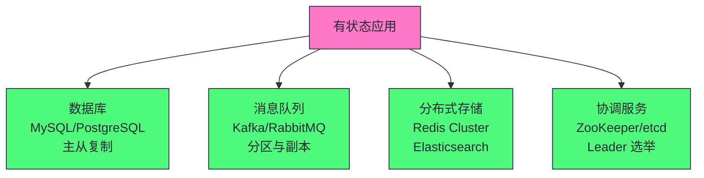
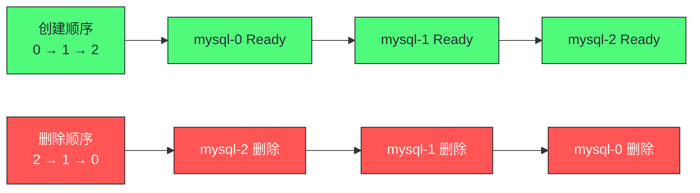
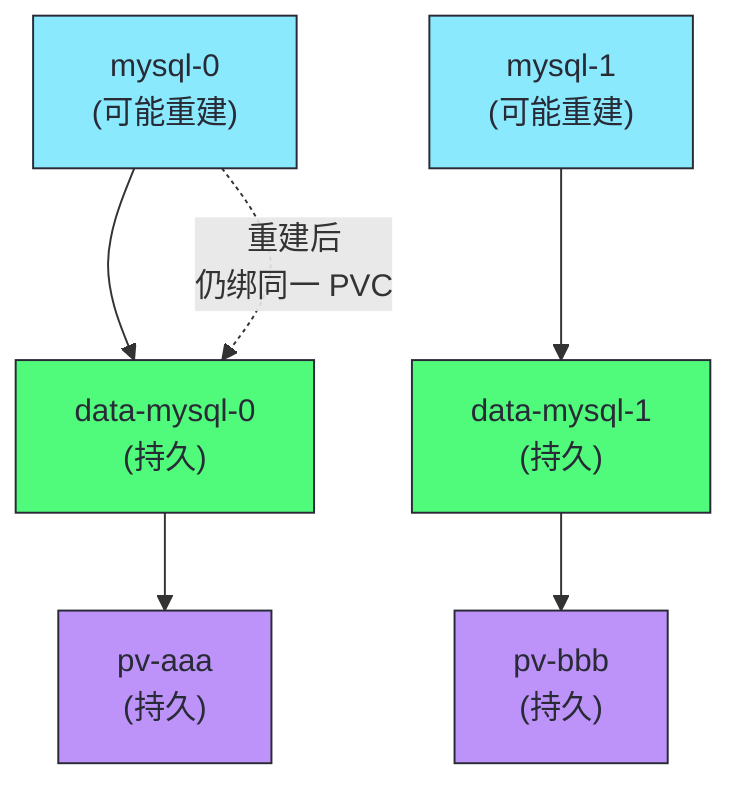

# 10 StatefulSet 深度解析：有序部署与持久化身份

**摘要：**
本文深入 Kubernetes StatefulSet 的设计与实现。StatefulSet 是为"有状态应用"设计的工作负载控制器——与 Deployment 的"无状态"假设不同，StatefulSet 保证 Pod 的稳定网络身份、有序部署/删除、持久化存储绑定。文章追溯 StatefulSet 的起源（PetSet 命名争议），讲透为什么有状态应用不能用 Deployment，拆解三大保证（稳定网络身份、有序部署、持久化存储绑定），讲透 Headless Service 的作用与 Pod 级 DNS 解析机制，讨论滚动更新策略（RollingUpdate/OnDelete/partition），分析典型应用场景（数据库主从、Kafka、Redis Cluster、ZooKeeper），最后讨论运维实践与边界。核心认知：StatefulSet 不是"更复杂的 Deployment"——它是有状态应用的编排工具，选择 StatefulSet 还是 Deployment 取决于应用是否有状态，而非"哪个更高级"。

---

## 第 1 章 为什么需要 StatefulSet

讲 StatefulSet，不能从"它有哪些字段"切入，而要先回答一个更根本的问题——Deployment 已经能管理 Pod 副本数与滚动更新，为什么还要单独发明一个 StatefulSet？答案藏在有状态应用与无状态应用的本质差异里。

### 1.1 Deployment 的无状态假设

Deployment 的设计基于一个核心假设——**Pod 是无状态的，任何 Pod 可以替换任何 Pod**。这个假设体现在 Deployment 的方方面面：Pod 名是随机生成的（`web-abc123-def456`），Pod 创建是并发的，Pod 重建后可能调度到不同节点，Service 通过负载均衡把请求分散到随机 Pod。对于无状态应用（Web 服务器、API 网关、无状态微服务），这个假设完全成立——客户端不关心连的是哪个 Pod，任何一个 Pod 都能服务任何一个请求。

但有状态应用不满足这个假设。有状态应用的核心特征是——**每个实例有独特的身份与状态，实例之间不可互换**。譬如 MySQL 主从集群，主节点与从节点角色不同，从节点必须连接特定的主节点同步数据；譬如 Kafka 集群，每个 broker 有独特的 broker.id，分区的 leader 固定在特定 broker 上；譬如 Redis Cluster，slot 分配绑定特定节点，节点间通过稳定地址通信。这些应用如果用 Deployment 跑，会遇到一系列无法回避的问题。

| 有状态应用的需求 | Deployment 的表现 | 问题 |
|----------------|-----------------|------|
| **稳定网络身份** | Pod 名随机（web-abc123） | 客户端无法通过名找到特定 Pod |
| **有序启动** | Pod 并发创建 | 集群需要先选主再选从 |
| **持久化存储绑定** | Pod 重建后可能用不同 PV | 数据"飘移"到不同节点 |
| **稳定 DNS** | Service 负载均衡到随机 Pod | 无法定位特定 Pod |

### 1.2 PetSet 的命名争议

StatefulSet 的历史值得简述。K8s 1.3 引入了 PetSet（宠物集）——"Pet"（宠物）与"Cattle"（家畜）的比喻来自云计算圈：无状态应用像家畜，坏了换一个就行，不关心个体身份；有状态应用像宠物，每个有名字、有身份、不可随意替换。PetSet 的命名精准传达了"有状态应用需要个体身份"的理念，但社区认为"Pet"这个比喻对新手不友好——不是所有人都熟悉 Pet vs Cattle 的典故。K8s 1.5 把 PetSet 重命名为 StatefulSet，沿用至今。

命名的变迁反映了 K8s 社区的一个权衡——**技术准确性与可理解性的权衡**。PetSet 更准确地传达了"个体身份"的理念，但门槛高；StatefulSet 更直白（"有状态的集合"），但弱化了"个体身份"这个核心。最终社区选择了可理解性，但理解 StatefulSet 的关键仍然是"个体身份"——这是 PetSet 时代就确立的核心设计，重命名没有改变它。

Pet vs Cattle 的比喻虽然被弱化，但它的工程含义值得深究。家畜（Cattle）模式的运维哲学是"坏了换一个"——不关心个体，只关心群体数量，这与 Deployment 的" replicas=3，任何一个 Pod 坏了重建一个"完全对应。宠物（Pet）模式的运维哲学是"坏了要修"——关心个体身份，每个个体有名字、有病历、有专属资源，这与 StatefulSet 的"mysql-0 有专属 PVC，坏了重建还是 mysql-0，挂载原 PVC"完全对应。

这个比喻的深层含义是——**有状态应用的运维成本高于无状态应用**。家畜模式的运维是规模化的——1000 个家畜与 10 个家畜的运维方式相同，都是"批量管理"。宠物模式的运维是个体化的——每个宠物需要单独照顾，1000 个宠物的运维成本是 10 个的 100 倍。这映射到 K8s——Deployment 的 Pod 可以批量管理（滚动更新、HPA 扩缩容都是批量操作），StatefulSet 的 Pod 需要逐个管理（有序部署、partition 灰度、逐个 PVC 清理）。生产中选择 StatefulSet 意味着接受更高的运维成本，这是有状态应用的固有代价。

### 1.3 典型有状态应用场景



| 场景 | 为什么需要 StatefulSet |
|------|---------------------|
| **数据库主从** | 从节点需要知道主节点地址（稳定 DNS），主节点先启动 |
| **Kafka 分区** | 分区 leader 固定在特定 broker，broker 需要稳定身份 |
| **Redis Cluster** | 节点间通过稳定地址通信，slot 分配绑定节点 |
| **ZooKeeper** | leader/follower 角色通过稳定身份选举 |

这些场景的共同特征是——**实例间有拓扑关系（主从、分区、slot 分配），拓扑关系依赖稳定身份**。数据库从节点配置主节点地址为 `mysql-0.mysql-headless`，这个 DNS 名必须始终解析到 mysql-0 这个 Pod，无论 mysql-0 重建到哪个节点；Kafka 的 broker.id 必须稳定且唯一，分区的 leader 选举依赖 broker.id 标识的特定 broker。如果身份不稳定（Pod 重建后名字变了），拓扑关系就断了——从节点找不到主节点，分区 leader 选举错乱。

> [!info] 核心概念：StatefulSet 不是"更复杂的 Deployment"
> StatefulSet 不是 Deployment 的"升级版"——它是有状态应用的编排工具，设计目标和 Deployment 完全不同。Deployment 追求"无状态、可替换、并发"，StatefulSet 追求"有身份、有序、持久"。用 StatefulSet 跑无状态应用是过度设计——增加复杂度但无收益。用 Deployment 跑有状态应用是错误——无法保证有状态应用的一致性需求。选择基于应用是否有状态，而非"哪个更高级"。

---

## 第 2 章 稳定网络身份：StatefulSet 的第一大保证

StatefulSet 的三大保证中，稳定网络身份是最基础的——它是有状态应用拓扑关系的基础。理解稳定网络身份，需要从 Pod 命名规则与 DNS 解析机制两个层面展开。

### 2.1 Pod 命名规则

StatefulSet 的 Pod 名遵循固定模式：`<statefulset-name>-<ordinal>`。

```yaml
apiVersion: apps/v1
kind: StatefulSet
metadata:
  name: mysql
spec:
  serviceName: mysql-headless  # 必须指定 Headless Service
  replicas: 3
  # ...
```

创建的 Pod 名为：`mysql-0`、`mysql-1`、`mysql-2`（有序，可预测）。这与 Deployment 的随机 Pod 名（`mysql-abc123-def456`）形成鲜明对比——StatefulSet 的 Pod 名是确定性的，序号从 0 开始递增，客户端可以在 Pod 创建前就预测它的名字。

这个命名规则看似简单，但它是有状态应用的基石。数据库从节点配置主节点地址为 `mysql-0.mysql-headless`——这个地址在 StatefulSet 创建 mysql-0 时就确定了，无论 mysql-0 重建多少次、调度到哪个节点，它的名字始终是 `mysql-0`。客户端不需要"发现"主节点地址，它写死在配置里，DNS 解析负责把名字映射到当前 IP。

### 2.2 DNS 解析机制

StatefulSet 配合 Headless Service 提供三层 DNS 解析：

| DNS 名 | 解析为 |
|--------|--------|
| `mysql-0.mysql-headless.default.svc.cluster.local` | mysql-0 的 Pod IP |
| `mysql-1.mysql-headless.default.svc.cluster.local` | mysql-1 的 Pod IP |
| `mysql-headless.default.svc.cluster.local` | 随机一个 Pod IP |

第一层是 Pod 级 DNS——`<pod-name>.<headless-service-name>` 解析到特定 Pod 的 IP。这是 StatefulSet 独有的能力，普通 Service 不提供。第二层是 Service 级 DNS——`<headless-service-name>` 解析到所有 Pod IP 的集合（客户端自行选择）。第三层是标准的 Service DNS。

Pod 级 DNS 是稳定网络身份的技术实现。当 mysql-0 重建到新节点，它的 IP 变了，但 `mysql-0.mysql-headless` 这个 DNS 名不变——CoreDNS 监听 Pod 事件，自动更新 DNS 记录，把 `mysql-0.mysql-headless` 指向新 IP。客户端用 DNS 名连接，不关心 IP 变化——这是"稳定身份、动态 IP"的解耦。

这个解耦的工程价值在有状态应用中尤为突出。考虑数据库主从切换的场景——主节点 mysql-0 故障，提升从节点 mysql-1 为新主。从节点配置中主节点地址是 `mysql-0.mysql-headless`，切换后需要把请求重定向到 mysql-1。如果没有 Pod 级 DNS，客户端需要重新配置主节点 IP，或者引入额外的服务发现组件。有了 Pod 级 DNS，客户端可以分别配置 `mysql-0.mysql-headless` 与 `mysql-1.mysql-headless`，切换时只改连接目标，DNS 解析自动指向正确的 Pod。

### 2.3 CoreDNS 的 Pod DNS 记录

Pod 级 DNS 的底层实现依赖 CoreDNS 的 Kubernetes 插件。CoreDNS 监听 Service 与 Endpoints 对象，为 Headless Service 的每个后端 Pod 创建 A 记录（IPv4）或 AAAA 记录（IPv6）。记录的格式是 `<pod-name>.<headless-service-name>.<namespace>.svc.cluster.local`，值是 Pod 的 IP。

这里有一个细节值得注意——Pod 的 IP 不是固定的，Pod 重建后 IP 会变。CoreDNS 如何保证 DNS 记录及时更新？答案是 Endpoints 对象——Headless Service 的 Endpoints 列出所有后端 Pod 的 IP，Pod 重建后 Endpoints 更新，CoreDNS 监听 Endpoints 变化，自动更新 DNS 记录。这个链路是：Pod 重建 → IP 变化 → Endpoints 更新 → CoreDNS 更新 DNS 记录 → 客户端解析到新 IP。整个过程是自动的、最终一致的，延迟通常在秒级。

但这个链路有一个边界条件——Pod 重建到新 IP 与 CoreDNS 更新 DNS 记录之间有短暂窗口，窗口内客户端可能解析到旧 IP。这个窗口的长度取决于 CoreDNS 的同步间隔与 Endpoints 控制器的处理速度，通常在 1-5 秒。对于强依赖 DNS 实时性的应用（譬如连接池在 DNS 更新前就建立连接），这个窗口可能导致短暂连接失败。生产中可以通过客户端重试机制（连接失败重试，重试时重新解析 DNS）缓解。

### 2.4 Headless Service：为什么不用普通 Service

```yaml
apiVersion: v1
kind: Service
metadata:
  name: mysql-headless
spec:
  clusterIP: None  # Headless：没有 ClusterIP
  selector:
    app: mysql
  ports:
    - port: 3306
```

| 维度 | 普通 Service | Headless Service |
|------|------------|-----------------|
| **ClusterIP** | 有（虚拟 IP） | None（无虚拟 IP） |
| **DNS 解析** | 返回 ClusterIP | 返回所有 Pod IP |
| **负载均衡** | kube-proxy 规则 | 客户端自行选择 |
| **Pod 级 DNS** | 不支持 | 支持（`<pod-name>.<svc>`） |
| **用途** | 无状态应用负载均衡 | 有状态应用定位特定 Pod |

普通 Service 与 Headless Service 的核心区别在于 ClusterIP。普通 Service 有一个虚拟 ClusterIP，DNS 解析返回这个 ClusterIP，kube-proxy 在节点上维护 iptables/IPVS 规则把流量负载均衡到后端 Pod——客户端不知道也不关心连的是哪个 Pod。Headless Service 的 `clusterIP: None` 表示没有虚拟 IP，DNS 解析直接返回所有后端 Pod 的 IP——客户端自行决定连哪个 Pod。

更关键的区别是 Pod 级 DNS。普通 Service 不支持 `<pod-name>.<service-name>` 的 DNS 解析——因为 Pod 名是随机的，解析它没有意义。Headless Service 配合 StatefulSet 的稳定 Pod 名，支持 `<pod-name>.<headless-service-name>` 解析到特定 Pod——这是 StatefulSet 稳定网络身份的 DNS 基础。

> [!info] 核心概念：Headless Service 让客户端能定位特定 Pod
> 普通 Service 的 DNS 返回 ClusterIP——客户端不知道连的是哪个 Pod。Headless Service 的 DNS 返回所有 Pod IP——客户端可以自行选择连哪个。更关键的是，`<pod-name>.<headless-service-name>` 的 DNS 解析返回特定 Pod 的 IP——这使得"mysql-0" 的地址始终可预测。数据库从节点配置 `master-host=mysql-0.mysql-headless`，无论 mysql-0 重建到哪个节点，DNS 都能解析到它的新 IP。这是 StatefulSet 稳定网络身份的基础。

### 2.5 serviceName 的强制要求

StatefulSet 的 `spec.serviceName` 字段是必填的——它必须指向一个 Headless Service。这个强制要求不是任性的，而是有技术原因的——StatefulSet 控制器创建 Pod 时，依赖 Headless Service 为每个 Pod 创建 DNS A 记录，没有 Headless Service 就没有 Pod 级 DNS，稳定网络身份就无从谈起。

如果 serviceName 指向普通 Service（有 ClusterIP），StatefulSet 仍然能创建 Pod，但 Pod 级 DNS 不会生效——`mysql-0.mysql-headless` 无法解析。这会导致依赖 Pod 级 DNS 的应用（譬如从节点配置 `master-host=mysql-0.mysql-headless`）无法工作。生产中一个常见错误是把 serviceName 指向普通 Service，结果应用启动报"无法解析主节点地址"——排查时需要确认 Service 的 `clusterIP: None`。

---

## 第 3 章 有序部署与删除：StatefulSet 的第二大保证

稳定网络身份解决了"叫什么"的问题，有序部署解决"谁先启动"的问题。有状态应用的启动通常有依赖关系——数据库先启动主节点再启动从节点，ZooKeeper 先启动 leader 再启动 follower，StatefulSet 用有序部署保证这种依赖。

### 3.1 创建与删除的顺序



| 操作 | 顺序 | 等待条件 |
|------|------|---------|
| **创建** | 0 → 1 → 2 | 前一个 Pod Ready 且 Running 才创建下一个 |
| **删除** | 2 → 1 → 0 | 逆序删除 |
| **扩容** | 从当前最大序号 +1 | 有序创建 |
| **缩容** | 从当前最大序号开始 | 有序删除 |

创建顺序是正序（0→1→2），删除顺序是逆序（2→1→0），这个设计是有深意的。创建正序保证主节点（通常是序号 0）先启动——数据库主从架构中，从节点需要连接主节点同步数据，主节点必须先就绪；ZooKeeper 集群中，第一个启动的节点通常成为初始 leader。删除逆序保证主节点最后删除——缩容时先删从节点，保留主节点维持服务可用性。

创建时的等待条件是"前一个 Pod Ready 且 Running"——不是"前一个 Pod 创建"，而是"前一个 Pod 就绪"。这个区别很重要——Ready 表示 Pod 通过了 readiness probe，应用真正可以服务了。如果只等"创建"，前一个 Pod 可能还在启动（譬如 MySQL 正在做崩溃恢复），后一个 Pod 就开始创建，从节点连接主节点会失败。等"Ready"保证前一个 Pod 真正可用后才开始下一个。

这里有一个生产中容易踩的坑——如果 readiness probe 配置不当（譬如检查过于宽松，应用还没真正就绪就返回成功），OrderedReady 的有序保证就失效了。譬如 MySQL 主节点还在做崩溃恢复（恢复期间不接连接），但 readiness probe 只检查端口是否监听（端口在恢复早期就监听了），后一个 Pod 会以为主节点就绪，开始创建并连接主节点同步——连接失败，从节点启动报错。生产中 readiness probe 应该检查应用真正可服务的条件（譬如 MySQL 用 `mysqladmin ping` 检查是否可查询），而非简单的端口检查。

### 3.2 podManagementPolicy：OrderedReady 与 Parallel

```yaml
spec:
  podManagementPolicy: OrderedReady  # 默认：有序。或 Parallel：并行
```

OrderedReady（默认）是上述的有序模式——前一个 Ready 才创建下一个。Parallel 是并行模式——所有 Pod 同时创建，不等待彼此。

| 模式 | 创建顺序 | 适用场景 |
|------|---------|---------|
| **OrderedReady** | 0→1→2，前一个 Ready 才创建下一个 | 需要严格有序的应用（数据库主从、ZooKeeper） |
| **Parallel** | 0/1/2 同时创建 | 不需要有序的应用（Redis Cluster、分片数据库） |

> [!warning] 生产避坑：OrderedReady 在大规模时部署慢
> `OrderedReady`（默认）要求前一个 Pod Ready 才创建下一个——5 个 Pod 的 StatefulSet，如果每个 Pod 启动需 30 秒，总部署时间 150 秒。对于不需要严格有序的应用（如 Redis Cluster），用 `podManagementPolicy: Parallel` 并行创建，大幅缩短部署时间。但注意——并行模式不保证有序，有状态应用需自行处理启动顺序。

Parallel 模式的选择需要谨慎——它放弃了有序保证，要求应用自行处理启动顺序。Redis Cluster 是一个适合 Parallel 的例子——Redis Cluster 的节点间通过 gossip 协议互相发现，不需要严格有序启动，所有节点同时启动后能自行组成集群。但数据库主从不适合 Parallel——从节点启动时需要主节点已就绪，并行启动会导致从节点连接主节点失败。

### 3.3 有序性的实现机制

StatefulSet 控制器实现有序性的机制值得了解。控制器维护一个"期望序号"——当前应该创建的下一个 Pod 的序号。创建时，控制器检查序号 N-1 的 Pod 是否 Ready，Ready 才创建序号 N 的 Pod，然后等待序号 N Ready 才创建序号 N+1。删除时逆序——控制器检查序号 N 的 Pod 是否已删除，删除后才删除序号 N-1。

这个机制依赖协调循环的持续检查——控制器每次 Reconcile 都检查所有 Pod 的状态，决定下一步操作。如果某个 Pod 卡在 Pending（譬如资源不足），后续 Pod 都不会创建——StatefulSet 会"卡住"在当前序号。这种"卡住"是设计而非 bug——它保证有序性，但生产中需要监控 StatefulSet 的部署进度，避免长时间卡住无人发现。

---

## 第 4 章 持久化存储绑定：StatefulSet 的第三大保证

稳定网络身份与有序部署解决了"身份"与"顺序"的问题，持久化存储绑定解决"数据"的问题。有状态应用的核心是状态——数据必须持久化，且数据与 Pod 的绑定关系必须稳定。

### 4.1 volumeClaimTemplates

```yaml
spec:
  volumeClaimTemplates:  # PVC 模板
    - metadata:
        name: data
      spec:
        accessModes: ["ReadWriteOnce"]
        resources:
          requests:
            storage: 10Gi
```

StatefulSet 通过 `volumeClaimTemplates` 为每个 Pod 创建独立的 PVC。PVC 的命名遵循 `<volume-claim-template-name>-<statefulset-name>-<ordinal>` 模式——譬如上面的模板为 mysql StatefulSet 创建 `data-mysql-0`、`data-mysql-1`、`data-mysql-2` 三个 PVC。

PVC 的命名规则保证了 Pod 重建后绑定同一个 PVC。StatefulSet Controller 在创建 Pod 时，根据 ordinal 计算 PVC 名，检查该 PVC 是否已存在——存在则直接挂载，不存在则根据 volumeClaimTemplates 创建新 PVC。Pod 删除时，PVC 不会被自动删除（这是设计而非 bug）——PVC 保留使得 Pod 重建后能恢复数据。如果需要清理 PVC，必须手动删除（`kubectl delete pvc data-mysql-0`）。这种"PVC 生命周期独立于 Pod"的设计是有状态应用数据持久性的基础，但也要求运维人员手动管理 PVC 清理，否则缩容后 PVC 会残留，造成存储资源浪费。

| Pod | PVC 名 | 绑定的 PV |
|-----|--------|----------|
| mysql-0 | data-mysql-0 | pv-aaa |
| mysql-1 | data-mysql-1 | pv-bbb |
| mysql-2 | data-mysql-2 | pv-ccc |

**关键保证**：mysql-0 重建后，仍然绑定 `data-mysql-0` PVC，而 `data-mysql-0` 仍然绑定 `pv-aaa`——数据不会"飘移"。



### 4.2 PVC 与 Pod 的解耦

volumeClaimTemplates 的核心设计是——**PVC 与 Pod 解耦，PVC 的生命周期独立于 Pod**。Pod 重建后，控制器查找同名 PVC（`data-mysql-0`），如果存在就重新挂载——PVC 与 PV 的绑定关系不变，数据不丢失。这与 Deployment 的存储模型截然不同——Deployment 如果用 PVC，多个 Pod 共享一个 PVC，或者每个 Pod 用临时 volume（Pod 删除数据丢失）。

PVC 与 Pod 解耦的另一个后果是——**缩容不删除 PVC**。StatefulSet 从 3 副本缩容到 1 副本，删除 mysql-2 与 mysql-1 的 Pod，但保留 `data-mysql-2` 与 `data-mysql-1` 两个 PVC。这是为了防止数据丢失——如果后续扩容回 3 副本，PVC 仍在，mysql-2 重建后挂载原 PVC，数据恢复。这种"缩容保留 PVC"的设计是有状态应用数据安全的保护，但也意味着缩容不释放存储——需要手动清理。

PVC 的生命周期与 StatefulSet 的关系值得厘清。PVC 在 Pod 创建时由 StatefulSet 控制器根据 volumeClaimTemplates 自动创建，但 PVC 不会随 Pod 删除而删除——PVC 的删除只发生在两种情况：第一，删除 StatefulSet 时用级联删除（默认），PVC 随之删除；第二，手动删除 PVC。这意味着 PVC 的生命周期实际上与 StatefulSet 对象绑定，而非与 Pod 绑定。如果用 `--cascade=orphan` 删除 StatefulSet，PVC 保留；如果用默认级联删除，PVC 随 StatefulSet 一起删除——这是生产中需要警惕的，误删 StatefulSet 可能导致数据丢失。

> [!info] 核心概念：PVC 与 Pod 解耦保证数据不飘移
> Deployment 的 Pod 重建后可能调度到不同节点，如果用共享 PV，数据可能"飘移"。StatefulSet 通过 volumeClaimTemplates 为每个 Pod 创建独立 PVC——PVC 和 PV 的绑定是持久的，Pod 重建后仍绑同一 PVC。即使 Pod 调度到不同节点，PV 的数据仍在原节点（除非用网络存储如 NFS/Ceph）。这是 StatefulSet 保证数据一致性的核心机制。

### 4.3 存储类与 PV 绑定

volumeClaimTemplates 创建的 PVC 可以指定 storageClassName，控制使用哪种存储。如果用动态供应（dynamic provisioning），PVC 创建后 StorageClass 自动创建 PV 并绑定；如果用静态供应（static provisioning），PVC 从已有的 PV 中匹配。

```yaml
volumeClaimTemplates:
  - metadata:
      name: data
    spec:
      storageClassName: fast-ssd  # 指定 StorageClass
      accessModes: ["ReadWriteOnce"]
      resources:
        requests:
          storage: 50Gi
```

accessModes 的选择影响 Pod 的调度。`ReadWriteOnce`（RWO）表示 PV 只能被一个节点以读写方式挂载——这意味着 Pod 重建后如果调度到不同节点，原节点上的 PV 需要先卸载才能在新节点挂载。如果用本地存储（local PV），PV 绑定在特定节点，Pod 重建后必须调度回原节点才能挂载——这限制了 Pod 的可迁移性。如果用网络存储（NFS、Ceph、EBS），PV 不绑定特定节点，Pod 可以调度到任何节点并挂载——这是有状态应用推荐用网络存储的原因。

| accessMode | 含义 | 适用场景 |
|-----------|------|---------|
| **ReadWriteOnce（RWO）** | 单节点读写 | 单副本有状态应用（数据库主从的每个 Pod） |
| **ReadOnlyMany（ROX）** | 多节点只读 | 只读数据共享（配置文件、静态资源） |
| **ReadWriteMany（RWX）** | 多节点读写 | 共享存储（NFS、CephFS）——慎用于有状态应用 |

StatefulSet 的 volumeClaimTemplates 通常用 ReadWriteOnce——每个 Pod 独占一个 PV，避免多 Pod 同时写导致数据竞争。ReadWriteMany 看似方便（多 Pod 共享存储），但对于数据库这种需要独占访问的应用是危险的——两个 MySQL Pod 同时写同一 PV，数据会损坏。ReadWriteMany 适合真正需要共享读写的场景（譬如多个 Web Pod 共享上传目录），这种场景通常用 Deployment 而非 StatefulSet。

存储类型的选择是有状态应用架构的关键决策。本地存储（local PV）性能最好（无网络开销），但 Pod 绑定节点，节点故障数据不可达；网络存储（NFS/Ceph/EBS）性能略低（网络开销），但 Pod 可跨节点迁移，节点故障数据仍可达。对于性能敏感且能容忍节点故障数据丢失的应用（譬如缓存），本地存储可接受；对于数据安全性要求高的应用（譬如数据库），网络存储是必须的。这个权衡没有银弹——性能与可用性往往不可兼得。

---

## 第 5 章 滚动更新策略

讲完了三大保证，接下来看 StatefulSet 的滚动更新。StatefulSet 的滚动更新与 Deployment 的滚动更新机制截然不同——它是"有序逆序更新"，而非 Deployment 的"两个 ReplicaSet 扩缩容交替"。这种差异源于 StatefulSet 的 PVC 独占绑定——同一序号不能有两个 Pod 同时存在，决定了更新必须先删后建。

### 5.1 RollingUpdate：有序逆序更新

```yaml
spec:
  updateStrategy:
    type: RollingUpdate
    rollingUpdate:
      partition: 0  # 默认 0，更新所有 Pod。>0 时只更新序号 >= partition 的 Pod
```

滚动更新顺序：**从最大序号开始，逆序更新**

```
更新前：mysql-0(v1), mysql-1(v1), mysql-2(v1)
更新中：mysql-0(v1), mysql-1(v1), mysql-2(v2)  ← 先更新 mysql-2
更新中：mysql-0(v1), mysql-1(v2), mysql-2(v2)  ← 再更新 mysql-1
更新后：mysql-0(v2), mysql-1(v2), mysql-2(v2)  ← 最后更新 mysql-0
```

逆序更新的设计与创建正序、删除逆序一脉相承——**主节点（序号 0）最后更新**。数据库主从架构中，主节点是写入入口，最后更新主节点意味着更新过程中从节点先升级到新版本，验证新版本与主节点的兼容性，最后才更新主节点。如果先更新主节点，主节点用新版本，从节点用旧版本，可能出现协议不兼容导致复制中断。

逆序更新还有一个细节——更新序号 N 的 Pod 时，控制器先删除旧 Pod，等待旧 Pod 完全终止，再创建新 Pod。这与 Deployment 的"先创建新 Pod 再删旧 Pod"不同——StatefulSet 不允许同一序号有两个 Pod 同时存在，因为 PVC 绑定是唯一的，两个同名 Pod 会争抢同一个 PVC。这种"先删后建"的语义意味着更新过程中该序号的 Pod 短暂不可用——这是 StatefulSet 滚动更新的代价。

这个"先删后建"的中断期是 StatefulSet 滚动更新与 Deployment 滚动更新的本质差异。Deployment 的滚动更新通过 maxSurge 允许新旧 Pod 同时存在，实现零停机——新 Pod 就绪后才删旧 Pod，整个过程中服务始终可用。StatefulSet 无法做到这一点——PVC 的独占绑定使得同一序号不能有两个 Pod，更新必须先删后建，该序号的 Pod 在更新期间不可用。对于数据库这种有状态应用，这个中断期通常可以接受——数据库主从架构中，更新从节点时主节点仍可服务，从节点短暂不可用只影响读请求（且可以通过多从节点分担）。但对于单副本的有状态应用，更新期间服务完全不可用——这是 StatefulSet 滚动更新的固有代价。

K8s 1.27 引入了 StatefulSet 的 `maxUnavailable` 参数（与 Deployment 的同名参数类似），允许在滚动更新时同时删除多个 Pod（不超过 maxUnavailable），加快更新速度。但这仍然不改变"先删后建"的语义——只是允许同时删多个，而非同时存在新旧。maxUnavailable 的默认值是 1，意味着一次只更新一个 Pod。

### 5.2 partition：灰度更新

```yaml
updateStrategy:
  rollingUpdate:
    partition: 2  # 只更新序号 >= 2 的 Pod
```

```
partition=2: 只更新 mysql-2，mysql-0/1 保持旧版本
partition=1: 更新 mysql-1/2，mysql-0 保持旧版本
partition=0: 更新所有 Pod
```

partition 参数实现灰度更新——只更新序号 >= partition 的 Pod，序号 < partition 的 Pod 保持旧版本。这个机制适合"先小范围验证再全量更新"的场景——先设 partition=2，只更新 mysql-2，观察新版本是否有问题；验证通过后降低 partition 到 1，更新 mysql-1；最后 partition=0，更新所有 Pod。partition 灰度是 StatefulSet 安全升级的核心手段。

partition 的一个特殊用法是设为 replicas 数（如 replicas=3，partition=3），此时没有任何 Pod 会被更新——所有 Pod 保持旧版本。这在"准备升级但还没开始"的场景有用——先修改 spec.template（新镜像），同时设 partition=replicas，此时 spec 已变但 Pod 不变；需要开始升级时降低 partition，Pod 开始按逆序更新。这种"先改 spec 再逐步推进"的模式让升级过程可控，适合关键数据库的运维操作，是生产环境推荐的升级实践。

> [!info] 核心概念：partition 实现金丝雀发布
> partition 参数允许灰度更新——先更新序号最大的 Pod（如 mysql-2），验证新版本无问题后再逐步降低 partition（2→1→0），扩大更新范围。这是 StatefulSet 的金丝雀发布机制——先在小范围验证，再全量更新。对于数据库等关键有状态应用，partition 灰度是安全升级的重要工具。

### 5.3 OnDelete：手动触发更新

```yaml
updateStrategy:
  type: OnDelete  # 不自动更新，手动删除 Pod 时才更新
```

OnDelete 模式下，修改 spec.template 后不会自动更新 Pod——只有手动删除 Pod 时，重建的 Pod 才用新版本。这给了运维人员完全控制——可以选择在维护窗口手动删除 Pod 触发更新。

OnDelete 与 RollingUpdate 的选择是"自动化程度"与"控制粒度"的权衡。RollingUpdate 自动按序更新，省心但缺乏人工介入点；OnDelete 完全手动，控制精细但需要人工操作。对于关键有状态应用（譬如生产数据库），OnDelete 更稳妥——运维人员可以选择在低峰期逐个删除 Pod，每次删除后验证服务正常再删下一个。对于非关键应用，RollingUpdate 更省心——一次配置，自动完成。

### 5.4 滚动更新的暂停与恢复

StatefulSet 的滚动更新可以通过 `spec.paused` 暂停——暂停后控制器停止更新操作，当前状态保持不变。这适合"更新到一半发现问题，暂停排查"的场景。暂停后排查完毕，取消暂停，更新继续。

但 StatefulSet 的 paused 机制不如 Deployment 的成熟——Deployment 的 paused 可以在滚动更新中途暂停，StatefulSet 的 paused 行为在某些版本中不够稳定。生产中更稳妥的做法是用 partition 控制更新范围——设 partition 为当前最大序号 +1，等于"暂停"更新（没有 Pod 的序号 >= partition+1），排查后再降低 partition 恢复更新。

---

## 第 6 章 StatefulSet 的典型应用

讲完了机制，接下来看 StatefulSet 在实际有状态应用中的落地。这些例子不是"Hello World"教程，而是展示 StatefulSet 的设计如何匹配有状态应用的需求。

### 6.1 数据库主从架构

```yaml
apiVersion: apps/v1
kind: StatefulSet
metadata:
  name: mysql
spec:
  serviceName: mysql-headless
  replicas: 3
  selector:
    matchLabels:
      app: mysql
  template:
    metadata:
      labels:
        app: mysql
    spec:
      containers:
        - name: mysql
          image: mysql:8.0
          env:
            - name: MYSQL_MASTER
              value: "mysql-0.mysql-headless"  # 主节点地址稳定
          volumeMounts:
            - name: data
              mountPath: /var/lib/mysql
  volumeClaimTemplates:
    - metadata:
        name: data
      spec:
        accessModes: ["ReadWriteOnce"]
        resources:
          requests:
            storage: 50Gi
---
apiVersion: v1
kind: Service
metadata:
  name: mysql-headless
spec:
  clusterIP: None
  selector:
    app: mysql
  ports:
    - port: 3306
```

| Pod | 角色 | 数据 |
|-----|------|------|
| mysql-0 | 主节点 | 独立 PVC（读写） |
| mysql-1 | 从节点 | 独立 PVC（复制主节点） |
| mysql-2 | 从节点 | 独立 PVC（复制主节点） |

这个配置体现了 StatefulSet 三大保证的协同。稳定网络身份——从节点配置 `MYSQL_MASTER=mysql-0.mysql-headless`，无论 mysql-0 重建到哪个节点，DNS 都能解析到它。有序部署——mysql-0 先启动成为主节点，mysql-1 与 mysql-2 后启动连接主节点同步。持久化存储——每个 Pod 有独立 PVC，主节点的写入持久化在 data-mysql-0，从节点的复制数据持久化在各自的 PVC。

### 6.2 Kafka 集群

Kafka 的 broker.id 需要稳定且唯一——StatefulSet 的序号（0,1,2）天然适合作为 broker.id。

```yaml
spec:
  template:
    spec:
      containers:
        - name: kafka
          env:
            - name: BROKER_ID
              valueFrom:
                fieldRef:
                  fieldPath: metadata.labels['controller.kubernetes.io/pod-index']
                  # K8s 1.28+ 支持 pod-index label，值为序号
```

K8s 1.28 引入了 `controller.kubernetes.io/pod-index` label，值为 Pod 在 StatefulSet 中的序号——这解决了"如何让 Pod 知道自己的序号"的问题。在此之前，应用需要通过 Pod 名解析序号（譬如用正则提取 `mysql-0` 中的 `0`），或者用 initContainer 把序号写入文件。pod-index label 提供了官方的、稳定的序号获取方式，简化了有状态应用的配置。

Kafka 用 broker.id 标识 broker，分区（partition）的 leader 选举依赖 broker.id——如果 broker.id 不稳定（broker 重启后 id 变了），分区 leader 选举会错乱。StatefulSet 的序号作为 broker.id，保证 broker 重启后 id 不变，分区拓扑稳定。

### 6.3 Redis Cluster 与 ZooKeeper

Redis Cluster 的 slot 分配绑定特定节点——16384 个 slot 分散到多个节点，每个节点负责一部分 slot。节点间通过稳定地址通信，slot 迁移需要明确源节点与目标节点。StatefulSet 的稳定网络身份使得 Redis Cluster 节点地址可预测，slot 分配与迁移有明确的源与目标。

Redis Cluster 的一个有趣之处是它不需要严格有序启动——节点间通过 gossip 协议互相发现，所有节点同时启动后能自行组成集群。这意味着 Redis Cluster 适合用 `podManagementPolicy: Parallel` 并行启动，大幅缩短部署时间。这是 StatefulSet 灵活性的体现——稳定身份与有序部署是两个独立的保证，应用可以只取稳定身份而放弃有序部署（用 Parallel），也可以两者都要（用 OrderedReady）。

ZooKeeper 的 leader/follower 角色通过稳定身份选举——ZooKeeper 用 myid 标识节点，leader 选举依赖 myid 的稳定。StatefulSet 的序号作为 myid，保证节点重启后 myid 不变，leader 选举稳定。ZooKeeper 的有序部署还匹配其启动协议——第一个启动的节点（myid=1）通常成为初始 leader，后续节点加入时连接 leader 同步数据。

ZooKeeper 的存储需求有一个细节——除了数据日志，ZooKeeper 还需要独立的快照存储与事务日志（为了顺序写性能，事务日志必须独占磁盘）。这意味着 ZooKeeper 的 StatefulSet 可能需要两个 volumeClaimTemplates——一个用于数据，一个用于事务日志。volumeClaimTemplates 支持多个模板，每个模板创建一组 PVC，这种灵活性使得 StatefulSet 能匹配复杂存储需求的应用。

### 6.4 Elasticsearch 与分布式存储

Elasticsearch 是另一个典型的有状态应用——每个节点存储索引的分片（shard），分片的主副本分布在不同节点上。Elasticsearch 节点需要稳定身份（节点名）与持久化存储（索引数据），StatefulSet 提供这两者。Elasticsearch 的集群发现依赖节点名——节点重启后名字不变，集群能识别它是"老节点"而非"新节点"，分片分配保持稳定。

Elasticsearch 的存储需求通常很大（索引数据可能 TB 级），且对 IO 性能敏感（搜索延迟依赖磁盘速度）。生产中通常用 SSD 存储类（storageClassName 指向 fast-ssd），并设置合理的存储配额。Elasticsearch 的滚动更新需要特别小心——节点更新期间分片会重新分配，如果同时更新多个节点，分片重新分配可能压垮集群。partition 灰度更新是 Elasticsearch 升级的标准做法——先更新一个节点，等集群状态稳定（green）后再更新下一个。

这些应用的共同特征是——**拓扑关系依赖稳定身份**。StatefulSet 提供稳定身份（Pod 名、序号、DNS），应用基于稳定身份构建拓扑（主从、分区、slot、leader、shard），拓扑关系不会因为 Pod 重建而断裂。这是 StatefulSet 相比 Deployment 的核心价值——它让有状态应用的拓扑管理成为可能。

---

## 第 7 章 StatefulSet 运维实践

讲完了设计与典型应用，最后看 StatefulSet 在生产运维中的实践。有状态应用的运维比无状态应用复杂——数据不能丢、顺序不能乱、存储不能飘，这些约束使得 StatefulSet 的运维有一系列特殊考量。

### 7.1 Pod 手动删除与 PVC 保留

```bash
# 删除 Pod（PVC 保留）
kubectl delete pod mysql-2
# StatefulSet 控制器会重建 mysql-2，绑定同一 PVC
```

```bash
# 删除 StatefulSet 但保留 Pod 和 PVC
kubectl delete statefulset mysql --cascade=orphan
```

删除 Pod 后，StatefulSet 控制器会发现"期望 3 个 Pod，当前 2 个"，重新创建 mysql-2，新 mysql-2 挂载原 PVC（data-mysql-2），数据恢复。这是 StatefulSet 自愈能力的体现——Pod 重建不影响数据。

删除 StatefulSet 时，默认级联删除会删除所有 Pod 与 PVC（取决于级联策略）。如果只想删除 StatefulSet 对象但保留 Pod 与 PVC（譬如迁移到新 StatefulSet），用 `--cascade=orphan`——Pod 与 PVC 成为"孤儿"继续运行，新 StatefulSet 可以接管。

> [!warning] 生产避坑：缩容不删除 PVC
> StatefulSet 缩容时（replicas 从 3 改为 1），只删除 Pod（mysql-2, mysql-1），不删除 PVC（data-mysql-2, data-mysql-1 保留）。这是为了防止数据丢失——如果后续扩容回来，PVC 仍在，数据可恢复。但这也意味着缩容不释放存储——如果确实需要释放，手动删除 PVC：`kubectl delete pvc data-mysql-2`。删除 PVC 前确保数据已备份或不再需要。

### 7.2 节点故障时的处理

节点故障时，该节点上的 StatefulSet Pod 处于 "Unknown" 或 "Terminating" 状态。由于 PVC 绑定了该节点的 PV（如果是本地存储），Pod 无法在其他节点重建。

```bash
# 强制删除 Pod（绕过 grace period）
kubectl delete pod mysql-2 --force --grace-period=0
# Pod 在其他节点重建，但如果 PV 是本地存储，数据丢失
```

节点故障的恢复取决于存储类型。如果 PV 是网络存储（NFS、Ceph、EBS），Pod 重建到其他节点后可以重新挂载同一 PV——数据安全，因为数据不在节点本地，而在网络存储后端。如果 PV 是本地存储（local PV），PV 绑定在故障节点，Pod 重建到其他节点后无法挂载原 PV——数据"卡"在故障节点，Pod 启动后是空数据。

> [!info] 核心概念：节点故障时 StatefulSet 的数据安全取决于存储类型
> 如果 PV 是网络存储（NFS、Ceph、EBS），Pod 重建到其他节点后可以重新挂载同一 PV——数据安全。如果 PV 是本地存储（local PV），Pod 重建到其他节点后无法挂载原 PV——数据"卡"在故障节点。对于关键有状态应用，用网络存储（或至少有副本的存储）保证节点故障时数据可访问。

强制删除 Pod（`--force --grace-period=0`）是节点故障时的紧急手段——正常删除 Pod 需要等待 kubelet 优雅终止，但节点故障时 kubelet 不可达，Pod 会一直处于 Terminating。强制删除绕过 grace period，立即从 etcd 删除 Pod 对象，StatefulSet 控制器发现 Pod 缺失，在其他节点重建。但强制删除有风险——如果原节点实际没故障（只是网络分区），原 Pod 可能还在运行，新 Pod 也在运行，两个同名 Pod 同时挂载同一 PVC，可能导致数据损坏。生产中强制删除前应确认节点确实故障（譬如标记节点为 NotReady、驱逐节点）。

K8s 1.25 引入了 `maxUnavailable` 参数对 StatefulSet 的支持，但节点故障场景中还有一个相关参数：`minReadySeconds`。`minReadySeconds` 定义 Pod 在被标记为 Ready 之前必须保持运行的最小秒数（默认 0）。对于有状态应用，设置 `minReadySeconds` 为 30-60 秒可以防止 Pod 刚启动就被认为就绪——应用可能需要时间加载数据、建立连接、完成初始化。如果 `minReadySeconds` 为 0，Pod 启动后立即 Ready，StatefulSet 控制器立即创建下一个 Pod，但前一个 Pod 可能还没真正就绪，导致级联问题，影响整体部署的稳定性。

这种"两个同名 Pod 同时运行"的风险被称为**脑裂**（Split-Brain）。脑裂的根因是分布式系统无法区分"节点真的故障了"与"节点只是网络分区但还在运行"。K8s 用 grace period 机制缓解——正常删除 Pod 时设置 grace period（默认 30 秒），kubelet 在 grace period 内优雅终止 Pod，超时后强制终止。但节点故障时 kubelet 不可达，grace period 机制失效，只能用 `--force --grace-period=0` 绕过。绕过 grace period 的代价是放弃了"确认原 Pod 已终止"的保证——这是节点故障恢复的固有风险。

对于数据安全性要求极高的有状态应用（譬如生产数据库），缓解脑裂风险有几个工程手段。第一，用网络存储而非本地存储——网络存储后端通常有分布式锁或 fencing 机制，拒绝两个节点同时挂载同一卷的读写。第二，用 `podAntiAffinity` 把 StatefulSet 的 Pod 分散到不同节点——单节点故障只影响一个 Pod，不需要强制删除多个 Pod。第三，节点故障后先标记为 `NotReady` 与 `NoSchedule`，等待一段时间确认节点确实不可恢复，再强制删除 Pod——给网络分区恢复留出时间窗口。

### 7.3 扩缩容的有序性

| 操作 | 行为 |
|------|------|
| **扩容** | 从当前最大序号 +1 有序创建新 Pod |
| **缩容** | 从当前最大序号开始逆序删除 Pod |
| **缩容时更新** | 先缩容到目标，再更新（或更新时缩容，取决于策略） |

扩缩容的有序性与创建删除的有序性一致——扩容正序（从当前最大序号 +1 开始），缩容逆序（从当前最大序号开始）。这种有序性保证扩容时主节点先就绪、缩容时从节点先删除。

缩容与更新同时发生时的行为值得注意——StatefulSet 控制器会先完成缩容再开始更新，避免缩容与更新交错导致状态混乱。如果需要缩容同时更新，建议先缩容到目标副本数，再触发更新——分两步操作，状态清晰。

缩容的速度也受 OrderedReady 影响——OrderedReady 模式下，缩容也是逆序逐个删除，前一个 Pod 完全终止才删下一个。如果 Pod 终止慢（譬如应用优雅关闭需要时间），缩容会很慢。Parallel 模式下缩容是并行的，所有多余的 Pod 同时删除。对于需要快速缩容的场景（譬如节省成本），Parallel 更合适；对于需要有序缩容的场景（譬如数据库先删从节点），OrderedReady 更安全。

### 7.4 PodDisruptionBudget

有状态应用的自愿驱逐（如节点维护）需要特别小心——同时驱逐多个 Pod 可能导致服务不可用。

```yaml
apiVersion: policy/v1
kind: PodDisruptionBudget
metadata:
  name: mysql-pdb
spec:
  minAvailable: 2  # 至少保持 2 个 Pod 可用
  selector:
    matchLabels:
      app: mysql
```

| PDB 参数 | 说明 |
|---------|------|
| **minAvailable** | 至少保持多少 Pod 可用 |
| **maxUnavailable** | 最多允许多少 Pod 不可用 |

PodDisruptionBudget（PDB）限制自愿驱逐（kubectl drain、cluster autoscaler）同时驱逐的 Pod 数——minAvailable=2 表示至少保持 2 个 Pod 可用，驱逐器不会驱逐导致可用 Pod 少于 2 的 Pod。这保护有状态应用在节点维护时不被同时驱逐多个 Pod。

> [!warning] 生产避坑：有状态应用必须配置 PDB
> 没有PDB 的有状态应用在节点维护时可能被同时驱逐多个 Pod——导致服务不可用或数据不一致。配置 PDB 确保自愿驱逐时保持最小可用副本数。注意 PDB 只对自愿驱逐（kubectl drain、cluster autoscaler）有效——非自愿驱逐（节点故障）不受 PDB 限制。

PDB 的局限需要明确——它只对自愿驱逐有效，非自愿驱逐（节点故障、OOM Kill）不受 PDB 限制。节点故障时该节点上的所有 Pod 都会失效，PDB 无法阻止。对于非自愿驱逐的防护，需要靠副本数——多副本分散到不同节点（用 podAntiAffinity），单节点故障只影响一个副本。

podAntiAffinity 与 PDB 的配合是有状态应用高可用的标准配置。podAntiAffinity 确保 StatefulSet 的 Pod 分散到不同节点——`podAntiAffinity` 的 `requiredDuringSchedulingIgnoredDuringExecution` 规则强制 Pod 调度到没有同 StatefulSet Pod 的节点。PDB 确保自愿驱逐时保留最小可用副本数。两者配合，单节点故障只影响一个 Pod（podAntiAffinity 保证分散），自愿驱逐时不会同时驱逐多个（PDB 保证最小可用），从两个维度保护有状态应用的可用性。

但 podAntiAffinity 有一个代价——它限制了调度灵活性。如果集群节点数少于 StatefulSet 副本数，podAntiAffinity 会导致部分 Pod 无法调度（Pending）。生产中需要确保集群有足够节点容纳 StatefulSet 的所有 Pod，或者用 `preferredDuringSchedulingIgnoredDuringExecution`（软亲和性）允许在节点不足时降级调度。

---

## 第 8 章 StatefulSet 的边界与反例

讲完了 StatefulSet 的能力，最后清醒认识它的边界。StatefulSet 不是有状态应用的银弹——它解决"身份、顺序、存储"三个问题，但不解决有状态应用的全部问题。

### 8.1 StatefulSet 不解决应用层逻辑

StatefulSet 提供稳定身份与有序部署，但**不解决应用层的拓扑管理**。譬如数据库主从切换——主节点故障时需要提升一个从节点为新主，这个决策与切换逻辑是应用层的，StatefulSet 不提供。StatefulSet 只保证 mysql-0 这个名字稳定，但"mysql-0 故障后谁成为新主"需要应用自行处理（譬如用 Orchestrator、MHA 等工具）。

这是 StatefulSet 与 Operator 的分工——StatefulSet 提供基础设施（稳定身份、有序、存储），Operator 提供应用逻辑（主从切换、备份恢复、扩容分片）。一个完整的数据库解决方案通常需要 StatefulSet + Operator——StatefulSet 管理Pod 生命周期，Operator 管理数据库逻辑。详见 [[09 控制器模式与协调循环：从 Deployment 到 Operator]]。

这种分工的边界值得深入思考。StatefulSet 解决的是"通用基础设施"问题——身份、顺序、存储是所有有状态应用都需要的，与具体应用无关。Operator 解决的是"特定应用逻辑"问题——主从切换、备份恢复、扩容分片是特定应用的运维知识，与具体应用强相关。把应用逻辑塞进 StatefulSet 控制器（譬如让 StatefulSet 控制器知道如何切换 MySQL 主从）会破坏通用性——StatefulSet 就变成"MySQL 专用控制器"了。把基础设施逻辑塞进 Operator（譬如让 Operator 管理 Pod 命名与 PVC 绑定）会重复造轮子——StatefulSet 已经做好了。

这种"基础设施 + 应用逻辑"的分层是 K8s 一贯的设计风格——kubelet 管理容器生命周期（基础设施），应用自己管理业务逻辑；kube-proxy 管理服务发现（基础设施），应用自己管理负载均衡策略。StatefulSet 与 Operator 的分工是这个风格的延续——StatefulSet 管理有状态应用的基础设施，Operator 管理有状态应用的业务逻辑。

### 8.2 不适合的应用场景

StatefulSet 不适合所有有状态应用——有些有状态应用用 Deployment + 持久化卷更合适。判断标准是——**应用是否需要"个体身份"与"有序操作"**。

| 适合 StatefulSet | 不适合 StatefulSet（用 Deployment） |
|-----------------|--------------------------------|
| 数据库主从（主从角色不同） | 缓存集群（所有节点对等） |
| Kafka（分区 leader 绑定 broker） | 无状态应用 + 持久化日志 |
| ZooKeeper（leader/follower 选举） | 多副本 Web 服务 + 共享存储 |
| 需要有序启动的应用 | 不需要有序启动的应用 |

Redis Cluster 是一个边界案例——它需要稳定身份（slot 分配绑定节点），但不需要严格有序启动（节点间 gossip 自行发现）。这种应用可以用 StatefulSet + Parallel 模式——稳定身份由 StatefulSet 保证，并行启动由 Parallel 提供，兼顾两者。

判断"是否需要 StatefulSet"有一个实用准则——**问自己"Pod 重建后，客户端需要重新连接同一个 Pod 吗？"**。如果需要（譬如数据库从节点必须连主节点 mysql-0），用 StatefulSet；如果不需要（譬如 Web 服务器，任何 Pod 都能服务），用 Deployment。这个准则比"应用是否有状态"更可操作——有些应用有状态但不需要稳定身份（譬如带本地缓存的 Web 服务器，缓存丢失重建即可），用 Deployment + emptyDir 或 local PV 就够了，不需要 StatefulSet 的有序与 PVC 绑定。

### 8.3 StatefulSet 的复杂度代价

StatefulSet 的能力不是免费的——它带来了 Deployment 没有的复杂度。有序部署导致部署慢（OrderedReady 串行启动），PVC 管理复杂（缩容保留 PVC 需要手动清理），滚动更新有中断期（先删后建），节点故障恢复依赖存储类型。这些复杂度对于真正需要稳定身份的应用是值得的，对于不需要的应用是负担。

一个常见的误用是——用 StatefulSet 跑无状态应用，理由是"StatefulSet 更高级"。这是对 StatefulSet 定位的误解——StatefulSet 不是"更高级的 Deployment"，而是"为有状态应用设计的控制器"。用 StatefulSet 跑无状态应用，有序部署拖慢部署速度，PVC 模板创建不必要的 PVC 浪费存储，Headless Service 失去负载均衡能力——全是代价，没有收益。

另一个常见误用是——用 StatefulSet 但不配 Headless Service，或者 serviceName 指向普通 Service。这种情况下 StatefulSet 能创建 Pod，但 Pod 级 DNS 不生效，应用依赖的 `<pod-name>.<headless-service>` 解析失败。这是把 StatefulSet 当"带序号的 Deployment"用——只取了稳定 Pod 名，丢了稳定网络身份。如果只需要稳定 Pod 名而不需要 Pod 级 DNS，用 StatefulSet 是过度设计——Deployment 加 `job-name` label 也能实现稳定标识。

还有一种误用是——用 StatefulSet 但用共享 PV（多个 Pod 挂载同一个 PVC）。这破坏了 StatefulSet 的存储隔离保证——多个 Pod 同时写同一 PV，数据竞争与损坏风险大增。StatefulSet 的 volumeClaimTemplates 设计就是为每个 Pod 创建独立 PVC，用共享 PV 等于放弃了这个保证。如果确实需要共享存储，用 Deployment + ReadWriteMany PV 更合适。

> [!note] 设计哲学：StatefulSet 与 Deployment 是分工而非升级
> StatefulSet 与 Deployment 不是"低级"与"高级"的关系，而是"无状态"与"有状态"的分工。Deployment 追求可替换、并发、负载均衡，适合无状态应用；StatefulSet 追求稳定身份、有序、持久，适合有状态应用。选择取决于应用是否有状态，而非"哪个更高级"。用错工具——用 Deployment 跑有状态应用会丢失数据一致性，用 StatefulSet 跑无状态应用会徒增复杂度。

---

## 总结

StatefulSet 深度解析的核心知识可以归纳为以下主线：

1. **StatefulSet 是有状态应用的编排工具**。不是"更复杂的 Deployment"——设计目标完全不同。起源自 PetSet（K8s 1.3），1.5 重命名为 StatefulSet，核心是"个体身份"。

2. **三大保证：稳定网络身份、有序部署、持久化存储绑定**。Pod 名为 `<sts-name>-<ordinal>`，DNS 名稳定；有序创建/删除；每个 Pod 绑定独立 PVC。

3. **Headless Service 是 StatefulSet 的必要组件**。无 ClusterIP，DNS 返回 Pod IP。`<pod-name>.<headless-service>` 解析特定 Pod——客户端能定位特定 Pod。serviceName 必须指向 Headless Service。

4. **有序部署：OrderedReady（默认）或 Parallel**。OrderedReady 前一个 Ready 才创建下一个，适合需要严格有序的应用。Parallel 并行创建，适合不需要有序的应用。

5. **volumeClaimTemplates 为每个 Pod 创建独立 PVC**。Pod 重建后仍绑同一 PVC，数据不飘移。缩容不删除 PVC——防止数据丢失。

6. **滚动更新从最大序号逆序进行**。先更新 mysql-2，再 mysql-1，最后 mysql-0——保证主节点（通常是序号 0）最后更新。先删后建，更新期间该序号 Pod 短暂不可用。

7. **partition 实现金丝雀发布**。partition=2 只更新序号 >=2 的 Pod，验证后逐步降低 partition 扩大范围。

8. **OnDelete 模式手动触发更新**。修改 spec.template 后不自动更新，手动删除 Pod 时才更新。给运维完全控制。

9. **典型应用：数据库主从、Kafka、Redis Cluster、ZooKeeper**。这些应用需要稳定身份、有序启动、持久化存储。共同特征是拓扑关系依赖稳定身份。

10. **节点故障时数据安全取决于存储类型**。网络存储（NFS/Ceph/EBS）Pod 重建后可重新挂载——数据安全。本地存储 Pod 重建后无法挂载——数据卡在故障节点。

11. **缩容不删除 PVC**。防止数据丢失。如需释放存储，手动删除 PVC。删除前确保数据已备份。

12. **broker.id 等需要稳定唯一 ID 的场景用序号**。K8s 1.28+ 的 pod-index label 提供序号，适合作为 broker.id/node.id。

13. **有状态应用必须配置 PDB**。PodDisruptionBudget 确保自愿驱逐时保持最小可用副本数。PDB 只对自愿驱逐有效，非自愿驱逐靠副本数与 antiAffinity 防护。

14. **StatefulSet 不解决应用层逻辑**。主从切换、备份恢复、扩容分片是应用层逻辑，需要 Operator。StatefulSet + Operator 是有状态应用的完整方案。

15. **StatefulSet 与 Deployment 是分工而非升级**。选择取决于应用是否有状态，而非"哪个更高级"。用错工具——有状态应用用 Deployment 丢数据一致性，无状态应用用 StatefulSet 徒增复杂度。

16. **有状态应用的运维成本高于无状态应用**。Pet vs Cattle 的比喻揭示——有状态应用需要逐个管理（有序部署、partition 灰度、逐个 PVC 清理），无状态应用可以批量管理。选择 StatefulSet 意味着接受更高的运维成本，这是有状态应用的固有代价，没有银弹。

17. **存储类型决定节点故障时的数据安全**。网络存储（NFS/Ceph/EBS）Pod 可跨节点迁移，数据安全；本地存储 Pod 绑定节点，节点故障数据不可达。性能与可用性往往不可兼得，因地制宜地选择。

> [!info] 专栏导航
> 本文是 [[00 专栏导览|Kubernetes 架构深度剖析专栏]] 的第 10 篇，深入 StatefulSet 的设计。下一篇 [[11 Scheduler 调度算法：预选、优选与扩展机制]] 将详细讨论 K8s 调度器的两阶段流程——Filter/Score、节点亲和性/反亲和性、Taint/Toleration，以及调度扩展机制。

---

## 延伸思考

1. **你的有状态应用是否用了 StatefulSet？** 如果用 Deployment 跑数据库，Pod 名随机、无序、存储不绑定——数据一致性风险。评估迁移到 StatefulSet。

2. **你的 StatefulSet 是否用了 Headless Service？** StatefulSet 必须指定 serviceName 指向 Headless Service。普通 Service 无法提供 Pod 级 DNS 解析。

3. **你的 StatefulSet 存储是否是网络存储？** 如果用 local PV，节点故障时数据卡在故障节点。关键应用用网络存储（EBS/Ceph/NFS）保证节点故障后数据可访问。

4. **你的 StatefulSet 滚动更新是否用了 partition 灰度？** 对于关键有状态应用，partition 灰度是安全升级的工具。先更新一个 Pod 验证，再扩大范围。

5. **你的 StatefulSet 缩容是否误删了 PVC？** 缩容只删 Pod 不删 PVC——这是保护数据。如果需要释放存储，确认数据已备份后再手动删 PVC。

6. **你的 StatefulSet 是否需要 Parallel 部署？** 如果应用不需要严格有序启动（如 Redis Cluster），用 `podManagementPolicy: Parallel` 大幅缩短部署时间。

7. **你的数据库主节点地址是否通过 Headless Service 解析？** 从节点应配置 `master-host=mysql-0.mysql-headless`，而非具体 IP。mysql-0 重建后 IP 变但 DNS 名不变。

8. **你的 StatefulSet 是否设置了 podManagementPolicy？** 默认 OrderedReady 适合需要严格有序的应用。不需要有序的应用用 Parallel 提升部署速度。

9. **你的有状态应用是否配置了 PDB？** 没有PDB 的有状态应用在节点维护时可能被同时驱逐多个 Pod。配置 minAvailable 确保最小可用副本数。

10. **你的 StatefulSet 是否需要 Operator？** StatefulSet 只提供基础设施（身份、顺序、存储），主从切换、备份恢复等应用逻辑需要 Operator。评估你的应用是否需要 Operator 补充。

---

## 参考资料

1. StatefulSet 文档：https://kubernetes.io/docs/concepts/workloads/controllers/statefulset/
2. Headless Service：https://kubernetes.io/docs/concepts/services-networking/service/#headless-services
3. StatefulSet 基础：https://kubernetes.io/docs/tutorials/stateful-application/basic-statefulset/
4. StatefulSet 源码：https://github.com/kubernetes/kubernetes/tree/master/pkg/controller/statefulset
5. pod-index label（K8s 1.28+）：https://kubernetes.io/docs/concepts/workloads/controllers/statefulset/#pod-index-label
6. 有状态应用最佳实践：https://kubernetes.io/docs/concepts/workloads/controllers/statefulset/#deployment-and-scaling-guarantees
7. Pet vs Cattle 比喻：https://cloudscaling.com/blog/cloud-computing/the-history-of-pets-vs-cattle/
8. PodDisruptionBudget：https://kubernetes.io/docs/concepts/workloads/pods/disruptions/

---

> [!note] 思考题
> 1. StatefulSet 缩容时不删除 PVC（保护数据）。但这也意味着 PVC 无限累积——如果一个 StatefulSet 频繁扩缩容，会留下大量"孤儿" PVC。如何清理这些不再使用的 PVC？是否有自动清理机制？
> 2. StatefulSet 的滚动更新从最大序号逆序进行——先更新 mysql-2，最后更新 mysql-0（主节点）。这个顺序有什么好处？如果反过来（先更新主节点），会有什么风险？
> 3. Headless Service 的 DNS 解析返回所有 Pod IP——如果客户端用 `mysql-headless.default.svc.cluster.local` 连接，它如何选择连哪个 Pod？是否需要客户端自行负载均衡？这与普通 Service 的负载均衡有何不同？
> 4. StatefulSet 的 OrderedReady 模式要求前一个 Pod Ready 才创建下一个。如果某个 Pod 卡在 Pending（譬如资源不足），后续 Pod 都不会创建——StatefulSet 会"卡住"。这种"卡住"是设计还是缺陷？生产中如何监控与处理？
