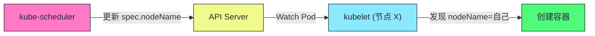
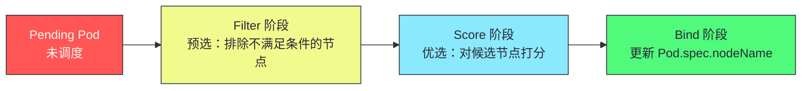
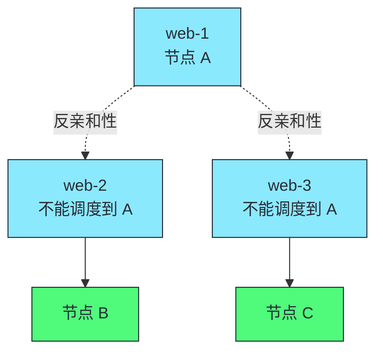
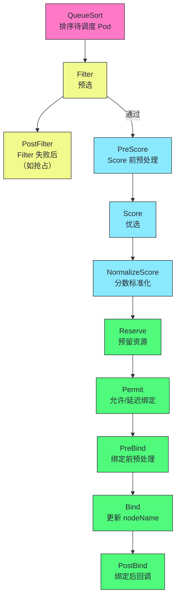
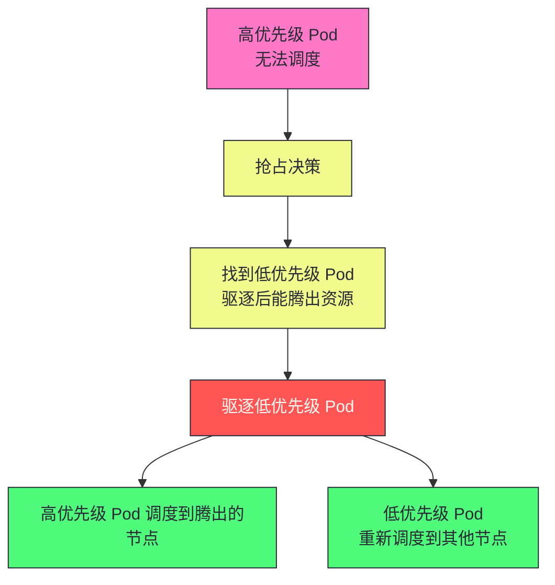
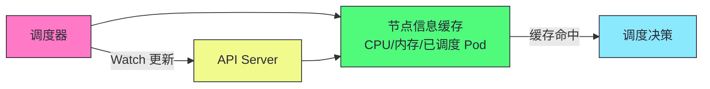

# 11 Scheduler 调度算法：预选、优选与扩展机制

**摘要：**
本文深入 Kubernetes 调度器的两阶段算法和扩展机制。调度器决定 Pod 运行在哪个节点上——这是 K8s "数据中心即计算机"理念的核心实现。文章追溯调度器的起源（从 Borg 到 Omega 到 K8s），拆解两阶段流程（Filter 预选与 Score 优选），深入节点亲和性与反亲和性，讲透 Taint 与 Toleration，讨论 PodTopologySpread 拓扑分布机制，分析调度器扩展机制（Scheduler Framework 与 Extender），讨论性能优化（缓存、批量调度、优先级队列），最后分析调度失败处理（Pending、优先级与抢占）。核心认知：调度器只做决策不做执行——它更新 Pod.spec.nodeName，kubelet 通过 Watch 自己发现被分配的 Pod，两者完全解耦。

---

## 第 1 章 调度的本质：从 Borg 到 K8s

讲 K8s 调度器，不能从"Filter 与 Score 是什么"切入，而要先回到调度的本质——为什么需要调度器，调度器解决什么问题。K8s 的调度器不是凭空发明的，它的设计深受 Borg 与 Omega 的影响，理解这条演进脉络，才能理解 K8s 调度器为什么长成现在这样。

### 1.1 调度的本质问题

调度的本质问题是——**把一组任务分配到一组机器上，满足约束条件，优化某个目标**。这个问题在分布式系统诞生之初就存在，只是不同系统用不同方式解决。Borg 用集中式调度——一个 Borgmaster 集中调度所有任务；Mesos 用两级调度——框架向 Mesos Master 申请资源再自行分配；Omega 用乐观并发调度——多个调度器并发竞争资源。K8s 的调度器延续了 Borg 的集中式思路——一个 kube-scheduler 调度所有 Pod，但用插件化架构（Scheduler Framework）保留了扩展性。

集中式调度的优势是全局视角——调度器看到所有节点与所有 Pod，能做出全局最优的调度决策。劣势是单点瓶颈——一个调度器处理所有调度请求，大规模集群中可能成为性能瓶颈。K8s 用几个手段缓解这个瓶颈——节点信息缓存避免每次 List、并行 Score 加速打分、批量调度减少锁竞争。对于超大规模集群（5000+ 节点），K8s 还支持多调度器——不同 Pod 用不同调度器，分散调度压力。

Borg 的调度经验对 K8s 有深远影响。Borg 论文（2015 年发表）披露了 Google 内部十几年的调度实践，其中几个经验被 K8s 采纳。第一，"调度是 NP-hard 问题，不要追求最优解"——Borg 用启发式算法（类似 K8s 的 Filter+Score）而非精确算法，在"足够好"与"计算快"间权衡。第二，"调度延迟比调度质量更重要"——Borg 发现调度延迟每增加 100 毫秒，用户等待时间显著增加，因此优先优化调度速度而非调度精度。第三，"缓存是调度的生命线"——Borg 维护节点信息的本地缓存，避免每次调度都查中央存储，K8s 的调度器缓存继承了这个设计。

Omega 的乐观并发调度对 K8s 也有影响——Omega 用乐观并发控制（OCC）让多个调度器并发竞争资源，K8s 的默认调度器用 Reserve 机制实现类似的乐观并发（单调度器内的并发调度），多调度器场景下用户可以自行实现跨调度器的乐观并发。这种"用乐观并发替代悲观锁"的思路，使得调度器不需要全局锁就能并发工作，提高吞吐量。

### 1.2 调度器的解耦设计

K8s 调度器有一个贯穿始终的设计原则——**只做决策不做执行**。调度器决定 Pod 应该运行在哪个节点，但它不启动容器、不拉取镜像、不挂载存储——这些是 kubelet 的事。调度器做的唯一操作是更新 Pod 的 `spec.nodeName` 字段，告诉系统"这个 Pod 应该运行在节点 X 上"。



这个解耦设计有几个工程价值。第一，调度器与 kubelet 独立部署——调度器在控制平面，kubelet 在每个节点，两者通过 API Server 的 Watch 机制通信，不需要直接连接。第二，调度器故障不影响已调度 Pod——调度器挂了，已调度的 Pod 继续运行（kubelet 已经在管理它们），只有新 Pod 无法调度。第三，调度器可以重启重建——调度器是无状态的（决策基于缓存与 Watch），重启后从当前状态重新调度，不需要恢复之前的调度进度。

这种"决策与执行解耦"是 K8s 控制平面与数据平面分离的体现——控制平面（调度器、控制器管理器等）做决策，数据平面（kubelet、kube-proxy）做执行，两者通过 API Server 的声明式 API 通信。理解这个分层，就理解了 K8s 为什么能把复杂的集群管理分解为可独立演进的组件。

> [!info] 核心概念：调度器只做决策不做执行
> 调度器决定 Pod 运行在哪个节点，但它不启动容器——它只更新 Pod.spec.nodeName，kubelet 通过 Watch 自己发现被分配的 Pod。这种解耦使得调度器与 kubelet 独立部署、独立故障、独立重启。调度器是无状态的，重启后从当前状态重新调度。

---

## 第 2 章 调度的两阶段流程

讲完了调度的本质，接下来拆解 K8s 调度器的具体算法。K8s 调度器采用两阶段流程——Filter（预选）与 Score（优选），加一个 Bind（绑定）收尾。这个两阶段设计是调度领域的经典模式——先用硬约束快速排除不可行解，再用软约束在可行解中选最优。

### 2.1 Filter + Score + Bind



三个阶段的职责清晰分离。Filter 阶段遍历所有节点，用一系列 Filter 插件检查每个节点是否满足 Pod 的硬约束——不满足就排除，满足就保留为候选。Score 阶段对候选节点打分（0-100 分），用一系列 Score 插件根据软约束评估每个节点的适配程度——分数越高越优先。Bind 阶段选最高分的节点，更新 Pod 的 `spec.nodeName`，完成调度。

这种"先过滤后打分"的两阶段设计有几个工程优势。第一，Filter 阶段快速缩小搜索空间——硬约束的检查通常很快（譬如资源是否够、Taint 是否容忍），能迅速排除大量不可行节点，减少 Score 阶段的工作量。第二，Score 阶段在可行解中选优——软约束的评估通常较慢（譬如计算资源均衡度、镜像本地性），只对候选节点打分，避免对不可行节点浪费计算。第三，两阶段分离使得扩展点清晰——自定义硬约束实现 Filter 插件，自定义软约束实现 Score 插件，互不干扰。

### 2.2 Filter 阶段：预选

Filter 阶段排除不满足 Pod 约束条件的节点。每个 Filter 插件返回 true（节点可用）或 false（节点不可用）。

| 内置 Filter 插件 | 作用 |
|-----------------|------|
| **PodFitsResources** | 节点是否有足够 CPU/内存 |
| **PodFitsHostPorts** | Pod 需要的 hostPort 是否被占用 |
| **NoVolumeZoneConflict** | PV 的 zone 与节点 zone 是否匹配 |
| **MatchNodeSelector** | 节点 Label 是否匹配 nodeSelector |
| **PodToleratesNodeTaints** | Pod 是否容忍节点的 Taint |
| **VolumeBinding** | PVC 是否能绑定到节点的 PV |

这些 Filter 插件覆盖了最常见的硬约束——资源是否够（PodFitsResources）、端口是否冲突（PodFitsHostPorts）、存储是否兼容（NoVolumeZoneConflict、VolumeBinding）、节点选择是否匹配（MatchNodeSelector）、Taint 是否容忍（PodToleratesNodeTaints）。任何一个 Filter 插件返回 false，节点就被排除——这是"硬约束"的语义，不可商量。

Filter 阶段的性能优化值得注意。调度器不是每次调度都遍历所有节点——它维护节点信息的本地缓存，Filter 阶段基于缓存快速判断。对于大规模集群（数千节点），遍历所有节点仍然耗时，K8s 用节点分片与预过滤优化——譬如先按资源量分片，只检查资源够的节点。

Filter 阶段还有一个"短路"优化——如果某个 Filter 插件返回 false，后续 Filter 插件不再执行，节点直接被排除。这意味着 Filter 插件的顺序影响性能——把"快速失败"的插件放前面（譬如资源检查，资源不够立即排除），把"慢速检查"的插件放后面（譬如 VolumeBinding 需要检查 PV 兼容性，较慢）。这种"先快后慢"的顺序减少不必要的慢速检查，加速 Filter 阶段。

### 2.3 Score 阶段：优选

Score 阶段对 Filter 通过的节点打分（0-100），选最高分的节点。

| 内置 Score 插件 | 评分策略 |
|----------------|---------|
| **NodeResourcesFit** | 资源均衡（LeastRequested）或装箱（MostRequested） |
| **InterPodAffinity** | Pod 亲和性打分 |
| **NodeAffinity** | 节点亲和性打分 |
| **ImageLocality** | 节点是否已有镜像（避免拉取） |
| **PodTopologySpread** | 拓扑分布（跨 zone/region 分散） |

Score 插件的评分策略体现了不同的调度偏好。NodeResourcesFit 的 LeastRequested 策略偏好资源最空闲的节点——把 Pod 调度到负载最低的节点，实现负载均衡；MostRequested 策略偏好资源最满的节点——把 Pod 调度到负载最高的节点，实现装箱（bin-packing），减少节点数量节省成本。ImageLocality 偏好已有镜像的节点——避免拉取镜像的时间与带宽开销。PodTopologySpread 偏好拓扑分散的节点——把 Pod 分散到不同 zone/region，提高可用性。

这些 Score 插件的权重可以配置——不同插件对总分的影响不同，权重高的插件对调度结果影响大。生产中通常根据业务需求调整权重——譬如高可用优先的场景调高 PodTopologySpread 权重，成本优先的场景调高 NodeResourcesFit（MostRequested）权重。

Score 插件的评分需要归一化——不同插件的原始分范围不同（譬如 NodeResourcesFit 的分基于资源利用率，ImageLocality 的分基于镜像大小），调度器把所有原始分归一化到 0-100 区间，再按权重加权求和。归一化使用 MinMax 或 Round 算法——MinMax 把最小分映射到 0、最大分映射到 100，Round 把分四舍五入到最近的整数。归一化确保不同插件的分可比，避免某个插件因原始分范围大而主导总分。权重配置通过 KubeSchedulerConfiguration 的 pluginConfig 字段设置，譬如把 PodTopologySpread 的权重设为 5（默认 2），让拓扑分散对调度结果影响更大。Score 阶段还有一个 tie-breaker 机制——当多个节点总分相同时，调度器按节点名排序选第一个，保证调度结果可预测，避免随机选择导致的不可重现问题，这是调度器可观测性的基础。

NodeResourcesFit 的两种策略值得深入对比。LeastRequested 偏好资源最空闲的节点——把 Pod 调度到负载最低的节点，实现负载均衡。这种策略适合资源充足、希望分散负载的场景，但代价是节点利用率低（每个节点都有空闲资源，无法装箱节省节点）。MostRequested 偏好资源最满的节点——把 Pod 调度到负载最高的节点，实现装箱（bin-packing）。这种策略适合成本敏感、希望尽量少用节点的场景，但代价是热点节点负载高、故障影响大。

这两种策略的选择是"负载均衡 vs 资源利用率"的经典权衡。负载均衡提高可用性（单节点故障影响小），但降低资源利用率（节点空闲多）。装箱提高资源利用率（节点填满，减少节点数），但降低可用性（热点节点故障影响大）。生产中通常根据业务特点选择——无状态应用用装箱（成本优先），有状态应用用均衡（可用性优先）。也可以混合使用——用 MostRequested 装箱普通 Pod，用 PodAntiAffinity 把关键 Pod 分散，兼顾成本与可用性。

> [!info] 核心概念：Score 阶段是"软约束"打分
> Filter 是"硬约束"——不满足就排除。Score 是"软约束"——满足得高分，不满足得低分但不会被排除。例如，Pod 希望调度到有镜像的节点（ImageLocality），但如果所有节点都没有镜像，仍会选一个节点调度——只是 ImageLocality 得分低。理解硬约束 vs 软约束的区别，是设计调度策略的关键——硬约束用 nodeSelector/Taint，软约束用 Affinity 的 preferredDuringScheduling。

---

## 第 3 章 节点亲和性与反亲和性

讲完了两阶段流程，接下来看用户如何表达调度约束。K8s 提供了多种约束机制——nodeSelector、NodeAffinity、PodAffinity、PodAntiAffinity，它们从不同维度控制 Pod 的调度位置。

### 3.1 NodeAffinity：节点亲和性

```yaml
spec:
  affinity:
    nodeAffinity:
      requiredDuringSchedulingIgnoredDuringExecution:  # 硬约束
        nodeSelectorTerms:
          - matchExpressions:
              - key: disktype
                operator: In
                values: ["ssd"]
      preferredDuringSchedulingIgnoredDuringExecution:  # 软约束
        - weight: 80
          preference:
            matchExpressions:
              - key: zone
                operator: In
                values: ["us-east-1a"]
```

| 类型 | 说明 | Filter/Score |
|------|------|-------------|
| **requiredDuringScheduling** | 硬约束，必须满足 | Filter |
| **preferredDuringScheduling** | 软约束，尽量满足 | Score |

NodeAffinity 是 nodeSelector 的增强版——nodeSelector 只能要求节点有特定 Label，NodeAffinity 支持更丰富的匹配操作符（In、NotIn、Exists、DoesNotExist、Gt、Lt），且区分硬约束（required）与软约束（preferred）。`requiredDuringSchedulingIgnoredDuringExecution` 是硬约束——不满足的节点在 Filter 阶段被排除；`preferredDuringSchedulingIgnoredDuringExecution` 是软约束——满足的节点在 Score 阶段得高分（权重 weight 控制影响程度）。

字段名中的 `IgnoredDuringExecution` 值得注意——它表示"调度时考虑，运行时忽略"。意思是，节点 Label 在 Pod 调度后变化，调度器不会驱逐已运行的 Pod——Pod 继续运行在原节点，即使节点不再满足亲和性条件。这是"调度时约束"而非"运行时约束"的设计——避免节点 Label 变化导致大量 Pod 重调度。如果需要运行时也保持约束，需要配合 PodAntiAffinity 的 `requiredDuringSchedulingIgnoredDuringExecution`（但这同样不强制运行时驱逐，只是调度时约束）。

### 3.2 PodAntiAffinity：Pod 反亲和性

```yaml
spec:
  affinity:
    podAntiAffinity:
      requiredDuringSchedulingIgnoredDuringExecution:  # 硬约束
        - labelSelector:
            matchLabels:
              app: web
          topologyKey: kubernetes.io/hostname  # 不同节点
```

这个配置确保：同一 Deployment 的 web Pod 不会调度到同一节点——高可用保证。



PodAntiAffinity 与 NodeAffinity 的区别在于——NodeAffinity 基于**节点 Label**，PodAntiAffinity 基于**已调度 Pod 的位置**。PodAntiAffinity 的 `topologyKey` 定义"拓扑域"——`kubernetes.io/hostname` 表示每个节点是一个拓扑域，`topology.kubernetes.io/zone` 表示每个可用区是一个拓扑域。反亲和性确保同一拓扑域内没有冲突的 Pod——hostname 级反亲和确保不同节点，zone 级反亲和确保不同可用区。

> [!warning] 生产避坑：PodAntiAffinity 的 topologyKey 选择
> `topologyKey: kubernetes.io/hostname` 确保不同节点——但节点数少于副本数时，多余 Pod 永远 Pending。对于跨 zone 高可用，用 `topologyKey: topology.kubernetes.io/zone`——确保 Pod 分散到不同 zone。但注意 topologyKey 必须是节点 Label——如果节点没有该 Label，调度行为可能不符合预期。生产环境高可用：hostname 级反亲和 + zone 级 preferred 分散。

PodAntiAffinity 的性能开销需要注意——调度器需要检查所有已调度 Pod 的位置与 Label，计算量随 Pod 数量增长。大规模集群中，PodAntiAffinity 的 `requiredDuringScheduling`（硬约束）可能成为调度瓶颈。生产中通常用 `preferredDuringScheduling`（软约束）替代硬约束——软约束的 Score 计算可以优化，且不会导致 Pod 永远 Pending。

### 3.3 PodAffinity：Pod 亲和性

```yaml
spec:
  affinity:
    podAffinity:
      preferredDuringSchedulingIgnoredDuringExecution:
        - weight: 100
          podAffinityTerm:
            labelSelector:
              matchLabels:
                app: cache
            topologyKey: kubernetes.io/hostname
```

这个配置希望：Pod 调度到有 cache Pod 的节点——减少网络延迟（就近访问缓存）。

PodAffinity 与 PodAntiAffinity 是同一机制的两个方向——PodAffinity 希望 Pod 靠近（亲和），PodAntiAffinity 希望 Pod 远离（反亲和）。两者的典型应用场景不同——PodAffinity 用于"就近部署"（应用与缓存同节点减少延迟），PodAntiAffinity 用于"分散部署"（高可用 Pod 分散到不同节点/zone）。

PodAffinity 的一个经典应用是"应用与缓存同节点"。譬如 Web 应用需要访问 Redis 缓存，如果把 Web Pod 与 Redis Pod 调度到同一节点，网络延迟从跨节点（毫秒级）降到本机（微秒级），显著降低响应时间。这种"就近部署"用 PodAffinity 的 `preferredDuringScheduling`（软约束）实现——尽量调度到有 Redis Pod 的节点，但如果 Redis Pod 不在，Web Pod 仍会调度到其他节点。这种软约束避免了"没有 Redis Pod 就永远 Pending"的问题。

但 PodAffinity 有一个性能代价——调度器需要遍历所有已调度 Pod，检查它们的 Label 与位置，计算量随 Pod 数量线性增长。大规模集群中，PodAffinity 的计算可能成为调度瓶颈。生产中通常用 `preferredDuringScheduling`（软约束）而非 `requiredDuringScheduling`（硬约束）——软约束的计算可以优化（譬如只检查同拓扑域的 Pod），且不会导致 Pod 永远 Pending。

---

## 第 4 章 Taint 与 Toleration

讲完了基于 Label 与 Pod 位置的亲和性，接下来看基于节点的"排斥"机制——Taint 与 Toleration。亲和性是"我想去哪里"，Taint 是"我不想谁来"——两种视角互补，共同实现精细的节点资源分配。

### 4.1 Taint：节点级别的排斥

Taint 是节点上的"标记"——排斥不容忍该 Taint 的 Pod。

```bash
# 给节点打 Taint
kubectl taint nodes node-1 dedicated=gpu:NoSchedule
```

| Taint 效果 | 说明 |
|-----------|------|
| **NoSchedule** | 不调度新 Pod（已运行的 Pod 不受影响） |
| **NoExecute** | 驱逐不容忍的已运行 Pod |
| **PreferNoSchedule** | 尽量不调度（软约束） |

Taint 的三个效果对应不同的排斥强度。NoSchedule 是"不调度新的"——已经运行的 Pod 不受影响，但新 Pod 不会调度到这个节点。NoExecute 是"驱逐已有的"——不仅不调度新 Pod，还驱逐已运行的不容忍 Pod，这是最强的排斥。PreferNoSchedule 是"尽量不调度"——软约束，调度器尽量避开但不是必须。

### 4.2 Toleration：Pod 级别的容忍

```yaml
spec:
  tolerations:
    - key: "dedicated"
      operator: "Equal"
      value: "gpu"
      effect: "NoSchedule"
```

这个 Pod 容忍 `dedicated=gpu:NoSchedule` 的 Taint——可以调度到有该 Taint 的节点。

Toleration 是 Pod 对 Taint 的"豁免"——节点有 Taint 排斥普通 Pod，但 Pod 有 Toleration 表示"我能接受这个 Taint，让我调度上去"。Taint 与 Toleration 的配合实现"节点专用化"——GPU 节点打 `dedicated=gpu:NoSchedule` Taint，只有 GPU 任务（配置了对应 Toleration）能调度上去，普通 Pod 不会占用 GPU 节点。

### 4.3 内置 Taint

K8s 自动给节点打一些 Taint：

| Taint | 触发条件 | 作用 |
|-------|---------|------|
| `node.kubernetes.io/not-ready` | 节点 NotReady | NoExecute，驱逐 Pod |
| `node.kubernetes.io/unreachable` | 节点不可达 | NoExecute，驱逐 Pod |
| `node.kubernetes.io/memory-pressure` | 内存压力 | NoSchedule |
| `node.kubernetes.io/disk-pressure` | 磁盘压力 | NoSchedule |
| `node.kubernetes.io/pid-pressure` | PID 压力 | NoSchedule |
| `node.kubernetes.io/network-unavailable` | 网络不可用 | NoSchedule |

这些内置 Taint 是节点健康状态的自动标记——节点出问题时，kubelet 或节点控制器自动打 Taint，驱动 Pod 驱逐或阻止调度。譬如节点故障（NotReady），节点控制器打 `node.kubernetes.io/not-ready:NoExecute` Taint，不容忍该 Taint 的 Pod 被驱逐——这是节点故障时 Pod 自动迁移的机制。

NoExecute Taint 的驱逐有 `tolerationSeconds` 参数——Pod 可以配置"容忍多长时间"，超时后才被驱逐。譬如 `tolerationSeconds: 300` 表示节点 NotReady 后，Pod 容忍 300 秒，300 秒后节点仍 NotReady 才被驱逐。这给短暂网络抖动留出恢复时间，避免短暂故障导致大量 Pod 迁移。

NoExecute 驱逐的实现由节点控制器（Node Controller）负责。节点控制器 Watch 节点状态，当节点变为 NotReady 或 Unreachable 时，给节点打对应的 NoExecute Taint。Taint 打上后，节点控制器遍历该节点上不容忍该 Taint 的 Pod，按 tolerationSeconds 排序——tolerationSeconds 未到的 Pod 暂不驱逐，tolerationSeconds 已到的 Pod 立即驱逐。驱逐通过删除 Pod 对象实现，Pod 的控制器（如 ReplicaSet Controller）发现 Pod 缺失，在其他节点重新创建。整个过程的延迟取决于 tolerationSeconds 配置——关键应用设短（如 30 秒，快速迁移），容忍短暂不可用的应用设长（如 300 秒，避免抖动），生产环境需根据业务特点合理配置。

```yaml
tolerations:
  - key: "node.kubernetes.io/not-ready"
    operator: "Exists"
    effect: "NoExecute"
    tolerationSeconds: 300  # 节点 NotReady 后容忍 300 秒
  - key: "node.kubernetes.io/unreachable"
    operator: "Exists"
    effect: "NoExecute"
    tolerationSeconds: 300
```

`tolerationSeconds` 的工程价值在于"故障容忍窗口"。节点故障有不同性质——短暂网络抖动（秒级恢复）、节点重启（分钟级恢复）、节点永久故障（不恢复）。如果没有 tolerationSeconds，节点一 NotReady 就驱逐所有 Pod，短暂抖动会导致大量 Pod 不必要迁移，迁移后节点恢复又导致 Pod 回迁——"颠簸"（thrashing）。有了 tolerationSeconds，Pod 在节点 NotReady 后等待一段时间，如果节点恢复（NotReady Taint 被移除），Pod 留在原节点继续运行，避免不必要迁移。

生产中 tolerationSeconds 的值需要权衡——太短（譬如 0 秒）导致频繁迁移，太长（譬如 1 小时）导致真正故障时 Pod 长时间不可用。通常 300 秒（5 分钟）是一个合理的默认值——足以覆盖短暂抖动与节点重启，又不至于在真正故障时等太久。对于关键应用，可以调短（譬如 60 秒）快速迁移；对于容忍短暂不可用的应用，可以调长（譬如 600 秒）减少迁移。

> [!info] 核心概念：master 节点默认有 NoSchedule Taint
> K8s 的 master 节点默认有 `node-role.kubernetes.io/control-plane:NoSchedule` Taint——排斥普通 Pod。这确保普通 Pod 不会调度到 master，避免影响控制平面。如果要在 master 上运行 Pod（如网络插件），需添加 Toleration。理解 Taint/Toleration 的"排斥-容忍"模型，是管理节点资源分配的基础——GPU 节点打 `dedicated=gpu:NoSchedule`，只有 GPU Pod 容忍它。

---

## 第 5 章 PodTopologySpread：拓扑分布

讲完了 Taint 与 Toleration，接下来看一个比 PodAntiAffinity 更灵活的拓扑分布机制——PodTopologySpread。K8s 1.19 正式稳定，是高可用分布的推荐方式。

### 5.1 为什么需要 PodTopologySpread

PodAntiAffinity 的 `requiredDuringScheduling` 能确保 Pod 分散到不同拓扑域，但它有一个局限——**只保证"不在一起"，不保证"均匀分布"**。譬如 3 个 zone，5 个 Pod，PodAntiAffinity（zone 级硬约束）会失败——3 个 zone 最多放 3 个 Pod（每个 zone 1 个），多余 2 个 Pod 永远 Pending。但实际需求可能是"尽量均匀分布，zone 间最多差 1 个"——5 个 Pod 分布为 2/2/1，而非每个 zone 1 个。

PodTopologySpread 解决这个问题——它用 `maxSkew` 参数控制拓扑域间的不均匀程度。`maxSkew: 1` 表示任意两个拓扑域的 Pod 数差不超过 1——5 个 Pod 在 3 个 zone 分布为 2/2/1，满足 maxSkew=1。

maxSkew 的计算方式是：对于每个候选节点，假设把 Pod 调度到该节点后，计算所有拓扑域中匹配 Pod 数的最大值与最小值之差，如果差值超过 maxSkew 则违反约束。`whenUnsatisfiable: DoNotSchedule` 时违反约束的节点在 Filter 阶段被排除（硬约束），`ScheduleAnyway` 时违反约束的节点得低分但不被排除（软约束）。PodTopologySpread 还支持 `minDomains` 参数——指定最少拓扑域数，如果可用拓扑域少于 minDomains，约束不生效，避免在拓扑域不足时调度失败。

```yaml
spec:
  topologySpreadConstraints:
    - maxSkew: 1
      topologyKey: topology.kubernetes.io/zone
      whenUnsatisfiable: DoNotSchedule  # 硬约束。或 ScheduleAnyway（软约束）
      labelSelector:
        matchLabels:
          app: web
```

### 5.2 PodTopologySpread vs PodAntiAffinity

| 维度 | PodAntiAffinity | PodTopologySpread |
|------|----------------|-------------------|
| **保证** | 不在一起 | 均匀分布（maxSkew 控制） |
| **多余 Pod** | 永远 Pending | 尽量均匀，允许 maxSkew 差异 |
| **性能** | 较慢（检查所有 Pod） | 较快（按拓扑域统计） |
| **推荐** | 严格分散 | 灵活均匀分布 |

PodTopologySpread 比 PodAntiAffinity 更适合高可用分布场景——它允许"尽量均匀"而非"严格分散"，避免多余 Pod 永远 Pending。`whenUnsatisfiable: DoNotSchedule` 是硬约束（不满足就排除），`whenUnsatisfiable: ScheduleAnyway` 是软约束（不满足也调度，但 Score 阶段偏好均匀）。

PodTopologySpread 的一个生产实践是"多维度分散"——可以同时配置多个 topologySpreadConstraints，譬如跨 zone 分散 + 跨 hostname 分散。这实现"先跨 zone 分散（避免整个 zone 故障），再跨 hostname 分散（避免单节点故障）"的多层高可用。多维度分散时，所有约束都要满足——如果跨 zone 分散约束无法满足（譬如只有 1 个 zone），即使跨 hostname 分散约束能满足，Pod 仍可能 Pending（如果用 DoNotSchedule）。生产中通常把跨 zone 分散设为软约束（ScheduleAnyway），跨 hostname 分散设为硬约束（DoNotSchedule），避免 zone 数限制导致 Pending。

> [!info] 核心概念：PodTopologySpread 比 PodAntiAffinity 更灵活
> PodTopologySpread 确保跨 zone/region 均匀分布，支持 maxSkew 参数控制不均匀程度。K8s 1.19+ 默认启用，是高可用分布的推荐方式。相比 PodAntiAffinity 的"严格分散"，PodTopologySpread 的"尽量均匀"更适合实际生产——避免多余 Pod 永远 Pending，同时保持合理的拓扑分散。

---

## 第 6 章 Scheduler Framework：插件化架构

讲完了用户侧的调度约束，接下来看调度器内部的扩展机制。K8s 1.19 引入的 Scheduler Framework 是调度器的插件化架构，它把调度流程拆分为多个扩展点，每个扩展点可以注册插件。

### 6.1 调度框架的扩展点



| 扩展点 | 作用 | 典型插件 |
|--------|------|---------|
| **QueueSort** | 排序待调度 Pod | 优先级排序 |
| **Filter** | 排除不满足条件的节点 | 资源检查、Taint、Affinity |
| **PostFilter** | Filter 失败后触发（如抢占） | 抢占调度 |
| **Score** | 对候选节点打分 | 资源均衡、镜像本地性 |
| **Reserve** | 预留资源（防止并发调度冲突） | 资源预留 |
| **Permit** | 允许或延迟绑定 | 批量调度等待 |
| **Bind** | 更新 Pod.spec.nodeName | 默认 Binder |

Scheduler Framework 的扩展点覆盖了调度的全生命周期——从 Pod 入队排序（QueueSort）到绑定后回调（PostBind），每个阶段都可以插入自定义逻辑。这种细粒度的扩展点设计，使得调度器可以适配各种复杂场景——GPU 拓扑感知、NUMA 亲和、批量调度、延迟绑定等。

几个关键扩展点的语义值得深入。QueueSort 是唯一的排序扩展点——整个调度器只能有一个 QueueSort 插件（不能多个并存），它定义待调度 Pod 队列的排序逻辑，默认按优先级与时间戳排序。PostFilter 在 Filter 全部失败时触发——它不一定只做抢占，也可以做其他"补救"操作，譬如记录失败指标、通知外部系统。Permit 扩展点允许"延迟绑定"——插件可以返回 Wait 指令，让 Pod 等待一段时间或等待外部信号后再绑定，这是批量调度（Coscheduling）等高级调度策略的基础。Reserve 与 Unreserve 成对出现——Reserve 预留资源，如果后续阶段失败（譬如 Bind 失败），Unreserve 释放预留，确保资源账本一致。

### 6.2 自定义调度插件

```go
// 自定义 Filter 插件示例
type MyFilter struct{}

func (f *MyFilter) Filter(ctx context.Context, state *framework.CycleState, pod *v1.Pod, nodeInfo *framework.NodeInfo) *framework.Status {
    // 自定义过滤逻辑
    if !customCondition(pod, nodeInfo) {
        return framework.NewStatus(framework.Unschedulable, "custom condition not met")
    }
    return framework.NewStatus(framework.Success, "")
}

func (f *MyFilter) Name() string {
    return "MyFilter"
}

// 注册插件
func main() {
    command := app.NewSchedulerCommand(
        app.WithPlugin("MyFilter", func(...) framework.Plugin { return &MyFilter{} }),
    )
    command.Execute()
}
```

自定义插件实现 `framework.FilterPlugin` 或 `framework.ScorePlugin` 等接口，通过 `app.WithPlugin` 注册，编译为自定义调度器二进制。这种"进程内插件"的方式比 Extender（外部 HTTP 服务）更高效——插件与调度器在同一进程，函数调用而非 HTTP 通信，延迟低、性能好。

### 6.3 Extender：外部 HTTP 扩展

在 Scheduler Framework 之前，K8s 调度器的扩展方式是 Extender——一个外部 HTTP 服务，调度器在 Filter/Score/Bind 阶段通过 HTTP 调用 Extender，获取扩展的过滤、打分、绑定逻辑。

| 维度 | Scheduler Framework | Extender |
|------|---------------------|----------|
| **调用方式** | 进程内函数调用 | HTTP 通信 |
| **性能** | 高（无网络开销） | 低（HTTP 延迟） |
| **扩展点** | 全生命周期（QueueSort 到 PostBind） | 仅 Filter/Score/Preempt/Bind |
| **部署** | 编译进调度器二进制 | 独立部署 HTTP 服务 |
| **维护** | 跟随上游更新 | 独立维护，需版本兼容 |

Extender 的优势是语言无关——Extender 可以用任何语言实现（Python、Java、Go），只要提供 HTTP 接口。劣势是性能——每次 Filter/Score 都要 HTTP 调用，大规模集群中 HTTP 延迟累积，显著拖慢调度。Scheduler Framework 的优势是性能——进程内函数调用，无网络开销；劣势是语言绑定——插件必须用 Go 实现，编译进调度器二进制。

这种演进反映了 K8s 社区的一个趋势——**从外部扩展走向进程内插件**。早期 K8s 优先支持外部扩展（Extender），降低扩展门槛；随着调度性能需求增长，社区引入进程内插件（Scheduler Framework），用语言绑定的代价换取性能。对于性能敏感的扩展（譬如 GPU 拓扑感知，每次调度都要计算），用 Scheduler Framework；对于性能不敏感但语言灵活的扩展（譬如调用外部调度服务），用 Extender。

### 6.4 Reserve 与并发调度

Reserve 扩展点值得专门说明——它解决"并发调度导致资源超卖"的问题。考虑场景——两个 Pod 同时调度，都检查节点 A 资源够（譬如剩余 8 CPU，每个 Pod 要 4 CPU），都通过 Filter，都准备绑定到节点 A——结果节点 A 被分配 8 CPU，但两个 Pod 共要 8 CPU，看似够，但如果还有第三个 Pod 同时调度呢？

Reserve 扩展点在 Score 之后、Bind 之前"预留"资源——Pod 通过 Score 后，调度器在 Reserve 阶段把 Pod 的资源需求计入节点缓存（即使还没真正绑定），后续 Pod 调度时看到的是"预留后"的剩余资源。这避免了并发调度时的资源超卖。如果 Pod 最终没有绑定（譬如 Permit 阶段拒绝），Reserve 阶段预留的资源会被释放（Unreserve 扩展点）。

> [!info] 核心概念：Scheduler Framework 让调度器可扩展但不需 fork
> 早期 K8s 自定义调度需 fork 调度器源码或用 Extender（HTTP 外部服务）。Scheduler Framework 允许通过插件扩展调度流程——注册自定义 Filter/Score 插件，编译为自定义调度器二进制。这比 fork 源码更易维护（跟随上游更新），比 Extender 更高效（进程内调用而非 HTTP）。对于复杂调度需求（如 GPU 拓扑感知、NUMA 亲和），Scheduler Framework 是推荐方式。

---

## 第 7 章 优先级与抢占

讲完了调度算法与扩展机制，接下来看调度失败时的处理。当高优先级 Pod 无法调度时，K8s 有一个机制——抢占（Preemption），驱逐低优先级 Pod 腾出资源。

### 7.1 优先级

```yaml
apiVersion: scheduling.k8s.io/v1
kind: PriorityClass
metadata:
  name: high-priority
value: 1000  # 优先级值，越大越高
globalDefault: false
description: "高优先级 Pod"
```

```yaml
spec:
  priorityClassName: high-priority
```

PriorityClass 定义优先级——值越大优先级越高。Pod 通过 `priorityClassName` 引用 PriorityClass。优先级影响两个行为——调度顺序（高优先级 Pod 优先调度，QueueSort 扩展点按优先级排序）与抢占（高优先级 Pod 无法调度时驱逐低优先级 Pod）。

### 7.2 内置 PriorityClass

K8s 有两个内置的 PriorityClass：

| PriorityClass | 值 | 说明 |
|---------------|-----|------|
| **system-cluster-critical** | 2000000000 | 集群关键组件（如 Calico、CoreDNS） |
| **system-node-critical** | 2000001000 | 节点关键组件（如 kube-proxy、CNI） |

> [!info] 核心概念：system-node-critical 比 system-cluster-critical 优先级更高
> 节点关键组件（如 kube-proxy）比集群关键组件（如 CoreDNS）优先级更高——因为节点组件不运行，节点上的所有 Pod 都受影响。这个优先级层次确保了在资源紧张时，最基础的组件优先调度。自定义 PriorityClass 的值不要超过这两个内置值——1000000000 以下是用户可用的范围。

### 7.3 抢占

当高优先级 Pod 无法调度时，调度器尝试驱逐低优先级 Pod 腾出资源：



抢占的决策过程是——高优先级 Pod 无法调度（Filter 全部失败），调度器进入 PostFilter 阶段，寻找"驱逐哪些低优先级 Pod 能腾出足够资源"。寻找时考虑几个因素——低优先级 Pod 的优先级（优先驱逐最低的）、驱逐后是否能满足高优先级 Pod 的需求（不能只驱逐不够）、驱逐的 Pod 数量（尽量少驱逐）。找到合适的低优先级 Pod 后，驱逐它们，高优先级 Pod 调度到腾出的节点。

抢占有一个"优雅期"——被驱逐的 Pod 有 grace period 优雅终止（默认 30 秒），高优先级 Pod 在 grace period 后才真正调度。这给被驱逐 Pod 保存状态、通知下游的时间。但如果被驱逐 Pod 不响应终止信号（譬如卡在 grace period），高优先级 Pod 会等待 grace period 超时后才调度——这是抢占的延迟来源。

抢占的决策过程有几个细节值得深入。第一，抢占不是"立即驱逐"——调度器先"提名"（nominate）要驱逐的 Pod，等 grace period 后再实际驱逐，然后调度高优先级 Pod。这个两步过程避免了"驱逐了低优先级 Pod 但高优先级 Pod 调度失败"的尴尬——如果高优先级 Pod 在提名后因为其他原因（譬如节点又有了新 Taint）无法调度，提名可以取消，低优先级 Pod 不被驱逐。

第二，抢占考虑"PDB 保护"——如果低优先级 Pod 有 PodDisruptionBudget，抢占不会违反 PDB 驱逐它（除非 PDB 允许）。譬如 PDB 要求 minAvailable=2，当前有 3 个 Pod，抢占只能驱逐 1 个（保持 minAvailable=2）。这保护了低优先级服务不被抢占压垮。但 PDB 保护不是绝对的——如果所有候选 Pod 都有 PDB 保护，且无法找到不违反 PDB 的驱逐方案，调度器会放弃抢占，高优先级 Pod 继续 Pending。

第三，抢占有"反亲和性保护"——如果驱逐低优先级 Pod 会违反高优先级 Pod 的反亲和性约束（譬如驱逐后高优先级 Pod 与其他 Pod 在同节点），调度器不会选择这个驱逐方案。这确保抢占不会破坏高优先级 Pod 的调度约束。

抢占的候选节点选择还有一个细节——调度器不会在所有节点上寻找抢占机会，而是只在高优先级 Pod " nominatedNodeName" 字段指定的节点上寻找。提名机制的工作流程是：高优先级 Pod 第一次进入抢占时，调度器遍历所有节点寻找最优驱逐方案，找到后把节点名写入 Pod 的 nominatedNodeName 字段；后续抢占重试时，调度器只在这个提名节点上寻找，避免重复遍历所有节点。如果提名节点最终无法调度（譬如其他 Pod 先占了资源），调度器会清除提名并重新遍历。

> [!warning] 生产避坑：抢占可能导致低优先级 Pod 频繁被驱逐
> 抢占确保高优先级 Pod 能调度，但代价是低优先级 Pod 被驱逐。如果没有 PodDisruptionBudget 保护，低优先级 Pod 可能被频繁驱逐——导致服务不稳定。生产环境：(1) 关键服务用高 PriorityClass；(2) 非关键服务用低 PriorityClass；(3) 低优先级 Pod 配置 PDB 限制驱逐速率；(4) 慎用抢占——确保集群有足够资源避免频繁抢占。

---

## 第 8 章 调度器的性能优化

讲完了调度算法，接下来看调度器的性能。大规模集群中（数千节点、数万 Pod），调度器可能成为瓶颈——每秒可能有数百个 Pod 需要调度，每个调度都要遍历节点、计算打分。K8s 用几个手段优化调度性能。

### 8.1 节点信息缓存

调度器维护节点信息的本地缓存——不每次调度都 List 节点：



调度器的节点信息缓存与 Informer 的本地缓存类似——通过 Watch 维护节点与 Pod 的本地视图，调度决策基于缓存而非直接查 etcd。这种设计使得调度器与 API Server 解耦——API Server 故障时，调度器仍能基于缓存做决策（只是无法绑定，因为绑定需要写 API Server）。

缓存中维护的关键信息包括——节点资源总量、已调度 Pod 的资源请求、节点的 Taint 与 Label、已调度 Pod 的位置与 Label（用于 PodAffinity 计算）。这些信息由 Watch 事件驱动更新，保持最终一致。

缓存一致性的边界需要清醒认识。调度器缓存通过 Watch 更新，Watch 有延迟——API Server 到调度器的 Watch 事件传播需要时间（通常毫秒级，但网络抖动时可能秒级）。这意味着调度器看到的节点状态可能短暂滞后于真实状态——譬如节点刚满了，但调度器缓存还没更新，仍认为节点有资源，把 Pod 调度过去——这个 Pod 到节点后发现资源不够，kubelet 拒绝创建，Pod 重新进入 Pending。这是"调度后失败"的一个来源，生产中通过 Pod 重试机制缓解——Pod 调度失败后重新进入调度队列，下次调度时缓存已更新。

缓存一致性的另一个边界是"假设资源请求等于实际使用"。调度器基于 Pod 的 `resources.requests`（请求量）调度，而非 `resources.limits`（限制量）或实际使用量。这意味着——如果 Pod 请求 1 CPU 但实际用 5 CPU（超出限制被 throttled 或未限制），调度器不知道，仍认为节点只用了 1 CPU。这种"基于请求而非实际"的设计简化了调度（不需要监控实际使用），但可能导致节点实际负载高于调度器认为的——生产中需要配合监控（譬如 Prometheus）观察节点实际负载，必要时用 Descheduler 重调度。

### 8.2 批量调度与优先级队列

| 优化 | 说明 |
|------|------|
| **优先级队列** | 高优先级 Pod 优先调度 |
| **批量调度** | 多个 Pod 一起调度（减少锁竞争） |
| **并行 Score** | 多节点并行打分 |
| **缓存节点信息** | 避免每次 List 节点 |

优先级队列确保高优先级 Pod 优先调度——QueueSort 扩展点按优先级排序待调度 Pod，高优先级 Pod 排在队首先调度。这对于关键组件（如系统 Pod）很重要——集群故障恢复时，系统 Pod 优先调度，尽快恢复集群基础设施。

批量调度减少锁竞争——多个 Pod 一起调度，共享一次节点缓存快照，减少缓存锁的获取次数。这对于高吞吐场景（譬如批量创建 Job）很重要——逐个调度会因为缓存锁竞争而变慢。

并行 Score 加速打分——Score 阶段对多个候选节点并行打分，利用多核 CPU 加速。对于大规模集群（候选节点多），并行 Score 显著减少调度延迟。

调度器缓存的一致性保证值得深入。调度器维护两层数据结构：节点信息缓存（NodeInfo）与本地快照（Snapshot）。NodeInfo 是调度器通过 Informer 从 API Server Watch 的实时节点状态——包括节点的资源总量、已分配资源、Taint、Label 等。Snapshot 是调度器在每次调度周期开始时对 NodeInfo 的只读快照——整个调度周期内用同一个 Snapshot，保证 Filter 与 Score 看到一致的节点状态。这种"周期内快照、周期间增量更新"的设计平衡了一致性与性能——周期内快照保证单次调度决策的一致性（不会出现 Filter 看到资源够、Score 看到资源不够的矛盾），周期间的增量更新保证缓存最终一致（滞后于 etcd 真实状态几秒）。

---

## 第 9 章 调度失败与 Pending

讲完了性能优化，最后看调度失败的处理。Pod 调度失败会处于 Pending 状态——等待资源、等待约束满足、或永远无法调度。理解 Pending 的原因与排查方法，是生产运维的基本功。

### 9.1 Pending 的原因

```bash
# 查看 Pending 原因
kubectl describe pod <pod-name>
# Events:
#   Warning  FailedScheduling  Pod is unschedulable
#   Message: 0/5 nodes are available: 5 Insufficient cpu.
```

| 常见原因 | 解决方案 |
|---------|---------|
| **资源不足** | 扩容节点或减少 Pod 资源请求 |
| **nodeSelector 不匹配** | 检查节点 Label |
| **Taint 不容忍** | 添加 Toleration 或移除 Taint |
| **PodAntiAffinity 太严** | 放宽反亲和性或增加节点 |
| **PVC 无法绑定** | 检查 StorageClass 和 PV |

`kubectl describe pod` 的 Events 部分是排查 Pending 的第一步——它会显示调度失败的具体原因，譬如"0/5 nodes are available: 5 Insufficient cpu"说明 5 个节点都因为 CPU 不足被排除。根据原因定位问题——资源不足扩容节点，亲和性不匹配调整配置，Taint 不容忍添加 Toleration。

### 9.2 Pending 的分类

Pending 有两种——**临时 Pending**（等待资源可用后能调度）与**永久 Pending**（约束永远无法满足）。临时 Pending 譬如资源不足——等其他 Pod 释放资源后能调度。永久 Pending 譬如 nodeSelector 指向不存在的 Label——没有节点能满足，永远 Pending。

区分两种 Pending 需要看 Events 的消息——"Insufficient cpu"通常是临时的（等其他 Pod 释放），"node(s) didn't match node selector"通常是永久的（Label 不存在）。永久 Pending 需要人工干预——修改 Pod 配置或给节点打 Label。

Pending 的重试机制值得了解。调度失败的 Pod 不会立即重试——它进入调度队列，等待下一次调度周期。调度器有一个"退避"机制——连续调度失败的 Pod，重试间隔逐渐增加（譬如从 1 秒到 60 秒），避免频繁重试浪费调度器资源。对于永久 Pending 的 Pod，退避到最大间隔后保持固定间隔重试（譬如每 60 秒一次），一旦条件满足（譬如新增了节点）能立即调度。

Pending 的监控是生产运维的重要环节。集群中如果有大量 Pending Pod，通常意味着资源不足或配置错误——需要扩容节点或排查配置。可以用 `kubectl get pods --field-selector=status.phase=Pending` 列出所有 Pending Pod，或用 Prometheus 监控 Pending Pod 数量，设置告警。对于关键应用，Pending Pod 数量告警能及时发现资源瓶颈，避免服务降级。

> [!info] 核心概念：kubectl describe pod 是排查 Pending 的第一步
> 调度失败时，`kubectl describe pod` 的 Events 部分会显示调度失败的具体原因——"0/5 nodes are available: 5 Insufficient cpu" 说明 CPU 不足。根据原因定位问题——资源不足扩容，亲和性不匹配调整配置。这是排查 Pending Pod 的标准流程。

---

## 第 10 章 多调度器与调度边界

讲完了单调度器的全部机制，最后看多调度器支持与调度的边界。K8s 支持多个调度器并行运行——不同 Pod 用不同调度器，适配不同的调度需求。

### 10.1 多调度器

```yaml
spec:
  schedulerName: my-custom-scheduler  # 指定调度器，默认 default-scheduler
```

Pod 通过 `spec.schedulerName` 指定调度器——默认是 `default-scheduler`（kube-scheduler），也可以指定自定义调度器。多个调度器并行运行，各自调度各自的 Pod，互不干扰。

多调度器的典型场景是——特殊工作负载需要专用调度器。譬如 GPU 任务用 GPU 拓扑感知调度器（感知 GPU 间的 NVLink 拓扑，把需要通信的 Pod 调度到 NVLink 相连的 GPU 上），普通任务用默认调度器。两个调度器并行运行，各自处理各自的 Pod。

多调度器有一个重要约束——**多个调度器不能调度同一批节点上的同一批 Pod**。如果两个调度器都尝试调度一个 Pod，会产生冲突。K8s 用 `schedulerName` 隔离——每个 Pod 只被它指定的调度器调度，其他调度器忽略它。但节点资源是共享的——多个调度器可能同时把 Pod 调度到同一节点，导致资源超卖。避免这个问题需要调度器间协调，或者用节点分片（不同调度器管不同节点）。

节点分片是多调度器的常见部署模式——把节点分成几组，每个调度器只管一组节点。譬如默认调度器管普通节点，GPU 调度器管 GPU 节点。这种分片避免了资源超卖——每个调度器在自己的节点组内有独占的资源视图，不需要与其他调度器协调。代价是资源利用率可能降低——某个调度器的节点组满了，即使其他调度器的节点组有空闲，也无法借用。

另一种多调度器模式是"乐观并发"——多个调度器都看所有节点，用乐观并发控制（OCC）避免冲突。调度器假设"我调度的节点没被其他调度器占用"，绑定前用 CAS（Compare-And-Swap）检查节点状态，如果状态变了（被其他调度器占用），放弃本次调度重新尝试。这种模式不需要节点分片，资源利用率高，但冲突时需要重试，冲突频繁时性能下降。K8s 的默认调度器内部用 Reserve 机制实现类似的乐观并发，但跨调度器的乐观并发需要调度器自行实现。

### 10.2 调度的边界

调度器有几个边界需要清醒认识。

第一，调度器是**最终一致**而非强一致——调度器基于本地缓存做决策，缓存可能短暂滞后于 etcd 真实状态。这意味着两个调度器可能短暂"看到"相同的剩余资源，都把 Pod 调度到同一节点——这是多调度器资源超卖的根因。单调度器用 Reserve 缓解，多调度器没有统一协调，需要应用层容忍或节点分片。

第二，调度器**不做运行时调度**——Pod 调度后节点状态变化（譬如节点负载升高），调度器不会重新调度已运行 Pod。调度是"一次性"的——调度时决策，运行时不变。如果需要运行时负载均衡，需要用 Descheduler（重调度器）或 VPA（垂直扩缩容）等额外组件。

第三，调度器**不保证调度公平**——调度器按优先级与约束调度，不保证不同用户或不同命名空间的 Pod 公平分享资源。如果需要公平分享，需要用 ResourceQuota 限制各命名空间的资源使用，或用 PriorityClass 表达业务优先级。

第四，调度器**不感知实际负载**——调度器基于 Pod 的资源请求（requests）调度，而非实际 CPU/内存使用。这意味着调度器不知道某个节点实际负载很高（Pod 实际使用远超请求），仍可能把新 Pod 调度过去。对于实际负载不均的场景，需要 Descheduler（重调度器）基于实际负载重调度 Pod，或用 VPA（垂直 Pod 自动扩缩容）调整 Pod 的资源请求。调度器与 Descheduler 的分工是——调度器做初始调度决策，Descheduler 做运行时调度优化，两者互补。

Descheduler 的工作模式是定期扫描集群，根据策略（譬如节点负载不均、Pod 集中在少数节点、Pod 违反拓扑分布约束）识别需要重调度的 Pod，驱逐它们让调度器重新调度。Descheduler 不是"运行时调度器"——它不直接把 Pod 迁移到新节点，而是驱逐旧 Pod，让 kube-scheduler 重新调度。Descheduler 的策略包括 RemoveDuplicates（避免同一应用的 Pod 集中在少数节点）、LowNodeLoad（从高负载节点驱逐 Pod 到低负载节点）、RemovePodsViolatingTopologySpreadConstraints（驱逐违反拓扑分布约束的 Pod）。Descheduler 是破坏性操作——驱逐 Pod 会导致服务短暂不可用，生产中需配合 PDB 与维护窗口使用，建议在非高峰期运行。

第五，调度器**不处理跨集群调度**——K8s 调度器只在单集群内调度，不感知其他集群的资源。多集群调度需要额外的组件（譬如 Karmada、Cluster Federation），把 Pod 调度到合适的集群，再由集群内调度器调度到节点。这种"两级调度"模式与 Mesos 的两级调度类似——上层调度器分配到集群，下层调度器分配到节点。

> [!note] 设计哲学：调度是权衡而非最优
> 调度器在多个目标间权衡——资源利用率（装箱 vs 均衡）、可用性（分散 vs 集中）、性能（调度速度 vs 决策质量）、灵活性（内置插件 vs 自定义扩展）。没有"最优"调度策略，只有"适合场景"的策略。成本优先用 MostRequested 装箱，可用性优先用 PodTopologySpread 分散，性能优先用并行 Score 加速。因地制宜地选择与组合调度策略，才是工程实践。

---

## 总结

调度器只做决策不做执行——更新 Pod.spec.nodeName，kubelet 通过 Watch 自己发现被分配的 Pod，决策与执行解耦。调度两阶段：Filter 排除不满足条件的节点（硬约束），Score 对候选节点打分（软约束），Bind 更新 nodeName。NodeAffinity 区分 required 与 preferred，PodAntiAffinity 确保高可用，Taint/Toleration 是节点级排斥机制，PodTopologySpread 比 PodAntiAffinity 更灵活。Scheduler Framework 是插件化架构，Reserve 解决并发调度资源超卖，优先级与抢占让高优先级 Pod 可驱逐低优先级 Pod。调度是权衡而非最优——资源利用率、可用性、性能、灵活性多目标权衡，没有最优策略，只有适合场景的策略。调度器有边界——最终一致、不做运行时调度、不保证公平、不感知实际负载、不处理跨集群调度，这些边界需要 Descheduler、VPA、ResourceQuota、Karmada 等组件补充。多调度器用节点分片或乐观并发协调——节点分片避免资源超卖但利用率低，乐观并发利用率高但冲突需重试，根据实际场景合理选择。

> [!info] 专栏导航
> 本文是 [[00 专栏导览|Kubernetes 架构深度剖析专栏]] 的第 11 篇，深入调度器算法。下一篇 [[12 CRD 与 Operator 模式：自定义控制器与扩展 K8s]] 将详细讨论 CRD 的定义、Controller-Runtime 框架、Operator 的设计模式和生产级最佳实践。

---

## 延伸思考

1. **你的高可用 Pod 是否用了 PodAntiAffinity 或 PodTopologySpread？** 没有反亲和性的 Deployment，所有 Pod 可能调度到同一节点——节点故障导致全部不可用。配置 hostname 级反亲和或 PodTopologySpread。

2. **你的 GPU 节点是否用了 Taint 专用化？** 没有 Taint 的 GPU 节点可能被普通 Pod 占用。打 `dedicated=gpu:NoSchedule` Taint，只有 GPU Pod 容忍。

3. **你的调度策略是否需要自定义插件？** 如果内置 Filter/Score 不满足需求（如 GPU 拓扑感知），用 Scheduler Framework 编写自定义插件。比 Extender 更高效。

4. **你的低优先级 Pod 是否有 PDB？** 抢占可能驱逐低优先级 Pod。配置 PDB 限制驱逐速率，防止低优先级服务频繁中断。

5. **你的 Pending Pod 是否用 describe 排查？** `kubectl describe pod` 的 Events 显示调度失败原因。根据原因定位——资源不足、亲和性、Taint 等。区分临时与永久 Pending。

6. **你的拓扑分布是否用了 PodTopologySpread？** PodTopologySpread 插件确保 Pod 跨 zone/region 分散，比 PodAntiAffinity 更灵活。K8s 1.19+ 默认启用。

7. **你的调度器是否性能足够？** 大集群（1000+ 节点）中调度器可能成为瓶颈。监控调度延迟和吞吐量，必要时用多调度器或批量调度。

8. **你的 PriorityClass 是否合理？** 关键服务用高优先级，非关键用低优先级。但避免所有 Pod 都高优先级——失去优先级的意义。

9. **你的调度约束是否过严？** PodAntiAffinity 的 required 硬约束可能导致 Pod 永远 Pending（节点数少于副本数）。考虑用 preferred 软约束或 PodTopologySpread 替代。

10. **你的多调度器是否资源协调？** 多调度器并行可能资源超卖。用节点分片（不同调度器管不同节点）或调度器间协调机制缓解。

11. **你的 tolerationSeconds 是否合理？** 节点故障时 Pod 容忍时间太短导致频繁迁移，太长导致服务不可用。300 秒是合理默认值，关键应用调短，容忍短暂不可用的应用调长。

12. **你的调度策略是否考虑了实际负载？** 调度器基于资源请求而非实际使用调度，可能导致节点实际负载不均。监控节点实际负载，必要时用 Descheduler 重调度或 VPA 调整请求。

13. **你的集群是否有足够的节点满足反亲和性约束？** PodAntiAffinity 的 required 硬约束需要节点数 >= 副本数，否则多余 Pod 永远 Pending。集群规划时预留节点余量，或用 preferred 软约束替代。

---

## 参考资料

1. Kubernetes Scheduler：https://kubernetes.io/docs/concepts/scheduling-eviction/kube-scheduler/
2. Scheduler Framework：https://kubernetes.io/docs/concepts/scheduling-eviction/scheduling-framework/
3. Pod 亲和性：https://kubernetes.io/docs/concepts/scheduling-eviction/assign-pod-node/
4. Taint 和 Toleration：https://kubernetes.io/docs/concepts/scheduling-eviction/taint-and-toleration/
5. 优先级与抢占：https://kubernetes.io/docs/concepts/scheduling-eviction/pod-priority-preemption/
6. PodTopologySpread：https://kubernetes.io/docs/concepts/scheduling-eviction/topology-spread-constraints/
7. 调度器源码：https://github.com/kubernetes/kubernetes/tree/master/pkg/scheduler
8. Borg 调度论文：https://research.google/pubs/large-scale-cluster-management-at-google-with-borg/

---

> [!note] 思考题
> 1. PodAntiAffinity 的 `topologyKey: kubernetes.io/hostname` 确保不同节点。如果集群只有 3 个节点但 Deployment 有 5 个副本，会发生什么？多余的 2 个 Pod 会怎样？如何解决？PodTopologySpread 能否避免这个问题？
> 2. Taint 的 NoExecute 效果会驱逐不容忍的已运行 Pod。如果节点突然打了 `node.kubernetes.io/not-ready:NoExecute` Taint（节点故障），所有 Pod 都被驱逐。但如果 Pod 配置了 `tolerationSeconds: 300`，行为有何不同？这个机制如何平衡"快速故障转移"与"避免短暂抖动导致迁移"？
> 3. Scheduler Framework 的 Reserve 扩展点在 Score 之后、Bind 之前预留资源。为什么需要 Reserve？如果两个 Pod 同时调度到同一节点（并发调度），没有 Reserve 会导致什么问题？Unreserve 扩展点何时触发？
> 4. 调度器基于本地缓存做决策，缓存可能短暂滞后于 etcd 真实状态。这种"最终一致"的调度决策可能导致什么问题？多调度器场景下，这个问题如何放大？生产中如何缓解？
> 5. NodeResourcesFit 的 LeastRequested 与 MostRequested 策略分别适合什么场景？如果一个集群既有无状态 Web 服务又有有状态数据库，应该如何混合使用这两种策略？如果全用 MostRequested，数据库 Pod 可能被调度到哪类节点？有什么风险？
> 6. 抢占机制中，调度器先"提名"要驱逐的 Pod，等 grace period 后再实际驱逐。这个两步过程解决了什么问题？如果改为"立即驱逐"，会有什么风险？PDB 如何在抢占中保护低优先级 Pod？
