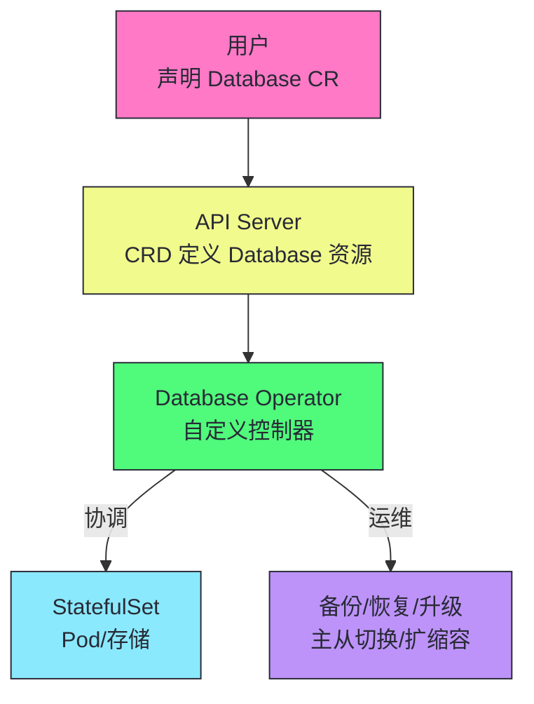
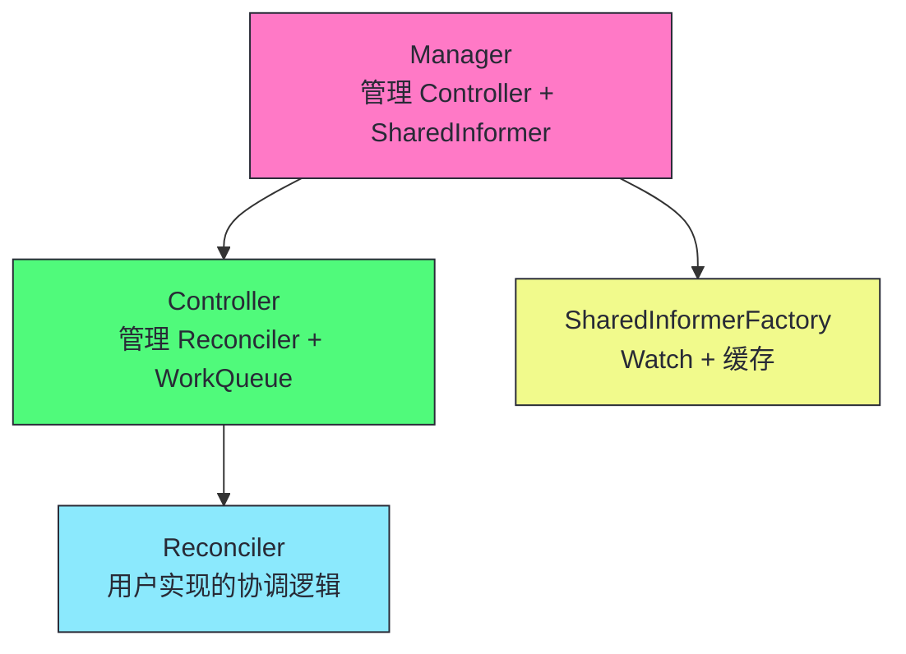
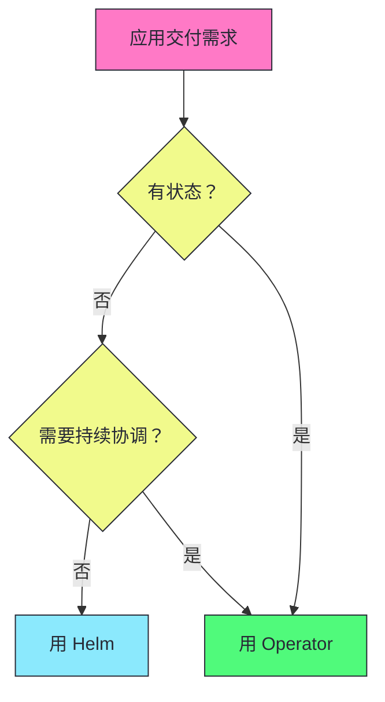

# 12 CRD 与 Operator 模式：自定义控制器与扩展 K8s

**摘要：**
本文深入 Kubernetes 的扩展机制——CRD（Custom Resource Definition）与 Operator 模式。CRD 允许用户在不修改 K8s 源码的情况下定义新的 API 资源类型，Operator 是管理特定应用生命周期的自定义控制器。文章追溯 Operator 的起源（CoreOS 2016 年提出），讲透 CRD 与 Operator 的关系（CRD 是语法，Operator 是语义），拆解 CRD 的定义（OpenAPI v3 Schema 验证、API 版本演进、subresources），深入 controller-runtime 框架（Manager/Controller/Reconciler 三层架构），讲透 Operator 设计模式（Finalizer、OwnerReference、状态机式协调、幂等性），对比 Helm vs Operator 的应用交付，讨论生产级 Operator 最佳实践（RBAC、监控、Webhook、Leader Election），最后讨论 Operator 的边界与反例。核心认知：Operator 的价值不是"创建 StatefulSet/Service"，而是将运维专家的知识编码到控制器中——自动化备份、恢复、升级、扩缩容等原本需要人工操作的运维任务。

---

## 第 1 章 Operator 的起源：运维知识编码

讲 CRD 与 Operator，不能从"CRD 有哪些字段"切入，而要先回到 Operator 的起源——为什么需要 Operator，Operator 解决什么问题。Operator 不是 K8s 凭空发明的，它的出现有深刻的技术背景。

### 1.1 有状态应用的运维困境

K8s 擅长管理无状态应用——Deployment 管理副本数与滚动更新，HPA 管理自动扩缩容，Service 管理负载均衡，这些内置控制器覆盖了无状态应用的全生命周期。但有状态应用的运维远比"创建 Pod"复杂——数据库需要定时备份、故障恢复、主从切换、版本升级；消息队列需要分区再平衡、broker 扩缩容、副本同步监控；分布式存储需要节点加入/退出、数据再平衡、副本修复。这些运维操作需要"专家知识"——知道什么时候备份、如何切换主从、如何安全升级，不是简单的"创建资源"能覆盖的。

在有 Operator 之前，有状态应用的运维有几种方式。第一，手动运维——运维人员手动执行备份、切换、升级，效率低且易错。第二，脚本自动化——用 Shell/Python 脚本封装运维操作，但脚本不感知集群状态，无法持续协调。第三，外部调度系统——用 Ansible/Puppet 等配置管理工具，但这些工具不与 K8s 集成，无法复用 K8s 的声明式 API 与协调循环。这些方式的共同问题是——**运维知识与 K8s 的声明式协调能力脱节**。

这几种方式的局限值得深入。手动运维的局限是"不可重复"——不同运维人员的操作可能不同，难以标准化。脚本自动化的局限是"不感知状态"——脚本执行完就结束，不持续监控应用状态，应用出问题时脚本不知道。外部调度系统的局限是"不与 K8s 集成"——Ansible/Puppet 操作 K8s 资源需要额外配置，无法复用 K8s 的 Watch/Informer 机制，无法实时响应状态变化。

Operator 模式解决了这些局限——它把运维知识编码到 K8s 控制器，复用 K8s 的声明式 API 与协调循环，持续监控应用状态并自动响应。运维知识标准化（编码在控制器中，所有人用同一套逻辑），持续感知状态（Watch 机制实时响应），与 K8s 深度集成（复用 API/RBAC/Watch 等基础设施）。这是 Operator 相比传统运维方式的根本优势。

### 1.2 CoreOS 与 Operator 模式

2016 年，CoreOS（后被 Red Hat 收购）提出 Operator 模式。Operator 的核心理念是——**把运维专家的知识编码到 K8s 控制器中**。一个数据库 Operator 不仅创建 StatefulSet/Service，还持续 Watch 数据库状态，自动执行备份、故障检测、主从切换、版本升级——这些原本需要 DBA 人工操作的运维任务，由 Operator 自动完成。

Operator 的技术实现基于两个 K8s 扩展机制——CRD（Custom Resource Definition）定义新的 API 资源类型（譬如 `Database`），自定义控制器（Custom Controller）持续 Watch 这个资源并执行协调逻辑。CRD 提供"语法"——定义资源的字段结构；控制器提供"语义"——管理资源的行为逻辑。两者结合，Operator 把"Database 这个资源"的声明式 API 与"数据库运维"的协调逻辑统一到 K8s 内。



Operator 模式的价值在于——**运维知识可复用、可分发、可演进**。一个高质量的数据库 Operator 凝聚了 DBA 的运维经验，任何团队部署这个 Operator 就获得了这些经验，不需要自己摸索。Operator 可以版本化、开源、社区维护——譬如 Prometheus Operator、Cert-Manager、ArgoCD 都是成功的 Operator 项目，它们的运维知识被社区持续打磨，比单个团队的私有脚本更可靠。

> [!info] 核心概念：Operator 把运维知识编码到控制器
> Operator 的核心理念是把运维专家的知识编码到 K8s 控制器中——自动化备份、恢复、升级、扩缩容等原本需要人工操作的运维任务。这是 Operator 区别于 Helm 的本质——Helm 渲染模板创建资源，Operator 持续协调执行运维。Operator 的价值不在"创建资源"，而在"自动化运维"。

---

## 第 2 章 CRD：自定义 API 资源

讲完了 Operator 的起源，接下来看 CRD 的具体定义。CRD 是 Operator 的"语法"——它定义自定义资源的字段结构，让 K8s API Server 能识别并验证这种新资源。

### 2.1 什么是 CRD

**CRD（Custom Resource Definition）** 允许用户定义新的 K8s API 资源类型。定义 CRD 后，用户可以用 `kubectl get <custom-resource>` 操作自定义资源，就像操作内置资源一样。

```yaml
apiVersion: apiextensions.k8s.io/v1
kind: CustomResourceDefinition
metadata:
  name: databases.example.com
spec:
  group: example.com
  names:
    kind: Database
    plural: databases
    singular: database
    shortNames: [db]
  scope: Namespaced
  versions:
    - name: v1
      served: true
      storage: true
      schema:
        openAPIV3Schema:
          type: object
          properties:
            spec:
              type: object
              properties:
                engine:
                  type: string
                  enum: [mysql, postgresql]
                version:
                  type: string
                replicas:
                  type: integer
                  minimum: 1
                  maximum: 5
            status:
              type: object
              properties:
                phase:
                  type: string
                ready:
                  type: boolean
```

这个 CRD 定义了 `Database` 资源——`group: example.com` 表示 API 组，`kind: Database` 表示资源类型，`scope: Namespaced` 表示命名空间级资源。定义后，用户可以创建 `Database` 资源，`kubectl get databases` 列出所有 Database，`kubectl describe database my-db` 查看详情——操作方式与内置资源完全一致。

### 2.2 CRD 的关键字段

| 字段 | 说明 |
|------|------|
| **group** | API 组名（如 example.com） |
| **names** | 资源名称（kind/plural/singular/shortNames） |
| **scope** | Namespaced 或 Cluster |
| **versions** | API 版本列表 |
| **schema** | OpenAPI v3 Schema 验证 |
| **subresources** | status 和 scale 子资源 |
| **additionalPrinterColumns** | kubectl get 的额外列 |
| **conversion** | 多版本间的转换策略 |

CRD 的字段设计体现了 K8s API 的通用模式——group/version/kind 区分资源类型，scope 控制资源可见范围，schema 验证字段合法性，subresources 分离 spec/status/scale 的访问。这些字段与内置资源（如 Deployment、StatefulSet）的字段一致——CRD 复用 K8s API 框架，自定义资源与内置资源在 API 层面没有本质区别。

### 2.3 OpenAPI v3 Schema 验证

CRD 的 `openAPIV3Schema` 定义资源的字段结构——类型、枚举、范围、必填等。API Server 在创建/更新自定义资源时，用这个 Schema 验证字段合法性——不合法的请求被拒绝（422 Unprocessable Entity）。

Schema 验证是生产级 CRD 的必备要素。没有 Schema 的 CRD 接受任意字段——用户可能写错字段名（譬如 `repicas` 拼成 `replicas`），API Server 不报错，控制器收到的 spec 里没有正确字段，行为异常。有了 Schema，拼写错误在 API Server 层就被拒绝，不会到控制器。Schema 还能限制字段范围——譬如 `replicas` 的 `minimum: 1, maximum: 5`，防止用户配置 0 或 100 个副本。

Schema 验证的一个高级特性是 `x-kubernetes-list-type` 与 `x-kubernetes-map-type`——它们控制列表与 map 的合并语义。譬如 `x-kubernetes-list-type: set` 表示列表按元素去重，`x-kubernetes-list-type: map` 表示列表按 key 合并（Server-Side Apply 时按 key 合并而非整体替换）。这些特性使得 CRD 的字段能与 K8s 的 Server-Side Apply、Strategic Merge Patch 等高级特性配合，支持细粒度的字段所有权管理。

Schema 验证还有一个工程价值——文档化。OpenAPI v3 Schema 不仅是验证规则，也是 API 文档——`kubectl explain databases.spec` 能基于 Schema 显示字段说明，开发者不需要单独维护文档。kubebuilder 的 `+kubebuilder` 注解能从 Go 代码生成 Schema 与文档，保持代码与文档同步。

K8s 1.25 引入了 CEL（Common Expression Language）表达式验证，作为 OpenAPI v3 Schema 的补充。CEL 表达式写在 `x-kubernetes-validations` 字段中，能表达 Schema 无法描述的跨字段约束——譬如"如果 engine 是 mysql，version 必须是 8.0 或更高"、"replicas 必须大于 minReplicas"。CEL 验证在 API Server 端执行，无需 Webhook，性能优于 Webhook 验证。对于简单的跨字段约束，优先用 CEL 而非 Webhook——CEL 是声明式的、无外部依赖、API Server 内置执行，避免了 Webhook 的可用性依赖与超时问题，是 CRD 验证的推荐方式。

### 2.4 status 子资源

```yaml
versions:
  - name: v1
    subresources:
      status: {}  # 启用 status 子资源
      scale:
        specReplicasPath: .spec.replicas
        statusReplicasPath: .status.replicas
```

启用 status 子资源后，spec 和 status 的更新分离——更新 status 用 `/status` 端点，不与 spec 更新冲突（乐观并发控制独立）。scale 子资源允许用 `kubectl scale` 命令直接修改副本数，无需编辑完整 spec。

status 子资源的分离有几个工程价值。第一，并发控制独立——用户更新 spec 与控制器更新 status 用不同的 resourceVersion，不会互相 409 Conflict。如果没有 status 子资源，spec 和 status 在同一对象，用户改 spec 时控制器改 status 会冲突。第二，权限分离——RBAC 可以分别授予 spec 写权限（用户）与 status 写权限（控制器），避免用户误改 status。第三，kubectl 集成——`kubectl get` 显示 status 字段，`kubectl scale` 操作 scale 子资源，用户体验与内置资源一致。

> [!info] 核心概念：CRD 复用 K8s 的所有基础设施
> CRD 定义后，自定义资源复用 K8s 的所有基础设施——RESTful API、kubectl 操作、RBAC 授权、Watch/Informer、Label/Selector、OwnerReference/GC。你不需要自己实现这些——它们是 K8s API 框架的通用能力。这是 CRD 相比"自己写 API 服务"的优势——站在 K8s 的肩膀上，而非重新发明轮子。

### 2.5 additionalPrinterColumns

```yaml
versions:
  - name: v1
    additionalPrinterColumns:
      - name: Engine
        type: string
        jsonPath: .spec.engine
      - name: Version
        type: string
        jsonPath: .spec.version
      - name: Replicas
        type: integer
        jsonPath: .spec.replicas
      - name: Phase
        type: string
        jsonPath: .status.phase
      - name: Age
        type: date
        jsonPath: .metadata.creationTimestamp
```

`additionalPrinterColumns` 定义 `kubectl get databases` 显示的列——默认只显示 NAME 与 AGE，自定义列让用户一眼看到关键信息（引擎、版本、副本数、阶段）。这是 CRD 用户体验的细节——好的列定义让运维人员不需要 `kubectl describe` 就能判断资源状态。

`additionalPrinterColumns` 的一个进阶用法是"priority 字段"——`priority: 0` 的列在窄屏（譬如手机）也显示，`priority: 1` 的列只在宽屏显示。这允许定义多级列——关键信息（phase、replicas）始终显示，次要信息（version、engine）宽屏才显示。这种设计适配不同终端，提升用户体验。

CRD 的另一个用户体验特性是"status conditions"。conditions 是比 phase 更细粒度的状态表示——每个 condition 有 type（譬如 Ready、BackupComplete）、status（True/False/Unknown）、reason、message。`kubectl describe` 显示 conditions，帮助运维人员诊断问题。生产级 CRD 通常同时有 phase（粗粒度）与 conditions（细粒度）——phase 让 `kubectl get` 一眼看到状态，conditions 让 `kubectl describe` 看到详细原因。

CRD 的多版本支持是 API 演进的关键机制。一个 CRD 可以定义多个版本（如 v1alpha1、v1beta1、v1），其中一个是 storage 版本（实际存储在 etcd 的格式）。当用户请求非 storage 版本时，API Server 通过 Conversion Webhook 把请求版本转换为 storage 版本存储，读取时再转换回请求版本。Conversion Webhook 是一个 HTTP 服务，接收 ConversionReview 请求，返回转换后的对象。版本升级的推荐路径是：先新增新版本（与旧版本并存），部署 Conversion Webhook，把 storage 版本切换到新版本，等所有客户端迁移后废弃旧版本，最后删除旧版本。不要直接删除旧版本——还在用旧版本的客户端会失败。

---

## 第 3 章 controller-runtime：编写控制器的框架

讲完了 CRD 的"语法"，接下来看控制器的"语义"——如何用 controller-runtime 编写 Operator 的协调逻辑。controller-runtime 是 K8s SIG 提供的 Go 库，封装了 Manager/Controller/Reconciler 的三层架构，简化控制器开发。

### 3.1 三层架构



三层架构的职责清晰分离。Manager 管理全局资源——SharedInformerFactory（Watch + 缓存）、Client（读写 API Server）、Scheme（类型注册）、Leader Election、Metrics。Controller 管理单个控制循环——事件源（For/Owns/Watches）、WorkQueue、Reconciler 调度。Reconciler 是用户实现的协调逻辑——接收资源名，获取当前状态，执行协调操作。这种分层使得用户只需实现 Reconciler，其余由框架处理。

### 3.2 编写控制器的完整流程

```go
// 1. 定义 API 类型（types.go）
type DatabaseSpec struct {
    Engine  string `json:"engine"`
    Version string `json:"version"`
    Replicas int32 `json:"replicas"`
}

type DatabaseStatus struct {
    Phase string `json:"phase"`
    Ready bool   `json:"ready"`
}

// +kubebuilder:object:root=true
type Database struct {
    metav1.TypeMeta   `json:",inline"`
    metav1.ObjectMeta `json:"metadata,omitempty"`
    Spec   DatabaseSpec   `json:"spec,omitempty"`
    Status DatabaseStatus `json:"status,omitempty"`
}

// 2. 实现 Reconciler
type DatabaseReconciler struct {
    client.Client
    Scheme *runtime.Scheme
}

func (r *DatabaseReconciler) Reconcile(ctx context.Context, req ctrl.Request) (ctrl.Result, error) {
    var db examplev1.Database
    if err := r.Get(ctx, req.NamespacedName, &db); err != nil {
        return ctrl.Result{}, client.IgnoreNotFound(err)
    }
    
    // 处理删除
    if !db.DeletionTimestamp.IsZero() {
        return r.handleDeletion(ctx, &db)
    }
    
    // 添加 Finalizer
    if !controllerutil.ContainsFinalizer(&db, finalizerName) {
        controllerutil.AddFinalizer(&db, finalizerName)
        return ctrl.Result{Requeue: true}, r.Update(ctx, &db)
    }
    
    // 正常协调：创建 StatefulSet/Service
    if err := r.ensureStatefulSet(ctx, &db); err != nil {
        return ctrl.Result{}, err
    }
    
    // 更新 status
    db.Status.Phase = "Running"
    db.Status.Ready = true
    db.Status.ObservedGeneration = db.Generation
    return ctrl.Result{}, r.Status().Update(ctx, &db)
}

// 3. 注册 Controller
func main() {
    mgr, _ := ctrl.NewManager(ctrl.GetConfigOrDie(), ctrl.Options{
        Scheme: scheme,
    })
    
    ctrl.NewControllerManagedBy(mgr).
        For(&examplev1.Database{}).
        Owns(&appsv1.StatefulSet{}).
        Owns(&corev1.Service{}).
        Complete(&DatabaseReconciler{Client: mgr.GetClient(), Scheme: mgr.GetScheme()})
    
    mgr.Start(ctrl.SetupSignalHandler())
}
```

这个流程体现了 controller-runtime 的典型开发模式。第一步定义 API 类型——Go struct 加 JSON tag，用 kubebuilder 注解生成 CRD 与 DeepCopy 代码。第二步实现 Reconciler——`Reconcile` 方法接收资源名（`req.NamespacedName`），获取当前资源，根据状态执行协调。第三步注册 Controller——`For` 指定主资源，`Owns` 指定子资源，`Complete` 注册 Reconciler。

controller-runtime 的 Manager 还管理两个重要组件：Cache 与 Client。Cache 是 SharedInformerFactory 的封装——它 Watch 集群资源并在本地缓存，Reconcile 中的 Get/List 操作从 Cache 读取而非直接查 API Server，减少 API Server 压力。Cache 的一致性是最终一致的——Watch 事件可能有短暂延迟，但 Reconcile 通常容忍这种延迟。Client 是 Cache 与 API Server 的统一接口——Get/List 从 Cache 读，Create/Update/Delete 直接写 API Server。这种"读缓存、写直连"的设计平衡了性能与一致性——读操作走缓存快速响应，写操作直连 API Server 保证强一致。如果需要强一致读（譬如读最新状态做决策），可以用 `client.NewClient(client.Options{Cache: nil})` 绕过 Cache 直接读 API Server。

Reconcile 的返回值控制后续行为——`ctrl.Result{Requeue: true}` 表示立即重新入队（譬如更新了 Finalizer 后需要重新协调），`ctrl.Result{RequeueAfter: 30 * time.Second}` 表示 30 秒后重新入队（譬如定时备份），`ctrl.Result{}` 表示不重新入队（等下一个事件触发）。`error` 非 nil 时自动重新入队（指数退避）。

`Requeue` 与 `RequeueAfter` 的区别值得深入。`Requeue: true` 是"立即重新入队"——WorkQueue 把这个资源立即放回队列，下次 Reconcile 马上执行。这适合"本次 Reconcile 没完成，需要立即继续"的场景——譬如更新了 Finalizer 后，需要重新 Reconcile 执行后续逻辑。`RequeueAfter: 30s` 是"延迟重新入队"——WorkQueue 在 30 秒后把资源放回队列。这适合"定时检查"的场景——譬如数据库 Operator 每 30 秒检查一次备份状态，不需要事件触发，定时 Reconcile。

`error` 非 nil 时的退避机制也值得了解——WorkQueue 用指数退避重试失败的操作，重试间隔从 5 毫秒到 1000 秒（默认上限），避免频繁重试压垮 API Server。对于"暂时性失败"（譬如 API Server 短暂不可用），退避重试能自动恢复；对于"永久性失败"（譬如配置错误），退避到上限后保持固定间隔重试，等待人工修复。生产中应该区分"暂时性失败"（返回 error 让框架重试）与"永久性失败"（更新 status.phase 为 Failed，不返回 error 避免无意义重试）。

### 3.3 For/Owns/Watches 的事件源管理

```go
ctrl.NewControllerManagedBy(mgr).
    For(&examplev1.Database{}).      // 主资源
    Owns(&appsv1.StatefulSet{}).     // 子资源：StatefulSet 变化触发 Reconcile
    Owns(&corev1.Service{})          // 子资源：Service 变化触发 Reconcile
    Watches(&corev1.ConfigMap{}, handler.EnqueueRequestsFromMapFunc(...))  // 外部资源
```

`For`、`Owns`、`Watches` 是 controller-runtime 的三种事件源。`For` 指定主资源——主资源变化触发 Reconcile。`Owns` 指定子资源——子资源变化触发所属主资源的 Reconcile，框架自动通过 OwnerReference 查找父资源。`Watches` 指定外部资源——外部资源变化触发自定义映射的 Reconcile，需要提供 `handler.EnqueueRequestsFromMapFunc` 把外部资源映射到主资源。

> [!info] 核心概念：Owns 自动建立子资源到父资源的事件转发
> 当 StatefulSet 变化时（如副本数变化），Database Operator 需要知道——因为 Database 的 status 取决于 StatefulSet 的状态。`Owns` 自动建立这个转发——StatefulSet 变化触发所属 Database 的 Reconcile。无需手动 Watch StatefulSet 并查找 OwnerReference。这是 controller-runtime 简化控制器开发的典型设计。

`Watches` 的典型场景是"外部依赖"——譬如 Database Operator 需要 Watch 一个 ConfigMap（存储数据库配置），ConfigMap 变化时重新协调所有 Database。`handler.EnqueueRequestsFromMapFunc` 提供映射函数——输入 ConfigMap，输出需要协调的 Database 列表。这种灵活的事件源管理使得 controller-runtime 能处理复杂的依赖关系。

---

## 第 4 章 Operator 的设计模式

讲完了 controller-runtime 的框架，接下来看 Operator 的设计模式。这些模式是 Operator 开发的"最佳实践"——Finalizer 管理外部资源、OwnerReference 级联控制、状态机式协调、幂等性保证。

### 4.1 Finalizer：管理外部资源

```go
const finalizerName = "example.com/database-cleanup"

func (r *DatabaseReconciler) handleDeletion(ctx context.Context, db *examplev1.Database) (ctrl.Result, error) {
    if controllerutil.ContainsFinalizer(db, finalizerName) {
        // 清理外部资源（如云数据库实例）
        if err := r.deleteCloudDatabase(db); err != nil {
            return ctrl.Result{}, err  // 失败重试
        }
        controllerutil.RemoveFinalizer(db, finalizerName)
        return ctrl.Result{}, r.Update(ctx, db)
    }
    return ctrl.Result{}, nil
}
```

Finalizer 是 K8s 的删除保护机制——资源有 Finalizer 时，删除操作只设置 `deletionTimestamp`，不真正删除，直到 Finalizer 被移除。Operator 用 Finalizer 确保删除前清理外部资源——譬如删除云数据库实例、清理 DNS 记录、删除对象存储。没有 Finalizer，删除 Database CR 后外部资源泄露——云数据库继续计费，DNS 记录残留。

Finalizer 的工作流程是——创建资源时添加 Finalizer，删除时检测 `deletionTimestamp`，执行清理逻辑，清理成功后移除 Finalizer，资源才真正删除。清理失败时返回 error，Reconcile 重试——直到清理成功。这个机制保证了"外部资源与 K8s 资源的生命周期一致"。

Finalizer 的一个常见陷阱是"Finalizer 卡住"。如果清理逻辑一直失败（譬如外部 API 不可达），Finalizer 无法移除，资源永远处于 Terminating 状态。生产中需要监控 Terminating 资源的持续时间——长时间 Terminating 说明 Finalizer 卡住，需要人工介入。介入方式是手动移除 Finalizer（`kubectl patch database my-db --type=json -p='[{"op":"remove","path":"/metadata/finalizers"}]'`），但这会跳过清理逻辑——外部资源可能泄露。更稳妥的做法是修复清理逻辑（譬如增加超时与重试），让 Finalizer 自然完成。

Finalizer 的另一个设计考量是"Finalizer 名唯一"。每个 Operator 用自己的 Finalizer 名（譬如 `example.com/database-cleanup`），避免与其他 Operator 冲突。一个资源可以有多个 Finalizer——多个 Operator 各自管理自己的外部资源，删除时各自清理自己的 Finalizer。这种"多 Finalizer"设计支持多 Operator 协作——譬如一个 Operator 管理数据库实例，另一个管理 DNS 记录，各自 Finalizer 独立。

### 4.2 OwnerReference 级联控制

```go
sts.ObjectMeta.OwnerReferences = []metav1.OwnerReference{
    {
        APIVersion: "example.com/v1",
        Kind:       "Database",
        Name:       db.Name,
        UID:        db.UID,
    },
}
```

OwnerReference 建立资源的"父子关系"——子资源（StatefulSet）的 OwnerReference 指向父资源（Database）。父资源删除时，垃圾收集器自动删除子资源——这是级联删除。Operator 用 OwnerReference 确保创建的子资源随主资源删除——Database 删除时 StatefulSet/Service 自动删除，不需要 Operator 手动清理。

OwnerReference 的级联删除有三种模式——Foreground（等子资源全部删除后才删父资源）、Background（先删父资源，后台删子资源）、Orphan（不删子资源）。Operator 创建子资源时默认用 Background——父资源删除后子资源自动清理。如果需要保留子资源（譬如迁移到新 Operator），用 `--cascade=orphan`。

OwnerReference 的一个工程细节是"UID 匹配"。OwnerReference 包含父资源的 UID，垃圾收集器通过 UID 确认父资源是否还存在。如果父资源被删除后重建（同名但新 UID），旧的子资源不会被新父资源的 GC 管理——因为 UID 不匹配。这意味着重建父资源后，需要重新创建子资源（或手动更新子资源的 OwnerReference UID）。Operator 的 Reconcile 通常会检查子资源的 OwnerReference UID 是否匹配当前父资源 UID，不匹配就重建子资源。

OwnerReference 的另一个设计考量是"跨命名空间限制"。K8s 默认不允许跨命名空间的 OwnerReference——子资源与父资源必须在同一命名空间。这是因为 GC 需要能访问父资源，跨命名空间访问受 RBAC 限制。如果需要跨命名空间管理（譬如 Operator 在 operator-system 命名空间，管理 default 命名空间的资源），Operator 不能用 OwnerReference，需要用 Finalizer 手动管理子资源删除。

### 4.3 状态机式协调

```go
func (r *DatabaseReconciler) Reconcile(ctx context.Context, req ctrl.Request) (ctrl.Result, error) {
    var db examplev1.Database
    r.Get(ctx, req.NamespacedName, &db)
    
    switch db.Status.Phase {
    case "":
        db.Status.Phase = "Pending"
        r.Status().Update(ctx, &db)
    case "Pending":
        if r.canProvision(&db) {
            db.Status.Phase = "Provisioning"
            r.Status().Update(ctx, &db)
        }
    case "Provisioning":
        if err := r.provision(&db); err != nil {
            return ctrl.Result{}, err
        }
        db.Status.Phase = "Running"
        r.Status().Update(ctx, &db)
    case "Running":
        if !r.isHealthy(&db) {
            db.Status.Phase = "Degraded"
            r.Status().Update(ctx, &db)
        }
    }
    return ctrl.Result{}, nil
}
```

状态机模式用 `status.phase` 表示资源的当前阶段——Pending（等待资源）、Provisioning（创建中）、Running（运行中）、Degraded（降级）。每次 Reconcile 根据 phase 决定下一步——Pending 检查是否可以 provision，Provisioning 执行 provision，Running 检查健康，Degraded 尝试恢复。这种模式把复杂的协调逻辑分解为阶段性的状态转换，每个阶段的逻辑清晰独立。

状态机模式适合"多阶段、有依赖"的协调——譬如数据库创建需要先准备存储（Pending），再启动 Pod（Provisioning），再初始化数据库（Running），每个阶段依赖前一个完成。如果用单一 Reconcile 处理所有阶段，逻辑会嵌套很深；状态机把每个阶段分离，每次 Reconcile 只处理当前阶段，更新 phase 后下一个 Reconcile 处理下一阶段。

状态机模式的一个设计考量是"状态转换的原子性"。每次 Reconcile 只更新一次 phase——譬如从 Pending 到 Provisioning，更新 status.phase 后返回，下次 Reconcile 处理 Provisioning 阶段。这种"一次一个阶段"的机制让状态转换是原子的——如果某次 Reconcile 失败，状态停留在当前 phase，下次 Reconcile 重新处理当前阶段，不会跳过。如果一次 Reconcile 处理多个阶段，中间失败会导致状态不一致——譬如从 Pending 直接跳到 Running，但 Provisioning 没完成，状态与实际不符。

状态机模式的另一个考量是"状态可观测"。phase 字段让用户通过 `kubectl get` 一眼看到资源当前阶段——Pending/Provisioning/Running/Degraded。这比"没有 phase，只能看 status.conditions"更直观。生产中通常把 phase 与 conditions 结合——phase 表示粗粒度阶段，conditions 表示细粒度状态（譬如"备份中"、"升级中"、"主从切换中"），两者互补。

### 4.4 幂等性保证

```go
func (r *DatabaseReconciler) ensureStatefulSet(ctx context.Context, db *examplev1.Database) error {
    var sts appsv1.StatefulSet
    err := r.Get(ctx, types.NamespacedName{Name: db.Name, Namespace: db.Namespace}, &sts)
    
    if errors.IsNotFound(err) {
        // 创建
        sts = r.buildStatefulSet(db)
        return r.Create(ctx, &sts)
    }
    
    // 更新（如果需要）
    desired := r.buildStatefulSet(db)
    if !reflect.DeepEqual(sts.Spec, desired.Spec) {
        sts.Spec = desired.Spec
        return r.Update(ctx, &sts)
    }
    return nil  // 已一致，无需操作
}
```

幂等性是 Reconcile 的核心要求——Reconcile 可能因 WorkQueue 重试或 Resync 被重复调用，每次 Reconcile 都应像第一次一样，检查当前状态，决定是否需要行动。`ensureStatefulSet` 的实现体现了幂等性——先 Get 检查 StatefulSet 是否存在，不存在才 Create，存在且 spec 一致就不操作，存在但 spec 不一致才 Update。无论 Reconcile 调用多少次，结果一致——StatefulSet 存在且 spec 与期望一致。

> [!warning] 生产避坑：Reconcile 必须幂等
> Reconcile 可能因 WorkQueue 重试或 Resync 被重复调用。每次 Reconcile 都应像第一次一样——检查当前状态，决定是否需要行动。`ensureStatefulSet` 先检查 StatefulSet 是否存在且 spec 一致——存在且一致就不操作，不存在才创建，不一致才更新。不要假设"上一次创建了"——可能上一次创建后又被删除了。

幂等性的一个常见陷阱是"假设上一次操作成功"。譬如 Reconcile 第一次创建 StatefulSet，返回成功；第二次 Reconcile 假设 StatefulSet 已存在，直接更新 status——但如果 StatefulSet 被用户手动删除了，第二次 Reconcile 的假设就错了。正确的做法是每次 Reconcile 都重新检查——Get StatefulSet，不存在就创建，存在就检查 spec。这种"不信任上一次状态"的设计是幂等性的核心。

外部操作的幂等性更复杂——创建云数据库、配置 DNS 记录等外部操作没有 K8s 的 Get/Create 语义，需要用"查询兜底"模式。譬如创建云数据库前，先用云 API 查询该数据库是否已存在（按 name 或 tag 匹配），存在则跳过创建，不存在才创建。创建后把云数据库的 ID 记录到 CR 的 status 中，下次 Reconcile 通过 ID 查询状态而非重新创建。这种"先查询再操作"的模式确保外部操作的幂等性——即使 Reconcile 重试，也不会重复创建外部资源。对于不可查询的外部操作（譬如 DNS 记录可能没有"查询是否已设置"的 API），用 Finalizer 记录"已执行的操作"，重试时检查 Finalizer 列表跳过已执行的步骤。

幂等性的另一个考量是"外部操作的幂等性"。如果 Reconcile 调用外部 API（譬如云数据库 API 创建实例），需要确保外部操作幂等——譬如用"实例名"作为幂等键，创建前先查询实例是否已存在，存在就跳过创建。如果外部 API 不支持幂等查询，需要自己维护"已创建"状态——譬如在 status 中记录外部资源 ID，下次 Reconcile 检查 status 中是否有 ID，有就跳过创建。这种"状态记录外部资源"的模式是处理外部资源幂等性的常见方法。

幂等性与 Requeue 的配合也值得注意。如果 Reconcile 执行了"创建外部资源"操作，创建成功但后续更新 status 失败（409 Conflict），下次 Reconcile 重新执行时如何避免重复创建？解决方案是——创建成功后立即更新 status（记录外部资源 ID），即使 status 更新失败，下次 Reconcile 也能通过"查询外部资源是否存在"判断是否已创建。这种"先操作后记录，失败靠查询兜底"的模式确保了外部操作的幂等性。

---

## 第 5 章 Helm vs Operator

讲完了 Operator 的设计模式，接下来看 Operator 与 Helm 的对比。两者都是 K8s 的应用交付工具，但设计理念与适用场景截然不同。

### 5.1 两种应用交付方式

| 维度 | Helm | Operator |
|------|------|---------|
| **模式** | 一次性模板渲染 | 持续协调 |
| **触发** | helm install/upgrade | 持续 Watch |
| **自愈** | 无（模板渲染完就结束） | 有（状态偏离自动修复） |
| **复杂度** | 低 | 高 |
| **适用场景** | 无状态应用、简单配置 | 有状态应用、复杂运维 |

Helm 是"一次性模板渲染"——`helm install` 时渲染模板生成 K8s 资源，提交给 API Server，然后 Helm 就完成了。后续资源状态变化（譬如 Pod 被删、配置被改）Helm 不感知，需要人工 `helm upgrade` 重新渲染。Operator 是"持续协调"——控制器持续 Watch 资源状态，状态偏离期望时自动修复，不需要人工干预。

Helm 与 Operator 的本质区别在于"是否有协调循环"。Helm 没有协调循环——它渲染模板、提交资源、结束，不持续监控。如果有人手动改了 Helm 创建的资源（譬如 kubectl edit 修改了副本数），Helm 不感知，下次 helm upgrade 时可能覆盖手动修改。Operator 有协调循环——它持续 Watch 资源状态，如果有人手动改了 Operator 创建的资源，Operator 会检测到偏离并自动修复（或根据策略接受修改）。这种"持续协调"是 Operator 区别于 Helm 的核心能力。

Helm 的另一个局限是"不支持复杂条件逻辑"。Helm 模板用 Go template 渲染，能做简单条件判断（if/else），但不适合复杂逻辑——譬如"根据集群资源动态决定副本数"、"根据数据库版本决定升级路径"、"根据故障检测结果触发主从切换"。这些复杂逻辑需要编程语言实现，Helm 模板表达不了。Operator 用 Go 编写 Reconcile，能实现任意复杂逻辑——这是 Operator 适合复杂运维场景的原因。

### 5.2 选择依据



选择 Helm 还是 Operator 的判断标准是——**应用是否需要持续协调**。无状态应用（Web 服务、API 网关）不需要持续协调——创建后运行就行，出了问题重启 Pod 即可，用 Helm 足够。有状态应用（数据库、消息队列）需要持续协调——备份、恢复、主从切换需要持续监控与自动操作，用 Operator。有些应用介于两者之间（譬如带本地缓存的 Web 服务），可以用 Helm 部署 + 简单脚本处理缓存预热，不需要完整 Operator。

> [!info] 核心概念：Operator 的价值是自动化运维，不是创建资源
> 如果 Operator 只是"创建 StatefulSet/Service"，它和 Helm 没本质区别——都是创建 K8s 资源。Operator 的真正价值在于自动化运维——备份、恢复、升级、扩缩容、故障转移等原本需要人工操作的运维任务。一个数据库 Operator 应该：定时备份、自动故障检测、主从切换、版本升级、按指标扩缩容。这些是 Helm 做不到的——Helm 渲染完模板就结束，不持续协调。Operator 持续 Watch 资源状态，自动执行运维操作。

### 5.3 Helm 与 Operator 的混合使用

生产中 Helm 与 Operator 不是非此即彼——可以混合使用。一种常见模式是"Helm 部署 Operator，Operator 管理应用"——用 Helm Chart 安装 Operator（Operator 本身是无状态的部署），Operator 再管理有状态应用。这种模式结合了 Helm 的部署便利与 Operator 的运维能力——Helm 负责"安装 Operator"，Operator 负责"运维应用"。

另一种模式是"Helm 部署无状态部分，Operator 管理有状态部分"——譬如一个系统有 Web 前端（无状态）与数据库（有状态），用 Helm 部署 Web 前端，用 Operator 管理数据库。两者各司其职，不强行统一到一个工具。

混合使用的一个常见陷阱是"Helm 与 Operator 管理同一资源"。譬如 Helm 创建了 StatefulSet，Operator 也试图管理这个 StatefulSet——两者冲突，Helm upgrade 覆盖 Operator 的修改，Operator 又修复回来，循环往复。避免这个陷阱的原则是"资源所有权清晰"——每个资源只有一个管理者，要么 Helm 要么 Operator，不要重叠。如果需要从 Helm 迁移到 Operator，先 Helm uninstall 移除 Helm 管理，再让 Operator 接管。

混合使用还有一种更精细的模式："Helm 管理基础资源，Operator 管理运维操作"。譬如 Helm 部署数据库的 StatefulSet/Service/ConfigMap（基础资源），Operator 只负责备份、恢复、升级等运维操作（不管理基础资源）。这种分工避免了资源所有权冲突——Helm 管基础资源，Operator 管运维操作，两者不重叠。但实现复杂度较高——Operator 需要感知 Helm 管理的资源变化，且不能修改这些资源。这种模式适合"Helm 已部署了应用，想增加运维自动化"的场景，譬如给已有的 PostgreSQL 部署添加备份 Operator。

---

## 第 6 章 生产级 Operator 最佳实践

讲完了设计模式与工具对比，接下来看生产级 Operator 的最佳实践。这些实践是"把 Operator 从 Demo 做到生产"的关键——RBAC、监控、Webhook、版本转换、Leader Election、并发安全。

### 6.1 RBAC 最小权限

```yaml
apiVersion: rbac.authorization.k8s.io/v1
kind: ClusterRole
metadata:
  name: database-operator
rules:
  - apiGroups: ["example.com"]
    resources: ["databases", "databases/status", "databases/finalizers"]
    verbs: ["get", "list", "watch", "update", "patch"]
  - apiGroups: ["apps"]
    resources: ["statefulsets"]
    verbs: ["get", "list", "watch", "create", "update", "delete"]
  - apiGroups: [""]
    resources: ["services"]
    verbs: ["get", "list", "watch", "create", "update", "delete"]
```

RBAC 最小权限是生产级 Operator 的安全基线——只授予必要的资源操作权限，避免通配符（`*`）和 cluster-admin。譬如 Database Operator 只需要操作 `databases`、`statefulsets`、`services`，不需要操作其他资源。如果授予 cluster-admin，Operator 被攻破后攻击者能操作集群所有资源——这是严重的安全风险。

RBAC 的权限粒度可以到资源级别——`databases/status` 与 `databases/finalizers` 是子资源，可以单独授权。譬如可以授予控制器 `databases/status` 的写权限但不授 `databases` 的写权限——控制器只能更新 status，不能改 spec，避免控制器误改用户配置。

### 6.2 Webhook 验证

```yaml
apiVersion: admissionregistration.k8s.io/v1
kind: ValidatingWebhookConfiguration
metadata:
  name: database-validator
webhooks:
  - name: validator.example.com
    rules:
      - operations: ["CREATE", "UPDATE"]
        apiGroups: ["example.com"]
        resources: ["databases"]
```

ValidatingWebhook 在资源创建/更新时调用外部服务验证——CRD 的 OpenAPI Schema 只能验证字段类型与范围，Webhook 能验证业务逻辑。譬如 Database 的 `engine: mysql` 与 `version: 8.0` 是否兼容（某些版本不支持某些引擎），这种业务逻辑验证 Schema 做不到，需要 Webhook。

Webhook 的另一个类型是 MutatingWebhook——在资源持久化前修改资源。譬如 Database 创建时自动注入默认配置（如果用户没指定），或根据 `engine` 自动设置合理的 `replicas` 默认值。MutatingWebhook 与 ValidatingWebhook 的区别——前者修改资源，后者只验证不修改。

Webhook 的一个工程考量是"可用性依赖"。Webhook 是外部服务，如果 Webhook 服务不可用，API Server 的创建/更新请求会被拒绝（默认 fail-closed）或放行（fail-open）。生产中 Webhook 服务必须高可用——多副本部署，避免 Webhook 故障导致资源无法创建。对于关键 CRD，Webhook 故障可能导致整个 Operator 无法工作——用户无法创建 Database，Operator 无资源可协调。

Webhook 的另一个设计考量是"超时"。API Server 调用 Webhook 有超时限制（默认 10 秒），超时后按 fail-closed/fail-open 策略处理。Webhook 的验证逻辑应该快速——避免调用外部服务（譬如查数据库），只做本地验证。如果需要调用外部服务，用异步方式（譬如创建后由 Operator 异步验证），不阻塞 Webhook。

Webhook 的配置有几个关键参数。`timeoutSeconds` 定义 API Server 等待 Webhook 响应的最大时间（默认 10 秒，最大 30 秒），超时后按 failurePolicy 处理。`failurePolicy: Fail`（默认，fail-closed）表示 Webhook 不可用时拒绝请求，`failurePolicy: Ignore`（fail-open）表示放行请求。生产中验证类 Webhook 用 Fail（严格验证），辅助类 Webhook 可用 Ignore（避免 Webhook 故障阻断业务）。`namespaceSelector` 限制 Webhook 只匹配特定命名空间的资源——譬如只验证带特定 label 的命名空间，避免对系统命名空间（kube-system）的资源也调用 Webhook。`matchPolicy: Equivalent`（默认）表示只匹配与 Webhook 注册的 policy 等价的请求，`Exact` 表示精确匹配版本。

### 6.3 监控指标

```go
import "sigs.k8s.io/controller-runtime/pkg/metrics"

var reconcileTotal = prometheus.NewCounterVec(
    prometheus.CounterOpts{Name: "controller_reconcile_total"},
    []string{"controller", "result"},
)

var reconcileDuration = prometheus.NewHistogramVec(
    prometheus.HistogramOpts{Name: "controller_reconcile_duration_seconds"},
    []string{"controller"},
    nil,
)

func init() {
    metrics.Registry.MustRegister(reconcileTotal)
    metrics.Registry.MustRegister(reconcileDuration)
}
```

生产级 Operator 必须暴露监控指标——Reconcile 次数、延迟、错误率。controller-runtime 内置 Prometheus 指标，默认在 `:8080/metrics` 暴露。关键指标包括——`controller_reconcile_total`（Reconcile 总次数，按 result 分）、`controller_reconcile_duration_seconds`（Reconcile 延迟）、`controller_runtime_max_concurrent_reconciles`（并发 Reconcile 数）。

监控指标的价值在于"可观测性"——没有监控的 Operator 是"黑箱"，运维人员不知道它是否正常工作、是否有性能问题。生产中应该配置 Prometheus 抓取这些指标，并设置告警——Reconcile 错误率 >5% 或延迟 P99 >5s 告警。这些告警能及时发现 Operator 异常，避免 Operator 故障导致应用无人管理。

自定义指标除了框架内置的，还可以添加业务指标——譬如数据库 Operator 暴露"备份成功次数"、"备份失败次数"、"主从切换次数"等业务指标。这些指标反映 Operator 的运维效果——备份失败次数增加说明备份逻辑有问题，主从切换频繁说明数据库不稳定。业务指标比框架指标更有运维价值——它们直接反映"Operator 是否在做该做的事"。

监控的另一个维度是"事件记录"。Operator 应该在关键操作时记录 Kubernetes Event（譬如"Database my-db created"、"Backup started"、"Master switched from pod-0 to pod-1"）。这些 Event 通过 `kubectl describe database my-db` 可见，帮助运维人员理解 Operator 的操作历史。Event 是 Operator 可观测性的补充——指标显示"做了多少"，Event 显示"做了什么"。

Event 记录有几个最佳实践。第一，用 `record.EventRecorder` 而非直接创建 Event 对象——EventRecorder 自动处理 Event 的 TTL、聚合与去重，避免重复 Event 填满 etcd。第二，Event 的 reason 用大驼峰命名（如 `BackupStarted`），message 用简洁的自然语言描述，便于 grep 与过滤。第三，区分 Normal 与 Warning Event——正常操作用 Normal，异常情况用 Warning，让运维人员能快速筛选问题。第四，Event 不应记录敏感信息（如密码、Token），Event 明文存储在 etcd 中，任何有读权限的用户都能看到，这是安全的基本要求。

### 6.4 多版本 CRD 的转换

CRD 支持多版本（如 v1alpha1、v1beta1、v1），版本间需要转换：

| 转换方式 | 说明 |
|---------|------|
| **None** | 不转换（各版本结构相同） |
| **Webhook** | 通过 Conversion Webhook 转换（结构不同时） |

```yaml
versions:
  - name: v1alpha1
    served: true
    storage: false  # 不存储
  - name: v1
    served: true
    storage: true   # 存储版本
    schema: ...
conversion:
  strategy: Webhook
  webhook:
    clientConfig:
      service:
        name: conversion-webhook
        namespace: operator-system
        path: /convert
```

CRD 的多版本支持使得 API 能演进——新版本增加字段、废弃旧字段，同时保持向后兼容。`storage: true` 的版本是实际存储到 etcd 的版本，其他版本通过 Conversion Webhook 转换。譬如 etcd 存 v1 格式，用户用 v1alpha1 API 读写时，Webhook 把 v1alpha1 转换为 v1（写）或 v1 转换为 v1alpha1（读）。

CRD 版本演进有几个阶段。第一阶段是 v1alpha1——API 不稳定，字段可能随时变化，适合开发测试。第二阶段是 v1beta1——API 趋于稳定，字段基本确定，但可能微调，适合早期用户。第三阶段是 v1——API 稳定，字段不再变化，保证向后兼容，适合生产。从 v1alpha1 到 v1 的演进过程中，多个版本可以同时 served=true，用户用任一版本都能操作，Conversion Webhook 负责版本间转换。

版本演进的一个常见模式是"字段添加而非删除"。新版本增加字段时，旧版本忽略新字段（Conversion Webhook 把新字段丢弃），保持向后兼容。删除字段时不能直接删——旧版本可能还在用，需要先标记 deprecated（v1beta1 标记废弃），等所有客户端迁移后再删（v1 删除）。这种"先废弃后删除"的策略与 K8s 内置 API 的演进策略一致。

> [!warning] 生产避坑：CRD 版本升级需规划转换路径
> CRD 版本升级是破坏性变更——从 v1alpha1 到 v1 可能字段变化。升级策略：(1) 新版本 served=true 但 storage=false（只读）；(2) 提供 Conversion Webhook 转换新旧版本；(3) 迁移所有客户端后，旧版本 served=false。不要直接删除旧版本——使用旧版本的客户端会失败。K8s 的 API 版本演进策略适用于 CRD。

### 6.5 Leader Election 高可用

生产环境 Operator 通常多副本部署——但只有一个实例运行 Reconcile，其他待命。用 Leader Election 实现：

```go
mgr, _ := ctrl.NewManager(ctrl.GetConfigOrDie(), ctrl.Options{
    LeaderElection: true,
    LeaderElectionID: "database-operator-leader",
})
```

Leader Election 用 Lease 资源实现——多个 Operator 实例竞争一个 Lease，获得 Lease 的是 Leader，运行 Reconcile；其他实例待命。Leader 故障后（心跳超时），其他实例竞争新 Lease，选出新 Leader。这种机制确保 Operator 高可用——单实例故障不影响运维功能。

Leader Election 的代价是"切换间隙"——Leader 故障到新 Leader 选出之间（通常几秒到几十秒），Reconcile 暂停。如果切换频繁，说明集群网络或 etcd 不稳定，需要排查。生产中通常设置合理的 Lease 续约时间（譬如 15 秒续约，60 秒过期），平衡故障检测速度与误判风险。

Leader Election 的一个工程细节是"Lease 资源的位置"。Lease 通常创建在 Operator 所在的命名空间（譬如 operator-system），用 `LeaderElectionID` 区分不同 Operator。多个 Operator 共存时，每个用不同的 LeaderElectionID，避免 Lease 冲突。Lease 续约失败的原因通常是网络分区或 etcd 故障——Leader 无法续约 Lease，其他实例认为 Leader 已死，开始竞选。如果网络恢复，原 Leader 可能仍认为自己是 Leader（Lease 续约成功），但新 Leader 已选出——这种"双 Leader"情况通过 Lease 的原子性避免——Lease 的 renewTime 是原子更新，只有一个实例能成功续约。

Leader Election 的实现基于 coordination.k8s.io/v1 的 Lease 资源。Lease 对象包含 holderIdentity（当前持有者）、leaseDurationSeconds（租约时长）、renewTime（最后续约时间）、acquireTime（获取时间）。Leader 定期更新 renewTime（默认每 2 秒），如果 renewTime 超过 leaseDurationSeconds（默认 15 秒）未更新，其他实例认为 Leader 已死，尝试获取 Lease。获取 Lease 用乐观并发控制——多个实例同时尝试更新 Lease 的 holderIdentity，只有第一个成功（CAS 成功），其他实例收到 409 Conflict，继续等待。这种基于 etcd CAS 的选举保证了选举的原子性——不会有两个实例同时成为 Leader。

> [!info] 核心概念：Operator 的 Leader Election 用 Lease 实现
> Operator 多副本部署时，通过 Lease 资源选举 Leader——只有 Leader 运行 Reconcile，其他实例待命。Leader 故障后，其他实例通过 Lease 竞选新 Leader。这确保了 Operator 的高可用——单实例故障不影响运维功能。注意 Leader 切换期间 Reconcile 暂停——如果切换频繁，检查网络和 etcd 稳定性。

### 6.6 并发安全

controller-runtime 默认每个 Controller 的 Reconcile 是串行的——同一资源的 Reconcile 不会并发执行（WorkQueue 去重）。但不同资源的 Reconcile 可能并发执行（默认 maxConcurrentReconciles=1，可调高）。并发调高能提高吞吐量，但需要确保 Reconcile 是线程安全的——共享变量加锁，外部客户端线程安全。

```go
ctrl.NewControllerManagedBy(mgr).
    For(&examplev1.Database{}).
    WithOptions(controller.Options{MaxConcurrentReconciles: 5}).
    Complete(&DatabaseReconciler{})
```

`MaxConcurrentReconciles: 5` 表示最多 5 个 Reconcile 并发执行。对于 IO 密集的 Operator（譬如调用外部 API），调高并发能显著提高吞吐量。但对于有共享状态的 Operator（譬如内存缓存），需要确保并发安全——共享缓存加读写锁，避免数据竞争。

并发安全的几个常见陷阱值得注意。第一，共享缓存未加锁——多个 Reconcile 并发读写共享缓存，导致数据竞争。解决方案是加读写锁（`sync.RWMutex`），读操作加读锁，写操作加写锁。第二，外部客户端非线程安全——譬如某些 SDK 的 client 不是线程安全的，多并发调用会 panic。解决方案是每个 Reconcile 创建独立 client，或用线程安全的 client。第三，限速器共享——多个 Reconcile 共享一个限速器，导致总速率被限制。解决方案是每个 Reconcile 用独立限速器，或调高限速器上限。

并发调高的另一个考量是"API Server 压力"。并发 Reconcile 越多，对 API Server 的请求越多——5 个并发 Reconcile 可能同时发 5 个请求，如果每个 Reconcile 发多个请求（Get/Update/Status Update），瞬时请求数可能很高。生产中需要监控 API Server 的请求速率，避免 Operator 压垮 API Server。对于大规模集群（数千资源），通常保持默认并发 1，避免 API Server 压力过大。

> [!warning] 生产避坑：Operator 必须有监控和告警
> 生产级 Operator 必须暴露监控指标——Reconcile 次数、延迟、错误率。没有监控的 Operator 是"黑箱"——你不知道它是否正常工作、是否有性能问题。controller-runtime 内置 Prometheus 指标，默认在 :8080/metrics 暴露。配置 Prometheus 抓取这些指标，并设置告警——Reconcile 错误率 >5% 或延迟 P99 >5s 告警。

---

## 第 7 章 Operator 的边界与反例

讲完了 Operator 的能力与最佳实践，最后清醒认识它的边界。Operator 不是银弹——它不适合所有应用，过度使用 Operator 会增加复杂度而无收益。

### 7.1 Operator 不适合的场景

Operator 不适合无状态应用——无状态应用不需要持续协调，Deployment + HPA 足够。用 Operator 管理无状态应用是过度设计——开发 Operator 的成本（编码、测试、部署、维护）远高于收益（无）。譬如用 Operator 管理 Web 前端，Operator 只创建 Deployment/Service，没有运维逻辑——这与 Helm 没区别，但开发成本高得多。

Operator 不适合"一次性部署"的场景——譬如部署一个静态网站，部署后不变，用 Helm 或 kubectl apply 就行。Operator 的持续协调能力在"需要持续管理"的场景才有价值，一次性部署不需要持续协调。

Operator 不适合"运维逻辑简单"的场景——譬如应用只需要创建 Deployment/Service，没有备份/恢复/升级需求，用 Helm 或 Kustomize 足够。Operator 的开发成本（定义 CRD、实现 Reconciler、部署 Webhook）远高于 Helm Chart，对于简单场景是过度投资。判断标准是——如果运维操作能写在 Helm 的 post-install hook 里，就不需要 Operator；如果运维操作需要持续监控与自动响应，才需要 Operator。

### 7.2 Operator 的复杂度代价

Operator 的开发与维护成本高于 Helm。开发一个 Operator 需要——定义 CRD、实现 Reconciler、配置 RBAC、部署 Webhook、配置 Leader Election、暴露监控。维护一个 Operator 需要——跟随 K8s 版本升级 controller-runtime、修复 Reconcile 逻辑的 bug、处理 CRD 版本演进。这些成本对于真正需要运维自动化的应用是值得的，对于不需要的应用是负担。

一个常见的误用是——"所有应用都用 Operator"。这是对 Operator 定位的误解——Operator 是"运维自动化工具"，不是"通用部署工具"。用 Operator 部署所有应用，等于把所有应用都加上持续协调逻辑，但大多数应用不需要——增加复杂度但无收益。正确的做法是——只在需要持续运维的应用上用 Operator，其余用 Helm。

Operator 的另一个复杂度代价是"调试困难"。Operator 的 Reconcile 逻辑分布在多次调用中——每次 Reconcile 只处理一个阶段，状态通过 status.phase 跨调用传递。调试时需要追踪状态转换链——Pending → Provisioning → Running → Degraded，理解为什么进入某个状态、为什么不进入下一个状态。相比之下，Helm 的部署是"一次性"的，调试只需看模板渲染结果。Operator 的调试需要看 Reconcile 日志、status 变化、Event 记录，复杂度更高。

### 7.3 Operator 与 Helm 的分工

| 场景 | 推荐工具 | 理由 |
|------|---------|------|
| 无状态 Web 服务 | Helm | 不需要持续协调，Helm 部署简单 |
| 数据库（需要备份/恢复） | Operator | 需要持续协调运维操作 |
| 消息队列（需要分区再平衡） | Operator | 需要持续协调集群状态 |
| 静态网站 | Helm 或 kubectl | 一次性部署，不需要协调 |
| 监控系统（需要配置管理） | Operator | 需要持续协调配置与目标 |
| Operator 自身的部署 | Helm | Operator 是无状态部署，用 Helm 安装 |

Operator 与 Helm 的分工是"运维自动化 vs 一次性部署"——Operator 负责需要持续协调的有状态应用，Helm 负责一次性部署的无状态应用。两者不是替代关系，而是互补——生产中通常混合使用，各司其职。

### 7.4 Operator 的成熟度模型

CNCF 的 Operator 白皮书定义了 Operator 的五个成熟度等级，帮助评估 Operator 的能力范围：

| 等级 | 能力 | 典型场景 |
|------|------|---------|
| **Level 1** | 基本安装 | 创建 StatefulSet/Service |
| **Level 2** | 无缝升级 | 滚动升级、版本回退 |
| **Level 3** | 备份恢复 | 定时备份、故障恢复 |
| **Level 4** | 深度洞察 | 监控、告警、自动诊断 |
| **Level 5** | 自动扩缩容 | 按指标扩缩容、自动调优 |

Level 1 的 Operator 只能"创建资源"——这与 Helm 没本质区别，价值有限。Level 2 增加了"升级能力"——Operator 能安全升级应用版本，处理兼容性。Level 3 增加了"备份恢复"——Operator 定时备份，故障时恢复。Level 4 增加了"深度洞察"——Operator 监控应用健康，自动诊断问题。Level 5 增加了"自动扩缩容"——Operator 按指标自动扩缩容，自动调优配置。

成熟度模型的价值在于——它给 Operator 开发者一个能力评估框架。一个 Level 1 的 Operator 不应该叫"Operator"——它只是"带 CRD 的 Helm"。真正的 Operator 应该至少达到 Level 2（升级能力），最好 Level 3+（备份恢复）。评估第三方 Operator 时，看它的成熟度等级——Level 5 的 Operator（譬如 Prometheus Operator）比 Level 1 的更可靠、更省心。

> [!note] 设计哲学：Operator 是运维知识的编码，不是部署工具
> Operator 的本质是把运维专家的知识编码到控制器中——自动化备份、恢复、升级、故障转移。这是 Operator 区别于 Helm 的核心——Helm 是部署工具，Operator 是运维自动化工具。选择 Operator 意味着接受更高的开发维护成本，换取运维自动化能力。对于需要持续运维的应用，这个成本是值得的；对于不需要的应用，用 Helm 更简单。

---

## 总结

Operator 起源于 CoreOS 2016 年的运维知识编码理念——把运维专家的知识编码到 K8s 控制器中，自动化备份、恢复、升级、扩缩容等原本需要人工操作的运维任务。CRD 是语法（定义资源字段结构），Operator 是语义（管理资源行为逻辑），两者结合把声明式 API 与协调逻辑统一到 K8s。CRD 复用 K8s 全部基础设施（API/kubectl/RBAC/Watch/GC），用 OpenAPI v3 Schema 验证字段，CEL 表达式补充跨字段约束。controller-runtime 是编写控制器的标准框架（Manager/Controller/Reconciler 三层），Finalizer 管理外部资源，OwnerReference 级联控制，状态机模式处理多阶段协调，Reconcile 必须幂等。Helm 是一次性模板渲染，Operator 是持续协调——无状态应用用 Helm，有状态应用用 Operator。生产级 Operator 需要 RBAC 最小权限、Webhook 验证、监控指标、Leader Election 高可用、并发安全。Operator 不适合无状态应用与一次性部署——开发维护成本高于 Helm，只在需要持续协调时才值得。Operator 与 Helm 是分工而非替代，Operator 成熟度模型评估能力范围（Level 1 基本安装到 Level 5 自动扩缩容），真正的 Operator 应至少 Level 2+。Operator 调试比 Helm 复杂——Reconcile 逻辑分布在多次调用，状态通过 status.phase 跨调用传递，调试需追踪状态转换链，看 Reconcile 日志、status 变化、Event 记录，需要完善的可观测性支撑。

> [!info] 专栏导航
> 本文是 [[00 专栏导览|Kubernetes 架构深度剖析专栏]] 的第 12 篇，深入 CRD 和 Operator 模式。下一篇 [[13 kubelet 深度剖析：Pod 生命周期与容器运行时接口]] 将详细讨论 kubelet 的内部实现——CRI 接口、SyncPod 流程、PLEG、健康检查、垃圾回收。

---

## 延伸思考

1. **你的应用是否需要 Operator？** 如果只是创建 StatefulSet/Service，Helm 够了。如果需要备份/恢复/升级/故障转移，Operator 才有价值。判断标准是应用是否需要持续协调。运维逻辑简单用 Helm，复杂用 Operator。

2. **你的 CRD 是否定义了完整 Schema？** 没有 Schema 的 CRD 接受任意字段——容易出错。生产级 CRD 必须定义 OpenAPI v3 Schema，包括类型、枚举、范围、必填。Schema 也是 API 文档，kubectl explain 基于它生成。

3. **你的 Operator 是否有 Finalizer？** 如果创建了外部资源（云 LB/DNS/数据库），必须有 Finalizer 在删除前清理。没有 Finalizer 会泄露外部资源——云数据库继续计费，DNS 残留。

4. **你的 Operator Reconcile 是否幂等？** 用 Resync 测试——Resync 触发所有对象的 onUpdate，如果 Reconcile 不幂等会产生副作用。每次 Reconcile 都重新检查状态，不信任上一次。

5. **你的 Operator 是否有监控指标？** 暴露 Reconcile 次数/延迟/错误率。配置 Prometheus 抓取和告警。没有监控的 Operator 是黑箱——不知道是否正常工作。

6. **你的 Operator RBAC 是否最小权限？** 只授予必要的资源操作权限。避免通配符和 cluster-admin。权限粒度可以到子资源（databases/status 与 databases 分离）。

7. **你的 CRD 是否规划了版本演进路径？** CRD 版本升级是破坏性变更。新版本 served=true 但 storage=false，提供 Conversion Webhook，迁移客户端后旧版本 served=false。

8. **你的 Operator 是否配置了 Leader Election？** 生产环境多副本部署，用 Leader Election 确保高可用。单实例故障不影响运维功能。监控 Leader 切换频率，频繁切换需排查。

9. **你的 Operator 是否用 Helm 部署？** Operator 本身是无状态部署，用 Helm Chart 安装是常见模式。Helm 部署 Operator，Operator 管理有状态应用，各司其职。

10. **你的 Operator 是否过度设计？** 如果 Operator 只创建资源没有运维逻辑，用 Helm 更简单。Operator 的价值在运维自动化，不在资源创建。不要为所有应用都开发 Operator。

11. **你的 Operator 成熟度是几级？** Level 1 只创建资源（与 Helm 无区别），Level 2 能升级，Level 3 能备份恢复，Level 4 能监控诊断，Level 5 能自动扩缩容。真正的 Operator 应至少 Level 2+。

12. **你的 Operator 是否记录 Event？** 关键操作（创建、升级、备份、切换）应记录 Kubernetes Event，通过 kubectl describe 可见。Event 是 Operator 可观测性的补充——指标显示"做了多少"，Event 显示"做了什么"。

13. **你的 Operator 是否区分暂时性失败与永久性失败？** 暂时性失败（API Server 短暂不可用）返回 error 让框架退避重试；永久性失败（配置错误）更新 status.phase 为 Failed，不返回 error 避免无意义重试。区分两者能避免无意义的指数退避。

14. **你的 Webhook 是否高可用？** Webhook 故障会导致资源无法创建/更新。Webhook 服务多副本部署，避免单点故障。Webhook 验证逻辑应该快速，避免调用外部服务，只做本地验证。

15. **你的 Operator 是否考虑了跨命名空间管理？** K8s 默认不允许跨命名空间 OwnerReference。如果 Operator 在 operator-system 命名空间管理 default 命名空间的资源，需要用 Finalizer 手动管理子资源删除，不能用 OwnerReference 级联。

---

## 参考资料

1. CRD 文档：https://kubernetes.io/docs/concepts/extend-kubernetes/api-extension/custom-resources/
2. controller-runtime：https://pkg.go.dev/sigs.k8s.io/controller-runtime
3. Operator SDK：https://sdk.operatorframework.io/
4. Operator Pattern：https://kubernetes.io/docs/concepts/extend-kubernetes/operator/
5. Kubebuilder：https://book.kubebuilder.io/
6. 最佳实践：https://sdk.operatorframework.io/docs/best-practices/
7. CoreOS Operator 介绍：https://coreos.com/blog/introducing-operators.html
8. Operator Hub：https://operatorhub.io/
9. Operator 成熟度模型：https://operatorframework.io/operator-capabilities/
10. Kubernetes API 版本演进：https://kubernetes.io/docs/reference/using-api/
11. Server-Side Apply：https://kubernetes.io/docs/reference/using-api/server-side-apply/
12. OwnerReference 与垃圾收集：https://kubernetes.io/docs/concepts/architecture/garbage-collection/

---

> [!note] 思考题
> 1. Operator 用 OwnerReference 让 StatefulSet 成为 Database 的子资源——Database 删除时 StatefulSet 被级联删除。但如果用户手动创建了同名 StatefulSet（不属于任何 Database），Operator 的 Reconcile 会如何处理？会删除用户的 StatefulSet 吗？如何区分"Operator 创建的"与"用户手动创建的"？
> 2. CRD 的 status 子资源分离了 spec 和 status 的更新——但如果控制器更新 status 时与用户更新 spec 冲突（两者都修改了同一对象），409 Conflict 会发生吗？status 子资源如何避免这种冲突？resourceVersion 在子资源间是共享还是独立？
> 3. Operator 的 Finalizer 确保删除前清理外部资源。如果 Operator 的 Pod 崩溃了（无法执行清理），有 Finalizer 的 Database 会一直处于 Terminating 状态吗？如何恢复？删除 Finalizer 是否安全？如果外部资源未清理就删 Finalizer，会有什么后果？
> 4. Operator 的 Reconcile 必须幂等。如果 Reconcile 中执行了"创建外部资源"操作（譬如调用云 API 创建数据库实例），创建成功但后续更新 status 失败（409 Conflict），下次 Reconcile 重新执行时如何避免重复创建？如何实现"检查外部资源是否已存在"的幂等性？
> 5. Helm 与 Operator 的混合使用模式中，"Helm 部署 Operator，Operator 管理应用"是常见模式。这种模式有什么优势与风险？如果 Helm 升级 Operator 版本（CRD 版本变化），Operator 如何处理已存在的旧版本自定义资源？
> 6. Operator 的成熟度模型从 Level 1 到 Level 5 逐步增加能力。一个 Level 1 的 Operator（只创建资源）与 Helm 有什么本质区别？为什么说 Level 1 的 Operator 不应该叫"Operator"？评估一个第三方 Operator 时，如何判断它的成熟度等级？
> 7. controller-runtime 的 WorkQueue 用指数退避重试失败的 Reconcile。如果 Reconcile 返回 error（譬如外部 API 不可达），退避间隔从 5 毫秒到 1000 秒。这种退避机制有什么工程价值？如果失败是"永久性"的（譬如配置错误），退避重试有意义吗？如何区分"暂时性失败"与"永久性失败"？
> 8. Operator 的 Leader Election 用 Lease 资源实现。如果 Leader 所在节点网络分区（与 etcd 不可达），Lease 续约失败，其他实例竞选新 Leader。但原 Leader 可能仍认为自己是 Leader——这种"双 Leader"情况如何避免？Lease 的 renewTime 原子更新如何保证只有一个 Leader？
