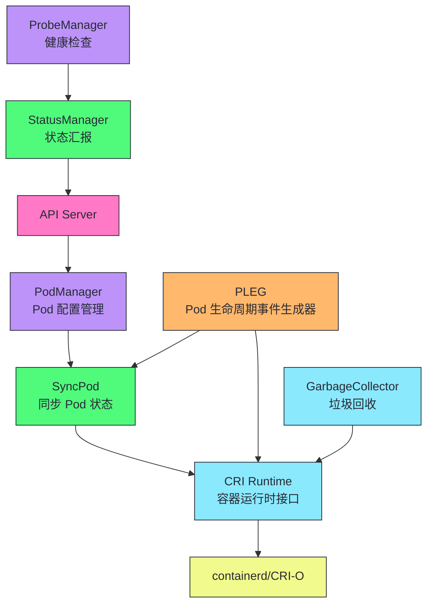
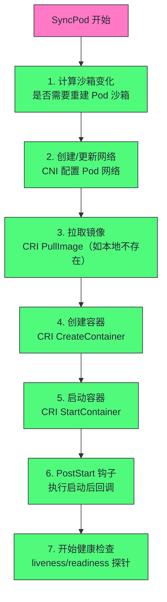
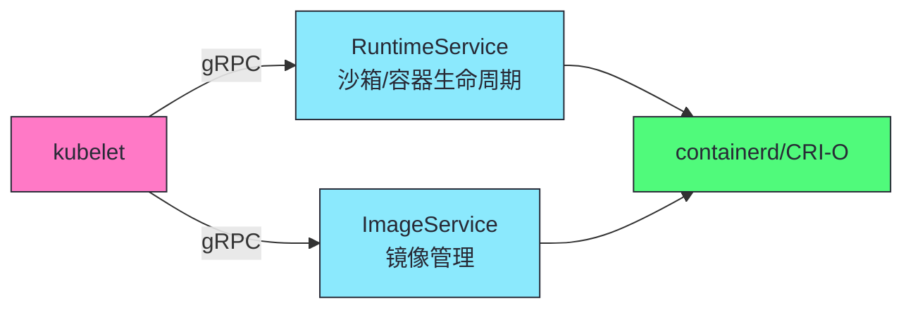
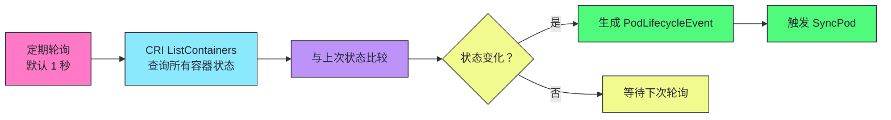

# 13 kubelet 深度剖析：Pod 生命周期与容器运行时接口

**摘要：**
本文深入 Kubernetes 数据平面的核心组件——kubelet。kubelet 运行在每个节点上，负责管理该节点上 Pod 的完整生命周期。文章追溯 kubelet 的定位（节点代理人与控制平面/数据平面桥梁），拆解 kubelet 架构（PodManager/CRI/PLEG/StatusManager/ProbeManager/VolumeManager/EvictionManager），深入 Pod 创建/更新/删除流程（SyncPod 完整步骤与幂等性），讲透 CRI gRPC 接口（RuntimeService/ImageService、dockershim 移除、containerd 崛起），讨论 PLEG 机制（拉模型延迟与"PLEG is not healthy"故障排查），深入健康检查（liveness/readiness/startupProbe 区别与实现），讨论存储管理（VolumeManager attach/detach/mount、CSI 接口），分析驱逐机制（软驱逐/硬驱逐/优雅驱逐），最后讨论 kubelet 的安全边界与故障排查。核心认知：kubelet 是 K8s 在节点上的代理人，把声明式期望状态转化为实际容器操作，是控制平面与数据平面之间的桥梁。

---

## 第 1 章 kubelet 的定位：节点代理人

讲 kubelet，不能从"kubelet 有哪些组件"切入，而要先回到 kubelet 的定位——kubelet 在 K8s 架构中扮演什么角色，为什么需要 kubelet。kubelet 不是凭空设计的，它的定位决定了它的架构。

### 1.1 控制平面与数据平面的桥梁

K8s 的架构是"控制平面 + 数据平面"分离——控制平面（API Server、调度器、控制器管理器）做决策，数据平面（kubelet、kube-proxy、容器运行时）做执行。控制平面决定"哪个 Pod 运行在哪个节点"，但控制平面不直接启动容器——它只更新 Pod 的 `spec.nodeName`。真正启动容器的是节点上的 kubelet——它 Watch 到 Pod 被分配到自己节点，通过 CRI 调用容器运行时创建容器。

kubelet 是控制平面与数据平面的桥梁——它把声明式 API 的期望状态（"这个 Pod 应该运行在这个节点上"）转化为实际的容器操作（"创建容器、启动容器、挂载存储、配置网络"）。没有 kubelet，K8s 的声明式 API 只是 etcd 里的数据——kubelet 把这些数据变成运行的容器。这种"声明式 API + 节点代理人"的设计是 K8s 的核心——控制平面不需要 SSH 到节点执行命令，只需更新 API Server 的数据，kubelet 自己 Watch 并执行。

### 1.2 kubelet 的双重身份

kubelet 有一个独特的设计——它既是控制平面的"客户端"，又是数据平面的"管理者"。作为控制平面的客户端，kubelet 通过 Watch 从 API Server 获取分配到自己节点的 Pod，向 API Server 汇报 Pod 与节点状态。作为数据平面的管理者，kubelet 通过 CRI 调用容器运行时（containerd），通过 CNI 配置网络，通过 CSI 挂载存储，管理节点的容器生命周期。

这种双重身份使得 kubelet 成为 K8s 架构中唯一同时连接控制平面与数据平面的组件——API Server 在控制平面，容器运行时在数据平面，kubelet 在中间转换。理解 kubelet 的双重身份，就理解了为什么 kubelet 的故障既影响 Pod 调度（控制平面看不到 Pod 状态），又影响容器运行（数据平面容器无人管理）。

> [!info] 核心概念：kubelet 是控制平面与数据平面的桥梁
> kubelet 将声明式 API 的期望状态转化为实际的容器操作——API Server 说"创建这个 Pod"，kubelet 通过 CRI 调用 containerd 创建容器。这是 K8s "声明式"与"执行"之间的转换点。理解 kubelet 的工作机制，是理解 K8s 如何"落地"声明式 API 的关键——spec 到容器的完整链路。

---

## 第 2 章 kubelet 的架构

讲完了 kubelet 的定位，接下来看它的内部架构。kubelet 由多个子组件组成，各司其职，协同管理 Pod 生命周期。

### 2.1 核心组件



| 组件 | 职责 |
|------|------|
| **PodManager** | 管理 Pod 配置（来自 API Server 和本地静态文件） |
| **CRI Runtime** | 通过 gRPC 调用容器运行时 |
| **PLEG** | 定期查询容器状态，生成生命周期事件 |
| **StatusManager** | 向 API Server 汇报 Pod 状态 |
| **ProbeManager** | 执行 liveness/readiness/startup 探针 |
| **GarbageCollector** | 清理已退出容器和未使用镜像 |
| **VolumeManager** | 管理存储卷的挂载/卸载 |
| **EvictionManager** | 节点资源压力时驱逐 Pod |

这些组件的协作模式是——PodManager 接收 Pod 配置（来自 API Server 的动态 Pod 与本地静态文件 Pod），SyncPod 把期望状态与实际状态对比并执行协调操作，CRI Runtime 调用容器运行时创建/启动/停止容器，PLEG 定期查询容器状态生成事件触发 SyncPod，ProbeManager 执行健康检查更新 Pod 状态，StatusManager 向 API Server 汇报 Pod 状态，GarbageCollector 清理已退出容器与未使用镜像，VolumeManager 管理存储卷挂载，EvictionManager 在资源压力时驱逐 Pod。

### 2.2 Pod 的来源：动态 Pod 与静态 Pod

kubelet 管理的 Pod 有两个来源——动态 Pod 与静态 Pod。动态 Pod 来自 API Server，kubelet 通过 Watch 获取分配到自己节点的 Pod。静态 Pod 来自本地文件（`/etc/kubernetes/manifests/` 目录下的 YAML 文件），kubelet 监视这个目录，文件变化时自动创建/更新 Pod。静态 Pod 不经过 API Server 调度，直接由 kubelet 管理，但 kubelet 会创建一个镜像 Pod 到 API Server，让 `kubectl get pod` 能看到。

静态 Pod 的典型用途是运行控制平面组件——API Server、Controller Manager、Scheduler、etcd 通常以静态 Pod 形式运行。这些组件需要在 kubelet 启动后立即运行，不依赖 API Server 调度（因为 API Server 自己还没启动）。静态 Pod 保证了控制平面组件的自举——kubelet 启动后读 manifests 目录，创建 API Server 等静态 Pod，API Server 启动后接管集群管理。

静态 Pod 的实现细节值得深入。kubelet 的 FilePodSource 监视 manifests 目录，文件变化时触发 SyncPod。静态 Pod 的 metadata.name 以节点名为后缀（譬如 `kube-apiserver-node-1`），避免与 API Server 中的镜像 Pod 冲突。kubelet 为每个静态 Pod 创建一个镜像 Pod 到 API Server——镜像 Pod 的 spec 与静态 Pod 相同，但 ownerReferences 指向节点（`kind: Node`），确保只有 kubelet 能修改它。用户通过 `kubectl get pod -n kube-system` 看到的是镜像 Pod，直接修改镜像 Pod 会被 kubelet 覆盖——静态 Pod 的真实来源是 manifests 目录的文件。删除静态 Pod 的正确方式是删除 manifests 目录的文件，而非 `kubectl delete pod`（后者只删镜像 Pod，kubelet 会重新创建），这是静态 Pod 运维的常见误区。

### 2.3 VolumeManager 与存储挂载

VolumeManager 是 kubelet 中容易被忽略但很重要的组件——它管理 Pod 的存储卷挂载/卸载。Pod 创建时，VolumeManager 调用 CSI 插件或内置卷插件（如 emptyDir、hostPath、configmap）挂载卷到 Pod 的目录树。Pod 删除时，VolumeManager 卸载卷。

VolumeManager 的一个工程细节是"挂载时机"。kubelet 在 SyncPod 的早期阶段挂载卷——在创建容器之前，确保容器启动时卷已就绪。如果卷挂载失败（譬如 PVC 未绑定、CSI 插件故障），Pod 卡在 ContainerCreating 状态，容器不会被创建。这是"先准备存储再启动容器"的设计——避免容器启动后发现没有存储而崩溃。

VolumeManager 的另一个工程细节是"挂载与容器分离"。kubelet 把卷挂载到 Pod 的目录树（`/var/lib/kubelet/pods/<pod-id>/volumes/`），容器通过 volumeMounts 引用这个目录。这种分离使得卷挂载与容器生命周期解耦——容器重启不需要重新挂载卷（卷已挂载在 Pod 目录），只有 Pod 删除时才卸载卷。对于有状态应用（数据库），这种设计保证了容器重启后数据不丢失——卷的挂载点不变，容器重新挂载同一目录。

VolumeManager 还处理"卷的 attach/detach"——对于网络存储（譬如 NFS、EBS），卷需要先 attach 到节点（譬如 EBS 挂载到 EC2），再 mount 到 Pod 目录。attach/detach 由 VolumeManager 的 AttachDetachController 处理——它管理节点的卷 attach 状态，确保 Pod 调度到节点时卷已 attach。这个过程的延迟是 Pod 创建时间的一个来源——EBS attach 可能需要几秒到几十秒，Pod 在此期间卡在 ContainerCreating。

CSI（Container Storage Interface）是 kubelet 与存储插件之间的解耦接口。CSI 之前，K8s 的存储插件以 in-tree 方式实现——每个存储驱动（AWS EBS、Azure Disk、Ceph RBD）的代码直接编译进 kubelet，导致 kubelet 二进制臃肿、存储驱动更新需要等 K8s 版本发布。CSI 把存储插件移到外部——存储厂商提供 CSI 驱动（独立进程或容器），kubelet 通过 gRPC 调用 CSI 驱动。CSI 定义三类服务：IdentityService（驱动身份与能力）、ControllerService（卷的创建/删除/attach/detach，由外部控制器执行）、NodeService（卷的 mount/unmount，由节点上的 kubelet 调用）。CSI 解耦后，存储驱动可以独立于 K8s 发布，kubelet 只需实现 gRPC 客户端，这是 K8s 可扩展性原则在存储平面的体现。

---

## 第 3 章 Pod 创建流程：SyncPod

讲完了 kubelet 的架构，接下来看 Pod 的创建流程。SyncPod 是 kubelet 的核心方法——它把 Pod 的期望状态与实际状态对比，执行协调操作使实际状态趋近期望状态。

### 3.1 SyncPod 的完整步骤



### 3.2 每步的详细说明

| 步骤 | 操作 | 失败行为 |
|------|------|---------|
| **沙箱变化** | 比较当前沙箱与期望，决定是否重建 | 重建时先停所有容器 |
| **网络配置** | CNI 插件配置 Pod 网络命名空间 | 网络失败 Pod 创建失败 |
| **拉取镜像** | 本地不存在时 PullImage | 拉取失败 Pod 创建失败 |
| **创建容器** | CreateContainer（不启动） | 创建失败记录错误 |
| **启动容器** | StartContainer | 启动失败重启（根据重启策略） |
| **PostStart** | 执行启动后钩子 | 钩子失败容器被杀 |
| **健康检查** | 开始 liveness/readiness 探针 | 探针失败根据类型处理 |

SyncPod 的七个步骤有严格的顺序依赖。沙箱变化检查决定是否需要重建 Pod 沙箱（网络/IPC 命名空间）——如果沙箱需要重建，先停止所有容器，重建沙箱，再重新创建容器。网络配置在容器创建之前——CNI 插件为 Pod 配置网络命名空间（分配 IP、配置路由），容器启动时网络已就绪。拉取镜像在创建容器之前——确保容器创建时镜像已存在。创建容器只是"创建"不"启动"——CreateContainer 创建容器对象但不运行，StartContainer 才真正启动。PostStart 钩子在容器启动后执行——如果钩子失败，容器被杀，根据 restartPolicy 决定是否重启。健康检查在容器启动后开始——ProbeManager 开始周期性执行 liveness/readiness 探针。

网络配置步骤值得深入。kubelet 调用 CRI 的 RunPodSandbox 创建 Pod 沙箱时，容器运行时通过 CNI 插件配置网络——CNI 插件为 Pod 创建网络命名空间、分配 IP 地址、配置路由与防火墙规则。CNI 插件的配置文件位于 `/etc/cni/net.d/`，kubelet 读取配置决定用哪个 CNI 插件（譬如 Calico、Flannel、Cilium）。CNI 插件分为主插件（负责 IP 分配与网络连接）与 meta 插件（负责额外功能如端口映射、带宽限制）。网络配置失败会导致 Pod 卡在 ContainerCreating——常见原因包括 CNI 插件未安装、CNI 配置文件错误、IP 地址池耗尽。排查时检查 CNI 插件日志与节点上的 CNI 配置文件，确认插件正常运行。

SyncPod 的步骤顺序体现了"先准备环境再启动应用"的工程原则。沙箱与网络是 Pod 的运行环境——先创建环境，再启动容器。镜像与卷是容器的依赖——先准备依赖，再创建容器。这种顺序保证了容器启动时所有依赖已就绪，避免"启动后发现没有网络/存储/镜像"的尴尬。

PostStart 钩子与 PreStop 钩子值得对比。PostStart 在容器启动后立即执行——与容器主进程"并行"而非"串行"，kubelet 不会等 PostStart 完成才认为容器启动。如果 PostStart 执行慢（譬如初始化数据库），容器主进程已经开始运行。PreStop 在容器停止前执行——kubelet 发送 SIGTERM 前（或与 SIGTERM 同时，取决于实现）执行 PreStop，给容器优雅退出的机会。两个钩子都受 `timeoutSeconds` 限制——超时后钩子被杀，PostStart 超时容器被标记为失败，PreStop 超时容器直接被 SIGKILL。

Pod 的优雅终止流程值得深入。Pod 删除时，kubelet 执行 KillPod——对每个容器先执行 PreStop 钩子（等待钩子完成或超时），然后发送 SIGTERM 给容器主进程，等待 `terminationGracePeriodSeconds`（默认 30 秒），超时后发送 SIGKILL 强制终止。这个流程保证了容器有优雅退出的机会——PreStop 钩子可以做清理工作（譬如从注册中心注销、关闭数据库连接），SIGTERM 让主进程优雅关闭（譬如完成正在处理的请求）。`terminationGracePeriodSeconds` 是整个优雅终止的上限——PreStop 钩子执行时间 + SIGTERM 等待时间不能超过这个值，超时后 SIGKILL 强制终止。生产中对于需要长时间清理的应用（譬如数据库关闭、消息队列刷盘），需要调大 `terminationGracePeriodSeconds`（譬如 60 秒或 120 秒），否则清理未完成就被 SIGKILL，可能导致数据损坏，这是生产配置的关键点。

### 3.3 SyncPod 的幂等性与并发控制

SyncPod 是幂等的——多次调用同一 Pod 的 SyncPod，结果一致。SyncPod 先对比期望状态与实际状态，只执行差异部分——譬如容器已存在且配置一致，跳过创建；容器已启动，跳过启动。这种幂等性使得 SyncPod 可以安全地被 PLEG 事件、Probe 事件、Resync 多次触发，不会重复创建容器。

SyncPod 的并发控制是"每 Pod 串行"——同一 Pod 的 SyncPod 不会并发执行，kubelet 用 per-Pod 锁保证。不同 Pod 的 SyncPod 可以并发执行——kubelet 有多个 worker 并行处理不同 Pod。这种"per-Pod 串行 + 跨 Pod 并行"的设计平衡了安全性与吞吐量——同一 Pod 串行避免并发冲突，跨 Pod 并行提高吞吐量。

> [!info] 核心概念：SyncPod 是声明式协调在节点上的落地
> SyncPod 把 Pod spec（期望状态）与容器实际状态对比，执行差异操作使实际趋近期望。这是 K8s 声明式协调循环在节点上的落地——控制平面的控制器协调集群状态，kubelet 的 SyncPod 协调节点状态。两者都是"观察-比较-行动"的协调循环，只是作用域不同。

---

## 第 4 章 CRI：容器运行时接口

讲完了 SyncPod 流程，接下来看 CRI——kubelet 通过 CRI 调用容器运行时，CRI 是 kubelet 与容器运行时之间的解耦层。

### 4.1 CRI 的两类服务



CRI 分为两类服务——RuntimeService 管理沙箱与容器生命周期，ImageService 管理镜像。这种分离使得容器运行时可以分别实现两类服务——譬如某些运行时只实现容器管理不实现镜像管理（用外部镜像缓存），或反之。

### 4.2 RuntimeService 的核心方法

| 方法 | 说明 |
|------|------|
| **RunPodSandbox** | 创建 Pod 沙箱（网络/IPC 命名空间） |
| **StopPodSandbox** | 停止 Pod 沙箱 |
| **CreateContainer** | 在沙箱中创建容器（不启动） |
| **StartContainer** | 启动容器 |
| **StopContainer** | 停止容器 |
| **ListContainers** | 列出容器 |
| **ContainerStats** | 获取容器资源使用 |
| **ExecSync** | 在容器中执行命令（如 exec） |

RuntimeService 的方法覆盖了容器生命周期的全部操作——沙箱创建/停止、容器创建/启动/停止/列表、资源统计、命令执行。kubelet 通过这些方法管理 Pod 的容器——SyncPod 调用 RunPodSandbox 创建沙箱，CreateContainer 创建容器，StartContainer 启动容器；PLEG 调用 ListContainers 查询容器状态；kubectl exec 调用 ExecSync 在容器中执行命令。

ExecSync 与 Exec 的实现值得深入。`kubectl exec` 是运维高频操作，它通过 kubelet 转发到 CRI 的 ExecSync 或 Exec 方法。ExecSync 是同步执行——kubelet 调用 CRI 在容器中执行命令，等待命令完成后返回 stdout/stderr/exit code，适合短命令（譬如 `kubectl exec pod -- ls /app`）。Exec 是流式执行——kubelet 调用 CRI 建立一个 exec 流，通过 gRPC stream 双向传输 stdin/stdout/stderr，适合交互式操作（譬如 `kubectl exec -it pod -- bash`）。kubelet 把 exec 请求转发给容器运行时，容器运行时在容器命名空间内执行命令，结果通过 gRPC stream 返回。这个流程涉及 kubelet 的 API Server（kubelet 暴露 10250 端口接收 exec 请求）、kubelet 的认证授权（验证请求者有 exec 权限）、CRI 的 exec 调用——任何一个环节故障都会导致 exec 失败，排查时需逐环节定位。

### 4.3 dockershim 移除与 containerd 的崛起

> [!info] 核心概念：CRI 解耦了 kubelet 和容器运行时
> CRI 使得 kubelet 不依赖特定容器运行时——可以用 containerd、CRI-O 或任何 CRI 兼容运行时。早期 K8s 直接调用 Docker API，后来抽象出 CRI 解耦。Docker 由于不支持 CRI 需要 dockershim 适配层，K8s 1.24 移除了 dockershim，现在主流运行时是 containerd。这是 K8s "可扩展性优先"原则在数据平面的体现。

CRI 的历史值得深入。早期 K8s 直接调用 Docker API 管理容器——kubelet 内置 Docker 客户端，通过 Docker API 创建/启动/停止容器。这种紧耦合使得 K8s 只能用 Docker，无法支持其他容器运行时。K8s 1.5 引入 CRI——一个标准的 gRPC 接口，kubelet 通过 CRI 调用任何兼容运行时。但 Docker 不原生支持 CRI，K8s 需要在 kubelet 内置 dockershim 适配层，把 CRI 调用转换为 Docker API 调用。

dockershim 是 K8s 的维护负担——它需要跟随 Docker 版本更新，处理 Docker 特有的行为。K8s 1.24 移除了 dockershim——Docker 不再被直接支持，用户需要迁移到 containerd 或 CRI-O。这个迁移对用户影响很小——容器镜像格式不变（Docker 构建的镜像仍能在 containerd 运行），只是容器运行时从 Docker 换成 containerd。containerd 是 CNCF 毕业项目，轻量、稳定、CRI 原生支持，是当前 K8s 的主流运行时。

CRI 解耦的工程价值是"可替换的容器运行时"——用户可以根据需求选择运行时。containerd 适合大多数场景（轻量、稳定），CRI-O 适合 OpenShift 生态，Kata Containers 适合需要强隔离的场景（每个 Pod 一个轻量虚拟机），gVisor 适合需要内核级隔离的场景。这种可替换性是 K8s "可扩展性优先"原则在数据平面的体现——不锁定特定实现，通过接口解耦。

CRI 的一个工程细节是"gRPC 调用开销"。kubelet 每次操作容器都通过 gRPC 调用容器运行时——创建容器、启动容器、查询状态都是 gRPC 调用。gRPC 调用有网络与序列化开销，对于高频操作（譬如 PLEG 每秒 ListContainers）累积开销不可忽略。生产中通常不需要优化这个开销——gRPC 的性能足够，但对于超大规模节点（数百容器），ListContainers 的响应可能变慢，影响 PLEG 的 relist 时间。

CRI 的另一个工程细节是"版本兼容"。CRI 接口有版本——kubelet 与容器运行时需要 CRI 版本兼容。K8s 升级时可能引入新 CRI 版本，旧容器运行时可能不支持。生产中升级 K8s 时需要同步升级容器运行时——譬如 K8s 1.26 需要 containerd 1.6+。版本不匹配会导致 kubelet 无法连接容器运行时，节点 NotReady。

containerd 的配置值得深入。containerd 的配置文件位于 `/etc/containerd/config.toml`，其中几个关键配置项影响 K8s 的行为。`[plugins."io.containerd.grpc.v1.cri"]` 段配置 CRI 相关参数——`sandbox_image` 指定 Pause 镜像（每个 Pod 都需要一个 Pause 容器作为沙箱，默认 `registry.k8s.io/pause:3.9`），`containerd.runtimes` 配置运行时类型（默认 runc，也可配置 Kata Containers 作为受信任运行时）。`SystemdCgroup` 是一个关键配置——K8s 1.24+ 推荐 `SystemdCgroup = true`，让 containerd 用 systemd 管理容器 cgroup，与 kubelet 的 cgroup 驱动一致。如果 kubelet 与 containerd 的 cgroup 驱动不一致（kubelet 用 systemd，containerd 用 cgroupfs），会导致资源统计不准确、驱逐决策失误，生产部署前必须确认两者一致。

---

## 第 5 章 PLEG：Pod 生命周期事件生成器

讲完了 CRI，接下来看 PLEG——kubelet 如何感知容器状态变化。PLEG 是 Pod Lifecycle Event Generator 的缩写，它定期查询容器状态，生成生命周期事件，触发 SyncPod。

### 5.1 PLEG 的工作机制



PLEG 的工作流程是——每秒（默认）调用 CRI 的 ListContainers 查询所有容器状态，与上次状态对比，如果状态变化（譬如容器从 Running 变为 Exited），生成 PodLifecycleEvent，触发 SyncPod 重新协调。这种"定期轮询 + 状态对比 + 事件触发"的模式使得 kubelet 能感知容器状态变化并自动响应——容器崩溃后 PLEG 检测到，触发 SyncPod 重启容器（根据 restartPolicy）。

### 5.2 PLEG 的"最后观测状态"问题

PLEG 通过定期轮询 CRI 获取容器状态——但轮询有延迟（默认 1 秒）。容器在两次轮询之间崩溃又重启，PLEG 可能感知不到。

> [!warning] 生产避坑：PLEG 的轮询延迟可能导致状态滞后
> PLEG 每秒轮询一次容器状态——如果容器在两次轮询之间崩溃又重启，PLEG 可能感知不到"曾经崩溃"。这可能导致 Pod status 与实际状态短暂不一致。对于需要快速感知容器状态变化的场景，可以缩短 PLEG 轮询间隔（`--pleg-relist-interval`，默认 1s），但太短会增加 CRI 调用压力。大多数场景默认值够用。

PLEG 的轮询模型有一个根本局限——它是"拉模型"而非"推模型"。kubelet 不接收容器状态变化的通知，而是定期主动查询。这种拉模型的延迟是固有的——轮询间隔内的状态变化无法实时感知。相比之下，某些容器运行时支持事件推送（譬如 containerd 的事件流），但 CRI 标准没有定义推送接口，kubelet 仍用轮询。

### 5.3 "PLEG is not healthy" 故障

PLEG 有一个常见的生产故障——"PLEG is not healthy"。kubelet 定期检查 PLEG 的健康状态，如果 PLEG 的 relist 操作超时（默认 3 分钟无响应），kubelet 标记 PLEG 为 not healthy，节点状态变为 NotReady。

"PLEG is not healthy"的根因通常是 CRI 调用卡住——ListContainers 调用容器运行时，如果容器运行时响应慢（譬如容器数过多、运行时故障、I/O 卡住），relist 超时，PLEG 标记为 not healthy。排查方法——检查容器运行时状态（`crictl ps`、`systemctl status containerd`）、检查节点 I/O（磁盘是否满、I/O 是否卡）、检查容器数（是否过多容器导致 ListContainers 慢）。这种故障通常不是 kubelet 的问题，而是容器运行时或节点资源的问题。

"PLEG is not healthy"的一个常见根因是"容器运行时卡死"。containerd 或 CRI-O 可能因为镜像损坏、容器进程僵尸、I/O 阻塞等原因卡住——ListContainers 调用超时，PLEG 无法获取容器状态。排查时先检查容器运行时日志（`journalctl -u containerd`），看是否有错误信息。如果容器运行时卡死，重启容器运行时（`systemctl restart containerd`）能恢复，但这会重启所有容器——生产中需要谨慎，先尝试其他排查方法（譬如清理僵尸容器、修复 I/O）。

"PLEG is not healthy"的另一个根因是"节点资源耗尽"。节点内存或磁盘耗尽时，容器运行时无法正常工作——譬如磁盘满导致容器运行时无法写入状态文件，ListContainers 超时。排查时检查节点资源（`free -m`、`df -h`），如果资源耗尽，清理资源（清理日志、清理已退出容器、驱逐 Pod）恢复容器运行时。

---

## 第 6 章 健康检查探针

讲完了 PLEG，接下来看健康检查探针。探针是 kubelet 判断容器健康状态的机制——livenessProbe 判断容器是否存活，readinessProbe 判断容器是否就绪，startupProbe 判断容器是否启动完成。

### 6.1 三种探针

| 探针 | 作用 | 失败行为 |
|------|------|---------|
| **livenessProbe** | 容器是否存活 | 重启容器（根据 restartPolicy） |
| **readinessProbe** | 容器是否就绪 | 从 Service Endpoints 移除（停止流量） |
| **startupProbe** | 容器是否启动完成 | 失败前禁用 liveness/readiness 探针 |

三种探针的职责清晰分离。livenessProbe 判断"容器是否需要重启"——失败时 kubelet 重启容器（根据 restartPolicy，默认 Always）。readinessProbe 判断"容器是否准备好接收流量"——失败时 Pod 从 Service 的 Endpoints 移除，流量不再发往该 Pod。startupProbe 判断"容器是否启动完成"——启动期间禁用 liveness/readiness 探针，通过后才启用。这种分离使得"存活"与"就绪"可以独立判断——一个容器可能存活（liveness 通过）但未就绪（readiness 失败），此时容器运行但不接收流量。

### 6.2 探针类型

```yaml
livenessProbe:
  httpGet:
    path: /health
    port: 8080
  initialDelaySeconds: 30  # 启动后等 30 秒才开始探针
  periodSeconds: 10        # 每 10 秒探一次
  timeoutSeconds: 5        # 探针超时 5 秒
  successThreshold: 1      # 成功 1 次视为健康
  failureThreshold: 3      # 失败 3 次视为不健康
```

| 探针类型 | 机制 | 适用场景 |
|---------|------|---------|
| **httpGet** | HTTP GET 请求，2xx/3xx 为健康 | Web 服务 |
| **tcpSocket** | TCP 连接成功为健康 | 数据库等非 HTTP 服务 |
| **exec** | 执行命令，退出码 0 为健康 | 需要复杂检查逻辑 |
| **grpc** | gRPC 健康检查（K8s 1.24+） | gRPC 服务 |

四种探针类型覆盖了不同的健康检查需求。httpGet 最常用——Web 服务暴露 `/health` 端点，返回 200 表示健康。tcpSocket 适合非 HTTP 服务——数据库监听端口，TCP 连接成功表示服务在运行。exec 适合复杂检查——譬如检查文件是否存在、检查数据库连接是否正常、检查依赖服务是否可达。grpc 是 K8s 1.24+ 新增的类型——gRPC 服务用标准的 gRPC 健康检查协议，比 httpGet 更适合 gRPC 应用。

探针的执行实现值得深入。ProbeManager 为每个需要探针的容器创建一个 worker goroutine，周期性执行探针。httpGet 探针由 kubelet 直接发起 HTTP 请求——kubelet 内置 HTTP 客户端，连接容器的 IP:port，发送 GET 请求，根据响应码判断健康（2xx/3xx 为成功，其他为失败）。tcpSocket 探针由 kubelet 尝试建立 TCP 连接——连接成功为健康，连接失败或超时为不健康。exec 探针通过 CRI 的 ExecSync 调用——kubelet 在容器中执行命令，根据退出码判断健康（0 为成功，非 0 为失败）。grpc 探针用 gRPC 健康检查协议——kubelet 调用 gRPC 的 `Health/Check` 方法，根据返回的 `SERVING` 状态判断健康。探针结果通过 ProbeManager 更新到 Pod 的 status.conditions（Ready condition），StatusManager 异步上报到 API Server，整个流程是最终一致的。

> [!info] 核心概念：readinessProbe 影响 Service 流量
> readinessProbe 失败时，kubelet 将 Pod 从 Service 的 Endpoints 中移除——流量不再发往该 Pod。这是滚动更新时"先启动新 Pod，就绪后再切流量"的机制——新 Pod 的 readinessProbe 通过后才加入 Endpoints，旧 Pod 的 readinessProbe 失败后从 Endpoints 移除。理解 readinessProbe 与 Endpoints 的关系，是配置零停机更新的关键。

### 6.3 startupProbe 的价值

```yaml
startupProbe:
  httpGet:
    path: /startup
    port: 8080
  failureThreshold: 30    # 允许失败 30 次
  periodSeconds: 10        # 每 10 秒探一次
  # 总启动时间上限 = 30 × 10 = 300 秒

livenessProbe:
  httpGet:
    path: /health
    port: 8080
  periodSeconds: 10
  failureThreshold: 3
```

> [!warning] 生产避坑：慢启动应用用 startupProbe
> 没有 startupProbe 时，livenessProbe 的 initialDelaySeconds 需要设为应用启动时间——但启动时间可能不确定（如 JVM 预热 30-120 秒）。设太短，livenessProbe 在应用启动期间失败导致重启循环。设太长，应用启动后故障感知慢。startupProbe 解决这个问题——启动期间只检查 startupProbe，通过后才启用 livenessProbe。慢启动应用（Java/Python）推荐用 startupProbe。

startupProbe 的设计体现了"启动与运行分离"的理念。应用启动期间（譬如 JVM 预热、加载配置、初始化连接池）不应该被 livenessProbe 干扰——启动慢不等于不健康。startupProbe 给启动阶段一个独立的时间窗口（failureThreshold × periodSeconds），窗口内只检查 startupProbe，通过后才启用 liveness/readiness。这种设计避免了"用 initialDelaySeconds 猜启动时间"的尴尬——startupProbe 自动适应启动时间，启动快就快通过，启动慢就慢通过。

### 6.4 探针配置的常见陷阱

探针配置有几个常见陷阱。第一，livenessProbe 与 readinessProbe 用同一端点——这会导致"应用未就绪就被重启"。譬如应用启动时 `/health` 返回 500（还在初始化），如果 livenessProbe 也检查 `/health`，livenessProbe 失败导致容器重启——应用永远启动不了。正确做法是 livenessProbe 与 readinessProbe 用不同端点，livenessProbe 检查"进程存活"（譬如 `/healthz` 只检查进程），readinessProbe 检查"服务就绪"（譬如 `/ready` 检查依赖与缓存）。

第二，探针 timeoutSeconds 太短——譬如设为 1 秒，应用响应慢（譬如 GC 暂停、慢查询）导致探针超时，livenessProbe 失败重启容器。正确做法是 timeoutSeconds 设为应用正常响应时间的 2-3 倍，容忍短暂慢响应。

第三，failureThreshold 太小——譬如设为 1，一次探针失败就重启容器，对短暂网络抖动过于敏感。正确做法是 failureThreshold 设为 3 或更大，容忍短暂抖动。

第四，探针检查外部依赖——譬如 livenessProbe 检查数据库连接，数据库短暂不可达导致 livenessProbe 失败重启容器。正确做法是 livenessProbe 只检查"进程存活"，不检查外部依赖——外部依赖不可达不等于容器不健康，重启容器不能解决外部依赖问题。readinessProbe 检查外部依赖更合适——依赖不可达时从 Endpoints 移除，恢复后重新加入。

第五，忽略 initialDelaySeconds——应用启动需要时间，但 initialDelaySeconds 设为 0，livenessProbe 立即开始检查，应用还没启动就失败重启。正确做法是 initialDelaySeconds 设为应用启动时间的估计值，或用 startupProbe 自动适应启动时间。

---

## 第 7 章 垃圾回收

讲完了健康检查，接下来看 kubelet 的垃圾回收。kubelet 管理节点的容器与镜像，需要定期清理已退出容器与未使用镜像，避免磁盘占满。

### 7.1 容器 GC

| 策略 | 默认值 | 说明 |
|------|--------|------|
| **MinAge** | 0 | 容器退出超过此时长才清理 |
| **MaxPerPodContainer** | 1 | 每个 Pod 保留的已退出容器数 |
| **MaxContainers** | -1 | 全节点保留的已退出容器总数 |

容器 GC 清理已退出的容器——容器退出后不立即删除，保留一段时间用于调试（`kubectl logs` 查看已退出容器的日志）。GC 策略控制保留策略——MinAge 控制最短保留时间，MaxPerPodContainer 控制每 Pod 保留的已退出容器数，MaxContainers 控制全节点保留总数。超过限制时，最旧的已退出容器被清理。

容器 GC 的一个工程价值是"磁盘空间回收"。容器运行时为每个容器创建一层可写层（writable layer），容器退出后可写层残留。如果不清理，磁盘逐渐被已退出容器的可写层占满。GC 定期清理已退出容器的可写层，回收磁盘空间。

### 7.2 镜像 GC

| 阈值 | 默认值 | 行为 |
|------|--------|------|
| **HighThresholdPercent** | 85% | 磁盘使用超过时开始清理镜像 |
| **LowThresholdPercent** | 80% | 清理到此时停止 |

> [!info] 核心概念：镜像 GC 按 LRU 清理
> 当磁盘使用超过 HighThresholdPercent（85%）时，kubelet 开始清理未使用的镜像——按"最近最少使用"（LRU）排序，先清理最久未用的。清理到 LowThresholdPercent（80%）停止。运行中 Pod 使用的镜像不会被清理。这是 K8s 自动管理节点磁盘空间的机制——无需人工干预。

镜像 GC 的 LRU 算法值得深入。kubelet 记录每个镜像的"最后使用时间"——镜像被容器引用时更新。GC 时按最后使用时间排序，先清理最久未用的镜像。这种 LRU 策略假设"久未使用的镜像将来也不太可能使用"——对于大多数场景成立，但对于"偶尔使用的大镜像"可能误清理——譬如一个批处理任务每天运行一次，镜像每天用一次，但如果其他镜像更频繁使用，这个镜像可能被清理，下次任务运行时需要重新拉取。

避免镜像被误清理的方法——预拉取镜像（DaemonSet 部署一个 Pod 拉取镜像到所有节点）、用镜像缓存工具（如 ImageCache）、或调高 GC 阈值（HighThresholdPercent 调到 95%）。但调高阈值有风险——磁盘接近满时影响容器创建与日志写入，需要监控磁盘使用。

镜像 GC 的另一个工程细节是"GC 与拉取的竞争"。GC 清理镜像时，如果恰好有 Pod 需要这个镜像（譬如 Pod 正在创建），会出现"刚清理又拉取"的浪费。kubelet 的处理是——GC 只清理"未被任何容器引用"的镜像，运行中 Pod 的镜像不会被清理。但如果 Pod 刚删除、镜像刚被释放，GC 可能清理它，此时新 Pod 创建需要重新拉取。这种竞争在大规模集群（频繁创建删除 Pod）中常见，解决方案是预拉取关键镜像或用本地镜像缓存。

### 7.3 容器 GC 与镜像 GC 的协作

容器 GC 与镜像 GC 是两个独立的 GC 机制，但它们有协作关系。容器 GC 清理已退出容器的可写层，镜像 GC 清理未使用镜像的镜像层。容器 GC 先执行——清理已退出容器后，这些容器引用的镜像可能变为"未使用"，镜像 GC 才能清理。这种顺序保证了镜像 GC 不会清理正在使用的镜像——容器 GC 先释放容器对镜像的引用，镜像 GC 再清理无引用的镜像。

两个 GC 的触发条件不同。容器 GC 在每次 SyncPod 后执行——SyncPod 创建/删除容器后，检查是否需要清理已退出容器。镜像 GC 在磁盘使用超过 HighThresholdPercent 时触发——它是"按需执行"的，只有磁盘紧张才清理。这种差异反映了两种 GC 的目标——容器 GC 是"定期清理"（保持节点整洁），镜像 GC 是"按需清理"（释放磁盘空间）。

---

## 第 8 章 驱逐机制

讲完了垃圾回收，接下来看 kubelet 的驱逐机制。驱逐是 kubelet 在节点资源压力时主动驱逐 Pod，保护节点不崩溃。

### 8.1 软驱逐与硬驱逐

| 类型 | 触发条件 | 行为 |
|------|---------|------|
| **硬驱逐** | 资源超过硬阈值 | 立即驱逐 Pod |
| **软驱逐** | 资源超过软阈值 | 等待 grace period 后驱逐 |

```yaml
# kubelet 驱逐配置
evictionHard:
  memory.available: "100Mi"
  nodefs.available: "10%"
  nodefs.inodesFree: "5%"
evictionSoft:
  memory.available: "200Mi"
evictionSoftGracePeriod:
  memory.available: "1m30s"
```

硬驱逐是"立即驱逐"——资源超过硬阈值（譬如可用内存 < 100Mi），kubelet 立即驱逐 Pod，不等 grace period。软驱逐是"延迟驱逐"——资源超过软阈值（譬如可用内存 < 200Mi），kubelet 等待 grace period（譬如 1m30s），如果资源仍超过阈值，驱逐 Pod。软驱逐给系统"自我恢复"的时间——短暂资源峰值可能很快过去，等一等就不用驱逐。

### 8.2 驱逐优先级

kubelet 驱逐 Pod 时按优先级选择——优先驱逐低优先级 Pod。驱逐顺序是——BestEffort（没有 resources.requests 的 Pod）→ Burstable（有 requests 但没 limits，或 limits > requests 的 Pod）→ Guaranteed（requests == limits 的 Pod）。BestEffort 最先被驱逐，Guaranteed 最后被驱逐。

这种驱逐优先级的设计逻辑是——BestEffort Pod 没有资源请求，被驱逐不影响其他 Pod；Guaranteed Pod 有严格资源保证，被驱逐影响大。资源压力时优先牺牲低优先级 Pod，保护高优先级 Pod。这与调度器的优先级抢占类似——都是"优先保护高优先级工作负载"。

QoS（Quality of Service）等级是 kubelet 对 Pod 的资源保证分类。kubelet 根据 Pod 的 resources.requests 与 resources.limits 计算 QoS 等级——Guaranteed（所有容器的 requests == limits）、Burstable（至少一个容器有 requests 但不满足 Guaranteed）、BestEffort（所有容器都没有 requests 与 limits）。QoS 等级影响驱逐顺序与资源保证——Guaranteed Pod 最不容易被驱逐，资源保证最强；BestEffort Pod 最容易被驱逐，没有资源保证。

QoS 等级还影响 OOM 行为。Linux 内核的 OOM Killer 按 oom_score 排序杀进程，oom_score 与进程的内存使用与 cgroup 的 oom_score_adj 相关。kubelet 为不同 QoS 等级的 Pod 设置不同的 oom_score_adj——Guaranteed Pod 设为 -997（几乎不被 OOM Killer 选中），Burstable Pod 设为 1000 减去 requests 的内存比例，BestEffort Pod 设为 1000（最先被 OOM Killer 选中）。这种设置使得 OOM Killer 在节点内存耗尽时优先杀 BestEffort Pod，与 kubelet 的驱逐优先级一致。

### 8.3 驱逐与 OOMKilled 的区别

驱逐与 OOMKilled 是两种不同的"容器被杀"机制。驱逐是 kubelet 主动行为——kubelet 检测到节点资源压力，主动驱逐 Pod，给 Pod grace period 优雅退出。OOMKilled 是内核行为——容器内存超过 cgroup 限制，内核 OOM Killer 杀死进程，没有 grace period。

驱逐是"预防性"的——在节点资源耗尽前主动驱逐，避免节点崩溃。OOMKilled 是"被动性"的——容器内存超限后才被杀，已经发生了资源耗尽。生产中应该用驱逐（配置合理的驱逐阈值）避免 OOMKilled——驱逐给 Pod 优雅退出时间，OOMKilled 直接杀进程可能导致数据丢失。

驱逐与 OOMKilled 的另一个区别是"触发主体"。驱逐由 kubelet 触发——kubelet 监控节点资源（内存、磁盘），超过阈值时主动驱逐 Pod。OOMKilled 由内核触发——内核监控 cgroup 内存使用，超过 limit 时杀进程。这意味着驱逐阈值由 kubelet 配置（`evictionHard`），OOM limit 由 Pod spec 配置（`resources.limits.memory`）。两者独立——驱逐阈值是节点级配置，OOM limit 是 Pod 级配置。

### 8.4 驱逐的信号与阈值

kubelet 驱逐基于"信号"（signal）与"阈值"（threshold）。信号是节点资源的指标——`memory.available`（可用内存）、`nodefs.available`（节点磁盘可用）、`nodefs.inodesFree`（节点 inode 可用）、`imagefs.available`（镜像磁盘可用）。阈值是触发驱逐的临界值——譬如 `memory.available < 100Mi` 触发硬驱逐。

kubelet 定期（默认 10 秒）检查这些信号，超过阈值时触发驱逐。驱逐时按优先级选择 Pod——先驱逐 BestEffort，再驱逐 Burstable，最后驱逐 Guaranteed。同一 QoS 类内，按 Pod 的"相对资源使用"排序——使用资源多的 Pod 先驱逐（它们释放资源最多）。

驱逐信号的一个细节是"imagefs 分离"。如果节点的镜像磁盘与容器可写层磁盘是同一文件系统，`nodefs.available` 包含两者；如果是不同文件系统（譬如 containerd 用独立磁盘存镜像），`nodefs.available` 与 `imagefs.available` 独立。这种分离使得镜像 GC 与驱逐可以独立触发——镜像磁盘满时只清理镜像，不影响容器可写层。

> [!info] 核心概念：驱逐是 kubelet 主动保护节点
> kubelet 检测到节点资源压力（内存/磁盘不足）时，主动驱逐 Pod 避免节点崩溃。驱逐按优先级——BestEffort 先驱逐，Guaranteed 最后驱逐。驱逐与 OOMKilled 的区别——驱逐是 kubelet 主动行为有 grace period，OOMKilled 是内核行为无 grace period。配置合理驱逐阈值，用驱逐避免 OOMKilled。

---

## 第 9 章 kubelet 常见故障

讲完了驱逐机制，最后看 kubelet 的常见故障与排查方法。这些故障是生产运维的高频问题。

### 9.1 常见故障

| 故障 | 症状 | 排查方法 |
|------|------|---------|
| **Pod 一直 Pending** | 调度失败 | `kubectl describe pod` 看 Events |
| **Pod 一直 ContainerCreating** | 镜像拉取失败/CNI 错误 | `kubectl describe pod` 看 Events |
| **Pod CrashLoopBackOff** | 容器启动失败重启 | `kubectl logs pod` 看容器日志 |
| **Pod Running 但不在 Endpoints** | readinessProbe 失败 | `kubectl describe pod` 看探针状态 |
| **节点 NotReady** | kubelet 心跳超时 | 检查 kubelet 进程和网络 |
| **镜像拉取失败** | ImagePullBackOff | 检查镜像名、Registry 认证、网络 |
| **容器 OOMKilled** | 内存超限被杀 | 检查 resources.limits.memory |

### 9.2 Pod 状态详解

| 状态 | 说明 | 常见原因 |
|------|------|---------|
| **Pending** | 已提交但未调度 | 资源不足、亲和性不匹配 |
| **ContainerCreating** | 已调度正在创建容器 | 拉镜像、CNI 配置、挂载卷 |
| **Running** | 容器运行中 | 正常状态 |
| **CrashLoopBackOff** | 容器反复崩溃重启 | 应用 bug、配置错误、依赖缺失 |
| **ImagePullBackOff** | 镜像拉取失败 | 镜像名错误、Registry 认证、网络 |
| **OOMKilled** | 内存超限 | resources.limits.memory 太小 |
| **Evicted** | 被驱逐 | 节点资源压力（磁盘/内存） |

### 9.3 ContainerCreating 卡住的排查

Pod 处于 ContainerCreating 状态长时间不变化，常见原因：

| 原因 | 排查方法 |
|------|---------|
| **镜像拉取慢/失败** | `kubectl describe pod` 看 Events |
| **CNI 网络配置失败** | 检查 CNI 插件日志和配置 |
| **PV 挂载失败** | 检查 PVC 绑定状态和 CSI 插件 |
| **Secret 挂载失败** | 检查 Secret 是否存在 |
| **kubelet 卡死** | 检查 kubelet 日志和 PLEG 状态 |

> [!warning] 生产避坑：ContainerCreating 卡住先看 Events
> Pod 处于 ContainerCreating 长时间不变化时，`kubectl describe pod` 的 Events 部分会显示具体原因——"Failed to pull image"、"Failed to mount volume"、"CNI setup failed"。根据原因定位问题。如果 Events 为空，检查 kubelet 日志——`journalctl -u kubelet | grep <pod-name>`。

### 9.4 节点 NotReady 的排查

节点 NotReady 通常是 kubelet 心跳超时——kubelet 定期更新节点 Lease 的 renewTime，Node Controller 检测心跳超时标记 NotReady。心跳超时的常见原因——kubelet 进程故障（崩溃或卡死）、节点网络问题（kubelet 无法连接 API Server）、节点资源耗尽（kubelet 无法获取资源更新 Lease）、PLEG not healthy（PLEG 超时导致 kubelet 标记 NotReady）。

排查节点 NotReady 的步骤——第一步检查 kubelet 进程（`systemctl status kubelet`），第二步检查 kubelet 日志（`journalctl -u kubelet`），第三步检查节点资源（`free -m`、`df -h`），第四步检查网络（`ping apiserver`）。根据排查结果定位——kubelet 故障重启 kubelet，网络问题修复网络，资源耗尽清理资源或驱逐 Pod。

节点 NotReady 的一个常见根因是"kubelet 卡死"。kubelet 可能因为 PLEG not healthy、CRI 调用卡住、VolumeManager 挂载卡住等原因卡死——kubelet 进程还在但无法正常工作。排查时检查 kubelet 日志的关键字——"PLEG is not healthy"、"Failed to connect to CRI"、"Volume mount timeout"。如果 kubelet 卡死，重启 kubelet（`systemctl restart kubelet`）能恢复，但这会重启所有 Pod——生产中需要谨慎。

节点 NotReady 的另一个常见根因是"网络分区"。节点与 API Server 网络不通——kubelet 无法更新 Lease，Node Controller 检测心跳超时标记 NotReady。排查时检查节点与 API Server 的网络连通性——`curl -k https://<apiserver>:6443/healthz`。如果网络分区，修复网络后 kubelet 自动恢复 Lease 更新，节点恢复 Ready。

kubelet 的性能调优有几个关键参数。`--max-pods`（默认 110）限制节点上的 Pod 数，超过此值 kubelet 拒绝新 Pod。`--pod-pids-limit`（默认 -1，不限制）限制每个 Pod 的进程数，防止 fork 炸弹。`--image-gc-high-threshold` 与 `--image-gc-low-threshold` 控制镜像 GC 阈值。`--eviction-hard` 与 `--eviction-soft` 控制驱逐阈值。`--system-reserved` 与 `--kube-reserved` 为系统进程与 kubelet 自身预留资源，避免 Pod 用完所有资源导致系统进程饥饿。生产中建议设置 `--system-reserved=memory=1Gi,cpu=500m` 与 `--kube-reserved=memory=500Mi,cpu=200m`，给系统与 kubelet 留足够资源。

> [!warning] 生产避坑：节点 NotReady 后的 Pod 驱逐
> 节点 NotReady 后，kubelet 心跳超时，Node Controller 将节点标记为 NotReady。等待 pod-eviction-timeout（默认 5 分钟）后，Pod 被标记为 Terminating 并在其他节点重建。对于有状态应用（StatefulSet），如果 PV 是本地存储，Pod 无法在其他节点重建——数据卡在故障节点。

### 9.5 kubelet 心跳与节点状态

kubelet 心跳通过 Lease 资源实现——kubelet 定期更新节点 Lease 的 renewTime，Node Controller 检测 renewTime 超时标记节点 NotReady。心跳间隔默认 10 秒，超时默认 40 秒（`node-monitor-grace-period`）。这意味着——节点故障后，约 40 秒 Node Controller 标记 NotReady，再过 5 分钟（`pod-eviction-timeout`）开始驱逐 Pod。

心跳机制的一个设计考量是"心跳与状态分离"。kubelet 有两种心跳——Lease 心跳（更新 renewTime，表示 kubelet 存活）与 Status 心跳（更新节点 Status，表示节点健康）。Lease 心跳轻量（只更新 renewTime），频繁更新（10 秒）；Status 心跳较重（更新节点资源使用、容器状态等），更新频率较低（默认 50 秒）。这种分离使得"节点存活检测"快（Lease 心跳），"节点状态汇报"慢（Status 心跳），平衡了检测速度与 API Server 压力。

Pod 状态汇报是 kubelet 的另一个重要职责。StatusManager 负责把 Pod 的实际状态（容器状态、探针结果、容器重启次数等）汇报到 API Server，用户通过 `kubectl get pod` 看到的状态就是 StatusManager 汇报的。StatusManager 的汇报是异步的——kubelet 检测到 Pod 状态变化后，把状态放入 StatusManager 的队列，StatusManager 的 goroutine 定期批量上报到 API Server。这种异步批量上报减少了 API Server 的写压力——如果每次状态变化都立即上报，大规模节点（每节点数十 Pod）会产生大量写请求。StatusManager 用 PATCH 请求更新 Pod 的 status 子资源，只发送变化的字段，减少网络传输量。如果上报失败（譬如 API Server 短暂不可用），StatusManager 重试，重试期间 Pod 状态滞后——用户看到的 status 可能不是最新的，这是最终一致性的体现，生产排查时需注意这种延迟。

---

## 第 10 章 kubelet 的边界

讲完了 kubelet 的能力，最后清醒认识它的边界。kubelet 不是万能的——它有几个边界需要清醒认识。

第一，kubelet **只管理本节点的 Pod**——kubelet 不感知其他节点的 Pod，不做跨节点协调。跨节点协调（譬如 Service 负载均衡、Pod 亲和性）由控制平面（kube-proxy、调度器）处理。kubelet 的作用域是"节点本地"——它只关心本节点的 Pod 与容器。

第二，kubelet **不保证应用可用性**——kubelet 管理容器生命周期（创建/重启/删除），但不保证应用对外可用。应用可用性需要 readinessProbe（控制流量）+ Service（负载均衡）+ 副本数（冗余）共同保证。kubelet 只是"容器管理者"，不是"可用性保证者"。

第三，kubelet **不做应用级故障转移**——容器崩溃后 kubelet 重启容器（根据 restartPolicy），但不做应用级故障转移（譬如数据库主从切换）。应用级故障转移需要 Operator 或应用自身实现。kubelet 的重启是"进程级"的，不是"应用级"的。

第四，kubelet **依赖容器运行时**——kubelet 通过 CRI 调用容器运行时，容器运行时故障会导致 kubelet 无法管理容器（PLEG not healthy）。kubelet 与容器运行时是"管理者与执行者"关系，执行者故障管理者无法工作。生产中需要监控容器运行时健康，及时排查运行时故障。

第五，kubelet **依赖 cgroup 管理资源**——kubelet 通过 cgroup 限制 Pod 的 CPU/内存使用，cgroup 是 Linux 内核的资源隔离机制。kubelet 为每个 Pod 创建 cgroup，把 Pod 的容器进程放入 cgroup，通过 cgroup 限制资源使用（CPU shares、memory limit）。cgroup 驱动有两种——cgroupfs（直接写 cgroup 文件）与 systemd（通过 systemd 管理容器 cgroup）。K8s 1.24+ 推荐 systemd 驱动，因为 systemd 是大多数 Linux 发行版的 init 系统，用 systemd 管理 cgroup 与系统其他服务一致。kubelet 与容器运行时必须用相同的 cgroup 驱动，否则资源统计不一致——kubelet 用 systemd 统计，容器运行时用 cgroupfs 创建，kubelet 看不到容器运行时创建的 cgroup，导致资源统计缺失。

> [!note] 设计哲学：kubelet 是节点本地的协调器
> kubelet 是 K8s 在每个节点上的"代理人"——它把声明式 API 的期望状态转化为实际的容器操作。但 kubelet 的作用域是"节点本地"——它只管理本节点的 Pod 与容器，不做跨节点协调，不保证应用可用性，不做应用级故障转移。理解 kubelet 的边界，才能正确使用 K8s——节点级管理用 kubelet，集群级协调用控制平面，应用级运维用 Operator。kubelet 的设计体现了 K8s 的分层架构——每层各司其职，通过接口解耦。

---

## 总结

kubelet 是控制平面与数据平面的桥梁——把声明式 API 的期望状态转化为实际容器操作。核心组件各司其职：PodManager 接收配置，SyncPod 协调，CRI 执行，PLEG 感知变化，Probe 检查健康，Status 汇报，GC 清理，Volume 管理存储，Eviction 保护节点。SyncPod 七步（沙箱→网络→镜像→创建→启动→PostStart→健康检查）严格顺序依赖、幂等可重复，Pod 优雅终止时先 PreStop 再 SIGTERM 再 SIGKILL。CRI gRPC 接口解耦 kubelet 与容器运行时，containerd 是主流运行时，K8s 1.24 移除 dockershim，cgroup 驱动需与容器运行时一致。PLEG 用拉模型定期轮询容器状态，有固有延迟，"PLEG is not healthy" 常见根因是容器运行时卡死或节点资源耗尽。三种探针分工：liveness 决定重启，readiness 决定 Endpoints，startup 保护慢启动应用，探针结果异步上报到 API Server。VolumeManager 处理 attach/detach/mount，CSI 解耦存储插件。QoS 等级（Guaranteed/Burstable/BestEffort）影响驱逐顺序与 OOM 优先级。驱逐机制在节点资源紧张时按 QoS 优先级驱逐 Pod（硬驱逐立即、软驱逐等待 grace period），与 OOMKilled 的内核被动驱逐不同。kubelet 的边界：只管理本节点 Pod，不保证应用可用性，不做应用级故障转移——节点级用 kubelet，集群级用控制平面，应用级用 Operator。故障排查从心跳与 PLEG 入手，按 Pod 状态分类定位（Pending/ContainerCreating/CrashLoopBackOff/OOMKilled/Evicted/ImagePullBackOff），性能调优关注 max-pods、GC 阈值、驱逐阈值与资源预留。

> [!info] 专栏导航
> 本文是 [[00 专栏导览|Kubernetes 架构深度剖析专栏]] 的第 13 篇，深入 kubelet 的实现。下一篇 [[14 Service 与 kube-proxy：iptables IPVS eBPF 数据面演进]] 将详细讨论 Service 的负载均衡机制和 kube-proxy 的三种数据面模式。

---

## 延伸思考

1. **你的 Pod 是否配置了正确的探针？** Web 服务用 httpGet liveness + readiness，慢启动应用加 startupProbe，非 HTTP 服务用 tcpSocket。liveness 与 readiness 用不同端点。

2. **你的 readinessProbe 是否正确？** readinessProbe 失败会从 Endpoints 移除——确保应用真正就绪才通过，避免流量打到未就绪 Pod。检查依赖与缓存是否就绪。

3. **你的镜像 GC 阈值是否合理？** 默认 85%/80% 对大多数场景够用。磁盘小的节点可能需要调低。关键镜像预拉取避免被 GC 清理。

4. **你的节点 NotReady 后 Pod 如何处理？** 检查 pod-eviction-timeout 和 PV 类型。有状态应用用网络存储保证节点故障后可重建。

5. **你是否用 startupProbe 保护慢启动应用？** Java/Python 等慢启动应用用 startupProbe 避免启动期间被 livenessProbe 重启。startupProbe 自动适应启动时间。

6. **你的 ContainerCreating 卡住是否检查了 Events？** `kubectl describe pod` 的 Events 显示具体原因——镜像拉取、CNI、PV 挂载、Secret。根据原因定位问题。

7. **你的 OOMKilled 是否调大了 memory limit？** OOMKilled 是容器内存超限被内核杀。检查 resources.limits.memory 是否足够，或检查应用是否有内存泄露。

8. **你的节点 NotReady 是否检查了 kubelet？** 节点 NotReady 通常是 kubelet 心跳超时——检查 kubelet 进程是否运行、网络是否通畅、磁盘是否满、PLEG 是否健康。

9. **你的 Pod 驱逐是否配置了 PDB？** 自愿驱逐（节点维护）时 PDB 确保最小可用副本数。非自愿驱逐（节点故障）不受 PDB 限制。

10. **你的镜像是否预加载到节点？** 频繁拉取大镜像会增加 Pod 创建时间。考虑用 ImageCache 或预加载镜像到节点，避免镜像被 GC 清理后重新拉取。

11. **你的驱逐阈值是否配置合理？** 默认硬驱逐 memory.available < 100Mi。节点内存大的集群可以调高阈值，避免内存接近耗尽才驱逐。监控驱逐事件，频繁驱逐说明节点资源不足。

12. **你的探针 timeoutSeconds 是否够长？** timeoutSeconds 太短（譬如 1 秒）对慢响应过于敏感，GC 暂停或慢查询导致探针超时重启容器。设为正常响应时间的 2-3 倍。

13. **你的 kubelet 版本与容器运行时是否兼容？** CRI 版本需要 kubelet 与容器运行时匹配。升级 K8s 时同步升级容器运行时，版本不匹配导致节点 NotReady。

14. **你的节点是否监控了 PLEG 健康？** PLEG not healthy 是常见故障，导致节点 NotReady。监控 kubelet 日志中的 "PLEG is not healthy" 关键字，及时排查容器运行时与节点资源。

15. **你的有状态应用是否用了网络存储？** 节点 NotReady 后本地存储的 Pod 无法在其他节点重建。有状态应用用网络存储（PVC + 网络卷）保证节点故障后可重建。

---

## 参考资料

1. kubelet 文档：https://kubernetes.io/docs/reference/command-line-tools-reference/kubelet/
2. CRI 文档：https://kubernetes.io/docs/concepts/architecture/cri/
3. Pod 生命周期：https://kubernetes.io/docs/concepts/workloads/pods/pod-lifecycle/
4. 探针配置：https://kubernetes.io/docs/tasks/configure-pod-container/configure-liveness-readiness-startup-probes/
5. kubelet 源码：https://github.com/kubernetes/kubernetes/tree/master/pkg/kubelet
6. 驱逐策略：https://kubernetes.io/docs/concepts/scheduling-eviction/node-pressure-eviction/
7. 容器运行时：https://kubernetes.io/docs/setup/production-environment/container-runtimes/
8. dockershim 移除：https://kubernetes.io/blog/2022/02/17/dockershim-faq/
9. 静态 Pod：https://kubernetes.io/docs/tasks/configure-pod-container/static-pod/
10. containerd：https://containerd.io/
11. PLEG 实现：https://github.com/kubernetes/kubernetes/blob/master/pkg/kubelet/pleg/pleg.go
12. VolumeManager：https://kubernetes.io/docs/concepts/storage/volumes/
13. QoS 类：https://kubernetes.io/docs/concepts/workloads/pods/pod-qos/
14. Container Lifecycle Hooks：https://kubernetes.io/docs/concepts/containers/container-lifecycle-hooks/

---

> [!note] 思考题
> 1. PLEG 每秒轮询容器状态——如果容器在两次轮询之间崩溃又重启（如 JVM OOM 后被 livenessProbe 重启），PLEG 会感知到吗？如果不感知，Pod status 会怎样？这种"最后观测状态"问题对运维有什么影响？
> 2. readinessProbe 失败时 Pod 从 Endpoints 移除——但如果 Pod 同时是 StatefulSet 的成员（如 MySQL 从节点），移除后 Service 不再转发流量到它。这对 MySQL 从节点复制有影响吗？复制是否走 Service？readinessProbe 失败是否意味着从节点数据不一致？
> 3. 镜像 GC 按 LRU 清理——如果节点上有两个应用，A 频繁更新（镜像新），B 很少更新（镜像旧）。磁盘满时 GC 会先清理 B 的镜像——下次 B 的 Pod 重启时需要重新拉取镜像。如何避免关键应用的镜像被清理？预拉取与调高阈值各有什么利弊？
> 4. kubelet 的 SyncPod 是幂等的——多次调用同一 Pod 的 SyncPod 结果一致。但 PostStart 钩子呢？如果 PostStart 钩子有副作用（譬如初始化数据库），SyncPod 多次调用会多次执行 PostStart 吗？如何保证 PostStart 钩子的幂等性？
> 5. kubelet 的驱逐机制按 QoS 类驱逐——BestEffort 先驱逐，Guaranteed 最后。但如果一个 BestEffort Pod 是关键系统组件（譬如日志收集器），被驱逐导致日志丢失。如何保护关键 BestEffort Pod 不被优先驱逐？PriorityClass 与 QoS 的关系是什么？system-node-critical 与 system-cluster-critical 优先级如何影响驱逐顺序？
> 6. kubelet 的 PLEG 用轮询模型——每秒 ListContainers 查询容器状态。这种拉模型有固有延迟，轮询间隔内的状态变化无法实时感知。为什么 K8s 不用推模型（容器运行时推送事件）？推模型的实现难点是什么？CRI 标准是否支持事件推送？
> 7. kubelet 的镜像 GC 按 LRU 清理——最近最少使用的镜像先清理。但 LRU 假设"久未使用的镜像将来也不太可能使用"，对于"偶尔使用的大镜像"可能误清理。除了 LRU，还有哪些镜像 GC 策略？K8s 为什么选 LRU 而不是其他策略？
> 8. kubelet 的心跳通过 Lease 汇报——Lease 心跳轻量频繁（10 秒），Status 心跳较重较慢（50 秒）。为什么 kubelet 不把节点状态写在 Lease 里，而要分离 Lease 与 Status？这种分离对节点故障检测速度有什么影响？如果 Status 心跳延迟，节点状态会滞后吗？
