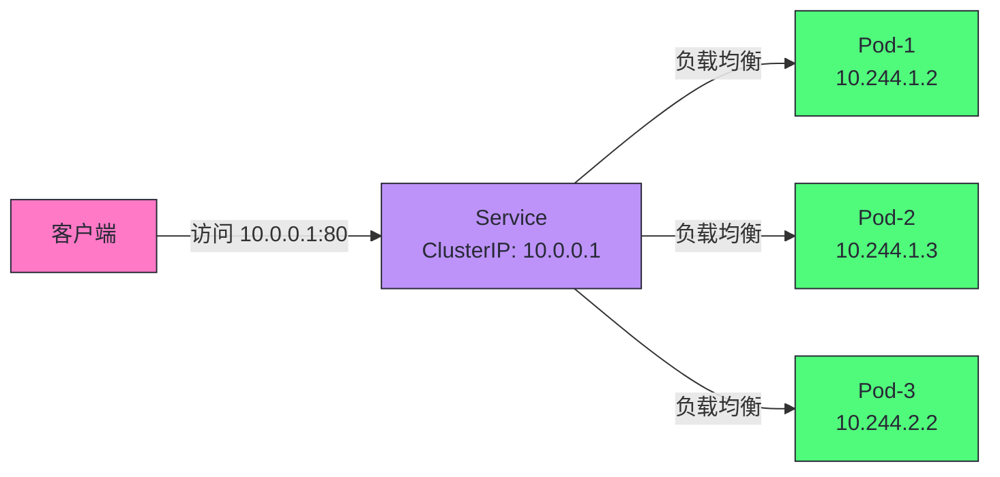
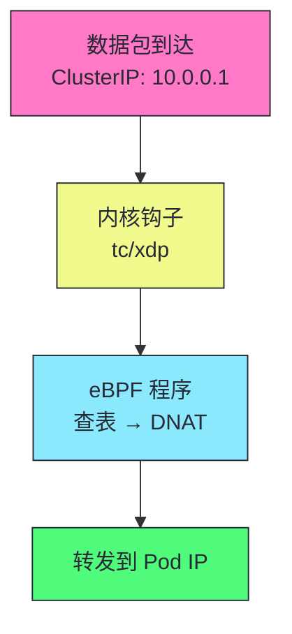

# 14 Service 与 kube-proxy：iptables/IPVS/eBPF 数据面演进

**摘要：**
本文深入 Kubernetes Service 的负载均衡机制和 kube-proxy 的三种数据面模式。Service 是 K8s 的“虚拟 IP + 负载均衡”——为一组 Pod 提供稳定的访问入口。文章追溯 Service 的本质（ClusterIP 是虚拟 IP，由 kube-proxy 在内核配置转发规则实现），拆解 kube-proxy 的三种数据面模式（iptables 规则链 O(n)、IPVS 哈希查找 O(1)、eBPF 绕过 netfilter 性能最高），对比三种模式的性能与适用场景，讲透 Service 的四种类型（ClusterIP/NodePort/LoadBalancer/ExternalName），讨论 Endpoints 与 EndpointsSlice 的实现，深入 Service 转发的完整链路（DNAT/conntrack/SNAT），分析 kube-proxy 的会话保持、故障排查与生产实践，最后讨论 Service 的边界与 Headless Service 的特殊用途。核心认知：Service 不是“代理”而是“内核转发规则”——kube-proxy 只配置规则不转发数据包，数据包由内核直接转发。

---

## 第 1 章 Service 的本质：虚拟 IP 与内核转发

讲 Service，不能从"Service 有哪些类型"切入，而要先回到 Service 的本质——Service 在 K8s 中扮演什么角色，为什么需要 Service。Service 不是凭空设计的，它的本质决定了它的实现。

### 1.1 为什么需要 Service

Pod 的 IP 是临时的——Pod 重建后 IP 变化，Pod 扩缩容时 IP 增减，Pod 漂移到其他节点时 IP 变化。客户端不能硬编码 Pod IP——硬编码意味着 Pod 变化时客户端需要更新配置，这与 K8s 的"声明式自动化"理念冲突。Service 解决这个问题——提供稳定的虚拟 IP（ClusterIP），客户端访问 Service IP，kube-proxy 负责转发到后端 Pod。Pod 变化时 Service IP 不变，客户端无感知。

这种"稳定地址 + 动态后端"的模式是负载均衡的常见设计——LVS、Nginx、HAProxy 都是这个模式。但 Service 的独特之处在于——它的"稳定地址"是虚拟 IP（不绑定任何网卡），它的"负载均衡"由内核转发规则实现（不是用户态进程）。这种设计使得 Service 既提供了稳定地址，又避免了用户态代理的性能开销。

Service 的一个工程价值是"解耦客户端与后端"。客户端只依赖 Service IP，不依赖 Pod IP——Pod 变化（重建、扩缩容、漂移）时客户端无感知。这种解耦使得后端可以自由变化——滚动更新时新 Pod 逐步加入 Endpoints，旧 Pod 逐步移除，客户端始终通过 Service 访问，无感知后端变化。这是 K8s 实现零停机更新的基础——Service + readinessProbe + 滚动更新，新 Pod ready 后加入 Endpoints 接收流量，旧 Pod 终止前从 Endpoints 移除停止接收流量，整个过程中客户端无感知。

Service 的另一个工程价值是"负载均衡"。Service 将流量分散到多个 Pod，避免单 Pod 过载。这种负载均衡是"集群内"的——kube-proxy 在每个节点配置规则，发往 Service IP 的流量在本节点 DNAT 到 Pod IP，不经过集中式负载均衡器。这种"分布式负载均衡"避免了集中式负载均衡器的单点故障与性能瓶颈——每个节点独立负载均衡，互不影响。

### 1.2 什么是 Service

```yaml
apiVersion: v1
kind: Service
metadata:
  name: web
spec:
  selector:
    app: web
  ports:
    - port: 80
      targetPort: 8080
```

| 特性 | 说明 |
|------|------|
| **ClusterIP** | 虚拟 IP，不绑定任何网卡 |
| **负载均衡** | 流量转发到后端 Pod |
| **稳定地址** | Pod IP 变化时 Service IP 不变 |
| **Selector 关联** | 通过 Label Selector 关联 Pod |

Service 通过 Label Selector 关联 Pod——selector 匹配的 Pod 成为 Service 的后端。Endpoints Controller Watch Service 和 Pod 变化，维护 Service → Pod IP 的映射。kube-proxy Watch Endpoints 变化，更新内核转发规则。这种"Service 定义期望 → Endpoints 维护映射 → kube-proxy 配置规则"的链路是 Service 工作的核心。

### 1.3 Service 不是代理，是内核转发规则



> [!info] 核心概念：Service 不是代理，是内核转发规则
> kube-proxy 不是"代理服务器"——它不接收和转发数据包。kube-proxy 的职责是"配置内核转发规则"——在 iptables/IPVS/eBPF 中设置 DNAT 规则，将发往 ClusterIP 的流量 DNAT 为后端 Pod IP。实际数据包转发由内核完成，kube-proxy 不在数据路径上。这使得转发性能不受用户态进程影响——即使 kube-proxy 崩溃，已配置的规则仍然生效（直到规则被更新或节点重启）。

这个认知是理解 Service 的关键。传统负载均衡器（譬如 Nginx）是"代理"——数据包先到 Nginx，Nginx 转发到后端。Nginx 在数据路径上，性能受 Nginx 进程影响。Service 不是这种模式——kube-proxy 只配置规则，不转发数据包。数据包直接由内核转发，不经过用户态进程。这种"控制平面与数据平面分离"让 Service 的转发性能接近内核网络栈性能，远高于用户态代理。

这种"控制平面与数据平面分离"的另一个优势是"可靠性"。kube-proxy 崩溃后，已配置的内核规则仍然生效——数据包继续由内核转发，Service 仍然可用。只有规则需要更新时（Pod 变化）才需要 kube-proxy——kube-proxy 崩溃期间规则不更新，但已有流量不受影响。这种"规则持久化在内核"让 Service 的可靠性高于用户态代理——用户态代理崩溃后流量中断，kube-proxy 崩溃后流量继续。

这种设计的第三个优势是"性能可预测"。内核转发的性能取决于内核网络栈，不取决于 kube-proxy 进程的负载。kube-proxy 配置规则的开销是一次性的（规则更新时），不是每数据包的（转发时不经过 kube-proxy）。这使得 Service 的转发性能可预测——不随 kube-proxy 负载变化，只随内核网络栈性能变化。

### 1.4 ClusterIP 是虚拟 IP

ClusterIP 是虚拟 IP——不绑定任何网卡，不路由，只在内核转发规则中存在。`ping ClusterIP` 不通（没有网卡响应 ARP），但 `curl ClusterIP:port` 通（内核转发规则 DNAT 到 Pod IP）。这种"虚拟 IP"让 ClusterIP 不占用物理网络地址，可以在 service CIDR 范围内任意分配。

ClusterIP 来自 service CIDR——`--service-cluster-ip-range` 定义 ClusterIP 范围（如 10.0.0.0/16）。ClusterIP 是虚拟的——不路由，只在内核转发规则中存在。这意味着 ClusterIP 只在集群内有效——集群外不知道如何路由 ClusterIP，需要 NodePort 或 LoadBalancer 暴露到集群外。

---

## 第 2 章 kube-proxy 的三种数据面模式

讲完了 Service 的本质，接下来看 kube-proxy 的三种数据面模式。kube-proxy 的演进反映了 K8s 在大规模场景下的性能优化——从 iptables 到 IPVS 到 eBPF，每一步都是为了解决前一代的性能瓶颈。

### 2.1 iptables 模式（默认）

```bash
# iptables 规则示例
-A KUBE-SVC-XXX -m statistic --mode random --probability 0.333 -j KUBE-SEP-1
-A KUBE-SVC-XXX -m statistic --mode random --probability 0.5 -j KUBE-SEP-2
-A KUBE-SVC-XXX -j KUBE-SEP-3
-A KUBE-SEP-1 -p tcp -j DNAT --to-destination 10.244.1.2:8080
-A KUBE-SEP-2 -p tcp -j DNAT --to-destination 10.244.1.3:8080
-A KUBE-SEP-3 -p tcp -j DNAT --to-destination 10.244.2.2:8080
```

iptables 模式用 `statistic` 模块的随机概率实现负载均衡。规则链的结构是——`KUBE-SVC-XXX` 链匹配 Service，按概率跳转到 `KUBE-SEP-X` 链；`KUBE-SEP-X` 链匹配后端 Pod，执行 DNAT 转发到 Pod IP。这种"概率跳转 + DNAT"的两级结构实现了负载均衡。

iptables 模式的负载均衡算法值得深入。第一个规则 `--probability 0.333` 有 1/3 概率匹配，匹配则跳转到 KUBE-SEP-1。如果不匹配，继续下一个规则 `--probability 0.5`——注意这是"在剩余的 2/3 中"的 0.5，即 1/3 概率。如果还不匹配，最后一个规则 `j KUBE-SEP-3` 兜底，也是 1/3。这种"递减概率"让每个后端的概率相等——但规则数随 Pod 数线性增长，大规模 Service 的规则链很长。

iptables 模式的一个性能问题是"规则匹配是线性的"。每个数据包需要从链头遍历规则，直到匹配。Service 数多时，`KUBE-SVC-XXX` 链有大量规则，每个数据包需要遍历所有规则才能匹配到目标 Service。这种 O(n) 复杂度在大集群（1000+ Service）中性能退化——数据包转发延迟随 Service 数增长。

iptables 模式的另一个工程细节是"conntrack 表大小"。iptables 模式依赖 conntrack（连接跟踪）记录每个连接的状态——新建连接时创建 conntrack 表项，后续数据包通过 conntrack 表快速匹配。conntrack 表有大小限制（`nf_conntrack_max`，默认 262144），大规模集群的并发连接数可能超过限制，新连接被丢弃。生产中需要根据集群规模调高 `nf_conntrack_max`——譬如 1000 节点集群建议调到 1048576。调高后 conntrack 表占用更多内存（每个表项约 300 字节），需要评估内存开销。iptables 模式的 conntrack 表满是一个隐蔽的生产故障——症状是新连接间歇性失败，旧连接正常，排查时检查 `cat /proc/sys/net/netfilter/nf_conntrack_count` 与 `nf_conntrack_max` 的比值，这是生产运维的关键监控点。

### 2.2 IPVS 模式

```bash
# IPVS 规则示例
ipvsadm -A -t 10.0.0.1:80 -s rr
ipvsadm -a -t 10.0.0.1:80 -r 10.244.1.2:8080 -m
ipvsadm -a -t 10.0.0.1:80 -r 10.244.1.3:8080 -m
ipvsadm -a -t 10.0.0.1:80 -r 10.244.2.2:8080 -m
```

IPVS（IP Virtual Server）是内核级负载均衡，支持多种调度算法（rr/wrr/lc/sh 等）。IPVS 用哈希表查找 Service，O(1) 复杂度，大规模 Service 性能稳定。IPVS 的调度算法比 iptables 的随机概率更丰富——rr（轮询）、wrr（加权轮询）、lc（最少连接）、sh（源地址哈希）等，适应不同场景。

IPVS 的调度算法选择值得深入。rr（Round Robin）是最简单的轮询——按顺序将请求分配到后端 Pod，适合后端性能均匀的场景。wrr（Weighted Round Robin）是加权轮询——根据后端 Pod 的权重分配请求，权重高的 Pod 分配更多请求，适合后端性能不均匀的场景（譬如不同规格的 Pod）。lc（Least Connections）是最少连接——将请求分配到当前连接数最少的后端 Pod，适合长连接场景（譬如数据库连接池）。sh（Source Hashing）是源地址哈希——同一客户端 IP 的请求始终到同一后端 Pod，相当于内置会话亲和性，比 iptables 的 ClientIP 亲和性更高效。kube-proxy 的 IPVS 模式默认用 rr 算法，可通过 `--ipvs-scheduler` 参数切换。生产中大多数场景用 rr 够用，长连接场景用 lc，需要会话亲和性用 sh。

IPVS 模式的一个优势是"内核级负载均衡"。IPVS 是 Linux 内核的负载均衡模块，专门为负载均衡设计——哈希查找、连接跟踪、调度算法都在内核实现，性能高于 iptables 的规则匹配。IPVS 模式的规则数不随 Pod 数线性增长——每个 Service 一个 IPVS 规则，后端 Pod 作为 IPVS 的 real server，不增加规则链长度。

IPVS 模式的一个限制是"需要内核 IPVS 模块"。IPVS 是内核模块，需要加载 `ip_vs`、`ip_vs_rr` 等模块。某些 Linux 发行版默认不加载这些模块，需要手动加载或配置。K8s 1.1+ 支持 IPVS 模式，但默认仍是 iptables——因为 iptables 模块更通用，IPVS 模块需要额外配置。

IPVS 模式的另一个工程细节是"连接跟踪"。IPVS 用连接跟踪（connection tracking）记录已建立的连接——同一连接的后续数据包直接转发到同一后端，不重新调度。这种"连接亲和性"保证了长连接（譬如 HTTP keep-alive、数据库连接）的稳定性——连接建立后始终到同一 Pod，不会因调度切换导致连接断开。但连接跟踪表有大小限制（默认 262144），大规模集群的连接数可能超过限制，需要调高 `nf_conntrack_max`。

IPVS 模式与 iptables 模式的一个关键区别是"规则更新方式"。iptables 模式更新规则时重建整个规则链——Pod 变化时，kube-proxy 删除旧规则链，创建新规则链。这种"全量更新"在大规模 Service 时慢——规则链长，重建耗时。IPVS 模式更新规则时增量更新——Pod 变化时，kube-proxy 只增删变化的 real server，不重建整个 IPVS 规则。这种"增量更新"使得 IPVS 模式的规则同步速度远高于 iptables 模式。

iptables 模式的全量更新机制值得深入。kube-proxy 的 iptables 模式用 `iptables-restore` 命令同步规则——把整个规则表序列化为文本，通过 `iptables-restore` 一次性写入内核。这种"全量替换"的机制保证了规则的一致性——要么全部更新成功，要么全部不变，不会出现"部分更新"的中间状态。但全量替换的开销随规则数增长——1000 个 Service、每个 Service 10 个 Pod，规则表可能有数万行，`iptables-restore` 写入耗时几百毫秒到几秒。期间内核需要锁定规则表，新数据包的转发被阻塞——大规模集群的规则同步可能导致短暂的网络延迟抖动。IPVS 模式的增量更新没有这个问题——只增删变化的 real server，不锁定整个规则表，这是 IPVS 模式在大规模集群中性能优势的关键原因之一。

### 2.3 eBPF 模式（Cilium）



eBPF 程序在内核中直接处理数据包，绕过 iptables——性能最高。eBPF 挂载在 tc（traffic control）或 xdp（eXpress Data Path）钩子，数据包进入网卡时 eBPF 程序直接处理——查表、DNAT、转发，全部在内核完成，不经过 iptables 规则链。

eBPF 模式的优势是"绕过 iptables 的所有开销"。iptables 的规则匹配、连接跟踪、NAT 都有开销，eBPF 直接在网卡钩子处理数据包，跳过这些开销。对于高吞吐场景（譬如 Service Mesh 的 sidecar 流量），eBPF 的性能优势显著。Cilium 是 eBPF 模式的主流实现——它用 eBPF 替代 kube-proxy，提供 Service 负载均衡、网络策略、可观测性等功能。

eBPF 模式的一个限制是"需要较新内核"。eBPF 程序需要内核 4.10+ 支持，某些 eBPF 功能需要 5.x+ 内核。生产中使用 eBPF 模式需要确认内核版本，或使用 Cilium 的内核兼容性检查工具。

eBPF 模式的另一个优势是"可观测性"。Cilium 的 eBPF 程序能在数据包处理时记录元数据——流量来源、目的、延迟、协议等。这些数据通过 Hubble（Cilium 的可观测性组件）可视化，提供 Service 级别的流量监控。这种"内核级可观测性"比用户态监控（譬如 sidecar 代理）更准确——它记录的是内核实际处理的流量，不是代理转发的流量。

eBPF 模式与 iptables/IPVS 的一个根本区别是"数据面位置"。iptables 和 IPVS 在 netfilter 钩子处理数据包——netfilter 是内核网络栈的一部分，数据包经过 netfilter 时匹配规则。eBPF 在 tc/xdp 钩子处理数据包——tc/xdp 在网卡驱动层，比 netfilter 更早。这意味着 eBPF 能在数据包进入网络栈之前处理——跳过 netfilter 的所有开销，性能最高。这种"更早的钩子"是 eBPF 性能优势的根本原因。

eBPF 模式的一个工程考量是"功能成熟度"。eBPF 模式相对较新（Cilium 1.0 于 2017 年发布），某些功能可能不如 iptables/IPVS 成熟。生产中使用 eBPF 模式需要充分测试，确认功能满足需求。Cilium 的 eBPF 模式已经成熟，被多家大公司生产使用，但仍有边缘场景不如 iptables/IPVS 稳定。

Cilium 的 eBPF Service 实现值得深入。Cilium 用 eBPF 程序替代 kube-proxy 的全部功能——Service 负载均衡、会话亲和性、NodePort、externalTrafficPolicy 都用 eBPF 程序实现。Cilium 的 eBPF 程序挂载在多个内核钩子——tc ingress（网卡接收方向）处理入向流量，tc egress（网卡发送方向）处理出向流量，xdp（网卡驱动层）处理高速流量。Cilium 维护一个 eBPF map（内核中的哈希表）存储 Service 到后端 Pod 的映射，eBPF 程序查表做 DNAT。这种实现比 iptables/IPVS 的规则匹配更高效——eBPF map 的哈希查找是 O(1)，且 eBPF 程序在网卡层处理，跳过 netfilter 的所有开销。Cilium 还用 eBPF 实现连接跟踪（ct map），记录连接状态，保证长连接稳定，这是 Cilium 替代 kube-proxy 的核心技术基础。

### 2.4 三种模式对比

| 维度 | iptables | IPVS | eBPF |
|------|---------|------|------|
| **性能** | 中（O(n) 规则匹配） | 高（O(1) 哈希查找） | 最高（内核直接处理） |
| **大规模 Service** | 差（规则数线性增长） | 好（哈希查找） | 好 |
| **调度算法** | 随机概率 | rr/wrr/lc/sh 等 | 自定义 |
| **可观测性** | iptables 规则 | ipvsadm | Cilium CLI/monitor |
| **依赖** | 内核 iptables | 内核 IPVS | 内核 eBPF（4.10+） |
| **推荐场景** | 小集群 | 大集群 | 追求性能的集群 |

> [!warning] 生产避坑：大集群必须用 IPVS 或 eBPF
> iptables 模式在大集群（1000+ Service）中性能退化——每个数据包需要遍历所有规则匹配。IPVS 用哈希查找，O(1) 复杂度，大规模性能稳定。eBPF 绕过 iptables，性能最高。生产集群（100+ 节点）建议用 IPVS 模式（`--proxy-mode=ipvs`）。追求极致性能且用 Cilium 的集群用 eBPF 模式。

三种模式的选择策略是——小集群（<100 节点、<100 Service）用 iptables 够用，无需额外配置。大集群（100+ 节点、1000+ Service）用 IPVS，性能稳定。追求极致性能且用 Cilium 的集群用 eBPF，绕过 iptables 开销。大多数生产集群用 IPVS 是最佳选择——性能好、兼容性高、配置简单。

---

## 第 3 章 Service 的四种类型

讲完了 kube-proxy 的数据面模式，接下来看 Service 的四种类型。不同类型适应不同的访问场景——集群内、集群外、云 LB、外部服务引用。

### 3.1 ClusterIP

```yaml
spec:
  type: ClusterIP  # 默认
  clusterIP: 10.0.0.1  # 可指定，或自动分配
```

ClusterIP 是集群内访问的虚拟 IP，集群外不可访问。这是 Service 的默认类型——大多数内部服务间通信用 ClusterIP。ClusterIP 来自 service CIDR，由 API Server 自动分配（或用户指定）。

ClusterIP 的一个细节是"clusterIP: None"。如果设为 None，Service 成为 Headless Service——没有 ClusterIP，DNS 返回 Pod IP。Headless Service 在第 5 章详细讨论。

### 3.2 NodePort

```yaml
spec:
  type: NodePort
  ports:
    - port: 80
      targetPort: 8080
      nodePort: 30080  # 可指定，或自动分配（30000-32767）
```

NodePort 在每个节点上开放端口（30000-32767），集群外可通过 `节点IP:NodePort` 访问。kube-proxy 在每个节点配置 iptables/IPVS 规则，将 NodePort 流量 DNAT 到后端 Pod。

NodePort 的一个细节是"流量可能跨节点转发"。默认 `externalTrafficPolicy: Cluster`，流量可转发到任何节点的 Pod——如果 Pod 不在本节点，流量跨节点转发（通过隧道或路由）。这导致客户端 IP 丢失（SNAT）。`externalTrafficPolicy: Local` 只转发到本节点 Pod，保留客户端 IP，但要求每节点有 Pod。这个权衡在第 6 章详细讨论。

NodePort 的一个限制是"端口范围有限"。NodePort 只能用 30000-32767，避免与节点上的服务端口冲突。但这个范围有限——最多 2768 个 NodePort Service。生产中通常用 LoadBalancer 暴露服务，NodePort 用于调试或内部访问。

NodePort 的另一个工程细节是"高可用"。NodePort 在每个节点开放端口——客户端可以连任意节点的 NodePort，流量都转发到后端 Pod。这种"任意节点可访问"的特性使得 NodePort 天然高可用——一个节点故障，客户端连其他节点。但客户端需要知道多个节点 IP，或用外部 LB 做前端（这就是 LoadBalancer 类型的实现）。

NodePort 的一个陷阱是"节点故障时连接失败"。如果客户端连的节点故障，连接失败——客户端需要重连其他节点。这种"客户端感知节点故障"的机制不友好——客户端需要实现重试与节点切换。LoadBalancer 类型通过外部 LB 自动处理节点故障——LB 健康检查节点，故障节点从 LB 后端移除，客户端无感知。

### 3.3 LoadBalancer

```yaml
spec:
  type: LoadBalancer
  # 云厂商自动创建 LB 并关联到 Service
```

LoadBalancer 类型由云厂商的 Controller 实现——cloud-controller-manager 中的 Service Controller Watch LoadBalancer 类型 Service，调用云 API 创建外部 LB 并关联到 NodePort。删除 Service 时自动删除 LB。

LoadBalancer 的工作流程是——用户创建 LoadBalancer 类型 Service，Service Controller 检测到类型为 LoadBalancer，调用云 API（譬如 AWS ELB、GCP Load Balancer）创建 LB，将 LB 的后端设为节点的 NodePort。外部流量到 LB → LB 转发到节点 NodePort → kube-proxy DNAT 到 Pod。这种"云 LB + NodePort + kube-proxy"的三层转发是 LoadBalancer 类型的实现基础。

LoadBalancer 的一个工程考量是"成本"。云 LB 按小时计费，每个 LoadBalancer Service 一个 LB，成本高。生产中通常用 Ingress（一个 LB 对外，Ingress Controller 按域名/路径路由到多个 Service）减少 LB 数量。

LoadBalancer 的另一个工程考量是"云厂商兼容性"。不同云厂商的 LB 实现不同——AWS ELB、GCP Load Balancer、Azure Load Balancer 各有特性。K8s 的 Service Controller 通过 cloud-provider 接口抽象这些差异，但某些高级特性（譬如 SSL 终止、健康检查路径、会话亲和性）需要云厂商特定的 annotation。譬如 AWS 的 `service.beta.kubernetes.io/aws-load-balancer-type: nlb` 指定用 NLB 而非 CLB。这些 annotation 使得 LoadBalancer 配置与云厂商耦合——迁移云厂商时需要调整 annotation。

LoadBalancer 的一个实现细节是"LB 后端是节点而非 Pod"。云 LB 的后端是节点的 NodePort，不是 Pod IP——因为云 LB 不知道 Pod IP（Pod IP 在集群内，云 LB 在集群外）。流量路径是——客户端 → 云 LB → 节点 NodePort → kube-proxy DNAT → Pod IP。这种"LB → 节点 → Pod"的两跳转发增加了延迟，但使得云 LB 不需要感知 Pod 变化（只感知节点变化，节点相对稳定）。

LoadBalancer 的另一个实现细节是"云厂商 annotation 的具体配置"。不同云厂商的 LoadBalancer 配置通过 annotation 实现——AWS 的 `service.beta.kubernetes.io/aws-load-balancer-type` 指定 LB 类型（nlb/clb），`service.beta.kubernetes.io/aws-load-balancer-internal` 指定内网 LB。GCP 的 `cloud.google.com/load-balancer-type` 指定 LB 类型。Azure 的 `service.beta.kubernetes.io/azure-load-balancer-internal` 指定内网 LB。这些 annotation 是云厂商特定的，迁移云厂商时需要调整。K8s 社区正在推进 Gateway API 替代这些厂商特定的 annotation，提供更标准化的外部访问配置，这是未来发展的方向。

### 3.4 ExternalName

```yaml
spec:
  type: ExternalName
  externalName: db.example.com
```

ExternalName 是 DNS CNAME 记录，将 Service 名映射到外部域名。不做负载均衡，不创建 Endpoints，只是 DNS 别名。适用于"集群内服务引用集群外服务"——譬如集群内应用通过 `db.default.svc.cluster.local` 访问外部数据库 `db.example.com`，外部数据库迁移时只需改 ExternalName，不需改应用配置。

ExternalName 的一个工程价值是"解耦应用与外部服务地址"。应用通过 Service 名访问外部服务，不硬编码外部服务地址——外部服务迁移时只需改 ExternalName，应用无感知。这种解耦使得外部服务的管理与集群内 Service 一致——都用 Service 名访问，差异只在 Service 类型。

ExternalName 的一个限制是"只支持 DNS 级别"。ExternalName 只做 DNS CNAME——将 Service 名映射到外部域名，不做负载均衡、不做健康检查、不做 TLS 终止。如果外部服务需要负载均衡或健康检查，需要在集群内部署代理（譬如 Nginx）转发到外部服务。ExternalName 适合简单的 DNS 别名场景，复杂场景用其他方案。

ExternalName 的另一个细节是"不创建 Endpoints"。ExternalName 类型 Service 没有 Endpoints——因为后端是外部域名，不是 Pod IP。kube-proxy 不为 ExternalName Service 配置转发规则——DNS CNAME 由 CoreDNS 处理，客户端直接连外部域名，不经过 kube-proxy。这使得 ExternalName 的开销最小——只有 DNS 记录，没有内核转发规则，适合简单的外部服务引用场景。

Service 转发的完整链路值得深入。以 ClusterIP 为例，客户端 Pod 访问 Service 的完整流程是——客户端 Pod 发送数据包到 ClusterIP:Port，数据包到达客户端 Pod 所在节点的内核。内核的 netfilter 钩子（PREROUTING 链）匹配到 KUBE-SVC-XXX 规则，执行 DNAT 将目的地址从 ClusterIP:Port 改为后端 Pod IP:Port。如果后端 Pod 在其他节点，数据包经过路由到达目标节点，目标节点的 netfilter 钩子（FORWARD 链）转发到 Pod。如果后端 Pod 在本节点，直接转发到本节点 Pod。整个流程中 conntrack 记录连接状态——响应数据包从 Pod 返回时，conntrack 把源地址从 Pod IP 改回 ClusterIP，客户端看到的是与 ClusterIP 的连接。这个 DNAT + conntrack 的机制是 Service 转发的核心——客户端无感知后端 Pod 的存在，只与 ClusterIP 通信，这是 Service 透明转发的关键。

| 类型 | 访问方式 | 适用场景 |
|------|---------|---------|
| **ClusterIP** | 集群内 | 内部服务间通信 |
| **NodePort** | 节点IP:端口 | 简单外部访问 |
| **LoadBalancer** | 云 LB IP | 生产外部访问 |
| **ExternalName** | DNS CNAME | 引用外部服务 |

---

## 第 4 章 Endpoints 与 EndpointsSlice

讲完了 Service 类型，接下来看 Endpoints——Service 如何关联 Pod。Endpoints 是 Service 到 Pod IP 的映射，是 kube-proxy 配置转发规则的依据。

### 4.1 Endpoints：Service 到 Pod 的映射

```yaml
apiVersion: v1
kind: Endpoints
metadata:
  name: web
subsets:
  - addresses:
      - ip: 10.244.1.2
      - ip: 10.244.1.3
      - ip: 10.244.2.2
    ports:
      - port: 8080
```

Endpoints Controller Watch Service 和 Pod 变化，维护 Service → Pod IP 的映射。Service 创建时，Endpoints Controller 根据 Service 的 selector 查找匹配的 Pod，创建 Endpoints 对象。Pod 变化时（创建/删除/IP 变化/ready 状态变化），Endpoints Controller 更新 Endpoints。kube-proxy Watch Endpoints 变化，更新内核转发规则。

Endpoints 的一个细节是"ready 状态"。Endpoints 只包含 ready 的 Pod——Pod 的 readinessProbe 通过才加入 Endpoints，失败则从 Endpoints 移除。这是 readinessProbe 影响 Service 流量的机制——readinessProbe 失败 → Pod 从 Endpoints 移除 → kube-proxy 更新规则 → 流量不再转发到该 Pod。

Endpoints 的另一个细节是"Endpoint 的地址类型"。Endpoints 包含 Pod IP 地址，但某些场景需要其他地址类型——譬如 Pod 有多个 IP（IPv4 + IPv6），或 Service 后端是外部 IP（非 Pod）。EndpointsSlice 支持多种地址类型——IPv4、IPv6、FQDN（域名），比 Endpoints 更灵活。这种灵活性使得 EndpointsSlice 能支持更复杂的场景——双栈 Service、ExternalName 类型的 EndpointsSlice 等。

Endpoints Controller 的工作机制值得深入。Endpoints Controller Watch Service 和 Pod 变化——Service 创建时，Controller 根据 selector 查找匹配的 Pod，创建 Endpoints；Pod 变化时（创建/删除/IP 变化/ready 状态变化），Controller 更新 Endpoints。这个过程的延迟是"Service 变化到流量切换"的关键——Pod ready 后到 Endpoints 更新到 kube-proxy 规则更新，整个链路可能需要几秒。这几秒内新 Pod 已 ready 但不接收流量，旧 Pod 已删除但仍接收流量（连接失败）。这种"规则同步延迟"是 Service 的固有特性，生产中需要容忍。

### 4.2 EndpointsSlice：分片解决大规模问题

```yaml
apiVersion: discovery.k8s.io/v1
kind: EndpointsSlice
metadata:
  name: web-abc123
  labels:
    kubernetes.io/service-name: web
endpoints:
  - addresses: [10.244.1.2]
    conditions:
      ready: true
  - addresses: [10.244.1.3]
    conditions:
      ready: true
```

| 维度 | Endpoints | EndpointsSlice |
|------|----------|---------------|
| **结构** | 一个 Service 一个 Endpoints | 一个 Service 多个 Slice |
| **更新粒度** | 整个 Endpoints 更新 | 单个 Slice 更新 |
| **冲突风险** | 高 | 低 |
| **最大 Pod 数** | 5000 | 无限制 |
| **K8s 版本** | 所有版本 | 1.21+ 默认 |

> [!info] 核心概念：EndpointsSlice 解决大规模 Service 的更新冲突和大小限制
> 一个有 1000 Pod 的 Service，Endpoints 对象非常大且频繁更新——每个 Pod 变化都更新整个 Endpoints，冲突率高。EndpointsSlice 将 Endpoints 分成多个 Slice（按节点分片），每个 Slice 独立更新，冲突风险降低。且 Endpoints 有 5000 Pod 限制（etcd 单对象大小），EndpointsSlice 无限制。K8s 1.21+ 默认使用 EndpointsSlice。

EndpointsSlice 解决的问题值得深入。第一个问题是"更新冲突"。Endpoints 是一个对象，多个 Pod 变化时并发更新同一对象，乐观并发控制导致 409 Conflict。EndpointsSlice 把 Endpoints 分成多个 Slice，每个 Slice 独立更新，不同 Slice 的更新不冲突。第二个问题是"对象大小"。etcd 单对象有大小限制（默认 1.5MB），Endpoints 对象太大时超过限制。EndpointsSlice 每个 Slice 最多 100 个 Endpoint，多个 Slice 分散存储，无大小限制。第三个问题是"更新效率"。Endpoints 更新时整个对象序列化传输，大对象传输慢。EndpointsSlice 只更新变化的 Slice，传输量小。

EndpointsSlice 的一个工程细节是"Slice 的分片策略"。EndpointsSlice 默认按节点分片——同一节点的 Pod 放在同一个 Slice。这种分片策略使得"节点级查询"更高效——譬如 kube-proxy 只需要 Watch 本节点相关的 Slice（Topology Aware Routing）。但分片策略可能导致 Slice 不均匀——某些节点 Pod 多，Slice 大；某些节点 Pod 少，Slice 小。K8s 的 EndpointsSlice Controller 会平衡 Slice 大小，避免过大或过小。

EndpointsSlice 的另一个工程细节是"与 Endpoints 的兼容"。K8s 1.21+ 默认使用 EndpointsSlice，但仍保留 Endpoints 对象（向后兼容）。Endpoints Controller 同时维护 Endpoints 和 EndpointsSlice——Endpoints 用于旧客户端（譬如旧版 kube-proxy），EndpointsSlice 用于新客户端。这种"双写"保证了平滑迁移——旧客户端继续用 Endpoints，新客户端用 EndpointsSlice。未来 K8s 可能移除 Endpoints，只保留 EndpointsSlice。

EndpointsSlice 的实现细节值得深入。EndpointsSlice Controller 为每个 Service 创建多个 Slice，每个 Slice 最多 100 个 Endpoint。Slice 的数量根据后端 Pod 数动态调整——Pod 增加时创建新 Slice，Pod 减少时合并 Slice。Controller 用 EndpointSlice 的 `kubernetes.io/service-name` 标签关联 Slice 与 Service，kube-proxy 通过标签选择器 Watch 相关的 Slice。这种"标签关联"机制使得 kube-proxy 只 Watch 自己关心的 Slice，减少了 Watch 的数据量。EndpointsSlice 还支持 `topology` 字段记录 Endpoint 的拓扑信息（节点名、可用区），为 Topology Aware Routing 提供数据基础，这是 EndpointsSlice 相比 Endpoints 的重要优势。

---

## 第 5 章 Headless Service

讲完了 Endpoints，接下来看 Headless Service——无 ClusterIP 的 Service，DNS 直接返回 Pod IP。Headless Service 是 StatefulSet 稳定网络身份的基础。

### 5.1 什么是 Headless Service

```yaml
apiVersion: v1
kind: Service
metadata:
  name: mysql-headless
spec:
  clusterIP: None  # Headless：无 ClusterIP
  selector:
    app: mysql
```

Headless Service 没有 ClusterIP——`clusterIP: None`。DNS 查询 Headless Service 返回所有 Pod IP，而非虚拟 IP。kube-proxy 不为 Headless Service 配置转发规则（没有 ClusterIP 需要转发）。

### 5.2 DNS 解析差异

| Service 类型 | DNS 查询 `web.default.svc.cluster.local` |
|-------------|--------------------------------------|
| **普通 Service** | 返回 ClusterIP（10.0.0.1） |
| **Headless Service** | 返回所有 Pod IP（10.244.1.2, 10.244.1.3, ...） |
| **Headless + StatefulSet** | `mysql-0.mysql-headless` 返回 mysql-0 的 IP |

> [!info] 核心概念：Headless Service 让客户端能定位特定 Pod
> 普通 Service 的 DNS 返回 ClusterIP——客户端不知道连的是哪个 Pod。Headless Service 的 DNS 返回所有 Pod IP——客户端可以自行选择。更关键的是，StatefulSet + Headless Service 的 `<pod-name>.<headless-service>` DNS 解析返回特定 Pod 的 IP——这是 StatefulSet 稳定网络身份的基础。我们已在第 10 篇深入讨论。

Headless Service 的一个应用场景是"客户端需要知道所有后端"。譬如数据库客户端需要知道所有主从节点 IP，选择连主节点还是从节点。普通 Service 隐藏了后端 Pod，客户端只能连一个随机 Pod。Headless Service 暴露所有 Pod IP，客户端自行选择。这种"客户端选择"的模式适合需要"区分后端角色"的场景——主从数据库、消息队列的 broker、分布式存储的节点。

Headless Service 的另一个应用场景是"StatefulSet 稳定网络身份"。StatefulSet 的 Pod 有稳定名称（`mysql-0`、`mysql-1`），配合 Headless Service，`mysql-0.mysql-headless` 解析为 mysql-0 的 IP。这种"Pod 级 DNS"使得客户端能直接访问特定 Pod——譬如主从复制连 `mysql-0`（主节点），读请求连 `mysql-1`（从节点）。这是 StatefulSet 有状态应用的基础。

Headless Service 的一个工程细节是"DNS 轮询的局限"。Headless Service 的 DNS 返回所有 Pod IP，但客户端如何选择连哪个 IP 取决于客户端实现——有些客户端随机选，有些客户端选第一个，有些客户端轮询。这种"客户端选择"的不确定性使得 Headless Service 的负载均衡不可靠——如果所有客户端都选第一个 IP，第一个 Pod 过载，其他 Pod 空闲。对于需要可靠负载均衡的场景，用普通 Service（kube-proxy 的负载均衡更可靠）。

Headless Service 与普通 Service 的选择依据是"是否需要定位特定 Pod"。需要定位特定 Pod（譬如 StatefulSet 的主从节点、需要 Pod 级 DNS）用 Headless Service。不需要定位特定 Pod（譬如无状态应用的负载均衡）用普通 Service。大多数无状态应用用普通 Service——负载均衡更可靠，客户端不需要感知后端 Pod。

---

## 第 6 章 会话亲和性与流量策略

讲完了 Headless Service，接下来看 Service 的会话亲和性与流量策略。这两个配置影响流量如何分配到后端 Pod。

### 6.1 会话亲和性

```yaml
spec:
  sessionAffinity: ClientIP  # 或 None
  sessionAffinityConfig:
    clientIP:
      timeoutSeconds: 10800  # 3 小时
```

同一客户端 IP 的请求转发到同一 Pod——适合有状态的会话。`sessionAffinity: ClientIP` 使得同一客户端 IP 的请求始终转发到同一 Pod，避免会话状态丢失。`timeoutSeconds` 控制亲和性保持时间——超时后重新分配。

会话亲和性的一个应用场景是"有状态会话"。譬如 Web 应用的会话存在 Pod 内存中（譬如 Tomcat 的 session），如果请求转发到不同 Pod，会话状态丢失。会话亲和性使得同一客户端的请求始终到同一 Pod，会话状态保持。但这种方案有局限——Pod 故障后会话丢失（请求转发到其他 Pod，新 Pod 没有会话）。更好的方案是无状态会话（会话存在 Redis 等外部存储），任何 Pod 都能处理。

会话亲和性的实现机制值得深入。kube-proxy 用 iptables 的 `recent` 模块或 IPVS 的 `sh`（source hashing）算法实现会话亲和性——记录客户端 IP 到 Pod 的映射，同一客户端 IP 的后续请求转发到同一 Pod。这种映射有超时（`timeoutSeconds`，默认 10800 秒即 3 小时）——超时后映射失效，重新分配。超时机制避免了"客户端 IP 长期不变导致 Pod 过载"——映射超时后重新分配，负载更均匀。

会话亲和性的一个陷阱是"客户端 IP 不稳定"。如果客户端通过 NAT 或代理访问，多个客户端可能共享同一公网 IP——会话亲和性把它们当作同一客户端，转发到同一 Pod，导致负载不均。对于这种场景，会话亲和性可能适得其反——不如不用，用普通负载均衡（kube-proxy 的随机/轮询）更均匀。

### 6.2 流量策略

```yaml
spec:
  externalTrafficPolicy: Local  # 或 Cluster
```

| 策略 | 说明 |
|------|------|
| **Cluster**（默认） | 流量可转发到任何节点的 Pod（可能跨节点转发） |
| **Local** | 流量只转发到本节点的 Pod（保留客户端 IP） |

> [!warning] 生产避坑：externalTrafficPolicy: Local 可能导致不均匀
> `Local` 策略只将流量转发到本节点的 Pod——如果某节点没有该 Service 的 Pod，流量会被丢弃（不是转发到其他节点）。这要求每个节点都有该 Service 的 Pod（通常用 DaemonSet）。`Local` 的优势是保留客户端真实 IP（不做 SNAT），适合需要客户端 IP 的场景（如日志分析）。

externalTrafficPolicy 的权衡值得深入。Cluster 策略（默认）——流量可转发到任何节点的 Pod，负载均匀，但做 SNAT（源地址转换为节点 IP），客户端 IP 丢失。Local 策略——流量只转发到本节点 Pod，保留客户端 IP，但要求每节点有 Pod，且负载不均匀（流量按节点分布，不按 Pod 分布）。

选择策略的依据是"是否需要客户端 IP"。如果需要客户端 IP（譬如日志分析、风控、审计），用 Local。如果不需要客户端 IP，用 Cluster（负载更均匀）。用 Local 时，确保每节点有 Pod——通常用 DaemonSet 部署，或保证副本数 >= 节点数。

externalTrafficPolicy 的一个工程陷阱是"Local 策略的负载不均匀"。Local 策略只转发到本节点 Pod——流量按节点分布，不按 Pod 分布。如果各节点的 Pod 数不同（譬如某些节点资源多调度了更多 Pod），各节点的 Pod 负载不均匀——流量多的节点的 Pod 过载，流量少的节点的 Pod 空闲。这种"节点间负载不均匀"是 Local 策略的固有特性——它优先保留客户端 IP，牺牲了负载均匀性。对于需要均匀负载的场景，用 Cluster 策略（但丢失客户端 IP）。

externalTrafficPolicy 的另一个工程考量是"健康检查"。Local 策略下，如果本节点没有 ready 的 Pod，流量被丢弃——外部 LB 健康检查该节点的 NodePort 失败，将该节点从 LB 后端移除。这种"LB 健康检查自动移除无 Pod 节点"的机制避免了流量丢弃——LB 不再转发流量到无 Pod 的节点。但前提是 LB 配置了健康检查——如果没有健康检查，流量仍会转发到无 Pod 节点被丢弃。生产中用 LoadBalancer 类型时，确保 LB 配置了健康检查。

---

## 第 7 章 Service 的 DNS 解析

讲完了会话亲和性与流量策略，接下来看 Service 的 DNS 解析。Service 的 DNS 由 CoreDNS 提供，是客户端发现 Service 的主要方式。

### 7.1 CoreDNS 与 Service DNS

CoreDNS 是 K8s 的默认 DNS 服务器——它 Watch Service 变化，为每个 Service 创建 DNS 记录。`<service>.<namespace>.svc.cluster.local` 解析为 ClusterIP。Headless Service 解析为所有 Pod IP。

CoreDNS 的工作机制是——CoreDNS 通过 Kubernetes 插件 Watch API Server 的 Service 和 Endpoints 变化，维护 DNS 记录。客户端查询 `web.default.svc.cluster.local` 时，CoreDNS 返回 Service 的 ClusterIP。如果 Service 是 Headless，CoreDNS 返回所有 Pod IP。

CoreDNS 的一个工程细节是"DNS 解析的负载均衡"。CoreDNS 对普通 Service 的 DNS 解析返回 ClusterIP——客户端连 ClusterIP，kube-proxy 负载均衡到 Pod。对 Headless Service 的 DNS 解析返回所有 Pod IP——CoreDNS 默认对返回的 IP 随机排序，实现简单的 DNS 轮询。但 DNS 轮询的负载均衡是"弱"的——客户端可能缓存 DNS 结果，或客户端的连接策略不依赖 IP 顺序。

CoreDNS 的另一个工程细节是"NDots 与搜索域"。K8s 的 Pod 默认配置 `ndots: 5` 与搜索域 `default.svc.cluster.local svc.cluster.local cluster.local`。这意味着——查询 `web` 时，DNS 客户端会先尝试 `web.default.svc.cluster.local`，再尝试 `web.svc.cluster.local`，最后尝试 `web.cluster.local`，最后才尝试 `web` 本身。这种"搜索域扩展"使得短名 `web` 能解析为集群内 Service，但也增加了 DNS 查询次数——每个短名查询可能触发多次 DNS 请求。对于集群外域名（譬如 `example.com`），`ndots: 5` 导致先尝试集群内域名（失败），最后才尝试 `example.com`，增加延迟。生产中可以通过 `dnsConfig` 调整 ndots 或用完整域名避免这个问题。

### 7.2 DNS 解析的缓存问题

DNS 解析的一个工程问题是"缓存"。客户端（譬如应用进程）通常缓存 DNS 结果——避免每次访问都查询 DNS。但缓存导致 Service 变化时客户端不感知——Pod 删除后客户端仍缓存旧 IP，连接失败。

K8s 的 DNS 缸存策略是——CoreDNS 设置 TTL（默认 5 秒），客户端缓存 5 秒后重新查询。5 秒 TTL 平衡了"减少 DNS 查询"与"快速感知变化"。但某些客户端（譬如 Java 的 JVM）默认缓存 DNS 30 秒或更长，需要调整 JVM 的 `networkaddress.cache.ttl` 参数。

DNS 缓存的一个陷阱是"Pod 删除后客户端仍连旧 IP"。Pod 删除时，Endpoints 移除该 Pod IP，CoreDNS 更新 DNS 记录（不再返回该 IP）。但客户端缓存了旧 DNS 结果（包含该 IP），缓存过期前仍连旧 IP——旧 IP 已无 Pod，连接失败。这种"DNS 缓存导致连接失败"在 Pod 频繁变化时常见。解决方案——缩短客户端 DNS 缓存 TTL（譬如 5 秒），或用普通 Service（kube-proxy 规则更新比 DNS 缓存更快）。

DNS 解析的另一个工程问题是"CoreDNS 性能"。大规模集群的 DNS 查询频繁——每个 Pod 每次连接都查询 DNS（如果没缓存）。CoreDNS 需要处理大量查询，可能成为瓶颈。生产中通常用 NodeLocal DNSCache（在每个节点运行 CoreDNS 缓存）减少 CoreDNS 主实例负载——Pod 先查 NodeLocal DNSCache（本节点，快），缓存未命中再查 CoreDNS 主实例。这种"两级 DNS 缓存"显著降低 CoreDNS 主实例负载与 DNS 查询延迟。

NodeLocal DNSCache 的实现值得深入。NodeLocal DNSCache 以 DaemonSet 形式部署在每个节点，监听节点的 IP（通常是 169.254.20.10）。Pod 的 DNS 配置指向 NodeLocal DNSCache 的 IP（通过 `dnsPolicy: ClusterFirst` 自动配置）。NodeLocal DNSCache 缓存 DNS 查询结果——缓存命中时直接返回，缓存未命中时转发到 CoreDNS 主实例。这种"本节点缓存"减少了跨节点的 DNS 查询延迟（本节点查询 < 1ms，跨节点查询可能 5-10ms）。NodeLocal DNSCache 还避免了 CoreDNS 主实例的单点瓶颈——即使 CoreDNS 主实例短暂不可用，NodeLocal DNSCache 的缓存仍能响应查询。生产中大规模集群推荐部署 NodeLocal DNSCache，特别是 Pod 数超过 1000 的集群，能显著降低 DNS 查询延迟与 CoreDNS 负载。

### 7.3 Headless Service 的 DNS 轮询

Headless Service 的 DNS 返回所有 Pod IP——但 DNS 响应的 IP 顺序可能轮询。CoreDNS 默认对 DNS 响应的 IP 随机排序，避免客户端总是连第一个 IP。这种"DNS 轮询"是一种简单的负载均衡——客户端解析 DNS 时得到不同 IP 顺序，倾向连第一个 IP，从而分散到不同 Pod。

但 DNS 轮询的负载均衡是"弱"的——客户端可能缓存 DNS 结果，或客户端的连接策略不依赖 IP 顺序。对于真正的负载均衡，用普通 Service（kube-proxy 的负载均衡更可靠）。Headless Service 的主要价值是"暴露所有 Pod IP"，不是"负载均衡"。

---

## 第 8 章 Service 的生产实践

讲完了 DNS 解析，最后看 Service 的生产实践。这些是生产运维中的常见决策与陷阱。

### 8.1 模式选择

生产集群的 kube-proxy 模式选择——小集群（<100 节点）用 iptables 够用，无需额外配置。大集群（100+ 节点、1000+ Service）用 IPVS，性能稳定。追求极致性能且用 Cilium 的集群用 eBPF。大多数生产集群用 IPVS 是最佳选择。

切换模式的注意事项——从 iptables 切到 IPVS 需要重启 kube-proxy（`--proxy-mode=ipvs`），切换期间已有连接不受影响（规则仍生效），新连接用新模式。切换前确认内核 IPVS 模块已加载（`lsmod | grep ip_vs`）。

切换模式的一个工程考量是"规则重建"。从 iptables 切到 IPVS 时，iptables 规则被清除，IPVS 规则被创建——这个过程中新连接用 IPVS 规则，已有连接用旧 iptables 规则（直到连接结束）。这种"平滑切换"避免了连接中断，但切换期间两种规则并存，需要确认两者不冲突。生产中建议在低峰期切换，减少影响。

kube-proxy 的启动参数有几个关键配置。`--proxy-mode` 指定数据面模式（iptables/ipvs/userspace），默认 iptables。`--cluster-cidr` 指定 Pod CIDR 范围，kube-proxy 用它区分 Pod IP 与外部 IP。`--ipvs-scheduler` 指定 IPVS 调度算法（默认 rr）。`--conntrack-max-per-core` 与 `--conntrack-min` 控制 conntrack 表大小。`--iptables-min-sync-period` 与 `--iptables-sync-period` 控制 iptables 模式的规则同步频率——min-sync-period 是最小同步间隔（避免频繁同步），sync-period 是最大同步间隔（保证最终一致）。生产中通常用默认值即可，大规模集群可能需要调小 sync-period 加快规则同步。

模式选择的另一个考量是"功能差异"。iptables 模式支持 `sessionAffinity`（通过 recent 模块），IPVS 模式也支持（通过 sh 算法），但 eBPF 模式的支持程度取决于实现（Cilium 支持）。某些高级功能（譬如 `externalTrafficPolicy: Local`）在三种模式下的实现不同——iptables 用规则匹配，IPVS 用 local flag，eBPF 用自定义逻辑。切换模式前确认所需功能在新模式中支持。

### 8.2 外部访问方案

生产外部访问的方案选择——NodePort 简单但端口有限（30000-32767），适合调试或内部访问。LoadBalancer 生产外部访问，但成本高（每个 Service 一个 LB）。Ingress 是生产主流——一个 LB 对外，Ingress Controller 按域名/路径路由到多个 Service，减少 LB 数量。

Ingress 与 Service 的关系是——Ingress 是 L7 路由（按 HTTP 域名/路径），Service 是 L4 路由（按 IP:Port）。Ingress Controller（譬如 Nginx Ingress）是真正的"代理"——它接收 HTTP 请求，按域名/路径转发到不同 Service。这与 kube-proxy 的"内核转发"不同——Ingress Controller 在数据路径上，是用户态代理。

Ingress 的一个工程优势是"TLS 终止"。Ingress Controller 集中处理 TLS——客户端 HTTPS 连接 Ingress Controller，Ingress Controller 解密后用 HTTP 转发到 Service。这种"集中 TLS 终止"避免了每个 Pod 配置证书——只需 Ingress Controller 配置证书。证书管理也集中——用 cert-manager 自动签发与续期证书。

Ingress 的另一个工程优势是"按域名路由"。一个 Ingress Controller 可以路由多个域名到不同 Service——`api.example.com` 路由到 API Service，`web.example.com` 路由到 Web Service。这种"按域名路由"使得一个 LB 对外暴露多个服务，减少 LB 数量与成本。这是生产外部访问的主流方案——LoadBalancer + Ingress Controller + 多 Service。

### 8.3 大规模 Service 优化

大规模集群的 Service 优化——用 EndpointsSlice（K8s 1.21+ 默认）避免 Endpoints 更新冲突与大小限制。用 IPVS 模式避免 iptables 规则线性增长。合理设置 Service 数量——避免过多 Service 导致 kube-proxy 规则爆炸。监控 kube-proxy 的规则数与同步延迟，及时发现性能问题。

### 8.4 Service 故障排查

Service 故障排查的常见方法——第一步检查 Endpoints，`kubectl get endpoints <service>` 确认 Endpoints 有后端 Pod IP。如果 Endpoints 为空，检查 Service 的 selector 是否匹配 Pod，以及 Pod 的 readinessProbe 是否通过。第二步检查 kube-proxy 规则，`iptables-save | grep <service-ip>` 或 `ipvsadm -L -n | grep <service-ip>` 确认规则存在。如果规则不存在，检查 kube-proxy 日志（`kubectl logs -n kube-system kube-proxy-xxx`）看是否有同步错误。第三步检查 conntrack，`conntrack -L | grep <service-ip>` 确认连接跟踪表项存在。如果 conntrack 表满，新连接会被丢弃，需要调高 `nf_conntrack_max`。

Service 故障的一个常见场景是"Pod 不在 Endpoints 中"。Pod 的 readinessProbe 失败会导致 Pod 从 Endpoints 移除——流量不再转发到该 Pod。排查时 `kubectl describe pod <pod-name>` 看 readinessProbe 的状态，确认探针是否通过。如果探针失败，检查应用是否真的不就绪（譬如依赖服务不可达、健康检查端点返回非 200）。修复后 readinessProbe 通过，Pod 重新加入 Endpoints。

Service 故障的另一个常见场景是"ClusterIP 不通"。`curl <cluster-ip>:<port>` 失败，但 Endpoints 有后端 Pod。排查时先检查 kube-proxy 规则——`iptables-save | grep <cluster-ip>` 看是否有 DNAT 规则。如果规则存在但流量不通，检查 conntrack 表是否满、后端 Pod 是否真的可达（`ping <pod-ip>` 从节点测试）。如果规则不存在，重启 kube-proxy 强制重新同步规则——`kubectl delete pod -n kube-system <kube-proxy-pod>`，kube-proxy 重建后重新同步规则，通常能解决规则缺失的问题。

大规模 Service 的一个性能瓶颈是"kube-proxy 规则同步延迟"。Pod 变化时，kube-proxy Watch Endpoints 变化，更新内核规则。在大规模集群（数千 Pod 频繁变化），Endpoints 变化频繁，kube-proxy 规则同步可能滞后——新 Pod 已 ready 但规则未更新，不接收流量；旧 Pod 已删除但规则未更新，仍接收流量（连接失败）。这种"规则同步延迟"在大规模集群中更明显，需要监控 kube-proxy 的同步指标（`kubeproxy_sync_proxy_rules_latency`）。

大规模 Service 的另一个优化是"Topology Aware Routing"（K8s 1.21+ 的拓扑感知路由）。默认 Service 流量可能跨可用区转发——同一可用区的客户端与 Pod 之间流量跨可用区，增加延迟与成本。Topology Aware Routing 使得流量优先转发到同一可用区的 Pod——降低延迟（同可用区流量快），减少跨可用区流量成本。这种优化适合多可用区集群，特别是对延迟敏感的应用。

### 8.4 故障排查

Service 的常见故障——Pod 在 Endpoints 但流量不通（kube-proxy 规则未同步，检查 kube-proxy 日志与规则）、Pod 不在 Endpoints（readinessProbe 失败，检查 Pod 探针状态）、ClusterIP 不通（kube-proxy 规则错误，检查 iptables/IPVS 规则）、Headless Service DNS 返回空（没有匹配 Pod，检查 selector 与 Pod label）。

排查工具——`kubectl get endpoints` 查看 Endpoints，`kubectl get endpointslice` 查看 EndpointsSlice，`iptables -t nat -L KUBE-SERVICES` 查看 iptables 规则，`ipvsadm -L -n` 查看 IPVS 规则，`kubectl logs -n kube-system kube-proxy-xxx` 查看 kube-proxy 日志。

故障排查的一个常见场景是"Pod 在 Endpoints 但流量不通"。这通常是 kube-proxy 规则未同步——Pod 已加入 Endpoints，但 kube-proxy 还没更新内核规则。排查方法——检查 kube-proxy 日志是否有同步错误，检查 iptables/IPVS 规则是否包含该 Pod IP，检查 kube-proxy 的同步指标。如果规则未同步，重启 kube-proxy（`kubectl delete pod -n kube-system <kube-proxy-pod>`）强制重新同步。

故障排查的另一个常见场景是"ClusterIP 不通"。这通常是 kube-proxy 规则错误或缺失——Service 创建但 kube-proxy 没有配置规则。排查方法——检查 kube-proxy 是否运行（`kubectl get pod -n kube-system`），检查 kube-proxy 日志是否有错误，检查 iptables/IPVS 规则是否包含该 Service 的 ClusterIP。如果规则缺失，重启 kube-proxy 或检查 kube-proxy 配置。

故障排查的第三个常见场景是"Headless Service DNS 返回空"。这通常是没有匹配的 Pod——Service 的 selector 不匹配任何 Pod，或匹配的 Pod 都不 ready。排查方法——`kubectl get endpoints <service>` 查看是否有 Endpoints，`kubectl get pod -l <selector>` 查看是否有匹配的 Pod，`kubectl describe pod` 查看 Pod 的 ready 状态。如果没有匹配 Pod，检查 selector 拼写与 Pod label。

> [!note] 设计哲学：Service 的控制平面与数据平面分离
> Service 的设计体现了"控制平面与数据平面分离"——kube-proxy 是控制平面（配置规则），内核转发是数据平面（执行转发）。这种分离使得转发性能不受用户态进程影响——即使 kube-proxy 崩溃，规则仍生效。这种设计是 K8s 网络的核心——用内核能力实现高性能转发，用用户态进程管理规则。理解这种分离，就理解了为什么 Service 的性能远高于用户态代理。

---

## 总结

Service 是 K8s 的虚拟 IP + 负载均衡——ClusterIP 不绑定网卡，由 kube-proxy 配置内核转发规则实现，Pod IP 变化时 Service IP 不变。kube-proxy 不是代理而是规则配置器——实际转发由内核 iptables/IPVS/eBPF 完成，控制平面与数据平面分离，kube-proxy 崩溃不影响已有流量。三种数据面模式：iptables（默认，规则链 O(n)，大规模性能差，conntrack 表满会导致新连接失败）、IPVS（哈希查找 O(1)，支持 rr/wrr/lc/sh 调度算法，增量更新快，大集群推荐）、eBPF（绕过 netfilter 性能最高，Cilium 用 eBPF map 实现 Service 负载均衡，需要较新内核）。四种 Service 类型：ClusterIP（集群内）、NodePort（节点端口）、LoadBalancer（云 LB 自动创建，后端是节点而非 Pod，配置通过云厂商 annotation）、ExternalName（DNS CNAME）。Endpoints 维护 Service→Pod 映射，EndpointsSlice 解决大规模 Service 的分片更新问题，支持 topology 字段为 Topology Aware Routing 提供数据。Headless Service 无 ClusterIP，DNS 返回 Pod IP，是 StatefulSet 稳定网络身份的基础。会话亲和性（ClientIP）、externalTrafficPolicy（Local 保留客户端 IP）、DNS 缓存与 NDots 问题、NodeLocal DNSCache 两级缓存、Topology Aware Routing 是生产实践的关键点。Service 的规则同步有固有延迟（Pod ready 到规则更新需几秒），生产中需用优雅终止缓解。故障排查从 Endpoints 与 kube-proxy 规则入手，Ingress 是 L7 路由补充 Service 的 L4 路由，Gateway API 是未来标准化方向。

> [!info] 专栏导航
> 本文是 [[00 专栏导览|Kubernetes 架构深度剖析专栏]] 的第 14 篇，深入 Service 和 kube-proxy。下一篇 [[15 CNI 网络模型与数据面对比：Flannel Calico Cilium]] 将详细讨论 K8s 网络模型和主流 CNI 插件的实现差异。

---

## 延伸思考

1. **你的集群是否用了 IPVS 模式？** 大集群（100+ 节点）建议用 IPVS——iptables 模式大规模性能退化。检查 kube-proxy 的 `--proxy-mode` 参数与 `kubectl logs -n kube-system kube-proxy-xxx`。

2. **你的外部访问是否用了 LoadBalancer？** NodePort 简单但端口有限制（30000-32767）。生产外部访问用 LoadBalancer（云厂商自动创建 LB）或 Ingress（一个 LB 对外，按域名/路径路由）。

3. **你的大规模 Service 是否用了 EndpointsSlice？** K8s 1.21+ 默认启用。检查 EndpointsSlice 是否正常创建——`kubectl get endpointslice`。大规模 Service 用 EndpointsSlice 避免更新冲突。

4. **你的有状态应用是否用了 Headless Service？** StatefulSet 必须配合 Headless Service——提供 Pod 级 DNS 解析（`<pod-name>.<headless-service>`）。这是 StatefulSet 稳定网络身份的基础。

5. **你的 externalTrafficPolicy 是否合理？** 需要客户端 IP 用 Local（但需每节点有 Pod，通常用 DaemonSet），不需要用 Cluster（默认，负载更均匀）。

6. **你的 Service 是否配置了会话亲和性？** 有状态会话用 sessionAffinity: ClientIP。无状态应用不需要——均匀负载更重要。会话亲和性 Pod 故障后会话丢失。

7. **你的 DNS 缓存是否导致 Service 变化不感知？** 客户端缓存 DNS 结果，Pod 删除后仍连旧 IP。调整客户端 TTL（譬如 JVM 的 networkaddress.cache.ttl=5）避免长缓存。

8. **你的 LoadBalancer 成本是否可控？** 每个 LoadBalancer Service 一个云 LB，成本高。用 Ingress（一个 LB 对外，按域名/路径路由到多个 Service）减少 LB 数量。

9. **你的 kube-proxy 规则数是否监控？** 大规模集群的 kube-proxy 规则数可能爆炸——iptables 模式每个 Service 多条规则。监控规则数与同步延迟，及时切换 IPVS 或 eBPF。

10. **你的 Service selector 是否正确匹配 Pod？** Pod 不在 Endpoints 通常是 selector 不匹配或 readinessProbe 失败。`kubectl get endpoints` 查看 Endpoints，`kubectl describe pod` 查看探针状态。

11. **你的 Service 是否用了 Topology Aware Routing？** 多可用区集群用拓扑感知路由降低跨可用区流量——流量优先转发到同可用区 Pod。检查 Service 的 `topologyKeys` 或 `service.kubernetes.io/topology-aware-hints` annotation。

12. **你的 Pod 优雅终止是否考虑了 Service 规则同步延迟？** Pod 删除时，Endpoints 更新与 kube-proxy 规则更新有延迟——Pod 已终止但规则未更新，新连接仍转发到该 Pod（失败）。用 PreStop 钩子 + terminationGracePeriodSeconds 延迟终止，给规则同步留时间。

---

## 参考资料

1. Service 文档：https://kubernetes.io/docs/concepts/services-networking/service/
2. kube-proxy：https://kubernetes.io/docs/reference/command-line-tools-reference/kube-proxy/
3. IPVS 模式：https://kubernetes.io/blog/2018/07/09/ipvs-based-in-cluster-load-balancing-deep-dive/
4. EndpointsSlice：https://kubernetes.io/docs/concepts/services-networking/endpoint-slices/
5. Cilium eBPF：https://docs.cilium.io/
6. kube-proxy 源码：https://github.com/kubernetes/kubernetes/tree/master/pkg/proxy
7. Service 类型：https://kubernetes.io/docs/concepts/services-networking/service/#publishing-services-service-types
8. Headless Service：https://kubernetes.io/docs/concepts/services-networking/service/#headless-services
9. externalTrafficPolicy：https://kubernetes.io/docs/tasks/access-application-cluster/create-external-load-balancer/
10. CoreDNS：https://kubernetes.io/docs/concepts/services-networking/dns-pod-service/
11. Ingress：https://kubernetes.io/docs/concepts/services-networking/ingress/
12. iptables 模式：https://kubernetes.io/docs/concepts/services-networking/service/#proxy-mode-iptables
13. IPVS 调度算法：http://www.linuxvirtualserver.org/docs/scheduling.html

---

> [!note] 思考题
> 1. iptables 模式用随机概率实现负载均衡——`--probability 0.333` 转发到第一个 Pod，`--probability 0.5`（在剩余的）转发到第二个，剩下的转发到第三个。这种概率转发在 Pod 数量变化时是否均匀？如果从 3 个 Pod 扩到 4 个，规则如何更新？更新期间流量如何分布？
> 2. Headless Service 的 DNS 返回所有 Pod IP——客户端如何选择连哪个？是随机选择还是轮询？如果某个 Pod IP 不可用，客户端会重试其他 IP 吗？这需要客户端支持 DNS 多 IP 解析吗？
> 3. externalTrafficPolicy: Local 保留客户端 IP——但要求每个节点都有该 Service 的 Pod。如果一个节点没有 Pod，NodePort 流量到该节点会被丢弃。如何确保每节点都有 Pod（如用 DaemonSet）？这对 Service 的副本数有什么要求？
> 4. IPVS 模式支持多种调度算法（rr/wrr/lc/sh）——生产中应该选哪个？轮询（rr）是否总是最佳？最少连接（lc）在什么场景下更优？源地址哈希（sh）与会话亲和性（ClientIP）有什么区别？
> 5. EndpointsSlice 把 Endpoints 分成多个 Slice——每个 Slice 最多 100 个 Endpoint。为什么是 100 而不是 1000？Slice 大小对更新效率与冲突风险有什么影响？K8s 如何决定哪些 Pod 放在同一个 Slice？
> 6. kube-proxy 不在数据路径上——即使 kube-proxy 崩溃，已配置的规则仍然生效。但如果 kube-proxy 崩溃后 Pod 变化（扩缩容），规则不更新，流量会怎样？新 Pod 不接收流量，删除的 Pod 仍接收流量（连接失败）。这种"规则滞后"对生产有什么影响？
> 7. LoadBalancer 类型由云厂商 Controller 实现——如果云 API 不可用（譬如云厂商故障），LoadBalancer Service 会怎样？已创建的 LB 仍工作，但新 Service 无法创建 LB。这种"云依赖"对多集群或混合云场景有什么挑战？
> 8. Service 的 ClusterIP 是虚拟 IP——`ping ClusterIP` 不通（没有网卡响应 ARP），但 `curl ClusterIP:port` 通（内核 DNAT）。这种"虚拟 IP"的设计有什么优势？为什么不直接用 Pod IP 作为 Service IP？如果 ClusterIP 路由了会怎样？
> 9. EndpointsSlice 的分片策略默认按节点分片——同一节点的 Pod 放在同一个 Slice。这种策略对 Topology Aware Routing 有什么好处？如果按其他维度分片（譬如按 Pod label 或随机分片），对 kube-proxy 的 Watch 效率有什么影响？
> 10. kube-proxy 的规则同步有固有延迟——Pod ready 到规则更新可能几秒。这种延迟在滚动更新中如何影响零停机？如果新 Pod ready 但规则未更新，旧 Pod 已删除但规则未更新，客户端会怎样？如何用优雅终止缓解？
> 11. Ingress Controller 是用户态代理——它与 kube-proxy 的内核转发有什么本质区别？为什么 Ingress 用用户态代理而 Service 用内核转发？这种差异对性能与功能（L7 vs L4）有什么影响？
> 12. IPVS 模式的连接跟踪表有大小限制（默认 262144）——大规模集群的连接数可能超过限制。超限后新连接如何处理？是丢弃还是不受影响？如何监控连接跟踪表使用率？
