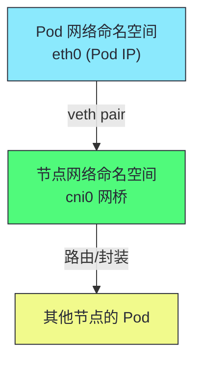
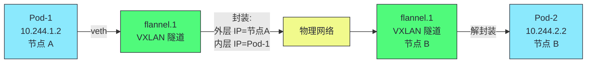
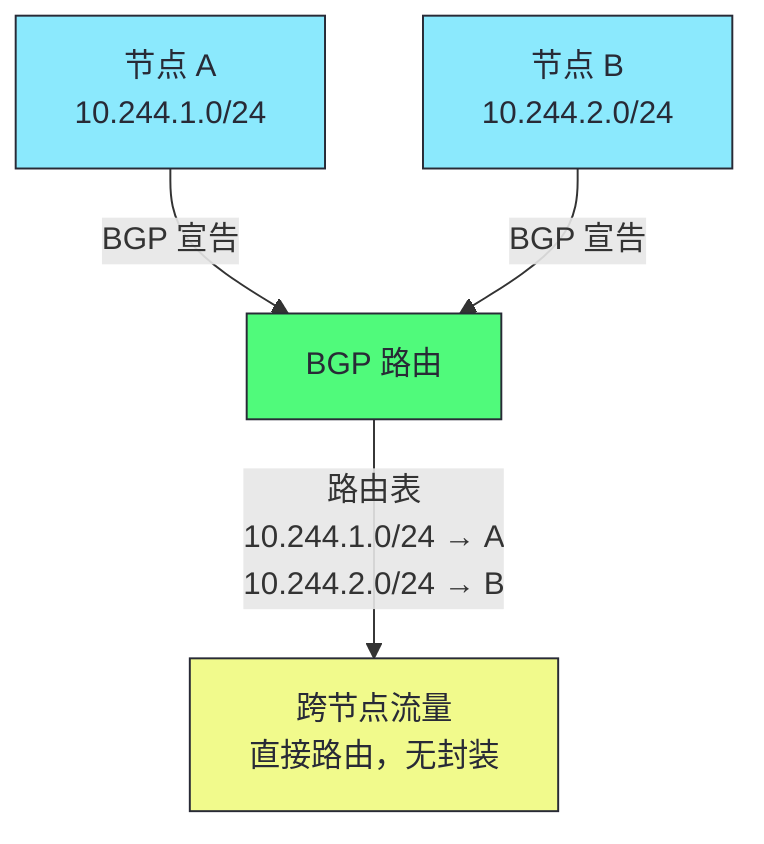
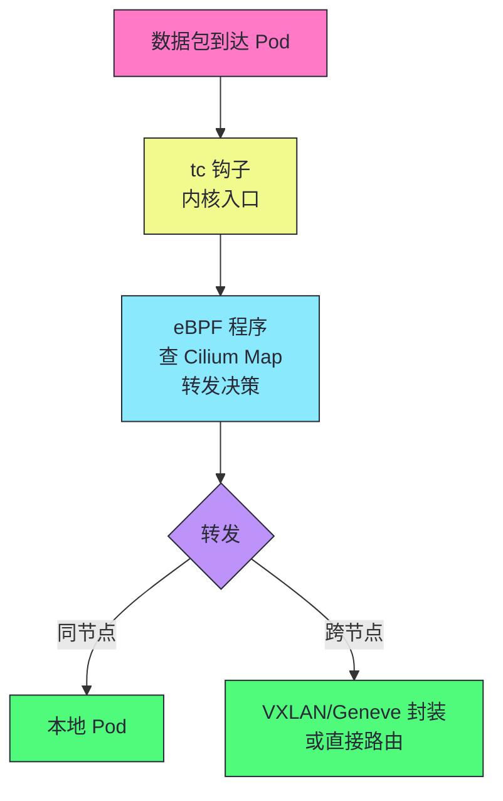
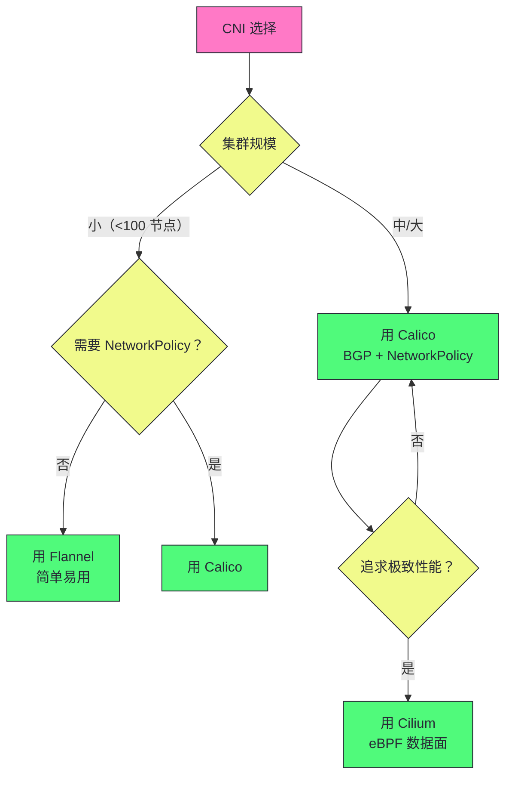

# 15 CNI 网络模型与数据面对比：Flannel/Calico/Cilium

**摘要：**
本文深入 Kubernetes 网络模型和主流 CNI 插件的实现对比。CNI（Container Network Interface）是 K8s 的网络插件接口——kubelet 在创建/删除 Pod 时调用 CNI 插件，为 Pod 配置网络。文章追溯 K8s 网络模型的三大基本要求（Pod 唯一 IP、Pod 间直接通信无需 NAT、节点上代理能访问所有 Pod），讲解 Linux 网络基础（网络命名空间、veth pair、网桥、路由表）与 CNI 插件规范（ADD/DEL/CHECK 命令、无状态调用、插件链）。对比三种主流 CNI 插件的实现——Flannel（VXLAN/Host-GW/UDP 三种后端，简单易用但默认不支持 NetworkPolicy）、Calico（BGP 路由传播无封装高性能，iptables/eBPF 两种数据面，NetworkPolicy 网络隔离，企业级事实标准）、Cilium（eBPF 原生数据面绕过 iptables/IPVS 性能最高，Hubble 流量可视化，L7 NetworkPolicy，可替代 kube-proxy）。深入每种插件的数据面机制、NetworkPolicy 的实现原理、CNI 插件的选择策略与生产实践。核心认知：CNI 插件是 K8s 网络的实现层——K8s 网络模型定义"应该做什么"，CNI 插件定义"怎么做"。

---

## 第 1 章 K8s 网络模型与 CNI 规范

讲 CNI，不能从"有哪些 CNI 插件"切入，而要先回到 K8s 网络模型——CNI 插件是为了满足 K8s 网络模型的要求而设计的。理解 K8s 网络模型，就理解了 CNI 插件要解决什么问题。

### 1.1 K8s 网络模型的三大基本要求

| 要求 | 说明 |
|------|------|
| **Pod 唯一 IP** | 每个 Pod 有集群内唯一的 IP |
| **Pod 间直接通信** | 无需 NAT，Pod IP 可直接路由 |
| **节点访问 Pod** | 节点上的 kubelet/kube-proxy 能访问所有 Pod |

K8s 网络模型的三大要求是 CNI 插件的设计基础。第一个要求"Pod 唯一 IP"——每个 Pod 有集群内唯一的 IP，不与节点 IP 冲突，不与其他 Pod IP 冲突。这个 IP 由 CNI 插件从 Pod 网段（Pod CIDR）中分配。第二个要求"Pod 间直接通信无需 NAT"——Pod 之间直接用 Pod IP 通信，不做 NAT 转换。这意味着 Pod IP 必须在集群内可路由——要么通过路由（BGP/Host-GW），要么通过封装（VXLAN/IP-in-IP）。第三个要求"节点访问所有 Pod"——节点上的 kubelet、kube-proxy 等代理能访问本节点和其他节点的所有 Pod。这是 kubelet 健康检查、kube-proxy 转发流量的基础。

这三大要求看似简单，实现却有挑战。Pod IP 在集群内可路由——但物理网络通常不知道 Pod IP（Pod IP 是虚拟的，不在物理网络路由表中）。CNI 插件需要解决"Pod IP 如何在集群内可路由"的问题——要么通过路由（在节点间传播 Pod 路由），要么通过封装（把 Pod 数据包封装在节点 IP 的数据包中传输）。

K8s 网络模型的一个设计哲学是"扁平网络"。K8s 要求 Pod 之间直接通信无需 NAT——这意味着 Pod IP 在集群内"扁平"可达，不需要 NAT 转换。这种"扁平网络"设计简化了应用开发——应用不需要感知 NAT，直接用 Pod IP 通信。但实现"扁平网络"需要 CNI 插件解决跨节点路由——这是 CNI 插件的核心职责。

K8s 网络模型的另一个设计哲学是"IP-per-Pod"。每个 Pod 一个 IP，不是每个容器一个 IP——Pod 内的所有容器共享网络命名空间（同一 IP）。这种"IP-per-Pod"设计简化了网络管理——Pod 是网络的最小单位，不是容器。Pod 内的容器通过 localhost 通信，不经过网络栈。

### 1.2 Linux 网络基础



| 组件 | 作用 |
|------|------|
| **网络命名空间** | 隔离 Pod 的网络栈（独立 IP/路由/iptables） |
| **veth pair** | 连接 Pod 命名空间和节点命名空间的虚拟网线 |
| **网桥（cni0）** | 节点上连接所有 Pod veth 的二层交换机 |
| **路由表** | 决定 Pod 流量的下一跳 |

K8s 网络的底层是 Linux 网络命名空间。每个 Pod 有独立的网络命名空间——独立的 IP、路由表、iptables 规则。Pod 之间的网络隔离通过命名空间实现——Pod A 的网络栈与 Pod B 的网络栈互不影响。

veth pair（虚拟以太网对）是连接 Pod 命名空间与节点命名空间的"虚拟网线"——一端在 Pod 命名空间（eth0），另一端在节点命名空间（vethxxx）。数据包从 Pod eth0 发出，通过 veth pair 到达节点命名空间，再由节点的路由表决定下一跳。

网桥（cni0）是节点上连接所有 Pod veth 的"二层交换机"——同一节点的 Pod 通过网桥直接通信（二层转发），不经过路由。跨节点的 Pod 通信通过路由表决定——要么封装（VXLAN/IPIP），要么直接路由（Host-GW/BGP）。

### 1.3 CNI 插件规范

CNI 是**二进制插件调用**——kubelet 在创建/删除 Pod 时调用 CNI 插件二进制：

```bash
# kubelet 调用 CNI ADD（创建 Pod 网络时）
/opt/cni/bin/calix < /etc/cni/net.d/10-calico.conf

# kubelet 调用 CNI DEL（删除 Pod 网络时）
# 同一二进制，环境变量 CNI_COMMAND=DEL
```

| 命令 | 作用 |
|------|------|
| **ADD** | 为 Pod 配置网络（创建 veth、分配 IP、配置路由） |
| **DEL** | 清理 Pod 网络（删除 veth、释放 IP） |
| **CHECK** | 检查 Pod 网络是否正常 |

> [!info] 核心概念：CNI 插件是无状态二进制调用
> CNI 插件不是常驻进程——它是 kubelet 在创建/删除 Pod 时调用的二进制文件，执行完毕后退出。每次调用时 kubelet 通过 stdin 传递 CNI 配置和 Pod 信息，插件执行后通过 stdout 返回结果。这意味着 CNI 插件不能依赖"上次调用时的内存状态"——每次调用都必须从配置文件或 API 重新获取信息。

CNI 规范的一个设计哲学是"简单与可组合"。CNI 插件是二进制文件，kubelet 通过 exec 调用——这种"进程调用"接口比"常驻进程"接口更简单，无需考虑进程管理、心跳、重连等问题。CNI 插件执行完毕后退出，不占用资源。这种"无状态"设计使得 CNI 插件可以任意重启、升级，不影响已有 Pod 网络（已有 Pod 的网络配置在内核中，不依赖 CNI 插件进程）。

CNI 规范的另一个设计是"插件链"（chained plugins）。CNI 支持多个插件串联执行——譬如先调用 Calico 插件分配 IP 配置路由，再调用 portmap 插件配置端口映射，再调用 bandwidth 插件配置限速。这种"插件链"使得 CNI 功能可组合——不同功能由不同插件实现，互不干扰。

CNI 规范的一个工程细节是"IP 分配"。CNI 插件负责为 Pod 分配 IP——从 IPAM（IP Address Management）插件获取 IP。IPAM 插件是 CNI 插件链的一部分——譬如 Calico 用自己的 IPAM（基于 etcd 存储 IP 分配），Flannel 用 host-local IPAM（基于本地文件存储 IP 分配）。IPAM 插件确保 IP 不冲突——分配前检查 IP 是否已用。

IPAM 的实现细节值得深入。host-local IPAM 是最简单的 IPAM——在节点本地文件系统中记录 IP 分配状态（`/var/lib/cni/networks/<network>/`），分配 IP 时检查文件，释放 IP 时删除文件。这种本地存储的 IPAM 不依赖外部存储（etcd），但只能保证单节点内 IP 不冲突——跨节点 IP 冲突需要通过 Pod CIDR 分配避免（每个节点分配不同的子网）。Calico 的 IPAM 基于 etcd——IP 分配状态存储在 etcd 中，跨节点共享，能保证集群内 IP 全局不冲突。Calico IPAM 还支持 IP 池（IP Pool）概念——管理员定义多个 IP 池，不同命名空间或节点可以用不同 IP 池，实现 IP 地址的分层管理。

CNI 规范的另一个工程细节是"配置文件"。CNI 配置文件在 `/etc/cni/net.d/` 目录——kubelet 按字母顺序读取第一个配置文件。配置文件是 JSON 格式，包含 CNI 插件名称、类型、配置参数。多个 CNI 配置文件时，kubelet 用字母序最小的——譬如 `01-calico.conf` 优先于 `10-flannel.conf`。这种"配置文件优先级"使得多个 CNI 可以共存（但通常只用一个）。

CNI 规范的一个设计哲学是"声明式配置"。CNI 配置文件声明"用什么 CNI 插件、怎么配置"——kubelet 读取配置后调用插件。这种"声明式"使得 CNI 配置可版本管理（配置文件提交到 Git）、可审计（配置变更可追踪）。

---

## 第 2 章 Flannel：简单易用的 CNI

讲完了 K8s 网络模型与 CNI 规范，接下来看第一种 CNI 插件——Flannel。Flannel 是最简单的 CNI 插件，适合入门与简单场景。

### 2.1 三种后端模式

| 模式 | 机制 | 性能 | 适用场景 |
|------|------|------|---------|
| **VXLAN** | 二层封装（50 字节开销） | 中 | 跨子网，默认 |
| **Host-GW** | 直接路由（节点为网关） | 高 | 同子网 |
| **UDP** | 用户态封装 | 低 | 兼容性（不推荐） |

Flannel 的三种后端模式适应不同的网络环境。VXLAN 是默认模式——通过 VXLAN 封装跨子网通信，通用性最好。Host-GW 性能最高——直接路由无封装，但要求节点在同一二层网络。UDP 模式是用户态封装，性能最差，只用于兼容性（譬如不支持 VXLAN 的旧内核），不推荐生产使用。

### 2.2 VXLAN 模式



VXLAN 模式的工作机制是——每个节点有一个 flannel.1 接口（VXLAN 隧道端点）。跨节点的 Pod 通信时，数据包被 VXLAN 封装——外层 IP 是节点 IP（物理网络可路由），内层 IP 是 Pod IP。封装后的数据包通过物理网络传输到目标节点，目标节点的 flannel.1 接口解封装，得到原始 Pod 数据包，转发给目标 Pod。

VXLAN 封装的一个工程细节是"50 字节开销"。VXLAN 在原始数据包外添加 50 字节的封装头（外层 IP 头 20 字节 + UDP 头 8 字节 + VXLAN 头 8 字节 + 以太网头 14 字节）。这意味着 VXLAN 模式的 MTU 比物理网络小 50 字节——物理 MTU 1500，VXLAN MTU 1450。如果 MTU 不一致，数据包可能被分片，性能下降。生产中需要确保各端 MTU 一致——Flannel 通常自动设置 VXLAN MTU，但需要确认。

VXLAN 模式的一个优势是"跨子网通用"。VXLAN 封装后的外层 IP 是节点 IP，物理网络知道如何路由节点 IP——所以 VXLAN 模式在任何物理网络中都能工作，不要求节点在同一二层网络。这种"跨子网通用"使得 VXLAN 模式成为 Flannel 的默认模式——它最通用，不依赖物理网络拓扑。

VXLAN 模式的一个工程细节是"VTEP（VXLAN Tunnel Endpoint）"。每个节点的 flannel.1 接口是一个 VTEP——VTEP 负责 VXLAN 封装与解封装。跨节点的 Pod 通信时，源节点的 VTEP 封装数据包（添加外层 IP 头、UDP 头、VXLAN 头），目标节点的 VTEP 解封装。VTEP 的 MAC 地址通过 ARP 学习——源节点需要知道目标节点 VTEP 的 MAC 地址才能封装。Flannel 维护一个 FDB（Forwarding Database）记录节点 IP 到 VTEP MAC 的映射。

VTEP FDB 的维护机制值得深入。Flannel 的 flanneld 进程 Watch 节点变化，维护 FDB 与 ARP 表。新节点加入时，flanneld 在 FDB 中添加新节点的映射（节点 IP → VTEP MAC），在 ARP 表中添加 VTEP IP 到 MAC 的映射。节点删除时，flanneld 清理对应的 FDB 与 ARP 表项。这种"动态维护"保证了跨节点 VXLAN 隧道的正确性——但 flanneld 故障时 FDB 不更新，新节点的 Pod 不可达。排查 Flannel 跨节点不通时，检查 FDB（`bridge fdb show | grep flannel`）是否有目标节点的映射，检查 ARP（`ip neigh show | grep flannel`）是否有 VTEP 的 MAC 地址。FDB 或 ARP 缺失会导致 VXLAN 封装失败，数据包无法到达目标节点。

VXLAN 模式的一个性能考量是"封装开销"。VXLAN 添加 50 字节封装头——这减少了有效载荷（MTU 减少 50 字节），增加了 CPU 开销（封装/解封装）。对于高吞吐场景，封装开销可能成为瓶颈。如果节点在同一二层网络，用 Host-GW 模式避免封装开销——性能更高。

### 2.3 Host-GW 模式

Host-GW 不封装——直接在节点路由表添加"目标 Pod 网段 → 节点 IP"的路由。性能更高（无封装开销），但要求节点在同一二层网络。

Host-GW 模式的工作机制是——每个节点的路由表包含所有其他节点的 Pod 网段路由——"10.244.2.0/24 → 节点 B 的 IP"。跨节点的 Pod 通信时，数据包直接路由到目标节点，不封装。目标节点收到数据包后，根据本机路由表转发给目标 Pod。

Host-GW 模式的一个限制是"要求同二层网络"。Host-GW 的路由是"目标 Pod 网段 → 节点 IP"，这要求节点 IP 在同一二层网络——否则路由的下一跳（节点 IP）不可达。如果集群跨多个子网（譬如多机房），Host-GW 模式不能用——需要切换到 VXLAN 模式。

Host-GW 模式的一个优势是"性能最高"。无封装开销——数据包直接路由，不添加封装头，MTU 不变。性能接近原生网络——跨节点通信的延迟与同节点通信接近。这种"无封装高性能"使得 Host-GW 适合对性能敏感的场景——譬如高性能计算、低延迟交易。

Host-GW 模式的一个工程细节是"路由表维护"。Host-GW 模式需要在每个节点的路由表添加所有其他节点的 Pod 网段路由。节点加入/退出时，路由表需要更新——Flannel 的 flanneld 进程 Watch 节点变化，自动更新路由表。这种"动态路由维护"是 Host-GW 模式的基础——如果 flanneld 进程故障，路由表不更新，新节点的 Pod 不可达。

Host-GW 模式与 VXLAN 模式的选择依据是"网络拓扑"。如果节点在同一二层网络（譬如同一机房、同一 VLAN），用 Host-GW——性能更高。如果节点跨子网（譬如多机房、多云），用 VXLAN——跨子网通用。生产中需要根据物理网络拓扑选择，不能盲目追求性能用 Host-GW（跨子网不可达）。

> [!warning] 生产避坑：Flannel 默认不支持 NetworkPolicy
> Flannel 专注于"简单连通"——不实现 NetworkPolicy。如果你需要网络隔离（如限制 Pod 间通信），需要额外安装 Calico 的 NetworkPolicy 组件，或直接用 Calico/Cilium。Flannel 适合不需要 NetworkPolicy 的简单场景——如开发/测试集群。

Flannel 的一个工程价值是"简单易用"。Flannel 的部署非常简单——一个 DaemonSet，一个 ConfigMap，无需额外配置。这种"开箱即用"使得 Flannel 适合入门、开发/测试集群、简单生产集群。但 Flannel 的功能有限——不支持 NetworkPolicy，不支持网络策略，可观测性弱。对于需要这些功能的生产集群，用 Calico 或 Cilium。

Flannel 的一个工程细节是"Pod CIDR 分配"。Flannel 为每个节点分配一个 Pod CIDR 子网（譬如 10.244.1.0/24），节点上的 Pod 从这个子网分配 IP。Flannel 的 Pod CIDR 来自集群的 Pod CIDR（譬如 10.244.0.0/16），每个节点分配一个子网。这种"每节点一个子网"让跨节点的 Pod IP 不冲突——不同节点的 Pod 在不同子网。

Flannel 的一个局限是"可观测性弱"。Flannel 不提供流量监控、网络策略审计等可观测性功能——用户看不到 Pod 之间的流量分布、NetworkPolicy 的拒绝事件。对于需要网络可观测性的场景，用 Cilium（Hubble 提供流量可视化）或 Calico（flow logs 提供流量记录）。

Flannel 的另一个局限是"不支持网络策略"。Flannel 专注于"简单连通"——不实现 NetworkPolicy。如果需要网络隔离（限制 Pod 间通信），需要额外安装 Calico 的 NetworkPolicy 组件（Tigera 提供 Flannel + Calico NetworkPolicy 的组合方案），或直接用 Calico/Cilium。这种"功能有限"是 Flannel 简单的代价——简单意味着功能少。

Flannel 的一个适用边界是"中小集群"。Flannel 的控制平面简单——一个 flanneld 进程 Watch 节点变化更新路由。这种简单设计在中小集群（<100 节点）够用，但大规模集群的 flanneld 性能可能不足——大集群用 Calico 或 Cilium 更稳定。

---

## 第 3 章 Calico：企业级 CNI

讲完了 Flannel，接下来看 Calico——企业级 CNI 的事实标准。Calico 功能全面，适合企业生产环境。

### 3.1 两种数据面

| 数据面 | 机制 | 性能 | 适用场景 |
|--------|------|------|---------|
| **iptables** | iptables 规则 + mark | 中 | 默认，兼容性好 |
| **eBPF** | eBPF 程序 | 高 | 追求性能，K8s 1.20+ |

Calico 支持两种数据面——iptables（默认）和 eBPF。iptables 数据面用 iptables 规则实现 Pod 路由与 NetworkPolicy，兼容性好，但大规模性能不如 eBPF。eBPF 数据面用 eBPF 程序绕过 iptables，性能更高，但需要较新内核。大多数 Calico 部署用 iptables 数据面（默认），追求性能的集群用 eBPF 数据面。

Calico 两种数据面的一个工程考量是"功能差异"。iptables 数据面支持所有 Calico 功能（BGP 路由、NetworkPolicy、流量镜像等），兼容性好。eBPF 数据面绕过 iptables，性能更高，但某些功能可能不支持（譬如某些高级 NetworkPolicy）。切换数据面前确认所需功能在 eBPF 数据面中支持。

Calico 两种数据面的另一个工程考量是"切换成本"。从 iptables 切到 eBPF 需要重启 Calico 组件——切换期间 Pod 网络可能短暂中断。生产中在低峰期切换，并充分测试。切换后已有连接可能需要重建（iptables 规则被清除，eBPF 规则接管）。

Calico 的 iptables 数据面实现值得深入。Calico 用 iptables 觷则实现 Pod 路由与 NetworkPolicy——每个 Pod 创建时，Calico 在 iptables 的 cali 链中添加规则，匹配 Pod IP 做路由决策与策略检查。NetworkPolicy 也用 iptables 规则实现——每条 NetworkPolicy 规则转换为 iptables 规则，匹配源 Pod、目标 Pod、端口，允许或拒绝。这种"iptables 规则"的实现方式与 kube-proxy 类似——规则数随 Pod 数与策略数增长，大规模集群的 iptables 规则可能数万条，影响转发性能。Calico 的 eBPF 数据面用 eBPF 程序替代 iptables 规则——eBPF map 存储 Pod 路由与策略，eBPF 程序查表做决策，O(1) 复杂度，大规模性能稳定。

### 3.2 BGP 路由模式

Calico 用 BGP 协议在节点间传播 Pod 路由——每个节点宣告"我负责的 Pod 网段"。



Calico BGP 模式的工作机制是——每个节点运行 BGP 客户端，向其他节点宣告"我负责的 Pod 网段"（譬如 10.244.1.0/24）。其他节点收到 BGP 宣告后，在路由表中添加"10.244.1.0/24 → 节点 A"的路由。跨节点的 Pod 通信时，根据路由表直接路由到目标节点，无封装。

BGP 模式的一个优势是"无封装高性能"。与 VXLAN 封装不同，BGP 模式直接路由——数据包不添加封装头，MTU 不变，性能接近原生网络。这种"无封装"使得 BGP 模式的性能高于 VXLAN 模式，适合对性能敏感的场景。

BGP 模式的一个限制是"要求物理网络支持 BGP 或节点同二层"。BGP 路由的下一跳是节点 IP，这要求节点 IP 在物理网络中可路由——要么节点在同一二层网络（直接路由），要么物理网络支持 BGP（路由传播）。如果物理网络不支持 BGP 且节点跨子网，BGP 模式不能用——需要用 IPIP 封装模式（Calico 的另一种模式，跨子网兼容）。

BGP 模式的一个工程挑战是"大规模路由表"。每个节点宣告自己的 Pod 网段，N 个节点有 N 条路由。1000 个节点的集群有 1000 条 BGP 路由——路由表大，收敛慢。Calico 用 BGP Route Reflector 优化——少量 Route Reflector 节点收集所有路由，其他节点只与 Route Reflector 交换路由，减少 BGP 连接数。这种"星型拓扑"使得大规模 BGP 可行。

BGP Route Reflector 的实现值得深入。标准 BGP 是全连接拓扑——每个节点与其他所有节点建立 BGP 邻居关系，N 个节点有 N×(N-1)/2 个 BGP 连接，大规模集群的连接数爆炸。Route Reflector（RR）是 BGP 的扩展——RR 节点作为路由集中点，其他节点（RR Client）只与 RR 建立 BGP 邻居，RR 把收到的路由反射给所有 Client。这种"星型拓扑"把 BGP 连接数从 O(n²) 降到 O(n)。生产中通常部署 2-3 个 RR 节点做高可用——RR 故障不影响已有路由（路由表仍在），只影响新路由的传播。RR 节点不转发数据流量，只交换路由信息，资源开销小。大规模集群（100+ 节点）建议用 RR 模式，避免全连接拓扑的连接数爆炸。

BGP 模式与 VXLAN 模式的对比值得深入。BGP 模式无封装——数据包直接路由，MTU 不变，性能接近原生网络。VXLAN 模式有封装——50 字节开销，MTU 减少。但 BGP 模式要求物理网络支持 BGP 或节点同二层——VXLAN 模式跨子网通用。性能敏感且网络支持 BGP 的场景用 BGP，跨子网或不支持 BGP 的场景用 VXLAN。

BGP 模式的一个变体是"IPIP 封装模式"。当节点跨子网且物理网络不支持 BGP 时，Calico 用 IPIP（IP-in-IP）封装——把 Pod 数据包封装在节点 IP 的数据包中传输。IPIP 类似 VXLAN，但封装开销更小（20 字节 vs 50 字节）。IPIP 模式是 BGP 模式的"跨子网兼容版"——保留了 BGP 的路由传播机制，但用封装解决跨子网问题。

### 3.3 NetworkPolicy 实现

```yaml
apiVersion: networking.k8s.io/v1
kind: NetworkPolicy
metadata:
  name: allow-frontend
spec:
  podSelector:
    matchLabels:
      app: backend
  policyTypes:
    - Ingress
  ingress:
    - from:
        - podSelector:
            matchLabels:
              app: frontend
```

Calico 用 iptables mark 实现 NetworkPolicy——给符合规则的包打 mark，根据 mark 决定接受/拒绝。这种"mark + 过滤"的实现方式使得 NetworkPolicy 与 Pod 路由解耦——路由负责转发，mark 负责过滤，互不干扰。

NetworkPolicy 的一个工程价值是"网络隔离"。默认情况下，K8s 的 Pod 之间可以任意通信——没有网络隔离。NetworkPolicy 允许定义"哪些 Pod 可以与哪些 Pod 通信"——譬如前端 Pod 可以访问后端 Pod，但其他 Pod 不能访问后端 Pod。这种"网络隔离"是生产环境的安全基础——限制攻击面，防止横向移动。

NetworkPolicy 的一个工程陷阱是"默认允许"。NetworkPolicy 是"白名单"——定义了策略后，只有策略允许的流量通过，其他流量拒绝。但如果没有定义任何 NetworkPolicy，所有流量都允许（默认允许）。这种"默认允许"意味着——如果忘记定义 NetworkPolicy，Pod 之间可以任意通信，没有隔离。生产中需要明确"默认拒绝"策略——除非显式允许，否则拒绝所有流量。

NetworkPolicy 的一个实现细节是"命名空间隔离"。默认情况下，同一命名空间的 Pod 可以通信，跨命名空间的 Pod 也可以通信。NetworkPolicy 可以按命名空间隔离——譬如"只允许同一命名空间的 Pod 通信，拒绝跨命名空间通信"。这种"命名空间隔离"是多租户场景的基础——不同租户的 Pod 互相隔离。

NetworkPolicy 的一个性能考量是"规则匹配开销"。每个数据包需要匹配所有 NetworkPolicy 规则——规则多时匹配开销大。Calico 用 iptables mark 优化——预先给包打 mark，根据 mark 快速过滤，减少逐条匹配。但即使优化，过多 NetworkPolicy 仍有开销。生产中定期审计 NetworkPolicy，清理无用策略，避免规则爆炸。

> [!info] 核心概念：Calico 是企业级 CNI 的事实标准
> Calico 提供 BGP 路由（无封装高性能）、NetworkPolicy（网络隔离）、eBPF 数据面（性能优化）——功能全面，适合企业生产环境。BGP 模式无封装开销，性能接近原生网络。NetworkPolicy 支持精细的访问控制。eBPF 数据面绕过 iptables，性能进一步提升。大多数企业 K8s 集群用 Calico。

Calico 的一个工程价值是"功能全面"。Calico 不仅提供 Pod 网络（BGP 路由），还提供 NetworkPolicy（网络隔离）、eBPF 数据面（性能优化）、网络可观测性（flow logs）。这种"一体化"使得企业不需要部署多个组件——一个 Calico 满足网络、安全、可观测的需求。这是 Calico 成为企业级 CNI 事实标准的原因——功能全面，生产成熟。

Calico 的一个工程细节是"calico-node 组件"。calico-node 是 Calico 的核心组件——每个节点运行一个 calico-node（DaemonSet），负责 BGP 路由传播、Pod 网络配置、NetworkPolicy 实现。calico-node 故障会导致该节点的 Pod 网络异常——监控 calico-node 健康，及时排查故障。

---

## 第 4 章 Cilium：eBPF 原生 CNI

讲完了 Calico，接下来看 Cilium——eBPF 原生 CNI，性能最高，功能最丰富。

### 4.1 eBPF 数据面

Cilium 用 eBPF 程序在内核中直接处理数据包——绕过 iptables 和 IPVS，性能最高。



Cilium eBPF 数据面的工作机制是——eBPF 程序挂载在 tc（traffic control）钩子，数据包进入网卡时 eBPF 程序直接处理。eBPF 程序查询 Cilium Map（存储 Pod IP、Service、NetworkPolicy 等信息的哈希表），做转发决策——同节点直接转发，跨节点封装或直接路由。整个处理过程在内核完成，不经过 iptables/IPVS。

eBPF 数据面的一个优势是"绕过 iptables 的所有开销"。iptables 的规则匹配、连接跟踪、NAT 都有开销，eBPF 直接在网卡钩子处理数据包，跳过这些开销。对于高吞吐场景（譬如 Service Mesh 的 sidecar 流量），eBPF 的性能优势显著。Cilium 的 eBPF 数据面比 iptables 数据面快 3-5 倍（取决于场景）。

eBPF 数据面的另一个优势是"内核级可观测性"。Cilium 的 eBPF 程序能在数据包处理时记录元数据——流量来源、目的、延迟、协议等。这些数据通过 Hubble（Cilium 的可观测性组件）可视化，提供 Pod 级别的流量监控。这种"内核级可观测性"比用户态监控（譬如 sidecar 代理）更准确——它记录的是内核实际处理的流量，不是代理转发的流量。

eBPF 数据面的一个工程细节是"eBPF 程序的验证"。eBPF 程序在加载到内核前需要通过验证器（verifier）检查——验证器确保程序安全（不越界访问、不死循环、不崩溃内核）。这种"验证机制"保证了 eBPF 程序的安全性——即使 eBPF 程序有 bug，也不会崩溃内核。但验证器有限制——程序大小、指令数、复杂度有限制，某些复杂逻辑无法用 eBPF 实现。

eBPF 数据面的另一个工程细节是"eBPF 程序的更新"。eBPF 程序更新时需要重新加载——旧程序继续处理已有连接，新程序处理新连接。这种"原子更新"使得 eBPF 程序可以热更新，不影响已有流量。但更新期间新旧程序共存，需要确保两者兼容——譬如 Map 结构不能变（否则新程序读不了旧 Map）。

Cilium 的 eBPF 数据面实现值得深入。Cilium 用多个 eBPF 程序处理不同层级的网络——tc ingress 程序处理入向数据包（查表做 DNAT 或转发），tc egress 程序处理出向数据包（查表做 SNAT 或封装），xdp 程序处理高速场景（譬如 DDoS 防护、负载均衡）。Cilium 维护多个 eBPF map——Pod IP map 存储 Pod IP 到容器接口的映射，Service map 存储 Service 到后端 Pod 的映射，Policy map 存储 NetworkPolicy 规则，CT map 存储连接跟踪状态。eBPF 程序查这些 map 做转发决策，全部在内核态完成，不经过用户态。这种"多 map + 多程序"的架构使得 Cilium 能实现传统 CNI 无法实现的功能——L7 NetworkPolicy（解析 HTTP/gRPC/Kafka 协议）、kube-proxy replacement（用 eBPF 替代 kube-proxy 的 Service 转发）、Service Mesh（用 eBPF 替代 sidecar 代理）。

### 4.2 Cilium 的优势

| 优势 | 说明 |
|------|------|
| **性能最高** | eBPF 绕过 iptables/IPVS |
| **可观测性强** | Hubble 提供流量可视化 |
| **NetworkPolicy 增强** | 支持 L7（HTTP/gRPC/Kafka）策略 |
| **Service Mesh** | 可替代 kube-proxy（eBPF 实现 Service） |
| **无 iptables 依赖** | 不需要 iptables 规则，减少内核开销 |

Cilium 的一个独特优势是"L7 NetworkPolicy"。标准 NetworkPolicy 只支持 L3/L4（IP/端口），Cilium 扩展到 L7——可以按 HTTP 路径、gRPC 方法、Kafka 主题等过滤流量。譬如"允许前端 Pod 访问后端 Pod 的 /api/v1 路径，但拒绝 /api/admin 路径"。这种"L7 策略"使得网络隔离更精细——不仅控制"谁能连谁"，还控制"能连什么路径"。

Cilium 的另一个独特优势是"Service Mesh 替代"。Cilium 的 eBPF 程序可以实现 Service 的负载均衡——在 eBPF 中查表 DNAT，无需 iptables/IPVS。这被称为"kube-proxy replacement"——Cilium 直接在 eBPF 中实现 Service 转发，性能比 iptables/IPVS 更高。配合 Hubble（基于 eBPF 的流量监控），Cilium 提供了网络 + 安全 + 可观测的一体化方案。

> [!info] 核心概念：Cilium 可以完全替代 kube-proxy
> Cilium 的 eBPF 程序可以实现 Service 的负载均衡——在 eBPF 中查表 DNAT，无需 iptables/IPVS。这被称为"kube-proxy replacement"——Cilium 直接在 eBPF 中实现 Service 转发，性能比 iptables/IPVS 更高。配合 Hubble（基于 eBPF 的流量监控），Cilium 提供了网络 + 安全 + 可观测的一体化方案。

Cilium 的一个限制是"需要较新内核"。eBPF 程序需要内核 4.10+ 支持，某些 eBPF 功能需要 5.x+ 内核。生产中使用 Cilium 需要确认内核版本，或使用 Cilium 的内核兼容性检查工具。旧内核（譬如 CentOS 7 的 3.10 内核）不支持 Cilium eBPF 数据面——需要升级内核或用其他 CNI。

Cilium 的另一个工程考量是"功能成熟度"。Cilium 相对较新（1.0 于 2017 年发布），某些功能可能不如 Calico 成熟。生产中使用 Cilium 需要充分测试，确认功能满足需求。Cilium 已经被多家大公司生产使用（譬如 Google GKE、AWS EKS），但仍有边缘场景不如 Calico 稳定。

Cilium 的一个独特价值是"eBPF 的可编程性"。eBPF 程序是"可编程的内核钩子"——Cilium 用 eBPF 实现网络转发、NetworkPolicy、可观测性，全部在内核态完成。这种"可编程性"使得 Cilium 能实现传统 CNI 无法实现的功能——譬如 L7 NetworkPolicy（解析 HTTP/gRPC/Kafka 协议）、kube-proxy replacement（eBPF 实现 Service 转发）、Service Mesh（eBPF 替代 sidecar 代理）。这些功能使得 Cilium 不仅是 CNI，更是"网络 + 安全 + 可观测"的平台。

Cilium 的一个工程细节是"Cilium Map"。Cilium 的 eBPF 程序通过 Cilium Map（BPF Map）存储数据——Pod IP、Service、NetworkPolicy 等信息存储在 Map 中，eBPF 程序查 Map 做转发决策。Map 是内核态的数据结构，eBPF 程序直接查询，不需要用户态交互。这种"内核态查表"使得转发决策快——不经过用户态，不经过 iptables 规则匹配。

Cilium 的另一个工程细节是"身份认证"。Cilium 用 Pod 的身份（基于 label）做 NetworkPolicy 决策——而不是 Pod IP。Pod 重建后 IP 变化，但身份（label）不变——NetworkPolicy 基于身份，不受 IP 变化影响。这种"基于身份的策略"比"基于 IP 的策略"更稳定——Pod 变化时策略不需要更新。

Cilium 身份认证的实现值得深入。Cilium 为每个 Pod 分配一个身份 ID（基于 Pod 的 label 计算哈希），身份 ID 存储在 eBPF map 中。eBPF 程序处理数据包时，从数据包的源 Pod 提取身份 ID，与 Policy map 中的策略规则匹配——基于身份而非 IP 做决策。这种"身份认证"机制使得 NetworkPolicy 不受 Pod IP 变化影响——Pod 重建后 IP 变化，但身份 ID 不变（label 不变），策略仍然生效。相比之下，基于 IP 的 NetworkPolicy 在 Pod 重建后需要更新策略（IP 变了），大规模集群的策略更新开销大。Cilium 的身份认证是 eBPF 可编程性的体现——用内核态数据结构实现传统 CNI 无法实现的功能。

Cilium 的一个工程价值是"eBPF 替代 sidecar 代理"。传统 Service Mesh 用 sidecar 代理（譬如 Istio 的 Envoy）——每个 Pod 注入一个 sidecar，所有流量经过 sidecar。sidecar 增加延迟（额外跳）与资源开销（每个 Pod 一个 sidecar）。Cilium 用 eBPF 在内核实现 Service Mesh 功能——不需要 sidecar，流量直接在内核处理。这种"sidecarless Service Mesh"减少了延迟与开销，是 Service Mesh 的演进方向。

Cilium 的另一个工程价值是"Hubble 可观测性"。Hubble 基于 eBPF 提供流量可视化——它能看到 Pod 之间的流量（源、目的、协议、延迟）、Service 的流量分布、NetworkPolicy 的拒绝事件。这种"内核级可观测性"比应用级监控更准确——它记录的是内核实际处理的流量，不是应用报告的流量。Hubble UI 提供流量拓扑图，直观展示服务间调用关系。

Cilium 的一个工程考量是"eBPF 程序的调试"。eBPF 程序在内核运行，调试比用户态程序困难——不能直接用 gdb 调试。Cilium 提供 `cilium monitor` 命令实时监控 eBPF 程序的事件——数据包处理、转发决策、策略拒绝等。这种"事件监控"是 eBPF 程序调试的主要手段——通过事件日志定位问题。

NetworkPolicy 的实现机制值得深入。NetworkPolicy 是 K8s 的原生资源，但实现由 CNI 插件负责——K8s 只定义 NetworkPolicy 的 API 与语义，CNI 插件负责在数据面执行。Calico 的 NetworkPolicy 实现用 iptables 规则——每条 NetworkPolicy 规则转换为 iptables 规则，匹配源 Pod、目标 Pod、端口，允许或拒绝。Cilium 的 NetworkPolicy 实现用 eBPF 程序——Policy map 存储策略规则，eBPF 程序查 map 做决策。两种实现的核心逻辑相同——白名单机制，默认允许，定义策略后只有允许的流量通过。NetworkPolicy 的一个工程细节是"策略的优先级"——K8s 的 NetworkPolicy 没有 priority 字段，所有策略是"或"关系——只要有一条策略允许，流量就允许。Calico 扩展了 NetworkPolicy，支持 priority 字段与 deny 规则，实现更精细的策略控制，这是 Calico 相比原生 NetworkPolicy 的重要增强。

---

## 第 5 章 CNI 选择决策框架

讲完了三种 CNI 插件，接下来看如何选择。CNI 选择没有"最好"，只有"最适合"——根据集群规模、功能需求、性能需求选择。



| 场景 | 推荐 CNI | 理由 |
|------|---------|------|
| **开发/测试** | Flannel | 简单易用，快速部署 |
| **小生产（<100 节点）** | Calico | NetworkPolicy + BGP |
| **大生产（100+ 节点）** | Calico 或 Cilium | BGP/eBPF 性能 |
| **追求性能** | Cilium | eBPF 数据面 |
| **需要 L7 策略** | Cilium | 支持 HTTP/gRPC/Kafka 策略 |
| **需要可观测性** | Cilium | Hubble 流量可视化 |

CNI 选择的一个决策维度是"是否需要 NetworkPolicy"。如果不需要（譬如开发/测试集群），Flannel 够用——简单易用。如果需要（譬如生产集群），用 Calico 或 Cilium——都支持 NetworkPolicy。

CNI 选择的另一个决策维度是"集群规模"。小集群（<100 节点）用 Flannel 或 Calico 都够用——iptables 数据面性能足够。大集群（100+ 节点）用 Calico eBPF 或 Cilium——iptables 大规模性能退化，eBPF 数据面性能稳定。

CNI 选择的第三个决策维度是"是否需要 L7 策略或可观测性"。如果需要 L7 NetworkPolicy（HTTP/gRPC/Kafka 策略）或流量可视化，用 Cilium——它支持 L7 策略和 Hubble 可观测性。如果不需要，用 Calico——功能全面，成熟稳定。

CNI 选择的一个考量是"迁移成本"。从一种 CNI 迁移到另一种 CNI 成本高——所有 Pod 需要重新配置网络（重建 Pod 或重新调用 CNI）。生产中尽量在集群创建时选好 CNI，避免后期迁移。如果必须迁移，通常新建集群用新 CNI，逐步迁移工作负载。

CNI 选择的另一个考量是"云厂商默认 CNI"。云厂商的托管 K8s 通常有默认 CNI——AWS EKS 默认用 AWS VPC CNI，GKE 默认用 Calico，AKS 默认用 Azure CNI。这些默认 CNI 与云厂商网络深度集成，譬如 AWS VPC CNI 让 Pod 直接用 VPC IP（不封装，性能高）。使用云厂商托管 K8s 时，默认 CNI 通常是最佳选择——与云网络集成最好。

CNI 选择的一个决策维度是"是否需要 NetworkPolicy"。如果不需要（譬如开发/测试集群），Flannel 够用——简单易用。如果需要（譬如生产集群），用 Calico 或 Cilium——都支持 NetworkPolicy。

CNI 选择的另一个决策维度是"集群规模"。小集群（<100 节点）用 Flannel 或 Calico 都够用——iptables 数据面性能足够。大集群（100+ 节点）用 Calico eBPF 或 Cilium——iptables 大规模性能退化，eBPF 数据面性能稳定。

CNI 选择的第三个决策维度是"是否需要 L7 策略或可观测性"。如果需要 L7 NetworkPolicy（HTTP/gRPC/Kafka 策略）或流量可视化，用 Cilium——它支持 L7 策略和 Hubble 可观测性。如果不需要，用 Calico——功能全面，成熟稳定。

CNI 选择的一个考量是"迁移成本"。从一种 CNI 迁移到另一种 CNI 成本高——所有 Pod 需要重新配置网络（重建 Pod 或重新调用 CNI）。生产中尽量在集群创建时选好 CNI，避免后期迁移。如果必须迁移，通常新建集群用新 CNI，逐步迁移工作负载。

CNI 选择的另一个考量是"内核版本"。Cilium eBPF 数据面需要内核 4.10+，某些功能需要 5.x+。如果集群用旧内核（譬如 CentOS 7 的 3.10），不能用 Cilium eBPF——需要升级内核或用 Calico（iptables 数据面兼容旧内核）。

CNI 选择的一个决策维度是"是否需要 Service Mesh"。如果需要 Service Mesh（流量管理、熔断、重试），传统方案用 Istio + sidecar 代理。Cilium 用 eBPF 实现 sidecarless Service Mesh——不需要 sidecar，性能更高。如果需要 Service Mesh 且追求性能，用 Cilium。

云厂商托管 K8s 的 CNI 值得深入。AWS VPC CNI 是 AWS EKS 的默认 CNI——它让 Pod 直接使用 VPC 的 IP 地址，不封装，性能接近原生网络。每个 Pod 从 VPC 子网分配一个 IP，Pod IP 在 VPC 中可路由，不需要 VXLAN 或 BGP 封装。这种"原生 VPC IP"的方式性能最高，但消耗 VPC IP 地址——IP 地址池可能耗尽，需要规划子网大小。GKE 默认用 Calico，AKS 默认用 Azure CNI（类似 AWS VPC CNI，Pod 直接用 VNet IP）。云厂商 CNI 与云网络深度集成，性能高但可移植性差——迁移到其他云或自建集群时需要更换 CNI。

---

## 第 6 章 CNI 运维实践

讲完了 CNI 选择，最后看 CNI 的运维实践。这些是生产运维中的常见操作与陷阱。

### 6.1 网络故障排查

| 故障 | 排查方法 |
|------|---------|
| **Pod 无法通信** | 检查 CNI 配置、路由表、iptables/eBPF 规则 |
| **跨节点不通** | 检查 VXLAN 隧道/BGP 路由/Host-GW 路由 |
| **NetworkPolicy 不生效** | 确认 CNI 支持 NetworkPolicy |
| **DNS 解析失败** | 检查 CoreDNS Pod 和网络 |

网络故障排查的一个常见场景是"Pod 无法通信"。排查方法——先检查 CNI 配置（`/etc/cni/net.d/`）是否正确，再检查 Pod 的网络接口（`ip addr` 在 Pod 命名空间），再检查路由表（`ip route`），最后检查 iptables/eBPF 规则。如果 CNI 插件没运行（譬如 Calico Node 没 Ready），Pod 网络不配置，无法通信。

网络故障排查的另一个常见场景是"跨节点不通"。排查方法——先检查节点间网络连通性（`ping` 节点 IP），再检查 VXLAN 隧道（`ip -d link show flannel.1`）或 BGP 路由（`calicoctl node status`），再检查路由表是否包含目标 Pod 网段的路由。如果 VXLAN 隧道断开或 BGP 路由未传播，跨节点不通。

CNI 故障排查的工程方法值得深入。Flannel 的故障排查——检查 flanneld 进程是否运行（`systemctl status flanneld`），检查 flannel.1 接口是否存在（`ip link show flannel.1`），检查路由表是否有跨节点路由（`ip route | grep flannel`），检查 FDB 是否有节点映射（`bridge fdb show | grep flannel`）。Calico 的故障排查——检查 calico-node 是否 Ready（`kubectl get pods -n kube-system | grep calico`），检查 BGP 邻居状态（`calicoctl node status`），检查路由表是否有 Pod 网段路由（`ip route | grep bird`），检查 iptables 规则是否有 cali 链（`iptables-save | grep cali`）。Cilium 的故障排查——检查 cilium-agent 是否运行（`kubectl get pods -n kube-system | grep cilium`），检查 eBPF 程序是否加载（`cilium status`），检查 eBPF map 内容（`cilium bpf endpoint list`），检查 Hubble 流量（`hubble observe`）。

网络故障排查的第三个常见场景是"NetworkPolicy 不生效"。排查方法——先确认 CNI 支持 NetworkPolicy（Flannel 默认不支持），再检查 NetworkPolicy 配置是否正确（`kubectl get networkpolicy`），再检查 NetworkPolicy 是否匹配目标 Pod（selector 是否正确）。如果 CNI 不支持 NetworkPolicy，策略不生效。

网络故障排查的第四个常见场景是"DNS 解析失败"。DNS 解析失败通常是网络问题或 CoreDNS 问题——Pod 无法访问 CoreDNS（网络不通），或 CoreDNS Pod 不健康（CrashLoopBackOff）。排查方法——先检查 CoreDNS Pod 是否健康（`kubectl get pod -n kube-system -l k8s-app=kube-dns`），再检查 Pod 能否访问 CoreDNS Service（`kubectl exec <pod> -- nslookup kubernetes.default`），再检查 CoreDNS 配置是否正确。

网络故障排查的一个工具是"tcpdump"。在节点上用 tcpdump 抓包——`tcpdump -i cni0 port 80` 抓 cni0 接口的 80 端口流量，`tcpdump -i flannel.1` 抓 VXLAN 隧道流量。tcpdump 能看到数据包的源/目的 IP、端口、协议，帮助定位网络问题。但 tcpdump 需要在节点上执行（需要 root 权限），且需要理解网络协议。

网络故障排查的另一个工具是"CNI 专有工具"。Calico 提供 `calicoctl` 命令——`calicoctl node status` 查看 BGP 状态，`calicoctl get policy` 查看 NetworkPolicy。Cilium 提供 `cilium` 命令——`cilium status` 查看 Cilium 状态，`cilium monitor` 实时监控数据包，`cilium service list` 查看 Service。这些专有工具比通用工具（iptables/tcpdump）更易用，提供 CNI 级别的视图。

网络故障排查的第三个工具是"连通性测试"。用 `kubectl exec` 进入 Pod 测试连通性——`ping` 测试 L3 连通，`curl` 测试 L4/L7 连通，`nslookup` 测试 DNS。从 Pod 内测试能定位"Pod 视角"的网络问题——譬如 Pod 能否访问 CoreDNS、能否访问其他 Pod、能否访问外网。

### 6.2 性能调优

| 调优项 | 说明 |
|--------|------|
| **MTU** | VXLAN 封装减少 MTU（50 字节），确保各端 MTU 一致 |
| **数据面选择** | 大集群用 eBPF 数据面（Calico/Cilium） |
| **NetworkPolicy 数量** | 过多 NetworkPolicy 增加规则匹配开销 |
| **Pod 网段规划** | 避免网段冲突，预留足够 IP |

性能调优的一个关键是"MTU 一致"。VXLAN 封装减少 50 字节 MTU——物理 MTU 1500，VXLAN MTU 1450。如果各端 MTU 不一致，数据包可能被分片，性能下降。生产中需要确保各端 MTU 一致——CNI 插件通常自动设置 MTU，但需要确认。如果物理网络 MTU 不是 1500（譬如 9000 的 jumbo frame），需要相应调整 VXLAN MTU。

MTU 调优的工程细节值得深入。MTU 不一致的症状是"大数据包丢失但小数据包正常"——譬如 `ping` 通但 `curl` 大文件失败，因为 ping 的数据包小（不超 MTU），curl 的数据包大（超过 MTU 被分片或丢弃）。排查 MTU 问题时用 `ping -M do -s 1472 <target>` 测试（1472 = 1500 - 28 ICMP 头），如果失败说明 MTU 不一致。VXLAN 模式的 MTU 应该是物理 MTU - 50（VXLAN 封装头），IPIP 模式的 MTU 应该是物理 MTU - 20（IPIP 封装头），Host-GW/BGP 模式的 MTU 与物理网络一致。生产中确保所有节点的 MTU 设置一致，避免分片导致的性能下降。

性能调优的另一个关键是"数据面选择"。大集群用 eBPF 数据面（Calico eBPF 或 Cilium）——iptables 大规模性能退化，eBPF 数据面性能稳定。切换数据面需要重启 CNI 插件，生产中在低峰期切换。

性能调优的第三个关键是"NetworkPolicy 数量控制"。过多 NetworkPolicy 增加规则匹配开销——每个数据包需要匹配所有 NetworkPolicy 规则。生产中定期审计 NetworkPolicy，清理无用策略，避免规则爆炸。

性能调优的第四个关键是"Pod 网段规划"。Pod CIDR 需要足够大——大规模集群的 Pod 数可能数万，Pod CIDR 需要 /16 或更大。Pod 网段不能与节点 IP、Service IP、物理网络冲突——冲突会导致路由问题。BGP 路由聚合需要 Pod 网段连续——规划时考虑网段分配策略。

性能调优的第五个关键是"内核参数调优"。CNI 性能受内核网络参数影响——`net.core.netdev_max_backlog`（网卡队列长度）、`net.ipv4.tcp_tw_reuse`（TIME_WAIT 端口复用）、`net.ipv4.ip_forward`（IP 转发）等。生产中根据集群规模与流量模式调优内核参数，提升网络性能。

性能调优的第六个关键是"CPU 与中断分配"。高吞吐场景下网卡中断可能集中在一个 CPU，导致单 CPU 过载。生产中用 RPS/RFS/XPS 将网卡中断分散到多 CPU，提升网络处理并行度。Cilium 的 eBPF 程序也受益于多 CPU 并行——eBPF 程序在每个 CPU 独立运行，无锁竞争。

### 6.3 BGP 大规模优化

BGP 模式在大规模集群中的一个挑战是"路由表大小与收敛速度"。每个节点宣告自己的 Pod 网段，N 个节点有 N 条路由。1000 个节点的集群有 1000 条 BGP 路由——路由表大，收敛慢（节点变化时路由传播需要时间）。

Calico 用 BGP Route Reflector 优化大规模 BGP。Route Reflector 是"路由反射器"——少量 Route Reflector 节点收集所有路由，其他节点只与 Route Reflector 交换路由。这种"星型拓扑"使得 BGP 连接数从 O(n²) 降到 O(n)——1000 个节点的集群，全连接需要 ~50 万 BGP 连接，用 Route Reflector 只需 ~1000 连接（每个节点连一个 Route Reflector）。

BGP 大规模优化的另一个策略是"路由聚合"。如果多个节点的 Pod 网段连续（譬如 10.244.1.0/24、10.244.2.0/24、10.244.3.0/24），可以聚合为 10.244.0.0/22——一条路由覆盖多个网段。这种"路由聚合"减少了路由表大小，但要求 Pod 网段连续——需要在 Pod CIDR 规划时考虑。

BGP 大规模优化的一个工程考量是"收敛时间"。节点变化时（加入/退出），BGP 路由需要传播到所有节点——这个传播需要时间（收敛时间）。大规模集群的收敛时间可能几秒到几十秒——期间路由不一致，部分流量可能丢包。生产中需要监控 BGP 收敛时间，及时排查路由传播问题。Calico 的 BGP 实现通常收敛较快（秒级），但大规模集群仍需关注。

BGP 大规模优化的另一个工程考量是"Route Reflector 的高可用"。Route Reflector 是 BGP 的"中心节点"——如果 Route Reflector 故障，所有节点的路由更新中断。生产中需要部署多个 Route Reflector 实现高可用——一个故障，其他接管。Calico 支持多个 Route Reflector，节点与多个 Route Reflector 建立 BGP 连接，任一 Route Reflector 故障不影响路由更新。

> [!note] 设计哲学：CNI 是 K8s 网络的可插拔实现
> CNI 是 K8s 网络的"可插拔实现"——K8s 定义网络模型（三大要求），CNI 插件实现具体方案。这种"接口与实现分离"让 K8s 网络可以适应不同环境——简单环境用 Flannel，企业环境用 Calico，高性能环境用 Cilium。理解 CNI 的可插拔设计，就理解了 K8s 网络的灵活性——不绑定特定网络实现，通过接口解耦。

CNI 的可插拔设计的一个工程价值是"避免厂商锁定"。K8s 不绑定特定 CNI——用户可以根据需求选择 CNI，不被厂商绑定。这种"可插拔"使得 K8s 网络生态多样——Flannel、Calico、Cilium、Weave Net、AWS VPC CNI 等多种 CNI 竞争，推动创新。如果 K8s 绑定一种 CNI，生态单一，创新受限。

CNI 的可插拔设计的另一个工程价值是"适应不同环境"。不同集群的网络环境不同——开发集群用简单 Flannel，企业集群用功能全面的 Calico，高性能集群用 eBPF 的 Cilium，云上集群用云厂商 CNI。CNI 的可插拔使得 K8s 能适应这些不同环境——一种 K8s 网络 API，多种 CNI 实现。

---

## 总结

K8s 网络模型定义三大基本要求——Pod 唯一 IP、Pod 间直接通信无 NAT、节点访问所有 Pod，CNI 插件为满足这三要求而设计。Linux 网络基础是 CNI 的底层——网络命名空间隔离 Pod 网络栈，veth pair 连接 Pod 与节点，网桥 cni0 连接同节点 Pod，路由表决定跨节点流量。CNI 是无状态二进制调用——kubelet 在创建/删除 Pod 时调用 CNI 插件，通过 stdin 传配置 stdout 返回结果，支持插件链串联执行。三种主流 CNI 插件：Flannel（VXLAN/Host-GW/UDP 三种后端，简单易用但默认不支持 NetworkPolicy，VXLAN 50 字节开销跨子网通用，Host-GW 无封装高性能要求同二层）、Calico（BGP 路由传播无封装高性能，iptables/eBPF 两种数据面，NetworkPolicy 网络隔离，IPIP 封装跨子网兼容 20 字节开销，企业级事实标准）、Cilium（eBPF 原生数据面绕过 iptables/IPVS 性能最高，Hubble 流量可视化，L7 NetworkPolicy 支持 HTTP/gRPC/Kafka，可替代 kube-proxy，身份认证基于 label 而非 IP）。NetworkPolicy 依赖 CNI 支持（Calico/Cilium 支持，Flannel 默认不支持），是白名单机制。MTU 调优是 CNI 性能基础（VXLAN MTU 1450，确保各端一致避免分片）。BGP 大规模用 Route Reflector 优化（星型拓扑 O(n) 连接数，路由聚合减少路由表大小）。CNI 选择基于集群规模和需求——小集群 Flannel，企业集群 Calico，追求性能 Cilium，云厂商托管 K8s 用默认 CNI。CNI 迁移成本高，生产中尽量在集群创建时选好 CNI。CNI 是 K8s 网络的可插拔实现——K8s 定义网络模型，CNI 插件实现具体方案，接口与实现分离让 K8s 网络适应不同环境。

> [!info] 专栏导航
> 本文是 [[00 专栏导览|Kubernetes 架构深度剖析专栏]] 的第 15 篇，深入 CNI 网络模型。下一篇 [[16 生产化集群管理：多租户隔离、资源治理与安全加固]] 将讨论生产环境的集群管理实践。

---

## 延伸思考

1. **你的 CNI 是否支持 NetworkPolicy？** 如果用 Flannel 且需要网络隔离，安装 Calico 的 NetworkPolicy 组件或迁移到 Calico/Cilium。Flannel 适合不需要 NetworkPolicy 的简单场景。

2. **你的集群规模是否需要 eBPF 数据面？** 100+ 节点的集群用 Calico eBPF 或 Cilium——iptables 大规模性能退化。监控 iptables 规则数与匹配延迟，及时切换 eBPF。

3. **你的 VXLAN MTU 是否一致？** VXLAN 封装减少 50 字节 MTU。确保各端 MTU 一致避免分片——物理 MTU 1500，VXLAN MTU 1450。jumbo frame 需相应调整。

4. **你的跨节点通信是否正常？** 检查 VXLAN 隧道/BGP 路由/Host-GW 路由。`calicoctl node status` 查看 BGP 状态，`ip -d link show flannel.1` 查看 VXLAN 隧道。

5. **你的 NetworkPolicy 是否过多？** 过多 NetworkPolicy 增加规则匹配开销。定期审计并清理无用策略。用"默认拒绝"策略确保安全——除非显式允许，否则拒绝。

6. **你的 BGP 大规模是否用 Route Reflector？** 100+ 节点的 BGP 集群用 Route Reflector 优化——星型拓扑减少 BGP 连接数。监控 BGP 路由表大小与收敛速度。

7. **你的 Pod 网段是否规划合理？** 避免网段冲突，预留足够 IP。大规模集群的 Pod CIDR 需要足够大（譬如 /16 覆盖 65536 个 Pod）。BGP 路由聚合需要 Pod 网段连续。

8. **你的 CNI 是否需要升级？** CNI 升级可能影响 Pod 网络——升级前测试，低峰期操作。Calico/Cilium 升级通常平滑（DaemonSet 滚动更新），但需确认兼容性。

9. **你的 Cilium 是否用了 kube-proxy replacement？** Cilium 可替代 kube-proxy 实现 Service 转发——性能更高。但需要确认 Cilium 版本与内核支持，充分测试。

10. **你的 NetworkPolicy 是否用了默认拒绝？** 默认允许（无策略）不安全——Pod 间可任意通信。用"默认拒绝"策略（deny-all + 按需允许）确保安全——除非显式允许，否则拒绝。

11. **你的 CNI 是否与云厂商网络集成？** 云厂商托管 K8s 的默认 CNI 通常与云网络深度集成——AWS VPC CNI 让 Pod 直接用 VPC IP，性能高。使用托管 K8s 时优先用默认 CNI。

12. **你的内核参数是否调优？** CNI 性能受内核网络参数影响——netdev_max_backlog、tcp_tw_reuse、ip_forward 等。大规模集群根据流量模式调优内核参数提升性能。

13. **你的 CNI 是否监控了健康？** CNI 插件故障导致 Pod 网络不配置——Flannel 的 flanneld、Calico 的 calico-node、Cilium 的 cilium-agent。监控这些组件健康，及时排查故障。

14. **你的跨子网通信是否用了 IPIP 或 VXLAN？** BGP/Host-GW 要求同二层或物理网络支持 BGP。跨子网且不支持 BGP 时用 IPIP（Calico）或 VXLAN（Flannel/Cilium）封装。

---

## 参考资料

1. CNI 规范：https://github.com/containernetworking/cni/blob/main/SPEC.md
2. Flannel：https://github.com/flannel-io/flannel
3. Calico：https://docs.tigera.io/calico
4. Cilium：https://docs.cilium.io/
5. K8s 网络模型：https://kubernetes.io/docs/concepts/services-networking/
6. NetworkPolicy：https://kubernetes.io/docs/concepts/services-networking/network-policies/
7. VXLAN：https://en.wikipedia.org/wiki/Virtual_Extensible_LAN
8. BGP：https://en.wikipedia.org/wiki/Border_Gateway_Protocol
9. eBPF：https://ebpf.io/
10. Hubble：https://docs.cilium.io/en/stable/observability/hubble/
11. Calico BGP Route Reflector：https://docs.tigera.io/calico/latest/networking/configuring/bgp
12. Cilium kube-proxy replacement：https://docs.cilium.io/en/stable/network/kubernetes/kubeproxy-free/
13. Linux 网络命名空间：https://man7.org/linux/man-pages/man8/ip-netns.8.html
14. CNI 插件链：https://github.com/containernetworking/cni/blob/main/CONVENTIONS.md

---

> [!note] 思考题
> 1. Flannel 的 Host-GW 模式无封装性能高，但要求节点在同一二层网络。如果集群跨多个子网（如多机房），Host-GW 还能用吗？需要切换到什么模式？切换后性能影响多大？
> 2. Cilium 用 eBPF 替代 kube-proxy 实现 Service 转发——如果 Cilium 的 eBPF 程序有 bug 导致 Service 不通，如何排查？eBPF 程序的错误对节点网络有什么影响？eBPF 程序崩溃后数据包如何处理？
> 3. Calico 的 BGP 模式在节点间传播 Pod 路由——如果集群有 1000 个节点，每个节点宣告自己的 Pod 网段，BGP 路由表会有 1000 条。这对路由表大小和收敛速度有什么影响？Calico 如何用 Route Reflector 优化大规模 BGP？
> 4. VXLAN 封装有 50 字节开销——如果物理网络 MTU 是 9000（jumbo frame），VXLAN MTU 应该设为多少？如果设错（譬如 VXLAN MTU 1500），数据包会怎样？分片对性能有什么影响？
> 5. NetworkPolicy 是白名单——定义策略后只有允许的流量通过。但如果忘记定义"默认拒绝"策略，Pod 间可以任意通信。如何确保集群的"默认安全"？用 deny-all NetworkPolicy 作为兜底吗？
> 6. CNI 插件是无状态二进制调用——kubelet 调用 CNI 插件后插件退出。如果 CNI 插件退出后 Pod 网络配置丢失（譬如 veth 被删除），Pod 还能通信吗？CNI 插件如何确保网络配置持久化？
> 7. Cilium 的 L7 NetworkPolicy 支持按 HTTP 路径过滤——这需要解析 HTTP 协议。eBPF 程序如何解析 HTTP？如果流量是 HTTPS（加密），Cilium 还能解析路径吗？需要 TLS 终止吗？
> 8. Calico 的 iptables 数据面与 eBPF 数据面有什么本质区别？切换数据面时已有连接如何处理？切换期间两种数据面共存，规则是否冲突？
> 9. CNI 插件是无状态二进制调用——kubelet 调用 CNI 插件后插件退出。如果 CNI 插件升级（二进制文件替换），已有 Pod 的网络配置是否受影响？升级期间新建 Pod 用新插件，已有 Pod 用旧配置，这种"新旧共存"有什么风险？
> 10. Flannel 的 VXLAN 模式与 Calico 的 IPIP 模式都是封装——两者的封装开销（50 字节 vs 20 字节）差异对性能有什么影响？为什么 VXLAN 比 IPIP 开销大？VXLAN 的额外开销来自哪里？
> 11. Cilium 的 L7 NetworkPolicy 需要解析 HTTP 协议——eBPF 程序如何解析 HTTP？如果流量是 HTTPS（加密），Cilium 还能解析路径吗？需要 TLS 终止吗？Cilium 如何处理加密流量？
> 12. BGP Route Reflector 是 BGP 的中心节点——如果 Route Reflector 故障，路由更新中断。Calico 如何实现 Route Reflector 高可用？多个 Route Reflector 之间的路由是否一致？如何避免路由不一致？
