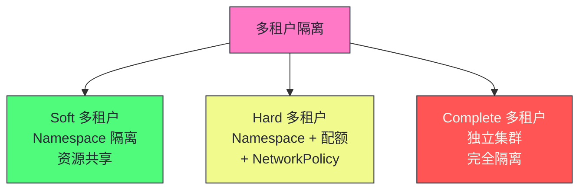

# 16 生产化集群管理：多租户隔离、资源治理与安全加固

**摘要：**
本文深入 Kubernetes 生产环境的集群管理实践——多租户隔离、资源治理和安全加固。从"理解 K8s"到"用好 K8s"的关键转变在于：生产化需要在机制之上建立治理体系——通过配额、限制、策略防止"坏行为"破坏集群稳定性，而非事后救火。多租户隔离有三个层次——Soft（Namespace 隔离，资源共享，适合内部团队）、Hard（Namespace + 资源配额 + NetworkPolicy，适合多团队/多项目）、Complete（独立集群，完全隔离，适合强隔离需求如合规）。Namespace 隔离是逻辑隔离非物理隔离——默认不隔离网络，共享节点与内核，管理边界非安全边界。资源治理的核心是 ResourceQuota（Namespace 级配额，创建时检查）、LimitRange（Pod 级资源限制，防止"坏邻居"）、PriorityClass（优先级调度与抢占）、PodDisruptionBudget（驱逐保护，只对自愿驱逐有效）。安全加固包括 RBAC 最小权限、PodSecurity Standards（Baseline/Restricted）、NetworkPolicy 网络隔离、Secret etcd 加密、审计日志。生产化集群管理的核心认知：治理体系是"防患于未然"——通过配额、限制、策略在"坏行为"发生前阻止，而非事后救火。

---

## 第 1 章 多租户隔离模型

讲生产化集群管理，第一个问题是"多租户"——多个团队或多个业务共享一个 K8s 集群时，如何隔离？K8s 的多租户隔离有三个层次，从弱到强。

### 1.1 三个隔离层次



| 层次 | 隔离方式 | 隔离强度 | 成本 | 适用场景 |
|------|---------|---------|------|---------|
| **Soft** | Namespace | 弱 | 低 | 内部团队共享 |
| **Hard** | Namespace + 配额 + NetworkPolicy | 中 | 中 | 多团队/多项目 |
| **Complete** | 独立集群 | 强 | 高 | 强隔离需求（合规） |

Soft 多租户是最弱的隔离——只用 Namespace 隔离，资源共享。不同租户的 Pod 在不同 Namespace，但共享节点资源、共享网络、共享内核。这种隔离适合"可信租户"——譬如内部团队，租户之间不会恶意攻击。Soft 多租户的成本最低——一个集群服务多个团队，资源利用率高。

Soft 多租户的一个工程考量是"资源竞争"。不同租户的 Pod 共享节点资源——一个租户的 Pod 消耗大量资源可能影响其他租户。这种"资源竞争"需要 ResourceQuota 和 LimitRange 缓解——限制每个 Namespace 的资源使用。Soft 多租户通常配合 ResourceQuota 使用——否则一个租户可能耗尽集群资源。

Hard 多租户是中等隔离——Namespace + ResourceQuota + NetworkPolicy。不同租户的 Pod 在不同 Namespace，资源配额隔离（一个租户不能耗尽集群资源），网络隔离（NetworkPolicy 限制跨 Namespace 通信）。这种隔离适合"半可信租户"——譬如多团队、多项目，租户之间需要资源隔离与网络隔离，但不需要强隔离。Hard 多租户的成本中等——一个集群服务多个团队，但需要配置配额与 NetworkPolicy。

Complete 多租户是最强隔离——独立集群。不同租户用不同集群，完全隔离——不共享节点、不共享网络、不共享内核。这种隔离适合"不可信租户"或强隔离需求——譬如多租户 SaaS、合规要求（金融、医疗）。Complete 多租户的成本最高——每个租户一个集群，资源利用率低，运维成本高。

Complete 多租户的一个工程考量是"集群管理成本"。每个集群需要独立的控制平面（API Server/Controller Manager/Scheduler/etcd）、独立的监控、独立的升级。多个集群的管理成本高——譬如 10 个租户需要 10 个集群，运维复杂。生产中用多集群管理工具（譬如 Rancher、Cluster API）降低管理成本。

Complete 多租户的另一个工程考量是"资源利用率"。每个集群有固定的控制平面开销（控制平面节点资源、etcd 存储等）。小租户的集群资源利用率低——控制平面开销占比高。生产中对于小租户，考虑用 Hard 多租户（共享集群）降低成本，对于大租户用 Complete 多租户确保隔离。

### 1.2 Namespace 隔离的局限

Namespace 提供**逻辑隔离**，不是物理隔离：

| 维度 | Namespace 隔离 | 不隔离的内容 |
|------|--------------|------------|
| **资源名** | 同 Namespace 内唯一 | 跨 Namespace 可同名 |
| **RBAC** | 可按 Namespace 授权 | - |
| **ResourceQuota** | 按 Namespace 配额 | - |
| **网络** | 默认不隔离 | Pod 间可跨 Namespace 通信 |
| **节点** | 不隔离 | 同节点可运行不同 Namespace Pod |
| **内核** | 不隔离 | 共享内核（非容器逃逸级隔离） |

Namespace 隔离的一个局限是"网络默认不隔离"。默认情况下，不同 Namespace 的 Pod 可以互相通信——Namespace 不隔离网络。如果需要网络隔离，必须配置 NetworkPolicy。这种"默认不隔离"是生产环境的常见陷阱——以为 Namespace 隔离了网络，实际没有。

Namespace 隔离的另一个局限是"共享节点与内核"。不同 Namespace 的 Pod 可能调度到同一节点——共享节点资源，共享内核。如果一个 Pod 发生容器逃逸（譬如利用内核漏洞），可能影响同节点的其他 Namespace Pod。这种"共享内核"的隔离强度有限——不是容器逃逸级隔离。

Namespace 隔离的第三个局限是"资源竞争"。不同 Namespace 的 Pod 可能调度到同一节点——共享节点资源。如果一个 Namespace 的 Pod 消耗大量资源（CPU/内存），可能影响同节点的其他 Namespace Pod。这种"资源竞争"需要 ResourceQuota 和 LimitRange 缓解——限制每个 Namespace 的资源使用，防止单个 Namespace 耗尽节点资源。

Namespace 隔离的一个工程价值是"管理边界"。Namespace 是 K8s 的管理单元——RBAC 按 Namespace 授权，ResourceQuota 按 Namespace 配额，NetworkPolicy 按 Namespace 配置。这种"管理边界"使得多团队共享集群时，每个团队有自己的 Namespace，互不干扰。但 Namespace 不是安全边界——安全隔离需要独立集群。

> [!warning] 生产避坑：Namespace 隔离不等于安全隔离
> Namespace 是逻辑隔离——不是安全边界。同集群不同 Namespace 的 Pod 默认可以互相通信（除非配置 NetworkPolicy）。同节点可能运行不同 Namespace 的 Pod（共享内核）。对于强隔离需求（如多租户 SaaS、合规要求），用独立集群而非 Namespace。Namespace 适合"可信租户"的软隔离——如内部团队。

Namespace 隔离的一个工程价值是"管理边界"。Namespace 是 K8s 的管理单元——RBAC 按 Namespace 授权，ResourceQuota 按 Namespace 配额，NetworkPolicy 按 Namespace 配置。这种"管理边界"使得多团队共享集群时，每个团队有自己的 Namespace，互不干扰。但 Namespace 不是安全边界——安全隔离需要独立集群。

---

## 第 2 章 资源治理

讲完了多租户隔离，接下来看资源治理——生产化集群管理的核心。资源治理通过配额、限制、优先级、驱逐保护，防止"坏行为"破坏集群稳定性。

### 2.1 ResourceQuota：Namespace 级配额

```yaml
apiVersion: v1
kind: ResourceQuota
metadata:
  name: team-a-quota
  namespace: team-a
spec:
  hard:
    requests.cpu: "100"
    requests.memory: "200Gi"
    limits.cpu: "200"
    limits.memory: "400Gi"
    pods: "50"
    services.loadbalancers: "2"
    persistentvolumeclaims: "20"
```

| 配额维度 | 说明 |
|---------|------|
| **CPU/内存** | requests 和 limits 的总量上限 |
| **Pod 数** | Namespace 内最大 Pod 数 |
| **Service 数** | 各类型 Service 数量上限 |
| **PVC 数** | 持久化卷声明数量上限 |
| **ConfigMap/Secret 数** | 配置和密钥数量上限 |

ResourceQuota 的一个工程细节是"创建时检查"。ResourceQuota 在 Pod 创建时检查配额——如果配额已满，新 Pod 创建被拒绝。但 ResourceQuota 不检查运行时——已有 Pod 修改 resources.requests 超过配额不会被拒绝（修改 Pod 的 resources 需要重建 Pod，所以实际不会发生）。这种"创建时检查"意味着 ResourceQuota 是"准入控制"——在 API Server 准入阶段检查，不是运行时检查。

ResourceQuota 的一个工程价值是"防止租户耗尽集群资源"。没有 ResourceQuota 的 Namespace，一个租户可能创建大量 Pod 耗尽集群资源——导致其他租户的 Pod 无法调度。ResourceQuota 限制每个 Namespace 的资源总量，确保一个租户不能耗尽集群资源。这是多租户集群的基础——每个 Namespace 配置 ResourceQuota。

ResourceQuota 的一个工程细节是"配额类型"。ResourceQuota 可以限制多种资源——CPU/内存（requests 和 limits）、Pod 数、Service 数（按类型分 ClusterIP/NodePort/LoadBalancer）、PVC 数、ConfigMap/Secret 数。生产中根据业务需求配置配额——譬如限制 LoadBalancer Service 数（成本高），限制 PVC 数（存储资源）。合理配置配额是生产集群运维的关键环节。

ResourceQuota 的一个工程陷阱是"配额过严"。如果 ResourceQuota 配额过严（譬如 Pod 数限制太低），租户的正常业务可能因配额满而无法创建 Pod。生产中需要根据业务需求合理配置配额——既防止资源耗尽，又不影响正常业务。监控 ResourceQuota 使用率，及时调整。

ResourceQuota 的一个工程细节是"作用域"。ResourceQuota 可以配置作用域（scope）——譬如只对 BestEffort Pod 计数、只对 Terminating Pod 计数。作用域使得配额更精细——譬如"BestEffort Pod 最多 10 个"，不影响 Guaranteed/Burstable Pod。这种"作用域"使得配额可以针对特定类型 Pod。

ResourceQuota 的一个工程考量是"与 LimitRange 的配合"。ResourceQuota 限制 Namespace 资源总量，LimitRange 限制单个 Pod 资源。两者配合——ResourceQuota 防止 Namespace 资源耗尽，LimitRange 防止单个 Pod 资源过大。生产中两者都配置——ResourceQuota 限制总量，LimitRange 限制个体。

ResourceQuota 的实现细节值得深入。ResourceQuota Controller 是 API Server 准入链的一部分——Pod 创建请求到达 API Server 时，准入控制器检查 Namespace 的 ResourceQuota，如果配额已满则拒绝创建。这种"准入控制"机制保证了配额的实时性——配额满时新 Pod 立即被拒绝，不会等到调度阶段才发现。ResourceQuota 还支持 PriorityClass 作用域——可以配置"只对特定优先级及以上的 Pod 计数配额"，使得高优先级 Pod 不受配额限制。这种"优先级豁免"机制在生产中很重要——系统关键 Pod（譬如 kube-system 中的监控、日志 Agent）不应该因为 Namespace 配额满而无法创建。ResourceQuota 的一个工程细节是"配额计算"——配额按 Namespace 累计，多个 Pod 共享同一配额，配额使用率需要监控告警。

### 2.2 LimitRange：Pod 级资源限制

```yaml
apiVersion: v1
kind: LimitRange
metadata:
  name: default-limits
  namespace: team-a
spec:
  limits:
    - type: Container
      default:          # 默认 limits（未设置时注入）
        cpu: 500m
        memory: 512Mi
      defaultRequest:   # 默认 requests
        cpu: 100m
        memory: 128Mi
      max:              # 最大 limits
        cpu: 4
        memory: 8Gi
      min:              # 最小 requests
        cpu: 50m
        memory: 64Mi
```

LimitRange 的一个工程价值是"为无限制 Pod 注入默认值"。如果 Pod 没有设置 resources.limits，LimitRange 的 default 字段会注入默认 limits——避免 Pod 无限制消耗资源。这种"默认注入"使得即使开发者忘记设置资源限制，Pod 也有合理限制——防止"坏邻居"。

LimitRange 的另一个工程价值是"限制最大/最小值"。LimitRange 的 max 字段限制 Pod 的最大 limits——防止某个 Pod 设置过大的 limits（譬如 100 核 CPU）耗尽节点资源。min 字段限制 Pod 的最小 requests——防止某个 Pod 设置过小的 requests（譬如 1m CPU）导致调度不准。这种"范围限制"确保 Pod 的资源配置在合理范围内。

> [!info] 核心概念：没有资源限制的集群终将崩溃
> 如果 Pod 不设置 resources.limits，一个 Pod 可能消耗整个节点的资源——导致同节点其他 Pod 被驱逐或 OOMKilled。LimitRange 为没有显式设置限制的 Pod 注入默认值，并限制最大/最小值。生产环境必须配置 LimitRange——这是防止"坏邻居"破坏集群稳定性的基础。没有资源治理的集群不是生产就绪的。

LimitRange 的一个工程细节是"作用于 Container 不是 Pod"。LimitRange 的 type: Container 是对每个容器限制——不是对整个 Pod。如果一个 Pod 有多个容器，每个容器都受 LimitRange 限制。这种"容器级限制"更精细——每个容器独立限制，避免某个容器消耗整个 Pod 的资源。

LimitRange 的一个工程考量是"default 与 defaultRequest 的关系"。default 是默认 limits，defaultRequest 是默认 requests。如果 Pod 只设置 limits 没设置 requests，K8s 默认 requests=limits。如果 Pod 都没设置，LimitRange 注入 default 和 defaultRequest。生产中需要合理设置 default 和 defaultRequest——defaultRequest 通常小于 default（譬如 100m CPU request, 500m CPU limit），允许 Pod 弹性使用资源。

LimitRange 的一个工程陷阱是"max 限制过严"。如果 LimitRange 的 max 限制过严（譬如 max CPU=1），需要更多资源的 Pod（譬如 4 核 CPU）无法创建——超过 max 被拒绝。生产中根据业务需求合理设置 max——既防止过大 Pod，又允许业务所需资源。

LimitRange 的实现机制值得深入。LimitRange 由 API Server 的准入控制器执行——Pod 创建请求到达 API Server 时，准入控制器检查 LimitRange，为无资源限制的容器注入 default/defaultRequest，检查 resources 是否在 max/min 范围内。这种"准入控制"机制保证了 LimitRange 的实时性——Pod 创建时立即注入默认值或拒绝超限 Pod。LimitRange 支持多种 type——Container（容器级限制）、Pod（Pod 级限制，所有容器资源总和）、PersistentVolumeClaim（PVC 大小限制）。生产中最常用 Container 类型——为每个容器注入默认值与限制范围。LimitRange 与 ResourceQuota 配合——LimitRange 保证每个 Pod 有资源限制（注入默认值），ResourceQuota 保证 Namespace 资源总量不超限。两者配合实现了"个体限制与总量限制"的双重保障。

### 2.3 PriorityClass：优先级调度

```yaml
apiVersion: scheduling.k8s.io/v1
kind: PriorityClass
metadata:
  name: production
value: 1000
globalDefault: false
description: "生产环境 Pod"
```

PriorityClass 的一个工程价值是"关键服务优先调度"。PriorityClass 给 Pod 分配优先级——高优先级 Pod 优先调度，低优先级 Pod 后调度。当集群资源不足时，高优先级 Pod 可以抢占低优先级 Pod——驱逐低优先级 Pod 释放资源给高优先级 Pod。这种"优先级调度"确保关键服务（譬如生产服务）优先获得资源，非关键服务（譬如批处理任务）让步。

PriorityClass 的一个工程细节是"优先级值"。PriorityClass 的 value 是优先级数值——数值越大优先级越高。K8s 内置两个 PriorityClass——system-cluster-critical（值 2000000000，系统关键 Pod）和 system-node-critical（值 2000001000，节点关键 Pod）。用户自定义 PriorityClass 的值通常小于这些内置值——避免与系统 Pod 冲突。生产中关键业务用高值（譬如 1000000），普通业务用低值（譬如 100）。

PriorityClass 的一个工程细节是"抢占策略"。抢占时，调度器选择低优先级 Pod 驱逐——但会尽量减少驱逐（选择最少 Pod 驱逐）。被驱逐的 Pod 有优雅终止期（默认 30 秒）——可以处理完已有请求再退出。这种"优雅抢占"减少了抢占对低优先级服务的影响。

PriorityClass 的一个工程细节是"globalDefault"。PriorityClass 可以设置 globalDefault: true——作为没有显式指定 PriorityClass 的 Pod 的默认优先级。但一个集群只能有一个 globalDefault PriorityClass——如果多个 PriorityClass 设置 globalDefault: true，只有最后一个生效。生产中通常不设置 globalDefault——显式为每个 Pod 指定 PriorityClass，避免默认优先级导致意外抢占。

PriorityClass 的抢占机制值得深入。抢占由调度器触发——当高优先级 Pod 因资源不足无法调度时，调度器查找节点上低优先级 Pod，驱逐它们释放资源。抢占的决策考虑多个因素——优先级（只驱逐比新 Pod 优先级低的 Pod）、Pod 反亲和性（不驱逐有 podAntiAffinity 约束的 Pod）、PDB（不驱逐超过 PDB 限制的 Pod）。被驱逐的 Pod 进入 `nominatedNodeName` 状态——调度器先"提名"节点，等待低优先级 Pod 终止后再调度高优先级 Pod。抢占的一个陷阱是"优先级反转"——低优先级 Pod 持有资源（譬如 PV），高优先级 Pod 无法抢占（PV 不能强制释放），导致高优先级 Pod 反而等待低优先级 Pod。生产中需要避免关键资源被低优先级 Pod 独占，这是抢占机制的核心边界。

### 2.4 PodDisruptionBudget：驱逐保护

```yaml
apiVersion: policy/v1
kind: PodDisruptionBudget
metadata:
  name: web-pdb
spec:
  minAvailable: 2  # 或 maxUnavailable: 1
  selector:
    matchLabels:
      app: web
```

| 参数 | 说明 |
|------|------|
| **minAvailable** | 至少保持多少 Pod 可用 |
| **maxUnavailable** | 最多允许多少 Pod 不可用 |

PDB 的一个工程价值是"维护时保证最小可用副本"。节点 drain（维护）时，kubelet 逐个驱逐 Pod——PDB 确保不驱逐太多 Pod。譬如 minAvailable=2，drain 时如果只剩 2 个 Pod，PDB 阻止继续驱逐——确保至少 2 个 Pod 可用。这种"驱逐保护"使得维护时服务不中断。

> [!warning] 生产避坑：PDB 只对自愿驱逐有效
> PDB 保护 Pod 不被自愿驱逐（kubectl drain、cluster autoscaler）过度驱逐——但非自愿驱逐（节点故障）不受 PDB 限制。节点故障时所有 Pod 丢失，PDB 无法阻止。PDB 的价值在于"维护时保证最小可用副本"——节点 drain 时 PDB 确保不驱逐太多 Pod。

PDB 的一个工程陷阱是"PDB 阻止 drain"。如果 PDB 配置过严（譬如 minAvailable=3 但只有 3 个 Pod），drain 时 PDB 阻止任何驱逐——drain 卡住。生产中需要合理配置 PDB——既保证最小可用，又不阻止维护。如果 drain 卡住，可以用 `kubectl drain --disable-eviction` 强制（但会违反 PDB）。

PDB 的一个工程细节是"minAvailable 与 maxUnavailable 二选一"。PDB 只能配置 minAvailable 或 maxUnavailable 中的一个——不能同时配置。minAvailable 是绝对数（譬如 2）或百分比（譬如 50%），maxUnavailable 同理。两者等价——minAvailable=2 等于 maxUnavailable=总副本数-2。

PDB 的一个工程考量是"与滚动更新的关系"。Deployment 的滚动更新也受 PDB 限制——滚动更新时旧 Pod 终止前，PDB 确保最小可用副本。如果 PDB 配置过严（譬如 minAvailable=总副本数），滚动更新无法进行——任何 Pod 终止都违反 PDB。生产中需要平衡 PDB 与滚动更新——既保证最小可用，又允许滚动更新。

PDB 的一个工程陷阱是"PDB 与 HPA 冲突"。如果 HPA（Horizontal Pod Autoscaler）缩容到低于 PDB 的 minAvailable，HPA 缩容被 PDB 阻止——Pod 无法终止。这种"PDB 阻止 HPA 缩容"可能导致 HPA 失效。生产中需要协调 PDB 与 HPA——确保 HPA 的最小副本数不低于 PDB 的 minAvailable。

PDB 的实现机制值得深入。PDB 由 API Server 的 Eviction 子资源处理——`kubectl drain` 调用 Pod 的 `/eviction` 子资源请求驱逐，API Server 检查 PDB 是否允许驱逐。如果驱逐会导致可用 Pod 低于 minAvailable，API Server 拒绝驱逐请求（返回 429 Too Many Requests），drain 会重试等待。这种"Eviction 子资源"机制区分了"自愿驱逐"（通过 eviction API，受 PDB 限制）与"非自愿驱逐"（节点故障直接删除 Pod，不受 PDB 限制）。PDB 的一个工程细节是"selector 匹配"——PDB 通过 selector 选择保护的 Pod，如果多个 PDB 匹配同一 Pod，驱逐检查所有匹配的 PDB，任何一个 PDB 不允许则驱逐被拒绝。生产中避免多个 PDB 匹配同一 Pod，简化排查，这是 PDB 使用的基本原则。

---

## 第 3 章 安全加固

讲完了资源治理，接下来看安全加固——生产化集群管理的另一核心。安全加固通过 Pod Security、RBAC、ServiceAccount、Secret 加密、审计日志、网络隔离、镜像安全、API Server 加固，防止安全风险。

### 3.1 安全加固清单

| 维度 | 推荐措施 | 说明 |
|------|---------|------|
| **Pod Security** | Restricted 级别 | 禁止特权、non-root、readOnly FS |
| **RBAC** | 最小权限 | 避免 cluster-admin，按 Namespace 授权 |
| **ServiceAccount** | 每应用独立 | 不共享 default SA |
| **NetworkPolicy** | 默认拒绝 | 限制 Pod 间通信 |
| **Secret 加密** | etcd 加密 | API Server 加密 Secret 数据 |
| **审计日志** | Metadata 级别 | 记录关键操作 |
| **镜像安全** | 扫描 + 签名 | 禁止 latest 标签 |
| **API Server** | 关闭匿名访问 | 禁用不安全端口 |

### 3.2 Pod Security Standards

```yaml
apiVersion: v1
kind: Namespace
metadata:
  name: production
  labels:
    # Pod Security Standards
    pod-security.kubernetes.io/enforce: restricted
    pod-security.kubernetes.io/audit: restricted
    pod-security.kubernetes.io/warn: restricted
```

Pod Security Standards 的三个级别——Privileged（不限制，特权 Pod）、Baseline（基本限制，防止已知提权）、Restricted（严格限制，生产推荐）。生产环境用 Restricted——禁止特权容器、禁止 root 用户、只读根文件系统、禁止 host 网络/PID/IPC。

Pod Security Standards 的一个工程细节是"三种模式"。enforce 模式——违反策略的 Pod 被拒绝创建。audit 模式——违反策略的 Pod 被创建但记录审计日志。warn 模式——违反策略的 Pod 被创建但返回警告。生产中通常 enforce + audit + warn 都配置为 restricted——强制限制 + 审计记录 + 警告提示。

Pod Security Standards 的一个工程价值是"替代旧 PSP"。K8s 1.21 之前的 Pod Security Policy（PSP）已废弃——Pod Security Standards 替代 PSP。PSP 是集群级资源，配置复杂；Pod Security Standards 是 Namespace label，配置简单。这种"简化"使得 Pod 安全策略更容易管理。

Pod Security Standards 的实现值得深入。Pod Security Standards 由 API Server 的 PodSecurity 准入控制器实现——当 Pod 创建请求到达 API Server 时，准入控制器检查 Namespace 的 `pod-security.kubernetes.io/enforce` label，根据 label 值（privileged/baseline/restricted）验证 Pod 的安全配置。Restricted 级别要求——`runAsNonRoot: true`、`runAsUser` 非 0、`readOnlyRootFilesystem: true`、不允许 `privileged: true`、不允许 `hostNetwork/hostPID/hostIPC`、不允许 `hostPath` 卷、`allowPrivilegeEscalation: false`。这些限制确保 Pod 以最小权限运行，减少攻击面。生产中通常对业务 Namespace 配置 restricted，对系统 Namespace（kube-system）配置 privileged（系统 Pod 需要特权）。

Pod Security Standards 的一个工程细节是"Restricted 的限制"。Restricted 级别禁止——特权容器、root 用户、host 网络/PID/IPC、不安全 sysctl、capabilities 添加（除了 NET_BIND_SERVICE）。这些限制确保了 Pod 最小权限——即使 Pod 被攻破，攻击者无法提权。生产中关键 Namespace 用 Restricted，系统 Namespace（譬如 kube-system）用 Privileged（系统组件需要特权）。

Pod Security Standards 的一个工程考量是"系统组件的特权需求"。某些系统组件（譬如 CNI 插件、存储插件、监控 Agent）需要特权——譬如 host 网络、特权容器。这些组件不能受 Restricted 限制。生产中将系统组件放在单独 Namespace（譬如 kube-system、tigera-operator），用 Privileged 级别；业务 Namespace 用 Restricted 级别。这种"分级策略"既保证了业务安全，又允许系统组件运行。

### 3.3 RBAC 与 ServiceAccount

RBAC 的一个工程原则是"最小权限"。避免使用 cluster-admin——它有集群所有权限，过于危险。按 Namespace 授权——用户只有所需 Namespace 的权限。譬如开发团队只有 dev Namespace 的权限，没有 prod Namespace 的权限。这种"最小权限"减少了误操作与安全风险。

RBAC 的一个工程细节是"Role 与 ClusterRole"。Role 是 Namespace 级权限——只对特定 Namespace 的资源授权。ClusterRole 是集群级权限——对所有 Namespace 的资源授权（譬如 nodes、persistentvolumes 等集群级资源）。生产中优先用 Role（Namespace 级），避免 ClusterRole（集群级）——除非确实需要集群级权限。

RBAC 的一个工程陷阱是"过度授权"。譬如给用户 get/list/watch 的权限——但如果用户只需要 get，不需要 list/watch，过度授权增加了安全风险。生产中精确授权——只授予所需的最小权限，避免过度授权。

ServiceAccount 的一个工程原则是"每应用独立"。不共享 default ServiceAccount——default SA 通常有过宽权限（譬如某些集群默认给 default SA 配置了权限）。每个应用创建独立 SA，只授予所需权限。这种"独立 SA"使得权限隔离更精细——一个应用的 SA 被攻破，不影响其他应用。

ServiceAccount 的一个工程细节是"automountServiceAccountToken"。默认情况下，Pod 自动挂载 SA 的 token 到 /var/run/secrets/kubernetes.io/serviceaccount/——Pod 内进程可以用这个 token 访问 API Server。如果 Pod 不需要访问 API Server（譬如纯计算 Pod），设置 automountServiceAccountToken: false——不挂载 token，减少攻击面。

RBAC 的授权检查实现值得深入。API Server 收到请求时，经过认证（识别用户身份）后进入授权阶段。授权控制器检查用户（或 SA）是否有权限对指定资源执行指定操作。授权检查遍历所有 RoleBinding/ClusterRoleBinding——找到绑定到该用户/SA 的 Role/ClusterRole，检查 Role 的 rules 是否包含所需权限。如果没有任何 Role 授权该操作，请求被拒绝（403 Forbidden）。这种"遍历检查"的复杂度随绑定数增长——大规模集群的 RBAC 检查可能成为 API Server 性能瓶颈。生产中定期审计 RBAC 绑定，清理无用绑定，避免授权检查开销过大。K8s 1.20+ 引入了 RBAC 聚合规则——ClusterRole 可以通过 aggregationRule 自动聚合匹配 label 的 ClusterRole，简化权限管理。

### 3.4 Secret 加密与审计日志

Secret 加密的一个工程价值是"防止 etcd 数据泄露"。默认情况下，Secret 以 base64 编码存储在 etcd——base64 不是加密，是编码，可以解码。如果 etcd 被攻击者访问，Secret 明文泄露。API Server 加密 Secret 数据——用 KMS（Key Management Service）或静态密钥加密 Secret，etcd 中存储密文。即使 etcd 被访问，Secret 不泄露。

Secret 加密的一个工程细节是"KMS 与静态密钥"。静态密钥是 API Server 配置的加密密钥——简单但密钥管理困难（密钥轮换需要重启 API Server）。KMS 是外部密钥管理服务（譬如 AWS KMS、HashiCorp Vault）——密钥管理灵活（轮换不需要重启），但依赖外部服务。生产中关键 Secret 用 KMS 加密，普通 Secret 用静态密钥。

Secret 加密的一个工程考量是"性能影响"。加密/解密有 CPU 开销——每次读写 Secret 都需要加密/解密。对于频繁读写 Secret 的场景（譬如每秒读写数百个 Secret），加密开销可能显著。生产中通常只加密敏感 Secret（譬如数据库密码、API Key），不加密非敏感配置。

审计日志的一个工程价值是"记录关键操作"。审计日志记录 API Server 的所有操作——谁在什么时候做了什么。生产中通常配置 Metadata 级别审计——记录请求的元数据（用户、时间、资源、操作），不记录请求体（避免敏感数据泄露）。审计日志是安全事件追溯的基础——发生安全事件时，通过审计日志定位。

审计日志的一个工程细节是"审计策略"。审计策略定义"记录什么操作"——譬如"记录所有写操作"、"记录所有 Secret 访问"、"记录所有 RBAC 变更"。审计策略是可配置的——根据安全需求定义。生产中至少记录写操作和敏感资源访问，确保安全事件可追溯。

### 3.5 NetworkPolicy 默认拒绝

```yaml
apiVersion: networking.k8s.io/v1
kind: NetworkPolicy
metadata:
  name: default-deny
  namespace: production
spec:
  podSelector: {}
  policyTypes:
    - Ingress
    - Egress
  # 默认拒绝所有入站和出站，按需放行
```

NetworkPolicy 默认拒绝的一个工程价值是"默认安全"。默认拒绝所有入站和出站流量——除非显式放行。这种"默认拒绝"策略确保了最小攻击面——只有显式允许的流量通过。生产中建议每个 Namespace 配置 default-deny NetworkPolicy，然后按需放行。

NetworkPolicy 默认拒绝的一个工程细节是"按需放行"。默认拒绝后，需要显式放行所需流量——譬如前端 Pod 访问后端 Pod、后端 Pod 访问数据库。每个放行规则是一个 NetworkPolicy——譬如"允许 frontend Namespace 的 Pod 访问 backend Namespace 的 Pod 的 8080 端口"。这种"按需放行"使得网络策略精细——每个连接都有明确规则。

NetworkPolicy 的实现值得深入。NetworkPolicy 由 CNI 插件执行——K8s 只定义 NetworkPolicy 的 API 与语义，CNI 插件负责在数据面执行。Calico 用 iptables 规则实现 NetworkPolicy——每条规则转换为 iptables 规则，匹配源 Pod、目标 Pod、端口。Cilium 用 eBPF 程序实现——Policy map 存储规则，eBPF 程序查 map 做决策。NetworkPolicy 的一个工程陷阱是"策略冲突"——多个 NetworkPolicy 匹配同一 Pod 时，取并集（允许的流量取并集，拒绝的流量取交集）。生产中需要仔细规划策略，避免意外放行。NetworkPolicy 还支持 namespaceSelector——可以按 Namespace label 选择源/目标 Pod，实现跨 Namespace 的网络隔离，这是多租户网络隔离的核心机制。

镜像安全的一个工程细节是"禁止 latest 标签"。latest 标签指向最新镜像——但不稳定，每次 pull 可能得到不同镜像。生产中禁止 latest 标签——用具体版本标签（譬如 v1.2.3），确保镜像可重现。如果用 latest，部署时 pull 的镜像可能变化——导致不可预期的行为。这种"禁止 latest"是镜像安全的基础。

API Server 加固的一个工程价值是"减少攻击面"。API Server 是 K8s 的控制入口——攻击者通过 API Server 控制集群。关闭匿名访问（必须认证）、禁用不安全端口（8080）、TLS 加密通信——这些加固措施减少了 API Server 的攻击面。生产中 API Server 只暴露给可信网络（譬如内网），不暴露到公网。

---

## 第 4 章 容量规划

讲完了安全加固，接下来看容量规划——生产化集群管理的另一个核心。容量规划确保集群有足够资源支撑业务，且有冗余应对故障与突发流量。

### 4.1 资源规划方法

```
业务需求 → 应用资源需求 → Pod 数量 → 节点资源 → 节点数
```

| 步骤 | 计算 |
|------|------|
| **应用资源** | CPU/内存 requests |
| **Pod 数量** | 副本数 × 应用数 |
| **总资源需求** | Pod 数 × 单 Pod requests |
| **节点资源** | 单节点可用资源（减去系统开销） |
| **节点数** | 总资源 / 节点资源 + 冗余 |

容量规划的一个工程细节是"系统开销"。节点的可用资源不是全部资源——需要减去系统开销（kubelet、kube-proxy、容器运行时、操作系统等）。譬如一个 8 核 16GB 的节点，系统开销可能 1 核 1GB，可用资源 7 核 15GB。容量规划时用可用资源，不是全部资源。

容量规划的一个工程考量是"eviction-hard 阈值"。kubelet 的 eviction-hard 配置（譬如 memory.available<100Mi）——当节点可用资源低于阈值时，kubelet 开始驱逐 Pod。这意味着节点有一部分资源是"保留"的——不可用于 Pod 调度。容量规划时需要考虑 eviction-hard 保留的资源——可用资源 = 节点资源 - 系统开销 - eviction 保留。

容量规划的一个工程细节是"节点资源碎片"。即使节点总资源足够，资源碎片可能导致 Pod 无法调度——譬如节点有 4 核 CPU 空闲，但分散在 4 个 1 核的碎片中，一个需要 4 核的 Pod 无法调度。这种"资源碎片"在大集群中常见——生产中用节点自动扩缩（cluster autoscaler）或 Pod 重新调度（descheduler）缓解碎片问题。

容量规划的另一个工程细节是"requests 与 limits 的差异"。容量规划基于 requests——requests 是调度依据，决定 Pod 调度到哪个节点。limits 是运行时限制，决定 Pod 最多用多少资源。容量规划用 requests 计算节点数——确保节点有足够 requests 容量。但 limits 可能超过 requests——如果所有 Pod 都用满 limits，节点资源可能不足。生产中需要监控实际资源使用，及时扩容。

容量规划的一个工程考量是"节点规格选择"。节点规格影响资源利用率——大节点（譬如 64 核 256GB）适合大 Pod，资源利用率高；小节点（譬如 4 核 8GB）适合小 Pod，故障爆炸半径小。生产中根据 Pod 规格选择节点规格——大 Pod 用大节点，小 Pod 用小节点。混合规格的集群（大小节点都有）更灵活——不同规格 Pod 调度到合适节点。

容量规划的另一个工程考量是"集群规模与可用区"。大集群跨多个可用区——一个可用区故障时，其他可用区的 Pod 继续服务。但跨可用区的网络延迟更高——同可用区通信延迟低，跨可用区延迟高。生产中根据业务延迟需求选择可用区数量——延迟敏感的业务用同可用区部署，高可用敏感的业务用跨可用区部署。

### 4.2 冗余规划

| 冗余类型 | 建议值 | 说明 |
|---------|--------|------|
| **节点冗余** | N+1 或 N+2 | 容忍 1-2 节点故障 |
| **资源缓冲** | 20-30% | 应对突发流量 |
| **IP 预留** | Pod CIDR 充足 | 避免 IP 耗尽 |

冗余规划的一个工程价值是"容忍故障"。N+1 冗余意味着 1 个节点故障时，其他节点有足够资源承载故障节点的 Pod。如果没有冗余，1 个节点故障可能导致 Pod 无法调度——服务中断。生产中至少 N+1 冗余，关键业务 N+2。

冗余规划的另一个工程价值是"应对突发流量"。资源缓冲 20-30% 意味着集群有 20-30% 的空闲资源——突发流量时 Pod 可以扩容使用空闲资源。如果没有缓冲，突发流量时 Pod 扩容失败——资源不足。生产中保留 20-30% 资源缓冲。

冗余规划的一个工程考量是"成本与可用性的平衡"。冗余越多，可用性越高，但成本越高。N+1 冗余的成本比 N+2 低——少一个冗余节点的资源成本。生产中根据业务可用性需求选择冗余——关键业务 N+2，普通业务 N+1。这种"按需冗余"平衡了成本与可用性。

冗余规划的另一个工程考量是"IP 预留"。Pod CIDR 需要充足——每个 Pod 一个 IP，IP 不够时 Pod 无法创建。大规模集群的 Pod 数可能数万，Pod CIDR 需要足够大（譬如 /16 覆盖 65536 个 IP）。生产中预留充足 IP，监控 IP 使用率，避免 IP 耗尽。

### 4.3 QoS 等级与驱逐

K8s 的 QoS（Quality of Service）有三个等级——Guaranteed（requests=limits，最高优先级）、Burstable（requests<limits，中等优先级）、BestEffort（无 requests/limits，最低优先级）。节点资源不足时，kubelet 按 QoS 等级驱逐——先驱逐 BestEffort，再驱逐 Burstable，最后驱逐 Guaranteed。

QoS 等级的一个工程价值是"关键服务保护"。关键服务配置 Guaranteed QoS——requests=limits，确保 Pod 有稳定资源，不会被驱逐。非关键服务配置 BestEffort——无 requests/limits，资源不足时先被驱逐。这种"QoS 分级"使得关键服务在资源压力时优先存活。

QoS 等级的一个工程考量是"内存不可压缩"。CPU 是可压缩资源——CPU 不足时 Pod 被限流（throttle），不被驱逐。内存是不可压缩资源——内存不足时 Pod 被 OOMKilled 或驱逐。QoS 等级主要影响内存驱逐——内存不足时按 QoS 等级驱逐。生产中关键服务设置 Guaranteed QoS 确保内存稳定。

QoS 等级的一个工程细节是"Guaranteed 的条件"。Pod 要达到 Guaranteed QoS，必须满足——所有容器都设置 requests 和 limits，且 requests=limits（CPU 和内存都满足）。如果只有一个容器不满足，整个 Pod 不是 Guaranteed。生产中关键服务所有容器都设置 requests=limits，确保 Guaranteed。

QoS 等级的 OOM 分数机制值得深入。kubelet 为每个 Pod 计算 OOM 分数（oom_score_adj）——Guaranteed 是 -997（最低，最不容易被 OOM），Burstable 是 1000 - (1000*requests/memory)，BestEffort 是 1000（最高，最容易被 OOM）。OOM 分数越低，内核越不容易选择该 Pod 做 OOM Kill。这种"分数机制"使得资源不足时 Guaranteed Pod 优先存活，BestEffort Pod 优先被杀。生产中关键服务用 Guaranteed 确保不被 OOM Kill，非关键服务用 BestEffort 接受被杀风险。注意 OOM 分数只影响内存不足时的驱逐——CPU 不足时 Pod 被限流（throttle），不被驱逐，这是 CPU 可压缩特性的体现。

QoS 等级的一个工程考量是"Burstable 的灵活性"。Burstable（requests<limits）允许 Pod 在空闲时使用更多资源（最多到 limits），在资源压力时回落到 requests。这种"弹性资源"适合流量波动大的服务——高峰时用更多资源，低峰时用更少。但 Burstable 的 Pod 在资源压力时可能被驱逐（在 BestEffort 之后，Guaranteed 之前）。生产中关键服务用 Guaranteed，普通服务用 Burstable。

### 4.4 节点亲和性与反亲和性

节点亲和性（nodeAffinity）控制 Pod 调度到哪些节点——譬如"只调度到 SSD 节点"、"优先调度到同可用区节点"。反亲和性（antiAffinity）控制 Pod 不调度到哪些节点——譬如"不调度到已有同服务 Pod 的节点"。

节点亲和性的一个工程价值是"Pod 分布策略"。譬如一个服务有 3 个副本，用 podAntiAffinity 要求 3 个副本调度到不同节点——避免单节点故障导致所有副本丢失。这种"反亲和性分散"是高可用部署的基础——跨节点分布，容忍节点故障。

节点亲和性的一个工程考量是"拓扑约束"。跨可用区部署（topologySpreadConstraints）确保 Pod 均匀分布在多个可用区——一个可用区故障时，其他可用区的 Pod 继续服务。这种"跨可用区分布"是高可用生产集群的基础——容忍可用区故障。

---

## 第 5 章 集群升级策略

讲完了容量规划，最后看集群升级——生产化集群管理的运维核心。集群升级确保集群跟上 K8s 版本演进，获得新功能与安全修复。

### 5.1 滚动升级

K8s 版本升级遵循"一次升级一个小版本"原则——1.28 → 1.29 → 1.30，不跳版本。

| 步骤 | 操作 |
|------|------|
| **1. 预检查** | 检查 API 废弃、依赖兼容性 |
| **2. 升级 etcd** | 先升级 etcd（如有需要） |
| **3. 升级控制平面** | 逐个升级 master 节点 |
| **4. 升级 kubelet** | 逐个升级 worker 节点 |
| **5. 验证** | 检查所有组件正常运行 |

滚动升级的一个工程细节是"升级顺序"。升级顺序是 etcd → 控制平面 → kubelet——先升级 etcd（数据存储），再升级控制平面（API Server/Controller Manager/Scheduler），最后升级 kubelet（节点代理）。这种"从中心到边缘"的顺序确保了兼容性——etcd 兼容新控制平面，新控制平面兼容旧 kubelet（版本偏差策略允许）。

滚动升级的一个工程细节是"控制平面升级"。控制平面升级是逐个升级 master 节点——多个 master 节点时，逐个升级，确保控制平面高可用。升级一个 master 节点时，其他 master 节点继续服务——API Server 通过负载均衡实现高可用，etcd 通过 Raft 实现高可用。这种"逐个升级"使得控制平面升级期间不中断。

滚动升级的另一个工程细节是"kubelet 升级"。kubelet 升级是逐个升级 worker 节点——drain 节点（驱逐 Pod）、升级 kubelet、uncordon 节点（恢复调度）。逐个升级确保了 worker 节点升级期间服务不中断（如果有足够冗余）。但 drain 会导致 Pod 重新调度——如果其他节点资源不足，Pod 可能 Pending。

滚动升级的一个工程价值是"零停机"。逐个升级节点——升级一个节点时，其他节点继续服务。Pod 被驱逐到其他节点，升级节点后重新调度。这种"滚动升级"使得升级期间服务不中断（如果有足够冗余）。

滚动升级的一个工程考量是"Pod 重新调度"。升级节点前，drain 该节点——驱逐所有 Pod。这些 Pod 重新调度到其他节点——如果其他节点资源不足，Pod 可能 Pending。生产中升级前确保有足够冗余——升级期间集群有足够资源承载重新调度的 Pod。

滚动升级的另一个工程考量是"升级时间"。大集群的滚动升级时间长——逐个升级节点，每个节点 drain + 升级 + uncordon，可能 10-30 分钟。100 个节点的集群，滚动升级可能需要数小时。生产中在低峰期升级，减少影响。

滚动升级的 drain 机制值得深入。`kubectl drain <node>` 命令驱逐节点上的所有 Pod——它先标记节点为 `Unschedulable`（cordon），然后逐个删除 Pod（Pod 重新调度到其他节点）。drain 尊重 PDB——如果 Pod 有 PDB 保护，drain 会等待 PDB 允许驱逐（譬如 minAvailable=2，当前 3 个 Pod，drain 会驱逐 1 个，等待新 Pod ready 后再驱逐下一个）。如果 PDB 阻止驱逐（譬如 minAvailable=3，当前 3 个 Pod），drain 会卡住——需要用 `--ignore-daemonsets` 忽略 DaemonSet Pod，或用 `--delete-emptydir-data` 删除 emptyDir Pod。生产中 drain 前检查 PDB，避免卡住，这是节点维护的关键步骤。

### 5.2 版本兼容性

K8s 的版本偏差策略：

| 组件 | 允许偏差 |
|------|---------|
| **kube-apiserver** | 最高版本 |
| **kube-controller-manager/scheduler** | 最多低 1 个小版本 |
| **kubelet** | 最多低 3 个小版本 |
| **kubectl** | 最多高/低 1 个小版本 |

版本偏差策略的一个工程价值是"允许滚动升级"。kubelet 最多低 3 个小版本——这意味着可以先升级 API Server 到 1.30，kubelet 保持 1.27。这种"偏差允许"使得滚动升级可行——不需要所有组件同时升级。如果没有偏差策略，升级时所有组件必须同时升级——无法滚动升级。

版本偏差策略的一个工程考量是"偏差过大风险"。虽然 kubelet 最多低 3 个小版本，但偏差过大可能有兼容性问题——新 API Server 的某些功能旧 kubelet 不支持。生产中尽量减小偏差——升级 API Server 后尽快升级 kubelet，避免长期偏差。

版本偏差策略的一个工程细节是"kube-apiserver 与 kubelet 的偏差"。kube-apiserver 是控制平面的核心——它定义了 API 版本。kubelet 是节点代理——它调用 API Server 的 API。kubelet 最多低 3 个小版本——这意味着 kubelet 可以用旧版本 API 调用新版本 API Server（API Server 向后兼容 3 个小版本的 kubelet）。这种"向后兼容"使得滚动升级可行——先升级 API Server，kubelet 逐步升级。

版本偏差策略的另一个工程细节是"kube-apiserver 与 kube-controller-manager/scheduler 的偏差"。kube-controller-manager 和 kube-scheduler 最多低 1 个小版本——它们与 kube-apiserver 紧密耦合，偏差过大可能导致功能异常。生产中控制平面组件（API Server/Controller Manager/Scheduler）一起升级——避免偏差。

> [!warning] 生产避坑：升级前检查 API 废弃
> 每个 K8s 版本会废弃一些旧 API（如 v1.22 废弃了 batch/v1beta1 CronJob）。升级前用 `kubectl get --raw /apis` 检查是否有客户端使用即将移除的 API。生产环境升级前在测试环境验证——特别是有自定义 Controller/Operator 的场景，它们可能使用旧 API。

### 5.3 回滚方案与蓝绿升级

升级的一个工程考量是"回滚方案"。升级可能失败——新版本有 bug、API 不兼容、配置错误。升级前备份 etcd——升级失败时回滚 etcd 到升级前状态。但 etcd 回滚是"时间旅行"——回滚后所有升级后的变更丢失。生产中谨慎回滚，优先修复问题而非回滚。

升级的一个工程细节是"etcd 备份"。etcd 备份是回滚的基础——升级前用 `etcdctl snapshot save` 备份 etcd。备份包含集群所有状态——Pod、Service、ConfigMap、Secret 等。升级失败时用 `etcdctl snapshot restore` 恢复 etcd——集群回到升级前状态。但 etcd 回滚是"时间旅行"——回滚后升级后的所有变更丢失（包括用户新建的 Pod、配置变更等）。生产中谨慎回滚，优先修复问题。

升级的另一个工程考量是"回滚的局限性"。etcd 回滚只能回滚 etcd 数据——不能回滚 K8s 组件版本（kubelet、kube-apiserver 等）。如果升级了 kubelet 版本，回滚 etcd 后 kubelet 仍是新版本——可能不兼容。生产中回滚需要同时回滚 etcd 和组件版本——复杂且风险高。这是为什么优先修复问题而非回滚。

升级的另一个方案是"蓝绿集群升级"。新建一个新版本集群（绿），逐步迁移工作负载从旧集群（蓝）到新集群。新集群验证通过后，删除旧集群。这种"蓝绿升级"零停机、风险低——但成本高（两个集群同时运行）。生产中关键业务用蓝绿升级，普通业务用滚动升级。

蓝绿升级的一个工程价值是"零停机与快速回滚"。蓝绿升级期间两个集群同时运行——新集群有问题时，流量切回旧集群，快速回滚。这种"快速回滚"比 etcd 回滚更安全——不需要"时间旅行"，只需切换流量。但蓝绿升级的成本高——两个集群的资源成本。

蓝绿升级的一个工程考量是"流量切换"。蓝绿升级通过流量切换实现——DNS 切换、Service 切换、Ingress 切换。流量切换需要平滑——逐步将流量从旧集群切到新集群，监控新集群健康。如果新集群有问题，快速切回旧集群。这种"渐进流量切换"减少了升级风险。

蓝绿升级的另一个工程考量是"数据迁移"。如果应用有状态（譬如数据库），蓝绿升级需要迁移数据——从旧集群的数据库迁移到新集群的数据库。数据迁移可能复杂——需要停机迁移或双写迁移。生产中无状态应用用蓝绿升级简单，有状态应用的数据迁移是难点。

蓝绿升级的数据迁移策略值得深入。无状态应用（譬如 Web 服务）的蓝绿升级最简单——新集群部署相同应用，流量切换即可。有状态应用（譬如数据库）的数据迁移是难点——停机迁移需要业务停机，双写迁移需要应用支持双写。停机迁移的流程是——旧集群停止写入、备份数据、恢复到新集群、新集群开始服务。双写迁移的流程是——应用同时写旧集群和新集群、新集群追上旧集群数据、流量切换到新集群、停止写旧集群。双写迁移零停机但复杂——需要应用支持双写，且需要数据一致性校验。生产中关键有状态应用用双写迁移，普通应用用停机迁移（在维护窗口期）。

---

## 总结

多租户隔离有三个层次——Soft（Namespace 隔离，资源共享，适合内部团队）、Hard（Namespace + 资源配额 + NetworkPolicy，适合多团队/多项目）、Complete（独立集群，完全隔离，适合强隔离需求如合规）。Namespace 隔离是逻辑隔离非物理隔离——默认不隔离网络，共享节点与内核，管理边界非安全边界。资源治理的核心是 ResourceQuota（Namespace 级配额，准入控制创建时检查，防止租户耗尽集群资源，支持 PriorityClass 作用域豁免关键 Pod）、LimitRange（Pod 级资源限制，准入控制注入默认值，防止"坏邻居"破坏集群稳定性）、PriorityClass（优先级调度与抢占，关键服务高优先级，注意优先级反转与 nominatedNodeName 提名机制）、PodDisruptionBudget（驱逐保护，通过 Eviction 子资源实现，只对自愿驱逐有效，与滚动更新和 HPA 协调）。安全加固包括 RBAC 最小权限（避免 cluster-admin，每应用独立 SA，授权检查遍历 RoleBinding）、PodSecurity Standards（Privileged/Baseline/Restricted，生产用 Restricted，由 PodSecurity 准入控制器实现，替代旧 PSP）、NetworkPolicy（默认拒绝，按需放行，由 CNI 插件执行，最小攻击面）、Secret etcd 加密（KMS 或静态密钥）、审计日志（Metadata 级别记录关键操作）。容量规划基于 requests，冗余规划容忍故障与突发（节点 N+1/N+2，资源缓冲 20-30%）。QoS 等级（Guaranteed/Burstable/BestEffort）通过 OOM 分数决定资源不足时的驱逐顺序。升级策略：一次一个小版本，升级顺序 etcd → 控制平面 → kubelet，升级前检查 API 废弃，drain 尊重 PDB，蓝绿升级零停机快速回滚但有状态应用数据迁移是难点。生产化集群管理的核心是"治理"——通过配额、限制、策略防止"坏行为"破坏集群稳定性，而非事后救火。没有资源治理、安全加固、容量规划、升级策略的集群不是生产就绪的。

> [!info] 专栏导航
> 本文是 [[00 专栏导览|Kubernetes 架构深度剖析专栏]] 的第 16 篇，深入生产化集群管理。下一篇 [[17 集群可观测性与故障排查：监控、日志、追踪与诊断]] 将讨论 K8s 的可观测性体系和故障排查方法。

---

## 延伸思考

1. **你的集群是否配置了 ResourceQuota？** 没有配额的 Namespace，一个租户可能耗尽集群资源。为每个 Namespace 配置 ResourceQuota，监控使用率及时调整。

2. **你的 Pod 是否设置了 resources.limits？** 没有限制的 Pod 可能消耗整个节点资源。用 LimitRange 为无限制 Pod 注入默认值，限制最大/最小。

3. **你的多租户隔离是否足够？** 如果租户间需要网络隔离，配置 NetworkPolicy。如果需要强隔离，用独立集群而非 Namespace。

4. **你的集群升级是否检查了 API 废弃？** 升级前用 `kubectl get --raw /apis` 检查即将移除的 API。测试环境先验证，特别是自定义 Controller/Operator。

5. **你的关键服务是否配置了 PDB？** 维护时 PDB 确保最小可用副本。没有 PDB 的服务在节点 drain 时可能全部不可用。

6. **你的 Pod Security Standards 是否配置了 Restricted？** 生产 Namespace 用 Restricted——禁止特权、non-root、readOnly FS。enforce + audit + warn 三种模式都配置。

7. **你的 ServiceAccount 是否每应用独立？** 不共享 default SA——每应用独立 SA 只授予所需权限。避免一个应用 SA 被攻破影响其他应用。

8. **你的 Secret 是否加密了？** API Server 加密 Secret 数据防止 etcd 泄露。用 KMS 或静态密钥加密，etcd 中存储密文。

9. **你的容量规划是否考虑了系统开销？** 节点可用资源减去系统开销（kubelet/kube-proxy/容器运行时/操作系统）。容量规划用可用资源不是全部资源。

10. **你的冗余是否足够？** 节点 N+1/N+2 容忍故障，资源缓冲 20-30% 应对突发流量。没有冗余的集群，1 个节点故障可能导致服务中断。

11. **你的关键服务是否配置了 Guaranteed QoS？** requests=limits 确保 Pod 有稳定资源不会被驱逐。非关键服务 BestEffort 资源不足时先被驱逐。

12. **你的升级是否有回滚方案？** 升级前备份 etcd，升级失败时回滚。关键业务用蓝绿集群升级零停机快速回滚。

13. **你的节点亲和性是否配置了反亲和性？** podAntiAffinity 跨节点分布容忍节点故障，topologySpreadConstraints 跨可用区分布容忍可用区故障。没有反亲和性的部署，单节点故障可能导致所有副本丢失。

14. **你的 Pod Security Standards 是否用了 enforce 模式？** enforce 模式强制限制——违反策略的 Pod 被拒绝创建。只用 audit/warn 不强制，违反策略的 Pod 仍能创建。生产中 enforce + audit + warn 都配置。

15. **你的审计日志是否配置了 Metadata 级别？** Metadata 级别记录请求元数据（用户、时间、资源、操作），不记录请求体（避免敏感数据泄露）。审计日志是安全事件追溯的基础。

16. **你的集群升级是否在低峰期？** 大集群升级时间长——逐个升级节点，可能数小时。低峰期升级减少影响，升级前确保有足够冗余承载重新调度的 Pod。

---

## 参考资料

1. 多租户指南：https://kubernetes.io/docs/concepts/security/multi-tenancy/
2. ResourceQuota：https://kubernetes.io/docs/concepts/policy/resource-quotas/
3. LimitRange：https://kubernetes.io/docs/concepts/policy/limit-range/
4. PodDisruptionBudget：https://kubernetes.io/docs/concepts/workloads/pods/disruptions/
5. PriorityClass：https://kubernetes.io/docs/concepts/scheduling-eviction/pod-priority-preemption/
6. Pod Security Standards：https://kubernetes.io/docs/concepts/security/pod-security-standards/
7. RBAC：https://kubernetes.io/docs/reference/access-authn-authz/rbac/
8. Secret 加密：https://kubernetes.io/docs/tasks/administer-cluster/encrypt-data/
9. 审计日志：https://kubernetes.io/docs/tasks/debug/debug-cluster/audit/
10. 集群安全检查清单：https://kubernetes.io/docs/concepts/security/security-checklist/
11. 升级 K8s：https://kubernetes.io/docs/tasks/administer-cluster/cluster-management/
12. 版本偏差策略：https://kubernetes.io/releases/version-skew-policy/
13. QoS 等级：https://kubernetes.io/docs/concepts/workloads/pods/pod-qos/
14. API 废弃：https://kubernetes.io/docs/reference/using-api/deprecation-guide/

---

> [!note] 思考题
> 1. ResourceQuota 限制 Namespace 的资源总量——如果 Namespace 的配额已满，新 Pod 创建会被拒绝。但如果已有 Pod 修改了 resources.requests 超过配额，会发生什么？ResourceQuota 是"创建时检查"还是"运行时检查"？为什么这样设计？
> 2. PodDisruptionBudget 的 minAvailable=2 在节点 drain 时确保至少 2 个 Pod 可用。但如果集群只有 3 个节点且每节点 1 个 Pod，drain 一个节点后只剩 2 个 Pod——PDB 允许吗？如果允许，drain 第二个节点时呢？PDB 如何阻止 drain？
> 3. K8s 升级时 kubelet 最多低 3 个小版本——这意味着可以先升级 API Server 到 1.30，kubelet 保持 1.27。这个偏差策略的工程意义是什么？为什么不要求所有组件同时升级？偏差过大有什么风险？
> 4. LimitRange 为无限制 Pod 注入默认 limits——如果 Pod 显式设置了 limits 但超过 LimitRange 的 max，会发生什么？LimitRange 的 max 是"硬限制"还是"软限制"？默认注入与最大限制的区别是什么？
> 5. PriorityClass 的抢占策略——高优先级 Pod 抢占低优先级 Pod 时，如何选择驱逐哪个低优先级 Pod？被驱逐的 Pod 有优雅终止期吗？优雅终止期内高优先级 Pod 如何等待？
> 6. Pod Security Standards 的 Restricted 级别禁止特权容器和 root 用户——如果应用必须用 root 运行（譬如某些传统应用），如何处理？用 Baseline 还是 Privileged？有什么安全风险？
> 7. Secret 加密用 KMS 或静态密钥——两种方案有什么区别？KMS 的密钥管理与静态密钥的密钥管理有什么不同？KMS 故障时 Secret 还能解密吗？
> 8. 蓝绿集群升级零停机快速回滚——但两个集群同时运行成本高。如何降低成本？是否可以用部分蓝绿（关键业务蓝绿，普通业务滚动）？这种混合策略有什么风险？
> 9. ResourceQuota 的作用域 scope 可以针对特定类型 Pod——譬如只对 BestEffort Pod 计数。这种"作用域"有什么工程价值？如何用作用域实现"BestEffort Pod 最多 10 个但不影响 Guaranteed Pod"的配额？
> 10. LimitRange 的 default 与 defaultRequest 有什么关系？如果 Pod 只设置 limits 没设置 requests，K8s 如何处理？为什么不直接用 default 作为 requests？
> 11. PriorityClass 的抢占策略选择最少 Pod 驱逐——但如何判断"最少"？是按 Pod 数还是按资源量？被驱逐的 Pod 有优雅终止期，期间高优先级 Pod 如何等待？超时后如何处理？
> 12. Pod Security Standards 的 Restricted 级别禁止特权容器和 root 用户——但某些监控 Agent（譬如 node-exporter、Datadog Agent）需要特权。如何处理这种"需要特权的系统组件"？用单独的 Namespace 放宽限制吗？
